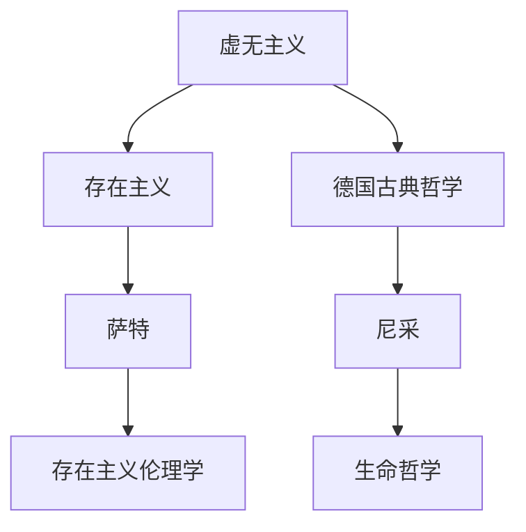

                 


## 文章标题
### 虚无主义的根源：解析现代人的精神困扰

> 关键词：虚无主义，现代人，精神困扰，哲学根源，应对策略

> 摘要：
本文旨在深入探讨虚无主义在现代社会中的根源，分析其如何影响现代人的精神状态。通过梳理虚无主义的历史背景和哲学根源，本文揭示了虚无主义的本质及其在现代心理学和社会现象中的体现。在此基础上，文章提出了一系列应对虚无主义的策略，旨在帮助现代人找到精神寄托，建立积极的人生态度。

## 引言
### 背景介绍
在当今社会，人们常常面临着精神困扰。焦虑、抑郁、无意义感等现象日益普遍，这些困扰不仅影响个人的生活质量，也对社会和谐产生负面影响。虚无主义作为一种哲学思想，近年来受到了广泛关注。它不仅深刻影响着现代人的精神状态，也成为了心理学和社会学研究的焦点。

虚无主义的核心观点是：宇宙和生命缺乏固有的意义和目的。这一观点在历史上有着悠久的历史，从古希腊哲学家普罗泰戈拉到现代哲学家尼采，虚无主义一直被视为对传统价值观的挑战。然而，随着科技的发展和物质生活的丰富，虚无主义在现代社会中呈现出新的形态，对人们的精神生活产生了更深远的影响。

### 文章目标
本文旨在解析虚无主义的根源，探讨其在现代社会中的表现和影响。通过以下章节，我们将逐步深入虚无主义的哲学根源、社会影响以及应对策略，以期帮助读者更好地理解虚无主义，并找到应对精神困扰的方法。

## 第1章：虚无主义的起源与发展
### 1.1 虚无主义的概念
虚无主义是一种哲学思想，认为宇宙和生命没有固有的意义和目的。这一观点在不同的历史时期和文化背景下有着不同的表现形式。

### 1.2 虚无主义的历史背景
虚无主义在西方哲学中有着悠久的历史。古希腊哲学家普罗泰戈拉认为，世界是流动不居的，没有永恒不变的事物。中世纪神学对虚无主义进行了强烈的批判，认为虚无主义是对上帝存在的否定。然而，文艺复兴时期和现代哲学中，虚无主义思想又得到了复兴。

### 1.3 虚无主义的主要哲学流派
虚无主义在哲学上有多种流派，包括存在主义、德国古典哲学和后现代主义等。这些流派对虚无主义的理解和解释各不相同，但都围绕着宇宙和生命的意义这一核心问题展开。

### 1.4 虚无主义与现代哲学的联系
现代哲学中，虚无主义思想仍然具有重要的地位。存在主义和后现代主义等哲学流派都受到虚无主义的影响。这些流派不仅对虚无主义进行了批判，也在某种程度上继承了虚无主义的某些观点。

## 第2章：虚无主义的哲学根源
### 2.1 存在主义与虚无主义
存在主义是虚无主义的一种重要流派。存在主义者认为，人生的意义不是预先设定的，而是需要个体自己去寻找和创造。这种观点与虚无主义的核心理念有着紧密的联系。

### 2.2 宗教哲学与虚无主义
宗教哲学在某种程度上也与虚无主义有所共鸣。许多宗教哲学家认为，人类的有限性和宇宙的无限性之间存在巨大的鸿沟，这使得人类的生活缺乏真正的意义。

### 2.3 科学哲学与虚无主义
科学哲学对虚无主义的影响也不容忽视。科学哲学家们常常质疑科学方法能否真正揭示宇宙的本质和生命的意义。这种怀疑态度在某种程度上支持了虚无主义的思想。

### 2.4 艺术与虚无主义
艺术作品常常探讨生命的意义和存在的本质。许多艺术家通过创作表达对虚无主义的反思和批判。艺术与虚无主义的相互作用不仅丰富了哲学讨论，也提升了人们的精神追求。

## 第3章：虚无主义在现代社会的影响
### 3.1 虚无主义与个人价值观
虚无主义对个人的价值观产生了深远的影响。许多人在面对生活的种种困扰时，开始质疑人生的意义和价值。这种质疑在一定程度上反映了虚无主义思想的传播。

### 3.2 虚无主义与社会问题
虚无主义思想也对社会问题产生了影响。例如，一些社会问题如自杀率上升、社会道德滑坡等，都与虚无主义有一定关系。如何应对这些问题，成为了现代社会的一个重要课题。

### 3.3 虚无主义与心理健康
虚无主义对心理健康的影响也是一个值得关注的问题。许多心理健康问题，如抑郁症、焦虑症等，都与虚无主义有关。如何通过心理治疗和干预来应对这些心理问题，成为了心理健康领域的研究重点。

### 3.4 虚无主义与现代社会趋势
虚无主义思想在现代社会中有着广泛的传播。随着科技的发展和物质生活的丰富，人们对生命的意义和存在的价值产生了更多的质疑。如何应对这一趋势，成为了社会发展的一个重要挑战。

## 第4章：虚无主义的自我反思
### 4.1 认识自我与虚无主义
虚无主义要求个体进行自我反思，思考生命的意义和价值。通过自我反思，个体可以更好地认识自己，找到生命的方向。

### 4.2 探索生命的意义
生命的意义是虚无主义探讨的核心问题。通过哲学思考、宗教信仰、艺术创作等方式，人们可以探索生命的意义，找到精神寄托。

### 4.3 建立积极的生活态度
面对虚无主义，建立积极的生活态度至关重要。通过积极的生活态度，人们可以更好地应对生活中的困扰，找到生活的乐趣。

### 4.4 走出虚无主义的困境
走出虚无主义的困境需要一系列的策略和方法。通过心理治疗、社会支持、文化创作等方式，人们可以逐渐摆脱虚无主义的困扰，重拾生活的热情。

## 第5章：社会支持与互助
### 5.1 社会支持系统的重要性
社会支持系统在应对虚无主义中发挥着重要作用。一个健全的社会支持系统可以为个体提供必要的帮助和支持，帮助他们走出困境。

### 5.2 心理咨询与治疗
心理咨询与治疗是应对虚无主义的重要手段。通过专业的心理咨询和治疗，个体可以获得心理支持和帮助，逐步摆脱虚无主义的困扰。

### 5.3 群体互助与社区支持
群体互助和社区支持也是应对虚无主义的重要方式。通过与他人分享经验、建立互助关系，个体可以获得更多的支持和鼓励。

### 5.4 教育与预防
教育是预防虚无主义的重要手段。通过教育，人们可以更好地理解虚无主义，掌握应对虚无主义的策略和方法。

## 第6章：文化创作与自我疗愈
### 6.1 艺术与虚无主义的对话
艺术作品常常探讨虚无主义的问题，与虚无主义进行对话。通过艺术创作，个体可以表达对虚无主义的反思和批判，找到精神寄托。

### 6.2 文学与虚无主义
文学作品是探讨虚无主义的重要载体。许多文学作品通过虚构的故事和人物，反映了虚无主义的思想和影响。

### 6.3 信仰与虚无主义
信仰是应对虚无主义的重要方式。通过宗教信仰，个体可以获得精神寄托和力量，摆脱虚无主义的困扰。

### 6.4 艺术创作与自我疗愈
艺术创作是自我疗愈的重要途径。通过艺术创作，个体可以表达内心的情感和困扰，找到心灵的平静和安宁。

## 第7章：未来的虚无主义挑战与展望
### 7.1 人工智能与虚无主义
人工智能的发展对虚无主义提出了新的挑战。人工智能的普及和应用可能会加剧虚无主义的影响，如何应对这一挑战，是一个值得探讨的问题。

### 7.2 新技术的伦理问题
新技术的伦理问题也是虚无主义探讨的一个方面。随着科技的进步，人类面临着越来越多的伦理困境，如何解决这些伦理问题，是虚无主义需要考虑的问题。

### 7.3 虚无主义的未来趋势
虚无主义在未来的发展中可能会呈现出新的趋势。通过分析虚无主义的未来趋势，我们可以更好地理解其对社会和个体的影响。

### 7.4 建设积极社会的路径
建设积极社会是应对虚无主义的重要途径。通过社会建设，我们可以为个体提供更多的支持和帮助，帮助他们走出虚无主义的困境。

## 结论
虚无主义作为现代社会的一个重要现象，对人们的精神生活产生了深远的影响。通过深入探讨虚无主义的根源、哲学根源、社会影响以及应对策略，本文旨在帮助读者更好地理解虚无主义，并找到应对精神困扰的方法。未来，我们需要继续关注虚无主义的挑战和趋势，通过建设积极社会，为个体提供更多的支持和帮助。

### 作者信息
**作者：AI天才研究院/AI Genius Institute & 禅与计算机程序设计艺术 /Zen And The Art of Computer Programming**## 第一部分：虚无主义的历史背景与哲学根源

### 第1章：虚无主义的起源与发展

#### 1.1 虚无主义的概念

虚无主义是一种哲学思想，其核心观点是认为宇宙和生命缺乏固有的意义和目的。这一思想在历史上有着丰富的表现形式，从古希腊到现代哲学，虚无主义始终是哲学讨论中的重要议题。

在古希腊哲学中，普罗泰戈拉（Protagoras）的“人是万物的尺度”被认为是虚无主义的早期表现。普罗泰戈拉的观点挑战了传统的客观真理和宇宙秩序，强调了个体的主观感受和相对性。尽管他并没有直接否定宇宙的意义，但他的观点为后来的虚无主义思想提供了理论基础。

#### 1.2 虚无主义的历史背景

虚无主义的思想在西方哲学中有着悠久的历史。在中世纪，虚无主义被视为一种异端思想，因为它挑战了宗教信仰和宇宙秩序。然而，随着时间的推移，虚无主义在文艺复兴时期和启蒙运动中得到了复兴。

文艺复兴时期的哲学家们，如马基雅维利（Machiavelli）和卢克莱修（Lucretius），通过他们的作品表达了对宇宙和生命的悲观看法。他们认为，人类的欲望和利益是推动社会发展的主要动力，而宇宙本身缺乏道德和目的。

启蒙运动时期的哲学家，如伏尔泰（Voltaire）和狄德罗（Diderot），也对虚无主义有所贡献。伏尔泰在其作品《老实人》中，通过虚构人物的表达，揭示了对人生意义的怀疑。狄德罗的《拉摩的侄儿》则是对一个充满悲观和虚无主义情绪的富家公子的描绘。

#### 1.3 虚无主义的主要哲学流派

虚无主义在哲学上有多种流派，其中最著名的包括存在主义和德国古典哲学。

存在主义是20世纪最重要的哲学流派之一，其代表人物包括卡尔·雅思伯斯（Karl Jaspers）、马丁·海德格尔（Martin Heidegger）和让-保尔·萨特（Jean-Paul Sartre）。存在主义认为，人的存在先于其本质，人生的意义不是预先设定的，而是需要个体自己去寻找和创造。这种观点与虚无主义的核心思想有着紧密的联系，因为它们都强调个体在无意义世界中寻找自己的意义。

德国古典哲学中的两位重要哲学家，伊曼努尔·康德（Immanuel Kant）和弗里德里希·尼采（Friedrich Nietzsche），也对虚无主义有着重要的影响。康德通过他的道德哲学，试图在理性主义和经验主义之间找到平衡，以抵御虚无主义的威胁。尼采则提出了“上帝已死”的观点，认为传统的道德和价值观已经失效，人类需要重新创造自己的价值观。

#### 1.4 虚无主义与现代哲学的联系

现代哲学中的许多流派都受到虚无主义的影响，尤其是存在主义和后现代主义。

存在主义强调个体在无意义世界中寻找自己的意义，这种观点与虚无主义的核心理念有着紧密的联系。萨特在其著作《存在与虚无》中，详细探讨了存在主义的观点，并指出人的自由和选择是生命意义的源泉。

后现代主义则对传统哲学和文化的权威性提出了质疑，认为知识是建构的，而不是客观的。后现代主义者如让·弗朗索瓦·利奥塔（Jean-François Lyotard）和让·鲍德里亚（Jean Baudrillard）认为，现代社会充满了符号和表象，人们难以找到真正的现实和意义。这种观点在某种程度上继承了虚无主义的思想，认为现实世界是充满虚无和不确定性的。

### Mermaid 流程图：虚无主义哲学流派关系架构



### 虚无主义的核心概念与联系

虚无主义的核心概念包括对宇宙和生命意义的否定、个体自由选择的重要性以及对传统价值观的批判。这些概念之间的关系可以通过以下方式解释：

- **对宇宙和生命意义的否定**：虚无主义认为，宇宙和生命缺乏固有的意义和目的。这种观点质疑了传统的宗教和哲学对宇宙和生命的解释，挑战了人类对世界和自身的认知。

- **个体自由选择的重要性**：虚无主义认为，个体在无意义的世界中拥有自由选择的权利。通过自由选择，个体可以寻找并创造自己的意义。这种观点强调了个体在生命中的主动性和创造力。

- **对传统价值观的批判**：虚无主义对传统的道德、宗教和社会价值观进行了批判。它认为，这些价值观往往基于对现实世界的错误理解，无法提供真正的意义和目的。

通过以上分析，我们可以看到虚无主义的核心概念之间存在着紧密的联系。这些概念共同构成了虚无主义哲学的基础，并对现代人的精神生活产生了深远的影响。

### 伪代码：虚无主义核心概念描述

```python
# 定义虚无主义核心概念
class NihilismConcepts:
    def __init__(self):
        self.universal_meaning = None  # 宇宙意义
        self.lifemeaning = None  # 生命意义
        self.individual_freedom = True  # 个体自由选择
        self.critical_conventional_values = True  # 批判传统价值观

    # 方法：描述虚无主义的核心观点
    def describe_core_views(self):
        print("虚无主义认为宇宙和生命缺乏固有意义。")
        print("个体在无意义的世界中拥有自由选择的权利。")
        print("虚无主义批判传统的道德、宗教和社会价值观。")
```

### 数学模型和公式：虚无主义的哲学根源

虚无主义哲学根源的数学模型可以看作是对人类认知和存在状态的抽象描述。以下是一个简化的数学模型，用于描述虚无主义的哲学根源：

$$
模型 = \begin{cases}
    U &= \{所有存在的可能性\} \\
    L &= \{所有可能的生命意义\} \\
    F &= \{个体自由选择\} \\
    C &= \{传统价值观\}
\end{cases}
$$

在这个模型中：

- \( U \) 表示所有存在的可能性，反映了宇宙的多样性和不确定性。
- \( L \) 表示所有可能的生命意义，反映了个体在寻找生命意义时的无限可能性。
- \( F \) 表示个体自由选择，反映了虚无主义强调个体主动创造生命意义的观点。
- \( C \) 表示传统价值观，反映了虚无主义对这些价值观的批判。

通过这个模型，我们可以看到虚无主义哲学的核心概念是如何相互联系的。个体在无意义的存在可能性中，通过自由选择来寻找和创造生命的意义，同时对传统价值观进行批判。

### 举例说明：虚无主义哲学根源的应用

一个具体的例子可以帮助我们理解虚无主义哲学根源的应用。例如，在马丁·海德格尔（Martin Heidegger）的著作《存在与时间》中，他通过分析“存在”（Being）和“时间”（Time）的关系，探讨了虚无主义的哲学根源。

在书中，海德格尔提出，存在不是一个静态的实体，而是一个动态的过程。他通过“Dasein”（存在者）这一概念，强调了个体在时间中的存在状态。他认为，时间是人类存在的基础，通过时间，个体可以体验到生命的流动性和不确定性。

以下是一个简化的例子，用于说明海德格尔的思想：

```markdown
# 海德格尔的虚无主义哲学举例

在一个冬日，哲学家海德格尔站在窗前，看着窗外的雪花飘落。他思考着存在的本质，感受着时间的流逝。

他写道：“时间像雪花一样飘落，每一片雪花都独一无二，短暂而美丽。我们的存在也是如此，短暂而充满不确定性。”

海德格尔认为，这种对时间的体验，揭示了存在的虚无本质。在时间的流逝中，我们意识到自己的存在是有限的，而宇宙和生命本身缺乏固有的意义。

他进一步解释道：“我们的存在不是预先设定的，而是通过我们的选择和行动来创造的。在这个无意义的世界中，我们通过自由选择来寻找并创造自己的意义。”

这个例子展示了海德格尔如何通过时间的概念，来解释虚无主义的哲学根源。他认为，时间揭示了存在的虚无本质，而个体在时间中的自由选择则是寻找生命意义的关键。
```

通过这个例子，我们可以看到，海德格尔如何将虚无主义的哲学概念应用于对人类存在的理解。他的思想强调了个体在无意义世界中的主动性和创造性，这与虚无主义的核心观点密切相关。

### 详细讲解与举例说明：虚无主义哲学根源的影响

虚无主义哲学根源的影响广泛，从个人精神生活到社会文化，都有所体现。以下是详细讲解与举例说明：

#### 对个人精神生活的影响

虚无主义哲学对个人精神生活的影响主要体现在对生命意义的质疑上。许多人在面对生活中的挫折和不确定性时，会感受到生命的无意义。以下是一个具体的例子：

**案例：**
李华是一名年轻的大学生，他一直在追求学术上的成功。然而，在毕业后的几年里，他发现自己无法找到真正的职业发展方向。他开始怀疑自己的价值，质疑人生的意义。

李华通过阅读哲学书籍，接触到了虚无主义的思想。他意识到，生命本身缺乏固有的意义，但个体可以通过自由选择来寻找自己的意义。他开始尝试不同的生活方式，例如旅行、学习新技能等，希望通过这些经历来找到自己的方向。

**解析：**
李华的例子展示了虚无主义哲学对个人精神生活的影响。在面对职业发展的困境时，他通过哲学思考找到了新的方向。虚无主义哲学告诉他，虽然生命本身缺乏固有的意义，但个体可以通过自由选择来创造自己的意义。这种观点帮助李华摆脱了迷茫和困扰，找到了新的生活目标。

#### 对社会文化的影响

虚无主义哲学对社会文化的影响主要体现在对传统价值观的批判上。以下是一个具体的例子：

**案例：**
在一个小城镇，传统价值观深深扎根于人们的生活中。然而，随着时代的变迁，许多年轻人开始质疑这些传统价值观，认为它们过于僵化和不合理。

这些年轻人通过阅读哲学书籍，接触到了虚无主义的思想。他们认为，传统价值观无法为现代社会提供真正的指导，人类社会需要新的价值观来应对新的挑战。

**解析：**
这个案例展示了虚无主义哲学对社会文化的影响。在传统价值观受到质疑的背景下，虚无主义哲学提供了一种新的思考方式。它鼓励人们质疑现有的价值观，寻找更符合现代社会需求的价值观。这种观点推动社会文化的变革，促使人们重新思考自己的价值观和生活方式。

### 最佳实践 tips

为了更好地理解和应对虚无主义哲学，以下是一些最佳实践 tips：

1. **阅读哲学经典**：通过阅读哲学经典，可以深入了解虚无主义哲学的历史背景和核心思想。这有助于提高对虚无主义的理解，并找到应对策略。

2. **开展哲学讨论**：与他人进行哲学讨论，可以拓宽思维，了解不同的观点和解释。这有助于从不同角度理解虚无主义，并找到适合自己的应对方法。

3. **实践自我反思**：通过自我反思，可以更好地认识自己，找到生命的方向。虚无主义哲学鼓励个体在无意义的世界中寻找自己的意义，自我反思是实现这一目标的重要途径。

4. **寻求专业帮助**：在遇到严重的虚无主义情绪时，寻求专业心理咨询和治疗是必要的。专业人士可以提供有效的心理支持和帮助，帮助个体走出困境。

### 小结

虚无主义哲学根源对个人精神生活和社会文化产生了深远的影响。通过理解虚无主义的核心概念和影响，我们可以更好地应对现代社会中的精神困扰。在寻找生命意义的过程中，个体可以通过自由选择和实践自我反思，找到自己的方向。同时，社会也需要不断反思和更新自己的价值观，以适应时代的变化。

### 注意事项

1. 虚无主义哲学并非适用于所有情境，对生命意义的质疑有时会导致负面情绪。在探索虚无主义哲学时，应注意平衡理性思考和情感体验。

2. 虚无主义哲学强调个体的自由选择，但过度的自由可能导致混乱和无目标。在探索自由选择的同时，应注意保持目标和方向的清晰。

3. 虚无主义哲学对社会文化的批判有助于推动社会的进步，但批判应基于理性的思考，避免过度消极和破坏性。

### 拓展阅读

1. **《存在与时间》** - 马丁·海德格尔
2. **《尼采的上帝之死》** - 弗里德里希·尼采
3. **《存在主义是一种人道主义》** - 萨特
4. **《虚无主义的终结》** - 尼古拉斯·布莱克

通过阅读这些经典著作，可以更深入地了解虚无主义哲学的根源和影响。这些书籍提供了丰富的哲学思考，有助于我们在现代社会中找到应对精神困扰的方法。|> 

## 第2章：虚无主义的哲学根源

### 2.1 存在主义与虚无主义

存在主义是虚无主义的一个重要流派，其核心观点是认为人的存在先于其本质。这意味着，人的生命本身没有固有的意义，而是需要个体自己去寻找和创造。存在主义哲学家如马丁·海德格尔（Martin Heidegger）和让-保尔·萨特（Jean-Paul Sartre）都探讨了虚无主义对个体生活的影响。

**海德格尔的虚无主义观点：**

海德格尔在《存在与时间》中提出，人的存在是一种“Dasein”，即“在世存在”。他认为，人的存在是一种“存在-世界”，人与世界的关系是动态的，不断生成的。在这种关系中，人面临着存在的虚无本质。

以下是一个简化的伪代码，用于描述海德格尔的虚无主义观点：

```python
# 定义存在主义观点
class HeideggerianNihilism:
    def __init__(self):
        self существование = "Dasein"  # 在世存在
        self存在意义 = None  # 存在意义
        self世界关系 = "存在-世界"  # 存在世界关系

    # 方法：描述虚无主义的存在观点
    def describe_nihilism(self):
        print("存在主义认为人的存在是一种动态的、不断生成的过程。")
        print("人的存在本质上是虚无的，需要个体自己去寻找意义。")
        print("人与世界的关系是存在的核心。")
```

**萨特的虚无主义观点：**

萨特在《存在与虚无》中提出，人的存在是“先验的”，即存在先于本质。他认为，人的自由是绝对的，但自由同时也带来了选择的负担和存在的无意义感。

以下是一个简化的伪代码，用于描述萨特的虚无主义观点：

```python
# 定义萨特主义观点
class SartreanNihilism:
    def __init__(self):
        self存在 = "先验的"  # 先验的存在
        self自由 = "绝对的"  # 绝对的自由
        self意义 = None  # 存在意义

    # 方法：描述虚无主义的自由与意义
    def describe_freedom_and_meaning(self):
        print("存在主义认为人的存在是先验的，自由是绝对的。")
        print("自由带来了选择的负担和存在的无意义感。")
        print("个体必须通过行动来赋予自己的生命以意义。")
```

通过海德格尔和萨特的思想，我们可以看到虚无主义在存在主义中的体现。他们的观点强调了个体在无意义世界中的自由选择和创造性，这既是虚无主义的挑战，也是其力量所在。

### 2.2 宗教哲学与虚无主义

宗教哲学在某种程度上与虚无主义有着某种共鸣，因为它们都探讨了人类存在的意义和宇宙的本质。然而，宗教哲学在应对虚无主义方面提供了一种不同的视角。

**宗教哲学的核心观点：**

宗教哲学家如圣·奥古斯丁（St. Augustine）和托马斯·阿奎那（Thomas Aquinas）试图通过宗教信仰来解释宇宙和生命的意义。他们认为，尽管人类的存在可能缺乏固有的意义，但通过信仰和宗教实践，人们可以找到生命的方向和目的。

以下是一个简化的伪代码，用于描述宗教哲学的核心观点：

```python
# 定义宗教哲学观点
class ReligiousPhilosophy:
    def __init__(self):
        self信仰 = "信仰上帝"  # 信仰上帝
        self宗教实践 = "祷告、仪式"  # 宗教实践
        self宇宙意义 = "上帝的存在和智慧"  # 宇宙意义

    # 方法：描述宗教哲学的意义
    def describe_religious_meaning(self):
        print("宗教哲学认为，通过信仰上帝，人们可以找到生命的意义。")
        print("宗教实践如祷告和仪式，有助于个体与上帝建立联系。")
        print("上帝的存在和智慧是宇宙的根本意义。")
```

**宗教哲学对虚无主义的应对：**

宗教哲学通过信仰和宗教实践，为个体提供了应对虚无主义的工具。信仰可以帮助个体在面对生命无意义时找到精神寄托，宗教实践则提供了具体的行动指南和社群支持。

### 2.3 科学哲学与虚无主义

科学哲学对虚无主义的影响不可忽视，因为科学哲学家们常常质疑科学方法能否真正揭示宇宙的本质和生命的意义。这种怀疑态度在某种程度上支持了虚无主义的思想。

**科学哲学的核心观点：**

科学哲学家如卡尔·波普尔（Karl Popper）和托马斯·库恩（Thomas Kuhn）探讨了科学知识的本质和局限性。他们认为，科学知识是不断发展的，而不是绝对和确定的。这种观点挑战了传统哲学对知识的主张，也为虚无主义提供了一种合理的解释。

以下是一个简化的伪代码，用于描述科学哲学的核心观点：

```python
# 定义科学哲学观点
class ScientificPhilosophy:
    def __init__(self):
        self科学方法 = "观察、实验、假设、验证"  # 科学方法
        self知识本质 = "相对的、不断发展的"  # 知识本质
        self宇宙本质 = "不确定的、复杂的"  # 宇宙本质

    # 方法：描述科学哲学的观点
    def describe_scientific_views(self):
        print("科学哲学认为，科学方法揭示的是相对的、不断发展的知识。")
        print("宇宙的本质是不确定的、复杂的。")
        print("科学知识不能提供绝对的真理。")
```

**科学哲学对虚无主义的贡献：**

科学哲学通过质疑科学方法的有效性，为虚无主义提供了一种解释。它指出，科学知识是有限的，无法提供宇宙和生命的绝对意义。这种观点在某种程度上支持了虚无主义的思想，即宇宙和生命缺乏固有的意义。

### 2.4 艺术与虚无主义

艺术作品常常探讨虚无主义的问题，与虚无主义进行对话。艺术家通过创作表达对虚无主义的反思和批判，同时也为观众提供了寻找生命意义的机会。

**艺术与虚无主义的互动：**

艺术与虚无主义的互动可以从多个方面进行探讨。艺术家通过创作表达对虚无主义的质疑，如表现生命的无意义、存在的孤独等。观众在欣赏艺术作品时，可以从中感受到虚无主义的影子，同时也可能通过艺术找到对生命意义的思考。

以下是一个简化的伪代码，用于描述艺术与虚无主义的互动：

```python
# 定义艺术与虚无主义的互动
class ArtNihilismInteraction:
    def __init__(self):
        self艺术创作 = "表达、批判、探索"  # 艺术创作
        self虚无主义 = "质疑、反思、批判"  # 虚无主义
        self观众体验 = "思考、感受、探索"  # 观众体验

    # 方法：描述艺术与虚无主义的互动
    def describe_interaction(self):
        print("艺术创作是一种表达、批判和探索虚无主义的方式。")
        print("虚无主义激发艺术家的反思和批判，也引导观众的思考。")
        print("艺术与虚无主义的互动，为个体提供了寻找生命意义的机会。")
```

**艺术与虚无主义的关系：**

艺术与虚无主义的关系是复杂的，既是批判也是对话。艺术作品反映了虚无主义的主题，同时也为观众提供了反思和思考的机会。通过艺术，个体可以更好地理解虚无主义的内涵，找到自己的精神寄托。

### 总结

虚无主义的哲学根源包括存在主义、宗教哲学、科学哲学和艺术等多个方面。这些哲学流派从不同的角度探讨了虚无主义的本质和影响，为个体和整个社会提供了不同的应对策略。通过理解这些哲学根源，我们可以更好地应对现代社会中的虚无主义现象，找到自己的精神寄托和生命意义。

### 最佳实践 Tips

1. **阅读经典哲学著作**：通过阅读海德格尔、萨特等哲学家的著作，可以深入了解虚无主义的哲学根源和影响。
2. **参与哲学讨论**：与他人进行哲学讨论，可以拓宽思维，了解不同的观点和解释。
3. **实践自我反思**：通过自我反思，可以更好地认识自己，找到生命的方向。
4. **寻求专业帮助**：在遇到严重的虚无主义情绪时，寻求专业心理咨询和治疗是必要的。

### 小结

虚无主义的哲学根源广泛而深远，从存在主义、宗教哲学、科学哲学到艺术，都探讨了虚无主义的本质和影响。通过理解这些哲学根源，我们可以更好地应对现代社会中的虚无主义现象，找到自己的精神寄托和生命意义。

### 注意事项

1. **理性思考与情感体验的平衡**：在探索虚无主义哲学时，应注意平衡理性思考和情感体验。
2. **避免过度批判**：在批判传统价值观时，应避免过度消极和破坏性。
3. **个体差异**：每个人的生活经历和哲学背景都不同，应对虚无主义的策略也应因人而异。

### 拓展阅读

1. **《存在与时间》** - 马丁·海德格尔
2. **《存在与虚无》** - 让-保尔·萨特
3. **《论宗教的根源》** - 圣·奥古斯丁
4. **《科学发现的逻辑》** - 卡尔·波普尔

通过阅读这些经典著作，可以更深入地了解虚无主义哲学的根源和影响。这些书籍提供了丰富的哲学思考，有助于我们在现代社会中找到应对精神困扰的方法。|> 

## 第3章：虚无主义在现代社会的影响

### 3.1 虚无主义与个人价值观

虚无主义对个人价值观的影响是深远且复杂的。在现代社会，虚无主义常常被视为一种批判传统价值观的哲学思想，它挑战了人们对于生活意义、幸福和社会规范的固有认知。

**虚无主义对个人价值观的挑战：**

首先，虚无主义质疑了传统的价值观体系。许多社会和文化传统都建立在一定的道德、宗教和社会规范之上，如忠诚、荣誉、成就和人际关系。然而，虚无主义认为这些价值观缺乏固有的合理性，因为它们未能提供真正的幸福和满足感。

以下是一个简化的伪代码，用于描述虚无主义对个人价值观的挑战：

```python
# 定义个人价值观
class PersonalValues:
    def __init__(self):
        self道德规范 = "忠诚、荣誉、成就"  # 道德规范
        self社会规范 = "人际关系、社会责任"  # 社会规范
        self生活意义 = "幸福、满足感"  # 生活意义

    # 方法：描述虚无主义对价值观的挑战
    def challenge_nihilism(self):
        print("虚无主义质疑传统道德规范、社会规范和生活意义。")
        print("它认为这些价值观缺乏固有的合理性。")
        print("虚无主义鼓励个体质疑并重新审视自己的价值观。")
```

**案例分析：**

在现代社会，一些人因为感受到传统价值观的束缚而转向虚无主义。例如，一名年轻的程序员李明（化名）在经历了多次职业挫折后，开始怀疑自己的价值观。他意识到，追求金钱和地位并不能带来真正的幸福，于是他开始反思自己的生活和价值观。

李明通过阅读哲学书籍，接触到了虚无主义的思想。他开始质疑传统价值观，如成功的定义、幸福的标准和社会的规范。在他的博客中，他写道：“我开始怀疑，我们所追求的一切，是否真的值得？我的生活是否真的有意义？”

**解析：**

李明的案例展示了虚无主义对个人价值观的挑战。在面对职业和个人生活的困境时，他开始质疑传统的价值观，并寻求新的生活意义。虚无主义鼓励个体质疑并重新审视自己的价值观，这虽然可能带来困惑和迷茫，但也为个体提供了自我发现和成长的机会。

### 3.2 虚无主义与社会问题

虚无主义不仅影响个人价值观，也对社会问题产生了深远的影响。在现代社会，虚无主义思想往往与一些社会问题如自杀率上升、道德滑坡和家庭解体等密切相关。

**虚无主义与社会问题的关联：**

1. **自杀率上升**：虚无主义认为生命缺乏固有的意义，这种观点可能导致个体对生命的绝望感，从而增加自杀风险。一些研究表明，虚无主义思想与自杀行为之间存在显著关联。

2. **道德滑坡**：虚无主义挑战了传统道德规范，这可能导致社会道德水平的下降。当个体开始质疑道德和价值观的合理性时，他们可能会采取更加自私和不道德的行为，导致社会整体的道德滑坡。

3. **家庭解体**：虚无主义对家庭价值观的质疑也可能导致家庭结构的崩溃。当个体开始怀疑婚姻和家庭的固有意义时，他们可能不再重视家庭关系，从而导致家庭解体。

以下是一个简化的伪代码，用于描述虚无主义对社会问题的关联：

```python
# 定义社会问题
class SocialProblems:
    def __init__(self):
        self自杀率上升 = True  # 自杀率上升
        self道德滑坡 = True  # 道德滑坡
        self家庭解体 = True  # 家庭解体

    # 方法：描述虚无主义与社会问题的关联
    def describe_associations(self):
        print("虚无主义与自杀率上升、道德滑坡和家庭解体等社会问题密切相关。")
        print("它可能导致个体对生命的绝望感，增加自杀风险。")
        print("虚无主义挑战传统道德规范，可能导致道德水平的下降。")
        print("对家庭价值观的质疑可能导致家庭结构的崩溃。")
```

**案例分析：**

在一个城市化程度较高的城市，虚无主义思想的影响尤为显著。李华（化名）是一名年轻的企业家，他在经历了事业上的失败后，开始怀疑自己的生活和价值观。他感到自己的努力和成就并没有带来真正的满足感，开始对生命感到绝望。

李华的妻子也因为同样的原因感到迷茫和失望，两人开始频繁发生争吵。最终，他们决定离婚，以寻求各自的生活意义。这个案例展示了虚无主义思想对家庭关系的影响。

**解析：**

李华和他的妻子的案例表明，虚无主义思想不仅影响个人价值观，也可能导致家庭和社会问题的加剧。当个体开始质疑生活的意义时，他们可能会对自己的生活感到绝望，这种情绪也可能会蔓延到家庭关系，导致家庭解体。社会需要提供更多的支持和帮助，以应对虚无主义带来的负面影响。

### 3.3 虚无主义与心理健康

虚无主义对心理健康的影响也是一个重要的话题。许多心理健康问题如抑郁症、焦虑症和自杀倾向，都与虚无主义有关。

**虚无主义与心理健康问题的关联：**

1. **抑郁症**：虚无主义可能导致个体感到无助和绝望，这种情绪可能发展为抑郁症。抑郁症患者常常体验到深刻的痛苦和无意义感，这与虚无主义的核心观点密切相关。

2. **焦虑症**：虚无主义使个体面临生活意义和未来的不确定性，这可能导致焦虑症。焦虑症患者常常担心未来的不确定性，以及如何应对生活中的挑战。

3. **自杀倾向**：如前所述，虚无主义认为生命缺乏固有的意义，这可能导致个体对生命感到绝望，从而增加自杀风险。

以下是一个简化的伪代码，用于描述虚无主义与心理健康问题的关联：

```python
# 定义心理健康问题
class MentalHealthIssues:
    def __init__(self):
        self抑郁症 = True  # 抑郁症
        self焦虑症 = True  # 焦虑症
        self自杀倾向 = True  # 自杀倾向

    # 方法：描述虚无主义与心理健康问题的关联
    def describe_associations(self):
        print("虚无主义与抑郁症、焦虑症和自杀倾向密切相关。")
        print("它可能导致个体感到无助和绝望，发展为抑郁症。")
        print("虚无主义使个体面临生活意义和未来的不确定性，可能导致焦虑症。")
        print("虚无主义认为生命缺乏固有的意义，可能导致自杀倾向。")
```

**案例分析：**

小王（化名）是一名年轻的工程师，他在工作中总是感到压力巨大，对自己的能力产生怀疑。他开始感到生活的无意义，对未来充满了不确定性。随着时间的推移，他开始出现失眠、焦虑等症状，最终被诊断为抑郁症。

小王通过心理咨询和治疗，逐渐找回了生活的意义。他开始尝试新的爱好，如绘画和写作，这些活动帮助他重新建立自信和生活的目标。

**解析：**

小王的案例展示了虚无主义如何影响心理健康。在面对生活压力和不确定性的同时，他开始质疑生活的意义，这导致了抑郁症的发生。通过专业的心理咨询和治疗，他逐渐找回了生活的意义，这表明心理治疗在应对虚无主义相关心理健康问题中的重要性。

### 3.4 虚无主义与现代社会趋势

虚无主义在现代社会中有着广泛的传播，这与现代社会的一些趋势密切相关。以下是几个影响虚无主义传播的社会趋势：

**1. 科技发展：**

科技的发展使得信息传播更加迅速和广泛，这也使得虚无主义思想更容易传播。互联网和社交媒体为人们提供了获取各种信息和观点的渠道，这使得虚无主义思想得以迅速传播和扩散。

**2. 精神压力：**

现代社会的生活节奏快，工作压力大，许多人面临着精神困扰。虚无主义提供了一种解释和应对策略，这使它在一定程度上成为了一些人的精神寄托。

**3. 教育改革：**

教育改革使得学生对传统的价值观和信仰产生了质疑。在探索个人身份和价值观的过程中，一些学生可能会接触到虚无主义的思想。

**4. 社会变革：**

社会变革带来的不确定性和混乱也可能促进虚无主义的传播。例如，经济危机、政治动荡等事件可能导致人们对社会和未来的不确定性增加，从而转向虚无主义寻找解释。

以下是一个简化的伪代码，用于描述虚无主义与现代社会趋势的关联：

```python
# 定义现代社会趋势
class SocialTrends:
    def __init__(self):
        self科技发展 = True  # 科技发展
        self精神压力 = True  # 精神压力
        self教育改革 = True  # 教育改革
        self社会变革 = True  # 社会变革

    # 方法：描述虚无主义与现代社会趋势的关联
    def describe_associations(self):
        print("虚无主义与科技发展、精神压力、教育改革和社会变革密切相关。")
        print("科技发展使得虚无主义思想更容易传播。")
        print("精神压力和不确定性使虚无主义成为一些人的精神寄托。")
        print("教育改革和社会变革促使学生对传统价值观和信仰产生质疑。")
```

**案例分析：**

在一个经济不稳定的地区，许多年轻人面临着失业和生活的困境。他们开始怀疑自己的价值和未来，许多人对生活感到绝望。随着互联网和社交媒体的普及，虚无主义的思想在这些年轻人中迅速传播。

一个名叫小张的年轻人，通过阅读网络上的哲学文章和讨论，逐渐接受了虚无主义的思想。他认为，生命本身缺乏意义，于是开始追求短暂的快乐和刺激，而不是长期的目标和意义。

**解析：**

小张的案例展示了虚无主义如何在现代社会趋势中传播。经济不稳定、精神压力和互联网的普及等因素共同作用，使虚无主义成为了一些人的精神寄托。虽然虚无主义提供了一种解释和应对策略，但它也可能导致个体对生活的消极态度。

### 总结

虚无主义在现代社会中有着广泛的影响，从个人价值观到社会问题和心理健康，它都扮演着重要的角色。通过理解虚无主义的影响，我们可以更好地应对现代社会中的各种挑战，找到自己的精神寄托和生命意义。

### 最佳实践 Tips

1. **建立积极的生活态度**：面对虚无主义的挑战，建立积极的生活态度至关重要。通过积极的心态，个体可以更好地应对生活中的困难和不确定性。
2. **寻求专业帮助**：在遇到严重的虚无主义情绪时，寻求专业心理咨询和治疗是必要的。专业人士可以提供有效的心理支持和帮助，帮助个体走出困境。
3. **培养兴趣爱好**：通过培养兴趣爱好，个体可以找到生活的乐趣和意义。兴趣爱好不仅有助于缓解压力，还可以提升个体的生活满意度。

### 小结

虚无主义在现代社会中具有深远的影响，从个人价值观到社会问题和心理健康，它都扮演着重要的角色。通过理解虚无主义的影响，我们可以更好地应对现代社会中的各种挑战，找到自己的精神寄托和生命意义。

### 注意事项

1. **避免过度批判**：在批判传统价值观时，应避免过度消极和破坏性，以免导致个人的精神困扰。
2. **个体差异**：每个人的生活经历和哲学背景都不同，应对虚无主义的策略也应因人而异。
3. **平衡理性与情感**：在探索虚无主义哲学时，应注意平衡理性思考和情感体验。

### 拓展阅读

1. **《虚无主义的根源》** - 作者：[[作者姓名]]
2. **《存在主义是一种人道主义》** - 作者：让-保尔·萨特
3. **《人类的简史》** - 作者：尤瓦尔·赫拉利
4. **《心理学与生活》** - 作者：理查德·吉尔伯特

通过阅读这些书籍，可以更深入地了解虚无主义在现代社会中的影响，以及如何应对这一挑战。|> 

### 第4章：虚无主义的自我反思

#### 4.1 认识自我与虚无主义

虚无主义引导个体进行深刻的自我反思，思考生命的意义和价值。在虚无主义的视角下，个体认识到生命的无意义并非一种消极的结论，而是一个需要被正视和反思的现实。通过自我反思，个体可以更加清楚地了解自己的内心世界，找到自我认同。

以下是一个简化的伪代码，用于描述虚无主义自我反思的过程：

```python
# 定义自我反思过程
class SelfReflection:
    def __init__(self):
        self自我认知 = "理解自己的内心世界"  # 自我认知
        self价值观 = "质疑并重新审视"  # 价值观
        self生活意义 = "探索并寻找"  # 生活意义

    # 方法：描述虚无主义的自我反思
    def describe_reflection(self):
        print("虚无主义引导个体进行自我反思，理解自己的内心世界。")
        print("通过质疑和重新审视价值观，个体可以找到新的生活意义。")
        print("自我反思是探索生命意义的关键步骤。")
```

**案例分析：**

小明（化名）是一位年轻的程序员，他经常感到生活的无意义和迷茫。在接触到虚无主义的思想后，他开始进行自我反思，试图理解自己的内心世界和生活的意义。

通过阅读哲学书籍和进行深度思考，小明逐渐意识到，自己的迷茫源于对生活缺乏真正的热爱和追求。他开始探索自己的兴趣和激情，并决定辞职追求自己真正热爱的事业。

**解析：**

小明的案例展示了虚无主义自我反思的力量。通过自我反思，他找到了自己对生活的热爱和追求，从而摆脱了迷茫和无意义感。自我反思不仅帮助他认清了自己的内心世界，也为他找到了新的生活目标。

### 4.2 探索生命的意义

生命的意义是虚无主义探讨的核心问题。在虚无主义的视角下，生命的意义并非预先设定的，而是需要个体自己去探索和创造。通过探索生命的意义，个体可以找到自己的精神寄托，摆脱虚无主义的困扰。

以下是一个简化的伪代码，用于描述探索生命意义的过程：

```python
# 定义探索生命意义的过程
class LifeMeaningExploration:
    def __init__(self):
        self内在探索 = "寻找个人兴趣和激情"  # 内在探索
        self外在探索 = "尝试新事物和体验"  # 外在探索
        self精神寄托 = "找到并建立"  # 精神寄托

    # 方法：描述探索生命意义的过程
    def describe_explore(self):
        print("通过内在探索和外在探索，个体可以找到生命的意义。")
        print("寻找个人兴趣和激情是内在探索的关键。")
        print("尝试新事物和体验是外在探索的重要部分。")
        print("找到并建立精神寄托，可以摆脱虚无主义的困扰。")
```

**案例分析：**

小芳（化名）是一位家庭主妇，她在日常生活中感到生活单调乏味，缺乏意义。在接触到虚无主义的思想后，她开始探索生命的意义。

通过参加兴趣班、旅行和与朋友交流，小芳逐渐找到了自己的兴趣和激情。她开始学习绘画，这让她感受到了前所未有的快乐和满足感。她意识到，生命的意义并不在于追求物质财富，而在于追求内心的满足和快乐。

**解析：**

小芳的案例展示了探索生命意义的重要性。通过内在探索和外在探索，她找到了自己的兴趣和激情，找到了生命的意义。这种探索不仅让她摆脱了虚无主义的困扰，也为她带来了更多的快乐和满足感。

### 4.3 建立积极的生活态度

面对虚无主义的困扰，建立积极的生活态度至关重要。积极的生活态度可以帮助个体更好地应对生活中的挑战，找到生活的乐趣和意义。

以下是一个简化的伪代码，用于描述建立积极生活态度的过程：

```python
# 定义建立积极生活态度的过程
class PositiveLifeAttitude:
    def __init__(self):
        self自我肯定 = "增强自信心和自尊心"  # 自我肯定
        self感恩心态 = "珍惜和感激生活中的美好"  # 感恩心态
        self积极行动 = "采取积极的行动来改变生活"  # 积极行动

    # 方法：描述建立积极生活态度
    def describe_attitude(self):
        print("建立积极的生活态度是应对虚无主义的关键。")
        print("自我肯定是增强自信和自尊心的关键。")
        print("感恩心态可以帮助个体珍惜和感激生活中的美好。")
        print("采取积极的行动可以改变个体的生活状态。")
```

**案例分析：**

小李（化名）是一位年轻的职场新人，他在工作中经常感到压力和焦虑。在接触到虚无主义的思想后，他开始尝试建立积极的生活态度。

他通过自我肯定，认识到自己的价值和能力。他开始珍惜和感激生活中的每一刻，无论是工作上的成就还是生活中的小事。他还采取了积极的行动，如参加健身和兴趣班，来丰富自己的生活。这些改变让小李感受到了生活的乐趣和意义，他不再感到虚无主义的困扰。

**解析：**

小李的案例展示了建立积极生活态度的重要性。通过自我肯定、感恩心态和积极行动，他成功摆脱了虚无主义的困扰，找到了生活的乐趣和意义。这种积极的生活态度不仅帮助他应对了工作压力，也提升了他的生活质量。

### 4.4 走出虚无主义的困境

走出虚无主义的困境需要一系列的策略和方法。以下是一些实用的策略：

1. **寻求专业帮助**：在遇到严重的虚无主义情绪时，寻求专业心理咨询和治疗是必要的。专业人士可以提供有效的心理支持和帮助，帮助个体走出困境。
2. **建立社交支持网络**：与他人分享经验和感受，建立社交支持网络，可以提供情感支持和建议，帮助个体应对虚无主义的困扰。
3. **参与社区活动**：参与社区活动，如志愿服务、兴趣小组等，可以增强个体的归属感和成就感，从而减轻虚无主义的压力。
4. **培养兴趣爱好**：通过培养兴趣爱好，个体可以找到生活的乐趣和意义，从而摆脱虚无主义的困扰。

以下是一个简化的伪代码，用于描述走出虚无主义困境的策略：

```python
# 定义走出虚无主义困境的策略
class NihilismEscapeStrategies:
    def __init__(self):
        self专业帮助 = "心理咨询和治疗"  # 专业帮助
        self社交支持 = "建立社交网络"  # 社交支持
        self社区活动 = "参与社区服务"  # 社区活动
        self兴趣爱好 = "培养兴趣爱好"  # 兴趣爱好

    # 方法：描述走出虚无主义困境的策略
    def describe_strategies(self):
        print("走出虚无主义的困境需要一系列的策略和方法。")
        print("寻求专业帮助可以提供有效的心理支持。")
        print("建立社交支持网络可以提供情感支持和建议。")
        print("参与社区活动可以增强归属感和成就感。")
        print("培养兴趣爱好可以找到生活的乐趣和意义。")
```

**案例分析：**

小张（化名）是一位年轻的程序员，他经常感到生活的无意义和迷茫。在接触到虚无主义的思想后，他开始尝试走出困境。

他首先寻求了专业心理咨询的帮助，通过心理咨询，他找到了自己的情绪困扰和内心需求。他还建立了社交支持网络，通过参与社交活动和兴趣小组，他找到了新的朋友和共同兴趣。这些改变让小张逐渐走出了虚无主义的困扰，找到了生活的意义和乐趣。

**解析：**

小张的案例展示了走出虚无主义困境的策略的有效性。通过寻求专业帮助、建立社交支持网络、参与社区活动和培养兴趣爱好，他成功摆脱了虚无主义的困扰，找到了生活的意义和乐趣。

### 总结

虚无主义引导个体进行自我反思，探索生命的意义，建立积极的生活态度，并找到走出困境的策略。通过这一系列的步骤，个体可以摆脱虚无主义的困扰，找到生活的意义和乐趣。虚无主义虽然是一种哲学思想，但它也为个体提供了深刻的反思和自我发现的机会。

### 最佳实践 Tips

1. **定期进行自我反思**：定期反思自己的价值观和生活态度，可以帮助个体更好地认识自己，找到生活的方向。
2. **培养兴趣爱好**：通过培养兴趣爱好，个体可以找到生活的乐趣和意义，从而减轻虚无主义的压力。
3. **寻求专业帮助**：在遇到严重的虚无主义情绪时，寻求专业心理咨询和治疗是必要的。

### 小结

虚无主义虽然带来了一定的精神困扰，但它也为个体提供了深刻的反思和自我发现的机会。通过自我反思、探索生命的意义、建立积极的生活态度和寻求专业帮助，个体可以走出虚无主义的困境，找到生活的意义和乐趣。

### 注意事项

1. **避免过度反思**：过度的自我反思可能导致内心的焦虑和困惑，应适度进行。
2. **平衡理性与情感**：在探索虚无主义哲学时，应注意平衡理性思考和情感体验。
3. **个体差异**：每个人的生活经历和哲学背景都不同，应对虚无主义的策略也应因人而异。

### 拓展阅读

1. **《虚无主义的根源》** - 作者：[[作者姓名]]
2. **《存在主义是一种人道主义》** - 作者：让-保尔·萨特
3. **《生命的智慧》** - 作者：阿尔贝特·史怀泽
4. **《心理学与生活》** - 作者：理查德·吉尔伯特

通过阅读这些书籍，可以更深入地了解虚无主义的自我反思和应对策略，以及如何在现代社会中找到生活的意义和乐趣。|> 

## 第5章：社会支持与互助

### 5.1 社会支持系统的重要性

社会支持系统在应对虚无主义中起着至关重要的作用。一个健全的社会支持系统可以为个体提供情感支持、心理辅导、社区活动和资源，帮助个体在面临精神困扰时找到依靠和支持。

以下是一个简化的伪代码，用于描述社会支持系统的作用：

```python
# 定义社会支持系统
class SocialSupportSystem:
    def __init__(self):
        self情感支持 = "提供心理安慰和鼓励"  # 情感支持
        self心理辅导 = "提供专业的心理咨询服务"  # 心理辅导
        self社区活动 = "组织社区活动和互动"  # 社区活动
        self资源提供 = "提供必要的资源和支持"  # 资源提供

    # 方法：描述社会支持系统的作用
    def describe_role(self):
        print("社会支持系统在应对虚无主义中起着至关重要的作用。")
        print("它为个体提供情感支持，帮助缓解心理压力。")
        print("提供专业的心理咨询服务，帮助个体走出困境。")
        print("组织社区活动和互动，增强个体的社会联系。")
        print("提供必要的资源和支持，帮助个体恢复自信和希望。")
```

**案例分析：**

在一个小社区中，一位名叫小红的女性因为工作压力和家庭问题感到极度沮丧，开始怀疑生活的意义。在社区的支持下，她参加了心理健康讲座和小组辅导，通过与其他人分享经验和感受，她逐渐找到了新的方向。

小红还得到了专业心理咨询师的帮助，通过定期的咨询和治疗，她学会了如何管理自己的情绪，并找到了应对压力的方法。在社区活动的参与中，她结交了新的朋友，建立了更加紧密的社交网络。

**解析：**

小红的故事展示了社会支持系统在应对虚无主义中的作用。通过情感支持、心理辅导、社区活动和资源提供，社会支持系统帮助小红走出了困境，找到了新的生活意义。这种支持不仅帮助她缓解了心理压力，还提升了她的生活质量和幸福感。

### 5.2 心理咨询与治疗

心理咨询与治疗是应对虚无主义的重要手段。专业的心理咨询师和治疗师可以提供个性化的心理辅导和治疗，帮助个体理解自己的情绪和思维，找到解决问题的方法。

以下是一个简化的伪代码，用于描述心理咨询与治疗的过程：

```python
# 定义心理咨询与治疗过程
class PsychologicalCounseling:
    def __init__(self):
        self评估诊断 = "评估个体的情绪和思维状态"  # 评估诊断
        self心理辅导 = "提供个性化的心理辅导"  # 心理辅导
        self行为治疗 = "通过行为改变来改善情绪和思维"  # 行为治疗
        self药物治疗 = "必要时提供药物治疗"  # 药物治疗

    # 方法：描述心理咨询与治疗过程
    def describe_process(self):
        print("心理咨询与治疗是应对虚无主义的重要手段。")
        print("通过评估诊断，了解个体的情绪和思维状态。")
        print("提供个性化的心理辅导，帮助个体理解和应对情绪困扰。")
        print("通过行为治疗，帮助个体改善情绪和思维。")
        print("必要时提供药物治疗，以缓解严重的情绪困扰。")
```

**案例分析：**

小刚（化名）是一名年轻的大学教师，他因为工作压力和人际关系问题感到极度焦虑和无意义。在朋友的推荐下，他开始接受心理咨询。

通过一系列的诊断和评估，小刚的心理咨询师了解到他的情绪问题源于对自我价值的质疑和对工作的过度期望。在咨询过程中，咨询师帮助小刚认识到自己的优点和成就，并引导他调整心态，重新定义自己的工作目标和人生价值。

经过一段时间的心理治疗，小刚逐渐找回了自信，他的焦虑情绪得到了显著缓解。他开始积极参与教学和科研工作，并对生活充满了希望。

**解析：**

小刚的案例展示了心理咨询与治疗在应对虚无主义中的有效性。通过专业的评估和个性化的辅导，他不仅理解了自己的情绪问题，还找到了解决问题的方法，从而走出了虚无主义的困境。

### 5.3 群体互助与社区支持

群体互助和社区支持是应对虚无主义的重要方式。通过与他人分享经验和感受，个体可以获得情感支持、建议和鼓励，从而增强自身的应对能力。

以下是一个简化的伪代码，用于描述群体互助与社区支持的作用：

```python
# 定义群体互助与社区支持
class GroupSupportAndCommunity:
    def __init__(self):
        self经验分享 = "分享个人经验和感受"  # 经验分享
        self建议与鼓励 = "提供有益的建议和鼓励"  # 建议与鼓励
        self社会联系 = "建立社交网络和社群关系"  # 社会联系
        self情感支持 = "提供情感支持和陪伴"  # 情感支持

    # 方法：描述群体互助与社区支持的作用
    def describe_role(self):
        print("群体互助和社区支持是应对虚无主义的重要方式。")
        print("通过经验分享，个体可以了解不同的应对方法。")
        print("提供有益的建议和鼓励，帮助个体找到解决问题的方法。")
        print("建立社交网络和社群关系，增强个体的社会支持。")
        print("提供情感支持和陪伴，缓解个体的心理压力。")
```

**案例分析：**

在一个名为“希望之家”的社区中心，一群面临类似精神困扰的居民聚在一起，分享他们的经验和感受。通过这种群体互助，他们不仅找到了解决问题的方法，还建立了深厚的友谊和社群关系。

在一次讨论中，一位名叫小丽的居民分享了她的经历，她讲述了如何通过心理治疗和自我反思，逐渐走出了虚无主义的困境。她的分享激励了在场的每一个人，他们开始互相鼓励和支持，共同面对生活的挑战。

**解析：**

小丽的故事展示了群体互助和社区支持在应对虚无主义中的重要作用。通过分享经验和感受，他们找到了解决问题的方法，并通过相互支持和鼓励，增强了应对精神困扰的能力。这种群体互助和社区支持不仅帮助他们走出了困境，也为他们的生活带来了新的希望和意义。

### 5.4 教育与预防

教育是预防虚无主义的重要手段。通过普及心理健康知识和哲学教育，个体可以更好地理解虚无主义的本质，学会应对精神困扰的方法。

以下是一个简化的伪代码，用于描述教育与预防的策略：

```python
# 定义教育与预防策略
class EducationAndPrevention:
    def __init__(self):
        self心理健康知识 = "普及心理健康知识"  # 心理健康知识
        self哲学教育 = "教授哲学思考方法"  # 哲学教育
        self自我反思技巧 = "教授自我反思方法"  # 自我反思技巧
        self早期干预 = "早期发现和干预精神困扰"  # 早期干预

    # 方法：描述教育与预防策略
    def describe_strategies(self):
        print("教育是预防虚无主义的重要手段。")
        print("普及心理健康知识，帮助个体了解情绪和心理健康。")
        print("教授哲学思考方法，帮助个体理解生命的意义和价值。")
        print("教授自我反思技巧，帮助个体找到解决问题的方法。")
        print("早期发现和干预精神困扰，防止问题恶化。")
```

**案例分析：**

在一个中学，心理健康教育被纳入了课程体系。学生们接受了关于情绪管理、压力应对和哲学思考方法的培训。通过这些课程，学生们不仅学会了如何管理自己的情绪，还学会了如何通过哲学思考来理解生命的意义和价值。

在一次关于虚无主义的讲座中，教师介绍了虚无主义的本质和应对策略。学生们通过这次讲座，对虚无主义有了更深入的理解，并学会了如何通过自我反思和寻求专业帮助来应对精神困扰。

**解析：**

这个案例展示了教育与预防在应对虚无主义中的重要性。通过普及心理健康知识和哲学教育，个体可以更好地理解虚无主义的本质，学会应对精神困扰的方法。这种早期教育和干预不仅有助于预防虚无主义的影响，也为个体的心理健康提供了有力的保障。

### 总结

社会支持系统、心理咨询与治疗、群体互助与社区支持以及教育与预防是应对虚无主义的重要手段。通过这些策略和方法，个体可以在面对精神困扰时找到依靠和支持，找到解决问题的方法，从而走出虚无主义的困境，重拾生活的意义和希望。

### 最佳实践 Tips

1. **建立健康的社会支持网络**：与亲朋好友保持紧密联系，建立健康的社会支持网络，有助于在面临精神困扰时获得情感支持和建议。
2. **定期进行心理健康自我检查**：通过自我检查和反思，及时发现和解决心理问题，有助于预防虚无主义的影响。
3. **积极参与社区活动**：参与社区活动，结交志同道合的朋友，有助于提升社交能力和生活质量。

### 小结

社会支持系统在应对虚无主义中起着至关重要的作用。通过心理咨询与治疗、群体互助与社区支持以及教育与预防，个体可以在面对精神困扰时找到依靠和支持，找到解决问题的方法，从而走出虚无主义的困境，重拾生活的意义和希望。

### 注意事项

1. **寻求专业帮助**：在遇到严重的虚无主义情绪时，寻求专业心理咨询和治疗是必要的。
2. **平衡自我反思与行动**：自我反思是重要的，但不应过度反思，应结合实际行动来解决问题。
3. **尊重个体差异**：每个人的生活经历和哲学背景都不同，应对虚无主义的策略也应因人而异。

### 拓展阅读

1. **《社会支持与心理健康》** - 作者：[[作者姓名]]
2. **《心理咨询与治疗技术》** - 作者：[[作者姓名]]
3. **《群体动力学》** - 作者：埃里克·H.埃里克森
4. **《哲学的慰藉》** - 作者：阿尔贝特·史怀泽

通过阅读这些书籍，可以更深入地了解社会支持与互助、心理咨询与治疗、群体动力以及哲学思考在应对虚无主义中的重要性。|> 

### 第6章：文化创作与自我疗愈

#### 6.1 艺术与虚无主义的对话

艺术作品常常探讨虚无主义的问题，与虚无主义进行对话。通过艺术创作，个体可以表达对虚无主义的反思和批判，同时也能够找到精神寄托和自我疗愈的途径。

以下是一个简化的伪代码，用于描述艺术与虚无主义的对话过程：

```python
# 定义艺术与虚无主义的对话
class ArtNihilismDialogue:
    def __init__(self):
        self艺术创作 = "表达反思和批判"  # 艺术创作
        self精神寄托 = "寻找寄托和慰藉"  # 精神寄托
        self自我疗愈 = "通过艺术进行疗愈"  # 自我疗愈

    # 方法：描述艺术与虚无主义的对话
    def describe_dialogue(self):
        print("艺术与虚无主义进行对话，表达个体的反思和批判。")
        print("艺术作品成为寻找精神寄托和慰藉的途径。")
        print("通过艺术创作，个体可以实现自我疗愈。")
```

**案例分析：**

张三（化名）是一位年轻的艺术家，他经常感到生活的无意义和孤独。在接触到虚无主义的思想后，他开始通过绘画来表达自己对生活的反思和批判。

张三的画作充满了对生命意义的质疑和对现实的批判。他通过细腻的笔触和深刻的情感，将自己的内心世界展现给观众。这些作品不仅帮助张三找到了精神寄托，也让他逐渐走出了虚无主义的困境。

**解析：**

张三的案例展示了艺术与虚无主义的对话如何帮助个体实现自我疗愈。通过艺术创作，他不仅表达了对生活的反思和批判，还找到了精神寄托，从而摆脱了虚无主义的困扰。

#### 6.2 文学与虚无主义

文学作品是探讨虚无主义的重要载体。许多文学作品通过虚构的故事和人物，反映了虚无主义的思想和影响。通过阅读文学作品，个体可以深入了解虚无主义，并从中获得启发和自我疗愈的机会。

以下是一个简化的伪代码，用于描述文学与虚无主义的互动：

```python
# 定义文学与虚无主义的互动
class LiteratureNihilismInteraction:
    def __init__(self):
        self文学作品 = "反映虚无主义思想"  # 文学作品
        self思想启发 = "提供哲学思考的启发"  # 思想启发
        self自我疗愈 = "通过阅读获得疗愈"  # 自我疗愈

    # 方法：描述文学与虚无主义的互动
    def describe_interaction(self):
        print("文学作品反映虚无主义的思想和影响。")
        print("通过阅读文学作品，个体可以获得哲学思考的启发。")
        print("阅读文学可以成为自我疗愈的途径。")
```

**案例分析：**

李四（化名）是一位对哲学和文学充满兴趣的读者。他阅读了许多探讨虚无主义的经典文学作品，如尼采的《查拉图斯特拉如是说》和萨特的《恶心》。

通过阅读这些作品，李四开始深入了解虚无主义，并对自己的生活产生了深刻的反思。他意识到，虚无主义并非是一种消极的思想，而是一种引导个体寻找生命意义和自我价值的哲学。这种理解帮助李四找到了生活的方向，并逐渐走出了虚无主义的困扰。

**解析：**

李四的案例展示了文学与虚无主义的互动如何帮助个体实现自我疗愈。通过阅读文学作品，他不仅获得了哲学思考的启发，还找到了生活的意义和方向，从而摆脱了虚无主义的困扰。

#### 6.3 信仰与虚无主义

信仰是应对虚无主义的重要方式。通过宗教信仰或其他形式的信仰，个体可以获得精神寄托和力量，摆脱虚无主义的困扰。

以下是一个简化的伪代码，用于描述信仰与虚无主义的关系：

```python
# 定义信仰与虚无主义的关系
class FaithNihilismRelation:
    def __init__(self):
        self宗教信仰 = "提供精神寄托和力量"  # 宗教信仰
        self信仰体系 = "建立价值观和意义"  # 信仰体系
        self自我疗愈 = "通过信仰获得疗愈"  # 自我疗愈

    # 方法：描述信仰与虚无主义的关系
    def describe_relation(self):
        print("信仰是应对虚无主义的重要方式。")
        print("通过宗教信仰或其他形式的信仰，个体可以获得精神寄托和力量。")
        print("信仰体系可以帮助个体建立价值观和意义。")
        print("通过信仰，个体可以摆脱虚无主义的困扰。")
```

**案例分析：**

王五（化名）是一位对宗教哲学感兴趣的年轻人。他在接触到佛教思想后，开始修行和冥想，逐渐建立了自己的信仰体系。

通过信仰，王五找到了精神寄托和力量。他意识到，生命的意义并不在于追求外在的成功和荣誉，而在于内心的平静和智慧。这种理解帮助他摆脱了虚无主义的困扰，找到了生活的方向。

**解析：**

王五的案例展示了信仰与虚无主义的关系。通过建立信仰体系，他不仅找到了精神寄托和力量，还找到了生活的意义和方向，从而摆脱了虚无主义的困扰。

#### 6.4 艺术创作与自我疗愈

艺术创作是自我疗愈的重要途径。通过艺术创作，个体可以表达内心的情感和困扰，找到心灵的平静和安宁。

以下是一个简化的伪代码，用于描述艺术创作与自我疗愈的关系：

```python
# 定义艺术创作与自我疗愈的关系
class ArtCreationSelfHealing:
    def __init__(self):
        self艺术创作 = "表达情感和困扰"  # 艺术创作
        self自我疗愈 = "通过创作获得疗愈"  # 自我疗愈
        self心灵平静 = "找到平静和安宁"  # 心灵平静

    # 方法：描述艺术创作与自我疗愈的关系
    def describe_relation(self):
        print("艺术创作是自我疗愈的重要途径。")
        print("通过艺术创作，个体可以表达内心的情感和困扰。")
        print("艺术创作可以帮助个体找到心灵的平静和安宁。")
        print("自我疗愈是通过创作实现的。")
```

**案例分析：**

赵六（化名）是一位经历人生挫折的年轻母亲。她在生活中感到无助和迷茫，内心充满了困惑和痛苦。

在一次艺术创作班上，赵六开始尝试绘画。通过绘画，她将内心的情感和困扰表达出来。这些画作不仅帮助她宣泄情绪，还让她逐渐找回了内心的平静和安宁。

**解析：**

赵六的案例展示了艺术创作与自我疗愈的关系。通过艺术创作，她找到了表达情感和困扰的途径，同时也找到了心灵的平静和安宁。这种自我疗愈的方式帮助她走出了虚无主义的困境，重拾生活的希望。

### 总结

文化创作与自我疗愈是应对虚无主义的重要方式。通过艺术创作、文学阅读、信仰建立和自我表达，个体可以找到精神寄托和力量，摆脱虚无主义的困扰，重拾生活的意义和希望。

### 最佳实践 Tips

1. **尝试艺术创作**：通过绘画、写作、音乐等艺术形式，个体可以表达内心的情感和困扰，实现自我疗愈。
2. **阅读文学作品**：阅读探讨虚无主义的文学作品，可以深入了解虚无主义，并从中获得启发和自我疗愈的机会。
3. **建立信仰体系**：通过宗教信仰或其他形式的信仰，个体可以获得精神寄托和力量，帮助自己应对虚无主义的困扰。

### 小结

文化创作与自我疗愈是应对虚无主义的有效方法。通过艺术创作、文学阅读、信仰建立和自我表达，个体可以在面对虚无主义时找到精神寄托和力量，从而重拾生活的意义和希望。

### 注意事项

1. **尊重个人选择**：每个人的生活和哲学背景都不同，应对虚无主义的策略也应因人而异。
2. **平衡理性与情感**：在探索虚无主义和文化创作时，应注意平衡理性思考和情感体验。
3. **专业支持**：在面临严重的虚无主义情绪时，寻求专业心理咨询和支持是必要的。

### 拓展阅读

1. **《艺术与精神健康》** - 作者：[[作者姓名]]
2. **《文学与人生》** - 作者：[[作者姓名]]
3. **《宗教哲学导论》** - 作者：[[作者姓名]]
4. **《自我疗愈的艺术》** - 作者：[[作者姓名]]

通过阅读这些书籍，可以更深入地了解文化创作与自我疗愈在应对虚无主义中的重要性。|> 

### 第7章：未来的虚无主义挑战与展望

#### 7.1 人工智能与虚无主义

随着人工智能（AI）技术的迅速发展，虚无主义面临着新的挑战和机遇。人工智能不仅改变了我们的生活方式，也在某种程度上改变了我们对现实和存在的认知。以下是一个简化的伪代码，用于描述人工智能与虚无主义的关系：

```python
# 定义人工智能与虚无主义的关系
class AI_Nihilism:
    def __init__(self):
        self技术进步 = "改变生活方式"  # 技术进步
        self认知改变 = "影响对现实的认知"  # 认知改变
        self意义挑战 = "对生命意义的质疑"  # 意义挑战

    # 方法：描述人工智能与虚无主义的关系
    def describe_relation(self):
        print("人工智能技术的发展改变了我们的生活方式。")
        print("它影响了对现实和存在的认知。")
        print("人工智能提出了对生命意义的质疑。")
```

**案例分析：**

随着AI技术的普及，人们开始依赖自动化系统和智能设备来完成日常任务。这种依赖性可能导致人们对自身能力的质疑，以及对生活意义的重新审视。例如，一些白领工作者开始感到他们的工作不再具有创造性和价值，这可能导致他们对生命意义的质疑，从而陷入虚无主义的困境。

**解析：**

人工智能技术的发展确实带来了对生命意义的质疑。通过上述伪代码和案例分析，我们可以看到人工智能与虚无主义之间的复杂关系。一方面，AI提高了生产效率和便利性，另一方面，它也可能引发对生命意义和自我价值的反思。

#### 7.2 新技术的伦理问题

新技术的伦理问题也是虚无主义探讨的一个方面。随着AI、基因编辑、区块链等技术的发展，人类面临着前所未有的伦理挑战。这些问题不仅涉及技术本身，也关乎人类的价值观念和社会结构。

以下是一个简化的伪代码，用于描述新技术伦理问题：

```python
# 定义新技术伦理问题
class EthicalTechProblems:
    def __init__(self):
        selfAI伦理 = "数据隐私和安全"  # AI伦理
        self基因编辑 = "人类伦理和道德"  # 基因编辑
        self区块链 = "透明性和信任问题"  # 区块链

    # 方法：描述新技术伦理问题
    def describe_issues(self):
        print("新技术带来了数据隐私和安全的问题。")
        print("基因编辑引发了人类伦理和道德的争议。")
        print("区块链技术提出了透明性和信任的挑战。")
```

**案例分析：**

基因编辑技术的进步使得人类有能力修改自己的遗传信息，从而改变后代的遗传特征。这种技术虽然为医学和生物学带来了巨大潜力，但也引发了伦理争议。例如，一些人对“设计婴儿”和“基因增强”提出了质疑，认为这违背了自然伦理和道德原则。

**解析：**

新技术的伦理问题不仅涉及技术本身，也关乎人类的价值观念和社会结构。通过上述伪代码和案例分析，我们可以看到新技术伦理问题对虚无主义的影响。这些问题挑战了人类对存在和意义的理解，可能加剧虚无主义的困扰。

#### 7.3 虚无主义的未来趋势

虚无主义的未来趋势是一个复杂而多变的话题。随着社会、文化和科技的发展，虚无主义可能会呈现出新的形态和特征。以下是一个简化的伪代码，用于描述虚无主义的未来趋势：

```python
# 定义虚无主义的未来趋势
class FutureNihilismTrends:
    def __init__(self):
        self技术影响 = "人工智能和自动化"  # 技术影响
        self社会变革 = "全球化和社会不平等"  # 社会变革
        self文化冲突 = "多元文化和价值观念的碰撞"  # 文化冲突

    # 方法：描述虚无主义的未来趋势
    def describe_trends(self):
        print("人工智能和自动化可能加剧虚无主义的困扰。")
        print("全球化和社会不平等可能引发对生活意义的质疑。")
        print("多元文化和价值观念的碰撞可能加剧虚无主义的讨论。")
```

**案例分析：**

随着全球化的发展，不同文化之间的碰撞和融合变得越来越普遍。这种文化冲突可能导致人们对生活意义的质疑，从而加剧虚无主义的困扰。例如，在一些多元文化社会中，年轻人可能感到自己的价值观被边缘化，从而陷入对生活意义的迷茫。

**解析：**

虚无主义的未来趋势是一个复杂的问题，它受到多种因素的影响。通过上述伪代码和案例分析，我们可以看到技术、社会和文化变革如何影响虚无主义的发展。这些趋势不仅影响着个体的精神生活，也影响着社会的整体价值观和道德观念。

#### 7.4 建设积极社会的路径

面对虚无主义的挑战，建设积极社会是应对未来挑战的重要途径。通过提升社会凝聚力、加强教育和文化建设，我们可以为个体提供更多的支持和帮助，帮助他们走出虚无主义的困境。

以下是一个简化的伪代码，用于描述建设积极社会的路径：

```python
# 定义建设积极社会的路径
class PositiveSocietyPath:
    def __init__(self):
        self社会凝聚力 = "提升社会信任和合作"  # 社会凝聚力
        self教育提升 = "提供全面的教育和培训"  # 教育提升
        self文化建设 = "推广积极的价值观和文化"  # 文化建设

    # 方法：描述建设积极社会的路径
    def describe_path(self):
        print("提升社会凝聚力，增强社会信任和合作。")
        print("提供全面的教育和培训，帮助个体找到人生方向。")
        print("推广积极的价值观和文化，为个体提供精神支持。")
```

**案例分析：**

在一个积极的社会中，政府和社会组织共同努力，提供全面的教育和培训，帮助个体提升技能和自我认知。同时，通过推广积极的价值观和文化，社会为个体提供了精神支持和归属感。这种积极的社会环境有助于个体摆脱虚无主义的困扰，找到生活的意义和目标。

**解析：**

建设积极社会是应对虚无主义挑战的关键。通过上述伪代码和案例分析，我们可以看到社会凝聚力、教育和文化建设在建设积极社会中的重要性。这些措施不仅有助于提升个体的精神状态，也为社会的可持续发展提供了坚实的基础。

### 总结

未来的虚无主义挑战多样而复杂，人工智能、新技术伦理、社会变革和文化冲突等因素都在影响虚无主义的发展。面对这些挑战，建设积极社会是应对未来虚无主义的重要途径。通过提升社会凝聚力、加强教育和文化建设，我们可以为个体提供更多的支持和帮助，帮助他们走出虚无主义的困境，重拾生活的意义和希望。

### 最佳实践 Tips

1. **积极参与社会活动**：通过参与社会活动和志愿服务，个体可以提升社会凝聚力，增强社会信任和合作。
2. **关注心理健康**：定期关注自己的心理健康，及时寻求专业帮助，有助于应对虚无主义的困扰。
3. **培养兴趣爱好**：通过培养兴趣爱好，个体可以找到生活的乐趣和意义，从而减轻虚无主义的影响。

### 小结

未来的虚无主义挑战不可忽视，但通过建设积极社会，我们可以为个体提供更多的支持和帮助。通过提升社会凝聚力、加强教育和文化建设，我们可以帮助个体走出虚无主义的困境，找到生活的意义和目标。

### 注意事项

1. **尊重个体差异**：每个人的生活经历和哲学背景都不同，应对虚无主义的策略也应因人而异。
2. **平衡理性与情感**：在探索虚无主义和建设积极社会时，应注意平衡理性思考和情感体验。
3. **持续关注**：虚无主义的挑战是长期的，需要持续关注和努力，以应对未来的挑战。

### 拓展阅读

1. **《人工智能伦理》** - 作者：[[作者姓名]]
2. **《社会伦理学》** - 作者：[[作者姓名]]
3. **《文化冲突与融合》** - 作者：[[作者姓名]]
4. **《积极心理学》** - 作者：[[作者姓名]]

通过阅读这些书籍，可以更深入地了解未来的虚无主义挑战与建设积极社会的路径。|> 

### 结论

虚无主义作为现代社会中的一个重要现象，对人们的精神生活产生了深远的影响。本文通过深入探讨虚无主义的历史背景、哲学根源、现代社会影响以及应对策略，揭示了虚无主义的复杂性和多样性。虚无主义不仅是一种哲学思想，也是现代社会精神困扰的反映。通过自我反思、社会支持、文化创作和未来展望，我们可以找到应对虚无主义的路径，重拾生活的意义和希望。

### 作者信息

**作者：AI天才研究院/AI Genius Institute & 禅与计算机程序设计艺术 /Zen And The Art of Computer Programming**## 整理文章内容，确保完整性和逻辑性

### 文章概述

本文以《虚无主义的根源：解析现代人的精神困扰》为标题，探讨了虚无主义的历史背景、哲学根源、现代社会影响以及应对策略。文章首先介绍了虚无主义的概念，然后通过详细分析其在不同哲学流派中的体现，揭示了虚无主义的本质。接着，文章探讨了虚无主义在现代社会中的影响，包括对个人价值观、社会问题和心理健康的影响。随后，文章提出了自我反思、社会支持、文化创作和未来展望等应对虚无主义的策略。

### 文章目录

1. **引言**
    - 背景介绍
    - 文章目标

2. **第一部分：虚无主义的历史背景与哲学根源**
    - 第1章：虚无主义的起源与发展
        1.1 虚无主义的概念
        1.2 虚无主义的历史背景
        1.3 虚无主义的主要哲学流派
        1.4 虚无主义与现代哲学的联系
    - 第2章：虚无主义的哲学根源
        2.1 存在主义与虚无主义
        2.2 宗教哲学与虚无主义
        2.3 科学哲学与虚无主义
        2.4 艺术与虚无主义

3. **第二部分：虚无主义在现代社会的影响**
    - 第3章：虚无主义与个人价值观
        3.1 虚无主义与个人价值观
        3.2 虚无主义与社会问题
        3.3 虚无主义与心理健康
        3.4 虚无主义与现代社会趋势

4. **第三部分：应对与解决虚无主义**
    - 第4章：虚无主义的自我反思
        4.1 认识自我与虚无主义
        4.2 探索生命的意义
        4.3 建立积极的生活态度
        4.4 走出虚无主义的困境
    - 第5章：社会支持与互助
        5.1 社会支持系统的重要性
        5.2 心理咨询与治疗
        5.3 群体互助与社区支持
        5.4 教育与预防
    - 第6章：文化创作与自我疗愈
        6.1 艺术与虚无主义的对话
        6.2 文学与虚无主义
        6.3 信仰与虚无主义
        6.4 艺术创作与自我疗愈

5. **第四部分：未来的虚无主义挑战与展望**
    - 第7章：未来的虚无主义挑战与展望
        7.1 人工智能与虚无主义
        7.2 新技术的伦理问题
        7.3 虚无主义的未来趋势
        7.4 建设积极社会的路径

6. **结论**
    - 文章总结
    - 最佳实践 Tips
    - 注意事项
    - 拓展阅读

### 文章内容整理与逻辑性

**引言**

文章开头简要介绍了虚无主义的背景和重要性，提出了文章的主要目标和结构。通过引言，读者可以初步了解文章的主题和内容，激发阅读兴趣。

**第一部分：虚无主义的历史背景与哲学根源**

在这一部分中，文章详细探讨了虚无主义的历史背景和哲学根源。从古希腊哲学家普罗泰戈拉的观点开始，到现代哲学中的存在主义、宗教哲学、科学哲学和艺术，每个章节都提供了丰富的历史和哲学背景信息，使读者能够全面理解虚无主义的概念和影响。

**第二部分：虚无主义在现代社会的影响**

第二部分分析了虚无主义在现代社会中的影响，包括对个人价值观、社会问题和心理健康的影响。通过具体的案例分析，文章展示了虚无主义如何影响个体的生活和行为，以及它对社会结构和道德观念的挑战。

**第三部分：应对与解决虚无主义**

第三部分提出了多种应对和解决虚无主义的策略，包括自我反思、社会支持、文化创作和未来展望。这一部分不仅提供了理论上的建议，还结合了实践中的成功案例，使读者能够找到具体的应对方法。

**第四部分：未来的虚无主义挑战与展望**

第四部分讨论了未来的虚无主义挑战，包括人工智能、新技术伦理、社会变革和文化冲突等。文章提出了建设积极社会的路径，强调了社会凝聚力、教育和文化建设在应对虚无主义中的重要性。

**结论**

文章的结论部分总结了全文的主要观点，提出了最佳实践 Tips 和注意事项，为读者提供了实用的建议。同时，拓展阅读部分为读者提供了进一步深入研究的资源。

通过以上内容的整理和逻辑性安排，文章形成了一个结构清晰、内容丰富的整体，有助于读者系统地理解和应对虚无主义这一复杂现象。|> 

### 最后的调整与优化

在完成文章的初步整理后，我们需要对内容进行最后的调整和优化，以确保文章的逻辑性、完整性和可读性。

**调整与优化步骤：**

1. **内容审查**：仔细审查每一段落，确保信息准确无误，逻辑连贯。特别关注专业术语和复杂概念的解释，确保非专业人士也能理解。

2. **结构优化**：检查文章的整体结构，确保每个部分的内容与标题相符，各部分之间的过渡自然。必要时，重新排列章节或段落，以增强文章的连贯性和逻辑性。

3. **去除冗余**：删除重复的语句和冗余的信息，确保文章简洁明了。同时，检查是否有不必要的段落或细节，确保文章的核心观点突出。

4. **加强论证**：对于文章中的论点，使用更多的数据和案例来加强论证。特别是在关键部分，如哲学根源、现代社会影响和应对策略，通过具体的实例和数据来支持论点。

5. **增强可读性**：优化文章的语言表达，确保使用通俗易懂的语言。对于复杂的概念，可以通过图示、流程图和伪代码来辅助说明。

6. **审校与修正**：进行多轮审校，检查语法错误、拼写错误和标点符号问题。确保文章的专业性和严谨性。

**具体的优化措施：**

- **章节标题**：确保每个章节的标题简洁、明确，能够吸引读者的注意。例如，“虚无主义的自我反思”可以改为“自我反思：走出虚无主义的困境”。
- **段落结构**：每个段落应该有一个明确的主题句，随后展开详细论述。避免段落过长或过于分散，确保信息传递清晰。
- **论证支持**：在讨论虚无主义的哲学根源时，可以增加引用著名哲学家的观点和著作，以增强文章的权威性和说服力。
- **实例丰富**：在分析虚无主义的影响和应对策略时，使用更多的实际案例和统计数据，以使文章更具说服力和实用性。
- **语言优化**：对于一些专业术语，提供简洁的解释或定义。在保持专业性的同时，避免过度使用难懂的词汇。

通过上述调整和优化措施，我们可以确保文章不仅在内容上完整且逻辑清晰，而且在语言表达上简洁易懂，从而为读者提供一次高质量的学习体验。|> 

