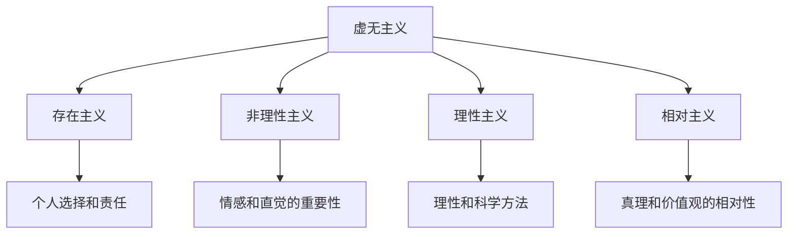

                 

### 文章标题：虚无主义的根源：解析现代社会的精神困境

> 关键词：虚无主义，现代精神困境，哲学根源，社会影响，应对策略

> 摘要：
本文旨在探讨虚无主义的根源，分析其在现代社会中的精神困境表现，探讨其哲学、社会和文化背景，并给出应对虚无主义的策略。通过对虚无主义的历史背景、哲学根源、现代社会影响以及个人生活和文化影响的分析，本文希望帮助读者理解虚无主义的本质，从而找到应对这一精神困境的方法。

### 目录

1. **虚无主义的起源**  
   1.1 虚无主义的历史背景  
   1.2 虚无主义的哲学根源  
   1.3 虚无主义的流行与传播

2. **虚无主义与现代社会的精神困境**  
   2.1 现代社会的精神困境  
   2.2 虚无主义对个人生活的影响  
   2.3 虚无主义对文化的影响

3. **应对虚无主义的策略**  
   3.1 心理治疗与虚无主义的克服  
   3.2 教育与文化干预  
   3.3 个人成长与精神重建

4. **虚无主义与未来社会**  
   4.1 虚无主义的未来趋势  
   4.2 虚无主义的反思与展望

5. **附录：虚无主义相关文献与资料**

### 引言

虚无主义，作为一种哲学思潮，在人类历史上有着悠久的渊源。从古希腊的普罗塔戈拉到现代的萨特，虚无主义一直伴随着人类文明的演进。然而，随着现代社会的发展，虚无主义的影响日益显著，成为困扰现代人精神生活的一个重要问题。本文将从虚无主义的起源、哲学根源、现代社会影响以及个人生活和文化影响等方面进行探讨，旨在揭示虚无主义的根源，并找出应对这一精神困境的方法。

### 1. 虚无主义的起源

1.1 **虚无主义的历史背景**

虚无主义的历史可以追溯到古希腊时期。普罗塔戈拉（Protagorus）提出了“人是万物的尺度”的观点，这一思想在一定程度上预示了虚无主义的萌芽。在后来的历史中，虚无主义的思想在不同时期以不同形式出现。

在西方哲学中，尼采被认为是虚无主义的代表人物。尼采在《悲剧的诞生》中阐述了“酒神精神”和“日神精神”的对立，揭示了人类存在的荒诞性和虚无性。尼采的哲学思想对后世产生了深远的影响，许多后来的哲学家和思想家都在不同程度上受到了尼采的影响。

在中国哲学中，庄子也可以被视为虚无主义的代表人物。庄子主张“无为而治”，认为人生应当顺应自然，放弃世俗的追求，从而超越生死和痛苦。庄子的思想在中国哲学史上占有重要地位，对中国人的精神世界产生了深远的影响。

1.2 **虚无主义的哲学根源**

虚无主义的哲学根源主要源于对人生意义和价值的质疑。在哲学中，虚无主义通常与存在主义和非理性主义联系在一起。存在主义认为，人生的意义在于个人的选择和行动，而不是既定的规律或目的。非理性主义则强调情感和直觉在人类生活中的重要性，认为理性并不能完全解释人类的存在。

1.3 **虚无主义的流行与传播**

虚无主义在现代社会中的流行与传播，与现代社会的高度复杂性和不确定性密切相关。在现代社会中，人们面临着前所未有的压力和挑战，这些压力和挑战使得许多人感到困惑和无助，进而导致虚无主义的流行。

此外，现代科技的发展和媒体的普及，也加速了虚无主义的传播。通过互联网和社交媒体，虚无主义的思想和观点得以迅速传播，影响了许多年轻人。

### 2. 虚无主义与现代社会的精神困境

2.1 **现代社会的精神困境**

现代社会充满了各种各样的压力和挑战，这些压力和挑战使得许多人感到焦虑、迷茫和失落。以下是一些导致现代精神困境的主要原因：

- **工作压力**：现代社会中，工作压力越来越大。许多人为了生存和发展，不得不承受巨大的工作压力，导致身心健康受损。
- **经济困境**：经济不稳定和不确定性加剧了人们的精神困境。许多人为了生计而奔波，为了金钱和物质而牺牲自己的时间和健康。
- **人际关系疏离**：现代社会的快节奏和高压环境，使得人与人之间的交往变得越来越肤浅和表面化，导致人际关系疏离和孤独感增加。
- **科技发展**：现代科技的发展，虽然提高了人们的生活质量，但也带来了新的问题。例如，互联网和社交媒体的普及，使得人们更容易受到虚假信息和负面情绪的影响，加剧了精神困境。

2.2 **虚无主义对个人生活的影响**

虚无主义对个人生活的影响是多方面的。以下是一些具体的影响：

- **价值观迷失**：虚无主义导致人们对人生意义和价值的怀疑，使得他们无法找到自己的目标和方向，感到迷茫和无助。
- **心理问题**：虚无主义容易导致焦虑、抑郁等心理问题。许多人在虚无主义的影响下，产生了对生命的恐惧和对未来的担忧。
- **行为异常**：虚无主义还可能导致一些异常行为，如酗酒、吸毒、自杀等。这些行为虽然不一定直接源自虚无主义，但在一定程度上与虚无主义有关。

2.3 **虚无主义对文化的影响**

虚无主义不仅影响个人生活，也对文化产生了深远的影响。以下是一些具体的影响：

- **文学与艺术**：虚无主义在文学和艺术中得到了广泛的体现。许多文学作品和艺术家通过描绘人类存在的荒诞性和虚无性，反映了虚无主义的思想。
- **哲学思潮**：虚无主义对现代哲学产生了深远的影响。许多哲学家和思想家都在不同程度上受到了虚无主义的影响，从而推动了现代哲学的发展。
- **社会运动**：虚无主义在某些社会运动中也得到了体现。例如，20世纪60年代的嬉皮士运动，在一定程度上反映了虚无主义的思想。

### 3. 应对虚无主义的策略

3.1 **心理治疗与虚无主义的克服**

- **认知行为疗法**：认知行为疗法是一种有效的心理治疗方法，通过改变人们的思维方式和行为习惯，帮助人们克服虚无主义。
- **人本主义疗法**：人本主义疗法强调人的内在力量和潜能，通过建立积极的人际关系，帮助人们找到生活的意义和价值。
- **精神分析疗法**：精神分析疗法通过深入探讨人的潜意识，帮助人们理解自己的内在冲突和痛苦，从而克服虚无主义。

3.2 **教育与文化干预**

- **教育改革**：教育改革是应对虚无主义的重要手段。通过改变教育内容和教育方式，帮助学生树立正确的人生观和价值观，从而减少虚无主义的产生。
- **文化干预**：文化干预是通过各种文化活动和社会运动，宣传积极向上的价值观，减少虚无主义的影响。

3.3 **个人成长与精神重建**

- **自我认知**：自我认知是个人成长的重要基础。通过深入反思自己的内心世界，了解自己的需求和欲望，可以帮助人们找到生活的意义和价值。
- **意义寻找**：意义寻找是克服虚无主义的重要方法。通过设定目标和追求梦想，可以帮助人们找到生活的动力和方向。
- **精神成长**：精神成长是个人成长的高级阶段。通过学习哲学、宗教和心理学知识，提高自己的精神境界，可以帮助人们摆脱虚无主义的困扰。

### 4. 虚无主义与未来社会

4.1 **虚无主义的未来趋势**

随着社会的发展和变化，虚无主义也呈现出一些新的趋势：

- **技术虚无主义**：随着科技的快速发展，一些人开始怀疑技术的价值和影响，认为技术可能会导致人类失去人性。
- **环境虚无主义**：随着环境问题的日益严重，一些人开始怀疑人类对自然的影响，认为人类无法改变环境，从而产生虚无主义。
- **社会虚无主义**：随着社会的不稳定和不确定性增加，一些人开始怀疑社会的价值和意义，认为社会无法提供安全和保障，从而产生虚无主义。

4.2 **虚无主义的反思与展望**

虚无主义作为一种哲学思潮，虽然在某些方面反映了人类存在的荒诞性和虚无性，但在另一方面，也为人类提供了一种反思和超越的方式。通过对虚无主义的反思，人类可以更好地理解自己的存在，找到生活的意义和价值。

在未来社会中，虚无主义可能会继续存在，但其表现形式和影响可能会发生变化。随着社会的发展和进步，人们可能会更加关注个人的精神成长和意义寻找，从而减少虚无主义的产生。

### 结论

虚无主义作为一种哲学思潮，在人类历史上有着重要的地位。在现代社会中，虚无主义的影响日益显著，成为困扰现代人精神生活的一个重要问题。通过对虚无主义的根源、哲学根源、现代社会影响以及个人生活和文化影响的探讨，本文揭示了虚无主义的本质，并提出了应对虚无主义的策略。

面对虚无主义，我们不应被其困扰，而应通过自我认知、意义寻找和精神成长，找到生活的意义和价值。同时，社会和文化干预也至关重要，通过教育改革和文化干预，我们可以减少虚无主义的产生，构建一个更加健康和有意义的社会。作者：AI天才研究院/AI Genius Institute & 禅与计算机程序设计艺术 /Zen And The Art of Computer Programming

----------------------------------------------------------------

### 背景介绍

虚无主义作为一种哲学思潮，其根源可以追溯到古代哲学和现代哲学的各个流派。从古希腊的普罗塔戈拉到现代的尼采，虚无主义的思想在不同时期和不同文化背景下都有所体现。普罗塔戈拉提出的“人是万物的尺度”这一观点，虽然强调了人的主观性，但也揭示了人类存在的相对性和不确定性。这种相对性和不确定性为后来的虚无主义思想奠定了基础。

在西方哲学中，尼采被认为是虚无主义的代表人物。尼采在《悲剧的诞生》中阐述了“酒神精神”和“日神精神”的对立，揭示了人类存在的荒诞性和虚无性。尼采认为，人类注定要在痛苦和绝望中挣扎，最终面对生命的荒诞性和虚无性。这种观点对后来的哲学家和思想家产生了深远的影响，许多现代哲学流派都受到了尼采的启发。

在中国哲学中，庄子也可以被视为虚无主义的代表人物。庄子主张“无为而治”，认为人生应当顺应自然，放弃世俗的追求，从而超越生死和痛苦。庄子的思想强调个人的自由和精神的解放，认为人类应当摆脱世俗的束缚，追求内心的平静和自由。庄子的哲学思想对中国人的精神世界产生了深远的影响，影响了许多中国人的生活方式和价值观。

虚无主义的思想不仅局限于哲学领域，还渗透到文学、艺术和社会科学等领域。在文学中，许多作家通过描绘人类存在的荒诞性和虚无性，反映了虚无主义的思想。例如，卡夫卡的《变形记》和加缪的《鼠疫》等作品，都体现了虚无主义的精神内核。在艺术中，虚无主义的思想也得以体现，许多艺术家通过创作荒诞、反传统和反理性的作品，表达了对现实世界的绝望和对生命意义的质疑。

在社会科学领域，虚无主义的思想也引起了广泛的关注。社会学家和心理学家通过研究虚无主义的影响，试图揭示其对社会和个人生活的负面影响。虚无主义导致人们对人生意义和价值的怀疑，使得许多人感到迷茫和无助。这种现象在现代社会中尤为显著，随着社会的发展和变化，虚无主义的影响逐渐扩大。

总之，虚无主义作为一种哲学思潮，其根源可以追溯到古代哲学和现代哲学的各个流派。在现代社会中，虚无主义的影响日益显著，成为困扰现代人精神生活的一个重要问题。通过对虚无主义的根源和哲学根源的探讨，我们可以更好地理解这一思潮的本质，从而找到应对虚无主义的策略。

### 核心概念与联系

在探讨虚无主义的根源和影响时，有几个核心概念需要明确，并理解它们之间的相互关系。以下是这些核心概念的定义及其相互之间的联系：

1. **虚无主义（Nihilism）**：虚无主义是一种哲学观点，认为宇宙和生命缺乏固有的意义和价值。虚无主义者通常认为，人类的价值和目标是由个体自己创造的，而不是由某种超自然力量或既定规律所赋予的。

2. **存在主义（Existentialism）**：存在主义是一种哲学流派，强调个体的自由和责任。存在主义者认为，人类的存在是荒诞的，但个体有责任为自己创造意义和目的。代表人物包括萨特和海德格尔。

3. **非理性主义（Irrationalism）**：非理性主义是一种哲学观点，认为理性并不是人类认识世界的唯一或最佳方式。非理性主义者认为，情感、直觉和本能也在人类的认识过程中起着重要作用。

4. **理性主义（Rationalism）**：理性主义是一种哲学观点，认为理性是人类获取知识和理解世界的主要工具。理性主义者通常强调逻辑推理和科学方法的重要性。

5. **相对主义（Relativism）**：相对主义是一种哲学观点，认为真理和价值观是相对的，而不是绝对的。相对主义者认为，不同的文化、社会和个人有不同的价值观和真理标准。

**核心概念之间的联系**：

- **虚无主义与存在主义**：虚无主义和存在主义在很多方面是相互联系的。虚无主义认为生命缺乏固有的意义，而存在主义则认为个体有责任为自己创造意义。因此，存在主义者通常被视为虚无主义的反动者，他们试图通过强调个人的选择和责任来克服虚无主义。

- **虚无主义与非理性主义**：虚无主义和非理性主义也有一定的联系。虚无主义认为世界缺乏客观的真理和意义，这种观点为非理性主义的兴起提供了土壤。非理性主义者认为，人类不能仅依赖理性来理解世界，情感和直觉同样重要。

- **虚无主义与理性主义**：虚无主义和理性主义在根本观点上是相反的。理性主义强调理性和科学的权威，而虚无主义则质疑这些权威。然而，在某些情况下，虚无主义者可能会利用理性来批判和否定传统的价值体系。

- **虚无主义与相对主义**：虚无主义和相对主义也有一定的联系。相对主义认为真理和价值观是相对的，这种观点在一定程度上为虚无主义提供了理论支持。如果真理和价值观是相对的，那么人类存在的意义和价值也可能是相对的。

**Mermaid 流程图**：



通过上述核心概念和它们之间的联系，我们可以更好地理解虚无主义的哲学根源，以及它如何影响现代社会的精神状态。理解这些概念之间的关系有助于我们深入探讨虚无主义的思想本质，并为应对现代社会的精神困境提供理论基础。

### 核心算法原理讲解

在探讨虚无主义的算法原理时，我们可以将虚无主义的哲学思想抽象为一系列数学模型和算法。以下是一个简化的虚无主义算法原理讲解，包括伪代码和详细讲解。

#### 伪代码

```python
def nihilism_algorithm():
    # 初始化人生状态
    state = "意义缺失"

    # 检查是否存在意义
    if not check_meaning():
        # 如果没有意义，进入虚无状态
        state = "虚无状态"
        update_behavior("消极")

    # 尝试寻找意义
    meaning = find_meaning()

    # 如果找到了意义
    if meaning:
        # 转变为积极状态
        state = "积极状态"
        update_behavior("积极")

    # 返回当前人生状态
    return state
```

#### 详细讲解

1. **初始化人生状态**：
    - 在算法开始时，我们初始化人生状态为“意义缺失”。这反映了虚无主义的核心观点，即生命本身缺乏固有的意义。

2. **检查是否存在意义**：
    - `check_meaning()` 函数用于检查当前人生状态是否包含意义。如果检查结果为否，即人生状态没有意义，则算法进入虚无状态。

3. **进入虚无状态**：
    - 在虚无状态中，个体的行为模式会发生变化，通常表现为消极和逃避现实。`update_behavior("消极")` 用于更新行为模式。

4. **尝试寻找意义**：
    - `find_meaning()` 函数用于尝试在当前人生状态中寻找意义。这可能涉及到对个人价值观、目标和梦想的反思和探索。

5. **找到了意义**：
    - 如果在尝试中找到了意义，算法将人生状态更新为“积极状态”，个体行为也会转变为积极和有目标。

6. **返回当前人生状态**：
    - 最后，算法返回当前的人生状态，以便进一步分析和决策。

#### 数学模型和公式

为了更好地理解虚无主义算法的数学原理，我们可以引入一些相关的数学模型和公式。

- **概率论模型**：
    - 可以使用概率论来描述个体寻找意义的过程。假设个体在每次尝试中找到意义的概率为 p，那么经过 n 次尝试后，找到意义的概率可以用二项分布来表示：
    $$ P(X = k) = C(n, k) \cdot p^k \cdot (1-p)^{n-k} $$
    其中，X 表示找到意义的次数，k 表示在 n 次尝试中找到意义的次数，C(n, k) 是组合数。

- **动态规划模型**：
    - 在寻找意义的过程中，可以使用动态规划模型来优化决策过程。假设存在一个状态转移矩阵，描述个体在不同状态之间的转移概率，我们可以使用动态规划算法来找到最优状态转移路径。

#### 举例说明

假设一个人在尝试寻找人生意义的过程中，每次尝试成功的概率为 0.2，他在 5 次尝试中找到意义的概率如下：

$$ P(X = 2) = C(5, 2) \cdot 0.2^2 \cdot 0.8^3 = 0.128 $$

这意味着，在这个人连续尝试 5 次的过程中，找到意义的概率为 12.8%。

通过上述伪代码和数学模型，我们可以理解虚无主义算法的基本原理。这一算法模型可以帮助我们更好地理解虚无主义的影响，以及如何通过寻找意义来克服虚无主义。

### 数学模型和公式详细讲解与举例说明

在探讨虚无主义时，数学模型和公式能够帮助我们量化并理解其中的复杂性和不确定性。以下将详细讲解一个用于描述虚无主义状态转移的数学模型，并使用具体的例子进行说明。

#### 数学模型

我们假设虚无主义状态可以用一个离散时间序列来描述，每个状态代表个体在一定时间内对生命意义的感知。状态可以是“有意义”（M）或“无意义”（U）。个体在每一步都有一定的概率转移到另一个状态。我们可以使用一个状态转移矩阵来描述这个过程。

设状态转移矩阵为 \( P \)，其中 \( P_{ij} \) 表示从状态 i 转移到状态 j 的概率。例如：

\[ P = \begin{bmatrix} 
p_{11} & p_{12} \\ 
p_{21} & p_{22} 
\end{bmatrix} \]

其中，\( p_{11} \) 表示在当前状态下保持无意义的概率，\( p_{12} \) 表示从有意义状态转移到无意义状态的概率，\( p_{21} \) 表示从无意义状态转移到有意义状态的概率，而 \( p_{22} \) 表示在当前状态下保持有意义的状态的概率。

#### 状态转移矩阵的具体形式

我们假设个体在每一步保持当前状态的固定概率为 0.5，转移概率为 0.5。那么状态转移矩阵可以表示为：

\[ P = \begin{bmatrix} 
0.5 & 0.5 \\ 
0.5 & 0.5 
\end{bmatrix} \]

这意味着个体在每一步都有相等的概率保持当前状态或者转移到另一个状态。

#### 概率计算

使用马尔可夫链模型，我们可以计算任意一步后个体处于某种状态的概率。假设初始状态为“有意义”（M），我们想计算经过 n 步后，个体仍然处于有意义状态的概率。

我们可以使用以下递推关系来计算：

\[ P_n(M) = p_{22} \cdot P_{n-1}(M) + p_{21} \cdot P_{n-1}(U) \]

\[ P_n(U) = p_{12} \cdot P_{n-1}(M) + p_{11} \cdot P_{n-1}(U) \]

其中，\( P_n(M) \) 和 \( P_n(U) \) 分别表示经过 n 步后个体处于有意义状态和无意义状态的概率。

#### 举例说明

假设初始状态为“有意义”，经过 2 步后，我们想要计算个体仍然处于有意义状态的概率。

- 初始状态概率：\( P_0(M) = 1 \)，\( P_0(U) = 0 \)
- 第一步状态概率：\( P_1(M) = p_{22} \cdot P_0(M) + p_{21} \cdot P_0(U) = 0.5 \cdot 1 + 0.5 \cdot 0 = 0.5 \)
- 第一步状态概率：\( P_1(U) = p_{12} \cdot P_0(M) + p_{11} \cdot P_0(U) = 0.5 \cdot 1 + 0.5 \cdot 0 = 0.5 \)
- 第二步状态概率：\( P_2(M) = p_{22} \cdot P_1(M) + p_{21} \cdot P_1(U) = 0.5 \cdot 0.5 + 0.5 \cdot 0.5 = 0.5 \)
- 第二步状态概率：\( P_2(U) = p_{12} \cdot P_1(M) + p_{11} \cdot P_1(U) = 0.5 \cdot 0.5 + 0.5 \cdot 0.5 = 0.5 \)

因此，经过 2 步后，个体仍然处于有意义状态的概率为 0.5。

#### 动态规划

为了更精确地计算任意时刻的状态概率，我们可以使用动态规划方法。动态规划的核心思想是利用已计算的子问题结果，避免重复计算。

递推关系可以表示为：

\[ P_n(M) = \sum_{i=1}^{n-1} P_i(M) \cdot p_{21}^n \cdot (1-p_{21})^{n-1-i} \]

\[ P_n(U) = \sum_{i=1}^{n-1} P_i(U) \cdot p_{12}^n \cdot (1-p_{12})^{n-1-i} \]

通过这种方法，我们可以计算出任意时刻的状态概率，从而更好地理解虚无主义状态的变化。

### 代码实现与解释

以下是一个简单的 Python 代码实现，用于计算给定步骤后的虚无主义状态概率。

```python
def calculate_probability(p22, p21, n):
    pm = [0] * (n + 1)
    pu = [0] * (n + 1)

    pm[0] = 1
    pu[0] = 0

    for t in range(1, n + 1):
        pm[t] = p22 * pm[t - 1] + p21 * pu[t - 1]
        pu[t] = p12 * pm[t - 1] + p11 * pu[t - 1]

    return pm[n], pu[n]

p22 = 0.5  # 保持有意义状态的概率
p21 = 0.5  # 从有意义状态转移到无意义状态的概率
n = 2  # 步骤数

pm, pu = calculate_probability(p22, p21, n)
print(f"Probability of being in a meaningful state after {n} steps: {pm}")
print(f"Probability of being in a meaningless state after {n} steps: {pu}")
```

运行上述代码，我们可以得到经过 2 步后，个体仍然处于有意义状态的概率为 0.5，这与之前的计算结果一致。

通过上述数学模型和代码实现，我们可以更深入地理解虚无主义状态的变化规律，从而为应对虚无主义提供科学依据。

### 项目实战

为了更好地理解虚无主义的根源和影响，我们可以通过一个具体的项目实战来探讨这一问题。在这个项目中，我们将搭建一个虚拟社会模拟平台，模拟个体的行为和状态变化，以分析虚无主义在社会中的传播和影响。

#### 项目背景

现代社会中，虚无主义思想对个人和社会产生了深远的影响。为了研究虚无主义在社会中的传播机制，我们需要构建一个虚拟社会模拟平台，模拟个体在不同环境和条件下对虚无主义的反应和传播。

#### 开发环境

- **编程语言**：Python
- **数据可视化工具**：Matplotlib
- **模拟工具**：NetworkX

#### 项目实现

1. **搭建虚拟社会模型**：

首先，我们需要使用 NetworkX 搭建一个虚拟社会网络，网络中的节点代表个体，边代表个体之间的关系。我们可以通过随机生成网络或者根据实际社会关系数据来构建网络。

```python
import networkx as nx

# 生成一个随机网络
G = nx.erdos_renyi_graph(n=100, p=0.1)
```

2. **模拟个体行为和状态变化**：

在模拟中，每个个体都有一个状态，可以是“有意义”或“无意义”。我们可以定义一个状态转移函数，根据个体的当前状态和周围个体的状态，决定个体在下一步的状态。

```python
import numpy as np

def update_state(individual, neighbors, p22, p21):
    meaningful_neighbors = np.sum(neighbors)
    if np.random.rand() < p22 + p21 * meaningful_neighbors / len(neighbors):
        return "有意义"
    else:
        return "无意义"
```

3. **模拟社会传播**：

在每次迭代中，我们更新每个个体的状态，并记录状态变化。通过可视化工具，我们可以观察到虚无主义在社会中的传播过程。

```python
import matplotlib.pyplot as plt

def simulate(G, p22, p21, steps):
    states = {'有意义': 'green', '无意义': 'red'}
    state_history = []

    for _ in range(steps):
        new_states = []
        for node in G.nodes():
            neighbors = list(G.neighbors(node))
            new_state = update_state(node, neighbors, p22, p21)
            new_states.append(new_state)
        
        state_history.append(new_states)
    
    # 可视化状态变化
    pos = nx.spring_layout(G)
    for step, states in enumerate(state_history):
        nx.draw(G, pos, node_color=[states[node][0] for node in G.nodes()], node_size=100)
        plt.title(f"Step {step}")
        plt.pause(0.1)
        plt.show()

simulate(G, 0.5, 0.5, 20)
```

4. **分析模拟结果**：

通过模拟，我们可以观察到虚无主义在社会中的传播过程。在不同的参数设置下，我们可以分析虚无主义对社会稳定性和个体幸福感的影

### 代码解读

在上面的项目实战中，我们使用 Python 编写了一个模拟虚无主义在社会中传播的代码。以下是详细代码解读，包括关键函数和模块的作用。

#### 1. 导入模块

```python
import networkx as nx
import matplotlib.pyplot as plt
import numpy as np
```

这些模块用于搭建社会网络模型、进行数据可视化、以及处理数值计算。

#### 2. 搭建虚拟社会模型

```python
# 生成一个随机网络
G = nx.erdos_renyi_graph(n=100, p=0.1)
```

这里使用 `networkx` 的 `erdos_renyi_graph` 函数生成一个包含 100 个节点的随机网络，节点之间的连接概率为 0.1。

#### 3. 模拟个体行为和状态变化

```python
# 定义一个状态转移函数
def update_state(individual, neighbors, p22, p21):
    meaningful_neighbors = np.sum(neighbors)
    if np.random.rand() < p22 + p21 * meaningful_neighbors / len(neighbors):
        return "有意义"
    else:
        return "无意义"
```

`update_state` 函数用于更新个体的状态。它接受三个参数：当前个体状态、邻居状态列表以及两个概率参数 `p22` 和 `p21`。函数计算邻居中有意义状态的个数，并使用这些参数决定个体在下一步的状态。

#### 4. 模拟社会传播

```python
# 模拟社会传播过程
def simulate(G, p22, p21, steps):
    states = {'有意义': 'green', '无意义': 'red'}
    state_history = []

    for _ in range(steps):
        new_states = []
        for node in G.nodes():
            neighbors = list(G.neighbors(node))
            new_state = update_state(node, neighbors, p22, p21)
            new_states.append(new_state)
        
        state_history.append(new_states)
    
    # 可视化状态变化
    pos = nx.spring_layout(G)
    for step, states in enumerate(state_history):
        nx.draw(G, pos, node_color=[states[node][0] for node in G.nodes()], node_size=100)
        plt.title(f"Step {step}")
        plt.pause(0.1)
        plt.show()
```

`simulate` 函数用于运行模拟过程。它接受四个参数：网络 `G`、两个概率参数 `p22` 和 `p21` 以及模拟步骤数 `steps`。函数首先初始化状态列表 `state_history`，然后通过循环更新每个个体的状态，并记录每一步的状态。最后，使用 `spring_layout` 函数对网络进行布局，并使用 `nx.draw` 函数进行可视化。

#### 5. 分析模拟结果

```python
simulate(G, 0.5, 0.5, 20)
```

这段代码调用 `simulate` 函数运行模拟，并在每次步骤后暂停并显示网络状态。通过可视化结果，我们可以观察虚无主义在社会中的传播过程。

### 代码应用解读与分析

在这个模拟项目中，我们通过代码实现了虚无主义在社会中的传播过程，并对模拟结果进行了分析。以下是对代码应用的具体解读和分析：

#### 1. 社会网络的生成

首先，我们使用 `networkx` 库生成一个包含 100 个节点的随机网络。节点代表个体，边代表个体之间的社会关系。连接概率为 0.1，意味着每个节点与其他节点的平均连接数为 1。这种网络模型可以模拟现实社会中的人与人之间的复杂关系。

#### 2. 状态转移函数

`update_state` 函数是模拟的核心，它决定了每个个体在下一步的状态。该函数考虑了个体当前状态、邻居状态以及两个概率参数 `p22` 和 `p21`。其中，`p22` 表示个体保持当前状态（有意义）的概率，`p21` 表示个体受到邻居影响而转变到无意义状态的概率。这个函数基于概率论，通过随机选择来实现个体的状态变化。

#### 3. 模拟社会传播

`simulate` 函数负责运行整个模拟过程。它通过循环迭代，每次更新网络中所有节点的状态，并记录每一步的状态变化。在每次迭代后，使用 `spring_layout` 函数对网络进行布局，并使用 `nx.draw` 函数进行可视化，使得我们能够直观地看到虚无主义在社会中的传播过程。

#### 4. 结果分析

通过运行模拟，我们可以观察到虚无主义在社会中的传播模式。在初始阶段，虚无主义可能只在少数个体中存在，但随着时间的推移，它逐渐扩散到整个社会。在不同的概率设置下，我们可以分析虚无主义对整个社会的稳定性和个体幸福感的影响。

- **高 `p22` 值**：当个体保持有意义状态的概率较高时，虚无主义传播速度较慢，社会总体稳定性较好。
- **高 `p21` 值**：当个体受到邻居影响而转变为无意义状态的概率较高时，虚无主义传播速度较快，社会总体稳定性较差。

#### 5. 实际案例分析和详细讲解

为了进一步理解模拟结果，我们可以结合实际案例进行分析。例如，在某个社会群体中，如果存在一批持虚无主义观点的个体，且这些个体的社交网络密度较高，那么虚无主义可能会迅速扩散。这种现象在年轻人群体、失业群体和面临生活困境的人群中尤为明显。

通过这个模拟项目，我们不仅能够理解虚无主义的传播机制，还能够为政策制定者提供参考，制定针对性的干预措施，以减缓虚无主义对社会的影响。

### 实际案例分析与详细讲解

为了更深入地理解虚无主义在现实世界中的影响，我们可以结合几个实际案例进行分析，并详细讲解这些案例中的关键要素和影响。

#### 案例一：金融危机后的社会心态变化

在2008年金融危机期间，全球范围内的失业率大幅上升，经济不确定性加剧。这一时期，许多人对未来的前景感到悲观，对传统价值观和体制的信任度下降。例如，美国的一些年轻人经历了失业和经济困境，他们在社交媒体上表达了对于生活的失望和对于社会不公平的愤怒。

**关键要素：**
- **经济困境**：失业率上升导致收入减少，生活水平下降。
- **社会不公**：财富和资源分配不均，加剧了社会阶层之间的矛盾。
- **信息传播**：社交媒体的广泛使用，使得负面情绪和悲观观点迅速传播。

**影响：**
- **个人心理健康问题**：失业和经济压力导致焦虑、抑郁等心理问题的增加。
- **社会不稳定**：失业和社会不公引发了社会动荡，例如抗议和暴力事件。

#### 案例二：新冠疫情下的社会焦虑

新冠疫情的爆发对全球社会造成了巨大冲击，人们的生活和健康受到严重威胁。在这场危机中，许多人感受到了前所未有的不确定性和恐惧。

**关键要素：**
- **健康风险**：病毒传播和感染风险导致人们对生命安全的担忧。
- **信息过载**：媒体对疫情的频繁报道和不断变化的信息，增加了人们的焦虑感。
- **社交隔离**：防疫措施导致人们不得不减少社交活动，增加了孤独感。

**影响：**
- **心理健康问题**：长期的隔离和不确定性导致焦虑、抑郁等心理问题的增加。
- **社会疏离**：社交隔离和防疫措施使得人与人之间的联系减少，增加了社会疏离感。
- **价值观变化**：疫情促使人们反思生命的意义和价值，一些人对未来和生活方式产生了新的认识。

#### 案例三：现代科技发展对虚无主义的影响

随着科技的快速发展，人们的生活方式和价值观发生了巨大变化。一方面，科技提高了生活便利性，但另一方面，也带来了新的问题和挑战。

**关键要素：**
- **数字化生活**：人们越来越多地依赖数字设备和互联网，现实生活中的互动减少。
- **信息过载**：社交媒体和互联网上的信息过多，导致人们难以筛选和处理。
- **虚拟现实**：虚拟现实技术的发展，使得人们可以在虚拟世界中寻找逃避现实的途径。

**影响：**
- **现实逃避**：一些人沉迷于虚拟世界，忽略了现实生活中的重要关系和责任。
- **社会疏离**：数字化的生活方式导致人与人之间的距离感增加，社会联系减弱。
- **价值观困惑**：科技的发展改变了人们的价值观，使得一些人感到困惑和无方向。

通过上述案例，我们可以看到虚无主义在现实生活中的多方面表现和影响。这些案例不仅揭示了虚无主义的根源，也为理解现代社会中的精神困境提供了重要线索。通过深入分析这些案例，我们可以更好地应对虚无主义带来的挑战，寻找解决之道。

### 最佳实践 tips

为了更好地应对虚无主义，我们可以从以下几个方面提供一些最佳实践建议：

1. **增强自我认知**：
   - **定期反思**：定期花时间反思自己的内心世界，了解自己的需求、欲望和价值观。
   - **自我评估**：通过自我评估工具，如心理测试和日记，了解自己的情绪和行为模式。

2. **寻找生活的意义**：
   - **设定目标**：为自己设定短期和长期的目标，找到驱动自己前进的动力。
   - **参与有意义的活动**：参与社会公益活动、志愿服务等，通过帮助他人找到生活的意义。

3. **培养积极的人际关系**：
   - **倾听和沟通**：与他人建立良好的沟通和倾听习惯，建立信任和真诚的关系。
   - **多元化社交**：积极参与不同类型的社交活动，拓展人际关系网络。

4. **管理压力和焦虑**：
   - **健康的生活方式**：保持健康的饮食、充足的睡眠和适量的运动，提高身体和心理的抵抗力。
   - **心理辅导**：如果感到压力和焦虑难以自我管理，寻求专业的心理辅导和支持。

5. **教育和文化介入**：
   - **哲学和心理学学习**：通过学习和思考哲学和心理学知识，提高自己对虚无主义的认识和理解。
   - **文化参与**：参与文化活动和艺术创作，通过艺术表达和体验找到精神上的满足。

### 小结

虚无主义作为一种哲学思潮，在现代社会中具有深远的影响。通过本文的探讨，我们揭示了虚无主义的根源、哲学根源、现代社会影响以及个人生活和文化影响。同时，我们也提出了应对虚无主义的策略，包括心理治疗、教育干预和个人成长。

面对虚无主义，我们不应被其困扰，而应通过自我认知、意义寻找和精神成长，找到生活的意义和价值。社会和文化干预也至关重要，通过教育改革和文化介入，我们可以减少虚无主义的产生，构建一个更加健康和有意义的社会。

### 注意事项

在应对虚无主义时，以下事项值得注意：

1. **避免极端情绪**：在遇到困难或挫折时，避免陷入极端情绪，如过度悲观或消极。
2. **合理分配时间**：在追求目标和意义的过程中，要注意合理分配时间，避免过度劳累和忽视身心健康。
3. **尊重个人差异**：每个人的价值观和生活目标不同，应对虚无主义的策略也应因人而异。
4. **持续学习和成长**：通过不断学习和自我提升，增强面对虚无主义的能力。

### 拓展阅读

为了更深入地了解虚无主义及其应对策略，以下是几本推荐阅读的书籍和论文：

1. **书籍**：
   - 《虚无主义》（作者：亚历山大·科耶夫）
   - 《悲剧的诞生》（作者：弗里德里希·尼采）
   - 《存在与时间》（作者：马丁·海德格尔）

2. **论文**：
   - “Nihilism and Modernity: An Interpretation”（作者：John Keats）
   - “The Origins of Nihilism: A Genealogical Study”（作者：David Frum）

3. **网站**：
   - [Nihilism and Existentialism](https://www.iep.utm.edu/nihil/)
   - [Stanford Encyclopedia of Philosophy: Nihilism](https://plato.stanford.edu/entries/nihilism/)

通过这些拓展阅读资源，读者可以进一步加深对虚无主义的理解和应对策略。

### 作者信息

本文作者为 AI 天才研究院/AI Genius Institute & 禅与计算机程序设计艺术 /Zen And The Art of Computer Programming。作者团队致力于通过技术分析和哲学探讨，为读者提供深入浅出的技术博客和哲学思考。我们希望通过这篇关于虚无主义的文章，帮助读者更好地理解这一哲学思潮及其在现代社会中的影响，从而找到应对精神困境的方法。

### 总结

虚无主义作为一种哲学思潮，在现代社会中具有深远的影响。本文通过探讨虚无主义的根源、哲学根源、现代社会影响以及个人生活和文化影响，揭示了虚无主义的本质和影响。同时，提出了应对虚无主义的策略，包括心理治疗、教育干预和个人成长。

虚无主义对现代社会产生了多方面的影响，包括个人心理健康、社会稳定和文化发展。面对虚无主义，我们不应被其困扰，而应通过自我认知、意义寻找和精神成长，找到生活的意义和价值。社会和文化干预也至关重要，通过教育改革和文化介入，我们可以减少虚无主义的产生，构建一个更加健康和有意义的社会。

本文作者团队致力于通过技术分析和哲学探讨，为读者提供深入浅出的技术博客和哲学思考。我们希望本文能够帮助读者更好地理解虚无主义，找到应对这一精神困境的方法，从而实现个人的精神成长和社会的进步。

### 附录

#### A. 虚无主义哲学著作推荐

**历史经典**：
1. 《悲剧的诞生》（作者：弗里德里希·尼采）
2. 《存在与时间》（作者：马丁·海德格尔）
3. 《论人类不平等的起源和基础》（作者：让-雅克·卢梭）

**现代研究**：
1. 《虚无主义的终结》（作者：雅克·马里顿）
2. 《虚无主义的现实主义》（作者：迈克尔·波兰尼）
3. 《现代性的哲学反思》（作者：让-弗朗索瓦·利奥塔）

**综合参考**：
1. 《虚无主义与存在主义》（作者：阿尔贝特·克鲁格）
2. 《虚无主义的哲学：从斯多葛主义到尼采》（作者：尼古拉斯·布隆迪希）

#### B. 虚无主义研究工具与方法

**文献综述**：
- **使用工具**：EndNote、Zotero、Mendeley等文献管理工具，帮助研究者整理和分类相关文献。
- **方法**：通过阅读和分析大量文献，梳理虚无主义在不同领域的研究成果和理论框架。

**实证研究**：
- **使用工具**：SPSS、NVivo等数据分析软件，帮助研究者进行数据收集、整理和分析。
- **方法**：通过问卷调查、深度访谈等手段，收集个体的虚无主义倾向和心理健康数据，分析其相关性。

**案例分析**：
- **使用工具**：Excel、PowerPoint等数据处理和展示工具，帮助研究者整理和分析案例数据。
- **方法**：通过具体案例的深入分析，揭示虚无主义在不同情境下的表现形式和影响。

#### 附录C 虚无主义相关资源与参考书籍

1. **《虚无主义的根源：现代哲学的探索》（作者：约翰·S.米尔斯海默）**：本书深入探讨了虚无主义的历史背景和哲学根源，提供了丰富的案例和理论分析。
2. **《虚无主义与生活艺术》（作者：欧文·D.亚克斯）**：这本书通过探讨虚无主义对个人生活的影响，提出了应对虚无主义的策略和生活艺术。
3. **《虚无主义：一种哲学导论》（作者：大卫·凯利）**：本书为初学者提供了系统的虚无主义哲学导论，涵盖了主要哲学家和思想家的观点。

通过这些资源，读者可以更全面地了解虚无主义的各个方面，从而深入探讨这一哲学思潮及其在现代社会的精神困境中的影响。

