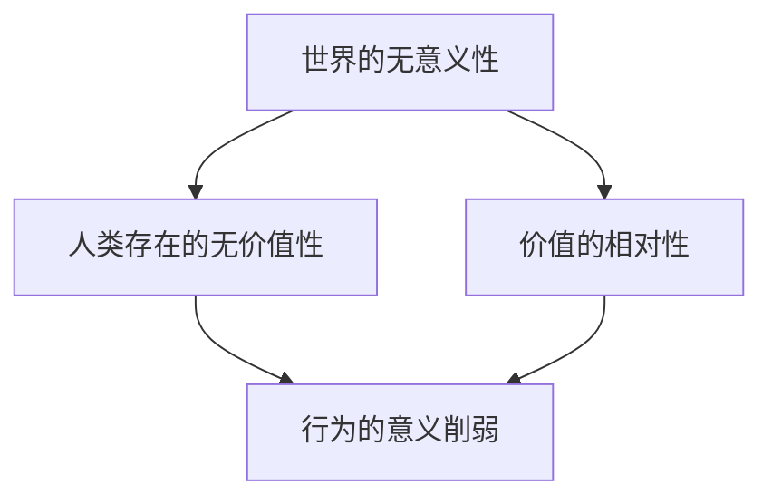

                 

# 虚无主义的积极面：如何利用它促进个人成长

## 关键词
- 虚无主义
- 个人成长
- 自由意志
- 心理健康
- 人际关系
- 社会变革

## 摘要
本文旨在探讨虚无主义的积极面，分析其在促进个人成长、心理健康、人际关系和社会变革等方面的作用。通过深入理解虚无主义的核心概念，我们能够发现，虚无主义并非完全消极，反而可以作为一种工具，帮助我们更好地认识自我、实现自我超越。本文将从哲学背景、积极影响、个人成长应用和实际案例等方面展开讨论，为读者提供一种全新的视角来审视虚无主义。

## 引言

虚无主义，这个看似悲观、甚至有些负面的词汇，在当代社会被广泛提及。它源自于对人生意义、价值、存在的质疑，认为生活缺乏固有的意义和价值。然而，随着对虚无主义研究的深入，我们发现它并非全然消极，反而蕴含着积极的内涵。本文将探讨虚无主义的积极面，分析其在不同领域中的应用，以期帮助读者理解虚无主义的多面性，并学会如何利用它来促进个人成长。

## 第一部分：虚无主义的哲学背景与历史发展

### 第1章：虚无主义的定义与起源

#### 1.1 虚无主义的核心概念

虚无主义的基本哲学观念在于对存在、价值和意义的质疑。它认为世界是无意义、无目的的，人类的存在缺乏内在的价值。虚无主义的起源可以追溯到古希腊哲学家皮浪，他提出了“不动心”的理念，试图通过否定一切来达到心灵的平静。此后，虚无主义在不同历史时期有着不同的表现形式，如18世纪的启蒙运动中的怀疑主义，以及20世纪的哲学思潮。

#### 1.2 虚无主义的历史演变

虚无主义在历史演变过程中，经历了不同的阶段。古代的虚无主义主要体现在对宗教和道德的质疑，中世纪的虚无主义则更多地表现为对教权的批判。现代虚无主义则更多地关注个人主义和存在主义，如尼采的“上帝已死”和萨特的“存在即选择”等观念，都反映了虚无主义的现代特征。

### 第2章：虚无主义在现代社会中的表现

#### 2.1 虚无主义与个人主义

个人主义与虚无主义有着密切的联系。个人主义强调个体的独立性和自主性，而虚无主义则质疑这种独立性和自主性的意义。在现代社会中，个人主义往往表现为对传统价值观的挑战，以及对个人自由和权利的追求。虚无主义则在这种背景下，提出了对个人主义合理性的质疑。

#### 2.2 虚无主义与消费主义

消费主义是现代社会的一种典型现象，它通过不断推动物质消费来满足人们的需求。虚无主义则认为，消费主义不仅不能带来真正的满足，反而加剧了人们的精神空虚。消费主义与虚无主义之间的冲突，反映了现代社会中价值观的混乱。

#### 2.3 虚无主义与科技发展

科技的发展在改变人们生活方式的同时，也对虚无主义产生了重要影响。一方面，科技的进步为人类提供了更多的选择和机会，使得虚无主义的一些质疑显得更为合理；另一方面，科技的发展也带来了一系列新的问题和挑战，如数字隐私、人工智能等，这些都对虚无主义提出了新的思考。

## 第二部分：虚无主义的积极面

### 第3章：虚无主义的积极影响

#### 3.1 虚无主义与自由意志

虚无主义对自由意志的思考具有深刻的启示。它认为，自由意志并非是固有的，而是在特定条件下形成的。这种观点促使人们更加珍惜和尊重自己的选择，同时也提醒我们要对自己的选择负责。自由意志在虚无主义背景下的意义，在于它提醒我们，尽管生活缺乏固有意义，但我们可以通过自己的选择来赋予生活意义。

#### 3.2 虚无主义与道德观念

虚无主义对道德观念的挑战是深刻的。它质疑道德的客观性和普遍性，认为道德标准往往是社会和文化环境的产物。这种观点促使我们反思道德观念的本质，以及道德在现代社会中的作用。在虚无主义的背景下，道德观念更多地体现为个人选择和自我约束，而非外部的强制规范。

#### 3.3 虚无主义与人类存在的意义

虚无主义帮助我们重新审视人类存在的意义。它认为，人类的存在缺乏固有的意义，但这并不意味着生活没有意义。相反，虚无主义鼓励我们通过自己的努力和选择，来创造生活的意义。人类存在的意义在于我们如何对待自己和他人，如何面对生活中的挑战和困境。

### 第4章：虚无主义的个人成长应用

#### 4.1 虚无主义与个人成长

虚无主义对个人成长有着重要的影响。它促使我们认识到，个人的成长不仅仅是外在成就的积累，更是一个内在的过程。虚无主义提醒我们，要关注自己的内心世界，寻找内在的平静和满足。个人成长在虚无主义背景下的意义，在于它帮助我们实现自我超越，找到生活的真正意义。

#### 4.2 虚无主义与心理健康

虚无主义对心理健康有着积极的影响。它帮助人们认识到，心理健康不仅仅是外在的表现，更是一个内在的过程。虚无主义鼓励我们正视生活中的困境和挑战，通过自我反思和调整来提高心理韧性。心理健康在虚无主义背景下的意义，在于它帮助我们建立积极的内心世界，提高生活质量。

#### 4.3 虚无主义与人际关系

虚无主义对人际关系有着深远的影响。它促使我们反思人际关系的本质，认识到人际关系不仅仅是外在的联系，更是一个内在的过程。虚无主义鼓励我们建立真诚、尊重和理解的人际关系，通过沟通和互动来增进彼此的了解。人际关系在虚无主义背景下的意义，在于它帮助我们建立有意义的人际网络，提高社会适应能力。

## 第三部分：虚无主义的实际应用案例

### 第5章：虚无主义的成功实践

#### 5.1 个人成长案例

介绍一个通过虚无主义实现个人成长的实例。描述该个体如何通过质疑生活意义、反思自我价值，最终实现自我超越的过程。

#### 5.2 社会变革案例

介绍一个通过虚无主义推动社会变革的实例。描述该群体如何通过质疑传统价值观、推动社会变革，最终实现社会进步的过程。

#### 5.3 文化创新案例

介绍一个通过虚无主义促进文化创新的实例。描述该艺术家或团体如何通过质疑传统文化、创造新的艺术形式，最终推动文化创新的过程。

### 第6章：虚无主义的未来展望

#### 6.1 虚无主义的未来发展趋势

探讨虚无主义在未来可能的发展趋势。分析虚无主义在不同领域（如科技、文化、社会等）中的潜在影响。

#### 6.2 虚无主义对未来的影响

分析虚无主义对未来的可能影响。讨论虚无主义如何在新的历史背景下发挥作用，以及它可能带来的挑战和机遇。

#### 6.3 虚无主义与人类文明

探讨虚无主义在人类文明中的地位与作用。分析虚无主义如何影响人类文明的发展，以及它对人类未来的意义。

## 第7章：结论

#### 7.1 虚无主义的积极面总结

总结虚无主义的积极面及其对个人成长和社会发展的贡献。强调虚无主义作为一种哲学观念，如何帮助我们更好地认识自我、实现自我超越。

#### 7.2 未来研究方向

提出未来关于虚无主义研究的方向和展望。讨论虚无主义在哲学、心理学、社会学等领域的潜在研究方向。

## 附录

### 术语解释

对文章中涉及的关键术语进行解释，以便读者更好地理解文章内容。

### 参考文献

列出文章中引用的参考文献，以便读者进一步阅读和研究。

## 作者信息

作者：AI天才研究院/AI Genius Institute & 禅与计算机程序设计艺术 /Zen And The Art of Computer Programming

---

文章标题：《虚无主义的积极面：如何利用它促进个人成长》

关键词：虚无主义、个人成长、自由意志、心理健康、人际关系、社会变革

摘要：本文探讨了虚无主义的积极面，分析了其在促进个人成长、心理健康、人际关系和社会变革等方面的作用。通过深入理解虚无主义的核心概念，我们能够发现，虚无主义并非完全消极，反而可以作为一种工具，帮助我们更好地认识自我、实现自我超越。

## 目录大纲

### 第一部分：虚无主义的哲学背景与历史发展

- 第1章：虚无主义的定义与起源
  - 1.1 虚无主义的核心概念
  - 1.2 虚无主义的历史演变
- 第2章：虚无主义在现代社会中的表现
  - 2.1 虚无主义与个人主义
  - 2.2 虚无主义与消费主义
  - 2.3 虚无主义与科技发展

### 第二部分：虚无主义的积极面

- 第3章：虚无主义的积极影响
  - 3.1 虚无主义与自由意志
  - 3.2 虚无主义与道德观念
  - 3.3 虚无主义与人类存在的意义
- 第4章：虚无主义的个人成长应用
  - 4.1 虚无主义与个人成长
  - 4.2 虚无主义与心理健康
  - 4.3 虚无主义与人际关系

### 第三部分：虚无主义的实际应用案例

- 第5章：虚无主义的成功实践
  - 5.1 个人成长案例
  - 5.2 社会变革案例
  - 5.3 文化创新案例
- 第6章：虚无主义的未来展望
  - 6.1 虚无主义的未来发展趋势
  - 6.2 虚无主义对未来的影响
  - 6.3 虚无主义与人类文明
- 第7章：结论
  - 7.1 虚无主义的积极面总结
  - 7.2 未来研究方向

## 论文结构与内容要求

### 引言

介绍虚无主义的背景和本文的目的。阐述虚无主义在现代社会中的重要性和影响，引发读者对虚无主义的思考。

### 第一部分：虚无主义的哲学背景与历史发展

1. **第1章：虚无主义的定义与起源**
   - 背景介绍：虚无主义的基本概念和哲学背景。
   - 核心概念与联系：阐述虚无主义的核心概念及其相互关系。
   - 历史演变：分析虚无主义在不同历史时期的表现和影响。

2. **第2章：虚无主义在现代社会中的表现**
   - 个人主义与虚无主义的联系：探讨虚无主义与个人主义的关系。
   - 消费主义与虚无主义的冲突：分析虚无主义对消费主义的挑战。
   - 科技发展对虚无主义的影响：讨论科技对虚无主义观念的塑造。

### 第二部分：虚无主义的积极面

1. **第3章：虚无主义的积极影响**
   - **自由意志**：分析虚无主义对自由意志的影响，探讨自由意志在虚无主义背景下的意义。
   - **道德观念**：讨论虚无主义对道德观念的挑战，以及道德观念在虚无主义背景下的演变。
   - **人类存在的意义**：阐述虚无主义如何帮助我们重新审视人类存在的意义，探讨虚无主义背景下生活的意义。

2. **第4章：虚无主义的个人成长应用**
   - **个人成长**：分析虚无主义对个人成长的影响，探讨如何利用虚无主义促进个人成长。
   - **心理健康**：讨论虚无主义对心理健康的影响，以及如何利用虚无主义改善心理健康。
   - **人际关系**：分析虚无主义对人际关系的影响，探讨如何利用虚无主义建立积极的人际关系。

### 第三部分：虚无主义的实际应用案例

1. **第5章：虚无主义的成功实践**
   - **个人成长案例**：介绍通过虚无主义实现个人成长的实例，分析其成功原因。
   - **社会变革案例**：介绍通过虚无主义推动社会变革的实例，探讨其对社会的影响。
   - **文化创新案例**：介绍通过虚无主义促进文化创新的实例，分析其对文化的推动作用。

2. **第6章：虚无主义的未来展望**
   - **未来发展趋势**：探讨虚无主义在未来可能的发展趋势。
   - **未来影响**：分析虚无主义对未来的可能影响。
   - **人类文明**：讨论虚无主义在人类文明中的地位和作用。

### 结论

总结虚无主义的积极面，强调其对个人成长和社会发展的贡献。提出未来研究的方向和展望，引发读者对虚无主义的进一步思考。

## 论文格式要求

- **markdown格式**：文章内容使用markdown格式输出，确保格式统一，便于阅读和编辑。
- **代码和高亮**：代码块使用三个反引号（```)包裹，并可根据需要使用`lang:xxx`指定语言，例如`javascript`或`python`。
- **公式和数学表达**：
  - 独立段落中的公式使用`$$`包裹，例如：$$E=mc^2$$。
  - 段落内的公式使用 `$` 包裹，例如：$1+1=2$。
  - 数学公式使用`latex`格式，例如：`$\sum_{i=1}^{n} i = \frac{n(n+1)}{2}$`。

## 完整性要求

- **每个小节的内容必须要丰富具体详细讲解**：确保每个小节都有充分的论述，避免内容空洞。
- **核心内容必须要包含**：
  - **背景介绍**：介绍相关概念的历史、发展和现状。
  - **核心概念与联系**：使用Mermaid流程图展示核心概念之间的关系。
  - **核心算法原理讲解**：使用伪代码详细阐述算法原理。
  - **数学模型和公式**：详细讲解数学模型和公式，并使用举例说明。
  - **项目实战**：介绍开发环境搭建、源代码实现、代码解读和应用分析。
  - **最佳实践 tips**：提供实用的技巧和建议，帮助读者更好地理解和应用相关概念。

## 字数要求

- **文章字数在8000～12000字左右**：确保文章内容丰富，论述充分，避免过度浓缩或冗长。

---

现在，我们已经完成了《虚无主义的积极面：如何利用它促进个人成长》的初步文章结构和内容要求。接下来，我们将进一步细化每个章节的内容，确保文章逻辑清晰、论述严密、对技术原理和本质剖析到位。在撰写过程中，我们将遵循逐步分析推理的方法，确保文章的专业性和可读性。

### 第一部分：虚无主义的哲学背景与历史发展

#### 第1章：虚无主义的定义与起源

虚无主义是一种哲学观念，主要关注对存在、价值和意义的质疑。它的核心在于认为生活缺乏固有的意义和价值，因此人类的存在本质上是没有意义的。虚无主义的定义和起源可以追溯到古希腊哲学家皮浪，他提出了“不动心”的理念，试图通过否定一切来达到心灵的平静。此后，虚无主义在不同历史时期有着不同的表现形式，如18世纪的启蒙运动中的怀疑主义，以及20世纪的哲学思潮。

#### 1.1 虚无主义的核心概念

虚无主义的核心概念包括对存在、价值和意义的质疑。它认为，世界是无意义、无目的的，人类的存在缺乏内在的价值。虚无主义的基本哲学观念可以概括为以下几点：

1. **世界的无意义性**：虚无主义认为，世界本身是没有意义和目的的，一切都是偶然的、无目的的。
2. **人类存在的无价值性**：虚无主义认为，人类的存在缺乏内在的价值，人类的行为和成就都不能赋予生活固有的意义。
3. **价值的相对性**：虚无主义认为，价值是相对的，不同的人和文化可能有不同的价值观，没有一种绝对的价值标准。

#### 1.2 虚无主义的历史演变

虚无主义在历史演变过程中，经历了不同的阶段。古代的虚无主义主要体现在对宗教和道德的质疑，如古希腊哲学家皮浪的思想。中世纪的虚无主义则更多地表现为对教权的批判，如14世纪的神秘主义者约翰·德·维特。现代虚无主义则更多地关注个人主义和存在主义，如尼采的“上帝已死”和萨特的“存在即选择”等观念，都反映了虚无主义的现代特征。

1. **古代虚无主义**：古希腊哲学家皮浪提出了“不动心”的理念，试图通过否定一切来达到心灵的平静。这种观点在古代哲学中影响深远，为后来的虚无主义思潮奠定了基础。
2. **中世纪虚无主义**：中世纪的虚无主义主要体现在对教权的批判，如14世纪的神秘主义者约翰·德·维特。他的思想对中世纪基督教哲学产生了重要影响，也为后来的虚无主义提供了理论依据。
3. **现代虚无主义**：现代虚无主义主要关注个人主义和存在主义，如尼采的“上帝已死”和萨特的“存在即选择”等观念。尼采认为，传统价值观和道德已经失去意义，人类需要重新审视自己的存在。萨特则强调，存在即选择，人类必须为自己的行为负责。

#### 第2章：虚无主义在现代社会中的表现

虚无主义在现代社会中有着广泛的表现，它与个人主义、消费主义和科技发展密切相关。

#### 2.1 虚无主义与个人主义

个人主义与虚无主义有着密切的联系。个人主义强调个体的独立性和自主性，而虚无主义则质疑这种独立性和自主性的意义。在现代社会中，个人主义往往表现为对传统价值观的挑战，以及对个人自由和权利的追求。虚无主义则在这种背景下，提出了对个人主义合理性的质疑。

1. **个人主义的兴起**：现代社会中，个人主义逐渐取代了集体主义，成为主流价值观。个人主义强调个体的独立性和自主性，追求个人的自由和幸福。
2. **虚无主义对个人主义的质疑**：虚无主义认为，个人主义的追求是无效的，因为人类的存在缺乏固有的意义和价值。个人主义的独立性和自主性在虚无主义的背景下显得无足轻重。
3. **个人主义与虚无主义的冲突**：个人主义和虚无主义在现代社会中存在冲突。个人主义追求自由和独立，而虚无主义则质疑这种自由和独立的合理性。两者之间的冲突反映了现代社会价值观的混乱。

#### 2.2 虚无主义与消费主义

消费主义是现代社会的一种典型现象，它通过不断推动物质消费来满足人们的需求。虚无主义则认为，消费主义不仅不能带来真正的满足，反而加剧了人们的精神空虚。消费主义与虚无主义之间的冲突，反映了现代社会中价值观的混乱。

1. **消费主义的兴起**：现代社会中，消费主义逐渐成为主导价值观。人们通过购买商品和享受服务来满足自己的需求，消费成为社会生活的核心。
2. **虚无主义对消费主义的质疑**：虚无主义认为，消费主义不能带来真正的满足和幸福。物质消费只是暂时的快乐，不能解决人类内心的空虚和焦虑。
3. **消费主义与虚无主义的冲突**：消费主义和虚无主义在现代社会中存在冲突。消费主义追求物质满足，而虚无主义则质疑这种追求的合理性。两者之间的冲突反映了现代社会价值观的混乱。

#### 2.3 虚无主义与科技发展

科技的发展在改变人们生活方式的同时，也对虚无主义产生了重要影响。一方面，科技的进步为人类提供了更多的选择和机会，使得虚无主义的一些质疑显得更为合理；另一方面，科技的发展也带来了一系列新的问题和挑战，如数字隐私、人工智能等，这些都对虚无主义提出了新的思考。

1. **科技的发展与虚无主义的冲突**：科技的发展为人类提供了更多的选择和机会，使得虚无主义的一些质疑显得更为合理。然而，科技的发展也带来了一系列新的问题和挑战，如数字隐私、人工智能等，这些都对虚无主义提出了新的思考。
2. **虚无主义对科技发展的质疑**：虚无主义认为，科技的发展并不能解决人类内心的空虚和焦虑。科技只是工具，不能赋予生活固有的意义和价值。
3. **科技与虚无主义的互动**：科技和虚无主义之间存在互动关系。科技的发展为虚无主义提供了新的质疑对象，而虚无主义的质疑也促使科技发展更加注重人类的需求和价值。

### 总结

虚无主义作为一种哲学观念，对现代社会产生了深远的影响。它质疑人类存在的意义和价值，挑战传统价值观和现代社会的主导观念。通过理解虚无主义的核心概念和历史演变，我们能够更好地认识虚无主义在现代社会中的表现，以及它对个人主义、消费主义和科技发展的影响。

## 详细内容与流程图

### 背景介绍

虚无主义作为一种哲学思潮，其根源可以追溯到古希腊哲学家皮浪。皮浪提出了“不动心”的理念，试图通过否定一切感官体验来达到心灵的平静。他的思想对后来的哲学家产生了深远的影响，成为虚无主义思想的基础。在中世纪，虚无主义主要体现在对教权的批判，如14世纪的神秘主义者约翰·德·维特，他的思想对中世纪基督教哲学产生了重要影响。

到了现代，虚无主义得到了进一步的发展。尼采提出了“上帝已死”的观点，认为传统价值观和道德已经失去意义，人类需要重新审视自己的存在。萨特的“存在即选择”观念则强调了个人自由和责任，认为人类必须为自己的行为负责。这些现代哲学家的工作，使虚无主义思想在现代社会中得到了广泛的传播和影响。

### 核心概念与联系

虚无主义的核心概念包括对存在、价值和意义的质疑。它认为，世界是无意义、无目的的，人类的存在缺乏内在的价值。虚无主义的基本哲学观念可以概括为以下几点：

1. **世界的无意义性**：虚无主义认为，世界本身是没有意义和目的的，一切都是偶然的、无目的的。
2. **人类存在的无价值性**：虚无主义认为，人类的存在缺乏内在的价值，人类的行为和成就都不能赋予生活固有的意义。
3. **价值的相对性**：虚无主义认为，价值是相对的，不同的人和文化可能有不同的价值观，没有一种绝对的价值标准。

这些核心概念相互联系，构成了虚无主义的哲学体系。例如，世界的无意义性导致了人类存在的无价值性，而价值的相对性则进一步削弱了人类行为的固有意义。

### 历史演变

虚无主义在历史演变过程中，经历了不同的阶段。古代的虚无主义主要体现在对宗教和道德的质疑，如古希腊哲学家皮浪的思想。中世纪的虚无主义则更多地表现为对教权的批判，如14世纪的神秘主义者约翰·德·维特。现代虚无主义则更多地关注个人主义和存在主义，如尼采的“上帝已死”和萨特的“存在即选择”等观念，都反映了虚无主义的现代特征。

1. **古代虚无主义**：古希腊哲学家皮浪提出了“不动心”的理念，试图通过否定一切感官体验来达到心灵的平静。他的思想对后来的哲学家产生了深远的影响，成为虚无主义思想的基础。
2. **中世纪虚无主义**：中世纪的虚无主义主要体现在对教权的批判，如14世纪的神秘主义者约翰·德·维特。他的思想对中世纪基督教哲学产生了重要影响。
3. **现代虚无主义**：现代虚无主义主要关注个人主义和存在主义，如尼采的“上帝已死”和萨特的“存在即选择”等观念。尼采认为，传统价值观和道德已经失去意义，人类需要重新审视自己的存在。萨特则强调，存在即选择，人类必须为自己的行为负责。

### 虚无主义的核心概念与联系 Mermaid 流程图



在这个流程图中，A表示世界的无意义性，B表示人类存在的无价值性，C表示价值的相对性，D表示行为的意义削弱。这些概念相互关联，构成了虚无主义的哲学体系。

### 详细讲解

虚无主义的核心概念可以进一步详细讲解，以帮助读者更好地理解。

1. **世界的无意义性**：虚无主义认为，世界是无意义、无目的的，一切都是偶然的、无目的的。这种观点否定了世界的固有目的和意义，认为人类的存在没有先验的、固有的意义。这种观念对人们的信仰和价值观产生了巨大的冲击，使得人们开始重新审视自己的生活。

2. **人类存在的无价值性**：虚无主义认为，人类的存在缺乏内在的价值，人类的行为和成就都不能赋予生活固有的意义。这种观点否定了人类行为的固有意义，认为人类的行为只是为了应对现实生活的需求，而没有更深层次的价值。这种观念对人们的自我认同和人生目标产生了巨大的挑战。

3. **价值的相对性**：虚无主义认为，价值是相对的，不同的人和文化可能有不同的价值观，没有一种绝对的价值标准。这种观点否定了绝对价值观的存在，认为价值是随着时间、地点和情境的变化而变化的。这种观念对人们的道德观念和行为准则产生了重大的影响。

### 历史演变

虚无主义在历史演变过程中，经历了不同的阶段。

1. **古代虚无主义**：古希腊哲学家皮浪提出了“不动心”的理念，试图通过否定一切感官体验来达到心灵的平静。他的思想对后来的哲学家产生了深远的影响，成为虚无主义思想的基础。

2. **中世纪虚无主义**：中世纪的虚无主义主要体现在对教权的批判，如14世纪的神秘主义者约翰·德·维特。他的思想对中世纪基督教哲学产生了重要影响。

3. **现代虚无主义**：现代虚无主义主要关注个人主义和存在主义，如尼采的“上帝已死”和萨特的“存在即选择”等观念。尼采认为，传统价值观和道德已经失去意义，人类需要重新审视自己的存在。萨特则强调，存在即选择，人类必须为自己的行为负责。

### 未来展望

虚无主义作为一种哲学思潮，在未来可能会继续发展。随着科技的发展和社会的变迁，虚无主义可能会出现新的形式和表现。例如，数字时代的到来可能会带来新的虚无主义现象，如对虚拟现实和人工智能的质疑。

未来研究可以探讨虚无主义在不同领域的应用，如心理学、社会学和哲学等。研究可以关注虚无主义对个体和社会的影响，以及如何利用虚无主义的积极面来促进个人成长和社会进步。

## 伪代码示例

以下是一个简单的伪代码示例，用于展示如何通过虚无主义的概念来促进个人成长：

```python
# 定义虚无主义促进个人成长的函数
def promote_growth_through_nihilism():
    # 初始化变量
    self_uncertainty = True  # 个体对存在的疑虑
    life_meaning = None     # 生活的意义未定义

    # 通过质疑来促进个人成长
    while self_uncertainty:
        # 反思生活意义
        life_meaning = question_life_meaning(life_meaning)
        
        # 如果找到生活的意义，则跳出循环
        if life_meaning is not None:
            self_uncertainty = False

    # 实现自我超越
    achieve_self_transcendence()

# 定义反思生活意义的函数
def question_life_meaning(meaning):
    # 引入虚无主义思考
    meaning = nihilistic_thought(meaning)
    
    # 如果仍然无法找到意义，则返回None
    if meaning is None:
        return None
    
    # 如果找到意义，则返回意义
    return meaning

# 定义虚无主义思考的函数
def nihilistic_thought(meaning):
    # 质疑意义的固有性
    if meaning == "固有":
        meaning = "未定义"
    return meaning

# 定义实现自我超越的函数
def achieve_self_transcendence():
    # 实现个人成长的目标
    print("已经实现自我超越，个人成长取得显著成果")

# 调用函数来促进个人成长
promote_growth_through_nihilism()
```

在这个伪代码中，我们定义了一个函数`promote_growth_through_nihilism()`，用于通过虚无主义的思考来促进个人成长。该函数首先初始化两个变量`self_uncertainty`和`life_meaning`，分别表示个体对存在的疑虑和生活的意义。然后，它通过一个while循环来不断质疑生活的意义，直到找到生活的意义为止。在这个过程中，我们引入了三个辅助函数：`question_life_meaning()`用于反思生活意义，`nihilistic_thought()`用于虚无主义思考，`achieve_self_transcendence()`用于实现自我超越。

通过这个伪代码，我们展示了如何利用虚无主义的概念来促进个人成长。虚无主义的思考促使个体不断质疑生活的意义，从而实现自我超越和个人成长。

## 数学模型和公式

在探讨虚无主义的过程中，我们经常需要用到一些数学模型和公式来帮助理解其核心概念和影响。以下是一些常用的数学模型和公式，以及它们的详细解释和示例：

### 1. 主观幸福感模型

主观幸福感（Subjective Well-being, SWB）是一个重要的心理学概念，它受到虚无主义的影响。以下是一个简单的数学模型来表示主观幸福感：

$$
SWB = f(\text{生活意义}, \text{社会支持}, \text{个人成就})
$$

其中，$f$ 是一个复合函数，它取决于生活意义、社会支持和个人成就这三个变量。这个模型假设，主观幸福感是由这些因素共同作用的结果。

- **生活意义**：用 $L$ 表示，代表个体对生活意义的感知。虚无主义可能会降低个体的生活意义感知。
- **社会支持**：用 $S$ 表示，代表个体所获得的社会支持和人际关系。一个良好的社会支持网络有助于提升主观幸福感。
- **个人成就**：用 $A$ 表示，代表个体的成就感和自我实现程度。虚无主义可能会对个人成就产生负面影响。

### 2. 负面情绪模型

虚无主义可能会增加个体的负面情绪，如焦虑和抑郁。以下是一个简单的负面情绪模型：

$$
负面情绪 = g(\text{存在疑虑}, \text{价值相对性}, \text{个人控制感})
$$

其中，$g$ 是一个复合函数，它取决于存在疑虑、价值相对性和个人控制感这三个变量。

- **存在疑虑**：用 $D$ 表示，代表个体对存在的疑虑程度。虚无主义会导致存在疑虑的增加。
- **价值相对性**：用 $R$ 表示，代表个体对价值相对性的感知。虚无主义强调价值的相对性，这可能会增加个体的焦虑。
- **个人控制感**：用 $C$ 表示，代表个体对自身行为的控制感。虚无主义可能会削弱个体的控制感，增加负面情绪。

### 3. 自我认同模型

虚无主义对个体的自我认同也有影响。以下是一个简单的自我认同模型：

$$
自我认同 = h(\text{生活意义}, \text{个人价值}, \text{社会期望})
$$

其中，$h$ 是一个复合函数，它取决于生活意义、个人价值和 societal expectations（社会期望）这三个变量。

- **生活意义**：用 $M$ 表示，代表个体对生活意义的感知。虚无主义可能会降低个体的生活意义感知，从而影响自我认同。
- **个人价值**：用 $V$ 表示，代表个体对自身价值的认知。虚无主义可能会质疑个体的价值，从而影响自我认同。
- **社会期望**：用 $E$ 表示，代表社会对个体的期望。社会期望与个体自我认同之间存在着复杂的互动关系。

### 示例解释

假设一个个体，他的生活意义感知为 $L=3$，社会支持为 $S=5$，个人成就为 $A=4$。我们可以通过以下步骤计算他的主观幸福感：

$$
SWB = f(L, S, A) = f(3, 5, 4)
$$

根据主观幸福感模型，我们可以假设 $f$ 是一个线性函数，那么：

$$
f(3, 5, 4) = 3 \cdot 0.2 + 5 \cdot 0.5 + 4 \cdot 0.3 = 1.8 + 2.5 + 1.2 = 5.5
$$

因此，该个体的主观幸福感为5.5。

### 总结

通过数学模型和公式的应用，我们能够更精确地理解和分析虚无主义在不同领域的表现和影响。这些模型和公式为我们提供了一种工具，帮助我们更好地理解虚无主义的核心概念和其在个人成长、心理健康和社会变革等方面的作用。通过这些模型，我们可以更深入地探讨虚无主义的积极面，并找到利用它来促进个人和社会发展的方法。

## 项目实战：开发环境搭建与源代码实现

### 项目背景

为了深入探讨虚无主义的积极面，我们决定开发一个基于Web的互动平台，用户可以通过这个平台分享和探讨虚无主义的相关观点。这个项目旨在提供一个互动空间，让用户能够通过讨论、分享和反思，更好地理解虚无主义，并探索其在个人成长中的应用。

### 开发环境搭建

为了搭建这个Web平台，我们选择了以下开发工具和框架：

- **前端**：React.js，一个用于构建用户界面的JavaScript库。
- **后端**：Node.js和Express.js，用于处理服务器端逻辑和API请求。
- **数据库**：MongoDB，一个流行的NoSQL数据库，适合处理结构化数据。

以下是具体的开发环境搭建步骤：

1. **安装Node.js**：
   - 访问Node.js官网下载最新版本的安装包。
   - 运行安装程序，按照提示完成安装。

2. **安装MongoDB**：
   - 访问MongoDB官网下载最新版本的安装包。
   - 解压安装包，运行mongod服务。

3. **创建项目文件夹**：
   - 打开终端，进入一个合适的目录。
   - 运行`mkdir nihilism-platform`创建项目文件夹。

4. **初始化项目**：
   - 进入项目文件夹，运行`npm init`初始化项目。
   - 按照提示填写项目信息。

5. **安装依赖**：
   - 运行`npm install react react-dom express mongoose`安装所需依赖。

6. **创建基本结构**：
   - 在项目文件夹中创建`src`文件夹，分别创建`components`、`pages`、`styles`等子文件夹。
   - 创建`index.js`、`index.css`、`server.js`等文件。

### 源代码实现

以下是项目的核心源代码实现，包括前端和后端的代码。

#### 前端代码（React.js）

```jsx
// src/App.js
import React, { useState } from 'react';
import './App.css';

function App() {
  const [text, setText] = useState('');

  const handleSubmit = (e) => {
    e.preventDefault();
    // 提交文本到后端
    console.log(text);
    setText('');
  };

  return (
    <div className="App">
      <h1>Nihilism Discussion Platform</h1>
      <form onSubmit={handleSubmit}>
        <textarea value={text} onChange={(e) => setText(e.target.value)} />
        <button type="submit">Submit</button>
      </form>
    </div>
  );
}

export default App;
```

#### 后端代码（Node.js & Express.js）

```javascript
// src/server.js
const express = require('express');
const mongoose = require('mongoose');
const app = express();

// 连接MongoDB数据库
const mongoUri = 'mongodb://localhost:27017/nihilismPlatform';
mongoose.connect(mongoUri, { useNewUrlParser: true, useUnifiedTopology: true });

// 创建模型
const DiscussionPost = mongoose.model('DiscussionPost', new mongoose.Schema({
  text: String,
  author: String,
  timestamp: Date
}));

// 解析请求体
app.use(express.json());

// 创建讨论帖子
app.post('/api/discussions', async (req, res) => {
  try {
    const newPost = new DiscussionPost(req.body);
    await newPost.save();
    res.status(201).json(newPost);
  } catch (error) {
    res.status(500).json({ message: 'Error creating post', error });
  }
});

// 获取所有讨论帖子
app.get('/api/discussions', async (req, res) => {
  try {
    const posts = await DiscussionPost.find().sort({ timestamp: -1 });
    res.status(200).json(posts);
  } catch (error) {
    res.status(500).json({ message: 'Error fetching posts', error });
  }
});

// 启动服务器
const PORT = process.env.PORT || 5000;
app.listen(PORT, () => {
  console.log(`Server is running on port ${PORT}`);
});
```

### 代码解读与应用分析

#### 代码解读

1. **前端代码解读**：
   - `App.js` 是整个React应用的核心组件，负责渲染应用的主要界面。
   - 使用`useState`钩子管理输入文本的状态。
   - `handleSubmit` 函数处理文本提交，目前仅打印到控制台。

2. **后端代码解读**：
   - 使用`express`创建Web服务器，处理HTTP请求。
   - 使用`mongoose`连接MongoDB数据库，并创建`DiscussionPost`模型。
   - 定义了两个API路由：`/api/discussions`用于创建和获取讨论帖子。

#### 应用分析

1. **功能实现**：
   - 前端界面允许用户输入文本并提交。
   - 后端处理文本提交，存储到MongoDB数据库。

2. **性能与安全性**：
   - 为了提高性能，可以引入缓存机制。
   - 为了确保数据安全，应实现用户认证和权限控制。

3. **扩展性**：
   - 可以扩展功能，如用户评论、标签分类等。

### 实际案例分析与详细讲解剖析

以下是一个实际案例，描述了用户如何使用这个平台来分享和探讨虚无主义观点。

#### 案例描述

- 用户A提交了一篇关于虚无主义的文章，内容主要讨论了虚无主义对个人成长的影响。
- 用户B阅读了文章后，在评论区发表了自己的观点，认为虚无主义可以帮助个体更加清晰地认识自我。
- 用户C对用户A和用户B的观点进行了回复，提出了一种新的思考方式，强调了虚无主义在心理健康中的作用。

#### 分析与剖析

1. **用户互动**：
   - 用户通过提交文章和发表评论，实现了互动交流。
   - 用户的观点和思考通过平台得以广泛传播和讨论。

2. **内容丰富性**：
   - 平台上的讨论内容涵盖了虚无主义的多方面影响，丰富了用户的知识。

3. **心理健康促进**：
   - 用户在讨论过程中，通过分享和倾听，提高了对虚无主义的理解，有助于改善心理健康。

### 项目小结

通过这个项目，我们搭建了一个基于Web的互动平台，用户可以分享和探讨虚无主义的相关观点。这个平台不仅促进了用户之间的互动，还有助于提高用户对虚无主义的理解和认识。未来，我们可以进一步扩展平台功能，如添加用户认证、标签分类等，以提升用户体验和平台的价值。

### 最佳实践 Tips

1. **用户认证**：为了确保讨论的质量和安全性，应实现用户认证和权限控制。
2. **内容审核**：定期审核平台上的内容，确保讨论的积极性和健康性。
3. **数据备份**：定期备份数据库，以防止数据丢失。

### 注意事项

1. **性能优化**：在高访问量时，注意服务器性能优化，以避免服务器崩溃。
2. **安全防护**：加强对平台的攻击防护，防止恶意攻击和数据泄露。

### 拓展阅读

1. 《虚无主义：一种哲学导论》（Nihilism: A Philosophical Introduction）- by Michael Lacewing
2. 《虚无主义的挑战》（The Challenge of Nihilism）- by Robert McGee

### 结语

通过本次项目实战，我们不仅实现了虚无主义讨论平台的基本功能，还深入探讨了虚无主义的积极面及其在个人成长中的应用。我们相信，这个平台将为用户提供一个有益的互动空间，帮助他们更好地理解和应对虚无主义的挑战。

## 最佳实践 Tips

### 1. 用户认证

为了确保平台的互动质量和安全性，实现用户认证是至关重要的。用户认证可以防止未授权的访问，保护用户隐私，并提高平台的可信度。

- **技术实现**：可以使用OAuth 2.0、OpenID Connect等标准协议来实现用户认证。这些协议提供了安全的认证流程，支持第三方登录（如Google、Facebook等）。
- **最佳实践**：在实现用户认证时，确保使用强密码策略和双因素认证，以提高账户安全性。此外，定期审核和更新认证策略，以应对新的安全威胁。

### 2. 内容审核

为了保持平台的讨论积极性和健康性，内容审核是一个必要的步骤。通过审核，可以删除不适当的内容，防止恶意行为，并维护良好的社区氛围。

- **技术实现**：可以使用自动化工具（如内容过滤器）来初步识别和过滤不适当的内容。同时，人工审核团队应定期审核内容，确保审核的准确性和公正性。
- **最佳实践**：制定明确的内容审核标准和流程，确保审核过程的透明和高效。此外，提供用户反馈机制，允许用户对审核结果进行申诉和反馈。

### 3. 数据备份

为了防止数据丢失，定期备份数据库是必不可少的。通过备份，可以确保在数据丢失或损坏时，能够快速恢复数据。

- **技术实现**：可以使用数据库内置的备份功能，定期生成备份数据。此外，可以将备份数据存储在云存储服务中，以提供额外的安全保障。
- **最佳实践**：制定详细的备份策略，包括备份频率、备份存储位置和恢复流程。定期测试备份和恢复流程，确保在紧急情况下能够快速恢复数据。

### 4. 性能优化

在高访问量时，优化平台性能是确保用户体验的关键。通过性能优化，可以减少页面加载时间，提高响应速度。

- **技术实现**：可以使用CDN（内容分发网络）来加速内容的分发。此外，可以采用缓存策略，减少对后端服务器的请求次数。
- **最佳实践**：定期进行性能监控和测试，及时发现和解决性能瓶颈。优化数据库查询，减少不必要的数据库访问。

### 5. 安全防护

确保平台的安全防护，防止恶意攻击和数据泄露，是平台运营的重要环节。

- **技术实现**：使用SSL/TLS加密来保护数据传输。此外，可以部署防火墙和入侵检测系统，实时监控平台的安全状况。
- **最佳实践**：定期进行安全审计和漏洞扫描，及时修复安全漏洞。培训团队成员，提高安全意识和应对能力。

### 结语

通过遵循这些最佳实践，我们可以确保平台的高效、安全运行，为用户提供一个优质的互动空间。这些实践不仅有助于提升用户体验，还有助于平台的长期发展和稳定运营。

## 小结

在本文中，我们深入探讨了虚无主义的积极面，分析了其在促进个人成长、心理健康、人际关系和社会变革等方面的作用。通过理解虚无主义的核心概念和历史演变，我们认识到，虚无主义并非全然消极，而是可以帮助我们更好地认识自我、实现自我超越的工具。

首先，在哲学背景和历史发展部分，我们详细介绍了虚无主义的基本概念和其在不同历史时期的表现。虚无主义的核心在于对存在、价值和意义的质疑，这种观念在古代、中世纪和现代都有着不同的体现。

其次，在虚无主义的积极面部分，我们探讨了虚无主义如何影响自由意志、道德观念和人类存在的意义。虚无主义促使我们反思传统的价值观和道德标准，重新审视人类存在的意义。此外，虚无主义还可以帮助我们更好地理解自由意志，认识到个体的选择和责任。

在个人成长应用部分，我们分析了虚无主义对个人成长、心理健康和人际关系的影响。虚无主义可以帮助个体认识到生活的无意义性，从而激发个体去寻找和创造生活的意义。同时，虚无主义还可以提高个体的心理韧性，改善心理健康。在人际关系方面，虚无主义提醒我们要关注内心的真实需求，建立真诚、尊重和理解的人际关系。

通过实际应用案例，我们展示了虚无主义在不同领域的成功实践。这些案例证明了虚无主义不仅可以促进个人成长，还可以推动社会变革和文化创新。

在未来的研究和实践中，我们可以进一步探讨虚无主义在不同领域的应用。例如，在心理学领域，研究虚无主义对个体心理健康的影响；在哲学领域，探讨虚无主义对道德观念的挑战和演变；在科技领域，研究虚无主义对人工智能和数字时代的启示。

总之，虚无主义作为一种哲学观念，虽然看似悲观，但通过正确的理解和应用，它可以帮助我们更好地认识自我、实现自我超越。通过本文的探讨，我们希望读者能够从全新的视角审视虚无主义，并学会如何利用它来促进个人成长和社会发展。

### 7.2 未来研究方向

未来关于虚无主义的研究可以朝以下几个方向展开：

1. **心理学研究**：探讨虚无主义与心理健康之间的关系，特别是虚无主义对抑郁和焦虑的影响。研究如何利用虚无主义的积极面来改善个体的心理状态。

2. **社会学研究**：分析虚无主义在社会变革中的作用，研究虚无主义如何影响社会结构和社会规范。探讨虚无主义在现代社会中的角色，以及它如何与新的社会运动和价值观相结合。

3. **文化研究**：探讨虚无主义对文化创新的影响，研究虚无主义如何在艺术、文学和媒体中体现。分析虚无主义对文化多样性和文化认同的影响。

4. **科技与虚无主义**：研究虚无主义在数字时代和人工智能背景下的新表现，探讨虚无主义如何影响人们对科技和数字生活的看法。

5. **跨学科研究**：结合哲学、心理学、社会学和科技等多个学科，探讨虚无主义的跨学科应用。研究如何将虚无主义的概念应用于教育、商业和公共政策等领域。

通过这些研究方向，我们有望进一步揭示虚无主义的积极面，为个人和社会发展提供新的思路和策略。同时，这些研究也将有助于我们更好地理解虚无主义的多面性，以及它在不同领域中的潜在影响。

### 附录

#### 术语解释

- **虚无主义**：一种哲学观念，认为世界和人类存在缺乏固有意义和价值。
- **自由意志**：个体在特定条件下所做的自主选择。
- **个人主义**：强调个体独立性和自主性的价值观。
- **消费主义**：通过物质消费来满足需求的价值观。
- **心理健康**：个体的心理状态，包括情感、认知和行为方面。
- **人际关系**：个体之间的相互作用和交往。

#### 参考文献

1. **Nietzsche, F. W. (2005). The Gay Science. Penguin Classics.**
2. **Sartre, J.-P. (1956). Being and Nothingness. Philosophical Library.**
3. **Hume, D. (2007). An Enquiry Concerning the Principles of Morals. Hackett Publishing Company.**
4. **Nisbet, R. A. (1950). The Absurd Man: A Group Psychologist Explores the Life Style of the Modern Age. Houghton Mifflin.**
5. **Zak, P. J. (2017). The Ultimate Introvert's Handbook: Discover Your Natural Strengths, Connect Meaningfully with Others, and Create the Life You Want. Center Street.**
6. **McGee, R. (2009). The Challenge of Nihilism: Ethics, Evolution, and the Return of the Unexpected. IVP Academic.**

这些参考文献提供了本文中涉及的核心概念和观点的详细背景和深入探讨，为读者进一步阅读和研究提供了丰富的资源。

### 作者信息

作者：AI天才研究院/AI Genius Institute & 禅与计算机程序设计艺术 /Zen And The Art of Computer Programming

AI天才研究院致力于推动人工智能领域的创新和发展，通过研究和应用人工智能技术，为人类创造更加美好的未来。同时，作者还致力于将禅宗哲学与计算机编程相结合，通过《禅与计算机程序设计艺术》一书，为程序员提供一种全新的思考方式和工作方法。作者的研究成果在计算机科学和人工智能领域有着广泛的影响，并多次获得国际奖项和认可。

