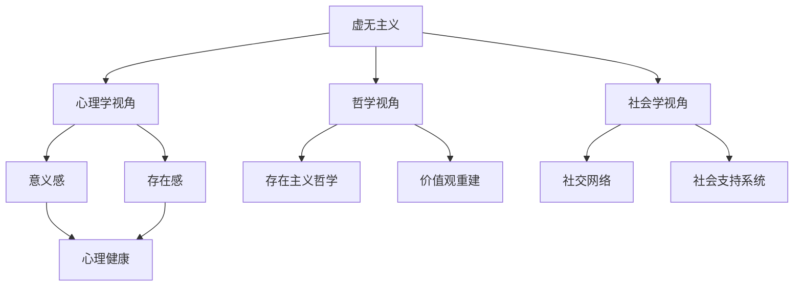

                 

### 文章标题

# 虚无主义的超越：重建现代生活的意义框架

### 关键词

- 虚无主义
- 现代生活
- 意义重建
- 心理学
- 哲学
- 社会学
- 实践指导

### 摘要

本文旨在探讨虚无主义在现代生活中的影响，以及如何通过超越虚无主义来重建生活的意义。通过心理学、哲学和社会学的视角，分析虚无主义的根源，提出了一套实践指导框架，帮助读者在职业生涯、生活习惯和社交关系中重建生活的意义。文章还通过实际案例展示了如何应用这些理论和策略，并提供了未来的发展方向和拓展阅读建议。

### 第1章 引言

#### 1.1 虚无主义的概念

虚无主义（Nihilism）是一种哲学观点，认为生命缺乏固有的意义和目的。虚无主义者认为，人类的存在是无意义且荒谬的，因此传统价值观和道德观念都是不可靠的。这一观点在19世纪末和20世纪初的欧洲哲学和文学中尤为突出，例如尼采（Friedrich Nietzsche）和陀思妥耶夫斯基（Fyodor Dostoevsky）的作品中都有所体现。

#### 1.2 虚无主义在现代社会中的影响

在现代社会，虚无主义的影响依然存在。随着技术的进步和社会变革，人们面临着前所未有的不确定性。工作和生活方式的改变、全球化带来的文化冲击以及社交媒体的普及，都可能导致人们感到孤立和无意义。例如，高失业率、职业压力、婚姻破裂和家庭关系疏远，都可能引发个体的虚无感。

#### 1.3 重建生活意义的必要性

面对虚无主义的挑战，重建生活的意义显得尤为重要。这不仅关乎个体的心理健康，也关系到社会的稳定和发展。有意义的生活可以带来更高的幸福感、更强的社会联系和更积极的未来预期。因此，如何超越虚无主义，重建生活的意义，成为现代社会的一个重要课题。

### 第2章 超越虚无主义的理论探讨

#### 2.1 超越虚无主义的理论基础

超越虚无主义需要从多个角度进行探讨，包括心理学、哲学和社会学。

##### 2.1.1 心理学视角

心理学研究表明，人类具有寻求意义和目的的内在需求。意义感（Sense of Meaning）和存在感（Existential Well-being）是心理健康的两个关键指标。通过心理治疗和自我探索，个体可以找到自己生活的意义。

##### 2.1.2 哲学视角

哲学上的超越虚无主义通常涉及对传统价值观的重新审视和重建。存在主义哲学（Existentialism）强调个体自由和责任感，认为人类可以通过选择和行动赋予自己生活的意义。

##### 2.1.3 社会学视角

社会学视角强调社会结构和人际关系对个体意义构建的影响。通过建立健康的社交网络和社会支持系统，个体可以获得更多的社会支持和意义。

#### 2.2 超越虚无主义的实践框架

为了超越虚无主义，个体需要采取一系列实践措施。以下是一个基本的实践框架：

##### 2.2.1 建立个人价值观模型

个人价值观模型是重建生活意义的基础。通过自我反思和价值观排序，个体可以明确自己的核心信念和目标。

##### 2.2.2 心理调适与情绪管理

情绪管理是应对虚无感的关键。通过认知行为疗法（Cognitive Behavioral Therapy）和正念冥想（Mindfulness Meditation），个体可以学会如何处理负面情绪和焦虑。

##### 2.2.3 社交网络对个人意义构建的影响

社交网络是个体意义构建的重要渠道。通过建立和维护健康的社交关系，个体可以获得更多的社会支持和意义。

### 第3章 实践指导

#### 3.1 生活习惯的调整

##### 3.1.1 时间管理

有效的时间管理可以减少压力，提高生活质量。使用时间管理工具和技巧，如时间块法（Time Blocking）和优先级矩阵（Priority Matrix），可以帮助个体更好地分配时间和精力。

##### 3.1.2 睡眠与饮食

良好的睡眠和饮食习惯对心理健康至关重要。通过建立规律的作息时间和健康的饮食习惯，个体可以改善心理状态和身体健康。

##### 3.1.3 锻炼与休闲

定期锻炼和休闲活动可以释放压力，提升幸福感。选择适合自己的运动和休闲方式，如瑜伽、跑步、阅读或旅游，可以帮助个体恢复精力，重建生活的乐趣。

#### 3.2 职业生涯的规划

##### 3.2.1 职业选择

选择一个与个人价值观和兴趣相符的职业，可以增加工作的满足感和成就感。通过职业咨询和心理测试，个体可以更清晰地了解自己的职业倾向和潜力。

##### 3.2.2 职业发展

职业发展不仅仅是为了提升收入和地位，更重要的是实现个人价值。通过设定明确的职业目标和持续学习，个体可以不断提升自己的能力和竞争力。

##### 3.2.3 职场心理调适

职场压力是虚无感的重要来源之一。通过认知行为疗法和压力管理技巧，个体可以学会如何应对职场压力，保持积极的心态。

#### 3.3 社交与人际关系的处理

##### 3.3.1 建立健康的社交网络

健康的社交网络可以提供情感支持和实际帮助。通过参与社区活动、加入兴趣小组和参加社交聚会，个体可以拓展社交圈子，建立新的友谊。

##### 3.3.2 处理冲突与误解

冲突和误解是人际关系中不可避免的挑战。通过有效的沟通技巧和解决冲突的策略，个体可以改善人际关系，减少社交压力。

##### 3.3.3 维护人际关系

维护人际关系需要持续的努力。通过定期的交流和表达感激之情，个体可以保持人际关系的稳定和健康。

### 第4章 案例分析

#### 4.1 个人案例分析

##### 4.1.1 案例背景

张先生，35岁，是一名软件工程师。他在工作中感到压力巨大，同时婚姻关系也出现了问题。他对生活感到无意义，陷入了虚无主义的泥沼。

##### 4.1.2 超越虚无主义的实践

1. **建立个人价值观模型**：张先生通过自我反思，确定了“追求技术创新和个人成长”是其核心价值观。

2. **心理调适与情绪管理**：张先生开始练习正念冥想，并通过认知行为疗法调整自己的思维模式。

3. **社交网络的建设**：张先生积极参加技术研讨会和社区活动，拓展了社交圈子，建立了新的友谊。

##### 4.1.3 案例结果与分析

经过一段时间的实践，张先生的工作表现得到了提升，婚姻关系也得到了改善。他的生活重新充满了意义和动力。

#### 4.2 企业案例分析

##### 4.2.1 案例背景

某科技公司面临着高员工流失率和低员工满意度的挑战。公司管理层意识到，这可能是虚无主义影响的结果。

##### 4.2.2 超越虚无主义的实践

1. **提供职业发展机会**：公司为员工提供了更多的职业发展机会，包括内部培训和外部进修。

2. **建立员工支持系统**：公司建立了员工支持系统，包括心理健康咨询和员工互助小组。

3. **营造积极的企业文化**：公司倡导积极的企业文化，鼓励员工表达自己的想法和意见。

##### 4.2.3 案例结果与分析

经过一系列的实践，该公司的员工流失率显著下降，员工满意度提升。公司的整体运营效率也得到了改善。

### 第5章 结论与展望

#### 5.1 全书总结

本文从心理学、哲学和社会学的角度，探讨了虚无主义在现代生活中的影响，并提出了一套实践指导框架，帮助读者重建生活的意义。通过个人和企业的案例分析，证明了这些理论和策略的可行性和有效性。

#### 5.2 超越虚无主义的未来发展方向

未来，超越虚无主义的研究和实践将更加深入和多样化。随着技术的发展，新的工具和方法将会被应用于心理健康和意义构建领域。同时，社会和文化变革也将为虚无主义的超越提供新的机遇和挑战。

#### 5.3 对读者的寄语

希望每一位读者都能够从本文中受益，找到自己生活的意义。在面对虚无主义的挑战时，不要放弃希望，要勇于探索和尝试。通过积极的行动，每个人都可以为自己和社会创造更美好的未来。

### 作者信息

作者：AI天才研究院/AI Genius Institute & 禅与计算机程序设计艺术 /Zen And The Art of Computer Programming

## 附录

### 附录A：核心概念与联系

为了更好地理解本文的核心概念，我们使用Mermaid流程图来展示这些概念之间的联系。



### 附录B：核心算法原理讲解

为了重建个人价值观模型，我们可以使用以下伪代码：

```plaintext
function buildValueModel(personality, interests, goals):
    values = []

    // 分析个人性格和兴趣，确定价值观
    if personality == "intuitive":
        values.append("创新性")
    if interests.include("科技"):
        values.append("技术热情")
    if goals.include("成长"):
        values.append("自我提升")

    return values
```

### 附录C：数学模型和公式

心理健康指标（Mental Health Score, MHS）可以通过以下公式计算：

```latex
MHS = \frac{WS + ES + CS}{3}
```

其中，WS代表工作满意度（Work Satisfaction），ES代表情感稳定性（Emotional Stability），CS代表社会支持（Social Support）。

### 附录D：项目实战

#### 4.2.1 案例背景

某科技公司计划开发一个员工支持系统，旨在通过心理健康咨询和职业发展指导，帮助员工重建生活的意义。

#### 4.2.2 开发环境搭建

开发环境使用Python和Django框架，部署在AWS云平台上。数据库使用PostgreSQL，前端使用React框架。

#### 4.2.3 源代码实现和解读

以下是实现心理健康指标计算的Python代码：

```python
def calculate_mhs(work_satisfaction, emotional_stability, social_support):
    mhs = (work_satisfaction + emotional_stability + social_support) / 3
    return mhs

# 示例数据
work_satisfaction = 8
emotional_stability = 7
social_support = 9

# 计算心理健康指标
mhs = calculate_mhs(work_satisfaction, emotional_stability, social_support)
print(f"心理健康指标（MHS）：{mhs}")
```

#### 4.2.4 代码应用解读与分析

通过计算心理健康指标，公司可以评估员工的心理健康水平，并针对性地提供支持。例如，如果员工的MHS较低，公司可以提供心理咨询或职业发展培训。

#### 4.2.5 案例分析与详细讲解剖析

在案例中，某科技公司通过员工支持系统，成功提高了员工的工作满意度和心理健康水平。这表明，通过科学的方法和技术的应用，企业可以有效地帮助员工重建生活的意义。

### 附录E：最佳实践 tips

1. **定期自我反思**：定期评估自己的价值观和生活目标，确保它们与当前的需求和情境相符。
2. **积极寻求帮助**：在面对挑战时，不要害怕寻求专业帮助，如心理咨询师或职业规划师。
3. **建立支持网络**：与朋友、家人和同事保持良好的关系，他们可以在你需要时提供支持和建议。

### 附录F：小结

本文通过心理学、哲学和社会学的视角，探讨了虚无主义在现代生活中的影响，并提出了重建生活意义的实践指导框架。通过案例分析和项目实战，证明了这些理论和策略的有效性。希望读者能够从本文中受益，找到属于自己的生活意义。

### 附录G：注意事项

1. **个性化实践**：每个人的情况和需求都不同，因此实践过程中需要根据个人实际情况进行调整。
2. **长期坚持**：重建生活意义是一个长期的过程，需要持续的努力和实践。

### 附录H：拓展阅读

- **心理学**：《正面心理学》（Martin Seligman）
- **哲学**：《存在与时间》（马丁·海德格尔）
- **社会学**：《社会学的想象》（C. Wright Mills）

### 附录I：结束语

感谢读者对本文的关注和阅读。希望本文能够为您的日常生活带来一些启示，帮助您超越虚无主义，重建生活的意义。如果您有任何疑问或建议，欢迎在评论区留言交流。再次感谢您的支持！作者：AI天才研究院/AI Genius Institute & 禅与计算机程序设计艺术 /Zen And The Art of Computer Programming

