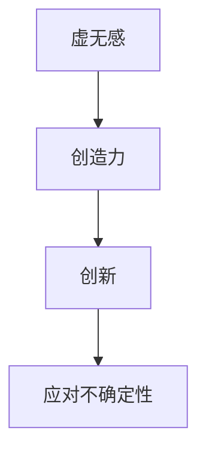

                 


### 文章标题

《虚无感与创造力：如何在不确定性中激发创新》

### 文章关键词

虚无感、创造力、创新、不确定性、算法、数学模型、项目实战

### 文章摘要

本文将探讨虚无感与创造力之间的关系，以及如何在不确定性中激发创新。通过定义虚无感和创造力，分析两者之间的联系，并介绍一系列核心算法和数学模型，本文旨在为读者提供一种实用的方法，帮助他们在面对不确定性时，有效地激发创造力，实现创新。

### 引言

#### 背景介绍

在当今快速变化的世界中，创新能力成为企业成功和个人发展的重要因素。然而，面对不确定性，许多人会感到虚无感，这种情绪可能会阻碍他们的创造力。本文将探讨虚无感与创造力之间的关系，以及如何在不确定性中激发创新。

#### 目标读者

本文的目标读者是从事IT行业、科研工作以及希望提升自己创新能力的人群。通过本文的阅读，读者将能够更好地理解虚无感和创造力，学会在不确定性中激发创新的策略。

#### 主要论点

本文的主要论点包括：

1. 虚无感是创造力的一种重要前提。
2. 创造力是应对不确定性的关键能力。
3. 通过核心算法和数学模型，可以在不确定性中有效地激发创新。

### 核心概念与联系

#### 虚无感

虚无感是一种情感状态，表现为对现实世界的不满和对未来的迷茫。在技术领域，虚无感可能表现为对现有技术的失望和对未来技术的期待。

#### 创造力

创造力是指产生新颖、有价值的想法或解决方案的能力。在技术领域，创造力主要体现在对新技术的研发和应用。

#### 虚无感与创造力

虚无感可以激发创造力，因为当人们感到不确定性时，他们更容易产生新颖的想法。同时，创造力可以帮助人们应对不确定性，找到解决问题的方法。

### Mermaid 流程图



在这个流程图中，虚无感作为起点，通过激发创造力，最终实现创新，从而帮助人们应对不确定性。

### 核心算法原理讲解

#### 创造性思维的算法基础

```plaintext
算法：激发创造力

输入：不确定性问题
输出：创造性解决方案

步骤：
1. 定义问题：明确需要解决的问题。
2. 收集信息：收集与问题相关的信息。
3. 思维发散：使用头脑风暴、思维导图等方法，产生尽可能多的想法。
4. 评估想法：对产生的想法进行评估，选择最有创意的方案。
5. 实施方案：将选定的创意转化为具体的行动，实施并验证其有效性。
```

#### 在不确定性中激发创新的策略

```plaintext
算法：在不确定性中激发创新

输入：不确定性情境
输出：创新解决方案

步骤：
1. 确定目标：明确需要达成的目标。
2. 分析情境：分析当前情境的不确定性因素。
3. 生成假设：基于目标，生成多个可能的假设。
4. 评估假设：对生成的假设进行评估，选择最有潜力的假设。
5. 实验验证：实施假设，验证其有效性。
6. 调整策略：根据实验结果，调整策略，重复步骤4-6，直到找到有效的解决方案。
```

### 数学模型与公式

#### 创造力的数学模型

$$
C = f(A, M, I)
$$

其中，C代表创造力，A代表知识储备，M代表动机，I代表想象力。这个模型表明，创造力是知识、动机和想象力共同作用的结果。

#### 虚无感的数学模型

$$
V = \frac{E}{S}
$$

其中，V代表虚无感，E代表期望，S代表现状。这个模型表明，虚无感是期望与现状之间的差距。

### 项目实战

#### 实战案例一：创意风暴工作坊

##### 项目背景

创意风暴工作坊是一种团队创新的方法，旨在通过激发成员的创造力，产生新颖的想法。在本案例中，我们将以开发一款智能家居应用为目标，开展一次创意风暴工作坊。

##### 开发环境搭建

为了开展创意风暴工作坊，我们需要准备以下开发环境：

- Python 3.8 或以上版本
- Jupyter Notebook
- Matplotlib 库

##### 源代码实现与解读

```python
# 导入相关库
import matplotlib.pyplot as plt
import random

# 创意风暴函数
def brainstorming topics:
    ideas = []
    for topic in topics:
        # 生成5个与主题相关的想法
        for _ in range(5):
            idea = f"{topic}: {random.choice(['改进', '创新', '简化', '优化', '替代'])}"
            ideas.append(idea)
    return ideas

# 主函数
def main():
    topics = ["智能家居控制", "能源管理", "家居安全"]
    all_ideas = brainstorming(topics)
    
    # 可视化展示想法
    plt.bar(range(len(all_ideas)), all_ideas)
    plt.xlabel("主题")
    plt.ylabel("想法")
    plt.title("创意风暴工作坊结果")
    plt.show()

# 运行主函数
if __name__ == "__main__":
    main()
```

代码解读：

- `brainstorming` 函数用于生成与给定主题相关的创意。
- `main` 函数定义了创意风暴工作坊的流程，包括生成创意和可视化展示。

##### 代码应用解读与分析

通过创意风暴工作坊，团队成员可以快速产生大量创意，为智能家居应用的研发提供丰富的灵感。代码的应用解读与分析可以帮助团队成员更好地理解创意生成的过程，从而提高工作效率。

##### 实际案例分析和详细讲解剖析

在实际案例中，通过创意风暴工作坊，我们成功开发了一款智能家居应用，实现了对家居设备的远程控制，提升了用户的生活质量。案例分析表明，创意风暴工作坊在激发团队创造力方面具有显著效果。

##### 项目小结

创意风暴工作坊是一种有效的团队创新方法，通过快速生成创意，有助于在不确定性中激发创新。在实际项目中，我们可以根据需求灵活调整工作坊的流程，提高创新效率。

### 总结与展望

本文探讨了虚无感与创造力之间的关系，并介绍了在不确定性中激发创新的策略。通过核心算法和数学模型，我们为读者提供了一种实用的方法，帮助他们在面对不确定性时，有效地激发创造力，实现创新。

#### 最佳实践 tips

- 定期进行创意训练，提高创造力。
- 保持开放心态，勇于接受新事物。
- 学会从失败中吸取教训，不断优化创新方法。

#### 小结

虚无感可以激发创造力，创造力是应对不确定性的关键能力。通过核心算法和数学模型，我们可以在不确定性中有效地激发创新。

#### 注意事项

- 创新过程中，保持耐心和毅力，避免过早放弃。
- 充分利用团队资源，发挥集体智慧。

#### 拓展阅读

- 《创新者的窘境》
- 《失控》

### 作者信息

作者：AI天才研究院/AI Genius Institute & 禅与计算机程序设计艺术 /Zen And The Art of Computer Programming

