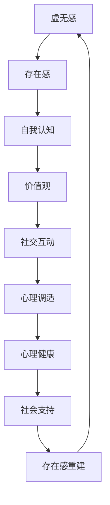
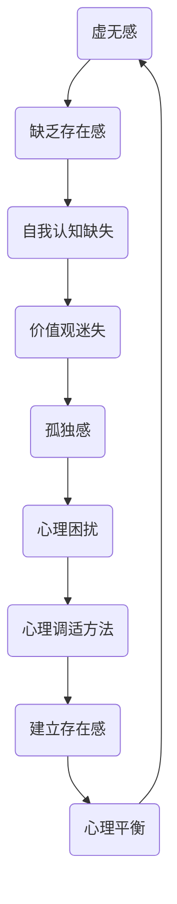
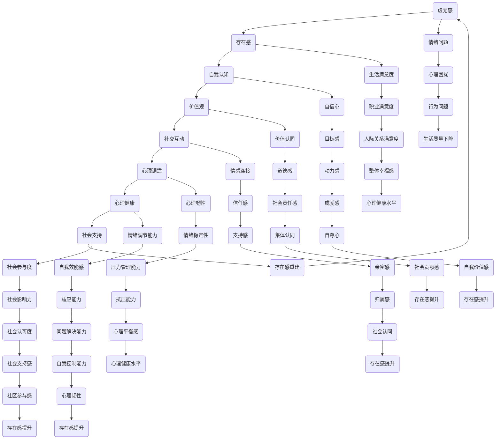

                 

# 文章标题

《虚无感与存在感：现代人的心理困境》

> 关键词：虚无感、存在感、心理困境、现代生活、心理调适

> 摘要：本文探讨了现代社会中普遍存在的虚无感和存在感问题，分析了其背景、原因和影响，并提出了一系列的解决方案，旨在帮助现代人重拾内心的平衡与满足。

---

### 第1章 引言

在信息爆炸、快节奏的现代社会中，许多人感受到了一种深切的虚无感和存在感的缺失。这种心理困境不仅影响了个体的心理健康，也对社会和谐产生了负面影响。为了深入理解这一现象，我们需要首先明确虚无感和存在感的定义，并探讨其普遍性及其背后的原因。

**1.1 心理困境的背景与现状**

虚无感通常指的是个体感受到的内心空洞、缺乏意义和目的感的状态。存在感则是指个体在生活和工作中感受到的自己的价值和存在的意义。在现代社会，虚无感和存在感的缺失似乎成为了一种普遍现象。据调查，大约有20%到30%的人在某些时刻会感到虚无感，而存在感缺失的现象也愈发明显。

**1.1.1 虚无感与存在感的定义**

虚无感是一种心理状态，表现为对生活缺乏兴趣、目标感不强，甚至对生命的意义感到迷茫。存在感则是一种积极的内心体验，表现为个体能够感受到自己在社会和生活中的价值和作用。

**1.1.2 心理困境的普遍性**

随着社会的快速发展，越来越多的人感到内心的空虚和困惑。这种困境不仅存在于个体，也影响着整个社会。例如，工作压力、人际关系问题、以及社交媒体的负面影响，都是导致虚无感和存在感缺失的重要因素。

**1.1.3 本书的目的与意义**

本书旨在深入探讨虚无感和存在感这一现代人的心理困境，通过分析其背景和原因，提供一系列有效的解决方案。这不仅有助于个体的心理健康，也有助于构建更加和谐、有意义的社会。

### 第2章 现代社会的心理挑战

现代社会的快速变迁和多元文化的影响，使得人们的心理状态面临着前所未有的挑战。在这一章节中，我们将探讨社会变迁对心理的影响，以及个人主义与集体主义的冲突，这些因素如何加剧了现代人的虚无感和存在感缺失。

**2.1 社会变迁与心理变化**

社会变迁是一个复杂的过程，它不仅改变了人们的生活方式，也深刻影响了他们的心理状态。以下是几个关键因素：

**2.1.1 工业化与信息化**

工业化和信息化进程的加快，使得社会结构发生了根本性的变化。传统的农业社会向工业社会和后工业社会的转变，带来了职业流动性的增加、工作压力的增大，以及个人自我实现的需求。

**2.1.2 物质繁荣与精神空虚**

随着经济的发展和物质的丰富，人们的生活水平得到了显著提高。然而，物质满足并不能完全填补内心的空虚。许多人发现，尽管他们拥有了更多的物质财富，但内心的幸福感并未相应增加。

**2.1.3 社交媒体的利与弊**

社交媒体的兴起，为人们提供了前所未有的交流平台。它使人们能够更方便地与他人保持联系，分享生活和观点。然而，过度依赖社交媒体也可能导致人际关系的表面化，以及个体对真实社交的疏离感。

**2.2 个人主义与集体主义的冲突**

个人主义和集体主义是两种不同的价值观体系，它们在现代社会中常常发生冲突：

**2.2.1 个人主义的发展**

个人主义强调个体的自由、权利和追求个人幸福。在现代社会，个人主义的价值观得到了广泛认同，人们更加注重自我实现和个人成长。

**2.2.2 集体主义的衰落**

然而，随着个人主义的兴起，集体主义的地位有所下降。集体主义强调社会整体利益和群体认同，它对于维护社会和谐和团结具有重要意义。

**2.2.3 冲突对心理的影响**

个人主义与集体主义的冲突，导致了个体在心理上的困惑和矛盾。一方面，人们渴望实现个人价值，追求自我实现；另一方面，他们也希望得到社会的认同和支持。这种冲突加剧了虚无感和存在感缺失的现象。

通过以上分析，我们可以看到，现代社会的心理挑战是多方面的，它不仅涉及到个体的内心状态，也关系到社会结构和价值观的变化。理解这些因素，对于我们更好地应对心理困境具有重要意义。

### 第3章 虚无感的根源

虚无感是一种深刻的心理状态，它不仅仅是表面上的情绪问题，更是深层次的认知和价值观念的缺失。在这一章节中，我们将深入探讨虚无感的根源，从内在和外在两个角度分析导致虚无感的原因。

**3.1 内在因素**

内在因素是指那些源于个人内心世界的因素，它们直接影响个体的心理健康和自我认知。

**3.1.1 自我认知的缺失**

自我认知是指个体对自己的了解和认识。在现代社会中，许多人由于长期受外界评价和压力的影响，往往对自己的认知产生了偏差，导致自我认知的缺失。这种缺失使得个体难以建立清晰的自我形象，从而感到虚无和迷茫。

**3.1.2 价值观的迷失**

价值观是人们行为和决策的指导原则。在物质丰富、信息爆炸的现代社会中，人们的价值观受到了极大的冲击。许多人迷失在追求物质财富和表面成功的道路上，忽视了内在的价值追求。这种迷失导致个体感到自己的存在缺乏真正的意义和目的。

**3.1.3 孤独感与疏离感**

孤独感和疏离感是虚无感的重要表现形式。在现代社会中，由于社交方式的多样化和社交网络的普及，个体表面上似乎与他人保持着频繁的交流，但实际上却缺乏深刻的情感连接。这种表面的社交和内心的孤独形成了强烈的对比，加剧了虚无感的体验。

**3.2 外在因素**

外在因素是指那些来自社会环境、媒体影响和生活方式等方面的因素，它们间接或直接地影响着个体的心理健康。

**3.2.1 社会环境**

社会环境的快速变迁和竞争压力，使得人们面临巨大的生存压力。在追求物质成功的道路上，许多人忽略了自己的内心需求，导致心理上的空虚和迷茫。此外，社会的不公平和不确定性，也可能加剧个体的焦虑和恐惧，从而产生虚无感。

**3.2.2 媒体影响**

媒体在塑造公众意识和价值观方面具有巨大影响力。社交媒体上的成功故事和完美生活，往往与现实生活形成了巨大的反差，使得个体感到自己无法达到这些标准，从而产生自卑和无力感。此外，过度接触负面新闻和暴力内容，也可能导致个体产生消极情绪和虚无感。

**3.2.3 生活方式的变化**

生活方式的变化，特别是工作压力的增加和休闲时间的减少，也对个体的心理健康产生了负面影响。长时间的工作和繁忙的生活节奏，使得个体难以找到属于自己的时间和空间，从而产生虚无感和存在感缺失。

通过以上分析，我们可以看到，虚无感的根源是复杂的，既包括内在的自我认知和价值观念的缺失，也受到外在社会环境、媒体影响和生活方式变化的冲击。理解这些根源，有助于我们更好地应对虚无感，找到重拾内心平衡的方法。

### 第4章 存在感的重建

存在感是现代人在追求自我价值和社会认同过程中所追求的一种心理状态。重建存在感，需要从自我探索、社交互动和心理调适等多个方面入手。在这一章节中，我们将详细探讨这些策略，帮助现代人重拾内心的平衡与满足。

**4.1 自我探索**

自我探索是重建存在感的第一步，它关乎个体对自己的了解和认知。

**4.1.1 自我认知的提升**

自我认知的提升是自我探索的核心。通过自我反思和自我评估，个体可以更加清晰地认识自己的优点和不足，从而制定出适合自己的目标和计划。具体方法包括：

- **日记记录**：定期记录自己的所思所感，通过文字梳理自己的内心世界。
- **心理测试**：通过专业的心理测试工具，了解自己的性格特点、优势和不足。
- **反馈与交流**：与他人交流，获取外界的反馈，从而更全面地了解自己。

**4.1.2 价值观的重塑**

价值观是指导个体行为的准则，重建存在感需要建立符合个体内心需求的价值观体系。这可以通过以下方法实现：

- **反思传统价值观**：审视并反思传统价值观的合理性，结合自己的经历和感受，形成新的价值观。
- **设立人生目标**：根据自己的价值观，设立短期和长期的人生目标，并制定实现这些目标的计划。
- **持续学习和成长**：通过不断学习和实践，提升自己的能力和素质，从而在实现目标的过程中增强存在感。

**4.1.3 内心的平静与满足**

内心的平静和满足是存在感的重要组成部分。以下方法可以帮助个体达到这一状态：

- **冥想和正念**：通过冥想和正念练习，培养专注力，减少杂念，增强内心的平静。
- **兴趣爱好**：培养和探索自己的兴趣爱好，通过创作和参与活动，获得满足感和成就感。
- **感恩练习**：每天记录自己感激的事物，培养感恩的心态，增强内心的幸福感。

**4.2 社交互动**

社交互动是重建存在感的重要途径，它关乎个体与他人的关系和互动。

**4.2.1 人际关系的建立与维护**

建立和维护良好的人际关系，可以增强个体的存在感。以下是一些建立和维护人际关系的建议：

- **主动沟通**：主动与他人交流，表达自己的想法和感受，建立信任和理解。
- **倾听他人**：倾听他人的需求和感受，给予关心和支持，建立互助的关系。
- **共同活动**：参与共同的兴趣和活动，增进彼此的了解和信任。

**4.2.2 社交网络与真实社交的平衡**

在现代社会，社交网络成为人们交流的重要渠道。然而，过度依赖社交网络也可能导致真实社交的缺失。以下是一些建议，帮助个体在社交网络和真实社交之间找到平衡：

- **适度使用社交网络**：合理安排时间，避免过度沉迷于社交网络，确保有足够的时间用于现实生活中的社交活动。
- **线上线下的转换**：通过线上交流建立联系后，适时转换为线下见面，增强真实社交的体验。
- **深度互动**：在真实社交中，注重深度互动和情感连接，避免表面化的社交。

**4.2.3 社区参与与互助**

参与社区活动和互助，可以增强个体的社会责任感和存在感。以下是一些建议：

- **志愿活动**：参与志愿活动，为社会做出贡献，感受到自己的价值。
- **社区参与**：积极参与社区建设，与他人共同营造和谐的生活环境。
- **互助网络**：建立互助网络，与他人分享资源和经验，共同成长。

通过自我探索、社交互动和心理调适，现代人可以逐步重建存在感，重拾内心的平衡与满足。这些策略不仅有助于个体的心理健康，也有助于构建更加和谐、有意义的社会。

### 第5章 心理健康策略

心理健康是现代生活中不可或缺的一部分，它直接影响到个体的生活质量和工作效率。为了应对虚无感和存在感缺失，我们需要采取一系列有效的心理健康策略。这些策略包括心理调适方法、心理咨询与治疗，以及自我监测等。以下将详细探讨这些方法。

**5.1 心理调适方法**

**5.1.1 呼吸练习**

呼吸练习是一种简单有效的心理调适方法，它可以帮助个体放松身心，减轻压力。以下是一种常用的呼吸练习方法：

1. **深呼吸**：找一个安静的地方，坐或躺下来，闭上眼睛。深吸一口气，尽量让腹部鼓起，保持呼吸缓慢而均匀。
2. **持气**：深吸一口气后，屏住呼吸，保持几秒钟。
3. **呼气**：缓慢地呼出空气，尽量让腹部下陷。
4. **重复**：重复上述步骤，每次练习10-15分钟。

**5.1.2 冥想与正念**

冥想与正念是一种培养注意力、减少焦虑和提升心理韧性的方法。以下是一种简单的冥想练习：

1. **选择环境**：找一个安静、舒适的地方。
2. **姿势**：选择一个舒适的姿势，可以坐或躺。
3. **专注**：闭上眼睛，将注意力集中在呼吸上，当思维跑偏时，轻轻地将注意力拉回呼吸。
4. **持续**：每天练习10-20分钟，逐渐增加练习时间。

**5.1.3 情绪管理技巧**

情绪管理是心理健康的重要组成部分。以下是一些情绪管理技巧：

- **情绪识别**：学会识别和理解自己的情绪，不要压抑或否认。
- **情绪表达**：找到合适的方式表达情绪，如与朋友、家人或心理咨询师交流。
- **情绪转换**：尝试将负面情绪转换为积极的能量，如通过运动、创作或冥想。

**5.2 心理咨询与治疗**

**5.2.1 咨询师的职业选择**

选择合适的心理咨询师对于治疗心理困境至关重要。以下是一些选择咨询师的建议：

- **资质认证**：确保咨询师具备专业的资质和认证。
- **专业领域**：根据自身的心理问题，选择擅长相关领域的咨询师。
- **沟通舒适度**：选择一个与自己沟通舒适、能够建立信任关系的咨询师。

**5.2.2 常见心理治疗方式**

以下是一些常见的心理治疗方式：

- **认知行为疗法（CBT）**：通过识别和改变负面思维模式，帮助个体改善情绪和行为。
- **精神分析疗法**：通过探索潜意识，解决深层次的心理冲突。
- **人本主义疗法**：强调个体的自我实现和成长，提供情感支持和鼓励。
- **家庭治疗**：通过改善家庭关系，解决家庭成员间的心理问题。

**5.2.3 心理健康的自我监测**

自我监测是维持心理健康的重要手段。以下是一些自我监测的方法：

- **情绪日记**：定期记录自己的情绪变化，了解情绪的规律和触发因素。
- **心理健康测试**：通过专业的心理健康测试工具，评估自己的心理健康状况。
- **健康生活习惯**：保持良好的生活习惯，如规律的饮食、充足的睡眠和适量的运动。

通过心理调适方法、心理咨询与治疗，以及自我监测，现代人可以更好地应对虚无感和存在感缺失，维持心理健康。这些策略不仅有助于个体的内心平衡，也有助于提高整体生活质量。

### 第6章 职场中的心理困境

在现代职场中，虚无感和存在感缺失的现象愈发普遍，这不仅仅是个体的问题，也关系到整个组织的效率和氛围。在这一章节中，我们将探讨职场中的心理困境，包括压力来源、虚无感的识别和应对策略，以及如何提升职场存在感。

**6.1 职场压力与虚无感**

职场压力是现代职场人士面临的常见问题。以下是几个主要的压力来源：

**6.1.1 工作压力的来源**

- **工作负荷**：工作量大且紧急，导致加班和超负荷工作。
- **绩效压力**：对工作成果和绩效的要求高，导致自我压力增大。
- **职场竞争**：激烈的职场竞争使得个体感受到巨大的压力和焦虑。
- **职业发展**：职业晋升的不确定性和职业发展的瓶颈，使得个体对未来感到迷茫。

**6.1.2 职场虚无感的识别**

职场虚无感通常表现为对工作的兴趣和热情减少，感觉自己的工作缺乏意义和价值。以下是识别职场虚无感的几个迹象：

- **工作效率下降**：感到工作无趣，缺乏动力，导致工作效率降低。
- **工作态度消极**：对工作持有消极态度，抱怨和抵触情绪增加。
- **职业迷茫**：对职业前景感到不确定，不知道自己的工作是否有意义。
- **情绪波动**：情绪不稳定，容易焦虑和抑郁。

**6.1.3 应对策略**

为了应对职场中的虚无感，可以采取以下策略：

- **自我反思**：定期反思自己的工作态度和价值观，找到工作的意义和目标。
- **设定目标**：设定短期和长期的工作目标，明确自己的职业发展方向。
- **寻求支持**：与同事、上级或人力资源部门沟通，寻求支持和帮助。
- **休息与放松**：合理安排工作和休息时间，确保充足的休息和放松。

**6.2 职场存在感的提升**

提升职场存在感是增强个体职业满意度和工作动力的重要途径。以下是一些建议：

**6.2.1 个人成就与职业发展**

- **设定目标**：设定清晰的职业目标，并制定实现这些目标的计划。
- **持续学习**：通过学习和培训，提升自己的专业技能和知识。
- **工作挑战**：主动接受具有挑战性的工作，通过克服困难提升自我成就感。

**6.2.2 团队合作与领导力**

- **团队合作**：积极参与团队合作，与他人共同完成任务，增强归属感和存在感。
- **领导力培养**：通过参与管理或领导工作，提升自己的领导能力和影响力。

**6.2.3 工作与生活的平衡**

- **时间管理**：合理安排工作和生活时间，确保有充足的休息和私人时间。
- **工作环境优化**：改善工作环境，如舒适的办公环境和良好的工作氛围。
- **家庭与工作的平衡**：平衡家庭和工作的关系，确保家庭支持和工作成就的双重满足。

通过以上策略，职场人士可以更好地应对心理困境，提升职场存在感，从而提高职业满意度和整体幸福感。

### 第7章 家庭与亲密关系中的心理困境

家庭与亲密关系是现代人生活中至关重要的一部分，它们不仅影响个人的心理健康，也关系到整个社会的和谐。在这一章节中，我们将探讨家庭与亲密关系中的心理困境，分析其中的挑战，并提出提升存在感的策略。

**7.1 家庭关系的挑战**

家庭关系是一个复杂的互动系统，其中充满了爱与冲突。以下是家庭关系中的几个主要挑战：

**7.1.1 代际沟通障碍**

代际差异是家庭沟通的常见障碍。不同年龄段的成员在价值观、生活方式和沟通方式上可能存在较大差异，导致沟通不畅和误解。为了改善代际沟通，可以采取以下策略：

- **倾听与尊重**：积极倾听对方的观点，尊重不同的意见和习惯。
- **共同活动**：通过共同参与家庭活动，增进彼此的了解和情感连接。
- **定期沟通**：设立固定的家庭会议时间，讨论家庭事务和情感问题。

**7.1.2 家庭角色冲突**

在家庭中，不同成员往往承担着不同的角色和责任，这些角色和责任之间的冲突可能会导致心理困境。例如，夫妻之间的角色冲突可能导致婚姻关系紧张。为了缓解这种冲突，可以采取以下策略：

- **明确角色**：明确每个家庭成员的角色和责任，避免角色重叠和责任模糊。
- **协商解决**：家庭成员之间通过协商，找到解决问题的最佳方法。
- **寻求专业帮助**：如果角色冲突严重，可以寻求家庭咨询师的帮助，进行专业的沟通和协调。

**7.1.3 夫妻关系问题**

夫妻关系是家庭关系的核心，良好的夫妻关系对家庭成员的幸福感至关重要。然而，现代社会中，夫妻关系面临诸多挑战，如：

- **沟通不畅**：夫妻之间缺乏有效的沟通，导致误解和冲突。
- **情感疏离**：由于工作忙碌或其他原因，夫妻之间缺乏情感交流和身体接触。
- **价值观差异**：夫妻在价值观和生活方式上的差异，可能导致关系紧张。

为了改善夫妻关系，可以采取以下策略：

- **积极沟通**：建立良好的沟通机制，定期进行深入的交流。
- **共同兴趣**：培养共同的兴趣和爱好，增强情感连接。
- **情感支持**：在对方需要时，给予情感支持和理解，共同面对生活的挑战。

**7.2 亲密关系中的存在感**

在家庭和亲密关系中，提升存在感是增强个人幸福感的重要途径。以下是几个提升存在感的策略：

**7.2.1 真实沟通与情感连接**

真实沟通是建立亲密关系的基础。通过坦诚地表达自己的想法和感受，建立深层次的情感连接。以下是一些建议：

- **表达爱意**：经常表达对伴侣的爱意和感激，增强情感的紧密感。
- **倾听与理解**：倾听伴侣的观点，理解他们的感受和需求。
- **情感支持**：在伴侣需要时，提供情感支持和鼓励。

**7.2.2 情感需求与支持**

在亲密关系中，双方都需要满足彼此的情感需求。以下是一些建议：

- **了解需求**：了解伴侣的情感需求，尽量满足他们的需求。
- **情感互动**：通过日常互动，如共进晚餐、散步或共同观看电影，增进情感互动。
- **危机应对**：在遇到危机时，共同面对，提供彼此的支持。

**7.2.3 婚姻与伴侣关系的维护**

维护婚姻和伴侣关系是一个长期的过程，需要双方的共同努力。以下是一些建议：

- **共同目标**：设立共同的生活目标，增强关系的前进动力。
- **信任与忠诚**：建立信任，保持忠诚，避免背叛和欺骗。
- **定期评估**：定期评估关系的状况，及时解决可能出现的问题。

通过以上策略，家庭和亲密关系中的成员可以更好地应对心理困境，提升存在感，从而建立和谐、幸福的家庭和亲密关系。

### 第8章 结论

通过本文的探讨，我们深刻认识到虚无感和存在感缺失在现代生活中的普遍性和严重性。虚无感使个体感到内心的空虚和迷茫，而存在感缺失则导致个体对生活和工作的失去热情。为了解决这一心理困境，我们提出了一系列的解决方案，包括自我探索、社交互动、心理调适、职业发展等多个方面。

首先，自我探索是重建存在感的基础。通过自我认知的提升、价值观的重塑和内心的平静与满足，个体可以更加清晰地认识到自己的价值和存在的意义。其次，社交互动是增强存在感的重要途径。建立和维护良好的人际关系，参与社区活动和互助网络，可以增强个体的社会责任感和存在感。

此外，心理调适方法、心理咨询与治疗以及自我监测等心理健康策略，对于应对虚无感和存在感缺失也具有重要意义。通过这些策略，个体可以更好地管理情绪，找到心理平衡，从而提升生活质量。

展望未来，心理健康将越来越受到社会的关注。随着科技的发展，心理健康工具和资源的普及，个体将更容易获得专业的心理支持。同时，社会也将更加重视心理健康，推动心理健康教育和预防措施的普及，以构建更加和谐、有意义的社会。

在解决心理困境的过程中，我们不仅需要个体的努力，更需要社会各界的关注和支持。通过共同努力，我们可以帮助现代人重拾内心的平衡与满足，建设一个更加健康、幸福的社会。

### 附录

**附录 A 资源与进一步阅读**

**A.1 推荐书籍与论文**

- **《人类简史》：[尤瓦尔·赫拉利](https://book.douban.com/author/1056741)**，对人类历史和文化的深刻解读，有助于理解现代社会变迁对心理的影响。
- **《当下的力量》：[埃克哈特·托勒](https://book.douban.com/author/1089921)**，关于冥想和正念的实践指南，有助于提升内心的平静与满足。
- **《心理学的本质》：[威廉·詹姆斯](https://book.douban.com/author/1040153)**，探讨心理现象的本质和人类行为的动机。

**A.2 心理咨询与治疗资源**

- **国际心理咨询师协会（ICF）**：[https://www.coachingfederation.org.uk/](https://www.coachingfederation.org.uk/)
- **美国心理学会（APA）**：[https://www.apa.org/](https://www.apa.org/)
- **心理咨询在线资源**：[https://www.psychologytoday.com/](https://www.psychologytoday.com/)

**A.3 实践案例与研究**

- **案例研究1**：[如何通过冥想提升心理健康？](https://www.health.harvard.edu/mind-and-mood/how-meditation-can-help-your-mental-health)
- **案例研究2**：[职场压力管理实践](https://www.workplacehealth.org.uk/our-work/resilience)
- **案例研究3**：[如何建立和维护健康的家庭关系？](https://www.relationshipresearchers.com/how-to-create-a-healthy-relationship)

通过阅读这些资源，读者可以更深入地了解虚无感和存在感缺失的问题，并找到适合自己的解决方案。

### 核心概念与联系

核心概念之间的联系是理解本文主题的关键。以下是一个Mermaid流程图，展示了虚无感与存在感、自我认知、价值观、社交互动、心理调适和心理健康之间的关系：



这个流程图说明了虚无感如何通过自我认知和价值观的重建，以及通过社交互动和心理调适，最终实现心理健康和社会支持的提升，从而重建存在感。

### 虚无感与存在感关系图

以下是一个简化的Mermaid流程图，展示了虚无感与存在感之间的关系，以及它们如何通过自我认知、价值观和社交互动等途径相互影响：



这个图解显示了虚无感的根源和如何通过一系列心理调适方法来重建存在感，从而实现心理平衡。

### 第4章 虚无感与存在感重建算法

为了更系统化和结构化地重建虚无感和提升存在感，我们可以设计一个算法，该算法分为自我探索、价值观重构、社交互动和心理调适四个主要模块。以下是该算法的伪代码和详细说明：

```latex
\begin{algorithm}
\caption{虚无感与存在感重建算法}
\begin{algorithmic}[1]
\State 初始化：设定目标存在感水平
\State 初始化：设定自我探索、价值观重构、社交互动和心理调适的阶段性目标

\State 自我探索模块：
\State \textbf{子步骤1}：进行自我认知评估（通过心理测试或日记记录）
\State \textbf{子步骤2}：根据评估结果，制定个人提升计划
\State \textbf{子步骤3}：执行个人提升计划，如参加自我提升课程或阅读相关书籍

\State 价值观重构模块：
\State \textbf{子步骤1}：反思并识别当前价值观
\State \textbf{子步骤2}：根据个人目标，重新构建价值观体系
\State \textbf{子步骤3}：实践新的价值观，如参与志愿活动或学习新技能

\State 社交互动模块：
\State \textbf{子步骤1}：评估当前社交网络和互动模式
\State \textbf{子步骤2}：建立和维护有意义的人际关系
\State \textbf{子步骤3}：参与社区活动，提升社交存在感

\State 心理调适模块：
\State \textbf{子步骤1}：选择合适的心理调适方法（如冥想、呼吸练习）
\State \textbf{子步骤2}：定期执行心理调适练习，如每日冥想
\State \textbf{子步骤3}：监测心理状态，调整调适策略

\State 结束：评估总体存在感水平，根据需要调整策略
\end{algorithmic}
\end{algorithm}
```

**详细说明：**

1. **自我探索模块**：通过自我认知评估，了解自身的优点和不足，制定提升计划。实践过程中，可以通过记录日记或参加自我提升课程来加深对自我的认识。

2. **价值观重构模块**：反思并识别当前的价值观，根据个人目标和需求，重新构建价值观体系。通过实践新价值观，如参与志愿活动或学习新技能，强化个人价值观。

3. **社交互动模块**：评估当前的社交网络和互动模式，建立和维护有意义的人际关系。参与社区活动，提升社交存在感，增强社交网络的深度和质量。

4. **心理调适模块**：选择合适的心理调适方法，如冥想、呼吸练习等，定期执行心理调适练习，以维持心理平衡。监测心理状态，根据实际情况调整调适策略。

通过这个算法，现代人可以系统地重建虚无感，提升存在感，从而实现心理平衡和生活质量的提高。实际应用中，可以根据个体情况调整和优化各个模块的具体内容和执行策略。

### 虚无感与存在感关系图（详解）

虚无感与存在感之间的关系复杂而深远，它们相互作用、相互影响。为了更好地理解这一关系，我们可以通过一个详细的流程图来展示它们之间的联系。



**关系说明：**

- **虚无感（A）**：虚无感通常源自自我认知的缺失、价值观的迷失和社交互动的疏离。它导致情绪问题、心理困扰和行为问题，从而影响生活质量。

- **存在感（B）**：存在感与自我认知、价值观、社交互动和心理调适密切相关。通过提升自我认知、重构价值观、建立社交关系和进行心理调适，可以增强存在感。

- **自我认知（C）**：自我认知直接影响虚无感和存在感。自信、目标感和成就感都是自我认知的体现，它们与自尊心和自我价值感紧密相关。

- **价值观（D）**：价值观为个体提供行为和决策的指导原则。价值认同、道德感和社会责任感与存在感密切相关，它们促进集体认同和社会贡献感。

- **社交互动（E）**：社交互动影响情感连接、信任感、支持感和归属感。这些因素增强社会认同，从而提升存在感。

- **心理调适（F）**：心理调适能力如情绪调节、自我效能感、适应能力和问题解决能力，有助于提升心理韧性，从而增强存在感。

- **心理健康（G）**：心理健康水平是存在感的重要保障。心理韧性、情绪稳定性和压力管理能力都与心理健康密切相关。

- **社会支持（H）**：社会参与度、社会影响力和社会认可度都是社会支持感的重要体现。社会支持感增强个体的归属感和社会认同。

通过这个关系图，我们可以看到虚无感和存在感是如何通过多个层面相互作用的。理解这些关系有助于我们采取更有效的策略，帮助现代人重建存在感，提升心理健康和生活质量。

