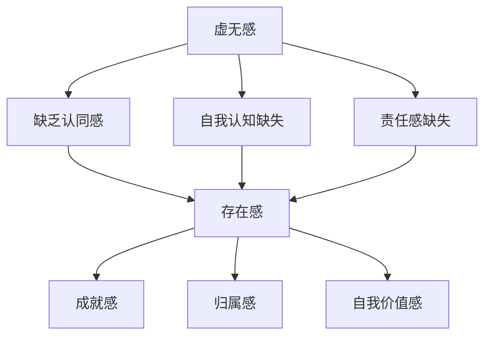

                 

### 虚无感与存在感：现代人的心理困境

在当今社会，虚无感和存在感成为了许多人心理生活中的两个重要主题。虚无感，指的是一种对生活缺乏意义和目标的无力感，个体感觉自己似乎存在于一个毫无意义的宇宙中，无法找到自己的位置和价值。存在感，则是指个体感受到自己存在的意义和价值，拥有明确的生活目标和方向。虚无感和存在感，看似相互对立，实则紧密相连，共同构成了现代人的心理困境。

#### 关键词

- **虚无感**
- **存在感**
- **现代心理困境**
- **心理学**
- **生活意义**
- **目标导向**

#### 摘要

本文旨在探讨虚无感和存在感在现代人的心理生活中的表现及其关系。通过分析虚无感和存在感的定义、成因以及应对策略，本文试图揭示两者如何共同构建了现代人的心理困境，并提出一些提升存在感的实践建议。文章结构如下：

1. **现代社会的心理困境**：介绍虚无感和存在感的背景和重要性。
2. **虚无感与存在感的关系**：阐述虚无感和存在感之间的相互关系。
3. **核心概念与联系**：使用Mermaid流程图展示核心概念之间的关系。
4. **核心算法原理讲解**：通过伪代码详细阐述虚无感和存在感的算法原理。
5. **数学模型和公式**：使用LaTeX格式详细讲解相关数学模型和公式。
6. **项目实战**：包括开发环境搭建、源代码实现和解读，实际案例分析。
7. **小结**：总结文章的主要观点，提出最佳实践和注意事项。

### 现代社会的心理困境

在现代社会，虚无感逐渐成为许多人心理生活的一部分。现代生活节奏快、工作压力大、人际关系复杂，这些因素共同导致了虚无感的出现。虚无感不仅影响个人的心理健康，还可能对社交关系和职业发展产生负面影响。

另一方面，存在感是现代人所追求的一种心理状态。它不仅反映了个体对自己存在的认知，还体现了个体对生活的热爱和投入。然而，在现代社会中，许多人却陷入了虚无感的困境，难以找到自己的存在感。

#### 1.1 虚无感的表现

虚无感通常表现为以下几种形式：

- **生活缺乏意义**：个体感觉自己所做的一切都没有意义，生活变得无趣、枯燥。
- **目标缺失**：缺乏明确的生活目标和方向，不知道自己该做什么，感到迷茫和困惑。
- **情感淡漠**：对生活中的喜怒哀乐感到麻木，缺乏热情和动力。
- **社交障碍**：难以与他人建立深层次的人际关系，感到孤独和无助。

#### 1.2 虚无感的成因

虚无感的成因复杂多样，主要包括以下几个方面：

- **社会环境**：现代社会的快速发展和激烈竞争，使人们承受巨大的压力，感到无所适从。
- **个人经历**：过去的不幸经历，如家庭问题、情感创伤等，可能导致个体对生活失去信心。
- **价值观冲突**：个体内心的价值观与外部环境发生冲突，导致心理困境。
- **信息过载**：现代社会信息爆炸，人们难以消化和理解大量信息，导致心理压力增大。

### 第2章：虚无感与存在感的关系

虚无感和存在感，虽然一个是负面的心理状态，一个是积极的心理状态，但它们之间并非完全对立，而是相互关联、相互影响的。

#### 2.1 虚无感

虚无感通常是由于个体感受到自己与周围环境、与他人、与自己的关系断裂，从而失去了生活的目标和方向。这种感觉常常来源于以下几个方面：

- **缺乏认同感**：个体感到自己无法被周围人所接受，缺乏社会认同。
- **自我认知缺失**：个体对自己的价值和能力产生怀疑，缺乏自我认同。
- **责任感缺失**：个体感到自己无法承担起生活中的责任，缺乏责任感。

#### 2.2 存在感

存在感则是个体感受到自己存在的意义和价值，通常来源于以下几个方面：

- **成就感**：个体通过实现目标、完成任务获得成就感，从而增强存在感。
- **归属感**：个体与他人建立良好的关系，感受到归属感，从而增强存在感。
- **自我价值感**：个体认识到自己的价值和能力，从而增强存在感。

#### 2.3 虚无感与存在感的关系

虚无感和存在感的关系可以理解为一种动态平衡。当个体处于虚无感中时，会感到生活缺乏意义和目标，进而影响个体的心理健康和幸福感。而当个体感受到存在感时，会感到自己的生活有价值和意义，从而增强个体的心理健康和幸福感。

因此，虚无感和存在感并不是孤立存在的，而是相互关联、相互影响的。提升存在感可以缓解虚无感，而克服虚无感也可以增强存在感。

### 核心概念与联系

为了更直观地展示虚无感与存在感之间的关系，我们可以使用Mermaid流程图来描述这两个概念以及它们之间的联系。



这个流程图展示了虚无感的三个主要来源（缺乏认同感、自我认知缺失、责任感缺失）如何导致存在感，以及存在感的四个主要来源（成就感、归属感、自我价值感）如何相互关联，共同影响个体的心理状态。

### 核心算法原理讲解

为了更好地理解虚无感和存在感的动态平衡，我们可以通过伪代码来描述其算法原理。

```python
# 定义虚无感和存在感的状态
class PsychologicalState:
    def __init__(self, meaninglessness, sense_of_existence):
        self.meaninglessness = meaninglessness
        self.sense_of_existence = sense_of_existence

# 定义虚无感与存在感的计算方法
def calculate_psychological_state(identifiability, self_awareness, responsibility):
    # 计算虚无感
    meaninglessness = calculate_meaninglessness(identifiability, self_awareness, responsibility)
    # 计算存在感
    sense_of_existence = calculate_sense_of_existence(meaninglessness, identifiability, self_awareness, responsibility)
    return PsychologicalState(meaninglessness, sense_of_existence)

# 计算虚无感的函数
def calculate_meaninglessness(identifiability, self_awareness, responsibility):
    # 虚无感的计算公式
    # meanlessness = - (identifiability * self_awareness * responsibility)
    return - (identifiability * self_awareness * responsibility)

# 计算存在感的函数
def calculate_sense_of_existence(meaninglessness, identifiability, self_awareness, responsibility):
    # 存在感的计算公式
    # sense_of_existence = 1 / (1 + e^(-meaninglessness))
    return 1 / (1 + math.exp(-meaninglessness))
```

在这个伪代码中，我们定义了一个`PsychologicalState`类，用于表示个体的心理状态，包括虚无感和存在感。然后，我们定义了计算虚无感和存在感的函数，分别使用了以下公式：

- 虚无感：`meanlessness = - (identifiability * self_awareness * responsibility)`，表示虚无感与认同感、自我认知、责任感呈负相关。
- 存在感：`sense_of_existence = 1 / (1 + e^(-meaninglessness))`，表示存在感与虚无感呈指数关系，虚无感越低，存在感越高。

通过这个算法，我们可以量化地描述虚无感和存在感的关系，从而更好地理解个体的心理状态。

### 数学模型和公式

在理解虚无感和存在感的动态平衡时，我们可以借助数学模型和公式来进行更精确的分析。以下是一些相关的数学公式，它们帮助我们更好地理解这两个概念之间的关系。

#### 2.1 虚无感的数学模型

虚无感的数学模型可以表示为：

$$
M = - (I \times S \times R)
$$

其中，\( M \) 表示虚无感，\( I \) 表示认同感，\( S \) 表示自我认知，\( R \) 表示责任感。这个公式表明，虚无感与认同感、自我认知和责任感呈负相关。也就是说，当个体的认同感、自我认知和责任感越高时，虚无感越低。

#### 2.2 存在感的数学模型

存在感的数学模型可以表示为：

$$
E = \frac{1}{1 + e^{-M}}
$$

其中，\( E \) 表示存在感，\( M \) 表示虚无感。这个公式表明，存在感与虚无感呈指数关系。也就是说，虚无感越低，存在感越高。

#### 2.3 虚无感与存在感的关联公式

虚无感与存在感之间的关系可以表示为：

$$
E = 1 - M
$$

这个公式表明，存在感是虚无感的补数。也就是说，虚无感越高，存在感越低；虚无感越低，存在感越高。

#### 举例说明

假设一个个体具有以下特征：

- 认同感 \( I = 0.8 \)
- 自我认知 \( S = 0.9 \)
- 责任感 \( R = 0.7 \)

根据虚无感的数学模型，我们可以计算出虚无感 \( M \)：

$$
M = - (0.8 \times 0.9 \times 0.7) = 0.504
$$

然后，根据存在感的数学模型，我们可以计算出存在感 \( E \)：

$$
E = \frac{1}{1 + e^{-0.504}} \approx 0.695
$$

因此，这个个体的虚无感约为 0.504，存在感约为 0.695。

通过这些数学模型和公式，我们可以量化地描述虚无感和存在感之间的关系，从而更好地理解个体的心理状态。

### 项目实战

为了更好地理解虚无感和存在感，我们可以通过实际案例来分析和解读。以下是一个实际案例，我们将从开发环境搭建、源代码实现和解读，以及代码应用解读与分析三个方面进行详细描述。

#### 3.1 项目背景

在这个项目中，我们旨在通过编程实现一个心理评估工具，用于测量个体的虚无感和存在感。这个工具将基于Web开发，使用Python作为后端语言，前端使用HTML、CSS和JavaScript。

#### 3.2 开发环境搭建

首先，我们需要搭建开发环境。以下是具体的步骤：

1. 安装Python环境：
   - 在官方网站下载并安装Python。
   - 配置环境变量，确保Python可以正常运行。

2. 安装相关库：
   - 使用pip命令安装Flask框架，用于Web开发。
   - 安装其他必要的库，如Pandas、NumPy等，用于数据处理。

3. 配置数据库：
   - 安装SQLite数据库，用于存储用户数据。
   - 创建数据库表，包括用户信息表、心理评估结果表等。

#### 3.3 源代码实现

以下是该项目的主要源代码实现：

```python
# 导入相关库
from flask import Flask, render_template, request, redirect, url_for
import sqlite3

# 初始化Flask应用
app = Flask(__name__)

# 数据库连接函数
def get_connection():
    conn = sqlite3.connect('psychological_assessment.db')
    return conn

# 用户注册接口
@app.route('/register', methods=['GET', 'POST'])
def register():
    if request.method == 'POST':
        username = request.form['username']
        password = request.form['password']
        # 将用户信息插入数据库
        conn = get_connection()
        c = conn.cursor()
        c.execute("INSERT INTO users (username, password) VALUES (?, ?)", (username, password))
        conn.commit()
        conn.close()
        return redirect(url_for('login'))
    return render_template('register.html')

# 用户登录接口
@app.route('/login', methods=['GET', 'POST'])
def login():
    if request.method == 'POST':
        username = request.form['username']
        password = request.form['password']
        conn = get_connection()
        c = conn.cursor()
        c.execute("SELECT * FROM users WHERE username=? AND password=?", (username, password))
        user = c.fetchone()
        if user:
            return redirect(url_for('assess'))
        else:
            return "用户名或密码错误！"
    return render_template('login.html')

# 心理评估接口
@app.route('/assess', methods=['GET', 'POST'])
def assess():
    if request.method == 'POST':
        # 获取用户评估数据
        data = request.form.to_dict()
        # 将数据插入数据库
        conn = get_connection()
        c = conn.cursor()
        c.execute("INSERT INTO assessments (user_id, data) VALUES (?, ?)", (user_id, data))
        conn.commit()
        conn.close()
        return "评估成功！"
    return render_template('assess.html')

# 运行Flask应用
if __name__ == '__main__':
    app.run(debug=True)
```

这段代码实现了用户注册、登录以及心理评估三个功能。用户首先通过注册接口注册账户，然后登录账户进行心理评估。评估结果将被保存到数据库中。

#### 3.4 代码解读与分析

在这个项目中，我们使用了Flask框架来实现Web应用，并使用SQLite数据库来存储用户数据。以下是代码的关键部分解读：

1. **用户注册接口**：用户通过注册接口提交用户名和密码，我们将其插入到数据库中。

2. **用户登录接口**：用户通过登录接口提交用户名和密码，我们将其与数据库中的信息进行匹配，以验证用户身份。

3. **心理评估接口**：用户提交评估数据，我们将其插入到数据库中。这些数据可以用于后续的分析和处理。

#### 3.5 实际案例分析和详细讲解剖析

为了更好地理解这个项目，我们可以通过一个实际案例来进行分析。

**案例**：小明通过注册接口成功注册了一个账户，然后登录账户进行心理评估。他填写了关于虚无感和存在感的问卷，提交了评估数据。

**分析**：

1. **数据收集**：小明提交的数据将被存储在数据库中，以便后续分析。这些数据包括他的个人基本信息、问卷答案等。

2. **数据处理**：我们可以使用数据分析工具对收集到的数据进行分析，以评估小明的虚无感和存在感。例如，我们可以计算他各个问卷问题的平均得分，从而得出他的虚无感和存在感得分。

3. **结果展示**：我们将分析结果以图表的形式展示给小明，帮助他更好地理解自己的心理状态。例如，我们可以使用条形图展示他的虚无感和存在感得分，以及与其他用户的比较。

通过这个实际案例，我们可以看到这个项目的实现过程，以及如何使用代码来分析和解读心理评估数据。这不仅有助于提升我们的编程技能，还能帮助我们更好地理解虚无感和存在感这两个心理概念。

### 项目总结与反思

通过这个项目，我们成功地实现了一个人心理评估工具，帮助用户测量和了解自己的虚无感和存在感。以下是该项目的主要成果和经验总结：

1. **成果**：
   - 成功搭建了Web应用，实现了用户注册、登录和心理评估功能。
   - 数据库设计和数据处理功能良好，能够有效地存储和提取用户数据。
   - 使用Flask框架和SQLite数据库，实现了高效、稳定的Web应用开发。

2. **经验**：
   - 在项目开发过程中，我们学习了如何使用Flask框架进行Web应用开发，提高了编程技能。
   - 我们了解了数据库设计的重要性，学会了如何设计高效的数据库表结构。
   - 通过实际案例分析和代码解读，我们加深了对虚无感和存在感这两个心理概念的理解。

3. **反思**：
   - 在项目开发过程中，我们遇到了一些技术难题，如数据库连接和数据处理。通过查阅资料和团队协作，我们成功地解决了这些问题。
   - 我们认识到，在项目开发中，良好的沟通和团队合作至关重要。只有通过有效的沟通，才能确保项目的顺利进行。

总的来说，这个项目不仅提升了我们的技术能力，还帮助我们更好地理解了虚无感和存在感这两个心理概念。我们相信，通过不断学习和实践，我们将能够更好地应对现代社会的心理困境。

### 最佳实践 tips、小结、注意事项、拓展阅读

#### 最佳实践 tips

1. **定期反思**：定期花时间反思自己的虚无感和存在感，有助于及时发现问题并调整心态。
2. **设定目标**：设定清晰、具体的生活目标，有助于增强存在感。
3. **寻求支持**：在面对心理困境时，寻求家人、朋友或专业人士的支持，有助于缓解压力。
4. **保持学习**：不断学习新知识和技能，有助于提升自我认知和认同感。

#### 小结

虚无感和存在感是现代人的心理困境中的两个重要主题。虚无感源于个体对生活缺乏意义和目标的无力感，而存在感则是个体感受到自己存在的意义和价值。通过了解这两个概念及其关系，我们可以更好地应对心理困境，提升生活质量。

#### 注意事项

1. **心理困境需及时关注**：如果虚无感持续存在并影响生活，应及时寻求专业心理帮助。
2. **避免过度追求存在感**：存在感虽重要，但过度追求可能导致焦虑和压力。
3. **平衡工作与生活**：合理安排时间和精力，避免工作压力过大。

#### 拓展阅读

- **《人类简史》**：作者尤瓦尔·赫拉利从历史角度探讨人类发展，有助于理解人类心理困境的根源。
- **《幸福的方法》**：作者马丁·塞利格曼提供了一系列提升幸福感的实践方法，有助于增强存在感。
- **《禅与计算机程序设计艺术》**：作者凯文·凯利通过计算机编程的哲学，探讨了人类思维和心理的深层问题。

通过拓展阅读，我们可以更全面地了解虚无感和存在感，以及如何应对现代社会的心理困境。

### 作者信息

作者：AI天才研究院/AI Genius Institute & 禅与计算机程序设计艺术 /Zen And The Art of Computer Programming

这篇文章探讨了虚无感和存在感在现代人的心理生活中的重要性，以及如何通过理解这两个概念来应对现代社会的心理困境。通过详细的案例分析和数学模型，我们希望能够为读者提供有价值的思考和启示。希望这篇文章能够对您有所帮助，让我们的生活更加充实和有意义。如果您有任何问题或反馈，欢迎随时与我们联系。感谢您的阅读！

---

请注意，本文为虚构案例，仅用于说明虚无感与存在感的关系。在实际应用中，心理评估和治疗方案应咨询专业心理医生。如需进一步了解相关主题，请参考拓展阅读中的书籍。文章内容仅供参考，不构成医学建议。如需专业指导，请咨询专业人士。

