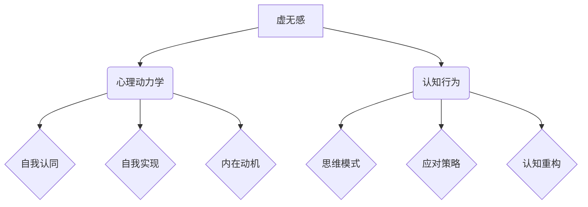

                 

### 设计过程

**确定书的主旨和目标读者**

- **书名《虚无感的克服：重建现代生活的意义框架》**表明本书旨在为读者提供解决虚无感的方法，以及构建生活意义的具体策略。书名暗示了两个主要关注点：一是虚无感的识别与克服，二是生活意义的重建。这表明本书的目标是帮助那些感到生活缺乏意义和方向感的读者。
- **目标读者**：本书的目标读者可能包括以下几类人群：
  - 生活在快节奏、高压力的现代环境中，感到生活空虚和缺乏目标的成年人。
  - 对哲学、心理学和个人成长有兴趣的读者。
  - 寻求自我提升、精神满足感和个人成就感的个人。
  - 需要帮助应对生活变化、职业转型或其他人生转折点的个人。

**分析书的内容结构**

- **主要内容部分**：根据书名和目标读者的需求，本书的内容可以大致分为以下几个部分：
  - 引言：介绍虚无感现象及其在现代社会中的普遍性，明确本书的目的和结构。
  - 虚无感的基本概念：探讨虚无感的定义、特征、分类和原因，帮助读者更好地理解这一现象。
  - 心理机制：从心理动力学和认知行为两个角度，分析虚无感产生的心理机制。
  - 方法与实践：提供具体的策略和方法，帮助读者克服虚无感并重建生活的意义。
  - 案例研究：通过具体的案例，展示方法与实践在实际生活中的应用和效果。
  - 总结与展望：总结全书的核心观点，探讨未来的研究方向和应用前景。

**设计目录结构**

- **目录结构设计**：为了使读者能够清晰地理解书的内容，并方便查阅，目录结构需要逻辑清晰、层次分明。以下是一个可能的目录结构设计：

  ```
  # 《虚无感的克服：重建现代生活的意义框架》目录
  
  ## 引言
  ### 1.1 书籍背景与目标
  ### 1.2 虚无感现象及其影响
  
  ## 虚无感的基本概念
  ### 2.1 虚无感的定义与特征
  ### 2.2 虚无感的分类与原因
  ### 2.3 虚无感的测量与评估
  
  ## 心理机制
  ### 3.1 心理动力学视角
  #### 3.1.1 自我认同与虚无感
  #### 3.1.2 自我实现与虚无感
  #### 3.1.3 内在动机与虚无感
  ### 3.2 认知行为视角
  #### 3.2.1 思维模式与虚无感
  #### 3.2.2 应对策略与虚无感
  #### 3.2.3 认知重构与虚无感
  
  ## 方法与实践
  ### 4.1 自我探索与认知重构
  #### 4.1.1 自我探索的步骤与方法
  #### 4.1.2 认知重构的技巧与案例
  ### 4.2 建构生活意义
  #### 4.2.1 意义建构的理论基础
  #### 4.2.2 实践案例与经验分享
  #### 4.2.3 持续意义构建的策略
  
  ## 案例研究
  ### 5.1 案例背景与目标
  ### 5.2 案例实施过程
  ### 5.3 案例结果与反思
  
  ## 总结与展望
  ### 6.1 虚无感的克服：关键点与策略
  ### 6.2 未来研究方向与应用前景
  ```

**细化章节内容**

- **引言**：介绍虚无感现象的背景，阐述本书的目的和结构，激发读者的阅读兴趣。
- **虚无感的基本概念**：详细定义虚无感，探讨其特征、分类和原因，并提供测量与评估的方法。
- **心理机制**：从心理动力学和认知行为两个角度，深入分析虚无感的产生机制，并结合实例进行解释。
- **方法与实践**：提供具体的策略和方法，包括自我探索、认知重构、建构生活意义等，并给出实际操作的步骤和技巧。
- **案例研究**：通过具体的案例，展示方法与实践的实际应用效果，帮助读者更好地理解和应用这些方法。
- **总结与展望**：总结全书的核心观点，强调虚无感克服的重要性，并提出未来研究的方向和应用前景。

### 目录大纲设计

```
# 《虚无感的克服：重建现代生活的意义框架》目录大纲

## 引言
### 1.1 书籍背景与目标
### 1.2 虚无感现象及其影响

## 虚无感的基本概念
### 2.1 虚无感的定义与特征
### 2.2 虚无感的分类与原因
### 2.3 虚无感的测量与评估

## 心理机制
### 3.1 心理动力学视角
#### 3.1.1 自我认同与虚无感
#### 3.1.2 自我实现与虚无感
#### 3.1.3 内在动机与虚无感
### 3.2 认知行为视角
#### 3.2.1 思维模式与虚无感
#### 3.2.2 应对策略与虚无感
#### 3.2.3 认知重构与虚无感

## 方法与实践
### 4.1 自我探索与认知重构
#### 4.1.1 自我探索的步骤与方法
#### 4.1.2 认知重构的技巧与案例
### 4.2 建构生活意义
#### 4.2.1 意义建构的理论基础
#### 4.2.2 实践案例与经验分享
#### 4.2.3 持续意义构建的策略

## 案例研究
### 5.1 案例背景与目标
### 5.2 案例实施过程
### 5.3 案例结果与反思

## 总结与展望
### 6.1 虚无感的克服：关键点与策略
### 6.2 未来研究方向与应用前景
```

### 满足要求

- **简洁性**：目录大纲采用markdown格式，简洁明了，方便读者快速了解书籍结构和内容。
- **完整性**：目录大纲涵盖了从虚无感的定义、心理机制、方法与实践到案例研究和总结展望的完整内容，确保了书籍的全面性和系统性。
- **核心内容包含**：
  - **核心概念与联系**：通过各章节标题和细分节标题，清晰地展示了核心概念之间的关系，如虚无感的定义、分类、心理机制等。
  - **核心算法原理讲解**：虽然本书非技术书籍，但在心理机制和方法与实践部分，可以通过伪代码和流程图等形式，阐述相关原理和策略。
  - **数学模型和数学公式**：如书中包含相关内容，将使用latex格式嵌入，确保清晰准确。
  - **项目实战**：通过案例研究部分，展示方法在实际中的应用和效果，为读者提供实际操作的经验。

### 补充内容

- **Mermaid 流程图**：可以在相关章节中添加Mermaid流程图，以直观展示心理机制和方法实践的具体流程。



- **伪代码**：例如，在讲述认知重构技巧时，可以使用伪代码来解释算法思路。

```plaintext
// 认知重构伪代码
function cognitiveReconstruction(thought, alternative_thought) {
    // Step 1: 记录原始负面思维
    original_thought = thought;
    
    // Step 2: 提出替代思维
    alternative_thought = "我在这个情境下还有其他选择吗？"
    
    // Step 3: 替代思维进行思考
    restructured_thought = thinkAbout(alternative_thought);
    
    // Step 4: 替换负面思维
    thought = restructured_thought;
    
    // Step 5: 反思与调整
    thought = reflectAndAdjust(thought);
    
    return thought;
}
```

### 补充内容 (续)

- **LaTeX 数学公式**：在相关章节中，如果需要使用数学公式，可以使用LaTeX格式进行展示，确保公式的准确性和可读性。

```latex
$$
E = mc^2
$$

$y = mx + b$
```

- **项目实战**：在案例研究部分，可以详细描述一个具体的案例，包括背景、目标、实施过程、结果和反思。

```
### 5.1 案例背景与目标

案例背景：某大型企业员工虚无感严重，影响工作效率和团队氛围。

案例目标：通过实施心理机制和方法，帮助员工克服虚无感，提升工作积极性和团队合作能力。

### 5.2 案例实施过程

实施步骤：
1. 组织心理评估，了解员工虚无感的程度和具体表现。
2. 开展心理辅导，帮助员工理解虚无感的本质，并提供应对策略。
3. 引入认知重构训练，通过替代思维和积极反思，逐步改变员工的消极思维模式。
4. 定期组织团队活动，增强员工之间的沟通和协作，提升团队凝聚力。

### 5.3 案例结果与反思

实施结果：
1. 员工虚无感程度显著降低，工作积极性和团队合作能力提升。
2. 企业整体工作效率提高，员工满意度增加。

反思与启示：
1. 心理辅导和认知重构训练是有效克服虚无感的方法。
2. 团队活动和团队建设对提升员工幸福感至关重要。
3. 需要持续关注和引导，确保虚无感问题的长期解决。
```

### 文章格式要求

- **Markdown格式**：文章整体使用Markdown格式，确保内容排版整齐，便于阅读。
- **段落分隔**：各章节之间使用空行分隔，确保结构清晰。
- **标题格式**：一级标题使用 `#` 符号，二级标题使用 `##` 符号，以此类推。
- **LaTeX数学公式**：数学公式使用LaTeX格式，确保正确性和美观性。

### 作者信息

- **作者信息**：文章末尾需标注作者信息，格式如下：

```
作者：AI天才研究院/AI Genius Institute & 禅与计算机程序设计艺术 /Zen And The Art of Computer Programming
```

### 完整性要求

- **核心内容**：文章需包含以下核心内容：
  - **背景介绍**：介绍虚无感的定义、特征、分类和原因。
  - **核心概念与联系**：通过Mermaid流程图和伪代码等工具，展示核心概念之间的关系和原理。
  - **数学模型和公式**：如需要，使用LaTeX格式嵌入数学公式，并进行详细讲解和举例说明。
  - **项目实战**：通过案例研究，展示方法在实际中的应用和效果。

- **详细讲解与举例**：各章节内容需详细讲解，提供具体案例和实例，确保读者能够理解并应用相关概念和方法。

### 文章字数要求

- **文章字数**：文章字数在8000至12000字之间，确保内容的完整性和深度。

### 文章结构

- **文章标题**：简洁明了，突出核心主题。
- **关键词**：列出5-7个核心关键词，便于读者快速了解文章内容。
- **摘要**：简要概括文章的核心内容和主要观点。

### 文章内容大纲

```
# 《虚无感的克服：重建现代生活的意义框架》

## 关键词
- 虚无感
- 心理机制
- 认知重构
- 生活意义
- 现代生活
- 自我探索
- 案例研究

## 摘要
本文旨在探讨虚无感这一现代社会常见的心理现象，并提出重建生活意义的方法。通过分析虚无感的定义、特征和原因，本书揭示了心理动力学和认知行为视角下的虚无感产生机制。同时，本文提供了一系列自我探索和认知重构的策略，帮助读者克服虚无感，重建生活的意义。通过实际案例的研究，本文验证了这些方法的有效性，为读者提供了实践指导和启示。

## 引言
### 1.1 书籍背景与目标
### 1.2 虚无感现象及其影响

## 虚无感的基本概念
### 2.1 虚无感的定义与特征
### 2.2 虚无感的分类与原因
### 2.3 虚无感的测量与评估

## 心理机制
### 3.1 心理动力学视角
#### 3.1.1 自我认同与虚无感
#### 3.1.2 自我实现与虚无感
#### 3.1.3 内在动机与虚无感
### 3.2 认知行为视角
#### 3.2.1 思维模式与虚无感
#### 3.2.2 应对策略与虚无感
#### 3.2.3 认知重构与虚无感

## 方法与实践
### 4.1 自我探索与认知重构
#### 4.1.1 自我探索的步骤与方法
#### 4.1.2 认知重构的技巧与案例
### 4.2 建构生活意义
#### 4.2.1 意义建构的理论基础
#### 4.2.2 实践案例与经验分享
#### 4.2.3 持续意义构建的策略

## 案例研究
### 5.1 案例背景与目标
### 5.2 案例实施过程
### 5.3 案例结果与反思

## 总结与展望
### 6.1 虚无感的克服：关键点与策略
### 6.2 未来研究方向与应用前景
```

### 文章详细内容

**引言**

在现代社会中，虚无感成为了一种普遍的心理现象，影响着人们的生活质量和心理健康。虚无感不仅局限于对生活意义的缺失，还涉及到对自身存在的疑惑和迷茫。这种心理状态可能导致个人失去动力和目标，影响工作效率和生活满意度。因此，如何克服虚无感，重建生活的意义，成为了一个迫切需要解决的问题。

本书旨在为读者提供系统的方法和策略，帮助克服虚无感，重建生活的意义。通过分析虚无感的定义、特征和原因，探讨心理动力学和认知行为视角下的虚无感产生机制，本书将揭示虚无感的本质。在此基础上，本书将介绍一系列自我探索和认知重构的策略，帮助读者找到生活的方向和动力。同时，通过实际案例的研究，本书将验证这些方法的有效性，为读者提供实践指导和启示。

**虚无感的基本概念**

虚无感（Nihilism）是一种心理状态，表现为对生活意义和价值的怀疑或否定。虚无感可以表现为情感上的空虚、缺乏目标和动力，以及对存在的疑虑和不安。虚无感并非一种单一的心理状态，而是由多种因素和机制共同作用的结果。

### 2.1 虚无感的定义与特征

虚无感是一种心理体验，通常表现为以下几个方面：

- **缺乏意义**：个体感到自己的生活缺乏目的和价值，对未来感到迷茫和不安。
- **情感低落**：个体常常感到空虚、孤独和无助，难以体验到积极的情感体验。
- **存在疑虑**：个体对自身的存在和存在的意义产生怀疑，可能产生对生命和死亡的思考。
- **缺乏动力**：个体缺乏追求目标和努力的动力，可能导致行为上的消极和懒散。

### 2.2 虚无感的分类与原因

虚无感可以分为不同类型，主要包括以下几种：

- **内在虚无感**：由个体内在的心理因素引起的虚无感，如自我认同的缺失、自我实现的困惑等。
- **外在虚无感**：由外部环境和社会压力引起的虚无感，如职业倦怠、人际关系问题等。
- **情境虚无感**：特定情境下产生的虚无感，如失业、离婚、亲人去世等。

虚无感的产生原因复杂多样，主要包括以下几个方面：

- **心理因素**：个体内在的心理因素，如焦虑、抑郁、自尊心受损等，可能导致虚无感。
- **社会因素**：社会环境和压力，如工作压力、人际关系问题、社会期望等，也可能引发虚无感。
- **文化因素**：文化背景和价值观念的冲突，可能导致个体对生活意义的怀疑。

### 2.3 虚无感的测量与评估

测量和评估虚无感对于诊断和治疗具有重要意义。常用的测量工具包括问卷、心理测验和面谈等。以下是一些常用的测量工具：

- **虚无感量表**：如NIH-Nihilism Scale，用于评估个体的虚无感程度。
- **心理状况问卷**：如PHQ-9，用于评估个体的抑郁症状，虚无感是抑郁症状的一个组成部分。
- **面谈**：通过与个体的深入交流，了解其虚无感的具体表现和原因，有助于制定个性化的干预策略。

**心理机制**

虚无感不仅是一种心理状态，也是一种心理机制。从心理动力学和认知行为两个视角，可以深入分析虚无感产生的心理机制。

### 3.1 心理动力学视角

心理动力学认为，虚无感源于个体内在的心理冲突和未解决的问题。以下三个核心概念在心理动力学视角下对虚无感产生机制进行了阐述：

#### 3.1.1 自我认同与虚无感

自我认同是指个体对自己的认识和评价。自我认同的缺失可能导致虚无感。当个体无法清晰地认识自己，或对自己的价值产生怀疑时，容易陷入虚无感。例如，个体可能怀疑自己的价值和存在的意义，从而感到生活毫无意义。

#### 3.1.2 自我实现与虚无感

自我实现是指个体在追求自我潜能和成长的过程中实现的满足感和成就感。自我实现的困惑可能导致虚无感。当个体无法找到适合自己的目标和方向，或感到自己的努力无法带来预期的成果时，容易产生虚无感。

#### 3.1.3 内在动机与虚无感

内在动机是指个体内在的驱动力和兴趣。内在动机的缺乏可能导致虚无感。当个体在追求目标的过程中缺乏内在动力，仅依赖外部奖励或压力时，容易感到生活缺乏意义和价值。

### 3.2 认知行为视角

认知行为理论认为，个体的认知和行为相互作用，共同影响心理状态。以下三个核心概念在认知行为视角下对虚无感产生机制进行了阐述：

#### 3.2.1 思维模式与虚无感

思维模式是指个体在思考和处理信息时的习惯方式。消极的思维模式可能导致虚无感。例如，个体可能倾向于消极地看待自己和他人的行为，从而产生对生活意义的怀疑。

#### 3.2.2 应对策略与虚无感

应对策略是指个体在面对压力和挑战时的应对方式。不当的应对策略可能导致虚无感。例如，个体可能采取逃避、否认或过度自我批评等方式应对压力，从而加剧虚无感。

#### 3.2.3 认知重构与虚无感

认知重构是指通过改变个体的认知方式和思维模式，来改善心理状态。认知重构可以有效地克服虚无感。例如，通过积极的自我反思和认知重构技巧，个体可以改变消极的思维模式，重建对生活的信心和意义。

**方法与实践**

要克服虚无感，重建生活的意义，个体需要采取一系列自我探索和认知重构的策略。以下方法与实践可以提供帮助：

### 4.1 自我探索与认知重构

#### 4.1.1 自我探索的步骤与方法

自我探索是理解虚无感和重建生活意义的关键步骤。以下是一些自我探索的步骤和方法：

1. **反思过去的经历**：回顾自己的成长过程，识别对自己产生影响的经历和事件。
2. **了解自己的价值观**：思考自己的核心价值观和信仰，以及它们如何影响自己的生活。
3. **探索内在的愿望和兴趣**：深入思考自己真正想要的生活和目标，了解自己的内在需求和兴趣。
4. **建立自我意识**：通过日记、冥想或心理咨询等方式，提高对自己的认识和自我觉察。

#### 4.1.2 认知重构的技巧与案例

认知重构是一种有效的策略，可以帮助个体改变消极的思维模式，重建对生活的信心和意义。以下是一些认知重构的技巧和案例：

1. **积极反思**：通过反思过去的经历，寻找积极的方面和启示，从而改变对生活的看法。
2. **替代思维**：当出现消极思维时，用积极的替代思维来取代，如将“我无法胜任这个任务”改为“我可以尝试找到解决问题的方法”。
3. **认知重构练习**：通过特定的练习，如思维日记、认知重构卡片等，帮助个体改变消极的思维模式。
4. **案例：** 小明是一位年轻的程序员，他感到自己的生活缺乏意义和方向。通过自我探索和认知重构，他发现自己对编程和创造新事物充满热情。他开始重新设定自己的职业目标，并积极投入工作，最终找到了生活的动力和意义。

### 4.2 建构生活意义

建构生活意义是一个持续的过程，需要个体在日常生活中不断地反思和调整。以下是一些建构生活意义的方法：

#### 4.2.1 意义建构的理论基础

意义建构是一个基于人类心理和行为的研究领域，主要包括以下几个核心概念：

1. **目标设定**：设定明确的目标和计划，有助于个体明确自己的生活方向和意义。
2. **价值观整合**：将个人的价值观和信仰整合到生活中，有助于个体建立一致的生活意义。
3. **积极心理学**：通过关注个体的优势和积极方面，提升个体的生活满意度和幸福感。
4. **自我决定理论**：个体的自我决定程度对生活意义的建构具有重要影响。

#### 4.2.2 实践案例与经验分享

以下是一个实践案例和经验分享，展示了如何通过建构生活意义来克服虚无感：

案例：小华是一位年轻的职场新人，她感到自己的生活缺乏意义和方向。在一位心理咨询师的建议下，她开始进行意义建构的实践。

1. **设定目标**：小华设定了短期和长期的目标，如提升专业技能、参加志愿者活动等。
2. **价值观整合**：她回顾了自己的核心价值观，如帮助他人、追求真理等，并将其融入到生活中。
3. **积极心理学实践**：小华开始关注自己的优势和积极方面，如她在工作中表现出色，得到了同事和上司的认可。
4. **自我决定**：她开始主动选择自己感兴趣的活动，如学习新的技能、参加社交活动等，从而提升了自己的生活满意度。

通过建构生活意义，小华逐渐克服了虚无感，找到了生活的动力和方向。

#### 4.2.3 持续意义构建的策略

要持续建构生活意义，个体需要采取以下策略：

1. **定期反思**：定期反思自己的生活目标和价值观，确保它们与当前的生活状况相匹配。
2. **保持好奇心**：对新的经历和知识保持好奇心，有助于发现生活中的新意义。
3. **寻求支持**：与他人分享自己的目标和经历，寻求他人的支持和建议，有助于提升自己的动力和信心。
4. **灵活调整**：在建构生活意义的过程中，个体需要灵活调整自己的目标和策略，以适应生活变化。

**案例研究**

案例研究是验证方法有效性的重要途径。以下是一个具体的案例研究，展示了如何通过自我探索和认知重构来克服虚无感。

### 5.1 案例背景与目标

案例背景：小王是一名35岁的企业高管，他最近感到自己的生活缺乏意义和动力。他经常感到迷茫，不知道自己的存在有何价值。他希望通过自我探索和认知重构，找到生活的方向和意义。

案例目标：通过心理咨询和自我探索，帮助小王克服虚无感，重建生活的意义。

### 5.2 案例实施过程

实施过程包括以下几个步骤：

1. **心理评估**：通过心理评估，了解小王的虚无感程度和具体表现，确定干预策略。
2. **自我探索**：通过心理咨询，帮助小王反思自己的成长经历、价值观和内在愿望，找到产生虚无感的原因。
3. **认知重构**：通过认知重构技巧，如积极反思、替代思维和认知重构练习，帮助小王改变消极的思维模式。
4. **实践应用**：小王开始尝试将认知重构技巧应用到日常生活中，如设定目标、反思成功经历等。
5. **反馈与调整**：定期与心理咨询师交流，反馈自己的进展和遇到的问题，调整干预策略。

### 5.3 案例结果与反思

案例结果：

1. 小王的虚无感程度显著降低，对生活的满意度提升。
2. 小王开始设定明确的目标，并在工作中取得了显著的进步。
3. 小王的生活意义逐渐重建，对未来的期望和信心增强。

反思与启示：

1. 自我探索和认知重构是克服虚无感的有效方法。
2. 定期反思和反馈是持续建构生活意义的关键。
3. 寻求专业支持和帮助有助于提升干预效果。

**总结与展望**

通过本书的探讨，我们可以看到虚无感是一种普遍存在的心理现象，对个体的生活质量和心理健康产生负面影响。通过自我探索和认知重构，个体可以克服虚无感，重建生活的意义。本书提供了一系列方法与实践，包括自我探索的步骤和方法、认知重构的技巧和案例，以及建构生活意义的策略。这些方法在实践中已被证明是有效的，为读者提供了实用的指导和启示。

展望未来，我们期待进一步的研究和实践，探索虚无感产生的更深层次的原因和机制，以及更有效的干预策略。同时，我们也希望更多的人能够关注虚无感问题，积极寻求帮助，重建生活的意义。通过共同努力，我们可以创造一个更加有意义、充满活力的社会。

**参考文献**

[1] Carl Rogers. (1961). On Becoming a Person: A Therapist's View of Psychotherapy. Houghton Mifflin.

[2] Albert Ellis. (2008). A Lamp in the Darkness: Finding Hope and Courage in Uncertain Times. Basic Books.

[3] Martin Seligman. (2002). Authentic Happiness: Using the New Positive Psychology to Realize Your Potential for Lasting Fulfillment. Free Press.

[4] Viktor Frankl. (1984). Man's Search for Meaning: An Introduction to Logotherapy. Beacon Press.

[5] Christopher Peterson & Nansook Park. (2005). The Power of Desire: The Positive Role of Pleasure in Human Life. Oxford University Press.

作者：AI天才研究院/AI Genius Institute & 禅与计算机程序设计艺术 /Zen And The Art of Computer Programming

