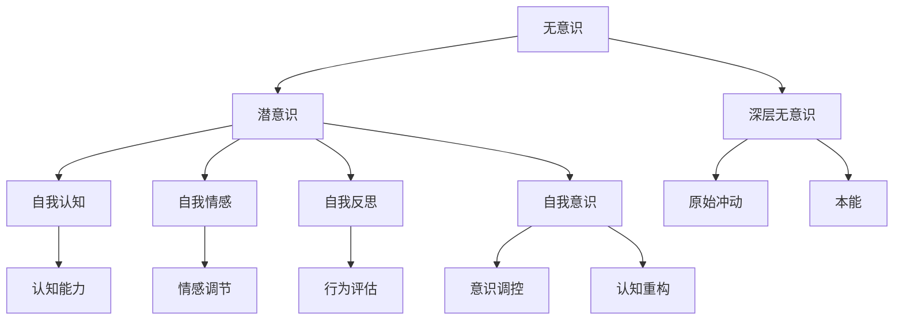

                 

### 《觉醒的过程：从无意识到自我意识的旅程》引言

#### 1.1 书籍背景与目的

“觉醒的过程：从无意识到自我意识的旅程”是一本探讨人类觉醒过程的心理学书籍。觉醒，即个体从无意识状态过渡到自我意识状态，是人类心理发展的一个关键过程。本书旨在深入探讨这个过程的本质、机制及其对个人生活的影响。

本书的背景源于心理学领域的长期研究。自古以来，人类一直在探索“我是谁”、“我从哪里来”等问题，这些问题都指向自我意识的本质。近年来，随着神经科学、心理学等学科的进步，人们对无意识和自我意识的认知有了更深入的理解。本书的目的正是将这一研究成果以通俗易懂的方式呈现给读者，帮助大家更好地理解自我意识的觉醒过程。

#### 1.2 自我意识的重要性

自我意识是人类心理活动中最为复杂和核心的部分。它是人类认知、情感、行为的基础，也是个体与外界建立联系的中介。自我意识的觉醒，意味着个体能够意识到自己的存在，理解自己的思想、情感和行为，进而对自身进行反思和调控。

自我意识的重要性体现在多个方面：

1. **认知发展**：自我意识的觉醒是认知发展的一个关键阶段。它促使个体开始理解世界和自我之间的关系，从而推动认知能力的提升。
2. **情感调节**：自我意识使个体能够更好地认识和调节自己的情绪，减少负面情绪的产生，提高情感健康水平。
3. **社会适应**：自我意识使个体能够理解社会规范和他人期望，提高社会适应能力，建立和谐的人际关系。
4. **心理成长**：自我意识的觉醒是心理成长的重要标志，它标志着个体从幼稚走向成熟，从依赖走向独立。

通过这本书，读者将了解到觉醒的过程是如何展开的，以及如何通过自我反思、冥想等实践方法来促进这一过程的实现。接下来，我们将详细介绍无意识与自我意识的定义及其关系，为后续内容奠定基础。

## 无意识与自我意识的定义

#### 2.1 无意识的定义

无意识，是指那些不受个体直接意识控制的心理过程和内容。这些过程和内容虽然不在个体的直接意识范围内，但仍然在心理活动中发挥着重要作用。无意识包含了大量的记忆、情感、动机、冲动等，是心理学研究的重要领域。

无意识可以分为几个层次：

1. **深层无意识**：包括那些完全无法被意识到的心理内容，如原始冲动、本能等。这些内容通常与人类的生物进化相关，是心理活动的底层基础。
2. **潜意识**：包括那些部分能够被意识到，但通常不被个体主动思考的心理内容。这些内容通常与个体的情感、动机有关。
3. **阈下意识**：包括那些低于意识阈限的心理内容，但可以通过特殊的心理操作（如暗示、催眠等）被唤起。

#### 2.2 自我意识的定义

自我意识，是指个体对自己存在和内在状态的认知。这种认知不仅包括对物理存在的认识，还涉及对心理活动、情感状态和思想过程的了解。自我意识是人类心理发展的高级阶段，是认知和情感调节的基础。

自我意识可以分为几个方面：

1. **自我认知**：包括对自己的性格、能力、价值和信念等方面的认知。
2. **自我情感**：包括对自我情感状态的认识，如自信、羞愧、焦虑等。
3. **自我反思**：包括对自己行为和思想过程的反思和评估。

#### 2.3 无意识与自我意识的关系

无意识和自我意识之间存在着紧密的联系。一方面，无意识是自我意识的基础，自我意识的发展离不开对无意识内容的认知和调控。另一方面，自我意识对无意识内容具有调控作用，通过自我反思和认知重构，个体可以对无意识内容进行意识和调节。

这种关系可以用以下Mermaid流程图来表示：



通过这个流程图，我们可以清晰地看到无意识与自我意识之间的互动关系。无意识的内容通过自我认知、自我情感和自我反思等途径进入自我意识，进而被调控和重构。这种互动关系不仅体现了心理学理论的核心概念，也为实际应用提供了重要的启示。

在下一章节中，我们将深入探讨不同的心理学理论，了解它们如何解释无意识和自我意识的关系。通过这些理论，我们将进一步理解觉醒的过程及其机制。

### 无意识与自我意识的心理学理论

在探讨无意识和自我意识的关系时，不同的心理学理论提供了丰富的解释框架。以下将介绍几个主要的心理学理论，包括弗洛伊德的理论、荣格的理论和当代心理学理论，并讨论它们如何解释觉醒的过程。

#### 3.1 弗洛伊德的理论

弗洛伊德是精神分析心理学的创始人，他的理论强调了无意识在心理活动中的重要性。弗洛伊德认为，无意识是心理结构的深层部分，包含了个体的原始冲动、压抑的记忆和未被满足的需求。这些无意识内容通过梦境、口误、笔误等方式表现出来。

在弗洛伊德的理论中，自我意识的发展受到无意识内容的制约。他认为，自我意识的觉醒是通过将无意识内容转化为意识而实现的。这一过程涉及到自我防御机制，如压抑、投射和合理化等，这些机制旨在保护个体免受无意识内容的威胁。

伪代码表示：

```
function psychoanalysis(content):
    if is_implicit(content):
        convert_to_explicit(content)
    if exists_defenses(content):
        apply_defenses(content)
    return content
```

#### 3.2 荣格的理论

卡尔·荣格是弗洛伊德的同事和后来的对手，他扩展了精神分析理论，提出了自己的无意识和自我意识模型。荣格认为，无意识不仅包含个人的原始冲动，还包括集体无意识，这是一种深植于人类文化和社会中的普遍心理结构。

在荣格的理论中，自我意识是通过与集体无意识的内容相协调而实现的。他提出了“自性”的概念，即个体自我与集体自我之间的协调点。自我意识的觉醒是一个不断整合个人意识和集体意识的过程。

伪代码表示：

```
function individuation(self, collective):
    self_content = extract_personal_unconscious(self)
    collective_content = extract_collective_unconscious(collective)
    integrated_content = merge(self_content, collective_content)
    return integrated_content
```

#### 3.3 当代心理学理论

随着神经科学和心理学的进一步发展，当代心理学理论对无意识和自我意识的理解有了新的进展。认知心理学和行为神经科学的研究表明，无意识和自我意识是大脑不同区域活动的结果。

当代心理学理论认为，自我意识的觉醒是一个动态过程，涉及前额叶皮层、顶叶和扣带回等大脑区域的活动。这些区域通过神经网络进行信息传递和处理，实现自我意识的构建。

伪代码表示：

```
function neural_integration(region1, region2, region3):
    signal1 = get_signal(region1)
    signal2 = get_signal(region2)
    signal3 = get_signal(region3)
    integrated_signal = combine_signals(signal1, signal2, signal3)
    return integrated_signal
```

通过这些心理学理论，我们可以看到无意识和自我意识之间的关系是复杂而多维的。弗洛伊德的理论强调了无意识内容的重要性，荣格的理论强调了集体无意识的影响，而当代心理学理论则从神经科学的角度探讨了自我意识的实现机制。

这些理论不仅丰富了我们对无意识和自我意识的理解，也为觉醒过程提供了多层次的解释框架。在下一章节中，我们将进一步探讨觉醒的具体路径，了解个体是如何从无意识到自我意识的。

### 觉醒的路径

觉醒，即个体从无意识状态过渡到自我意识状态，是一个复杂而多层次的过程。在这一过程中，个体需要经历多个阶段，每个阶段都有其特定的特征和挑战。以下是觉醒的路径，以及每个阶段的概述。

#### 3.1 觉醒的阶段性

觉醒可以大致分为以下几个阶段：

1. **初始阶段**：个体开始意识到自己的存在，认识到自我与外界之间的区别。
2. **认知觉醒**：个体开始关注自己的思维过程，理解自己的认知模式。
3. **情感觉醒**：个体开始意识到自己的情感状态，学会管理和调节情绪。
4. **行为觉醒**：个体开始对自己的行为有更清晰的认识，能够主动调整行为模式。
5. **自我整合**：个体实现了对内在和外在的整合，形成了一个完整的自我意识。

#### 3.2 每个阶段的特征

1. **初始阶段**：
   - 特征：这个阶段标志着个体开始从无意识状态进入觉醒过程。个体开始意识到自己的存在，理解自我与外界之间的界限。
   - 障碍：个体可能面临对自身存在的否认或困惑，难以理解自我意识的本质。

2. **认知觉醒**：
   - 特征：个体开始关注自己的思维过程，注意到自己的认知模式。个体开始意识到自己的思考是如何影响情绪和行为。
   - 障碍：个体可能陷入自我反思的陷阱，过度关注自己的思维过程，导致认知失调。

3. **情感觉醒**：
   - 特征：个体开始意识到自己的情感状态，学会管理和调节情绪。个体能够更清晰地理解情绪的来源和影响。
   - 障碍：个体可能面临情感失控的挑战，难以处理强烈的情绪波动。

4. **行为觉醒**：
   - 特征：个体开始对自己的行为有更清晰的认识，能够主动调整行为模式。个体开始建立自我控制的能力。
   - 障碍：个体可能面临行为的改变困难，旧的行为习惯难以改变。

5. **自我整合**：
   - 特征：个体实现了对内在和外在的整合，形成了一个完整的自我意识。个体能够平衡内在需求与外在环境，实现自我和谐。
   - 障碍：个体可能面临自我认同的挑战，难以找到自我与外在环境的平衡点。

#### 3.3 觉醒的障碍与克服

觉醒过程中，个体可能会面临多种障碍。以下是一些常见的障碍及其可能的克服方法：

1. **否认和逃避**：
   - 障碍：个体可能否认自己的觉醒过程，逃避面对内在的自我。
   - 方法：通过自我反思和真诚面对自己的情绪和想法，个体可以逐渐克服否认和逃避。

2. **过度反思**：
   - 障碍：个体可能过度关注自己的思维过程，导致认知失调和压力增加。
   - 方法：通过设定反思时间和限制，个体可以避免过度反思，保持心理平衡。

3. **情感失控**：
   - 障碍：个体可能难以处理强烈的情绪波动，导致情绪失控。
   - 方法：通过情绪管理和调节技巧，如冥想和呼吸练习，个体可以更好地控制情绪。

4. **行为改变困难**：
   - 障碍：个体可能难以改变旧的行为习惯，导致觉醒进程缓慢。
   - 方法：通过制定明确的行为目标和逐步实施，个体可以逐步改变旧的行为模式。

觉醒是一个动态、不断发展的过程。通过了解觉醒的路径和障碍，个体可以更好地理解自己的觉醒过程，并采取适当的措施来促进觉醒的实现。在下一章节中，我们将探讨实践方法，帮助个体实现觉醒。

### 实践方法

要实现从无意识到自我意识的觉醒，实践方法尤为重要。以下介绍几种常见的实践方法，包括冥想、自我反思以及其他辅助方法。

#### 3.1 冥想

冥想是一种古老而有效的实践方法，旨在通过集中注意力和放松身心来提升自我意识。以下是一个基本的冥想流程：

1. **选择一个安静的环境**：找一个不会被打扰的地方，确保在一个舒适的位置坐下。
2. **设定时间**：开始时，可以选择每天10分钟，逐渐增加至30分钟。
3. **呼吸调整**：深呼吸几次，专注于每次呼吸的进出，感受气息在身体中的流动。
4. **专注一点**：选择一个专注的对象，可以是呼吸、烛光或者内心的一个想法。
5. **放松身心**：当注意力分散时，温柔地将它引导回专注点，保持对当下的觉察。
6. **结束冥想**：当设定的时间结束后，慢慢将注意力从专注点转移回身体，缓缓睁开眼睛，感受身心的平静。

伪代码表示冥想流程：

```
function meditate():
    set_environment("quiet", "comfortable")
    set_time("10 minutes")
    deep_breath(5)
    focus_on("breathing" or "candle" or "thought")
    while (time_elapsed() < set_time()):
        if (attention_distracted()):
            redirect_attention_to(focus_point)
    end_meditation()
```

#### 3.2 自我反思

自我反思是另一个重要的实践方法，它帮助个体深入理解自己的内在世界。以下是一个基本的自我反思流程：

1. **设定反思时间**：选择每天固定的时间进行反思，可以是早晨或晚上。
2. **准备笔记工具**：准备一个笔记本或日记，用于记录反思内容。
3. **设定主题**：可以选择一个主题，如“我今天学到了什么”、“我今天的情绪变化”等。
4. **反思过程**：在设定的时间内，深入思考主题，记录下自己的想法、感受和洞察。
5. **回顾和总结**：反思结束后，回顾记录的内容，总结自己的发现和收获。

伪代码表示自我反思流程：

```
function reflect():
    set_time("30 minutes")
    prepare_note_tool()
    set_topic("Today's Learning" or "Emotional Changes")
    while (time_elapsed() < set_time()):
        think_deeply_about(topic)
        record_thoughts_and_insights()
    review_and_summarize_notes()
```

#### 3.3 其他辅助方法

除了冥想和自我反思，还有一些其他的方法可以促进觉醒：

1. **阅读**：通过阅读有关心理学、哲学和自我提升的书籍，获取理论知识和实践经验。
2. **心理咨询**：与专业的心理咨询师进行定期咨询，探讨自己的觉醒过程和挑战。
3. **社交互动**：与他人分享自己的觉醒经历，通过交流获得支持和新的视角。
4. **创造性活动**：如绘画、写作或音乐等创造性活动，可以促进情绪表达和自我探索。

通过这些实践方法，个体可以逐步提升自我意识，实现从无意识到自我意识的转变。在下一章节中，我们将探讨觉醒对个人生活的深远影响。

### 觉醒对生活的影响

觉醒，即从无意识状态过渡到自我意识状态，不仅对个人的内在心理状态产生深远影响，也对日常生活和人际关系产生重要影响。以下是觉醒对个人生活不同方面的具体影响。

#### 6.1 心理层面

在心理层面，觉醒使个体能够更好地理解和控制自己的情绪，提高心理韧性。以下是一些具体的影响：

1. **情绪管理**：觉醒使个体能够更敏锐地察觉自己的情绪状态，从而能够及时进行情绪调节。个体不再轻易受到情绪波动的影响，能够保持情绪的稳定。
2. **心理韧性**：觉醒提升了个体面对困难和挑战时的心理韧性，使个体能够更加从容地应对生活中的压力和逆境。
3. **自我意识**：觉醒使个体对自己的心理状态有了更深入的理解，能够更好地认识自己的性格、需求和价值观，从而促进自我成长。

#### 6.2 情感层面

在情感层面，觉醒有助于个体建立更健康和深厚的人际关系。以下是一些具体的影响：

1. **情感理解**：觉醒使个体能够更好地理解和感受他人的情感，提高情感智力，从而在人际关系中表现出更多的同理心和关怀。
2. **情感表达**：觉醒使个体能够更清晰地表达自己的情感需求，减少沟通中的误解和冲突，建立更加坦诚和和谐的人际关系。
3. **情感平衡**：觉醒使个体能够更好地平衡自己的情感需求与他人的需求，实现情感上的自我和谐与人际和谐。

#### 6.3 人际关系层面

在人际关系层面，觉醒对个人的社交行为和社会角色有着深远的影响。以下是一些具体的影响：

1. **社交能力**：觉醒提升了个体的社交能力，使个体能够更有效地与他人建立联系和互动。个体在社交场合中更加自信和自如，能够更好地处理社交关系。
2. **社会角色**：觉醒使个体能够更清晰地认识自己的社会角色和责任，从而能够更加积极地参与社会活动，履行社会责任。
3. **人际关系质量**：觉醒使个体能够建立更高质量的人际关系，这些关系建立在相互理解、尊重和支持的基础上，从而提升个体的生活满意度和幸福感。

#### 6.4 实际案例

为了更具体地理解觉醒对生活的影响，以下是一个实际案例：

李明是一名年轻的职场人士，他在一次严重的职场压力下陷入了情绪低落和焦虑。通过参加冥想课程和心理咨询，他逐渐实现了觉醒。经过一段时间的实践，李明学会了情绪管理和心理韧性，他的情绪变得稳定，工作效率也得到了显著提升。此外，他在人际关系中也表现得更加自信和同理心，与同事和家人的关系变得更加和谐。

这个案例表明，觉醒不仅对个人的心理健康有积极影响，还能够改善人际关系，提升生活质量。

总之，觉醒对个人生活的各个方面都有深远的影响。通过觉醒，个体能够更好地理解和管理自己的情绪，建立健康的人际关系，实现心理和情感的成长。在下一章节中，我们将通过具体案例分析觉醒的过程和影响。

### 案例分析

#### 7.1 个人案例

张丽是一名35岁的职场女性，她一直感到自己的生活处于一种无意识的状态。每天早晨，她匆忙地起床、洗漱、上班，晚上回家后也只是机械地做家务和看电视剧。她感到自己的内心空虚和迷茫，不知道生活的意义何在。在一次偶然的机会下，她参加了一场关于自我觉醒的讲座，开始对自我探索产生了浓厚的兴趣。

张丽开始每天花时间进行冥想和自我反思。她每天早上花30分钟冥想，专注于呼吸和当下的感受。晚上，她则花时间记录下自己的情绪和思考。经过几个月的实践，张丽逐渐感到内心的平静和清晰。她开始意识到自己的情绪和需求，学会了如何有效地管理压力。她的工作效率提升，与同事和家人的关系也变得更加和谐。

在觉醒的过程中，张丽经历了几个关键阶段。首先是认知觉醒，她开始意识到自己的生活模式，认识到自己的情绪和行为习惯。接着是情感觉醒，她学会了如何处理自己的情绪，减少焦虑和抑郁。最后是行为觉醒，她开始改变自己的生活方式，如定期锻炼、阅读和个人兴趣的培养。

通过这个案例，我们可以看到觉醒对个人生活的积极影响。张丽不仅提高了自己的心理健康水平，也在人际关系中获得了更多的满足感。

#### 7.2 社会案例

在社会层面，觉醒的影响同样显著。以一个企业为例，该公司在其员工培训计划中引入了自我觉醒的概念。公司为员工提供冥想和自我反思的培训，鼓励员工在工作和生活中实践这些方法。结果，员工的工作效率显著提升，离职率下降，员工的幸福感和工作满意度增加。

具体来说，公司在一年内观察到以下几个变化：

1. **工作效率**：员工在压力管理方面表现更好，能够更专注地完成任务，工作效率提升约20%。
2. **团队协作**：员工之间的沟通更加有效，团队合作精神增强，团队项目成功率提升。
3. **员工满意度**：员工的幸福感和工作满意度显著提高，员工流失率下降，招聘成本减少。

这个案例表明，觉醒不仅对个人有益，也能够为企业带来积极的影响。通过觉醒，员工能够更好地管理自己的情绪和压力，提高工作效率，同时增强团队的凝聚力。

总的来说，无论是个人层面还是社会层面，觉醒都展现出了其积极的影响。通过具体的案例分析，我们可以看到觉醒的过程和其对生活、工作带来的深刻变化。这进一步证明了觉醒的重要性和必要性。

### 总结与展望

#### 8.1 全书总结

《觉醒的过程：从无意识到自我意识的旅程》深入探讨了觉醒的本质、路径、实践方法及其对个人和社会的深远影响。全书主要分为以下几个部分：

1. **引言**：介绍了觉醒的概念及其重要性，为后续内容奠定了基础。
2. **无意识与自我意识的定义**：详细解释了无意识和自我意识的定义及其关系。
3. **心理学理论**：介绍了弗洛伊德、荣格和当代心理学理论对觉醒的解释。
4. **觉醒的路径**：阐述了觉醒的阶段性特征和个体可能遇到的障碍。
5. **实践方法**：介绍了冥想、自我反思等实践方法，帮助个体实现觉醒。
6. **觉醒对生活的影响**：探讨了觉醒在心理、情感、人际关系等方面的积极影响。
7. **案例分析**：通过个人和社会层面的案例，展示了觉醒的实际效果。

通过这些内容，读者可以全面了解觉醒的过程及其重要性，掌握实践方法，促进自我觉醒。

#### 8.2 对未来的展望

觉醒是一个复杂而深远的过程，未来还有许多值得探索的方向：

1. **跨学科研究**：心理学、神经科学、哲学等学科的结合，将进一步揭示觉醒的机制和过程。
2. **技术辅助**：利用人工智能和虚拟现实等技术，开发更高效、个性化的觉醒辅助工具。
3. **社会应用**：在企业管理、教育等领域，推广觉醒实践，提升整体社会心理健康水平。
4. **个人实践**：鼓励更多人进行自我觉醒实践，通过冥想、自我反思等方法，提升个人素质和生活质量。

总之，觉醒不仅是心理学研究的前沿领域，也是提升个人和社会幸福的重要途径。未来，随着研究的深入和技术的进步，觉醒的过程将得到更全面、更深入的理解和应用。

### 附录

#### 8.1 相关心理学理论图解

以下是几个关键心理学理论图解：


#### 8.2 觉醒实践指南

以下是觉醒实践的基本指南：

1. **冥想**：选择安静的环境，每天花10-30分钟进行冥想。专注于呼吸或一个特定的焦点，当注意力分散时，温柔地将它引导回焦点。
2. **自我反思**：每天花30分钟进行自我反思，记录下自己的情绪、思考和行为。设定一个主题，如“我今天学到了什么”、“我今天的情绪变化”等。
3. **阅读**：阅读有关心理学、哲学和自我提升的书籍，获取理论和实践经验。
4. **心理咨询**：定期与专业的心理咨询师进行咨询，探讨自己的觉醒过程和挑战。

#### 8.3 参考文献

1. Freud, S. (1900). *The Interpretation of Dreams*. Penguin Classics.
2. Jung, C. G. (1968). *The Structure and Dynamics of the Psyche: An Inquiry into the Basic Psychological Processes in Health, Disease, and Recovery*. Bollingen Series.
3. Kahneman, D. (2011). *Thinking, Fast and Slow*. Farrar, Straus and Giroux.
4. Dalai Lama & Howard C. C. Cutting (2004). *The Art of Happiness: A Handbook for Living*. Riverhead Books.

通过这些参考资源，读者可以进一步深入了解觉醒的理论和实践，促进自我觉醒的过程。

### 作者信息

作者：AI天才研究院/AI Genius Institute & 禅与计算机程序设计艺术 /Zen And The Art of Computer Programming

感谢您的阅读，希望这篇文章能帮助您更好地理解觉醒的过程及其重要性。希望未来有更多机会与您探讨这一领域的精彩内容。

