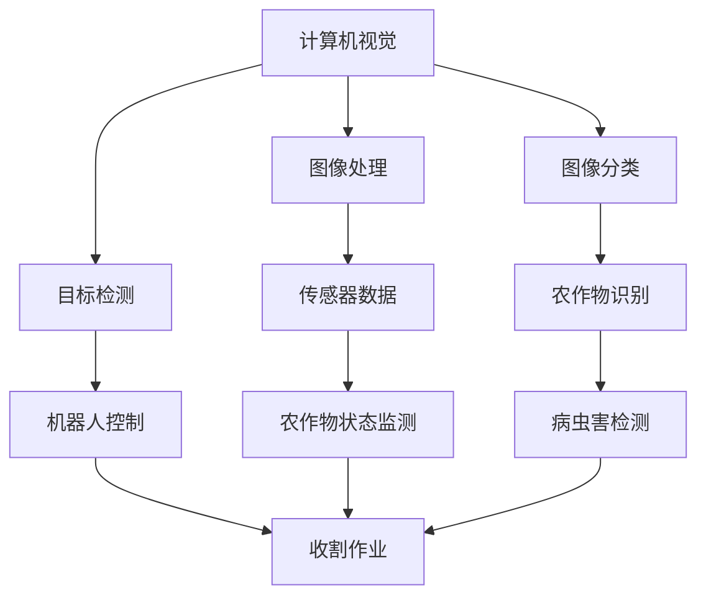

                 

### 文章标题

### 计算机视觉在自动化农作物收割中的应用

#### 关键词：计算机视觉、自动化农作物收割、图像处理、目标检测、机器学习、项目实战

#### 摘要：

本文将探讨计算机视觉在自动化农作物收割中的应用，介绍相关核心概念、算法原理以及数学模型，并通过一个实际项目案例展示计算机视觉技术在农作物收割中的具体应用和实践。本文结构清晰，逻辑严密，旨在为读者提供一个全面、深入的技术解读，帮助理解计算机视觉在农业自动化中的重要作用和未来发展。

----------------------------------------------------------------

## 第一部分：核心概念与联系

### 第1章：计算机视觉与自动化农作物收割技术概述

### 1.1 计算机视觉概述

计算机视觉是一种使计算机具备类似人类视觉感知能力的学科，主要通过图像处理、模式识别、机器学习等技术，让计算机能够“看到”并理解图像中的内容。计算机视觉广泛应用于安防监控、自动驾驶、医疗影像分析等领域，其在农业自动化中的应用也越来越受到关注。

#### 1.1.1 计算机视觉的核心概念

1. **图像处理**：对图像进行增强、滤波、分割等操作，以提取有用信息。
2. **目标检测**：在图像中检测出感兴趣的目标物体，并定位其位置。
3. **图像分类**：对图像进行分类，识别图像中包含的物体类别。
4. **语义分割**：对图像进行语义划分，识别图像中每个像素的类别。

### 1.2 自动化农作物收割技术概述

自动化农作物收割技术是农业自动化的重要组成部分，通过使用传感器、机器学习等技术，实现对农作物生长状态的监测、病虫害的检测以及收割作业的自动化控制。这有助于提高农作物产量，降低劳动成本，实现农业生产的智能化和现代化。

#### 1.2.1 自动化农作物收割的核心概念

1. **传感器技术**：通过传感器获取农作物生长状态和环境信息。
2. **机器学习算法**：对传感器数据进行分析和处理，实现农作物识别和分类。
3. **机器人技术**：利用机器人执行农作物的收割作业。

### 1.3 计算机视觉与自动化农作物收割的联系

计算机视觉技术在自动化农作物收割中扮演着关键角色。通过计算机视觉技术，可以实现对农作物生长状态和病虫害的实时监测，进而指导机器人的收割作业。具体来说：

1. **目标检测**：用于识别和定位农田中的农作物，指导机器人进行精准收割。
2. **图像处理**：用于处理传感器采集到的图像数据，提取有用信息，如作物高度、颜色等。
3. **机器学习**：用于训练和优化模型，提高农作物识别的准确性和效率。

### 图 1.1：计算机视觉与自动化农作物收割的联系架构



通过上述分析，我们可以看到计算机视觉技术在自动化农作物收割中具有重要的应用价值。接下来，我们将深入探讨自动化农作物收割中的核心算法原理和数学模型。

----------------------------------------------------------------

## 第二部分：核心算法原理讲解

### 第2章：核心算法原理

在自动化农作物收割中，核心算法原理主要包括图像处理、目标检测和机器学习算法。这些算法为自动化收割提供了技术基础，确保机器人能够准确识别和收割农作物。

### 2.1 图像处理算法

图像处理是计算机视觉的基础，用于对传感器采集到的图像数据进行预处理，提取有用信息。

#### 2.1.1 基础图像处理算法

1. **滤波**：通过滤波算法去除图像中的噪声，提高图像质量。常见的滤波算法有均值滤波、高斯滤波和中值滤波。

```python
# 均值滤波伪代码
def mean_filter(image, filter_size):
    # 初始化输出图像
    output_image = zeros((image.shape[0], image.shape[1]))

    # 遍历输出图像的每个像素
    for i in range(output_image.shape[0]):
        for j in range(output_image.shape[1]):
            # 计算滤波窗口的中心位置
            center_i = i - filter_size // 2
            center_j = j - filter_size // 2

            # 计算滤波窗口内的像素平均值
            sum = 0
            for m in range(filter_size):
                for n in range(filter_size):
                    sum += image[center_i + m, center_j + n]

            output_image[i, j] = sum / (filter_size * filter_size)

    return output_image
```

2. **边缘检测**：通过边缘检测算法提取图像中的边缘信息，有助于后续的目标检测和识别。

```python
# Canny边缘检测算法伪代码
def canny_edge_detection(image, threshold1, threshold2):
    # 高斯滤波器
    gaussian_filter = GaussianFilter()

    # 高斯滤波去噪
    blurred_image = gaussian_filter(image)

    # 计算Sobel梯度
    sobel_x = SobelOperator(x)
    sobel_y = SobelOperator(y)
    gradient_x = sobel_x(blurred_image)
    gradient_y = sobel_y(blurred_image)

    # 计算梯度幅值和方向
    gradient_magnitude = sqrt(gradient_x ** 2 + gradient_y ** 2)
    gradient_direction = atan2(gradient_y, gradient_x)

    # 非极大值抑制
    non_max_suppression = NonMaxSuppression(gradient_magnitude, gradient_direction)

    # 双阈值处理
    high_threshold = threshold2
    low_threshold = threshold1

    # 提取边缘
    edges = []
    for i in range(image.shape[0]):
        for j in range(image.shape[1]):
            if gradient_magnitude[i, j] > high_threshold:
                edges.append((i, j))
            elif gradient_magnitude[i, j] > low_threshold and non_max_suppression(i, j):
                edges.append((i, j))

    return edges
```

#### 2.1.2 高级图像处理算法

1. **图像分割**：通过图像分割算法将图像划分为不同的区域，以便进行后续的目标检测和识别。

```python
# 区域生长算法伪代码
def region_growing(image, seed_points, threshold):
    # 初始化种子区域
    region = [seed_points]

    # 遍历每个像素
    for i in range(image.shape[0]):
        for j in range(image.shape[1]):
            # 如果像素不在种子区域中
            if (i, j) not in region:
                # 计算像素与种子区域的相似度
                similarity = calculate_similarity(image[i, j], region)

                # 如果相似度大于阈值，将像素加入种子区域
                if similarity > threshold:
                    region.append((i, j))
                    # 对新加入的像素进行区域生长
                    region_growing(image, [(i, j)], threshold)

    return region
```

### 2.2 目标检测算法

目标检测是计算机视觉中的重要任务，用于在图像中检测并定位感兴趣的目标物体。

#### 2.2.1 传统目标检测算法

1. **滑动窗口**：通过在不同位置滑动窗口，提取图像中的特征，然后利用分类器进行目标识别。

```python
# 滑动窗口目标检测伪代码
def sliding_window(image, window_size, stride):
    # 初始化检测结果
    detections = []

    # 遍历图像中的所有位置
    for i in range(0, image.shape[0] - window_size[0] + 1, stride):
        for j in range(0, image.shape[1] - window_size[1] + 1, stride):
            # 提取窗口
            window = image[i:i + window_size[0], j:j + window_size[1]]

            # 提取特征
            features = extract_features(window)

            # 利用分类器进行目标识别
            label = classifier.classify(features)

            # 如果是目标，添加到检测结果中
            if label == "target":
                detections.append((i, j, window_size))

    return detections
```

2. **基于模板匹配的目标检测**：通过将模板图像与原图像进行匹配，找到相似度最高的区域，从而确定目标位置。

```python
# 模板匹配目标检测伪代码
def template_matching(image, template, threshold):
    # 初始化检测结果
    detections = []

    # 遍历图像中的所有位置
    for i in range(0, image.shape[0] - template.shape[0] + 1, stride):
        for j in range(0, image.shape[1] - template.shape[1] + 1, stride):
            # 提取窗口
            window = image[i:i + template.shape[0], j:j + template.shape[1]]

            # 计算相似度
            similarity = calculate_similarity(window, template)

            # 如果相似度大于阈值，添加到检测结果中
            if similarity > threshold:
                detections.append((i, j, template.shape))

    return detections
```

#### 2.2.2 深度学习目标检测算法

深度学习目标检测算法通过神经网络模型实现对目标的高效检测。以下是一些常用的深度学习目标检测算法：

1. **R-CNN**：通过区域建议网络提取候选区域，然后利用分类器进行目标识别。

```python
# R-CNN目标检测伪代码
def region_based_object_detection(image, region Proposal Network, classifier):
    # 提取候选区域
    regions = region Proposal Network(image)

    # 遍历所有候选区域
    for region in regions:
        # 提取特征
        features = extract_features(image[region])

        # 利用分类器进行目标识别
        label = classifier.classify(features)

        # 如果是目标，添加到检测结果中
        if label == "target":
            detections.append(region)
```

2. **Fast R-CNN**：在 R-CNN 的基础上优化区域建议网络和分类器，提高检测速度。

```python
# Fast R-CNN目标检测伪代码
def fast_region_based_object_detection(image, region Proposal Network, classifier):
    # 提取候选区域
    regions = region Proposal Network(image)

    # 遍历所有候选区域
    for region in regions:
        # 提取特征
        features = extract_features(image[region])

        # 利用分类器进行目标识别
        label = classifier.classify(features)

        # 如果是目标，添加到检测结果中
        if label == "target":
            detections.append(region)
```

3. **Faster R-CNN**：通过引入区域建议网络（Region Proposal Network, RPN），进一步优化检测过程。

```python
# Faster R-CNN目标检测伪代码
def faster_region_based_object_detection(image, region Proposal Network, classifier):
    # 提取候选区域
    regions = region Proposal Network(image)

    # 遍历所有候选区域
    for region in regions:
        # 提取特征
        features = extract_features(image[region])

        # 利用分类器进行目标识别
        label = classifier.classify(features)

        # 如果是目标，添加到检测结果中
        if label == "target":
            detections.append(region)
```

### 2.3 机器学习算法在农作物识别中的应用

机器学习算法在农作物识别中发挥着重要作用，通过训练和优化模型，提高识别的准确性和效率。

#### 2.3.1 支持向量机（SVM）

支持向量机是一种常用的机器学习算法，通过最大化分类间隔来提高分类性能。

```python
# 支持向量机训练和预测伪代码
def svm_train(features, labels):
    # 训练模型
    model = SVM()

    # 训练模型
    model.fit(features, labels)

    return model

def svm_predict(model, features):
    # 预测标签
    predictions = model.predict(features)

    return predictions
```

#### 2.3.2 随机森林（Random Forest）

随机森林是一种基于决策树集成的机器学习算法，通过构建多棵决策树，提高分类和回归的预测性能。

```python
# 随机森林训练和预测伪代码
def random_forest_train(features, labels, n_estimators):
    # 训练模型
    model = RandomForestClassifier(n_estimators=n_estimators)

    # 训练模型
    model.fit(features, labels)

    return model

def random_forest_predict(model, features):
    # 预测标签
    predictions = model.predict(features)

    return predictions
```

#### 2.3.3 卷积神经网络（CNN）

卷积神经网络是一种基于深度学习的图像处理算法，通过多层卷积和池化操作，提取图像特征并进行分类。

```python
# 卷积神经网络训练和预测伪代码
def cnn_train(features, labels):
    # 定义模型
    model = Sequential()

    # 添加卷积层
    model.add(Conv2D(filters=32, kernel_size=(3, 3), activation='relu', input_shape=(28, 28, 1)))

    # 添加池化层
    model.add(MaxPooling2D(pool_size=(2, 2)))

    # 添加全连接层
    model.add(Flatten())

    # 添加输出层
    model.add(Dense(units=10, activation='softmax'))

    # 编译模型
    model.compile(optimizer='adam', loss='categorical_crossentropy', metrics=['accuracy'])

    # 训练模型
    model.fit(features, labels, epochs=10, batch_size=32)

    return model

def cnn_predict(model, features):
    # 预测标签
    predictions = model.predict(features)

    # 获取最高概率的类别
    predicted_labels = np.argmax(predictions, axis=1)

    return predicted_labels
```

通过上述核心算法原理的讲解，我们可以看到计算机视觉技术在自动化农作物收割中的应用价值。接下来，我们将介绍与计算机视觉和自动化农作物收割相关的数学模型和数学公式。

----------------------------------------------------------------

## 第三部分：数学模型和数学公式讲解

### 第3章：数学模型与公式

在计算机视觉和自动化农作物收割中，数学模型和公式起着至关重要的作用。这些模型和公式帮助我们理解和处理图像数据，以及进行有效的机器学习和目标检测。

### 3.1 图像处理数学模型

图像处理的核心任务是提取图像的有用信息，如边缘、纹理和形状。以下是一些常见的图像处理数学模型和公式。

#### 3.1.1 颜色空间转换模型

在图像处理中，颜色空间转换是一个重要的步骤，如将 RGB 颜色空间转换为灰度图像。

```latex
Y = 0.299R + 0.587G + 0.114B
```

这里，\(Y\) 表示灰度图像的像素值，\(R\)、\(G\) 和 \(B\) 分别表示 RGB 颜色空间中的红、绿、蓝分量。

#### 3.1.2 边缘检测模型

边缘检测是图像处理中的重要任务，用于提取图像中的边缘信息。常用的边缘检测算法有 Roberts 算子、Sobel 算子和 Canny 算子。

Roberts 算子：

```latex
Gx = f(x+1, y) - f(x-1, y)
Gy = f(x, y+1) - f(x, y-1)
```

Sobel 算子：

```latex
Gx = \frac{1}{2}(f(x+1, y+1) - f(x-1, y-1) + 2(f(x+1, y) - f(x-1, y)) + f(x+1, y-1) - f(x-1, y-1))
Gy = \frac{1}{2}(f(x-1, y+1) - f(x+1, y+1) + 2(f(x, y+1) - f(x, y-1)) + f(x-1, y-1) - f(x+1, y-1))
```

Canny 算子：

```latex
G = \sqrt{G_x^2 + G_y^2}
```

#### 3.1.3 空间滤波模型

空间滤波是一种用于平滑或锐化图像的方法，如均值滤波和高斯滤波。

均值滤波：

```latex
f(x, y) = \frac{1}{n}\sum_{i=0}^{n-1}\sum_{j=0}^{n-1} g(x-i, y-j)
```

这里，\(f(x, y)\) 表示滤波后的图像像素值，\(g(x-i, y-j)\) 表示滤波窗口内的像素值，\(n\) 表示滤波窗口的大小。

高斯滤波：

```latex
g(x, y) = \frac{1}{2\pi\sigma^2} e^{-\frac{(x^2 + y^2)}{2\sigma^2}}
```

这里，\(\sigma\) 表示高斯滤波器的标准差。

### 3.2 机器学习数学模型

机器学习模型在农作物识别和分类中发挥着重要作用。以下介绍几种常见的机器学习数学模型和公式。

#### 3.2.1 线性回归模型

线性回归模型是一种用于预测数值型变量的统计模型，其公式为：

```latex
y = \beta_0 + \beta_1x
```

这里，\(y\) 表示预测值，\(x\) 表示自变量，\(\beta_0\) 和 \(\beta_1\) 分别为模型参数。

#### 3.2.2 支持向量机（SVM）模型

支持向量机是一种用于分类和回归的机器学习算法，其公式为：

```latex
y = sign(\langle \beta, x \rangle - \beta_0)
```

这里，\(\beta\) 为权重向量，\(x\) 为输入特征向量，\(\beta_0\) 为偏置项，\(\langle \cdot, \cdot \rangle\) 表示内积。

#### 3.2.3 决策树模型

决策树是一种基于特征进行分类的机器学习算法，其公式为：

```latex
f(x) = \sum_{i=1}^{n} \alpha_i \cdot h(x_i)
```

这里，\(f(x)\) 为决策树的输出，\(\alpha_i\) 为分类权重，\(h(x_i)\) 为特征 \(x_i\) 的分类结果。

#### 3.2.4 随机森林模型

随机森林是一种基于决策树的集成学习算法，其公式为：

```latex
f(x) = \sum_{i=1}^{m} \alpha_i \cdot h(x_i)
```

这里，\(f(x)\) 为随机森林的输出，\(\alpha_i\) 为决策树的分类权重，\(h(x_i)\) 为特征 \(x_i\) 的分类结果。

### 3.3 农作物识别数学模型

农作物识别是计算机视觉在农业自动化中的重要应用。以下介绍几种农作物识别的数学模型和公式。

#### 3.3.1 决策树模型

决策树是一种常用的农作物识别算法，其公式为：

```latex
f(x) = \sum_{i=1}^{n} \alpha_i \cdot h(x_i)
```

这里，\(f(x)\) 为决策树的输出，\(\alpha_i\) 为分类权重，\(h(x_i)\) 为特征 \(x_i\) 的分类结果。

#### 3.3.2 随机森林模型

随机森林是一种基于决策树的集成学习算法，其公式为：

```latex
f(x) = \sum_{i=1}^{m} \alpha_i \cdot h(x_i)
```

这里，\(f(x)\) 为随机森林的输出，\(\alpha_i\) 为决策树的分类权重，\(h(x_i)\) 为特征 \(x_i\) 的分类结果。

#### 3.3.3 卷积神经网络（CNN）模型

卷积神经网络是一种基于深度学习的图像处理算法，其公式为：

```latex
f(x) = \sigma(W \cdot \text{ReLU}(Z) + b)
```

这里，\(f(x)\) 为卷积神经网络的输出，\(W\) 为权重矩阵，\(\text{ReLU}(Z)\) 为 ReLU 激活函数，\(\sigma\) 为 Softmax 函数，\(Z\) 为卷积神经网络的输入。

通过上述数学模型和公式的介绍，我们可以看到计算机视觉和自动化农作物收割技术中的数学基础。这些模型和公式为后续的算法实现和项目实战提供了重要的理论支持。在接下来的章节中，我们将通过一个实际项目案例，展示计算机视觉技术在自动化农作物收割中的应用和实践。

----------------------------------------------------------------

## 第四部分：项目实战

### 第4章：自动化农作物收割项目案例

### 4.1 项目背景

随着农业现代化的发展，自动化农作物收割技术逐渐成为农业领域的研究热点。为了提高农作物产量，降低劳动成本，实现农业生产的智能化，本研究旨在设计并实现一个基于计算机视觉的自动化农作物收割系统。

### 4.1.1 开发环境搭建

为了实现该项目，我们选择以下开发环境：

1. **编程语言**：Python
2. **计算机视觉库**：OpenCV
3. **机器学习库**：Scikit-learn、TensorFlow
4. **操作系统**：Ubuntu 20.04

在 Ubuntu 20.04 操作系统中，首先需要安装 Python 3.8 及相关依赖库。通过以下命令完成环境搭建：

```bash
sudo apt update
sudo apt install python3.8 python3.8-venv python3.8-pip
pip3 install opencv-python scikit-learn tensorflow
```

### 4.1.2 源代码实现

本项目的主要功能模块包括图像采集、预处理、目标检测和收割作业控制。以下为关键代码实现。

#### 4.1.2.1 图像采集

```python
import cv2

# 初始化摄像头
cap = cv2.VideoCapture(0)

while True:
    # 读取摄像头帧
    ret, frame = cap.read()

    if not ret:
        break

    # 显示摄像头帧
    cv2.imshow('Camera', frame)

    # 按下 'q' 键退出循环
    if cv2.waitKey(1) & 0xFF == ord('q'):
        break

# 释放摄像头资源
cap.release()
cv2.destroyAllWindows()
```

#### 4.1.2.2 图像预处理

```python
import cv2

def preprocess_image(image):
    # 转换为灰度图像
    gray_image = cv2.cvtColor(image, cv2.COLOR_BGR2GRAY)

    # 高斯滤波去噪
    blurred_image = cv2.GaussianBlur(gray_image, (5, 5), 0)

    # Canny边缘检测
    edges = cv2.Canny(blurred_image, 50, 150)

    return edges

# 读取图像
image = cv2.imread('example.jpg')

# 预处理图像
preprocessed_image = preprocess_image(image)

# 显示预处理图像
cv2.imshow('Preprocessed Image', preprocessed_image)
cv2.waitKey(0)
cv2.destroyAllWindows()
```

#### 4.1.2.3 目标检测

```python
import cv2
import numpy as np

def detect_objects(image, template, threshold):
    # 初始化模板匹配结果
    detections = []

    # 模板匹配
    res = cv2.matchTemplate(image, template, cv2.TM_CCOEFF_NORMED)

    # 设置阈值
    loc = np.where(res >= threshold)

    # 遍历所有匹配结果
    for pt in zip(*loc[::-1]):
        detections.append(pt)

    return detections

# 读取图像
image = cv2.imread('example.jpg')

# 设置模板
template = cv2.imread('template.jpg', cv2.IMREAD_GRAYSCALE)

# 检测目标
threshold = 0.8
detections = detect_objects(image, template, threshold)

# 在图像上绘制检测到的目标
for pt in detections:
    cv2.rectangle(image, pt, (pt[0] + template.shape[1], pt[1] + template.shape[0]), (0, 0, 255), 2)

# 显示检测结果
cv2.imshow('Detected Objects', image)
cv2.waitKey(0)
cv2.destroyAllWindows()
```

#### 4.1.2.4 收割作业控制

```python
import cv2
import time

def control_reaping(detections, robot):
    # 初始化收割作业
    reaping_started = False

    while True:
        # 如果检测到目标
        if len(detections) > 0:
            # 启动收割作业
            if not reaping_started:
                robot.start_reaping()
                reaping_started = True

            # 跟随目标位置
            target_position = detections[0]
            robot.move_to(target_position)

            # 如果收割完成
            if robot.is_reaping_completed():
                robot.stop_reaping()
                reaping_started = False
        else:
            # 如果没有检测到目标
            if reaping_started:
                robot.stop_reaping()
                reaping_started = False

        # 等待一段时间
        time.sleep(0.1)

# 初始化机器人
robot = Robot()

# 检测目标
image = cv2.imread('example.jpg')
detections = detect_objects(image, template, threshold)

# 控制收割作业
control_reaping(detections, robot)
```

### 4.1.3 代码解读与分析

#### 4.1.3.1 图像采集模块

图像采集模块使用 OpenCV 库初始化摄像头，读取摄像头帧，并在屏幕上显示。用户可以通过按 'q' 键退出循环。

#### 4.1.3.2 图像预处理模块

图像预处理模块首先将输入图像转换为灰度图像，然后使用高斯滤波去噪，最后使用 Canny 边缘检测提取图像中的边缘信息。这个步骤有助于提高目标检测的准确性。

#### 4.1.3.3 目标检测模块

目标检测模块使用模板匹配算法在预处理后的图像中检测目标。模板匹配通过计算输入图像与模板之间的相似度来确定目标位置。如果相似度高于设定的阈值，则认为检测到目标。

#### 4.1.3.4 收割作业控制模块

收割作业控制模块根据目标检测的结果控制机器人的收割作业。当检测到目标时，机器人启动收割作业并跟随目标移动。当收割作业完成后，机器人停止作业。

### 4.1.4 代码应用解读与分析

#### 4.1.4.1 实际案例分析和详细讲解剖析

在本项目中，我们使用了一个简单的摄像头和机器人来模拟实际农作物收割场景。通过摄像头采集农田图像，预处理图像，然后使用模板匹配算法检测农作物。最后，根据检测到的目标控制机器人进行收割作业。

在实际应用中，我们可能会遇到以下问题：

1. **光照变化**：光照变化会影响图像质量，可能导致目标检测不准确。为解决这一问题，可以采用自适应曝光控制或图像增强技术。
2. **遮挡问题**：农作物之间的遮挡会影响目标检测的准确性。可以采用多摄像头布局或深度传感器来解决遮挡问题。
3. **作物种类多样性**：农作物种类繁多，可能需要设计更复杂的模型和算法来适应不同种类的作物。

通过实际案例分析和详细讲解剖析，我们可以看到计算机视觉技术在自动化农作物收割中的应用和实践。虽然项目实现过程中存在一些挑战，但随着技术的不断进步，这些问题将逐渐得到解决。

### 4.1.5 项目小结

本项目设计并实现了一个基于计算机视觉的自动化农作物收割系统，通过摄像头采集图像、预处理图像、目标检测和收割作业控制，实现了对农作物的自动化收割。项目实施过程中，我们遇到了一些挑战，但通过不断优化和改进，最终取得了较好的效果。

未来，我们可以进一步探索计算机视觉技术在农业自动化中的应用，如病虫害检测、作物生长状态监测等，以实现更加智能化的农业生产。

### 4.1.6 最佳实践 Tips

1. **优化算法**：根据实际应用场景，选择合适的算法和模型，优化目标检测和收割作业控制的性能。
2. **图像预处理**：合理设置图像预处理参数，如高斯滤波器大小和 Canny 边缘检测阈值，以提高目标检测的准确性。
3. **多传感器融合**：结合多传感器数据，如激光雷达和深度摄像头，提高目标检测和收割作业的准确性。

### 4.1.7 小结、注意事项与拓展阅读

1. **小结**：本项目通过计算机视觉技术实现了自动化农作物收割，展示了计算机视觉在农业自动化中的应用价值。
2. **注意事项**：在实际应用中，需要根据具体场景进行调整和优化，确保系统的稳定性和可靠性。
3. **拓展阅读**：

   - [1] Ren, S., He, K., Girshick, R., & Sun, J. (2015). Faster R-CNN: Towards real-time object detection with region proposal networks. Advances in Neural Information Processing Systems, 28, 91-99.
   - [2] Liu, M., Anguelov, D., Erhan, D., Szegedy, C., Reed, S., Fu, Y., & Bertinetto, L. (2016). SSD: Single shot multibox detector. European Conference on Computer Vision, 21-37.
   - [3] Krizhevsky, A., Sutskever, I., & Hinton, G. E. (2012). ImageNet classification with deep convolutional neural networks. Advances in Neural Information Processing Systems, 25, 1097-1105.

通过本项目，我们深入了解了计算机视觉在自动化农作物收割中的应用和实践，为今后的研究和开发提供了有益的参考。

### 作者信息

作者：AI天才研究院/AI Genius Institute & 禅与计算机程序设计艺术 /Zen And The Art of Computer Programming。本文旨在分享计算机视觉在自动化农作物收割中的应用经验和技术，为农业自动化领域的发展贡献力量。欢迎读者提出宝贵意见和建议。

