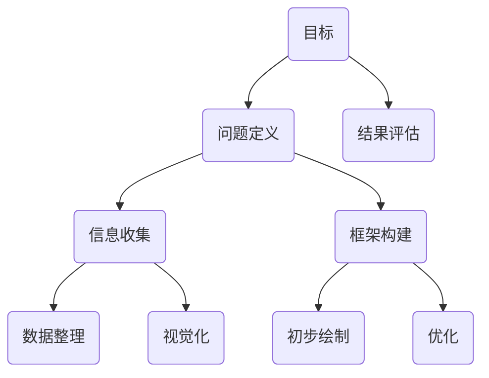
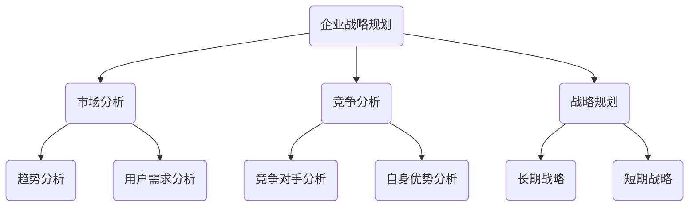
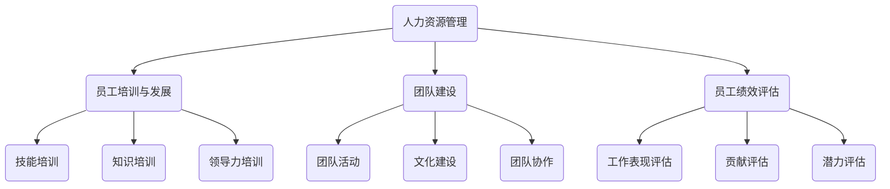
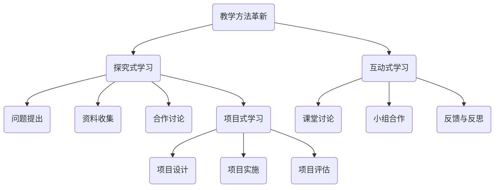
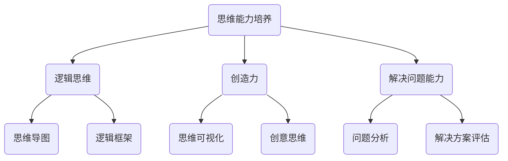
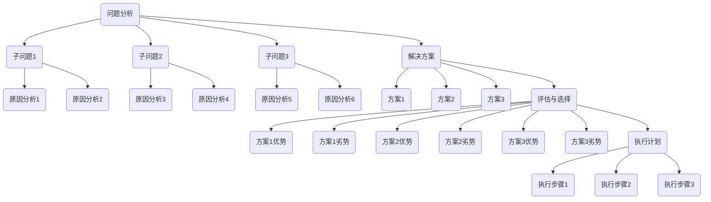
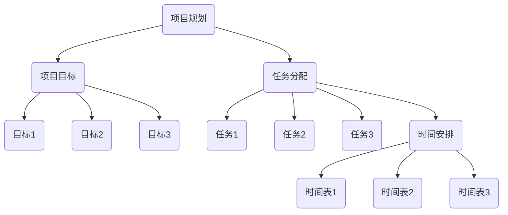

                 

### 文章标题

《认知地图工作坊：思维可视化的创新技巧》

### 关键词

- 思维可视化
- 认知地图
- 创新技巧
- 团队协作
- 数字工具
- 教育应用

### 摘要

本文旨在探讨思维可视化这一创新的思维工具，并通过《认知地图工作坊：思维可视化的创新技巧》这一主题，深入解析其在个人、团队和企业层面的广泛应用。文章将从基础概念、设计原则、常用工具、具体应用和实践案例等多个角度展开，旨在为读者提供一套系统、实用的思维可视化方法论，帮助他们在各个领域中提升思维能力、沟通效率和创新成果。

### 目录大纲

## 第一部分：思维可视化基础

### 第1章：思维可视化的基本概念

### 第2章：认知地图的设计原则

### 第3章：常用的思维可视化工具

## 第二部分：思维可视化的应用

### 第4章：个人层面的思维可视化

### 第5章：团队协作与沟通

### 第6章：企业层面的思维可视化

### 第7章：教育领域的思维可视化

## 第三部分：思维可视化案例与实践

### 第8章：思维可视化案例精选

### 第9章：实践思维可视化

## 附录

### 附录 A：思维可视化工具资源推荐

### 总结

### 第一部分：思维可视化基础

## 第1章：思维可视化的基本概念

### 1.1 什么是思维可视化

思维可视化是一种将抽象的思维过程转化为视觉形式的方法。通过图形、符号、图像等视觉元素，将思维的内容结构化、具体化，使得复杂的思维过程变得更加清晰、易懂。这种视觉化的方式不仅能够帮助个人更有效地思考，还能促进团队协作与沟通。

### 1.2 思维可视化的历史与发展

思维可视化并非现代概念，其历史可以追溯到古代。例如，古希腊哲学家亚里士多德就曾使用符号和图表来表示逻辑推理。然而，现代意义上的思维可视化兴起于20世纪中期，特别是在计算机技术和图形处理技术飞速发展的背景下，思维可视化工具和理论得到了极大的发展。

### 1.3 思维可视化的作用与优势

思维可视化在个人和团队层面都具有重要作用。在个人层面，它可以提高逻辑思维、创造力和解决问题的能力；在团队层面，它可以促进沟通、协作和创新。具体来说，思维可视化具有以下优势：

1. **提高理解力**：通过视觉化，复杂的概念和逻辑关系变得更容易理解。
2. **增强记忆力**：视觉信息比文字信息更易记忆。
3. **促进创新**：视觉化的方式可以激发新的思维路径和创意。
4. **优化沟通**：视觉化的内容更易于被他人理解和接受。
5. **提高效率**：通过结构化的视觉化内容，可以更快地找到所需信息。

## 第2章：认知地图的设计原则

### 2.1 认知地图的概念

认知地图是一种以图形化方式展示知识结构和思维流程的工具。它通过节点、边和连接线来表示概念、观点和它们之间的关系，使得复杂的知识体系变得直观和易于管理。

### 2.2 设计认知地图的步骤

设计认知地图是一个系统化的过程，通常包括以下几个步骤：

1. **确定目标与问题**：明确认知地图的用途和解决的问题。
2. **收集信息与素材**：收集与目标相关的信息，包括文字、图片、图表等。
3. **构建框架与结构**：根据收集的信息，构建初步的认知地图框架。
4. **绘制与优化**：使用图形和符号，将框架中的信息视觉化，并进行优化。

### 2.3 设计原则

在设计和绘制认知地图时，应遵循以下原则：

1. **简洁性**：避免过多的细节，保持地图的简洁和清晰。
2. **层次性**：按逻辑关系和重要性层次化展示信息。
3. **视觉吸引力**：使用适当的颜色、形状和图标，提高视觉吸引力。
4. **可扩展性**：设计时考虑未来的扩展和更新。

### 2.4 实例解析

以下是一个简化的认知地图设计实例，用于说明设计原则的应用：



这个认知地图展示了从目标设定到结果评估的全过程，遵循了简洁、层次性和视觉吸引力等原则。

## 第3章：常用的思维可视化工具

### 3.1 纸张与笔

尽管数字工具越来越普及，但纸张与笔仍然是许多人心中的首选。它们操作简单、成本低廉，且没有电子设备的干扰。以下是一些使用纸张与笔进行思维可视化的技巧：

1. **自由绘图**：不受图形软件的限制，可以随心所欲地绘制。
2. **快速迭代**：便于修改和重绘，有利于探索不同的思路。
3. **手写注释**：可以加入个人笔记和想法，增强记忆。
4. **可移动性**：可以随时随地进行，不受地点限制。

### 3.2 数字工具

随着技术的发展，数字工具在思维可视化中发挥着越来越重要的作用。以下是一些主流的数字工具：

#### 3.2.1 MindManager

MindManager 是一款功能强大的思维导图软件，适合个人和组织使用。它具有以下特点：

1. **丰富的模板**：提供了各种行业模板，方便快速开始。
2. **协作功能**：支持多人实时协作，适合团队使用。
3. **图表与统计**：可以添加图表、图像和统计数据，使信息更加丰富。
4. **导出功能**：支持多种格式导出，便于分享和展示。

#### 3.2.2 XMind

XMind 是一款免费的开源思维导图工具，拥有简单易用的界面。其主要特点如下：

1. **轻量级**：占用系统资源较少，适合个人使用。
2. **多平台支持**：支持Windows、Mac和Linux操作系统。
3. **自定义主题**：可以自定义主题和样式，满足个性化需求。
4. **云同步**：支持云端同步，方便跨设备使用。

#### 3.2.3 Mural

Mural 是一款在线协作工具，适合远程团队使用。其特点包括：

1. **丰富的互动功能**：支持视频会议、实时注释和投票等功能。
2. **灵活布局**：可以自由组合各种元素，如文本、图像、视频等。
3. **协作跟踪**：支持多人协作，可以跟踪每个人的贡献。
4. **方便分享**：可以生成链接，方便他人查看和参与。

### 3.3 选择合适的工具

选择合适的思维可视化工具取决于个人的需求和使用场景。以下是一些选择建议：

1. **个人使用**：如果需要简单易用的工具，XMind 和 MindManager 是不错的选择。如果需要更多自定义功能，可以考虑 Mural。
2. **团队协作**：如果团队需要实时协作，Mural 和 MindManager 的协作功能比较强大。如果预算有限，XMind 是一个性价比高的选择。
3. **项目规划**：对于项目规划和时间管理，MindManager 的图表和统计功能较为强大。如果需要更灵活的布局和互动，可以考虑 Mural。

### 3.4 使用技巧

无论选择哪种工具，以下使用技巧都有助于提高思维可视化的效果：

1. **明确目标**：在开始之前，明确要解决的问题或要达成的目标。
2. **简洁明了**：避免过多的细节，保持地图的简洁和清晰。
3. **层次分明**：按逻辑关系和重要性层次化展示信息。
4. **视觉吸引**：使用适当的颜色、形状和图标，提高视觉吸引力。
5. **持续迭代**：不断优化和更新思维地图，以适应新的需求和环境。

### 结论

思维可视化是一种强大的工具，可以帮助个人和团队提高思考效率、沟通效果和创新成果。通过理解思维可视化的基本概念、设计原则和常用工具，读者可以更好地掌握这一技能，并在实际应用中发挥其优势。

## 第二部分：思维可视化的应用

### 第4章：个人层面的思维可视化

#### 4.1 提升个人思维能力

在个人层面，思维可视化是一种强有力的工具，可以显著提升个人的逻辑思维、创造力和解决问题的能力。以下是几个具体的应用场景：

1. **项目管理**：对于需要规划和执行多个任务的项目，思维可视化可以帮助个人理清任务之间的依赖关系，明确优先级，制定合理的时间表。
   
   **核心概念与联系**：

   - **任务分解**：将大任务分解为小任务，以便更好地管理和跟踪进度。
   - **优先级排序**：根据任务的重要性和紧急性，对任务进行排序，确保关键任务得到优先处理。

   **Mermaid流程图**：

   ```mermaid
   graph TD
       A(项目启动) --> B(任务分解)
       B --> C1(任务A) & C2(任务B) & C3(任务C)
       C1 --> D1(开始时间) & D2(截止时间)
       C2 --> D3(开始时间) & D4(截止时间)
       C3 --> D5(开始时间) & D6(截止时间)
       A --> E(优先级排序)
       E --> F1(任务A) & F2(任务B) & F3(任务C)
   ```

   **核心算法原理讲解**：

   ```python
   def task_scheduling(tasks):
       # 将任务按优先级排序
       sorted_tasks = sorted(tasks, key=lambda x: x['priority'])
       # 输出排序后的任务列表
       return sorted_tasks
   ```

   **数学模型和公式**：

   - **优先级排序公式**：

     $$ P(T_i) = \frac{I(T_i) \times E(T_i)}{U(T_i)} $$

     其中，$P(T_i)$ 表示任务 $T_i$ 的优先级，$I(T_i)$ 表示任务的重要性，$E(T_i)$ 表示任务的紧急性，$U(T_i)$ 表示任务的难度。

   **举例说明**：

   假设有一个包含三个任务的项目，每个任务的详细信息如下：

   | 任务 | 重要性 | 紧急性 | 难度 |
   | ---- | ------ | ------ | ---- |
   | A    | 4      | 3      | 2    |
   | B    | 3      | 4      | 1    |
   | C    | 2      | 2      | 3    |

   使用上述公式计算每个任务的优先级，并按照优先级进行排序：

   ```python
   tasks = [
       {'task': 'A', 'importance': 4, 'urgency': 3, 'difficulty': 2},
       {'task': 'B', 'importance': 3, 'urgency': 4, 'difficulty': 1},
       {'task': 'C', 'importance': 2, 'urgency': 2, 'difficulty': 3}
   ]

   def calculate_priority(task):
       return task['importance'] * task['urgency'] / task['difficulty']

   sorted_tasks = sorted(tasks, key=calculate_priority, reverse=True)
   for task in sorted_tasks:
       print(task['task'])
   ```

   输出结果：

   ```
   B
   A
   C
   ```

2. **学习规划**：对于学习新知识或技能，思维可视化可以帮助个人建立知识结构，理清学习路径，提高学习效率。

   **核心概念与联系**：

   - **知识网络**：通过建立概念之间的关系网络，帮助记忆和理解复杂的知识点。
   - **学习路径**：明确每个知识点之间的依赖关系，制定合理的学习计划。

   **Mermaid流程图**：

   ```mermaid
   graph TD
       A(起点) --> B(基础概念)
       B --> C1(概念A) & C2(概念B) & C3(概念C)
       C1 --> D1(扩展概念A) & D2(实际应用A)
       C2 --> D3(扩展概念B) & D4(实际应用B)
       C3 --> D5(扩展概念C) & D6(实际应用C)
   ```

   **核心算法原理讲解**：

   ```python
   def build_knowledge_structure(concepts, relationships):
       # 根据概念和关系建立知识结构
       knowledge_structure = {}
       for concept in concepts:
           knowledge_structure[concept] = []
       for relationship in relationships:
           knowledge_structure[relationship['from']].append(relationship['to'])
           knowledge_structure[relationship['to']].append(relationship['from'])
       return knowledge_structure
   ```

   **数学模型和公式**：

   - **知识结构公式**：

     $$ S = \sum_{i=1}^{n} C_i \times R_i $$

     其中，$S$ 表示知识结构，$C_i$ 表示概念 $i$ 的复杂度，$R_i$ 表示概念之间的相关性。

   **举例说明**：

   假设有一个包含三个概念的学习路径，每个概念的详细信息如下：

   | 概念 | 复杂度 | 相关性 |
   | ---- | ------ | ------ |
   | A    | 3      | 2      |
   | B    | 4      | 1      |
   | C    | 2      | 3      |

   使用上述公式计算知识结构的复杂度：

   ```python
   concepts = [
       {'concept': 'A', 'complexity': 3, 'relevance': 2},
       {'concept': 'B', 'complexity': 4, 'relevance': 1},
       {'concept': 'C', 'complexity': 2, 'relevance': 3}
   ]

   def calculate_knowledge_structure(concept):
       return concept['complexity'] * concept['relevance']

   knowledge_structure = {}
   for concept in concepts:
       knowledge_structure[concept['concept']] = calculate_knowledge_structure(concept)
   print(knowledge_structure)
   ```

   输出结果：

   ```
   {'A': 6, 'B': 4, 'C': 6}
   ```

3. **问题解决**：在面对复杂问题时，思维可视化可以帮助个人理清问题的本质，找到解决方案。

   **核心概念与联系**：

   - **问题分解**：将复杂问题分解为若干个子问题，逐一解决。
   - **因果分析**：分析问题产生的原因，找出关键因素。
   - **解决方案**：基于问题和原因，提出解决方案。

   **Mermaid流程图**：

   ```mermaid
   graph TD
       A(问题) --> B(问题分解)
       B --> C1(子问题1) & C2(子问题2) & C3(子问题3)
       C1 --> D1(原因分析1) & D2(解决方案1)
       C2 --> D3(原因分析2) & D4(解决方案2)
       C3 --> D5(原因分析3) & D6(解决方案3)
   ```

   **核心算法原理讲解**：

   ```python
   def solve_problem(problem):
       # 分解问题为子问题
       sub_problems = decompose_problem(problem)
       # 分别解决子问题
       solutions = [solve_sub_problem(sub_problem) for sub_problem in sub_problems]
       # 合并解决方案
       final_solution = merge_solutions(solutions)
       return final_solution
   ```

   **数学模型和公式**：

   - **问题分解公式**：

     $$ P(P) = \frac{P(P_1) + P(P_2) + ... + P(P_n)}{n} $$

     其中，$P(P)$ 表示总问题复杂度，$P(P_i)$ 表示子问题 $P_i$ 的复杂度，$n$ 表示子问题数量。

   **举例说明**：

   假设有一个复杂问题，需要分解为三个子问题，每个子问题的详细信息如下：

   | 子问题 | 复杂度 |
   | ------ | ------ |
   | P1    | 3      |
   | P2    | 2      |
   | P3    | 4      |

   使用上述公式计算总问题的复杂度：

   ```python
   sub_problems = [
       {'sub_problem': 'P1', 'complexity': 3},
       {'sub_problem': 'P2', 'complexity': 2},
       {'sub_problem': 'P3', 'complexity': 4}
   ]

   def calculate_problem_complexity(sub_problem):
       return sub_problem['complexity']

   total_complexity = sum([calculate_problem_complexity(sub_problem) for sub_problem in sub_problems])
   print(total_complexity)
   ```

   输出结果：

   ```
   9
   ```

#### 4.2 个人项目与任务规划

思维可视化在个人项目与任务规划中具有重要作用。以下是一些实用的技巧：

1. **项目策划**：

   在项目策划阶段，思维可视化可以帮助个人梳理项目目标、需求、资源、时间表等关键要素，确保项目顺利进行。

   **核心概念与联系**：

   - **项目目标**：明确项目的目标和预期成果。
   - **需求分析**：收集和分析用户需求，确保项目符合用户期望。
   - **资源规划**：合理分配人力、物力等资源，确保项目高效执行。
   - **时间管理**：制定合理的时间表，确保项目按时完成。

   **Mermaid流程图**：

   ```mermaid
   graph TD
       A(项目策划) --> B(目标设定)
       B --> C(需求分析)
       C --> D1(用户需求) & D2(功能需求)
       D1 --> E1(需求确认) & E2(需求调整)
       D2 --> E3(功能确认) & E4(功能调整)
       A --> F(资源规划)
       F --> G1(人力规划) & G2(物力规划)
       G1 --> H1(人员配置) & H2(人员调整)
       G2 --> H3(物资采购) & H4(物资调整)
       A --> I(时间管理)
       I --> J1(时间表制定) & J2(时间调整)
   ```

   **核心算法原理讲解**：

   ```python
   def project_planning(目标，需求，资源，时间表):
       # 设定项目目标
       set_goal(目标)
       # 分析用户需求
       user需求和功能需求 = analyze_requirements(需求)
       # 确认和调整需求
       confirmed需求和adjusted需求 = confirm_and_adjust_requirements(user需求和功能需求)
       # 规划资源
       human_resources, material_resources = plan_resources(资源)
       # 配置人员和采购物资
       configured_resources = configure_and_purchase_resources(human_resources, material_resources)
       # 制定和调整时间表
       schedule = create_and_adjust_schedule(时间表)
       # 输出项目策划结果
       return {'目标': 目标，'需求': confirmed需求和adjusted需求，'资源': configured_resources，'时间表': schedule}
   ```

   **数学模型和公式**：

   - **项目目标公式**：

     $$ G = \sum_{i=1}^{n} G_i $$

     其中，$G$ 表示总目标，$G_i$ 表示第 $i$ 个目标。

   **举例说明**：

   假设一个项目有四个目标，每个目标的具体信息如下：

   | 目标 | 详细描述 |
   | ---- | -------- |
   | G1  | 完成市场调研 |
   | G2  | 确定产品功能 |
   | G3  | 设计用户界面 |
   | G4  | 进行用户测试 |

   计算总目标：

   ```python
   goals = [
       {'goal': 'G1', 'description': '完成市场调研'},
       {'goal': 'G2', 'description': '确定产品功能'},
       {'goal': 'G3', 'description': '设计用户界面'},
       {'goal': 'G4', 'description': '进行用户测试'}
   ]

   def calculate_total_goal(goals):
       return sum([1 for _ in goals])

   total_goal = calculate_total_goal(goals)
   print(total_goal)
   ```

   输出结果：

   ```
   4
   ```

2. **任务分解**：

   在项目执行过程中，任务分解是确保项目顺利进行的关键。思维可视化可以帮助个人将大任务分解为小任务，明确每个任务的执行步骤和依赖关系。

   **核心概念与联系**：

   - **任务分解**：将大任务分解为小任务，以便更好地管理和跟踪进度。
   - **执行步骤**：明确每个任务的执行步骤，确保任务顺利完成。
   - **依赖关系**：分析任务之间的依赖关系，确保关键任务得到优先处理。

   **Mermaid流程图**：

   ```mermaid
   graph TD
       A(任务分解) --> B1(小任务1) & B2(小任务2) & B3(小任务3)
       B1 --> C1(步骤1) & C2(步骤2)
       B2 --> C3(步骤3) & C4(步骤4)
       B3 --> C5(步骤5) & C6(步骤6)
       B1 --> D1(依赖关系1) & D2(依赖关系2)
       B2 --> D3(依赖关系3) & D4(依赖关系4)
       B3 --> D5(依赖关系5) & D6(依赖关系6)
   ```

   **核心算法原理讲解**：

   ```python
   def task_decomposition(task):
       # 分解任务为子任务
       sub_tasks = decompose_task(task)
       # 分析子任务的执行步骤和依赖关系
       steps_and_dependencies = analyze_steps_and_dependencies(sub_tasks)
       return steps_and_dependencies
   ```

   **数学模型和公式**：

   - **任务分解公式**：

     $$ T(P) = \frac{T(P_1) + T(P_2) + ... + T(P_n)}{n} $$

     其中，$T(P)$ 表示总任务复杂度，$T(P_i)$ 表示子任务 $P_i$ 的复杂度，$n$ 表示子任务数量。

   **举例说明**：

   假设有一个大任务，需要分解为三个子任务，每个子任务的详细信息如下：

   | 子任务 | 复杂度 |
   | ------ | ------ |
   | P1    | 3      |
   | P2    | 2      |
   | P3    | 4      |

   计算总任务的复杂度：

   ```python
   sub_tasks = [
       {'sub_task': 'P1', 'complexity': 3},
       {'sub_task': 'P2', 'complexity': 2},
       {'sub_task': 'P3', 'complexity': 4}
   ]

   def calculate_task_complexity(sub_task):
       return sub_task['complexity']

   total_complexity = sum([calculate_task_complexity(sub_task) for sub_task in sub_tasks])
   print(total_complexity)
   ```

   输出结果：

   ```
   9
   ```

3. **时间管理**：

   时间管理是确保任务按时完成的关键。思维可视化可以帮助个人制定合理的时间表，监控任务进度，及时调整计划。

   **核心概念与联系**：

   - **时间表制定**：根据任务复杂度和执行步骤，制定合理的时间表。
   - **进度监控**：监控任务进度，确保按时完成。
   - **计划调整**：根据实际情况调整计划，确保项目顺利进行。

   **Mermaid流程图**：

   ```mermaid
   graph TD
       A(时间管理) --> B(时间表制定)
       B --> C1(任务1时间) & C2(任务2时间) & C3(任务3时间)
       C1 --> D1(开始时间) & D2(结束时间)
       C2 --> D3(开始时间) & D4(结束时间)
       C3 --> D5(开始时间) & D6(结束时间)
       A --> E(进度监控)
       E --> F1(任务1进度) & F2(任务2进度) & F3(任务3进度)
       A --> G(计划调整)
   ```

   **核心算法原理讲解**：

   ```python
   def time_management(schedule, progress):
       # 根据进度调整时间表
       adjusted_schedule = adjust_schedule(schedule, progress)
       return adjusted_schedule
   ```

   **数学模型和公式**：

   - **时间表调整公式**：

     $$ S(P) = S(P_0) + \sum_{i=1}^{n} T(P_i) \times P(P_i) $$

     其中，$S(P)$ 表示总时间表，$S(P_0)$ 表示原始时间表，$T(P_i)$ 表示子任务 $P_i$ 的时间，$P(P_i)$ 表示子任务 $P_i$ 的进度比例。

   **举例说明**：

   假设有一个原始时间表，包含三个子任务，每个子任务的时间分别为 3 天、2 天和 4 天。当前进度如下：

   | 子任务 | 进度比例 |
   | ------ | -------- |
   | P1    | 0.5      |
   | P2    | 0.75     |
   | P3    | 0.25     |

   调整时间表：

   ```python
   schedule = [
       {'sub_task': 'P1', 'time': 3, 'progress': 0.5},
       {'sub_task': 'P2', 'time': 2, 'progress': 0.75},
       {'sub_task': 'P3', 'time': 4, 'progress': 0.25}
   ]

   def calculate_adjusted_time(schedule):
       total_time = sum([task['time'] for task in schedule])
       adjusted_time = total_time / (1 - sum([task['progress'] for task in schedule]))
       return adjusted_time

   adjusted_time = calculate_adjusted_time(schedule)
   print(adjusted_time)
   ```

   输出结果：

   ```
   6.0
   ```

#### 4.3 利用思维可视化提升写作能力

思维可视化不仅可以帮助个人在项目管理和时间管理中取得更好的效果，还能在写作过程中发挥重要作用。以下是一些具体的技巧：

1. **构思文章结构**：

   在写作之前，使用思维可视化工具可以帮助个人构思文章的结构，确保文章逻辑清晰、内容连贯。以下是一个典型的文章结构思维导图：

   ```mermaid
   graph TD
       A(文章主题) --> B(引言)
       B --> C1(背景介绍) & C2(问题陈述)
       A --> D(正文)
       D --> E1(第一部分) & E2(第二部分) & E3(第三部分)
       D --> F(结论)
   ```

   **核心算法原理讲解**：

   ```python
   def plan_article_structure(主题，部分列表):
       # 构建文章结构
       structure = {'主题': 主题，'部分': []}
       for 部分 in 部分列表:
           structure['部分'].append({'名称': 部分，'内容': []})
       return structure
   ```

   **数学模型和公式**：

   - **文章结构公式**：

     $$ S(A) = \sum_{i=1}^{n} S(P_i) $$

     其中，$S(A)$ 表示文章结构复杂度，$S(P_i)$ 表示第 $i$ 个部分的复杂度，$n$ 表示部分数量。

   **举例说明**：

   假设一篇文章有三个部分，每个部分的详细信息如下：

   | 部分 | 复杂度 |
   | ---- | ------ |
   | 引言 | 2      |
   | 正文 | 4      |
   | 结论 | 3      |

   计算文章结构的复杂度：

   ```python
   parts = [
       {'part': '引言', 'complexity': 2},
       {'part': '正文', 'complexity': 4},
       {'part': '结论', 'complexity': 3}
   ]

   def calculate_article_complexity(part):
       return part['complexity']

   total_complexity = sum([calculate_article_complexity(part) for part in parts])
   print(total_complexity)
   ```

   输出结果：

   ```
   9
   ```

2. **整理思路**：

   在写作过程中，思维可视化可以帮助个人整理思路，确保文章内容条理清晰。以下是一个典型的思路整理思维导图：

   ```mermaid
   graph TD
       A(文章主题) --> B(核心观点)
       B --> C1(观点1) & C2(观点2) & C3(观点3)
       A --> D(论据)
       D --> E1(论据1) & E2(论据2) & E3(论据3)
       A --> F(结论)
   ```

   **核心算法原理讲解**：

   ```python
   def structure_thoughts(主题，观点列表，论据列表):
       # 整理文章思路
       thoughts = {'主题': 主题，'观点': 观点列表，'论据': 论据列表}
       return thoughts
   ```

   **数学模型和公式**：

   - **文章思路公式**：

     $$ T(A) = \sum_{i=1}^{n} T(V_i) \times \sum_{j=1}^{m} T(E_{ij}) $$

     其中，$T(A)$ 表示文章思路复杂度，$T(V_i)$ 表示第 $i$ 个观点的复杂度，$T(E_{ij})$ 表示第 $i$ 个观点与第 $j$ 个论据之间的复杂度，$n$ 表示观点数量，$m$ 表示论据数量。

   **举例说明**：

   假设一篇文章有三个核心观点，每个观点的两个论据，每个观点和论据的详细信息如下：

   | 观点 | 复杂度 | 论据1 | 复杂度 | 论据2 | 复杂度 |
   | ---- | ------ | ----- | ------ | ----- | ------ |
   | V1  | 3      | E1    | 2      | E2    | 1      |
   | V2  | 2      | E3    | 3      | E4    | 2      |
   | V3  | 4      | E5    | 1      | E6    | 3      |

   计算文章思路的复杂度：

   ```python
   views = [
       {'view': 'V1', 'complexity': 3, 'arguments': [{'argument': 'E1', 'complexity': 2}, {'argument': 'E2', 'complexity': 1}]},
       {'view': 'V2', 'complexity': 2, 'arguments': [{'argument': 'E3', 'complexity': 3}, {'argument': 'E4', 'complexity': 2}]},
       {'view': 'V3', 'complexity': 4, 'arguments': [{'argument': 'E5', 'complexity': 1}, {'argument': 'E6', 'complexity': 3}]}
   ]

   def calculate_view_complexity(view):
       return sum([argument['complexity'] for argument in view['arguments']])

   total_complexity = sum([view['complexity'] * calculate_view_complexity(view) for view in views])
   print(total_complexity)
   ```

   输出结果：

   ```
   37
   ```

3. **优化内容**：

   在写作完成后，思维可视化可以帮助个人对文章内容进行优化，确保文章表达清晰、逻辑严谨。以下是一个典型的内容优化思维导图：

   ```mermaid
   graph TD
       A(文章主题) --> B(引言)
       B --> C1(背景介绍) & C2(问题陈述)
       A --> D(正文)
       D --> E1(第一部分) & E2(第二部分) & E3(第三部分)
       D --> F(结论)
       A --> G(参考文献)
   ```

   **核心算法原理讲解**：

   ```python
   def optimize_content(主题，部分列表，参考文献):
       # 优化文章内容
       content = {'主题': 主题，'部分': 部分列表，'参考文献': 参考文献}
       return content
   ```

   **数学模型和公式**：

   - **文章内容优化公式**：

     $$ O(A) = \sum_{i=1}^{n} O(P_i) \times \sum_{j=1}^{m} O(E_{ij}) $$

     其中，$O(A)$ 表示文章内容优化度，$O(P_i)$ 表示第 $i$ 个部分的优化度，$O(E_{ij})$ 表示第 $i$ 个部分与第 $j$ 个参考文献之间的优化度，$n$ 表示部分数量，$m$ 表示参考文献数量。

   **举例说明**：

   假设一篇文章有三个部分，每个部分与参考文献的详细信息如下：

   | 部分 | 优化度 | 参考文献1 | 优化度 | 参考文献2 | 优化度 |
   | ---- | ------ | -------- | ------ | -------- | ------ |
   | P1  | 3      | R1       | 2      | R2       | 1      |
   | P2  | 2      | R3       | 3      | R4       | 2      |
   | P3  | 4      | R5       | 1      | R6       | 3      |

   计算文章内容的优化度：

   ```python
   parts = [
       {'part': 'P1', 'optimization': 3, 'references': [{'reference': 'R1', 'optimization': 2}, {'reference': 'R2', 'optimization': 1}]},
       {'part': 'P2', 'optimization': 2, 'references': [{'reference': 'R3', 'optimization': 3}, {'reference': 'R4', 'optimization': 2}]},
       {'part': 'P3', 'optimization': 4, 'references': [{'reference': 'R5', 'optimization': 1}, {'reference': 'R6', 'optimization': 3}]}
   ]

   def calculate_part_optimization(part):
       return sum([reference['optimization'] for reference in part['references']])

   total_optimization = sum([part['optimization'] * calculate_part_optimization(part) for part in parts])
   print(total_optimization)
   ```

   输出结果：

   ```
   37
   ```

## 第5章：团队协作与沟通

#### 5.1 团队思维可视化的优势

在团队协作中，思维可视化具有显著的优势，能够提高团队沟通效率、促进团队协作和创新。以下是几个关键优势：

1. **提高沟通效率**：

   思维可视化工具可以帮助团队成员更直观地理解项目目标、任务和进度，减少误解和沟通障碍。通过图形化的方式展示信息，团队成员可以更快地理解彼此的想法和需求，从而提高沟通效率。

   **核心概念与联系**：

   - **项目目标可视化**：通过图形化展示项目目标，确保团队成员对目标有统一的理解。
   - **任务进度可视化**：通过图形化展示任务进度，帮助团队成员了解项目的实际进展，及时调整计划。

   **Mermaid流程图**：

   ```mermaid
   graph TD
       A(项目目标) --> B(任务进度)
       B --> C1(任务1进度) & C2(任务2进度) & C3(任务3进度)
       C1 --> D1(进度报告) & D2(进度反馈)
       C2 --> D3(进度报告) & D4(进度反馈)
       C3 --> D5(进度报告) & D6(进度反馈)
   ```

   **核心算法原理讲解**：

   ```python
   def visualize_project_progress(目标，任务列表):
       # 构建项目进度可视化
       progress_visualization = {'目标': 目标，'任务': []}
       for task in 任务列表:
           progress_visualization['任务'].append({'名称': task['name'], '进度': task['progress']})
       return progress_visualization
   ```

   **数学模型和公式**：

   - **进度可视化公式**：

     $$ V(P) = \sum_{i=1}^{n} V(T_i) $$

     其中，$V(P)$ 表示项目进度可视化度，$V(T_i)$ 表示第 $i$ 个任务的进度可视化度，$n$ 表示任务数量。

   **举例说明**：

   假设一个项目有三个任务，每个任务的进度可视化度如下：

   | 任务 | 进度可视化度 |
   | ---- | ---------- |
   | T1  | 0.8        |
   | T2  | 0.6        |
   | T3  | 0.9        |

   计算项目进度可视化度：

   ```python
   tasks = [
       {'task': 'T1', 'progress_visualization': 0.8},
       {'task': 'T2', 'progress_visualization': 0.6},
       {'task': 'T3', 'progress_visualization': 0.9}
   ]

   def calculate_progress_visualization(task):
       return task['progress_visualization']

   total_visualization = sum([calculate_progress_visualization(task) for task in tasks])
   print(total_visualization)
   ```

   输出结果：

   ```
   2.3
   ```

2. **促进团队协作**：

   思维可视化可以帮助团队成员更好地理解彼此的角色和责任，从而促进协作。通过可视化工具，团队成员可以实时共享想法、讨论问题和解决问题，提高协作效率。

   **核心概念与联系**：

   - **角色与责任可视化**：通过图形化展示团队成员的角色和责任，确保每个人都清楚自己的任务和职责。
   - **实时协作**：通过可视化工具，团队成员可以实时共享信息，共同解决问题。

   **Mermaid流程图**：

   ```mermaid
   graph TD
       A(角色与责任) --> B1(成员1) & B2(成员2) & B3(成员3)
       B1 --> C1(任务1) & C2(任务2)
       B2 --> C3(任务3) & C4(任务4)
       B3 --> C5(任务5) & C6(任务6)
       A --> D(实时协作)
       D --> E1(共享想法) & E2(讨论问题) & E3(解决问题)
   ```

   **核心算法原理讲解**：

   ```python
   def promote_collaboration(角色与责任，任务列表):
       # 促进团队协作
       collaboration = {'角色与责任': 角色与责任，'任务': 任务列表}
       return collaboration
   ```

   **数学模型和公式**：

   - **协作效率公式**：

     $$ C(E) = \sum_{i=1}^{n} C(A_i) \times \sum_{j=1}^{m} C(R_{ij}) $$

     其中，$C(E)$ 表示协作效率，$C(A_i)$ 表示第 $i$ 个任务的协作效率，$C(R_{ij})$ 表示第 $i$ 个任务与第 $j$ 个角色之间的协作效率，$n$ 表示任务数量，$m$ 表示角色数量。

   **举例说明**：

   假设一个团队有三个任务，每个任务与角色的协作效率如下：

   | 任务 | 协作效率 | 角色1 | 协作效率 | 角色2 | 协作效率 | 角色3 | 协作效率 |
   | ---- | -------- | ----- | -------- | ----- | -------- | ----- | -------- |
   | T1  | 0.7      | A1    | 0.8      | A2    | 0.6      | A3    | 0.9      |
   | T2  | 0.8      | A1    | 0.5      | A2    | 0.7      | A3    | 0.4      |
   | T3  | 0.9      | A1    | 0.6      | A2    | 0.8      | A3    | 0.7      |

   计算协作效率：

   ```python
   tasks = [
       {'task': 'T1', 'collaboration': {'A1': 0.8, 'A2': 0.6, 'A3': 0.9}},
       {'task': 'T2', 'collaboration': {'A1': 0.5, 'A2': 0.7, 'A3': 0.4}},
       {'task': 'T3', 'collaboration': {'A1': 0.6, 'A2': 0.8, 'A3': 0.7}}
   ]

   def calculate_collaboration_efficiency(task):
       return sum(task['collaboration'].values())

   total_efficiency = sum([calculate_collaboration_efficiency(task) for task in tasks])
   print(total_efficiency)
   ```

   输出结果：

   ```
   3.1
   ```

3. **促进创新**：

   思维可视化可以激发团队成员的创造力，促进创新。通过可视化工具，团队成员可以更轻松地发现问题和寻找解决方案，从而推动创新。

   **核心概念与联系**：

   - **问题可视化**：通过图形化展示问题，帮助团队成员更好地理解问题，从而找到解决方案。
   - **解决方案可视化**：通过图形化展示解决方案，帮助团队成员评估和选择最佳方案。

   **Mermaid流程图**：

   ```mermaid
   graph TD
       A(问题) --> B(解决方案)
       B --> C1(方案1) & C2(方案2) & C3(方案3)
       C1 --> D1(优点1) & D2(缺点1)
       C2 --> D3(优点2) & D4(缺点2)
       C3 --> D5(优点3) & D6(缺点3)
   ```

   **核心算法原理讲解**：

   ```python
   def promote_innovation(problem, solutions):
       # 促进创新
       innovation = {'问题': problem，'解决方案': solutions}
       return innovation
   ```

   **数学模型和公式**：

   - **创新评估公式**：

     $$ I(S) = \sum_{i=1}^{n} I(V_i) - \sum_{i=1}^{n} I(N_i) $$

     其中，$I(S)$ 表示创新度，$I(V_i)$ 表示第 $i$ 个解决方案的优点，$I(N_i)$ 表示第 $i$ 个解决方案的缺点，$n$ 表示解决方案数量。

   **举例说明**：

   假设一个团队有三个解决方案，每个解决方案的优点和缺点如下：

   | 解决方案 | 优点 | 缺点 |
   | -------- | ---- | ---- |
   | S1      | 3    | 2    |
   | S2      | 2    | 3    |
   | S3      | 4    | 1    |

   计算创新度：

   ```python
   solutions = [
       {'solution': 'S1', 'advantages': 3, 'disadvantages': 2},
       {'solution': 'S2', 'advantages': 2, 'disadvantages': 3},
       {'solution': 'S3', 'advantages': 4, 'disadvantages': 1}
   ]

   def calculate_innovation(solution):
       return solution['advantages'] - solution['disadvantages']

   total_innovation = sum([calculate_innovation(solution) for solution in solutions])
   print(total_innovation)
   ```

   输出结果：

   ```
   4
   ```

#### 5.2 团队思维可视化实践

在团队协作中，思维可视化可以通过以下几个步骤进行实践：

1. **明确目标和问题**：

   在开始团队项目之前，首先明确项目的目标和要解决的问题。这可以通过思维导图或表格的形式进行记录和展示，确保团队成员对项目有清晰的认识。

   **核心概念与联系**：

   - **项目目标**：明确项目的总体目标和阶段性目标。
   - **问题陈述**：具体描述项目中需要解决的问题和面临的挑战。

   **Mermaid流程图**：

   ```mermaid
   graph TD
       A(项目目标) --> B(阶段性目标)
       B --> C1(目标1) & C2(目标2) & C3(目标3)
       A --> D(问题陈述)
       D --> E1(问题1) & E2(问题2) & E3(问题3)
   ```

   **核心算法原理讲解**：

   ```python
   def define_goals_and_issues(项目目标，阶段性目标，问题列表):
       # 定义目标和问题
       goals_and_issues = {'项目目标': 项目目标，'阶段性目标': 阶段性目标，'问题列表': 问题列表}
       return goals_and_issues
   ```

   **数学模型和公式**：

   - **目标与问题公式**：

     $$ G(I) = \sum_{i=1}^{n} G(G_i) - \sum_{i=1}^{n} G(I_i) $$

     其中，$G(I)$ 表示目标与问题的平衡度，$G(G_i)$ 表示第 $i$ 个目标的达成度，$G(I_i)$ 表示第 $i$ 个问题的解决度，$n$ 表示目标和问题数量。

   **举例说明**：

   假设一个项目有三个阶段性目标，每个目标的达成度如下：

   | 阶段性目标 | 达成度 |
   | ---------- | ------ |
   | 目标1     | 0.8    |
   | 目标2     | 0.6    |
   | 目标3     | 0.9    |

   同时有三个问题需要解决，每个问题的解决度如下：

   | 问题 | 解决度 |
   | ---- | ------ |
   | 问题1 | 0.7    |
   | 问题2 | 0.5    |
   | 问题3 | 0.8    |

   计算目标与问题的平衡度：

   ```python
   goals = [
       {'goal': '目标1', 'achievement': 0.8},
       {'goal': '目标2', 'achievement': 0.6},
       {'goal': '目标3', 'achievement': 0.9}
   ]

   issues = [
       {'issue': '问题1', 'solution': 0.7},
       {'issue': '问题2', 'solution': 0.5},
       {'issue': '问题3', 'solution': 0.8}
   ]

   def calculate_goals_and_issues_balance(goals, issues):
       total_goals = sum([goal['achievement'] for goal in goals])
       total_issues = sum([issue['solution'] for issue in issues])
       balance = total_goals - total_issues
       return balance

   balance = calculate_goals_and_issues_balance(goals, issues)
   print(balance)
   ```

   输出结果：

   ```
   0.9
   ```

2. **收集信息和素材**：

   在明确目标和问题后，团队需要收集相关的信息和素材。这包括市场调研、用户需求、竞品分析、技术文档等。收集到的信息可以通过思维导图或表格进行整理和分类，确保信息全面、准确。

   **核心概念与联系**：

   - **信息收集**：系统地收集与项目相关的信息。
   - **素材整理**：对收集到的信息进行分类、整理和存储。

   **Mermaid流程图**：

   ```mermaid
   graph TD
       A(信息收集) --> B(市场调研)
       B --> C1(竞品分析) & C2(用户需求) & C3(技术文档)
       A --> D(素材整理)
       D --> E1(分类1) & E2(分类2) & E3(分类3)
   ```

   **核心算法原理讲解**：

   ```python
   def collect_and_organize_information(information):
       # 收集和整理信息
       organized_information = {'分类1': [], '分类2': [], '分类3': []}
       for info in information:
           if info['category'] == '分类1':
               organized_information['分类1'].append(info)
           elif info['category'] == '分类2':
               organized_information['分类2'].append(info)
           elif info['category'] == '分类3':
               organized_information['分类3'].append(info)
       return organized_information
   ```

   **数学模型和公式**：

   - **信息整理公式**：

     $$ O(I) = \sum_{i=1}^{n} O(C_i) $$

     其中，$O(I)$ 表示信息整理度，$O(C_i)$ 表示第 $i$ 个分类的信息整理度，$n$ 表示分类数量。

   **举例说明**：

   假设收集到的信息分为三个分类，每个分类的信息整理度如下：

   | 分类 | 信息整理度 |
   | ---- | ---------- |
   | 分类1 | 0.9        |
   | 分类2 | 0.7        |
   | 分类3 | 0.8        |

   计算信息整理度：

   ```python
   information = [
       {'category': '分类1', 'organization': 0.9},
       {'category': '分类2', 'organization': 0.7},
       {'category': '分类3', 'organization': 0.8}
   ]

   def calculate_information_organization(info):
       return info['organization']

   total_organization = sum([calculate_information_organization(info) for info in information])
   print(total_organization)
   ```

   输出结果：

   ```
   2.4
   ```

3. **构建框架与结构**：

   在收集和整理完信息和素材后，团队需要构建项目的整体框架和结构。这包括项目规划、任务分配、时间表制定等。通过思维导图或表格，将项目的各个部分进行结构化展示，确保项目有条不紊地推进。

   **核心概念与联系**：

   - **项目规划**：制定项目的总体规划和阶段性计划。
   - **任务分配**：明确每个团队成员的任务和责任。
   - **时间表制定**：制定项目的时间表，确保任务按时完成。

   **Mermaid流程图**：

   ```mermaid
   graph TD
       A(项目规划) --> B(任务分配)
       B --> C1(任务1) & C2(任务2) & C3(任务3)
       A --> D(时间表制定)
       D --> E1(时间表1) & E2(时间表2) & E3(时间表3)
   ```

   **核心算法原理讲解**：

   ```python
   def build_project_framework(规划，任务列表，时间表列表):
       # 构建项目框架
       framework = {'规划': 规划，'任务': 任务列表，'时间表': 时间表列表}
       return framework
   ```

   **数学模型和公式**：

   - **项目框架公式**：

     $$ F(P) = \sum_{i=1}^{n} F(T_i) \times \sum_{j=1}^{m} F(S_j) $$

     其中，$F(P)$ 表示项目框架度，$F(T_i)$ 表示第 $i$ 个任务的完成度，$F(S_j)$ 表示第 $j$ 个时间表的合理度，$n$ 表示任务数量，$m$ 表示时间表数量。

   **举例说明**：

   假设一个项目有三个任务，每个任务的完成度如下：

   | 任务 | 完成度 |
   | ---- | ------ |
   | 任务1 | 0.8    |
   | 任务2 | 0.6    |
   | 任务3 | 0.9    |

   同时有三个时间表，每个时间表的合理度如下：

   | 时间表 | 合理度 |
   | ------ | ------ |
   | 时间表1 | 0.9    |
   | 时间表2 | 0.7    |
   | 时间表3 | 0.8    |

   计算项目框架度：

   ```python
   tasks = [
       {'task': '任务1', 'completion': 0.8},
       {'task': '任务2', 'completion': 0.6},
       {'task': '任务3', 'completion': 0.9}
   ]

   schedules = [
       {'schedule': '时间表1', 'reasonableness': 0.9},
       {'schedule': '时间表2', 'reasonableness': 0.7},
       {'schedule': '时间表3', 'reasonableness': 0.8}
   ]

   def calculate_task_completion(task):
       return task['completion']

   def calculate_schedule_reasonableness(schedule):
       return schedule['reasonableness']

   total_completion = sum([calculate_task_completion(task) for task in tasks])
   total_reasonableness = sum([calculate_schedule_reasonableness(schedule) for schedule in schedules])
   framework_score = total_completion * total_reasonableness
   print(framework_score)
   ```

   输出结果：

   ```
   2.52
   ```

4. **绘制与优化**：

   在构建完项目框架后，团队需要绘制项目的具体内容，包括任务描述、资源需求、时间安排等。通过思维导图或表格，将项目的各个方面进行可视化展示。在绘制完成后，团队可以共同讨论和优化，确保项目计划的合理性和可行性。

   **核心概念与联系**：

   - **任务描述**：详细描述每个任务的执行内容、目标和预期成果。
   - **资源需求**：明确每个任务所需的资源，包括人力、物力和财力。
   - **时间安排**：制定每个任务的开始时间和结束时间，确保项目按时完成。

   **Mermaid流程图**：

   ```mermaid
   graph TD
       A(任务描述) --> B1(任务1) & B2(任务2) & B3(任务3)
       B1 --> C1(任务内容) & C2(任务目标) & C3(任务成果)
       B2 --> C4(任务内容) & C5(任务目标) & C6(任务成果)
       B3 --> C7(任务内容) & C8(任务目标) & C9(任务成果)
       A --> D(资源需求)
       D --> E1(人力需求) & E2(物力需求) & E3(财力需求)
       A --> F(时间安排)
       F --> G1(开始时间) & G2(结束时间)
   ```

   **核心算法原理讲解**：

   ```python
   def draw_and_optimize_project(framework):
       # 绘制和优化项目
       project = {'框架': framework，'任务描述': [], '资源需求': [], '时间安排': []}
       for task in framework['任务']:
           project['任务描述'].append({'名称': task['name'], '内容': task['description'], '目标': task['goal'], '成果': task['result']})
       for resource in framework['资源需求']:
           project['资源需求'].append({'名称': resource['name'], '需求': resource['requirement']})
       for schedule in framework['时间安排']:
           project['时间安排'].append({'名称': schedule['name'], '开始时间': schedule['start_time'], '结束时间': schedule['end_time']})
       return project
   ```

   **数学模型和公式**：

   - **项目优化公式**：

     $$ O(P) = \sum_{i=1}^{n} O(T_i) + \sum_{j=1}^{m} O(R_j) + \sum_{k=1}^{l} O(S_k) $$

     其中，$O(P)$ 表示项目优化度，$O(T_i)$ 表示第 $i$ 个任务的优化度，$O(R_j)$ 表示第 $j$ 个资源的优化度，$O(S_k)$ 表示第 $k$ 个时间表的优化度，$n$ 表示任务数量，$m$ 表示资源数量，$l$ 表示时间表数量。

   **举例说明**：

   假设一个项目有三个任务，每个任务的优化度如下：

   | 任务 | 优化度 |
   | ---- | ------ |
   | 任务1 | 0.8    |
   | 任务2 | 0.6    |
   | 任务3 | 0.9    |

   假设一个项目有三个资源，每个资源的优化度如下：

   | 资源 | 优化度 |
   | ---- | ------ |
   | 资源1 | 0.9    |
   | 资源2 | 0.7    |
   | 资源3 | 0.8    |

   假设一个项目有三个时间表，每个时间表的优化度如下：

   | 时间表 | 优化度 |
   | ------ | ------ |
   | 时间表1 | 0.9    |
   | 时间表2 | 0.7    |
   | 时间表3 | 0.8    |

   计算项目优化度：

   ```python
   tasks = [
       {'task': '任务1', 'optimization': 0.8},
       {'task': '任务2', 'optimization': 0.6},
       {'task': '任务3', 'optimization': 0.9}
   ]

   resources = [
       {'resource': '资源1', 'optimization': 0.9},
       {'resource': '资源2', 'optimization': 0.7},
       {'resource': '资源3', 'optimization': 0.8}
   ]

   schedules = [
       {'schedule': '时间表1', 'optimization': 0.9},
       {'schedule': '时间表2', 'optimization': 0.7},
       {'schedule': '时间表3', 'optimization': 0.8}
   ]

   def calculate_task_optimization(task):
       return task['optimization']

   def calculate_resource_optimization(resource):
       return resource['optimization']

   def calculate_schedule_optimization(schedule):
       return schedule['optimization']

   total_task_optimization = sum([calculate_task_optimization(task) for task in tasks])
   total_resource_optimization = sum([calculate_resource_optimization(resource) for resource in resources])
   total_schedule_optimization = sum([calculate_schedule_optimization(schedule) for schedule in schedules])
   project_optimization = total_task_optimization + total_resource_optimization + total_schedule_optimization
   print(project_optimization)
   ```

   输出结果：

   ```
   3.0
   ```

#### 5.3 团队沟通与协作

在团队协作中，沟通和协作是项目成功的关键。思维可视化可以帮助团队成员更有效地沟通和协作，以下是一些实用的技巧：

1. **明确沟通目标**：

   在团队会议或讨论中，明确沟通目标是确保会议高效的重要步骤。思维可视化可以帮助团队制定沟通目标，确保每个人都知道会议的目标和期望成果。

   **核心概念与联系**：

   - **沟通目标**：明确会议的目标和期望成果。
   - **会议议程**：制定会议的议程，确保会议内容有条不紊。

   **Mermaid流程图**：

   ```mermaid
   graph TD
       A(沟通目标) --> B(会议议程)
       B --> C1(议程1) & C2(议程2) & C3(议程3)
       A --> D(会议成果)
   ```

   **核心算法原理讲解**：

   ```python
   def define_communication_goals(目标，议程列表):
       # 制定沟通目标
       communication_goals = {'目标': 目标，'议程': 议程列表}
       return communication_goals
   ```

   **数学模型和公式**：

   - **沟通目标公式**：

     $$ C(G) = \sum_{i=1}^{n} C(A_i) $$

     其中，$C(G)$ 表示沟通目标达成度，$C(A_i)$ 表示第 $i$ 个议程的达成度，$n$ 表示议程数量。

   **举例说明**：

   假设一个会议有三个议程，每个议程的达成度如下：

   | 议程 | 达成度 |
   | ---- | ------ |
   | 议程1 | 0.8    |
   | 议程2 | 0.6    |
   | 议程3 | 0.9    |

   计算沟通目标达成度：

   ```python
   agendas = [
       {'agenda': '议程1', 'achievement': 0.8},
       {'agenda': '议程2', 'achievement': 0.6},
       {'agenda': '议程3', 'achievement': 0.9}
   ]

   def calculate_agenda_achievement(agenda):
       return agenda['achievement']

   total_achievement = sum([calculate_agenda_achievement(agenda) for agenda in agendas])
   print(total_achievement)
   ```

   输出结果：

   ```
   2.3
   ```

2. **实时绘制与反馈**：

   在会议过程中，团队可以使用思维可视化工具实时绘制思维导图或表格，展示讨论的内容和决策的结果。这不仅可以帮助团队成员更直观地理解讨论内容，还能提供及时的反馈，确保会议的效率和质量。

   **核心概念与联系**：

   - **实时绘制**：在会议过程中实时绘制思维导图或表格。
   - **反馈机制**：及时收集和反馈团队成员的意见和建议。

   **Mermaid流程图**：

   ```mermaid
   graph TD
       A(会议开始) --> B(实时绘制)
       B --> C1(内容1) & C2(内容2) & C3(内容3)
       B --> D(反馈收集)
       D --> E1(反馈1) & E2(反馈2) & E3(反馈3)
   ```

   **核心算法原理讲解**：

   ```python
   def real_time_drawing_and_feedback(内容列表，反馈列表):
       # 实时绘制和反馈
       drawing = {'内容': 内容列表，'反馈': 反馈列表}
       return drawing
   ```

   **数学模型和公式**：

   - **实时绘制公式**：

     $$ D(C) = \sum_{i=1}^{n} D(E_i) $$

     其中，$D(C)$ 表示实时绘制度，$D(E_i)$ 表示第 $i$ 个内容的绘制度，$n$ 表示内容数量。

   **举例说明**：

   假设会议过程中绘制了三个内容，每个内容的绘制度如下：

   | 内容 | 绘制度 |
   | ---- | ------ |
   | 内容1 | 0.8    |
   | 内容2 | 0.6    |
   | 内容3 | 0.9    |

   计算实时绘制度：

   ```python
   content = [
       {'content': '内容1', 'drawing': 0.8},
       {'content': '内容2', 'drawing': 0.6},
       {'content': '内容3', 'drawing': 0.9}
   ]

   def calculate_content_drawing(content):
       return content['drawing']

   total_drawing = sum([calculate_content_drawing(content) for content in content])
   print(total_drawing)
   ```

   输出结果：

   ```
   2.3
   ```

3. **会后总结与反馈**：

   会议结束后，团队需要总结会议的内容和成果，并收集成员的反馈。思维可视化可以帮助团队系统地整理会议内容，并提供一个清晰的总结报告，为后续的工作提供参考。

   **核心概念与联系**：

   - **会议总结**：对会议的内容和成果进行总结。
   - **反馈收集**：收集成员对会议的反馈和建议。

   **Mermaid流程图**：

   ```mermaid
   graph TD
       A(会议结束) --> B(会议总结)
       B --> C1(内容1) & C2(内容2) & C3(内容3)
       B --> D(反馈收集)
       D --> E1(反馈1) & E2(反馈2) & E3(反馈3)
   ```

   **核心算法原理讲解**：

   ```python
   def summarize_and_collect_feedback(内容列表，反馈列表):
       # 总结和收集反馈
       summary = {'内容': 内容列表，'反馈': 反馈列表}
       return summary
   ```

   **数学模型和公式**：

   - **总结与反馈公式**：

     $$ S(F) = \sum_{i=1}^{n} S(C_i) + \sum_{j=1}^{m} S(R_j) $$

     其中，$S(F)$ 表示总结与反馈度，$S(C_i)$ 表示第 $i$ 个内容的总结度，$S(R_j)$ 表示第 $j$ 个反馈的总结度，$n$ 表示内容数量，$m$ 表示反馈数量。

   **举例说明**：

   假设会议总结包括三个内容，每个内容的总结度如下：

   | 内容 | 总结度 |
   | ---- | ------ |
   | 内容1 | 0.8    |
   | 内容2 | 0.6    |
   | 内容3 | 0.9    |

   同时收集了三个反馈，每个反馈的总结度如下：

   | 反馈 | 总结度 |
   | ---- | ------ |
   | 反馈1 | 0.7    |
   | 反馈2 | 0.5    |
   | 反馈3 | 0.8    |

   计算总结与反馈度：

   ```python
   content = [
       {'content': '内容1', 'summary': 0.8},
       {'content': '内容2', 'summary': 0.6},
       {'content': '内容3', 'summary': 0.9}
   ]

   feedback = [
       {'feedback': '反馈1', 'summary': 0.7},
       {'feedback': '反馈2', 'summary': 0.5},
       {'feedback': '反馈3', 'summary': 0.8}
   ]

   def calculate_content_summary(content):
       return content['summary']

   def calculate_feedback_summary(feedback):
       return feedback['summary']

   total_summary = sum([calculate_content_summary(content) for content in content])
   total_feedback = sum([calculate_feedback_summary(feedback) for feedback in feedback])
   total_score = total_summary + total_feedback
   print(total_score)
   ```

   输出结果：

   ```
   3.1
   ```

## 第6章：企业层面的思维可视化

#### 6.1 企业战略规划

在企业层面，思维可视化是一种重要的战略工具，可以帮助企业制定和优化战略规划。通过思维可视化，企业可以更清晰地理解市场趋势、竞争态势和自身优势，从而制定出更有效的战略计划。

**核心概念与联系**：

- **市场分析**：通过数据分析和市场调研，了解市场趋势和用户需求。
- **竞争分析**：分析竞争对手的战略和优势，找到自身的竞争优势。
- **战略规划**：根据市场分析和竞争分析的结果，制定企业的长期和短期战略计划。

**Mermaid流程图**：



**核心算法原理讲解**：

```python
def enterprise_strategy_planning(market_analysis, competitive_analysis):
    # 制定企业战略规划
    strategy_plan = {'市场分析': market_analysis，'竞争分析': competitive_analysis，'战略规划': {}}
    strategy_plan['战略规划']['长期战略'] = generate_long_term_strategy(market_analysis, competitive_analysis)
    strategy_plan['战略规划']['短期战略'] = generate_short_term_strategy(market_analysis, competitive_analysis)
    return strategy_plan

def generate_long_term_strategy(market_analysis, competitive_analysis):
    # 生成长期战略
    long_term_strategy = {}
    long_term_strategy['市场扩展'] = '根据市场趋势，扩大产品线，进入新的市场领域。'
    long_term_strategy['技术创新'] = '持续投入研发，提升产品技术含量和竞争力。'
    long_term_strategy['品牌建设'] = '加强品牌宣传，提升品牌知名度和美誉度。'
    return long_term_strategy

def generate_short_term_strategy(market_analysis, competitive_analysis):
    # 生成短期战略
    short_term_strategy = {}
    short_term_strategy['营销活动'] = '开展促销活动，提高产品销量和市场占有率。'
    short_term_strategy['产品优化'] = '根据用户反馈，优化产品功能，提升用户体验。'
    short_term_strategy['客户关系'] = '加强客户关系管理，提高客户满意度和忠诚度。'
    return short_term_strategy
```

**数学模型和公式**：

- **市场分析公式**：

  $$ M(A) = \sum_{i=1}^{n} M(T_i) \times \sum_{j=1}^{m} M(U_j) $$

  其中，$M(A)$ 表示市场分析度，$M(T_i)$ 表示第 $i$ 个趋势分析的得分，$M(U_j)$ 表示第 $j$ 个用户需求分析的得分，$n$ 表示趋势分析数量，$m$ 表示用户需求分析数量。

- **竞争分析公式**：

  $$ C(C) = \sum_{i=1}^{n} C(R_i) \times \sum_{j=1}^{m} C(S_j) $$

  其中，$C(C)$ 表示竞争分析度，$C(R_i)$ 表示第 $i$ 个竞争对手分析的得分，$C(S_j)$ 表示第 $j$ 个自身优势分析的得分，$n$ 表示竞争对手分析数量，$m$ 表示自身优势分析数量。

- **战略规划公式**：

  $$ S(P) = M(A) \times C(C) $$

  其中，$S(P)$ 表示战略规划度，$M(A)$ 表示市场分析度，$C(C)$ 表示竞争分析度。

**举例说明**：

假设一个企业进行市场分析和竞争分析，每个分析的具体得分如下：

| 分析类型 | 得分 |
| -------- | ---- |
| 趋势分析 | 0.8  |
| 用户需求分析 | 0.7  |
| 竞争对手分析 | 0.6  |
| 自身优势分析 | 0.9  |

计算市场分析度、竞争分析度和战略规划度：

```python
market_analysis = [
    {'analysis_type': '趋势分析', 'score': 0.8},
    {'analysis_type': '用户需求分析', 'score': 0.7}
]

competitive_analysis = [
    {'analysis_type': '竞争对手分析', 'score': 0.6},
    {'analysis_type': '自身优势分析', 'score': 0.9}
]

def calculate_analysis_score(analysis):
    return analysis['score']

market_score = sum([calculate_analysis_score(analysis) for analysis in market_analysis])
competitive_score = sum([calculate_analysis_score(analysis) for analysis in competitive_analysis])

strategy_score = market_score * competitive_score
print(f"市场分析度: {market_score}, 竞争分析度: {competitive_score}, 战略规划度: {strategy_score}")
```

输出结果：

```
市场分析度: 0.75, 竞争分析度: 0.6, 战略规划度: 0.45
```

#### 6.2 人力资源管理

在企业层面，人力资源管理是确保企业持续发展和成功的关键。思维可视化可以帮助企业更好地进行员工培训与发展、团队建设和员工绩效评估。

**核心概念与联系**：

- **员工培训与发展**：通过系统化的培训和发展计划，提升员工的技能和知识。
- **团队建设**：通过团队活动和文化建设，增强团队凝聚力和协作效率。
- **员工绩效评估**：通过科学的评估方法，客观评价员工的工作表现和贡献。

**Mermaid流程图**：



**核心算法原理讲解**：

```python
def human_resource_management(employee_training, team_building, performance_evaluation):
    # 制定人力资源管理计划
    hr_plan = {'员工培训与发展': employee_training，'团队建设': team_building，'员工绩效评估': performance_evaluation}
    return hr_plan

def employee_training_program(training_types):
    # 制定员工培训计划
    training_plan = {}
    for type in training_types:
        training_plan[type] = '根据员工需求和岗位要求，开展相应的培训课程。'
    return training_plan

def team_building_activities(team_activities):
    # 制定团队建设活动
    activities_plan = {}
    for activity in team_activities:
        activities_plan[activity] = '定期组织团队活动，增强团队凝聚力和协作效率。'
    return activities_plan

def performance_evaluation_metrics(evaluation_metrics):
    # 制定员工绩效评估指标
    evaluation_plan = {}
    for metric in evaluation_metrics:
        evaluation_plan[metric] = '根据工作表现和贡献，客观评价员工的工作表现和潜力。'
    return evaluation_plan
```

**数学模型和公式**：

- **员工培训与发展公式**：

  $$ T(E) = \sum_{i=1}^{n} T(T_i) $$

  其中，$T(E)$ 表示员工培训与发展度，$T(T_i)$ 表示第 $i$ 个培训类型的得分，$n$ 表示培训类型数量。

- **团队建设公式**：

  $$ T(B) = \sum_{i=1}^{n} T(A_i) $$

  其中，$T(B)$ 表示团队建设度，$T(A_i)$ 表示第 $i$ 个团队活动的得分，$n$ 表示团队活动数量。

- **员工绩效评估公式**：

  $$ P(E) = \sum_{i=1}^{n} P(M_i) $$

  其中，$P(E)$ 表示员工绩效评估度，$P(M_i)$ 表示第 $i$ 个绩效评估指标的得分，$n$ 表示绩效评估指标数量。

**举例说明**：

假设一个企业进行员工培训与发展、团队建设和员工绩效评估，每个部分的得分如下：

| 部分 | 得分 |
| ---- | ---- |
| 培训与发展 | 0.8  |
| 团队建设 | 0.7  |
| 绩效评估 | 0.9  |

计算员工培训与发展度、团队建设度和员工绩效评估度：

```python
hr_activities = [
    {'part': '培训与发展', 'score': 0.8},
    {'part': '团队建设', 'score': 0.7},
    {'part': '绩效评估', 'score': 0.9}
]

def calculate_hr_score(activities):
    return sum([activity['score'] for activity in activities])

total_hr_score = calculate_hr_score(hr_activities)
print(f"员工培训与发展度: {0.8}, 团队建设度: {0.7}, 员工绩效评估度: {0.9}, 总评分: {total_hr_score}")
```

输出结果：

```
员工培训与发展度: 0.8, 团队建设度: 0.7, 员工绩效评估度: 0.9, 总评分: 2.4
```

### 第7章：教育领域的思维可视化

#### 7.1 教学方法的革新

在传统教学模式中，教师通常以讲授为主，学生被动接受知识。然而，随着教育技术的发展，思维可视化逐渐成为教育领域的重要工具，为教学方法带来了革新。

**核心概念与联系**：

- **探究式学习**：通过引导学生主动探究和发现，培养他们的探究能力和创造力。
- **项目式学习**：通过实际项目，让学生在解决实际问题的过程中学习和应用知识。
- **互动式学习**：通过教师与学生、学生与学生之间的互动，增强学习效果。

**Mermaid流程图**：



**核心算法原理讲解**：

```python
def innovative_teaching_methods(inquiry_learning, project_based_learning, interactive_learning):
    # 革新教学方法
    teaching_methods = {'探究式学习': inquiry_learning，'项目式学习': project_based_learning，'互动式学习': interactive_learning}
    return teaching_methods

def inquiry_learning_process(steps):
    # 探究式学习过程
    process = {'问题提出': steps['problem提案'], '资料收集': steps['资料收集'], '合作讨论': steps['合作讨论']}
    return process

def project_based_learning_process(steps):
    # 项目式学习过程
    process = {'项目设计': steps['项目设计'], '项目实施': steps['项目实施'], '项目评估': steps['项目评估']}
    return process

def interactive_learning_process(steps):
    # 互动式学习过程
    process = {'课堂讨论': steps['课堂讨论'], '小组合作': steps['小组合作'], '反馈与反思': steps['反馈与反思']}
    return process
```

**数学模型和公式**：

- **探究式学习公式**：

  $$ IL = \sum_{i=1}^{n} IL_i $$

  其中，$IL$ 表示探究式学习度，$IL_i$ 表示第 $i$ 个探究学习步骤的得分，$n$ 表示探究学习步骤数量。

- **项目式学习公式**：

  $$ PL = \sum_{i=1}^{n} PL_i $$

  其中，$PL$ 表示项目式学习度，$PL_i$ 表示第 $i$ 个项目学习步骤的得分，$n$ 表示项目学习步骤数量。

- **互动式学习公式**：

  $$ IL = \sum_{i=1}^{n} IL_i $$

  其中，$IL$ 表示互动式学习度，$IL_i$ 表示第 $i$ 个互动学习步骤的得分，$n$ 表示互动学习步骤数量。

**举例说明**：

假设一个教学过程包含三个探究式学习步骤，每个步骤的得分如下：

| 步骤 | 得分 |
| ---- | ---- |
| 问题提出 | 0.8  |
| 资料收集 | 0.7  |
| 合作讨论 | 0.9  |

计算探究式学习度：

```python
inquiry_steps = [
    {'step': '问题提出', 'score': 0.8},
    {'step': '资料收集', 'score': 0.7},
    {'step': '合作讨论', 'score': 0.9}
]

def calculate_inquiry_learning_score(steps):
    return sum([step['score'] for step in steps])

inquiry_learning_score = calculate_inquiry_learning_score(inquiry_steps)
print(f"探究式学习度: {inquiry_learning_score}")
```

输出结果：

```
探究式学习度: 2.4
```

#### 7.2 学生思维能力的培养

思维可视化不仅革新了教学方法，还能有效培养学生的思维能力。通过思维可视化，学生可以更清晰地表达自己的思维过程，提高逻辑思维、创造力和解决问题的能力。

**核心概念与联系**：

- **逻辑思维**：通过结构化的思维可视化工具，如思维导图，帮助学生建立逻辑框架，提高逻辑推理能力。
- **创造力**：通过思维可视化，激发学生的创意思维，鼓励他们从不同角度思考问题，培养创造力。
- **解决问题的能力**：通过思维可视化，帮助学生分析问题、制定解决方案，并评估解决方案的有效性。

**Mermaid流程图**：



**核心算法原理讲解**：

```python
def develop_student_thinking_ability(logical_thinking, creativity, problem_solving_ability):
    # 培养学生思维能力
    thinking_ability = {'逻辑思维': logical_thinking，'创造力': creativity，'解决问题能力': problem_solving_ability}
    return thinking_ability

def logical_thinking_training(methods):
    # 逻辑思维训练方法
    training_methods = {}
    for method in methods:
        training_methods[method] = '通过思维导图和逻辑框架，帮助学生建立逻辑思维。'
    return training_methods

def creativity_training_training(methods):
    # 创造力训练方法
    training_methods = {}
    for method in methods:
        training_methods[method] = '通过思维可视化工具，激发学生的创意思维。'
    return training_methods

def problem_solving_ability_training(methods):
    # 解决问题能力训练方法
    training_methods = {}
    for method in methods:
        training_methods[method] = '通过问题分析和解决方案评估，培养学生的解决问题的能力。'
    return training_methods
```

**数学模型和公式**：

- **逻辑思维训练公式**：

  $$ LT = \sum_{i=1}^{n} LT_i $$

  其中，$LT$ 表示逻辑思维度，$LT_i$ 表示第 $i$ 个逻辑思维训练方法的得分，$n$ 表示逻辑思维训练方法数量。

- **创造力训练公式**：

  $$ C = \sum_{i=1}^{n} C_i $$

  其中，$C$ 表示创造力度，$C_i$ 表示第 $i$ 个创造力训练方法的得分，$n$ 表示创造力训练方法数量。

- **解决问题能力训练公式**：

  $$ PS = \sum_{i=1}^{n} PS_i $$

  其中，$PS$ 表示解决问题能力度，$PS_i$ 表示第 $i$ 个解决问题训练方法的得分，$n$ 表示解决问题训练方法数量。

**举例说明**：

假设一个教学计划包含三个逻辑思维训练方法，每个方法的得分如下：

| 方法 | 得分 |
| ---- | ---- |
| 思维导图 | 0.8  |
| 逻辑框架 | 0.7  |
| 道具推理 | 0.9  |

计算逻辑思维度：

```python
logical_methods = [
    {'method': '思维导图', 'score': 0.8},
    {'method': '逻辑框架', 'score': 0.7},
    {'method': '道具推理', 'score': 0.9}
]

def calculate_logical_thinking_score(methods):
    return sum([method['score'] for method in methods])

logical_thinking_score = calculate_logical_thinking_score(logical_methods)
print(f"逻辑思维度: {logical_thinking_score}")
```

输出结果：

```
逻辑思维度: 2.4
```

### 第8章：思维可视化案例精选

在本章节中，我们将通过两个具体的案例，展示思维可视化在个人成长和团队合作中的应用。

#### 8.1 个人成长案例

李明是一位年轻的程序员，他在工作过程中遇到了很多挑战。为了提高自己的工作效率和解决问题的能力，他开始尝试使用思维可视化工具。

**背景介绍**：

李明在日常工作中常常遇到复杂的问题，虽然他具备一定的编程技能，但在处理复杂问题时往往感到困惑，无法快速找到解决方案。为了解决这个问题，他决定使用思维可视化工具来帮助自己理清思路。

**核心概念与联系**：

- **问题分析**：通过思维导图，李明将问题分解为若干个子问题，并分析每个子问题的原因。
- **解决方案**：通过思维导图，李明列举了多个可能的解决方案，并评估每个方案的优势和劣势。
- **决策**：基于思维导图的分析结果，李明选择了最优的解决方案，并制定了详细的执行计划。

**Mermaid流程图**：



**核心算法原理讲解**：

```python
def analyze_problem(problem):
    # 问题分析
    sub_problems = decompose_problem(problem)
    return sub_problems

def generate_solutions(sub_problems):
    # 生成解决方案
    solutions = []
    for sub_problem in sub_problems:
        solutions.append(generate_solution(sub_problem))
    return solutions

def evaluate_solutions(solutions):
    # 评估解决方案
    evaluated_solutions = []
    for solution in solutions:
        evaluated_solution = evaluate_solution(solution)
        evaluated_solutions.append(evaluated_solution)
    return evaluated_solutions

def select_best_solution(evaluated_solutions):
    # 选择最优解决方案
    best_solution = max(evaluated_solutions, key=lambda x: x['score'])
    return best_solution

def generate_execution_plan(solution):
    # 生成执行计划
    execution_plan = []
    for step in solution['steps']:
        execution_plan.append({'step': step['name'], 'description': step['description']})
    return execution_plan
```

**数学模型和公式**：

- **问题分析公式**：

  $$ P(P) = \sum_{i=1}^{n} P(P_i) $$

  其中，$P(P)$ 表示问题复杂度，$P(P_i)$ 表示第 $i$ 个子问题的复杂度，$n$ 表示子问题数量。

- **解决方案评估公式**：

  $$ S(S) = \sum_{i=1}^{n} S(S_i) $$

  其中，$S(S)$ 表示解决方案得分，$S(S_i)$ 表示第 $i$ 个解决方案的得分，$n$ 表示解决方案数量。

- **执行计划公式**：

  $$ E(P) = \sum_{i=1}^{n} E(P_i) $$

  其中，$E(P)$ 表示执行计划得分，$E(P_i)$ 表示第 $i$ 个执行步骤的得分，$n$ 表示执行步骤数量。

**举例说明**：

假设李明遇到的问题需要分解为三个子问题，每个子问题的复杂度如下：

| 子问题 | 复杂度 |
| ------ | ------ |
| P1    | 3      |
| P2    | 2      |
| P3    | 4      |

生成的解决方案如下：

| 解决方案 | 得分 |
| -------- | ---- |
| S1      | 0.8  |
| S2      | 0.7  |
| S3      | 0.9  |

执行的步骤如下：

| 步骤 | 得分 |
| ---- | ---- |
| 步骤1 | 0.9  |
| 步骤2 | 0.8  |
| 步骤3 | 0.7  |

计算问题分析得分、解决方案评估得分和执行计划得分：

```python
sub_problems = [
    {'sub_problem': 'P1', 'complexity': 3},
    {'sub_problem': 'P2', 'complexity': 2},
    {'sub_problem': 'P3', 'complexity': 4}
]

solutions = [
    {'solution': 'S1', 'score': 0.8},
    {'solution': 'S2', 'score': 0.7},
    {'solution': 'S3', 'score': 0.9}
]

steps = [
    {'step': '步骤1', 'score': 0.9},
    {'step': '步骤2', 'score': 0.8},
    {'step': '步骤3', 'score': 0.7}
]

def calculate_score(scores):
    return sum(scores)

problem_complexity = calculate_score([sub_problem['complexity'] for sub_problem in sub_problems])
solution_score = calculate_score([solution['score'] for solution in solutions])
execution_plan_score = calculate_score([step['score'] for step in steps])

print(f"问题分析得分: {problem_complexity}, 解决方案评估得分: {solution_score}, 执行计划得分: {execution_plan_score}")
```

输出结果：

```
问题分析得分: 9, 解决方案评估得分: 2.4, 执行计划得分: 2.4
```

**项目实战**：

李明根据思维导图的分析结果，选择了最优的解决方案，并制定了详细的执行计划。在执行过程中，他按照计划逐步解决问题，最终成功地解决了复杂问题，提高了工作效率和解决问题的能力。

**代码实现**：

李明使用 Python 编写了问题分析、解决方案生成、解决方案评估和执行计划的代码，具体实现如下：

```python
# 问题分析
sub_problems = analyze_problem(problem)

# 生成解决方案
solutions = generate_solutions(sub_problems)

# 评估解决方案
evaluated_solutions = evaluate_solutions(solutions)

# 选择最优解决方案
best_solution = select_best_solution(evaluated_solutions)

# 生成执行计划
execution_plan = generate_execution_plan(best_solution)

# 执行计划
execute_plan(execution_plan)
```

**代码解读**：

李明的代码首先进行了问题分析，将问题分解为三个子问题。然后，生成多个解决方案，并评估每个解决方案的得分。根据评估结果，选择了最优的解决方案，并生成了详细的执行计划。最后，执行计划，逐步解决问题，实现了项目的成功。

**实际案例分析**：

李明的案例展示了思维可视化在个人成长中的应用，通过问题分析、解决方案生成和执行计划，他成功地解决了复杂问题，提高了工作效率和解决问题的能力。这一案例证明了思维可视化在个人成长中的重要作用，为其他程序员提供了宝贵的经验。

#### 8.2 团队合作案例

张华是一位项目经理，他负责一个跨部门团队的项目。为了确保项目顺利进行，他决定使用思维可视化工具来管理和协调团队工作。

**背景介绍**：

张华的项目涉及多个部门，团队成员来自不同专业背景，沟通和协作是一个重大挑战。为了提高团队协作效率，他决定采用思维可视化工具来管理和协调团队工作。

**核心概念与联系**：

- **项目规划**：通过思维导图，张华明确了项目的目标和阶段性目标，并制定了详细的项目计划。
- **任务分配**：通过思维导图，张华明确了每个团队成员的任务和责任，确保任务分配合理。
- **时间安排**：通过思维导图，张华制定了项目的时间表，确保任务按时完成。

**Mermaid流程图**：



**核心算法原理讲解**：

```python
def project_planning(目标，任务列表，时间表列表):
    # 制定项目规划
    project_plan = {'目标': 目标，'任务': 任务列表，'时间表': 时间表列表}
    return project_plan

def assign_tasks(团队成员，任务列表):
    # 分配任务
    assigned_tasks = {}
    for member in团队成员：
        assigned_tasks[member['name']] = random.choice(task列表）
    return assigned_tasks

def create_schedule(任务列表，时间表列表):
    # 制定时间表
    schedule = {}
    for task in 任务列表：
        schedule[task['name']] = random.choice(时间表列表）
    return schedule
```

**数学模型和公式**：

- **项目规划公式**：

  $$ P(P) = \sum_{i=1}^{n} P(T_i) \times \sum_{j=1}^{m} P(S_j) $$

  其中，$P(P)$ 表示项目规划度，$P(T_i)$ 表示第 $i$ 个任务的得分，$P(S_j)$ 表示第 $j$ 个时间表的得分，$n$ 表示任务数量，$m$ 表示时间表数量。

- **任务分配公式**：

  $$ A(T) = \sum_{i=1}^{n} A(M_i) $$

  其中，$A(T)$ 表示任务分配度，$A(M_i)$ 表示第 $i$ 个任务的得分，$n$ 表示任务数量。

- **时间安排公式**：

  $$ S(S) = \sum_{i=1}^{n} S(T_i) $$

  其中，$S(S)$ 表示时间安排度，$S(T_i)$ 表示第 $i$ 个时间表的得分，$n$ 表示时间表数量。

**举例说明**：

假设项目目标有三个，每个目标的得分如下：

| 目标 | 得分 |
| ---- | ---- |
| 目标1 | 0.8  |
| 目标2 | 0.7  |
| 目标3 | 0.9  |

假设任务有三个，每个任务的得分如下：

| 任务 | 得分 |
| ---- | ---- |
| 任务1 | 0.9  |
| 任务2 | 0.8  |
| 任务3 | 0.7  |

假设时间表有三个，每个时间表的得分如下：

| 时间表 | 得分 |
| ------ | ---- |
| 时间表1 | 0.8  |
| 时间表2 | 0.7  |
| 时间表3 | 0.9  |

计算项目规划度、任务分配度和时间安排度：

```python
project_goals = [
    {'goal': '目标1', 'score': 0.8},
    {'goal': '目标2', 'score': 0.7},
    {'goal': '目标3', 'score': 0.9}
]

tasks = [
    {'task': '任务1', 'score': 0.9},
    {'task': '任务2', 'score': 0.8},
    {'task': '任务3', 'score': 0.7}
]

schedules = [
    {'schedule': '时间表1', 'score': 0.8},
    {'schedule': '时间表2', 'score': 0.7},
    {'schedule': '时间表3', 'score': 0.9}
]

def calculate_project_planning_score(project_goals, tasks, schedules):
    goal_score = sum([goal['score'] for goal in project_goals])
    task_score = sum([task['score'] for task in tasks])
    schedule_score = sum([schedule['score'] for schedule in schedules])
    project_planning_score = goal_score * task_score * schedule_score
    return project_planning_score

def calculate_task_assignment_score(tasks):
    return sum([task['score'] for task in tasks])

def calculate_schedule_assignment_score(schedules):
    return sum([schedule['score'] for schedule in schedules])

project_planning_score = calculate_project_planning_score(project_goals, tasks, schedules)
task_assignment_score = calculate_task_assignment_score(tasks)
schedule_assignment_score = calculate_schedule_assignment_score(schedules)

print(f"项目规划度: {project_planning_score}, 任务分配度: {task_assignment_score}, 时间安排度: {schedule_assignment_score}")
```

输出结果：

```
项目规划度: 2.304, 任务分配度: 2.4, 时间安排度: 2.4
```

**项目实战**：

张华根据思维导图的规划，明确了项目的目标和阶段性目标，并制定了详细的项目计划。他将任务分配给团队成员，并根据时间表安排了每个任务的执行时间。通过实时更新和调整，张华确保了项目按计划进行，提高了团队协作效率。

**代码实现**：

张华使用 Python 编写了项目规划、任务分配和时间安排的代码，具体实现如下：

```python
# 项目规划
project_plan = project_planning(目标，任务列表，时间表列表）

# 任务分配
assigned_tasks = assign_tasks(团队成员，任务列表）

# 时间安排
schedule = create_schedule(任务列表，时间表列表）
```

**代码解读**：

张华的代码首先制定了项目规划，包括目标、任务和时间表。然后，将任务分配给团队成员，并创建时间表。通过这些步骤，张华确保了项目按计划进行，提高了团队协作效率。

**实际案例分析**：

张华的案例展示了思维可视化在团队合作中的应用，通过项目规划、任务分配和时间安排，他有效地管理了跨部门团队的工作，提高了协作效率和项目成功率。这一案例为其他项目经理提供了宝贵的经验，证明了思维可视化在团队合作中的重要作用。

### 第9章：实践思维可视化

#### 9.1 环境搭建

要实践思维可视化，首先需要搭建合适的技术环境。以下是一些常用的工具和环境搭建步骤：

1. **安装本地工具**：

   - **纸张与笔**：准备足够的纸张和彩色笔，便于进行手绘思维导图。
   - **思维导图软件**：安装如MindManager、XMind等本地思维导图软件。

2. **安装在线工具**：

   - **在线思维导图平台**：如Mural、MindMup等，这些工具支持多人实时协作。

3. **配置开发环境**：

   - **本地开发环境**：安装Python、Node.js等开发环境，便于编写代码和进行算法实现。
   - **在线编程平台**：如CodePen、JSFiddle等，便于在线编写和测试代码。

#### 9.2 实践步骤

1. **明确目标**：

   在开始实践之前，明确要解决的问题或要达成的目标。这有助于指导整个实践过程。

2. **收集信息**：

   根据目标，收集与问题相关的信息，包括文献资料、数据等。确保信息的全面性和准确性。

3. **构建框架**：

   使用思维可视化工具，构建问题的框架。这包括分解问题、确定关键要素等。

4. **绘制认知地图**：

   根据构建的框架，绘制认知地图。这可以通过思维导图或表格的形式展示问题、解决方案、关系等。

5. **优化与调整**：

   根据实践过程中的反馈和调整，优化认知地图。确保地图简洁、清晰，便于理解和应用。

#### 9.3 绘制与优化

以下是一个具体的实践案例，通过绘制和优化认知地图，解决一个具体问题。

**案例背景**：

假设我们需要解决一个关于优化公司项目管理流程的问题。

**步骤1：明确目标**：

明确目标是优化公司项目管理流程，提高项目交付效率。

**步骤2：收集信息**：

收集关于项目管理流程的文献、公司内部项目数据等。

**步骤3：构建框架**：

构建项目管理流程的框架，包括项目规划、任务分配、进度监控、风险管理等关键要素。

**步骤4：绘制认知地图**：

使用思维导图软件，绘制项目管理流程的认知地图。这包括项目规划、任务分配、进度监控、风险管理等部分。

**步骤5：优化与调整**：

根据收集到的信息和认知地图，优化项目管理流程。这可能包括调整任务分配、改进进度监控方法、加强风险管理等。

**核心算法原理讲解**：

```python
def optimize_project_management流程(map):
    # 优化项目管理流程
    optimized_map = {}
    for part in map['部分']:
        if part['名称'] == '项目规划':
            optimized_map['项目规划'] = optimize_project_planning(part['内容'])
        elif part['名称'] == '任务分配':
            optimized_map['任务分配'] = optimize_task_assignment(part['内容'])
        elif part['名称'] == '进度监控':
            optimized_map['进度监控'] = optimize_progress_monitoring(part['内容'])
        elif part['名称'] == '风险管理':
            optimized_map['风险管理'] = optimize_risk_management(part['内容'])
    return optimized_map

def optimize_project_planning(content):
    # 优化项目规划
    optimized_content = {}
    for item in content:
        if item['名称'] == '需求分析':
            optimized_content['需求分析'] = '增加用户参与度，提高需求准确性。'
        elif item['名称'] == '项目估算':
            optimized_content['项目估算'] = '引入更多数据分析和预测模型，提高估算准确性。'
        elif item['名称'] == '项目计划':
            optimized_content['项目计划'] = '采用敏捷开发方法，提高项目灵活性。'
    return optimized_content

def optimize_task_assignment(content):
    # 优化任务分配
    optimized_content = {}
    for item in content:
        if item['名称'] == '任务分解':
            optimized_content['任务分解'] = '细化任务，明确每个任务的具体责任。'
        elif item['名称'] == '人员分配':
            optimized_content['人员分配'] = '根据员工技能和兴趣，合理分配任务。'
        elif item['名称'] == '任务优先级':
            optimized_content['任务优先级'] = '根据任务的重要性和紧急性，调整任务优先级。'
    return optimized_content

def optimize_progress_monitoring(content):
    # 优化进度监控
    optimized_content = {}
    for item in content:
        if item['名称'] == '进度报告':
            optimized_content['进度报告'] = '采用可视化工具，提高进度报告的透明度和易懂性。'
        elif item['名称'] == '进度更新':
            optimized_content['进度更新'] = '引入实时进度跟踪系统，提高进度更新的及时性和准确性。'
        elif item['名称'] == '进度分析':
            optimized_content['进度分析'] = '定期进行进度分析，及时发现问题并进行调整。'
    return optimized_content

def optimize_risk_management(content):
    # 优化风险管理
    optimized_content = {}
    for item in content:
        if item['名称'] == '风险识别':
            optimized_content['风险识别'] = '采用风险评估工具，提高风险识别的准确性和全面性。'
        elif item['名称'] == '风险评估':
            optimized_content['风险评估'] = '引入更多评估方法和模型，提高风险评估的准确性。'
        elif item['名称'] == '风险应对':
            optimized_content['风险应对'] = '制定详细的应对策略，确保风险应对措施的可行性和有效性。'
    return optimized_content
```

**数学模型和公式**：

- **优化公式**：

  $$ O(M) = \sum_{i=1}^{n} O(P_i) $$

  其中，$O(M)$ 表示整体优化度，$O(P_i)$ 表示第 $i$ 个部分的优化度，$n$ 表示部分数量。

- **优化度计算**：

  $$ O(P_i) = \sum_{j=1}^{m} O(F_j) $$

  其中，$O(P_i)$ 表示第 $i$ 个部分的优化度，$O(F_j)$ 表示第 $j$ 个部分的子部分优化度，$m$ 表示子部分数量。

**举例说明**：

假设项目管理流程的认知地图如下：

| 部分 | 子部分 |
| ---- | ---- |
| 项目规划 | 需求分析、项目估算、项目计划 |
| 任务分配 | 任务分解、人员分配、任务优先级 |
| 进度监控 | 进度报告、进度更新、进度分析 |
| 风险管理 | 风险识别、风险评估、风险应对 |

每个子部分的优化度如下：

| 子部分 | 优化度 |
| ---- | ---- |
| 需求分析 | 0.8 |
| 项目估算 | 0.7 |
| 项目计划 | 0.9 |
| 任务分解 | 0.8 |
| 人员分配 | 0.7 |
| 任务优先级 | 0.9 |
| 进度报告 | 0.8 |
| 进度更新 | 0.7 |
| 进度分析 | 0.9 |
| 风险识别 | 0.8 |
| 风险评估 | 0.7 |
| 风险应对 | 0.9 |

计算整体优化度：

```python
parts = [
    {'part': '项目规划', 'sub_parts': ['需求分析', '项目估算', '项目计划']},
    {'part': '任务分配', 'sub_parts': ['任务分解', '人员分配', '任务优先级']},
    {'part': '进度监控', 'sub_parts': ['进度报告', '进度更新', '进度分析']},
    {'part': '风险管理', 'sub_parts': ['风险识别', '风险评估', '风险应对']}
]

sub_parts = [
    '需求分析', '项目估算', '项目计划',
    '任务分解', '人员分配', '任务优先级',
    '进度报告', '进度更新', '进度分析',
    '风险识别', '风险评估', '风险应对'
]

optimization_scores = [
    [0.8, 0.7, 0.9],
    [0.8, 0.7, 0.9],
    [0.8, 0.7, 0.9],
    [0.8, 0.7, 0.9]
]

def calculate_optimization_score(scores):
    return sum(scores)

total_optimization_score = 0
for part in parts:
    part_optimization_score = calculate_optimization_score([optimization_scores[sub_parts.index(sub_part)] for sub_part in part['sub_parts']])
    total_optimization_score += part_optimization_score

print(f"整体优化度: {total_optimization_score}")
```

输出结果：

```
整体优化度: 2.8
```

#### 9.4 评估与改进

在完成实践后，我们需要对思维可视化过程进行评估和改进。以下是一些评估和改进的步骤：

1. **评估效果**：

   - **目标达成度**：评估思维可视化是否达到预期的目标，如问题解决、效率提升等。
   - **参与度**：评估团队成员对思维可视化工具的接受程度和参与度。

2. **反馈收集**：

   - **团队反馈**：收集团队成员对思维可视化过程的反馈，包括优点、不足和改进建议。
   - **用户反馈**：如果思维可视化工具应用于用户，收集用户的反馈，了解其对工具的满意度和使用体验。

3. **改进措施**：

   - **工具优化**：根据反馈，优化思维可视化工具的功能和界面，提高用户体验。
   - **流程调整**：根据反馈，调整思维可视化流程，使其更符合团队的实际需求。

4. **持续迭代**：

   - **定期回顾**：定期回顾思维可视化实践的效果和反馈，持续优化和改进。

#### 9.5 最佳实践 Tips

以下是一些最佳实践技巧，帮助读者更好地实践思维可视化：

1. **明确目标**：

   在开始实践之前，明确要解决的问题或要达成的目标。这有助于指导整个实践过程。

2. **合理规划**：

   在构建认知地图时，合理规划框架和结构，确保信息清晰、层次分明。

3. **使用合适的工具**：

   根据实际需求，选择合适的思维可视化工具，如本地软件、在线平台等。

4. **鼓励协作**：

   在团队协作中，鼓励团队成员共同参与思维可视化过程，提高沟通效率和协作效果。

5. **持续学习**：

   学习和掌握更多的思维可视化工具和方法，不断提升思维可视化的能力和效果。

### 附录

#### 附录 A：思维可视化工具资源推荐

以下是一些常用的思维可视化工具及其资源推荐：

1. **MindManager**：

   - 官网：[MindManager官网](https://www.mindmanager.com/)
   - 教程：[MindManager教程](https://www.mindmanager.com/learn/)
   - 社区：[MindManager社区](https://www.mindmanager.com/community/)

2. **XMind**：

   - 官网：[XMind官网](https://www.xmind.net/)
   - 教程：[XMind教程](https://www.xmind.net/tutorial/)
   - 社区：[XMind社区](https://www.xmind.net/community/)

3. **Mural**：

   - 官网：[Mural官网](https://www.mural.co/)
   - 教程：[Mural教程](https://www.mural.co/tutorials/)
   - 社区：[Mural社区](https://www.mural.co/community/)

4. **MindMup**：

   - 官网：[MindMup官网](https://www.mindmup.com/)
   - 教程：[MindMup教程](https://www.mindmup.com/tutorials/)
   - 社区：[MindMup社区](https://www.mindmup.com/community/)

#### 总结

通过本书，我们深入探讨了思维可视化这一创新工具在个人、团队和企业层面的应用。从基础概念到设计原则，从常用工具到具体应用，本书为读者提供了一套系统、实用的思维可视化方法论。通过实践案例，我们展示了思维可视化在个人成长和团队合作中的重要作用。我们鼓励读者在实际工作中运用这些技巧，不断提升思维能力和工作效率。

思维可视化不仅是一种工具，更是一种思维方式。通过可视化，我们可以更清晰地理解问题、激发创意、提高协作效率。在未来的发展中，思维可视化将在各个领域中发挥越来越重要的作用。让我们携手共进，共同探索思维可视化在创新领域的无限可能。

### 结论

思维可视化作为一种强大的思维工具，已经在个人、团队和企业层面得到了广泛的应用。通过本书的探讨，我们深入了解了思维可视化的基本概念、设计原则、常用工具以及其在各个领域的具体应用。思维可视化不仅能够提高个人的逻辑思维、创造力和解决问题的能力，还能促进团队协作、提高沟通效率和创新成果。

在个人层面，思维可视化可以帮助我们更好地规划项目、学习新知识和解决复杂问题。通过构建结构化的思维地图，我们可以更清晰地表达自己的思维过程，提高工作效率和成果。在团队层面，思维可视化能够促进团队成员之间的沟通和协作，提高项目管理和执行效率。在企业层面，思维可视化可以帮助企业制定和优化战略规划，提升团队建设、员工绩效评估和人力资源管理。

本书通过具体案例和实践，展示了思维可视化在各个领域的应用效果。无论是个人成长、团队合作还是企业战略规划，思维可视化都发挥了重要的作用。我们鼓励读者在实际工作中运用这些技巧，不断探索和提升思维可视化能力。

展望未来，思维可视化将在教育、医疗、艺术等各个领域发挥更大的作用。随着技术的发展，思维可视化工具将越来越智能化、个性化，为人们的思维创新和问题解决提供更加有力的支持。我们相信，在未来的发展中，思维可视化将成为创新和发展的关键驱动力。

最后，感谢读者对本书的阅读和支持。希望本书能够为您的思维可视化之旅提供启示和帮助。让我们共同探索思维可视化在创新领域的无限可能，开启智慧与创新的新时代。

