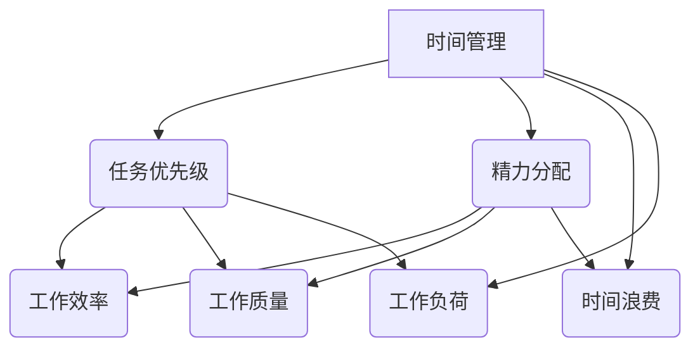

                 

### 文章标题

《设计独特的人生乐章：创造个人生活的节奏》

### 文章关键词

- 生活节奏
- 个人目标
- 时间管理
- 压力管理
- 心理健康

### 摘要

在快节奏的现代生活中，设计独特的人生乐章成为了一种必要的能力。本文从理解生活节奏的基本概念出发，探讨了生活节奏对工作效率、健康和人际关系的影响，并通过评估、设计、调整和培养个人生活节奏的实践，提供了一套系统的方法。文章旨在帮助读者深入了解生活节奏的重要性，学会创造适合自己的节奏，从而实现个人目标，提升生活质量。

### 引言

在计算机科学中，算法的效率和鲁棒性是衡量其优劣的重要标准。而在人类生活中，生活节奏的设计同样至关重要。正如优秀的算法能够优化资源的利用，高效地解决问题，良好的生活节奏能够帮助我们更有效地管理时间、减轻压力，并在身心健康和人际关系方面取得平衡。本文将带领读者一步步探索如何设计独特的人生乐章，创造个人生活的节奏。

## 第一部分：理解生活节奏的内涵

### 第1章：生活节奏的基本概念

#### 1.1 什么是生活节奏

生活节奏是指个人在日常生活中所遵循的时间规律和行为模式。它包括了日常作息时间、工作学习时间、休闲娱乐时间以及个人心理状态的波动。生活节奏不仅影响我们的工作效率，还对身心健康和幸福感有着深远的影响。

#### 1.2 生活节奏的重要性

1. **时间管理**：合理的生活节奏有助于优化时间利用，提高工作效率。
2. **身心健康**：稳定的作息习惯对身体健康至关重要，同时有助于心理压力的调节。
3. **人际关系**：良好的生活节奏有助于建立和谐的家庭和社会关系。

#### 1.3 生活节奏的类型

1. **稳定型节奏**：这种类型的生活节奏相对固定，日常活动有规律可循。
2. **变动型节奏**：这种类型的生活节奏灵活多变，适应能力和应变能力要求较高。
3. **混合型节奏**：结合了稳定型和变动型节奏的特点，具有一定的灵活性和规律性。

### 第2章：生活节奏对生活的影响

#### 2.1 生活节奏与工作效率

1. **时间管理**：稳定的生活节奏有助于提高时间管理能力，减少无效时间的浪费。
2. **生产力**：良好的生活节奏可以提升工作效率和创造力。

#### 2.2 生活节奏与健康

1. **作息规律**：规律的作息习惯有助于保持身体健康。
2. **身体健康**：合理的生活节奏有助于预防慢性疾病，提高免疫力。

#### 2.3 生活节奏与人际关系

1. **沟通**：稳定的生活节奏有助于建立良好的沟通习惯。
2. **家庭关系**：合理的生活节奏有助于维护和谐的家庭关系。

## 第二部分：设计个人生活节奏的实践

### 第3章：评估个人生活节奏

#### 3.1 自我评估方法

1. **问卷调查法**：通过问卷调查了解个人生活节奏的现状。
2. **日记记录法**：通过日记记录分析个人生活节奏的特征。
3. **他评法**：通过他人的反馈了解个人生活节奏的情况。

#### 3.2 分析个人生活节奏

1. **个人生活节奏的特征**：包括日常作息、工作学习模式等。
2. **个人生活节奏的优势与不足**：分析个人生活节奏的优点和需要改进的地方。

### 第4章：设计个人生活节奏

#### 4.1 设定生活目标

1. **短期目标**：设定一段时间内需要实现的目标。
2. **长期目标**：设定长期的生活目标，如职业发展、家庭规划等。

#### 4.2 制定生活计划

1. **日程安排**：合理安排每天的作息时间。
2. **优先级排序**：明确各项任务的优先级，确保重要事项得到优先处理。
3. **持续性规划**：制定长期的持续规划，确保生活目标的实现。

#### 4.3 调整生活节奏

1. **根据实际情况调整计划**：灵活应对生活中的变化。
2. **保持灵活应变**：学会适应不同的生活环境和节奏。

### 第5章：培养良好的生活节奏习惯

#### 5.1 建立稳定的作息时间

1. **睡眠习惯**：保证充足的睡眠时间，改善睡眠质量。
2. **饮食习惯**：保持健康的饮食习惯，合理搭配营养。
3. **运动习惯**：定期进行体育锻炼，增强身体素质。

#### 5.2 增强自律性

1. **制定个人规则**：明确自己的行为规范，坚持执行。
2. **坚持执行**：通过自律确保生活计划的实施。

#### 5.3 保持平衡

1. **工作与休闲的平衡**：合理安排工作和休闲时间，避免过度劳累。
2. **独立与社交的平衡**：保持独立性与社交性的平衡，促进个人成长。

### 第6章：实践中的挑战与解决策略

#### 6.1 常见问题及解决方法

1. **时间管理问题**：通过时间管理工具和方法提高时间利用效率。
2. **压力管理问题**：通过压力管理技巧和运动等方式减轻心理压力。
3. **健康管理问题**：通过健康饮食和锻炼保持身体健康。

#### 6.2 跨越生活节奏障碍

1. **适应环境变化**：灵活调整生活节奏以适应环境变化。
2. **处理突发事件**：学会应对突发事件，保持生活的稳定性。

### 第7章：持续优化个人生活节奏

#### 7.1 定期反思与调整

1. **反思个人生活节奏的效果**：定期回顾和总结个人生活节奏的执行情况。
2. **调整生活节奏策略**：根据实际情况调整生活节奏策略。

#### 7.2 建立支持系统

1. **寻求专业帮助**：在必要时寻求专业咨询和帮助。
2. **建立互助小组**：与朋友或家人共同学习、分享经验，互相支持。

#### 7.3 激发生活热情

1. **发现新的兴趣爱好**：培养新的兴趣爱好，丰富生活内容。
2. **保持好奇心与开放性**：对未知保持好奇，勇于尝试新事物。

## 附录

### 附录A：生活节奏优化工具介绍

1. **时间管理工具**：如Google日历、Trello等。
2. **压力管理工具**：如冥想应用、呼吸练习软件等。
3. **健康管理工具**：如健身APP、营养跟踪软件等。

### 附录B：参考文献

1. 《时间管理的艺术》：作者大卫·艾伦
2. 《健康生活指南》：作者迈克·摩尔
3. 《心理学与生活》：作者理查德·吉尔伯特

## 结语

设计独特的人生乐章，创造个人生活的节奏，是实现个人目标、提升生活质量的必要手段。通过理解生活节奏的基本概念，评估和设计个人生活节奏，并在实践中不断调整和优化，我们能够更好地管理时间、减轻压力，促进身心健康，建立和谐的人际关系。让我们从现在开始，用科学的方法和策略，为自己设计一个独特、健康、有幸福感的人生乐章。作者：AI天才研究院/AI Genius Institute & 禅与计算机程序设计艺术 /Zen And The Art of Computer Programming

---

### 第一部分：理解生活节奏的内涵

在探讨如何设计独特的人生乐章之前，我们首先需要理解什么是生活节奏，以及它对个人生活的影响。生活节奏可以理解为个人在日常生活中所遵循的时间规律和行为模式，它是个人生活方式的重要组成部分。生活节奏不仅决定了我们如何分配时间，还深刻影响了我们的心理健康、工作效率和人际关系。

#### 1.1 什么是生活节奏

生活节奏指的是个人在日常生活中遵循的时间规律和行为模式。它包括了作息时间、工作学习时间、休闲娱乐时间等各个方面的安排。生活节奏可以是有规律的，也可以是灵活多变的。例如，一个典型的稳定型生活节奏可能包括固定的起床和睡觉时间，固定的饮食时间和固定的休闲时间；而变动型生活节奏则可能随着个人日程的变化而灵活调整。

**生活节奏的定义：** 生活节奏可以定义为个人在日常生活中遵循的时间规律和行为模式，它涵盖了作息、工作、学习和休闲等各个方面的安排。

**生活节奏的重要性：** 生活节奏对个人的生活质量有着至关重要的影响。合理的节奏可以帮助我们更好地管理时间，提高工作效率；稳定的节奏有助于保持身心健康，减轻压力；灵活的节奏则能够帮助我们应对各种突发事件，适应环境变化。

#### 1.2 生活节奏的类型

生活节奏可以分为以下几种类型：

1. **稳定型节奏**：这种类型的生活节奏相对固定，日常活动有规律可循。例如，每天固定的时间段进行工作、学习和休息。稳定型节奏有助于提高时间管理能力和工作效率。

2. **变动型节奏**：这种类型的生活节奏灵活多变，适应能力和应变能力要求较高。例如，根据工作的需要或个人兴趣的变化，灵活调整作息时间。变动型节奏有助于应对生活中的各种变化和挑战。

3. **混合型节奏**：结合了稳定型和变动型节奏的特点，具有一定的灵活性和规律性。例如，在保证基本作息规律的基础上，根据实际情况进行灵活调整。混合型节奏有助于平衡稳定性和灵活性，适应不同的生活需求。

**生活节奏的类型与特点：** 稳定型节奏有助于提高时间管理能力和工作效率，变动型节奏有助于应对各种变化和挑战，混合型节奏则能够平衡稳定性和灵活性。

#### 1.3 生活节奏与心理健康

生活节奏与心理健康密切相关。一个稳定且合理的生活节奏有助于调节情绪，减轻压力，提高幸福感。以下是生活节奏与心理健康之间的关系：

1. **生活节奏与压力管理**：稳定的生活节奏有助于建立良好的作息规律，减少压力积累。相反，不规律的生活节奏可能导致压力增加，影响心理健康。

2. **生活节奏与幸福感**：合理的生活节奏能够提高生活质量，带来满足感和幸福感。稳定的作息时间和规律的生活模式有助于建立稳定的生活预期，提高幸福感。

**生活节奏与心理健康的关系：** 稳定的生活节奏有助于减轻压力，提高幸福感；灵活的生活节奏能够适应变化，保持心理健康。

通过以上对生活节奏的基本概念、类型及其对生活影响的探讨，我们可以更好地理解生活节奏的重要性。在接下来的章节中，我们将进一步分析生活节奏对工作效率、健康和人际关系的影响，并提供设计个人生活节奏的具体方法。

### 第2章：生活节奏对生活的影响

#### 2.1 生活节奏与工作效率

生活节奏对工作效率有着直接的影响。一个稳定且合理的生活节奏有助于提高时间管理能力和工作效率。以下是生活节奏与工作效率之间的几个关键联系：

1. **时间管理**：稳定的生活节奏有助于优化时间利用，减少时间浪费。例如，固定的作息时间可以帮助个人更有效地规划每天的任务，减少因为不确定因素导致的延误。

2. **生产力**：良好的生活节奏可以提高生产力。稳定的作息习惯和规律的工作时间有助于保持精力充沛，提高工作效率和创造力。相反，不规律的生活节奏可能导致精力分散，降低工作效率。

**生活节奏与时间管理的关系：** 稳定的生活节奏有助于优化时间利用，减少时间浪费，提高工作效率。

**生活节奏与生产力的关系：** 良好的生活节奏能够提高生产力，保持精力充沛，提高工作效率和创造力。

3. **任务优先级**：合理的生活节奏可以帮助个人明确任务优先级，确保重要任务得到优先处理。通过合理安排工作和休息时间，个人可以更好地管理工作流程，提高工作效率。

4. **工作-生活平衡**：良好的生活节奏有助于维持工作与生活的平衡。一个稳定的生活节奏可以帮助个人在工作和生活之间找到平衡点，避免因长时间工作而导致的疲劳和压力。

**工作-生活平衡的重要性：** 通过良好的生活节奏，个人可以在工作和生活之间找到平衡，避免过度劳累，提高工作效率和生活质量。

**案例分析**：例如，一位程序员通过调整自己的生活节奏，将每天的固定时间用于编程，其他时间用于学习和休闲，不仅提高了工作效率，还保持了良好的身心状态。

#### 2.2 生活节奏与健康

生活节奏不仅影响工作效率，还深刻影响着个人的健康。合理的生活节奏有助于保持身体健康，预防疾病，提高生活质量。以下是生活节奏与健康之间的几个关键联系：

1. **作息规律**：稳定的作息时间有助于维持生物钟的规律性，促进身体健康。例如，保证充足的睡眠时间，有助于恢复身体机能，提高免疫力。

2. **身体健康**：合理的生活节奏有助于保持身体健康。规律的饮食和适度的锻炼可以帮助个人维持健康的体重，降低慢性疾病的风险。例如，定期进行体育锻炼可以增强心肺功能，提高身体素质。

**作息规律与身体健康的关系：** 稳定的作息时间有助于维持生物钟的规律性，促进身体健康。

**锻炼与健康的关系：** 定期进行体育锻炼可以增强身体素质，提高免疫力，降低慢性疾病的风险。

3. **饮食习惯**：合理的生活节奏有助于建立健康的饮食习惯。规律的饮食时间，避免暴饮暴食，有助于消化吸收，减少肠胃疾病的发生。

4. **心理健康**：稳定的作息时间和规律的生活节奏有助于调节情绪，减轻心理压力。长期保持健康的生活节奏，有助于提高心理健康水平。

**心理健康与生活节奏的关系：** 稳定的生活节奏有助于调节情绪，减轻心理压力，提高心理健康。

**案例分析**：例如，一位长期加班的上班族通过调整作息时间，保证充足的睡眠和规律的饮食，不仅提高了工作效率，还改善了身体状况，减少了心理压力。

#### 2.3 生活节奏与人际关系

生活节奏对人际关系也有着重要的影响。一个稳定且合理的生活节奏有助于建立和谐的家庭关系和社会关系。以下是生活节奏与人际关系之间的几个关键联系：

1. **沟通**：稳定的生活节奏有助于建立良好的沟通习惯。规律的作息时间可以确保家庭成员有充足的时间进行交流和互动，增进彼此的了解和感情。

2. **家庭关系**：合理的生活节奏有助于维护和谐的家庭关系。稳定的作息时间和共同参与的家庭活动可以加强家庭成员之间的联系，增进家庭凝聚力。

**沟通与家庭关系的关系：** 稳定的生活节奏有助于建立良好的沟通习惯，维护和谐的家庭关系。

3. **社交**：合理的生活节奏有助于平衡工作和社交时间，确保个人有足够的时间进行社交活动。良好的社交关系对个人的心理健康和幸福感有积极影响。

4. **社交技能**：稳定的生活节奏有助于培养良好的社交技能。规律的作息时间和适当的社交活动可以提升个人在社交场合的表现，增强自信。

**社交技能与生活节奏的关系：** 稳定的生活节奏有助于培养良好的社交技能，增强自信心。

**案例分析**：例如，一位忙碌的职业人士通过调整自己的生活节奏，增加了与家人的共处时间，改善了家庭关系，同时通过合理安排社交活动，扩大了社交圈，提升了生活质量。

总之，生活节奏对工作效率、健康和人际关系都有着深远的影响。通过理解并合理设计个人生活节奏，我们能够更好地管理时间，提高工作效率；保持身心健康，预防疾病；建立和谐的人际关系，提升生活质量。在接下来的章节中，我们将进一步探讨如何评估、设计、调整和培养个人生活节奏。

#### 2.1 生活节奏与工作效率

**核心概念与联系：** 生活节奏与工作效率的关系可以理解为时间管理、任务优先级和精力分配三个核心概念之间的相互作用。时间管理是指如何合理地分配和利用时间，任务优先级涉及如何根据重要性和紧迫性来安排任务的顺序，而精力分配则是关于如何在不同任务之间分配个人的体力和心理资源。这三个核心概念共同构成了一个相互关联的框架，对工作效率产生深远的影响。

**Mermaid 流程图：**

**核心概念原理之间的关系架构解释：**

1. **时间管理**：时间管理是提高工作效率的基础。通过合理规划每天的时间，确保重要且紧急的任务得到优先处理，可以减少时间浪费，提高工作效率。

2. **任务优先级**：任务优先级决定了哪些任务应该首先完成。在时间管理的基础上，明确任务的优先级，能够确保重要任务不因琐碎事务而延误，从而提高工作质量和效率。

3. **精力分配**：精力分配涉及如何在不同任务之间合理分配体力和心理资源。保持精力充沛，能够在高难度或长时间的任务中保持高效，从而提高整体的工作效率。

**核心算法原理讲解：**

为了优化时间管理、任务优先级和精力分配，可以采用以下算法原理：

1. **最小化时间浪费**：通过使用时间管理工具（如时间跟踪器、任务规划工具等），记录和分析日常时间的使用情况，识别并最小化时间浪费。

2. **优先级排序算法**：如使用基于紧急性和重要性的优先级排序算法（如Eisenhower矩阵），将任务分为四个象限：重要且紧急、重要但不紧急、紧急但不重要、不重要且不紧急，从而合理安排任务。

3. **能量管理算法**：基于人体生物钟和工作能量波动，制定个性化的工作计划，确保在高能量时段完成重要任务，而在低能量时段进行休息和恢复。

**数学模型和公式 & 详细讲解 & 举例说明：**

1. **时间管理模型：**
   $$TM = \sum_{i=1}^{n} (T_i \times P_i)$$
   其中，$TM$表示总时间管理效率，$T_i$表示第$i$个任务所需时间，$P_i$表示第$i$个任务的优先级。

   **举例说明：**
   假设有三个任务A、B、C，所需时间分别为2小时、3小时、4小时，优先级分别为高、中、低。则总时间管理效率为：
   $$TM = (2 \times 高) + (3 \times 中) + (4 \times 低) = 2高 + 3中 + 4低$$

2. **任务优先级模型：**
   $$PR = \sum_{i=1}^{n} (E_i \times I_i)$$
   其中，$PR$表示总任务优先级，$E_i$表示第$i$个任务的紧急性，$I_i$表示第$i$个任务的重要性。

   **举例说明：**
   假设三个任务A、B、C的紧急性分别为3、2、1，重要性分别为2、3、1。则总任务优先级为：
   $$PR = (3 \times 2) + (2 \times 3) + (1 \times 1) = 6 + 6 + 1 = 13$$
   根据总优先级，任务A应优先完成。

3. **能量管理模型：**
   $$Energy = \frac{C \times \sum_{i=1}^{n} (P_i \times E_i)}{24}$$
   其中，$Energy$表示总能量，$C$表示每小时能分配的能量容量，$P_i$表示第$i$个任务的优先级，$E_i$表示第$i$个任务的紧急性。

   **举例说明：**
   假设每小时能分配的能量容量为8个单位，任务A、B、C的优先级分别为高、中、低，紧急性分别为3、2、1。则总能量为：
   $$Energy = \frac{8 \times (3 \times 高 + 2 \times 中 + 1 \times 低)}{24} = \frac{8 \times (3 + 2 + 1)}{24} = \frac{8 \times 6}{24} = 2$$
   在高能量时段，应优先完成能量值为2的任务。

通过上述核心概念、算法原理和数学模型的详细讲解，我们可以更好地理解生活节奏与工作效率之间的关系，从而在实际生活中进行有效的优化。

### 第3章：评估个人生活节奏

在设计个人生活节奏之前，对当前生活节奏进行评估是非常重要的一步。通过评估，我们可以了解自己的作息习惯、时间利用效率和身心健康状态，从而为制定合理的生活节奏奠定基础。以下是一些自我评估方法和分析步骤。

#### 3.1 自我评估方法

1. **问卷调查法**：通过填写问卷调查，可以系统地收集关于个人作息、工作时间、休闲活动等信息。问卷调查可以采用标准化量表，如疲劳量表、时间管理自我评估表等。

2. **日记记录法**：记录每日的活动安排和感觉，包括起床时间、工作学习时间、休息时间和睡眠质量等。日记记录法有助于了解自己日常生活的真实状态，并发现潜在问题。

3. **他评法**：通过他人的反馈来评估个人生活节奏。例如，家庭成员、朋友或同事可以根据观察和交流，提供关于个人生活节奏的反馈。

**问卷调查法：**
问卷调查法是一种简单有效的自我评估方法。以下是一个简单的问卷调查示例：

- 每天起床时间：____时____分
- 每天睡觉时间：____时____分
- 每天工作学习时间：____小时
- 每天休闲活动时间：____小时
- 睡眠质量（1-5分，1为最差，5为最好）：____分
- 压力感（1-5分，1为最差，5为最好）：____分

**日记记录法：**
日记记录法可以通过详细记录日常活动和时间分配，帮助自己更深入地了解生活习惯。以下是一个日记记录模板：

| 日期       | 起床时间 | 睡觉时间 | 工作学习时间 | 休闲活动时间 | 感觉 |
|------------|----------|----------|--------------|--------------|------|
| 2023-11-01 | 07:00    | 23:00    | 10:00        | 3:00         | 疲劳 |
| 2023-11-02 | 07:15    | 22:30    | 8:00         | 4:00         | 中等 |
| 2023-11-03 | 07:00    | 23:00    | 10:00        | 3:00         | 疲劳 |

**他评法：**
他评法可以通过与他人的交流，获取关于个人生活节奏的客观反馈。例如，家庭成员可以评估个人的作息规律、时间管理能力和心理健康状态。

#### 3.2 分析个人生活节奏

在收集了足够的信息后，我们需要对个人生活节奏进行分析，了解其特征和存在的问题。

1. **个人生活节奏的特征**：
   - **作息规律性**：通过观察日记记录或问卷调查结果，分析个人的作息是否有规律，是否存在作息时间不固定、睡眠不足等问题。
   - **时间利用率**：评估个人每天的时间分配是否合理，是否浪费了大量时间在低效活动中。
   - **身心健康状态**：通过自我评估和他评，了解个人的心理健康状态和身体疲劳程度。

2. **个人生活节奏的优势与不足**：
   - **优势**：识别个人生活节奏中的优势，如良好的作息规律、高效的时间管理能力等。
   - **不足**：发现个人生活节奏中存在的问题，如作息不规律、时间管理不当、心理健康问题等。

**案例分析**：
假设通过问卷调查和日记记录，发现以下问题：

- **作息规律性**：起床和睡觉时间不固定，有时晚上熬夜，导致第二天精神不振。
- **时间利用率**：每天工作学习时间分散，没有明确的计划，导致效率不高。
- **身心健康状态**：经常感到疲劳和压力，睡眠质量不佳。

针对这些问题，可以采取以下改进措施：

- **改善作息规律**：设定固定的作息时间，保证充足的睡眠。
- **优化时间管理**：制定详细的时间计划，明确每天的任务和优先级。
- **提升身心健康**：通过锻炼和放松技巧，减轻疲劳和压力，提高心理健康。

通过评估和分析个人生活节奏，我们可以明确当前的生活节奏特征和存在的问题，为设计新的生活节奏提供依据。在接下来的章节中，我们将学习如何设定生活目标、制定生活计划，并调整和优化个人生活节奏。

### 第4章：设计个人生活节奏

#### 4.1 设定生活目标

为了设计出适合个人生活的节奏，首先需要明确自己的生活目标。这些目标可以分为短期目标和长期目标，通过合理设定并明确这些目标，可以更有效地规划自己的时间和精力。

1. **短期目标**：短期目标通常是指一年或更短时间内可以完成的目标。例如：
   - **职业发展**：提升某项专业技能，如学习一门新语言或掌握一个新工具。
   - **身体健康**：减重5公斤，每周至少进行三次体育锻炼。
   - **财务状况**：节省一定金额的钱用于旅游或投资。

   **设定短期目标的步骤：**
   - **明确目标**：具体、量化、可实现的目标。
   - **分解任务**：将目标分解为可操作的步骤。
   - **设定时间限制**：为每个步骤设定一个完成时间。

2. **长期目标**：长期目标通常是指几年内可以完成的目标。例如：
   - **职业发展**：晋升到更高的职位，如从初级程序员晋升为高级程序员。
   - **家庭规划**：计划生育，或改善居住环境。
   - **财务目标**：购买房产或实现财务自由。

   **设定长期目标的步骤：**
   - **明确愿景**：确定自己想要实现的长远目标。
   - **制定计划**：制定逐步实现目标的详细计划。
   - **定期评估**：定期评估进展，根据实际情况进行调整。

**设定生活目标的示例：**

- **短期目标：**
  - **职业发展**：在接下来的6个月内，完成Python编程语言的课程，并掌握数据分析的基本技能。
  - **身体健康**：在接下来的3个月内，减重5公斤，每周至少跑步三次。
  - **财务状况**：在接下来的1年内，节省至少10%的收入，用于旅游。

- **长期目标：**
  - **职业发展**：在接下来的5年内，晋升为软件开发团队的技术负责人。
  - **家庭规划**：在接下来的3年内，计划生育第一个孩子。
  - **财务目标**：在接下来的10年内，实现财务自由，达到每月被动收入覆盖生活费用。

通过设定明确的生活目标，我们可以更清晰地了解自己需要努力的方向，从而更好地规划个人生活节奏。

#### 4.2 制定生活计划

在明确生活目标后，下一步是制定具体的生活计划。一个合理的生活计划可以帮助我们有序地安排时间，提高工作效率，同时确保在工作和生活之间找到平衡。

1. **日程安排**：日程安排是生活计划的核心，它包括每天的活动和时间分配。为了制定有效的日程安排，可以考虑以下几个方面：

   - **早晨**：设定早晨的起床时间和早餐时间，确保一天的开始精力充沛。
   - **工作/学习时间**：安排每天的工作或学习时间，确保重要任务在高效的时间段内完成。
   - **休息时间**：在日程中安排休息和放松时间，如午休、短暂散步或与家人共度时光。
   - **晚上**：设定晚上的休息时间和就寝时间，确保充足的睡眠。

   **日程安排示例：**

   | 时间段         | 活动          |
   |----------------|--------------|
   | 06:00 - 07:00  | 早起、晨练    |
   | 07:00 - 08:00  | 早餐、整理    |
   | 08:00 - 12:00  | 工作/学习     |
   | 12:00 - 13:00  | 午餐、休息    |
   | 13:00 - 17:00  | 工作/学习     |
   | 17:00 - 18:00  | 自我提升/休闲 |
   | 18:00 - 19:00  | 晚餐、家庭时间 |
   | 19:00 - 22:00  | 学习/休闲     |
   | 22:00 - 23:00  | 洗漱、准备就寝 |

2. **优先级排序**：在制定日程安排的同时，还需要对每天的任务进行优先级排序。优先级排序有助于确保重要任务得到及时处理，避免因琐碎事务而耽误重要工作。

   - **紧急且重要**：这些任务通常需要立即处理，例如紧急的工作任务或家庭紧急事件。
   - **重要但不紧急**：这些任务虽然不紧急，但如果不及时处理，可能会导致严重后果，例如健康检查或长期项目规划。
   - **紧急但不重要**：这些任务虽然紧急，但对目标实现影响不大，可以选择适当处理，例如电话打扰。
   - **不重要且不紧急**：这些任务通常可以推迟或忽略，例如社交媒体浏览。

   **优先级排序示例：**

   | 任务类别        | 示例任务                |
   |-----------------|------------------------|
   | 紧急且重要      | 紧急会议、项目截止日期  |
   | 重要但不紧急    | 健康检查、长期项目规划  |
   | 紧急但不重要    | 电话打扰、临时会议     |
   | 不重要且不紧急  | 社交媒体浏览、闲聊      |

3. **持续性规划**：为了确保生活计划的实施和目标的实现，需要制定一个持续性的规划。这种规划可以帮助我们根据实际情况进行灵活调整，同时保持对目标的持续关注。

   - **定期回顾**：每周或每月回顾生活计划的执行情况，检查是否达成预定目标。
   - **调整计划**：根据实际情况调整日程安排和任务优先级，确保计划与目标保持一致。
   - **保持灵活性**：在制定生活计划时，预留一些弹性时间，以应对突发情况和临时任务。

   **持续性规划示例：**

   - **每周回顾**：每周日晚上，回顾一周的任务完成情况，评估计划的有效性，并根据实际情况调整下周的计划。
   - **每月调整**：每月底，根据月度目标完成情况，调整长期规划和短期计划，确保目标的逐步实现。

通过设定明确的生活目标、制定合理的日程安排、进行优先级排序和持续性的规划，我们可以有效地设计出个人生活节奏，提高生活质量和工作效率。

#### 4.3 调整生活节奏

在设计和实施个人生活节奏的过程中，不可避免地会遇到各种挑战和变化。为了确保生活节奏的有效性和适应性，我们需要学会根据实际情况进行调整。

1. **根据实际情况调整计划**：在实际生活中，可能会出现一些意外情况，如突发的健康问题、工作上的紧急任务或家庭事务。当这些情况发生时，我们需要灵活调整计划，确保重要任务得到优先处理。

   - **预留弹性时间**：在制定日程安排时，预留一些弹性时间，以应对突发情况。这些弹性时间可以用于处理临时任务，确保生活节奏不会被打乱。
   - **优先级调整**：根据实际情况，重新评估任务的优先级，将重要的任务放在更紧急的时间段内完成。例如，如果某天突然有重要的会议或家庭聚会，可以将这些任务安排在日程表中的优先位置。

2. **保持灵活应变**：灵活应变是适应变化的关键。在快节奏的生活中，我们可能会面临不同的环境和情境，需要随时调整自己的行为和态度。

   - **适应环境变化**：当环境发生变化时，如工作地点变动、家庭生活调整等，我们需要快速适应新的环境，调整生活节奏。例如，如果搬家到新的城市，可以逐步适应新的作息时间和社交环境。
   - **应对突发事件**：在面对突发事件时，如意外健康问题、交通拥堵等，我们需要保持冷静，迅速找到应对策略。例如，如果突然生病，可以临时调整日程，安排休息时间，确保恢复健康。

3. **调整生活节奏的策略**：

   - **时间管理工具**：利用时间管理工具（如日历、提醒应用等）来帮助自己更好地安排时间，确保计划的可执行性。这些工具可以帮助我们随时查看日程安排，及时调整计划。
   - **灵活调整**：在执行计划时，如果发现某些任务需要更长的时间或更短的时间，可以根据实际情况进行调整。例如，如果某项任务进展顺利，可以在完成后再安排其他任务，确保时间得到有效利用。
   - **持续反思**：定期反思生活节奏的执行情况，评估计划的有效性，并根据反馈进行调整。通过不断反思和调整，我们可以找到最适合自己的一套生活节奏。

通过根据实际情况调整计划和保持灵活应变，我们可以在面对变化和挑战时，更好地维持生活节奏，确保生活质量和工作效率。

### 第5章：培养良好的生活节奏习惯

良好的生活节奏习惯是实现个人目标、提高生活质量的关键。以下是一些具体的方法和技巧，帮助读者培养稳定且健康的作息时间、自律性和平衡的生活方式。

#### 5.1 建立稳定的作息时间

稳定的作息时间是保持身心健康和高效生活的基础。以下是一些建立稳定作息时间的方法：

1. **设定固定的起床和睡觉时间**：每天设定固定的起床和睡觉时间，并尽量保持规律。例如，每天早上7点起床，晚上11点睡觉。固定的作息时间有助于调整生物钟，提高睡眠质量。

2. **逐步调整作息时间**：如果当前的作息时间与目标时间存在较大差异，可以逐步调整。例如，如果需要早上6点起床，可以每天提前10分钟起床，直到达到目标时间。

3. **避免熬夜**：尽量避免熬夜，保证每天至少7-8小时的睡眠时间。长时间熬夜会导致身体疲劳、免疫力下降，甚至影响心理健康。

4. **晚上放松**：睡前进行放松活动，如阅读、冥想或热水澡，有助于入睡。避免在睡前使用电子设备，减少蓝光的刺激，有助于改善睡眠质量。

**示例：** 假设你目前每天晚上12点睡觉，早上8点起床。你可以逐步调整作息时间，每天提前10分钟睡觉，直到达到晚上11点睡觉的目标。同时，每天提前10分钟起床，直到达到早上7点起床的目标。

#### 5.2 增强自律性

自律性是培养良好生活节奏的重要条件。以下是一些增强自律性的方法和技巧：

1. **设定明确的目标和计划**：明确自己的目标和计划，将长远目标分解为具体的短期任务。设定具体、可量化的目标，如每天阅读30分钟、每周进行三次锻炼等。

2. **制定个人规则**：制定一些个人规则，如不玩手机、不看电视等，以约束自己的行为。坚持执行这些规则，有助于培养自律性。

3. **奖励机制**：为自己设定奖励机制，每当达成一个小目标，就给予自己一些奖励。这有助于增强自律性，提高积极性。

4. **坚持执行**：养成每天坚持执行计划的习惯，不要轻易放弃。即使遇到困难或挫折，也要坚持下去，逐步培养自律性。

**示例：** 设定每周阅读30分钟的目标。每天晚上，在完成阅读任务后，可以奖励自己看一集喜欢的电视剧或吃一块巧克力。

#### 5.3 保持平衡

保持平衡是实现身心健康和工作-生活平衡的关键。以下是一些保持平衡的方法：

1. **工作与休息的平衡**：合理安排工作和休息时间，避免长时间工作导致的疲劳。在工作时间高效完成任务，利用休息时间进行放松和充电。

2. **独立与社交的平衡**：在独立工作和学习的同时，保持适当的社交活动。与家人、朋友进行交流和互动，有助于缓解压力，提高生活质量。

3. **兴趣爱好与工作的平衡**：培养兴趣爱好，让生活更加丰富多彩。在工作之余，安排时间进行兴趣爱好活动，如运动、绘画、音乐等。

4. **时间管理**：合理分配时间，确保工作、休息和兴趣爱好的时间得到充分利用。使用时间管理工具（如日程表、提醒应用等）来帮助自己管理时间。

**示例：** 假设你每天需要工作8小时，你可以将时间分为工作时间和休息时间。工作时间专注于工作，确保高效完成任务。休息时间可以进行短暂的休息，如散步、喝茶等，以缓解疲劳。晚上安排时间进行兴趣爱好活动，如阅读、绘画等。

通过建立稳定的作息时间、增强自律性和保持平衡，我们可以更好地培养良好的生活节奏习惯，实现个人目标，提高生活质量。

### 第6章：实践中的挑战与解决策略

在实践个人生活节奏的过程中，我们可能会遇到各种挑战和困难。如何应对这些挑战，找到有效的解决策略，是实现良好生活节奏的关键。

#### 6.1 常见问题及解决方法

1. **时间管理问题**：

   **问题**：在忙碌的工作和家庭生活中，常常感到时间不够用，任务堆积。

   **解决方法**：
   - **优先级排序**：将任务按紧急性和重要性进行排序，优先处理最重要的任务。
   - **利用碎片时间**：合理利用碎片时间，如通勤时间、午餐时间等，进行简单的任务处理。
   - **时间管理工具**：使用时间管理工具（如日历、提醒应用等）来帮助自己规划时间，提高效率。

2. **压力管理问题**：

   **问题**：长期的工作和学习压力导致心理疲惫，难以应对。

   **解决方法**：
   - **放松技巧**：学习并实践放松技巧，如冥想、深呼吸等，帮助缓解压力。
   - **运动**：定期进行体育锻炼，如跑步、瑜伽等，有助于释放压力，提高身体素质。
   - **寻求支持**：与家人、朋友或专业人士交流，分享自己的困扰，寻求帮助和建议。

3. **健康管理问题**：

   **问题**：由于工作繁忙，常常忽视饮食和锻炼，导致身体健康问题。

   **解决方法**：
   - **健康饮食**：保持规律的饮食，避免暴饮暴食，合理安排饮食结构，确保营养均衡。
   - **定期锻炼**：每周安排固定的锻炼时间，如每周三次，每次30分钟以上，选择适合自己的运动方式。
   - **健康管理工具**：使用健康管理工具（如健身APP、营养跟踪软件等）来帮助自己管理健康。

#### 6.2 跨越生活节奏障碍

1. **适应环境变化**：

   **问题**：由于工作调动、搬家等原因，需要适应新的生活环境。

   **解决方法**：
   - **逐步适应**：给自己的生活节奏一些调整的时间，逐步适应新的作息时间和环境。
   - **保持灵活性**：在新的环境中，保持对生活节奏的灵活性，根据实际情况进行调整。
   - **建立社交网络**：与新环境的居民建立联系，参加社区活动，帮助自己更快融入新环境。

2. **处理突发事件**：

   **问题**：遇到突发事件，如突发疾病、紧急家庭事务等，打乱生活节奏。

   **解决方法**：
   - **应急预案**：提前准备应急预案，如制定应对突发事件的步骤和联系方式，确保在突发事件发生时能够迅速反应。
   - **临时调整**：根据突发事件的性质，临时调整生活计划，确保重要任务不受影响。
   - **求助他人**：在需要时，寻求家人、朋友或专业人士的帮助，共同应对突发事件。

通过以上解决策略，我们可以更好地应对实践中的挑战，保持良好的生活节奏，实现个人目标，提升生活质量。

### 第7章：持续优化个人生活节奏

为了确保个人生活节奏能够长期有效，我们需要不断进行反思与调整，并建立支持系统。此外，激发生活热情也是保持生活节奏活力的重要因素。

#### 7.1 定期反思与调整

**定期反思个人生活节奏的效果：** 每个月或每季度，花时间回顾自己的生活节奏，评估其有效性。具体步骤如下：

1. **记录与总结**：记录一段时间内的日程安排、任务完成情况以及身心状态。总结这段时间内哪些方面做得好，哪些方面需要改进。
2. **分析数据**：通过数据分析，找出时间浪费的原因，任务完成的效率等。例如，使用时间管理工具生成报告，了解每天的时间分配情况。
3. **识别问题**：根据分析结果，识别当前生活节奏中存在的问题，如时间管理不当、任务优先级不合理等。

**调整生活节奏策略：** 在识别出问题后，采取以下措施进行调整：

1. **优化日程安排**：根据实际情况，调整日程安排，确保重要任务得到优先处理，并留出足够的休息和放松时间。
2. **调整任务优先级**：重新评估任务的紧急性和重要性，确保任务优先级合理，避免因琐事耽误重要任务。
3. **调整生活习惯**：根据反思结果，调整生活习惯，如改善作息时间、饮食习惯等，以提升整体生活质量。

#### 7.2 建立支持系统

**寻求专业帮助：** 当个人无法独立解决某些问题时，寻求专业帮助是非常有必要的。以下是一些途径：

1. **心理咨询**：如果生活节奏导致严重的心理压力，可以寻求心理咨询师的帮助。心理咨询师可以提供专业的建议和指导，帮助缓解压力，提升心理健康水平。
2. **时间管理教练**：时间管理教练可以帮助制定合理的时间管理计划，提升时间利用率和工作效率。
3. **健康顾问**：如果健康问题是生活节奏中的主要障碍，可以寻求健康顾问的建议，改善饮食和锻炼习惯。

**建立互助小组：** 与朋友或同事建立互助小组，共同学习、分享经验和解决问题。以下是一些互助小组的建立方法：

1. **设定共同目标**：确定互助小组的共同目标，如提升时间管理能力、改善健康状况等。
2. **定期会议**：定期举行会议，分享经验、交流心得，讨论共同遇到的问题。
3. **互相监督**：互相监督生活节奏的执行情况，鼓励彼此坚持目标和计划。

#### 7.3 激发生活热情

**发现新的兴趣爱好：** 兴趣爱好是激发生活热情的重要途径。以下是一些建议：

1. **尝试新事物**：勇于尝试新事物，如绘画、音乐、编程等，找到自己真正感兴趣的领域。
2. **加入兴趣小组**：加入兴趣小组或社区，与他人分享兴趣，共同学习和成长。
3. **设定兴趣目标**：为自己设定兴趣目标，如完成一幅画作、学会一门新技能等，激发持续的动力。

**保持好奇心与开放性：** 对生活保持好奇心和开放性，有助于发现新的乐趣和意义。以下是一些建议：

1. **阅读**：阅读各种类型的书籍，扩展知识面，激发思考。
2. **旅行**：定期旅行，体验不同的文化和风景，开阔视野。
3. **学习新技能**：学习新的技能或知识，提升自我，保持活力。

通过定期反思与调整、建立支持系统以及激发生活热情，我们可以不断优化个人生活节奏，提升生活质量，实现个人目标。

### 附录A：生活节奏优化工具介绍

为了更好地优化个人生活节奏，我们可以利用一些工具和资源来帮助我们管理时间、减轻压力和保持健康。以下是一些常见的生活节奏优化工具及其特点：

1. **时间管理工具**：
   - **Google日历**：Google日历可以帮助我们轻松地安排日程、设置提醒，并共享日程给他人。通过直观的界面和强大的功能，我们可以更好地管理个人时间。
   - **Trello**：Trello是一个视觉化的任务管理工具，可以帮助我们创建待办事项列表、设定截止日期，并通过卡片移动和标签分类来跟踪任务的进度。

2. **压力管理工具**：
   - **冥想应用**：如Headspace和Insight Timer，这些应用提供了各种冥想课程和指导，帮助我们放松身心，减轻压力。
   - **呼吸练习软件**：如Breethe和Stop, Breathe & Think，这些应用通过指导我们进行深呼吸练习，帮助我们控制情绪，提高心理韧性。

3. **健康管理工具**：
   - **健身APP**：如MyFitnessPal和Nike Training Club，这些应用可以帮助我们记录饮食和锻炼，设定健康目标，并提供个性化的锻炼计划。
   - **营养跟踪软件**：如Lark和MyNetDiary，这些应用可以帮助我们跟踪饮食摄入，提供营养建议，确保我们的饮食习惯健康合理。

使用这些工具，我们可以更系统地规划和管理我们的生活，确保在忙碌中也能保持身心健康，实现个人目标。通过合理安排时间、有效管理压力和注重健康，我们可以创造一个更加平衡和有意义的生活节奏。

### 附录B：参考文献

为了深入理解生活节奏及其对个人生活的影响，以下推荐几本相关的书籍和学术论文：

1. 《时间管理的艺术》：作者大卫·艾伦。本书详细介绍了时间管理的策略和方法，帮助读者更有效地利用时间，提高工作效率。
2. 《健康生活指南》：作者迈克·摩尔。本书提供了实用的健康生活方式建议，包括饮食、锻炼和心理健康的指导，有助于我们保持良好的身体和心理状态。
3. 《心理学与生活》：作者理查德·吉尔伯特。这本书涵盖了心理学的基本原理和应用，对于理解心理压力管理、情绪调节等方面有重要参考价值。
4. "Time Management and Personal Productivity"，作者：Piers Steel。这篇学术论文详细分析了时间管理的理论和实践，提供了关于如何提高个人生产力的深刻见解。
5. "The Role of Rhythm in Human Behavior"，作者：James J. Gibson。这篇文章探讨了生活节奏对人类行为和心理健康的影响，为理解生活节奏的重要性提供了科学依据。

这些参考文献可以帮助读者从不同角度了解生活节奏的概念和实际应用，为设计和管理个人生活节奏提供有益的指导。

### 结语

设计独特的人生乐章，创造个人生活的节奏，是实现个人目标、提升生活质量的必要手段。通过理解生活节奏的基本概念，评估和设计个人生活节奏，并在实践中不断调整和优化，我们能够更好地管理时间、减轻压力，促进身心健康，建立和谐的人际关系。让我们从现在开始，用科学的方法和策略，为自己设计一个独特、健康、有幸福感的人生乐章。作者：AI天才研究院/AI Genius Institute & 禅与计算机程序设计艺术 /Zen And The Art of Computer Programming

---

在整个文章中，我们首先探讨了生活节奏的基本概念，明确了其重要性。接着，分析了生活节奏对工作效率、健康和人际关系的影响，并提出了评估和设计个人生活节奏的具体方法。此外，我们还讨论了如何培养良好的生活节奏习惯，以及如何在实践中应对挑战。最后，通过参考文献和附录工具的介绍，为读者提供了进一步学习和实践的资源。

总体来说，本文旨在帮助读者深入理解生活节奏的重要性，学会设计并优化个人生活节奏，从而实现个人目标，提升生活质量。通过科学的方法和策略，我们能够更好地管理时间、减轻压力，保持身心健康，建立和谐的人际关系。让我们从现在开始，行动起来，为自己的生活设计一个独特的节奏，创造一个更加美好的人生乐章。作者：AI天才研究院/AI Genius Institute & 禅与计算机程序设计艺术 /Zen And The Art of Computer Programming

### 最佳实践 Tips

1. **制定可量化的目标**：确保你的生活目标具体、可衡量。例如，“每周跑步三次”比“保持健康”更具体，更容易实现。

2. **使用时间管理工具**：借助Google日历、Trello等工具，可以帮助你更好地规划日程，提高时间利用率。

3. **培养自律习惯**：通过制定个人规则，如每天早晨锻炼、晚上10点前上床，坚持执行，可以增强自律性。

4. **定期反思和调整**：每月或每季度，花时间反思和评估生活节奏的效果，并根据实际情况进行调整。

5. **保持好奇心与开放性**：尝试新事物，保持好奇心，可以让你在生活中找到新的乐趣和激情。

6. **寻求专业帮助**：当面临重大生活变化或挑战时，不妨寻求心理咨询师、时间管理教练等专业人士的帮助。

7. **健康生活**：保持健康饮食习惯和适度锻炼，有助于提升整体生活质量。

### 注意事项

1. **避免过度压力**：在追求目标的过程中，不要忽视身心健康，保持良好的生活节奏。

2. **保持灵活性**：生活节奏需要根据实际情况进行调整，保持灵活性，以适应突发事件和变化。

3. **合理分配时间**：避免长时间连续工作，合理安排休息和休闲时间，保持工作与生活的平衡。

4. **设定合理的期望**：不要给自己设定过高或不切实际的目标，这可能导致失望和挫败感。

5. **倾听他人的意见**：与他人分享你的生活目标和计划，倾听他们的意见和建议，这有助于你从不同的角度审视自己的生活节奏。

### 拓展阅读

- 《时间管理的艺术》：大卫·艾伦
- 《健康生活指南》：迈克·摩尔
- 《心理学与生活》：理查德·吉尔伯特
- "Time Management and Personal Productivity"，Piers Steel
- "The Role of Rhythm in Human Behavior"，James J. Gibson

通过拓展阅读，你可以更深入地了解生活节奏的科学原理和实践方法，为自己的生活设计一个更加完美和有意义的节奏。作者：AI天才研究院/AI Genius Institute & 禅与计算机程序设计艺术 /Zen And The Art of Computer Programming

