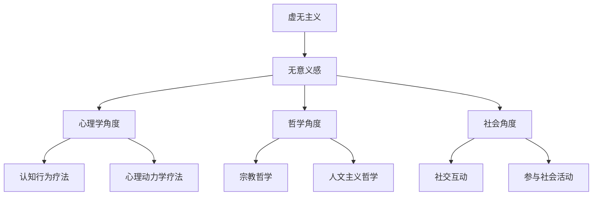

                 

## 第1章: 虚无主义的概念

### 1.1 虚无主义的起源

虚无主义作为一种哲学思想，其起源可以追溯到古希腊哲学家第欧根尼·拉尔修（Diogenes Laertius）。在他的哲学观念中，存在即有意义。然而，随着时间的推移，一些哲学家开始提出相反的观点，认为生命本身并无固有的意义。这种观点的萌芽可以视为虚无主义的起源。

### 1.1.1 虚无主义的起源

- 古希腊哲学家第欧根尼·拉尔修的观点：
  - 第欧根尼·拉尔修认为，只有通过哲学的探究，人类才能找到生活的意义。
  - 他在《活法》一书中提出：“哲学的目的是使人认识到生命中的意义和价值。”

- 后来的哲学家的转变：
  - 随着时间的推移，一些哲学家开始质疑这种观点，认为生命的意义并非先天的，而是需要个体自己去发现和创造。
  - 这种对生命意义质疑的观点，逐渐发展成了虚无主义。

### 1.1.2 虚无主义的核心观点

虚无主义的核心观点是生命的无意义和人类存在的无价值。这种观点认为，没有预设的目标或意义，人类的存在是偶然的，个体的生命没有固有的价值。

- 虚无主义的核心观点：
  - 生命的无意义：虚无主义者认为，生命没有固有的目的或意义，它们只是由一系列无意义的事件组成的。
  - 人类存在的无价值：虚无主义者认为，人类的存在并没有特别的或独特的价值，与其他生物或物体没有本质的区别。

### 1.1.3 虚无主义的影响

虚无主义的观点引发了哲学上的许多讨论和思考，对现代心理学、文学和艺术产生了深远影响。

- 哲学上的影响：
  - 虚无主义促使人们思考生命的意义，探讨存在的基本问题。
  - 它也挑战了传统的宗教信仰，使人们重新评估信仰和价值观。

- 心理学上的影响：
  - 虚无主义与抑郁、焦虑等心理问题有关。
  - 现代心理学研究表明，虚无主义感受与心理健康之间存在联系。

- 文学和艺术上的影响：
  - 虚无主义成为文学和艺术作品中常见的主题，如托尔斯泰的《战争与和平》、达达主义艺术运动等。
  - 这些作品反映了虚无主义者对生命意义的质疑和对现实的批判。

## 1.2 无意义感与虚无主义

无意义感是指个人对生活缺乏目的感和意义感。虚无主义可以被视为无意义感的一种极端形式。

### 1.2.1 无意义感的概念

无意义感是一种心理状态，个体在这种状态下感到自己的生活缺乏意义和价值。

- 无意义感的特征：
  - 对日常生活的无聊感。
  - 对未来的不确定性和迷茫感。
  - 对生命的失望和悲观情绪。

### 1.2.2 无意义感与虚无主义的关系

无意义感可能是虚无主义的初期阶段，也可能是其表现形式之一。

- 无意义感可能是虚无主义的初期阶段：
  - 个体在经历一段时间的无意义感后，可能会开始质疑生活的意义，进而陷入虚无主义。

- 无意义感也可能是虚无主义的表现形式之一：
  - 虚无主义者往往对生活感到无意义，他们的生活充满了绝望和悲观。

### 1.2.3 无意义感的应对策略

应对无意义感的关键是找到生活的意义和目标。

- 探索个人价值观和目标：
  - 个体可以通过深入反思自己的价值观和目标，找到生活的意义。
  - 这可能需要一定的心理治疗和自我探索。

- 寻找新的兴趣和爱好：
  - 通过尝试新的事物，个体可能会发现新的兴趣和爱好，从而找到生活的乐趣。

- 建立积极的人际关系：
  - 与他人建立积极的人际关系，可以帮助个体感受到归属感和价值感。

## 1.3 虚无主义的克服方法

克服虚无主义需要从多个角度入手，包括心理学、哲学和社会方面。

### 1.3.1 心理学角度

从心理学角度来看，心理治疗是应对虚无主义的有效方法。

- 认知行为疗法：
  - 认知行为疗法（CBT）可以帮助个体识别和改变消极思维模式。
  - 通过改变对生活的看法，个体可以减少虚无主义的感受。

- 心理动力学疗法：
  - 心理动力学疗法可以帮助个体探索潜意识中的冲突和问题。
  - 通过解决这些冲突，个体可以减少虚无主义的感受。

### 1.3.2 哲学角度

从哲学角度来看，探索存在的意义和价值是应对虚无主义的一种方法。

- 宗教哲学：
  - 通过信仰和宗教实践，个体可以找到生活的意义和目的。
  - 宗教哲学提供了一种超越个人存在的视角，帮助个体理解生命的意义。

- 人文主义哲学：
  - 人文主义哲学强调个体的价值和尊严，鼓励个体追求自己的目标和梦想。
  - 通过自我实现，个体可以找到生活的意义。

### 1.3.3 社会角度

从社会角度来看，社交互动和参与社会活动可以帮助个体寻找归属感和价值感。

- 社交互动：
  - 与他人建立积极的人际关系，可以帮助个体感受到归属感和价值感。
  - 社交互动还可以提供情感支持和鼓励。

- 参与社会活动：
  - 参与社区服务、志愿者工作等活动，可以帮助个体感受到自己的价值。
  - 通过帮助他人，个体可以找到生活的意义。

## 总结

虚无主义是一种哲学思想，强调生命的无意义和人类存在的无价值。无意义感与虚无主义密切相关，但并非等同。克服虚无主义需要从多个角度入手，包括心理学、哲学和社会方面。通过心理治疗、哲学探索和社交互动，个体可以减少虚无主义的感受，找到生活的意义。

---

**附录：** 核心概念原理之间的关系架构 Mermaid 流程图

---

作者：AI天才研究院/AI Genius Institute & 禅与计算机程序设计艺术 /Zen And The Art of Computer Programming

