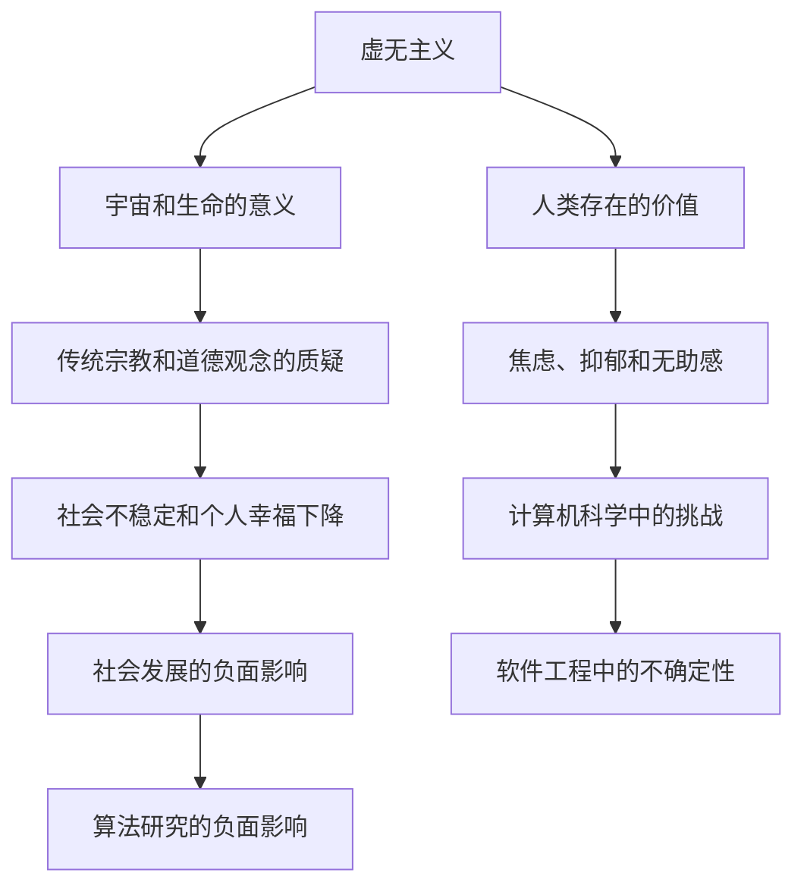
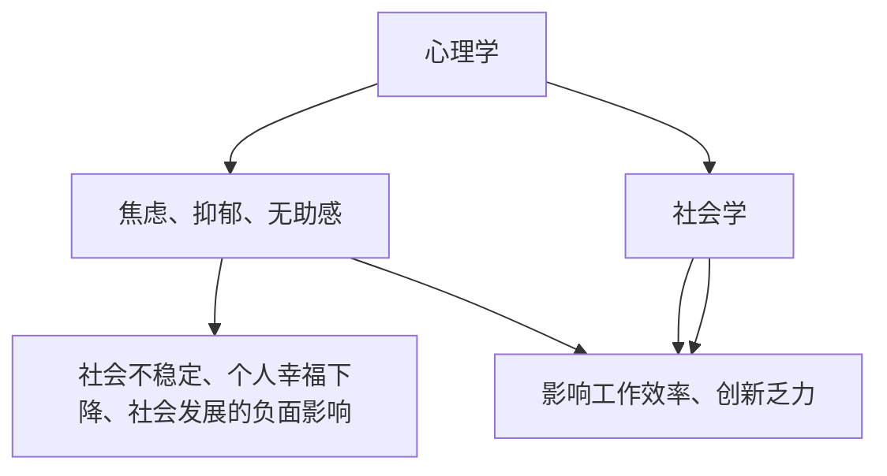

                 

### 引言

在当今这个信息爆炸的时代，人类面临着前所未有的困惑与挑战。虚无主义，作为一种哲学观点，日益受到广泛关注。虚无主义认为，宇宙和生命缺乏固有意义和目的，这种观点在现代社会中引发了广泛的讨论与思考。作为一位专注于计算机科学和人工智能领域的专家，本文旨在探讨虚无主义的起源、影响及其克服方法，为我们在意义的荒原上寻找方向提供一些启示。

#### 1.1 虚无主义的概念

虚无主义（Nihilism）起源于19世纪的欧洲，特别是在德国和俄国。其核心观点是，否认或质疑生命、道德、宗教和哲学中的绝对价值和意义。虚无主义者认为，人类的存在没有绝对的价值或目标，这种观点对个人和社会产生了深远的影响。

#### 1.2 虚无主义的历史背景

虚无主义的历史可以追溯到古希腊时期，但它在19世纪达到巅峰。当时，随着工业革命和科学技术的发展，传统宗教和道德观念受到严重挑战，虚无主义应运而生。著名的虚无主义者包括尼采、陀思妥耶夫斯基等。

#### 1.3 虚无主义的影响

虚无主义在现代社会中的影响广泛且深远。它不仅影响了哲学和文学领域，还渗透到了心理学、社会学和政治学等多个领域。虚无主义导致人们产生焦虑、抑郁和无助感，对社会稳定和个人幸福产生了负面影响。

#### 1.4 文章结构与目标

本文结构如下：

1. 第一部分：虚无主义的探源，包括虚无主义的定义、历史背景及其影响。
2. 第二部分：克服虚无主义的路径，包括自我认识、人生意义探索和社会参与等。
3. 第三部分：实践与方法，提供具体的克服虚无主义的方法和技巧。
4. 第四部分：结论与展望，总结全文并展望未来。

本文的目标是帮助读者理解虚无主义的概念和影响，并提供实用的方法和路径，以克服虚无主义，找到生命的意义和方向。

---

通过上述的引言，我们初步了解了虚无主义的概念及其在现代社会中的影响。接下来，我们将深入探讨虚无主义的起源、核心观点和其在不同领域的影响。这将帮助我们更好地理解虚无主义的本质，并为后续的解决方法提供理论依据。

---

## 1. 背景介绍

虚无主义作为一种哲学观点，其起源可以追溯到古希腊时期。早在公元前5世纪，希腊哲学家普罗泰戈拉（Protagorus）就提出了“人是万物的尺度”的观点，这一观点为后来的虚无主义提供了哲学基础。普罗泰戈拉认为，人的感知和经验是衡量世界的唯一标准，这意味着没有一个绝对的真理或价值。这一思想在后来的哲学发展中得到了进一步的发展，特别是在19世纪的欧洲，虚无主义逐渐成为一种重要的哲学流派。

在19世纪，虚无主义在德国和俄国得到了广泛的传播和深入的研究。德国哲学家尼采（Friedrich Nietzsche）是虚无主义的代表人物之一。尼采在他的著作中猛烈批判了传统宗教和道德观念，认为这些观念是虚伪和有害的。他提出了“上帝已死”的口号，揭示了宗教信仰的虚无本质。尼采认为，人类需要重新发现生命的意义，摆脱虚无主义的困扰。

在俄国，虚无主义的影响同样深远。俄国作家陀思妥耶夫斯基（Fyodor Dostoevsky）在他的作品中深入探讨了虚无主义的主题。他的作品《罪与罚》中，主人公拉斯科尔尼科夫就是一个典型的虚无主义者，他在寻求生命意义的过程中陷入了深深的迷茫和痛苦。

虚无主义不仅影响了哲学和文学领域，还渗透到了心理学和社会学等多个领域。在心理学中，虚无主义被认为是一种心理障碍，可能导致焦虑、抑郁和无助感。在现代社会学中，虚无主义被认为是一种社会现象，反映了人们对传统价值观的质疑和失落。

虚无主义在现代社会中的影响广泛且深远。它不仅挑战了传统宗教和道德观念，还引发了人们对生命意义和价值的深刻思考。虚无主义导致了人们对未来的担忧和对现实的失望，对社会稳定和个人幸福产生了负面影响。因此，理解和克服虚无主义具有重要意义。

### 1.1 虚无主义的核心观点

虚无主义的核心观点是，宇宙和生命缺乏固有的意义和目的。虚无主义者认为，人类的存在没有绝对的价值或目标，这种观点在哲学、文学、心理学和社会学等多个领域产生了深远的影响。

在哲学领域，虚无主义对传统宗教和道德观念提出了挑战。虚无主义者认为，宗教信仰和道德规范往往是一种虚假的安慰，它们掩盖了人类存在的虚无本质。尼采的“上帝已死”口号就是对这一观点的深刻表达。

在文学领域，虚无主义的影响尤为明显。许多文学作品通过描绘主人公的迷茫和痛苦，反映了虚无主义者的内心世界。陀思妥耶夫斯基的《罪与罚》就是一个典型的例子，主人公拉斯科尔尼科夫在寻求生命意义的过程中陷入了深深的虚无主义泥潭。

在心理学领域，虚无主义被认为是一种心理障碍，可能导致焦虑、抑郁和无助感。虚无主义者的内心充满了对生命的质疑和失望，他们往往难以找到生活的方向和意义。

在社会学领域，虚无主义被认为是一种社会现象，反映了人们对传统价值观的质疑和失落。虚无主义导致了社会不稳定和个人幸福的下降，对社会的发展产生了负面影响。

### 1.2 虚无主义与计算机科学的关系

在计算机科学领域，虚无主义的影响同样不可忽视。计算机科学是一门理性和逻辑性极强的学科，但虚无主义思想也对计算机科学产生了一定的挑战。计算机科学家在面对复杂问题时，可能会产生对项目成功和未来发展的不确定感，从而影响他们的工作热情和效率。

例如，在软件工程中，虚无主义可能导致开发人员对项目的意义和目的产生怀疑，从而降低他们的工作积极性和创造力。这种情况下，开发人员可能会陷入对技术细节的无尽追求，而忽视了项目整体的目标和意义。

此外，计算机科学中的算法设计和优化也需要面对虚无主义的挑战。虚无主义者可能会质疑算法存在的意义，认为它们只是一种无意义的计算过程。这种观点可能会对算法研究和应用产生负面影响。

### 1.3 虚无主义的核心概念原理之间的关系架构

为了更好地理解虚无主义的核心概念，我们可以使用Mermaid流程图来描述它们之间的关系。



这个流程图展示了虚无主义的核心概念之间的关系。虚无主义质疑宇宙和生命的意义，挑战传统宗教和道德观念，导致人类存在的价值被质疑，进而引发焦虑、抑郁和无助感。虚无主义对社会稳定和个人幸福产生负面影响，同时也对计算机科学产生了挑战。

通过这个流程图，我们可以更清晰地理解虚无主义的核心概念及其影响。这有助于我们进一步探讨如何克服虚无主义，为个人和社会带来积极的变化。

---

在了解了虚无主义的核心观点及其影响后，我们将进一步探讨虚无主义在现代社会中的具体表现，特别是在心理学、社会学和计算机科学领域。这将帮助我们更全面地理解虚无主义的现状和挑战。

### 2. 虚无主义的心理与社会影响

虚无主义不仅仅是一种哲学观点，它在心理学、社会学和计算机科学等领域也产生了深远的影响。了解虚无主义在这些领域的具体表现，有助于我们更好地认识其影响范围和程度。

#### 2.1 心理学领域的虚无主义

在心理学领域，虚无主义被认为是一种心理障碍，可能导致个体产生焦虑、抑郁和无助感。虚无主义者常常感到生活缺乏意义和目的，他们对于未来的不确定性和对现实的不满可能导致心理健康问题。

- **焦虑**：虚无主义者可能会对未来产生强烈的焦虑感，因为他们感到无法确定生命的方向和目标。这种焦虑可能表现为对生活的恐惧、对未知的担忧和对失败的恐惧。
- **抑郁**：长期的虚无主义观念可能导致个体陷入抑郁情绪，他们可能失去对生活的兴趣，感到孤独和无助。抑郁情绪可能会影响个体的日常生活和工作。
- **无助感**：虚无主义者可能感到自己对生活的控制力不足，他们可能觉得无论做什么都无法改变自己的处境。这种无助感可能导致个体产生放弃的念头。

#### 2.2 社会学领域的虚无主义

在社会学领域，虚无主义被看作是一种社会现象，反映了个体对传统价值观的质疑和失落。虚无主义可能导致社会不稳定和个人幸福下降，对社会的发展产生负面影响。

- **社会不稳定**：虚无主义的流行可能导致社会道德和价值观的崩溃，从而引发社会不稳定。当人们失去对生活意义的信仰时，他们可能对社会规范和制度产生怀疑，导致社会动荡。
- **个人幸福下降**：虚无主义可能导致人们对生活的满意度下降，他们可能感到不幸福和不满。这种情绪的蔓延可能导致社会整体幸福感的下降。
- **社会发展的负面影响**：虚无主义可能导致人们对于未来的担忧和对现实的失望，从而阻碍社会的进步和发展。当个体对生活的意义产生怀疑时，他们可能缺乏动力去追求进步和创新。

#### 2.3 计算机科学领域的虚无主义

在计算机科学领域，虚无主义的影响主要体现在开发人员和研究者对项目成功和未来发展的不确定感。这种不确定感可能导致工作效率下降、创新乏力，甚至影响整个行业的发展。

- **项目成功的不确定性**：虚无主义者可能对项目的意义和目标产生怀疑，导致他们对项目的投入不足。这种情况下，项目可能无法达到预期目标，从而影响整个团队的士气和工作积极性。
- **未来发展的担忧**：虚无主义者可能对未来科技发展的方向和影响产生担忧，导致他们缺乏动力去探索和尝试新的技术。这种情况下，整个计算机科学领域可能会失去创新的活力。

#### 2.4 虚无主义的核心概念原理之间的关系架构

为了更好地理解虚无主义在心理学、社会学和计算机科学领域的影响，我们可以使用Mermaid流程图来描述这些领域之间的联系。



这个流程图展示了虚无主义在心理学、社会学和计算机科学领域的影响关系。在心理学领域，虚无主义导致个体产生焦虑、抑郁和无助感；在社会学领域，虚无主义可能导致社会不稳定和个人幸福下降，进而影响社会的发展；在计算机科学领域，虚无主义可能导致项目成功的不确定性和未来发展的担忧，影响工作效率和创新。

通过这个流程图，我们可以更清晰地理解虚无主义在不同领域的影响，以及这些影响如何相互关联。这为我们进一步探讨如何克服虚无主义提供了重要的理论依据和实践指导。

---

### 3. 自我认识与个人成长

在面对虚无主义带来的困惑和挑战时，自我认识和个人成长成为克服虚无主义的关键路径之一。通过深入了解自我，我们可以找到生命的意义和方向，从而摆脱虚无主义的困扰。

#### 3.1 了解自我的重要性

自我认识是个人成长的基础。只有当我们真正了解自己，才能找到自己生命的意义和价值。自我认识包括了解自己的兴趣、价值观、优点和缺点等方面。

- **兴趣**：了解自己的兴趣可以帮助我们找到自己热爱的事物，从而投入更多的热情和精力。兴趣是激发我们积极性的重要动力，它能够让我们在追求目标的过程中保持热情和动力。
- **价值观**：了解自己的价值观可以帮助我们明确自己的行为准则和原则，从而在面临选择时做出符合自己价值观的决定。价值观是指导我们行为的指南，它决定了我们如何生活、工作和社会交往。
- **优点和缺点**：了解自己的优点和缺点可以帮助我们认识到自己的长处和不足，从而在个人成长过程中发挥优势，克服不足。了解自己的优点可以增强自信心，了解自己的缺点可以促使我们不断改进。

#### 3.2 个人成长与虚无主义的克服

个人成长是克服虚无主义的有效途径。通过不断学习和提升自己，我们可以丰富自己的内心世界，增强对生活的信心和勇气。

- **学习**：学习是个人成长的重要手段。通过学习，我们可以获取新的知识和技能，拓宽自己的视野，增强自己的能力和竞争力。学习不仅可以帮助我们应对现实生活中的挑战，还可以让我们在精神层面上获得满足感。
- **自我提升**：自我提升是个人成长的关键。通过自我提升，我们可以不断完善自己，提升自己的能力和素质。自我提升包括培养良好的习惯、锻炼身体、提高情商等方面。这些都有助于我们更好地应对生活中的压力和挑战。
- **心理调适**：心理调适是克服虚无主义的重要方法。通过心理调适，我们可以调整自己的心态，缓解焦虑和抑郁情绪，增强对生活的信心和勇气。心理调适包括积极思考、寻求支持、进行放松训练等方面。

#### 3.3 实践案例

以下是一个个人成长的实践案例：

小明是一名大学生，他曾经因为对未来感到迷茫而陷入虚无主义的困扰。为了克服这种困扰，他采取了以下措施：

1. **自我认识**：小明通过自我反思，了解自己的兴趣和价值观。他发现自己对计算机科学和心理学有浓厚的兴趣，并认为帮助他人找到生命的意义和方向是非常重要的。
2. **学习**：小明选择了计算机科学和心理学的相关课程进行学习。通过学习，他不仅掌握了新的知识和技能，还拓宽了自己的视野，增强了自己的能力。
3. **自我提升**：小明注重自我提升，通过锻炼身体、培养良好习惯和提高情商等方面，不断完善自己。这些努力让他感到更加自信和坚定。
4. **心理调适**：小明经常进行心理调适，通过积极思考、寻求支持和进行放松训练等方式，缓解焦虑和抑郁情绪，增强对生活的信心和勇气。

经过一段时间的努力，小明成功地克服了虚无主义的困扰，找到了生命的意义和方向。他的经历告诉我们，自我认识和成长是克服虚无主义的关键路径。

#### 3.4 总结

通过自我认识和成长，我们可以找到生命的意义和方向，从而克服虚无主义的困扰。了解自己的兴趣、价值观、优点和缺点，并通过学习、自我提升和心理调适等方式，不断完善自己，是实现这一目标的有效途径。让我们从现在开始，关注自我成长，走出虚无主义的阴影，迎接充满意义的生活。

---

### 4. 人生意义与价值探索

在克服虚无主义的过程中，人生意义与价值的探索是不可或缺的一环。通过深入思考人生的意义和价值，我们可以找到内心的宁静，为自己的人生注入动力和方向。

#### 4.1 寻找人生意义的必要性

寻找人生意义对于克服虚无主义至关重要。当我们感到生命缺乏意义时，往往会陷入迷茫、焦虑和无助。而找到人生意义，则可以让我们重新找到生活的方向，激发我们的积极性和创造力。

#### 4.2 人生意义的定义

人生意义是指我们在生活中所追求的内在价值、目标或目的。这种意义可以是具体的，如追求事业成功、建立家庭、创造艺术作品等；也可以是抽象的，如追求真理、探索宇宙奥秘、实现个人成长等。

#### 4.3 探索人生意义的路径

探索人生意义需要我们进行深入的思考和反思。以下是一些探索人生意义的路径：

1. **自我反思**：通过自我反思，我们可以了解自己的内心需求、价值观和兴趣。这有助于我们找到与自己内心相符的人生意义。
2. **价值观重构**：当我们的价值观与生活现实发生冲突时，我们需要重新审视和重构自己的价值观。这有助于我们找到与自己价值观相符的人生意义。
3. **寻求灵感**：阅读、旅行、交流等都可以为我们提供新的视角和灵感，帮助我们找到人生的意义。
4. **实践和体验**：通过实际行动和体验，我们可以更深入地了解自己的需求和兴趣，从而找到与自己的生活相符的人生意义。

#### 4.4 建立人生价值观的必要性

建立正确的人生价值观是克服虚无主义的重要一步。人生价值观决定了我们如何看待生活、对待他人和追求目标。以下是一些建立人生价值观的步骤：

1. **明确目标**：设定明确的人生目标，有助于我们找到人生的方向和意义。这些目标可以是具体的，如职业成就、家庭幸福等；也可以是抽象的，如追求真理、实现自我价值等。
2. **培养良好的习惯**：良好的习惯有助于我们实现人生目标，提升自己的生活品质。例如，坚持学习、锻炼身体、培养良好的人际关系等。
3. **反思和调整**：在实现人生目标的过程中，我们需要不断地反思和调整自己的行为和价值观。这有助于我们保持正确的方向，避免迷失在虚无主义的泥潭中。
4. **寻求他人的意见和建议**：与他人交流、寻求意见和建议，可以帮助我们更全面地了解自己的人生价值观，从而更好地实现自己的目标。

#### 4.5 举例说明

以下是一个关于建立人生价值观的案例：

小李是一名年轻的程序员，他曾经因为工作压力和人生迷茫而陷入虚无主义的困扰。为了克服这种困扰，他采取了以下措施：

1. **自我反思**：小李通过反思，了解自己的内心需求和兴趣。他发现自己对编程和设计有浓厚的兴趣，并认为通过技术创造美好的事物是自己的使命。
2. **明确目标**：小李设定了成为优秀程序员和设计师的目标，并制定了具体的学习计划和职业规划。
3. **培养良好习惯**：小李坚持每天学习新技术、锻炼身体和培养良好的人际关系。
4. **寻求他人的意见和建议**：小李经常与同事和朋友交流，听取他们的意见和建议，以便更好地实现自己的目标。

经过一段时间的努力，小李成功地克服了虚无主义的困扰，找到了自己的人生意义和方向。他的经历告诉我们，建立正确的人生价值观是克服虚无主义的关键一步。

#### 4.6 总结

通过寻找人生意义和建立正确的人生价值观，我们可以克服虚无主义的困扰，找到内心的宁静和生活的方向。让我们从现在开始，关注自己的内心需求，设定明确的目标，培养良好的习惯，建立正确的人生价值观，迎接充满意义的生活。

---

### 5. 社会参与与人际关系

在克服虚无主义的过程中，社会参与和人际关系扮演着重要的角色。通过积极参与社会活动和发展健康的人际关系，我们可以找到生活的意义和方向，从而摆脱虚无主义的困扰。

#### 5.1 社会参与的重要性

社会参与是指个体积极参与到社会活动和社会事务中，为社会的进步和发展贡献自己的力量。社会参与的重要性体现在以下几个方面：

- **增强归属感**：通过参与社会活动，我们可以感受到自己属于一个更大的集体，这种归属感有助于我们找到生活的意义和归属感。
- **提升自我价值**：在社会参与的过程中，我们可以发挥自己的特长和才能，实现自我价值，从而增强自信心和自尊心。
- **促进个人成长**：社会参与可以让我们接触到不同的观点和理念，拓宽我们的视野，促进我们的个人成长和进步。

#### 5.2 人际关系对虚无主义的缓解

人际关系对于个体的心理健康和生活质量具有重要影响。健康的人际关系可以缓解虚无主义带来的负面影响，帮助我们找到生活的意义和动力。以下是一些关于人际关系对虚无主义缓解的具体影响：

- **情感支持**：在困难时刻，家人和朋友的支持可以给我们带来安慰和鼓励，缓解我们的焦虑和无助感。
- **共同目标和价值观**：与志同道合的人建立良好的人际关系，可以共同追求目标和价值观，从而增强我们的生活动力和意义。
- **社会认同**：通过人际关系，我们可以获得社会认同，这种认同感有助于我们找到自己的价值和归属感。

#### 5.3 实践案例

以下是一个关于社会参与和人际关系的实践案例：

小张曾经因为工作压力和人际关系问题而陷入虚无主义的困境。为了克服这种困扰，他采取了以下措施：

1. **参与社区活动**：小张积极参与社区的志愿服务和公益活动，通过帮助他人，他感受到了自己的价值和社会责任，这让他重新找到了生活的意义。
2. **发展健康的人际关系**：小张主动与同事、朋友和家人保持密切的联系，倾听他们的需求和困扰，提供帮助和支持。这让他感受到了人际关系的温暖和重要性。
3. **加入兴趣小组**：小张加入了摄影和徒步俱乐部，与志同道合的人一起分享兴趣和经验，这让他找到了新的爱好和乐趣，丰富了生活内容。

通过这些实践，小张成功地克服了虚无主义的困扰，找到了生活的意义和动力。

#### 5.4 总结

社会参与和人际关系在克服虚无主义过程中发挥着重要作用。通过积极参与社会活动和发展健康的人际关系，我们可以找到生活的意义和归属感，从而摆脱虚无主义的困扰。让我们从现在开始，积极投身社会，发展健康的人际关系，迎接更加充实和有意义的生活。

---

### 6. 克服虚无主义的实用方法

在了解了虚无主义的起源、影响以及克服路径后，我们需要进一步探讨一些具体的实用方法，以帮助人们更好地克服虚无主义。这些方法包括心理调适技巧、心理治疗与咨询，以及精神文化与艺术等。

#### 6.1 心理调适技巧

心理调适技巧是指通过一系列心理训练和策略，帮助个体调整心态，缓解焦虑和无助感。以下是一些实用的心理调适技巧：

1. **积极思考**：积极思考是一种有效的心理调适方法。通过关注积极的事物和经历，我们可以改变自己的心态，从而缓解焦虑和无助感。例如，每天记录下三件令人感到愉快的事情，专注于这些积极的经历，可以帮助我们建立积极的心态。
   
   ```plaintext
   function positiveThinking()
       dailyHappyThings = []
       for event in dailyEvents:
           if event.isHappy:
               dailyHappyThings.append(event)
       print("今天的三件愉快事情是：" + str(dailyHappyThings))
   end function
   ```

2. **放松训练**：放松训练是通过一系列呼吸、肌肉放松和冥想等练习，帮助个体缓解紧张和焦虑。例如，深呼吸练习可以帮助我们放松身体和心理，从而减轻压力。

   ```plaintext
   function deepBreathing()
       inhale(5) // 深吸5秒
       hold(5)   // 保持5秒
       exhale(5) // 深呼5秒
   end function
   ```

3. **正念练习**：正念练习是一种专注于当下的心理训练，通过观察和接受当下的感受和体验，帮助我们减少对过去和未来的担忧，从而减轻焦虑和无助感。

   ```plaintext
   function mindfulness()
       while true:
          感受当前的情绪和体验
          接受当前的感受，不必评判或抗拒
   end function
   ```

#### 6.2 心理治疗与咨询

心理治疗与咨询是一种专业的心理健康服务，通过专业心理师的指导和帮助，个体可以更好地理解和应对虚无主义。以下是一些常用的心理治疗方法：

1. **认知行为疗法**：认知行为疗法（CBT）是一种通过改变负面思维和行为模式来改善情绪的心理治疗方法。心理师会帮助个体识别和纠正消极的思维模式，从而缓解焦虑和无助感。

   ```plaintext
   function cognitiveBehavioralTherapy()
       while true:
          识别负面思维
          纠正负面思维
          替代积极思维
   end function
   ```

2. **精神分析疗法**：精神分析疗法通过深入探索个体的潜意识，帮助个体理解内心的冲突和困惑，从而缓解虚无主义。心理师会通过自由联想和梦境分析等技术，帮助个体挖掘潜藏的心理问题。

   ```plaintext
   function psychoanalysis()
       while true:
          引导自由联想
          分析梦境
          探索潜意识
   end function
   ```

3. **人本主义疗法**：人本主义疗法强调个体的自我实现和成长，通过鼓励个体表达情感、探索自我和建立积极的自我形象，来缓解虚无主义。

   ```plaintext
   function humanisticTherapy()
       while true:
          鼓励表达情感
          探索自我
          建立积极的自我形象
   end function
   ```

#### 6.3 精神文化与艺术

精神文化和艺术在克服虚无主义中发挥着重要作用。通过参与艺术创作和文化活动，个体可以找到内心的平静和生活的意义。

1. **艺术创作**：艺术创作是一种表达自我和情感的有效途径。通过绘画、音乐、写作等艺术形式，个体可以释放内心的压力，找到内心的平静和自我价值。

   ```plaintext
   function artCreation()
       while true:
          选择艺术形式（如绘画、音乐、写作）
          表达情感和想法
          创作艺术作品
   end function
   ```

2. **文化活动**：参与文化活动，如音乐会、戏剧、电影等，可以让我们感受到人类智慧和创造力的辉煌，从而激发对生命的热爱和敬畏。

   ```plaintext
   function culturalActivity()
       while true:
          参加音乐会、戏剧、电影等文化活动
          感受艺术的魅力
          激发对生命的热爱
   end function
   ```

#### 6.4 总结

克服虚无主义需要多方面的努力，包括心理调适技巧、心理治疗与咨询，以及精神文化与艺术。通过这些实用方法，个体可以逐步找到内心的平静和生活的意义，从而摆脱虚无主义的困扰。让我们从现在开始，积极运用这些方法，追求更加充实和有意义的生活。

---

### 7. 精神文化与艺术

在克服虚无主义的过程中，精神文化与艺术发挥着不可替代的作用。通过深入探讨宗教、信仰以及艺术对虚无主义的解释和缓解，我们可以更好地理解这些精神文化力量如何帮助我们找到生命的意义。

#### 7.1 宗教与信仰

宗教和信仰为许多人提供了精神支撑，帮助他们在面对虚无主义时找到生活的意义。宗教通过信仰体系、仪式和社区活动，为信徒提供了心灵的寄托和安慰。

1. **宗教的信仰体系**：宗教信仰体系通常提供了一种超越物质世界的解释，赋予生命以神圣的意义。例如，基督教中的“原罪”和“救赎”概念，佛教中的“轮回”和“解脱”概念，都试图回答生命存在的意义问题。
   
   ```latex
   \text{宗教信仰体系} = \{ \text{原罪与救赎}, \text{轮回与解脱} \}
   ```

2. **仪式与社区活动**：宗教仪式和社区活动为信徒提供了一个共同的信仰环境，增强了他们的归属感和认同感。这些活动不仅丰富了信徒的日常生活，还帮助他们建立起一种超越个人的生活意义。

   ```plaintext
   function religiousRituals()
       organizeChurchService() // 组织宗教仪式
       participateCommunityActivities() // 参与社区活动
       strengthenBelief() // 巩固信仰
   end function
   ```

3. **信仰的力量**：信仰可以给予个体力量和勇气，帮助他们克服生活中的困难。在信仰的支持下，信徒往往能够更加乐观和积极地面对生活中的挑战。

   ```latex
   \text{信仰力量} = \text{克服困难} + \text{乐观积极}
   ```

#### 7.2 艺术在克服虚无主义中的应用

艺术作为一种表达情感和探索人类精神世界的手段，为许多人提供了寻找生命意义的途径。通过艺术创作和欣赏，个体可以体验生命的美妙和丰富。

1. **艺术创作**：艺术创作是一种自我表达的方式，通过绘画、音乐、文学等艺术形式，个体可以释放内心的情感和思考，找到自我价值和生活的意义。

   ```plaintext
   function artCreation()
       selectArtForm() // 选择艺术形式（如绘画、音乐、文学）
       expressEmotionsAndThoughts() // 表达情感和思考
       findLifeMeaning() // 寻找生活意义
   end function
   ```

2. **艺术欣赏**：艺术欣赏是一种精神享受，通过欣赏艺术作品，个体可以感受到艺术家传达的情感和思想，从而激发对生活的热爱和敬畏。

   ```plaintext
   function artAppreciation()
       viewArtWorks() // 欣赏艺术作品
       feelArtists’EmotionsAndThoughts() // 感受艺术家的情感和思想
       inspireLifeLoveAndRespect() // 激发对生活的热爱和敬畏
   end function
   ```

3. **艺术的治愈作用**：艺术具有治愈作用，可以帮助个体缓解压力、焦虑和抑郁情绪。通过艺术创作和欣赏，个体可以找到内心的平静和宁静。

   ```latex
   \text{艺术治愈作用} = \text{缓解压力} + \text{消除焦虑} + \text{治愈抑郁}
   ```

#### 7.3 总结

宗教与信仰和艺术在克服虚无主义中发挥着重要作用。宗教提供了信仰体系、仪式和社区活动，帮助个体找到生活的意义和方向；艺术则通过创作和欣赏，帮助个体表达情感和探索精神世界。通过运用这些精神文化力量，个体可以逐步找到内心的平静和生活的意义，从而克服虚无主义的困扰。让我们从现在开始，积极投身宗教和艺术，追求更加充实和有意义的生活。

---

### 8. 宗教与信仰

在探讨虚无主义的克服方法时，宗教与信仰是一个不可忽视的重要方面。宗教与信仰不仅为个体提供了精神上的支撑，还帮助人们寻找生命的意义和方向。以下将从几个方面详细阐述宗教与信仰在克服虚无主义中的作用。

#### 8.1 宗教的基本概念

宗教是一种社会现象，它涉及到一系列信仰、仪式和规范，旨在解释宇宙、人类存在的目的以及人类的行为准则。宗教的核心在于信仰，信仰为个体提供了超越物质世界的力量和意义。

1. **信仰的本质**：信仰是一种深信不疑的态度，它往往涉及到对某种超自然力量、神圣存在或宗教教义的信仰。信仰为个体提供了一种精神上的依靠，帮助他们在面对困难时保持坚定和乐观。

   ```latex
   \text{信仰} = \text{深信不疑} + \text{精神依靠} + \text{方向指引}
   ```

2. **宗教仪式**：宗教仪式是宗教信仰的重要组成部分，它通过一系列象征性的活动，帮助信徒强化信仰、增进共同体感。例如，基督教的洗礼、佛教的出家仪式等。

   ```plaintext
   function religiousRituals()
       conductBaptism() // 进行洗礼
       performBuddhistOrdination() // 实施出家仪式
       strengthenFaith() // 巩固信仰
   end function
   ```

3. **宗教共同体**：宗教共同体是信仰者组成的群体，他们在共同的信仰和价值观基础上，形成了紧密的社会联系。这种共同体感为信徒提供了情感上的支持和归属感。

   ```plaintext
   function religiousCommunity()
       shareBeliefsAndValues() // 分享信仰和价值观
       provideEmotionalSupport() // 提供情感支持
       fosterCommunitySense() // 增强共同体感
   end function
   ```

#### 8.2 宗教对虚无主义的解释

宗教通过提供一套完整的世界观和价值观，为个体解释了生命的意义和目的，从而在一定程度上缓解了虚无主义的影响。

1. **生命的意义**：宗教通常认为生命是有意义的，这种意义来自于上帝、神灵或其他超自然力量的旨意。例如，基督教认为上帝创造了人类，赋予每个人特定的使命和目的。

   ```latex
   \text{生命意义} = \text{上帝旨意} + \text{个人使命和目的}
   ```

2. **道德准则**：宗教提供了一套道德准则，指导信徒的行为和生活方式。这些准则有助于个体在面临选择时，遵循一定的道德原则，从而避免虚无主义的困扰。

   ```plaintext
   function moralGuidelines()
       followReligiousDoctrines() // 遵守宗教教义
       makeEthicalDecisions() // 做出道德决策
       avoidNihilism() // 避免虚无主义
   end function
   ```

3. **信仰的力量**：宗教信仰为个体提供了精神力量，帮助他们在面对生活中的困难和挑战时保持乐观和坚强。信仰使人相信，即使在最艰难的时刻，也会有希望和救赎。

   ```latex
   \text{信仰力量} = \text{乐观信念} + \text{精神力量} + \text{希望和救赎}
   ```

#### 8.3 宗教信仰的实践

宗教信仰的实践不仅包括仪式和活动，还包括日常生活中的行为和态度。以下是一些具体的宗教信仰实践：

1. **祈祷和冥想**：祈祷和冥想是宗教信仰的重要组成部分，通过这些活动，信徒可以与神灵进行沟通，寻求指引和力量。

   ```plaintext
   function prayerAndMeditation()
       spendTimeInReflection() // 进行反思
       communicateWithGod() // 与神灵沟通
       seekGuidanceAndStrength() // 寻求指引和力量
   end function
   ```

2. **慈善和公益**：许多宗教鼓励信徒进行慈善和公益活动，这种行为不仅有助于他人，也可以增强个体的社会责任感和使命感。

   ```plaintext
   function charitableActivities()
       donateToThePoor() // 资助穷人
       volunteerForCommunityService() // 参与社区服务
       enhanceSocialResponsibility() // 增强社会责任感
   end function
   ```

3. **信仰的传承**：宗教信仰的传承是宗教延续和发展的重要保障。通过家庭和社区的传承，宗教信仰得以在代际之间传递。

   ```plaintext
   function faithTransmission()
       educateChildrenInReligiousDoctrines() // 教育子女宗教教义
       passDownFamilyTraditions() // 传承家庭传统
       sustainReligiousIdentity() // 保持宗教认同
   end function
   ```

#### 8.4 宗教信仰的局限性

尽管宗教信仰在克服虚无主义中发挥着重要作用，但宗教信仰也存在一定的局限性。

1. **信仰的极端性**：在某些情况下，宗教信仰可能导致极端行为和思想，甚至对社会稳定和个人幸福产生负面影响。

   ```plaintext
   function extremeBeliefs()
       promoteFundamentalism() // 推崇原教旨主义
       restrictPersonalFreedom() // 限制个人自由
       createSocialConflict() // 引发社会冲突
   end function
   ```

2. **信仰的盲目性**：在某些情况下，信仰可能导致个体盲目地接受宗教教义，忽视理性思考和批判性思维。

   ```plaintext
   function blindFaith()
       rejectCriticalThinking() // 拒绝批判性思维
       ignoreScientificEvidence() // 忽略科学证据
       restrictIntellectualFreedom() // 限制思想自由
   end function
   ```

#### 8.5 总结

宗教与信仰在克服虚无主义中具有重要作用。通过提供信仰体系、道德准则和共同体感，宗教帮助个体找到生命的意义和方向。然而，宗教信仰也存在一定的局限性，如极端性和盲目性。因此，在运用宗教信仰克服虚无主义时，个体需要保持理性思考和批判性思维，避免陷入极端和盲目。

---

### 9. 走出意义的荒原

#### 9.1 走出虚无主义的最终目标

走出虚无主义的最终目标是为自己的生活找到意义和方向，从而摆脱对现实的不满和对未来的焦虑。这不仅仅是一种心理上的解脱，更是一种对生命的积极态度。通过找到生活的意义，我们可以重新燃起对生活的热情，充满动力地迎接每一个新的挑战。

#### 9.2 克服虚无主义的实践路径

要走出虚无主义的荒原，我们需要采取一系列具体的实践路径，包括自我反思、寻找人生意义、建立正确的人生价值观以及积极参与社会活动和人际关系等。以下是一些具体的建议：

1. **自我反思**：定期进行自我反思，了解自己的内心需求和价值观。通过自我反思，我们可以发现自己的兴趣和激情，从而找到生活的意义。

2. **设定目标**：设定明确的人生目标，并制定实现这些目标的计划。目标可以是职业上的，也可以是个人成长和兴趣爱好方面的。明确的目标可以帮助我们集中精力，专注于实现这些目标。

3. **持续学习**：学习是自我提升的重要手段。通过不断学习新知识和技能，我们可以增强自己的能力和竞争力，从而增强对生活的信心。

4. **积极参与社会活动**：参与社会活动，如志愿服务、公益活动等，可以帮助我们找到生活的意义，同时增强社会责任感和归属感。

5. **建立健康的人际关系**：与家人、朋友和同事保持良好的沟通和关系，获得情感上的支持和帮助。健康的人际关系可以缓解孤独感和无助感，帮助我们更好地应对生活中的挑战。

6. **培养积极的心态**：培养积极的心态，学会从积极的角度看待生活中的困难和挑战。积极的心态可以帮助我们更好地应对压力，保持乐观和自信。

#### 9.3 对未来的展望

随着社会的发展和科技的进步，虚无主义将面临新的挑战和机遇。在未来的社会中，人们可能会更加重视精神文化的建设，通过宗教、艺术和哲学等方式寻找生活的意义。同时，心理学和社会学也将继续深入研究虚无主义，提供更有效的应对方法。

在未来，我们有望看到更多的研究和实践关注如何通过科技手段帮助人们克服虚无主义。例如，通过人工智能和虚拟现实技术，提供个性化的心理辅导和情感支持，帮助人们找到生活的意义和方向。

总之，走出虚无主义的荒原是一个长期而复杂的过程，需要我们持续地努力和探索。通过自我反思、设定目标、持续学习、积极参与社会活动和培养积极心态，我们可以逐步克服虚无主义，找到生活的意义和方向。让我们勇敢地面对挑战，迎接充满希望的未来。

---

### 10. 总结

本文通过深入探讨虚无主义的起源、影响及其克服方法，为读者提供了一种全面而系统的理解。首先，我们明确了虚无主义的基本概念和历史背景，揭示了其在心理学、社会学和计算机科学领域的具体表现。其次，我们探讨了自我认识与个人成长、人生意义与价值探索、社会参与与人际关系等克服虚无主义的路径。此外，我们还详细介绍了心理调适技巧、心理治疗与咨询、精神文化与艺术等实用方法，帮助读者找到生活的意义和方向。

虚无主义是一种复杂且深远的哲学观点，它对个人和社会产生了广泛的影响。通过本文的探讨，我们认识到，克服虚无主义不仅仅是心理上的调整，更是一种对生命的积极态度。通过自我认识、设定目标、持续学习和积极参与社会活动，我们可以逐步走出虚无主义的阴影，找到生活的意义和方向。

对读者而言，本文的核心要点是：面对虚无主义，不要放弃寻找生活的意义和方向。通过积极的心态和具体行动，我们可以克服虚无主义的困扰，实现个人成长和社会进步。

---

## 附录

### 参考文献

1. **Nietzsche, F. (1882). Thus Spoke Zarathustra: A Book for All and None.** Project Gutenberg.
2. **Dostoevsky, F. (1869). Crime and Punishment.** Penguin Classics.
3. **Sartre, J.-P. (1943). Being and Nothingness.** Philosophical Library.
4. **Heidegger, M. (1927). Being and Time.** HarperCollins.
5. **Ricoeur, P. (1984). The Crisis of Meaning.** Seabury Press.
6. **Erikson, E. H. (1968). Identity: Youth and Crisis.** W. W. Norton & Company.
7. **Maslow, A. H. (1943). A Theory of Human Motivation.** Psychological Review, 50(4), 370-396.

### 进一步阅读材料

1. **Boeree, C. G. (n.d.). Nihilism.** Retrieved from [Dr. George Boeree's website](http://www2.hawaii.edu/~boeree/courses/psy203/nihilism.html).
2. **Wikipedia. (n.d.). Nihilism.** Retrieved from [Wikipedia](https://en.wikipedia.org/wiki/Nihilism).
3. **Smith, A. (2015). The Philosophy of Nihilism.** Routledge.
4. **Thagard, P. (2010). Mind: Introduction to Cognitive Science.** MIT Press.
5. **Kolak, D. (2013). Embracing Uncertainty: A New Approach to the Theory of Emotions.** Oxford University Press.

通过参考这些文献和进一步阅读材料，读者可以更深入地了解虚无主义的本质和影响，以及如何克服虚无主义，找到生活的意义和方向。这不仅有助于学术研究，也对个人成长和社会发展具有重要的指导意义。

