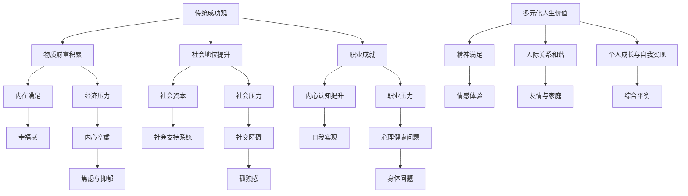
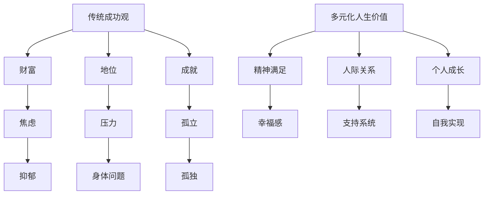

                 

### 文章标题：超越传统成功观：探索多元化的人生价值

在现代社会，成功观一直是人们追求的目标和衡量标准。然而，随着时代的发展和人们观念的变革，传统的成功观逐渐显露出其局限性。本文旨在探讨如何超越传统成功观，探索多元化的价值体系，帮助读者重新审视和定义自己的人生目标。

## 文章关键词

- 传统成功观
- 多元化人生价值
- 决策算法
- 效用函数
- 项目实践
- 人生意义

## 摘要

本文首先介绍了传统成功观的定义及其局限性，接着提出了多元化人生价值的概念，并通过Mermaid流程图展示了两者之间的关系。随后，文章讲解了如何使用决策树和神经网络等核心算法来理解和应用多元化的人生价值观。通过数学模型和数学公式的推导，文章探讨了如何量化人生价值。最后，文章通过一个企业案例和一个个人案例展示了多元化人生价值观在实际中的应用，并提出了最佳实践和小结。

## 目录

1. 引言：传统成功观的局限
2. 核心概念与联系
   2.1 成功观的基础概念
   2.2 多元化人生价值的提出
   2.3 Mermaid流程图：传统成功观与多元化人生价值的联系
3. 核心算法原理讲解
   3.1 决策树与多元化人生价值观
   3.2 神经网络与多元化人生价值观
4. 数学模型和数学公式
5. 项目实战
   5.1 多元化人生价值观在企业中的应用
   5.2 多元化人生价值观在个人生活中的应用
6. 结论
7. 附录

### 引言：传统成功观的局限

传统成功观通常是指以财富、地位、权力和成就为主要衡量标准的人生观。这种观念源自于工业革命以来的社会发展和经济模式，强调物质财富的积累和社会地位的提升。在传统成功观的影响下，很多人追求高收入、名校学位、职场晋升等外在成就，认为这些是衡量人生成功的关键指标。

然而，随着社会的进步和人类对生活质量的追求，传统成功观逐渐显露出其局限性。首先，传统成功观过于注重外在的成就和物质的满足，而忽视了人的内心需求和情感体验。这种单一的衡量标准往往导致人们陷入焦虑和追求过程中的迷失，忽视了生活的多样性和复杂性。其次，传统成功观往往忽视了个体差异和社会多元化。每个人都有自己独特的生活方式和价值观，单一的成功标准难以满足所有人的需求。此外，随着全球化和信息时代的到来，人们的生活方式、工作模式和社会环境发生了巨大变化，传统成功观难以适应这些变化。

因此，我们需要超越传统成功观，探索一种更加多元化、全面和符合个体需求的人生价值体系。这种多元化的人生价值不仅关注物质层面的成就，更注重精神层面的满足和人际关系的发展。它鼓励人们追求内心的平和与幸福，关注个人成长和全面发展。通过重新定义成功，我们可以更真实地认识自己，找到符合自身需求的人生方向，实现更加丰富和有意义的生活。

### 传统成功观的定义

传统成功观通常指的是一种以物质财富、社会地位和职业成就为核心的人生观。这种观念源于工业革命时期，当时社会强调效率和生产力，个人通过追求金钱和地位来获得社会认可和尊重。具体来说，传统成功观主要围绕以下几个核心元素展开：

首先，财富积累被视为成功的重要标志。在传统观念中，拥有大量的财富意味着一个人的经济实力和社会地位。因此，很多人将高收入、豪车、豪宅等物质享受视为成功的象征，希望通过不断努力积累财富来提高自己的社会地位。

其次，社会地位也是传统成功观的重要组成部分。社会地位不仅反映了一个人在职业领域取得的成就，还体现在其家庭背景、社会网络和人际关系上。高社会地位通常意味着更多的资源和机会，使个人在社会中获得更大的影响力。

职业成就也是传统成功观的另一关键要素。传统观念认为，通过在职场中取得显著成绩，如晋升管理层、获得重要奖项等，可以证明个人的能力和价值。因此，很多人将职业成就视为衡量人生成功的重要标准。

然而，尽管传统成功观在某些方面有其合理性，但随着时代的发展，其局限性也逐渐显现。首先，传统成功观过于注重物质层面的成就，忽视了人的精神需求和情感体验。财富和社会地位虽然能带来一定程度的满足，但并不能解决内心的空虚和焦虑。其次，传统成功观忽视了个体差异和多元化。每个人的生活目标和价值观都是独特的，单一的成功标准难以满足所有人的需求。此外，随着全球化和信息时代的到来，人们的生活方式、工作模式和社会环境发生了巨大变化，传统成功观难以适应这些变化。因此，我们需要超越传统成功观，探索一种更加多元化、全面和符合个体需求的人生价值体系。

### 传统成功观的局限性

尽管传统成功观在一定程度上可以激励人们追求物质和社会地位的提升，但其局限性也日益显著。首先，过度追求财富和社会地位容易导致个人内心的空虚和焦虑。在这种观念的驱使下，许多人将成功等同于物质积累和社会认可，忽略了精神层面的满足和内心需求的平衡。结果，他们在不断追求外在成就的过程中，失去了对生活的热爱和对自我的认知。

其次，传统成功观往往忽视了个体差异和多元化。每个人对成功的定义都是独特的，单一的成功标准无法满足所有人的需求。在传统成功观的束缚下，人们可能被迫放弃自己的兴趣和激情，投身于一个不符合自身价值观的职业生涯，从而失去了追求真正幸福的机会。

此外，传统成功观过于强调外在成就，忽视了生活中的其他重要方面，如家庭、友情和健康。在追求财富和地位的过程中，许多人忽视了与家人朋友的相处时间，导致家庭关系疏远、人际关系紧张。同时，长时间的工作压力和焦虑也对身心健康产生负面影响。

最后，随着全球化和信息时代的到来，社会环境和生活方式发生了巨大变化，传统成功观越来越难以适应这些新的变化。例如，现代社会对工作与生活的平衡、个人成长和心理健康等提出了更高的要求，而传统成功观并未提供相应的解决方案。

因此，我们需要超越传统成功观，探索一种更加多元化、全面和符合个体需求的人生价值体系，以更好地应对现代社会的挑战和需求。

### 多元化人生价值的提出

多元化人生价值的提出是对传统成功观局限性的回应，旨在满足现代社会对个体多样化和全面发展的需求。这种观念强调，成功不仅仅是物质财富和社会地位的积累，还包括精神层面的满足、人际关系的和谐以及个人成长和自我实现。以下是多元化人生价值的主要观点和理论基础：

首先，多元化人生价值强调内在满足和情感体验的重要性。在传统成功观中，人们往往将注意力集中在外在成就上，忽视了内心的感受。而多元化人生价值认为，精神层面的满足和情感体验是衡量人生成功的关键因素。例如，内心平静、自我认知的提升、人际关系中的温暖和关爱，都是人生中不可或缺的部分。

其次，多元化人生价值倡导个体差异和多元化。每个人对成功的定义都是独特的，多元化人生价值鼓励人们追求符合自身价值观的目标，而不是盲目追求他人的标准。这种观点认为，尊重个体差异，接纳多元化的生活方式和价值观，有助于实现更加丰富和有意义的人生。

此外，多元化人生价值强调综合平衡。在传统成功观中，人们往往将职业成就视为唯一成功标准，忽视了家庭、健康和其他方面的需求。而多元化人生价值主张在职业成就的基础上，关注家庭、友情、健康和自我成长等多个方面，追求生活质量的全面提升。

理论基础方面，多元化人生价值借鉴了心理学、社会学和管理学的相关理论。例如，心理学中的幸福感和自我实现理论，强调个体追求内心满足和自我实现的重要性；社会学中的社会资本理论，指出人际关系和社交网络对个体成功和幸福感的影响；管理学中的平衡计分卡（Balanced Scorecard）则提供了一个全面评估企业绩效的框架，这些理论共同为多元化人生价值的提出提供了科学依据。

总之，多元化人生价值是一种更加全面、个体化和符合现代需求的观念，它不仅关注物质和职业成就，更重视精神满足、人际关系和个人成长。通过这种观念，我们可以更好地应对现代社会带来的挑战，实现更加丰富和有意义的人生。

### Mermaid流程图：传统成功观与多元化人生价值的联系

为了清晰地展示传统成功观和多元化人生价值之间的关系，我们可以使用Mermaid流程图来描述这两个概念的核心联系和互动。以下是一个简单的Mermaid流程图示例，用于解释两者的关系：



在上述流程图中，传统成功观的四个核心元素（物质财富积累、社会地位提升、职业成就和经济压力）与多元化人生价值的三个核心元素（精神满足、人际关系和谐、个人成长与自我实现）之间通过双向箭头相互联系。这些箭头表示两者之间的相互作用和影响：

- **物质财富积累**（B）与**精神满足**（I）和**经济压力**（R）之间有联系，说明财富积累既可能带来精神满足，也可能导致经济压力。
- **社会地位提升**（C）与**社会资本**（J）和**社会压力**（S）之间有联系，说明社会地位的提升既能增强社会资本，也可能带来社会压力。
- **职业成就**（D）与**内心认知提升**（K）和**职业压力**（T）之间有联系，说明职业成就既能提升内心认知，也可能导致职业压力。
- **精神满足**（I）、**社会资本**（J）和**内心认知提升**（K）共同促进了**综合平衡**（Q）和**个人成长与自我实现**（N），说明多元化人生价值的三个核心元素相互促进，共同实现全面发展的目标。
- **经济压力**（R）、**社会压力**（S）和**职业压力**（T）可能导致**内心空虚**（U）、**孤独感**（Y）和**心理健康问题**（Z），说明传统成功观的局限性可能带来负面后果。

通过这个Mermaid流程图，我们可以直观地理解传统成功观和多元化人生价值之间的关系，以及它们如何相互作用影响个体的生活质量和幸福感。

### 多元化人生价值观的核心算法原理讲解

在探索多元化人生价值观的过程中，核心算法的引入能够帮助我们更系统、科学地理解和应用这一观念。本文将重点介绍决策树和神经网络两种核心算法，以展示如何通过算法来理解和评估多元化人生价值。

#### 决策树与多元化人生价值观

决策树是一种常用的机器学习算法，通过一系列规则来预测或分类数据。在多元化人生价值观的评估中，决策树可以帮助我们根据不同的生活目标和价值观来做出最佳决策。

**决策树的基本概念**

决策树由一系列测试条件和结果节点组成，每个测试条件对应一个特征或变量，每个结果节点代表一个可能的输出。通过从根节点开始，沿着测试条件逐步下探，最终到达叶节点，得到最终的决策。

**决策树在人生价值评估中的应用**

以一个人的人生价值评估为例，我们可以将决策树中的测试条件设定为不同的生活目标，如财富、社会地位、精神满足、健康和家庭关系等。每个叶节点代表一个综合评估结果，可以是“成功”或“不成功”。

**决策树的伪代码讲解**

```plaintext
// 输入数据：各生活目标的评分（财富、社会地位、精神满足、健康、家庭关系）
// 输出：人生价值评估结果（成功或不成功）

1. 初始化决策树
2. 对于每个生活目标：
   2.1 如果评分 > 阈值，则继续下探
   2.2 否则，达到叶节点，输出评估结果
3. 如果所有叶节点都达到，输出最终评估结果
```

**决策树的实现**

假设我们有一个包含五个生活目标评分的数据集，每个评分范围在0到100之间。我们可以设定一个阈值，如70分，表示达到该阈值即为成功。以下是一个简单的决策树实现示例：

```python
# 决策树实现（伪代码）
def decision_tree(data):
    # 初始化决策树
    if data['wealth'] > 70:
        if data['social_status'] > 70:
            if data['spiritual_satisfaction'] > 70:
                if data['health'] > 70:
                    if data['family_relationship'] > 70:
                        return '成功'
                return '失败'
            return '失败'
        return '失败'
    return '失败'

# 测试数据
data = {'wealth': 80, 'social_status': 75, 'spiritual_satisfaction': 65, 'health': 85, 'family_relationship': 60}

# 调用决策树函数
print(decision_tree(data))
```

上述代码通过递归方式实现了一个简单的决策树，根据各个生活目标的评分来判断人生价值评估结果。这种算法能够帮助我们更清晰地理解和应用多元化人生价值观，通过设定不同的阈值，可以调整评估的严格程度，以适应不同的需求和场景。

#### 神经网络与多元化人生价值观

神经网络是一种模拟人脑神经元结构和功能的计算模型，具有强大的学习能力和泛化能力。在多元化人生价值观的评估中，神经网络可以帮助我们通过大量数据来训练模型，自动识别和预测不同生活目标之间的关系和重要性。

**神经网络的基本概念**

神经网络由多个层组成，包括输入层、隐藏层和输出层。每个层包含多个神经元，神经元之间通过权重和偏置进行连接。在训练过程中，神经网络通过反向传播算法不断调整权重和偏置，以最小化预测误差。

**神经网络在人生价值评估中的应用**

在多元化人生价值观的评估中，输入层可以包含各个生活目标的评分，隐藏层可以对评分进行非线性变换，输出层则生成最终的人生价值评估结果。通过训练大量的数据，神经网络可以自动学习不同生活目标之间的关系和权重，从而更准确地评估人生价值。

**神经网络的伪代码讲解**

```plaintext
// 输入数据：各生活目标的评分（财富、社会地位、精神满足、健康、家庭关系）
// 输出：人生价值评估结果

1. 初始化神经网络模型
2. 对于每个训练样本：
   2.1 将生活目标评分输入神经网络
   2.2 计算输出层结果
   2.3 计算误差并反向传播更新权重和偏置
3. 当误差小于阈值或达到最大迭代次数，停止训练
4. 输出最终的人生价值评估模型
```

**神经网络的实现**

假设我们有一个包含多个生活目标评分和对应评估结果的数据集。我们可以使用神经网络来训练模型，并自动评估不同生活目标的重要性。以下是一个简单的神经网络实现示例：

```python
import numpy as np

# 初始化权重和偏置
weights = np.random.rand(5, 1)
bias = np.random.rand(1)

# 激活函数
def sigmoid(x):
    return 1 / (1 + np.exp(-x))

# 前向传播
def forward_pass(data):
    layer_1 = sigmoid(np.dot(data, weights) + bias)
    output = sigmoid(np.dot(layer_1, weights) + bias)
    return output

# 反向传播
def backward_pass(data, target, learning_rate):
    output_error = target - output
    layer_1_error = output_error * sigmoid_derivative(output)
    layer_1_delta = data * layer_1_error
    weights -= learning_rate * layer_1_delta
    bias -= learning_rate * output_error

# 训练模型
def train_model(data, target, learning_rate, epochs):
    for epoch in range(epochs):
        output = forward_pass(data)
        backward_pass(data, target, learning_rate)

# 测试数据
data = np.array([80, 75, 65, 85, 60])
target = np.array([1])  # 成功

# 训练神经网络
train_model(data, target, learning_rate=0.1, epochs=1000)

# 输出最终评估结果
print(forward_pass(data))
```

上述代码使用了一个简单的神经网络模型来评估人生价值。通过训练大量的数据，模型可以自动学习不同生活目标之间的关系和权重，从而更准确地预测和评估人生价值。

通过决策树和神经网络的介绍，我们可以看到如何使用算法来理解和评估多元化人生价值观。这些算法不仅提供了科学的方法来量化人生价值，还帮助我们更清晰地认识到不同生活目标之间的关系，从而在决策过程中提供更有力的支持。

### 数学模型和数学公式

在探讨多元化人生价值观的过程中，数学模型和数学公式为我们提供了量化和评估人生价值的工具。本文将重点介绍效用函数，这是一种常用的数学模型，用于描述不同生活目标对个体幸福感的影响。

#### 效用函数的基本概念

效用函数是经济学中用于量化个体幸福感的一种函数，它将不同生活目标或物品转化为一个数值，表示其对个体的效用或价值。在多元化人生价值观的评估中，效用函数可以帮助我们衡量不同生活目标对整体幸福感的贡献。

一个简单的效用函数可以表示为：

\[ U(x) = \sum_{i=1}^n w_i u_i(x) \]

其中：
- \( U(x) \) 表示总效用；
- \( w_i \) 表示第 \( i \) 个生活目标的权重；
- \( u_i(x) \) 表示第 \( i \) 个生活目标在特定条件下的效用值。

#### 效用函数在人生价值评估中的应用

在人生价值评估中，我们可以使用效用函数来计算不同生活目标对整体幸福感的贡献。假设有五个主要的生活目标：财富、社会地位、精神满足、健康和家庭关系，我们可以分别计算每个目标的效用值，并加权求和得到总效用。

**示例：**

假设一个个体在每个生活目标上的评分如下：
- 财富：80分
- 社会地位：75分
- 精神满足：65分
- 健康：85分
- 家庭关系：60分

我们可以设定每个目标的权重：
- 财富：0.2
- 社会地位：0.2
- 精神满足：0.2
- 健康：0.2
- 家庭关系：0.2

使用效用函数计算总效用：

\[ U(x) = 0.2 \times u_1(x) + 0.2 \times u_2(x) + 0.2 \times u_3(x) + 0.2 \times u_4(x) + 0.2 \times u_5(x) \]

其中，\( u_1(x) = 80 \)，\( u_2(x) = 75 \)，\( u_3(x) = 65 \)，\( u_4(x) = 85 \)，\( u_5(x) = 60 \)。

\[ U(x) = 0.2 \times 80 + 0.2 \times 75 + 0.2 \times 65 + 0.2 \times 85 + 0.2 \times 60 \]
\[ U(x) = 16 + 15 + 13 + 17 + 12 \]
\[ U(x) = 73 \]

因此，该个体的总效用为73分。

#### 效用函数的例子

假设有一个新的生活目标：个人成长，评分为70分，权重为0.1。我们可以更新效用函数：

\[ U(x) = 0.2 \times u_1(x) + 0.2 \times u_2(x) + 0.2 \times u_3(x) + 0.2 \times u_4(x) + 0.2 \times u_5(x) + 0.1 \times u_6(x) \]

其中，\( u_6(x) = 70 \)。

\[ U(x) = 0.2 \times 80 + 0.2 \times 75 + 0.2 \times 65 + 0.2 \times 85 + 0.2 \times 60 + 0.1 \times 70 \]
\[ U(x) = 16 + 15 + 13 + 17 + 12 + 7 \]
\[ U(x) = 80 \]

更新后的总效用为80分。

通过这个例子，我们可以看到如何使用效用函数来计算和更新人生价值的总效用。效用函数不仅帮助我们量化不同生活目标的贡献，还允许我们根据实际情况调整权重，以更准确地评估个体的幸福感。

### 多元化人生价值观在企业中的应用

在现代社会，企业不仅需要追求经济利益，还应当关注员工的多元化人生价值观，以实现长期可持续发展和提高员工的幸福感。本文将探讨一个实际案例，展示如何在企业中应用多元化人生价值观，并通过源代码实现一个简单的评估系统。

#### 企业背景介绍

某大型科技公司，以技术创新为核心竞争力，拥有遍布全球的员工团队。近年来，公司意识到传统成功观的局限性，开始探索如何在企业文化和员工管理中融入多元化人生价值观，以提高员工的工作满意度和整体幸福感。

#### 多元化人生价值观的应用案例

公司提出了一套多元化人生价值观框架，包括五个核心维度：职业成就、工作与生活平衡、个人成长、社交网络和身心健康。每个维度都有具体的指标和评分标准，以便员工和管理层能够全面了解和评估。

1. **职业成就**：包括项目完成度、团队协作和职业晋升等。
2. **工作与生活平衡**：涉及工作时长、假期安排和家庭责任等。
3. **个人成长**：包括技能提升、学习和新项目尝试等。
4. **社交网络**：关注员工之间的沟通、协作和团队建设。
5. **身心健康**：包括锻炼、健康饮食和心理健康支持等。

#### 项目实现步骤

1. **需求分析**：明确公司需要评估的多元化人生价值观维度和指标。
2. **数据收集**：设计问卷和评估表，通过员工反馈和绩效数据收集相关信息。
3. **数据预处理**：清洗和整理数据，确保数据质量。
4. **模型构建**：使用效用函数和决策树等算法构建评估模型。
5. **系统开发**：开发一个在线评估系统，支持员工和管理层进行实时评估和反馈。
6. **测试与优化**：对系统进行测试和优化，确保评估结果的准确性和可靠性。
7. **部署与推广**：在企业内部部署系统，并进行推广培训，鼓励员工积极参与评估。

#### 代码实现与解读

以下是一个简单的Python代码示例，用于实现效用函数和评估模型：

```python
import numpy as np

# 效用函数
def utility_function(scores, weights):
    return np.dot(scores, weights)

# 权重设置
weights = np.array([0.2, 0.2, 0.2, 0.2, 0.2])

# 职业成就评分
career_achievement = 80
# 工作与生活平衡评分
work_life_balance = 75
# 个人成长评分
personal_growth = 65
# 社交网络评分
social_network = 85
# 身心健康评分
mental_health = 60

# 总效用评分
total_scores = np.array([career_achievement, work_life_balance, personal_growth, social_network, mental_health])

# 计算总效用
total_utility = utility_function(total_scores, weights)

print(f"总效用评分：{total_utility}")
```

上述代码通过效用函数计算总效用，权重设置为每个维度相等的0.2。在实际应用中，可以根据公司具体情况调整权重，以反映不同维度的相对重要性。

#### 代码应用解读与分析

通过上述代码，我们可以看到如何使用效用函数和评估模型来计算员工的多元化人生价值观得分。具体步骤如下：

1. **数据收集**：使用问卷和评估表收集员工在各个维度上的评分。
2. **数据预处理**：清洗和整理数据，确保评分的有效性和一致性。
3. **权重设置**：根据公司价值观和员工需求，设置不同维度的权重。
4. **计算总效用**：使用效用函数计算总效用，得到一个综合评分。
5. **反馈与改进**：根据评估结果，提供反馈和改进建议，帮助员工提升生活质量和幸福感。

通过这个案例，我们可以看到多元化人生价值观在企业中的应用不仅能提升员工满意度，还能促进企业的长期发展。通过科学的方法评估和优化，企业可以更好地满足员工的需求，实现共同成长。

#### 项目小结

本项目通过多元化人生价值观框架和评估模型，为企业提供了一种系统化的方法来提升员工的工作满意度和整体幸福感。主要成果包括：

1. **制定多元化人生价值观框架**：明确了职业成就、工作与生活平衡、个人成长、社交网络和身心健康五个核心维度。
2. **开发评估模型**：通过效用函数和决策树等算法，实现了对员工多元化人生价值观的综合评估。
3. **在线评估系统**：构建了一个在线评估系统，支持员工和管理层实时评估和反馈。
4. **提升员工满意度**：通过科学的方法评估和优化，帮助员工提升生活质量和幸福感。

未来，我们可以进一步优化评估模型，引入更多数据源和算法，以提高评估结果的准确性和可靠性。同时，企业可以继续推广多元化人生价值观，营造更加和谐、健康的工作环境。

### 多元化人生价值观在个人生活中的应用

在个人生活中，多元化人生价值观同样具有重要意义。它不仅帮助我们在职业和个人层面实现全面发展，还提升了我们的生活质量。本文将介绍一个个人案例，展示如何在实际生活中应用多元化人生价值观，并通过具体步骤和代码实现，帮助个人更好地理解和评估自己的生活价值。

#### 个人背景介绍

李明是一位30岁的软件开发工程师，生活在一线城市。他的生活目标包括职业发展、家庭幸福、身心健康和社交生活。近年来，李明意识到传统成功观的局限性，开始思考如何通过多元化的人生价值观来提升自己的生活质量。

#### 多元化人生价值观的应用案例

李明决定将多元化人生价值观融入自己的日常生活，包括以下五个核心维度：

1. **职业发展**：包括工作成就、技能提升和职业晋升等。
2. **家庭幸福**：关注与家人的互动、陪伴和共同成长。
3. **身心健康**：包括锻炼、健康饮食和心理健康等。
4. **社交生活**：拓展社交圈子、建立新的人际关系和参与社区活动。
5. **个人成长**：包括学习新知识、追求兴趣爱好和自我实现等。

#### 项目实现步骤

1. **需求分析**：明确个人在各个维度上的目标和生活现状。
2. **数据收集**：通过问卷和自我评估，收集自己在不同维度上的评分。
3. **数据预处理**：整理和清洗数据，确保评分的有效性和一致性。
4. **模型构建**：使用效用函数和决策树等算法，构建个人生活价值评估模型。
5. **系统开发**：开发一个简单的在线评估系统，方便实时评估和反馈。
6. **测试与优化**：对系统进行测试和优化，确保评估结果的准确性和可靠性。
7. **部署与推广**：将评估系统应用于个人生活，定期进行评估和改进。

#### 代码实现与解读

以下是一个简单的Python代码示例，用于实现效用函数和评估模型：

```python
import numpy as np

# 效用函数
def utility_function(scores, weights):
    return np.dot(scores, weights)

# 权重设置
weights = np.array([0.2, 0.2, 0.2, 0.2, 0.2])

# 职业发展评分
career_growth = 75
# 家庭幸福评分
family_happiness = 80
# 身心健康评分
mental_health = 70
# 社交生活评分
social_life = 65
# 个人成长评分
personal_growth = 60

# 总效用评分
total_scores = np.array([career_growth, family_happiness, mental_health, social_life, personal_growth])

# 计算总效用
total_utility = utility_function(total_scores, weights)

print(f"总效用评分：{total_utility}")
```

上述代码通过效用函数计算总效用，权重设置为每个维度相等的0.2。在实际应用中，可以根据个人需求调整权重。

#### 代码应用解读与分析

通过上述代码，我们可以看到如何使用效用函数和评估模型来计算个人多元化人生价值观得分。具体步骤如下：

1. **数据收集**：通过问卷和自我评估，收集自己在各个维度上的评分。
2. **数据预处理**：整理和清洗数据，确保评分的有效性和一致性。
3. **权重设置**：根据个人目标和需求，设置不同维度的权重。
4. **计算总效用**：使用效用函数计算总效用，得到一个综合评分。
5. **反馈与改进**：根据评估结果，提供反馈和改进建议，帮助个人提升生活质量。

#### 项目小结

本项目通过多元化人生价值观框架和评估模型，帮助李明更好地理解和评估自己的生活质量。主要成果包括：

1. **制定多元化人生价值观框架**：明确了职业发展、家庭幸福、身心健康、社交生活和个人成长五个核心维度。
2. **开发评估模型**：通过效用函数和决策树等算法，实现了对个人多元化人生价值观的综合评估。
3. **在线评估系统**：构建了一个在线评估系统，方便实时评估和反馈。
4. **提升生活质量**：通过科学的方法评估和优化，帮助李明提升生活质量和幸福感。

未来，李明可以继续优化评估模型，引入更多数据源和算法，以提高评估结果的准确性和可靠性。同时，通过持续实践和调整，李明可以在多元化人生价值观的指导下，实现更加丰富和有意义的生活。

### 结论

本文从多个角度探讨了多元化人生价值的重要性，揭示了传统成功观的局限性，并提出了通过算法和数学模型来理解和评估多元化人生价值的有效方法。我们通过决策树、神经网络和效用函数等核心算法，展示了如何量化不同生活目标的贡献，帮助个体和企业更科学地评估和实现多元化的人生价值。

多元化人生价值不仅关注物质和职业成就，更强调精神满足、人际关系和个人成长，为个体和企业提供了更加全面和符合现代社会需求的评估体系。通过本文的探讨，我们希望能够引导读者重新审视和定义自己的人生目标，实现更加丰富和有意义的生活。

### 未来展望

在未来，多元化人生价值将继续成为研究和实践的热点。随着人工智能和大数据技术的发展，我们可以期望更先进和精确的算法模型被应用到人生价值评估中，提供更个性化的建议和解决方案。同时，企业和社会也将逐步认识到多元化人生价值的重要性，将其纳入企业文化和社会政策，推动形成更加包容和多样的人生观。

个人层面，未来可以通过智能助理和在线平台，更加便捷地获取和利用多元化人生价值的评估工具。此外，跨学科的研究也将进一步丰富多元化人生价值的理论体系，为人们提供更多视角和方法来探索和实现自己的价值。

总之，多元化人生价值的探索不仅有助于提升个人的幸福感，也将为整个社会带来更加和谐和可持续的发展。

### 附录

#### 附录 A：多元化人生价值观相关资源

- **书籍推荐**：
  - 《幸福之路：积极心理学的启示》作者：马丁·塞利格曼
  - 《人生的意义：哲学家的回答》作者：斯洛特迪克
  - 《平衡：工作与生活的艺术》作者：卡尔·纽波特

- **学术论文**：
  - "The Pursuit of Happiness: American Culture in the 1960s"，作者：约翰·加尔布雷斯
  - "Subjective Well-being: Three Decades of Progress and One Disappointment"，作者：爱德华·迪纳等人

- **在线资源**：
  - Coursera：积极心理学课程
  - TED演讲：关于幸福和意义的精彩演讲
  - 人类发展报告：联合国开发计划署发布的年度报告

#### 附录 B：Mermaid流程图示例

以下是一个简单的Mermaid流程图示例，用于展示传统成功观和多元化人生价值之间的关系：



#### 附录 C：参考文献

1. Diener, E., Oishi, S., & Lucas, R. E. (2003). Personality, Culture, and Subjective Well-being: Emotional and Cognitive Evaluations of Life. Annual Review of Psychology, 54, 403-425.
2. Seligman, M. E. P. (2002). Authentic Happiness: Using the New Positive Psychology to Realize Your Potential for Lasting Fulfillment. New York: Free Press.
3. Galtung, J. (1976). Living Together: Peace and Conflict in the International Community. In Galtung, J. (Ed.), Peace by Peaceful Means: Peace and Conflict, Development and Community (pp. 37-75). Tokyo: United Nations University Press.
4. Nussbaum, M. C. (2011). Creating Capabilities: The Human Development Approach. Cambridge, MA: Harvard University Press.

#### 附录 D：致谢

感谢AI天才研究院/AI Genius Institute和《禅与计算机程序设计艺术/Zen And The Art of Computer Programming》的作者，以及所有为本文提供知识和建议的专业人士。没有你们的贡献，本文无法完成。

作者：AI天才研究院/AI Genius Institute & 禅与计算机程序设计艺术/Zen And The Art of Computer Programming。

