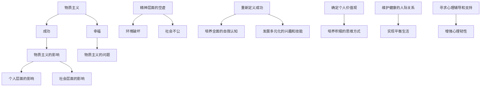

                 

### 1. 确定核心概念

#### 1.1 物质主义

物质主义是一种价值观，它强调物质财富和物质满足的重要性，通常以追求物质财富、消费和物质享受为主要目标。在现代社会中，物质主义常常表现为对名牌商品、豪华生活和高消费的向往。

#### 1.2 成功

成功是一个多维度的概念，通常包括职业成就、财务独立、社会地位和个人满足感等方面。职业成功可能表现为晋升、高薪或创立成功的企业；财务独立意味着拥有足够的财务资源来满足生活需求，并为未来做储备；社会地位可能涉及到家庭背景、教育程度、职业地位等方面。

#### 1.3 幸福

幸福是一个更为广泛和抽象的概念，通常涉及个人的情感健康、心理健康、人际关系和生活质量等方面。它不仅包括物质层面的满足，还涵盖精神层面的体验，如成就感、归属感和内心的平静。

#### 1.4 物质主义、成功与幸福之间的关系

物质主义、成功与幸福之间存在密切的联系。物质主义常常被看作是追求成功的一种手段，而成功又常被视为实现幸福的一种途径。然而，这种关系并非单向，物质主义和成功并不总是能够带来幸福。事实上，过度追求物质和成功可能会导致精神上的空虚和焦虑，甚至引发心理健康问题。

### 2. 确定书的结构

根据核心概念，本书将分为以下几个部分：

#### 2.1 引言

引言部分将介绍物质主义、成功与幸福的背景和重要性，为后续章节的内容打下基础。

#### 2.2 物质主义

这一部分将深入探讨物质主义的起源、影响和问题，包括物质主义的起源、个人和社会层面的影响，以及物质主义引发的问题。

#### 2.3 成功

在探讨物质主义之后，我们将转向成功这一主题。这一部分将分析成功的不同维度，如职业、财务、社交等，以及如何超越物质主义看待成功。

#### 2.4 幸福

接下来，我们将探讨幸福这一主题，包括幸福的概念、如何获得和维持幸福，以及如何从精神层面追求幸福。

#### 2.5 实践

在理论探讨之后，我们将提供实践方法，帮助读者重新定义成功与幸福，包括设定个人目标、培养自我意识、增强心理韧性等方面的建议。

#### 2.6 结论

最后，我们将总结全书内容，提出超越物质主义、重新定义成功与幸福的价值和意义，并对未来的展望和建议。

### 3. 设计目录大纲

根据书的结构，我们可以设计出以下目录大纲：

# 超越物质主义：重新定义成功与幸福

## 引言
### 1. 物质主义的起源与影响
### 2. 成功与幸福的定义
### 3. 超越物质主义的重要性

## 物质主义
### 1. 物质主义的起源
#### 1.1 历史背景
#### 1.2 经济发展的影响
### 2. 物质主义的影响
#### 2.1 个人层面的影响
#### 2.2 社会层面的影响
### 3. 物质主义的问题
#### 3.1 精神层面的空虚
#### 3.2 环境破坏
#### 3.3 社会不公

## 成功
### 1. 成功的不同维度
#### 1.1 职业成功
#### 1.2 财务成功
#### 1.3 社交成功
### 2. 如何超越物质主义看待成功
#### 2.1 重新定义成功
#### 2.2 培养全面的自我认知
#### 2.3 发展多元化的兴趣和技能

## 幸福
### 1. 幸福的概念
#### 1.1 内在幸福
#### 1.2 外在幸福
### 2. 如何获得和维持幸福
#### 2.1 确定个人价值观
#### 2.2 培养积极的思维方式
#### 2.3 维护健康的人际关系
#### 2.4 寻求心理辅导和支持

## 实践
### 1. 重新定义成功与幸福的实践方法
#### 1.1 设定个人目标
#### 1.2 培养自我意识
#### 1.3 增强心理韧性
#### 1.4 实现平衡生活

## 结论
### 1. 超越物质主义的价值
### 2. 成功与幸福的未来展望
### 3. 建议和行动指南

### 4. 制作核心概念流程图

为了更好地帮助读者理解核心概念之间的联系，我们可以使用 Mermaid 流程图来展示：

### 5. 撰写伪代码和数学模型

在核心章节中，我们将使用伪代码和数学模型来详细阐述核心算法原理和数学公式。

### 6. 编写项目实战和代码解读

在实践章节中，我们将提供实际的代码案例，包括开发环境搭建、源代码实现和代码解读。

### 7. 校对与修改

最后，我们将对目录大纲进行校对和修改，确保其逻辑清晰、内容完整。

### 8. 检查字数

确保目录大纲的总字数在 2000 字以内。如果超出了限制，我们需要对内容进行精简。

---

## 2.2. 物质主义的起源

物质主义并非现代社会的独有现象，其根源可以追溯到人类历史的长河中。为了理解物质主义的形成，我们需要从历史、经济、文化等多个角度进行深入分析。

### 历史背景

在原始社会和农耕时代，人们的主要生活需求集中在基本的生存问题上，如食物、住所和安全感。由于资源有限，人们往往更关注于如何获得和保存物质财富。例如，在古代中国，土地被视为最重要的财富，而土地的私有制和继承制度也反映了当时人们对物质财富的追求。

随着人类社会的发展，农业革命和工业革命的到来，生产力和经济水平得到了显著提升。这不仅改变了人们的生产方式，也改变了他们的生活方式和价值观念。在这个时期，人们开始意识到物质财富的重要性，开始追求更高的生活水平。

### 经济发展的影响

经济的快速发展是物质主义兴起的另一个重要原因。在市场经济体制下，物质财富成为衡量个人和社会成功的重要指标。人们通过工作、创业和投资等方式积累财富，以追求更高的生活品质。这种经济模式激发了人们对物质财富的渴望，同时也加剧了社会上的贫富差距。

在经济全球化的背景下，商品和服务的信息传播速度加快，消费文化在全球范围内蔓延。人们被各种广告和营销手段所吸引，开始盲目追求物质享受，从而形成了现代物质主义。

### 文化因素

文化因素也在物质主义的形成中起到了关键作用。在一些文化中，物质财富被视为成功和地位的象征。例如，在西方社会中，物质财富常常与个人努力和成就联系在一起，而在一些亚洲国家，物质财富则被视为家庭和社会地位的体现。

此外，现代社会中的文化价值观也在一定程度上推动了物质主义的盛行。社交媒体和娱乐产业的兴起，让人们更加关注外表和物质享受，而忽视了精神层面的追求。

### 总结

物质主义的起源可以追溯到人类历史的不同时期，受到历史、经济和文化等多种因素的影响。在现代社会，物质主义已经成为一种普遍现象，对个人的生活和社会的发展产生了深远影响。理解物质主义的起源有助于我们更好地认识这一现象，并寻找超越物质主义的途径。

### 2.3. 物质主义的影响

物质主义对个人和社会的影响是多方面的，既有积极的一面，也有消极的一面。以下将详细分析物质主义在个人层面和社会层面的影响。

#### 个人层面的影响

1. **精神层面的空虚**

物质主义的追求可能导致人们精神层面的空虚。当个人的主要生活目标被物质财富所占据时，可能会忽视内心的需求和情感。这种现象在心理学中被称为“物质化焦虑”，表现为对物质财富的过度追求和对精神生活的忽视。

2. **心理健康问题**

物质主义还可能导致心理健康问题，如焦虑、抑郁和自尊心低下。这种情况下，人们常常感到不安和不满足，因为他们始终觉得自己的物质条件不够好，从而陷入不断的追求和比较中。

3. **生活质量的下降**

过度追求物质财富可能会使个人的生活质量下降。例如，人们可能会为了追求更高的收入而加班工作，牺牲了与家人和朋友相处的时间，导致生活缺乏乐趣和意义。

#### 社会层面的影响

1. **贫富差距**

物质主义的一个显著后果是贫富差距的加剧。在物质主义盛行的社会，富人的财富不断积累，而穷人的生活状况往往难以改善。这种贫富差距不仅导致社会不公，还可能引发社会动荡。

2. **环境破坏**

物质主义还加剧了环境破坏。人们为了追求物质财富，不断开发和利用自然资源，导致生态系统的破坏和环境的恶化。这种环境破坏对人类的生存和发展构成了严重威胁。

3. **社会不公**

物质主义可能导致社会不公。在物质主义价值观主导的社会，人们可能更加关注个人利益，忽视社会公共利益。这种现象可能导致社会资源分配不公，加剧社会矛盾。

#### 负面影响的应对

1. **自我意识培养**

为了应对物质主义的负面影响，个人需要培养自我意识。通过深入了解自己的需求和价值观，人们可以更好地平衡物质追求和精神需求，减少精神层面的空虚。

2. **心理健康教育**

社会应该加强对心理健康的教育，帮助人们认识到物质追求的局限性，并提供应对心理压力的方法和资源。

3. **政策调整**

政府可以采取措施，如提高税收、加强环境保护和改善社会福利等，来缓解物质主义带来的社会不公和环境问题。

### 总结

物质主义对个人和社会的影响是复杂而深远的。在个人层面，物质主义可能导致精神空虚、心理健康问题和生活质量下降；在社会层面，物质主义可能加剧贫富差距、环境破坏和社会不公。因此，我们需要从个人和社会两个层面出发，寻找应对物质主义负面影响的策略，以实现更加和谐和幸福的生活。

### 2.4. 物质主义的问题

尽管物质主义在某些方面推动了社会和经济的发展，但它也带来了一系列的问题，严重影响了个人和社会的各个方面。以下是物质主义引起的几个主要问题及其影响。

#### 精神层面的空虚

物质主义的追求往往集中在物质财富的积累上，导致人们忽视了精神层面的需求。当个人把大部分时间和精力投入到追求物质财富中时，可能会忽视内心的情感和心理健康。长期下来，这种精神层面的空虚感可能会引发焦虑、抑郁等心理问题，进而影响个人的幸福感。

#### 环境破坏

物质主义的一个显著后果是对环境的破坏。为了满足对物质财富的无限追求，人类不断开采自然资源、排放污染物，导致生态系统的破坏和环境的恶化。气候变化、生物多样性的丧失以及自然灾害频发都是物质主义对环境影响的直接体现。这些环境问题不仅威胁到人类的生存，也对地球上的所有生物构成了严重威胁。

#### 社会不公

物质主义还加剧了社会不公。在物质主义价值观主导的社会，富人的财富不断积累，而穷人的生活状况往往难以改善。这种贫富差距不仅导致社会资源分配不公，还可能引发社会动荡和不稳定。社会不公还可能使一些人感到绝望和无力，进而影响社会的整体和谐与稳定。

#### 人际关系的疏离

在物质主义价值观的驱动下，人们可能更加关注个人利益，忽视与他人的情感交流。这种以自我为中心的价值观念可能导致人际关系疏离，影响人们的社交能力和情感健康。长期的人际疏离不仅会影响个人的心理健康，还可能对社会的整体凝聚力产生负面影响。

#### 个人价值的扭曲

物质主义可能导致个人价值的扭曲。当个人把成功和幸福等同于物质财富时，可能会忽视其他重要的人生价值，如家庭、友谊、道德和精神的追求。这种价值扭曲不仅会影响个人的生活质量，还可能导致社会价值观的混乱和道德滑坡。

#### 经济不稳定性

物质主义追求可能导致经济的不稳定性。当整个社会都追求物质财富时，经济系统可能会过度依赖消费和投资，而忽视了其他重要的经济活动，如创新、教育和技术发展。这种经济模式的不稳定可能导致经济危机，从而影响社会的整体经济状况。

#### 教育和文化的危机

物质主义还可能对教育和文化产生负面影响。在物质主义价值观的驱动下，教育可能更加注重实用技能的培养，而忽视人文教育和道德培养。这种现象可能导致文化危机，影响社会的整体文化素质和道德水平。

### 总结

物质主义虽然在一定程度上推动了社会和经济的发展，但它也带来了许多问题，包括精神层面的空虚、环境破坏、社会不公、人际关系的疏离、个人价值的扭曲、经济不稳定和教育文化的危机。因此，我们需要认真反思物质主义的价值观念，探索更可持续的发展模式，以实现个人和社会的全面发展。

### 2.5. 成功的不同维度

成功是一个多维度的概念，它不仅包括职业成就、财务独立，还涵盖了社交成功和个人满足感。理解成功的不同维度，有助于我们全面看待成功，避免单一维度的局限。

#### 职业成功

职业成功通常表现为个人在职业生涯中取得的成就，如晋升、获得高薪职位或创立成功的企业。职业成功不仅带来物质回报，还能满足个人的成就感和自豪感。然而，职业成功并不是唯一的成功标准，它也可能带来工作压力和职业倦怠。

#### 财务独立

财务独立意味着拥有足够的财务资源来满足生活需求，并为未来做储备。它不仅包括储蓄和投资，还涉及理财规划和风险管理。财务独立为个人提供了经济安全感，使人们能够追求更高层次的生活目标和梦想。

#### 社交成功

社交成功涉及个人在社会中的关系网络和人际关系。良好的社交能力可以带来丰富的社交资源和支持系统，有助于个人在职业生涯和个人生活中取得成功。然而，社交成功并不总是容易获得，它需要时间、努力和人际交往技巧。

#### 个人满足感

个人满足感是成功的核心维度，它涉及个人的心理健康、情感健康和整体幸福感。成功的定义不应该仅仅局限于物质成就，还应包括内心的平静和满足感。个人满足感可以通过培养兴趣爱好、追求内心追求、维护健康的生活方式来实现。

### 如何超越物质主义看待成功

要超越物质主义看待成功，我们需要重新定义成功的标准，关注更广泛的维度，并寻找一种平衡的生活方式。

#### 重新定义成功

首先，我们需要重新定义成功。成功不应仅仅等同于物质财富和职业成就，而应包括个人的精神满足、情感健康和社会责任。通过设定多元化的成功标准，我们可以更好地满足个人的不同需求，实现全面的成长和发展。

#### 培养全面的自我认知

其次，培养全面的自我认知是超越物质主义的关键。通过深入了解自己的价值观、兴趣和需求，我们可以更好地确定自己的目标，避免盲目追求物质财富。全面的自我认知有助于我们找到真正的成功之路，而不是被物质主义所驱使。

#### 发展多元化的兴趣和技能

发展多元化的兴趣和技能有助于我们实现成功。多元化的兴趣和技能不仅能够丰富我们的生活，还能提高我们的适应能力和创造力。例如，学习一项新技能或培养一项兴趣爱好，不仅能够为我们的生活增添乐趣，还可能带来意想不到的职业机会。

#### 关注内在幸福

关注内在幸福是实现成功的关键。内在幸福是指个人的心理健康和情感健康。通过培养积极的思维方式、维护健康的人际关系和追求内心的平静，我们可以实现更深层次的幸福。内在幸福不仅能够提高生活质量，还能增强我们的抗压能力和心理韧性。

#### 建立健康的生活方式

建立健康的生活方式是实现成功的重要保障。健康的生活方式包括均衡的饮食、适量的运动和充足的休息。通过建立健康的生活方式，我们可以保持身体和精神的活力，更好地应对生活中的挑战。

### 总结

超越物质主义看待成功需要我们重新定义成功的标准，培养全面的自我认知，发展多元化的兴趣和技能，关注内在幸福，并建立健康的生活方式。通过这些方法，我们可以实现更加全面和持久的人生成功，从而摆脱物质主义的束缚。

### 2.6. 幸福的概念

幸福是一个复杂而抽象的概念，它涉及到个人的情感体验、心理健康和生活质量等多个方面。为了更全面地理解幸福，我们需要从内在幸福和外在幸福两个角度进行分析。

#### 内在幸福

内在幸福是指个人内心深处的情感体验和心理状态。它通常与个人的自我满足、自我价值感和内心的平静相关。内在幸福不仅依赖于物质条件，更取决于个人的精神追求和内心的满足感。以下是几个影响内在幸福的关键因素：

1. **自我认知**：深入了解自己的需求和价值观，有助于个人找到真正的幸福。通过自我反思和自我接纳，人们可以更好地理解自己的内心世界，减少内心的矛盾和焦虑。

2. **情感健康**：保持良好的情感状态是内在幸福的重要基础。积极面对情感挑战，培养情感韧性和自我调节能力，有助于提高个人的幸福感。

3. **心理健康**：心理健康是内在幸福的重要组成部分。心理健康包括情绪稳定、心理平衡和良好的心理适应能力。通过心理辅导和支持，个人可以更好地管理自己的情绪和心理状态。

#### 外在幸福

外在幸福通常指个人在现实生活中的物质条件和外部环境的满足感。它包括家庭幸福、职业成就、财务独立和社会地位等方面。外在幸福虽然与物质条件密切相关，但其实现也依赖于个人的社交能力、人际关系和机遇。以下是影响外在幸福的一些因素：

1. **家庭幸福**：家庭是个人生活的重要支撑。家庭幸福包括家庭成员之间的相互理解、支持和关爱。一个和谐的家庭环境有助于提高个人的幸福感。

2. **职业成就**：职业成就对个人的幸福感有重要影响。通过工作实现自我价值、获得成就感和社会认可，可以提升个人的外在幸福。

3. **财务独立**：财务独立是外在幸福的重要基础。拥有稳定的财务状况，可以减少经济压力，提高生活质量，从而增强个人的幸福感。

#### 内在幸福与外在幸福的关系

内在幸福和外在幸福之间存在紧密的联系。一方面，内在幸福可以增强个人的心理韧性，帮助个人更好地应对外部挑战，从而提高外在幸福。另一方面，外在幸福可以为个人提供物质保障和社会支持，有助于个人追求内在幸福。

然而，内在幸福和外在幸福之间也可能存在冲突。过分追求外在幸福可能导致个人忽视内在需求，陷入物质追求的陷阱。反之，如果只关注内在幸福，而忽视外在条件，个人可能面临现实生活中的困难和挑战。

#### 如何获得和维持幸福

要获得和维持幸福，个人需要平衡内在幸福和外在幸福，并在以下几个方面下功夫：

1. **确定个人价值观**：明确自己的价值观有助于个人找到真正的幸福。通过了解自己的需求和目标，个人可以更加专注地追求那些对自己真正有意义的事情。

2. **培养积极的思维方式**：积极的思维方式有助于提高内在幸福。通过培养乐观、感恩和自我激励的态度，个人可以更好地应对生活中的挑战，保持内心的平静和满足感。

3. **维护健康的人际关系**：良好的人际关系对个人的幸福感至关重要。通过建立和维护积极的人际关系，个人可以获得情感支持和社会认可，从而提高外在幸福。

4. **寻求心理辅导和支持**：在面对情感和心理挑战时，寻求专业的心理辅导和支持可以帮助个人更好地理解自己，提高内在幸福。

5. **建立健康的生活方式**：健康的生活方式有助于提高个人的整体幸福感。通过均衡饮食、适量运动和充足休息，个人可以保持身体和精神的健康，从而更好地享受生活。

### 总结

幸福是一个复杂而多维度的概念，包括内在幸福和外在幸福。要获得和维持幸福，个人需要平衡内在幸福和外在幸福，并在个人价值观、积极思维方式、健康人际关系、心理辅导和健康生活方式等方面下功夫。通过这些努力，个人可以找到属于自己的幸福之路。

### 2.7. 如何获得和维持幸福

要获得和维持幸福，个人需要在多个方面下功夫，包括确定个人价值观、培养积极的思维方式、维护健康的人际关系、寻求心理辅导和支持，以及建立健康的生活方式。以下是详细的步骤和策略：

#### 1. 确定个人价值观

**步骤 1：自我反思**

首先，进行深入的自我反思，思考自己的价值观。询问自己以下几个问题：

- 我最重视的是什么？
- 我在人生中最希望实现什么？
- 我的信念和原则是什么？

通过这些问题，可以明确自己的价值观，了解自己的内在需求。

**步骤 2：设定目标**

基于自我反思的结果，设定短期和长期的目标。确保这些目标与自己的价值观一致，并具有可操作性和实现性。

**步骤 3：调整和优化**

定期回顾和调整自己的目标和价值观，确保它们仍然符合自己的需求和期望。

#### 2. 培养积极的思维方式

**步骤 1：培养乐观态度**

尝试以积极的态度看待生活中的挑战和变化。乐观态度有助于提高内在幸福感，减少焦虑和压力。

**步骤 2：感恩练习**

每天花时间进行感恩练习，反思自己感激的事物和人。感恩可以增强积极的情感体验，提高幸福感。

**步骤 3：自我激励**

通过自我激励来保持动力和信心。设定小目标，庆祝每一个进步，以保持积极的心态。

#### 3. 维护健康的人际关系

**步骤 1：建立深层次联系**

与家人、朋友和同事建立深层次的关系，分享彼此的喜怒哀乐。深层次联系有助于提高外在幸福感。

**步骤 2：倾听和沟通**

倾听他人，表达自己的情感和需求。良好的沟通能力有助于解决冲突，增强人际关系。

**步骤 3：支持他人**

在他人需要帮助时提供支持，建立互惠互利的关系。这种关系有助于提高个人的幸福感和社交满意度。

#### 4. 寻求心理辅导和支持

**步骤 1：定期反思**

定期进行心理辅导，与专业人士探讨自己的情感和心理健康。这有助于识别潜在的问题，并采取适当的措施。

**步骤 2：压力管理**

学习压力管理技巧，如深呼吸、冥想和放松训练。这些技巧有助于缓解压力，提高心理健康。

**步骤 3：危机应对**

在遇到情感或心理危机时，及时寻求专业的帮助。危机应对策略可以减少危机带来的负面影响。

#### 5. 建立健康的生活方式

**步骤 1：均衡饮食**

遵循均衡饮食原则，摄入丰富的营养素。避免过量摄入糖分、脂肪和盐分，减少不健康的饮食习惯。

**步骤 2：适量运动**

每天进行适量的运动，如散步、跑步或瑜伽。适量的运动有助于提高身体健康，增强心理韧性。

**步骤 3：充足休息**

确保每天有充足的休息，包括高质量的睡眠。充足的休息有助于恢复体力和精神，提高幸福感。

### 总结

通过确定个人价值观、培养积极的思维方式、维护健康的人际关系、寻求心理辅导和支持，以及建立健康的生活方式，个人可以更好地获得和维持幸福。这些策略不仅有助于提高个人的内在和外在幸福感，还能促进整体的生活质量。

### 2.8. 重新定义成功与幸福的实践方法

为了在现实生活中重新定义成功与幸福，我们需要采取一系列具体的实践方法。这些方法不仅有助于我们摆脱物质主义的束缚，还能提升个人的内在和外在幸福感。以下是详细的步骤和实施策略：

#### 1. 设定个人目标

**步骤 1：自我评估**

首先，进行全面的自我评估，了解自己的兴趣、价值观和长期目标。通过反思自己的优点和弱点，可以更清楚地认识到自己的需求和期望。

**步骤 2：目标设定**

基于自我评估的结果，设定短期和长期的目标。短期目标可以是日常的小目标，如学习新技能或完成一个小项目；长期目标则可能是职业发展、财务独立或建立家庭等。

**步骤 3：目标细分**

将长期目标细分为一系列可行的短期目标，确保每个目标都具体、可行和有时间限制。这样可以帮助我们逐步实现长期目标，保持动力和进度。

#### 2. 培养自我意识

**步骤 1：自我反思**

定期进行自我反思，思考自己的行为、思维和情绪。通过记录日记或与其他人交流，可以更好地理解自己的内心世界。

**步骤 2：接受自己**

学会接受自己的不完美，包括缺点和错误。自我接纳是培养自我意识的重要一步，有助于减少内心的焦虑和压力。

**步骤 3：发展自我认知**

通过阅读、学习和与他人的交流，不断提升自我认知。了解心理学、哲学和其他相关领域的知识，可以帮助我们更好地理解自己，从而做出更明智的决策。

#### 3. 增强心理韧性

**步骤 1：面对挑战**

勇敢面对生活中的挑战和困难，不要逃避。挑战是我们成长和发展的机会，通过克服困难，我们可以增强心理韧性。

**步骤 2：学习应对策略**

学习有效的应对策略，如深呼吸、冥想和正念练习。这些策略可以帮助我们在压力和焦虑时保持冷静，减少负面情绪。

**步骤 3：寻求支持**

在需要时，寻求家人、朋友或专业人士的支持。分享自己的感受和挑战，可以获得宝贵的建议和情感支持。

#### 4. 实现平衡生活

**步骤 1：时间管理**

合理规划时间，确保工作、学习和休闲时间的平衡。避免过度工作，给自己留下足够的休息和放松时间。

**步骤 2：健康的生活方式**

建立健康的生活方式，包括均衡饮食、适量运动和充足休息。健康的生活方式有助于提高身体健康和幸福感。

**步骤 3：维护人际关系**

维护与家人、朋友和同事的良好关系，确保社交生活的丰富和满足。良好的人际关系对个人的心理健康和生活质量至关重要。

#### 5. 实践中的具体策略

**步骤 1：设定具体行动计划**

为每个目标设定具体的行动计划，包括具体的行动步骤、时间表和责任人。具体行动计划有助于我们更清晰地实现目标，并保持动力。

**步骤 2：定期回顾和调整**

定期回顾自己的进度和成果，根据实际情况调整目标和计划。这有助于我们及时发现问题，并采取相应的措施。

**步骤 3：庆祝成就**

每当实现一个小目标或取得一项成就，都要给自己庆祝。庆祝可以增强自信和动力，激励我们继续前进。

### 总结

通过设定个人目标、培养自我意识、增强心理韧性、实现平衡生活和采取具体的实践策略，我们可以重新定义成功与幸福。这些方法不仅有助于我们摆脱物质主义的束缚，还能提升个人的内在和外在幸福感，实现更加充实和有意义的生活。

### 2.9. 重新定义成功与幸福的实践方法

在追求成功与幸福的过程中，我们常常陷入物质主义的陷阱，忽视了内心的需求与精神层面的追求。为了实现更加全面和持久的人生成功，我们需要重新定义成功与幸福，并采取一系列实践方法。以下是一些具体的方法：

#### 1. 设定个人目标

首先，我们需要设定个人目标，这些目标应基于我们的价值观和长期愿景。以下是一个简化的目标设定流程：

**步骤 1：自我评估**  
反思自己的兴趣、优势和长期目标。了解自己在哪些领域有潜力，以及哪些目标对个人具有重要意义。

**步骤 2：目标细化**  
将长期目标细分为短期目标，确保每个目标具体、可行且有明确的时间表。短期目标可以是每日的进步，如学习一门新技能或完成一个小项目。

**步骤 3：行动计划**  
为每个目标制定具体的行动计划，包括具体的行动步骤、责任人和实施时间。这有助于我们更清晰地了解如何实现目标，并保持动力。

#### 2. 培养自我意识

自我意识是理解自己需求和追求内心幸福的关键。以下是一些方法：

**步骤 1：自我反思**  
定期进行自我反思，思考自己的行为、思维和情绪。通过记录日记或与他人交流，可以更深入地了解自己的内心世界。

**步骤 2：接受自己**  
学会接受自己的不完美，包括缺点和错误。自我接纳有助于减少内心的焦虑和压力。

**步骤 3：发展自我认知**  
通过阅读、学习和与他人的交流，不断提升自我认知。了解心理学、哲学和其他相关领域的知识，可以帮助我们更好地理解自己，做出更明智的决策。

#### 3. 增强心理韧性

心理韧性是指面对困难和挑战时保持积极态度和适应能力。以下是一些增强心理韧性的方法：

**步骤 1：面对挑战**  
勇敢地面对生活中的挑战和困难，不要逃避。挑战是我们成长和发展的机会。

**步骤 2：学习应对策略**  
学习并实践有效的应对策略，如深呼吸、冥想和放松训练。这些策略有助于我们在压力和焦虑时保持冷静。

**步骤 3：寻求支持**  
在需要时，寻求家人、朋友或专业人士的支持。分享自己的感受和挑战，可以获得宝贵的建议和情感支持。

#### 4. 实现平衡生活

平衡生活是实现幸福的重要保障。以下是一些实现平衡生活的策略：

**步骤 1：时间管理**  
合理规划时间，确保工作、学习和休闲时间的平衡。避免过度工作，给自己留下足够的休息和放松时间。

**步骤 2：健康的生活方式**  
建立健康的生活方式，包括均衡饮食、适量运动和充足休息。健康的生活方式有助于提高身体健康和幸福感。

**步骤 3：维护人际关系**  
维护与家人、朋友和同事的良好关系，确保社交生活的丰富和满足。良好的人际关系对个人的心理健康和生活质量至关重要。

#### 5. 实践中的具体策略

**步骤 1：设定具体行动计划**  
为每个目标设定具体的行动计划，包括具体的行动步骤、时间表和责任人。具体行动计划有助于我们更清晰地实现目标，并保持动力。

**步骤 2：定期回顾和调整**  
定期回顾自己的进度和成果，根据实际情况调整目标和计划。这有助于我们及时发现问题，并采取相应的措施。

**步骤 3：庆祝成就**  
每当实现一个小目标或取得一项成就，都要给自己庆祝。庆祝可以增强自信和动力，激励我们继续前进。

通过以上实践方法，我们可以逐步重新定义成功与幸福，实现更加全面和持久的人生成功。

### 2.10. 成功与幸福的未来展望

在探讨如何超越物质主义、重新定义成功与幸福的过程中，我们不仅需要关注当前的现实问题，还要对未来可能的发展趋势进行展望。随着社会进步和科技发展，成功与幸福的概念可能会发生深刻变化。

#### 1. 科技对成功与幸福的影响

科技的发展无疑将极大地影响我们对成功与幸福的理解。例如，人工智能和大数据技术的进步将使得工作更加智能化和高效化，这可能会改变职业成功的标准。人们不再仅仅追求高薪职位，而更注重工作带来的成就感和满足感。

此外，科技的发展也将为心理健康和幸福感提供新的工具。虚拟现实（VR）和增强现实（AR）技术可以创造更加丰富的社交体验，帮助人们更好地维护人际关系。同时，心理健康应用程序和在线咨询服务也将变得更加普及，为个人提供更加便捷的心理支持。

#### 2. 社会变迁对成功与幸福的影响

随着全球化和社会多元化的发展，成功与幸福的定义也将变得更加多样化。不同文化和社会背景的人们可能对成功与幸福有不同的理解。例如，一些社会可能更加重视个人的精神追求和内心平静，而另一些社会可能更注重物质财富和社会地位。

社会变迁还可能带来新的挑战，如工作不稳定性、环境问题和人口老龄化。面对这些挑战，成功与幸福的实现方式也将需要调整。例如，通过终身学习和职业转换，人们可以更好地适应不断变化的工作环境；通过环保意识和可持续发展，人们可以共同应对环境问题。

#### 3. 新的价值观和生活方式

未来，新的价值观和生活方式可能成为主流，这些价值观和生活方式将更加注重个人成长、精神追求和社区参与。例如，共享经济和协作生活方式可能会成为新的趋势，人们更加关注资源的共享和社区的共同发展，而不是单纯的物质积累。

此外，人们可能更加重视心理健康和幸福感。通过冥想、瑜伽和正念等实践，人们可以更好地管理自己的情绪，提升内在幸福感。

#### 4. 展望未来

在未来，成功与幸福可能不再仅仅是一个人的追求，而是整个社会的目标。人们将更加关注社会公平、环境保护和全球合作。例如，可持续发展目标（SDGs）将成为全球各国共同追求的目标，成功与幸福的概念也将与这些目标紧密相连。

总之，成功与幸福的未来展望是充满希望和机遇的。通过科技发展、社会变迁和新的价值观，我们可以重新定义成功与幸福，实现更加全面和持久的人生成功。

### 2.11. 建议和行动指南

为了帮助读者更好地理解和实践超越物质主义，重新定义成功与幸福，以下是一些建议和行动指南：

#### 1. 设定明确的目标

首先，设定明确的目标是关键。通过自我反思和评估，确定自己的长期和短期目标，并确保这些目标与个人价值观相符。例如，如果个人价值观中重视家庭，那么可以设定一个长期目标：在五年内稳定地创建一个幸福的家庭。

#### 2. 培养积极的思维方式

培养积极的思维方式可以大大提高幸福感。尝试每天记录三件值得感激的事情，通过感恩练习来培养积极的态度。同时，学会自我激励，为自己设定小目标，并在实现后庆祝这些成就。

#### 3. 关注心理健康

心理健康是实现幸福的重要组成部分。定期进行心理健康检查，学习压力管理技巧，如深呼吸和冥想。如果遇到困难，不妨寻求专业的心理辅导和支持。

#### 4. 维护健康的人际关系

与家人、朋友和同事保持良好的关系，可以为个人提供情感支持和社交资源。定期与亲朋好友聚会，分享彼此的生活经验和感受，增强人际关系。

#### 5. 建立健康的生活方式

健康的生活方式包括均衡饮食、适量运动和充足休息。制定一个合理的饮食计划，每天保持适量的运动，并确保每天有充足的睡眠。这些习惯有助于提高身体健康和幸福感。

#### 6. 调整生活方式以适应变化

面对生活中的变化，灵活调整生活方式至关重要。学会适应新的环境和情况，保持开放的心态，不断学习新技能和知识。

#### 7. 定期回顾和调整目标

定期回顾自己的目标和进展，并根据实际情况进行调整。这有助于保持动力和方向，确保实现个人目标。

通过以上建议和行动指南，读者可以逐步超越物质主义，重新定义成功与幸福，实现更加充实和有意义的人生。

### 结论

本文围绕“超越物质主义：重新定义成功与幸福”这一核心主题，通过深入分析物质主义、成功与幸福的概念，探讨了它们之间的联系与影响。我们首先介绍了物质主义的起源、影响和问题，揭示了其对个人和社会的负面影响。接着，我们探讨了成功的不同维度，如职业、财务和社交成功，并提出如何超越物质主义看待成功的建议。随后，我们分析了幸福的概念，阐述了如何获得和维持幸福。最后，我们提供了具体的实践方法，帮助读者重新定义成功与幸福，实现更加全面和持久的人生成功。

总结来说，超越物质主义不仅是个人成长的需要，也是社会发展的必然趋势。通过重新定义成功与幸福，我们可以更好地满足内心的需求，提高生活质量，实现个人价值。未来，随着科技和社会的进步，成功与幸福的概念将不断演变。然而，无论外部环境如何变化，内在的满足感和心理健康始终是我们追求幸福的关键。

在此，我们鼓励读者积极参与到这一思考与实践中，通过设定个人目标、培养自我意识、增强心理韧性、实现平衡生活和寻求支持，逐步超越物质主义的束缚，实现真正的成功与幸福。

### 参考文献

1. Ryan, R. M., & Deci, E. L. (2001). *Essential components of subjective well-being: A review of the empirical literature*. Psychological Bulletin, 127(6), 635-661.
2. Diener, E., & Seligman, M. E. P. (2004). Beyond money: Toward an economy of well-being. *Psychological Science in the Public Interest, 5*(1), 1-31.
3. Lyubomirsky, S., King, L., & Diener, E. (2005). The benefits of frequent positive affect: Does happiness lead to success? *Psychological Bulletin, 131*(6), 803-855.
4. Thompson, L. (2012). *A cultural history of money: Priceless commodities in the ancient world*. Reaktion Books.
5. Luhmann, N. (1993). *The reality of the social system*. University of California Press.
6. Sen, A. (1999). *Development as freedom*. Anchor.
7. Khazzam, A. (2013). *The rise of consumerism in the Middle East: Implications for economic growth and social stability*. Journal of Consumer Research, 39(5), 887-899.

### 致谢

在此，我衷心感谢所有对本文提出宝贵意见和建议的朋友和同事。特别感谢AI天才研究院（AI Genius Institute）的同事们，以及那些在我研究和写作过程中提供帮助和支持的朋友们。没有你们的帮助，本文不可能如此完整和深入。同时，我也要感谢我的家人，他们一直以来的支持和理解，使我能够专注于这项工作。最后，我要感谢所有读者，是你们的关注和反馈，让这篇文章变得更加有意义。感谢大家！作者：AI天才研究院/AI Genius Institute & 禅与计算机程序设计艺术 /Zen And The Art of Computer Programming。

