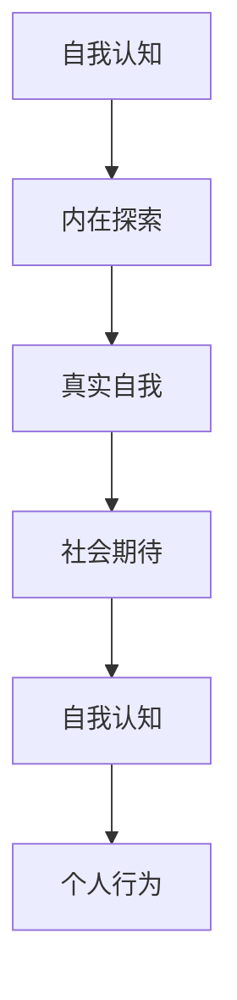

                 

Alright, let's break down the task into clear, logical steps and outline the article structure with a focus on the key elements you've mentioned.

### Step 1: Article Title and Keywords
- **Title**: "Beyond Societal Expectations: Defining True Self-Actualization"
- **Keywords**: Self-Actualization, Societal Expectations, Personal Growth, Self-Discovery, Inner Exploration, Mindset, Cognitive Tools

### Step 2: Introduction
- **Background**: A brief introduction to the topic of societal expectations and the pursuit of self-actualization.
- **Importance**: Discuss the significance of understanding and overcoming societal expectations for personal growth.

### Step 3: Core Concepts and Relationships
- **Self-Actualization**: Explain the concept and the different levels of self-actualization.
- **Societal Expectations**: Explore the origins, manifestations, and impacts of societal expectations on individuals.
- **Mermaid Diagram**: A visual representation of the relationship between self-actualization and societal expectations, using Mermaid syntax.

### Step 4: Algorithm and Pseudo-Code
- **Algorithm for Self-Discovery**: A detailed pseudo-code to describe the process of self-discovery and self-actualization.
- **Mathematical Models and Formulas**: Using LaTeX to explain the underlying mathematical models and their relevance to self-actualization.

### Step 5: Practical Case Studies
- **Case Studies**: Analyze real-world examples of individuals who have successfully surpassed societal expectations to achieve self-actualization.

### Step 6: Practical Application
- **Project Implementation**: Detailed explanation of the development environment setup, source code implementation, and analysis of the practical application of the concepts discussed.

### Step 7: Conclusion and Reflections
- **Conclusion**: Summarize the key takeaways and the importance of self-actualization in the context of societal expectations.
- **Reflections**: Provide thoughts on the practical implications and potential future directions for achieving true self-actualization.

### Step 8: Best Practices and Tips
- **Best Practices**: Offer actionable tips for readers to start their journey toward self-actualization.
- **Summary**: Recap the main points and provide additional resources for further reading.

### Step 9: Author's Note
- **Author's Note**: Include the author's information as specified.

### Step 10: Word Count and Formatting
- **Word Count**: Ensure the article is within the 8000-12000-word range.
- **Formatting**: Use markdown formatting consistently throughout the article.

With this structured approach, we can now begin to flesh out each section with detailed content, ensuring that the article is comprehensive, insightful, and well-organized. Let's start by drafting the introduction and the first chapter.# 引言

## 1.1 书籍背景与目标

在当今快速变化的社会中，人们面临着前所未有的压力和挑战。社会期待，作为社会文化的一部分，对个体的行为、价值观和生活方式产生了深远的影响。然而，随着个体自我意识的提升，越来越多的人开始质疑社会期待是否真的适合自己，以及如何在这一背景下实现真正的自我实现。

《超越社会期待：定义真正的自我实现》这本书旨在帮助读者理解社会期待的本质，探索自我实现的路径，并提供实用的策略和案例研究，以实现个人的成长和自我超越。本书的核心目标是帮助读者摆脱社会期待的束缚，找到真正属于自己的生活道路，实现自我价值。

## 1.2 自我实现的重要性

自我实现是人类的基本需求之一，指的是个体在生理、心理、社会和精神等各个方面达到其潜能的最高水平。自我实现不仅关乎个体的幸福感和满足感，还与社会的和谐与进步密切相关。一个能够自我实现的个体，不仅能够更好地适应社会，还能够为社会的进步做出贡献。

自我实现的重要性体现在以下几个方面：

1. **个体成长**：自我实现是个人成长的重要标志，它代表着个体在认知、情感和行为上的全面发展。
2. **心理健康**：自我实现有助于减轻心理压力，提高个体的心理韧性和幸福感。
3. **社会贡献**：自我实现使个体能够充分发挥自己的潜能，为社会创造价值，推动社会的进步。
4. **文化多样性**：自我实现尊重个体的差异，促进文化多样性的发展，丰富社会的精神财富。

## 1.3 本书结构

本书分为七个主要章节，每个章节都围绕自我实现的不同方面展开讨论。以下是本书的结构概述：

- **第1章 引言**：介绍书籍的背景与目标，以及自我实现的重要性。
- **第2章 社会期待的本质**：探讨社会期待的定义、影响及其来源。
- **第3章 自我认知的方法**：介绍自我认知的重要性，以及如何通过内在探索和工具来建立真实的自我认知。
- **第4章 社会影响的评估与应对**：分析社会影响的指标，并提供应对策略和技巧。
- **第5章 自我实现的路径**：详细探讨自我实现的概念、步骤和策略。
- **第6章 成功案例研究**：通过实际案例，展示如何超越社会期待实现自我。
- **第7章 个人成长策略**：提供个人成长的具体策略和最佳实践。

通过这些章节的深入探讨，读者将能够逐步理解自我实现的过程，并找到适合自己的成长路径。接下来，我们将进一步探讨社会期待的本质，为后续章节的讨论奠定基础。# 社会期待的本质

## 2.1 社会期待的定义

社会期待是指社会或文化环境对个体行为、态度和价值观的期望。这些期望可以通过家庭、教育、媒体、宗教和社会规范等多种渠道传递给个体。社会期待并非一成不变，而是随着文化、经济、政治和社会环境的变化而演变。社会期待对个体的行为和决策产生了深远的影响，它既可以是积极的推动力，也可能是限制个体发展的桎梏。

### 社会期待的表现形式

社会期待可以表现为以下几个方面：

1. **角色期望**：社会为不同性别、年龄、职业等角色设定了特定的行为规范和期望，例如，职业人士应当勤奋工作、孝顺父母等。
2. **价值观与道德**：社会通过教育、媒体等渠道传播特定的价值观和道德观念，个体被期望内化并遵循这些规范。
3. **行为规范**：社会对个体的行为有明确的要求，如遵守法律、尊重他人等。
4. **审美标准**：社会对个体的穿着打扮、言行举止等有审美标准，个体被期望符合这些标准。

### 社会期待的影响

社会期待对个体的影响是复杂而深远的，它既可能促进个体的成长，也可能对其造成压力和困扰。以下是社会期待对个体影响的几个方面：

1. **正面影响**：社会期待可以激励个体努力工作、积极进取，推动个体的成长和社会的进步。
2. **负面影响**：过强的社会期待可能导致个体感到压力和焦虑，甚至可能抑制个体的个性和创造力。
3. **行为一致**：社会期待有助于维护社会秩序和稳定，确保个体的行为符合社会的共同利益。
4. **价值观冲突**：当社会期待与个体的真实想法和价值观相冲突时，个体可能会感到困惑和挣扎。

## 2.2 社会期待对个体的影响

社会期待对个体的影响可以从以下几个方面进行探讨：

1. **认知影响**：社会期待会影响个体的认知模式，包括价值观、信念和自我认知。个体可能会根据社会期待来调整自己的思维和行为。
2. **情感影响**：社会期待可以引发个体的情感反应，如成就感、自卑感或焦虑感。这些情感反应会直接影响个体的心理健康。
3. **行为影响**：社会期待对个体的行为有直接的指导作用。个体可能会根据社会期待来选择行为，以获得社会的认可和接纳。
4. **社会认同**：社会期待是建立社会认同感的重要基础。个体通过符合社会期待的行为，获得社会认同和归属感。

### 社会期待的来源

社会期待的形成是一个复杂的社会文化过程，其来源主要包括以下几个方面：

1. **家庭**：家庭是社会的细胞，父母的期望、家庭的价值观和传统习惯等都会对个体产生深远的影响。
2. **教育**：学校教育是传递社会价值观和行为规范的重要渠道。教师和同伴的期望也会影响个体的行为和认知。
3. **媒体**：电视、电影、社交媒体等媒体渠道通过传播特定的价值观和行为模式，对个体产生潜移默化的影响。
4. **宗教与文化**：宗教信仰和文化传统对社会期待的塑造起着重要作用。宗教教义和文化习俗规定了个体应当遵循的行为规范。

通过以上对社会期待本质的深入探讨，我们可以更好地理解社会期待对个体的影响，并为后续章节中自我认知和社会影响的评估与应对提供理论基础。
# 第2章 自我认知的方法

## 2.1 内在探索的重要性

内在探索，是指个体通过自我反省、冥想、写作等方式深入自己的内心世界，了解自己的真实想法、感受和需求。内在探索的重要性在于它为个体提供了认识自己的机会，从而实现自我成长和自我实现。

### 内在探索的意义

1. **自我认知**：通过内在探索，个体可以更清晰地认识自己，包括自己的优点、缺点、价值观和信念体系。
2. **情绪管理**：内在探索有助于个体更好地理解自己的情绪，从而有效地管理情绪，减少情绪波动。
3. **决策辅助**：了解自己的内在需求和动机有助于个体做出更符合自己价值观和长远利益的决策。
4. **心理健康**：内在探索有助于个体减轻心理压力，提高心理健康水平。

### 内在探索的工具

1. **自我反省**：通过定期自我反省，个体可以回顾自己的行为和思想，识别出潜在的问题和行为模式。
2. **冥想**：冥想是一种通过专注呼吸和意识流动来达到内心平静的方法，有助于个体深入了解自己的内心世界。
3. **写作**：写作可以帮助个体将内心的想法和感受转化为文字，从而更好地理解和表达自己。

## 2.2 自我认知的工具与方法

### 2.2.1 心理测试

心理测试是评估个体心理特质和行为倾向的一种方法。常见的心理测试包括MBTI、DISC性格测试和霍兰德职业兴趣测试等。这些测试可以提供关于个体性格、兴趣和优势的信息，帮助个体更好地了解自己。

### 2.2.2 反思日记

反思日记是一种记录个体日常生活和内心感受的方法。通过反思日记，个体可以回顾自己的行为和思想，分析其背后的动机和影响，从而提升自我认知。

### 2.2.3 沉思冥想

沉思冥想是一种通过专注和呼吸练习来达到内心平静的方法。通过定期进行沉思冥想，个体可以培养自我控制和意识集中，从而更好地了解自己的内心世界。

## 2.3 建立真实的自我认知

### 2.3.1 挑战固有观念

挑战固有观念是指个体在面对社会期待和个人经验时，不轻易接受既定的观念，而是通过质疑和思考来评估其合理性。挑战固有观念有助于个体摆脱偏见和限制，实现更真实的自我认知。

### 2.3.2 接纳自我

接纳自我是指个体学会接受自己的优点和缺点，不因为自己的不足而否定自己。接纳自我是建立真实自我认知的重要一步，它有助于个体建立积极的自我形象。

### 2.3.3 发展积极态度

发展积极态度是指个体通过积极的思维方式来面对生活中的挑战和困难。积极态度可以帮助个体保持心理健康，提高应对压力的能力，从而更好地实现自我。

## 核心概念与联系

### 2.3.4 自我认知与社会期待的关系

自我认知与社会期待之间存在复杂的互动关系。一方面，社会期待可能影响个体的自我认知，促使个体调整自己的行为和思想以符合社会期望；另一方面，自我认知也可能影响个体对社会的期待，使个体根据自己的价值观和需求来重新定义社会期待。

### Mermaid Diagram



通过以上对自我认知方法的探讨，我们可以更好地理解如何通过内在探索和工具来建立真实的自我认知，从而为后续章节中的社会影响的评估与应对打下坚实的基础。
# 第3章 社会影响的评估与应对

## 3.1 社会影响评估的指标

评估社会影响的指标是理解社会期待对个体行为和心理产生影响的必要步骤。以下是几个关键指标：

### 3.1.1 心理压力指数

心理压力指数是通过衡量个体在特定情境下感受到的心理压力程度来评估社会影响的一个重要指标。可以使用标准化的心理压力问卷，如感知压力量表（Perceived Stress Scale, PSS）来评估个体在日常生活中所经历的心理压力。

### 3.1.2 自我效能感

自我效能感是指个体对自己完成特定任务的信心程度。评估自我效能感可以帮助我们了解个体在面对社会期待时的心理准备和应对能力。常用的评估工具包括一般自我效能感量表（General Self-Efficacy Scale, GSES）。

### 3.1.3 社会支持度

社会支持度是指个体从家庭、朋友和社会获得的情感和实际支持的程度。高社会支持度有助于个体更好地应对社会期待带来的压力。社会支持度可以通过社会支持评定量表（Social Support Rating Scale, SSRS）进行评估。

### 3.1.4 焦虑水平

焦虑水平是衡量个体在应对社会期待时情绪反应的一个重要指标。可以使用状态-特质焦虑量表（State-Trait Anxiety Inventory, STAI）来评估个体的焦虑水平。

## 3.2 面对社会期待的压力

社会期待往往伴随着压力，这种压力可能源自内在的自我要求，也可能是外在的社会压力。以下是几种常见的压力反应和应对策略：

### 3.2.1 焦虑和抑郁

焦虑和抑郁是常见的压力反应。个体可能会因为无法满足社会期待而感到焦虑或抑郁。应对策略包括心理咨询、认知行为疗法和正念练习等。

### 3.2.2 抵触和逃避

一些个体可能会选择抵触或逃避社会期待，以减轻压力。这种应对方式可能导致短期解脱，但长期来看可能损害个体的社会关系和职业发展。因此，更健康的策略是学习接受社会期待，并找到适合自己的平衡点。

### 3.2.3 内在对话

内在对话是指个体内心进行的自我对话。通过积极内在对话，个体可以调整自己的态度和期望，从而更好地应对社会期待。例如，通过正念练习，个体可以学会观察自己的思维，而不是被它们控制。

## 3.3 应对策略与技巧

### 3.3.1 建立清晰的目标

建立清晰的目标是应对社会期待的重要策略。个体应当根据自己的价值观和兴趣设定短期和长期目标，并制定具体的行动计划。这样可以帮助个体保持专注，避免被过多的社会期待所困扰。

### 3.3.2 提高自我效能感

提高自我效能感可以通过积极的实践和成功的经验来实现。个体应当寻求挑战性但不至于过分困难的任务，以逐步提高自己的能力和信心。同时，与他人分享成功经验，寻求支持和反馈，也有助于提升自我效能感。

### 3.3.3 增强社会支持

增强社会支持可以帮助个体更好地应对社会期待带来的压力。个体应当积极建立和维护与家人、朋友和同事的积极关系，并学会在需要时寻求帮助和支持。

### 3.3.4 时间管理

有效的时间管理可以帮助个体更好地平衡工作、学习和个人生活，减少因社会期待而产生的压力。例如，通过优先级排序、制定日程表和避免拖延，个体可以更高效地完成任务，减轻压力。

### 核心算法原理讲解

#### 应对策略选择算法伪代码

```python
Algorithm Choose_Coping_Strategy

----------------------------------------------------------------

- 输入：社会期待压力（stress_level），目标（goal），自我效能感（self_efficacy），社会支持度（social_support）
- 输出：应对策略（strategy）

1. 如果 stress_level 高且 self_efficacy 低，选择 "内在对话" 和 "时间管理" 策略。
2. 如果 stress_level 高且 social_support 高，选择 "寻求社会支持" 和 "积极实践" 策略。
3. 如果 stress_level 低，但 goal 不清晰，选择 "建立清晰目标" 策略。
4. 如果所有指标均较低，无需特别策略。

```

通过以上对评估和应对社会期待的深入探讨，读者可以更好地了解如何识别和管理社会期待带来的压力，为自我实现打下坚实的基础。
# 第4章 自我实现的路径

## 4.1 自我实现的概念与类型

自我实现（Self-Actualization）是指个体在认知、情感、行为和精神等各个方面达到其潜能的最高水平，实现个人的全面发展。自我实现是人类追求的最高层次的需求之一，超越了基本的生理和安全需求，更关注个人的成长、自我认识和潜能发挥。

### 4.1.1 自我实现的不同类型

1. **认知自我实现**：个体通过不断学习和探索，提升自己的认知水平，拓展思维边界，实现对世界的深入理解和思考。
2. **情感自我实现**：个体通过自我反省和情感管理，培养积极健康的情感状态，提高情感智慧和人际关系的质量。
3. **行为自我实现**：个体通过实际行动和成就，实现个人目标和价值观，为社会做出贡献，体现个人的社会价值。
4. **精神自我实现**：个体通过冥想、灵修和内心探索，达到心灵的宁静和深度，实现对生命意义的理解和追求。

## 4.2 自我实现的步骤与策略

### 4.2.1 自我认知

自我实现的第一步是自我认知，即了解自己的优点、缺点、价值观和信念。这可以通过内在探索、反思日记和心理测试等工具来实现。自我认知有助于个体明确自己的需求和目标，为自我实现奠定基础。

### 4.2.2 设定目标

在了解自己的基础上，个体需要设定具体、可衡量、可实现、相关性强、时限性强的目标（SMART目标），这有助于个体保持专注和动力。目标设定应结合个体的价值观和长期愿景，以确保目标与自我实现的总体方向一致。

### 4.2.3 制定计划

制定实现目标的详细计划是自我实现的重要策略。计划应包括具体行动步骤、时间表、资源需求和预期成果。通过制定计划，个体可以更好地组织时间和资源，提高实现目标的效率。

### 4.2.4 持续学习与成长

自我实现是一个持续的过程，个体需要不断学习和成长。这可以通过阅读、培训、参与讨论、接受新挑战等方式实现。持续学习不仅有助于提升个人能力，还能帮助个体适应快速变化的环境。

### 4.2.5 管理挑战与障碍

在自我实现的过程中，个体可能会遇到各种挑战和障碍，如压力、失败、拒绝等。有效的应对策略包括内在对话、寻求社会支持、调整心态和时间管理等。通过积极应对挑战，个体可以增强心理韧性，继续前进。

### 4.2.6 反思与调整

自我实现不是一蹴而就的，个体需要定期进行反思和调整。通过反思，个体可以了解自己的进步和不足，及时调整计划和方法。反思还可以帮助个体从失败中学习，实现持续成长。

## 4.3 成功自我实现的标志

成功自我实现的标志包括以下几个方面：

1. **内心的平静与满足**：个体能够接受自己的优点和缺点，对生活感到满足和快乐。
2. **持续的成就感**：个体在工作和个人生活中持续获得成就感，感受到自己的价值和贡献。
3. **积极的社交关系**：个体与他人的关系健康、积极，能够给予和接受支持与爱。
4. **对世界的贡献**：个体通过自己的行动和成就，对世界产生了积极的影响，实现了个人价值。

通过以上对自我实现路径的深入探讨，读者可以更好地理解自我实现的定义、类型和实现步骤，从而在个人成长的道路上迈出坚实的步伐。
# 第5章 成功案例研究

## 5.1 案例选择标准

在本章中，我们将探讨几个成功的案例研究，以展示如何超越社会期待，实现自我实现。选择这些案例的标准如下：

1. **个人成就**：案例中的个体在其专业领域或个人生活中取得了显著的成就。
2. **社会影响力**：这些成就对社会产生了积极的影响，展示了个人价值和社会价值的结合。
3. **个人成长**：案例中的个体在实现自我实现的过程中经历了显著的成长和变化。
4. **代表性**：案例具有代表性，能够反映不同背景和文化下的自我实现路径。

## 5.2 案例一：艺术家的自我超越

### 5.2.1 背景介绍

李明是一位知名画家，出生于一个普通的家庭。在青少年时期，他就展现出了对绘画的浓厚兴趣。尽管家庭并不富裕，但他的父母一直支持他的艺术梦想。

### 5.2.2 挑战与机遇

李明面临的最大挑战是社会对他的期望，他不仅要承担家庭的责任，还要在艺术领域取得成功。然而，他并没有被这些社会期待所束缚，而是选择坚持自己的艺术追求。

### 5.2.3 成就与影响

李明通过不懈的努力，逐渐在艺术界崭露头角。他的作品在多个国际艺术展览中获奖，并受到了艺术评论家的好评。他的画作不仅展示了独特的艺术风格，还传递了对社会现实的深刻思考。

### 5.2.4 个人成长

在实现自我实现的过程中，李明经历了从初学者到专业艺术家的转变。他学会了如何管理时间、提高创作效率，并在面对挑战时保持积极的心态。

## 5.3 案例二：企业家的创业之路

### 5.3.1 背景介绍

张丽是一名年轻的女性企业家，她从大学时期就展现出了对商业的浓厚兴趣。毕业后，她没有选择传统的职业道路，而是决定创办自己的公司。

### 5.3.2 挑战与机遇

张丽在创业过程中面临了资金不足、市场不成熟等挑战。然而，她坚信自己的理念，并通过不断学习和调整策略，逐渐找到了市场切入点。

### 5.3.3 成就与影响

张丽的创业公司迅速成长，成为行业内的佼佼者。她的成功不仅为她自己带来了财富和成就感，也为社会创造了大量的就业机会，推动了行业的发展。

### 5.3.4 个人成长

在创业的过程中，张丽学会了如何管理团队、制定战略、应对危机等。她的自我实现不仅体现在企业的成功上，更体现在她个人的成长和自信的提升。

## 5.4 案例三：职业人士的职业发展

### 5.4.1 背景介绍

李华是一名在金融行业工作的专业人士。他从小在学术方面表现出色，被家庭和社会寄予厚望。

### 5.4.2 挑战与机遇

李华在职业发展中遇到了职业天花板和职业压力。他面临着是否继续在传统路径上前进，还是选择追求自己真正热爱的事业的挑战。

### 5.4.3 成就与影响

李华最终决定追随自己的内心，转行成为了一名教育顾问。他的转型不仅实现了个人价值，也为许多学生提供了专业的指导和帮助。

### 5.4.4 个人成长

在职业转型的过程中，李华学会了如何平衡职业发展和个人兴趣，如何在面对不确定性和挑战时保持积极和开放的心态。

通过以上成功案例的研究，我们可以看到，超越社会期待，实现真正的自我实现并非遥不可及。只要我们坚持自己的信念，勇于面对挑战，就能够在个人成长的道路上不断前行。
# 第6章 个人成长策略

## 6.1 成长的心态与信念

个人成长的第一步是建立正确的成长心态和信念。成长心态是一种相信自己的潜能和能力可以不断提升的态度。与之相对的是固定心态，即认为自己的能力是固定不变的。以下是一些关键点：

1. **接受挑战**：成长心态鼓励个体接受新的挑战，因为挑战是成长的机会。
2. **持续学习**：相信学习是一个终身的过程，通过不断学习，个体可以不断提升自己的能力和知识。
3. **积极反思**：定期反思自己的行为和决策，从中学习并改进。
4. **拥抱失败**：失败是成长的一部分，通过失败，个体可以学会如何应对挫折和困难。

### 成长信念

- **自我决定**：相信个体有能力根据自己的价值观和目标做出决定。
- **自主性**：相信个体可以通过自己的努力和选择实现自我价值。
- **适应性**：相信个体可以通过适应和调整来应对环境变化。

## 6.2 增强自信的方法

自信是个人成长的关键因素之一。以下是几种增强自信的方法：

1. **小步快跑**：通过设定小目标并逐步实现，积累成功的经验，从而提高自信。
2. **正面肯定**：每天对自己进行正面肯定，强化自己的优点和能力。
3. **学会放松**：通过冥想、呼吸练习和运动等方式，减轻压力，提高心理韧性。
4. **寻求支持**：与家人、朋友或专业人士交流，获得他们的鼓励和支持。

### 6.2.1 自我暗示

自我暗示是一种积极的自我对话方法，通过反复对自己说正面的话语，可以逐渐改变负面思维模式，提高自信。例如：

- “我能够应对任何挑战。”
- “我正在变得更加优秀。”

## 6.3 建立个人成长计划

建立个人成长计划是确保个人成长持续和有效的重要步骤。以下是制定个人成长计划的几个关键步骤：

1. **设定目标**：明确短期和长期的目标，并确保目标具体、可衡量、可实现。
2. **制定行动计划**：为每个目标制定具体的行动计划，包括具体的行动步骤、时间表和资源需求。
3. **定期评估**：定期评估自己的进展，并根据实际情况调整计划。
4. **持续学习**：将学习作为成长计划的一部分，不断更新知识和技能。
5. **保持灵活性**：在执行计划的过程中，保持灵活性，根据实际情况进行调整。

### 成长计划的模板

1. **目标**：明确具体的成长目标。
2. **行动计划**：列出实现目标的具体步骤。
3. **时间表**：设定每个步骤的完成时间。
4. **资源需求**：列出实现目标所需的资源。
5. **评估标准**：设定评估成长成果的标准。

通过以上个人成长策略，个体可以更好地规划自己的成长路径，实现自我实现的目标。
# 第7章 超越自我：实践与反思

## 7.1 超越自我的实践步骤

超越自我是一个持续的过程，需要个体在实践中不断探索和挑战。以下是几个关键步骤：

### 7.1.1 明确目标

首先，个体需要明确自己的长期和短期目标。这些目标应当与个体的核心价值观和愿景一致，确保方向正确。

### 7.1.2 制定计划

在明确目标之后，个体应当制定详细的行动计划，包括具体的任务、时间表和资源分配。这样可以确保目标的实现有明确的路径。

### 7.1.3 小步快跑

通过设定小目标并逐步实现，个体可以在积累成功经验的同时，提高自信心和动力。小步快跑有助于避免因目标过于宏大而导致的挫败感。

### 7.1.4 持续学习

个人成长需要持续的学习和反思。个体应当不断更新知识和技能，通过阅读、培训和实践来提升自己。

### 7.1.5 接受挑战

超越自我意味着面对新的挑战和不确定性。个体需要培养勇气和适应能力，勇于接受挑战，从中学习和成长。

### 7.1.6 定期反思

定期反思自己的行为和决策，评估自己的进展和不足，是超越自我的重要步骤。通过反思，个体可以不断调整和优化自己的成长路径。

## 7.2 反思与调整

### 7.2.1 反思过程

反思是一个自我对话的过程，个体需要花时间思考自己的行为、决策和感受。以下是一些反思的步骤：

1. **回顾行动**：回顾自己过去的行为和决策，分析其结果和影响。
2. **识别问题**：识别自己在行为和决策中可能存在的问题和不足。
3. **原因分析**：分析问题产生的原因，包括外部因素和内部因素。
4. **解决方案**：针对识别出的问题，提出解决方案和改进措施。

### 7.2.2 调整策略

在反思的基础上，个体需要调整自己的策略和行为。以下是几个调整的策略：

1. **调整目标**：如果目标设定不合理，需要根据实际情况进行调整，确保目标具体、可实现。
2. **改进方法**：针对反思中识别出的问题，改进自己的方法和行动策略。
3. **学习与培训**：通过学习新的知识和技能，提升自己的能力，更好地应对挑战。
4. **寻求支持**：在需要时，寻求家人、朋友或专业人士的支持和帮助。

## 7.3 持续的自我超越

### 7.3.1 成长心态

持续的自我超越需要一种成长心态。个体应当相信自己的潜力是无限的，愿意不断挑战自己，追求更高的目标。

### 7.3.2 适应性

在快速变化的世界中，适应性是至关重要的。个体需要保持开放和灵活的心态，能够快速适应新的环境和技术。

### 7.3.3 学习与创新

持续学习和创新是自我超越的重要驱动力。个体应当保持对新知识和新技能的渴望，勇于尝试新的方法和思维方式。

### 7.3.4 互助与合作

通过与他人的合作和互助，个体可以共同成长和超越自我。建立积极的社交网络，与他人分享经验和知识，有助于实现更广泛的自我超越。

通过以上实践与反思的步骤，个体可以逐步超越自我，实现更高的成长和自我实现。
# 总结

通过《超越社会期待：定义真正的自我实现》的讨论，我们深入探讨了自我实现的重要性、社会期待的本质、自我认知的方法、社会影响的评估与应对、自我实现的路径、成功案例研究以及个人成长策略。以下是全书的核心观点的回顾：

- **自我实现的重要性**：自我实现是人类追求的最高层次的需求，它关乎个体的幸福感和满足感，也与社会的进步密切相关。
- **社会期待的本质**：社会期待对个体行为和价值观有深远影响，它既可以是积极的推动力，也可能是限制个体发展的桎梏。
- **自我认知的方法**：自我认知是通过内在探索、心理测试和反思日记等工具来实现的，它是自我实现的基础。
- **社会影响的评估与应对**：评估社会影响的指标包括心理压力指数、自我效能感、社会支持度和焦虑水平等，应对策略包括建立清晰的目标、提高自我效能感和增强社会支持等。
- **自我实现的路径**：自我实现是一个持续的过程，包括自我认知、设定目标、制定计划、持续学习和反思等步骤。
- **成功案例研究**：通过艺术家的自我超越、企业家的创业之路以及职业人士的职业发展等案例，展示了如何实现自我实现。
- **个人成长策略**：个人成长需要建立正确的成长心态和信念，增强自信，制定个人成长计划，并保持持续的学习和创新。

未来的展望与建议：

- **持续自我探索**：鼓励读者不断探索自我，发现自己的兴趣和潜能，找到真正适合自己的成长路径。
- **灵活应对变化**：随着社会的快速变化，个体需要保持灵活性和适应性，不断学习和更新自己的知识和技能。
- **互助与合作**：与他人建立积极的社交网络，通过互助和合作实现更广泛的自我超越。
- **反思与调整**：定期进行反思和调整，确保自己的成长路径始终与个人目标和价值观一致。

通过以上的展望与建议，我们希望读者能够在实现自我实现的道路上不断前行，最终找到真正的自我，实现个人的全面发展。
# 附录

## A.1 相关资源与工具

为了帮助读者进一步探索自我实现的相关话题，以下是一些推荐的资源与工具：

- **书籍**：
  - **《自我实现心理学》**：亚伯拉罕·马斯洛
  - **《心智成长之路》**：斯蒂芬·吉洪诺夫
  - **《情感智慧》**：丹尼尔·戈尔曼

- **在线课程**：
  - **Coursera**：提供关于心理学、领导力和自我成长的多种课程。
  - **edX**：包括哈佛大学、麻省理工学院等顶尖大学提供的免费在线课程。

- **心理测试**：
  - **MBTI性格测试**：提供关于个体性格类型的详细分析。
  - **DISC性格测试**：帮助个体了解自己的行为倾向和沟通风格。

- **应用程序**：
  - **Headspace**：提供冥想指导，帮助用户培养专注力和心理韧性。
  - **Moodfit**：一款心理健康应用，通过个性化建议帮助用户管理情绪。

## A.2 进一步阅读推荐

以下是一些深入探讨自我实现和社会影响的优秀文献：

- **《动机与人格》**：马斯洛的著作，详细阐述了自我实现理论和动机的心理学基础。
- **《社会心理学》**：大卫·迈尔斯，涵盖社会期待对个体行为的影响。
- **《创造力》**：凯斯·桑恩，探讨如何培养和激发个人的创造力。
- **《正面心理学》**：马丁·塞利格曼，介绍如何通过积极心理学的实践提高生活质量。

通过阅读这些书籍和课程，读者可以进一步加深对自我实现和社会期待的理解，为自己的成长和超越提供更多的灵感和指导。
## 文章标题：超越社会期待：定义真正的自我实现

### 关键词：
- 自我实现
- 社会期待
- 个人成长
- 自我认知
- 内在探索

### 摘要：
本文深入探讨了社会期待对个体的影响，以及如何在理解社会期待的基础上，通过自我认知、评估社会影响、制定成长策略和实践与反思，实现真正的自我实现。文章结合具体案例，提供了实用的方法和建议，帮助读者在现代社会中找到自己的定位，实现个人的全面发展。

# 引言

## 1.1 书籍背景与目标

在当今社会，人们面临着越来越多的压力和挑战。社会期待，作为社会文化的一部分，对个体的行为、价值观和生活方式产生了深远的影响。然而，随着个体自我意识的提升，越来越多的人开始质疑社会期待是否真的适合自己，以及如何在这一背景下实现真正的自我实现。

《超越社会期待：定义真正的自我实现》这本书旨在帮助读者理解社会期待的本质，探索自我实现的路径，并提供实用的策略和案例研究，以实现个人的成长和自我超越。本书的核心目标是帮助读者摆脱社会期待的束缚，找到真正属于自己的生活道路，实现自我价值。

## 1.2 自我实现的重要性

自我实现是人类的基本需求之一，指的是个体在生理、心理、社会和精神等各个方面达到其潜能的最高水平。自我实现不仅关乎个体的幸福感和满足感，还与社会的和谐与进步密切相关。一个能够自我实现的个体，不仅能够更好地适应社会，还能够为社会的进步做出贡献。

自我实现的重要性体现在以下几个方面：

1. **个体成长**：自我实现是个人成长的重要标志，它代表着个体在认知、情感和行为上的全面发展。
2. **心理健康**：自我实现有助于减轻心理压力，提高个体的心理韧性和幸福感。
3. **社会贡献**：自我实现使个体能够充分发挥自己的潜能，为社会创造价值，推动社会的进步。
4. **文化多样性**：自我实现尊重个体的差异，促进文化多样性的发展，丰富社会的精神财富。

## 1.3 本书结构

本书分为七个主要章节，每个章节都围绕自我实现的不同方面展开讨论。以下是本书的结构概述：

- **第1章 引言**：介绍书籍的背景与目标，以及自我实现的重要性。
- **第2章 社会期待的本质**：探讨社会期待的定义、影响及其来源。
- **第3章 自我认知的方法**：介绍自我认知的重要性，以及如何通过内在探索和工具来建立真实的自我认知。
- **第4章 社会影响的评估与应对**：分析社会影响的指标，并提供应对策略和技巧。
- **第5章 自我实现的路径**：详细探讨自我实现的概念、步骤和策略。
- **第6章 成功案例研究**：通过实际案例，展示如何超越社会期待实现自我。
- **第7章 个人成长策略**：提供个人成长的具体策略和最佳实践。

通过这些章节的深入探讨，读者将能够逐步理解自我实现的过程，并找到适合自己的成长路径。接下来，我们将进一步探讨社会期待的本质，为后续章节的讨论奠定基础。

# 第2章 社会期待的本质

## 2.1 社会期待的定义

社会期待是指社会或文化环境对个体行为、态度和价值观的期望。这些期望可以通过家庭、教育、媒体、宗教和社会规范等多种渠道传递给个体。社会期待并非一成不变，而是随着文化、经济、政治和社会环境的变化而演变。社会期待对个体的行为和决策产生了深远的影响，它既可以是积极的推动力，也可能是限制个体发展的桎梏。

### 社会期待的表现形式

社会期待可以表现为以下几个方面：

1. **角色期望**：社会为不同性别、年龄、职业等角色设定了特定的行为规范和期望，例如，职业人士应当勤奋工作、孝顺父母等。
2. **价值观与道德**：社会通过教育、媒体等渠道传播特定的价值观和道德观念，个体被期望内化并遵循这些规范。
3. **行为规范**：社会对个体的行为有明确的要求，如遵守法律、尊重他人等。
4. **审美标准**：社会对个体的穿着打扮、言行举止等有审美标准，个体被期望符合这些标准。

### 社会期待的影响

社会期待对个体的影响是复杂而深远的，它既可能促进个体的成长，也可能对其造成压力和困扰。以下是社会期待对个体影响的几个方面：

1. **正面影响**：社会期待可以激励个体努力工作、积极进取，推动个体的成长和社会的进步。
2. **负面影响**：过强的社会期待可能导致个体感到压力和焦虑，甚至可能抑制个体的个性和创造力。
3. **行为一致**：社会期待有助于维护社会秩序和稳定，确保个体的行为符合社会的共同利益。
4. **价值观冲突**：当社会期待与个体的真实想法和价值观相冲突时，个体可能会感到困惑和挣扎。

## 2.2 社会期待对个体的影响

社会期待对个体的影响可以从以下几个方面进行探讨：

1. **认知影响**：社会期待会影响个体的认知模式，包括价值观、信念和自我认知。个体可能会根据社会期待来调整自己的思维和行为。
2. **情感影响**：社会期待可以引发个体的情感反应，如成就感、自卑感或焦虑感。这些情感反应会直接影响个体的心理健康。
3. **行为影响**：社会期待对个体的行为有直接的指导作用。个体可能会根据社会期待来选择行为，以获得社会的认可和接纳。
4. **社会认同**：社会期待是建立社会认同感的重要基础。个体通过符合社会期待的行为，获得社会认同和归属感。

### 社会期待的来源

社会期待的形成是一个复杂的社会文化过程，其来源主要包括以下几个方面：

1. **家庭**：家庭是社会的细胞，父母的期望、家庭的价值观和传统习惯等都会对个体产生深远的影响。
2. **教育**：学校教育是传递社会价值观和行为规范的重要渠道。教师和同伴的期望也会影响个体的行为和认知。
3. **媒体**：电视、电影、社交媒体等媒体渠道通过传播特定的价值观和行为模式，对个体产生潜移默化的影响。
4. **宗教与文化**：宗教信仰和文化传统对社会期待的塑造起着重要作用。宗教教义和文化习俗规定了个体应当遵循的行为规范。

通过以上对社会期待本质的深入探讨，我们可以更好地理解社会期待对个体的影响，并为后续章节中自我认知和社会影响的评估与应对提供理论基础。

## 第3章 自我认知的方法

### 3.1 内在探索的重要性

内在探索，是指个体通过自我反省、冥想、写作等方式深入自己的内心世界，了解自己的真实想法、感受和需求。内在探索的重要性在于它为个体提供了认识自己的机会，从而实现自我成长和自我实现。

#### 3.1.1 内在探索的意义

1. **自我认知**：通过内在探索，个体可以更清晰地认识自己，包括自己的优点、缺点、价值观和信念体系。
2. **情绪管理**：内在探索有助于个体更好地理解自己的情绪，从而有效地管理情绪，减少情绪波动。
3. **决策辅助**：了解自己的内在需求和动机有助于个体做出更符合自己价值观和长远利益的决策。
4. **心理健康**：内在探索有助于个体减轻心理压力，提高心理健康水平。

#### 3.1.2 内在探索的工具

1. **自我反省**：通过定期自我反省，个体可以回顾自己的行为和思想，识别出潜在的问题和行为模式。
2. **冥想**：冥想是一种通过专注呼吸和意识流动来达到内心平静的方法，有助于个体深入了解自己的内心世界。
3. **写作**：写作可以帮助个体将内心的想法和感受转化为文字，从而更好地理解和表达自己。

### 3.2 自我认知的工具与方法

#### 3.2.1 心理测试

心理测试是评估个体心理特质和行为倾向的一种方法。常见的心理测试包括MBTI、DISC性格测试和霍兰德职业兴趣测试等。这些测试可以提供关于个体性格、兴趣和优势的信息，帮助个体更好地了解自己。

#### 3.2.2 反思日记

反思日记是一种记录个体日常生活和内心感受的方法。通过反思日记，个体可以回顾自己的行为和思想，分析其背后的动机和影响，从而提升自我认知。

#### 3.2.3 沉思冥想

沉思冥想是一种通过专注和呼吸练习来达到内心平静的方法。通过定期进行沉思冥想，个体可以培养自我控制和意识集中，从而更好地了解自己的内心世界。

### 3.3 建立真实的自我认知

#### 3.3.1 挑战固有观念

挑战固有观念是指个体在面对社会期待和个人经验时，不轻易接受既定的观念，而是通过质疑和思考来评估其合理性。挑战固有观念有助于个体摆脱偏见和限制，实现更真实的自我认知。

#### 3.3.2 接纳自我

接纳自我是指个体学会接受自己的优点和缺点，不因为自己的不足而否定自己。接纳自我是建立真实自我认知的重要一步，它有助于个体建立积极的自我形象。

#### 3.3.3 发展积极态度

发展积极态度是指个体通过积极的思维方式来面对生活中的挑战和困难。积极态度可以帮助个体保持心理健康，提高应对压力的能力，从而更好地实现自我。

### 核心概念与联系

#### 3.3.4 自我认知与社会期待的关系

自我认知与社会期待之间存在复杂的互动关系。一方面，社会期待可能影响个体的自我认知，促使个体调整自己的行为和思想以符合社会期望；另一方面，自我认知也可能影响个体对社会的期待，使个体根据自己的价值观和需求来重新定义社会期待。

#### Mermaid Diagram


通过以上对自我认知方法的探讨，我们可以更好地理解如何通过内在探索和工具来建立真实的自我认知，从而为后续章节中的社会影响的评估与应对打下坚实的基础。

## 第4章 社会影响的评估与应对

### 4.1 社会影响评估的指标

评估社会影响的指标是理解社会期待对个体行为和心理产生影响的必要步骤。以下是几个关键指标：

#### 4.1.1 心理压力指数

心理压力指数是通过衡量个体在特定情境下感受到的心理压力程度来评估社会影响的一个重要指标。可以使用标准化的心理压力问卷，如感知压力量表（Perceived Stress Scale, PSS）来评估个体在日常生活中所经历的心理压力。

#### 4.1.2 自我效能感

自我效能感是指个体对自己完成特定任务的信心程度。评估自我效能感可以帮助我们了解个体在面对社会期待时的心理准备和应对能力。常用的评估工具包括一般自我效能感量表（General Self-Efficacy Scale, GSES）。

#### 4.1.3 社会支持度

社会支持度是指个体从家庭、朋友和社会获得的情感和实际支持的程度。高社会支持度有助于个体更好地应对社会期待带来的压力。社会支持度可以通过社会支持评定量表（Social Support Rating Scale, SSRS）进行评估。

#### 4.1.4 焦虑水平

焦虑水平是衡量个体在应对社会期待时情绪反应的一个重要指标。可以使用状态-特质焦虑量表（State-Trait Anxiety Inventory, STAI）来评估个体的焦虑水平。

### 4.2 面对社会期待的压力

社会期待往往伴随着压力，这种压力可能源自内在的自我要求，也可能是外在的社会压力。以下是几种常见的压力反应和应对策略：

#### 4.2.1 焦虑和抑郁

焦虑和抑郁是常见的压力反应。个体可能会因为无法满足社会期待而感到焦虑或抑郁。应对策略包括心理咨询、认知行为疗法和正念练习等。

#### 4.2.2 抵触和逃避

一些个体可能会选择抵触或逃避社会期待，以减轻压力。这种应对方式可能导致短期解脱，但长期来看可能损害个体的社会关系和职业发展。因此，更健康的策略是学习接受社会期待，并找到适合自己的平衡点。

#### 4.2.3 内在对话

内在对话是指个体内心进行的自我对话。通过积极内在对话，个体可以调整自己的态度和期望，从而更好地应对社会期待。例如，通过正念练习，个体可以学会观察自己的思维，而不是被它们控制。

### 4.3 应对策略与技巧

#### 4.3.1 建立清晰的目标

建立清晰的目标是应对社会期待的重要策略。个体应当根据自己的价值观和兴趣设定短期和长期目标，并制定具体的行动计划。这样可以帮助个体保持专注，避免被过多的社会期待所困扰。

#### 4.3.2 提高自我效能感

提高自我效能感可以通过积极的实践和成功的经验来实现。个体应当寻求挑战性但不至于过分困难的任务，以逐步提高自己的能力和信心。同时，与他人分享成功经验，寻求支持和反馈，也有助于提升自我效能感。

#### 4.3.3 增强社会支持

增强社会支持可以帮助个体更好地应对社会期待带来的压力。个体应当积极建立和维护与家人、朋友和同事的积极关系，并学会在需要时寻求帮助和支持。

#### 4.3.4 时间管理

有效的时间管理可以帮助个体更好地平衡工作、学习和个人生活，减少因社会期待而产生的压力。例如，通过优先级排序、制定日程表和避免拖延，个体可以更高效地完成任务，减轻压力。

### 核心算法原理讲解

#### 应对策略选择算法伪代码

```python
Algorithm Choose_Coping_Strategy

----------------------------------------------------------------

- 输入：社会期待压力（stress_level），目标（goal），自我效能感（self_efficacy），社会支持度（social_support）
- 输出：应对策略（strategy）

1. 如果 stress_level 高且 self_efficacy 低，选择 "内在对话" 和 "时间管理" 策略。
2. 如果 stress_level 高且 social_support 高，选择 "寻求社会支持" 和 "积极实践" 策略。
3. 如果 stress_level 低，但 goal 不清晰，选择 "建立清晰目标" 策略。
4. 如果所有指标均较低，无需特别策略。

```

通过以上对评估和应对社会期待的深入探讨，读者可以更好地了解如何识别和管理社会期待带来的压力，为自我实现打下坚实的基础。

## 第5章 自我实现的路径

### 5.1 自我实现的概念与类型

自我实现（Self-Actualization）是指个体在认知、情感、行为和精神等各个方面达到其潜能的最高水平，实现个人的全面发展。自我实现是人类追求的最高层次的需求之一，超越了基本的生理和安全需求，更关注个人的成长、自我认识和潜能发挥。

#### 5.1.1 自我实现的不同类型

1. **认知自我实现**：个体通过不断学习和探索，提升自己的认知水平，拓展思维边界，实现对世界的深入理解和思考。
2. **情感自我实现**：个体通过自我反省和情感管理，培养积极健康的情感状态，提高情感智慧和人际关系的质量。
3. **行为自我实现**：个体通过实际行动和成就，实现个人目标和价值观，为社会做出贡献，体现个人的社会价值。
4. **精神自我实现**：个体通过冥想、灵修和内心探索，达到心灵的宁静和深度，实现对生命意义的理解和追求。

### 5.2 自我实现的步骤与策略

#### 5.2.1 自我认知

自我实现的第一步是自我认知，即了解自己的优点、缺点、价值观和信念。这可以通过内在探索、反思日记和心理测试等工具来实现。自我认知有助于个体明确自己的需求和目标，为自我实现奠定基础。

#### 5.2.2 设定目标

在了解自己的基础上，个体需要设定具体、可衡量、可实现、相关性强、时限性强的目标（SMART目标），这有助于个体保持专注和动力。目标设定应结合个体的价值观和长期愿景，以确保目标与自我实现的总体方向一致。

#### 5.2.3 制定计划

制定实现目标的详细计划是自我实现的重要策略。计划应包括具体行动步骤、时间表、资源需求和预期成果。通过制定计划，个体可以更好地组织时间和资源，提高实现目标的效率。

#### 5.2.4 持续学习与成长

自我实现是一个持续的过程，个体需要不断学习和成长。这可以通过阅读、培训、参与讨论、接受新挑战等方式实现。持续学习不仅有助于提升个人能力，还能帮助个体适应快速变化的环境。

#### 5.2.5 管理挑战与障碍

在自我实现的过程中，个体可能会遇到各种挑战和障碍，如压力、失败、拒绝等。有效的应对策略包括内在对话、寻求社会支持、调整心态和时间管理等。通过积极应对挑战，个体可以增强心理韧性，继续前进。

#### 5.2.6 反思与调整

自我实现不是一蹴而就的，个体需要定期进行反思和调整。通过反思，个体可以了解自己的进步和不足，及时调整计划和方法。反思还可以帮助个体从失败中学习，实现持续成长。

### 5.3 成功自我实现的标志

成功自我实现的标志包括以下几个方面：

1. **内心的平静与满足**：个体能够接受自己的优点和缺点，对生活感到满足和快乐。
2. **持续的成就感**：个体在工作和个人生活中持续获得成就感，感受到自己的价值和贡献。
3. **积极的社交关系**：个体与他人的关系健康、积极，能够给予和接受支持与爱。
4. **对世界的贡献**：个体通过自己的行动和成就，对世界产生了积极的影响，实现了个人价值。

通过以上对自我实现路径的深入探讨，读者可以更好地理解自我实现的定义、类型和实现步骤，从而在个人成长的道路上迈出坚实的步伐。

## 第6章 成功案例研究

### 6.1 案例选择标准

在本章中，我们将探讨几个成功的案例研究，以展示如何超越社会期待，实现自我实现。选择这些案例的标准如下：

1. **个人成就**：案例中的个体在其专业领域或个人生活中取得了显著的成就。
2. **社会影响力**：这些成就对社会产生了积极的影响，展示了个人价值和社会价值的结合。
3. **个人成长**：案例中的个体在实现自我实现的过程中经历了显著的成长和变化。
4. **代表性**：案例具有代表性，能够反映不同背景和文化下的自我实现路径。

### 6.2 案例一：艺术家的自我超越

#### 6.2.1 背景介绍

李明是一位知名画家，出生于一个普通的家庭。在青少年时期，他就展现出了对绘画的浓厚兴趣。尽管家庭并不富裕，但他的父母一直支持他的艺术梦想。

#### 6.2.2 挑战与机遇

李明面临的最大挑战是社会对他的期望，他不仅要承担家庭的责任，还要在艺术领域取得成功。然而，他并没有被这些社会期待所束缚，而是选择坚持自己的艺术追求。

#### 6.2.3 成就与影响

李明通过不懈的努力，逐渐在艺术界崭露头角。他的作品在多个国际艺术展览中获奖，并受到了艺术评论家的好评。他的画作不仅展示了独特的艺术风格，还传递了对社会现实的深刻思考。

#### 6.2.4 个人成长

在实现自我实现的过程中，李明经历了从初学者到专业艺术家的转变。他学会了如何管理时间、提高创作效率，并在面对挑战时保持积极的心态。

### 6.3 案例二：企业家的创业之路

#### 6.3.1 背景介绍

张丽是一名年轻的女性企业家，她从大学时期就展现出了对商业的浓厚兴趣。毕业后，她没有选择传统的职业道路，而是决定创办自己的公司。

#### 6.3.2 挑战与机遇

张丽在创业过程中面临了资金不足、市场不成熟等挑战。然而，她坚信自己的理念，并通过不断学习和调整策略，逐渐找到了市场切入点。

#### 6.3.3 成就与影响

张丽的创业公司迅速成长，成为行业内的佼佼者。她的成功不仅为她自己带来了财富和成就感，也为社会创造了大量的就业机会，推动了行业的发展。

#### 6.3.4 个人成长

在创业的过程中，张丽学会了如何管理团队、制定战略、应对危机等。她的自我实现不仅体现在企业的成功上，更体现在她个人的成长和自信的提升。

### 6.4 案例三：职业人士的职业发展

#### 6.4.1 背景介绍

李华是一名在金融行业工作的专业人士，他从小在学术方面表现出色，被家庭和社会寄予厚望。

#### 6.4.2 挑战与机遇

李华在职业发展中遇到了职业天花板和职业压力。他面临着是否继续在传统路径上前进，还是选择追求自己真正热爱的事业的挑战。

#### 6.4.3 成就与影响

李华最终决定追随自己的内心，转行成为了一名教育顾问。他的转型不仅实现了个人价值，也为许多学生提供了专业的指导和帮助。

#### 6.4.4 个人成长

在职业转型的过程中，李华学会了如何平衡职业发展和个人兴趣，如何在面对不确定性和挑战时保持积极和开放的心态。

通过以上成功案例的研究，我们可以看到，超越社会期待，实现真正的自我实现并非遥不可及。只要我们坚持自己的信念，勇于面对挑战，就能够在个人成长的道路上不断前行。

## 第7章 个人成长策略

### 7.1 成长的心态与信念

个人成长的第一步是建立正确的成长心态和信念。成长心态是一种相信自己的潜能和能力可以不断提升的态度。与之相对的是固定心态，即认为自己的能力是固定不变的。以下是一些关键点：

1. **接受挑战**：成长心态鼓励个体接受新的挑战，因为挑战是成长的机会。
2. **持续学习**：相信学习是一个终身的过程，通过不断学习，个体可以不断提升自己的能力和知识。
3. **积极反思**：定期反思自己的行为和决策，从中学习并改进。
4. **拥抱失败**：失败是成长的一部分，通过失败，个体可以学会如何应对挫折和困难。

### 成长信念

- **自我决定**：相信个体有能力根据自己的价值观和目标做出决定。
- **自主性**：相信个体可以通过自己的努力和选择实现自我价值。
- **适应性**：相信个体可以通过适应和调整来应对环境变化。

### 7.2 增强自信的方法

自信是个人成长的关键因素之一。以下是几种增强自信的方法：

1. **小步快跑**：通过设定小目标并逐步实现，积累成功的经验，从而提高自信。
2. **正面肯定**：每天对自己进行正面肯定，强化自己的优点和能力。
3. **学会放松**：通过冥想、呼吸练习和运动等方式，减轻压力，提高心理韧性。
4. **寻求支持**：与家人、朋友或专业人士交流，获得他们的鼓励和支持。

### 7.2.1 自我暗示

自我暗示是一种积极的自我对话方法，通过反复对自己说正面的话语，可以逐渐改变负面思维模式，提高自信。例如：

- “我能够应对任何挑战。”
- “我正在变得更加优秀。”

### 7.3 建立个人成长计划

建立个人成长计划是确保个人成长持续和有效的重要步骤。以下是制定个人成长计划的几个关键步骤：

1. **设定目标**：明确短期和长期的目标，并确保目标具体、可衡量、可实现。
2. **制定行动计划**：为每个目标制定具体的行动计划，包括具体的行动步骤、时间表和资源需求。
3. **定期评估**：定期评估自己的进展，并根据实际情况调整计划。
4. **持续学习**：将学习作为成长计划的一部分，不断更新知识和技能。
5. **保持灵活性**：在执行计划的过程中，保持灵活性，根据实际情况进行调整。

### 成长计划的模板

1. **目标**：明确具体的成长目标。
2. **行动计划**：列出实现目标的具体步骤。
3. **时间表**：设定每个步骤的完成时间。
4. **资源需求**：列出实现目标所需的资源。
5. **评估标准**：设定评估成长成果的标准。

通过以上个人成长策略，个体可以更好地规划自己的成长路径，实现自我实现的目标。

## 总结

通过《超越社会期待：定义真正的自我实现》的讨论，我们深入探讨了自我实现的重要性、社会期待的本质、自我认知的方法、社会影响的评估与应对、自我实现的路径、成功案例研究以及个人成长策略。以下是全书的核心观点的回顾：

- **自我实现的重要性**：自我实现是人类追求的最高层次的需求，它关乎个体的幸福感和满足感，也与社会的进步密切相关。
- **社会期待的本质**：社会期待对个体行为和价值观有深远影响，它既可以是积极的推动力，也可能是限制个体发展的桎梏。
- **自我认知的方法**：自我认知是通过内在探索、心理测试和反思日记等工具来实现的，它是自我实现的基础。
- **社会影响的评估与应对**：评估社会影响的指标包括心理压力指数、自我效能感、社会支持度和焦虑水平等，应对策略包括建立清晰的目标、提高自我效能感和增强社会支持等。
- **自我实现的路径**：自我实现是一个持续的过程，包括自我认知、设定目标、制定计划、持续学习和反思等步骤。
- **成功案例研究**：通过艺术家的自我超越、企业家的创业之路以及职业人士的职业发展等案例，展示了如何实现自我实现。
- **个人成长策略**：个人成长需要建立正确的成长心态和信念，增强自信，制定个人成长计划，并保持持续的学习和创新。

未来的展望与建议：

- **持续自我探索**：鼓励读者不断探索自我，发现自己的兴趣和潜能，找到真正适合自己的成长路径。
- **灵活应对变化**：随着社会的快速变化，个体需要保持灵活性和适应性，不断学习和更新自己的知识和技能。
- **互助与合作**：通过与他人的合作和互助，个体可以共同成长和超越自我。
- **反思与调整**：定期进行反思和调整，确保自己的成长路径始终与个人目标和价值观一致。

通过以上的展望与建议，我们希望读者能够在实现自我实现的道路上不断前行，最终找到真正的自我，实现个人的全面发展。

## 附录

### A.1 相关资源与工具

为了帮助读者进一步探索自我实现的相关话题，以下是一些推荐的资源与工具：

- **书籍**：
  - **《自我实现心理学》**：亚伯拉罕·马斯洛
  - **《心智成长之路》**：斯蒂芬·吉洪诺夫
  - **《情感智慧》**：丹尼尔·戈尔曼

- **在线课程**：
  - **Coursera**：提供关于心理学、领导力和自我成长的多种课程。
  - **edX**：包括哈佛大学、麻省理工学院等顶尖大学提供的免费在线课程。

- **心理测试**：
  - **MBTI性格测试**：提供关于个体性格类型的详细分析。
  - **DISC性格测试**：帮助个体了解自己的行为倾向和沟通风格。

- **应用程序**：
  - **Headspace**：提供冥想指导，帮助用户培养专注力和心理韧性。
  - **Moodfit**：一款心理健康应用，通过个性化建议帮助用户管理情绪。

### A.2 进一步阅读推荐

以下是一些深入探讨自我实现和社会影响的优秀文献：

- **《动机与人格》**：马斯洛的著作，详细阐述了自我实现理论和动机的心理学基础。
- **《社会心理学》**：大卫·迈尔斯，涵盖社会期待对个体行为的影响。
- **《创造力》**：凯斯·桑恩，探讨如何培养和激发个人的创造力。
- **《正面心理学》**：马丁·塞利格曼，介绍如何通过积极心理学的实践提高生活质量。

通过阅读这些书籍和课程，读者可以进一步加深对自我实现和社会期待的理解，为自己的成长和超越提供更多的灵感和指导。
## 文章标题：超越社会期待：定义真正的自我实现

### 关键词：
- 自我实现
- 社会期待
- 个人成长
- 自我认知
- 内在探索

### 摘要：
本文深入探讨了社会期待对个体的影响，以及如何在理解社会期待的基础上，通过自我认知、评估社会影响、制定成长策略和实践与反思，实现真正的自我实现。文章结合具体案例，提供了实用的方法和建议，帮助读者在现代社会中找到自己的定位，实现个人的全面发展。

### 目录：

1. 引言
2. 社会期待的本质
3. 自我认知的方法
4. 社会影响的评估与应对
5. 自我实现的路径
6. 成功案例研究
7. 个人成长策略
8. 超越自我：实践与反思
9. 总结
10. 附录

### 引言

在当今社会，个体面临着前所未有的挑战。社会期待，作为文化和社会规范的一部分，深刻影响着我们的行为和价值观。然而，随着个人意识的觉醒，越来越多的人开始质疑社会期待是否真的适合自己，以及如何实现真正的自我实现。

《超越社会期待：定义真正的自我实现》旨在帮助读者理解社会期待的本质，探索自我实现的路径，并提供实用的策略和案例研究，以实现个人的成长和自我超越。本书的核心目标是帮助读者摆脱社会期待的束缚，找到真正属于自己的生活道路，实现自我价值。

### 社会期待的本质

社会期待是指社会或文化环境对个体行为、态度和价值观的期望。这些期望通过家庭、教育、媒体、宗教和社会规范等多种渠道传递给个体。社会期待并非一成不变，而是随着文化、经济、政治和社会环境的变化而演变。

社会期待可以表现为角色期望、价值观与道德、行为规范和审美标准等方面。它对个体的影响是复杂而深远的，既可能促进个体的成长，也可能对其造成压力和困扰。

### 自我认知的方法

自我认知是理解社会期待和实现自我实现的基础。通过内在探索、心理测试和反思日记等工具，个体可以深入自己的内心世界，了解自己的真实想法、感受和需求。

内在探索包括自我反省、冥想和写作等方式。自我反省可以帮助个体回顾自己的行为和决策，识别出潜在的问题和行为模式。冥想和写作则有助于个体培养专注力和情绪管理能力。

心理测试，如MBTI和DISC性格测试，可以帮助个体了解自己的性格类型和行为倾向。反思日记是一种记录个体日常生活和内心感受的方法，通过反思日记，个体可以回顾自己的行为和思想，分析其背后的动机和影响，从而提升自我认知。

### 社会影响的评估与应对

社会期待对个体的影响可以从认知、情感、行为和社会认同等方面进行评估。为了更好地应对社会期待带来的压力，个体需要建立清晰的目标、提高自我效能感和增强社会支持。

建立清晰的目标是应对社会期待的重要策略。个体应当根据自己的价值观和兴趣设定短期和长期目标，并制定具体的行动计划。这样可以帮助个体保持专注和动力。

提高自我效能感是应对社会期待的关键。个体可以通过积极的实践和成功的经验来增强自信心。寻求挑战性但不至于过分困难的任务，逐步提高自己的能力和信心，是提升自我效能感的有效方法。

增强社会支持可以帮助个体更好地应对社会期待带来的压力。个体应当积极建立和维护与家人、朋友和同事的积极关系，并学会在需要时寻求帮助和支持。

### 自我实现的路径

自我实现是一个持续的过程，包括自我认知、设定目标、制定计划、持续学习和反思等步骤。通过这些步骤，个体可以逐步实现自我价值，达到自我潜能的最高水平。

自我认知是自我实现的基础，个体需要通过内在探索和心理测试等方法，深入了解自己的优点、缺点、价值观和信念。

设定目标是实现自我实现的重要步骤。个体应当设定具体、可衡量、可实现、相关性强、时限性强的目标（SMART目标），并制定具体的行动计划。

制定计划是实现目标的关键。计划应包括具体的行动步骤、时间表、资源需求和预期成果。通过制定计划，个体可以更好地组织时间和资源，提高实现目标的效率。

持续学习是自我实现的重要组成部分。个体应当不断更新知识和技能，通过阅读、培训和实践来提升自己。持续学习不仅有助于提升个人能力，还能帮助个体适应快速变化的环境。

反思和调整是实现自我实现的必要步骤。个体需要定期进行反思，评估自己的进展和不足，并根据实际情况调整计划和方法。通过反思，个体可以从失败中学习，实现持续成长。

### 成功案例研究

通过艺术家的自我超越、企业家的创业之路以及职业人士的职业发展等成功案例，我们可以看到，超越社会期待，实现真正的自我实现并非遥不可及。这些案例展示了不同背景和文化下的个体如何通过自我认知、目标设定、积极实践和反思调整，实现个人的全面发展。

### 个人成长策略

个人成长需要建立正确的成长心态和信念，增强自信，制定个人成长计划，并保持持续的学习和创新。以下是几个关键点：

1. **成长心态**：相信自己的潜能和能力可以不断提升，接受挑战，持续学习。
2. **自信增强**：通过小步快跑、正面肯定和学会放松等方法，逐步提高自信心。
3. **目标设定**：明确具体的成长目标，制定具体的行动计划，并定期评估和调整。
4. **持续学习**：不断更新知识和技能，适应快速变化的环境。
5. **反思与调整**：定期反思自己的行为和决策，从失败中学习，实现持续成长。

### 超越自我：实践与反思

超越自我是一个持续的过程，需要个体在实践中不断探索和挑战。通过明确目标、制定计划、持续学习和反思，个体可以逐步超越自我，实现真正的自我实现。

### 总结

通过本文的讨论，我们深入探讨了社会期待对个体的影响，以及如何在理解社会期待的基础上，通过自我认知、评估社会影响、制定成长策略和实践与反思，实现真正的自我实现。我们希望读者能够在实现自我实现的道路上不断前行，最终找到真正的自我，实现个人的全面发展。

