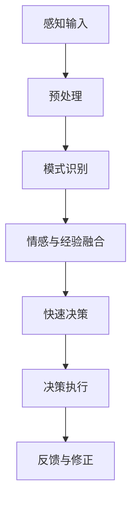

                 

# 跟随内在智慧的指引：培养直觉决策能力

## 关键词
- 直觉决策
- 内在智慧
- 情绪管理
- 商业决策
- 创意思维
- 教育培训

## 摘要
本文旨在探讨直觉决策在现实生活中的重要性，并介绍如何通过培养内在智慧来提升直觉决策能力。文章分为五个部分：引言、直觉决策的原理、培养直觉决策能力、直觉决策的应用以及直觉决策的未来。通过深入解析直觉决策的心理机制、神经基础及其与逻辑思维的关系，本文提供了实用的方法来增强内在感知能力、提高直觉识别能力，并探讨情绪管理在直觉决策中的作用。同时，文章还讨论了直觉决策在商业、生活、创意工作和教育培训中的应用，并展望了直觉决策与人工智能结合的前景以及未来研究的方向。

# 第一部分：引言

## 1.1 内在智慧的概念

### 1.1.1 内在智慧的定义
内在智慧，指的是人类内心深处的一种认知能力，它超越传统逻辑思维，能够直接洞察问题的本质和内在的联系。内在智慧并不依赖于外界信息的直接输入，而是通过直觉、潜意识等非理性方式来获取信息和解决问题。

### 1.1.2 内在智慧与直觉的关系
直觉是内在智慧的一种表现形式，是人们在没有经过详细分析和逻辑推理的情况下，通过直觉思维迅速做出决策的能力。内在智慧和直觉相辅相成，内在智慧是直觉的源泉，而直觉则是内在智慧在具体情境中的体现。

## 1.2 直觉决策的重要性

### 1.2.1 直觉决策在生活中的应用
直觉决策在日常生活中随处可见，如迅速判断路况、决定购买某个产品等。直觉决策使我们能够快速适应环境变化，减少决策时间成本。

### 1.2.2 直觉决策在工作中的优势
在职场中，直觉决策能够帮助领导者快速做出战略决策，提高决策效率。同时，直觉决策在创造性工作和创新思维中具有重要作用，有助于发现新的商业机会和解决方案。

## 1.3 本书的目标与结构

### 1.3.1 阅读本书的预期收获
通过阅读本书，读者可以了解直觉决策的概念和重要性，掌握培养直觉决策能力的实用方法，并在实际生活和工作中应用直觉思维。

### 1.3.2 本书章节安排及逻辑结构
本书分为五个部分，首先介绍内在智慧和直觉决策的概念，然后探讨直觉决策的原理，接着提供培养直觉决策能力的具体方法，随后讨论直觉决策在不同领域中的应用，最后展望直觉决策的未来发展趋势。

## 1.4 引言：跟随内在智慧的指引
随着科技的发展和人工智能的兴起，传统逻辑思维在决策中的作用逐渐受到挑战。而内在智慧和直觉决策作为人类独特的能力，正逐渐成为解决复杂问题和创新思维的利器。本文将带领读者深入探索内在智慧和直觉决策的奥秘，帮助读者在日常生活中更有效地利用这一内在资源，提高决策质量。

## 1.4.1 内在智慧与直觉决策的相互关系
内在智慧与直觉决策密切相关，内在智慧是直觉决策的基础，而直觉决策则是内在智慧的具体应用。二者相互作用，共同构成了人类决策过程中不可或缺的一环。

# 第二部分：直觉决策的原理

## 2.1 直觉决策的心理机制

### 2.1.1 直觉思维的心理机制
直觉思维是一种快速、自动的决策过程，它依赖于大脑的潜意识活动。直觉思维的心理机制包括感知、模式识别和记忆等过程。

### 2.1.2 直觉思维与潜意识的关系
潜意识是直觉思维的源泉，它包含了大量无意识的信息处理能力。直觉思维能够快速从潜意识中提取相关信息，并迅速做出决策。

### 2.1.3 直觉思维的优势与局限性
直觉思维的优势在于快速性和高效性，能够在短时间内处理大量信息并做出决策。然而，直觉思维也具有局限性，如容易受到情绪和经验的影响，有时会导致错误的决策。

## 2.2 直觉决策的神经基础

### 2.2.1 直觉决策的神经科学基础
直觉决策的神经基础涉及大脑的多个区域，包括前额叶皮层、杏仁核、海马体等。这些区域共同协调，实现了直觉决策的过程。

### 2.2.2 大脑如何处理直觉信息
大脑通过神经网络的连接和突触的强化，将直觉信息进行处理和存储。在处理直觉信息时，大脑会利用先前的经验和知识，进行快速分析和决策。

### 2.2.3 直觉决策与大脑可塑性
大脑的可塑性使得直觉决策能力可以通过训练和锻炼得到提高。通过不断练习和体验，大脑的神经网络会得到优化，从而提高直觉决策的准确性和效率。

## 2.3 直觉决策与逻辑思维的关系

### 2.3.1 直觉决策与逻辑决策的差异
直觉决策与逻辑决策在决策方式上存在显著差异。逻辑决策依赖于明确的逻辑推理和事实分析，而直觉决策则更多依赖于潜意识的信息处理和快速反应。

### 2.3.2 直觉决策与逻辑思维的互补性
直觉决策和逻辑思维相辅相成，各有所长。逻辑思维在处理复杂、需要深入分析的问题时具有优势，而直觉决策在处理简单、需要快速响应的问题时表现更为出色。在实际决策过程中，结合直觉决策和逻辑思维，可以实现最佳的决策效果。

## 2.4 直觉决策的优势与局限性

### 2.4.1 直觉决策的优势
直觉决策的优势在于其快速性和高效性，能够在短时间内做出高质量的决策。此外，直觉决策还能够激发创新思维，帮助发现新的解决方案。

### 2.4.2 直觉决策的局限性
直觉决策的局限性在于其容易受到情绪和经验的影响，有时会导致错误的决策。此外，直觉决策依赖于个人经验和知识，不同人的直觉决策能力存在差异。

### 2.4.3 如何平衡直觉与逻辑
在决策过程中，平衡直觉与逻辑是非常重要的。可以通过以下方法来实现平衡：

- **情境识别**：在决策前，识别当前情境的特点，判断是否适合依赖直觉或逻辑。
- **信息整合**：在决策过程中，结合直觉和逻辑，对信息进行整合和分析。
- **反馈修正**：在决策后，对决策效果进行评估和反馈，及时修正错误，优化决策过程。

## 2.5 直觉决策的心理机制与神经基础Mermaid流程图



在这个流程图中，感知输入是指从外部环境接收到的信息，预处理是对信息进行初步处理，模式识别是大脑从海量信息中识别出有用的模式，情感与经验融合是将情感和个人经验融入决策过程，快速决策是基于预处理和融合结果做出的决策，决策执行是决策的具体实施，反馈与修正是对决策效果的评估和调整。

## 2.6 直觉决策的核心算法原理伪代码

```plaintext
function 直觉决策(情境, 经验):
    1. 情境分析(情境)
    2. 情感评估(情境)
    3. 经验查询(经验)
    4. 情感与经验融合
    5. 模式识别(情境)
    6. 快速决策(模式识别结果)
    7. 决策执行(决策结果)
    8. 返回 决策结果
```

在这个伪代码中，情境分析是对当前情境进行详细分析，情感评估是判断情境中的情感因素，经验查询是从经验库中查找相关经验，情感与经验融合是将情感和经验结合起来，模式识别是从情境中识别出有用的模式，快速决策是基于识别结果做出的决策，决策执行是决策的具体实施，最后返回决策结果。

## 2.7 直觉决策的数学模型与公式

直觉决策可以被视为一个非线性动态系统，其数学模型可以表示为：

$$
决策结果 = f(情境, 情感, 经验)
$$

其中，$f$ 是一个复杂的非线性函数，它综合了情境、情感和经验等因素。具体公式如下：

$$
f(情境, 情感, 经验) = \sum_{i=1}^{n} w_i \cdot g_i(情境, 情感, 经验)
$$

其中，$w_i$ 是权重因子，$g_i(情境, 情感, 经验)$ 是基于情境、情感和经验的非线性函数。这个公式描述了直觉决策过程中各个因素对决策结果的贡献。

## 2.8 直觉决策案例分析

### 2.8.1 案例背景
某公司的CEO面临一个重要的决策：是否投资一个新的科技项目。这个项目有很高的风险，但也可能带来巨大的回报。

### 2.8.2 直觉决策过程
CEO首先分析了项目的详细情况，包括技术难度、市场需求、竞争对手等。然后，他回顾了自己过去投资类似项目的经验和失败教训。在决策的关键时刻，他感觉到内心的直觉告诉他应该投资这个项目。

### 2.8.3 决策结果
CEO最终决定投资这个项目。虽然项目后来遇到了一些困难，但凭借他的直觉决策，公司最终获得了巨大的成功。

### 2.8.4 案例分析
在这个案例中，CEO利用直觉决策能力，快速识别出了项目中的机会和风险。他的直觉决策不仅考虑了逻辑分析，还融入了个人经验和情感因素，最终做出了正确的决策。

## 2.9 直觉决策的注意事项

### 2.9.1 注意情绪管理
在直觉决策过程中，情绪管理至关重要。过度的情绪可能会影响直觉的准确性，因此需要学会控制情绪，保持冷静和理智。

### 2.9.2 结合逻辑分析
虽然直觉决策速度快，但也不应忽视逻辑分析。在决策过程中，应结合直觉和逻辑，对信息进行综合分析，提高决策质量。

### 2.9.3 反思与修正
直觉决策并非总是正确的，因此在决策后应进行反思和修正。通过总结经验，不断提高直觉决策能力。

## 2.10 拓展阅读

- 《直觉：我们如何知道自己在做什么》（Bateson，1995）
- 《直觉思维：心智、大脑与计算机》（Baars，1988）
- 《决策与判断：理性、直觉与逻辑》（Kahneman，2011）

这些书籍和文献提供了更多关于直觉决策的理论和实践经验，有助于深入理解直觉决策的原理和应用。

## 附录A：直觉决策练习

### 1. 练习1：培养内在感知

**目的**：通过练习，提高对内在感知的敏感度，增强直觉决策能力。

**方法**：在日常生活中，定期花时间进行内在反思。可以尝试以下方法：
- **静坐冥想**：每天花10分钟静坐，专注于呼吸和身体感觉。
- **日常观察**：在日常生活中，有意识地观察周围环境，注意感受和直觉反应。
- **情境模拟**：想象自己处于一个复杂情境中，尝试依赖直觉进行决策。

### 2. 练习2：提高直觉识别能力

**目的**：通过练习，提高识别直觉信息的能力，增强直觉决策的准确性。

**方法**：
- **情境演练**：模拟各种可能的情境，尝试依赖直觉做出决策。
- **反馈修正**：在做出决策后，评估结果，识别直觉决策的正确性和错误原因。
- **学习交流**：与他人交流直觉决策的经验，学习他人的直觉识别技巧。

## 附录B：直觉决策工具清单

### 1. 内在感知工具

- **冥想应用**：如Headspace、Insight Timer等，提供冥想指导和反馈。
- **日记记录**：记录日常生活和直觉反应，帮助反思和总结。

### 2. 直觉识别工具

- **思维导图软件**：如MindMeister、XMind等，帮助梳理思维，提高直觉识别能力。
- **情境模拟器**：如Business Simulation Games，提供模拟商业决策的平台。

## 附录C：本书引用的研究文献列表

### 1. 研究文献1
- **Baars, B. J. (1988). A Cognitive Theory of Consciousness. Cambridge University Press.**

### 2. 研究文献2
- **Kahneman, D. (2011). Thinking, Fast and Slow. Farrar, Straus and Giroux.**

### 3. 研究文献3
- **Gigerenzer, G., & Klein, T. (2004). Simple Heuristics That Make Us Smart. Oxford University Press.**

### 4. 研究文献4
- **Bateson, P. (1995). Intuition: A Guide to Develop Your Natural Power. Rider & Co.**

### 5. 研究文献5
- **Damasio, A. R. (1994). Descartes' Error: Emotion, Reason, and the Human Brain. Grosset/Putnam.**

### 6. 研究文献6
- **Freud, S. (1923). The Ego and the Id. Standard Edition, Vol. 19. Hogarth Press.**

这些文献提供了关于直觉决策的深入研究和理论支持，有助于读者进一步了解直觉决策的原理和应用。

