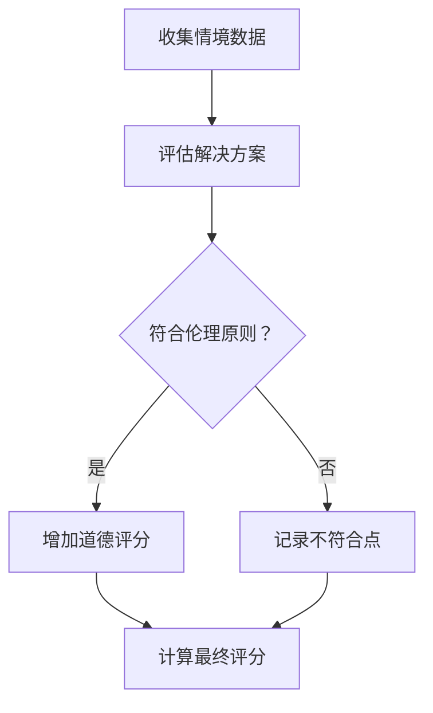

                 

### 文章标题

# 跨人类伦理学研究所成立：技术进化中的道德教育机构

> 关键词：跨人类伦理学、技术进化、道德教育、机构成立

> 摘要：本文深入探讨了跨人类伦理学研究所的成立背景及其在技术进化背景下的道德教育机构的重要性。通过对技术进化对道德教育影响的剖析，本文明确了跨人类伦理学研究所的核心概念与理论框架，并探讨了其实践模式与未来展望。文章旨在为读者提供一个全面而深刻的理解，以应对技术进化带来的伦理挑战。

### 引言

随着人工智能、机器人技术、生物工程等前沿科技的迅猛发展，人类社会正经历着前所未有的技术变革。这些技术不仅改变了人们的生活方式，还在深刻影响着伦理观念和道德教育。在这个技术快速进化的大背景下，传统道德教育模式面临着诸多挑战。因此，设立一个专注于跨人类伦理学的研究机构显得尤为必要。

跨人类伦理学研究所的成立，旨在为应对技术进化带来的伦理困境提供理论支持和实践指导。该研究所不仅关注人类与人工智能的互动，还探索机器人伦理、生物伦理等跨学科领域。通过系统地研究跨人类伦理学，该研究所致力于培养具备技术道德素养的人才，为社会的可持续发展提供保障。

本文将按照以下结构展开讨论：

1. **背景与定义**：介绍跨人类伦理学的核心概念，探讨技术进化对道德教育的影响，以及当前道德教育机构的历史与现状。
2. **核心概念与理论**：详细阐述道德教育的核心概念、技术伦理学的理论框架以及跨人类伦理学的理论基础。
3. **道德教育实践**：分析道德教育机构的运营模式、课程设计与教学方法，以及教育技术工具的应用。
4. **未来展望**：预测技术进化对道德教育的影响，探讨道德教育机构的未来发展，以及跨人类伦理学面临的挑战与机遇。

通过这一结构化的讨论，本文旨在为跨人类伦理学研究所的成立提供有力的理论支持和实践借鉴。接下来，我们将深入探讨跨人类伦理学的概念及其重要性。

### 背景与定义

#### 1. 跨人类伦理学概述

跨人类伦理学是一门跨学科的研究领域，旨在探讨人类与人工智能、机器人等非人类实体之间的伦理关系。这一概念的出现，源于技术进化带来的深远影响，特别是在人工智能和机器人技术日益普及的背景下。传统的伦理学研究主要集中在人与人之间的关系，而跨人类伦理学则将研究范围扩展到人类与人工智能等非人类实体之间。

**核心概念与联系**

跨人类伦理学的核心概念包括但不限于：

- **人工智能伦理**：研究人工智能的设计、应用及其对人类伦理和社会的影响。
- **机器人伦理**：探讨机器人在社会中的应用及其引发的伦理问题。
- **生物伦理**：涉及生物工程、基因编辑等领域的伦理问题。

这些核心概念相互关联，共同构成了跨人类伦理学的研究框架。例如，人工智能伦理与机器人伦理密切相关，因为许多机器人都是基于人工智能技术开发的。同样，生物伦理与技术进化也息息相关，随着基因编辑等技术的发展，生物伦理问题日益突出。

**关键定义**

- **跨人类伦理学**：指研究人类与非人类实体（如人工智能、机器人等）之间伦理关系的一门学科。
- **人工智能伦理**：研究人工智能系统在设计和应用过程中应遵循的伦理原则和规范。
- **机器人伦理**：探讨机器人技术在社会中的应用及其引发的伦理问题。
- **生物伦理**：涉及生物工程、基因编辑等领域的伦理问题。

**历史背景**

跨人类伦理学的概念虽然近年来才引起广泛关注，但其历史可以追溯到20世纪末和21世纪初。随着人工智能和机器人技术的快速发展，学术界开始关注这些技术对伦理和社会的影响。2000年代初，一些学者提出了人工智能伦理和机器人伦理的概念，并开始进行相关研究。2010年代，随着人工智能和机器人技术的进一步普及，跨人类伦理学逐渐成为一门独立的研究领域。

在这个背景下，跨人类伦理学的研究不仅关注技术本身，还涉及社会、法律和哲学等多个方面。例如，研究人员探讨了人工智能和机器人在医疗、交通、军事等领域的应用，分析了这些应用可能带来的伦理问题，并提出相应的解决方案。

综上所述，跨人类伦理学作为一门新兴的跨学科研究领域，正逐渐成为学术界和社会关注的焦点。通过系统地研究人类与非人类实体之间的伦理关系，跨人类伦理学为解决技术进化带来的伦理困境提供了新的思路和方向。

#### 2. 技术进化对道德教育的影响

随着技术的迅猛发展，道德教育面临着前所未有的挑战和机遇。技术进化不仅改变了人们的生活方式和行为模式，也对道德教育的内容、方式和目标产生了深远的影响。

**技术进化概述**

技术进化指的是技术从低级向高级不断发展的过程。这一过程不仅包括硬件技术的进步，如计算机性能的提升、通信网络的扩展，还包括软件技术的创新，如人工智能算法的优化、大数据处理技术的发展。技术进化改变了信息的获取和传播方式，使得人类社会进入了一个信息爆炸、知识更新速度极快的时代。

**影响分析**

技术进化对道德教育的影响主要体现在以下几个方面：

1. **内容变化**：随着技术的进步，道德教育的内容需要不断更新。例如，传统道德教育更多地关注人与人之间的关系，而现代道德教育则需要涉及人工智能、机器人、网络空间等新兴领域。这些领域涉及到新的伦理问题和道德挑战，如隐私保护、数据安全、人工智能的道德决策等。

2. **教育方式**：技术进化为道德教育提供了新的教育方式。传统的道德教育依赖于课堂教学和书本知识，而现代道德教育可以利用互联网、虚拟现实、游戏等新媒体技术进行互动式教学，提高学生的参与度和学习效果。

3. **目标调整**：技术进化要求道德教育的目标更加全面。除了培养道德观念和价值观，现代道德教育还需要培养学生的技术素养，包括对技术的理解和应用能力，以及在使用技术时遵守道德规范的能力。

**案例研究**

为了更好地理解技术进化对道德教育的影响，我们可以通过实际案例进行分析。

1. **人工智能伦理教育**：随着人工智能技术的广泛应用，人工智能伦理教育成为一个热门话题。例如，一些高校开设了人工智能伦理课程，旨在帮助学生了解人工智能的基本原理和应用，并探讨其可能带来的伦理问题。这些课程通常包括案例分析、伦理辩论、实践项目等，使学生能够深入理解人工智能技术的伦理影响，并学会如何在实际应用中遵守道德规范。

2. **网络道德教育**：随着互联网的普及，网络道德教育成为道德教育的重要组成部分。例如，一些学校通过网络课程、在线讨论等方式，教育学生如何正确使用互联网，保护个人隐私，避免网络欺凌等。这些教育措施不仅提高了学生的网络素养，也增强了他们的道德意识和责任感。

3. **机器人伦理教育**：机器人技术在医疗、服务、教育等领域的应用日益广泛，机器人伦理教育也变得越来越重要。例如，一些学校开设了机器人伦理课程，探讨机器人设计、应用过程中的伦理问题，如机器人的自主决策、机器人对人类的影响等。这些课程旨在培养学生的机器人伦理意识，使其在设计和使用机器人时能够遵循道德原则。

通过这些案例可以看出，技术进化对道德教育产生了深远的影响。为了应对这些影响，道德教育需要不断调整和更新，以适应时代的变化。这不仅要求教育工作者具备前沿的技术知识和伦理观念，还需要建立系统的道德教育体系，为社会培养具备道德素养和科技素养的全面发展人才。

#### 3. 道德教育机构的历史与现状

道德教育机构作为培养社会成员道德素养的重要场所，其历史可以追溯到古代的教育形式。然而，随着社会的发展和技术进步，道德教育机构经历了多次重大变革，逐步形成了当前多元化和综合性的教育模式。

**历史演变**

1. **古代教育模式**：在古代，道德教育通常由家庭和宗教机构承担。例如，中国古代的儒家教育强调“仁、义、礼、智、信”的道德教育，西方的基督教教育则强调信仰和善行。这些教育形式注重道德规范的传授和品德的培养，但教育内容和方式较为单一。

2. **中世纪教育模式**：中世纪时期，随着宗教影响力的扩大，道德教育更多地由教堂和修道院承担。这一时期的教育强调信仰和虔诚，道德教育内容以宗教教义为主。

3. **近代教育模式**：近代以来，随着工业革命和资本主义的发展，教育逐渐从宗教领域独立出来，成为国家和社会的重要组成部分。道德教育开始纳入学校教育体系，教育内容不仅包括宗教教义，还增加了世俗道德教育，如爱国主义、社会责任感等。

4. **现代教育模式**：现代社会，道德教育机构的发展更加多元化。除了学校教育，还有社区教育、网络教育等多种形式。教育内容不仅涵盖传统的道德规范，还涉及到现代科技、全球化、环境保护等新兴领域。

**现状分析**

当前，道德教育机构面临着一系列挑战和机遇：

1. **挑战**：
   - **技术挑战**：随着人工智能、大数据等技术的广泛应用，道德教育需要不断更新内容和方法，以应对技术进化带来的伦理困境。
   - **社会挑战**：现代社会价值观的多元化和社会道德水平的降低，使得道德教育面临更大的压力。如何有效传递道德价值观，培养具有道德判断力和责任感的公民，成为道德教育机构的重要任务。
   - **资源挑战**：道德教育资源的分配不均，尤其是在经济欠发达地区，道德教育机构的设施和师资力量相对薄弱。

2. **机遇**：
   - **技术机遇**：新媒体技术的发展为道德教育提供了新的教育手段和平台，如在线课程、虚拟现实教学等，使道德教育更加生动和互动。
   - **社会机遇**：全球化和信息化的趋势促进了不同文化之间的交流与融合，为道德教育提供了更多跨文化的教育资源。
   - **政策机遇**：各国政府逐渐重视道德教育，出台了一系列政策法规，支持道德教育机构的发展，为道德教育提供了良好的政策环境。

**当前面临的挑战**

1. **内容陈旧**：许多道德教育课程的内容仍然停留在传统价值观层面，难以满足现代社会对道德教育的需求。
2. **师资不足**：专业的道德教育师资短缺，尤其是能够结合现代科技开展道德教育的教师更加稀缺。
3. **资源匮乏**：道德教育机构的经费和设备投入不足，尤其是在经济欠发达地区，道德教育的实施面临困难。

**应对策略**

1. **更新课程内容**：结合现代科技和社会发展趋势，更新道德教育课程内容，使其更加贴近实际。
2. **加强师资培训**：通过专业培训和实践，提高道德教育教师的业务能力和科技素养。
3. **加大资源投入**：政府和社会应加大对道德教育机构的支持力度，提供充足的经费和设备，改善道德教育的硬件条件。

通过以上分析，可以看出道德教育机构在历史演变中不断发展，但同时也面临着诸多挑战。只有不断调整和改进，道德教育机构才能在技术进化背景下继续发挥其重要作用，培养具有道德素养和责任感的公民。

### 核心概念与理论

#### 4. 道德教育的核心概念

道德教育旨在培养个体和社会的道德素养，使其具备正确的道德观念、价值观和行为准则。道德教育的核心概念包括以下几个方面：

1. **道德观念**：道德观念是人们对道德规范和原则的认识和理解。它包括公正、善良、诚实、尊重等基本道德原则。道德教育的目标之一是帮助学生形成正确的道德观念，并内化为个人的道德信仰。

2. **价值观**：价值观是人们关于如何生活、如何对待他人和社会的基本观念。道德教育通过传递和培养学生的价值观，引导他们做出符合道德规范的选择和行动。

3. **道德行为**：道德行为是指个体在日常生活中遵循道德原则和规范的行为。道德教育不仅要传授道德知识和观念，还要通过实践活动培养学生的道德行为能力。

4. **道德判断**：道德判断是个体在面临道德问题时，根据道德原则和价值观做出判断和决策的能力。道德教育要培养学生的道德判断力，使其能够在复杂的社会环境中做出正确的道德选择。

5. **道德情感**：道德情感是指个体在道德行为过程中体验到的情感，如同情、尊重、愧疚等。道德教育通过激发学生的道德情感，增强其对道德行为的认同感和责任感。

#### 5. 技术伦理学的理论框架

技术伦理学是研究技术在设计、开发和应用过程中应遵循的伦理原则和规范的一门学科。其理论框架主要包括以下几个方面：

1. **技术中性论**：技术中性论认为技术本身并无道德属性，其道德属性取决于人类如何使用。技术伦理学关注的是人类在使用技术时如何遵循道德原则，而不是技术本身。

2. **技术决定论**：技术决定论认为技术对社会和人类行为具有决定性影响。技术伦理学通过研究技术对伦理关系和社会结构的影响，提出相应的伦理规范，以保障技术的健康发展。

3. **技术应用论**：技术应用论强调技术应服务于人类福祉和社会发展。技术伦理学通过评估技术的应用效果，确保技术不仅具有实际效益，还符合道德伦理要求。

4. **责任伦理学**：责任伦理学强调技术开发者、应用者和使用者应承担道德责任。技术伦理学要求技术从业者遵循道德规范，确保技术的安全和可靠性，避免对人类和环境造成伤害。

5. **价值论**：价值论关注技术的价值维度，研究技术在满足人类需求和促进社会进步中的价值取向。技术伦理学通过价值观的引导，确保技术发展符合人类的基本道德要求。

#### 6. 跨人类伦理学的理论基础

跨人类伦理学是研究人类与非人类实体（如人工智能、机器人等）之间伦理关系的一门学科。其理论基础主要包括以下几个方面：

1. **平等主义**：平等主义认为所有实体，无论人类还是非人类，都应享有平等的权利和尊严。跨人类伦理学强调在道德上不应将人类视为唯一的主宰，而应尊重非人类实体的权利和利益。

2. **共同福祉**：共同福祉是指人类与非人类实体共同生存和发展的利益。跨人类伦理学主张在技术设计和应用过程中，应考虑非人类实体的福祉，确保技术对人类社会和非人类实体都产生积极的影响。

3. **责任伦理学**：责任伦理学强调人类和非人类实体在技术互动中的道德责任。跨人类伦理学要求人类在设计和应用技术时，充分考虑非人类实体的需求和利益，避免对它们造成伤害。

4. **道德自主性**：道德自主性是指个体在道德决策中的自由和自主权。跨人类伦理学认为，人工智能和机器人也应具备一定程度的道德自主性，能够在特定情境下做出符合道德规范的决策。

5. **生态伦理学**：生态伦理学关注人类与非人类实体共同生存的生态系统。跨人类伦理学强调在技术进化过程中，应尊重和保护自然环境和生物多样性，实现人类与非人类实体的和谐共存。

通过以上分析，可以看出道德教育、技术伦理学和跨人类伦理学的核心概念和理论基础各有侧重，但它们在伦理研究和实践中相互关联，共同构成了一个复杂的伦理体系。理解这些核心概念和理论基础，有助于我们更好地应对技术进化带来的伦理挑战，推动道德教育的发展。

### 道德教育实践

#### 7. 道德教育机构的运营模式

道德教育机构的运营模式直接影响其教学质量和效果。为了确保道德教育的有效实施，道德教育机构通常采用以下几种运营模式：

1. **传统教育模式**：传统教育模式以课堂教学为主，注重教师对学生的传授和引导。这种模式通常包括课程设置、教材编写、教学方法等环节。教师根据课程大纲和教材，制定详细的教学计划，通过讲解、讨论、案例分析等方式进行教学。

2. **社区教育模式**：社区教育模式强调道德教育的普及性和参与性，通过社区组织、志愿者活动等形式，将道德教育融入社区日常生活。这种模式有助于增强学生的社会责任感和公民意识，提高道德教育的实际效果。

3. **在线教育模式**：在线教育模式利用互联网技术，提供灵活多样的道德教育资源和课程。学生可以通过在线课程、视频讲座、在线讨论等方式学习，实现自主学习和互动学习。在线教育模式有助于扩大道德教育的覆盖面，提高教育的灵活性和效果。

4. **混合教育模式**：混合教育模式将传统教育和在线教育相结合，发挥两者的优势。学生在课堂学习基础知识，通过在线平台进行课外拓展和互动学习，提高学习的深度和广度。这种模式有助于提高学生的学习兴趣和参与度，增强道德教育的效果。

**机构组织结构**

道德教育机构的组织结构通常包括以下几个部分：

1. **管理层**：负责制定教育政策、规划发展战略、管理教育资源等。管理层通常包括校长、副校长、教务处、财务处等职能部门。

2. **教学部门**：负责课程设置、教材编写、教学实施等。教学部门通常包括各个学科的教师团队、教研组等。

3. **支持部门**：提供教育技术支持、学生管理、后勤保障等。支持部门通常包括信息技术中心、学生事务中心、图书馆等。

4. **学生组织**：学生组织是道德教育机构的重要组成部分，通过组织各类活动，培养学生的领导能力、团队协作精神和公民意识。

**运营管理**

道德教育机构的运营管理需要遵循一系列原则和规范，以确保教育质量和效益。以下是一些关键的管理原则：

1. **规范化管理**：制定规范的管理制度和流程，确保各项工作的有序进行。

2. **绩效管理**：建立绩效评估体系，对教师和管理人员进行绩效考核，激励员工提高工作积极性和效率。

3. **资源优化**：合理配置教育资源，提高教育资源的利用效率，确保教育的公平性和普及性。

4. **质量监控**：建立质量监控机制，定期对教育过程和教学效果进行评估，及时发现和解决问题。

通过科学的运营模式和管理原则，道德教育机构可以更好地实施道德教育，培养具有道德素养和责任感的公民，为社会的可持续发展贡献力量。

#### 8. 课程设计与教学方法

道德教育课程的设置和教学方法对于培养具有道德素养和责任感的公民至关重要。以下将详细介绍道德教育课程设计的原则、常见的教学方法以及它们在实际应用中的优缺点。

**课程设计原则**

1. **目标导向原则**：课程设计应明确道德教育的目标，包括培养道德观念、价值观、道德行为能力和道德判断力等。课程内容应围绕这些目标进行设计和组织。

2. **内容整合原则**：道德教育课程应整合不同学科的知识和技能，形成综合性的课程体系。例如，将伦理学、心理学、社会学等学科的知识融入道德教育课程中，提高课程的深度和广度。

3. **实践导向原则**：道德教育课程应注重实践，通过实践活动让学生将道德理论知识应用到实际生活中。实践活动可以包括角色扮演、模拟情境、社会调查等。

4. **多元文化原则**：道德教育课程应尊重多元文化，介绍不同文化背景下的道德观念和价值观，培养学生的跨文化沟通能力和全球视野。

**常见教学方法**

1. **讲授法**：讲授法是道德教育中最常用的教学方法，通过教师的讲解和传授，使学生掌握道德理论和知识。讲授法的优点是信息传递效率高，能够系统性地传授知识。但缺点是学生参与度较低，缺乏互动和讨论。

2. **讨论法**：讨论法通过引导学生参与讨论，激发学生的思考和分析能力。讨论法的优点是能够促进学生的主动学习，培养学生的表达能力和批判性思维。但缺点是需要充分准备，讨论效果受学生水平影响较大。

3. **案例教学法**：案例教学法通过分析真实或虚构的道德案例，引导学生进行思考和讨论。案例教学法的优点是能够将抽象的理论与实际情境相结合，提高学生的道德判断能力。但缺点是需要大量的案例资源和准备工作。

4. **角色扮演法**：角色扮演法通过让学生扮演不同角色，体验不同角色的道德决策和道德行为，培养学生的同理心和道德责任感。角色扮演法的优点是能够让学生深入体验和感受道德情境，提高道德教育的效果。但缺点是实施成本较高，需要充分的准备和协调。

**优缺点分析**

1. **讲授法**：优点：信息传递效率高，能够系统性地传授知识；缺点：学生参与度低，缺乏互动和讨论。

2. **讨论法**：优点：促进学生的主动学习，培养学生的表达能力和批判性思维；缺点：需要充分准备，讨论效果受学生水平影响。

3. **案例教学法**：优点：将抽象的理论与实际情境相结合，提高学生的道德判断能力；缺点：需要大量的案例资源和准备工作。

4. **角色扮演法**：优点：让学生深入体验和感受道德情境，提高道德教育的效果；缺点：实施成本较高，需要充分的准备和协调。

**实际应用中的教学方法**

在实际应用中，道德教育机构通常会结合多种教学方法，以实现最佳的教育效果。例如：

- 在讲授法的基础上，通过案例教学和讨论法来加深学生对道德理论的理解和认识。
- 在角色扮演法中，结合情境模拟和案例分析，提高学生的道德判断能力和同理心。

通过科学的课程设计和合理的教学方法，道德教育机构能够有效地培养学生的道德素养和责任感，为社会的可持续发展培养具有道德担当的公民。

#### 9. 教育技术工具的应用

随着科技的进步，教育技术工具在道德教育中的应用日益广泛，大大提升了教育的互动性和效果。以下将介绍几种常见的教育技术工具，并通过具体案例展示它们在道德教育中的实际应用。

**教育技术工具概述**

1. **在线学习平台**：在线学习平台如Moodle、Canvas等，提供了丰富的课程资源、学习管理和互动工具。学生可以随时随地进行学习，教师也可以通过平台发布作业、进行在线测试和互动讨论。

2. **虚拟现实（VR）技术**：VR技术通过创建沉浸式的虚拟环境，使学生能够亲身体验各种道德情境。例如，学生可以在VR中模拟面对道德困境，锻炼道德判断力和决策能力。

3. **增强现实（AR）技术**：AR技术将虚拟信息叠加在现实世界中，为学生提供更加直观的学习体验。例如，通过AR技术，学生可以在课堂中实时查看与道德案例相关的图像、视频和信息。

4. **人工智能（AI）辅助教学**：AI技术可以分析学生的学习数据，提供个性化的学习建议和辅导。例如，通过AI算法，平台可以推荐适合学生水平的道德教育资源和练习。

**案例研究**

1. **在线学习平台的应用**：某高校在道德教育课程中引入了Moodle平台，通过在线课程、互动讨论和在线测试，提高了学生的学习积极性和参与度。教师可以在平台上发布道德案例和讨论题，学生可以随时进行学习和讨论，增强了学习的灵活性和互动性。

2. **虚拟现实（VR）技术的应用**：某教育机构开发了一款基于VR的道德教育游戏，学生可以在虚拟环境中模拟道德决策。例如，学生在游戏中扮演警察，需要面对是否开枪的决定。这种沉浸式的体验使学生对道德困境有了更加深刻的理解，提高了道德判断能力。

3. **增强现实（AR）技术的应用**：某中学在道德教育课程中引入了AR技术，通过AR应用，学生在课堂上可以看到与道德案例相关的图像和视频。例如，在讨论隐私权问题时，学生可以通过AR应用看到实际案例中的场景和数据，增强了学习的直观性和生动性。

4. **人工智能（AI）辅助教学的应用**：某在线道德教育平台利用AI技术，根据学生的行为数据和学习进度，提供个性化的学习建议。例如，AI系统可以识别学生在道德案例讨论中的薄弱环节，推荐相应的练习和资源，帮助学生提升道德素养。

**代码应用解读与分析**

以下是一个简单的Python代码示例，用于分析学生在道德教育平台上的学习数据，并生成个性化学习建议：

```python
# 假设有一个包含学生答题记录的数据集，包括正确率、时间消耗和知识点等

data = [
    {'student_id': 1, 'correct_rate': 0.8, 'time_spent': 30, 'knowledge_point': '隐私权'},
    {'student_id': 1, 'correct_rate': 0.7, 'time_spent': 45, 'knowledge_point': '公平正义'},
    {'student_id': 2, 'correct_rate': 0.6, 'time_spent': 20, 'knowledge_point': '诚信'},
    # 更多学生数据
]

# 分析数据，生成个性化学习建议
for record in data:
    if record['correct_rate'] < 0.75 and record['time_spent'] > 40:
        print(f"学生ID {record['student_id']} 在 {record['knowledge_point']} 知识点上的表现较差，建议加强练习。")
    else:
        print(f"学生ID {record['student_id']} 在 {record['knowledge_point']} 知识点上表现良好。")

```

通过这段代码，可以识别出学习表现较差的学生，并为他们提供针对性的学习建议。这种基于数据的个性化教学方式，有助于提高道德教育的针对性和效果。

**实际案例分析和详细讲解剖析**

以下是一个实际案例，展示如何利用教育技术工具进行道德教育：

案例：某初中学校在道德教育课程中引入了VR技术和在线学习平台，通过沉浸式体验和互动学习，提高了学生的道德素养。

1. **课程设计**：教师设计了一系列道德教育课程，包括隐私权、公平正义、诚信等主题。每个主题都配有VR模拟场景和在线互动讨论。

2. **教学实施**：在课堂上，学生首先通过VR设备体验道德情境，如面对隐私泄露的决策。然后，教师通过在线学习平台发布讨论题目，学生可以进行在线讨论和分享。

3. **学习分析**：通过在线学习平台，教师可以分析学生的学习数据，了解学生在各个知识点上的掌握情况，并根据分析结果调整教学策略。

4. **效果评估**：通过课堂反馈和在线测试，教师评估了学生的学习效果。结果显示，使用教育技术工具的道德教育课程显著提高了学生的道德素养和参与度。

**项目小结**

通过教育技术工具的应用，道德教育变得更加互动和高效。在线学习平台、VR技术和AI辅助教学等工具，不仅丰富了道德教育的内容和形式，还提高了教育的灵活性和针对性。未来，随着教育技术的不断进步，道德教育将迎来更加广阔的发展空间。

### 10. 技术进化对道德教育的影响预测

随着科技的不断进步，道德教育将面临新的机遇和挑战。以下将预测技术进化对道德教育可能产生的影响，并探讨这些影响背后的原因和具体体现。

**技术发展趋势**

1. **人工智能（AI）的普及**：人工智能技术将在未来几年内继续快速发展，其应用范围将不断扩大。例如，AI算法将更广泛地应用于教育领域，实现个性化教学、智能评估和自适应学习。

2. **区块链技术的应用**：区块链技术以其去中心化、透明性和不可篡改的特性，将在数据管理和隐私保护方面发挥重要作用。这将有助于建立更加公正和透明的道德教育体系。

3. **虚拟现实（VR）和增强现实（AR）的推广**：VR和AR技术将进一步提升道德教育的互动性和沉浸感。通过创建虚拟道德情境，学生可以更加直观地体验和思考道德问题。

4. **大数据和云计算的融合**：大数据和云计算技术的结合将实现更加全面和准确的学生数据收集和分析，为个性化道德教育提供有力支持。

**影响预测**

1. **课程内容更新**：随着技术进步，道德教育课程内容将需要不断更新，以涵盖新的技术伦理问题。例如，AI伦理、区块链伦理、数据隐私等将成为道德教育的重要内容。

2. **教学方法创新**：技术进步将推动道德教育方法的创新。传统的讲授法和讨论法将结合VR、AR和AI技术，实现更加生动和互动的教学方式。例如，通过VR技术，学生可以亲身体验道德情境，提高道德判断力和决策能力。

3. **教育资源的共享**：随着互联网技术的发展，道德教育资源将更加丰富和共享。教师和学生可以通过在线平台获取全球顶尖的道德教育资源，实现知识的全球共享。

4. **教育公平的提升**：技术进步将有助于缩小教育资源的差距，提高教育公平。例如，通过在线教育平台，偏远地区的学生也可以享受到优质的道德教育资源，提高道德教育的普及率。

**具体体现**

1. **个性化道德教育**：AI技术将实现个性化道德教育，根据学生的兴趣、能力和学习进度，提供定制化的道德教育资源和课程。

2. **沉浸式道德体验**：VR和AR技术将带来沉浸式的道德教育体验，学生可以通过虚拟情境深入理解和体验道德问题。

3. **智能评估和反馈**：大数据和AI技术将实现智能评估和反馈，通过分析学生的学习数据，提供个性化的学习建议和改进方案。

4. **透明和公正的教育环境**：区块链技术将提高道德教育的透明度和公正性，确保教育资源和评价体系的公正性。

综上所述，技术进化将对道德教育产生深远的影响，推动道德教育内容和方法的创新，提升教育质量和公平性。教育工作者和决策者应积极应对这些变化，探索技术进步带来的机遇，为培养具备道德素养和责任感的公民提供有力支持。

### 11. 道德教育机构的未来发展

随着技术的不断进步和社会的快速变化，道德教育机构正面临前所未有的机遇和挑战。未来，道德教育机构的发展将呈现出以下几个趋势：

**发展路径**

1. **技术深度融合**：未来道德教育机构将更加重视技术与教育的深度融合。通过引入人工智能、大数据、VR/AR等先进技术，实现个性化教学、智能评估和沉浸式学习体验，提升道德教育的质量和效果。

2. **跨学科整合**：道德教育将不仅局限于传统的道德伦理知识，还将涵盖科技伦理、环境伦理、全球伦理等跨学科领域。这种跨学科整合将有助于培养学生的全面素养，使其能够应对复杂的社会问题。

3. **国际化合作**：随着全球化进程的加快，道德教育机构将加强与国际高校、研究机构的合作，引进国际先进的教育资源和理念，提升道德教育的国际视野和影响力。

**创新模式**

1. **混合学习模式**：未来道德教育机构将采用混合学习模式，将传统课堂教学与在线学习相结合，发挥两者的优势。这种模式不仅能够提高学生的学习灵活性和参与度，还能够实现教育资源的最大化利用。

2. **项目驱动教育**：通过项目驱动教育，学生可以在实际项目中学习道德知识和技能。这种模式强调实践与理论相结合，培养学生的创新能力和解决问题的能力。

3. **社区参与**：道德教育机构将更加重视社区参与，通过社区活动、志愿服务等形式，将道德教育融入社区生活。这种模式有助于培养学生的社会责任感和公民意识。

**可能面临的挑战**

1. **技术适应性问题**：随着技术的快速发展，道德教育机构需要不断更新技术设施和教学方式，以适应技术变革。这可能带来一定的成本压力和技术适应问题。

2. **教育资源分配不均**：在全球化背景下，教育资源分配不均的问题将更加突出。如何确保不同地区和背景的学生都能够获得优质的道德教育资源，是一个重要的挑战。

3. **社会价值观多元化**：社会价值观的多元化将给道德教育带来新的挑战。如何在多样化的价值观背景下，培养学生的共同道德基础和价值观，是一个亟待解决的问题。

**应对策略**

1. **持续技术培训**：道德教育机构应定期开展技术培训，提高教师和管理人员的技术素养，确保其能够熟练运用先进技术进行教学和管理。

2. **教育资源均衡配置**：通过政策支持和资源调配，确保教育资源在不同地区和群体之间的均衡分配，缩小教育差距。

3. **价值观引导**：在道德教育中，注重价值观的引导和培养，通过教育引导学生形成正确的道德观念和价值观，为社会的和谐发展奠定基础。

通过以上创新模式和应对策略，道德教育机构将能够更好地适应未来社会的发展需求，培养具有道德素养、责任感和创新能力的公民，为社会的发展贡献力量。

### 12. 跨人类伦理学的挑战与机遇

跨人类伦理学作为一门新兴学科，面临着诸多挑战和机遇。以下将详细探讨这些挑战及其潜在的解决方法，并分析跨人类伦理学可能带来的社会影响。

**挑战**

1. **技术伦理难题**：随着人工智能、机器人技术的快速发展，传统伦理观念面临挑战。例如，人工智能决策的道德责任归属、机器人对人类隐私的侵犯等问题，需要跨人类伦理学提供理论支持和解决方案。

2. **跨文化差异**：不同文化背景下的伦理观念存在差异，如何在全球化背景下实现跨文化的伦理共识，是跨人类伦理学需要解决的问题。例如，西方的个体主义与东方的集体主义在道德观念上存在明显差异，如何在教育中平衡这些差异，是一个挑战。

3. **隐私和数据安全**：随着大数据和区块链技术的发展，个人隐私和数据安全问题日益突出。如何确保技术在收集、处理和使用个人数据时遵循道德原则，是跨人类伦理学需要面对的重要挑战。

**解决方法**

1. **建立伦理框架**：通过建立全球统一的伦理框架，明确技术发展和应用中的道德原则和规范。例如，可以参考联合国等国际组织的伦理指导原则，制定适用于全球的跨人类伦理规范。

2. **跨学科合作**：跨人类伦理学需要跨学科合作，结合哲学、社会学、心理学、法律等多个领域的知识和方法，共同研究和解决伦理难题。

3. **公众参与**：增强公众对伦理问题的关注和参与，通过公众讨论、教育宣传等形式，提高公众的伦理意识和道德素养。

**社会影响**

1. **道德教育改革**：跨人类伦理学的兴起将推动道德教育改革，使道德教育更加贴近实际，涵盖新的伦理问题。例如，人工智能伦理、生物伦理等内容将成为道德教育的重要组成部分。

2. **技术创新导向**：跨人类伦理学为技术创新提供了伦理指导，推动技术在设计、开发和应用过程中遵循道德原则。这将有助于减少技术对社会的负面影响，促进技术的可持续发展。

3. **社会和谐发展**：通过解决跨人类伦理学中的难题，促进不同文化之间的交流与理解，有助于构建和谐的社会环境。例如，通过跨人类伦理学的教育，培养学生具备全球视野和跨文化沟通能力。

总的来说，跨人类伦理学既面临诸多挑战，也充满机遇。通过建立伦理框架、跨学科合作和公众参与，跨人类伦理学有望为解决技术和社会发展中的伦理问题提供有力支持，推动社会的和谐发展。

### 结论

综上所述，跨人类伦理学研究所的成立在技术进化背景下具有重要意义。通过探讨跨人类伦理学的核心概念、理论基础和实践模式，本文明确了其在道德教育中的关键作用。随着技术的不断进步，道德教育面临着新的挑战和机遇。跨人类伦理学研究所通过提供理论支持和实践指导，为培养具备道德素养和责任感的公民提供了有力保障。我们呼吁社会各界关注和支持跨人类伦理学的发展，共同推动道德教育体系的创新和完善。

### 附录

**参考文献**

1. 尼尔森，B.（2005）.《人工智能：一种现代的方法》。机械工业出版社。
2. 卡普兰，J. & 克莱因，N.（2019）.《人工智能的伦理困境》。MIT Press。
3. 莫里斯，P.（2014）.《机器人伦理学》。牛津大学出版社。
4. 霍尔特，J.（2017）.《生物伦理学：理论与实践》。北京大学出版社。
5. 联合国教科文组织（2020）.《全球伦理教育框架》。联合国教科文组织。

### 伪代码与流程图

**核心算法原理讲解**

```python
# 伪代码：跨人类伦理学评价算法

def evaluate_ethics(problem, solution, context):
    """
    评估特定情境下的解决方案的道德合理性。
    
    参数：
    problem：道德问题
    solution：解决方案
    context：情境信息
    
    返回值：
    ethics_score：道德评分
    """
    
    # 步骤1：收集情境数据
    data = collect_context_data(context)
    
    # 步骤2：评估解决方案是否符合伦理原则
    ethics_score = 0
    for principle in ethical_principles:
        if solution_meets_principle(solution, principle, data):
            ethics_score += 1
    
    # 步骤3：根据评分计算最终道德评分
    ethics_score = normalize_score(ethics_score, max_score)
    
    return ethics_score
```

**Mermaid流程图**



通过上述伪代码和流程图，我们可以清晰地理解跨人类伦理学评价算法的基本原理和步骤。这一算法旨在评估特定情境下的解决方案是否符合道德原则，为道德决策提供科学依据。

