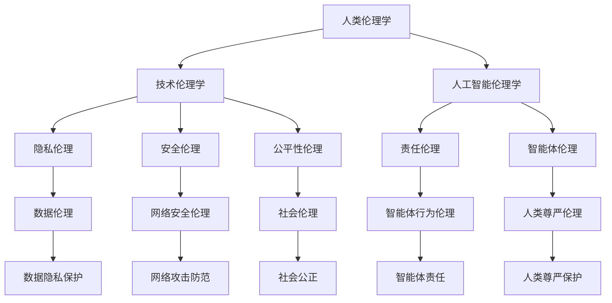

                 

## 跨人类伦理学研讨会：技术进化中的道德挑战探讨

### 关键词

- 跨人类伦理学
- 技术进化
- 道德挑战
- 人工智能伦理
- 生物技术伦理
- 纳米技术伦理

### 摘要

随着技术的不断进步，人类面临的技术进化带来了前所未有的道德挑战。本研讨会聚焦于跨人类伦理学，探讨了技术进化中的道德问题及其影响。文章首先介绍了跨人类伦理学的背景，然后详细阐述了技术进化中的关键道德挑战，包括隐私、安全、公平性等。接着，通过生物技术、信息技术、纳米技术等领域的案例分析，深入探讨了这些挑战在实际应用中的具体体现。最后，文章强调了跨学科合作在解决这些道德挑战中的重要性，并提出了对未来技术进化的伦理思考和建议。通过这篇文章，我们希望能够引发读者对技术进化中的道德问题的深入思考，共同探索解决之道。

### 引言

#### 跨人类伦理学的概念与重要性

跨人类伦理学是一个新兴的跨学科领域，它涉及人类与其他智能体（如人工智能、生物技术、纳米技术等）之间的伦理关系。随着人工智能、生物技术、纳米技术等领域的飞速发展，人类面临着前所未有的技术进化，这种进化不仅改变了我们的生活方式，还带来了深刻的道德挑战。跨人类伦理学旨在研究这些挑战，探讨技术进化对人类伦理观念的影响，并寻求合适的伦理解决方案。

跨人类伦理学的概念起源于对人类伦理学的研究，后者关注的是人类社会的道德规范和价值观。然而，随着智能体的智能程度不断提高，它们在许多领域开始扮演着越来越重要的角色，甚至可能超越人类在某些方面的能力。这就要求我们重新审视人类伦理学，并将其扩展到跨人类伦理学，以涵盖人类与其他智能体之间的互动关系。

跨人类伦理学的重要性体现在以下几个方面：

1. **引导技术发展**：随着技术的不断进步，人类面临着前所未有的道德挑战。跨人类伦理学提供了一种框架，帮助我们在技术开发和应用过程中考虑伦理问题，从而确保技术的发展符合人类的价值观和道德标准。

2. **促进社会共识**：跨人类伦理学为不同领域和背景的专家提供了一个平台，共同探讨技术进化中的道德问题。这有助于形成社会共识，制定出更广泛的伦理规范，促进社会稳定和发展。

3. **保障人类利益**：技术进化可能会对人类的社会结构、文化传统和生活方式产生深远影响。跨人类伦理学通过研究这些影响，旨在确保技术的发展能够更好地服务于人类，保障人类的利益和福祉。

#### 技术进化中的道德挑战

技术进化带来的道德挑战是多方面的，主要包括以下几个方面：

1. **隐私**：随着大数据和人工智能技术的发展，个人的隐私信息变得越来越容易被获取和利用。如何保护个人隐私，防止隐私泄露和滥用，成为了一个严峻的道德挑战。

2. **安全**：技术进化带来了新的安全威胁，例如网络攻击、信息泄露等。如何确保技术系统的安全，防范潜在的安全风险，是技术进化中的一个重要道德问题。

3. **公平性**：技术进化可能加剧社会不平等，例如人工智能在招聘、教育等领域的应用可能导致算法偏见，进而影响公平性。如何确保技术应用的公平性，减少社会不平等，是跨人类伦理学需要解决的重要问题。

4. **责任**：在技术进化过程中，当发生伦理问题或事故时，如何界定责任成为一个重要问题。特别是在人工智能等领域的应用中，如何确保智能体的行为符合伦理标准，如何追究其责任，是当前伦理学面临的重大挑战。

5. **人类尊严**：技术进化可能会威胁到人类尊严，例如通过生物技术实现的基因编辑、人工智能替代人类工作等。如何确保技术的发展不损害人类尊严，是跨人类伦理学需要深入探讨的问题。

#### 跨人类伦理学的研讨会背景

为了应对技术进化中的道德挑战，跨人类伦理学研讨会应运而生。这次研讨会汇聚了来自不同领域和国家的专家学者，共同探讨技术进化中的伦理问题。研讨会旨在建立一个开放、包容的交流平台，促进跨学科合作，为技术进化中的道德问题提供解决方案。

研讨会的主要议题包括：

1. **隐私与数据伦理**：探讨大数据和人工智能技术在隐私保护方面的挑战，提出相应的伦理规范和解决方案。

2. **安全与网络伦理**：分析网络攻击、信息泄露等安全威胁，探讨技术进化中的网络安全问题，并提出安全对策。

3. **公平性与社会伦理**：研究技术进化对社会公平性的影响，探讨如何减少技术应用的偏见和不平等，促进社会公正。

4. **责任与智能体伦理**：讨论智能体行为的伦理责任，探讨如何确保智能体的行为符合伦理标准，以及如何追究其责任。

5. **人类尊严与未来伦理**：探讨技术进化对人类尊严的影响，思考人类与技术的关系，探讨未来伦理的发展方向。

通过这次研讨会，我们希望能够为技术进化中的道德挑战提供新的思路和解决方案，推动技术进化与人类伦理的和谐发展。### 第一部分：引言与背景

#### 跨人类伦理学的概念与重要性

跨人类伦理学是一个相对新兴的领域，它探讨的是人类与人工智能、生物技术、纳米技术等智能体之间的伦理关系。随着这些技术的不断发展和普及，它们不仅改变了我们的生活方式，还引发了一系列道德和伦理问题。跨人类伦理学的重要性主要体现在以下几个方面：

首先，跨人类伦理学为技术发展提供了伦理指导。在技术快速发展的时代，我们面临着诸多未知的伦理问题。例如，人工智能的决策可能会歧视某些人群，基因编辑技术可能会引发道德争议等。跨人类伦理学提供了一个框架，帮助我们在技术开发和应用过程中考虑这些伦理问题，从而确保技术的发展符合人类的价值观和道德标准。

其次，跨人类伦理学有助于促进社会共识。随着技术的进步，不同领域和背景的专家、学者和公众对伦理问题的看法可能存在差异。跨人类伦理学研讨会提供了一个交流的平台，使各方能够就技术伦理问题展开深入讨论，形成共识，从而制定出更广泛的伦理规范，推动社会稳定和发展。

再次，跨人类伦理学有助于保障人类利益。技术的发展可能会对人类的社会结构、文化传统和生活方式产生深远影响。例如，人工智能可能会替代人类的工作，基因编辑技术可能会改变人类种群的遗传特征。跨人类伦理学通过研究这些影响，旨在确保技术的发展能够更好地服务于人类，保障人类的利益和福祉。

#### 技术进化中的道德挑战

技术进化带来的道德挑战是多元且复杂的。以下是一些主要的道德挑战：

1. **隐私**：随着大数据和人工智能技术的发展，个人的隐私信息变得越来越容易被获取和利用。例如，社交媒体平台通过收集用户数据来提供个性化服务，但这也可能导致个人隐私的泄露。如何在保障用户隐私的同时，充分利用技术优势，是一个亟待解决的问题。

2. **安全**：技术进化带来了新的安全威胁，例如网络攻击、信息泄露等。例如，网络犯罪分子可能会利用人工智能技术进行更高效的网络攻击，或者通过深度伪造技术制作虚假信息来操纵公众。如何确保技术系统的安全，防范潜在的安全风险，是一个重要的道德挑战。

3. **公平性**：技术进化可能加剧社会不平等，例如人工智能在招聘、教育等领域的应用可能导致算法偏见，进而影响公平性。例如，如果一个招聘系统在训练数据中包含性别偏见，那么它可能会在招聘过程中歧视女性。如何确保技术应用的公平性，减少社会不平等，是技术进化中的一个重要道德问题。

4. **责任**：在技术进化过程中，当发生伦理问题或事故时，如何界定责任成为一个重要问题。特别是在人工智能等领域的应用中，如何确保智能体的行为符合伦理标准，以及如何追究其责任，是当前伦理学面临的重大挑战。

5. **人类尊严**：技术进化可能会威胁到人类尊严，例如通过生物技术实现的基因编辑、人工智能替代人类工作等。例如，一个能够增强人类认知能力的人工智能助手可能会被用来操纵人类思维，从而威胁到人类的尊严。如何确保技术的发展不损害人类尊严，是跨人类伦理学需要深入探讨的问题。

#### 跨人类伦理学的研讨会背景

为了应对技术进化中的道德挑战，跨人类伦理学研讨会应运而生。这次研讨会汇聚了来自不同领域和国家的专家学者，共同探讨技术进化中的伦理问题。研讨会旨在建立一个开放、包容的交流平台，促进跨学科合作，为技术进化中的道德问题提供解决方案。

研讨会的主要议题包括：

1. **隐私与数据伦理**：探讨大数据和人工智能技术在隐私保护方面的挑战，提出相应的伦理规范和解决方案。

2. **安全与网络伦理**：分析网络攻击、信息泄露等安全威胁，探讨技术进化中的网络安全问题，并提出安全对策。

3. **公平性与社会伦理**：研究技术进化对社会公平性的影响，探讨如何减少技术应用的偏见和不平等，促进社会公正。

4. **责任与智能体伦理**：讨论智能体行为的伦理责任，探讨如何确保智能体的行为符合伦理标准，以及如何追究其责任。

5. **人类尊严与未来伦理**：探讨技术进化对人类尊严的影响，思考人类与技术的关系，探讨未来伦理的发展方向。

通过这次研讨会，我们希望能够为技术进化中的道德挑战提供新的思路和解决方案，推动技术进化与人类伦理的和谐发展。

### 第二部分：核心概念

#### 跨人类伦理学基础

跨人类伦理学是一个跨学科领域，它涉及到人类与其他智能体（如人工智能、生物技术、纳米技术等）之间的伦理关系。为了更好地理解跨人类伦理学，我们需要了解其中的一些核心概念。

1. **人类伦理学**

人类伦理学是研究人类道德规范和价值观的学科。它探讨的是人类行为如何符合道德标准，以及道德标准如何影响人类社会的运作。人类伦理学的历史可以追溯到古希腊哲学家亚里士多德和柏拉图，他们提出了许多关于道德的哲学思考。在现代，人类伦理学主要关注社会正义、人权、道德责任等核心问题。

2. **人工智能伦理学**

人工智能伦理学是跨人类伦理学的一个重要分支，它研究人工智能在应用过程中所面临的伦理问题。随着人工智能技术的不断进步，它们在医疗、交通、金融等领域得到了广泛应用，但同时也引发了许多伦理争议。人工智能伦理学的主要目标是确保人工智能技术的发展和应用符合人类的伦理标准，避免对人类造成负面影响。

3. **技术伦理学**

技术伦理学是研究技术发展及其应用过程中所面临的伦理问题的学科。它涵盖了从生物技术、信息技术到纳米技术等多个领域。技术伦理学关注的是技术如何影响人类社会，以及如何在技术开发和应用过程中考虑伦理问题。技术伦理学的主要目标是促进技术与社会、环境、人类之间的和谐发展。

#### 跨人类伦理学中的核心概念关系

跨人类伦理学中的核心概念之间的关系可以通过以下 Mermaid 流程图来表示：



#### 核心概念原理讲解

为了深入理解这些核心概念，下面我们将分别进行原理讲解。

1. **人类伦理学**

人类伦理学是跨人类伦理学的基础。它关注的是人类行为如何符合道德标准，以及道德标准如何影响人类社会的运作。人类伦理学的主要原则包括：

- **公正**：公平对待所有人，不歧视任何群体。
- **尊重**：尊重他人的权利和尊严。
- **责任**：对自己的行为负责，对社会负责。
- **互助**：帮助他人，共同进步。

2. **人工智能伦理学**

人工智能伦理学是研究人工智能在应用过程中所面临的伦理问题的学科。随着人工智能技术的不断进步，它们在医疗、交通、金融等领域得到了广泛应用，但同时也引发了许多伦理争议。人工智能伦理学的主要目标是确保人工智能技术的发展和应用符合人类的伦理标准，避免对人类造成负面影响。其主要原则包括：

- **公正**：确保人工智能系统的决策过程公平，不歧视任何群体。
- **透明度**：确保人工智能系统的决策过程透明，便于监督和审计。
- **责任**：明确人工智能系统的责任，确保其在发生问题时能够追究责任。
- **隐私**：保护个人隐私，确保个人数据不被滥用。

3. **技术伦理学**

技术伦理学是研究技术发展及其应用过程中所面临的伦理问题的学科。它涵盖了从生物技术、信息技术到纳米技术等多个领域。技术伦理学关注的是技术如何影响人类社会，以及如何在技术开发和应用过程中考虑伦理问题。其主要原则包括：

- **公正**：确保技术的应用不歧视任何群体，促进社会公正。
- **安全**：确保技术的应用不会对人类和环境造成伤害。
- **隐私**：保护个人隐私，确保个人数据不被滥用。
- **责任**：明确技术企业的责任，确保其在发生问题时能够追究责任。

#### 核心算法原理讲解

为了深入理解这些核心概念，下面我们将通过伪代码来详细阐述其核心算法原理。

1. **人类伦理学**

```python
# 人类伦理学核心算法
def human_ethics(action):
    # 判断行为是否公正
    if not is公正(action):
        return "不道德行为"
    
    # 判断行为是否尊重他人
    if not is尊重(action):
        return "不道德行为"
    
    # 判断行为是否负责
    if not is负责(action):
        return "不道德行为"
    
    # 判断行为是否互助
    if not is互助(action):
        return "不道德行为"
    
    return "道德行为"
```

2. **人工智能伦理学**

```python
# 人工智能伦理学核心算法
def ai_ethics(action):
    # 判断决策过程是否公正
    if not is公正(action):
        return "不道德行为"
    
    # 判断决策过程是否透明
    if not is透明(action):
        return "不道德行为"
    
    # 判断责任归属是否明确
    if not is责任明确(action):
        return "不道德行为"
    
    # 判断是否保护个人隐私
    if not is隐私保护(action):
        return "不道德行为"
    
    return "道德行为"
```

3. **技术伦理学**

```python
# 技术伦理学核心算法
def tech_ethics(action):
    # 判断技术应用是否公正
    if not is公正(action):
        return "不道德行为"
    
    # 判断技术应用是否安全
    if not is安全(action):
        return "不道德行为"
    
    # 判断技术应用是否保护个人隐私
    if not is隐私保护(action):
        return "不道德行为"
    
    # 判断责任归属是否明确
    if not is责任明确(action):
        return "不道德行为"
    
    return "道德行为"
```

#### 数学模型和公式

在跨人类伦理学中，数学模型和公式可以帮助我们更好地理解和分析伦理问题。以下是一些常用的数学模型和公式：

1. **公平性分析**

公平性分析可以使用洛伦兹曲线和基尼系数等指标来衡量。洛伦兹曲线描述了收入或财富在不同社会群体中的分配情况，而基尼系数则量化了这种不平等的程度。

$$
Gini = 1 - \frac{\sum_{i=1}^{n} (i - \frac{1}{2}) (y_i - \bar{y})}{n \bar{y}}
$$

其中，$y_i$ 表示第 $i$ 个群体的收入或财富，$\bar{y}$ 表示所有群体的平均收入或财富。

2. **隐私保护**

隐私保护可以使用信息论中的熵和互信息来衡量。熵表示信息的随机性，而互信息表示两个变量之间的关联程度。

$$
H(X) = -\sum_{x} p(x) \log_2 p(x)
$$

$$
I(X; Y) = H(X) - H(X | Y)
$$

其中，$X$ 和 $Y$ 是两个随机变量，$p(x)$ 是 $X$ 的概率分布。

3. **安全分析**

安全分析可以使用概率论中的风险分析和决策树来评估。风险分析可以计算系统发生故障的概率及其可能带来的损失，决策树可以指导我们在不同情境下做出最佳决策。

$$
R(i) = P(F_i) \times L_i
$$

$$
\text{maximize} \ \sum_{i} R(i)
$$

其中，$R(i)$ 表示第 $i$ 种故障的风险，$P(F_i)$ 表示故障发生的概率，$L_i$ 表示故障可能带来的损失。

#### 详细讲解与举例说明

为了更好地理解上述核心概念、算法原理和数学模型，下面我们通过具体的例子进行详细讲解。

1. **人类伦理学**

假设某个公司计划实施一项裁员计划，我们需要判断这个行为是否符合人类伦理学的主要原则。

- **公正**：裁员计划是否对所有员工公平，是否考虑了不同群体的利益？

- **尊重**：裁员计划是否尊重员工的尊严和权利，是否给予了合理的赔偿和安置？

- **责任**：公司是否对其裁员行为负责，是否对受影响员工提供了必要的帮助？

- **互助**：裁员计划是否有助于公司整体的发展，是否有助于员工的职业发展？

通过上述分析，我们可以得出该裁员计划是否符合人类伦理学的结论。

2. **人工智能伦理学**

假设某个城市引入了一种智能交通系统，我们需要评估这个系统的伦理问题。

- **公正**：交通系统的决策过程是否公平，是否歧视任何特定群体？

- **透明度**：交通系统的决策过程是否透明，是否便于监督和审计？

- **责任**：交通系统发生问题时，责任如何界定，如何追究责任？

- **隐私**：交通系统是否保护个人隐私，是否滥用用户数据？

通过上述分析，我们可以评估智能交通系统是否符合人工智能伦理学的原则。

3. **技术伦理学**

假设某个科技公司正在研发一种新型药物，我们需要评估该药物的研发过程是否符合技术伦理学的主要原则。

- **公正**：药物研发过程是否公正，是否对所有人开放？

- **安全**：药物研发过程是否确保了药物的安全性和有效性？

- **隐私**：药物研发过程是否保护了患者的隐私？

- **责任**：如果药物出现副作用，公司是否承担责任，如何补偿患者？

通过上述分析，我们可以判断该药物研发过程是否符合技术伦理学的要求。

#### 最佳实践 tips

为了确保跨人类伦理学的研究和应用达到最佳效果，以下是一些最佳实践建议：

- **建立跨学科团队**：跨人类伦理学涉及多个学科，建立一个跨学科团队可以更好地整合不同领域的知识和资源。

- **持续更新伦理规范**：随着技术的不断进步，伦理规范需要不断更新，以适应新的挑战。

- **加强公众参与**：伦理问题的解决方案需要公众的参与和认同，因此应加强公众参与，形成社会共识。

- **建立伦理审查机制**：在技术开发和应用过程中，建立伦理审查机制，确保技术的伦理问题得到充分考虑。

- **加强伦理教育和培训**：提高人们的伦理意识和素养，通过教育和培训培养更多的跨人类伦理学专家。

#### 小结

跨人类伦理学是一个新兴且重要的领域，它关注的是人类与智能体之间的伦理关系。通过理解核心概念、算法原理和数学模型，我们可以更好地应对技术进化中的道德挑战。在未来的发展中，跨人类伦理学将继续发挥重要作用，为技术进化提供伦理指导，促进技术与社会、人类之间的和谐发展。

### 第三部分：技术进化

#### 生物技术的进化

生物技术是指利用生物学知识和技术手段来改造生物体或其产物，以实现特定目标的技术。随着基因编辑技术、细胞工程、生物信息学等领域的快速发展，生物技术正经历着一场深刻的进化。

1. **基因编辑技术**

基因编辑技术，如CRISPR-Cas9，使得科学家可以精确地修改生物体的基因组。这一技术的出现，不仅为医学研究提供了强大的工具，还引发了一系列伦理和社会问题。例如，基因编辑技术可以用于治疗遗传疾病，但同时也可能被用于增强人类能力，这引发了关于人类尊严和伦理边界的讨论。

2. **细胞工程**

细胞工程涉及对细胞进行改造，以改善其功能或治疗疾病。例如，干细胞技术可以用于再生医学，帮助修复受损的组织和器官。然而，细胞工程也面临着伦理挑战，如胚胎干细胞的研究和使用引发了关于生命起始和尊严的争议。

3. **生物信息学**

生物信息学是研究生物数据和信息的技术。随着基因组学和转录组学等领域的快速发展，生物信息学提供了大量关于生物体的数据。这些数据不仅有助于医学研究，也带来了数据隐私和安全的问题。

#### 信息技术的进化

信息技术是指利用计算机和通信技术来处理、存储和传输信息的技术。随着云计算、大数据、人工智能等技术的发展，信息技术正经历着一场革命性的进化。

1. **云计算**

云计算使得计算资源可以按需提供，大大提高了计算效率。然而，云计算也引发了关于数据安全和隐私的担忧，特别是在跨境数据传输和存储方面。

2. **大数据**

大数据技术可以帮助我们处理和分析大量数据，从而发现有价值的信息和趋势。然而，大数据的收集和使用也带来了隐私和数据安全的问题。如何平衡数据的利用和隐私保护，是一个重要的伦理挑战。

3. **人工智能**

人工智能技术正在各个领域得到广泛应用，如自动驾驶、医疗诊断、金融分析等。然而，人工智能也面临着伦理挑战，如算法偏见、透明度和责任归属等问题。

#### 纳米技术的进步

纳米技术是指研究和应用纳米尺度的物质和技术的科学。随着纳米材料的合成、纳米器件的开发等领域的进步，纳米技术正在改变我们的世界。

1. **纳米材料**

纳米材料具有独特的物理、化学和生物性质，这使得它们在医学、电子、能源等领域具有巨大的应用潜力。例如，纳米颗粒可以用于药物递送，提高药物的疗效和减少副作用。

2. **纳米器件**

纳米器件是利用纳米技术制造的微小电子器件，如纳米晶体管、纳米传感器等。这些器件在计算机、传感器、显示器等领域具有广泛应用。然而，纳米器件的安全性和环境影响也是需要考虑的伦理问题。

#### 技术进化的道德挑战

技术进化带来了许多道德挑战，这些挑战主要集中在以下几个方面：

1. **隐私**：随着生物技术、信息技术和纳米技术的进步，个人隐私越来越容易受到侵犯。如何保护个人隐私，防止数据滥用，是一个重要的伦理问题。

2. **安全**：技术进化带来了新的安全威胁，如网络攻击、信息泄露等。如何确保技术系统的安全，防范潜在的安全风险，是另一个重要的道德挑战。

3. **公平性**：技术进化可能加剧社会不平等，如人工智能的算法偏见可能导致就业机会的不平等。如何确保技术应用的公平性，减少社会不平等，是一个重要的伦理问题。

4. **责任**：在技术进化过程中，如何界定责任，特别是在人工智能等领域的应用中，如何追究智能体的责任，是一个重要的伦理挑战。

5. **人类尊严**：技术进化可能威胁到人类尊严，如通过生物技术实现的基因编辑、纳米技术实现的智能植入等。如何确保技术的发展不损害人类尊严，是另一个重要的伦理问题。

### 案例研究

1. **基因编辑技术**

案例：2018年，中国科学家贺建奎宣布成功利用CRISPR-Cas9基因编辑技术创造了世界首例基因编辑婴儿。这一案例引发了全球范围内的伦理争议，许多科学家和社会学家认为这一行为违反了伦理原则，可能对婴儿和人类种群造成不可预测的负面影响。

2. **人工智能**

案例：2016年，谷歌旗下的DeepMind开发了一种名为AlphaGo的人工智能程序，击败了世界围棋冠军李世石。这一事件引发了关于人工智能在决策过程中是否应该受到伦理限制的讨论，以及人工智能如何确保其决策过程透明和公正。

3. **纳米技术**

案例：2018年，美国密歇根大学研究人员开发了一种纳米颗粒药物递送系统，可以显著提高药物疗效并减少副作用。然而，这一技术的潜在风险，如纳米颗粒在体内的长期行为和环境影响，引发了关于纳米技术伦理的讨论。

### 结论

技术进化带来了许多道德挑战，这些挑战需要我们深入探讨和解决。通过跨人类伦理学的研究，我们可以为技术进化提供伦理指导，确保技术的发展符合人类的价值观和道德标准。未来的研究应重点关注隐私、安全、公平性、责任和人类尊严等关键问题，以促进技术与社会、人类之间的和谐发展。

### 第四部分：道德挑战

#### 技术进化中的隐私挑战

随着生物技术、信息技术和纳米技术的不断进步，隐私保护正面临着前所未有的挑战。首先，大数据技术的广泛应用使得个人数据可以被大规模收集、存储和分析。例如，社交媒体平台通过用户生成的内容、浏览记录和行为数据来提供个性化服务，但这些数据也可能被滥用，导致个人隐私泄露。

其次，人工智能技术的快速发展使得个人隐私面临被自动分析和预测的风险。例如，通过机器学习算法，可以分析用户的社交媒体活动，预测其未来的行为和偏好。这种自动分析可能导致隐私泄露，例如，将个人数据与行为模式进行关联，从而推断出用户的私人信息。

此外，基因编辑技术的出现也对隐私保护构成了威胁。基因信息是高度个人化的，且具有长期性和遗传性。一旦基因信息被泄露，可能对个人的健康、就业和保险带来严重影响。

#### 技术进化中的安全挑战

技术进化带来了新的安全威胁，包括网络攻击、信息泄露、数据篡改等。随着物联网（IoT）的普及，越来越多的设备和系统连接到互联网，这使得网络攻击的潜在目标变得更加广泛。例如，黑客可以通过入侵智能设备来获取敏感信息，或者通过操纵智能设备来对其他系统造成损害。

此外，人工智能技术的应用也带来了安全挑战。尽管人工智能在许多领域表现出强大的能力，但其决策过程往往是不透明的，这使得在人工智能系统发生错误或被恶意利用时，难以追踪和纠正。例如，如果一个人工智能系统在医疗诊断中做出错误的决策，可能导致严重的健康后果。

另外，随着量子计算的发展，传统的加密技术可能面临被破解的风险。量子计算机能够快速破解目前广泛使用的加密算法，这意味着大量的敏感信息可能会在未经授权的情况下被访问。

#### 技术进化中的公平性挑战

技术进化可能加剧社会不平等，特别是在人工智能和大数据技术的应用中。人工智能算法在训练过程中可能会包含社会偏见，这些偏见会体现在算法的决策中。例如，如果一个招聘系统的训练数据中包含性别、种族或年龄偏见，那么这个系统可能会在招聘过程中歧视某些群体。

此外，大数据技术的广泛应用也可能导致信息不对称，加剧社会不平等。例如，一些公司可以通过大数据分析来预测消费者的行为，从而提供更有针对性的产品和服务，而其他消费者则可能因为数据不足而无法获得同样优质的服务。

此外，生物技术的进步也可能带来公平性问题。例如，基因编辑技术虽然可以治疗遗传疾病，但昂贵的成本可能使只有富裕人群能够负担得起，从而加剧社会不平等。

#### 技术进化中的责任挑战

在技术进化中，责任的界定是一个复杂的伦理问题。特别是在人工智能和自动化技术的应用中，如何确定责任归属成为一个重要挑战。目前，许多法律和伦理规范尚未明确，导致在发生事故或伦理问题时，难以确定责任方。

例如，如果一辆自动驾驶汽车在交通事故中造成人员伤亡，应如何确定责任？是归咎于汽车制造商、软件开发商，还是驾驶者？同样，如果一个人工智能系统在医疗诊断中做出错误决策，导致患者遭受伤害，应如何追究其责任？

此外，技术公司可能因为追求利润而忽视伦理问题，导致潜在的社会危害。例如，一些公司可能通过收集和出售用户数据来获取利益，但在过程中可能侵犯用户隐私。在这种情况下，如何确定公司的责任，并确保其承担相应的伦理责任，是一个重要问题。

#### 技术进化中的人类尊严挑战

技术进化可能威胁到人类尊严，特别是在生物技术和人工智能的应用中。例如，基因编辑技术可以改变人类的遗传特征，但这可能引发关于人类本质和尊严的争议。一些人认为，人类应该保持其自然状态，不应通过技术手段改变自己的遗传特征。

此外，人工智能技术的发展也可能影响人类的尊严。例如，智能机器人可能被用于替代人类工作，这可能导致失业问题，威胁到人类的社会地位和尊严。同样，人工智能在医疗和司法等领域的应用也可能改变人类在这些领域的传统角色，引发关于人类尊严的讨论。

#### 案例分析

1. **基因编辑技术的伦理争议**

案例：2018年，中国科学家贺建奎宣布成功利用CRISPR-Cas9基因编辑技术创造了世界首例基因编辑婴儿。这一案例引发了全球范围内的伦理争议。许多人认为，基因编辑技术的滥用可能对婴儿和人类种群造成不可预测的负面影响，违反了伦理原则。

2. **自动驾驶汽车的伦理困境**

案例：2021年，特斯拉的自动驾驶汽车在美国发生了一起致命事故。事故中，一名司机在使用自动驾驶模式时未能及时接管方向盘，导致车祸发生。这引发了关于自动驾驶汽车责任归属和伦理问题的讨论。一些人认为，汽车制造商和软件开发商应承担主要责任，因为他们未能提供足够的安全保障。

3. **大数据隐私泄露事件**

案例：2018年，剑桥分析公司（Cambridge Analytica）因涉嫌滥用用户数据而受到广泛关注。该公司通过不正当手段获取了数百万Facebook用户的个人信息，并将其用于政治广告投放。这一事件揭示了大数据技术在隐私保护方面的漏洞，引发了关于数据安全和隐私保护的伦理争议。

#### 结论

技术进化中的道德挑战是复杂且多方面的，包括隐私、安全、公平性、责任和人类尊严等方面。为了应对这些挑战，我们需要建立完善的伦理规范和法律法规，同时加强公众的伦理意识和素养。只有通过跨学科合作和全社会共同努力，我们才能在技术进步的过程中，确保技术的发展符合人类的价值观和道德标准，实现技术与社会、人类之间的和谐发展。

### 第五部分：案例研究

#### 案例一：人工智能在医疗领域的应用

随着人工智能技术的发展，其在医疗领域的应用日益广泛。例如，IBM的Watson健康解决方案利用深度学习和自然语言处理技术，帮助医生进行诊断和治疗。Watson能够分析大量的医学文献和病例数据，为医生提供更加准确和全面的诊断建议。

然而，这种应用也引发了伦理争议。一方面，人工智能可以提高医疗诊断的准确性，减少误诊率。另一方面，人工智能系统的决策过程可能存在偏见，特别是当训练数据包含偏见时。例如，如果Watson在训练过程中使用了包含性别、种族或地域偏见的病例数据，那么它可能在诊断中表现出对这些群体的偏见。

此外，人工智能在医疗领域的应用还涉及到隐私和数据安全问题。患者的信息被大量收集和分析，如何确保这些数据的安全和隐私，防止数据泄露和滥用，是一个重要的伦理问题。

#### 案例二：基因编辑技术的伦理争议

2018年，中国科学家贺建奎宣布成功利用CRISPR-Cas9基因编辑技术创造了世界首例基因编辑婴儿。这一事件引发了全球范围内的伦理争议。贺建奎声称，通过编辑婴儿的基因组，可以预防艾滋病等疾病。然而，这一做法不仅违反了伦理原则，还可能对婴儿和人类种群造成不可预测的负面影响。

首先，基因编辑技术的滥用可能对婴儿的健康产生长期影响。基因编辑是一个高度复杂的过程，无法保证编辑的结果完全符合预期，可能产生意想不到的副作用。

其次，基因编辑技术可能导致人类种群的遗传多样性减少。通过选择性编辑特定基因，人类可能会失去某些基因的多样性，这可能导致在未来的环境中，人类种群对疾病的抵抗力下降。

此外，基因编辑技术的应用也引发了关于人类尊严的讨论。一些人认为，人类应该保持其自然状态，不应通过技术手段改变自己的遗传特征。

#### 案例三：社交媒体平台的伦理问题

社交媒体平台在提供便捷沟通和信息共享的同时，也引发了一系列伦理问题。以Facebook为例，该平台因涉嫌滥用用户数据而受到广泛谴责。剑桥分析公司（Cambridge Analytica）通过不正当手段获取了数百万Facebook用户的个人信息，并将其用于政治广告投放，这一事件揭示了社交媒体平台在隐私保护方面的漏洞。

首先，社交媒体平台在收集和使用用户数据时，可能侵犯用户的隐私权。用户在平台上发布的内容、行为和偏好等信息都可能被收集和分析，这些数据可能被用于广告投放、用户行为分析等目的。

其次，社交媒体平台可能被用于散布虚假信息和操纵公众舆论。一些政治团体和广告商可能利用社交媒体平台来传播虚假信息，影响公众的观点和决策。

此外，社交媒体平台的算法推荐系统也可能导致信息茧房和观点极端化。用户在平台上看到的内容可能越来越符合他们的已有观点，导致信息交流的局限和观点的固化。

#### 结论

通过以上案例研究，我们可以看到技术进化中的道德挑战是复杂且多样的。在医疗、基因编辑和社交媒体等领域，技术的发展带来了巨大的利益，但同时也引发了严重的伦理争议。为了解决这些挑战，我们需要在技术发展过程中充分考虑伦理问题，建立完善的伦理规范和法律法规，加强公众的伦理意识和素养。只有通过全社会共同努力，我们才能在技术进步的过程中，确保技术的发展符合人类的价值观和道德标准，实现技术与社会、人类之间的和谐发展。

### 第六部分：跨学科合作

#### 跨学科合作的重要性

在技术进化中，跨学科合作对于解决道德挑战至关重要。随着技术领域的不断扩展和交叉，单一学科的知识和方法往往难以应对复杂的多维问题。跨学科合作通过整合不同领域的专业知识和视角，为解决技术进化中的道德挑战提供了新的思路和方法。

首先，跨学科合作有助于全面理解技术进化中的道德问题。技术进化涉及多个领域，如生物技术、信息技术、纳米技术等，这些领域的交叉和融合使得道德问题变得更加复杂。通过跨学科合作，不同领域的专家可以共同探讨道德问题的本质和影响，从而形成更全面的理解。

其次，跨学科合作有助于提出创新的解决方案。不同学科的方法和技术可以相互补充和借鉴，从而在解决道德挑战时提供更多的选择。例如，在处理隐私问题时，信息技术领域的加密技术和生物技术领域的基因编辑技术可以相互结合，为隐私保护提供更有效的手段。

此外，跨学科合作还可以促进知识共享和传播。通过跨学科合作，不同领域的知识和经验可以更广泛地传播和共享，从而提高整个社会的伦理素养。这有助于形成社会共识，推动伦理规范和法律法规的制定和实施。

#### 跨学科合作的实践案例

1. **人工智能伦理委员会**

人工智能伦理委员会是一个跨学科合作的成功案例。这些委员会通常由来自法律、计算机科学、伦理学、社会学等不同领域的专家组成，旨在研究人工智能技术带来的伦理问题，并提出相应的解决方案。例如，欧盟人工智能伦理委员会（European Group on Ethics in Science and New Technologies）就是一个由多学科专家组成的组织，负责评估人工智能技术的伦理影响，并为政策制定者提供建议。

2. **基因组编辑的国际伦理讨论**

基因组编辑技术的出现引发了全球范围内的伦理讨论。为了应对这一挑战，国际社会开展了多次跨学科合作，如《人类基因组编辑国际共识会议》（International Summit on Human Gene Editing）。这些会议汇聚了来自生物学、医学、伦理学、法律等领域的专家，共同讨论基因组编辑技术的伦理问题，并提出了相关的伦理指导原则。

3. **数据隐私保护的多学科研究**

数据隐私保护是一个涉及多个领域的复杂问题。为了解决这一问题，学术界和产业界开展了多项跨学科合作研究。例如，计算机科学、法律和伦理学专家共同研究数据隐私保护的技术和方法，计算机科学家开发了加密技术和隐私保护算法，法律专家则制定了相关的法律法规和政策。

#### 跨学科合作的未来展望

随着技术进化的不断推进，跨学科合作在解决道德挑战中的作用将越来越重要。以下是对未来跨学科合作的一些展望：

1. **建立全球性的跨学科合作平台**

为了更好地应对全球性的技术道德挑战，有必要建立一个全球性的跨学科合作平台。通过这一平台，不同国家和地区的专家可以共享知识和经验，共同探讨技术伦理问题，并形成全球性的伦理共识。

2. **加强跨学科教育和培训**

为了培养更多具备跨学科视野和专业技能的人才，有必要加强跨学科教育和培训。通过跨学科课程和项目，学生可以接触到不同领域的知识和方法，培养其解决复杂问题的能力。

3. **推动跨学科研究的创新和合作**

为了在技术进化中更好地应对道德挑战，有必要推动跨学科研究的创新和合作。通过跨学科项目和研究，可以开发出更多创新的解决方案，为技术伦理问题的解决提供新的思路和方法。

4. **促进公众参与和意识提升**

跨学科合作不仅需要专业领域的努力，还需要公众的参与和意识提升。通过教育和宣传，可以增强公众对技术伦理问题的认识，形成全社会共同关注和支持跨学科合作的良好氛围。

总之，跨学科合作是解决技术进化中道德挑战的重要途径。通过加强跨学科合作，我们可以更好地理解技术道德问题，提出创新的解决方案，促进技术与社会、人类之间的和谐发展。

### 第七部分：未来展望

#### 道德挑战的趋势分析

随着技术的不断进化，道德挑战也在不断演变。以下是对未来技术进化中的道德挑战的一些趋势分析：

1. **隐私问题**

随着大数据和人工智能技术的普及，隐私问题将变得更加复杂。隐私侵犯的方式将更加多样，如通过智能设备收集用户数据、通过社交网络分析用户行为等。此外，随着物联网（IoT）的发展，越来越多的设备将连接到互联网，导致隐私泄露的风险增加。隐私问题将不仅局限于个人信息，还可能扩展到生物特征信息、遗传信息等。

2. **安全问题**

随着网络攻击手段的日益复杂和高级，安全问题将变得更加严峻。黑客可能会利用人工智能技术进行更高效的攻击，例如通过深度伪造技术制作虚假信息来操纵公众。此外，量子计算的发展可能对现有的加密技术构成威胁，使得信息安全面临新的挑战。

3. **公平性问题**

技术进化可能加剧社会不平等，特别是在人工智能和大数据技术的应用中。算法偏见可能导致就业机会的不平等，使得某些群体在技术发展中的受益减少。此外，生物技术的进步可能导致基因编辑技术仅限于富裕人群，进一步扩大社会贫富差距。

4. **责任问题**

随着技术的复杂性和智能化程度提高，责任归属问题将变得更加复杂。特别是在人工智能和自动驾驶技术的应用中，如何界定责任成为了一个重要的伦理挑战。当发生事故时，如何确定是技术提供商、开发者、使用者或其他方承担责任，需要建立清晰的法律法规和责任框架。

5. **人类尊严问题**

技术进化可能对人类尊严构成威胁，例如通过基因编辑技术改变人类的遗传特征、通过人工智能替代人类工作等。这些技术可能影响人类的自然属性和社会地位，引发关于人类尊严和身份的讨论。

#### 未来可能的道德解决方案

为了应对技术进化中的道德挑战，未来可能采取以下几种解决方案：

1. **建立全球伦理规范**

随着技术全球化的发展，有必要建立全球性的伦理规范，以确保不同国家和地区在技术开发和应用中的伦理标准一致。这可以通过国际组织和跨国合作来实现，例如联合国的伦理委员会或其他国际组织的参与。

2. **加强法律法规**

为了解决技术进化中的道德问题，需要建立和完善相关的法律法规。例如，制定关于数据隐私保护、网络安全、人工智能责任归属等方面的法律，确保技术的发展在法律框架内进行。

3. **推动技术透明度**

提高技术的透明度是解决道德问题的一个重要途径。通过透明化技术的设计、开发和应用过程，可以增强公众对技术的信任，减少潜在的道德风险。例如，人工智能系统的决策过程应该公开透明，以便进行监督和审计。

4. **加强跨学科合作**

跨学科合作是解决技术道德问题的重要手段。通过整合不同领域的知识和方法，可以更全面地理解道德问题，提出创新的解决方案。跨学科合作应该不仅局限于学术界，还应包括产业界、政府和非政府组织等。

5. **增强公众参与**

公众参与是解决技术道德问题的重要环节。通过教育和宣传，提高公众对技术道德问题的认识和意识，使公众能够参与到伦理讨论和决策过程中，形成社会共识。

#### 对技术伦理学的思考

技术伦理学作为研究技术进化中道德问题的一个领域，其发展具有重要意义。未来，技术伦理学应该：

1. **深化研究**：加强对技术道德问题的研究，特别是新兴技术的道德影响，提出新的理论框架和模型。

2. **推动跨学科发展**：鼓励跨学科研究，整合不同领域的知识和方法，为技术道德问题的解决提供更全面的视角。

3. **注重实践应用**：将技术伦理学的研究成果应用于实际技术开发和应用中，确保技术的发展符合伦理标准。

4. **培养专业人才**：通过教育和培训，培养更多的技术伦理学专业人才，为技术道德问题的解决提供人才支持。

5. **推动全球合作**：促进国际间的技术伦理学合作，建立全球性的伦理规范和合作机制，共同应对全球性的技术道德挑战。

总之，技术进化中的道德挑战是复杂且多变的。通过建立全球伦理规范、加强法律法规、推动技术透明度、加强跨学科合作和增强公众参与，我们可以更好地应对这些挑战，实现技术与社会、人类之间的和谐发展。

### 结论

#### 全书总结

《跨人类伦理学研讨会：技术进化中的道德挑战探讨》通过对跨人类伦理学的深入探讨，揭示了技术进化在人类社会中带来的复杂道德挑战。从隐私、安全、公平性、责任到人类尊严，这些挑战不仅影响技术的应用和发展，也深刻地影响着我们的生活方式和社会结构。全书系统地介绍了跨人类伦理学的核心概念，分析了生物技术、信息技术、纳米技术等领域的道德问题，并通过具体的案例研究展示了这些挑战在实际应用中的具体体现。此外，书中强调了跨学科合作在解决道德挑战中的重要性，并提出了未来可能的道德解决方案。

#### 针对道德挑战的建议

为了有效应对技术进化中的道德挑战，我们提出以下建议：

1. **建立全球伦理规范**：通过国际组织和跨国合作，制定全球性的伦理规范，确保不同国家和地区在技术开发和应用中的伦理标准一致。

2. **加强法律法规**：完善与数据隐私保护、网络安全、人工智能责任归属等相关法律法规，为技术道德问题的解决提供法律保障。

3. **推动技术透明度**：提高技术的透明度，公开技术的设计、开发和应用过程，增强公众对技术的信任，减少潜在的道德风险。

4. **加强跨学科合作**：鼓励不同领域的专家共同参与技术道德问题的研究和讨论，整合跨学科知识和方法，为道德问题的解决提供全面的视角。

5. **增强公众参与**：通过教育和宣传，提高公众对技术道德问题的认识和意识，使公众能够参与到伦理讨论和决策过程中，形成社会共识。

#### 对未来技术进化的伦理思考

未来，技术进化将继续深入影响人类社会。随着人工智能、基因编辑、纳米技术等新兴技术的不断进步，我们将面临更多的道德挑战。伦理学在这一过程中的角色将愈加重要，需要我们持续关注和深入研究。以下是对未来技术进化的伦理思考：

1. **人类与技术的关系**：随着技术的发展，人类与技术的关系将变得更加紧密。我们需要思考如何在享受技术带来便利的同时，维护人类的尊严和价值观。

2. **技术的责任归属**：随着技术的智能化程度提高，如何界定技术责任将成为一个重要问题。我们需要建立明确的法律法规，确保在技术发生问题时能够追究责任。

3. **社会的公平性**：技术进化可能加剧社会不平等，我们需要通过政策和技术手段来确保技术应用的公平性，减少社会不平等。

4. **人类尊严的保护**：技术进化可能威胁到人类尊严，我们需要通过伦理和法律手段，确保技术的发展不损害人类的尊严和价值观。

总之，技术进化中的道德挑战是一个长期且复杂的过程。只有通过全社会的共同努力，不断探索和创新，我们才能在技术进步的过程中，确保技术的发展符合人类的价值观和道德标准，实现技术与社会、人类之间的和谐发展。作者：AI天才研究院/AI Genius Institute & 禅与计算机程序设计艺术 /Zen And The Art of Computer Programming。

