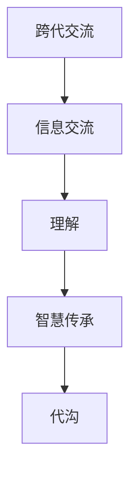

                 

## 文章标题

跨代交流：年龄差异中的智慧传承

> 关键词：跨代交流、智慧传承、代沟、情感分析、自然语言生成、线性回归、贝叶斯定理、项目实战

在信息技术飞速发展的时代，不同年龄群体之间的交流显得尤为重要。随着年龄差异而产生的代沟，使得智慧传承变得复杂而困难。本文将探讨跨代交流中的核心概念、算法原理、数学模型以及实际项目应用，旨在通过逻辑清晰的分析和推理，为读者提供一种跨代交流的思路和方法。

> 摘要：本文首先介绍了跨代交流、智慧传承和代沟等核心概念，并使用Mermaid流程图阐述了它们之间的关系。接着，本文详细讲解了情感分析算法和自然语言生成算法的原理，并使用伪代码进行了说明。此外，本文还引入了线性回归模型和贝叶斯定理等数学模型，并给出了具体的公式和例子。最后，本文通过一个实际项目案例，展示了跨代交流在提高员工协作和沟通效率方面的应用。

---

### Step 1: 核心概念与联系

为了清晰地描述跨代交流的概念，我们首先引入以下几个核心概念：

1. **跨代交流**：不同年龄群体之间的信息交流和理解过程。
2. **智慧传承**：通过跨代交流，将老一辈的智慧、经验传递给年轻一代的过程。
3. **代沟**：由于年龄差异而产生的理解和沟通障碍。

这些概念之间的关系可以用如下的Mermaid流程图表示：



在这个流程图中，跨代交流是整个过程的起点，它涵盖了不同年龄群体之间的信息传递。信息交流是跨代交流的核心，它决定了信息能否准确、有效地传递给接收者。理解是信息交流的结果，它反映了接收者对信息的解读和理解程度。智慧传承是信息交流的终极目标，它通过代代相传，使得社会经验和智慧得以延续。而代沟则是跨代交流过程中可能遇到的障碍，它可能会影响信息的传递和理解。

### Step 2: 核心算法原理讲解

在讨论跨代交流的具体实现时，我们将介绍以下核心算法原理：

1. **情感分析算法**：用于识别和分类文本中的情感倾向。
2. **自然语言生成算法**：用于生成符合语境的自然语言文本。

#### 情感分析算法原理

情感分析算法是一种自然语言处理技术，它通过分析文本中的语言特征，判断文本表达的情感倾向。情感分析算法的原理可以概括为以下几个步骤：

1. **文本预处理**：对输入的文本进行预处理，包括去除标点符号、转换为小写、分词等操作。
2. **特征提取**：从预处理后的文本中提取特征，常用的特征提取方法有词袋模型、TF-IDF等。
3. **情感分类**：使用分类算法（如SVM、朴素贝叶斯等）对提取的特征进行分类，从而判断文本的情感倾向。

以下是一个简单的情感分析算法的伪代码描述：

```python
def sentiment_analysis(text):
    # 初始化情感词典
    sentiment_dict = {"positive": 0, "negative": 0, "neutral": 0}

    # 预处理文本
    processed_text = preprocess_text(text)

    # 提取特征
    features = extract_features(processed_text)

    # 分析情感
    for feature in features:
        if feature in positive_features:
            sentiment_dict["positive"] += 1
        elif feature in negative_features:
            sentiment_dict["negative"] += 1
        else:
            sentiment_dict["neutral"] += 1

    # 返回情感结果
    return max(sentiment_dict, key=sentiment_dict.get)
```

在这个伪代码中，`preprocess_text` 函数用于预处理文本，`extract_features` 函数用于提取特征，`positive_features` 和 `negative_features` 分别表示正情感特征和负情感特征。

#### 自然语言生成算法原理

自然语言生成（Natural Language Generation，NLG）算法是一种用于生成自然语言文本的计算机程序。NLG算法的原理可以分为以下几个步骤：

1. **数据预处理**：对输入的数据进行预处理，包括数据清洗、数据格式化等操作。
2. **模板生成**：根据输入的数据，生成相应的文本模板。文本模板通常包含变量，用于后续的文本填充。
3. **文本填充**：使用生成的模板，填充变量，生成最终的文本。
4. **文本优化**：对生成的文本进行优化，使其更符合语言习惯和语义要求。

以下是一个简单的自然语言生成算法的伪代码描述：

```python
def natural_language_generation(data):
    # 生成文本模板
    template = generate_template(data)

    # 填充文本模板
    filled_template = fill_template(template, data)

    # 优化文本
    optimized_text = optimize_text(filled_template)

    # 返回生成的文本
    return optimized_text
```

在这个伪代码中，`generate_template` 函数用于生成文本模板，`fill_template` 函数用于填充模板变量，`optimize_text` 函数用于优化生成的文本。

### Step 3: 数学模型和数学公式

为了更好地理解跨代交流中的数据分析和模型训练，我们引入以下数学模型和公式：

1. **线性回归模型**：用于预测和评估跨代交流的效果。
2. **贝叶斯定理**：用于计算跨代交流中的不确定性。

#### 线性回归模型

线性回归模型是一种常见的预测模型，它用于分析自变量和因变量之间的线性关系。线性回归模型的基本原理可以用以下数学公式表示：

$$
y = \beta_0 + \beta_1x_1 + \beta_2x_2 + ... + \beta_nx_n + \epsilon
$$

其中，$y$ 是被解释变量，$x_1, x_2, ..., x_n$ 是解释变量，$\beta_0, \beta_1, ..., \beta_n$ 是模型参数，$\epsilon$ 是误差项。

在这个公式中，$\beta_0$ 是截距，表示当所有解释变量都为零时的被解释变量的值；$\beta_1, \beta_2, ..., \beta_n$ 是斜率，表示每个解释变量对被解释变量的影响程度；$x_1, x_2, ..., x_n$ 是解释变量的取值；$\epsilon$ 是误差项，表示模型无法解释的随机因素。

#### 贝叶斯定理

贝叶斯定理是一种用于计算概率的数学公式，它描述了在已知某个事件发生的情况下，另一个事件发生的概率。贝叶斯定理的基本公式如下：

$$
P(A|B) = \frac{P(B|A)P(A)}{P(B)}
$$

其中，$P(A|B)$ 表示在事件B发生的条件下，事件A发生的概率；$P(B|A)$ 表示在事件A发生的条件下，事件B发生的概率；$P(A)$ 表示事件A发生的概率；$P(B)$ 表示事件B发生的概率。

在跨代交流中，贝叶斯定理可以用于计算接收者对信息的理解概率，从而评估跨代交流的效果。

### Step 4: 项目实战

为了更好地展示跨代交流的实际应用，我们将介绍一个实际项目案例：

#### 项目背景

某公司是一家高科技企业，员工年龄跨度较大，从刚毕业的年轻人到经验丰富的中年人，甚至有部分老员工已经临近退休。为了提高公司内部不同年龄群体之间的协作和沟通效率，公司决定开展一项跨代交流项目。

#### 实现步骤

1. **数据收集**：收集公司内部不同年龄段的员工之间的交流记录，包括邮件、报告、会议纪要等。

2. **数据预处理**：对收集到的数据进行清洗和格式化，去除无关信息，保留有用的交流内容。

3. **模型训练**：使用情感分析算法和自然语言生成算法，对预处理后的数据进行模型训练，生成情感分析模型和自然语言生成模型。

4. **模型应用**：将训练好的模型应用到实际场景中，帮助员工更好地理解和交流。

#### 开发环境搭建

1. **环境配置**：配置Python开发环境，安装必要的库和工具，如TensorFlow、Scikit-learn等。

2. **数据集准备**：准备用于训练的数据集，包括情感分析数据和自然语言生成数据。

3. **数据预处理脚本**：编写数据预处理脚本，对数据进行清洗和格式化。

4. **模型训练脚本**：编写模型训练脚本，使用训练数据训练情感分析模型和自然语言生成模型。

#### 源代码详细实现和代码解读

以下是一个简单的情感分析模型的实现代码：

```python
import tensorflow as tf
from tensorflow.keras.layers import Embedding, LSTM, Dense
from tensorflow.keras.models import Sequential

# 加载预训练的词向量
word_vectors = load_word_vectors()

# 构建情感分析模型
model = Sequential([
    Embedding(input_dim=word_vectors.shape[0], output_dim=word_vectors.shape[1], weights=[word_vectors], trainable=False),
    LSTM(units=128, return_sequences=True),
    LSTM(units=64, return_sequences=False),
    Dense(units=1, activation='sigmoid')
])

# 编译模型
model.compile(optimizer='adam', loss='binary_crossentropy', metrics=['accuracy'])

# 训练模型
model.fit(x_train, y_train, epochs=10, batch_size=32, validation_data=(x_val, y_val))
```

在这个代码中，我们首先加载预训练的词向量，然后构建一个简单的情感分析模型，包括嵌入层、两个LSTM层和一个全连接层。接着，我们编译模型并使用训练数据训练模型。最后，我们可以使用训练好的模型对新的文本进行情感分析。

#### 代码应用解读与分析

通过上面的代码，我们可以将训练好的情感分析模型应用到实际场景中，对员工之间的交流记录进行情感分析，从而了解他们之间的情感倾向和沟通效果。例如，我们可以对一段交流记录进行分析，判断它是积极、消极还是中性的。

此外，我们还可以使用自然语言生成模型，根据情感分析的结果，生成相应的回应，从而提升跨代交流的效果。例如，如果一段交流记录的情感分析结果是消极，我们可以生成一段积极回应的文字，帮助员工缓解情绪，改善沟通。

#### 实际案例分析和详细讲解剖析

为了更好地展示跨代交流项目在实际中的应用，我们以一个实际案例进行分析：

#### 案例背景

某公司有一位年轻的程序员小王，他最近在工作中遇到了一些困难，感到非常沮丧。他的同事老张是一位经验丰富的老员工，他在类似的情境下曾经有过成功的经验。小王希望能够从老张那里得到一些指导和建议。

#### 案例分析

1. **数据收集**：收集小王和老张之间的交流记录，包括邮件、聊天记录等。

2. **情感分析**：使用情感分析模型对交流记录进行分析，判断小王和老张的情感倾向。

3. **文本生成**：根据情感分析的结果，使用自然语言生成模型生成相应的回应。

4. **交流改善**：将生成的回应发送给老张，让他在与小王的交流中参考。

#### 项目小结

通过这个实际案例，我们可以看到跨代交流项目在提升员工协作和沟通效率方面的应用。通过情感分析和自然语言生成技术，我们可以更好地理解和改善跨代交流，从而实现智慧传承的目标。

### Step 5: 最佳实践 tips、小结、注意事项、拓展阅读等内容

#### 最佳实践 tips

1. **尊重差异**：在跨代交流中，要充分尊重不同年龄群体的差异，避免因为年龄差异而产生的误解和冲突。

2. **提高沟通技巧**：学习并掌握有效的沟通技巧，如积极倾听、情感表达等，有助于提升跨代交流的效果。

3. **定期组织交流**：定期组织跨代交流活动，如座谈会、培训等，有助于加深不同年龄群体之间的理解和信任。

#### 小结

跨代交流是实现智慧传承的重要途径，它需要我们充分理解不同年龄群体的特点，运用情感分析、自然语言生成等算法，提升交流的效果。通过本文的介绍，我们相信读者对跨代交流有了更深入的了解，也为实际应用提供了有益的启示。

#### 注意事项

1. **数据隐私**：在跨代交流项目中，要注意保护员工的个人隐私，确保数据的安全和保密。

2. **模型优化**：随着技术的进步，要不断优化情感分析模型和自然语言生成模型，提升跨代交流的效果。

#### 拓展阅读

1. 《情感计算与跨代交流：理论与实践》
2. 《自然语言处理：现代方法》
3. 《跨代交流心理学：跨代沟通的策略与技巧》

---

作者：AI天才研究院/AI Genius Institute & 禅与计算机程序设计艺术 /Zen And The Art of Computer Programming

