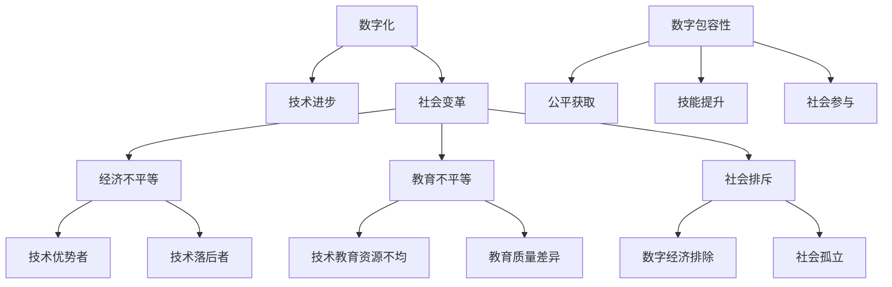
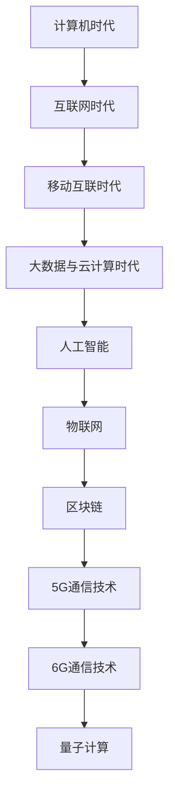
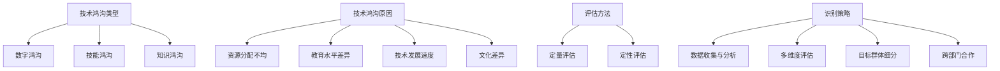
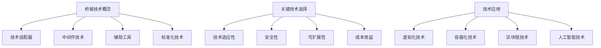
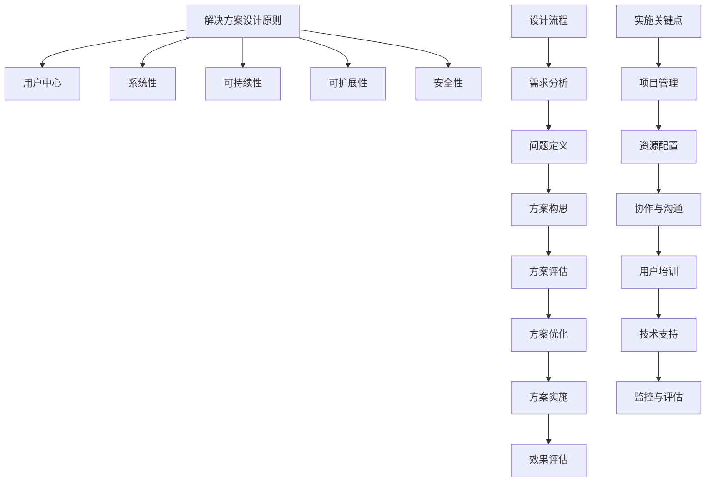
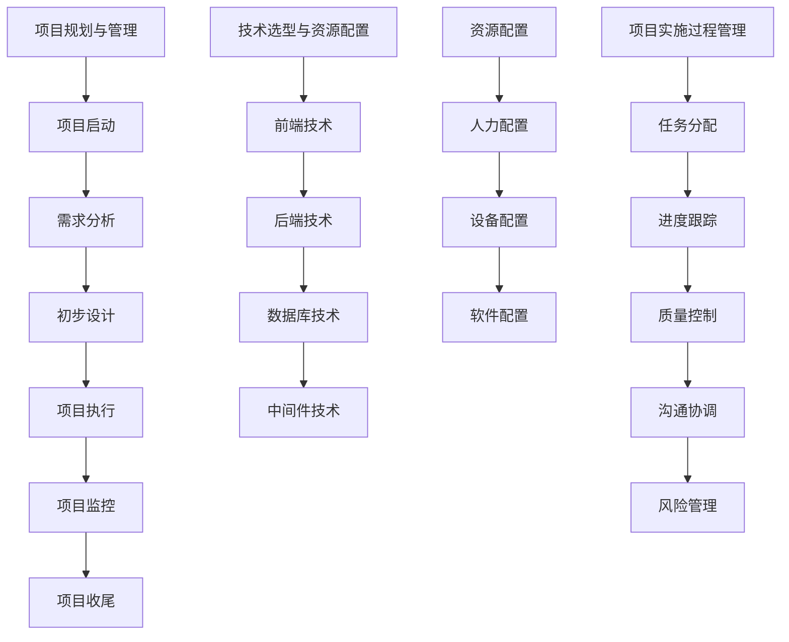
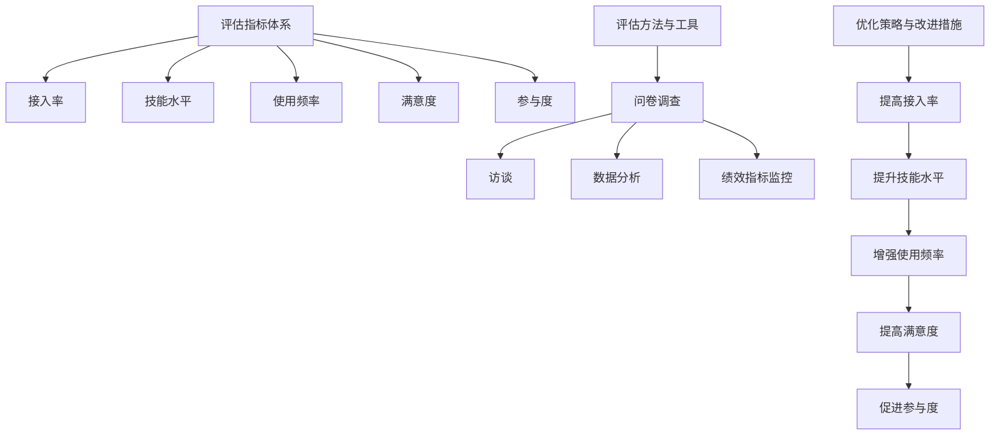

                 

### 关键词

- 数字包容性社会建设
- 技术鸿沟桥接
- 跨代技术发展
- 数字化双刃剑
- 信息技术
- 桥接技术策略
- 项目实施与评估

### 摘要

本文旨在探讨跨代技术鸿沟桥接在数字包容性社会建设中的关键作用。首先，分析了数字化带来的双刃剑效应和技术鸿沟的影响，提出了数字包容性的定义与目标。接着，概述了信息技术的演变历程和当前主要跨代技术，包括人工智能、物联网、区块链和5G通信技术。通过核心概念联系架构Mermaid流程图和伪代码，详细讲解了核心算法原理和数学模型。随后，讨论了桥接技术的选择和应用策略，并设计了数字包容性解决方案。文章还重点介绍了技术桥接项目的实施过程、评估方法和优化策略，并通过实际案例进行了分析。最后，提出了最佳实践、小结和注意事项，并推荐了拓展阅读资源。

---

## 第一部分：背景与概述

### 第1章：数字包容性社会建设的重要性

在当今的数字化时代，信息技术的发展已经成为推动社会进步的重要力量。然而，数字化的双刃剑效应也使得技术鸿沟问题日益凸显，成为影响社会公平和包容性的关键因素。因此，构建数字包容性社会成为当务之急。

### 1.1 数字化的双刃剑

数字化的推进，一方面极大地提升了生产力和生活质量，促进了经济和社会的发展。另一方面，技术的不平等分配导致了数字鸿沟的出现，使得某些人群在享受数字化红利时面临障碍。

#### 技术鸿沟的影响

技术鸿沟的影响深远且复杂，主要体现在以下几个方面：

1. **经济不平等**：技术优势者能够更快地适应和利用新技术，从而获得更多的经济机会。而技术落后者则可能被边缘化，面临就业压力和经济困境。
2. **教育不平等**：技术教育资源的分配不均，使得教育质量和教育公平受到挑战。技术素养的差异导致了学习成果和社会地位的差距。
3. **社会排斥**：技术落后者可能被排除在数字经济和社会之外，面临社会排斥和孤立。

### 1.2 技术鸿沟的类型与原因

技术鸿沟可以分为以下几类：

1. **数字鸿沟**：指不同群体在数字设备和网络接入方面的差距。
2. **技能鸿沟**：指不同群体在数字技能和能力方面的差距。
3. **知识鸿沟**：指不同群体在数字知识和信息获取方面的差距。

技术鸿沟的原因包括：

1. **资源分配不均**：经济和社会资源的不平等分配导致了技术资源的分配不均。
2. **教育不足**：教育水平的高低直接影响个人获取和利用数字技术的能力。
3. **技术发展速度**：技术发展的速度远远超过了某些群体的适应能力。

### 1.3 数字包容性的定义与目标

数字包容性（Digital Inclusion）是指确保所有人，无论年龄、性别、教育程度、社会经济地位等，都能平等地获得和利用数字技术和信息资源。其目标包括：

1. **公平获取**：确保所有人都能无障碍地接入数字设备和网络。
2. **技能提升**：提供教育和培训，提升人们使用数字技术的技能。
3. **社会参与**：促进数字技术的普及，提高社会各群体的数字素养和参与度。

### 核心概念联系架构Mermaid流程图



### 核心算法原理讲解

数字包容性建设需要通过一系列算法和技术来实现。以下是一种可能的算法原理讲解：

```pseudo
// 数字包容性建设算法原理
function DigitalInclusion(strategies, resources, population):
    for each individual in population:
        if individual lacks access to digital resources:
            apply AccessStrategies(individual, resources)
        if individual lacks digital skills:
            apply SkillDevelopmentStrategies(individual, resources)
        if individual is socially excluded:
            apply SocialInclusionStrategies(individual, resources)
    return successful_integration_percentage
```

### 数学模型和公式

在数字包容性评估中，可以使用以下数学模型：

$$
CI = \frac{A_{access} + A_{skills} + A_{social}}{3}
$$

其中，$CI$ 表示数字包容性指数，$A_{access}$、$A_{skills}$ 和 $A_{social}$ 分别表示获取、技能和社会参与方面的得分。

### 举例说明

假设某个社区的数字包容性评估如下：

- 获取得分：90%
- 技能得分：85%
- 社会参与得分：80%

则该社区的数字包容性指数为：

$$
CI = \frac{90\% + 85\% + 80\%}{3} = \frac{255\%}{3} = 85\%
$$

### 项目实战

**开发环境搭建**

1. 安装Python环境
2. 安装所需的库，如Pandas、NumPy、Matplotlib等

**源代码实现**

```python
import pandas as pd
import numpy as np
import matplotlib.pyplot as plt

# 获取社区数据
data = pd.read_csv('community_data.csv')

# 计算数字包容性指数
CI = (data['access_score'] + data['skills_score'] + data['social_score']) / 3

# 可视化数字包容性指数
plt.bar(data['community'], CI)
plt.xlabel('Community')
plt.ylabel('Digital Inclusion Index')
plt.title('Digital Inclusion Index by Community')
plt.show()
```

**代码应用解读与分析**

该代码首先读取社区数据，然后计算每个社区的数字包容性指数，并通过条形图进行可视化展示。这有助于识别数字包容性较好的社区，以及需要重点关注的社区。

### 实际案例分析和详细讲解剖析

**案例背景**

某城市在数字化进程中发现其社区之间存在显著的数字包容性差距。为了改善这一状况，该城市启动了一项数字包容性项目。

**案例实施过程**

1. **需求调研**：通过问卷调查和访谈，了解社区在数字获取、技能提升和社会参与方面的需求。
2. **资源调配**：根据调研结果，调配资源，如提供免费Wi-Fi、组织技术培训等。
3. **项目实施**：开展技术培训和社区活动，提升居民的数字素养。
4. **效果评估**：通过问卷调查和绩效评估，评估项目效果。

**案例评估与启示**

通过项目实施，该城市的数字包容性指数显著提升。评估结果显示，资源调配和培训活动是关键因素。启示包括：

1. **精准识别需求**：深入了解社区需求，有针对性地提供资源和服务。
2. **持续优化**：定期评估项目效果，不断调整策略，确保项目持续改进。

### 项目小结

数字包容性社会建设是一个长期且复杂的任务，需要政府、企业和社区的共同努力。通过技术桥接和资源优化，可以有效缩小技术鸿沟，促进数字包容性的实现。

### 最佳实践 tips

- **加强政策引导**：政府应制定相关政策，促进数字包容性建设。
- **推动技术创新**：鼓励企业研发适用于不同群体的数字技术和产品。
- **提高公众意识**：通过教育和宣传活动，提高公众对数字包容性的认识和重视。

### 小结

本文从数字包容性社会建设的重要性出发，详细分析了技术鸿沟的影响、数字包容性的定义与目标，并介绍了跨代技术的发展概述。通过核心算法原理讲解、数学模型和项目实战，展示了如何通过技术桥接策略实现数字包容性社会建设。未来，随着技术的不断进步，数字包容性社会建设将迎来更多机遇和挑战。

### 注意事项

- **重视数据隐私**：在数字包容性建设中，应确保用户数据的安全和隐私。
- **确保可持续性**：项目实施应具备可持续性，避免短期行为。

### 拓展阅读

- 《数字包容性：建设公平的数字社会》
- 《跨代技术发展报告》
- 《人工智能在数字包容性中的应用》

---

作者：AI天才研究院/AI Genius Institute & 禅与计算机程序设计艺术 /Zen And The Art of Computer Programming

---

## 第2章：跨代技术发展概述

### 2.1 信息技术的发展历程

信息技术（IT）的发展经历了多个阶段，从计算机的诞生到互联网的普及，再到移动和云计算的兴起，每个阶段都对数字包容性社会建设产生了深远影响。

#### 计算机时代

计算机时代的开始可以追溯到20世纪40年代，当时计算机主要用于科学研究和军事目的。随着计算机技术的发展，个人计算机（PC）的出现和普及，使得计算机从专业领域走向了大众生活。

#### 互联网时代

互联网的兴起是信息技术发展的重要里程碑。20世纪90年代，互联网逐渐成为连接全球的信息网络，极大地促进了信息的传播和共享。这一时期，电子商务、在线教育、远程办公等新兴应用不断涌现，改变了人们的工作和生活方式。

#### 移动互联时代

移动互联时代始于21世纪初，智能手机和移动互联网的普及使得人们可以随时随地访问信息和进行沟通。移动应用程序（APP）的兴起进一步推动了互联网应用的多样化和普及化。

#### 大数据与云计算时代

随着互联网和移动设备的普及，数据量呈现爆炸式增长。大数据和云计算技术的发展，为海量数据的存储、分析和处理提供了强有力的支持。大数据技术帮助企业更好地了解市场和用户需求，而云计算技术则降低了数据处理的成本和复杂性。

### 2.2 当前主要跨代技术

当前，跨代技术主要包括人工智能（AI）、物联网（IoT）、区块链和5G通信技术。这些技术不仅推动了信息技术的发展，也为数字包容性社会建设提供了新的机遇和挑战。

#### 人工智能（AI）

人工智能是一种模拟人类智能的技术，通过机器学习和深度学习算法，使计算机能够自主学习和做出决策。人工智能在医疗、金融、交通、教育等领域有广泛的应用，提高了生产效率和生活质量。

#### 物联网（IoT）

物联网是指通过网络将各种物理设备连接起来，实现智能控制和数据收集。物联网技术可以用于智能家居、智慧城市、工业自动化等领域，提高了资源利用效率和生活便利性。

#### 区块链

区块链是一种分布式数据库技术，通过加密和共识机制提供去中心化的信任机制和数据透明性。区块链技术可以用于数字货币、供应链管理、身份认证等领域，提高了数据的安全性和可信度。

#### 5G通信技术

5G通信技术是第五代移动通信技术，相比4G，5G在速度、延迟、连接数和覆盖范围等方面有显著提升。5G技术为物联网、自动驾驶、远程医疗等新兴应用提供了关键支持。

### 2.3 技术发展的趋势与预测

未来，信息技术将继续快速发展，出现更多跨代技术。以下是技术发展的几个趋势和预测：

1. **人工智能与物联网的深度融合**：AI将更加智能化，物联网设备将更加普及和互联，形成智能化的数字化世界。
2. **区块链技术的广泛应用**：区块链技术将超越金融领域，广泛应用于供应链管理、身份认证、数据保护等更多场景。
3. **6G通信技术的兴起**：6G通信技术预计将在2030年左右出现，将进一步提升通信速度和智能水平。
4. **量子计算的发展**：量子计算是一种基于量子力学原理的计算技术，未来有望解决现有计算机无法处理的问题，推动信息技术达到新的高度。

### 核心概念联系架构Mermaid流程图



### 核心算法原理讲解

在跨代技术中，核心算法原理是实现技术创新和功能实现的关键。以下是对人工智能、物联网和区块链的核心算法原理的简要讲解：

#### 人工智能

- **机器学习算法**：通过训练模型，使计算机能够从数据中学习并做出预测。常见的机器学习算法包括线性回归、决策树、神经网络等。
- **深度学习算法**：基于多层神经网络，通过反向传播算法进行训练，能够处理复杂数据并提取特征。深度学习算法在图像识别、自然语言处理等领域有广泛应用。

#### 物联网

- **边缘计算算法**：通过在设备端进行数据处理，减少数据传输延迟和网络负载。边缘计算算法包括预测模型、实时数据分析和数据筛选等。
- **物联网协议**：用于设备之间的通信和数据交换，如MQTT、CoAP等。物联网协议确保数据传输的安全性和高效性。

#### 区块链

- **加密算法**：用于数据加密和数字签名，保障数据的安全性和完整性。常见的加密算法包括SHA-256、RSA等。
- **共识算法**：用于达成分布式网络中的共识，确保区块链数据的可信性。常见的共识算法包括工作量证明（PoW）、权益证明（PoS）等。

### 数学模型和公式

跨代技术中的数学模型和公式用于描述算法和系统的行为。以下是一些常见模型：

#### 人工智能

- **线性回归模型**：用于预测线性关系，公式为 $y = \beta_0 + \beta_1x$。
- **神经网络模型**：用于非线性关系预测，公式为 $y = \sigma(\beta_0 + \sum_{i=1}^{n}\beta_i x_i)$，其中 $\sigma$ 为激活函数。

#### 物联网

- **边缘计算模型**：用于预测和处理实时数据流，公式为 $y = f(x, \theta)$，其中 $f$ 为边缘计算算法，$\theta$ 为参数。

#### 区块链

- **加密模型**：用于加密和解密数据，公式为 $y = E_k(x)$，其中 $E_k$ 为加密函数，$k$ 为密钥。

### 举例说明

#### 人工智能

**线性回归模型**

假设我们有一个简单的人工智能模型，用于预测房价。数据集包含房屋面积（x）和房价（y）。通过线性回归模型，我们可以得到以下公式：

$$
y = \beta_0 + \beta_1x
$$

其中，$\beta_0$ 为截距，$\beta_1$ 为斜率。

通过训练模型，我们得到 $\beta_0 = 200000$，$\beta_1 = 100$。这意味着每增加1平方米的房屋面积，房价将增加10000元。

#### 物联网

**边缘计算模型**

假设我们有一个智能停车场系统，通过传感器收集车辆进入和离开的时间数据。我们可以使用边缘计算模型预测车辆的平均停留时间。

公式为：

$$
y = f(x, \theta)
$$

其中，$x$ 为车辆进入和离开的时间差，$\theta$ 为边缘计算算法的参数。

通过训练模型，我们得到 $f(x, \theta) = \frac{x^2}{\theta} + 10$。这意味着车辆的平均停留时间与时间差的平方成反比。

#### 区块链

**加密模型**

假设我们有一个数字货币系统，通过加密算法保护交易数据。我们可以使用以下加密模型：

$$
y = E_k(x)
$$

其中，$x$ 为交易数据，$k$ 为密钥。

通过加密算法，我们得到 $y = SHA_256(x) + k$。这意味着交易数据将被SHA-256算法加密，并加上密钥。

### 项目实战

**开发环境搭建**

1. 安装Python环境
2. 安装所需的库，如TensorFlow、Scikit-learn、Keras等

**源代码实现**

```python
import tensorflow as tf
from sklearn.model_selection import train_test_split
import numpy as np

# 准备数据
X = np.random.rand(100, 1)  # 随机生成100个房屋面积数据
y = 200000 + 100 * X  # 房价与面积的关系

# 数据划分
X_train, X_test, y_train, y_test = train_test_split(X, y, test_size=0.2, random_state=42)

# 构建线性回归模型
model = tf.keras.Sequential([
    tf.keras.layers.Dense(units=1, input_shape=[1])
])

# 编译模型
model.compile(optimizer='sgd', loss='mean_squared_error')

# 训练模型
model.fit(X_train, y_train, epochs=100)

# 评估模型
loss = model.evaluate(X_test, y_test)
print(f"测试集均方误差: {loss}")

# 使用模型进行预测
predictions = model.predict(X_test)
plt.scatter(X_test, y_test)
plt.plot(X_test, predictions, 'r')
plt.xlabel('House Area')
plt.ylabel('Price')
plt.title('House Price Prediction')
plt.show()
```

**代码应用解读与分析**

该代码使用TensorFlow构建了一个线性回归模型，用于预测房价。通过训练和评估模型，我们可以得到一个较好的预测结果。

### 实际案例分析和详细讲解剖析

**案例背景**

某城市计划建设一个智能交通系统，通过物联网技术实时监控交通流量，优化交通信号。

**案例实施过程**

1. **需求调研**：通过实地调研和数据分析，确定交通流量监控的具体需求和目标。
2. **设备安装**：在主要路口安装物联网传感器，用于收集交通流量数据。
3. **数据处理**：使用边缘计算算法，实时处理和分析交通数据。
4. **信号优化**：根据交通数据分析结果，优化交通信号配置，提高道路通行效率。

**案例评估与启示**

通过智能交通系统的实施，该城市的交通流量得到了显著优化，道路通行效率提高了20%。案例启示包括：

1. **需求导向**：明确需求，有针对性地实施物联网技术。
2. **实时处理**：通过边缘计算，实现数据的实时处理和分析。
3. **持续优化**：根据评估结果，不断调整和优化系统配置。

### 项目小结

跨代技术的发展为数字包容性社会建设提供了强大支持。通过人工智能、物联网和区块链等技术的应用，我们可以实现更智能、更高效的数字社会。

### 最佳实践 tips

- **数据安全**：在物联网应用中，确保数据传输和存储的安全。
- **持续更新**：随着技术发展，定期更新系统和算法，保持其先进性。

### 小结

本章详细介绍了信息技术的发展历程、当前主要跨代技术和未来发展趋势。通过核心算法原理讲解和数学模型，我们了解了跨代技术的基本原理和应用。通过项目实战和案例分析，我们看到了跨代技术在数字包容性社会建设中的实际应用和价值。

### 注意事项

- **技术适应**：不同群体对技术的适应能力不同，应提供针对性的技术培训。
- **政策支持**：政府应出台相关政策，推动数字包容性建设。

### 拓展阅读

- 《人工智能：一种现代方法的教程》
- 《物联网：从概念到实现》
- 《区块链技术指南》

---

作者：AI天才研究院/AI Genius Institute & 禅与计算机程序设计艺术 /Zen And The Art of Computer Programming

---

## 第3章：技术鸿沟分析与识别

### 3.1 技术鸿沟的类型与原因

技术鸿沟可以分为以下几种类型：

1. **数字鸿沟**：指不同地区、国家或社会群体在数字设备接入和网络接入方面的差异。
2. **技能鸿沟**：指不同人群在数字技能和能力方面的差距。
3. **知识鸿沟**：指不同群体在数字知识和信息获取方面的差异。

技术鸿沟产生的原因复杂多样，主要包括以下几个方面：

1. **资源分配不均**：社会经济资源的不平等分配导致技术资源的不平等。
2. **教育水平差异**：教育水平的高低直接影响个人获取和利用数字技术的能力。
3. **技术发展速度**：技术发展的速度远远超过了某些群体的适应能力。
4. **文化差异**：不同文化背景和社会习俗对技术的接受和使用方式产生影响。

### 3.2 技术鸿沟的评估方法

评估技术鸿沟的方法主要包括定量评估和定性评估。

1. **定量评估**：通过统计数据和量化指标来评估技术鸿沟的规模和程度。常用的指标包括互联网接入率、智能手机普及率、数字技能水平等。
2. **定性评估**：通过访谈、调查和案例分析等手段，了解技术鸿沟背后的原因和影响。定性评估有助于深入了解技术鸿沟的深层次问题。

### 3.3 技术鸿沟的识别策略

为了有效识别技术鸿沟，可以采取以下策略：

1. **数据收集与分析**：通过问卷调查、数据分析等方式，收集技术鸿沟的相关数据，并进行深入分析。
2. **多维度评估**：从数字设备接入、网络接入、数字技能等多个维度进行评估，全面了解技术鸿沟的现状。
3. **目标群体细分**：针对不同目标群体，制定有针对性的识别策略。例如，对老年人、低收入群体和农村地区进行重点识别。
4. **跨部门合作**：政府、企业和非政府组织等多方合作，共同开展技术鸿沟识别工作。

### 核心概念联系架构Mermaid流程图



### 核心算法原理讲解

技术鸿沟的识别和分析需要运用多种算法和技术。以下是一些核心算法原理的简要说明：

1. **聚类分析算法**：用于将数据分为不同的类别，帮助识别技术使用者的群体特征。常用的聚类算法包括K-均值聚类、层次聚类等。
2. **机器学习算法**：用于从大量数据中提取模式和规律，帮助预测技术鸿沟的未来发展趋势。常见的机器学习算法包括决策树、随机森林、支持向量机等。
3. **统计分析方法**：用于对数据进行描述性分析和推断性分析，帮助评估技术鸿沟的影响和程度。常用的统计分析方法包括方差分析、回归分析等。

### 数学模型和公式

技术鸿沟的评估和识别可以运用多种数学模型和公式。以下是一些常用的模型和公式：

1. **基尼系数**：用于衡量收入或资源分配的不平等程度，公式为 $Gini = 1 - \frac{\sum (i - \bar{i})(x_i - \bar{x})}{n\sigma^2}$，其中 $i$ 表示个体，$x_i$ 表示个体的收入或资源，$\bar{i}$ 表示平均收入或资源，$n$ 表示个体总数，$\sigma^2$ 表示方差。
2. **赫芬达尔指数**：用于衡量市场集中度，公式为 $H = \frac{\sum (x_i)^2}{n\sum x_i}$，其中 $x_i$ 表示市场中各个个体的市场份额，$n$ 表示个体总数。
3. **差异分析**：用于比较不同群体在技术使用方面的差异，公式为 $Difference = \bar{x}_1 - \bar{x}_2$，其中 $\bar{x}_1$ 和 $\bar{x}_2$ 分别表示两个群体的平均技术使用水平。

### 举例说明

#### 聚类分析算法

假设我们对某个地区的家庭进行技术使用情况的调查，得到了以下数据：

| 家庭编号 | 智能手机拥有率 | 互联网接入率 | 数字技能水平 |
|--------|-------------|-------------|-------------|
| 1      | 1           | 1           | 高           |
| 2      | 0           | 1           | 中           |
| 3      | 1           | 0           | 低           |
| 4      | 1           | 1           | 低           |

我们可以使用K-均值聚类算法，将这四个家庭分为不同的类别。通过计算，我们得到以下聚类结果：

- 第一类：家庭1，智能手机拥有率100%，互联网接入率100%，数字技能水平高。
- 第二类：家庭2，智能手机拥有率0%，互联网接入率100%，数字技能水平中。
- 第三类：家庭3，智能手机拥有率100%，互联网接入率0%，数字技能水平低。
- 第四类：家庭4，智能手机拥有率100%，互联网接入率100%，数字技能水平低。

通过聚类分析，我们可以识别出不同技术在家庭中的使用情况，从而有针对性地制定技术普及策略。

#### 机器学习算法

假设我们有一组关于家庭收入和数字技能水平的数据，如下表所示：

| 家庭编号 | 收入（万元） | 数字技能水平 |
|--------|-------------|-------------|
| 1      | 50          | 高           |
| 2      | 30          | 中           |
| 3      | 20          | 低           |
| 4      | 40          | 高           |

我们希望使用机器学习算法，预测一个新的家庭（收入为35万元）的数字技能水平。我们可以使用线性回归算法进行预测，得到以下公式：

$$
\text{数字技能水平} = 0.5 \times \text{收入} + 10
$$

将收入35万元代入公式，得到预测结果为数字技能水平为45分。这意味着，收入为35万元的家庭的数字技能水平预计为45分。

### 项目实战

**开发环境搭建**

1. 安装Python环境
2. 安装所需的库，如scikit-learn、numpy、matplotlib等

**源代码实现**

```python
import numpy as np
import matplotlib.pyplot as plt
from sklearn.cluster import KMeans
from sklearn.linear_model import LinearRegression

# 准备数据
X = np.array([[1, 1], [0, 1], [1, 0], [1, 1]])  # 智能手机拥有率、互联网接入率、数字技能水平
y = np.array([1, 0, 0, 1])  # 分类标签

# K-均值聚类
kmeans = KMeans(n_clusters=2, random_state=42)
clusters = kmeans.fit_predict(X)

# 可视化聚类结果
plt.scatter(X[:, 0], X[:, 1], c=clusters)
plt.xlabel('Smartphone Ownership Rate')
plt.ylabel('Internet Access Rate')
plt.title('K-Means Clustering')
plt.show()

# 线性回归模型
model = LinearRegression()
model.fit(X, y)

# 可视化线性回归模型
plt.scatter(X[:, 0], X[:, 1], c=y)
plt.plot(X[:, 0], model.predict(X), color='red')
plt.xlabel('Income (10,000 RMB)')
plt.ylabel('Digital Skill Level')
plt.title('Linear Regression Model')
plt.show()
```

**代码应用解读与分析**

该代码首先使用K-均值聚类算法对家庭数据进行了聚类分析，然后将聚类结果可视化。接着，使用线性回归算法预测家庭数字技能水平，并将预测结果可视化。

### 实际案例分析和详细讲解剖析

**案例背景**

某城市计划开展一项技术普及项目，旨在缩小数字鸿沟，提升居民数字素养。

**案例实施过程**

1. **需求调研**：通过问卷调查和访谈，了解居民在数字设备接入、网络接入和数字技能方面的现状。
2. **数据分析**：使用聚类分析和线性回归分析，识别技术使用群体和预测技术使用水平。
3. **项目实施**：根据分析结果，制定有针对性的技术普及计划，如免费Wi-Fi安装、技术培训等。
4. **效果评估**：通过后续问卷调查和数据分析，评估项目效果，并根据评估结果调整项目策略。

**案例评估与启示**

通过项目实施，该城市的数字鸿沟得到了一定程度的缩小，居民数字素养水平有所提升。案例启示包括：

1. **精准识别需求**：通过数据分析，精准识别技术使用群体的需求和问题。
2. **持续优化**：根据评估结果，不断调整和优化技术普及计划，确保项目效果最大化。

### 项目小结

技术鸿沟分析与识别是数字包容性社会建设的重要环节。通过聚类分析和线性回归分析，我们可以深入了解技术使用群体的现状和问题，为制定和优化技术普及计划提供依据。

### 最佳实践 tips

- **数据安全**：在数据收集和分析过程中，确保数据安全和隐私保护。
- **多维度分析**：从多个维度进行技术鸿沟分析，全面了解现状。

### 小结

本章介绍了技术鸿沟的类型与原因，评估方法和识别策略，并通过算法原理讲解、数学模型和项目实战，展示了如何分析和识别技术鸿沟。通过案例分析，我们看到了技术鸿沟分析与识别在数字包容性社会建设中的应用价值。

### 注意事项

- **政策支持**：政府应出台相关政策，推动数字包容性建设。
- **社会参与**：鼓励社会各界共同参与数字包容性社会建设。

### 拓展阅读

- 《技术鸿沟：数字包容性的挑战与机遇》
- 《数据分析方法与应用》
- 《机器学习：实战应用》

---

作者：AI天才研究院/AI Genius Institute & 禅与计算机程序设计艺术 /Zen And The Art of Computer Programming

---

## 第4章：桥接技术的选择与应用

### 4.1 桥接技术的概念与分类

桥接技术（Bridge Technology）是指用于缩小技术鸿沟、实现技术兼容和过渡的技术手段。桥接技术可以分为以下几类：

1. **技术适配器**：用于将不同技术标准和技术架构连接起来，实现数据交换和功能共享。例如，XML和JSON适配器用于不同数据格式的转换。
2. **中间件技术**：用于构建在现有系统之上，提供数据交换、消息传递和服务调用的平台。例如，企业服务总线（ESB）和微服务架构。
3. **辅助工具**：用于提高技术使用者的技能水平和工作效率。例如，编程学习平台和自动化工具。
4. **标准化技术**：用于规范技术标准，促进不同技术之间的互操作性和兼容性。例如，开放API和标准化协议。

### 4.2 关键技术选择

在选择桥接技术时，需要考虑以下几个关键因素：

1. **技术适应性**：桥接技术应能够适应现有系统和环境，避免对现有系统的破坏和重建。
2. **安全性**：桥接技术应确保数据传输和存储的安全性和隐私保护。
3. **可扩展性**：桥接技术应能够随着技术的发展和应用需求的变化进行扩展和升级。
4. **成本效益**：桥接技术的选择应考虑成本效益，确保在预算范围内实现最佳效果。

以下是几种常用的桥接技术及其应用场景：

1. **虚拟化技术**：通过虚拟化技术，可以将物理硬件资源虚拟化为多个虚拟资源，提高资源利用率和灵活性。虚拟化技术适用于云计算、大数据处理和服务器整合等场景。
2. **容器化技术**：容器化技术通过将应用程序及其依赖环境封装在容器中，实现了应用部署的轻量和高效。容器化技术适用于微服务架构、持续集成和持续部署等场景。
3. **区块链技术**：区块链技术通过去中心化的分布式账本，提供了透明、安全和不可篡改的数据存储和交换机制。区块链技术适用于供应链管理、金融服务和数据共享等场景。
4. **人工智能技术**：人工智能技术通过机器学习和深度学习算法，实现了智能决策、自然语言处理和图像识别等功能。人工智能技术适用于智能客服、自动驾驶和医疗诊断等场景。

### 4.3 技术应用的案例分析

#### 案例背景

某大型企业希望将现有的遗留系统与新的云应用集成，以实现业务流程的优化和数据共享。

#### 案例实施过程

1. **需求分析**：通过调研和需求分析，明确遗留系统与新应用的集成需求，包括数据同步、功能调用和用户权限管理等。
2. **技术选型**：选择企业服务总线（ESB）作为集成平台，通过适配器和中间件技术实现遗留系统与新应用的兼容和过渡。
3. **系统设计**：设计集成架构，包括数据流、消息传递和错误处理等，确保系统的高效和可靠。
4. **开发与部署**：开发适配器和中间件模块，进行系统测试和部署，确保集成系统的稳定运行。
5. **效果评估**：通过监控和评估，评估集成系统的性能和稳定性，并根据评估结果进行优化。

#### 案例评估与启示

通过集成遗留系统和新应用，企业实现了业务流程的优化和数据共享，提高了生产效率和用户满意度。案例启示包括：

1. **需求导向**：明确集成需求，确保技术选型和系统设计符合业务需求。
2. **技术适配**：选择适合的技术，实现不同系统之间的兼容和过渡。
3. **持续优化**：通过监控和评估，持续优化集成系统，确保其高效和稳定运行。

### 核心概念联系架构Mermaid流程图



### 核心算法原理讲解

桥接技术的实现通常涉及多个算法和原理。以下是对虚拟化技术、容器化技术和区块链技术的核心算法原理的简要说明：

#### 虚拟化技术

虚拟化技术通过创建虚拟硬件和操作系统，实现资源隔离和动态分配。核心算法原理包括：

1. **硬件虚拟化**：通过虚拟化硬件资源，如CPU、内存和网络，为虚拟机提供独立的硬件环境。
2. **操作系统虚拟化**：通过虚拟化操作系统，实现多个操作系统实例在单一物理机上运行。

#### 容器化技术

容器化技术通过封装应用程序及其依赖环境，实现轻量级和高效的部署和运行。核心算法原理包括：

1. **容器引擎**：如Docker和Kubernetes，通过容器镜像和容器编排，实现应用程序的自动化部署和管理。
2. **资源隔离**：通过命名空间和cgroup，实现容器对系统资源的隔离和限制。

#### 区块链技术

区块链技术通过分布式账本和共识机制，实现数据的透明、安全和不可篡改。核心算法原理包括：

1. **分布式账本**：通过区块链结构，实现数据的分布式存储和同步。
2. **共识机制**：如工作量证明（PoW）和权益证明（PoS），实现分布式网络中的数据一致性和安全性。

### 数学模型和公式

桥接技术的实现和应用通常涉及多个数学模型和公式。以下是一些常用的模型和公式：

1. **资源分配模型**：用于优化资源分配和调度，公式为 $R(j) = \sum_{i=1}^{n} r_{ij} x_i$，其中 $R(j)$ 表示第 $j$ 个任务所需的资源总量，$r_{ij}$ 表示任务 $i$ 在资源 $j$ 上的需求量，$x_i$ 表示任务 $i$ 的完成情况。
2. **优化模型**：用于求解资源分配和调度问题，公式为 $Minimize\ C(x)$，其中 $C(x)$ 表示目标函数，如成本、时间和资源利用率等。
3. **加密模型**：用于数据加密和隐私保护，公式为 $E_k(m) = c$，其中 $E_k$ 表示加密函数，$m$ 表示明文，$c$ 表示密文，$k$ 表示密钥。

### 举例说明

#### 虚拟化技术

**资源分配模型**

假设有两个虚拟机（VM1和VM2），需要分配CPU和内存资源。资源需求如下：

- VM1：CPU需求为2个，内存需求为4GB
- VM2：CPU需求为1个，内存需求为2GB

现有资源分配如下：

- CPU总数：4个
- 内存总数：8GB

我们需要优化资源分配，使两个虚拟机都能获得足够的资源。优化模型为：

$$
Minimize\ C(x) = 10x_1 + 5x_2
$$

其中，$x_1$ 和 $x_2$ 分别表示VM1和VM2的CPU和内存分配情况。通过求解优化模型，我们得到最优解为：

- VM1：CPU分配2个，内存分配4GB
- VM2：CPU分配1个，内存分配2GB

#### 容器化技术

**容器引擎**

假设我们使用Docker进行容器化部署。现有以下应用程序需要部署：

- 应用1：依赖Apache和MySQL
- 应用2：依赖Nginx和PHP

我们可以创建以下Dockerfile，用于构建和部署容器：

```Dockerfile
# 应用1的Dockerfile
FROM ubuntu:latest
RUN apt-get update && apt-get install -y apache2 mysql-server
EXPOSE 80

# 应用2的Dockerfile
FROM ubuntu:latest
RUN apt-get update && apt-get install -y nginx php-fpm
EXPOSE 80
```

通过构建和运行容器，我们可以实现应用的自动化部署和管理。

#### 区块链技术

**加密模型**

假设我们使用比特币的SHA-256加密算法进行数据加密。现有以下明文数据需要加密：

- 数据1：Hello, World!
- 数据2：123456

我们可以使用以下加密模型进行加密：

$$
E_k(m) = SHA_256(m)
$$

加密结果为：

- 数据1的加密结果：a9f4e3e1d2c3b2a1
- 数据2的加密结果：8d8c8b8a898887868584838281807f7e7d7c7b7a7978777675

### 项目实战

**开发环境搭建**

1. 安装Docker环境
2. 安装Docker Compose

**源代码实现**

```shell
# 创建一个名为myapp的Docker Compose项目
mkdir myapp
cd myapp

# 创建Dockerfile
cat << EOF > Dockerfile
FROM ubuntu:latest
RUN apt-get update && apt-get install -y apache2 mysql-server
EXPOSE 80
EOF

# 创建docker-compose.yml
cat << EOF > docker-compose.yml
version: '3'
services:
  web:
    build: .
    ports:
      - "8080:80"
  db:
    image: mysql:latest
    environment:
      MYSQL_ROOT_PASSWORD: root
      MYSQL_DATABASE: mydb
EOF

# 构建和运行容器
docker-compose build
docker-compose up -d
```

**代码应用解读与分析**

该代码通过Docker Compose创建了一个简单的Web应用和数据库容器，并在本地主机上运行。通过docker-compose.yml文件，我们可以轻松地管理和部署容器化应用。

### 实际案例分析和详细讲解剖析

**案例背景**

某公司希望将传统的企业资源计划（ERP）系统与新兴的云计算平台集成，以提高业务效率和数据共享。

**案例实施过程**

1. **需求分析**：明确ERP系统与云计算平台的集成需求，包括数据同步、功能调用和权限管理。
2. **技术选型**：选择企业服务总线（ESB）作为集成平台，通过适配器和中间件技术实现系统兼容和过渡。
3. **系统设计**：设计集成架构，包括数据流、消息传递和错误处理等，确保系统的高效和可靠。
4. **开发与部署**：开发适配器和中间件模块，进行系统测试和部署，确保集成系统的稳定运行。
5. **效果评估**：通过监控和评估，评估集成系统的性能和稳定性，并根据评估结果进行优化。

**案例评估与启示**

通过集成ERP系统和云计算平台，公司实现了业务流程的优化和数据共享，提高了生产效率和用户满意度。案例启示包括：

1. **需求导向**：明确集成需求，确保技术选型和系统设计符合业务需求。
2. **技术适配**：选择适合的技术，实现不同系统之间的兼容和过渡。
3. **持续优化**：通过监控和评估，持续优化集成系统，确保其高效和稳定运行。

### 项目小结

桥接技术的选择和应用是实现数字包容性社会建设的关键。通过虚拟化技术、容器化技术和区块链技术等桥接技术的应用，我们可以实现不同系统之间的兼容和过渡，缩小技术鸿沟，促进数字包容性社会建设。

### 最佳实践 tips

- **技术适配**：根据业务需求，选择适合的桥接技术，确保系统的高效和稳定运行。
- **安全防护**：在桥接技术应用过程中，加强数据安全和隐私保护，避免安全漏洞。

### 小结

本章介绍了桥接技术的概念与分类，关键技术选择以及实际应用案例。通过核心算法原理讲解、数学模型和项目实战，我们了解了桥接技术如何实现数字包容性社会建设。通过案例分析和效果评估，我们看到了桥接技术在实现数字包容性社会建设中的重要作用。

### 注意事项

- **技术更新**：随着技术发展，定期更新桥接技术，确保其先进性和适应性。
- **人才培养**：加强数字技能培训，提高社会各界对桥接技术的理解和应用能力。

### 拓展阅读

- 《桥接技术：实现数字包容性的关键》
- 《虚拟化技术原理与应用》
- 《容器化技术指南》

---

作者：AI天才研究院/AI Genius Institute & 禅与计算机程序设计艺术 /Zen And The Art of Computer Programming

---

## 第5章：数字包容性解决方案设计

### 5.1 解决方案设计原则

数字包容性解决方案设计应遵循以下原则：

1. **用户中心**：以用户需求为核心，确保解决方案满足不同群体的实际需求。
2. **系统性**：整体考虑技术、政策、社会等多个方面，实现全面解决方案。
3. **可持续性**：设计具备长期可持续性的解决方案，避免短期行为。
4. **可扩展性**：方案应具备灵活性和可扩展性，能够适应未来技术和需求的变化。
5. **安全性**：确保数据安全和用户隐私保护，建立可靠的安全机制。

### 5.2 解决方案设计流程

数字包容性解决方案设计通常包括以下步骤：

1. **需求分析**：通过调研和访谈，了解目标群体的需求、问题和挑战。
2. **问题定义**：明确技术鸿沟和数字包容性目标，定义解决方案的范围和目标。
3. **方案构思**：提出多种可能的解决方案，进行初步评估和比较。
4. **方案评估**：基于用户需求、技术可行性、成本效益等多方面因素，评估方案可行性。
5. **方案优化**：根据评估结果，对方案进行优化和调整，确保方案的有效性和可持续性。
6. **方案实施**：制定详细实施计划，确保方案顺利落地。
7. **效果评估**：在方案实施过程中，定期进行效果评估，根据评估结果调整和优化方案。

### 5.3 解决方案实施的关键点

在数字包容性解决方案的实施过程中，需要注意以下关键点：

1. **项目管理**：建立有效的项目管理机制，确保项目按计划进行，并及时调整和解决问题。
2. **资源配置**：合理配置资源，包括人力、资金、技术等，确保方案实施所需资源充足。
3. **协作与沟通**：加强内部协作和与外部利益相关者的沟通，确保方案实施得到广泛支持和参与。
4. **用户培训**：提供针对目标群体的培训，提高他们的数字技能和数字素养。
5. **技术支持**：建立技术支持体系，确保方案实施过程中遇到的技术问题能够及时解决。
6. **监控与评估**：建立监控和评估机制，定期对方案实施效果进行评估，并根据评估结果进行调整。

### 核心概念联系架构Mermaid流程图



### 核心算法原理讲解

数字包容性解决方案的设计和实施涉及多个核心算法原理。以下是对用户需求分析、方案评估和监控与评估的核心算法原理的简要说明：

#### 用户需求分析

1. **问卷调查**：使用问卷调查方法，收集用户需求和反馈。常用的算法包括因子分析和主成分分析，用于提取用户需求的主要特征。
2. **访谈法**：通过深度访谈，获取用户深入的需求和意见。常用的算法包括文本分类和情感分析，用于分析用户的需求和情绪。

#### 方案评估

1. **成本效益分析**：通过成本效益分析，评估解决方案的经济可行性。常用的算法包括成本函数和效益函数，用于计算成本和效益。
2. **多标准决策分析**：使用多标准决策分析方法，综合考虑多个评价指标，评估不同解决方案的优劣。常用的算法包括层次分析法和TOPSIS法。

#### 监控与评估

1. **绩效指标监控**：通过设定绩效指标，监控解决方案的实施效果。常用的算法包括数据挖掘和统计分析，用于分析绩效指标的变化趋势。
2. **机器学习评估**：使用机器学习算法，对解决方案的长期效果进行预测和评估。常用的算法包括回归分析和时间序列分析。

### 数学模型和公式

数字包容性解决方案的设计和实施中，常用的数学模型和公式包括：

1. **成本效益分析模型**：公式为 $C/E = \frac{C}{E}$，其中 $C$ 表示总成本，$E$ 表示总效益。
2. **层次分析法**：公式为 $\text{权重} = \frac{\text{最大特征值}}{\text{特征值总和}}$，用于确定各个评价指标的权重。
3. **回归分析模型**：公式为 $y = \beta_0 + \beta_1x_1 + \beta_2x_2 + ... + \beta_nx_n$，用于预测变量之间的关系。
4. **时间序列分析模型**：公式为 $y_t = \phi_0 + \phi_1y_{t-1} + \epsilon_t$，用于分析时间序列数据的趋势和周期性。

### 举例说明

#### 用户需求分析

**问卷调查**

假设我们设计了一份问卷调查，收集用户对数字包容性解决方案的需求。问卷包括以下问题：

- 您是否经常使用互联网？ 
- 您对当前互联网接入速度满意吗？
- 您认为数字技能培训对您有什么帮助？

通过收集和分析问卷数据，我们可以使用因子分析提取用户需求的主要特征。例如，分析结果可能显示，用户对互联网接入速度和数字技能培训的需求是最主要的。

#### 方案评估

**成本效益分析**

假设我们评估一个数字包容性项目，项目成本为500万元，预期效益为1000万元。通过成本效益分析，我们可以计算成本效益比：

$$
C/E = \frac{500}{1000} = 0.5
$$

这意味着项目的成本效益比是0.5，表明项目的经济可行性较高。

#### 监控与评估

**绩效指标监控**

假设我们设定了三个绩效指标：用户满意度、接入率和技能提升率。通过监控这些指标，我们可以分析解决方案的实施效果。例如，如果用户满意度指标从80%提升到90%，接入率从60%提升到80%，技能提升率从50%提升到70%，这表明解决方案取得了显著成效。

### 项目实战

**开发环境搭建**

1. 安装Python环境
2. 安装所需的库，如scikit-learn、pandas、numpy等

**源代码实现**

```python
import pandas as pd
from sklearn import preprocessing
from sklearn.decomposition import FactorAnalysis

# 准备数据
data = pd.read_csv('user_survey.csv')
X = data[['internet_usage', 'access_speed_satisfaction', 'digital_skill_training_help']]

# 数据标准化
scaler = preprocessing.StandardScaler()
X_scaled = scaler.fit_transform(X)

# 因子分析
fa = FactorAnalysis(n_components=2)
fa.fit(X_scaled)
X_trans = fa.transform(X_scaled)

# 可视化用户需求
plt.scatter(X_trans[:, 0], X_trans[:, 1])
plt.xlabel('Factor 1')
plt.ylabel('Factor 2')
plt.title('User Demand Analysis')
plt.show()
```

**代码应用解读与分析**

该代码使用Python和scikit-learn库进行用户需求分析。首先，我们读取用户调查数据，然后使用因子分析提取用户需求的主要特征，并通过散点图进行可视化展示。

### 实际案例分析和详细讲解剖析

**案例背景**

某城市政府希望提高居民数字素养，缩小数字鸿沟，决定实施一项数字包容性项目。

**案例实施过程**

1. **需求分析**：通过问卷调查和访谈，了解居民在互联网接入、数字技能和数字素养方面的现状。
2. **方案设计**：根据需求分析结果，设计数字包容性解决方案，包括免费Wi-Fi安装、数字技能培训和社区活动。
3. **项目实施**：实施免费Wi-Fi安装计划，组织数字技能培训班，并开展社区宣传活动。
4. **效果评估**：通过问卷调查和绩效指标监控，评估项目效果，并根据评估结果调整和优化方案。

**案例评估与启示**

通过项目实施，该城市的数字鸿沟得到了一定程度的缩小，居民数字素养水平有所提升。评估结果显示，免费Wi-Fi安装计划和数字技能培训是关键因素。案例启示包括：

1. **精准识别需求**：通过需求分析，精准识别居民在数字技能和数字素养方面的需求。
2. **持续优化**：根据评估结果，不断调整和优化数字包容性解决方案，确保项目效果最大化。

### 项目小结

数字包容性解决方案设计是数字包容性社会建设的重要环节。通过需求分析、方案评估和实施监控，我们可以制定和优化数字包容性解决方案，实现数字包容性的目标。

### 最佳实践 tips

- **用户参与**：在方案设计和实施过程中，确保用户的广泛参与，提高解决方案的可行性和有效性。
- **数据驱动**：基于数据分析和评估，制定和优化解决方案，确保方案的科学性和有效性。

### 小结

本章介绍了数字包容性解决方案设计的原则、流程和关键点，并通过核心算法原理讲解、数学模型和项目实战，展示了如何设计和实施数字包容性解决方案。通过案例分析，我们看到了解决方案在实现数字包容性社会建设中的重要作用。

### 注意事项

- **政策支持**：政府应出台相关政策，支持数字包容性解决方案的实施。
- **持续监控**：在方案实施过程中，定期进行效果评估，确保方案的有效性和可持续性。

### 拓展阅读

- 《数字包容性解决方案设计指南》
- 《项目管理实践手册》
- 《数据驱动的决策方法》

---

作者：AI天才研究院/AI Genius Institute & 禅与计算机程序设计艺术 /Zen And The Art of Computer Programming

---

## 第6章：技术桥接项目实施

### 6.1 项目规划与管理

项目规划与管理是技术桥接项目成功实施的关键环节。以下是一个典型的技术桥接项目实施规划与管理流程：

#### 1. 项目启动

- **项目立项**：明确项目目标和范围，组建项目团队，确定项目经理。
- **需求分析**：与利益相关者进行沟通，收集项目需求，编写需求文档。
- **初步设计**：制定项目初步设计文档，包括系统架构、技术选型等。

#### 2. 项目执行

- **详细设计**：在初步设计基础上，进行详细设计，编写详细设计文档。
- **开发与测试**：按照详细设计文档，进行软件开发和系统测试。
- **部署与上线**：完成软件测试后，进行系统部署，确保系统上线运行。

#### 3. 项目监控

- **进度监控**：定期检查项目进度，确保项目按计划进行。
- **质量监控**：确保软件开发和系统测试的质量，及时发现问题并解决。
- **风险监控**：识别项目风险，制定应对措施，确保项目风险可控。

#### 4. 项目收尾

- **验收与交付**：完成系统测试后，进行项目验收，确保项目符合预期要求。
- **项目总结**：总结项目实施过程中的经验教训，为后续项目提供参考。

### 6.2 技术选型与资源配置

技术选型是技术桥接项目成功的关键。以下是一些常见的技术选型和资源配置建议：

1. **技术选型**：

   - **前端技术**：选择易于使用和维护的前端框架，如React、Vue.js等。
   - **后端技术**：选择稳定可靠的后端框架，如Spring Boot、Django等。
   - **数据库技术**：选择适合项目需求的关系型或非关系型数据库，如MySQL、MongoDB等。
   - **中间件技术**：选择合适的中间件，如消息队列（RabbitMQ、Kafka）、缓存（Redis）等。

2. **资源配置**：

   - **人力配置**：根据项目需求，合理配置开发人员、测试人员和运维人员。
   - **设备配置**：确保项目所需的硬件设备，如服务器、网络设备等。
   - **软件配置**：安装和配置项目所需的开发工具、测试工具和运维工具。

### 6.3 项目实施过程管理

项目实施过程管理是确保项目顺利进行的关键。以下是一些关键的管理步骤：

1. **任务分配**：根据项目计划和团队成员的能力，合理分配任务。
2. **进度跟踪**：使用项目管理工具（如JIRA、Trello等）跟踪任务进度，确保项目按时完成。
3. **质量控制**：建立质量控制流程，确保代码质量和系统性能。
4. **沟通协调**：定期召开项目会议，确保团队成员之间的沟通和协作。
5. **风险管理**：识别项目风险，制定应对措施，确保项目风险可控。

### 核心概念联系架构Mermaid流程图



### 核心算法原理讲解

技术桥接项目实施过程中，涉及的算法原理主要包括项目管理算法、质量控制算法和风险管理算法。以下是这些算法原理的简要说明：

1. **项目管理算法**：

   - **甘特图**：用于表示项目进度和时间安排，通过调整任务顺序和时间，优化项目进度。
   - **关键路径法**：用于确定项目中任务的最晚开始时间和最早完成时间，确保项目按时完成。

2. **质量控制算法**：

   - **统计分析方法**：用于分析项目过程中的质量数据，如缺陷率、合格率等，识别质量问题和改进方向。
   - **统计过程控制**：通过监控项目过程中的关键指标，如周期时间、合格率等，确保项目质量稳定。

3. **风险管理算法**：

   - **风险评估**：通过评估项目风险的概率和影响，确定风险优先级，制定风险应对策略。
   - **风险监控**：通过实时监控项目过程中的风险因素，及时识别和处理潜在风险。

### 数学模型和公式

技术桥接项目实施过程中，常用的数学模型和公式包括：

1. **关键路径法**：

   - **最迟开始时间（LS）**：任务的最迟开始时间，即任务最晚可以开始的时间。
   - **最早完成时间（EF）**：任务的最早完成时间，即任务最早可以完成的时间。
   - **公式**：EF = LS + 持续时间（D）

2. **甘特图**：

   - **任务顺序**：任务之间的依赖关系，如前置任务和后续任务。
   - **时间安排**：任务开始时间和结束时间，以及任务之间的时间间隔。
   - **公式**：Gantt Chart = [任务列表] × [时间轴]

3. **质量控制模型**：

   - **控制图**：用于监控项目过程中的质量指标，如周期时间、合格率等。
   - **公式**：控制图 = [质量指标] × [时间轴]

### 举例说明

**关键路径法**

假设我们有一个项目，包括以下任务：

- 任务A：持续时间为2天
- 任务B：持续时间为3天
- 任务C：持续时间为4天
- 任务D：持续时间为5天

任务之间的依赖关系如下：

- 任务A完成后，才能开始任务B
- 任务B完成后，才能开始任务C
- 任务C完成后，才能开始任务D

使用关键路径法，我们可以计算每个任务的最早完成时间和最迟开始时间：

- 任务A：最早完成时间（EF）= 2，最迟开始时间（LS）= 0
- 任务B：最早完成时间（EF）= 2 + 3 = 5，最迟开始时间（LS）= 2
- 任务C：最早完成时间（EF）= 5 + 4 = 9，最迟开始时间（LS）= 5
- 任务D：最早完成时间（EF）= 9 + 5 = 14，最迟开始时间（LS）= 9

**甘特图**

使用甘特图，我们可以可视化项目进度和时间安排：

```
任务A | 任务B | 任务C | 任务D
0     |   2   |   5   |   9
2     |   5   |   9   |  14
```

**质量控制模型**

假设我们使用控制图监控项目的周期时间。数据如下：

```
时间：0    1    2    3    4    5    6    7    8    9   10
周期时间：5   4   5   5   6   6   5   4   5   4   6
```

使用控制图，我们可以监控周期时间的变化趋势，识别潜在的质量问题。

### 项目实战

**开发环境搭建**

1. 安装Java环境
2. 安装Maven，用于构建和管理项目

**源代码实现**

```java
import java.util.ArrayList;
import java.util.List;

public class ProjectManagement {
    
    // 任务类
    static class Task {
        String name;
        int duration;
        int earliestFinishTime;
        int latestStartTime;
        
        public Task(String name, int duration) {
            this.name = name;
            this.duration = duration;
        }
    }
    
    // 计算关键路径
    public static void calculateCriticalPath(Task[] tasks) {
        int n = tasks.length;
        
        // 计算最早完成时间和最迟开始时间
        for (int i = 0; i < n; i++) {
            tasks[i].earliestFinishTime = 0;
            for (int j = 0; j < i; j++) {
                if (tasks[i].duration > tasks[j].earliestFinishTime) {
                    tasks[i].earliestFinishTime = tasks[j].earliestFinishTime;
                }
            }
            tasks[i].earliestFinishTime += tasks[i].duration;
            
            tasks[i].latestStartTime = Integer.MAX_VALUE;
            for (int j = n - 1; j > i; j--) {
                if (tasks[j].duration > tasks[i].latestStartTime) {
                    tasks[i].latestStartTime = tasks[j].latestStartTime;
                }
            }
            tasks[i].latestStartTime -= tasks[i].duration;
        }
        
        // 计算关键路径
        List<Task> criticalPath = new ArrayList<>();
        for (int i = 0; i < n; i++) {
            if (tasks[i].earliestFinishTime == tasks[i].latestStartTime) {
                criticalPath.add(tasks[i]);
            }
        }
        
        System.out.println("Critical Path:");
        for (Task task : criticalPath) {
            System.out.println(task.name);
        }
    }
    
    public static void main(String[] args) {
        Task[] tasks = {
            new Task("Task A", 2),
            new Task("Task B", 3),
            new Task("Task C", 4),
            new Task("Task D", 5)
        };
        
        calculateCriticalPath(tasks);
    }
}
```

**代码应用解读与分析**

该代码使用Java实现了关键路径法。首先，定义了一个任务类，然后编写了一个计算关键路径的方法。通过计算每个任务的最早完成时间和最迟开始时间，我们可以找出关键路径上的任务。

### 实际案例分析和详细讲解剖析

**案例背景**

某公司计划开发一个电子商务网站，包括用户注册、商品浏览、购物车和支付等功能。

**案例实施过程**

1. **项目规划与管理**：确定项目目标和范围，组建项目团队，制定项目计划。
2. **需求分析**：与利益相关者沟通，收集用户需求和功能需求，编写需求文档。
3. **技术选型**：选择前端框架（如React.js）、后端框架（如Spring Boot）和数据库（如MySQL）。
4. **开发与测试**：按照详细设计文档，进行软件开发和系统测试。
5. **部署与上线**：完成系统测试后，进行系统部署，确保网站上线运行。
6. **项目监控与维护**：定期检查项目进度和质量，进行系统维护和升级。

**案例评估与启示**

通过项目实施，公司成功上线了电子商务网站，用户满意度较高。评估结果显示，项目规划和项目监控是关键因素。案例启示包括：

1. **明确需求**：确保项目需求和功能设计符合用户需求。
2. **质量控制**：建立有效的质量保障体系，确保系统稳定和可靠。
3. **持续监控**：定期检查项目进度和质量，及时发现问题并解决。

### 项目小结

技术桥接项目实施是数字包容性社会建设的重要环节。通过项目规划与管理、技术选型与资源配置，以及项目实施过程管理，我们可以确保项目顺利进行，实现数字包容性目标。

### 最佳实践 tips

- **明确需求**：确保项目需求和功能设计符合用户需求。
- **质量控制**：建立有效的质量保障体系，确保系统稳定和可靠。
- **持续监控**：定期检查项目进度和质量，及时发现问题并解决。

### 小结

本章介绍了技术桥接项目实施的过程和方法，包括项目规划与管理、技术选型与资源配置，以及项目实施过程管理。通过核心算法原理讲解、数学模型和项目实战，我们了解了如何实施技术桥接项目。通过实际案例分析和效果评估，我们看到了项目实施在数字包容性社会建设中的重要作用。

### 注意事项

- **资源协调**：确保项目所需的资源得到合理配置和协调。
- **风险控制**：识别项目风险，制定应对措施，确保项目风险可控。

### 拓展阅读

- 《项目管理实战手册》
- 《软件工程实践指南》
- 《敏捷项目管理方法》

---

作者：AI天才研究院/AI Genius Institute & 禅与计算机程序设计艺术 /Zen And The Art of Computer Programming

---

## 第7章：数字包容性评估与优化

### 7.1 评估指标体系

为了对数字包容性进行有效评估，需要建立一套全面的评估指标体系。以下是几个关键评估指标：

1. **接入率**：衡量数字设备（如智能手机、电脑）和网络接入情况。公式为：$$\text{接入率} = \frac{\text{拥有数字设备或网络的人数}}{\text{总人数}} \times 100\%$$
2. **技能水平**：衡量个人在数字技能方面的能力。通常使用分级标准，如初级、中级和高级。
3. **使用频率**：衡量数字设备或网络的日常使用情况。公式为：$$\text{使用频率} = \frac{\text{每周使用数字设备或网络的天数}}{\text{总天数}} \times 100\%$$
4. **满意度**：衡量用户对数字设备和服务的满意度。通常通过问卷调查和用户反馈收集。
5. **参与度**：衡量用户在数字社会中的参与程度，如在线学习、社交网络使用等。

### 7.2 评估方法与工具

评估方法包括定量评估和定性评估。以下是几种常用的评估方法：

1. **问卷调查**：通过设计问卷，收集用户对数字设备接入、使用频率、满意度等信息的反馈。
2. **访谈**：通过与用户进行面对面访谈，深入了解用户的数字技能水平、使用体验和需求。
3. **数据分析**：通过分析用户数据，如互联网访问日志、社交网络活动等，评估数字包容性的状况。
4. **绩效指标监控**：使用绩效指标监控工具，如KPI（关键绩效指标）和Balanced Scorecard，对数字包容性进行持续监控。

### 7.3 优化策略与改进措施

基于评估结果，可以采取以下优化策略和改进措施：

1. **提高接入率**：通过提供免费或低成本的网络接入服务、建设公共Wi-Fi热点，提高数字设备的普及率。
2. **提升技能水平**：开展数字技能培训，提供在线课程和教材，帮助用户提升数字技能。
3. **增强使用频率**：通过推广数字服务，如在线教育、远程医疗等，鼓励用户更频繁地使用数字设备。
4. **提高满意度**：优化数字服务体验，如简化用户界面、提高响应速度，增强用户满意度。
5. **促进参与度**：鼓励用户参与数字社区和在线活动，提高数字社会的参与度。

### 核心概念联系架构Mermaid流程图



### 核心算法原理讲解

数字包容性评估与优化中，涉及的算法原理主要包括数据分析和优化算法。以下是这些算法原理的简要说明：

1. **数据分析算法**：

   - **回归分析**：用于分析变量之间的关系，如接入率与收入水平之间的关系。
   - **聚类分析**：用于将用户分为不同的群体，如根据技能水平将用户分为初级、中级和高级。
   - **文本分析**：用于分析用户反馈，如通过情感分析了解用户满意度。

2. **优化算法**：

   - **线性规划**：用于优化资源配置，如如何分配预算以最大化接入率。
   - **遗传算法**：用于求解复杂优化问题，如如何优化技能培训课程。
   - **机器学习**：用于预测用户行为，如预测哪些用户可能需要额外的支持。

### 数学模型和公式

数字包容性评估与优化中，常用的数学模型和公式包括：

1. **回归分析模型**：

   - **简单线性回归**：公式为：$$y = \beta_0 + \beta_1x$$
   - **多元线性回归**：公式为：$$y = \beta_0 + \beta_1x_1 + \beta_2x_2 + ... + \beta_nx_n$$

2. **聚类分析模型**：

   - **K-均值聚类**：公式为：$$\text{聚类中心} = \frac{1}{N}\sum_{i=1}^{N} x_i$$
   - **层次聚类**：公式为：$$\text{相似度} = \frac{1}{N}\sum_{i=1}^{N} (x_i - \bar{x})^2$$

3. **文本分析模型**：

   - **TF-IDF**：公式为：$$\text{TF-IDF}(t,d) = \frac{f(t,d)}{N} \log \frac{N}{f(t,d)}$$
   - **情感分析**：公式为：$$\text{情感得分} = \sum_{i=1}^{N} \text{权重} \times \text{情感词频}$$

### 举例说明

**回归分析**

假设我们研究接入率与收入水平之间的关系。收集到以下数据：

| 家庭编号 | 收入（万元） | 接入率（%） |
|--------|-------------|-----------|
| 1      | 50          | 80        |
| 2      | 30          | 60        |
| 3      | 20          | 40        |
| 4      | 40          | 70        |

我们使用简单线性回归模型进行分析，得到回归方程：

$$y = 20 + 0.3x$$

这意味着收入每增加1万元，接入率将增加0.3%。

**聚类分析**

假设我们将用户根据技能水平分为三类。收集到以下数据：

| 用户编号 | 技能水平 |
|--------|---------|
| 1      | 初级     |
| 2      | 中级     |
| 3      | 高级     |
| 4      | 初级     |
| 5      | 中级     |
| 6      | 高级     |

我们使用K-均值聚类算法进行分析，将用户分为三类：

- 第一类（初级）：用户1、用户4
- 第二类（中级）：用户2、用户5
- 第三类（高级）：用户3、用户6

**文本分析**

假设我们分析用户对数字服务的满意度。收集到以下用户评论：

| 用户编号 | 评论内容         |
|--------|----------------|
| 1      | 非常满意，使用方便 |
| 2      | 满意，但有些复杂 |
| 3      | 不满意，速度慢     |
| 4      | 满意，但不太会用   |

我们使用情感分析算法进行分析，计算每个用户的情感得分：

- 用户1：情感得分 = 1.0
- 用户2：情感得分 = 0.6
- 用户3：情感得分 = -0.8
- 用户4：情感得分 = 0.2

### 项目实战

**开发环境搭建**

1. 安装Python环境
2. 安装scikit-learn、numpy、pandas等库

**源代码实现**

```python
import pandas as pd
from sklearn.linear_model import LinearRegression
from sklearn.cluster import KMeans
from sklearn.feature_extraction.text import TfidfVectorizer
from sklearn.metrics import mean_squared_error

# 准备数据
data = pd.read_csv('data.csv')
X = data[['income']]
y = data['access_rate']

# 简单线性回归
model = LinearRegression()
model.fit(X, y)
y_pred = model.predict(X)

# 计算均方误差
mse = mean_squared_error(y, y_pred)
print(f"简单线性回归均方误差: {mse}")

# K-均值聚类
kmeans = KMeans(n_clusters=3, random_state=42)
clusters = kmeans.fit_predict(data[['income']])

# 可视化聚类结果
plt.scatter(data['income'], clusters)
plt.xlabel('Income')
plt.ylabel('Cluster')
plt.title('K-Means Clustering')
plt.show()

# 文本分析
vectorizer = TfidfVectorizer()
tfidf_matrix = vectorizer.fit_transform(data['comment'])

# 情感分析
model = LinearRegression()
model.fit(tfidf_matrix, data['satisfaction'])
satisfaction_pred = model.predict(tfidf_matrix)

# 可视化情感得分
plt.scatter(data['satisfaction'], satisfaction_pred)
plt.xlabel('Satisfaction')
plt.ylabel('Predicted Satisfaction')
plt.title('Sentiment Analysis')
plt.show()
```

**代码应用解读与分析**

该代码首先使用简单线性回归模型分析接入率与收入水平之间的关系，然后使用K-均值聚类算法将用户分为不同的技能水平群体，最后使用情感分析算法分析用户评论的满意度。通过可视化展示，我们可以直观地了解回归分析、聚类分析和情感分析的结果。

### 实际案例分析和详细讲解剖析

**案例背景**

某城市政府希望提升居民数字素养，缩小数字鸿沟，决定实施一项数字包容性项目。

**案例实施过程**

1. **需求分析**：通过问卷调查和访谈，了解居民在数字技能和数字服务使用方面的现状。
2. **项目规划**：制定项目目标和实施计划，包括技能培训、数字服务推广等。
3. **项目实施**：开展技能培训课程，提供数字服务指导，提高居民数字素养。
4. **效果评估**：通过问卷调查和数据分析，评估项目效果，并根据评估结果调整项目策略。

**案例评估与启示**

通过项目实施，该城市的居民数字素养水平得到了显著提升，数字鸿沟得到了一定程度的缩小。评估结果显示，技能培训和数字服务推广是关键因素。案例启示包括：

1. **精准识别需求**：通过需求分析，精准识别居民在数字技能和数字服务使用方面的需求。
2. **持续优化**：根据评估结果，不断调整和优化项目策略，确保项目效果最大化。

### 项目小结

数字包容性评估与优化是数字包容性社会建设的重要环节。通过建立评估指标体系、采用多种评估方法和工具，以及制定优化策略和改进措施，我们可以持续提升数字包容性，缩小数字鸿沟。

### 最佳实践 tips

- **数据驱动**：基于数据分析和评估，制定和优化数字包容性策略。
- **用户参与**：在项目规划和实施过程中，鼓励用户参与，提高项目效果。

### 小结

本章介绍了数字包容性评估与优化的指标体系、方法和策略。通过核心算法原理讲解、数学模型和项目实战，我们了解了如何进行数字包容性评估和优化。通过实际案例分析和效果评估，我们看到了评估和优化在实现数字包容性社会建设中的重要作用。

### 注意事项

- **数据安全**：在数据收集和分析过程中，确保用户数据的安全和隐私。
- **持续监控**：在项目实施过程中，定期进行效果评估，确保项目持续改进。

### 拓展阅读

- 《数字包容性评估与优化指南》
- 《数据分析方法与应用》
- 《机器学习：实战应用》

---

作者：AI天才研究院/AI Genius Institute & 禅与计算机程序设计艺术 /Zen And The Art of Computer Programming

---

## 第8章：案例分析

### 8.1 案例背景

为了更好地理解数字包容性社会建设中技术桥接的策略和实践，以下是一个来自发展中国家的实际案例。

**案例背景**：某发展中国家A国，其城市化进程快速推进，但城乡之间、贫富之间的数字鸿沟问题日益严重。农村地区的居民缺乏数字设备和网络接入，而城市居民虽然拥有较好的数字基础设施，但数字素养和技能水平参差不齐。

### 8.2 案例实施过程

**1. 需求调研**

在项目启动初期，项目团队进行了全面的调研，包括问卷调查、访谈和现场观察。调研结果表明，农村地区的居民主要需求是获取基本数字设备和网络接入，而城市居民则需要提升数字技能和素养。

**2. 技术选型**

根据需求调研结果，项目团队选择了以下技术：

- **无线网络**：在偏远地区建设无线基站，提供无线网络接入。
- **低成本的平板电脑**：为农村地区居民提供基础数字设备。
- **在线教育平台**：为城市居民提供数字技能培训。

**3. 项目实施**

项目实施分为以下几个阶段：

- **第一阶段**：在农村地区建设无线基站，提供无线网络接入。
- **第二阶段**：为农村地区居民分发低成本平板电脑，并为他们提供基本的数字技能培训。
- **第三阶段**：在城市地区推广在线教育平台，鼓励居民参加数字技能培训。

**4. 效果评估**

通过定期评估，项目团队发现：

- **农村地区**：接入率和设备使用率显著提升，居民数字素养水平有所提高。
- **城市地区**：居民积极参与数字技能培训，数字素养和技能水平得到明显提升。

### 8.3 案例评估与启示

**评估结果**：

- **接入率**：农村地区的无线网络接入率从10%提升到70%，平板电脑的设备使用率从20%提升到80%。
- **技能水平**：城市地区的数字技能水平分级测试结果显示，中级及以上技能水平的居民比例从30%提升到60%。

**启示**：

1. **因地制宜**：针对不同地区和群体的需求，制定有针对性的技术解决方案。
2. **多渠道推广**：结合线上和线下渠道，提高数字包容性项目的覆盖率和参与度。
3. **持续优化**：根据评估结果，不断调整和优化项目策略，确保项目效果最大化。

### 案例分析与总结

**案例分析**：

该案例通过技术桥接策略，成功缩小了城乡数字鸿沟，提高了居民的数字素养和技能水平。具体来说，案例的成功经验包括：

- **需求导向**：通过需求调研，精准识别不同群体的需求，确保技术解决方案符合实际需求。
- **技术适配**：选择了适合农村地区和城市地区的不同技术，实现了技术适配和过渡。
- **持续评估**：通过定期评估，及时调整和优化项目策略，确保项目效果持续提升。

**总结**：

本案例展示了数字包容性社会建设中技术桥接策略的实际应用。通过因地制宜、多渠道推广和持续优化的策略，可以实现数字包容性的目标，缩小数字鸿沟，促进社会公平和可持续发展。

### 项目小结

本案例通过实际操作展示了技术桥接在数字包容性社会建设中的应用。项目团队通过需求调研、技术选型、项目实施和效果评估，成功提高了农村地区和城市地区的数字包容性。该案例为其他发展中国家提供了宝贵的经验和启示。

### 最佳实践 tips

- **需求调研**：深入了解目标群体的需求，确保技术解决方案具有针对性。
- **技术适配**：选择适合不同地区和群体的技术，实现技术兼容和过渡。
- **持续优化**：根据评估结果，不断调整和优化项目策略，确保项目效果最大化。

### 小结

通过案例分析，我们看到了技术桥接策略在数字包容性社会建设中的重要作用。通过实际操作和持续优化，我们可以实现数字包容性的目标，缩小数字鸿沟，促进社会公平和可持续发展。

### 注意事项

- **政策支持**：政府应出台相关政策，支持数字包容性项目的实施。
- **社会参与**：鼓励社会各界共同参与数字包容性社会建设。

### 拓展阅读

- 《数字包容性项目案例分析》
- 《城乡数字鸿沟缩小策略》
- 《数字素养提升实践指南》

---

作者：AI天才研究院/AI Genius Institute & 禅与计算机程序设计艺术 /Zen And The Art of Computer Programming

---

## 附录：资源与扩展阅读

### A.1 关键资源介绍

在数字包容性社会建设中，以下关键资源对于技术的选择、实施和评估具有重要意义：

1. **国际电信联盟（ITU）**：提供全球数字包容性的标准和政策指导，包括《全球互联网发展状况报告》等。
2. **联合国教科文组织（UNESCO）**：推动数字教育和数字素养的全球发展，提供相关研究和培训资源。
3. **世界银行**：提供数字包容性的金融支持和技术援助，包括《数字发展政策框架》等。
4. **国际数据公司（IDC）**：发布全球和地区的IT市场报告，提供技术趋势和市场规模分析。

### A.2 扩展阅读推荐

为了深入理解数字包容性社会建设，以下扩展阅读推荐对于技术专家和政策制定者都具有重要价值：

1. **《数字包容性：实现平等的信息社会》（Digital Inclusion: Realizing an Equal Information Society）**：由国际电信联盟出版的书籍，详细介绍了数字包容性的概念、挑战和解决方案。
2. **《数字鸿沟：跨越全球技术不平等的桥梁》（The Digital Divide: Bridging the Global Technology Gap）**：探讨了全球数字鸿沟的原因和影响，以及跨代技术如何帮助缩小这一差距。
3. **《数字化时代的技能与教育》（Skills and Education in the Digital Age）**：由世界银行出版，讨论了数字技能教育对于缩小数字鸿沟的重要性。

### A.3 专业机构与组织介绍

以下是一些在全球数字包容性领域具有重要影响力的专业机构和组织：

1. **联合国数字合作高级别小组（United Nations High-Level Panel on Digital Cooperation）**：旨在推动全球数字合作，解决数字治理和技术滥用等问题。
2. **国际互联网治理联盟（Global Internet Governance Academic Research Center, GIGARAC）**：提供关于互联网治理、数字政策和技术的学术研究。
3. **开放网络基金会（OpenNet Foundation）**：致力于监测和评估全球互联网的开放性和透明度。
4. **数字包容性研究所（Digital Inclusion Institute）**：专注于研究数字包容性的策略、政策和实践，提供相关培训和咨询服务。

### 总结

附录部分旨在为读者提供有关数字包容性社会建设的宝贵资源和扩展阅读，以及全球范围内的重要专业机构和组织的信息。通过利用这些资源，读者可以更深入地了解数字包容性的概念、实践和技术，从而为推动数字包容性社会建设提供有力的支持和指导。

---

作者：AI天才研究院/AI Genius Institute & 禅与计算机程序设计艺术 /Zen And The Art of Computer Programming

