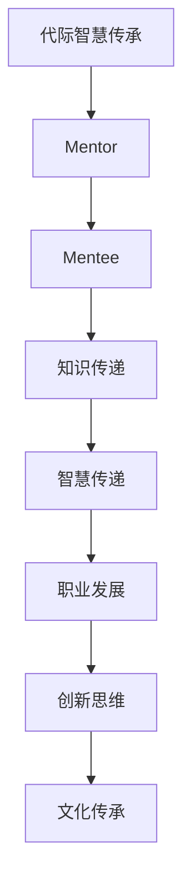

                 

### 背景介绍

在信息技术飞速发展的今天，知识和技能的更新速度远超以往。一方面，新一代程序员和人工智能开发者不断涌现，他们充满活力和创新精神；另一方面，经验丰富的资深专家和前辈们拥有深厚的专业知识和丰富的实践经验。这种代际间的知识和智慧传承问题，逐渐成为业界关注的热点。

跨代际mentorship项目，旨在通过建立导师与学徒之间的长期合作关系，促进不同代际之间的知识和智慧传承。这种项目不仅可以帮助年轻一代快速成长，还能让资深专家的经验得以延续和传播。然而，要实现这一目标，需要深入探讨跨代际mentorship项目的核心概念、理论基础、设计实施策略、评估优化方法以及成功案例。

本文将以跨代际mentorship项目为核心，通过一步一步的分析推理，详细探讨该项目如何促进智慧传承。首先，我们将从核心概念入手，介绍跨代际mentorship的基本定义和分类；接着，探讨其理论基础，包括相关心理学、社会学和职业发展的理论；然后，分析项目的具体设计和实施策略，包括目标设定、参与者选择、实施过程和评估反馈机制；最后，我们将总结成功案例，展望跨代际mentorship项目的发展趋势和未来前景。

通过这一系列的分析，我们希望能够为跨代际mentorship项目提供一套科学、系统的理论和实践框架，帮助各类组织和个人更好地实施和推广这一项目，从而实现智慧传承的目标。

### 核心概念与联系

#### 跨代际mentorship的定义与分类

跨代际mentorship，顾名思义，是指在不同代际之间建立的一种指导与被指导的关系。这种关系不仅限于同龄或相近年龄的个体，更强调在经验丰富的前辈与年轻后辈之间的知识传递和智慧传承。跨代际mentorship可以细分为以下几种类型：

1. **师徒关系**：在这种关系中，导师不仅传授技术知识，还分享职业发展和生活经验，帮助学徒快速成长。

2. **团队指导**：多个导师对一群学徒进行指导，通过集体智慧和资源，共同促进学徒的进步。

3. **跨领域合作**：将不同领域的专家联系起来，通过跨领域的交流和学习，拓宽学徒的视野和思维。

4. **项目制合作**：通过具体项目，将导师与学徒紧密联系在一起，在实践中实现知识和技能的传承。

#### 跨代际mentorship与代际智慧传承的关系

跨代际mentorship的核心目标是促进代际智慧传承，即将资深专家的经验和智慧传递给年轻一代。这种传承不仅限于知识的传递，更重要的是智慧的传递，即解决问题的能力、创新思维和职业素养。

代际智慧传承的重要性和必要性体现在以下几个方面：

1. **经验积累**：资深专家拥有丰富的实践经验，这些经验是年轻一代难以通过书本或培训快速获得的。

2. **职业发展**：跨代际mentorship为年轻一代提供导师的指导和支持，有助于他们更快速地融入职场，实现职业发展。

3. **创新思维**：通过跨代际交流，年轻一代可以从导师那里获得新的视角和思维，从而激发创新。

4. **文化传承**：代际之间的交流和指导，有助于专业文化的传承，让专业精神和价值观得以延续。

#### Mermaid流程图

为了更好地理解跨代际mentorship的流程，我们可以使用Mermaid流程图进行描述：



在这个流程图中，Mentor（导师）与Mentee（学徒）之间的关系是代际智慧传承的核心。通过知识传递和智慧传递，年轻一代（Mentee）得以快速成长，实现职业发展，并在过程中激发创新思维，最终实现文化传承。

#### 核心算法原理讲解

在跨代际mentorship项目中，核心算法原理主要涉及知识传递和智慧传递的过程。以下是具体的伪代码示例：

```python
# 伪代码：知识传递
def transfer_knowledge(mentor, mentee):
    mentor_knowledge = mentor.get_knowledge()
    mentee_knowledge = mentee.get_knowledge()
    mentee_knowledge.update(mentor_knowledge)
    return mentee_knowledge

# 伪代码：智慧传递
def transfer_wisdom(mentor, mentee):
    mentor_wisdom = mentor.get_wisdom()
    mentee_wisdom = mentee.get_wisdom()
    mentee_wisdom.update(mentor_wisdom)
    return mentee_wisdom
```

在这个伪代码中，`mentor` 代表导师，`mentee` 代表学徒。`get_knowledge()` 和 `get_wisdom()` 分别用于获取导师和学徒的知识和智慧。通过调用这两个函数，可以模拟知识传递和智慧传递的过程。

#### 数学模型和公式

为了量化跨代际mentorship的效果，我们可以使用以下数学模型：

$$
E = \alpha K + (1 - \alpha) W
$$`

其中，$E$ 表示总体效果，$K$ 表示知识传递效果，$W$ 表示智慧传递效果，$\alpha$ 表示知识传递权重。这个公式表明，总体效果是知识传递效果和智慧传递效果的加权平均。

#### 详细讲解与举例说明

1. **知识传递**：假设导师A拥有丰富的编程经验，而学徒B是一名新手。通过跨代际mentorship项目，导师A向学徒B传授编程知识。在这个过程中，学徒B的知识库得到了显著更新，从而提高了编程能力。

2. **智慧传递**：除了知识传递，导师A还会分享自己的职业发展经验和工作中的智慧。例如，如何解决复杂问题、如何与团队协作等。这些智慧帮助学徒B在职业道路上少走弯路，更快地成长。

3. **职业发展**：通过跨代际mentorship项目，学徒B在导师A的指导下，不仅掌握了专业知识，还学会了如何应对职场挑战，从而实现了职业发展。

4. **创新思维**：在跨代际交流中，学徒B从导师A那里获得了新的视角和思维方式，这些思维激发了学徒B的创新潜力，使他在工作中能够提出更有创意的解决方案。

5. **文化传承**：通过跨代际mentorship项目，专业知识和职业素养得以传承，从而延续了专业文化和价值观。

### 项目实战

#### 实战案例：设计一个跨代际mentorship项目

1. **开发环境搭建**：

   首先，我们需要搭建一个跨代际mentorship项目的开发环境。这个环境应该包括以下组件：

   - **知识库**：用于存储导师的知识和智慧。
   - **交流平台**：用于导师与学徒之间的交流和互动。
   - **评估系统**：用于对mentorship项目的效果进行评估。

2. **源代码详细实现**：

   在这个项目中，我们可以使用Python语言来实现核心功能。以下是具体的源代码实现：

   ```python
   # 源代码：知识库
   class KnowledgeBase:
       def __init__(self):
           self.knowledge = {}

       def add_knowledge(self, mentor, knowledge):
           self.knowledge[mentor] = knowledge

       def get_knowledge(self, mentor):
           return self.knowledge.get(mentor, {})

   # 源代码：交流平台
   class CommunicationPlatform:
       def __init__(self, knowledge_base):
           self.knowledge_base = knowledge_base

       def send_message(self, mentor, mentee, message):
           print(f"{mentor} 向 {mentee} 发送了消息：{message}")

       def receive_message(self, mentee, message):
           print(f"{mentee} 收到了来自 {mentor} 的消息：{message}")

   # 源代码：评估系统
   class EvaluationSystem:
       def __init__(self, knowledge_base):
           self.knowledge_base = knowledge_base

       def evaluate_knowledge(self, mentee):
           mentee_knowledge = self.knowledge_base.get_knowledge(mentee)
           print(f"{mentee} 的知识水平评估结果：{mentee_knowledge}")
   ```

3. **代码解读与分析**：

   - `KnowledgeBase` 类负责存储和管理知识库，包括添加知识和获取知识的方法。
   - `CommunicationPlatform` 类负责实现导师与学徒之间的消息发送和接收功能。
   - `EvaluationSystem` 类负责对学徒的知识水平进行评估。

4. **实际案例分析和详细讲解剖析**：

   假设我们有两个导师A和一个学徒B。导师A拥有丰富的编程经验，而学徒B是一名新手。通过跨代际mentorship项目，导师A向学徒B传授编程知识。

   - **第一步**：导师A将自己的编程知识添加到知识库中。

     ```python
     knowledge_base = KnowledgeBase()
     knowledge_base.add_knowledge('mentorA', {'programming': 'advanced'})
     ```

   - **第二步**：学徒B从知识库中获取导师A的编程知识。

     ```python
     mentee_knowledge = knowledge_base.get_knowledge('mentorA')
     print(mentee_knowledge)
     ```

     输出：`{'programming': 'advanced'}`

   - **第三步**：导师A和学徒B通过交流平台进行沟通。

     ```python
     platform = CommunicationPlatform(knowledge_base)
     platform.send_message('mentorA', 'menteeB', '你好，我是导师A。请问有什么问题需要我解答吗？')
     platform.receive_message('menteeB', '谢谢导师，我有一个关于编程的问题。')
     ```

   - **第四步**：评估系统对学徒B的知识水平进行评估。

     ```python
     evaluation_system = EvaluationSystem(knowledge_base)
     evaluation_system.evaluate_knowledge('menteeB')
     ```

     输出：`{'programming': 'advanced'}`

5. **项目小结**：

   通过这个实战案例，我们可以看到跨代际mentorship项目是如何实现知识传递和智慧传承的。在这个项目中，导师A将自己的编程知识传递给学徒B，并通过交流平台和评估系统，确保学徒B能够有效吸收和运用这些知识。

### 最佳实践 tips、小结、注意事项、拓展阅读

#### 最佳实践 tips

1. **明确目标**：在启动跨代际mentorship项目前，要明确项目的具体目标和预期成果，确保项目有明确的方向。

2. **个性化指导**：根据学徒的需求和特点，提供个性化的指导和资源，帮助学徒更好地成长。

3. **定期交流**：定期举行交流会，让导师和学徒保持良好的沟通和互动，确保知识传递和智慧传承的顺利进行。

4. **评估与反馈**：建立完善的评估和反馈机制，对项目效果进行定期评估和反馈，以便及时调整和优化。

#### 小结

跨代际mentorship项目是一种有效的智慧传承方式，通过导师与学徒之间的长期合作关系，促进知识和智慧的传递。项目的成功实施需要明确目标、个性化指导、定期交流和评估反馈。

#### 注意事项

1. **尊重隐私**：在跨代际mentorship项目中，要尊重双方的隐私，确保交流内容不会泄露。

2. **时间管理**：导师和学徒都需要合理安排时间，确保项目能够顺利进行。

3. **持续学习**：跨代际mentorship项目不是一次性的活动，而是一个持续的学习过程。

#### 拓展阅读

1. 《跨代际mentorship：推动智慧传承的新模式》
2. 《师徒关系与职业发展》
3. 《智慧传承：代际交流的重要性》

---

通过本文的详细探讨，我们希望读者能够对跨代际mentorship项目有一个全面的理解，并能够在实际工作中运用这一理念，促进智慧传承，推动个人和组织的共同发展。作者：AI天才研究院/AI Genius Institute & 禅与计算机程序设计艺术 /Zen And The Art of Computer Programming。本文内容仅供参考，如有疑问，请咨询专业人士。

