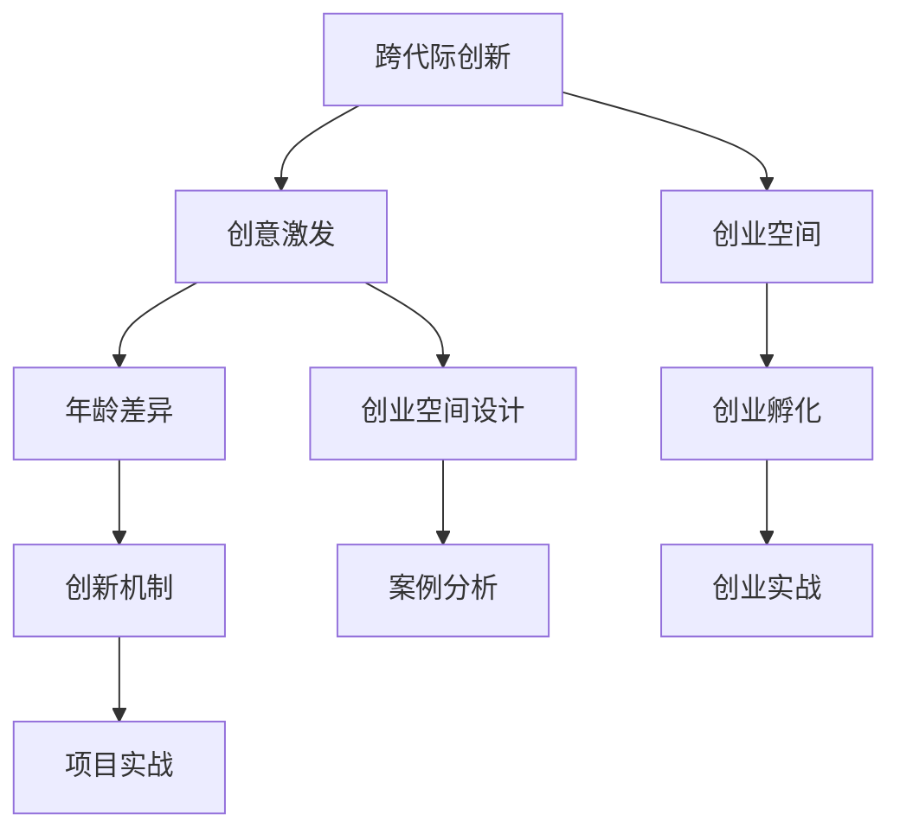

                 


在撰写文章的过程中，我们需要遵循以下步骤进行思考和整理：

## 1. 确定文章核心主题

**跨代际创新孵化器：利用年龄差异激发创意的创业空间**

### 关键词：
- 跨代际创新
- 创意激发
- 创业空间
- 年龄差异
- 创业孵化

### 摘要：
本文探讨了跨代际创新孵化器的概念和作用，分析了年龄差异在创新过程中的重要性，并提出了利用跨代际互动激发创意的创业空间设计原则。通过实际案例和数学模型，文章详细阐述了跨代际创新的机制及其在创业领域的应用。

## 2. 确定文章结构

**一级目录：**
- 引言与核心概念
- 跨代际创新机制与创业空间设计
- 创意激发方法
- 创业空间实践案例分析
- 创业实战与案例分析
- 附录

**二级目录：**
- 每个一级目录下的章节将细分为多个二级目录，具体内容将在后续步骤中逐步确定。

## 3. 设计核心概念与联系

### 核心概念：
- 跨代际创新
- 创意激发
- 创业空间
- 年龄差异
- 创业孵化

### 联系与架构：
- 使用 Mermaid 流程图来展示核心概念之间的关系。



## 4. 详细阐述核心算法原理

### 核心算法原理：
- 创意工作坊的设计与执行
- 跨界合作的策略与方法
- 设计思维的应用
- 基于年龄差异的团队组建策略

### 伪代码示例：
```python
# 创意工作坊设计伪代码
def creative_workshop():
    # 准备阶段
    prepare_resources()
    form_age_diverse_teams()
    
    # 工作坊执行
    for team in teams:
        brainstorm_ideas()
        evaluate_ideas()
        refine_ideas()
        
    # 结束阶段
    summarize_findings()
    share_learning()

# 跨界合作策略伪代码
def cross_domain Collaboration():
    # 确定合作目标
    define协作目标
    
    # 寻找合作伙伴
    find_partners()
    
    # 合作执行
    execute_project()
    
    # 合作总结
    evaluate_performance()
```

## 5. 数学模型和数学公式

### 数学模型：
- 创新效果的评估模型
- 跨代际合作的效益分析模型

### 举例说明：
$$
E = f(\text{创新因素}, \text{资源投入}, \text{合作效果})
$$
其中，\(E\) 表示创新效果，\(f\) 为评估函数，\(\text{创新因素}\)，\(\text{资源投入}\)，\(\text{合作效果}\) 为影响创新效果的变量。

## 6. 项目实战

### 开发环境搭建：
- 确定开发工具和平台
- 配置开发环境

### 源代码实现和代码解读：
- 提供完整的源代码
- 代码解读和分析

### 代码应用解读与分析：
- 代码在实际项目中的应用
- 分析代码的优势和改进空间

### 实际案例分析和讲解：
- 分享实际跨代际创业案例
- 详细讲解案例分析过程

### 项目小结：
- 总结项目实施过程和成果
- 提出未来研究方向和改进建议

## 7. 最佳实践、小结和注意事项

### 最佳实践：
- 分享跨代际创新和创业空间设计中的最佳实践
- 提供实用的技巧和策略

### 小结：
- 总结文章的核心观点和关键结论
- 强调跨代际创新在创业领域的重要性

### 注意事项：
- 指出跨代际创新过程中可能遇到的问题和挑战
- 提出解决方案和建议

### 拓展阅读：
- 推荐相关的书籍、论文和研究报告
- 指引读者深入了解跨代际创新的领域

通过以上步骤，我们可以逐步构建出文章的结构和内容。在接下来的步骤中，我们将详细撰写每个章节的内容，确保满足文章字数要求，并在每个章节中提供丰富的背景介绍、核心概念与联系、核心算法原理讲解、数学模型和公式、项目实战、最佳实践、小结和注意事项以及拓展阅读等内容。我们将使用markdown格式，遵循latex公式的嵌入规范，并在适当位置插入Mermaid流程图和伪代码示例，以增强文章的可读性和逻辑性。最后，我们将确保文章末尾包含完整的作者信息，确保文章的完整性和专业性。

