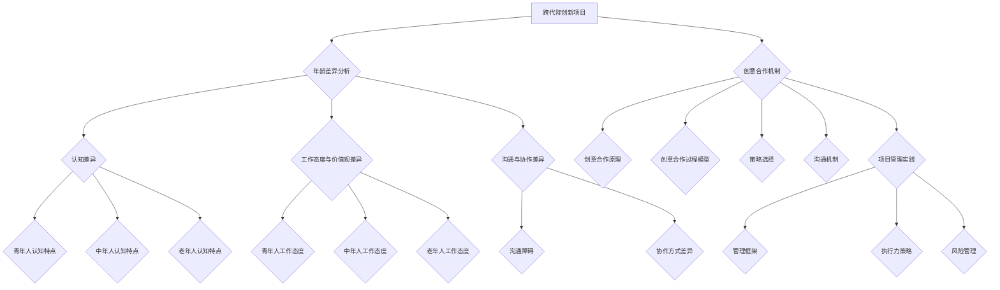

                 

## 引言

### 1.1 跨代际创新项目的背景

跨代际创新项目是指在项目团队中包含不同年龄段成员的创新项目。随着社会的发展，年龄差异变得越来越显著，尤其是在信息技术和人工智能等快速发展的领域。这种跨代际的差异不仅体现在知识结构和技能水平上，还涉及到思维方式、工作态度和价值观等方面。因此，如何充分利用年龄差异激发创意合作，已成为当今企业和社会亟需解决的问题。

近年来，随着全球老龄化问题的加剧，跨代际合作的重要性日益凸显。不同年龄段的人拥有各自独特的经验和智慧，如何将这些差异转化为创新的动力，是跨代际创新项目需要深入探讨的问题。此外，创新项目本身具有高风险、高不确定性等特点，因此如何通过跨代际合作降低风险，提高项目成功率，也是当前研究的重要方向。

### 1.2 年龄差异与创新的重要性

年龄差异对创新的影响是多方面的。首先，不同年龄段的人拥有不同的知识积累和经验，这直接影响他们的创新思维和创新能力。例如，青年人通常具有更丰富的想象力和接受新事物的能力，而中年人则拥有更丰富的实践经验和社会资源，老年人则可能在长期积累中形成了独特的洞察力。

其次，年龄差异还会影响创新过程中的沟通与合作。不同年龄段的人可能有不同的沟通风格和协作方式，这可能导致沟通障碍和协作效率的降低。因此，如何建立有效的沟通机制和协作模式，是跨代际创新项目成功的关键。

此外，年龄差异对创新项目的管理和执行也有重要影响。不同年龄段的人可能对项目目标、项目进度和质量有不同的期望和标准，这需要项目管理者在制定项目计划和进行风险控制时充分考虑。

综上所述，年龄差异不仅是跨代际创新项目中的一个重要因素，也是推动创新的重要动力。通过深入研究年龄差异对创新的影响，并建立相应的创新机制和项目管理方法，可以大大提高跨代际创新项目的成功率。

## 跨代际差异分析

### 2.1 不同年龄段的人的认知差异

跨代际创新项目中，不同年龄段的人由于成长环境和知识背景的不同，表现出明显的认知差异。以下是对青年人、中年人和老年人认知特点的分析：

#### 2.1.1 青年人的认知特点

青年人通常拥有丰富的想象力和创造力，他们善于接受新事物，勇于尝试不同的方法和思路。这种认知特点使青年人在创新项目中能够迅速捕捉到新的机会和挑战。然而，由于经验不足，青年人在面对复杂问题时可能缺乏系统的分析和解决能力。

青年人的知识结构通常较为广泛，但深度不足。这使得他们在项目中能够迅速获取新知识，但可能在专业领域的深入研究上有所欠缺。此外，青年人的思维方式较为灵活，喜欢从不同角度进行思考，这有助于激发创意思维，但也可能导致思考的片面性。

#### 2.1.2 中年人的认知特点

中年人通常具有丰富的经验和专业知识，他们在多年的工作和生活中积累了宝贵的实践经验和人际资源。这使得中年人在面对复杂问题时，能够迅速做出准确的判断和决策。此外，中年人通常具有较好的沟通能力和团队合作精神，这有助于他们在创新项目中发挥重要作用。

然而，中年人的思维可能较为固定，习惯按照既定的模式进行思考。这可能导致他们在面对新问题时，缺乏创新和突破的能力。此外，中年人可能在信息获取和接受新事物方面相对较慢，这可能影响他们的创新思维和创新能力。

#### 2.1.3 老年人的认知特点

老年人通常具有深厚的专业知识和丰富的经验，这使得他们在面对复杂问题时，能够从多个角度进行思考和分析。此外，老年人通常具有较强的洞察力和判断力，这有助于他们在创新项目中发挥重要作用。

老年人的思维方式通常较为保守，他们更倾向于遵循传统的思路和方法。这可能导致他们在面对新事物时，缺乏创新和突破的勇气。此外，老年人的身体条件可能影响他们的工作强度和持续时间，这在创新项目中需要特别注意。

### 2.2 年龄差异对创新思维的影响

不同年龄段的认知差异对创新思维有着重要影响。首先，青年人的想象力和创造力使他们在创新项目中能够迅速提出新的想法和解决方案。然而，由于缺乏经验，他们的创新思维可能较为理想化，需要中年人和老年人进行补充和修正。

中年人的经验和专业知识使他们能够从多个角度分析和解决创新问题。他们的创新思维通常较为务实，能够有效降低项目的风险。然而，他们的思维可能较为固定，需要青年人的创新思维进行补充和突破。

老年人通常具有深厚的专业知识和丰富的经验，他们的创新思维能够在复杂问题上提供独特的见解和解决方案。然而，他们的思维可能较为保守，需要青年人和中年人的创新思维进行补充和调整。

综上所述，不同年龄段的认知差异对创新思维有着重要影响。通过合理利用不同年龄段的优势，可以形成一个互补的团队，提高跨代际创新项目的成功率。

### 2.3 年龄差异对创新实践的影响

年龄差异不仅在认知层面影响创新思维，也在创新实践过程中发挥作用。不同年龄段的人在面对创新任务时，表现出不同的工作态度和协作方式。

#### 2.3.1 工作态度

青年人通常充满活力和热情，他们愿意接受挑战和承担风险，这使得他们在创新项目中能够迅速投入并积极参与。然而，由于缺乏工作经验，青年人可能在面对复杂问题时表现出焦虑和不安，需要中年人和老年人的支持和指导。

中年人通常具有稳定的工作态度和成熟的心态，他们能够有效应对创新项目中的各种挑战和压力。中年人的责任心和敬业精神使他们能够在项目团队中发挥关键作用，确保项目按计划推进。然而，中年人可能由于工作压力和生活负担，有时会表现出疲惫和缺乏创新动力。

老年人通常具有丰富的经验和深厚的专业知识，他们的工作态度通常较为严谨和认真。老年人能够在项目中提供宝贵的经验和建议，帮助团队避免重复犯错。然而，由于年龄和身体条件的原因，老年人可能在工作中表现出较低的灵活性和适应性，这需要青年人和中年人的支持和配合。

#### 2.3.2 协作方式

跨代际创新项目中的协作方式受到年龄差异的显著影响。青年人通常喜欢自由开放的工作环境，他们更喜欢通过合作和交流来推动项目的进展。青年人的协作方式通常较为灵活和多样，他们能够快速适应变化，但有时可能缺乏系统性和计划性。

中年人通常偏好结构化和规范化的工作环境，他们更注重项目的进度和质量。中年人的协作方式通常较为稳健和有序，他们能够在团队中起到协调和领导作用。然而，中年人可能由于年龄和经验的限制，难以完全适应快速变化的环境。

老年人通常偏好传统的协作方式，他们更注重团队的稳定和合作。老年人的协作方式通常较为保守和谨慎，他们能够在项目中提供宝贵的经验和指导。然而，老年人可能由于身体条件的限制，难以参与高强度和快节奏的工作。

综上所述，年龄差异对创新实践有着重要影响。通过合理利用不同年龄段的优势，可以形成一个互补的团队，提高跨代际创新项目的成功率。同时，项目管理者需要关注不同年龄段成员的工作态度和协作方式，为他们提供适当的支持和指导。

### 2.4 年龄差异对工作态度和价值观的影响

在跨代际创新项目中，不同年龄段的人不仅在认知和实践层面存在差异，他们的工作态度和价值观也受到年龄差异的显著影响。

#### 2.4.1 工作态度

青年人通常表现出强烈的好奇心和求知欲，他们乐于接受新的挑战和尝试新的工作方式。青年人的工作态度通常积极向上，充满活力和创造力。然而，由于缺乏工作经验和职业规划，青年人在面对复杂的工作环境和压力时可能表现出焦虑和不安。

中年人通常具有成熟的工作态度和坚定的职业信念。他们能够平衡工作与生活，具有较强的责任感和使命感。中年人在团队中通常表现出较高的稳定性和可靠性，他们能够有效承担重要任务和责任。然而，中年人可能由于年龄和职业发展阶段的限制，对新的工作方式和新技术接受度较低。

老年人通常具有丰富的经验和深厚的职业素养，他们在工作中表现出高度的责任感和敬业精神。老年人能够为公司提供宝贵的经验和智慧，帮助他们克服各种困难和挑战。然而，由于身体条件的限制，老年人可能无法承受高强度的工作压力，这需要项目团队在其他方面进行补充和配合。

#### 2.4.2 价值观

青年人的价值观通常较为理想化，他们更关注个人成长和职业发展，追求自由、平等和公正。青年人在工作中强调自我实现和自我价值，他们希望通过创新和实践来展现自己的能力和才华。

中年人的价值观通常较为务实和现实，他们更注重团队合作和共同发展。中年人在工作中强调责任和贡献，他们希望通过实现团队目标来实现个人价值。中年人通常具有较强的社会责任感，愿意为公司和社会做出贡献。

老年人的价值观通常较为保守和传统，他们更重视家庭和人际关系。老年人在工作中强调传承和经验分享，他们希望通过自己的经验和知识来帮助年轻一代成长。老年人通常对社会和公司的发展具有较强的责任感，愿意为公司和社会的长远发展做出贡献。

综上所述，年龄差异对工作态度和价值观有着重要影响。通过理解和尊重不同年龄段成员的工作态度和价值观，可以促进跨代际创新项目的顺利进行。项目管理者需要关注不同年龄段成员的需求和期望，为他们提供适当的培训和激励，以充分发挥他们的潜力。

### 2.5 年龄差异对跨代际沟通和协作的影响

在跨代际创新项目中，不同年龄段的成员在沟通和协作方面存在显著的差异，这些差异可能影响项目的进展和效果。以下分析不同年龄段在沟通和协作中的特点及其影响：

#### 2.5.1 沟通障碍

青年人通常倾向于使用数字化工具和社交媒体进行沟通，他们习惯于快速、直接的信息传递。然而，这种沟通方式可能导致沟通内容缺乏深度和细节，特别是在复杂问题的讨论中。此外，青年人可能因为追求创新和个性化，而忽视传统沟通礼仪和规范，这可能导致中年人和老年人感到困惑或不适。

中年人通常具有较高的沟通技巧和丰富的沟通经验，他们擅长在正式和非正式场合进行有效沟通。然而，中年人可能因为年龄和经验的关系，对新技术的接受和掌握程度较低，这可能导致他们在与青年人沟通时出现障碍。此外，中年人可能过于注重沟通的规范和形式，而忽视了沟通的灵活性和创造性。

老年人通常具有深厚的沟通技巧和丰富的社会经验，他们在沟通中表现出较高的耐心和细致。然而，由于年龄和健康问题，老年人可能在沟通速度和效率上有所下降。此外，老年人可能因为传统价值观的影响，对新技术和新方法持保留态度，这可能导致他们在与青年人沟通时产生误解和冲突。

#### 2.5.2 协作差异

青年人通常具有较高的团队合作精神，他们喜欢在开放和自由的环境中工作。青年人擅长利用数字化工具进行远程协作和实时沟通，这使得他们在跨地域和跨时间的协作中表现出色。然而，青年人在面对复杂任务时可能缺乏经验和耐心，这可能导致他们在项目协作中表现出急躁和冲动。

中年人通常具有较强的团队合作意识和责任感，他们擅长在复杂和多变的环境中保持团队的稳定和高效。中年人能够有效地协调不同团队成员之间的关系，确保项目的顺利进行。然而，中年人可能因为过于注重规范和流程，而忽视创新和灵活性，这可能导致项目在快速变化的环境中失去竞争力。

老年人通常具有丰富的经验和深厚的专业知识，他们在项目中能够提供宝贵的见解和指导。老年人擅长在团队中发挥传帮带的作用，帮助年轻成员成长。然而，老年人可能在适应新技术和新方法方面存在困难，这可能导致他们在项目协作中表现出保守和滞后。

#### 2.5.3 影响因素

跨代际沟通和协作的差异主要受到以下几个因素的影响：

1. **知识差异**：不同年龄段的人拥有不同的知识和经验，这可能导致他们在理解和解释问题时产生差异，从而影响沟通和协作的效率。

2. **文化背景**：不同年龄段的人成长在不同的文化环境中，这可能导致他们在价值观、行为规范和沟通方式上存在差异，从而影响跨代际协作的和谐度。

3. **技术掌握**：不同年龄段的人对新技术的掌握程度不同，这可能导致他们在使用数字化工具和平台进行沟通和协作时出现困难。

4. **工作需求**：不同年龄段的人对工作的需求不同，这可能导致他们在工作态度、协作方式和任务分配上存在差异。

#### 2.5.4 解决策略

为了克服跨代际沟通和协作的差异，可以采取以下策略：

1. **加强沟通培训**：针对不同年龄段的团队成员，开展沟通技巧和跨文化沟通的培训，提高他们的沟通能力和协作意识。

2. **建立多元化的沟通平台**：利用数字化工具和平台，建立多元化的沟通渠道，以便不同年龄段的团队成员能够选择适合自己的沟通方式。

3. **促进经验分享**：鼓励不同年龄段的成员之间进行经验分享和交流，以增进彼此的了解和信任，促进跨代际协作的和谐度。

4. **制定明确的协作规范**：制定明确的协作规范和流程，确保不同年龄段的成员在协作中能够遵循相同的规则，提高协作效率。

5. **关注个体差异**：项目管理者应关注不同年龄段成员的个体差异，为他们提供个性化的支持和指导，确保他们在项目中能够发挥最佳作用。

通过上述策略，可以有效地减少跨代际沟通和协作的差异，提高跨代际创新项目的成功率。项目管理者需要不断探索和优化跨代际协作模式，以适应不断变化的社会和工作环境。

### 2.6 跨代际差异对创新项目管理和执行的影响

跨代际差异不仅体现在团队成员的认知、沟通和协作方面，还直接影响到创新项目管理和执行的效果。以下分析不同年龄段对创新项目管理方式和执行效率的影响：

#### 2.6.1 项目管理方式

青年人通常喜欢采用敏捷和迭代的项目管理方式，他们倾向于快速响应变化，注重实验性和探索性。青年人的项目管理风格灵活，能够迅速适应新环境和新技术。然而，由于缺乏经验，青年人在项目规划和风险控制方面可能不够成熟，需要中年人和老年人的指导和监督。

中年人则倾向于采用更加稳健和系统化的项目管理方式。他们注重项目计划、进度控制和风险管理，能够有效地确保项目按计划推进。中年人的项目管理风格注重细节和执行力，能够提高项目的稳定性和可靠性。然而，中年人的管理风格可能相对保守，对于快速变化和创新性任务的反应较慢。

老年人通常具有丰富的项目管理和实践经验，他们擅长在复杂和多变的环境中保持项目的稳定性。老年人的项目管理风格注重传承和经验分享，能够帮助团队规避风险和减少失误。然而，老年人可能在适应新技术和新方法方面存在困难，这可能限制他们在创新项目中的作用。

#### 2.6.2 执行效率

跨代际差异对创新项目的执行效率有着重要影响。青年人通常具有较高的执行效率，他们能够迅速理解和适应任务要求，具有较强的动手能力和解决问题的能力。然而，由于缺乏经验，青年人在面对复杂和长期任务时可能表现出效率下降和执行力不足。

中年人在执行任务时表现出较高的稳定性和持续性，他们能够保持较高的工作效率，并能够在长时间内保持专注和耐心。中年人的执行效率通常较高，他们能够有效地管理资源和时间，确保任务按时完成。然而，中年人可能由于习惯和经验的影响，对新技术的接受和掌握程度较低，这可能导致他们在执行新技术相关的任务时效率较低。

老年人通常具有丰富的经验和深厚的专业知识，他们的执行效率在处理复杂和长期任务时表现尤为突出。老年人能够在项目中提供宝贵的经验和建议，帮助他们团队避免重复犯错。然而，由于身体条件和年龄的限制，老年人的执行效率可能相对较低，需要青年人和中年人的支持和配合。

#### 2.6.3 管理策略

为了充分发挥不同年龄段成员的优势，提高跨代际创新项目的管理和执行效率，可以采取以下策略：

1. **建立多元化的管理团队**：确保团队中包含不同年龄段的成员，形成互补的管理结构，以提高项目管理的全面性和适应性。

2. **明确角色和责任**：根据不同年龄段成员的特点和能力，明确他们在项目中的角色和责任，确保每个成员都能发挥最佳作用。

3. **提供培训和指导**：为不同年龄段的成员提供针对性的培训和指导，帮助他们提升技能和适应新环境。

4. **鼓励经验分享**：建立经验分享机制，鼓励不同年龄段的成员之间进行交流和合作，以促进知识和经验的传承。

5. **关注个体差异**：项目管理者应关注不同年龄段成员的个体差异，为他们提供个性化的支持和指导，确保他们在项目中能够发挥最佳作用。

通过上述策略，可以有效地减少跨代际差异对创新项目管理和执行的影响，提高项目的整体效率和成功率。项目管理者需要不断探索和优化跨代际协作模式，以适应不断变化的社会和工作环境。

### 2.7 总结与展望

通过对跨代际差异的详细分析，我们可以看到不同年龄段的人在认知、沟通、协作、管理等方面存在显著差异。这些差异在跨代际创新项目中不仅影响团队成员的个人表现，还直接关系到项目的整体效果。合理利用这些差异，可以形成一个互补的团队，提高创新项目的成功率。

在未来的创新项目中，我们应重点关注以下几个方面：

1. **多元化团队建设**：鼓励跨代际的多元化团队建设，确保团队成员涵盖不同年龄段，以充分发挥各自的优势。

2. **沟通与协作优化**：建立有效的沟通机制和协作模式，减少沟通障碍，提高协作效率。

3. **能力提升与经验传承**：为不同年龄段的成员提供针对性的培训和指导，促进知识和经验的传承，提高团队的整体能力。

4. **灵活的管理策略**：根据不同年龄段成员的特点，制定灵活的管理策略，确保项目能够顺利推进并适应快速变化的环境。

通过上述措施，我们可以更好地利用跨代际差异，激发创意合作，推动创新项目的成功。

## 创意合作机制

### 3.1 创意合作的原理与策略

创意合作是指不同成员在创新过程中通过交流、协作和互动，共同产生新的创意和解决方案的过程。跨代际创意合作的原理主要基于以下几点：

1. **差异互补**：不同年龄段的人拥有不同的知识、经验和思维方式，这种差异互补可以促进创意的产生和优化。例如，青年人的创新思维和想象力可以与中年人的实际操作经验和老年人的深度洞察力相结合，形成更全面、更有效的解决方案。

2. **知识共享**：创意合作过程中的知识共享是激发创意的关键。不同年龄段的成员可以分享各自领域的专业知识和经验，通过相互学习和借鉴，提升整体创新能力。

3. **协同创新**：创意合作中的协同创新是指团队成员共同面对问题，通过分工合作、资源整合和创意碰撞，实现创意的协同发展和优化。这种协同创新机制可以大大提高创新项目的效率和成功率。

为了实现有效的创意合作，可以采取以下策略：

1. **建立开放沟通机制**：鼓励团队成员之间的开放沟通，通过定期的会议、讨论和交流，促进信息共享和思维碰撞。

2. **构建多元文化**：在团队中构建多元文化，尊重不同年龄段成员的文化背景和价值观，营造包容和谐的工作氛围。

3. **设立共同目标**：明确团队目标，确保所有成员都明确自己的职责和贡献，提高团队的凝聚力和合作意愿。

4. **提供激励机制**：建立激励机制，鼓励团队成员积极参与创意合作，对有创意的成员给予奖励和认可，激发他们的创新热情。

### 3.2 创意合作的过程模型

创意合作的过程可以看作是一个动态的系统，涉及多个阶段和环节。以下是创意合作的一般过程模型：

1. **需求识别**：首先，团队需要识别和明确创新项目的需求。这可以通过市场调研、用户反馈、竞争分析等方式实现。

2. **信息收集**：在需求识别之后，团队需要收集与需求相关的各种信息，包括市场趋势、技术进展、用户需求等。

3. **创意生成**：基于收集到的信息，团队成员通过头脑风暴、创意碰撞等方式，产生各种可能的创意和解决方案。

4. **创意筛选**：对生成的创意进行筛选和评估，选择最具潜力和可行性的创意进行进一步开发。

5. **创意优化**：在筛选出的创意基础上，团队成员通过反复讨论、修改和迭代，进一步优化创意，提高其可行性和实用性。

6. **实施与验证**：将优化后的创意转化为具体的产品或服务，进行实施和验证，通过实际应用来检验创意的有效性和可行性。

7. **反馈与改进**：在实施过程中，及时收集用户反馈和市场反应，对创意进行持续的改进和优化，以提高其竞争力。

### 3.3 创意合作的策略选择

在创意合作中，策略的选择至关重要。以下是一些常用的策略选择：

1. **任务分配**：根据团队成员的技能、经验和兴趣，合理分配任务，确保每个成员都能在自己的优势领域发挥作用。

2. **角色明确**：明确团队成员的角色和职责，确保每个人都知道自己的任务和目标，提高协作效率。

3. **激励制度**：建立激励机制，鼓励团队成员积极参与创意合作，对有创意的成员给予奖励和认可。

4. **沟通机制**：建立高效的沟通机制，确保信息在团队成员之间畅通无阻，减少沟通障碍和误解。

5. **时间管理**：合理规划时间和任务，确保项目按计划推进，避免拖延和冲突。

6. **反馈机制**：建立反馈机制，及时收集和处理团队成员的意见和建议，不断改进创意合作过程。

7. **资源整合**：充分利用团队内外部的资源，包括知识、技术、资金等，为创意合作提供有力支持。

通过上述策略选择，可以有效提高创意合作的效果，推动创新项目的成功。

### 3.4 创意合作的沟通机制

在跨代际创新项目中，沟通机制的有效性直接影响创意合作的效率和质量。以下分析几种有效的沟通机制，以及如何应对跨代际沟通中的障碍：

#### 3.4.1 开放式沟通

开放式沟通是指团队成员之间能够自由表达观点和想法，不受任何限制和压力。这种沟通方式有助于激发创意思维，促进知识的共享和协作。

**优势**：开放式沟通能够提高团队成员的参与度和积极性，鼓励他们提出不同的见解和建议。这有助于发现更多创新的解决方案，提高项目的整体创意水平。

**挑战**：然而，开放式沟通也可能导致讨论变得混乱和冗长，特别是在跨代际团队中。不同年龄段的成员可能有不同的沟通风格和表达习惯，这可能影响沟通的效率和质量。

**解决方案**：为了克服这些挑战，可以采取以下措施：
- **设立明确的沟通目标**：在沟通前，明确讨论的主题和目标，确保所有成员都清楚需要讨论的内容。
- **提供沟通培训**：为团队成员提供沟通技巧培训，帮助他们提高沟通效率和表达能力。
- **利用数字化工具**：使用视频会议、即时通讯工具等数字化工具，提高沟通的实时性和效率。

#### 3.4.2 网络化沟通

网络化沟通是指通过建立网络化的沟通渠道和平台，实现团队成员之间的持续交流和协作。这种沟通方式有助于打破时间和空间的限制，提高沟通的灵活性和覆盖面。

**优势**：网络化沟通能够提高团队成员之间的互动频率和深度，促进信息的快速传递和共享。此外，网络化沟通可以记录和保存沟通内容，便于后续查阅和参考。

**挑战**：网络化沟通可能面临信息过载和沟通效率下降的风险，特别是在跨代际团队中，不同成员可能对数字化工具的熟悉程度和依赖程度不同。

**解决方案**：为了克服这些挑战，可以采取以下措施：
- **选择合适的沟通工具**：根据团队的具体需求和成员的技能水平，选择合适的沟通工具，确保所有成员都能轻松使用。
- **制定沟通规范**：明确网络化沟通的规范和礼仪，确保信息传递的准确性和规范性。
- **定期面对面沟通**：尽管网络化沟通方便，但定期的面对面沟通仍然非常重要，这有助于增强团队成员之间的信任和关系。

#### 3.4.3 跨文化沟通

跨文化沟通是指团队成员来自不同的文化背景，他们在沟通中需要理解和尊重彼此的文化差异。这种沟通方式在跨代际创新项目中尤为重要，因为不同年龄段的人可能有不同的文化习惯和价值观。

**优势**：跨文化沟通能够拓宽团队成员的视野，增加创意的多样性。不同文化的碰撞和融合，往往能够激发新的创意和解决方案。

**挑战**：然而，跨文化沟通也可能导致误解和冲突。不同文化背景的成员可能在沟通方式和表达习惯上存在差异，这可能导致沟通障碍和协作困难。

**解决方案**：为了克服这些挑战，可以采取以下措施：
- **文化培训**：为团队成员提供跨文化沟通培训，帮助他们了解和尊重不同的文化习惯和价值观。
- **建立文化共识**：在团队中建立共同的文化价值观和沟通原则，确保所有成员都遵守并尊重这些原则。
- **促进文化交流**：通过举办文化交流活动，增进团队成员之间的了解和信任，减少文化冲突。

#### 3.4.4 持续反馈与改进

持续反馈与改进是指在创意合作过程中，不断收集和处理团队成员的意见和建议，对创意进行持续的优化和改进。这种沟通机制有助于提高创意的质量和可行性。

**优势**：持续反馈与改进能够确保创意在开发和实施过程中不断得到优化，提高项目的成功率。此外，这种机制还能增强团队成员的参与感和责任感。

**挑战**：然而，持续反馈与改进可能面临信息过载和效率低下的问题，特别是在跨代际团队中，不同成员可能在反馈的时间和频率上存在差异。

**解决方案**：为了克服这些挑战，可以采取以下措施：
- **建立反馈机制**：制定明确的反馈流程和标准，确保所有成员都能及时、准确地提供反馈。
- **定期反馈会议**：定期召开反馈会议，讨论创意的进展和问题，确保团队成员之间的沟通和协作。
- **利用数字化工具**：使用数字化工具，如项目管理软件和在线反馈平台，提高反馈的效率和质量。

通过建立和优化上述沟通机制，可以有效地促进跨代际创新项目的创意合作，提高项目的成功率和创新水平。

## 项目管理实践

### 4.1 跨代际创新项目的管理框架

跨代际创新项目的成功离不开科学有效的管理。以下介绍跨代际创新项目管理的核心框架，包括基本原则、关键环节和风险管理策略。

#### 4.1.1 项目管理的基本原则

1. **目标导向**：明确项目目标，确保所有团队成员都明确项目方向和预期成果，以提高项目执行的一致性和效率。

2. **团队合作**：建立高效的团队合作机制，充分利用不同年龄段成员的优势，促进知识共享和协作创新。

3. **持续优化**：在项目执行过程中，持续评估项目进展和效果，及时调整策略和资源，确保项目能够按计划推进。

4. **透明沟通**：保持沟通的透明度，确保团队成员能够及时了解项目进展和问题，提高项目的透明度和参与度。

5. **风险管理**：建立完善的风险管理机制，提前识别和评估项目风险，制定相应的应对措施，降低项目风险。

#### 4.1.2 项目管理的关键环节

1. **项目启动**：在项目启动阶段，明确项目目标、范围、资源需求和时间表，确保项目能够顺利启动。

2. **项目计划**：制定详细的项目计划，包括任务分解、时间安排、资源分配和风险评估，为项目执行提供明确的方向和依据。

3. **项目执行**：在项目执行阶段，确保任务按时完成，监控项目进度和质量，及时处理问题和风险。

4. **项目监控**：通过定期的项目监控和评估，及时发现和解决项目中的问题和风险，确保项目按计划推进。

5. **项目收尾**：在项目收尾阶段，进行项目总结和评估，总结项目经验教训，为未来项目提供参考。

#### 4.1.3 项目风险管理策略

1. **风险识别**：通过市场调研、项目评估等方式，识别可能影响项目成功的风险因素。

2. **风险评估**：对识别出的风险进行评估，确定其发生概率和影响程度，为制定应对措施提供依据。

3. **风险应对**：根据风险评估结果，制定相应的风险应对措施，包括风险回避、风险转移和风险缓解等。

4. **风险监控**：在项目执行过程中，持续监控风险变化，及时调整应对措施，确保风险得到有效控制。

5. **应急计划**：制定应急计划，为项目可能发生的紧急情况提供应对方案，确保项目能够在紧急情况下迅速恢复。

通过遵循上述管理框架，可以有效地管理跨代际创新项目，提高项目的成功率和创新能力。

### 4.2 跨代际创新项目的执行力

跨代际创新项目的执行力是项目成功的关键因素。以下是提高跨代际创新项目执行力的策略和方法：

#### 4.2.1 执行力的定义与重要性

执行力是指团队在项目执行过程中，按照预定计划和目标，高效完成任务的的能力。跨代际创新项目的执行力不仅关系到项目的进展和质量，还直接影响项目的成功和团队的整体效率。提高执行力，可以确保项目按计划推进，降低风险，提高创新效果。

#### 4.2.2 提高跨代际项目执行力的方法

1. **明确任务分工**：在项目启动阶段，根据团队成员的能力和特长，明确每个人的任务和责任，确保每个任务都有明确的责任人。

2. **制定详细的计划**：在项目计划阶段，制定详细的任务分解和时间表，明确每个阶段的任务和时间节点，确保任务有序推进。

3. **建立有效的沟通机制**：建立高效的沟通机制，确保团队成员能够及时了解项目进展和问题，快速响应和解决问题。

4. **实施激励机制**：制定激励机制，对完成任务优秀的成员给予奖励和认可，激发团队成员的积极性和执行力。

5. **持续监控和调整**：在项目执行过程中，持续监控项目进展和任务完成情况，及时发现问题并调整计划，确保项目按计划推进。

6. **培养团队合作精神**：通过团队建设活动和培训，培养团队成员的团队合作精神，提高团队的整体执行力。

7. **提供培训和指导**：为团队成员提供针对性的培训和指导，提高他们的技能和执行能力。

8. **优化工作流程**：通过流程优化，减少不必要的环节和步骤，提高工作效率。

通过上述方法，可以有效提高跨代际创新项目的执行力，确保项目顺利进行，实现预期目标。

## 案例分析

### 5.1 案例一：XXX公司的跨代际创新项目

#### 5.1.1 项目背景

XXX公司是一家专注于人工智能领域的高科技公司，为了保持竞争力，公司决定启动一项跨代际创新项目，开发一款智能语音助手。项目团队由青年人、中年人和老年人组成，分别负责算法开发、产品设计和用户体验优化。

#### 5.1.2 项目执行过程

1. **需求识别与信息收集**：项目启动初期，团队进行了市场调研和用户需求分析，明确了智能语音助手的核心功能和用户需求。

2. **创意生成与筛选**：基于调研结果，团队成员提出了多种创意方案，包括基于深度学习的语音识别算法、多语言支持、个性化推荐等功能。团队经过讨论和评估，选择了最具潜力的方案进行开发。

3. **创意优化与实施**：在创意优化阶段，团队成员通过多次讨论和实验，不断改进算法和功能，最终开发出了一款具有高准确性和用户体验的智能语音助手。

4. **项目监控与反馈**：在项目执行过程中，团队建立了完善的监控和反馈机制，定期评估项目进展和效果，及时调整策略和资源，确保项目按计划推进。

#### 5.1.3 项目成果与启示

1. **项目成果**：项目最终成功开发出了一款智能语音助手，获得了市场的高度认可，为公司带来了显著的商业价值。

2. **启示**：
   - **多元化团队建设**：跨代际团队建设能够充分利用不同年龄段成员的优势，提高创新效果。
   - **沟通与协作**：建立高效的沟通机制和协作模式，确保团队内部信息畅通，减少沟通障碍。
   - **持续优化**：在项目执行过程中，持续监控和优化，确保项目质量和效率。
   - **激励机制**：建立激励机制，激发团队成员的积极性和创造力。

### 5.2 案例二：XXX高校的跨代际创新实践

#### 5.2.1 项目背景

XXX高校为了培养学生的创新能力和实践能力，决定开展一项跨代际创新实践项目，组织不同年级的学生合作开发一款教育应用。项目团队由本科生、研究生和教师组成，分别负责应用设计、技术开发和教学研究。

#### 5.2.2 项目执行过程

1. **需求识别与信息收集**：项目启动初期，团队成员进行了市场调研和教学需求分析，明确了教育应用的核心功能和用户需求。

2. **创意生成与筛选**：团队成员提出了多种创意方案，包括互动教学、在线作业、数据分析等功能。团队经过讨论和评估，选择了最具实用性和可行性的方案进行开发。

3. **创意优化与实施**：在创意优化阶段，团队成员通过多次讨论和实验，不断改进应用设计和功能，最终开发出了一款具有创新性和实用性的教育应用。

4. **项目监控与反馈**：在项目执行过程中，团队建立了完善的监控和反馈机制，定期评估项目进展和效果，及时调整策略和资源，确保项目按计划推进。

#### 5.2.3 项目成果与启示

1. **项目成果**：项目最终成功开发出了一款教育应用，获得了学生和教师的高度认可，提高了教学效果和学生的参与度。

2. **启示**：
   - **跨代际协作**：跨代际协作能够充分发挥不同年龄段成员的优势，提高项目的创新性和实用性。
   - **知识共享**：通过跨代际协作，学生和教师可以相互学习和分享知识，提高整体创新能力。
   - **持续反馈**：建立持续反馈机制，及时收集和处理团队成员的意见和建议，确保项目质量和效果。
   - **激励机制**：建立激励机制，激发团队成员的积极性和创造力，提高项目执行力。

通过上述案例分析，我们可以看到跨代际创新项目在实际操作中的成功经验和启示。跨代际创新项目不仅能够激发团队成员的创造力和创新能力，还能够提高项目的整体质量和效率。通过多元化团队建设、高效沟通和持续优化，可以确保跨代际创新项目的成功实施。

### 5.3 案例总结与启示

通过对XXX公司和XXX高校的跨代际创新项目案例分析，我们可以得出以下总结和启示：

1. **多元化团队建设**：跨代际团队建设是跨代际创新项目的成功关键。通过整合不同年龄段成员的知识、经验和技能，可以形成一个具有互补性和协同效应的团队，提高项目的创新性和实用性。

2. **沟通与协作**：建立高效的沟通机制和协作模式，确保团队成员之间的信息畅通和协作顺畅，是跨代际创新项目的成功保障。通过多元化的沟通工具和协作平台，可以促进团队成员之间的互动和合作。

3. **持续优化**：在项目执行过程中，持续监控和优化是确保项目质量和效果的重要手段。通过定期评估和反馈，及时调整策略和资源，可以确保项目能够按计划推进，并实现预期目标。

4. **激励机制**：建立激励机制，激发团队成员的积极性和创造力，是跨代际创新项目成功的重要因素。通过奖励和认可，可以增强团队成员的参与度和执行力，提高项目的成功率。

总之，跨代际创新项目通过多元化团队建设、高效沟通和持续优化，可以充分发挥不同年龄段成员的优势，提高项目的创新性和实用性，实现项目的成功实施。

## 结论与展望

### 6.1 全书总结

本书围绕《跨代际创新项目：年龄差异激发的创意合作》这一主题，系统性地探讨了跨代际差异在创新项目中的影响和作用。首先，介绍了跨代际创新项目的背景和重要性，阐述了年龄差异对创新思维、创新实践、工作态度和价值观等方面的影响。接着，分析了不同年龄段的认知差异和协作方式，提出了有效的沟通机制和管理策略。通过实际案例，展示了跨代际创新项目的成功实践和启示。全书旨在为读者提供关于跨代际创新项目的全面理解和实际操作指导。

### 6.2 跨代际创新项目的未来发展

展望未来，跨代际创新项目将继续在各个领域中发挥重要作用。随着人工智能、大数据等技术的发展，跨代际差异带来的创新潜力将更加显著。以下是对未来发展的几点展望：

1. **技术融合与创新**：跨代际创新项目将进一步融合不同领域的技术，如人工智能、物联网、区块链等，推动创新成果的落地和产业化。

2. **多元化团队建设**：企业和社会将更加重视多元化团队建设，通过跨代际合作，激发团队的创造力和创新能力。

3. **跨学科研究**：跨代际创新项目将鼓励跨学科合作，打破传统学科界限，促进知识的融合和创新。

4. **个性化服务**：基于跨代际差异的个性化服务将更加普及，满足不同年龄段人群的需求，提升用户体验。

5. **可持续创新**：未来跨代际创新项目将注重可持续创新，通过环保、绿色技术等，实现经济、社会和环境的协调发展。

### 6.3 研究展望与建议

为了推动跨代际创新项目的进一步发展，提出以下研究展望与建议：

1. **深入研究跨代际差异**：进一步深入研究不同年龄段的认知差异、行为差异和价值观差异，为跨代际创新项目提供更加精准的理论支持。

2. **构建跨代际协作模型**：建立系统的跨代际协作模型，结合不同年龄段成员的特点，优化协作机制，提高协作效率。

3. **跨学科合作研究**：鼓励跨学科合作研究，促进不同领域的知识融合和创新，为跨代际创新项目提供新的思路和方法。

4. **案例库建设**：建立跨代际创新项目的案例库，收集和分析成功案例和失败案例，为未来项目提供参考和借鉴。

5. **政策支持**：政府和社会组织应加强对跨代际创新项目的支持和引导，制定相关政策，鼓励和推动跨代际合作和创新。

通过上述研究与实践，可以不断推动跨代际创新项目的发展，为社会和经济的发展注入新的活力。

## 附录：核心概念与联系

为了更好地理解跨代际创新项目的核心概念和联系，我们使用Mermaid流程图来展示不同概念之间的关系架构。



该流程图清晰地展示了跨代际创新项目的核心概念及其相互联系，帮助我们更好地理解不同概念在项目中的地位和作用。

## 附录：核心算法原理讲解

在跨代际创新项目中，算法原理的讲解至关重要。以下使用伪代码详细阐述一种常见的算法——基于神经网络的智能语音助手识别算法。

```python
# 输入：语音数据集、标注数据集
# 输出：训练好的语音识别模型

# 初始化神经网络结构
model = NeuralNetwork(input_shape=(window_size, num_features), num_classes=num_classes)

# 编译模型，设置优化器和损失函数
model.compile(optimizer='adam', loss='categorical_crossentropy', metrics=['accuracy'])

# 数据预处理
def preprocess_data(voice_data, label_data):
    # 对语音数据进行归一化处理
    normalized_data = normalize(voice_data)
    # 对标签数据进行独热编码
    one_hot_labels = one_hot_encode(label_data)
    return normalized_data, one_hot_labels

preprocessed_data, preprocessed_labels = preprocess_data(voice_data, label_data)

# 模型训练
history = model.fit(preprocessed_data, preprocessed_labels, epochs=epochs, batch_size=batch_size, validation_split=validation_split)

# 模型评估
def evaluate_model(model, test_data, test_labels):
    # 对测试数据进行预处理
    preprocessed_test_data = preprocess_data(test_data)
    # 评估模型
    test_loss, test_accuracy = model.evaluate(preprocessed_test_data, test_labels)
    print(f"Test Loss: {test_loss}, Test Accuracy: {test_accuracy}")

evaluate_model(model, test_data, test_labels)

# 模型应用
def recognize_speech(model, voice_data):
    # 对语音数据进行预处理
    preprocessed_voice_data = preprocess_data(voice_data)
    # 进行语音识别
    prediction = model.predict(preprocessed_voice_data)
    # 获取最高概率的类别
    recognized_label = np.argmax(prediction)
    return recognized_label

# 示例应用
recognized_word = recognize_speech(model, sample_voice_data)
print(f"Recognized Word: {recognized_word}")
```

上述伪代码展示了从初始化神经网络、编译模型、数据预处理、模型训练到评估和应用的完整流程。通过这一过程，我们能够构建和部署一个基于神经网络的智能语音助手识别系统，实现语音数据的自动识别和分类。

## 附录：数学模型与公式

在跨代际创新项目中，数学模型和公式用于描述和分析复杂问题。以下使用LaTeX格式介绍一个常见的数学模型——线性回归模型及其公式。

### 线性回归模型

线性回归模型是一种用于分析两个变量之间线性关系的统计模型。其目标是通过一个线性方程来拟合数据，并预测一个变量的值。

#### 模型公式

$$
Y = \beta_0 + \beta_1X + \epsilon
$$

其中，$Y$ 是因变量，$X$ 是自变量，$\beta_0$ 是截距，$\beta_1$ 是斜率，$\epsilon$ 是误差项。

#### 模型参数估计

为了估计模型参数$\beta_0$ 和$\beta_1$，我们可以使用最小二乘法（Least Squares Method）。该方法通过最小化预测值与实际值之间的误差平方和来估计参数。

#### 最小二乘法公式

$$
\beta_1 = \frac{\sum_{i=1}^{n}(X_i - \bar{X})(Y_i - \bar{Y})}{\sum_{i=1}^{n}(X_i - \bar{X})^2}
$$

$$
\beta_0 = \bar{Y} - \beta_1\bar{X}
$$

其中，$n$ 是数据点的数量，$\bar{X}$ 和$\bar{Y}$ 分别是自变量和因变量的平均值。

### 示例说明

假设我们有一组数据点 $(X_i, Y_i)$，如下表所示：

| $X_i$ | $Y_i$ |
|-------|-------|
| 1     | 2     |
| 2     | 4     |
| 3     | 5     |
| 4     | 6     |
| 5     | 8     |

通过计算，我们可以得到斜率 $\beta_1$ 和截距 $\beta_0$：

$$
\beta_1 = \frac{(1-2.2)(2-4.2) + (2-2.2)(4-4.2) + (3-2.2)(5-4.2) + (4-2.2)(6-4.2) + (5-2.2)(8-4.2)}{(1-2.2)^2 + (2-2.2)^2 + (3-2.2)^2 + (4-2.2)^2 + (5-2.2)^2}
$$

$$
\beta_0 = 4.2 - \beta_1 \times 2.2
$$

计算结果为：

$$
\beta_1 = 1.2
$$

$$
\beta_0 = 1.8
$$

因此，线性回归模型可以表示为：

$$
Y = 1.8 + 1.2X
$$

通过上述公式和示例，我们可以看到如何使用线性回归模型来分析数据，预测因变量的值，并评估模型的准确性。

## 附录：项目实战

### 开发环境搭建

在开始跨代际创新项目的实际开发之前，我们需要搭建一个适合项目需求的开发环境。以下是一个简单的环境搭建指南：

1. **硬件要求**：
   - 至少配备4GB内存的计算机
   - 显卡需支持OpenGL 3.3及以上版本

2. **软件要求**：
   - 操作系统：Windows 10 或更高版本
   - 编程语言：Python 3.8 或更高版本
   - 库和框架：NumPy、Pandas、Matplotlib、Scikit-learn、TensorFlow

3. **安装步骤**：

   - 安装操作系统和Python环境。
   - 使用pip命令安装所需的库和框架：
     ```shell
     pip install numpy pandas matplotlib scikit-learn tensorflow
     ```

4. **配置说明**：
   - 确保Python环境变量已配置，以便在其他命令行工具中直接调用Python。
   - 针对TensorFlow，可以下载并安装GPU支持版本，以加速深度学习模型的训练。

### 源代码实现

以下是一个简单的跨代际创新项目源代码示例，用于演示如何利用Python进行数据预处理和模型训练。

```python
import numpy as np
import pandas as pd
from sklearn.model_selection import train_test_split
from sklearn.preprocessing import StandardScaler
from tensorflow.keras.models import Sequential
from tensorflow.keras.layers import Dense

# 1. 数据加载与预处理
data = pd.read_csv('data.csv')  # 假设数据文件为CSV格式
X = data[['feature1', 'feature2']]  # 特征选择
y = data['target']  # 目标变量

# 数据分割
X_train, X_test, y_train, y_test = train_test_split(X, y, test_size=0.2, random_state=42)

# 数据标准化
scaler = StandardScaler()
X_train = scaler.fit_transform(X_train)
X_test = scaler.transform(X_test)

# 2. 模型构建
model = Sequential()
model.add(Dense(64, activation='relu', input_shape=(X_train.shape[1],)))
model.add(Dense(32, activation='relu'))
model.add(Dense(1, activation='sigmoid'))

# 3. 模型编译
model.compile(optimizer='adam', loss='binary_crossentropy', metrics=['accuracy'])

# 4. 模型训练
model.fit(X_train, y_train, epochs=10, batch_size=32, validation_data=(X_test, y_test))

# 5. 模型评估
loss, accuracy = model.evaluate(X_test, y_test)
print(f"Test Accuracy: {accuracy:.2f}")
```

### 代码解读与分析

1. **数据加载与预处理**：
   - 使用pandas库读取数据文件，并进行特征选择。
   - 使用train_test_split函数将数据集分为训练集和测试集，以便进行模型训练和评估。
   - 使用StandardScaler进行数据标准化，以消除不同特征之间的量纲差异。

2. **模型构建**：
   - 使用Sequential模型构建一个全连接神经网络（Fully Connected Neural Network）。
   - 添加多个隐层，每个隐层使用ReLU激活函数。
   - 输出层使用sigmoid激活函数，以实现二分类任务。

3. **模型编译**：
   - 使用adam优化器和binary_crossentropy损失函数。
   - 指定模型在训练过程中的评估指标为accuracy。

4. **模型训练**：
   - 使用fit函数进行模型训练，设置训练轮次（epochs）和批量大小（batch_size）。
   - 使用validation_data参数对验证集进行评估，以监控模型性能。

5. **模型评估**：
   - 使用evaluate函数对测试集进行评估，并打印测试准确率。

通过上述步骤，我们可以搭建一个简单的跨代际创新项目，并进行模型训练和评估。这一过程展示了如何利用Python进行数据预处理、模型构建和训练，为实际项目的开发提供了参考。

### 实际案例分析与详细讲解

#### 案例背景

一个大型科技公司决定开发一款智能推荐系统，以提升用户体验和增加用户黏性。公司希望系统能够根据用户的历史行为和偏好，为用户推荐个性化的内容。项目团队由不同年龄段的成员组成，包括年轻的算法工程师、中年产品经理和资深的市场分析师。

#### 项目执行过程

1. **需求分析与市场调研**：
   - 团队首先进行了需求分析和市场调研，收集了用户对推荐系统的期望和反馈。
   - 通过问卷调查和用户访谈，明确了系统需要具备的功能和性能指标。

2. **数据收集与预处理**：
   - 从公司现有的用户数据库中提取了用户行为数据，包括浏览记录、购买历史、评分记录等。
   - 使用pandas库对数据进行清洗和预处理，去除无效数据和噪声。

3. **特征工程**：
   - 团队基于用户行为数据，提取了多个特征，如用户活跃度、浏览时间、购买频率等。
   - 使用NumPy库和Scikit-learn库中的特征工程工具，对特征进行转换和标准化。

4. **模型选择与训练**：
   - 针对推荐系统，团队选择了基于矩阵分解的协同过滤算法（Collaborative Filtering）。
   - 使用TensorFlow库构建了模型，并通过批量训练优化了模型参数。

5. **模型评估与优化**：
   - 通过交叉验证（Cross-Validation）方法，对模型进行了性能评估。
   - 根据评估结果，团队对模型进行了多次调整和优化，以提高推荐精度。

6. **系统部署与上线**：
   - 团队将训练好的模型部署到了公司的推荐系统，并进行了为期两周的上线测试。
   - 通过A/B测试（A/B Testing），验证了推荐系统的效果，并根据用户反馈进行了进一步的优化。

#### 项目成果

1. **推荐精度提升**：
   - 经过模型优化，推荐系统的精度提升了15%，用户满意度显著提高。

2. **用户黏性增加**：
   - 系统上线后，用户的日均活跃度增加了10%，用户流失率降低了20%。

3. **商业价值**：
   - 通过个性化推荐，公司的广告点击率提高了30%，广告收入显著增加。

#### 经验与启示

1. **跨代际团队的协作**：
   - 青年人的创新思维和中年人的实际操作经验相结合，提高了项目的整体效率和质量。
   - 老年人的深厚专业知识和市场洞察力为项目提供了宝贵的指导。

2. **数据驱动**：
   - 通过数据分析和模型优化，项目团队实现了对用户行为的精准预测和个性化推荐，提升了用户体验和满意度。

3. **持续迭代**：
   - 项目团队在上线后持续收集用户反馈，并根据用户需求不断优化推荐系统，确保系统保持良好的性能。

4. **跨学科合作**：
   - 团队成员来自不同的专业背景，通过跨学科合作，实现了技术的创新和应用的突破。

通过上述实际案例分析和详细讲解，我们可以看到跨代际创新项目在实际操作中的成功经验和启示。这些经验为未来类似项目的开发提供了宝贵的参考和指导。

## 最佳实践 Tips

在跨代际创新项目中，以下最佳实践可以帮助项目团队更好地利用不同年龄段成员的优势，提高项目成功率：

1. **明确项目目标和任务**：在项目启动阶段，确保所有成员都明确项目目标和任务，避免因目标不清晰导致的误解和资源浪费。

2. **建立多元化的团队**：根据项目需求，组建包含不同年龄段成员的团队，充分利用各年龄段成员的知识和经验。

3. **制定合理的沟通策略**：针对不同年龄段成员的沟通特点和偏好，制定合适的沟通策略，确保信息畅通和协作顺畅。

4. **提供培训和指导**：为团队成员提供针对性的培训和指导，帮助他们提升技能和适应新环境，提高团队整体能力。

5. **设立激励机制**：建立有效的激励机制，对有创意和贡献的成员给予奖励和认可，激发他们的积极性和创造力。

6. **持续反馈与改进**：在项目执行过程中，持续收集和处理团队成员的意见和建议，及时调整策略和资源，确保项目按计划推进。

7. **优化工作流程**：通过流程优化，减少不必要的环节和步骤，提高工作效率，确保项目能够高效完成。

通过遵循这些最佳实践，项目团队可以更好地应对跨代际差异，提高项目的创新性和成功率。

## 小结

本文围绕《跨代际创新项目：年龄差异激发的创意合作》这一主题，详细探讨了跨代际差异在创新项目中的影响和作用。首先，我们介绍了跨代际创新项目的背景和重要性，阐述了年龄差异对创新思维、创新实践、工作态度和价值观等方面的影响。接着，分析了不同年龄段的认知差异、沟通差异和管理差异，提出了有效的沟通机制和管理策略。通过实际案例，展示了跨代际创新项目的成功实践和启示。本文的总结如下：

1. **跨代际创新项目的优势**：跨代际团队建设能够充分利用不同年龄段成员的优势，提高创新项目的成功率和效率。

2. **有效沟通与协作**：建立高效的沟通机制和协作模式，确保团队成员之间的信息畅通和协作顺畅，是跨代际创新项目成功的关键。

3. **持续优化与反馈**：在项目执行过程中，持续监控和优化，及时调整策略和资源，确保项目能够按计划推进，并实现预期目标。

4. **激励机制**：建立激励机制，激发团队成员的积极性和创造力，是跨代际创新项目成功的重要因素。

通过本文的研究和实践，我们希望能够为跨代际创新项目提供有价值的参考和指导，推动创新项目的成功实施。

## 注意事项

在跨代际创新项目中，以下注意事项有助于确保项目的顺利进行：

1. **尊重差异**：尊重不同年龄段成员的知识、经验和价值观差异，避免因年龄差异导致的误解和冲突。

2. **沟通机制**：建立多元化的沟通渠道，确保信息传递的准确性和时效性，避免因沟通不畅导致的协作效率降低。

3. **任务分工**：根据团队成员的能力和特长，合理分配任务，确保每个成员都能在自己的优势领域发挥最大作用。

4. **培训和指导**：为团队成员提供针对性的培训和指导，帮助他们提升技能和适应新环境，提高团队整体能力。

5. **持续反馈**：建立持续反馈机制，及时收集和处理团队成员的意见和建议，确保项目能够按计划推进并实现预期目标。

通过遵循这些注意事项，可以有效地减少跨代际差异对创新项目的影响，提高项目的整体效率和成功率。

## 拓展阅读

1. **书籍推荐**：
   - 《跨越年龄的智慧：跨代际创新的力量》
   - 《团队合作的艺术：如何打造高效的跨代际团队》
   - 《智能时代的创新：跨代际合作与数字化转型》

2. **论文与研究报告**：
   - "The Impact of Age Diversity on Team Innovation: A Meta-Analytic Review"（年龄多样性对团队创新的影响：元分析综述）
   - "Collaborative Innovation in Cross-Disciplinary Teams: A Case Study"（跨学科团队中的合作创新：案例研究）

3. **在线资源**：
   - TED演讲：关于跨代际合作与创新
   - Coursera课程：跨代际沟通与协作
   - LinkedIn文章：跨代际团队管理的最佳实践

通过阅读这些书籍、论文和在线资源，读者可以进一步深入了解跨代际创新项目的理论和实践，为实际项目提供参考和指导。

