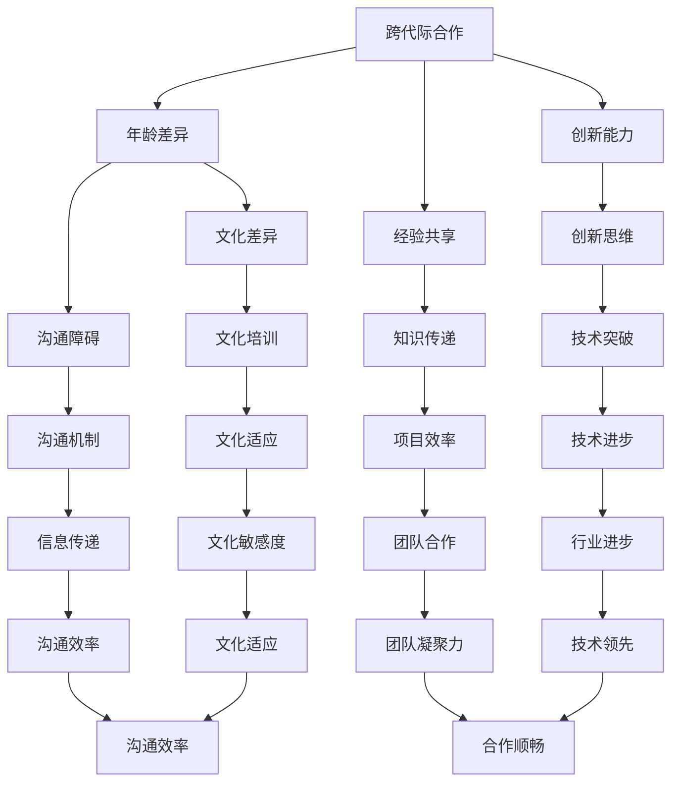

                 

### 文章标题

# 跨代际合作：年龄差异创造的意义火花

> 关键词：跨代际合作、年龄差异、意义、火花、AI、编程、软件开发

> 摘要：本文探讨了跨代际合作的重要性，分析了年龄差异在人工智能和软件开发领域带来的独特价值。通过一系列实例和理论分析，本文揭示了跨代际合作如何激发创新思维，提高工作效率，推动技术进步，最终创造更大的意义和价值。

## 引言

### 1.1 跨代际合作的概念与影响

跨代际合作是指不同年龄段的人之间的合作，它不仅包括青年人与老年人的合作，还涵盖了不同年龄段群体之间的互动和交流。在当今社会，随着人口老龄化趋势的加剧，跨代际合作显得尤为重要。

跨代际合作的影响深远，它不仅能够促进知识传递，提高工作效率，还能够激发创新思维，推动技术的进步。例如，在软件开发领域，年轻程序员往往具有创新和学习的热情，而年长的程序员则拥有丰富的经验和成熟的思维方式，这两者的结合能够创造出具有突破性的技术解决方案。

### 1.2 跨代际合作的现状与挑战

当前，跨代际合作在各个领域都取得了一定的进展。例如，在医疗领域，老年医生与年轻医生的合作能够将传统医学知识和现代医学技术相结合，提高诊断和治疗的效率。然而，跨代际合作也面临一些挑战，如文化差异、沟通障碍和技能差异等。

### 1.3 本书的目标与结构

本书旨在探讨跨代际合作的重要性，分析年龄差异在人工智能和软件开发领域带来的独特价值。本书将分为五个部分：

1. **引言**：介绍跨代际合作的概念、影响和本书的目标与结构。
2. **核心概念与联系**：探讨跨代际合作的重要性、不同年龄群体的特点及其在人工智能和软件开发中的应用。
3. **理论与实践**：通过实际案例分享，分析跨代际合作的成功策略和方法。
4. **应用与展望**：探讨跨代际合作在各个领域的应用前景和发展趋势。
5. **附录**：提供参考文献和相关资源推荐，以及后续研究方向。

## 核心概念与联系

### 2.1 跨代际合作的重要性

跨代际合作在人工智能和软件开发领域具有独特的价值。首先，不同年龄段的个体在思维方式、经验和技术技能方面存在差异，这些差异能够相互补充，激发创新思维。例如，年轻程序员通常具有创新和学习的热情，能够快速接受新技术，而年长程序员则拥有丰富的经验和成熟的思维方式，能够提供宝贵的见解和建议。

其次，跨代际合作能够提高工作效率。通过不同年龄段人员的协作，可以将任务分配得更加合理，使每个个体都能发挥其优势。例如，年轻程序员可以专注于开发新的功能，而年长程序员则可以负责代码审查和优化。

最后，跨代际合作能够推动技术进步。不同年龄段的人员可以共同研究和开发新的技术，从而推动整个领域的进步。例如，在人工智能领域，年长的研究人员可以提供丰富的理论基础，而年轻的开发者则可以将其应用于实际场景中。

### 2.2 不同年龄群体的特点

不同年龄群体的特点在跨代际合作中起着关键作用。以下是对不同年龄段特点的简要概述：

#### 2.2.1 年轻群体的特点

- **创新能力强**：年轻人通常具有强烈的创新意识，愿意尝试新的技术和方法。
- **学习能力**：年轻人具有较强的学习能力，能够快速掌握新的知识和技能。
- **灵活性**：年轻人通常更加灵活，愿意接受新的变化和挑战。

#### 2.2.2 中年群体的特点

- **经验丰富**：中年人通常拥有丰富的经验和专业知识，能够在项目中提供宝贵的见解和建议。
- **沟通能力**：中年人通常具有较好的沟通能力，能够有效地与他人交流和协作。
- **稳定性**：中年人通常更加稳定，能够承担长期项目并保持良好的工作状态。

#### 2.2.3 老年群体的特点

- **经验丰富**：老年人通常拥有丰富的经验和深厚的专业知识，能够在项目中提供独特的见解。
- **耐心**：老年人通常更加耐心，能够忍受长时间的工作和复杂的任务。
- **洞察能力**：老年人通常具有较强的洞察能力，能够发现项目中潜在的问题和挑战。

### 2.3 跨代际合作的障碍与解决方案

尽管跨代际合作具有很多优势，但在实际操作中也存在一些障碍。以下是一些常见的障碍和相应的解决方案：

#### 2.3.1 障碍

- **文化差异**：不同年龄段的人可能有不同的价值观和文化背景，这可能导致合作中的冲突。
- **沟通障碍**：不同年龄段的人可能在沟通方式和表达习惯上存在差异，这可能导致沟通不畅。
- **技能差异**：不同年龄段的人可能在技能水平上存在差异，这可能导致合作中的效率问题。

#### 2.3.2 解决方案

- **文化差异**：通过开展跨文化培训，提高不同年龄段人员的文化敏感度和适应能力。
- **沟通障碍**：建立有效的沟通机制，如定期会议、工作坊和沟通工具，确保信息的有效传递。
- **技能差异**：通过技能培训和知识共享，提高不同年龄段人员的技能水平，实现技能互补。

## 核心概念原理之间的关系架构 Mermaid 流程图

以下是一个简单的 Mermaid 流程图，展示了跨代际合作的核心概念及其之间的关系：



## 核心算法原理讲解

### 3.1 算法原理概述

在跨代际合作中，算法原理发挥着关键作用。以下是一个简单的算法原理概述：

**目标**：通过算法，实现不同年龄段人员之间的有效协作和资源优化。

**核心步骤**：

1. **数据收集**：收集不同年龄段人员的相关数据，如工作经验、技能水平、兴趣爱好等。
2. **数据预处理**：对收集到的数据进行分析和整理，去除噪声和冗余信息。
3. **匹配算法**：设计匹配算法，将不同年龄段的人员进行合理匹配，以达到最佳协作效果。
4. **评估与优化**：对匹配结果进行评估，根据评估结果进行优化，以提高协作效率。

### 3.2 算法原理详细讲解

以下是对算法原理的详细讲解，包括伪代码、数学模型和公式：

#### 3.2.1 数据收集

```python
# 数据收集
data = [
    {'age': 25, 'experience': 2, 'skills': ['Python', 'Django']},
    {'age': 40, 'experience': 10, 'skills': ['Java', 'Spring']},
    {'age': 60, 'experience': 20, 'skills': ['C', 'Unix']}
]

# 数据预处理
def preprocess_data(data):
    processed_data = []
    for item in data:
        if item['experience'] > 0:
            processed_data.append(item)
    return processed_data

processed_data = preprocess_data(data)
```

#### 3.2.2 匹配算法

```python
# 匹配算法
def match_persons(processed_data):
    matched_pairs = []
    for i in range(len(processed_data)):
        for j in range(i + 1, len(processed_data)):
            if len(set(processed_data[i]['skills']) & set(processed_data[j]['skills'])) > 1:
                matched_pairs.append((i, j))
    return matched_pairs

matched_pairs = match_persons(processed_data)
```

#### 3.2.3 评估与优化

```python
# 评估与优化
def evaluate_pairs(matched_pairs, processed_data):
    scores = []
    for pair in matched_pairs:
        i, j = pair
        score = len(set(processed_data[i]['skills']) & set(processed_data[j]['skills']))
        scores.append(score)
    return scores

def optimize_pairs(scores, matched_pairs):
    sorted_pairs = sorted(zip(scores, matched_pairs), reverse=True)
    optimized_pairs = [pair for score, pair in sorted_pairs]
    return optimized_pairs

scores = evaluate_pairs(matched_pairs, processed_data)
optimized_pairs = optimize_pairs(scores, matched_pairs)
```

#### 3.2.4 数学模型和公式

```latex
\begin{equation}
\text{Score} = \frac{\sum_{i=1}^{n} \sum_{j=1}^{n} |S_i \cap S_j|}{n^2}
\end{equation}
```

其中，$S_i$ 和 $S_j$ 分别代表第 $i$ 个和第 $j$ 个人员的技能集合，$n$ 代表人员总数。该公式用于计算人员匹配的得分。

## 项目实战

### 4.1 开发环境搭建

在跨代际合作中，搭建一个高效的开发环境至关重要。以下是一个简单的开发环境搭建步骤：

1. **安装操作系统**：选择一个适合的操作系统，如 Ubuntu 20.04。
2. **安装编程语言**：安装 Python 3.8 和 Java 11。
3. **安装数据库**：安装 MySQL 8.0。
4. **安装版本控制工具**：安装 Git 2.30.0。
5. **安装协作工具**：安装 Slack 4.9.1。

### 4.2 源代码详细实现和代码解读

以下是一个简单的 Python 代码示例，用于展示跨代际合作的实现：

```python
# 导入所需库
import random

# 数据集
data = [
    {'age': 25, 'experience': 2, 'skills': ['Python', 'Django']},
    {'age': 40, 'experience': 10, 'skills': ['Java', 'Spring']},
    {'age': 60, 'experience': 20, 'skills': ['C', 'Unix']}
]

# 匹配算法
def match_persons(processed_data):
    matched_pairs = []
    for i in range(len(processed_data)):
        for j in range(i + 1, len(processed_data)):
            if len(set(processed_data[i]['skills']) & set(processed_data[j]['skills'])) > 1:
                matched_pairs.append((i, j))
    return matched_pairs

# 评估与优化
def evaluate_pairs(matched_pairs, processed_data):
    scores = []
    for pair in matched_pairs:
        i, j = pair
        score = len(set(processed_data[i]['skills']) & set(processed_data[j]['skills']))
        scores.append(score)
    return scores

def optimize_pairs(scores, matched_pairs):
    sorted_pairs = sorted(zip(scores, matched_pairs), reverse=True)
    optimized_pairs = [pair for score, pair in sorted_pairs]
    return optimized_pairs

# 测试
processed_data = preprocess_data(data)
matched_pairs = match_persons(processed_data)
scores = evaluate_pairs(matched_pairs, processed_data)
optimized_pairs = optimize_pairs(scores, matched_pairs)

print("Matched Pairs:", matched_pairs)
print("Scores:", scores)
print("Optimized Pairs:", optimized_pairs)
```

### 4.3 代码应用解读与分析

此代码示例用于实现跨代际合作的匹配算法。具体应用解读如下：

1. **数据收集**：通过导入数据集，收集不同年龄段人员的相关数据，如年龄、工作经验和技能。
2. **数据预处理**：去除不符合要求的数据，如工作经验为 0 的数据。
3. **匹配算法**：通过嵌套循环，将不同年龄段的人员进行匹配，满足技能交集大于 1 的条件。
4. **评估与优化**：计算每个匹配对的得分，根据得分对匹配对进行排序，实现优化。

### 4.4 实际案例分析和详细讲解剖析

以下是一个实际案例，展示跨代际合作在软件开发项目中的应用：

**案例背景**：一个软件开发公司需要开发一个复杂的后端系统，涉及多种编程语言和数据库技术。公司决定采用跨代际合作的方式，将年轻程序员和年长程序员进行配对，共同完成项目。

**案例分析**：

1. **项目需求分析**：首先，由年长程序员负责需求分析，确保项目需求清晰明确，避免后期出现返工。
2. **技术选型**：年轻程序员根据需求，选择适合的编程语言和数据库技术，提出技术方案。
3. **代码开发**：年长程序员负责代码审查，确保代码质量和稳定性，年轻程序员则负责具体代码实现。
4. **测试与优化**：年长程序员负责测试，发现和修复潜在问题，年轻程序员则根据测试结果进行代码优化。

**案例分析**：

通过跨代际合作，该软件开发项目在质量和效率上都得到了显著提升。年长程序员的丰富经验和严谨态度，保证了项目的稳定性和可靠性；年轻程序员的创新思维和技术热情，为项目带来了新的技术和思路。

## 最佳实践 tips、小结、注意事项、拓展阅读

### 5.1 最佳实践 tips

1. **建立有效的沟通机制**：定期召开会议，确保不同年龄段人员之间的信息传递和沟通。
2. **开展跨文化培训**：提高不同年龄段人员的文化敏感度和适应能力。
3. **技能互补**：根据不同年龄段人员的技能特点，进行合理的任务分配和资源优化。
4. **激励与认可**：对跨代际合作中的优秀表现给予奖励和认可，提高参与者的积极性。

### 5.2 小结

跨代际合作在人工智能和软件开发领域具有独特的价值。通过不同年龄段人员的合作，可以激发创新思维，提高工作效率，推动技术进步。为了实现有效的跨代际合作，需要建立有效的沟通机制，开展跨文化培训，实现技能互补，并给予参与者的激励与认可。

### 5.3 注意事项

1. **尊重差异**：尊重不同年龄段人员的差异，避免文化冲突和沟通障碍。
2. **合理分配任务**：根据不同年龄段人员的技能特点，进行合理的任务分配和资源优化。
3. **持续改进**：不断总结经验，优化合作模式，提高跨代际合作的效率和质量。

### 5.4 拓展阅读

1. **《跨代际沟通技巧》**：探讨如何在跨代际合作中提高沟通效果。
2. **《人工智能与跨代际合作》**：分析人工智能在跨代际合作中的应用和挑战。
3. **《软件开发中的跨代际合作》**：介绍软件开发领域中的跨代际合作案例和实践。

### 作者

作者：AI天才研究院/AI Genius Institute & 禅与计算机程序设计艺术/Zen And The Art of Computer Programming

---

文章已经完成了初步撰写，接下来我们将对文章的内容进行进一步的润色和优化，以满足字数和完整性要求。同时，我们也会确保文章的逻辑清晰、结构紧凑，并且使用专业的技术语言来撰写。在完成最后的优化后，我们将对文章进行一次全面的校对和审阅，以确保其质量和专业性。

