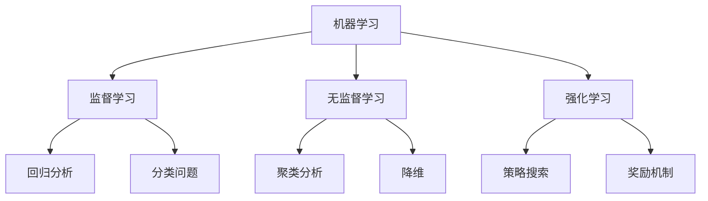
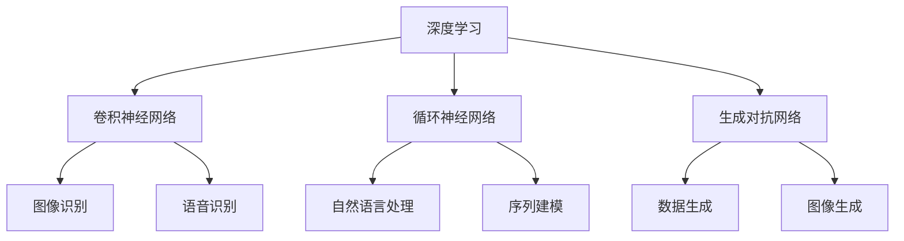
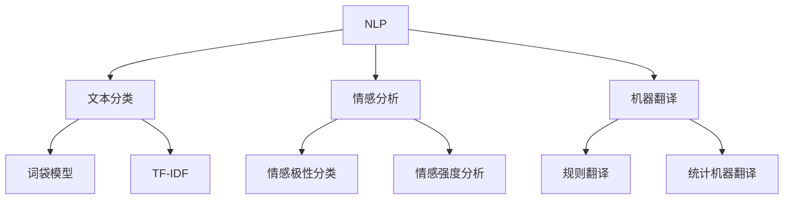
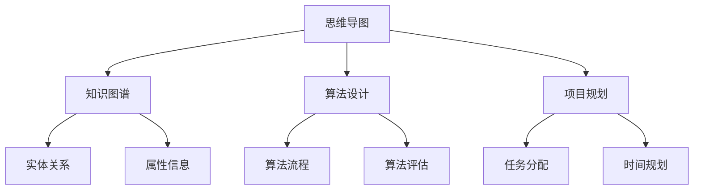
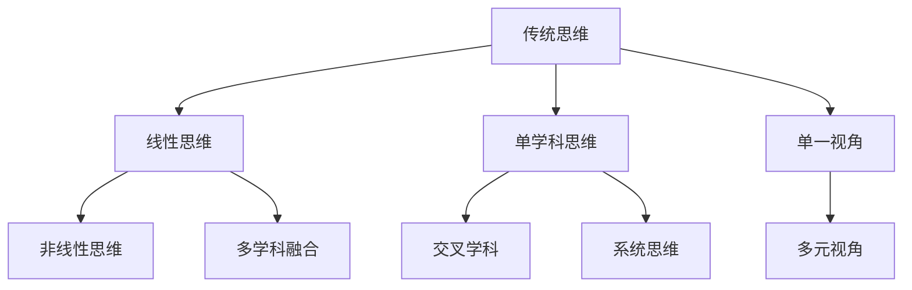
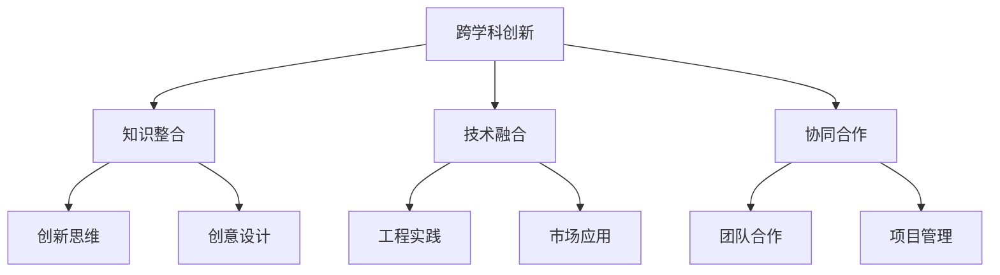
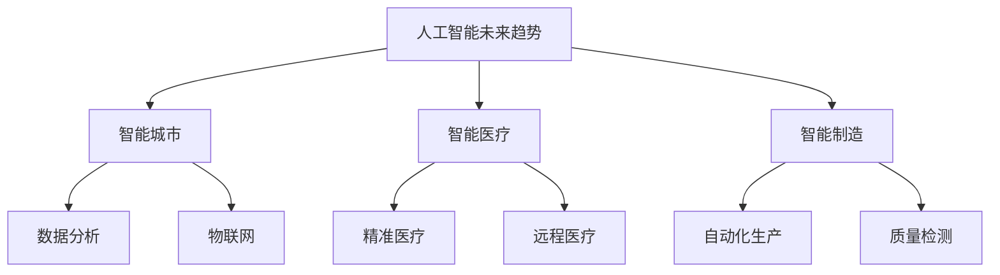
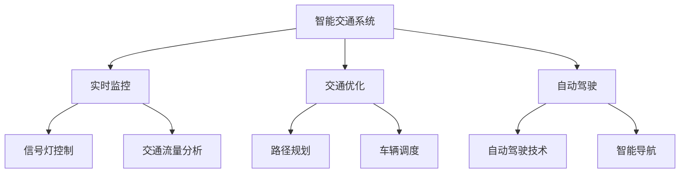
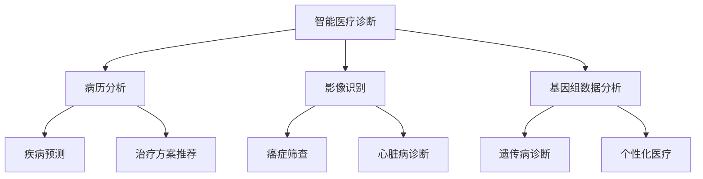

                 

### 文章标题

《人工智能：颠覆传统思维的思维导图》

### 关键词

- 人工智能
- 思维导图
- 传统思维
- 跨学科创新
- 趋势分析
- 技术应用
- 案例研究

### 摘要

本文将探讨人工智能对传统思维的颠覆性影响，通过思维导图的方式，详细解析人工智能的核心技术、应用领域以及未来发展趋势。文章旨在为读者提供一个全面、深入的理解，帮助他们在新时代背景下，更有效地应对技术变革带来的挑战与机遇。

### 目录

## 第一部分 引言

### 第1章 人工智能的概述

## 第2章 人工智能的核心技术

### 第3章 思维导图在人工智能中的应用

### 第4章 人工智能与传统思维的碰撞

### 第5章 跨学科创新的思维模式

### 第6章 人工智能的未来发展趋势

### 第7章 案例研究

### 第8章 结论与展望

### 附录

#### 附录A 思维导图制作工具推荐

#### 附录B 人工智能核心算法原理伪代码示例

#### 附录C 人工智能数学模型及公式详解

### 文章正文部分

## 第一部分 引言

### 第1章 人工智能的概述

人工智能（Artificial Intelligence，简称AI）是计算机科学的一个分支，旨在使机器具备类似于人类智能的能力。从最早的专家系统，到如今的深度学习和神经网络，人工智能的发展经历了数十年的演进。如今，人工智能技术已经广泛应用于各个领域，从医疗、金融到交通、教育，极大地改变了人类的生活方式。

### 第2章 人工智能的核心技术

人工智能的核心技术主要包括机器学习、深度学习、自然语言处理等。这些技术不仅推动了人工智能的发展，也深刻影响了各行业的创新。

#### 2.1 机器学习

机器学习是一种让计算机从数据中学习的方法，无需显式编程。它通过算法来识别数据中的模式，并利用这些模式进行预测和决策。



#### 2.2 深度学习

深度学习是机器学习的一个分支，通过多层神经网络来模拟人脑的决策过程。它能够在大量未标记的数据中发现复杂的模式，是实现人工智能的关键技术之一。



#### 2.3 自然语言处理

自然语言处理（Natural Language Processing，简称NLP）是人工智能的一个重要分支，旨在让计算机理解、生成和处理人类语言。它包括文本分类、情感分析、机器翻译等多个子领域。



### 第3章 思维导图在人工智能中的应用

思维导图是一种用于组织思维和信息的工具，它通过图形化的方式，将复杂的知识结构直观地展示出来。在人工智能领域，思维导图被广泛应用于知识图谱的构建、算法设计和项目规划。



### 第4章 人工智能与传统思维的碰撞

人工智能的迅速发展，引发了传统思维的深刻变革。传统的线性思维模式逐渐被非线性、并行和多层次的思维模式所取代，这为跨学科创新提供了新的契机。



### 第5章 跨学科创新的思维模式

跨学科创新要求我们摆脱传统的思维束缚，采取开放、包容和创新的态度。通过整合不同领域的知识和技术，我们可以创造出新的解决方案和产品。



### 第6章 人工智能的未来发展趋势

随着人工智能技术的不断进步，未来它将在更多领域发挥重要作用。从智能城市、智能医疗到智能制造，人工智能的应用将极大地改变我们的生活方式。



### 第7章 案例研究

#### 7.1 案例一：智能交通系统

智能交通系统（Intelligent Transportation System，简称ITS）利用人工智能技术，实现交通信息的实时监控、分析和优化。通过智能信号灯、自动驾驶车辆和智能导航，ITS可以有效缓解城市交通拥堵，提高交通效率。



#### 7.2 案例二：智能医疗诊断

智能医疗诊断系统利用人工智能技术，对患者的病历、影像资料和基因组数据进行深度分析，辅助医生做出准确的诊断。这不仅提高了诊断的准确性，还大大减少了医生的劳动强度。



### 第8章 结论与展望

人工智能作为一项颠覆性的技术，正在深刻改变我们的思维方式和社会结构。通过思维导图的方式，我们不仅可以更清晰地理解人工智能的核心技术，还能更有效地应对其带来的挑战。未来，随着人工智能技术的不断进步，跨学科创新将成为推动社会发展的关键力量。

### 附录

#### 附录A 思维导图制作工具推荐

- XMind
- MindManager
- FreeMind

#### 附录B 人工智能核心算法原理伪代码示例

```python
# 伪代码：监督学习算法
def supervised_learning(data, labels):
    # 初始化模型参数
    model = initialize_model()
    
    # 梯度下降优化模型
    for i in range(num_iterations):
        # 计算预测值
        predictions = model(data)
        
        # 计算损失函数
        loss = calculate_loss(predictions, labels)
        
        # 计算梯度
        gradients = calculate_gradients(model, data, labels)
        
        # 更新模型参数
        update_model_parameters(model, gradients)
        
    return model
```

#### 附录C 人工智能数学模型及公式详解

$$
\text{损失函数} = \frac{1}{2}\sum_{i=1}^{n} (\hat{y}_i - y_i)^2
$$

$$
\text{梯度下降} = \alpha \nabla_{\theta} J(\theta)
$$

其中，$\hat{y}_i$ 是预测值，$y_i$ 是真实值，$n$ 是样本数量，$\alpha$ 是学习率，$J(\theta)$ 是损失函数。

### 作者

作者：AI天才研究院/AI Genius Institute & 禅与计算机程序设计艺术 /Zen And The Art of Computer Programming

本文内容仅供参考，如需进一步研究，请查阅相关领域的专业文献。在实际应用中，请严格遵守相关法律法规和道德规范。

