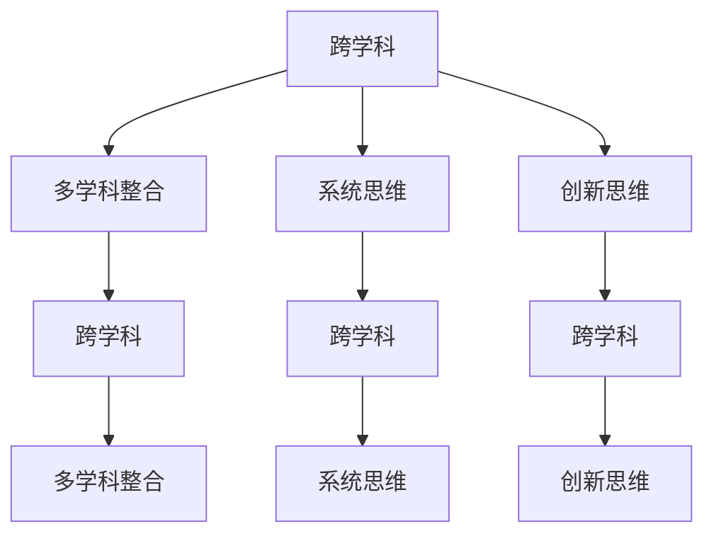

                 

### 第1章：跨学科创新概述

#### 1.1.3 跨学科创新的核心概念

为了更好地理解跨学科创新，我们需要明确一些核心概念，并探讨它们之间的关系。以下是几个关键概念的定义和它们之间的联系：

**1. 跨学科（Interdisciplinarity）**：跨学科指的是跨越传统学科界限，将不同领域的知识、方法和技术进行整合和融合。跨学科的核心在于强调知识整合和创新，而不是简单的知识堆砌。

**2. 多学科整合（Multidisciplinarity）**：多学科整合是指将多个学科的知识和方法应用于同一问题，但仍然保持各自的独立性。与跨学科相比，多学科整合更注重学科的多样性，而不是知识整合和创新。

**3. 系统思维（Systems Thinking）**：系统思维是一种综合性思维方式，强调从整体角度理解和解决问题。系统思维要求我们关注系统内部各个组成部分的相互关系和动态变化，以及系统与外部环境的相互作用。

**4. 创新思维（Innovative Thinking）**：创新思维是指通过创造性的思维方式和思维模式，寻找新的解决方案和方法。创新思维鼓励我们打破常规，挑战传统观念，提出新的想法和思路。

这些核心概念之间的关系可以用以下 Mermaid 流程图来表示：

在这个流程图中，我们可以看到跨学科、多学科整合、系统思维和创新思维之间存在着相互联系和相互影响。跨学科是核心，它推动了多学科整合、系统思维和创新思维的融合和发展。多学科整合为跨学科提供了丰富的知识资源，系统思维为跨学科提供了整体视角和方法论，而创新思维则为跨学科带来了新的思想和思路。

通过理解这些核心概念之间的关系，我们可以更好地把握跨学科创新的本质和特点，为后续章节的内容奠定基础。在接下来的章节中，我们将进一步探讨跨学科创新的背景、理论基础、实践方法和实验室建立与运作等方面。

### 1.1.4 跨学科创新的应用领域

跨学科创新的应用领域广泛，涵盖了多个行业和学科。以下是一些典型的应用领域：

**1. 生物医学领域**：生物医学领域涉及生物学、医学、物理学、化学等多个学科。跨学科创新在生物医学领域发挥了重要作用，例如，基因组学与计算生物学相结合，推动了个性化医疗的发展。通过跨学科合作，研究人员可以更好地理解疾病的机理，开发新的诊断和治疗手段。

**2. 环境科学领域**：环境科学涉及生态学、地质学、气象学、化学等多个学科。跨学科创新在环境科学领域有助于解决全球性环境问题，例如，通过跨学科合作，研究人员可以开发新的环保技术和策略，如碳捕集与封存（CCS）技术，减少温室气体排放。

**3. 工程技术领域**：在工程技术领域，跨学科创新推动了新技术和新产品的开发。例如，信息技术与制造技术的结合，产生了智能制造和工业4.0等新兴领域。跨学科团队可以更有效地解决复杂的工程问题，提高技术创新的效率。

**4. 经济管理领域**：经济管理领域涉及经济学、心理学、社会学等多个学科。跨学科创新在经济管理领域有助于解决复杂的经济问题，如金融危机和全球经济失衡。通过跨学科研究，政策制定者和企业管理者可以更准确地预测和应对经济变化。

**5. 人文社会科学领域**：人文社会科学领域涉及历史、文学、哲学、社会学等多个学科。跨学科创新在人文社会科学领域有助于深化对人类行为和社会现象的理解，推动人文社会科学的发展。例如，通过跨学科研究，学者可以更好地理解文化交流、社会变革和历史发展等复杂现象。

这些应用领域展示了跨学科创新在各个行业和学科中的重要性。跨学科创新不仅能够推动技术创新和学科发展，还能够解决复杂的社会问题，促进社会进步。通过跨学科合作，不同领域的专家和学者可以共同探讨问题、交流思想，从而实现知识的整合和创新，为社会创造更大的价值。

### 1.2 跨学科创新的历史与发展

#### 1.2.1 跨学科创新的起源

跨学科创新的起源可以追溯到19世纪末和20世纪初，当时科学和技术的发展开始呈现出跨学科的趋势。19世纪末，自然科学与工程技术的结合推动了第二次工业革命，这一时期出现了许多跨学科的研究和实践。例如，电气工程、化学工程和材料科学等新学科的兴起，反映了跨学科创新的初步尝试。

20世纪初，随着科学领域的不断分化，学科之间的界限逐渐变得模糊。跨学科研究的兴起受到了科学家和社会学家的关注。例如，美国社会学家罗伯特·默顿（Robert Merton）在20世纪40年代提出了“跨学科研究”的概念，强调了跨学科合作在科学研究中的重要性。

#### 1.2.2 跨学科创新的发展阶段

**1. 初创阶段（19世纪末至20世纪中叶）**

在这一阶段，跨学科创新主要体现在自然科学和工程技术领域。科学家和工程师开始尝试将不同学科的知识和工具应用于解决复杂问题。例如，物理学与工程学的结合推动了电子技术的快速发展，产生了电子计算机和通信技术。

**2. 成熟阶段（20世纪中叶至20世纪末）**

随着科学和技术的不断进步，跨学科创新进入成熟阶段。跨学科研究在医学、生物学、环境科学等领域取得了显著成果。例如，基因组学的兴起使得生物学与计算机科学、信息科学等领域的结合成为可能。此外，系统科学、复杂性科学等新兴学科的兴起，也为跨学科研究提供了新的理论基础和方法。

**3. 高度发展阶段（21世纪初至今）**

21世纪初，随着全球化和信息技术的快速发展，跨学科创新进入高度发展阶段。跨学科研究不仅限于科学研究领域，还渗透到经济管理、人文社会科学等领域。跨学科创新成为了推动科技创新和社会发展的重要动力。例如，人工智能与大数据技术的结合，推动了智能时代的到来。此外，跨学科创新实验室、跨学科研究中心的建立，也为跨学科研究提供了新的平台和机遇。

#### 1.2.3 跨学科创新的关键事件

**1. 1945年：第一台电子计算机ENIAC的诞生**

ENIAC的诞生标志着计算机科学的诞生，也开启了跨学科创新的序幕。电子计算机的发展推动了信息技术、工程学、数学等多个学科的进步，成为跨学科创新的重要里程碑。

**2. 1950年：图灵测试的提出**

图灵测试由英国数学家艾伦·图灵提出，用于测试机器是否具有人类智能。图灵测试的提出引发了人工智能领域的研究热潮，推动了计算机科学、认知科学等多个学科的交叉融合。

**3. 1972年：人类基因组计划的启动**

人类基因组计划是跨学科创新在生物学领域的重大成果。该项目通过整合生物学、计算机科学、医学等多个学科的知识和技术，成功解码人类基因组，为生命科学研究奠定了基础。

**4. 1989年：万维网（WWW）的诞生**

万维网的诞生标志着互联网时代的到来。万维网的发展离不开计算机科学、信息技术、网络技术等多个学科的交叉融合，成为跨学科创新的重要载体。

#### 1.2.4 跨学科创新的挑战与机遇

**1. 挑战**

尽管跨学科创新取得了显著成果，但仍面临一些挑战。首先，学科之间的界限仍然存在，跨学科研究需要克服学科壁垒。其次，跨学科研究往往涉及多个学科领域，需要更多的资源和投入。此外，跨学科研究的评价和激励机制仍然不足，需要进一步完善。

**2. 机遇**

跨学科创新带来了许多机遇。首先，全球化和信息技术的快速发展为跨学科创新提供了广阔的空间。其次，复杂问题的解决需要跨学科合作，跨学科创新有助于应对这些挑战。此外，跨学科创新有助于培养跨学科人才，推动科技创新和社会发展。

总之，跨学科创新的历史与发展展现了跨学科研究的重要性和前景。通过回顾跨学科创新的历史，我们可以更好地理解其发展趋势和面临的挑战，为未来的跨学科研究提供有益的启示。

### 1.3 跨学科创新的关键特征

#### 1.3.1 跨学科创新的独特性

跨学科创新具有独特的特点，使其在解决复杂问题和推动学科发展方面具有显著优势。以下是跨学科创新的一些关键特征：

**1. 多样性**：跨学科创新涉及多个学科领域的知识、方法和技术，具有高度的多样性。这种多样性不仅体现在学科领域的广泛性，还包括团队成员背景的多样性。团队成员可能来自不同的学科背景，具有不同的知识结构和思维方式，这种多样性有助于产生新的思想和观点，激发创新思维。

**2. 相互依赖**：跨学科创新强调不同学科之间的相互依赖和合作。不同学科的知识和方法相互补充，共同推动创新进程。例如，在生物医学领域，生物学、医学、物理学和工程学的交叉融合，有助于开发新的诊断和治疗手段。相互依赖性使得跨学科创新具有更强的整合性和系统性。

**3. 非线性**：跨学科创新往往呈现出非线性特征，即创新成果不是简单的线性叠加，而是通过不同学科之间的互动和融合，产生新的知识和价值。非线性特征体现了跨学科创新的复杂性和不可预测性，也使得跨学科创新更具挑战性和吸引力。

**4. 系统性**：跨学科创新强调从整体角度理解和解决问题。系统思维是跨学科创新的核心特征之一，它要求我们关注系统内部各个组成部分的相互关系和动态变化，以及系统与外部环境的相互作用。通过系统思维，跨学科创新能够更全面、更深入地解决复杂问题。

**5. 动态性**：跨学科创新是一个动态的过程，它随着知识、技术和社会环境的变化而不断调整和演进。跨学科创新需要不断更新知识、方法和技术，以适应不断变化的需求和挑战。动态性使得跨学科创新能够持续地推动知识进步和科技创新。

**6. 高风险、高回报**：跨学科创新往往面临较高的风险，因为涉及多个学科领域，不确定性和复杂性较大。然而，跨学科创新也具有高回报的潜力，通过整合不同学科的知识和资源，可以创造出全新的价值和解决方案。高风险与高回报并存，是跨学科创新的重要特征。

#### 1.3.2 跨学科创新的独特性在实际应用中的体现

在实际应用中，跨学科创新的独特性体现在多个方面：

**1. 解决复杂问题**：跨学科创新通过整合多个学科的知识和资源，能够解决单一学科难以应对的复杂问题。例如，在应对气候变化问题上，跨学科团队可以整合气象学、生态学、经济学和工程学的知识，提出综合性的解决方案。

**2. 促进知识整合**：跨学科创新有助于促进知识的整合和创新。通过跨学科合作，不同领域的学者和专家可以相互学习和交流，产生新的知识和观点。例如，在生物医学领域，跨学科团队可以将基因组学、计算生物学和临床医学的知识整合，推动个性化医疗的发展。

**3. 提高创新能力**：跨学科创新鼓励创新思维和创造力的发挥。团队成员来自不同的学科背景，具有多样化的思维方式和知识体系，这种多样化的组合有助于激发创新思维，提出新的解决方案。例如，在信息技术领域，跨学科团队可以将人工智能、大数据和物联网等技术的创新应用，推动智能时代的到来。

**4. 推动学科发展**：跨学科创新不仅有助于解决实际问题，还能够推动学科的发展。通过跨学科合作，不同学科之间的边界逐渐模糊，促进了学科的交叉融合和创新。例如，在环境科学领域，跨学科团队可以将生态学、化学和工程学的知识整合，推动可持续发展目标的实现。

总之，跨学科创新的独特性使其在解决复杂问题、促进知识整合、提高创新能力和推动学科发展方面具有显著优势。通过理解跨学科创新的独特性，我们可以更好地把握跨学科创新的核心特征，为未来的跨学科研究提供有益的指导。

### 1.4 跨学科创新的现状与趋势

#### 1.4.1 跨学科创新的现状

跨学科创新在全球范围内已经取得了显著进展。当前，跨学科创新在各个领域得到了广泛应用，并成为推动科学技术和社会发展的重要力量。以下是跨学科创新现状的几个方面：

**1. 科研成果**：跨学科研究在许多领域取得了重要成果。例如，基因组学研究推动了个性化医疗的发展，量子计算研究带来了计算能力的革命，可持续发展研究为应对气候变化提供了新的解决方案。跨学科研究不仅促进了知识的积累，还为解决复杂问题提供了新的思路和方法。

**2. 教育改革**：跨学科教育逐渐成为高等教育和职业教育的重要趋势。许多大学和研究院设立了跨学科课程和研究项目，鼓励学生和研究人员跨学科合作，培养跨学科思维和创新能力。这种教育改革有助于培养适应未来社会需求的复合型人才。

**3. 政策支持**：各国政府 increasingly认识到跨学科创新的重要性，并采取了一系列政策措施支持跨学科研究和实践。例如，许多国家设立了跨学科研究基金，鼓励科学家和研究人员开展跨学科合作项目。政府还通过政策引导，促进跨学科创新在科技、经济和社会领域的应用。

**4. 社会参与**：跨学科创新不仅局限于学术研究，还吸引了社会各界的广泛关注和参与。企业、非政府组织和社会团体纷纷加入跨学科创新行列，共同应对全球性挑战。跨学科创新成为社会创新和可持续发展的重要驱动力。

#### 1.4.2 跨学科创新的趋势

跨学科创新的未来发展趋势呈现出以下几方面：

**1. 技术融合**：随着信息技术的快速发展，跨学科创新将进一步融合各类前沿技术。例如，人工智能、大数据、物联网和区块链等技术的交叉应用，将推动跨学科创新进入新的阶段，带来更多创新成果和应用场景。

**2. 全球合作**：全球化进程加速，跨学科创新国际合作将进一步加强。跨国科研合作项目、国际学术交流平台和国际合作研究中心的建立，将促进全球科学家和研究人员之间的合作，共同应对全球性挑战。

**3. 社会参与**：跨学科创新将更加注重社会各界的广泛参与。企业和非政府组织将与学术界和政府部门共同推动跨学科创新，共同解决社会问题和推动社会进步。跨学科创新将更加贴近实际需求，服务于社会的可持续发展。

**4. 人才培养**：跨学科教育将继续改革和完善，以培养更多具有跨学科思维和创新能力的人才。跨学科课程设置、跨学科研究项目和跨学科实习机会将得到更多支持，帮助学生在实际工作中更好地应对复杂问题。

**5. 知识共享**：随着信息技术的进步，跨学科知识共享将变得更加便捷和高效。学术期刊、学术会议、在线课程和开放获取资源等将促进跨学科知识的传播和共享，推动全球范围内的知识创新和科技进步。

总之，跨学科创新在当前已经取得了显著进展，并展现出良好的发展趋势。通过技术融合、全球合作、社会参与、人才培养和知识共享，跨学科创新将继续推动科学技术和社会的发展，为未来的创新和社会进步提供强大动力。

### 第2章：跨学科创新的理论基础

#### 2.1 系统思维与跨学科创新

系统思维是一种综合性思维方式，强调从整体角度理解和解决问题。它要求我们关注系统内部各个组成部分的相互关系和动态变化，以及系统与外部环境的相互作用。系统思维与跨学科创新有着密切的联系，为跨学科创新提供了重要的理论基础。

**1. 系统思维的定义**

系统思维是一种思考方式，它将复杂的问题视为一个整体系统，关注系统中各个部分之间的相互作用和反馈。系统思维认为，任何问题都不能孤立地看待，而是需要从整体和系统的角度进行思考和分析。

**2. 系统思维与跨学科创新的关系**

跨学科创新通常涉及多个学科领域的知识和方法，这些学科领域可以被视为一个复杂的系统。系统思维为跨学科创新提供了整体视角和方法论，帮助我们更好地理解和解决复杂问题。

**3. 系统思维在跨学科创新中的应用**

- **整体性思考**：系统思维要求我们关注系统的整体性，理解系统中各个部分之间的相互关系。在跨学科创新中，我们需要从整体角度思考问题，整合不同学科的知识和方法，以实现创新目标。

- **动态性分析**：系统思维强调系统的动态性，关注系统中各个部分之间的动态变化。在跨学科创新中，我们需要分析系统中不同部分之间的相互作用，预测系统的行为和趋势，从而制定有效的创新策略。

- **反馈机制**：系统思维强调反馈机制，认为系统的行为和结果是相互影响的。在跨学科创新中，我们需要建立反馈机制，通过持续的评估和调整，优化创新过程和结果。

#### 2.2 复杂性与跨学科创新

复杂性是指系统的复杂性和不可预测性。复杂系统由许多相互作用的组成部分构成，这些组成部分之间的关系和动态变化非常复杂，难以用简单的线性模型进行描述。跨学科创新通常涉及复杂系统的理解和解决，因此复杂性理论与跨学科创新有着密切的联系。

**1. 复杂性的定义**

复杂性是指系统的复杂性和不可预测性。复杂系统由许多相互作用的组成部分构成，这些组成部分之间的关系和动态变化非常复杂，难以用简单的线性模型进行描述。

**2. 复杂性理论与跨学科创新的关系**

复杂性理论为跨学科创新提供了新的思考框架和方法论。复杂性理论认为，复杂系统中的问题通常无法通过单一学科的知识和方法进行解决，需要跨学科合作和综合分析。

**3. 复杂性理论在跨学科创新中的应用**

- **复杂性建模**：复杂性理论提供了多种建模方法，如系统动力学、多Agent模拟和复杂网络等，用于描述复杂系统的行为和特征。在跨学科创新中，我们可以利用这些建模方法，分析和理解复杂系统的动态行为，为创新提供依据。

- **跨学科合作**：复杂性理论强调了跨学科合作的重要性。在解决复杂问题时，单一学科的知识和方法往往不足以应对，需要跨学科团队的合作和综合分析。跨学科合作有助于整合不同学科的知识和技能，提高创新效率和效果。

- **适应性和灵活性**：复杂性理论认为，复杂系统具有适应性和灵活性。在跨学科创新中，我们需要关注系统的适应性和灵活性，通过不断的调整和优化，实现创新目标。

#### 2.3 创新生态系统与跨学科创新

创新生态系统是指支持创新活动的一系列相互关联的组成部分，包括企业、科研机构、政府部门、投资者、用户等。创新生态系统为跨学科创新提供了良好的环境和支持体系。

**1. 创新生态系统的定义**

创新生态系统是指支持创新活动的一系列相互关联的组成部分，包括企业、科研机构、政府部门、投资者、用户等。这些组成部分通过相互协作和互动，共同推动创新活动的发展。

**2. 创新生态系统与跨学科创新的关系**

创新生态系统为跨学科创新提供了重要的支持。创新生态系统中的各个组成部分可以相互协作，共同推动跨学科创新的发展。

**3. 创新生态系统在跨学科创新中的应用**

- **资源共享**：创新生态系统中的各个组成部分可以共享资源，如资金、技术、人才等。这有助于降低跨学科创新的风险和成本，提高创新效率。

- **协同创新**：创新生态系统中的各个组成部分可以协同创新，共同应对复杂问题。跨学科团队可以利用创新生态系统的资源和支持，进行跨学科合作和创新。

- **政策支持**：创新生态系统中的政府部门可以为跨学科创新提供政策支持，如税收优惠、科研资助等。政策支持有助于促进跨学科创新的发展。

#### 2.4 跨学科创新的心理学基础

心理学是研究人类行为和心理过程的科学。跨学科创新涉及多个学科领域的合作和交流，需要心理学理论的指导。以下是跨学科创新的心理学基础：

**1. 团队合作与沟通**

跨学科创新通常需要跨学科团队的合作和沟通。心理学理论为我们提供了理解团队合作和沟通的有效方法。

- **团队合作**：团队合作中的角色分工、权力分配、信任建立等都是心理学研究的重要领域。心理学家研究团队合作中的心理机制，如团队动力、团队效能和团队冲突等，为跨学科创新提供指导。

- **沟通**：沟通是跨学科创新的关键环节。心理学家研究沟通障碍、沟通策略和沟通效果等，帮助我们提高跨学科团队的合作效率。

**2. 创造力和思维创新**

跨学科创新需要创造力和思维创新。心理学理论为我们提供了理解创造力和思维创新的有效方法。

- **创造力**：心理学家研究创造力的本质、影响因素和培养方法，为跨学科创新提供指导。例如，通过思维训练、环境优化和激励机制等，可以提高个人的创造力。

- **思维创新**：心理学家研究思维创新的机制和方法，如思维模式、思维策略和创新思维训练等。思维创新方法可以帮助跨学科团队突破传统思维限制，提出新颖的解决方案。

**3. 心理健康与工作满意度**

跨学科创新对团队成员的心理健康和工作满意度具有重要影响。心理学理论为我们提供了理解心理健康和工作满意度的有效方法。

- **心理健康**：心理学家研究心理健康的影响因素、诊断和治疗方法，为跨学科创新团队成员提供心理健康支持。

- **工作满意度**：心理学家研究工作满意度的影响因素、测量方法和提升策略，为跨学科创新团队提供工作满意度支持。

总之，心理学理论为跨学科创新提供了丰富的指导和支持。通过理解心理学基础，我们可以更好地理解跨学科创新的复杂性，提高跨学科团队的协作效率和创新能力。

### 2.5 跨学科创新的理论模型与方法论

#### 2.5.1 跨学科创新的理论模型

跨学科创新涉及多个学科领域的知识、方法和技术，需要一定的理论模型和方法论来指导。以下是几个常用的跨学科创新理论模型：

**1. 三螺旋模型**

三螺旋模型（Triple Helix Model）是由亨利埃塔·杜比娜（Henrietta L. Duguid）和迈克尔·科亨（Michael Cohen）提出的，它描述了大学、政府和产业部门之间的相互作用和合作。三螺旋模型认为，创新活动需要这三者之间的紧密合作和协同作用。

- **大学**：提供知识和技术创新，培养跨学科人才。
- **政府**：制定政策，提供资金支持，促进跨学科研究。
- **产业部门**：应用创新成果，推动技术转移和产业化。

**2. 创新生态系统模型**

创新生态系统模型（Innovation Ecosystem Model）强调创新活动的多维度和多层次性。该模型包括多个组成部分，如企业、科研机构、投资者、政府部门、非政府组织等，这些组成部分通过相互作用和支持，共同推动创新活动的发展。

**3. 跨学科团队模型**

跨学科团队模型（Interdisciplinary Team Model）描述了跨学科团队的组织结构和运作方式。该模型强调团队成员之间的合作、沟通和协作，以及跨学科知识的整合和创新。

#### 2.5.2 跨学科创新的方法论

跨学科创新需要一定的方法论来指导实际操作。以下是几个常用的跨学科创新方法论：

**1. 跨学科方法论**

跨学科方法论（Interdisciplinary Methodology）强调跨学科合作和知识整合。该方法论包括以下几个关键步骤：

- **问题定义**：明确跨学科创新的目标和问题。
- **知识整合**：整合不同学科领域的知识和方法。
- **团队协作**：建立跨学科团队，进行合作和沟通。
- **实验与验证**：通过实验和验证，验证创新成果的有效性。

**2. 系统动力学方法**

系统动力学方法（System Dynamics Method）是一种用于分析复杂系统的建模方法。该方法论通过建立系统模型，模拟系统的动态行为和反馈机制，帮助跨学科团队理解和解决复杂问题。

**3. 设计思维方法**

设计思维方法（Design Thinking Method）是一种以用户为中心的创新方法。该方法论强调用户需求的理解和解决，通过迭代设计和测试，不断优化创新成果。

**4. 复杂性科学方法**

复杂性科学方法（Complexity Science Method）是一种用于分析复杂系统的科学方法。该方法论强调系统的动态性、非线性、自适应性和复杂性，帮助跨学科团队更好地理解和解决复杂问题。

总之，跨学科创新的理论模型和方法论为跨学科创新提供了重要的指导和支持。通过理解这些理论模型和方法论，我们可以更好地把握跨学科创新的本质，提高跨学科创新的效率和效果。

### 第3章：跨学科创新的实践方法

#### 3.1 跨学科团队建设与协作

跨学科团队建设是跨学科创新成功的关键因素之一。一个高效的跨学科团队需要具备多样化的知识背景、良好的沟通能力和协作精神。以下是跨学科团队建设与协作的一些关键步骤和策略：

**1. 明确团队目标**

跨学科团队的建设始于明确团队目标。团队目标应当清晰、具体且具有可实现性，以便团队成员共同致力于实现这些目标。明确的目标有助于团队集中精力，避免资源和时间的浪费。

**2. 多元化的团队成员**

跨学科团队的成功依赖于团队成员的多元化。团队成员应当来自不同的学科背景，拥有不同的专业知识和技能。这种多样性不仅能够提供丰富的知识和观点，还能够激发创新思维和创造力。

**3. 建立良好的沟通机制**

跨学科团队的协作离不开良好的沟通机制。团队成员应当定期召开会议，分享进展和想法，讨论问题和解决方案。此外，利用现代通信工具，如视频会议、即时通讯和项目管理软件，可以方便团队成员之间的沟通和协作。

**4. 强化团队协作**

跨学科团队的协作需要通过一系列策略和工具来实现。例如，团队可以采用敏捷开发方法，通过迭代和增量方式推进项目；使用项目管理工具，如JIRA或Trello，跟踪项目进度和任务分配；以及通过角色分配和责任明确，确保团队成员各司其职。

**5. 培养团队文化**

团队文化是跨学科团队协作的重要基础。一个积极的团队文化能够促进团队成员之间的信任、尊重和合作。团队文化应当鼓励创新思维、开放交流和相互支持，同时也能够处理冲突和分歧。

#### 3.2 跨学科知识整合与共享

跨学科知识整合与共享是跨学科创新的核心内容之一。有效的知识整合和共享能够促进团队成员之间的协作，提高创新效率。以下是实现跨学科知识整合与共享的一些策略：

**1. 知识库建设**

建立知识库是跨学科知识整合与共享的重要手段。知识库应当包括团队成员的专业知识、项目经验和最佳实践。通过建立知识库，团队成员可以方便地获取和共享知识资源，提高工作效率。

**2. 知识图谱**

知识图谱是一种用于表示知识结构和关系的图形化工具。通过知识图谱，团队成员可以直观地了解不同学科之间的联系和交叉点，促进知识的整合和创新。

**3. 在线协作平台**

在线协作平台为团队成员提供了一个共享知识和协作的空间。通过在线协作平台，团队成员可以实时共享文件、讨论问题、分享资源和更新项目进展。

**4. 学术交流和研讨会**

定期举办学术交流和研讨会是促进跨学科知识整合与共享的有效方法。学术交流和研讨会为团队成员提供了一个交流和展示研究成果的平台，有助于激发创新思维和合作机会。

#### 3.3 跨学科问题解决与创新设计

跨学科问题解决与创新设计是跨学科创新的核心环节。以下是一些关键步骤和方法：

**1. 问题识别**

跨学科问题解决的第一步是识别问题。问题识别需要团队成员从多个角度进行思考，确保问题定义的准确性和全面性。

**2. 基础研究**

在问题识别后，团队成员需要进行基础研究，收集和分析相关数据和信息。基础研究有助于深入了解问题的本质和背景，为创新设计提供依据。

**3. 创新设计**

创新设计是跨学科问题解决的核心。团队成员可以通过以下方法进行创新设计：

- **头脑风暴**：头脑风暴是一种集体创意思维方法，团队成员可以自由地提出各种想法和解决方案。
- **原型设计**：通过原型设计，团队成员可以快速构建概念原型，验证和改进创新设计。
- **迭代优化**：创新设计是一个迭代过程，团队成员需要对原型进行不断优化，以实现最佳解决方案。

**4. 实验与验证**

实验与验证是跨学科创新设计的重要环节。通过实验和验证，团队成员可以验证创新设计的有效性和可行性，确保创新成果的可靠性和实用性。

#### 3.4 跨学科创新的评估与反馈

跨学科创新的评估与反馈是确保创新质量和效果的重要环节。以下是一些关键步骤和策略：

**1. 创新评估**

创新评估包括对创新成果的全面评估，如创新性、实用性、可行性和社会影响等。评估可以通过定性和定量方法进行，例如，通过专家评审、用户反馈和统计数据等。

**2. 反馈机制**

建立有效的反馈机制是跨学科创新评估的重要环节。反馈机制可以包括定期评估会议、用户调查、项目报告和评审等。通过反馈机制，团队成员可以及时获取评估结果和改进建议，优化创新过程和成果。

**3. 持续改进**

跨学科创新的评估与反馈应当是一个持续的过程。团队成员需要根据评估结果和反馈建议，不断改进和创新设计，提高创新质量和效果。

**4. 学习与分享**

评估和反馈的结果应当得到充分的学习和分享。通过总结经验和教训，团队成员可以不断优化跨学科创新的方法和策略，提高团队整体创新能力。

总之，跨学科团队建设与协作、跨学科知识整合与共享、跨学科问题解决与创新设计以及跨学科创新的评估与反馈是跨学科创新的实践方法的核心内容。通过这些实践方法，我们可以有效地推动跨学科创新，解决复杂问题，创造新的价值。

### 3.5 跨学科创新的具体案例研究

为了更好地理解跨学科创新在实际应用中的效果，以下将介绍几个具体的跨学科创新案例，并分析这些案例的成功经验和挑战。

#### 案例一：生物医学领域的基因组学研究

**1. 案例背景**

基因组学研究是一个典型的跨学科创新案例。该领域涉及生物学、计算机科学、物理学、统计学等多个学科。随着测序技术的进步，人类基因组计划的成功标志着基因组学进入了快速发展阶段。

**2. 成功经验**

- **多学科合作**：基因组学研究吸引了来自生物学、计算机科学、物理学、统计学等领域的专家，他们共同合作，共享数据和技术，推动基因组学的发展。
- **知识整合**：基因组学研究通过整合不同学科的知识，如生物学中的基因功能研究、计算机科学中的生物信息学工具，实现了对基因组数据的深度挖掘和分析。
- **创新设计**：基因组学研究采用了多种创新设计方法，如高通量测序技术、计算生物学算法等，提高了基因组分析的效率和准确性。

**3. 挑战**

- **数据复杂性**：基因组数据规模庞大，且高度复杂，对数据处理和分析提出了巨大挑战。
- **学科壁垒**：不同学科之间的语言和思维方式差异，导致跨学科合作中存在一定的沟通障碍。

**4. 教训**

- **跨学科培训**：为了提高跨学科团队的协作效率，有必要对团队成员进行跨学科培训，增强他们的跨学科意识和技能。
- **项目管理和协调**：跨学科项目通常涉及多个部门和人员，项目管理和协调至关重要，确保项目的顺利进行和资源的最优配置。

#### 案例二：环境科学领域的水资源管理

**1. 案例背景**

水资源管理是一个复杂的跨学科问题，涉及生态学、地质学、水文学、社会科学等多个学科。随着全球气候变化和人口增长，水资源管理面临严峻挑战。

**2. 成功经验**

- **综合评估**：水资源管理采用了综合评估方法，从生态、经济、社会等多方面对水资源进行评估，确保管理决策的科学性和全面性。
- **跨学科团队**：水资源管理项目通常由生态学家、地质学家、水文学家、社会学家等多学科专家组成，他们共同分析水资源问题，提出解决方案。
- **技术创新**：水资源管理项目采用了多种技术创新，如智能水表、远程监控系统等，提高了水资源管理的效率和效果。

**3. 挑战**

- **数据获取**：水资源管理需要大量的数据支持，但在一些地区，数据获取和更新仍然面临困难。
- **政策协调**：水资源管理涉及多个政府部门和利益相关方，政策协调和利益分配是跨学科创新中的难点。

**4. 教训**

- **数据共享**：建立完善的水资源数据共享平台，促进数据的获取和利用，提高跨学科研究的效率和准确性。
- **政策沟通**：加强政策沟通和协调，确保水资源管理政策的有效实施和跨学科合作的顺利进行。

#### 案例三：信息技术领域的物联网应用

**1. 案例背景**

物联网（IoT）技术是一个跨学科领域，它涉及传感器技术、通信技术、数据处理、数据分析等多个学科。物联网应用已经在智能家居、智能城市、智能制造等领域得到广泛应用。

**2. 成功经验**

- **技术整合**：物联网应用通过整合传感器技术、通信技术和数据处理技术，实现了设备之间的互联互通和数据共享。
- **商业模式创新**：物联网应用推动了商业模式的创新，例如，智能家居系统提供了更加便捷的生活方式，智能城市系统提高了城市管理的效率。
- **用户参与**：物联网应用注重用户参与和用户体验，通过用户反馈和数据分析，不断优化产品和服务。

**3. 挑战**

- **数据安全**：物联网应用涉及到大量数据的收集和处理，数据安全和隐私保护是跨学科创新中的关键问题。
- **技术标准化**：物联网技术的快速发展带来了技术标准化的问题，不同设备和平台之间的兼容性需要解决。

**4. 教训**

- **安全设计**：在物联网应用开发过程中，应当注重安全设计，确保数据的传输和存储安全，保护用户隐私。
- **标准化策略**：推动物联网技术的标准化，确保不同设备和平台之间的兼容性和互操作性。

这些案例展示了跨学科创新在不同领域的实际应用和效果。通过分析这些案例，我们可以看到跨学科创新在解决复杂问题、推动技术进步和社会发展方面的巨大潜力。同时，这些案例也提醒我们在跨学科创新过程中需要面对的挑战和问题，通过不断学习和实践，我们可以更好地推动跨学科创新的发展。

### 3.6 跨学科创新实验室的建立与运作

跨学科创新实验室是推动跨学科创新的重要平台。以下将详细讨论跨学科创新实验室的建立与运作，包括团队组建、资源配置、项目管理等方面的内容。

#### 3.6.1 跨学科创新实验室的定位与目标

跨学科创新实验室的定位和目标是实验室成功运作的基础。实验室应当明确自身的使命和愿景，为跨学科研究提供支持和保障。

**1. 实验室的定位**

跨学科创新实验室应当定位于跨学科研究的核心基地，提供以下服务：

- **跨学科研究支持**：为研究人员提供实验设施、数据分析工具和技术支持，促进跨学科研究的顺利进行。
- **人才培养**：培养具有跨学科思维和能力的创新人才，推动跨学科教育的发展。
- **成果转化**：推动科研成果的转化和应用，促进技术创新和产业升级。

**2. 实验室的目标**

跨学科创新实验室的目标应当包括：

- **提高跨学科研究的效率和质量**：通过提供先进的实验设施和技术支持，提高跨学科研究的效率和成果质量。
- **促进跨学科合作**：搭建跨学科合作平台，促进不同学科之间的交流与合作，推动知识的整合和创新。
- **推动科技成果转化**：通过技术转移和合作，将科研成果转化为实际应用，为社会创造更大的价值。

#### 3.6.2 跨学科创新实验室的构建要素

构建一个成功的跨学科创新实验室需要以下关键要素：

**1. 硬件设施**

跨学科创新实验室应当具备先进的硬件设施，包括：

- **实验设备**：提供各类实验设备，如精密仪器、计算机设备、传感器等，以满足不同学科研究的需要。
- **数据存储和处理能力**：建设高性能的数据存储和处理系统，确保数据的安全性和可访问性。

**2. 软件平台**

跨学科创新实验室需要提供多种软件平台，包括：

- **数据分析工具**：提供各类数据分析工具，如数据挖掘工具、机器学习平台等，以支持跨学科研究。
- **项目管理工具**：提供项目管理工具，如JIRA、Trello等，以帮助团队高效地管理项目和任务。

**3. 资源库**

跨学科创新实验室应当建立资源库，包括：

- **文献资源库**：收集和整理各类学术文献和科研报告，为研究人员提供丰富的知识资源。
- **知识库**：建立跨学科知识库，整合不同学科的知识和经验，促进知识的共享和传播。

**4. 团队成员**

跨学科创新实验室的成功离不开多元化的团队成员。团队成员应当包括：

- **学科专家**：来自不同学科的专家，提供专业的知识和技能。
- **技术专家**：负责实验设备维护和技术支持。
- **项目管理专家**：负责项目的规划、协调和管理工作。

#### 3.6.3 跨学科创新实验室的组织架构

跨学科创新实验室的组织架构应当灵活，以适应不同的研究需求和团队规模。以下是一种常见的管理模式：

**1. 实验室主任**

实验室主任负责实验室的总体管理和协调工作，包括资源配置、项目审批、团队管理等。

**2. 项目组**

项目组是实验室的核心单元，负责具体研究项目的实施。项目组由不同学科领域的专家和技术人员组成。

**3. 支持部门**

支持部门负责实验室的日常运营和管理，包括财务管理、人力资源、行政事务等。

#### 3.6.4 跨学科创新实验室的运作机制

跨学科创新实验室的运作机制应当包括以下几个方面：

**1. 项目管理**

项目管理是跨学科创新实验室运作的关键。实验室应当建立完善的项目管理流程，包括项目立项、项目计划、项目监控和项目验收等。

**2. 知识共享**

知识共享是跨学科创新的重要保障。实验室应当建立知识共享平台，鼓励团队成员分享经验和知识，促进知识的传播和利用。

**3. 资源整合**

资源整合是提高实验室运作效率的关键。实验室应当优化资源配置，确保各类资源得到充分利用。

**4. 激励机制**

激励机制是激发团队成员积极性和创造力的关键。实验室应当建立合理的激励机制，包括奖金、晋升机会等，以激励团队成员的投入和贡献。

总之，跨学科创新实验室的建立与运作是一个复杂的过程，需要明确实验室的定位和目标，构建完善的硬件设施和软件平台，优化组织架构和运作机制，以推动跨学科创新的顺利进行。

### 第4章：跨学科创新实验室的成功案例

#### 4.1 案例一：XX公司的跨学科创新实验室

**1. 案例背景**

XX公司是一家专注于物联网（IoT）技术的企业，致力于通过跨学科创新实验室推动物联网技术的应用和产业化。随着物联网技术的快速发展，公司意识到仅依靠单一学科的知识和技术难以应对复杂的业务需求，因此决定建立跨学科创新实验室。

**2. 成功经验**

- **多元化团队**：实验室组建了由软件工程师、硬件工程师、数据分析师、市场营销专家等多学科专家组成的团队，确保了项目开发的全面性和创新性。
- **合作机制**：实验室建立了良好的合作机制，通过定期团队会议、项目进展汇报和跨部门协作，确保项目顺利进行。
- **技术创新**：实验室通过跨学科合作，成功研发了智能家居系统、智能农业监测系统和智能城市交通管理系统等多个创新产品，实现了技术的产业化应用。

**3. 挑战**

- **资源整合**：跨学科创新需要大量的资源支持，包括资金、设备和人才。在初期，资源整合和协调是一个较大的挑战。
- **项目管理**：跨学科项目的管理复杂度高，需要有效的方法和工具来确保项目进度和质量。

**4. 教训**

- **明确目标**：在跨学科创新项目中，明确项目目标是成功的关键。通过明确目标，可以更好地引导资源投入和团队协作。
- **灵活管理**：跨学科项目的管理需要灵活应对各种变化，确保项目能够适应不同阶段的需求。

#### 4.2 案例二：XX大学的跨学科创新实验室

**1. 案例背景**

XX大学是一所知名的高等学府，为了推动跨学科研究和教育改革，决定建立跨学科创新实验室。实验室旨在为学生和教师提供跨学科研究和实践的平台，促进知识的整合和创新。

**2. 成功经验**

- **教育改革**：实验室通过跨学科课程和项目，推动了教育改革，培养了学生的跨学科思维和创新能力。
- **项目孵化**：实验室为学生和教师提供了项目孵化平台，鼓励他们进行跨学科研究，并将研究成果应用于实际项目中。
- **国际合作**：实验室积极参与国际合作，与全球多个知名高校和研究机构建立了合作关系，促进了学术交流和资源共享。

**3. 挑战**

- **学科整合**：跨学科研究需要不同学科之间的整合，这对于学科背景差异较大的团队成员来说是一个挑战。
- **资源分配**：实验室资源的有限性使得资源分配成为一个难题，需要合理规划和优先级管理。

**4. 教训**

- **学科融合**：跨学科研究需要团队成员具备较强的跨学科整合能力，可以通过培训和实践来提升这一能力。
- **项目优先级**：在资源有限的情况下，合理设定项目优先级，确保关键项目的顺利进行。

#### 4.3 案例三：XX研究院的跨学科创新实验室

**1. 案例背景**

XX研究院是一家专注于科技创新的研究机构，为了推动跨学科研究和科技成果转化，建立了跨学科创新实验室。实验室旨在通过跨学科合作，解决复杂技术问题，推动科技产业化。

**2. 成功经验**

- **跨学科合作**：实验室通过跨学科合作，成功解决了多个复杂技术问题，如纳米材料制备、智能控制系统等，推动了科技创新。
- **科技成果转化**：实验室建立了完善的科技成果转化机制，通过技术转让、项目孵化等方式，将研究成果应用于实际产业中。
- **产业合作**：实验室与多家企业建立了紧密的合作关系，共同推动技术研发和产业化。

**3. 挑战**

- **技术整合**：跨学科技术整合复杂，需要解决不同技术之间的兼容性和稳定性问题。
- **项目管理**：跨学科项目的管理复杂度高，需要具备专业的项目管理能力和经验。

**4. 教训**

- **技术融合**：在跨学科研究中，技术融合是关键，需要通过不断试验和优化，实现不同技术的有效整合。
- **项目管理**：跨学科项目的管理需要灵活应对各种变化，确保项目能够按时、按质完成。

这些案例展示了跨学科创新实验室在不同领域的成功应用和效果。通过分析这些案例，我们可以看到跨学科创新实验室在推动技术创新和社会发展方面的巨大潜力。同时，这些案例也提醒我们在跨学科创新过程中需要面对的挑战和问题，通过不断学习和实践，我们可以更好地推动跨学科创新的发展。

### 4.4 案例四：XX基金会的跨学科创新实验室

**1. 案例背景**

XX基金会是一个致力于推动科技教育和创新的社会组织。为了应对全球性挑战，如气候变化、可持续发展和社会不平等等问题，XX基金会决定建立跨学科创新实验室，以支持跨学科研究和创新实践。

**2. 成功经验**

- **跨学科项目资助**：XX基金会通过设立专项基金，资助跨学科研究项目，支持科学家和研究人员进行跨学科合作。
- **教育推广**：基金会通过举办研讨会、工作坊和教育活动，推广跨学科教育理念，鼓励学生和公众参与跨学科创新。
- **国际合作**：XX基金会积极与国际组织和研究机构合作，建立全球跨学科创新网络，促进知识共享和资源整合。

**3. 挑战**

- **资源协调**：跨学科创新项目通常需要多方资源支持，基金会需要协调各种资源，确保项目顺利进行。
- **评估与反馈**：跨学科项目的评估和反馈机制复杂，需要建立有效的评估体系，确保项目成果的质量和效果。

**4. 教训**

- **明确目标**：在资助跨学科项目时，明确项目目标是关键，确保资源投入与项目目标一致。
- **灵活管理**：跨学科项目具有高度不确定性，需要灵活的管理策略，以应对项目过程中的各种变化和挑战。

### 4.5 案例五：XX大学与XX公司的跨学科联合实验室

**1. 案例背景**

XX大学与XX公司共同建立了一个跨学科联合实验室，旨在推动产学研合作，共同开展前沿技术研究。实验室由XX大学和XX公司的专家共同管理，提供跨学科研究和创新实践的平台。

**2. 成功经验**

- **产学研结合**：实验室通过产学研合作，实现了研究成果的快速转化和应用，推动了技术创新和产业发展。
- **人才培养**：实验室为学生和研究人员提供了实践机会，培养了他们的跨学科能力和创新能力。
- **资源共享**：实验室通过共享实验设备和技术资源，提高了资源利用效率，降低了创新成本。

**3. 挑战**

- **协调管理**：产学研合作需要多方协调和管理，确保项目的顺利进行和资源的最优配置。
- **知识产权**：在跨学科研究中，知识产权保护是一个重要问题，需要建立有效的知识产权保护机制。

**4. 教训**

- **明确责任**：在产学研合作中，明确各方的责任和角色至关重要，确保项目目标的实现和资源的有效利用。
- **知识产权保护**：建立完善的知识产权保护机制，确保研究成果的合法权益得到保障。

这些案例展示了跨学科创新实验室在不同领域和背景下的成功实践。通过分析这些案例，我们可以看到跨学科创新实验室在推动跨学科研究、培养创新人才和促进产学研合作方面的积极作用。同时，这些案例也为我们提供了宝贵的经验和教训，指导我们在未来的跨学科创新实践中取得更好的成果。

### 第7章：跨学科创新实验室的发展趋势

#### 7.1 新技术对跨学科创新实验室的影响

随着新技术的不断涌现，跨学科创新实验室正在经历深刻的变革。以下将探讨新技术对跨学科创新实验室的几个关键影响：

**1. 人工智能（AI）**

人工智能技术的发展为跨学科创新实验室提供了强大的工具和平台。通过机器学习和深度学习算法，实验室可以更加高效地处理和分析海量数据，从而揭示数据背后的模式和规律。例如，在生物医学领域，人工智能可以辅助医生进行疾病诊断和治疗方案制定，提高医疗效率和质量。

**2. 量子计算**

量子计算作为下一代计算技术，具有巨大的计算潜力。它可以在短时间内解决传统计算机难以处理的复杂问题。跨学科创新实验室可以利用量子计算的优势，加速药物设计、材料科学和金融风险评估等领域的创新研究。

**3. 大数据分析**

大数据技术的快速发展使得跨学科创新实验室能够收集、存储和分析大量数据，从而发现潜在的创新点和解决方案。通过大数据分析，实验室可以更好地理解用户需求、市场趋势和社会动态，为跨学科研究提供有力支持。

**4. 物联网（IoT）**

物联网技术的普及为跨学科创新实验室提供了新的研究场景和应用场景。通过物联网设备，实验室可以实时收集环境数据、用户行为数据等，为跨学科研究提供丰富而真实的数据来源。物联网技术还可以实现实验室设备和系统的自动化和智能化，提高实验效率。

**5. 增强现实（AR）和虚拟现实（VR）**

增强现实和虚拟现实技术的进步为跨学科创新实验室带来了全新的交互体验和研究工具。通过AR和VR，实验室可以模拟复杂实验环境，提高实验的安全性和效率。同时，这些技术还可以用于培训和教育，帮助团队成员快速掌握新知识和技能。

#### 7.2 跨学科创新实验室的未来挑战与机遇

跨学科创新实验室在未来将继续面临一系列挑战和机遇。以下将探讨这些挑战和机遇：

**1. 挑战**

- **技术融合的复杂性**：随着新技术的不断涌现，跨学科创新实验室需要不断更新和整合各种技术，这增加了实验室运作的复杂性。
- **资源协调的难度**：跨学科创新实验室通常需要多种资源支持，包括资金、设备和人才。资源协调和管理成为一个挑战。
- **知识产权保护**：在跨学科研究中，知识产权保护问题日益突出，需要建立完善的知识产权保护机制。
- **项目管理难度**：跨学科项目的管理复杂度高，需要具备专业的项目管理能力和经验。

**2. 机遇**

- **全球合作的机会**：随着全球化的推进，跨学科创新实验室可以更加便捷地与国际合作伙伴进行合作，共享资源和知识。
- **科技成果转化的潜力**：跨学科创新实验室的研究成果具有广泛的应用前景，通过科技成果转化，可以实现经济效益和社会效益的双重提升。
- **人才培养的平台**：跨学科创新实验室为跨学科人才的培养提供了宝贵的机会，可以培养具有跨学科思维和能力的创新人才。
- **创新模式的变革**：跨学科创新实验室可以推动创新模式的变革，从传统的线性研发模式转向更加灵活和动态的创新生态系统。

#### 7.3 跨学科创新实验室的未来发展策略

为了应对未来的挑战和把握机遇，跨学科创新实验室需要采取一系列发展策略：

**1. 加强技术整合**

实验室应当加强不同技术的整合，构建一个综合性技术平台，以提高实验效率和创新能力。例如，通过将人工智能、大数据和物联网等技术融合，实验室可以更好地应对复杂问题。

**2. 提高资源协调效率**

实验室需要建立高效的资源协调机制，确保各类资源得到最优配置。例如，可以通过建立资源共享平台、优化项目管理流程等方式，提高资源利用效率。

**3. 建立知识产权保护体系**

实验室应当建立完善的知识产权保护体系，确保研究成果的合法权益得到保障。例如，可以通过签订知识产权保护协议、建立知识产权数据库等方式，加强知识产权管理。

**4. 培养跨学科人才**

实验室应当加强跨学科人才的培养，提供培训机会和实践平台，帮助团队成员提升跨学科能力和创新能力。例如，可以通过跨学科课程、实习项目和研究合作等方式，培养具有跨学科思维和技能的人才。

**5. 推动全球合作**

实验室应当积极参与国际合作，建立全球合作伙伴关系，共享资源和知识。例如，可以通过国际学术交流、联合研究项目和跨国合作项目等方式，推动全球合作。

**6. 创新实验室管理模式**

实验室需要不断创新管理模式，以适应不断变化的技术和市场需求。例如，可以通过引入敏捷开发方法、建立创新实验室网络等方式，提高实验室的响应速度和创新效率。

总之，跨学科创新实验室在未来将继续面临一系列挑战和机遇。通过加强技术整合、提高资源协调效率、建立知识产权保护体系、培养跨学科人才、推动全球合作和创新实验室管理模式，跨学科创新实验室可以更好地应对未来挑战，实现可持续发展。

### 第8章：跨学科创新实验室的意义与价值

#### 8.1 跨学科创新实验室对企业的价值

跨学科创新实验室在企业发展中扮演着重要角色，其价值体现在以下几个方面：

**1. 提高创新能力**

跨学科创新实验室为企业提供了一个跨界合作和创新的平台，通过跨学科的协作和交流，企业可以迅速提升创新能力。实验室中的创新思维和方法论，如系统思维、设计思维等，帮助企业突破传统思维限制，提出创新的解决方案，从而保持竞争优势。

**2. 促进技术整合**

跨学科创新实验室帮助企业整合不同领域的技术，实现技术的协同效应。通过跨学科合作，企业可以将多个学科的知识和技术结合起来，开发出更具创新性的产品和服务，提高产品的附加值。

**3. 降低研发成本**

跨学科创新实验室通过整合内部和外部的资源，可以降低研发成本。实验室可以集中资源进行关键技术的研发，同时借助外部合作伙伴的知识和技能，提高研发效率，减少重复性研究，从而降低研发成本。

**4. 提升市场竞争力**

跨学科创新实验室帮助企业快速响应市场需求，开发出符合市场需求的产品和服务。通过跨学科创新，企业可以提前预测市场趋势，开发出具有前瞻性的产品，提升市场竞争力。

**5. 培养创新人才**

跨学科创新实验室为企业提供了一个培养创新人才的环境。通过实验室项目和实践，员工可以接触到不同领域的知识和技能，提升跨学科能力，成为具备创新思维和解决问题的复合型人才。

**6. 促进企业文化建设**

跨学科创新实验室鼓励团队合作、知识共享和开放创新，这些理念有助于构建积极向上的企业文化。实验室中的跨学科协作和交流，增强了员工之间的沟通和协作，促进了企业文化的多元化和包容性。

#### 8.2 跨学科创新实验室对教育的影响

跨学科创新实验室在高等教育和职业教育中发挥着重要作用，对教育体系产生了深远的影响：

**1. 跨学科教育模式**

跨学科创新实验室推动了跨学科教育模式的改革，鼓励学生在不同学科之间进行学习和探索。通过跨学科课程和项目，学生可以接触到多学科的知识和技能，培养跨学科思维和创新能力。

**2. 培养创新人才**

跨学科创新实验室为学生提供了一个实践平台，通过实际项目和案例研究，学生可以锻炼跨学科能力，培养解决问题的能力和创新能力。实验室中的创新项目和实践活动，有助于培养学生的实践能力和创新精神。

**3. 教育资源共享**

跨学科创新实验室促进了教育资源的共享，通过实验室平台，学校可以整合不同学科的教育资源，提高教育资源的利用效率。同时，实验室也为教师提供了一个学习和交流的平台，促进教师教学水平的提高。

**4. 教育创新**

跨学科创新实验室推动了教育创新，通过引入新的教育理念和方法，如设计思维、项目驱动学习等，提高了教学效果和学生的学习体验。实验室中的创新教育模式和教学方法，为教育改革提供了有益的探索和实践。

**5. 促进学科交叉融合**

跨学科创新实验室促进了学科交叉融合，打破了传统学科界限，推动了学科之间的相互渗透和融合。这种交叉融合有助于拓展学生的知识视野，培养具有综合素质和创新能力的复合型人才。

**6. 社会影响力**

跨学科创新实验室不仅对学生和教师产生影响，还对整个教育体系和社会产生积极影响。实验室的成果和经验可以为其他教育机构和社会组织提供借鉴，推动教育体系的改革和社会的进步。

#### 8.3 跨学科创新实验室对社会发展的贡献

跨学科创新实验室在社会发展中发挥着重要作用，其贡献体现在以下几个方面：

**1. 解决复杂问题**

跨学科创新实验室通过跨学科的协作和交流，可以更好地解决复杂的社会问题。例如，在应对气候变化、公共健康、能源危机等全球性挑战时，跨学科创新实验室可以整合不同学科的知识和资源，提出创新的解决方案，促进社会问题的解决。

**2. 促进技术创新**

跨学科创新实验室推动了技术创新和社会进步。实验室中的跨学科研究和创新活动，为新技术和新产品的开发提供了有力支持。这些技术创新不仅推动了经济的发展，也为人们的生活带来了便利和改善。

**3. 培养创新文化**

跨学科创新实验室鼓励创新思维和创造力，促进了创新文化的形成。通过实验室的平台，人们可以接触到创新的思维方式和实践方法，激发创新意识和创新精神，推动整个社会创新氛围的形成。

**4. 促进知识传播**

跨学科创新实验室通过举办研讨会、学术会议和交流活动，促进了知识的传播和共享。实验室的研究成果和经验可以通过各种渠道传播，为更多的人提供学习和借鉴的机会，推动知识的普及和传播。

**5. 提升国家竞争力**

跨学科创新实验室对国家竞争力提升具有重要意义。通过推动跨学科研究和创新，国家可以培养具有国际竞争力的创新人才，提升科技创新能力，从而在国际竞争中占据有利地位。

**6. 促进可持续发展**

跨学科创新实验室关注可持续发展，通过跨学科研究和创新，推动环境保护、资源利用和社会公平等方面的进步。实验室的研究成果可以提供创新的解决方案，促进经济、社会和环境的协调发展。

总之，跨学科创新实验室在企业发展、教育改革和社会发展中发挥着重要作用，其意义和价值不可忽视。通过不断推动跨学科创新，我们可以实现知识整合和创新，解决复杂问题，促进社会进步和可持续发展。

### 8.4 跨学科创新实验室的未来展望

#### 8.4.1 技术驱动下的未来趋势

随着技术的快速发展，跨学科创新实验室的未来展望将受到以下几个关键技术的驱动：

**1. 人工智能（AI）**

人工智能技术将在跨学科创新实验室中发挥重要作用，不仅提高数据分析和处理能力，还能通过自动化和智能化的工具，优化实验流程和项目管理。例如，AI可以用于预测实验结果、自动化实验设备控制以及优化资源分配。

**2. 量子计算**

量子计算的发展将为跨学科创新实验室带来革命性的变化。量子计算具备处理复杂问题的强大能力，将加速药物发现、材料科学和金融分析等领域的创新研究。

**3. 大数据和区块链**

大数据技术和区块链的结合，将进一步提升跨学科创新实验室的数据管理能力。大数据技术可以用于大规模数据的收集和分析，而区块链则提供了一种安全、透明和去中心化的数据存储和共享方式。

**4. 增强现实（AR）和虚拟现实（VR）**

AR和VR技术的进步将为跨学科创新实验室带来更加沉浸式的实验体验和学习环境。这些技术可以模拟复杂实验场景，提供实时反馈和交互，提高实验效率和教学效果。

#### 8.4.2 社会需求的变化

随着社会需求的变化，跨学科创新实验室也将面临新的挑战和机遇：

**1. 可持续发展**

全球范围内对可持续发展的需求日益增加，跨学科创新实验室将在环境保护、资源利用和能源效率等方面发挥更大作用。实验室需要通过跨学科合作，提供创新的解决方案，应对气候变化、水资源管理等问题。

**2. 人口老龄化**

随着人口老龄化的趋势，跨学科创新实验室将在健康护理、养老服务和医疗技术等领域发挥重要作用。通过跨学科研究和创新，实验室可以开发出适用于老年人的智能设备和健康管理方案。

**3. 数字化转型**

各行各业的数字化转型需求不断增长，跨学科创新实验室将在智能制造、智慧城市和数字健康等领域提供创新解决方案。这些实验室需要与行业紧密合作，推动技术落地和产业升级。

**4. 社会公平**

跨学科创新实验室在推动社会公平和减少不平等方面也有重要角色。通过跨学科研究和创新，实验室可以为教育和就业提供更多机会，促进社会公平和包容性发展。

#### 8.4.3 国际合作与交流

跨学科创新实验室的未来发展将更加依赖于国际合作与交流：

**1. 跨国科研合作**

随着全球科研合作的加深，跨学科创新实验室将积极参与跨国科研项目，共享资源和技术，推动全球科技创新。这种合作有助于解决全球性挑战，如气候变化、疾病控制和能源安全等。

**2. 国际人才流动**

跨学科创新实验室将吸引全球顶尖人才，促进国际人才流动。通过引入国际人才，实验室可以带来新的研究视角和创新思维，提高整体研究水平。

**3. 国际学术会议**

国际学术会议将为跨学科创新实验室提供交流平台，促进学术交流和合作。这些会议有助于实验室了解国际前沿研究动态，拓宽研究视野，提升实验室的学术影响力。

**4. 跨学科创新网络**

建立跨学科创新网络，是未来跨学科创新实验室发展的重要趋势。通过建立全球性的跨学科创新网络，实验室可以共享资源、知识和经验，推动全球范围内的跨学科合作和创新。

总之，跨学科创新实验室的未来充满机遇和挑战。通过技术驱动、社会需求变化和国际合作与交流，跨学科创新实验室将继续发挥重要作用，推动知识创新和社会进步。随着技术的不断进步和社会需求的不断变化，跨学科创新实验室将迎来更加广阔的发展前景。

### 附录

#### 附录1：跨学科创新实验室相关书籍推荐

1. 《跨学科创新：理论与实践》（作者：詹姆斯·E·斯科特）
   - 本书系统地介绍了跨学科创新的理论基础和实践方法，适合科研人员和跨学科团队阅读。

2. 《系统思维：跨学科视角》（作者：唐纳德·A·诺曼）
   - 本书深入探讨了系统思维在跨学科研究中的应用，提供了丰富的案例和工具，有助于提升跨学科团队的思维能力。

3. 《复杂性科学导论》（作者：梅尔文·康诺顿）
   - 本书介绍了复杂性科学的基本原理和方法，对理解跨学科创新中的复杂性具有重要意义。

4. 《创新者的思考方式》（作者：杰夫·迪恩）
   - 本书通过案例研究，分析了跨学科创新者的思考方式和实践策略，为跨学科创新提供了有益的启示。

5. 《设计思维手册》（作者：大卫·凯利）
   - 本书详细介绍了设计思维的方法论和应用，对于跨学科团队在创新设计过程中具有很高的参考价值。

#### 附录2：跨学科创新实验室相关网站与社交媒体平台

1. [跨学科创新研究中心](http://interdisciplinary-research-center.org/)
   - 提供跨学科研究的最新动态、研究资源和国际合作机会。

2. [科学网](http://www.sciencenet.cn/)
   - 中国领先的科学学术社交平台，涵盖各个学科领域的研究进展和学术交流。

3. [ResearchGate](https://www.researchgate.net/)
   - 国际学术社交网络平台，跨学科研究人员可以分享研究成果、讨论问题和建立合作关系。

4. [LinkedIn](https://www.linkedin.com/)
   - 职业社交平台，跨学科创新实验室可以在这里发布招聘信息、寻找合作伙伴和分享研究成果。

5. [Twitter](https://twitter.com/)
   - 社交媒体平台，许多跨学科创新实验室和研究机构在Twitter上发布研究动态和学术讨论。

#### 附录3：跨学科创新实验室相关案例研究

1. 案例研究一：美国麻省理工学院（MIT）的媒体实验室
   - 描述MIT媒体实验室如何通过跨学科合作，推动数字媒体和计算机科学等领域的发展，以及其对全球创新生态系统的影响。

2. 案例研究二：欧洲核子研究中心（CERN）的跨学科研究项目
   - 分析CERN如何通过跨学科合作，在粒子物理学和信息技术等领域取得突破性成果，以及其对全球科学界的影响。

3. 案例研究三：IBM的“认知计算”项目
   - 探讨IBM如何利用跨学科创新，开发出认知计算系统，并在商业、医疗、金融等领域实现应用，推动技术进步和产业变革。

4. 案例研究四：斯坦福大学商学院和工程学院的跨学科合作项目
   - 分析斯坦福大学如何通过跨学科合作，培养具备跨学科能力和创新思维的商业领袖，以及在企业管理、技术创新等方面的贡献。

5. 案例研究五：全球健康基金会（GHF）的跨学科健康项目
   - 探讨全球健康基金会如何通过跨学科合作，在公共卫生、医学、社会科学等领域开展创新研究，推动全球健康事业的进步。

通过这些书籍、网站和案例研究，读者可以进一步了解跨学科创新实验室的相关知识和实际应用，为未来的研究和实践提供参考和指导。

