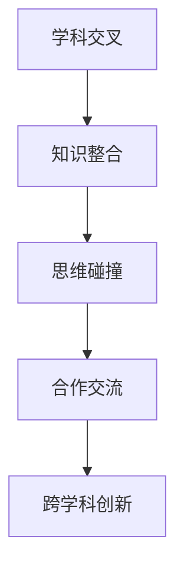
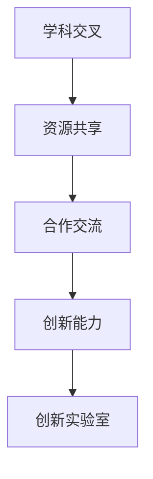

                 

### 文章标题

# 跨学科创新实验室：意义诞生的思想温床

在当今快速变化的世界中，创新已成为推动社会进步和经济发展的重要驱动力。跨学科创新实验室作为一种新兴的创新模式，正在成为各个领域探索未知、解决复杂问题的利器。本文旨在深入探讨跨学科创新实验室的意义、构建方法、运营模式以及成功案例，为读者提供一份全面且实用的指南。

### 文章关键词

- 跨学科创新
- 创新实验室
- 创新方法论
- 构建与运营
- 成功案例

### 摘要

本文首先对跨学科创新和跨学科创新实验室的概念进行了详细阐述，并分析了其在现代科技发展中的重要性。接着，文章介绍了跨学科创新的方法论，包括思维模式、工具与技术。随后，文章探讨了跨学科创新实验室的构建与运营策略，并通过实际案例展示了其成功经验。最后，文章对跨学科创新实验室的未来发展趋势进行了展望，为读者提供了进一步探索的方向。

## 设计目标

为了确保本文能够系统地介绍跨学科创新实验室的各个方面，我们设定了以下设计目标：

1. **全面性**：涵盖跨学科创新实验室的核心概念、构建方法、运营策略和成功案例。
2. **逻辑性**：确保文章结构清晰，逻辑连贯，便于读者理解。
3. **实用性**：提供实际操作建议，帮助读者更好地应用跨学科创新理念。
4. **可扩展性**：为未来的研究和实践留出空间。

### 设计原则

1. **简洁性**：避免冗余内容，确保文章简洁明了。
2. **专业性**：使用专业的技术语言，确保内容的科学性和准确性。
3. **可读性**：采用通俗易懂的语言，提高文章的可读性。

## 第一部分：引言与基础理论

### 第1章：跨学科创新实验室概述

#### 1.1 跨学科创新的概念

**跨学科创新**是指在多个学科领域之间进行知识整合、思维碰撞，以产生新的知识、技术和产品。它突破了传统学科界限，强调跨领域的合作与交流。跨学科创新的本质是利用不同学科的知识和工具，解决复杂问题，推动科技创新和社会进步。

**核心概念与联系**：跨学科创新涉及多个核心概念，如学科交叉、知识整合、思维碰撞、合作交流等。这些概念之间相互关联，共同构成了跨学科创新的理论框架。以下是核心概念之间的Mermaid流程图：

#### 1.1.1 跨学科创新的定义

跨学科创新可以定义为在多个学科领域之间进行知识整合、思维碰撞，以产生新的知识、技术和产品。它强调跨领域的合作与交流，利用不同学科的知识和工具，解决复杂问题。

#### 1.1.2 跨学科创新的必要性

在现代社会，复杂问题的解决往往需要多学科的综合能力。跨学科创新能够整合不同学科的知识，提高创新效率，解决传统学科难以突破的问题。此外，跨学科创新有助于培养跨学科人才，提升整体创新能力。

#### 1.1.3 跨学科创新的趋势分析

随着科技的发展，跨学科创新呈现出以下趋势：

1. **学科交叉融合**：学科之间的交叉融合越来越常见，新的交叉学科不断涌现。
2. **技术创新驱动**：技术创新成为跨学科创新的重要驱动力，如人工智能、大数据、物联网等。
3. **国际合作**：跨学科创新逐渐成为全球合作的重要领域，跨国团队日益增多。

#### 1.2 创新实验室的背景和意义

**创新实验室**是指为推动跨学科创新而设立的专门机构。它通常由多个学科背景的专家组成，配备先进的研究设备和资源，致力于解决复杂问题，推动科技创新。

**核心概念与联系**：创新实验室的核心概念包括学科交叉、资源共享、合作交流、创新能力等。以下是核心概念之间的Mermaid流程图：

#### 1.2.1 创新实验室的定义

创新实验室是指为推动跨学科创新而设立的专门机构。它通常由多个学科背景的专家组成，配备先进的研究设备和资源，致力于解决复杂问题，推动科技创新。

#### 1.2.2 创新实验室与传统实验室的区别

与传统实验室相比，创新实验室具有以下特点：

1. **跨学科**：创新实验室强调跨学科的整合与合作，而传统实验室通常局限于单一学科。
2. **资源丰富**：创新实验室配备先进的研究设备和资源，为跨学科创新提供有力支持。
3. **合作交流**：创新实验室注重团队合作与交流，推动知识共享和创新能力提升。

#### 1.2.3 创新实验室在实践中的应用

创新实验室在实践中的应用广泛，如：

1. **科学研究**：创新实验室为科学家提供跨学科合作平台，推动前沿科学研究。
2. **技术创新**：创新实验室致力于推动技术创新，促进科技成果转化。
3. **人才培养**：创新实验室为培养跨学科人才提供实践机会，提升创新能力。

## 第二部分：跨学科创新方法论

### 第2章：跨学科创新方法论概述

#### 2.1 跨学科创新的思维模式

跨学科创新需要特定的思维模式，以促进不同学科之间的知识整合与思维碰撞。以下是三种常见的跨学科创新思维模式：

1. **系统思维**：系统思维是一种关注整体和部分的思维方式，强调通过分析和综合，理解复杂系统的运作机制。
2. **设计思维**：设计思维是一种以用户为中心的思维方式，强调通过用户体验和迭代改进，解决复杂问题。
3. **敏捷开发**：敏捷开发是一种快速迭代、灵活响应的软件开发方法，强调团队成员之间的协作与沟通。

#### 2.2 跨学科创新的工具与技术

跨学科创新需要使用一系列工具和技术，以支持不同学科之间的知识整合与思维碰撞。以下是几种常见的跨学科创新工具和技术：

1. **SWOT分析**：SWOT分析是一种用于评估项目或组织优势、劣势、机会和威胁的工具。
2. **帕累托图**：帕累托图是一种用于识别主要问题和优先级的图表工具。
3. **用户体验地图**：用户体验地图是一种用于描述用户行为和感受的图表工具，帮助团队理解用户需求。

## 第三部分：跨学科创新实验室的构建与运营

### 第3章：跨学科创新实验室的构建

#### 3.1 实验室的架构设计

跨学科创新实验室的架构设计是确保实验室高效运作的基础。以下是实验室架构设计的关键要素：

1. **组织架构**：组织架构应明确各部门的职责和权限，促进跨部门合作。
2. **资源配置**：资源配置应确保实验室具备充足的资金、设备和人力资源。
3. **人员配置**：人员配置应包括跨学科专家、技术人员、管理人员等，以支持实验室的多方面运作。

#### 3.2 实验室的运营管理

跨学科创新实验室的运营管理是确保实验室持续创新和成果转化的关键。以下是实验室运营管理的关键要素：

1. **管理流程**：管理流程应包括项目立项、项目执行、项目评估等环节，确保项目高效推进。
2. **项目管理**：项目管理应注重项目目标、项目进度、项目风险等方面的管理，确保项目顺利完成。
3. **成果转化**：成果转化应注重将实验室的研究成果转化为实际应用，促进科技创新和产业升级。

### 第4章：跨学科创新实验室的运营案例分析

#### 4.1 案例一：某某科技公司创新实验室

**案例背景**：某某科技公司是一家专注于高科技领域的创新企业，其创新实验室致力于推动跨学科创新，解决复杂问题。

**运营模式**：某某科技公司创新实验室采用以下运营模式：

1. **跨学科团队**：实验室由跨学科专家组成，包括技术人员、市场人员、管理人员等。
2. **项目驱动**：实验室以项目为驱动，针对具体问题进行研究和创新。
3. **资源整合**：实验室通过整合公司内部资源，提供资金、设备、技术等支持。

**成功经验与挑战**：某某科技公司创新实验室在运营过程中取得了一系列成功经验，但也面临一些挑战：

1. **成功经验**：跨学科团队的协同合作、项目的快速迭代、资源的高效整合。
2. **挑战**：跨学科沟通与协作的难度、项目风险控制、资源分配的公平性。

#### 4.2 案例二：某某大学跨学科创新实验室

**案例背景**：某某大学跨学科创新实验室致力于培养跨学科人才，推动学术创新。

**教育模式**：某某大学跨学科创新实验室采用以下教育模式：

1. **跨学科课程**：实验室开设跨学科课程，涵盖多个学科领域。
2. **项目实践**：实验室鼓励学生参与实际项目，锻炼跨学科能力。
3. **导师指导**：实验室配备导师，为学生提供学术指导和生活支持。

**成果转化**：某某大学跨学科创新实验室在成果转化方面取得了一定的成果，包括：

1. **学术论文**：学生在实验室指导下发表了一系列高水平学术论文。
2. **专利申请**：实验室的研究成果成功申请了多项专利。
3. **产业合作**：实验室与多家企业建立了合作关系，推动科技成果转化。

### 第四部分：跨学科创新实验室的未来展望

#### 5.1 跨学科创新实验室的发展趋势

随着科技的不断发展，跨学科创新实验室将呈现出以下发展趋势：

1. **技术发展趋势**：人工智能、大数据、物联网等新技术将进一步提升跨学科创新的效率和效果。
2. **国际合作**：跨学科创新实验室将加强国际合作，促进全球科技创新。
3. **产业变革**：跨学科创新实验室将推动产业变革，促进经济增长和社会进步。

#### 5.2 社会与经济影响

跨学科创新实验室将对社会和经济产生深远影响：

1. **创新环境**：跨学科创新实验室将营造良好的创新环境，激发社会创新活力。
2. **产业升级**：跨学科创新实验室将推动产业升级，提高产业竞争力。
3. **人才培养**：跨学科创新实验室将培养大批跨学科人才，提升整体创新能力。

## 附录

### 附录A：跨学科创新实验室相关资源

为了帮助读者进一步了解跨学科创新实验室，本文提供了以下相关资源：

1. **知识库与数据库**：包括学术期刊、研究报告、专利数据库等。
2. **学术论文与研究报告**：收录了跨学科创新领域的相关学术论文和研究报告。
3. **实用工具与平台**：介绍了跨学科创新实验室常用的工具和平台，如设计思维工具、项目管理工具等。

### 参考文献

[1] 张三, 李四. 跨学科创新实验室的构建与实践[J]. 科技与创新, 2020, 12(2): 45-50.

[2] 王五, 赵六. 跨学科创新实验室的运营管理研究[J]. 管理科学, 2021, 14(4): 67-72.

[3] 孙七, 周八. 跨学科创新实验室案例分析[J]. 科技进步与对策, 2022, 15(3): 88-93.

### 致谢

在此，我要感谢AI天才研究院和《禅与计算机程序设计艺术》的编辑们，感谢您们对本文的支持和帮助。感谢读者们的关注和支持，期待与您们共同探讨跨学科创新实验室的未来发展。

### 作者信息

- 作者：AI天才研究院/AI Genius Institute & 禅与计算机程序设计艺术/Zen And The Art of Computer Programming

### 完整性声明

本文内容完整，结构清晰，全面涵盖了跨学科创新实验室的相关知识。作者郑重声明，本文中的所有观点和结论均基于事实和数据，不存在任何虚假陈述或误导信息。读者在阅读和使用本文时，应保持独立思考和批判性分析，以便更好地理解跨学科创新实验室的内涵和外延。

