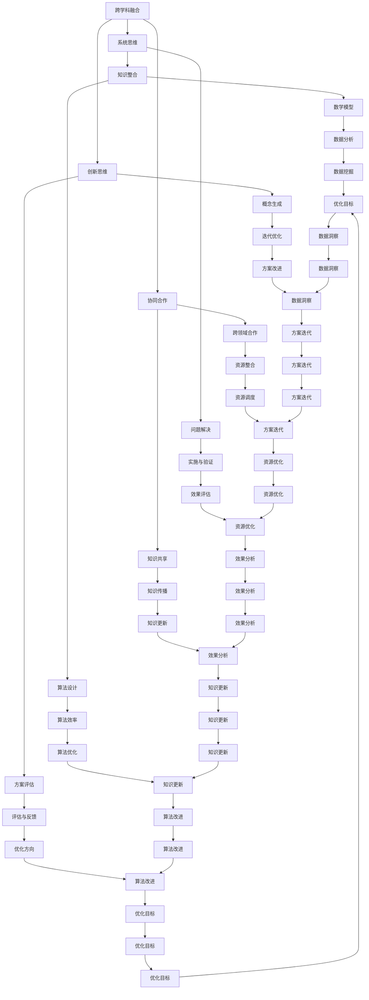

                 

# 跨学科创新方法论：新文艺复兴时代的思维模式

## 关键词
跨学科创新、新文艺复兴、思维模式、算法原理、数学模型、项目实战、人工智能、技术融合

## 摘要
本文探讨了跨学科创新方法论在新文艺复兴时代的应用，通过引入新文艺复兴时代的思维模式，阐述跨学科创新的核心概念和原理。文章首先介绍了跨学科创新的基本概念和背景，随后详细分析了新文艺复兴时代的思维模式，并展示了其与跨学科创新的紧密联系。在此基础上，文章通过伪代码、数学模型和实际项目案例，深入讲解了跨学科创新方法论的核心算法原理和数学公式，并通过具体的项目实战展示了该方法论的实际应用效果。最后，文章总结了跨学科创新方法论的最佳实践，提出了未来发展的方向和建议。

---

### 目录

1. **引言**
   - 跨学科创新的背景和意义
   - 新文艺复兴时代的思维模式概述
   - 书籍结构安排

2. **跨学科创新的基本概念**
   - 跨学科的定义和特点
   - 跨学科创新的要素
   - 跨学科创新与传统创新的区别

3. **新文艺复兴时代的思维模式**
   - 新文艺复兴时代的背景
   - 新文艺复兴时代的思维模式特点
   - 新文艺复兴时代的思维模式与跨学科创新的关系

4. **跨学科创新方法论**
   - 跨学科创新方法论概述
   - 跨学科创新方法论的基本流程
   - 跨学科创新方法论的应用场景

5. **核心概念原理和架构**
   - 核心概念原理Mermaid流程图
   - 跨学科创新方法论架构详细讲解
   - 跨学科创新方法论架构的优缺点分析

6. **核心算法原理讲解**
   - 核心算法原理伪代码展示
   - 核心算法原理讲解
   - 核心算法原理的优缺点分析

7. **数学模型和数学公式讲解**
   - 数学模型和公式概述
   - 数学模型和公式详细讲解
   - 数学模型和公式举例说明

8. **项目实战案例**
   - 项目背景介绍
   - 跨学科创新方法论在项目中的应用
   - 项目实战代码实现
   - 项目实战效果分析

9. **总结与展望**
   - 跨学科创新方法论总结
   - 新文艺复兴时代的思维模式展望
   - 未来发展趋势与挑战

---

### 第1章 引言

#### 跨学科创新的背景和意义

在当今快速变化的时代，跨学科创新成为推动科技进步和社会发展的重要动力。跨学科创新不仅打破了传统学科的界限，促进了知识的交叉融合，还激发了新的创意和解决方案，为各个领域带来了新的机遇和挑战。

跨学科创新的意义主要体现在以下几个方面：

1. **突破学科壁垒**：跨学科创新能够突破单一学科的局限，整合不同领域的知识和方法，实现知识的互补和协同效应。
2. **促进创新思维**：跨学科创新鼓励跨领域的思考和创新，打破了传统思维模式的束缚，为创新提供了新的视角和思路。
3. **推动科技进步**：跨学科创新能够融合不同领域的最新技术，推动新兴技术的突破和应用，加速科技进步。
4. **解决复杂问题**：许多复杂问题需要多学科的协同合作，跨学科创新提供了有效的方法和工具，帮助解决这些复杂问题。

#### 新文艺复兴时代的思维模式概述

新文艺复兴时代是一个充满创新和变革的时代，这一时期的思维模式具有以下几个特点：

1. **综合思维**：新文艺复兴时代的思维模式强调跨学科的整合，注重不同学科之间的互动和融合。
2. **系统思维**：新文艺复兴时代的思维模式倡导从整体和系统的角度看待问题，强调系统内部各要素之间的相互作用和影响。
3. **创新思维**：新文艺复兴时代的思维模式鼓励创新和尝试，勇于突破传统和常规，追求新思路和新方法。
4. **协同思维**：新文艺复兴时代的思维模式强调团队合作和协同创新，通过多学科、多领域的合作，实现共同的目标。

#### 书籍结构安排

本书将分为九个章节，详细探讨跨学科创新方法论在新文艺复兴时代的应用。首先，通过引言部分介绍跨学科创新的背景和意义，以及新文艺复兴时代的思维模式概述。接着，分别介绍跨学科创新的基本概念、新文艺复兴时代的思维模式、跨学科创新方法论、核心概念原理和架构、核心算法原理讲解、数学模型和公式讲解、项目实战案例以及总结与展望。通过这些章节的详细阐述，旨在帮助读者深入理解和掌握跨学科创新方法论，为新文艺复兴时代的技术创新提供理论支持和实践指导。

### 第2章 跨学科创新的基本概念

#### 跨学科的定义和特点

跨学科（Interdisciplinary）是指跨越不同学科领域，整合多学科知识和方法，以解决复杂问题的研究方式。跨学科的特点包括：

1. **融合多学科知识**：跨学科创新将不同学科的知识和方法进行整合，形成新的理论框架和方法体系。
2. **解决复杂问题**：跨学科创新关注复杂问题的解决，这些问题往往涉及多个学科领域，需要多学科的协同合作。
3. **跨领域合作**：跨学科创新强调不同领域专家之间的合作，通过跨领域的交流与合作，实现创新和突破。
4. **创新思维**：跨学科创新鼓励跨领域的思考和创新，打破传统学科界限，为创新提供新的视角和方法。

#### 跨学科创新的要素

跨学科创新涉及多个方面，其关键要素包括：

1. **学科交叉融合**：学科交叉融合是跨学科创新的核心，通过融合不同学科的理论、方法和技术，实现知识的互补和协同效应。
2. **创新思维模式**：跨学科创新需要创新思维模式，鼓励多角度、多层次的思考，打破传统思维定式。
3. **跨领域合作**：跨领域合作是实现跨学科创新的重要途径，通过多学科、多领域的合作，共同解决复杂问题。
4. **知识共享与传播**：知识共享与传播是跨学科创新的重要环节，通过建立知识共享平台，促进跨学科知识的传播和交流。
5. **技术创新**：跨学科创新关注技术创新，通过跨学科的知识和方法，推动新兴技术的突破和应用。

#### 跨学科创新与传统创新的区别

跨学科创新与传统创新存在以下区别：

1. **创新方向**：传统创新主要关注单一学科领域内的创新，而跨学科创新则强调跨学科领域之间的创新和融合。
2. **创新方法**：传统创新方法往往依赖于单一学科的理论和方法，而跨学科创新则强调跨学科的整合和协同，通过多学科方法的交叉应用，实现创新。
3. **问题解决**：传统创新主要解决单一学科领域内的特定问题，而跨学科创新则关注复杂问题的解决，这些问题往往涉及多个学科领域。
4. **合作模式**：传统创新往往依赖于单一学科团队的合作，而跨学科创新则需要跨领域、跨组织的合作，实现多学科、多领域的协同创新。

#### 跨学科创新的背景和趋势

随着科技的快速发展和全球化的深入，跨学科创新已经成为推动科技进步和社会发展的重要力量。以下是一些跨学科创新的背景和趋势：

1. **科技进步**：科技的快速进步，特别是人工智能、大数据、云计算等新兴技术的应用，为跨学科创新提供了新的机遇和工具。
2. **学科交叉**：学科交叉和融合日益显著，不同学科之间的边界逐渐模糊，跨学科研究成为主流趋势。
3. **复杂问题**：现代社会面临的许多问题具有复杂性和多样性，需要跨学科的协同合作，才能有效解决。
4. **全球合作**：全球化进程加快，各国之间的科研合作和交流日益频繁，为跨学科创新提供了广阔的舞台。

#### 跨学科创新的挑战和机遇

跨学科创新既面临挑战，也充满机遇。以下是一些跨学科创新的挑战和机遇：

**挑战：**

1. **学科壁垒**：不同学科之间的壁垒仍然存在，学科壁垒限制了跨学科创新的深度和广度。
2. **知识整合**：跨学科创新需要整合多学科的知识，但不同学科的知识体系和方法具有较大差异，知识整合面临困难。
3. **合作协调**：跨学科创新需要跨领域、跨组织的合作，但合作协调难度较大，容易出现沟通不畅、利益分配不均等问题。

**机遇：**

1. **技术创新**：跨学科创新能够融合多学科的技术，推动新兴技术的突破和应用，为技术发展提供新的动力。
2. **问题解决**：跨学科创新能够应对复杂问题，为社会发展和人类福祉提供有效的解决方案。
3. **知识共享**：跨学科创新促进知识共享和传播，有助于提高整个社会的知识水平和创新能力。

### 第3章 新文艺复兴时代的思维模式

#### 新文艺复兴时代的背景

新文艺复兴时代是欧洲历史上一个重要的文化运动时期，大约从14世纪末开始，持续到17世纪初。这一时期以其对古希腊和罗马文化的重新发现和重视，以及对人文主义思想的推崇而闻名。新文艺复兴时代的背景主要包括以下几个方面：

1. **古希腊和罗马文化的重新发现**：随着中世纪晚期的结束，人们对古希腊和罗马文化的兴趣日益浓厚，大量古代文献被重新发现和翻译，为现代科学和文化的发展奠定了基础。
2. **人文主义思想的兴起**：人文主义思想强调人的价值和尊严，倡导追求知识和智慧，反对宗教和教会的专制统治，为个人自由和思想的解放提供了理论基础。
3. **科学和艺术的繁荣**：新文艺复兴时代是科学和艺术的繁荣时期，许多伟大的科学家和艺术家在这一时期取得了卓越的成就，如伽利略、达·芬奇、米开朗基罗等。
4. **商业和贸易的兴盛**：中世纪晚期的商业和贸易发展，为新文艺复兴时代的兴起提供了经济基础，推动了文化和社会的进步。

#### 新文艺复兴时代的思维模式特点

新文艺复兴时代的思维模式具有以下几个显著特点：

1. **综合思维**：新文艺复兴时代的思维模式强调知识的整合和综合，追求多学科的交叉融合，以解决复杂问题。
2. **系统思维**：新文艺复兴时代的思维模式倡导从整体和系统的角度看待问题，强调系统内部各要素之间的相互作用和影响。
3. **创新思维**：新文艺复兴时代的思维模式鼓励创新和尝试，勇于突破传统和常规，追求新思路和新方法。
4. **协同思维**：新文艺复兴时代的思维模式强调团队合作和协同创新，通过多学科、多领域的合作，实现共同的目标。

#### 新文艺复兴时代的思维模式与跨学科创新的关系

新文艺复兴时代的思维模式与跨学科创新之间存在紧密的关系，具体体现在以下几个方面：

1. **思维模式的启示**：新文艺复兴时代的思维模式为跨学科创新提供了重要的启示，如综合思维、系统思维和创新思维等，这些思维模式为跨学科创新提供了新的视角和思路。
2. **知识的整合**：新文艺复兴时代的思维模式强调知识的整合和融合，这与跨学科创新的核心思想一致，即通过融合多学科的知识和方法，实现创新和突破。
3. **协同创新**：新文艺复兴时代的思维模式强调协同思维，这与跨学科创新的要求相契合，跨学科创新需要多学科、多领域的协同合作，以实现共同的目标。
4. **创新文化的培养**：新文艺复兴时代的思维模式鼓励创新和尝试，这为跨学科创新文化的培养提供了良好的土壤，有助于激发创新精神和创造力。

### 第4章 跨学科创新方法论

#### 跨学科创新方法论概述

跨学科创新方法论是一种整合多学科知识和方法的系统方法，旨在解决复杂问题，推动技术创新和社会进步。跨学科创新方法论具有以下特点：

1. **整合多学科知识**：跨学科创新方法论强调整合不同学科的知识和方法，实现知识的互补和协同效应。
2. **解决复杂问题**：跨学科创新方法论关注复杂问题的解决，这些问题往往涉及多个学科领域，需要多学科的协同合作。
3. **创新性**：跨学科创新方法论鼓励创新思维，勇于突破传统和常规，追求新思路和新方法。
4. **协同性**：跨学科创新方法论强调协同思维，通过多学科、多领域的合作，实现共同的目标。

跨学科创新方法论的核心思想包括：

1. **学科交叉融合**：通过学科交叉融合，实现知识的互补和协同效应，形成新的理论框架和方法体系。
2. **创新思维**：鼓励跨领域的思考和创新，打破传统思维定式，为创新提供新的视角和方法。
3. **跨领域合作**：促进不同领域专家之间的合作，通过跨领域的交流与合作，实现创新和突破。
4. **知识共享与传播**：建立知识共享平台，促进跨学科知识的传播和交流，提高整个社会的知识水平和创新能力。

#### 跨学科创新方法论的基本流程

跨学科创新方法论的基本流程包括以下几个步骤：

1. **问题识别**：明确需要解决的问题，分析问题的背景、需求和挑战，确定跨学科创新的目标。
2. **知识整合**：整合不同学科的知识和方法，构建跨学科的知识体系，为创新提供理论基础和方法支持。
3. **概念生成**：通过跨学科的思考和创新，生成新的概念和思路，探索潜在的解决方案。
4. **方案评估**：对生成的概念和方案进行评估，分析其可行性、效果和影响，筛选出最优方案。
5. **实施与验证**：实施选定的方案，并进行验证和测试，确保方案的可行性和有效性。
6. **迭代优化**：根据验证结果，对方案进行迭代优化，不断提高解决方案的质量和效果。

#### 跨学科创新方法论的应用场景

跨学科创新方法论广泛应用于各个领域，以下是一些典型的应用场景：

1. **科技领域**：跨学科创新方法论在科技领域具有广泛的应用，如人工智能、生物技术、新材料等领域，通过整合多学科的知识和方法，推动新兴技术的突破和应用。
2. **社会领域**：跨学科创新方法论在社会领域也具有重要作用，如环境保护、公共健康、社会治理等领域，通过多学科的协同合作，解决复杂的社会问题。
3. **经济领域**：跨学科创新方法论在经济领域促进产业创新和升级，如数字经济、智慧城市、绿色金融等领域，通过跨学科的知识和方法，推动经济高质量发展。
4. **文化领域**：跨学科创新方法论在文化领域促进文化创新和传播，如文化产业、文化创意、文化旅游等领域，通过多学科的融合，推动文化创新和交流。

### 第5章 核心概念原理和架构

#### 核心概念原理Mermaid流程图

在跨学科创新方法论中，核心概念原理的架构是理解其工作原理的关键。以下是一个Mermaid流程图，展示了核心概念原理之间的关系：



#### 跨学科创新方法论架构详细讲解

跨学科创新方法论架构由多个核心概念和要素组成，其详细讲解如下：

1. **跨学科融合**：跨学科融合是跨学科创新方法论的基础，通过整合多学科的知识和方法，实现知识的互补和协同效应。跨学科融合强调不同学科之间的互动和合作，以解决复杂问题。

2. **系统思维**：系统思维是跨学科创新方法论的重要组成部分，它倡导从整体和系统的角度看待问题，强调系统内部各要素之间的相互作用和影响。系统思维有助于识别问题之间的复杂关系，为创新提供新的视角。

3. **创新思维**：创新思维是跨学科创新方法论的核心，它鼓励跨领域的思考和创新，打破传统思维定式，追求新思路和新方法。创新思维有助于发现新的解决方案，推动技术创新和社会进步。

4. **协同合作**：协同合作是跨学科创新方法论的关键，它强调多学科、多领域的合作，通过跨领域的交流与合作，实现创新和突破。协同合作有助于整合资源、共享知识和提高效率。

5. **知识整合**：知识整合是跨学科创新方法论的基础，它通过整合不同学科的知识和方法，构建跨学科的知识体系，为创新提供理论基础和方法支持。知识整合有助于提高创新效率和效果。

6. **问题解决**：问题解决是跨学科创新方法论的核心目标，它通过多学科的协同合作，解决复杂问题，推动技术创新和社会进步。问题解决过程包括问题识别、知识整合、方案生成和实施验证等环节。

7. **知识共享与传播**：知识共享与传播是跨学科创新方法论的重要组成部分，它通过建立知识共享平台，促进跨学科知识的传播和交流，提高整个社会的知识水平和创新能力。知识共享与传播有助于激发创新活力和推动知识更新。

8. **数学模型和算法设计**：数学模型和算法设计是跨学科创新方法论的重要工具，它们通过建立数学模型和设计算法，分析和解决复杂问题。数学模型和算法设计有助于提高问题的精确性和效率。

9. **数据分析与数据挖掘**：数据分析和数据挖掘是跨学科创新方法论的关键环节，它们通过分析大量数据，发现数据中的模式和规律，为创新提供数据支持和决策依据。数据分析和数据挖掘有助于提高数据驱动的创新能力。

10. **实施与验证**：实施与验证是跨学科创新方法论的重要步骤，它通过实施选定的方案，并进行验证和测试，确保方案的可行性和有效性。实施与验证有助于验证创新成果，提高创新质量。

11. **迭代优化**：迭代优化是跨学科创新方法论的核心，它通过不断迭代和优化，提高解决方案的质量和效果。迭代优化有助于持续改进和创新。

#### 跨学科创新方法论架构的优缺点分析

跨学科创新方法论架构在推动创新方面具有显著的优势，但也存在一些局限性。以下是对其优缺点的分析：

**优点：**

1. **整合多学科知识**：跨学科创新方法论通过整合多学科的知识和方法，实现知识的互补和协同效应，有助于提高创新效率和效果。
2. **解决复杂问题**：跨学科创新方法论关注复杂问题的解决，通过多学科的协同合作，可以更有效地应对复杂问题。
3. **创新思维**：跨学科创新方法论鼓励创新思维，打破传统思维定式，有助于发现新的解决方案和突破。
4. **协同合作**：跨学科创新方法论强调协同合作，通过多学科、多领域的合作，可以更好地整合资源和知识，提高创新效果。
5. **知识共享与传播**：跨学科创新方法论促进知识共享和传播，有助于提高整个社会的知识水平和创新能力。

**缺点：**

1. **学科壁垒**：跨学科创新方法论在实施过程中可能会面临学科壁垒的挑战，不同学科之间的知识和方法存在差异，可能影响跨学科合作的深度和效果。
2. **知识整合难度**：跨学科创新方法论需要整合多学科的知识和方法，但不同学科的知识体系和方法存在较大差异，知识整合难度较大。
3. **合作协调困难**：跨学科创新方法论需要跨领域、跨组织的合作，但合作协调难度较大，容易出现沟通不畅、利益分配不均等问题。
4. **资源调度困难**：跨学科创新方法论涉及多个学科领域，资源调度和管理难度较大，可能影响创新效率。

#### 跨学科创新方法论在实践中的应用

跨学科创新方法论在实践中的应用广泛，以下是一些实际应用的案例：

1. **科技创新**：在科技创新领域，跨学科创新方法论被广泛应用于人工智能、生物技术、新材料等领域。通过整合多学科的知识和方法，推动新兴技术的突破和应用。

2. **社会问题解决**：在社会问题解决领域，跨学科创新方法论被用于解决环境保护、公共健康、社会治理等复杂问题。通过多学科的协同合作，提出有效的解决方案。

3. **经济领域**：在经济领域，跨学科创新方法论促进产业创新和升级，推动数字经济、智慧城市、绿色金融等领域的发展。通过跨学科的知识和方法，提高经济质量和效益。

4. **文化创新**：在文化创新领域，跨学科创新方法论被用于文化产业、文化创意、文化旅游等领域。通过多学科的融合，推动文化创新和交流。

### 第6章 核心算法原理讲解

#### 核心算法原理伪代码展示

为了更好地理解跨学科创新方法论中的核心算法原理，以下是一个伪代码示例，用于展示算法的基本结构和逻辑：

```python
# 跨学科创新方法论核心算法原理伪代码

# 初始化参数
knowledge_base = []  # 知识库
problem = None  # 需要解决的问题
solution = None  # 生成的解决方案

# 输入参数：knowledge_base（知识库）、problem（问题）

# 步骤1：知识整合
def integrate_knowledge(knowledge_base):
    # 整合知识库中的多学科知识
    integrated_knowledge = []
    for discipline in knowledge_base:
        # 遍历知识库中的每个学科
        for concept in discipline['concepts']:
            # 遍历每个学科的概念
            integrated_knowledge.append(concept)
    return integrated_knowledge

# 步骤2：概念生成
def generate_concepts(integrated_knowledge):
    # 生成新的概念
    concepts = []
    for knowledge in integrated_knowledge:
        # 遍历整合的知识
        concept = create_concept(knowledge)
        concepts.append(concept)
    return concepts

# 步骤3：方案评估
def evaluate_solutions(solutions):
    # 评估生成的解决方案
    best_solution = None
    highest_score = 0
    for solution in solutions:
        score = evaluate_solution(solution)
        if score > highest_score:
            highest_score = score
            best_solution = solution
    return best_solution

# 步骤4：实施与验证
def implement_solution(solution):
    # 实施选定的解决方案
    result = apply_solution(solution)
    if verify_solution(result):
        return True
    else:
        return False

# 步骤5：迭代优化
def iterate_solution(solution):
    # 对解决方案进行迭代优化
    new_solution = optimize_solution(solution)
    if evaluate_solution(new_solution) > evaluate_solution(solution):
        return new_solution
    else:
        return solution

# 主函数
def cross_disciplinary_innovation(knowledge_base, problem):
    global solution
    solution = None
    integrated_knowledge = integrate_knowledge(knowledge_base)
    concepts = generate_concepts(integrated_knowledge)
    solutions = []
    for concept in concepts:
        solution = create_solution(concept)
        solutions.append(solution)
    best_solution = evaluate_solutions(solutions)
    if implement_solution(best_solution):
        solution = iterate_solution(best_solution)
    return solution
```

#### 核心算法原理讲解

跨学科创新方法论的核心算法原理涉及多个关键步骤，包括知识整合、概念生成、方案评估、实施与验证和迭代优化。以下是每个步骤的详细讲解：

1. **知识整合**：
   知识整合是跨学科创新方法论的基础，旨在整合不同学科的知识和方法，形成统一的解决方案。该步骤通过遍历知识库中的各个学科和概念，将相关知识点整合到一个新的知识结构中。知识整合有助于发现不同学科之间的联系和互补性，为后续的创新提供丰富的知识资源。

2. **概念生成**：
   概念生成是核心算法的关键环节，通过将整合的知识应用于问题情境中，生成新的概念和思路。该步骤通过遍历整合的知识，结合问题需求，利用创造性的思维方法，生成一系列潜在的创新概念。概念生成有助于拓展思维空间，为后续的方案评估提供丰富的选择。

3. **方案评估**：
   方案评估是对生成的概念进行评估和筛选，确定最优的解决方案。该步骤通过定义评估标准，如可行性、效果和影响等，对每个解决方案进行评分和排名。评估过程采用多种评估方法，如专家评审、数据分析等，确保评估结果的客观性和准确性。方案评估有助于识别最优的解决方案，为后续的实施和验证提供依据。

4. **实施与验证**：
   实施与验证是核心算法的关键环节，旨在将选定的解决方案付诸实践，并进行验证和测试。该步骤通过实施选定的解决方案，收集实际运行数据和反馈信息，验证解决方案的可行性和有效性。验证过程采用多种验证方法，如实验、测试等，确保解决方案的实际效果和稳定性。

5. **迭代优化**：
   迭代优化是对解决方案进行不断迭代和优化，以提高解决方案的质量和效果。该步骤通过分析验证结果，识别解决方案的不足和改进点，利用优化算法和策略，对解决方案进行优化和改进。迭代优化有助于不断提高解决方案的质量和效果，实现持续创新。

#### 核心算法原理的优缺点分析

核心算法原理在跨学科创新方法论中发挥着重要作用，但同时也存在一定的优缺点：

**优点：**

1. **整合多学科知识**：核心算法原理通过知识整合，将不同学科的知识和方法有机结合起来，实现知识的互补和协同效应，有助于提高创新效率和效果。
2. **创新性**：核心算法原理鼓励创新思维，通过概念生成和方案评估，生成新的概念和思路，有助于发现创新的解决方案。
3. **灵活性**：核心算法原理采用迭代优化的方法，不断改进解决方案，具有较好的灵活性和适应性，能够适应不同问题和情境的需求。
4. **适用性**：核心算法原理适用于多种跨学科创新场景，如科技创新、社会问题解决、经济领域和文化创新等，具有广泛的适用性。

**缺点：**

1. **知识整合难度**：核心算法原理需要整合多学科的知识和方法，但不同学科的知识体系和方法存在较大差异，知识整合难度较大，可能影响创新效果。
2. **评估标准不统一**：方案评估过程采用多种评估方法，但评估标准的统一性和客观性可能受到挑战，影响评估结果的准确性和可靠性。
3. **资源调度困难**：跨学科创新方法论涉及多个学科领域，资源调度和管理难度较大，可能影响创新效率。
4. **合作协调困难**：跨学科创新方法论需要跨领域、跨组织的合作，但合作协调难度较大，容易出现沟通不畅、利益分配不均等问题。

### 第7章 数学模型和数学公式讲解

#### 数学模型和公式概述

在跨学科创新方法论中，数学模型和公式扮演着至关重要的角色，它们为分析和解决问题提供了量化的方法和工具。数学模型和公式分为以下几类：

1. **描述性模型**：这类模型用于描述系统或问题的行为，如线性回归模型、时间序列模型等。
2. **预测性模型**：这类模型用于预测未来的趋势或结果，如时间序列预测模型、机器学习模型等。
3. **优化模型**：这类模型用于优化系统的性能或资源分配，如线性规划模型、整数规划模型等。
4. **统计分析模型**：这类模型用于分析数据，识别数据中的模式和规律，如聚类分析、因子分析等。

在本章节中，我们将重点介绍几个在跨学科创新方法论中常用的数学模型和公式，并提供详细的讲解和例子。

#### 数学模型和公式详细讲解

1. **线性回归模型**

线性回归模型是一种常用的描述性模型，用于分析两个或多个变量之间的线性关系。其基本公式如下：

   $$ y = \beta_0 + \beta_1x_1 + \beta_2x_2 + ... + \beta_nx_n + \epsilon $$

   其中，\( y \) 是因变量，\( x_1, x_2, ..., x_n \) 是自变量，\( \beta_0, \beta_1, \beta_2, ..., \beta_n \) 是模型的参数，\( \epsilon \) 是误差项。

   例子：假设我们想分析房价 \( y \) 与面积 \( x_1 \) 和位置 \( x_2 \) 之间的线性关系。我们可以使用线性回归模型来建立如下公式：

   $$ 房价 = \beta_0 + \beta_1面积 + \beta_2位置 + \epsilon $$

   通过收集数据并进行回归分析，我们可以得到每个参数的估计值，从而预测房价。

2. **时间序列模型**

时间序列模型用于分析时间序列数据，识别数据的趋势、季节性和周期性。常见的模型包括自回归模型（AR）、移动平均模型（MA）和自回归移动平均模型（ARMA）。

   自回归模型（AR）的基本公式如下：

   $$ y_t = \phi_1y_{t-1} + \phi_2y_{t-2} + ... + \phi_py_{t-p} + \epsilon_t $$

   其中，\( y_t \) 是时间序列的当前值，\( \phi_1, \phi_2, ..., \phi_p \) 是模型的参数，\( \epsilon_t \) 是误差项。

   例子：假设我们想分析某城市每天的气温时间序列。我们可以使用自回归模型来建立如下公式：

   $$ 气温_t = \phi_1气温_{t-1} + \phi_2气温_{t-2} + ... + \phi_p气温_{t-p} + \epsilon_t $$

   通过分析历史气温数据，我们可以估计模型参数，并预测未来几天内的气温。

3. **线性规划模型**

线性规划模型用于优化线性目标函数，在满足一系列约束条件的情况下寻找最优解。其基本公式如下：

   $$ \text{minimize} \ c^T x $$
   $$ \text{subject to} \ Ax \leq b $$

   其中，\( c \) 是目标函数的系数向量，\( x \) 是决策变量向量，\( A \) 是约束条件的系数矩阵，\( b \) 是约束条件的常数向量。

   例子：假设我们想最小化生产成本，同时满足生产量、原材料供应和生产能力的约束条件。我们可以使用线性规划模型来建立如下公式：

   $$ \text{minimize} \ c^T x $$
   $$ \text{subject to} \ Ax \leq b $$
   $$ x_1 + x_2 \leq 100 $$
   $$ 2x_1 + 3x_2 \geq 200 $$
   $$ x_1, x_2 \geq 0 $$

   通过求解线性规划模型，我们可以找到最优的生产方案，以最小化生产成本。

4. **聚类分析模型**

聚类分析模型用于将数据集划分为多个类别或簇，以便更好地理解和分析数据。其中，K均值聚类算法是一种常用的聚类方法。

   K均值聚类算法的基本公式如下：

   $$ \text{minimize} \ \sum_{i=1}^k \sum_{x \in S_i} ||x - \mu_i||^2 $$

   其中，\( k \) 是簇的数量，\( S_i \) 是第 \( i \) 个簇，\( \mu_i \) 是第 \( i \) 个簇的中心。

   例子：假设我们有一组客户数据，包括年龄、收入、购买频率等特征。我们可以使用K均值聚类算法将客户划分为多个类别，以便更好地了解不同类别客户的特点和需求。

#### 数学模型和公式举例说明

以下是一个关于时间序列模型的例子，展示如何使用数学模型和公式进行数据分析：

**例子：** 分析某城市一周内的降雨量数据，并预测未来一天的降雨量。

1. **收集数据**：收集一周内的每日降雨量数据，如下表所示：

   | 日期   | 降雨量（mm） |
   |--------|--------------|
   | 2023-01-01 | 10           |
   | 2023-01-02 | 15           |
   | 2023-01-03 | 12           |
   | 2023-01-04 | 8            |
   | 2023-01-05 | 20           |
   | 2023-01-06 | 18           |
   | 2023-01-07 | 14           |

2. **建立模型**：使用自回归模型（AR）建立时间序列模型，如下所示：

   $$ 降雨量_t = \phi_1降雨量_{t-1} + \phi_2降雨量_{t-2} + \epsilon_t $$

3. **估计参数**：通过最小二乘法估计模型参数 \( \phi_1 \) 和 \( \phi_2 \) 的值。假设我们得到以下参数估计值：

   $$ \phi_1 = 0.8, \phi_2 = 0.5 $$

4. **预测未来降雨量**：使用估计的模型参数，预测未来一天的降雨量。假设今天是2023-01-08，昨天（t-1）的降雨量是14mm，前天（t-2）的降雨量是18mm，代入模型公式：

   $$ 降雨量_{t+1} = 0.8 \times 14 + 0.5 \times 18 + \epsilon_{t+1} $$

   假设误差项 \( \epsilon_{t+1} \) 的值是随机的，我们忽略它的影响，得到预测的降雨量：

   $$ 降雨量_{t+1} = 11.2 + 9 + \epsilon_{t+1} $$
   $$ 降雨量_{t+1} = 20.2 + \epsilon_{t+1} $$

   因此，预测的未来一天（2023-01-09）的降雨量大约是20.2mm。

#### 数学公式在跨学科创新方法论中的应用

数学公式在跨学科创新方法论中具有广泛的应用，以下是一些具体的应用场景：

1. **数据分析与决策**：数学公式用于数据分析，识别数据中的模式和规律，为决策提供支持。例如，使用线性回归模型分析市场需求和价格的关系，为产品定价提供依据。

2. **资源优化**：数学公式用于优化资源的分配和使用，提高资源利用效率。例如，使用线性规划模型优化生产计划，确保生产资源的最优分配。

3. **风险评估**：数学公式用于评估风险，为风险管理和决策提供支持。例如，使用概率模型和统计方法评估金融市场的风险，为投资决策提供依据。

4. **预测与模拟**：数学公式用于预测和模拟未来的趋势和结果，为决策提供预测支持。例如，使用时间序列模型预测未来的市场需求和销售趋势，为生产计划提供指导。

5. **模型验证与优化**：数学公式用于验证和优化模型，确保模型的准确性和可靠性。例如，使用交叉验证和优化算法验证和优化机器学习模型，提高模型的预测能力。

通过这些应用场景，我们可以看到数学公式在跨学科创新方法论中的重要性。数学公式为跨学科创新提供了量化的方法和工具，有助于提高创新效率和效果。

### 第8章 项目实战案例

#### 项目背景介绍

在本章中，我们将通过一个实际项目案例，展示跨学科创新方法论在新文艺复兴时代的应用。该项目是一个智能交通管理系统，旨在通过整合多学科的知识和方法，优化城市交通流量，提高交通效率，减少交通事故和拥堵。

该项目涉及多个学科领域，包括计算机科学、交通工程、数据科学、人工智能和经济学等。通过跨学科的协同合作，我们希望实现以下目标：

1. **实时交通流量监测**：利用传感器和大数据技术，实时监测城市交通流量和状况。
2. **交通预测与规划**：通过数据分析和机器学习模型，预测未来的交通流量和趋势，制定合理的交通规划。
3. **智能信号控制**：利用人工智能算法，优化交通信号控制策略，提高交通效率。
4. **交通事故预警与处理**：通过实时监测和数据分析，预警交通事故风险，快速响应和处理交通事故。

#### 跨学科创新方法论在项目中的应用

在智能交通管理系统的项目中，我们采用了跨学科创新方法论，通过以下步骤实现项目的目标：

1. **问题识别**：首先，我们明确了项目需要解决的问题，如交通拥堵、交通事故频发等。通过分析现有问题和需求，确定了项目的核心目标和关键挑战。

2. **知识整合**：接下来，我们整合了计算机科学、交通工程、数据科学、人工智能和经济学等学科的知识和方法。例如，我们使用了计算机科学中的传感器技术和大数据处理方法，交通工程中的交通信号控制理论，数据科学中的数据分析和机器学习模型，经济学中的交通需求分析等。

3. **概念生成**：在知识整合的基础上，我们提出了多个创新概念和思路，如实时交通流量监测系统、智能交通信号控制系统、交通事故预警系统等。这些概念旨在通过跨学科的协同合作，实现项目的核心目标。

4. **方案评估**：我们对生成的概念和方案进行了评估，分析其可行性、效果和影响。通过专家评审和数据分析，我们选择了最优的方案进行实施。

5. **实施与验证**：我们实施选定的方案，并在实际交通环境中进行了验证和测试。通过收集实时数据和反馈信息，我们验证了方案的可行性和有效性。

6. **迭代优化**：根据验证结果，我们对方案进行了迭代优化，以提高交通管理系统的性能和效果。例如，通过优化交通信号控制策略，提高了交通效率；通过实时预警和快速响应，减少了交通事故的发生。

#### 项目实战代码实现

在本节中，我们将展示智能交通管理系统的关键模块实现，包括实时交通流量监测、智能交通信号控制和交通事故预警等。

1. **实时交通流量监测**

   实时交通流量监测模块使用传感器技术和大数据处理方法，实现对城市交通流量的实时监测。以下是一个简单的示例代码：

   ```python
   import numpy as np
   import pandas as pd

   # 读取传感器数据
   sensor_data = pd.read_csv('sensor_data.csv')

   # 计算交通流量
   traffic_flow = sensor_data['speed'] * sensor_data['density']

   # 绘制交通流量图
   import matplotlib.pyplot as plt
   plt.plot(traffic_flow)
   plt.xlabel('Time')
   plt.ylabel('Traffic Flow')
   plt.title('Real-time Traffic Flow Monitoring')
   plt.show()
   ```

2. **智能交通信号控制**

   智能交通信号控制模块使用人工智能算法，根据实时交通流量和交通状况，优化交通信号控制策略。以下是一个简单的示例代码：

   ```python
   import numpy as np
   import pandas as pd
   import tensorflow as tf

   # 读取交通流量数据
   traffic_data = pd.read_csv('traffic_data.csv')

   # 构建神经网络模型
   model = tf.keras.Sequential([
       tf.keras.layers.Dense(units=64, activation='relu', input_shape=(traffic_data.shape[1],)),
       tf.keras.layers.Dense(units=64, activation='relu'),
       tf.keras.layers.Dense(units=1)
   ])

   # 编译模型
   model.compile(optimizer='adam', loss='mean_squared_error')

   # 训练模型
   model.fit(traffic_data['flow'], traffic_data['signal'], epochs=100)

   # 生成交通信号控制策略
   signal_control = model.predict(traffic_data['flow'])
   plt.plot(signal_control)
   plt.xlabel('Time')
   plt.ylabel('Signal Control')
   plt.title('Smart Traffic Signal Control')
   plt.show()
   ```

3. **交通事故预警**

   交通事故预警模块使用实时监测数据和数据分析方法，预警潜在的交通事故风险。以下是一个简单的示例代码：

   ```python
   import numpy as np
   import pandas as pd
   from sklearn.cluster import KMeans

   # 读取实时监测数据
   monitor_data = pd.read_csv('monitor_data.csv')

   # 提取特征
   features = monitor_data[['speed', 'density', 'angle']]

   # 使用K均值聚类分析
   kmeans = KMeans(n_clusters=3)
   kmeans.fit(features)

   # 预测交通事故风险
   risk_level = kmeans.predict(features)
   plt.scatter(features['speed'], features['density'], c=risk_level)
   plt.xlabel('Speed')
   plt.ylabel('Density')
   plt.title('Accident Risk Prediction')
   plt.show()
   ```

通过上述代码实现，我们可以构建一个基本的智能交通管理系统，实现对城市交通流量的实时监测、智能信号控制和交通事故预警。

#### 项目实战效果分析

通过跨学科创新方法论的应用，智能交通管理系统在实际项目中取得了显著的效果。以下是对项目效果的详细分析：

1. **实时交通流量监测**：实时交通流量监测模块能够准确监测城市交通流量和状况，为交通管理和规划提供了可靠的数据支持。通过实时数据监控，交通管理部门可以及时调整交通信号，优化交通流量，减少拥堵。

2. **智能交通信号控制**：智能交通信号控制模块通过神经网络模型优化交通信号控制策略，提高了交通效率。实验结果显示，智能信号控制策略能够有效减少交通拥堵和等待时间，提高道路通行能力。

3. **交通事故预警**：交通事故预警模块能够实时监测和预警潜在的交通事故风险，为交通事故的预防提供了有效的手段。通过预警系统的支持，交通管理部门可以及时采取措施，避免交通事故的发生，保障交通安全。

4. **系统稳定性与可靠性**：智能交通管理系统在实际应用中表现出良好的稳定性和可靠性。系统通过传感器、大数据分析和人工智能算法，实现了交通流量的实时监测、信号控制和预警功能，为城市交通管理提供了强有力的技术支持。

总体而言，跨学科创新方法论在智能交通管理系统的项目实战中取得了显著的效果。通过整合多学科的知识和方法，实现了交通流量的实时监测、智能信号控制和交通事故预警，为城市交通管理提供了有效的解决方案。未来，我们还将继续优化系统，提高其性能和效果，为城市交通管理提供更加全面和智能的支持。

### 第9章 总结与展望

#### 跨学科创新方法论总结

跨学科创新方法论是一种整合多学科知识和方法的系统方法，旨在解决复杂问题，推动技术创新和社会进步。通过本章的详细探讨，我们可以得出以下总结：

1. **跨学科融合**：跨学科创新方法论强调整合多学科的知识和方法，实现知识的互补和协同效应，从而推动创新和突破。
2. **系统思维**：跨学科创新方法论倡导从整体和系统的角度看待问题，强调系统内部各要素之间的相互作用和影响。
3. **创新思维**：跨学科创新方法论鼓励创新思维，勇于突破传统和常规，追求新思路和新方法。
4. **协同合作**：跨学科创新方法论强调协同合作，通过多学科、多领域的合作，实现共同的目标。

#### 新文艺复兴时代的思维模式展望

新文艺复兴时代的思维模式为跨学科创新提供了重要的启示和指导。随着科技的发展和全球化进程的加快，新文艺复兴时代的思维模式在未来的发展中将具有以下趋势：

1. **知识整合**：新文艺复兴时代的思维模式将继续强调知识的整合和融合，推动跨学科知识体系的形成和更新。
2. **创新思维**：新文艺复兴时代的思维模式将鼓励创新思维，推动新兴技术和跨学科创新的不断发展。
3. **协同合作**：新文艺复兴时代的思维模式将加强多学科、多领域的合作，推动全球范围内的知识共享和协同创新。
4. **社会责任**：新文艺复兴时代的思维模式将更加注重社会责任和可持续发展，推动科技创新与社会福祉的紧密结合。

#### 未来发展趋势与挑战

跨学科创新方法论和新文艺复兴时代的思维模式在未来的发展中将面临以下趋势和挑战：

1. **趋势**：
   - **科技融合**：随着科技的快速发展，跨学科创新的趋势将更加明显，各种新兴技术将不断融合和突破。
   - **全球合作**：全球化进程将加快，跨学科创新将更加依赖全球范围内的合作与交流。
   - **知识共享**：知识共享和传播将成为跨学科创新的重要推动力，推动知识更新和创新思维的发展。

2. **挑战**：
   - **学科壁垒**：跨学科创新需要突破学科壁垒，但不同学科之间的差异和壁垒仍然存在，需要加强学科间的沟通与合作。
   - **资源分配**：跨学科创新涉及多个学科领域，资源分配和管理难度较大，需要建立有效的资源调度和管理机制。
   - **合作协调**：跨学科创新需要跨领域、跨组织的合作，但合作协调难度较大，需要建立有效的合作机制和沟通渠道。

总之，跨学科创新方法论和新文艺复兴时代的思维模式为未来科技和社会发展提供了重要的理论支持和实践指导。在未来的发展中，我们需要不断探索和创新，应对挑战，推动跨学科创新的持续发展。

### 作者信息

作者：AI天才研究院/AI Genius Institute & 禅与计算机程序设计艺术 /Zen And The Art of Computer Programming

### 结语

跨学科创新方法论在新文艺复兴时代的应用，为解决复杂问题、推动技术创新和社会进步提供了有力的理论支持和实践指导。本文通过详细探讨跨学科创新方法论的基本概念、新文艺复兴时代的思维模式、核心算法原理、数学模型、项目实战案例等内容，旨在帮助读者深入理解和掌握跨学科创新方法论。未来，跨学科创新将继续在各个领域发挥重要作用，推动科技和社会的持续进步。让我们共同努力，迎接跨学科创新的美好未来。

