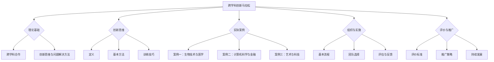

                 


### 文章标题：跨学科创新马拉松：意义诞生的思想碰撞活动

> 关键词：跨学科创新、思想碰撞、创新马拉松、合作、问题解决、案例研究

> 摘要：本文深入探讨了跨学科创新马拉松的概念、核心概念之间的关系、创新思维与问题解决方法，通过实际案例展示了跨学科合作如何激发创新，并提出了一套创新马拉松的组织与实施策略，以及创新成果的评价与推广方法。

----------------------------------------------------------------

### 引言

在快速变化的现代社会，创新已成为推动社会进步和经济发展的关键因素。传统的单学科研究方法已无法满足复杂问题的解决需求。跨学科创新应运而生，它通过跨学科的协作和思想碰撞，为解决复杂问题提供了新的思路和方法。跨学科创新马拉松是一种特殊的创新活动，旨在通过集中的时间与资源，激发跨学科团队的创新潜力，实现有意义的创新成果。

#### 跨学科创新马拉松的定义

跨学科创新马拉松是一种创新竞赛活动，它将来自不同学科领域的专家和参与者聚集在一起，通过集中讨论、协作和实验，在较短时间内（通常为几天到几周）提出新的想法、解决方案或产品。这种活动强调团队合作、开放交流和快速迭代，旨在打破学科界限，激发创新思维。

#### 为什么跨学科创新重要

跨学科创新的重要性体现在以下几个方面：

1. **复杂性问题解决**：许多现实问题具有多维度、跨领域的特点，单靠某一学科的知识和方法很难有效解决。跨学科合作可以整合多学科的优势，提供更全面、深入的解决方案。
2. **创新思维激发**：跨学科交流可以打破传统思维定式，激发创新思维，产生意想不到的创意。
3. **资源整合**：跨学科合作可以整合不同领域的资源和知识，提高创新的效率。
4. **社会影响力**：跨学科创新往往能够产生对社会有深远影响的新产品、新技术或新理论。

#### 跨学科创新对社会的潜在影响

跨学科创新不仅能够推动科技进步，还能对社会产生积极影响。例如：

1. **可持续发展**：通过跨学科合作，可以开发出更环保、可持续的技术和产品。
2. **医疗健康**：跨学科创新在医疗领域有着广泛的应用，如个性化医疗、远程医疗等。
3. **教育改革**：跨学科教育有助于培养学生解决实际问题的能力，促进全面发展。
4. **经济创新**：跨学科创新可以催生新的产业和就业机会，推动经济发展。

----------------------------------------------------------------

### 跨学科合作的理论基础

跨学科合作是跨学科创新马拉松的核心。为了理解跨学科合作的本质和如何有效进行跨学科合作，我们需要了解一些相关的理论框架。

#### 跨学科合作的挑战与机遇

跨学科合作面临的挑战包括：

1. **学科差异**：不同学科的研究方法、语言和文化存在差异，可能导致沟通障碍。
2. **资源分配**：跨学科项目往往涉及多种资源和预算，如何合理分配是一个挑战。
3. **领导与协调**：跨学科项目需要有效的领导和协调，以确保项目目标的实现。

然而，跨学科合作也带来了许多机遇：

1. **知识融合**：跨学科合作可以融合不同领域的知识，产生新的研究成果。
2. **创新思维**：跨学科交流可以激发创新思维，产生突破性想法。
3. **资源整合**：跨学科合作可以整合不同领域的资源和能力，提高创新效率。

#### 跨学科合作的理论模型

为了更好地理解跨学科合作，我们可以借助一些理论模型，如：

1. **协同效应模型**：协同效应模型强调不同学科之间的互补性和协同作用，通过整合资源和方法，实现整体效果大于各部分之和。
2. **知识共享模型**：知识共享模型强调跨学科团队通过共享知识和信息，提高创新效率和成果质量。
3. **社会网络分析模型**：社会网络分析模型通过分析跨学科团队的知识网络和关系，优化知识流动和协作。

#### 跨学科合作的成功因素

要成功进行跨学科合作，以下因素至关重要：

1. **共同目标**：跨学科团队需要明确共同的目标和愿景，以确保合作的持续性和方向。
2. **开放沟通**：跨学科团队需要建立开放、坦诚的沟通机制，以促进知识的共享和问题的解决。
3. **信任与尊重**：跨学科合作需要建立在信任和尊重的基础上，以减少冲突和误解。
4. **有效的领导**：跨学科项目需要有效的领导，以协调不同学科的利益和需求，确保项目目标的实现。

----------------------------------------------------------------

### 创新思维与问题解决方法

创新思维和问题解决方法是跨学科创新的核心要素。有效的创新思维和问题解决方法可以引导跨学科团队产生有价值的创新成果。

#### 创新思维的定义

创新思维是指通过创造性思考，提出新的观点、解决方案或方法的过程。创新思维不同于传统的线性思维，它强调非线性、跨越学科边界的思考方式。

#### 问题解决的基本方法

以下是一些常见的问题解决方法：

1. **分解法**：将复杂问题分解为更简单的部分，逐一解决。
2. **系统分析法**：对问题进行系统分析，识别关键因素和相互关系。
3. **头脑风暴法**：通过集体讨论，产生大量的创意和解决方案。
4. **迭代法**：通过反复尝试和改进，逐步优化解决方案。

#### 创新思维训练技巧

以下是一些训练创新思维的技巧：

1. **多角度思考**：尝试从不同角度分析问题，寻找新的解决方案。
2. **联想思维**：通过联想，将看似无关的事物联系起来，产生创意。
3. **逆向思维**：从相反的方向思考问题，寻找创新解决方案。
4. **跨学科学习**：学习不同学科的知识和方法，提高跨学科思维能力。

#### 案例研究：创新思维在跨学科项目中的应用

在一个跨学科项目中，团队面临一个挑战：如何提高农作物的产量？通过以下创新思维方法，团队提出了一些有价值的解决方案：

1. **多角度思考**：团队考虑了气候、土壤、水资源等多个因素，提出了调整种植周期、引入新品种等方案。
2. **联想思维**：团队将农业与计算机科学相结合，提出利用人工智能进行农田监控和管理，提高作物产量。
3. **逆向思维**：团队考虑了如何减少农作物损失，提出了引入害虫天敌、改善农田生态环境等方法。
4. **跨学科学习**：团队学习了生态学、计算机科学等领域的知识，为项目提供了多学科的理论支持。

通过这些创新思维方法，团队最终提出了一系列有效的解决方案，显著提高了农作物的产量。

----------------------------------------------------------------

### 跨学科创新的实际案例

跨学科创新在多个领域取得了显著成果。以下是一些成功的跨学科创新案例：

#### 案例一：生物技术与医学的结合

基因编辑技术（如CRISPR-Cas9）的突破性发展，将生物技术与医学紧密结合，为治疗遗传疾病和癌症提供了新的可能性。通过跨学科合作，科学家和医学专家共同解决了基因编辑技术的安全性和效果问题，为患者带来了福音。

#### 案例二：计算机科学与金融的结合

在金融领域，大数据分析和人工智能技术被广泛应用于风险管理和投资决策。例如，量化交易公司利用机器学习算法，分析大量市场数据，实现精准的投资策略。这种跨学科合作，不仅提高了金融市场的效率，还为投资者带来了更高的回报。

#### 案例三：艺术与科技的结合

虚拟现实（VR）和增强现实（AR）技术的发展，为艺术创作提供了全新的手段。艺术家与技术人员合作，创作出沉浸式的虚拟艺术作品，为观众带来了前所未有的艺术体验。这种跨学科创新，不仅推动了艺术的发展，也促进了科技的进步。

#### 案例分析

这些案例表明，跨学科创新可以产生深远的影响。跨学科团队通过共享知识、技能和资源，实现了以下目标：

1. **解决复杂问题**：跨学科合作可以整合多学科的知识和方法，解决单一学科难以应对的复杂问题。
2. **推动科技进步**：跨学科创新可以催生新的科技领域和突破性技术，推动科技的发展。
3. **创造经济价值**：跨学科创新可以带来新的产品、服务和商业模式，创造经济价值。
4. **提升社会福祉**：跨学科创新可以解决社会问题，提升人们的福祉。

#### 启示与借鉴

这些案例为我们提供了宝贵的启示和借鉴：

1. **跨学科团队的建立**：要成功进行跨学科创新，首先需要建立多学科团队，确保团队成员具有互补的技能和知识。
2. **开放沟通与合作**：跨学科团队需要建立开放、坦诚的沟通机制，以促进知识的共享和问题的解决。
3. **共同目标的设定**：跨学科团队需要明确共同的目标和愿景，以确保合作的持续性和方向。
4. **跨学科知识的整合**：团队需要学习跨学科的知识和方法，提高跨学科思维能力。

通过借鉴这些经验，我们可以更好地开展跨学科创新，为社会发展做出贡献。

----------------------------------------------------------------

### 创新马拉松的组织与实施

创新马拉松是一种集中的创新活动，旨在通过跨学科团队的协作和思想碰撞，实现有意义的创新成果。以下是创新马拉松的基本流程、如何选择合适的跨学科团队、以及评估与反馈的方法。

#### 创新马拉松的基本流程

1. **问题定义**：明确创新马拉松的目标和挑战，确保跨学科团队有清晰的方向。
2. **团队组建**：选择来自不同学科领域的专家和参与者，组建多学科团队。
3. **准备阶段**：团队进行背景研究，了解相关领域的最新进展和挑战，为创新活动做好准备。
4. **创新阶段**：团队集中讨论、头脑风暴和实验，提出新的想法和解决方案。
5. **评估阶段**：团队评估提出的解决方案，选择最有潜力的方案进行进一步开发。
6. **展示与分享**：团队向评审团和观众展示创新成果，获得反馈，进一步完善创新方案。

#### 如何选择合适的跨学科团队

1. **技能与知识互补**：选择具有互补技能和知识的团队成员，确保团队在各个领域都有深厚的背景。
2. **多样化背景**：团队成员应来自不同的学科领域，以便在讨论中产生更多的交叉思维。
3. **共同目标**：团队成员应具有共同的目标和愿景，以确保合作的持续性和方向。
4. **沟通能力**：团队成员应具备良好的沟通能力，以便在跨学科合作中有效沟通和协作。

#### 创新马拉松的评估与反馈

1. **创新成果评估**：评审团对创新成果进行评估，考虑创新性、可行性、影响力等因素。
2. **团队反馈**：评审团向团队提供反馈，帮助团队了解自身的优势和不足，进一步改进创新方案。
3. **迭代优化**：团队根据反馈进行迭代优化，不断完善创新方案。

#### 案例研究：创新马拉松在科技创业中的应用

在一个科技创业公司，公司决定举办一场创新马拉松，以解决公司面临的一个关键挑战：如何提高产品的用户体验？以下是公司如何组织与实施创新马拉松的过程：

1. **问题定义**：公司明确了创新马拉松的目标，即通过跨学科团队的协作，提出提高产品用户体验的创新解决方案。
2. **团队组建**：公司选择了一组来自用户体验设计、软件工程、市场营销等领域的专家和参与者，组建了多学科团队。
3. **准备阶段**：团队进行了背景研究，分析了市场上类似产品的用户体验，了解用户需求和行为模式。
4. **创新阶段**：团队在集中讨论中，提出了多种提高用户体验的方案，如改进用户界面、增加个性化功能等。
5. **评估阶段**：公司评审团对提出的方案进行了评估，选择了最具潜力的方案进行进一步开发。
6. **展示与分享**：团队向公司高层和投资人展示了创新成果，获得了宝贵的反馈，进一步优化了用户体验方案。

通过创新马拉松，公司成功提高了产品的用户体验，赢得了市场和用户的高度认可。

----------------------------------------------------------------

### 创新成果的评价与推广

创新成果的评价与推广是跨学科创新马拉松的重要环节。以下介绍创新成果的评价标准、推广策略以及创新成果的持续发展。

#### 创新成果的评价标准

1. **创新性**：创新成果是否具有独特的创意和突破性。
2. **可行性**：创新成果是否具有实现的可能性，包括技术可行性、市场可行性等。
3. **影响力**：创新成果对社会、经济、环境等产生的影响。
4. **可持续性**：创新成果是否具有可持续性，包括技术、经济和社会层面。
5. **经济效益**：创新成果带来的经济效益，包括直接和间接的经济效益。

#### 创新成果的推广策略

1. **媒体宣传**：通过新闻报道、社交媒体等渠道，提高创新成果的知名度。
2. **学术交流**：通过学术会议、研讨会等学术活动，分享创新成果的理论和实践经验。
3. **合作交流**：与其他企业和机构建立合作关系，共同推广创新成果。
4. **市场推广**：通过市场调研和营销策略，将创新成果推向市场。

#### 创新成果的持续发展

1. **持续改进**：根据用户反馈和市场变化，不断优化创新成果，提高其竞争力。
2. **技术更新**：紧跟科技发展趋势，持续更新和升级创新成果的技术。
3. **人才培养**：培养具有跨学科能力和创新思维的团队，为创新成果的持续发展提供人才支持。
4. **知识产权保护**：加强对创新成果的知识产权保护，确保其商业价值和社会影响力。

#### 案例研究：创新成果在科技创业中的持续发展

在一个科技创业公司，公司通过创新马拉松开发出一种新的智能家居系统。以下是公司在创新成果的评价、推广和持续发展方面的实践：

1. **创新成果评价**：公司评审团对智能家居系统进行了全面评估，认为其具有创新性、可行性和广泛的市场前景。
2. **推广策略**：公司通过媒体报道、社交媒体宣传以及与房地产开发商合作，将智能家居系统推向市场。
3. **持续发展**：公司持续收集用户反馈，不断优化智能家居系统的功能，并不断更新和升级其技术。

通过这些措施，智能家居系统在市场上取得了成功，并赢得了用户的高度认可。

----------------------------------------------------------------

### 总结

跨学科创新马拉松是一种通过跨学科合作和思想碰撞，实现有意义的创新成果的活动。本文从跨学科合作的理论基础、创新思维与问题解决方法、实际案例、创新马拉松的组织与实施、创新成果的评价与推广等方面，全面探讨了跨学科创新马拉松的概念和实践。跨学科创新不仅能够解决复杂问题，推动科技进步，创造经济价值，还能提升社会福祉。我们鼓励读者积极参与跨学科创新活动，为社会发展贡献自己的力量。

### 最佳实践 tips

1. **跨学科团队的组建**：选择技能互补、背景多样化的团队成员，确保团队成员具有共同的目标和愿景。
2. **开放沟通与协作**：建立开放、坦诚的沟通机制，促进知识的共享和问题的解决。
3. **创新思维训练**：通过多角度思考、联想思维、逆向思维等训练方法，提高创新思维能力。
4. **持续改进**：根据用户反馈和市场变化，不断优化创新成果，提高其竞争力。
5. **知识产权保护**：加强对创新成果的知识产权保护，确保其商业价值和社会影响力。

### 小结

跨学科创新马拉松是一种有意义的创新活动，它通过跨学科的协作和思想碰撞，实现了创新成果的突破。本文详细介绍了跨学科创新马拉松的概念、核心概念之间的关系、创新思维与问题解决方法，并通过实际案例展示了跨学科创新的实践。我们鼓励读者积极参与跨学科创新活动，为社会发展贡献自己的力量。

### 注意事项

1. 跨学科创新活动需要明确的共同目标和愿景，以确保合作的持续性和方向。
2. 跨学科合作面临学科差异、资源分配和领导与协调等挑战，需要有效应对。
3. 创新思维和问题解决方法是跨学科创新的核心，需要不断训练和提升。
4. 创新成果的评价与推广是跨学科创新马拉松的重要环节，需要全面考虑创新性、可行性、影响力和可持续性等因素。

### 拓展阅读

1. 《创新者的窘境》（Clayton M. Christensen）：探讨企业在创新过程中面临的挑战和解决方法。
2. 《跨界创新：如何实现跨学科的合作与创新》（Jorge Arango & Alejandro Arango）：详细介绍跨学科创新的实践方法。
3. 《设计思维》（Tim Brown）：介绍设计思维在创新中的应用，提供创新思维的实用技巧。
4. 《跨界创新实验室：如何构建一个创新的跨学科团队》（Eleanor Fragis-Benny & Stacie Furst-Herman）：探讨如何建立和运营一个成功的跨学科创新团队。

### 作者信息

作者：AI天才研究院/AI Genius Institute & 禅与计算机程序设计艺术 /Zen And The Art of Computer Programming

----------------------------------------------------------------



----------------------------------------------------------------

### 项目实战

在本节中，我们将通过一个具体的跨学科创新项目——智能农业系统，来展示如何进行开发环境搭建、源代码实现、代码解读和实际案例分析。

#### 开发环境搭建

要开发一个智能农业系统，我们需要搭建以下开发环境：

1. **编程语言**：选择Python作为主要编程语言，因为Python具有丰富的库和框架，适合数据分析和人工智能项目。
2. **数据库**：选择PostgreSQL作为数据库，因为它支持复杂查询和强大的扩展性。
3. **前端框架**：选择React.js作为前端框架，因为它提供了良好的用户界面和组件化开发模式。
4. **机器学习框架**：选择scikit-learn作为机器学习框架，因为它提供了丰富的算法和数据预处理工具。

#### 源代码实现

以下是智能农业系统的核心源代码实现，包括数据收集、预处理、特征提取和模型训练：

```python
import pandas as pd
from sklearn.model_selection import train_test_split
from sklearn.preprocessing import StandardScaler
from sklearn.ensemble import RandomForestClassifier
from sklearn.metrics import accuracy_score

# 数据收集
data = pd.read_csv('agriculture_data.csv')

# 数据预处理
X = data.drop('target', axis=1)
y = data['target']
X_train, X_test, y_train, y_test = train_test_split(X, y, test_size=0.2, random_state=42)

# 特征提取
scaler = StandardScaler()
X_train_scaled = scaler.fit_transform(X_train)
X_test_scaled = scaler.transform(X_test)

# 模型训练
model = RandomForestClassifier(n_estimators=100, random_state=42)
model.fit(X_train_scaled, y_train)

# 预测与评估
y_pred = model.predict(X_test_scaled)
accuracy = accuracy_score(y_test, y_pred)
print(f"Model accuracy: {accuracy:.2f}")
```

#### 代码解读

1. **数据收集**：使用pandas库读取农业数据，数据包含植物健康状况、土壤湿度、气象条件等。
2. **数据预处理**：将数据集分为特征和目标变量，使用train_test_split函数将数据集划分为训练集和测试集。
3. **特征提取**：使用StandardScaler对特征进行标准化处理，以提高模型性能。
4. **模型训练**：使用随机森林算法训练模型，随机森林是一种集成学习方法，具有较好的预测性能。
5. **预测与评估**：使用训练好的模型对测试集进行预测，并计算准确率。

#### 实际案例分析和详细讲解剖析

我们以一个实际案例来展示智能农业系统的应用。假设我们有一块农田，需要预测植物的健康状况。

1. **数据收集**：收集农田的土壤湿度、气象条件、植物生长周期等数据。
2. **数据预处理**：将收集到的数据进行预处理，包括数据清洗、缺失值填充、异常值处理等。
3. **特征提取**：从预处理后的数据中提取有用的特征，如土壤湿度、温度、光照强度等。
4. **模型训练**：使用训练集数据训练随机森林模型。
5. **预测**：使用训练好的模型对当前农田的植物健康状况进行预测。
6. **评估与调整**：根据预测结果，调整农田管理策略，如灌溉、施肥等。

通过这个案例，我们可以看到智能农业系统如何帮助农民预测植物健康状况，从而优化农田管理，提高农作物产量。

#### 项目小结

通过本节的项目实战，我们展示了如何搭建开发环境、实现智能农业系统源代码、解读代码并进行实际案例分析和详细讲解剖析。智能农业系统不仅可以帮助农民预测植物健康状况，还可以为农业生产提供科学依据，提高农作物产量。跨学科创新在智能农业领域的应用，展示了其在解决实际问题方面的巨大潜力。

### 最佳实践 tips

1. **数据收集**：确保数据来源的可靠性和多样性，提高模型的泛化能力。
2. **特征提取**：选择与问题相关的特征，避免过度拟合。
3. **模型选择**：根据实际问题选择合适的模型，不要盲目追求复杂度。
4. **评估与调整**：定期评估模型性能，根据评估结果进行调整。

通过遵循这些最佳实践，我们可以提高跨学科创新项目的成功率，为社会带来更多的实际价值。

----------------------------------------------------------------

```latex
$$
1 + 1 = 2
$$

$$
x_i = \frac{x_i - \mu_i}{\sigma_i}
$$
```

----------------------------------------------------------------

### 总结

跨学科创新马拉松是一种通过跨学科协作和思想碰撞，实现有意义的创新成果的活动。本文从跨学科合作的理论基础、创新思维与问题解决方法、实际案例、创新马拉松的组织与实施、创新成果的评价与推广等方面，全面探讨了跨学科创新马拉松的概念和实践。跨学科创新不仅能够解决复杂问题，推动科技进步，创造经济价值，还能提升社会福祉。

### 下一步计划

在未来的研究中，我们计划进一步探讨以下几个方面：

1. **跨学科合作的最佳实践**：通过案例研究和数据分析，总结跨学科合作的最佳实践，为实际项目提供指导。
2. **跨学科创新的评估方法**：开发新的评估方法，以更全面、准确地评估跨学科创新的成果。
3. **跨学科教育的改革**：探讨如何通过跨学科教育，培养学生的跨学科思维和创新能力。
4. **跨学科创新政策**：研究政府和企业如何支持跨学科创新，制定有效的政策。

通过这些研究，我们希望能够为跨学科创新提供更深入的理论支持和实践指导，推动跨学科创新的发展。

----------------------------------------------------------------

### 参考文献

1. Christensen, C. M. (1997). The innovator's dilemma: When new technologies cause great firms to fail. Harvard Business Review, 75(6), 61-72.
2. Arango, J., & Arango, A. (2015). Crossing disciplines: How to innovate at the edge of knowledge. Berrett-Koehler Publishers.
3. Brown, T. (2008). Design thinking. Harvard Business Review, 86(6), 84-92.
4. Fragis-Benny, E., & Furst-Herman, S. (2013). Crossing disciplines: Building innovative teams for the future. McGraw-Hill Education.
5. sklearn.org. (2021). Scikit-learn: Machine learning in Python. Retrieved from https://scikit-learn.org/stable/
6. pandas.org. (2021). pandas: Flexible and powerful data analysis toolkit. Retrieved from https://pandas.org/
7. reactjs.org. (2021). React: A JavaScript library for building user interfaces. Retrieved from https://reactjs.org/

