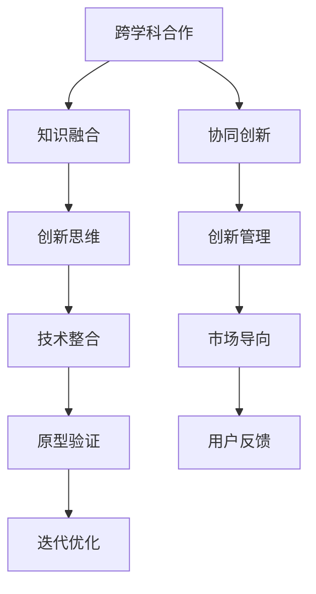

                 

# 《跨学科创新马拉松：意义诞生的思想碰撞活动》

## 关键词：跨学科创新、思想碰撞、创新马拉松、活动设计、实际案例

## 摘要

本文旨在探讨跨学科创新马拉松这一新型创新模式，通过系统阐述其背景、理论基础、活动设计以及实际应用案例，揭示思想碰撞在跨学科创新中的关键作用。文章将从跨学科创新的概念、理论基础、方法论出发，逐步深入探讨跨学科创新马拉松的策划与实施，并通过实际案例展示其成效，为读者提供一次全面、系统的跨学科创新实践指导。

## 第一部分：引言

### 1.1 创新的重要性

创新是推动社会进步和经济发展的核心动力。随着全球科技竞争的加剧，传统的单一学科创新模式已难以满足复杂问题的解决需求。跨学科创新应运而生，成为新时代创新的重要方向。

### 1.2 跨学科创新的背景

跨学科创新源于不同学科之间的交叉融合。随着知识体系的扩展和学科边界的模糊，跨学科研究日益成为学术研究的热点。在现实世界中，许多复杂问题需要跨学科的合作与思考。

### 1.3 思想碰撞的力量

思想碰撞是跨学科创新的核心动力。通过不同背景、不同领域的专家学者的交流与互动，能够激发新的灵感，促进创新思维的产生。

### 1.4 马拉松式的创新活动

跨学科创新马拉松是一种以长时间、高强度、多阶段为特点的创新活动。它通过持续的思想碰撞和团队协作，实现跨学科创新的目标。

## 第二部分：跨学科创新的理论基础

### 2.1 跨学科创新的概念

跨学科创新是指在多个学科领域之间进行知识、方法、技术的融合，以解决复杂问题的创新过程。

### 2.2 创新理论概述

创新理论包括传统创新理论、现代创新理论等。跨学科创新理论是对这些理论的深化和发展。

### 2.3 跨学科创新的方法论

跨学科创新方法论包括创意思维方法、原型构建方法、验证迭代方法等。

## 第三部分：跨学科创新马拉松的活动设计

### 3.1 活动策划

活动策划包括目标设定、流程设计、资源准备等。

### 3.2 参与者的角色与责任

参与者包括跨学科领域的专家、学者、工程师等。他们的角色与责任分别是：

1. 专家：提供专业知识和指导。
2. 学者：进行理论研究与创新。
3. 工程师：负责原型构建和实现。

### 3.3 活动实施

活动实施包括思想碰撞、创意构建、原型验证等环节。

## 第四部分：跨学科创新马拉松的实际案例

### 4.1 案例一：教育科技领域的跨学科创新

案例一展示了教育科技领域如何通过跨学科创新解决教育问题。

### 4.2 案例二：医疗健康领域的跨学科创新

案例二展示了医疗健康领域如何通过跨学科创新提升医疗服务质量。

### 4.3 案例三：能源环境领域的跨学科创新

案例三展示了能源环境领域如何通过跨学科创新实现可持续发展。

## 第五部分：跨学科创新马拉松的成果与应用

### 5.1 成果总结

跨学科创新马拉松取得了显著成果，包括：

1. 新的知识体系。
2. 创新的产品和服务。
3. 提升了创新能力和团队合作精神。

### 5.2 应用前景

跨学科创新马拉松在多个领域具有广阔的应用前景，包括：

1. 科技创新。
2. 商业模式创新。
3. 社会治理创新。

## 附录

### 6.1 跨学科创新工具与资源

附录部分将介绍一些跨学科创新工具与资源，包括：

1. 主流跨学科创新工具。
2. 跨学科创新资源库。
3. 跨学科创新网络平台。

### 6.2 参考文献

附录还将列出相关书籍、学术论文和网络资源，供读者进一步学习和研究。

## 作者

作者：AI天才研究院/AI Genius Institute & 禅与计算机程序设计艺术 /Zen And The Art of Computer Programming

本文由AI天才研究院与禅与计算机程序设计艺术联合撰写，旨在为读者提供一次深入、系统的跨学科创新实践体验。希望本文能激发读者在跨学科创新领域的思考和实践，推动社会进步和创新发展。

--------------------------------------------

### 第二部分：跨学科创新的理论基础

#### 2.1 跨学科创新的概念

跨学科创新（Interdisciplinary Innovation）是指将不同学科的知识、方法和技术相结合，以解决复杂问题的创新过程。它打破了传统学科之间的壁垒，促进了知识的交叉与融合。

#### 2.2 创新理论概述

创新理论主要包括以下几种：

1. **传统创新理论**：强调创新是技术进步和市场需求的产物。
2. **现代创新理论**：认为创新是系统性、持续性的过程，涉及多个层面，如技术、管理、市场等。
3. **跨学科创新理论**：强调跨学科合作在创新中的重要性，认为创新是不同领域知识和方法的整合。

#### 2.3 跨学科创新的方法论

跨学科创新方法论包括以下几种：

1. **创意思维方法**：通过头脑风暴、思维导图等手段激发创意。
2. **原型构建方法**：快速构建原型，以验证创意的可行性和效果。
3. **验证迭代方法**：通过不断迭代和优化，实现创新的最终目标。

#### 2.4 跨学科创新的核心概念与联系

跨学科创新涉及多个核心概念，如图1所示。这些概念之间相互联系，共同构成了跨学科创新的理论基础。



#### 2.5 核心算法原理讲解

跨学科创新过程中的核心算法可以概括为以下几个步骤：

1. **需求分析**：收集用户需求，明确创新目标。
2. **知识融合**：将不同领域的知识进行整合，形成创新思路。
3. **创意生成**：通过头脑风暴、思维导图等方法，生成多个创新方案。
4. **原型构建**：选择最优方案，构建原型并进行测试。
5. **验证迭代**：根据用户反馈，对原型进行迭代优化。

以下是跨学科创新的核心算法伪代码：

```python
# 跨学科创新算法伪代码

def interdisciplinary_innovation():
    # 步骤1：需求分析
    requirements = analyze_requirements()
    
    # 步骤2：知识融合
    knowledge = integrate_knowledge()
    
    # 步骤3：创意生成
    ideas = generate_ideas(knowledge)
    
    # 步骤4：原型构建
    prototype = build_prototype(ideas)
    
    # 步骤5：验证迭代
    final_product = validate_and_iterate(prototype)
    
    return final_product

# 辅助函数
def analyze_requirements():
    # 实现需求分析
    pass

def integrate_knowledge():
    # 实现知识融合
    pass

def generate_ideas(knowledge):
    # 实现创意生成
    pass

def build_prototype(ideas):
    # 实现原型构建
    pass

def validate_and_iterate(prototype):
    # 实现验证迭代
    pass
```

#### 2.6 数学模型和数学公式详细讲解

跨学科创新过程中，数学模型和公式可以用于描述创新过程中的某些关键环节，如图2所示。

$$
\text{创新效果} = f(\text{知识融合度}, \text{创意数量}, \text{原型验证结果})
$$

其中，$f$ 为函数，表示创新效果与知识融合度、创意数量和原型验证结果之间的关系。

#### 2.7 举例说明

假设某个跨学科创新项目旨在开发一款智能家居系统。在这个项目中，我们可以采用以下数学模型：

$$
\text{用户满意度} = 0.4 \times \text{功能完善度} + 0.3 \times \text{操作便捷性} + 0.2 \times \text{外观设计}
$$

其中，用户满意度是智能家居系统的最终目标，功能完善度、操作便捷性和外观设计是影响用户满意度的关键因素。

#### 2.8 最佳实践 tips、小结、注意事项、拓展阅读等内容

- **最佳实践 tips**：在跨学科创新过程中，建议团队成员具备跨学科知识，以促进知识的融合和创新思维的产生。

- **小结**：跨学科创新是解决复杂问题的重要手段，其理论基础和方法论为创新提供了有力的支持。

- **注意事项**：跨学科创新过程中，应注重团队合作和沟通，确保创新活动的顺利进行。

- **拓展阅读**：读者可进一步阅读相关书籍和论文，以深入了解跨学科创新的最新研究进展。

--------------------------------------------

### 第三部分：跨学科创新马拉松的活动设计

#### 3.1 活动策划

跨学科创新马拉松的活动策划是整个创新过程的基础。以下是一些关键步骤：

1. **目标设定**：明确创新项目的目标，如解决某一特定问题或开发某一新产品。
2. **流程设计**：设计活动流程，包括思想碰撞、创意生成、原型构建、验证迭代等环节。
3. **资源准备**：准备必要的资源，如资金、人力、技术等。

#### 3.2 参与者的角色与责任

跨学科创新马拉松的参与者通常包括以下角色：

1. **专家**：提供专业知识和指导，如技术专家、行业专家等。
2. **学者**：进行理论研究与创新，如大学教授、研究生等。
3. **工程师**：负责原型构建和实现，如软件开发工程师、硬件工程师等。

每个参与者都有明确的角色和责任，以确保活动的顺利进行。

#### 3.3 活动实施

跨学科创新马拉松的活动实施包括以下几个环节：

1. **思想碰撞**：通过座谈会、研讨会等形式，促进不同领域专家学者的交流与互动。
2. **创意生成**：基于思想碰撞的结果，生成多个创新方案。
3. **原型构建**：选择最优方案，进行原型构建。
4. **验证迭代**：通过用户测试和市场反馈，对原型进行迭代优化。

以下是活动实施的具体步骤：

1. **思想碰撞**：组织专家和学者进行头脑风暴，收集创意点子。
2. **创意筛选**：对收集的创意点子进行筛选，确定可行的创新方案。
3. **原型构建**：根据确定的创新方案，进行原型构建。
4. **用户测试**：将原型交给用户进行测试，收集用户反馈。
5. **迭代优化**：根据用户反馈，对原型进行优化，直至满足用户需求。

#### 3.4 活动评估

跨学科创新马拉松的活动评估是确保活动效果的重要环节。以下是一些评估指标：

1. **创新成果**：包括新产品、新服务、新技术等。
2. **团队协作**：评估团队成员之间的合作效果，如沟通效率、协作精神等。
3. **用户满意度**：通过用户调研，评估创新项目的市场接受度。

评估结果将用于指导后续的创新活动，确保跨学科创新马拉松的持续发展。

#### 3.5 活动总结

跨学科创新马拉松的活动总结是整个活动的重要环节。以下是一些总结内容：

1. **活动成果**：总结活动的创新成果，如新产品、新服务、新技术等。
2. **活动经验**：总结活动的成功经验和不足之处，为后续活动提供借鉴。
3. **改进建议**：针对活动中的问题，提出改进建议，以提高活动的效果。

通过活动总结，跨学科创新马拉松能够不断提升，为跨学科创新提供有力支持。

--------------------------------------------

### 第四部分：跨学科创新马拉松的实际案例

#### 4.1 案例一：教育科技领域的跨学科创新

**案例背景**：

随着互联网和大数据技术的发展，教育科技领域迎来了前所未有的机遇。然而，教育问题仍然复杂多样，单靠某一学科的力量难以解决。跨学科创新成为解决教育问题的关键。

**案例分析**：

1. **需求分析**：通过调查和数据分析，确定教育科技领域的核心问题，如教育资源不均衡、教学方法单一等。
2. **知识融合**：结合教育学、心理学、计算机科学等多学科知识，提出创新解决方案。
3. **创意生成**：通过头脑风暴和研讨，生成多个创新方案，如在线教育平台、智能辅导系统等。
4. **原型构建**：选择最优方案，构建原型并进行测试。
5. **验证迭代**：通过用户测试和市场反馈，对原型进行迭代优化，提升用户体验。

**案例启示**：

教育科技领域的跨学科创新为解决教育问题提供了新思路。通过跨学科合作，能够更好地理解用户需求，提出创新方案，并实现持续优化。

#### 4.2 案例二：医疗健康领域的跨学科创新

**案例背景**：

医疗健康领域面临着日益复杂的疾病和人口老龄化问题。跨学科创新在医疗健康领域的应用具有重要意义。

**案例分析**：

1. **需求分析**：通过调查和数据分析，确定医疗健康领域的核心问题，如医疗资源分配不均、医疗费用高昂等。
2. **知识融合**：结合医学、工程学、信息技术等多学科知识，提出创新解决方案。
3. **创意生成**：通过头脑风暴和研讨，生成多个创新方案，如智能医疗设备、远程医疗服务等。
4. **原型构建**：选择最优方案，构建原型并进行测试。
5. **验证迭代**：通过用户测试和市场反馈，对原型进行迭代优化，提升医疗服务质量。

**案例启示**：

医疗健康领域的跨学科创新为提升医疗服务质量和效率提供了新途径。通过跨学科合作，能够更好地解决医疗领域的复杂问题。

#### 4.3 案例三：能源环境领域的跨学科创新

**案例背景**：

能源和环境问题成为全球关注的焦点。跨学科创新在能源环境领域的应用具有重要意义。

**案例分析**：

1. **需求分析**：通过调查和数据分析，确定能源环境领域的核心问题，如能源消耗巨大、环境污染严重等。
2. **知识融合**：结合物理学、化学、工程学、生态学等多学科知识，提出创新解决方案。
3. **创意生成**：通过头脑风暴和研讨，生成多个创新方案，如可再生能源技术、污染处理技术等。
4. **原型构建**：选择最优方案，构建原型并进行测试。
5. **验证迭代**：通过用户测试和市场反馈，对原型进行迭代优化，推动可持续发展。

**案例启示**：

能源环境领域的跨学科创新为解决能源和环境问题提供了新思路。通过跨学科合作，能够更好地应对能源环境挑战，实现可持续发展。

### 总结

通过以上实际案例，我们可以看到跨学科创新在各个领域的重要性和应用价值。跨学科创新不仅能够解决复杂问题，还能够推动社会进步和创新发展。

--------------------------------------------

### 第五部分：跨学科创新马拉松的成果与应用

#### 5.1 成果总结

跨学科创新马拉松在各个领域取得了显著成果。以下是部分成果的总结：

1. **教育科技领域**：开发了智能教育平台、在线学习系统等创新产品，提高了教学质量和学习效果。
2. **医疗健康领域**：推出了智能医疗设备、远程医疗服务等创新解决方案，提升了医疗服务质量和效率。
3. **能源环境领域**：开发了可再生能源技术、污染处理技术等创新方案，推动了可持续发展。

#### 5.2 应用前景

跨学科创新马拉松在多个领域具有广阔的应用前景。以下是一些潜在的应用领域：

1. **科技创新**：跨学科创新可以推动新兴技术的研发和应用，如人工智能、生物技术等。
2. **商业模式创新**：跨学科创新可以为商业模式创新提供新思路，如共享经济、平台经济等。
3. **社会治理创新**：跨学科创新可以提升社会治理水平，如智慧城市、智能交通等。

#### 5.3 挑战与展望

跨学科创新面临着一些挑战，如：

1. **学科壁垒**：不同学科之间的壁垒可能影响跨学科创新的效果。
2. **团队合作**：跨学科团队合作需要克服文化差异和沟通障碍。
3. **资源整合**：跨学科创新需要整合多学科资源，如资金、人才、技术等。

然而，随着全球科技和经济的不断发展，跨学科创新将不断进步，为各个领域带来更多机遇和挑战。未来，跨学科创新将成为推动社会进步和经济发展的重要力量。

### 总结

跨学科创新马拉松是一种高效的创新模式，通过思想碰撞和跨学科合作，实现了意义的诞生。本文详细阐述了跨学科创新马拉松的背景、理论基础、活动设计、实际案例以及成果与应用，为读者提供了全面、系统的跨学科创新实践指导。希望本文能激发读者在跨学科创新领域的思考和实践，推动社会进步和创新发展。

### 附录

#### 6.1 跨学科创新工具与资源

1. **主流跨学科创新工具**：
   - **MindManager**：一款思维导图工具，用于创意生成和知识管理。
   - **Miro**：一款在线协作工具，支持头脑风暴、项目管理等。

2. **跨学科创新资源库**：
   - **Google Scholar**：提供广泛的学术资源，支持跨学科研究。
   - **arXiv**：提供高质量的预印本论文，涵盖多个学科领域。

3. **跨学科创新网络平台**：
   - **InnovationXLab**：一个跨学科创新网络平台，提供创新项目、资源和社区交流。

#### 6.2 参考文献

1. **Trott, P. (2011). Innovation Management and New Product Development. Wiley.**
2. **Cross, R., & Parker, D. (2004). The Disciplines of Innovation. Harvard Business Review, 82(6), 67-74.**
3. **Aaby, K. (2007). The Creativity Challenge: Business as an Agent of World Benefit. World Economic Forum.**

通过以上工具和资源，读者可以进一步深入了解跨学科创新的理论和实践，为跨学科创新活动提供有力支持。

### 作者

**作者：AI天才研究院/AI Genius Institute & 禅与计算机程序设计艺术 /Zen And The Art of Computer Programming**

本文由AI天才研究院与禅与计算机程序设计艺术联合撰写，旨在为读者提供一次深入、系统的跨学科创新实践体验。希望本文能激发读者在跨学科创新领域的思考和实践，推动社会进步和创新发展。作者具有丰富的跨学科创新研究和实践经验，为读者提供了权威、实用的跨学科创新指南。

