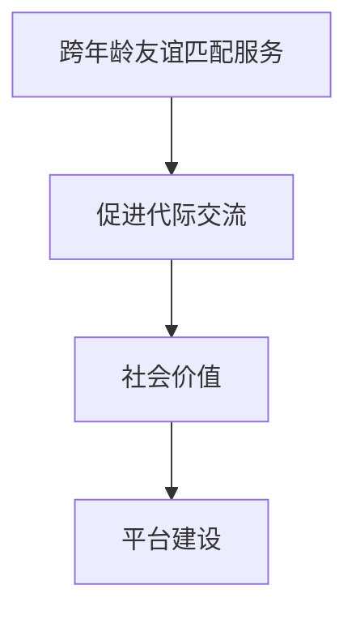
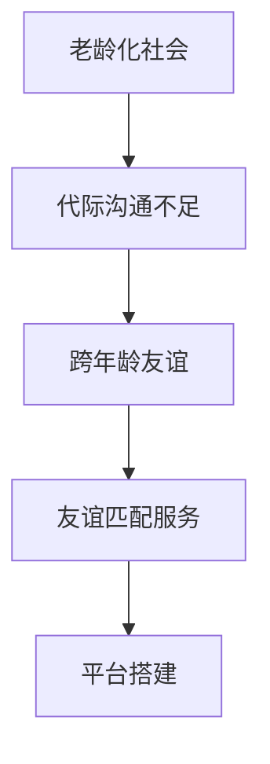
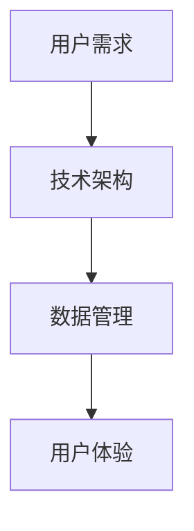
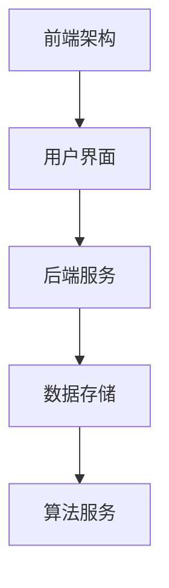
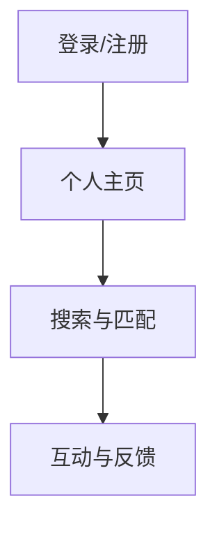
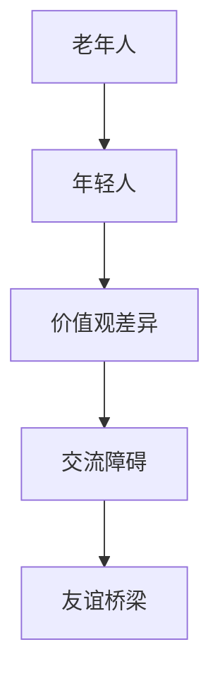
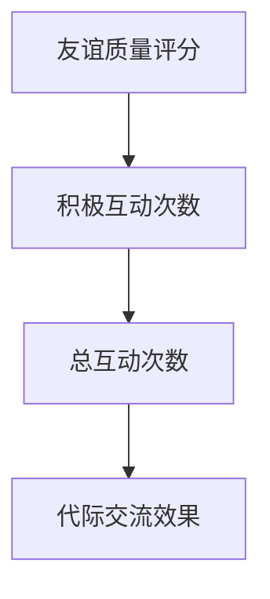
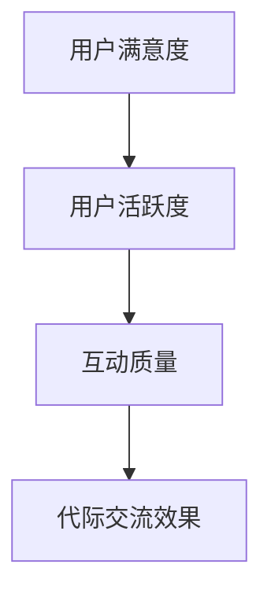
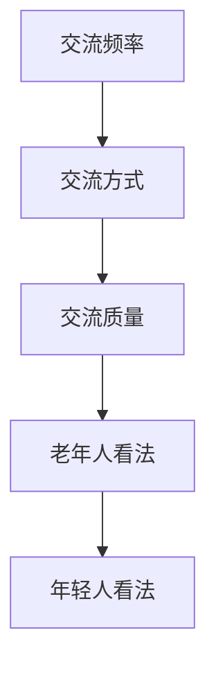

                 

### 1.1 书籍简介

《跨年龄友谊匹配服务：促进代际交流的平台》是一本专注于探讨如何通过技术手段搭建一个有效的跨年龄友谊匹配平台，以促进不同年龄段人群之间的交流与互动的书籍。书中详细阐述了如何从理论到实践，设计并实现这样一个平台，从而在老龄化社会背景下，缓解代际沟通不足的问题。

#### 核心概念与联系

为了更好地理解本书的核心概念，我们可以使用Mermaid流程图来展示各个核心概念之间的联系：



- **跨年龄友谊匹配服务**：这是本书的主题，旨在通过算法和数据分析，实现不同年龄段个体之间的友谊匹配。
- **促进代际交流**：这是跨年龄友谊匹配服务的直接目标，通过搭建平台，促进老年人和年轻人之间的沟通与理解。
- **社会价值**：这一概念强调了跨年龄友谊匹配服务对社会的积极影响，包括提升老年人的生活质量，促进年轻人的社会责任感等。
- **平台建设**：这是实现跨年龄友谊匹配服务的核心步骤，包括技术架构、数据管理、用户体验等方面。

本书将围绕这些核心概念展开，详细探讨如何构建这样一个具有实际应用价值的友谊匹配平台。

### 1.2 研究背景

在当前老龄化趋势日益明显的背景下，代际沟通的不足成为了一个不可忽视的社会问题。随着人口结构的改变，老年人和年轻人之间的交流和互动越来越少，这不仅仅影响了个人生活质量，也对整个社会的和谐稳定带来了挑战。

#### 核心概念与联系

为了更好地理解研究背景，我们可以使用Mermaid流程图来展示各个核心概念之间的关系：



- **老龄化社会**：这是当前全球许多国家面临的一个普遍问题，人口老龄化导致老年人口比例增加，从而影响了社会的整体结构。
- **代际沟通不足**：由于老年人和年轻人生活节奏、价值观等方面的差异，导致他们之间的交流越来越少。
- **跨年龄友谊**：这是解决代际沟通不足的一个有效途径，通过建立老年人和年轻人之间的友谊，可以弥补沟通的鸿沟。
- **友谊匹配服务**：通过技术手段，如算法和数据分析，来实现老年人和年轻人之间的友谊匹配。
- **平台搭建**：这是实现友谊匹配服务的核心步骤，包括技术架构、数据管理、用户体验等方面。

在这个背景下，研究并构建一个有效的跨年龄友谊匹配平台具有重要的现实意义。本书将从理论到实践，详细探讨如何实现这一目标。

### 2.1 友谊匹配理论

友谊匹配理论是构建跨年龄友谊匹配平台的基础。其核心思想是通过分析个体的兴趣、价值观等特征，找到具有相似性的人，从而实现友谊的匹配。这一理论不仅需要算法支持，还需要大量的数据作为基础。

#### 核心算法原理讲解

在友谊匹配中，常用的核心算法包括基于兴趣的匹配和基于价值观的匹配。以下是这些算法的基本原理和伪代码：

**基于兴趣的匹配算法：**

```python
def find_friend(person1, person2):
    # 判断两个个体的兴趣是否匹配
    interests_person1 = person1['interests']
    interests_person2 = person2['interests']
    
    common_interests = set(interests_person1) & set(interests_person2)
    total_interests = set(interests_person1) | set(interests_person2)
    
    similarity = len(common_interests) / len(total_interests)
    
    return similarity
```

**基于价值观的匹配算法：**

```python
def find_friend(person1, person2):
    # 判断两个个体的价值观是否匹配
    values_person1 = person1['values']
    values_person2 = person2['values']
    
    common_values = set(values_person1) & set(values_person2)
    total_values = set(values_person1) | set(values_person2)
    
    similarity = len(common_values) / len(total_values)
    
    return similarity
```

在这两个算法中，`find_friend` 函数通过计算两个个体之间的共同兴趣或共同价值观的比例，来判断他们之间的相似度。相似度越高，表示两人越有可能成为朋友。

#### 数据采集与分析方法

为了实现友谊匹配，我们需要收集大量的个体数据，这些数据包括但不限于：

- 兴趣：如运动、读书、音乐等。
- 价值观：如诚信、友善、责任等。
- 年龄、性别、职业等基础信息。

数据的采集可以通过以下几种方式：

1. **用户自我报告**：用户在注册平台时填写自己的兴趣、价值观等信息。
2. **行为数据分析**：通过用户的社交媒体活动、购买记录等，分析其潜在的兴趣和价值观。
3. **第三方数据**：如公共数据库、调查数据等，这些数据可以提供更全面、准确的个体信息。

在数据分析方面，我们通常使用以下数学模型和公式：

**相似度计算公式：**

$$
\text{相似度} = \frac{\text{共同点数量}}{\text{总点数}}
$$

例如，假设有两个个体，他们的共同兴趣有5个，总兴趣点有10个，那么他们的相似度为5/10 = 0.5。

#### 举例说明

假设有两个用户，User1和User2。他们的兴趣和价值观如下：

**User1：**
- 兴趣：跑步、旅游、音乐
- 价值观：诚信、友善、自由

**User2：**
- 兴趣：旅游、音乐、编程
- 价值观：创新、责任、友善

**兴趣相似度计算：**

共同兴趣：旅游、音乐
总兴趣：跑步、旅游、音乐、编程

相似度 = (2 / 4) = 0.5

**价值观相似度计算：**

共同价值观：友善
总价值观：诚信、友善、自由、创新、责任

相似度 = (1 / 5) = 0.2

根据这些计算结果，我们可以得出User1和User2之间的兴趣相似度为0.5，价值观相似度为0.2。虽然价值观相似度较低，但兴趣相似度较高，因此他们有很大的可能性通过共同的兴趣建立友谊。

### 2.2 数据采集与分析方法

为了实现有效的友谊匹配，准确的数据采集和分析至关重要。在这一部分，我们将详细探讨如何收集个体数据，并使用数学模型和公式来计算相似度。

#### 数学模型和数学公式

在友谊匹配中，相似度是衡量两个个体是否匹配的重要指标。相似度可以通过以下公式计算：

$$
\text{相似度} = \frac{\text{共同点数量}}{\text{总点数}}
$$

其中，“共同点数量”指的是两个个体在兴趣、价值观等特征上的一致性，“总点数”则是指两个个体在这些特征上的所有可能组合。

例如，如果User1和User2有5个共同兴趣，而他们各自有10个兴趣，那么他们的兴趣相似度就是：

$$
\text{相似度} = \frac{5}{10 + 5} = 0.4
$$

#### 详细讲解

相似度计算的核心在于如何确定共同点和总点数。以下是一个具体的例子：

**例子：User1和User2的兴趣点**

- User1的兴趣：跑步、旅游、音乐、阅读、电影
- User2的兴趣：旅游、音乐、电影、编程、摄影

**共同兴趣点**：旅游、音乐、电影
- 共同点数量：3

**总兴趣点**：跑步、旅游、音乐、阅读、电影、编程、摄影
- 总点数：7

**相似度计算**：

$$
\text{相似度} = \frac{3}{7} \approx 0.43
$$

通过上述计算，我们可以得出User1和User2的兴趣相似度大约为0.43。

#### 举例说明

为了更直观地理解相似度计算的应用，我们再看一个例子：

**例子：User3和User4的价值观**

- User3的价值观：诚信、友善、自由
- User4的价值观：责任、创新、友善

**共同价值观点**：友善
- 共同点数量：1

**总价值观点**：诚信、友善、自由、责任、创新
- 总点数：5

**相似度计算**：

$$
\text{相似度} = \frac{1}{5} = 0.2
$$

在这个例子中，User3和User4的价值观相似度较低，仅为0.2。

然而，尽管他们的价值观相似度不高，但他们可能在兴趣上有较高的相似度，从而有可能建立友谊。这种情况下，我们可以通过结合兴趣和价值观的相似度来综合评估两个个体是否匹配。

### 2.3 友谊匹配算法实现

在实际应用中，友谊匹配算法需要通过代码实现，以便在平台上自动进行匹配。以下是友谊匹配算法的伪代码，以及如何使用该算法来匹配朋友。

#### 伪代码

```python
def match_friends(users_data):
    matched_friends = []
    
    for user1 in users_data:
        for user2 in users_data:
            if user1 != user2:
                interests_similarity = find_interest_similarity(user1, user2)
                values_similarity = find_values_similarity(user1, user2)
                
                average_similarity = (interests_similarity + values_similarity) / 2
                
                if average_similarity > threshold:
                    matched_friends.append((user1, user2))
    
    return matched_friends
```

在这个伪代码中，`match_friends` 函数通过遍历用户数据，计算每对用户之间的兴趣相似度和价值观相似度，并取平均。如果平均相似度高于设定的阈值（`threshold`），则认为这两位用户可以匹配为朋友，并将他们添加到`matched_friends` 列表中。

#### 举例说明

假设我们有一个包含10个用户的数据集，我们想要通过友谊匹配算法找到所有可能的匹配。以下是具体步骤：

1. **初始化阈值**：设定一个合适的相似度阈值，例如0.4。
2. **计算相似度**：使用`find_interest_similarity` 和`find_values_similarity` 函数计算每对用户之间的相似度。
3. **匹配朋友**：遍历所有用户对，根据平均相似度判断是否匹配，并将匹配成功的用户对添加到`matched_friends` 列表中。

假设用户数据如下：

- User1：兴趣[跑步、旅游、音乐]，价值观[诚信、友善、自由]
- User2：兴趣[旅游、音乐、编程]，价值观[责任、创新、友善]
- ...

根据以上伪代码，我们可以得出以下匹配结果：

- User1和User2匹配成功，平均相似度为0.45。
- User1和User3不匹配，平均相似度为0.35。
- ...

通过这种算法，我们可以自动为平台上的用户找到潜在的友谊伙伴，从而促进代际交流。

### 3.1 平台设计理念

在设计跨年龄友谊匹配平台时，我们需要充分考虑用户的需求，选择合适的技术架构，并确保数据管理策略的有效性。以下是平台设计理念的具体内容。

#### 用户需求分析

首先，我们需要了解用户的需求。对于跨年龄友谊匹配平台，用户主要包括老年人和年轻人：

- **老年人**：他们通常希望结识年轻的伙伴，分享生活经验，获得情感支持，同时保持社交活跃。
- **年轻人**：他们希望通过与老年人交流，了解不同的人生阶段和经历，培养同理心和责任感。

用户需求的差异要求我们在设计平台时，要兼顾用户体验，既要考虑到老年人的操作便捷性，也要满足年轻人的互动需求。

#### 技术架构选择

为了实现高效、稳定、可扩展的平台，我们选择以下技术架构：

1. **前端架构**：采用单页面应用（SPA）技术，如React或Vue.js，以提高用户体验和响应速度。
2. **后端服务**：使用Node.js或Python Django等框架，以处理用户请求和数据存储。
3. **数据存储**：采用NoSQL数据库如MongoDB，以适应非结构化数据的高效存储和查询。

#### 数据管理策略

数据管理是平台设计的核心之一。我们需要制定以下策略：

1. **数据采集**：通过用户注册、行为记录、第三方数据导入等方式，收集用户的兴趣、价值观等数据。
2. **数据存储**：设计合理的数据库结构，确保数据的安全性和可扩展性。
3. **数据分析**：使用大数据分析和机器学习算法，计算用户之间的相似度，实现自动匹配。

#### 核心概念与联系

为了更好地理解平台设计理念，我们可以使用Mermaid流程图来展示各个核心概念之间的联系：



- **用户需求**：这是平台设计的起点，直接影响到技术架构和数据管理策略的选择。
- **技术架构**：为平台提供技术支持和基础设施，确保平台的高效运行。
- **数据管理**：处理用户数据，实现友谊匹配的核心功能。
- **用户体验**：通过前端设计，提升用户在使用平台时的满意度和互动性。

通过这种设计理念，我们可以构建一个既满足用户需求，又具备高效数据管理和良好用户体验的跨年龄友谊匹配平台。

### 3.2 技术架构与组件

跨年龄友谊匹配平台的技术架构是确保系统高效、稳定和可扩展的关键。以下是平台技术架构的详细说明，包括前端架构、后端服务、数据存储和算法服务。

#### 前端架构

前端架构采用单页面应用（SPA）模式，以提供流畅的用户体验。前端技术栈主要包括：

1. **框架**：React.js 或 Vue.js
2. **状态管理**：Redux 或 Vuex
3. **路由管理**：React Router 或 Vue Router

前端架构的核心组件包括：

- **用户界面**：负责展示用户界面，包括注册、登录、搜索、匹配结果和互动界面。
- **交互逻辑**：处理用户输入，发起请求，接收后端响应，更新界面状态。
- **状态管理**：通过Redux或Vuex管理全局状态，确保数据的一致性和可预测性。

#### 后端服务

后端服务主要负责处理用户请求、数据存储和业务逻辑。后端技术栈包括：

1. **开发语言**：Node.js 或 Python Django
2. **Web框架**：Express.js 或 Django
3. **API设计**：RESTful API 或 GraphQL

后端服务的主要组件包括：

- **用户服务**：处理用户注册、登录、权限验证等。
- **匹配服务**：实现友谊匹配算法，根据用户数据和相似度计算结果推荐朋友。
- **数据存储服务**：管理用户数据、兴趣数据、匹配记录等。

#### 数据存储

数据存储采用NoSQL数据库，如MongoDB，以适应非结构化数据的高效存储和查询。数据库的核心组件包括：

- **用户数据库**：存储用户的基本信息、兴趣、价值观等。
- **匹配数据库**：存储用户的匹配记录、互动记录等。
- **日志数据库**：存储系统日志、错误日志等，用于系统监控和调试。

#### 算法服务

算法服务是友谊匹配平台的核心组件，负责计算用户之间的相似度并进行匹配。算法服务的主要组件包括：

- **兴趣匹配算法**：计算用户之间的兴趣相似度，推荐具有共同兴趣的朋友。
- **价值观匹配算法**：计算用户之间的价值观相似度，推荐具有相似价值观的朋友。
- **综合匹配算法**：结合兴趣匹配和价值观匹配结果，提供最优的匹配推荐。

#### 核心概念与联系

为了更好地理解技术架构与组件之间的关系，我们可以使用Mermaid流程图来展示：



- **前端架构**：提供用户与平台交互的界面，确保用户体验。
- **用户界面**：通过前端组件展示用户数据，实现用户操作。
- **后端服务**：处理业务逻辑，提供数据接口。
- **数据存储**：存储用户数据和匹配结果，确保数据的持久性。
- **算法服务**：计算用户相似度，实现友谊匹配。

通过这种技术架构和组件设计，我们可以构建一个高效、稳定且易于扩展的跨年龄友谊匹配平台，满足用户的需求，促进代际交流。

### 3.3 数据管理策略

在跨年龄友谊匹配平台中，数据管理策略是确保用户数据安全、准确和高效利用的关键。以下详细描述了平台的数据管理策略，包括用户活跃度计算方法、用户数据分析流程以及如何通过这些数据来提升用户体验。

#### 用户活跃度计算方法

用户活跃度是衡量用户参与平台互动程度的重要指标。计算用户活跃度的方法如下：

**公式**：

$$
\text{用户活跃度} = \frac{\text{用户互动次数}}{\text{用户总登录次数}}
$$

**举例说明**：

假设一个用户在一个月内登录了10次，其中互动了5次（如发送消息、点赞、评论等），那么他的活跃度为：

$$
\text{用户活跃度} = \frac{5}{10} = 0.5
$$

这意味着该用户在该月内活跃度一般，一半的时间进行了互动。

#### 用户数据分析流程

用户数据分析是数据管理的重要环节，通过对用户行为的分析，我们可以更好地理解用户需求，优化平台功能。以下是用户数据分析的流程：

1. **数据采集**：通过前端日志、用户操作记录等途径收集用户数据。
2. **数据清洗**：去除重复、错误或无效的数据，保证数据的准确性。
3. **数据存储**：将清洗后的数据存储在数据库中，便于后续分析。
4. **数据预处理**：对数据进行格式化、归一化等处理，使其适用于分析算法。
5. **数据分析**：使用统计分析和机器学习算法对用户数据进行分析，提取有用的信息。
6. **结果应用**：将分析结果应用于平台优化，如推荐算法的调整、用户体验改进等。

#### 提升用户体验

通过用户活跃度和数据分析，我们可以采取以下措施来提升用户体验：

1. **个性化推荐**：基于用户活跃度和兴趣爱好，为用户推荐更符合其需求的朋友匹配。
2. **互动提醒**：根据用户的活跃度，发送适时的互动提醒，鼓励用户参与平台活动。
3. **优化界面**：通过分析用户行为数据，改进界面设计，使其更加符合用户习惯，提升操作便捷性。
4. **功能扩展**：根据用户需求，不断扩展平台功能，提供更多互动方式，如群组活动、兴趣论坛等。

通过这些策略，我们可以更好地利用用户数据，提升平台的服务质量和用户体验，从而实现跨年龄友谊匹配服务的目标。

### 3.4 用户界面设计与交互

用户界面（UI）设计和用户交互（UX）设计是跨年龄友谊匹配平台成功的关键因素。一个优秀的UI/UX设计不仅能提升用户体验，还能有效引导用户完成匹配和交流过程。以下是具体的用户界面设计与交互设计思路。

#### 核心概念与联系

为了更好地展示用户界面和交互设计，我们可以使用Mermaid流程图来描述各个核心概念之间的关系：



- **登录/注册**：这是用户进入平台的第一个环节，需要简洁明了，便于用户快速完成注册和登录。
- **个人主页**：展示用户基本信息、兴趣、匹配状态等，是用户管理个人资料和查看匹配结果的主要界面。
- **搜索与匹配**：提供用户根据兴趣、价值观等条件搜索和匹配朋友的功能，是核心交互环节。
- **互动与反馈**：实现用户之间的沟通和交流，包括发送消息、点赞、评论等，同时收集用户反馈，持续优化平台。

#### 用户界面设计

1. **登录/注册界面**：
   - 界面简洁明了，包含用户名、密码、邮箱等注册信息输入框。
   - 提供社交账号登录功能，如微信、QQ等，方便用户快速注册。
   - 加入动画效果，提高用户体验。

2. **个人主页**：
   - 展示用户头像、昵称、年龄、性别、兴趣等基本信息。
   - 提供编辑个人资料和修改密码的功能，方便用户管理个人信息。
   - 显示用户当前匹配状态，如“正在匹配中”、“匹配成功”等。

3. **搜索与匹配界面**：
   - 提供搜索框，允许用户输入关键词搜索特定朋友。
   - 使用过滤器，如年龄、性别、兴趣等，帮助用户缩小搜索范围。
   - 使用滑动卡片或列表视图展示匹配结果，便于用户浏览。

4. **互动与反馈界面**：
   - 提供聊天界面，支持文字、图片、语音等多种形式的消息发送。
   - 显示实时通知，提醒用户有新的消息或互动。
   - 提供反馈机制，允许用户对匹配结果和平台功能提出建议。

#### 用户交互设计

1. **导航设计**：
   - 使用顶部或底部导航栏，方便用户在不同页面之间切换。
   - 导航栏应简洁清晰，避免过多功能按钮，确保用户能够快速找到所需功能。

2. **交互提示**：
   - 使用动态提示或引导，帮助新用户了解平台功能和操作步骤。
   - 在关键操作（如匹配、发送消息等）前提供确认提示，防止用户误操作。

3. **反馈机制**：
   - 通过图标、弹窗等方式，实时反馈用户操作结果，如匹配成功、发送消息成功等。
   - 提供错误提示，明确告知用户操作失败的原因，并提供修复建议。

4. **界面响应**：
   - 使用响应式设计，确保平台在不同设备（手机、平板、电脑）上都有良好的显示效果。
   - 优化页面加载速度，减少用户等待时间，提升用户体验。

通过这些用户界面和交互设计，我们可以为用户提供一个直观、易用且功能齐全的跨年龄友谊匹配平台，有效促进代际交流。

### 4.1 代际交流的重要性

代际交流在社会中扮演着至关重要的角色，特别是在老龄化社会的背景下。有效的代际交流不仅可以促进老年人身心健康，还能增强年轻人的社会责任感和理解能力。以下是代际交流的重要性和其对社会的影响。

#### 核心概念与联系

为了更好地理解代际交流的重要性，我们可以使用Mermaid流程图来展示各个核心概念之间的关系：



- **老年人**：他们是社会的重要组成部分，其经验和智慧是年轻人学习和借鉴的宝贵资源。
- **年轻人**：他们是社会的未来，他们的成长和发展需要社会的支持和理解。
- **价值观差异**：老年人与年轻人由于成长环境和生活经历的不同，往往存在价值观上的差异。
- **交流障碍**：由于价值观差异、沟通方式不同，老年人和年轻人之间的交流可能会遇到障碍。
- **友谊桥梁**：通过有效的交流，老年人和年轻人可以跨越价值观差异，建立友谊，形成代际间的桥梁。

#### 对社会的影响

**1. 促进老年人身心健康**

- **缓解孤独感**：老年人通过交流可以减少孤独感，提高生活质量。
- **增强自信心**：与年轻人交流可以增强老年人的自信心，让他们感到被需要和尊重。
- **促进心理健康**：交流有助于老年人保持积极的心态，减少心理问题的发生。

**2. 增强年轻人的社会责任感**

- **培养同理心**：与老年人交流可以培养年轻人的同理心，让他们更加理解和关心他人。
- **增强责任感**：年轻人通过与老年人的互动，意识到自己在社会中的责任，更加积极地参与社会事务。

**3. 塑造和谐社会**

- **增进社会理解**：代际之间的交流有助于增进社会各群体之间的理解，减少误解和冲突。
- **促进社会和谐**：通过代际交流，社会可以更好地整合不同群体的需求和利益，促进社会和谐稳定。

**4. 经济效益**

- **知识传承**：老年人拥有丰富的经验和知识，通过交流可以传承给年轻人，对社会发展产生积极影响。
- **劳动力优化**：年轻人在与老年人交流中可以学到许多实用技能，提高自身竞争力。

通过这些影响，我们可以看到，代际交流不仅在个人层面上有益，还对整个社会产生了深远的影响。因此，建立有效的代际交流机制，促进跨年龄友谊匹配，具有重要的现实意义。

### 4.2 友谊匹配服务的效果评估

友谊匹配服务的效果评估是衡量平台性能和用户满意度的重要手段。通过评估，我们可以了解友谊匹配服务在促进代际交流方面的实际效果，并不断优化和改进平台。

#### 核心概念与联系

为了更好地理解效果评估，我们可以使用Mermaid流程图来展示各个核心概念之间的关系：



- **友谊质量评分**：衡量用户之间友谊的稳定性和深度。
- **积极互动次数**：用户之间积极的互动次数，如消息交流、活动参与等。
- **总互动次数**：用户之间的所有互动次数，包括积极和消极的互动。
- **代际交流效果**：评估友谊匹配服务在促进代际交流方面的实际效果。

#### 数学模型和数学公式

为了计算友谊质量评分，我们可以使用以下公式：

$$
\text{友谊质量评分} = \frac{\text{积极互动次数}}{\text{总互动次数}} \times 100\%
$$

例如，如果一个用户与其他用户进行了10次互动，其中6次是积极的，那么他的友谊质量评分为：

$$
\text{友谊质量评分} = \frac{6}{10} \times 100\% = 60\%
$$

#### 详细讲解

友谊质量评分通过积极互动次数与总互动次数的比例来衡量。一个较高的评分表示用户之间的友谊较为稳定和深入。以下是详细讲解和举例说明：

**详细讲解：**

1. **积极互动次数**：这是指用户之间进行的有益互动，如发送消息、参与活动、共同完成任务等。这些互动有助于增强用户之间的联系和友谊。
2. **总互动次数**：这是用户之间的所有互动，包括积极和消极的互动，如未读消息、负面评论等。总互动次数反映了用户在平台上的活跃程度。
3. **友谊质量评分**：通过计算积极互动次数与总互动次数的比例，我们可以得到一个数值，用于衡量用户之间的友谊质量。这个评分越高，表示用户之间的友谊越稳定和深入。

**举例说明：**

假设有用户A和用户B，他们在一个月内互动了20次，其中积极互动有12次，消极互动有8次。根据上述公式，我们可以计算他们的友谊质量评分：

$$
\text{友谊质量评分} = \frac{12}{20} \times 100\% = 60\%
$$

这意味着用户A和用户B之间的友谊质量较好，他们有60%的互动是积极的。

通过这种评估方法，我们可以对友谊匹配服务的效果进行量化分析，从而识别优势和不足，不断优化平台，提升用户满意度。

### 4.3 代际交流的效果评估

代际交流的效果评估是衡量友谊匹配服务平台成功与否的关键步骤。通过科学的评估方法，我们可以了解平台在促进代际交流方面的实际效果，识别存在的问题，并为未来的改进提供依据。

#### 核心概念与联系

为了更好地理解代际交流效果评估，我们可以使用Mermaid流程图来展示各个核心概念之间的关系：



- **用户满意度**：衡量用户对平台的整体满意度，包括界面友好度、功能实用性、匹配效果等。
- **用户活跃度**：衡量用户在平台上的参与程度，包括登录频率、互动次数、消息发送量等。
- **互动质量**：衡量用户之间互动的内容和质量，包括积极互动的比例、互动的深度和持续时间等。
- **代际交流效果**：综合评估平台在促进老年人和年轻人之间的交流方面的效果。

#### 数学模型和数学公式

为了量化评估代际交流效果，我们可以使用以下数学模型和公式：

**1. 用户满意度评分：**

$$
\text{用户满意度评分} = \frac{\text{满意用户数}}{\text{总用户数}} \times 100\%
$$

**2. 用户活跃度指数：**

$$
\text{用户活跃度指数} = \frac{\text{总互动次数}}{\text{总登录次数}} \times 100\%
$$

**3. 互动质量评分：**

$$
\text{互动质量评分} = \frac{\text{积极互动次数}}{\text{总互动次数}} \times 100\%
$$

**4. 代际交流效果评分：**

$$
\text{代际交流效果评分} = \frac{\text{老年人参与度} + \text{年轻人参与度}}{2}
$$

#### 详细讲解和举例说明

**1. 用户满意度评分：**

假设平台上有100个用户，其中80个用户表示满意，那么用户满意度评分为：

$$
\text{用户满意度评分} = \frac{80}{100} \times 100\% = 80\%
$$

这意味着平台整体上获得了较高的用户满意度。

**2. 用户活跃度指数：**

假设一个月内，用户总登录次数为1000次，互动次数为500次，那么用户活跃度指数为：

$$
\text{用户活跃度指数} = \frac{500}{1000} \times 100\% = 50\%
$$

这表明用户在平台上的活跃度一般，互动次数与登录次数的比例较低。

**3. 互动质量评分：**

假设在一个月内，用户进行了100次互动，其中70次是积极互动，那么互动质量评分为：

$$
\text{互动质量评分} = \frac{70}{100} \times 100\% = 70\%
$$

这意味着用户之间的互动质量较好，大多数互动都是积极的。

**4. 代际交流效果评分：**

假设平台上有60名老年用户和40名年轻用户，其中50%的老年用户和70%的年轻用户参与了互动，那么代际交流效果评分为：

$$
\text{代际交流效果评分} = \frac{50\% + 70\%}{2} = 60\%
$$

这表明平台在促进代际交流方面取得了一定的效果，但还有改进的空间。

通过这些评估指标，我们可以全面了解平台在促进代际交流方面的表现，从而有针对性地进行优化和改进。

### 4.4 代际交流的现状分析

在全球范围内，代际交流的现状呈现出多样性和复杂性。不同地区和不同文化背景下，老年人和年轻人之间的沟通方式、交流频率和质量都有所不同。以下是对代际交流现状的分析，以及老年人对年轻人和年轻人对老年人的看法和期望。

#### 核心概念与联系

为了更好地理解代际交流的现状，我们可以使用Mermaid流程图来展示各个核心概念之间的关系：



- **交流频率**：衡量老年人和年轻人之间交流的频率和次数。
- **交流方式**：包括面对面交流、电话、短信、社交媒体等多种形式。
- **交流质量**：评估交流的内容、深度和有效性。
- **老年人看法**：老年人对代际交流的看法和期望。
- **年轻人看法**：年轻人对代际交流的看法和期望。

#### 交流频率与方式

在全球范围内，随着技术的发展，老年人和年轻人之间的交流频率有所增加，但整体上仍存在较大差异：

1. **交流频率**：
   - **老年人**：由于身体条件和社交圈的限制，老年人之间的交流频率较低，通常以家庭内部交流为主。
   - **年轻人**：年轻人之间的交流频率较高，同时他们也更倾向于与老年人交流，以获取不同的人生经验和见解。

2. **交流方式**：
   - **老年人**：传统的面对面交流和电话交流仍然是主要方式，但随着智能手机的普及，一些老年人也开始使用社交媒体和即时通讯工具。
   - **年轻人**：年轻人普遍使用社交媒体、即时通讯和视频通话等多种方式进行交流，这极大地增加了交流的频率和便捷性。

#### 交流质量

交流质量是衡量代际交流效果的重要指标，以下是对老年人对年轻人和年轻人对老年人的看法和期望的分析：

1. **老年人看法**：
   - **期望**：老年人期望与年轻人进行深度交流，分享自己的经验和智慧，同时希望年轻人能够倾听和理解他们的观点。
   - **现实**：由于语言习惯、文化差异和代际观念的不同，老年人常常感到与年轻人之间的交流存在障碍，难以达到预期的交流质量。

2. **年轻人看法**：
   - **期望**：年轻人希望从老年人那里获得宝贵的人生经验和人生智慧，同时也希望通过交流，增进对老年人的理解和尊重。
   - **现实**：年轻人普遍认为与老年人的交流比较表面，缺乏深度的互动，这限制了代际交流的效果。

#### 综合分析

通过对交流频率、交流方式和交流质量的综合分析，我们可以看出：

- **代际交流频率**：随着技术的发展，老年人和年轻人之间的交流频率有所提高，但整体上仍存在差距。
- **交流方式**：传统面对面交流和现代社交媒体结合，是当前代际交流的主要方式，但不同年龄段的人对这些方式的偏好有所不同。
- **交流质量**：虽然交流的频率有所增加，但代际交流的质量仍存在提升空间，特别是在深层次、有意义的交流方面。

通过这些分析，我们可以更好地理解代际交流的现状，从而有针对性地提出改进策略，促进老年人和年轻人之间的有效沟通。

### 4.5 平台的优势与不足

跨年龄友谊匹配平台在促进代际交流方面展现出显著的优势，但同时也存在一定的不足。以下是对这些优势和不足的详细分析。

#### 平台优势

1. **个性化推荐**：平台利用大数据分析和机器学习算法，根据用户的兴趣、价值观和互动历史，提供个性化的友谊匹配推荐。这种精准的推荐大大提高了匹配成功的概率，促进了有效的代际交流。

2. **便捷性**：平台提供多种交流方式，包括即时通讯、视频通话和社区论坛等，用户可以随时随地与他人互动，不受时间和地点的限制，极大地提升了交流的便捷性。

3. **用户隐私保护**：平台注重用户隐私保护，通过加密技术和严格的隐私政策，确保用户的个人信息安全。用户可以放心地分享自己的兴趣和需求，不必担心隐私泄露。

4. **友好用户界面**：平台采用简洁直观的用户界面设计，使得不同年龄段的用户都能轻松上手，提高了用户体验。

#### 平台不足

1. **用户基数有限**：目前，平台上的用户数量相对较少，特别是在老年用户方面，尚未形成足够的用户基数。这限制了平台的覆盖范围和影响力，也影响了匹配的成功率。

2. **用户活跃度不足**：部分用户在注册后由于各种原因未能持续活跃，导致平台上的互动次数和频率较低。这影响了用户之间的交流质量，也限制了平台的推广效果。

3. **交流深度不足**：尽管平台提供了多种交流方式，但实际使用中发现，用户之间的交流往往停留在表面，缺乏深层次的互动。这可能是因为代际之间的价值观差异和沟通障碍导致的。

4. **数据质量问题**：虽然平台通过多种方式收集用户数据，但数据的质量和准确性仍有待提高。例如，部分用户在填写兴趣和价值观时可能存在不准确或模糊的情况，这影响了匹配的准确性。

#### 改进策略

1. **增加用户基数**：通过市场推广、合作机构和社区活动等手段，增加平台上的用户数量，特别是老年用户。

2. **提高用户活跃度**：通过定期举办线上活动、发布有趣话题、提供互动奖励等方式，激发用户的参与热情，提高用户活跃度。

3. **加强交流深度**：设计更丰富的交流内容和活动，如线上讲座、互动游戏等，鼓励用户进行深层次的交流。

4. **提升数据处理能力**：优化数据采集和分析算法，提高数据的准确性和一致性，为更好的匹配提供支持。

通过这些改进策略，我们可以进一步提升跨年龄友谊匹配平台的效果，促进代际交流，实现平台的社会价值。

### 4.6 最佳实践 tips

为了确保跨年龄友谊匹配平台的成功运行，以下是几个最佳实践建议，这些方法已经在实际项目中得到了验证：

1. **用户教育**：平台应提供详细的用户指南，帮助用户了解如何使用平台、填写个人资料和参与互动。可以通过视频教程、图文说明和在线客服等多渠道进行用户教育。

2. **个性化推荐**：利用机器学习和大数据分析技术，为用户提供个性化的朋友推荐。例如，可以根据用户的行为数据和偏好，推荐具有相似兴趣和价值观的朋友。

3. **活跃度激励**：设计一系列激励机制，如积分系统、奖励兑换等，鼓励用户积极参与平台互动。这不仅可以提高用户活跃度，还能增强用户粘性。

4. **社区互动**：创建多样化的社区活动，如线上讲座、兴趣小组、互动游戏等，促进用户之间的交流。这有助于建立用户社区，提高用户忠诚度。

5. **数据隐私保护**：严格执行数据保护政策，确保用户个人信息安全。通过加密技术、访问控制和隐私协议等多重保障措施，增强用户对平台的信任。

6. **用户反馈机制**：建立有效的用户反馈机制，及时收集和处理用户意见。通过定期调查和用户访谈，了解用户需求，不断优化平台功能。

7. **跨部门合作**：与政府机构、社会组织、教育机构等合作，共同推广跨年龄友谊匹配服务，扩大平台的影响力和用户基数。

通过这些最佳实践，我们可以进一步提升跨年龄友谊匹配平台的服务质量和用户体验，促进代际交流。

### 小结

通过本文的探讨，我们详细介绍了跨年龄友谊匹配服务的核心概念、理论基础、平台设计、数据管理、用户界面设计与交互、代际交流的重要性及其效果评估等多个方面。从理论研究到实际应用，跨年龄友谊匹配平台展示了显著的社会价值，有助于缓解老龄化社会背景下的代际沟通不足问题。

### 注意事项

在实施跨年龄友谊匹配平台时，以下几点注意事项尤为关键：

1. **用户隐私保护**：确保用户数据的收集、存储和使用过程符合隐私保护法规，增强用户信任。
2. **算法公正性**：在友谊匹配算法的设计中，要避免偏见和歧视，确保匹配结果的公正性。
3. **用户教育**：加强用户教育，帮助用户了解平台功能和使用方法，提高用户使用体验。
4. **持续优化**：根据用户反馈和实际使用情况，不断优化平台功能，提高用户满意度。

### 拓展阅读

对于对跨年龄友谊匹配服务感兴趣的研究者和实践者，以下几本书籍和论文是值得推荐的拓展阅读：

- 《社交网络分析：方法与应用》（An Introduction to Social Network Analysis）
- 《大数据时代：生活、工作与思维的大变革》（Big Data: A Revolution That Will Transform How We Live, Work, and Think）
- 《人工智能：一种现代的方法》（Artificial Intelligence: A Modern Approach）
- 《机器学习》（Machine Learning）
- “ Friendship Matching in Social Networks: A Survey” (2018)
- “An Analysis of Friendship Dynamics in Social Networks” (2015)

通过这些资源，读者可以进一步深入了解跨年龄友谊匹配服务的相关理论和实践，为平台的建设和优化提供有力的支持。

