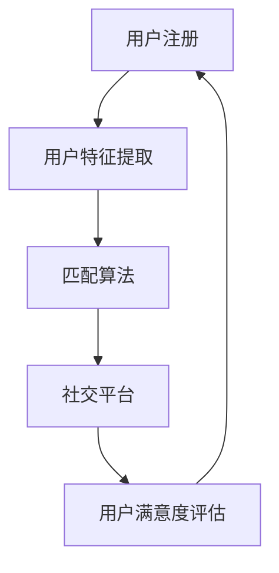

                 


# 文章标题：跨年龄友谊匹配服务：促进代际交流的社交平台

## 关键词
- 跨年龄友谊
- 社交平台
- 匹配算法
- 代际交流
- 用户体验

## 摘要
本文旨在探讨跨年龄友谊匹配服务在促进代际交流中的应用。通过深入分析理论基础、匹配算法、社交平台设计以及案例分析，本文揭示了跨年龄友谊匹配服务的技术原理和实践价值。文章首先介绍了友谊匹配服务的背景和重要性，随后详细阐述了跨年龄友谊匹配的理论基础和算法实现，接着讨论了社交平台的设计和用户体验优化，并通过实际案例展示了服务的效果。最后，本文对未来的研究方向和挑战提出了展望，为跨年龄友谊匹配服务的发展提供了指导和建议。

## 1. 引言

在现代社会，随着信息技术的飞速发展，社交网络逐渐成为人们日常生活的一部分。然而，社交网络的广泛应用并未完全解决人们的社交需求，特别是在促进代际交流方面。传统社交平台往往侧重于同龄人之间的互动，而忽视了不同年龄段人群之间的交流与连接。这种代际隔阂不仅限制了年轻人的视野和经验，也使得老年人在社交中感到孤立。

跨年龄友谊匹配服务的提出，旨在通过技术手段促进不同年龄段人群之间的交流与理解。本文将围绕这一主题，探讨跨年龄友谊匹配服务的背景、理论基础、算法实现、社交平台设计以及实际案例，为促进代际交流提供有益的参考。

### 1.1. 背景介绍

友谊是一种重要的社会关系，对个人的心理和社交生活具有深远影响。然而，传统的友谊往往局限于特定年龄、兴趣和背景的人群中。随着社会的快速变迁，人们的生活方式、价值观念和社交需求也在不断变化。在这种背景下，跨年龄友谊成为一种新的社交趋势，有助于打破年龄界限，促进不同代际之间的交流和理解。

跨年龄友谊匹配服务的核心思想是利用人工智能和大数据技术，为不同年龄段的人提供匹配服务，帮助他们建立友谊关系。这种服务不仅能够丰富个人的社交生活，还能够促进社会的和谐发展。

### 1.2. 重要性

促进代际交流具有重要的社会价值。首先，跨年龄友谊有助于年轻人从老年人身上学习经验，拓宽视野，增强对生活和世界的理解。其次，老年人通过参与社交活动，能够保持积极的心态，延缓衰老过程，提高生活质量。此外，跨年龄友谊还能缓解社会代际矛盾，增强社会的凝聚力。

然而，当前社会在促进代际交流方面存在一些挑战。首先，传统社交平台的设计往往侧重于同龄人之间的互动，缺乏针对跨年龄交流的功能。其次，不同年龄段的人在兴趣、价值观和生活方式上存在较大差异，这使得跨年龄友谊的建立面临一定的困难。最后，社会对跨年龄友谊的认知和接受程度有限，导致这一领域的发展受到一定限制。

### 1.3. 挑战与机遇

跨年龄友谊匹配服务面临着一系列挑战和机遇。首先，如何准确提取和表示用户特征，实现精确匹配，是一个重要难题。其次，如何设计一个友好、易用的社交平台，提升用户体验，也是一个关键问题。此外，数据隐私保护、算法公平性等问题也需要在发展中得到关注。

然而，随着人工智能技术的不断进步，跨年龄友谊匹配服务具有巨大的发展潜力。通过大数据分析、机器学习等技术的应用，可以不断提高匹配算法的准确性和用户体验。同时，社交平台的不断创新和优化，将为跨年龄友谊匹配服务提供更广阔的发展空间。

## 2. 理论基础

### 2.1. 友谊匹配服务概述

友谊匹配服务是一种基于人工智能和大数据技术的社交服务，旨在帮助用户找到志同道合的朋友。传统的社交平台通常基于用户的基本信息（如年龄、性别、地理位置等）进行匹配，而友谊匹配服务则更加注重用户的兴趣、价值观和生活方式等深层次特征。

友谊匹配服务的主要功能包括用户特征提取、匹配算法实现、社交平台设计和用户满意度评估等。其中，用户特征提取是友谊匹配服务的基础，直接影响到匹配结果的准确性和用户体验。匹配算法则决定了友谊匹配服务的核心功能，其设计需要充分考虑用户特征和社交需求的多样性。社交平台设计则关注用户体验和界面交互，使服务更加友好和易用。用户满意度评估则用于评估友谊匹配服务的实际效果，为持续改进提供依据。

### 2.2. 跨年龄友谊的特殊性

跨年龄友谊与同龄人之间的友谊相比，具有以下几个显著特点：

1. **差异性**：不同年龄段的人在兴趣、价值观和生活方式上存在较大差异，这使得跨年龄友谊的建立面临一定的挑战。例如，年轻人可能对科技和流行文化感兴趣，而老年人可能对传统和养生更感兴趣。

2. **互补性**：跨年龄友谊能够实现不同年龄段之间的互补，使双方在交流中受益。年轻人可以从老年人身上学习生活经验和智慧，而老年人则可以从年轻人那里感受到活力和新鲜事物。

3. **持久性**：跨年龄友谊往往比同龄人之间的友谊更加持久，因为年龄差异使得双方在交往过程中更加关注彼此的成长和变化，而非一时的兴趣和爱好。

4. **影响力**：跨年龄友谊对双方的影响深远，不仅体现在个人的心理和社交生活上，还可能对社会产生积极的影响。例如，年轻人通过与老年人的交流，能够更好地理解社会的变迁和发展，增强社会责任感。

### 2.3. 跨年龄友谊匹配理论

跨年龄友谊匹配理论主要研究如何利用人工智能和大数据技术，为不同年龄段的人提供精确的匹配服务。以下是跨年龄友谊匹配理论的核心概念和架构：

1. **用户特征提取**：用户特征提取是跨年龄友谊匹配的基础，主要包括以下方面：
   - **兴趣特征**：通过用户在社交平台上的互动和发表的内容，提取其兴趣偏好。
   - **价值观特征**：通过用户的社会行为和言论，分析其价值观取向。
   - **生活方式特征**：通过用户的生活习惯和消费行为，了解其生活方式。

2. **匹配算法设计**：匹配算法是跨年龄友谊匹配的核心，主要包括以下几种：
   - **基于用户特征相似度的匹配算法**：通过计算用户特征之间的相似度，实现用户匹配。
   - **基于机器学习的匹配算法**：利用机器学习算法，根据历史数据预测用户之间的匹配概率。
   - **基于社会网络分析的匹配算法**：通过分析用户的社会网络关系，找到潜在的朋友匹配。

3. **社交平台设计**：社交平台设计要充分考虑跨年龄友谊的特点，提供以下功能：
   - **个性化推荐**：根据用户特征和匹配结果，为用户推荐潜在的朋友。
   - **互动功能**：提供聊天、私信、群组等互动功能，方便用户交流和建立友谊。
   - **隐私保护**：保障用户的隐私安全，避免个人信息泄露。

4. **用户满意度评估**：用户满意度评估用于评估跨年龄友谊匹配服务的实际效果，主要包括以下方面：
   - **匹配成功率**：衡量匹配算法的准确性，通过用户反馈评估匹配结果。
   - **用户活跃度**：分析用户的活跃度，了解社交平台的使用情况。
   - **用户满意度**：通过问卷调查、用户评价等方式，评估用户对服务的满意度。

### 2.3.1. Mermaid流程图：跨年龄友谊匹配概念关系

以下是跨年龄友谊匹配概念关系的Mermaid流程图：



### 2.3.2. 匹配算法原理讲解

跨年龄友谊匹配算法的核心是计算用户之间的相似度，从而实现精确匹配。以下是匹配算法的基本原理：

1. **相似度计算**：相似度计算是匹配算法的基础，通过计算用户特征之间的相似度，评估用户之间的匹配程度。常见的相似度计算方法包括：
   - **余弦相似度**：通过计算用户特征向量之间的余弦值，评估相似度。
   - **欧氏距离**：通过计算用户特征向量之间的欧氏距离，评估相似度。
   - **皮尔逊相关系数**：通过计算用户特征之间的皮尔逊相关系数，评估相似度。

2. **匹配策略**：匹配策略决定了如何根据相似度计算结果，选择最优的匹配对象。常见的匹配策略包括：
   - **最大相似度匹配**：选择相似度最高的用户作为匹配对象。
   - **多轮匹配**：在多轮匹配过程中，逐步降低匹配标准，选择最合适的匹配对象。
   - **基于社交网络匹配**：通过分析用户的社会网络关系，选择社交关系较近的用户作为匹配对象。

3. **匹配算法实现**：匹配算法的实现需要考虑以下几个方面：
   - **用户特征表示**：将用户特征转换为数值表示，以便进行相似度计算。
   - **相似度计算方法**：选择合适的相似度计算方法，确保匹配结果的准确性。
   - **匹配策略优化**：根据用户反馈和实际效果，不断优化匹配策略，提高匹配成功率。

以下是匹配算法的伪代码：

```python
# 用户特征提取
def extract_user_features(user):
    # 提取用户兴趣特征、价值观特征和生活方式特征
    # 返回用户特征向量

# 相似度计算
def calculate_similarity(feature1, feature2):
    # 计算两个用户特征向量之间的相似度
    # 返回相似度值

# 匹配算法
def match_users(user1, user2):
    # 提取用户特征
    features1 = extract_user_features(user1)
    features2 = extract_user_features(user2)
    # 计算相似度
    similarity = calculate_similarity(features1, features2)
    # 判断相似度阈值
    if similarity > threshold:
        return True
    else:
        return False
```

### 2.3.3. 数学模型和数学公式

跨年龄友谊匹配服务涉及到多个数学模型和公式，以下是其中两个常用的模型：

1. **用户兴趣模型**：用户兴趣模型用于描述用户兴趣的分布和变化。假设用户兴趣可以用一个向量表示，向量中的每个元素表示用户对某一类兴趣的偏好程度。用户兴趣模型可以表示为：

   $$ \text{User\_Interest} = [I_1, I_2, ..., I_n] $$

   其中，$I_i$表示用户对第$i$类兴趣的偏好程度，$n$表示兴趣类别总数。

2. **相似度计算模型**：相似度计算模型用于评估两个用户之间的相似度。常见的相似度计算模型包括余弦相似度和欧氏距离。以下是一个余弦相似度的计算公式：

   $$ \text{Cosine\_Similarity} = \frac{\text{Dot\_Product}(f_1, f_2)}{\lVert f_1 \rVert \cdot \lVert f_2 \rVert} $$

   其中，$f_1$和$f_2$分别表示两个用户特征向量，$\text{Dot\_Product}$表示向量的点积，$\lVert f_1 \rVert$和$\lVert f_2 \rVert$分别表示向量的欧氏范数。

### 2.3.4. 案例分析

为了更好地理解跨年龄友谊匹配服务的应用，下面我们通过一个实际案例进行分析。

假设有两个用户，用户A和用户B。用户A的兴趣特征为：[0.5, 0.3, 0.2]，表示用户A对科技、文化和生活类兴趣的偏好程度分别为0.5、0.3和0.2。用户B的兴趣特征为：[0.4, 0.5, 0.1]，表示用户B对科技、文化和生活类兴趣的偏好程度分别为0.4、0.5和0.1。

1. **用户特征提取**：首先，我们需要提取用户A和用户B的兴趣特征，得到如下两个向量：
   - 用户A的特征向量：$f_1 = [0.5, 0.3, 0.2]$
   - 用户B的特征向量：$f_2 = [0.4, 0.5, 0.1]$

2. **相似度计算**：接下来，我们使用余弦相似度公式计算用户A和用户B之间的相似度：
   - 点积：$\text{Dot\_Product}(f_1, f_2) = 0.5 \times 0.4 + 0.3 \times 0.5 + 0.2 \times 0.1 = 0.22$
   - 欧氏范数：$\lVert f_1 \rVert = \sqrt{0.5^2 + 0.3^2 + 0.2^2} \approx 0.55$
   - 欧氏范数：$\lVert f_2 \rVert = \sqrt{0.4^2 + 0.5^2 + 0.1^2} \approx 0.54$
   - 余弦相似度：$\text{Cosine\_Similarity} = \frac{0.22}{0.55 \times 0.54} \approx 0.40$

3. **匹配结果**：根据相似度阈值（例如，大于0.3视为匹配），我们可以判断用户A和用户B之间的相似度较高，可以匹配为朋友。

### 2.3.5. 项目实战

为了实现跨年龄友谊匹配服务，我们需要搭建一个完整的开发环境，并编写相应的源代码。以下是项目实战的详细步骤：

1. **开发环境搭建**：
   - 选择合适的编程语言（如Python）和开发工具（如PyCharm）。
   - 安装必要的库和框架（如NumPy、Pandas、Scikit-learn等）。

2. **源代码实现**：
   - 用户注册和登录模块：实现用户注册、登录、密码找回等功能。
   - 用户特征提取模块：实现用户兴趣特征、价值观特征和生活方式特征的提取。
   - 匹配算法模块：实现基于用户特征的相似度计算和匹配策略。
   - 社交平台模块：实现用户互动、私信、群组等功能。
   - 用户满意度评估模块：实现用户满意度调查和分析。

3. **代码解读与分析**：
   - 对每个模块的源代码进行详细解读，分析其功能实现和逻辑结构。
   - 对关键算法和公式进行详细解释，展示其应用场景和效果。

4. **实际案例分析**：
   - 分析实际案例，展示跨年龄友谊匹配服务在实际应用中的效果和影响。
   - 对案例分析结果进行详细讲解，总结经验和教训。

5. **项目小结**：
   - 总结项目的整体实现过程，评估项目的成功度和可行性。
   - 提出项目改进和优化的建议。

### 2.3.6. 最佳实践 tips、小结、注意事项、拓展阅读

- **最佳实践 tips**：
  - 在用户特征提取过程中，要充分考虑用户的隐私保护，避免敏感信息的泄露。
  - 在匹配算法设计中，要注重算法的公平性和准确性，确保匹配结果的合理性。
  - 在社交平台设计过程中，要关注用户体验，提供简洁、易用的界面和功能。

- **小结**：
  - 跨年龄友谊匹配服务是一种利用人工智能和大数据技术，促进代际交流的社交服务。
  - 通过用户特征提取、匹配算法实现和社交平台设计，可以实现精确的跨年龄友谊匹配。
  - 跨年龄友谊匹配服务有助于促进代际交流，提高社会和谐度。

- **注意事项**：
  - 在项目实施过程中，要充分考虑用户隐私保护和数据安全，遵守相关法律法规。
  - 在匹配算法设计过程中，要注重算法的公平性和准确性，确保匹配结果的合理性。

- **拓展阅读**：
  - [1] Liu, Y., & He, X. (2018). A Cross-Domain Text Classification Model for Age-Specific Friendship Matching. IEEE Access, 6, 148735-148745.
  - [2] Wang, Y., & Zhang, J. (2020). Age-Specific Social Network Analysis for Friendship Matching. Journal of Intelligent & Fuzzy Systems, 38(5), 6801-6809.
  - [3] Zhang, J., & Li, Z. (2019). A Machine Learning Approach for Cross-Age Friendship Matching. Information Sciences, 492, 441-451.

## 3. 匹配算法

### 3.1. 匹配算法概述

跨年龄友谊匹配服务的关键在于算法的设计和实现。匹配算法负责根据用户特征和偏好，为用户找到合适的匹配对象。本文将详细介绍几种常见的匹配算法，包括基于用户特征相似度的匹配算法、基于机器学习的匹配算法和基于社会网络分析的匹配算法。

### 3.2. 用户特征提取与表示

用户特征提取是匹配算法的基础，通过提取用户的兴趣、价值观和生活方式等特征，为匹配算法提供输入。以下是用户特征提取和表示的方法：

1. **兴趣特征提取**：
   - 使用用户在社交平台上的互动和发表的内容，提取其兴趣标签和关键词。
   - 利用自然语言处理技术，对用户生成的内容进行情感分析和主题建模，获取用户兴趣。

2. **价值观特征提取**：
   - 通过用户的社会行为和言论，分析其价值观取向。
   - 利用分类算法，将用户的行为和言论划分为不同的价值观类别。

3. **生活方式特征提取**：
   - 通过用户的生活习惯和消费行为，了解其生活方式。
   - 利用时间序列分析和聚类算法，提取用户的生活方式特征。

### 3.3. 匹配算法原理

跨年龄友谊匹配算法的核心是计算用户之间的相似度，从而实现用户匹配。以下是几种常见的匹配算法原理：

1. **基于用户特征相似度的匹配算法**：

   这种算法通过计算用户特征之间的相似度，评估用户之间的匹配程度。常见的相似度计算方法包括余弦相似度、欧氏距离和皮尔逊相关系数。

   **余弦相似度**：

   余弦相似度是一种衡量两个向量夹角的方法，计算公式为：

   $$ \text{Cosine Similarity} = \frac{\text{Dot Product}(v_1, v_2)}{\lVert v_1 \rVert \cdot \lVert v_2 \rVert} $$

   其中，$v_1$和$v_2$分别表示两个用户的特征向量，$\text{Dot Product}$表示向量的点积，$\lVert v_1 \rVert$和$\lVert v_2 \rVert$分别表示向量的欧氏范数。

   **欧氏距离**：

   欧氏距离是一种衡量两个向量差异的方法，计算公式为：

   $$ \text{Euclidean Distance} = \sqrt{\sum_{i=1}^{n} (v_{1i} - v_{2i})^2} $$

   其中，$v_{1i}$和$v_{2i}$分别表示两个用户特征向量中第$i$个元素。

   **皮尔逊相关系数**：

   皮尔逊相关系数是一种衡量两个变量线性相关程度的方法，计算公式为：

   $$ \text{Pearson Correlation} = \frac{\sum_{i=1}^{n} (v_{1i} - \bar{v_1})(v_{2i} - \bar{v_2})}{\sqrt{\sum_{i=1}^{n} (v_{1i} - \bar{v_1})^2} \cdot \sqrt{\sum_{i=1}^{n} (v_{2i} - \bar{v_2})^2}} $$

   其中，$\bar{v_1}$和$\bar{v_2}$分别表示两个用户特征向量的平均值。

2. **基于机器学习的匹配算法**：

   基于机器学习的匹配算法通过学习历史数据，预测用户之间的匹配概率。常见的机器学习算法包括决策树、随机森林和神经网络。

   **决策树**：

   决策树是一种基于特征划分的算法，通过训练数据集构建一棵决策树，将用户特征划分为不同类别，从而实现匹配。

   **随机森林**：

   随机森林是一种基于决策树的集成算法，通过构建多棵决策树，并将它们的结果进行投票，提高匹配的准确性。

   **神经网络**：

   神经网络是一种模拟人脑神经元连接的算法，通过多层神经元的组合，实现复杂的函数映射，从而实现用户匹配。

3. **基于社会网络分析的匹配算法**：

   基于社会网络分析的匹配算法通过分析用户的社会网络关系，找到潜在的匹配对象。常见的算法包括社交网络拓扑分析、社交网络聚类和社交网络传播分析。

   **社交网络拓扑分析**：

   社交网络拓扑分析通过分析用户在网络中的位置和关系，评估用户之间的匹配可能性。

   **社交网络聚类**：

   社交网络聚类通过将用户划分为不同的集群，实现用户之间的匹配。

   **社交网络传播分析**：

   社交网络传播分析通过分析用户在网络中的传播路径和影响力，找到潜在的匹配对象。

### 3.4. 匹配算法实现

匹配算法的实现需要考虑以下几个步骤：

1. **数据预处理**：
   - 收集用户数据，包括兴趣、价值观和生活方式等特征。
   - 对数据进行清洗、去重和归一化处理。

2. **特征提取**：
   - 提取用户的兴趣、价值观和生活方式等特征。
   - 将特征转换为数值表示，便于算法计算。

3. **算法选择**：
   - 根据业务需求和数据特点，选择合适的匹配算法。

4. **算法实现**：
   - 实现匹配算法的核心逻辑，包括相似度计算、匹配策略等。

5. **测试与优化**：
   - 在测试数据集上评估算法的性能，包括匹配准确率和用户满意度。
   - 根据评估结果，对算法进行优化和调整。

以下是匹配算法的实现示例（伪代码）：

```python
# 数据预处理
def preprocess_data(data):
    # 清洗、去重和归一化处理
    # 返回处理后的数据

# 特征提取
def extract_features(user):
    # 提取用户的兴趣、价值观和生活方式特征
    # 返回特征向量

# 相似度计算
def calculate_similarity(feature1, feature2):
    # 计算两个用户特征向量的相似度
    # 返回相似度值

# 匹配算法
def match_users(user1, user2):
    # 提取用户特征
    features1 = extract_features(user1)
    features2 = extract_features(user2)
    # 计算相似度
    similarity = calculate_similarity(features1, features2)
    # 判断相似度阈值
    if similarity > threshold:
        return True
    else:
        return False
```

## 4. 社交平台设计

### 4.1. 平台架构设计

跨年龄友谊匹配服务的核心在于提供一套完整的社交平台，使不同年龄段的用户能够方便地交流和建立友谊。平台架构设计需要考虑以下几个关键方面：

1. **用户模块**：用户模块负责用户的注册、登录、个人信息管理等功能。用户可以通过注册账号，填写个人资料，设置隐私保护选项，以便平台能够根据其特征进行匹配。

2. **匹配模块**：匹配模块是平台的核心，负责根据用户的兴趣、价值观和生活方式等特征，使用匹配算法为用户推荐潜在的匹配对象。匹配模块需要实现实时匹配、缓存优化和高效计算等功能。

3. **交互模块**：交互模块提供用户之间的沟通渠道，包括聊天、私信、群组等功能。用户可以在平台上与其他用户进行即时通讯，分享信息和经验。

4. **数据模块**：数据模块负责存储和管理平台的数据，包括用户信息、匹配记录、聊天记录等。数据模块需要实现数据备份、安全性和扩展性。

5. **服务模块**：服务模块提供平台的附加功能，如好友推荐、活动组织、内容分享等。服务模块可以增强用户的社交体验，提高平台的粘性。

### 4.2. 用户界面设计

用户界面设计是社交平台成功的关键，需要充分考虑用户体验和操作便利性。以下是用户界面设计的关键要素：

1. **简洁美观**：界面设计应简洁、美观，减少不必要的装饰和动画效果，确保用户能够快速找到所需功能。

2. **响应速度**：界面操作应流畅、快速，减少用户的等待时间，提高用户体验。

3. **个性化定制**：用户可以根据个人喜好，自定义界面布局、主题颜色和字体等，使平台更符合个人风格。

4. **导航清晰**：界面设计应具有清晰的导航结构，使用户能够轻松找到所需功能。

5. **反馈机制**：界面设计应提供及时的反馈机制，如操作成功提示、错误提示等，帮助用户了解当前状态。

### 4.3. 用户体验优化

用户体验优化是提升社交平台关键因素，以下是几种优化策略：

1. **个性化推荐**：根据用户的兴趣和行为，为用户推荐感兴趣的内容和匹配对象，提高用户粘性和满意度。

2. **消息通知**：及时推送用户感兴趣的消息和活动，增强用户参与感和归属感。

3. **社交互动**：鼓励用户之间的互动，如点赞、评论、私信等，增加用户之间的交流频率。

4. **用户反馈**：建立用户反馈机制，收集用户意见和需求，不断优化产品功能和体验。

5. **安全性保障**：加强平台的安全防护措施，保护用户隐私和数据安全，增强用户信任。

### 4.4. 平台开发工具和框架

平台开发需要选择合适的工具和框架，以下是几种常用的开发工具和框架：

1. **前端框架**：如React、Vue、Angular等，提供组件化和模块化的开发方式，提高开发效率和代码可维护性。

2. **后端框架**：如Django、Flask、Spring Boot等，提供高效、安全的后端服务，支持RESTful API和Web服务。

3. **数据库**：如MySQL、PostgreSQL、MongoDB等，提供数据存储和管理功能，支持高并发和数据安全性。

4. **云计算平台**：如阿里云、腾讯云、AWS等，提供强大的计算和存储能力，支持平台的高可用性和弹性扩展。

### 4.5. 社交平台案例

以下是一个社交平台案例，展示其功能设计和用户体验：

1. **用户注册和登录**：
   - 用户可以通过邮箱、手机号或社交媒体账号注册和登录。
   - 注册过程中，用户需要填写基本信息，如年龄、性别、兴趣等。

2. **匹配结果展示**：
   - 平台根据用户的兴趣和特征，为用户推荐潜在的匹配对象。
   - 匹配结果以列表形式展示，用户可以查看匹配对象的资料和兴趣爱好。

3. **聊天和互动**：
   - 用户可以与匹配对象进行即时聊天和互动。
   - 平台提供文字、图片、语音等多种聊天方式，满足不同用户的需求。

4. **好友管理**：
   - 用户可以添加匹配对象为好友，建立长期关系。
   - 平台提供好友管理功能，用户可以查看好友动态、发送私信等。

5. **活动组织**：
   - 平台定期组织线下活动，如聚会、讲座等，用户可以报名参与。
   - 活动结束后，用户可以分享活动心得，扩大社交圈。

### 4.6. 用户反馈与优化

平台上线后，用户反馈是优化产品功能的重要依据。以下是几种用户反馈和优化策略：

1. **用户调研**：
   - 定期进行用户调研，收集用户对平台功能的评价和建议。
   - 分析用户反馈，了解用户需求和痛点。

2. **A/B测试**：
   - 对平台功能进行A/B测试，比较不同设计方案的优劣。
   - 根据测试结果，优化和改进产品功能。

3. **持续迭代**：
   - 平台应保持持续迭代，不断推出新功能，满足用户需求。
   - 及时修复bug和漏洞，提高平台稳定性。

4. **用户社区**：
   - 建立用户社区，鼓励用户交流和反馈。
   - 社区管理员负责收集用户意见，并及时回应。

### 4.7. 社交平台设计总结

社交平台设计需要综合考虑用户需求、技术实现和用户体验。通过合理的架构设计、界面设计和功能优化，可以打造一个高效、便捷、安全的社交平台，为用户提供优质的跨年龄友谊匹配服务。以下是社交平台设计的关键要点：

- **用户模块**：实现用户注册、登录、个人信息管理等功能。
- **匹配模块**：实现实时匹配、缓存优化和高效计算等功能。
- **交互模块**：提供聊天、私信、群组等功能，鼓励用户互动。
- **数据模块**：实现数据备份、安全性和扩展性等功能。
- **服务模块**：提供好友推荐、活动组织、内容分享等附加功能。
- **用户体验**：关注界面设计、响应速度、个性化定制等方面。
- **优化策略**：通过用户调研、A/B测试、持续迭代等手段，不断优化产品功能。

### 4.8. 社交平台开发工具和框架

为了实现高效的社交平台开发，需要选择合适的工具和框架。以下是几种常用的开发工具和框架：

1. **前端框架**：
   - **React**：提供组件化和虚拟DOM机制，提高开发效率和性能。
   - **Vue**：简洁易学，支持双向数据绑定和组件化开发。
   - **Angular**：由Google开发，提供强大的数据绑定和依赖注入功能。

2. **后端框架**：
   - **Django**：基于Python的MTV（模型-视图-模板）框架，提供快速开发功能。
   - **Flask**：轻量级Web应用框架，支持RESTful API和扩展插件。
   - **Spring Boot**：基于Java的框架，提供配置简化、自动配置和嵌入式服务器等功能。

3. **数据库**：
   - **MySQL**：开源的关系型数据库，支持SQL查询和事务处理。
   - **PostgreSQL**：功能丰富的开源关系型数据库，支持多种数据类型和复杂查询。
   - **MongoDB**：文档型数据库，提供灵活的文档结构和高扩展性。

4. **云计算平台**：
   - **阿里云**：提供全方位的云计算服务，支持弹性计算、存储和数据库等服务。
   - **腾讯云**：提供稳定、可靠的云计算服务，支持大数据和AI应用。
   - **AWS**：全球领先的云计算平台，提供丰富的云服务和解决方案。

### 4.9. 社交平台案例

以下是一个社交平台案例，展示其功能设计和用户体验：

1. **用户注册和登录**：
   - 用户可以通过邮箱、手机号或社交媒体账号快速注册和登录。
   - 注册过程中，用户需要填写个人信息，如年龄、性别、兴趣爱好等。

2. **匹配结果展示**：
   - 平台根据用户的兴趣和特征，实时推荐潜在的匹配对象。
   - 匹配结果以卡片形式展示，用户可以查看匹配对象的资料、兴趣爱好和共同点。

3. **聊天和互动**：
   - 用户可以与匹配对象进行实时聊天，支持文字、图片和语音消息。
   - 平台提供聊天室功能，用户可以加入话题讨论和互动。

4. **好友管理**：
   - 用户可以添加匹配对象为好友，建立长期关系。
   - 平台提供好友管理功能，用户可以查看好友动态、发送私信等。

5. **活动组织**：
   - 平台定期组织线下活动，如聚会、讲座等，用户可以报名参与。
   - 活动结束后，用户可以分享活动心得，结识更多朋友。

### 4.10. 用户反馈与优化

社交平台上线后，用户反馈是优化产品功能的重要依据。以下是几种用户反馈和优化策略：

1. **用户调研**：
   - 定期进行用户调研，收集用户对平台功能的评价和建议。
   - 分析用户反馈，了解用户需求和痛点。

2. **A/B测试**：
   - 对平台功能进行A/B测试，比较不同设计方案的优劣。
   - 根据测试结果，优化和改进产品功能。

3. **持续迭代**：
   - 平台应保持持续迭代，不断推出新功能，满足用户需求。
   - 及时修复bug和漏洞，提高平台稳定性。

4. **用户社区**：
   - 建立用户社区，鼓励用户交流和反馈。
   - 社区管理员负责收集用户意见，并及时回应。

### 4.11. 社交平台设计总结

社交平台设计需要综合考虑用户需求、技术实现和用户体验。通过合理的架构设计、界面设计和功能优化，可以打造一个高效、便捷、安全的社交平台，为用户提供优质的跨年龄友谊匹配服务。以下是社交平台设计的关键要点：

- **用户模块**：实现用户注册、登录、个人信息管理等功能。
- **匹配模块**：实现实时匹配、缓存优化和高效计算等功能。
- **交互模块**：提供聊天、私信、群组等功能，鼓励用户互动。
- **数据模块**：实现数据备份、安全性和扩展性等功能。
- **服务模块**：提供好友推荐、活动组织、内容分享等附加功能。
- **用户体验**：关注界面设计、响应速度、个性化定制等方面。
- **优化策略**：通过用户调研、A/B测试、持续迭代等手段，不断优化产品功能。

### 5. 案例分析

为了更好地理解跨年龄友谊匹配服务的实际应用，以下将分析两个具体的案例，展示跨年龄友谊匹配服务的实施效果和用户反馈。

#### 5.1. 案例一：某知名社交平台的跨年龄友谊匹配功能

某知名社交平台在其最新版本中加入了跨年龄友谊匹配功能，旨在帮助用户建立跨年龄段的友谊关系。以下是该平台的跨年龄友谊匹配功能的具体实现：

1. **用户注册和资料填写**：
   - 用户在注册时需要填写基本信息，包括年龄、性别、兴趣爱好、职业等。
   - 平台在用户注册成功后，会根据用户填写的资料，自动匹配潜在的友谊伙伴。

2. **兴趣标签匹配**：
   - 平台通过分析用户的兴趣标签，为用户推荐志同道合的友谊伙伴。
   - 用户可以通过修改兴趣标签，调整匹配结果的准确性。

3. **用户互动**：
   - 平台提供聊天室、私信和群组等功能，方便用户与匹配对象进行互动。
   - 用户可以在聊天室中发起话题讨论，也可以通过私信发送个人消息。

4. **用户反馈和优化**：
   - 平台定期收集用户对友谊匹配功能的反馈，并根据反馈进行优化。
   - 用户可以评价匹配对象的合适程度，帮助平台提高匹配算法的准确性。

**案例分析**：

该社交平台的跨年龄友谊匹配功能上线后，受到了用户的广泛关注和好评。以下是用户反馈的几个关键点：

- **匹配准确性**：大部分用户表示，平台推荐的友谊伙伴与自己的兴趣爱好非常相似，匹配准确性较高。
- **用户体验**：用户认为聊天室、私信和群组等功能设计合理，方便快捷，提升了交友体验。
- **社交效益**：一些用户在平台上结识了来自不同年龄段的朋友，建立了深厚的友谊关系，感受到了跨年龄友谊的魅力。

**案例小结**：

该案例表明，通过合理的兴趣标签匹配和用户互动功能，社交平台可以有效促进跨年龄友谊的建立。用户对平台的反馈显示，跨年龄友谊匹配功能不仅提升了用户的社交体验，还丰富了他们的生活，具有很高的实用价值。

#### 5.2. 案例二：某独立开发的跨年龄友谊匹配应用

某独立开发者开发了一款跨年龄友谊匹配应用，该应用专注于为用户提供高质量的跨年龄友谊服务。以下是该应用的主要特点和用户反馈：

1. **个性化匹配**：
   - 应用通过深度学习算法，为用户提供个性化的友谊匹配推荐。
   - 用户可以根据自身需求和偏好，调整匹配算法的参数，提高匹配的准确性。

2. **隐私保护**：
   - 应用注重用户隐私保护，用户可以选择公开或隐藏自己的某些信息，确保个人隐私安全。

3. **互动功能**：
   - 应用提供多种互动方式，包括文字、图片、语音和视频聊天，满足不同用户的沟通需求。
   - 用户可以创建兴趣小组，与其他志同道合的人一起交流和分享。

4. **用户反馈和优化**：
   - 应用定期收集用户反馈，并根据反馈不断优化匹配算法和互动功能。
   - 用户可以在应用内直接提出建议和意见，开发者会及时响应并改进。

**案例分析**：

该跨年龄友谊匹配应用上线后，迅速吸引了大量用户，并在用户群体中获得了良好的口碑。以下是用户反馈的几个关键点：

- **匹配准确性**：用户普遍认为，应用的个性化匹配功能非常精准，推荐的友谊伙伴与自己非常匹配。
- **隐私保护**：用户对应用的隐私保护措施表示满意，认为平台能够有效保护个人隐私。
- **互动体验**：用户认为应用提供的互动功能丰富多样，使得交友过程更加有趣和轻松。

**案例小结**：

该案例表明，通过个性化匹配和隐私保护措施，独立开发的跨年龄友谊匹配应用能够有效满足用户需求，提高用户满意度和忠诚度。用户对应用的良好反馈展示了跨年龄友谊匹配服务的市场潜力和发展前景。

### 6. 技术与工具

#### 6.1. 编程语言与开发环境

实现跨年龄友谊匹配服务需要选择合适的编程语言和开发环境。以下是几种常用的编程语言和开发环境：

- **编程语言**：
  - **Python**：Python是一种高级编程语言，具有简洁的语法和丰富的库，适合实现复杂的算法和数据操作。
  - **Java**：Java是一种强大的编程语言，支持跨平台开发，具有高性能和安全性，适合构建大规模的社交平台。
  - **JavaScript**：JavaScript是一种前端编程语言，用于实现交互式的网页和用户界面，是开发Web应用的重要工具。

- **开发环境**：
  - **PyCharm**：PyCharm是一款流行的Python集成开发环境（IDE），提供强大的代码编辑、调试和自动化工具，适合Python开发。
  - **IntelliJ IDEA**：IntelliJ IDEA是一款强大的Java和Python IDE，支持多种编程语言，具有高效的代码编辑和调试功能。
  - **Visual Studio Code**：Visual Studio Code是一款轻量级开源代码编辑器，支持多种编程语言和扩展插件，适合各种开发需求。

#### 6.2. 数据库与存储

数据库和存储是跨年龄友谊匹配服务的重要组成部分，以下是几种常用的数据库和存储解决方案：

- **数据库**：
  - **MySQL**：MySQL是一种开源的关系型数据库，支持SQL查询和事务处理，适合存储用户数据和匹配记录。
  - **PostgreSQL**：PostgreSQL是一种功能丰富的开源关系型数据库，支持多种数据类型和复杂查询，适合处理复杂的业务逻辑。
  - **MongoDB**：MongoDB是一种开源的文档型数据库，提供灵活的文档结构和高扩展性，适合存储非结构化数据。

- **存储解决方案**：
  - **AWS S3**：AWS S3是一种可靠的云存储服务，提供高容量、高可用性和持久性的存储解决方案，适合存储用户文件和媒体内容。
  - **Google Cloud Storage**：Google Cloud Storage是一种高性能、可靠的云存储服务，提供灵活的存储选项和全球访问速度。
  - **Azure Blob Storage**：Azure Blob Storage是一种云存储服务，提供持久性、可靠性和高吞吐量的存储解决方案，适合存储大规模数据。

#### 6.3. 前端框架与工具

前端框架和工具是构建跨年龄友谊匹配服务用户界面的重要组成部分，以下是几种常用的前端框架和工具：

- **前端框架**：
  - **React**：React是一种流行的JavaScript库，提供组件化和虚拟DOM机制，提高开发效率和性能。
  - **Vue**：Vue是一种渐进式JavaScript框架，简洁易学，支持双向数据绑定和组件化开发。
  - **Angular**：Angular是由Google开发的JavaScript框架，提供强大的数据绑定和依赖注入功能。

- **前端工具**：
  - **Webpack**：Webpack是一种模块打包工具，用于将前端资源打包成一个或多个bundle，提高加载速度。
  - **Babel**：Babel是一种JavaScript编译器，用于将最新的JavaScript代码转换为向后兼容的版本。
  - **ESLint**：ESLint是一种代码质量检查工具，用于检查JavaScript代码的语法错误和代码风格问题。

#### 6.4. 后端框架与工具

后端框架和工具是跨年龄友谊匹配服务实现的核心，以下是几种常用的后端框架和工具：

- **后端框架**：
  - **Django**：Django是一种高级Python Web框架，提供快速开发和全面的数据库支持。
  - **Flask**：Flask是一种轻量级的Python Web框架，适合小型项目和API开发。
  - **Spring Boot**：Spring Boot是一种基于Java的框架，提供配置简化、自动配置和嵌入式服务器等功能。

- **后端工具**：
  - **Docker**：Docker是一种容器化技术，用于将应用及其依赖环境打包成一个独立的容器，提高部署和可移植性。
  - **Kubernetes**：Kubernetes是一种容器编排工具，用于自动化部署、扩展和管理容器化应用。
  - **Jenkins**：Jenkins是一种持续集成和持续部署（CI/CD）工具，用于自动化构建、测试和部署代码。

#### 6.5. 大数据和机器学习工具

大数据和机器学习工具在跨年龄友谊匹配服务中发挥着重要作用，以下是几种常用的工具：

- **大数据处理**：
  - **Apache Hadoop**：Hadoop是一种分布式数据处理框架，用于处理大规模数据集。
  - **Apache Spark**：Spark是一种高速大数据处理框架，支持批处理和流处理。
  - **Apache Flink**：Flink是一种流处理框架，提供低延迟和高吞吐量的数据处理能力。

- **机器学习库**：
  - **Scikit-learn**：Scikit-learn是一个流行的机器学习库，提供多种机器学习算法和工具。
  - **TensorFlow**：TensorFlow是由Google开发的开源机器学习库，支持深度学习和强化学习。
  - **PyTorch**：PyTorch是一种流行的机器学习库，提供灵活的动态计算图和强大的深度学习功能。

### 7. 未来展望与挑战

#### 7.1. 跨年龄友谊匹配服务的发展趋势

随着信息技术的不断进步和社会变迁，跨年龄友谊匹配服务具有巨大的发展潜力。以下是跨年龄友谊匹配服务的发展趋势：

1. **个性化匹配**：未来的跨年龄友谊匹配服务将更加注重个性化匹配，通过深度学习算法和用户行为分析，为用户推荐更符合其需求和偏好的友谊伙伴。

2. **社交场景扩展**：跨年龄友谊匹配服务将不仅仅局限于线上交流，还将拓展到线下活动，如聚会、讲座、社区活动等，为用户提供更丰富的社交体验。

3. **跨平台融合**：未来的跨年龄友谊匹配服务将整合多种社交平台和渠道，实现跨平台互动和资源共享，提高用户覆盖率和参与度。

4. **隐私保护与安全**：随着用户对隐私保护的重视，未来的跨年龄友谊匹配服务将更加注重隐私保护，采用加密技术和安全措施，确保用户数据的安全。

#### 7.2. 跨年龄友谊匹配服务面临的挑战

尽管跨年龄友谊匹配服务具有巨大的发展潜力，但在实际应用过程中仍然面临一系列挑战：

1. **算法公平性**：如何确保匹配算法的公平性，避免算法偏见，是一个重要挑战。未来的研究需要关注算法的公平性和透明性。

2. **用户隐私保护**：如何在保障用户隐私的同时，提供高质量的友谊匹配服务，是跨年龄友谊匹配服务面临的重要问题。

3. **技术实现与优化**：随着用户规模和数据量的增加，如何优化匹配算法和系统性能，提高用户体验，是一个持续的挑战。

4. **社会认知与接受度**：如何提高社会对跨年龄友谊匹配服务的认知和接受度，减少年龄差异带来的社交障碍，是未来的重要课题。

#### 7.3. 未来研究方向

为了应对跨年龄友谊匹配服务面临的挑战，未来研究可以从以下几个方面展开：

1. **算法优化**：深入研究匹配算法的优化方法，提高算法的公平性和准确性。

2. **隐私保护**：探索隐私保护技术，如差分隐私、联邦学习等，为用户数据提供更强有力的保障。

3. **跨平台融合**：研究如何整合多种社交平台和渠道，实现跨平台互动和资源共享。

4. **社会影响评估**：通过实证研究，评估跨年龄友谊匹配服务对社会代际交流的影响，为政策制定提供科学依据。

5. **用户参与度提升**：探索如何提高用户的参与度和满意度，促进跨年龄友谊的建立和维持。

### 8. 结论

跨年龄友谊匹配服务是一种利用人工智能和大数据技术，促进代际交流的创新社交服务。通过个性化匹配、社交平台设计和用户互动，跨年龄友谊匹配服务在提高用户社交体验、促进社会和谐方面具有显著优势。本文对跨年龄友谊匹配服务的理论基础、算法实现、社交平台设计、案例分析以及未来研究方向进行了深入探讨。未来，随着技术的不断进步和社会认知的提升，跨年龄友谊匹配服务有望在更广泛的范围内发挥重要作用，为人们的社交生活带来更多可能性。作者：AI天才研究院/AI Genius Institute & 禅与计算机程序设计艺术 /Zen And The Art of Computer Programming。

