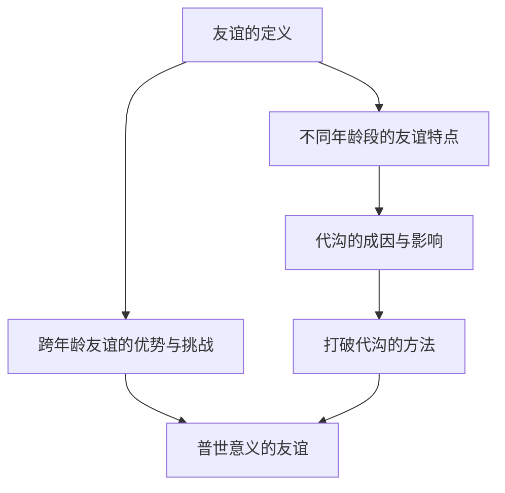
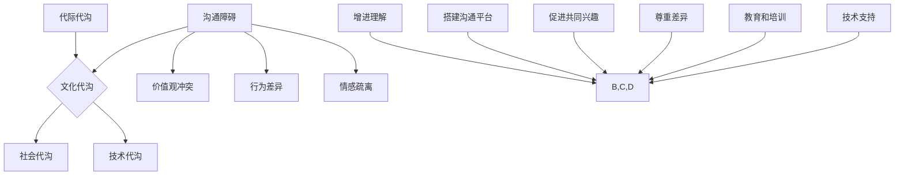
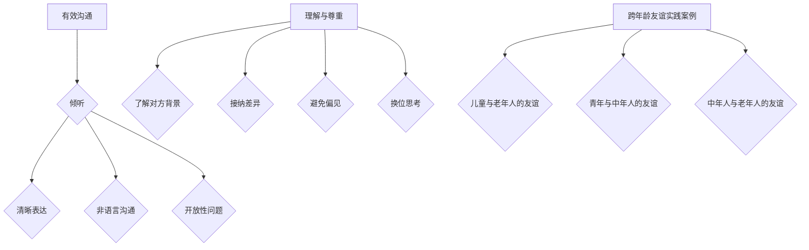
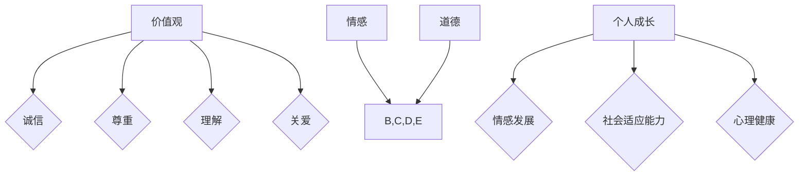
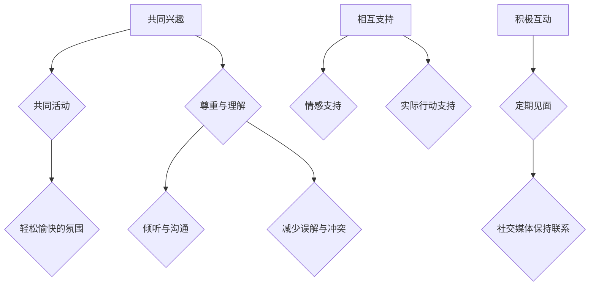

                 

### 引言：友谊的力量与意义

#### 1.1 跨年龄友谊的重要性

在现代社会中，人与人之间的互动越来越频繁，然而，随着年龄的增长，人们之间的代沟也在不断扩大。跨年龄友谊，即不同年龄段之间建立的友谊关系，对于消除代沟、促进社会和谐具有重要意义。跨年龄友谊不仅能够打破年龄的限制，使人们在不同年龄阶段都能获得真挚的友谊，还能够促进不同文化、价值观和生活方式之间的交流与理解。

跨年龄友谊的重要性体现在多个方面。首先，它能够帮助不同年龄段的人更好地了解彼此，从而消除误解和偏见。其次，跨年龄友谊能够促进个体的心理健康，通过交流和支持，缓解心理压力。此外，跨年龄友谊还能够提升个人的社会适应能力，帮助个体在不同的人生阶段更好地融入社会。

#### 1.2 书籍的目的与结构

本书旨在深入探讨跨年龄友谊的内涵和意义，分析跨年龄友谊在不同文化和社会背景下的表现，以及探讨如何通过有效的沟通和互动来建立和维护这种友谊。具体而言，本书将分为以下几个部分：

1. **引言**：介绍跨年龄友谊的重要性，以及本书的目的和结构。
2. **跨年龄友谊的核心概念**：阐述友谊的定义、特征以及在不同年龄段的表现。
3. **代沟的理解与分类**：分析代沟的成因、类型和影响，探讨跨年龄友谊如何应对代沟。
4. **打破代沟的方法**：讨论如何通过沟通、理解和尊重来建立跨年龄友谊。
5. **普世意义的友谊**：探讨友谊中的价值观、情感和道德，以及友谊在人生中的意义。
6. **实例分析与案例分析**：通过实际案例来分析如何建立和维持跨年龄友谊。
7. **结论与展望**：总结全书内容，对未来跨年龄友谊的发展提出展望。

通过这些章节的深入探讨，本书希望为读者提供关于跨年龄友谊的全面了解，帮助读者认识到跨年龄友谊的重要性，并提供建立和维护这种友谊的方法和策略。以下是本书的核心概念与联系，采用Mermaid流程图进行展示。

#### 跨年龄友谊的核心概念与联系

在这个流程图中，我们可以看到友谊的定义是全书的核心，它贯穿了不同年龄段的友谊特点、代沟的理解与分类、打破代沟的方法以及普世意义的友谊。通过这种结构化的探讨，我们能够更加系统地理解跨年龄友谊的各个方面，为读者提供有价值的见解和建议。接下来，我们将分别详细讨论这些章节的内容，帮助读者深入理解跨年龄友谊的内涵和重要性。

### 跨年龄友谊的核心概念

#### 2.1 友谊的定义与特征

友谊是一种基于相互信任、尊重和理解的情感纽带，它不仅仅存在于同龄人之间，也可以跨越年龄的界限。在友谊的定义中，信任是核心要素，它使得双方能够在彼此之间建立稳固的情感基础。此外，尊重和理解也是友谊的重要特征，它们确保了双方在交流中能够彼此接纳和包容，从而维持友谊的长期稳定。

在友谊的特征方面，我们可以从以下几个方面进行探讨。首先，友谊具有情感性。友谊不仅是理性上的认同，更是情感上的共鸣。这意味着友谊往往能够带来情感上的满足和愉悦。其次，友谊是平等性的。在友谊中，双方处于平等的地位，没有主从关系，这使得友谊更加自然和长久。最后，友谊具有持久性。良好的友谊能够经受时间的考验，即使双方在不同的生活阶段，友谊也能够保持不变。

#### 2.2 不同年龄段的友谊特点

不同年龄段的友谊特点各不相同，这些特点不仅受到生理和心理发展的影响，也受到社会环境和文化背景的塑造。

**儿童与青少年的友谊**：在儿童和青少年时期，友谊往往建立在共同兴趣和活动的基础上。由于这个阶段的个体还在探索自我，友谊更多地体现为一种同伴关系，孩子们通过共同的游戏和活动来建立友谊。这个时期的友谊往往比较单纯，更多地关注情感上的共鸣和相互支持。

**青年与中年的友谊**：随着年龄的增长，个体开始更加关注职业发展和社会责任，青年与中年人的友谊更多地体现在共同价值观和兴趣上。这个阶段的友谊往往更加成熟和稳定，双方能够更好地理解和尊重彼此的生活和选择。

**中年与老年人的友谊**：中年和老年人的友谊往往建立在相互支持和理解的基础上。由于生活经历的丰富，中年和老年人之间能够更好地分享经验和智慧，从而建立起深厚的友谊。此外，老年人在子女独立后，往往更加渴望与同龄人建立友谊，以填补社交空白。

#### 2.3 跨年龄友谊的优势与挑战

跨年龄友谊在带来诸多优势的同时，也面临一些挑战。

**优势**：

1. **丰富人生经验**：跨年龄友谊能够使个体从不同年龄段的人那里学到不同的经验和知识，从而丰富自己的人生阅历。
2. **促进心理健康**：通过跨年龄友谊，个体能够获得更多的情感支持和社会支持，有助于缓解心理压力和孤独感。
3. **促进社会和谐**：跨年龄友谊能够促进不同年龄段之间的交流和理解，有助于消除代沟，促进社会和谐。

**挑战**：

1. **沟通障碍**：由于不同年龄段的人成长环境和文化背景的差异，他们在沟通时可能会遇到理解上的障碍。
2. **价值观差异**：不同年龄段的人往往有不同的价值观和生活方式，这些差异可能会影响友谊的稳定。
3. **时间冲突**：不同年龄段的人可能因为工作和生活节奏的不同，导致时间和空间的冲突，从而影响友谊的维持。

为了克服这些挑战，个体需要通过有效的沟通、理解和尊重来建立和维护跨年龄友谊。例如，通过共同参与活动、分享经验和故事，以及保持开放和包容的心态，可以增进不同年龄段人之间的理解和信任。以下是几个具体的方法，帮助读者在建立跨年龄友谊时克服障碍：

1. **倾听与分享**：在沟通时，要善于倾听对方的观点和感受，并通过分享自己的经历和看法来建立共同话题。
2. **尊重差异**：尊重对方的观点和生活方式，避免因为价值观差异而产生冲突。
3. **共同参与**：通过共同参与活动，如参加社区志愿者服务、一起旅行或进行兴趣小组活动，可以增进相互了解和信任。

总之，跨年龄友谊不仅是人类情感需求的一种表现，也是社会和谐发展的重要基础。通过深入理解和探讨跨年龄友谊的核心概念和特点，我们可以更好地认识这种友谊的价值和意义，从而在日常生活中积极建立和维护这种有益的友谊关系。

### 代沟的理解与分类

#### 3.1 代沟的成因与影响

代沟是指不同年龄段的人群在价值观、生活方式、思维方式等方面存在的差异和冲突。这些差异的成因复杂多样，主要包括以下几方面：

1. **文化差异**：不同的文化背景和社会环境会影响人们的行为和思维方式，从而导致代沟。例如，传统观念与现代观念之间的冲突，就可能在不同年龄段的人之间产生代沟。

2. **教育差异**：教育水平和知识结构的不同，会使不同年龄段的人在理解和处理问题时有不同的观点和方法，从而产生代沟。

3. **社会角色变化**：随着人们年龄的增长，社会角色的变化也会导致代沟。例如，年轻人在追求个人梦想和自由时，可能与已经稳定下来的中年人产生矛盾。

4. **价值观差异**：随着时代的变迁，不同年龄段的人可能拥有不同的价值观。这种差异可能导致他们在面对相同问题时，产生不同的看法和做法，从而产生代沟。

代沟的影响主要体现在以下几个方面：

1. **沟通障碍**：代沟会阻碍不同年龄段的人之间的有效沟通，使得彼此难以理解和接受对方的观点。

2. **情感疏离**：代沟可能导致家庭成员或朋友之间的情感疏离，使得关系变得疏远和不和谐。

3. **心理压力**：代沟可能会给个体带来心理压力，使其在处理问题时感到困惑和无助。

4. **社会矛盾**：在更大的社会层面上，代沟可能会引发社会矛盾和冲突，影响社会的稳定和和谐。

#### 3.2 代沟的类型与表现形式

代沟可以分为以下几种类型：

1. **代际代沟**：这是指不同年龄段的人之间的代沟，如年轻人与老年人之间的代沟。这种代沟通常表现为对传统价值观和生活方式的质疑和挑战。

2. **文化代沟**：这是指不同文化背景的人之间的代沟，如不同国家或地区的人之间的代沟。这种代沟通常表现为对文化差异的不理解和偏见。

3. **社会代沟**：这是指在社会角色和地位上存在差异的人之间的代沟，如雇主与员工之间的代沟。这种代沟通常表现为对对方角色和期望的不理解和冲突。

4. **技术代沟**：这是指在技术使用和掌握上存在差异的人之间的代沟，如年轻人与老年人之间的技术代沟。这种代沟通常表现为对新技术和应用的不熟悉和不适应。

代沟的表现形式多种多样，可以体现在以下几个方面：

1. **沟通障碍**：由于代沟的存在，不同年龄段的人在沟通时可能会遇到理解上的障碍，导致信息传递不畅。

2. **价值观冲突**：由于代沟，不同年龄段的人可能会对相同的问题持有不同的价值观，从而产生冲突。

3. **行为差异**：由于代沟，不同年龄段的人在行为方式和习惯上可能会存在差异，从而导致相互之间的误解和矛盾。

4. **情感疏离**：由于代沟，不同年龄段的人可能会在情感上产生疏离，使得关系变得冷淡和疏远。

#### 3.3 代沟的应对策略

要克服代沟，需要采取一些有效的应对策略，以下是一些建议：

1. **增进理解**：通过交流和分享，增进不同年龄段人之间的理解。例如，年轻人可以主动了解老年人的生活习惯和价值观，老年人也可以尝试理解年轻人的思维方式。

2. **搭建沟通平台**：建立沟通平台，如家庭聚会、社区活动等，为不同年龄段的人提供交流的机会。

3. **促进共同兴趣**：通过共同兴趣和活动，促进不同年龄段人之间的互动和交流，例如，老年人可以参与年轻人的兴趣小组，年轻人也可以参与老年人的传统活动。

4. **尊重差异**：尊重不同年龄段的人的观点和生活方式，避免因为差异而产生冲突。

5. **教育和培训**：通过教育和培训，提高不同年龄段的人对彼此的了解和尊重，减少代沟的发生。

6. **技术支持**：利用技术手段，如社交媒体、在线学习平台等，帮助不同年龄段的人更好地理解和适应对方的世界。

通过这些策略，我们可以有效地克服代沟，建立更加和谐和稳定的人际关系。这不仅有助于个人的心理健康，也有助于社会的和谐与稳定。以下是代沟的类型与表现形式，以及应对策略的Mermaid流程图：

在这个流程图中，我们可以看到，代沟的类型和表现形式是多样化的，但通过一系列的策略，我们可以有效地应对这些挑战，建立更加和谐的人际关系。接下来，我们将探讨如何通过具体的沟通、理解和尊重来打破代沟，建立跨年龄友谊。

### 打破代沟的方法

要建立跨年龄友谊，克服代沟是一个关键环节。以下是一些有效的沟通、理解和尊重的方法，帮助我们打破代沟，建立和谐的跨年龄友谊。

#### 4.1 有效沟通的重要性

沟通是建立任何关系的基础，特别是跨年龄友谊。有效沟通不仅能够增进相互理解，还能减少误解和冲突。以下是一些提升沟通效果的技巧：

1. **倾听**：倾听是沟通的核心。在对话中，要尽量减少打断对方，全神贯注地听对方表达，并努力理解对方的观点。

2. **清晰表达**：表达时尽量使用简单明了的语言，避免使用专业术语或复杂句式，以确保对方能够理解。

3. **非语言沟通**：注意身体语言、面部表情和语调，这些非语言因素在沟通中同样重要。积极的肢体语言和友好的语调能够传达出你的诚意和尊重。

4. **开放性问题**：使用开放性问题鼓励对方分享更多的信息，例如，“你有什么感受？”或“你能告诉我更多关于这个事情的信息吗？”

#### 4.2 理解与尊重的建立

理解和尊重是跨年龄友谊的基石。以下是一些建立理解和尊重的方法：

1. **了解对方的背景**：了解对方的成长背景、文化背景和价值观，这有助于你更好地理解对方的行为和观点。

2. **接纳差异**：尊重对方的差异，不要试图改变对方，而是尝试理解和接纳对方的观点。

3. **避免偏见**：避免因为年龄差异而产生偏见，认识到每个人都是独立的个体，都有自己的独特性和价值。

4. **换位思考**：尝试从对方的角度思考问题，这有助于你更好地理解对方的感受和需求。

#### 4.3 跨年龄友谊的实践案例

以下是一些成功的跨年龄友谊实践案例，通过这些案例，我们可以看到如何通过沟通、理解和尊重来建立和维护跨年龄友谊。

**案例一：儿童与老年人的友谊**

在一个社区中心，一个年轻的家庭主动与一位独居的老年人士建立了友谊。年轻的家庭成员经常拜访老人，陪伴他聊天、看电视，甚至一起做饭。通过这种互动，老年人感受到了关爱和温暖，年轻的家庭成员也学会了尊重和理解老年人。

**案例二：青年与中年人的友谊**

在一家公司中，一名年轻员工与他的上司（中年人）建立了深厚的友谊。他们在工作中互相学习，员工从上司那里学到了丰富的经验和专业知识，而上司则从员工那里了解了新技术和新观念。他们通过定期的交流和共同项目，建立了牢固的信任关系。

**案例三：中年人与老年人的友谊**

在另一个社区，一名中年人主动参与老年活动中心的活动，与老年人建立了友谊。他通过参与老年人的兴趣爱好，如园艺、书法等，增进了与老年人的交流和理解。这种友谊不仅让老年人感到快乐，也帮助中年人更好地适应了生活变化。

通过这些案例，我们可以看到，建立跨年龄友谊的关键在于沟通、理解和尊重。只有通过有效的沟通，我们才能理解对方的观点和需求；只有通过理解和尊重，我们才能建立和谐的友谊关系。以下是这些方法的Mermaid流程图：

通过这个流程图，我们可以看到，通过有效沟通、理解和尊重，以及实际案例的引导，我们可以逐步建立和维护跨年龄友谊。这种方法不仅有助于个人成长，也有助于社会的和谐与稳定。接下来，我们将探讨跨年龄友谊中的普世意义，以及友谊在个人成长中的重要作用。

### 普世意义的友谊

友谊是人类情感世界中最美好的一部分，它超越了年龄、性别、文化和国籍的限制，具有普遍的意义和价值。在跨年龄友谊中，普世意义体现在以下几个方面：

#### 5.1 友谊中的价值观探讨

友谊中的价值观包括诚信、尊重、理解和关爱。这些价值观在不同的文化和社会背景下有着不同的表现形式，但它们的核心意义是相通的。例如，在中国传统文化中，友谊强调“义气”和“忠诚”，而在西方文化中，友谊则强调“信任”和“真诚”。尽管表现形式不同，但这些价值观都是友谊的核心。

1. **诚信**：诚信是友谊的基石。朋友之间应当坦诚相待，不说谎、不欺骗，保持彼此之间的信任。
2. **尊重**：尊重是友谊中不可或缺的部分。每个人都是独立的个体，拥有自己的思想和感受。尊重对方意味着接纳对方的不同，不强迫对方接受自己的观点。
3. **理解**：理解是友谊深化的关键。通过倾听和理解对方的观点，我们能够更好地建立共识，减少误解和冲突。
4. **关爱**：关爱是友谊中的情感纽带。朋友之间应当互相关心、互相支持，共同度过难关。

#### 5.2 情感与道德在友谊中的角色

情感和道德在友谊中扮演着重要的角色，它们不仅影响友谊的质量，也影响个人的成长和发展。

1. **情感**：情感是友谊的驱动力。朋友之间的情感交流能够带来快乐、安慰和支持。情感使得我们在面对困难和挑战时，能够感受到来自朋友的温暖和力量。

2. **道德**：道德是友谊的准则。朋友之间的行为和决策都应当符合道德标准，尊重他人的权益，维护友谊的纯洁和真实。

#### 5.3 友谊对个人成长的影响

友谊对个人的成长具有深远的影响，它不仅影响个体的情感发展，还影响其社会适应能力和心理健康。

1. **情感发展**：通过友谊，个体能够体验到爱、信任和支持，从而建立积极的情感态度。这种情感体验有助于个体形成健康的人格和稳定的情感状态。

2. **社会适应能力**：友谊能够帮助个体更好地适应社会环境。通过与不同年龄段的人建立友谊，个体能够学习到更多的社交技能和人际交往技巧，从而提高社会适应能力。

3. **心理健康**：友谊对心理健康有积极的促进作用。朋友之间的支持和理解能够缓解压力和焦虑，增强个体的心理韧性，有助于个体保持良好的心理健康状态。

为了更好地理解友谊的普世意义，我们可以通过以下Mermaid流程图来展示友谊中的价值观、情感和道德之间的关系：

在这个流程图中，我们可以清晰地看到，价值观、情感和道德是友谊的核心组成部分，它们共同作用于个人的成长和发展。通过友谊，个体不仅能够体验到情感的满足，还能在道德的指引下健康成长。友谊不仅是人类情感的需求，也是个人成长的重要助力。因此，我们应该珍惜和维护跨年龄友谊，让它在我们的生活中发挥更大的作用。

### 实例分析与案例分析

为了更好地理解如何建立和维护跨年龄友谊，我们通过几个实际案例来进行分析和讨论。

#### 6.1 跨年龄友谊的实际案例

**案例一：儿童与老年人的友谊**

在一个社区中心，一位年轻的母亲经常带着自己的孩子去探望一位独居的老年人士。这位老人退休前是一位工程师，他对科学和数学有着浓厚的兴趣。年轻母亲的孩子与老人在一起，不仅学到了很多科学知识，还通过老人的故事了解到了过去的历史和文化。这种跨年龄的互动不仅让老人感到快乐，也使孩子得到了宝贵的教育。

**案例二：青年与中年人的友谊**

在一个公司里，一位年轻的软件开发工程师与他的上司（一名中年人）建立了深厚的友谊。工程师在项目中遇到技术难题时，上司总是耐心地给予指导和帮助。而工程师则在上司面临职业瓶颈时，提供了一些创新的解决方案。通过这种相互学习和支持，他们不仅在工作中取得了成功，也在生活中成为了好朋友。

**案例三：中年人与老年人的友谊**

在一个公园里，一名中年人与一位老年棋友每周都会相约下棋。尽管两人年龄相差较大，但他们都热爱棋艺，并且从中找到了共同的兴趣。他们通过下棋交流思想，分享生活经验，建立了深厚的友谊。

#### 6.2 案例分析：成功建立跨年龄友谊的策略

从上述案例中，我们可以总结出一些成功建立跨年龄友谊的策略：

1. **共同兴趣**：共同的兴趣和爱好是跨年龄友谊的重要基础。通过共同活动，人们可以在轻松愉快的氛围中建立联系，从而促进友谊的发展。

2. **尊重与理解**：尊重对方的差异，理解对方的需求和期望，是建立跨年龄友谊的关键。通过倾听和沟通，人们能够更好地理解对方，减少误解和冲突。

3. **相互支持**：在跨年龄友谊中，相互支持是非常重要的。无论是情感上的支持，还是实际行动上的帮助，都能增强友谊的稳定性。

4. **积极互动**：定期的交流和互动是维持友谊的关键。通过定期见面或通过社交媒体保持联系，人们能够保持友谊的新鲜感和活力。

通过这些案例分析，我们可以看到，建立和维护跨年龄友谊并非难事。只要我们能够找到共同兴趣，尊重和理解对方，并提供相互支持，就能够成功地建立起稳定的跨年龄友谊。以下是这些策略的Mermaid流程图：

通过这个流程图，我们可以清晰地看到，共同兴趣、尊重与理解、相互支持和积极互动是成功建立跨年龄友谊的重要策略。只要我们遵循这些策略，就能够克服代沟，建立起稳定和美好的跨年龄友谊。

### 结论与展望

#### 7.1 跨年龄友谊的总结

跨年龄友谊作为一种特殊的人际关系，不仅能够丰富人们的生活经验，还能促进社会的和谐与稳定。通过有效的沟通、理解和尊重，不同年龄段的人可以建立起真诚的友谊，从而消除代沟，增进相互理解和信任。跨年龄友谊不仅有助于个人的心理健康，还能提升社会适应能力，使个体在不同的人生阶段都能找到归属感和幸福感。

本文通过探讨友谊的定义与特征、代沟的成因与分类、打破代沟的方法以及跨年龄友谊的普世意义，系统性地分析了跨年龄友谊的重要性和建立策略。通过实际案例的分享，我们看到了跨年龄友谊的成功实践，这些经验为我们提供了宝贵的启示。

#### 7.2 对未来跨年龄友谊发展的展望

未来，随着社会的发展和人们生活水平的提高，跨年龄友谊将继续发挥其重要作用。以下是对未来跨年龄友谊发展的几点展望：

1. **文化交流与融合**：随着全球化的推进，不同文化之间的交流将更加频繁。跨年龄友谊将成为文化交流的重要载体，促进不同文化之间的理解与融合。

2. **科技支持**：随着科技的发展，特别是社交媒体和在线平台的普及，跨年龄友谊将得到更加便捷的沟通和支持。人们可以通过网络跨越地理和时间的限制，建立和维护跨年龄友谊。

3. **社会政策的推动**：政府和社区组织可以出台更多的政策和支持措施，鼓励和促进跨年龄友谊的发展。例如，通过组织社区活动、提供交流平台等方式，帮助不同年龄段的人建立友谊。

4. **教育普及**：教育系统可以在课程设置中增加关于跨年龄友谊的内容，提高人们的跨年龄沟通和理解能力，从而促进跨年龄友谊的发展。

总之，跨年龄友谊作为一种宝贵的社交资源，将在未来继续发挥其重要作用。通过持续的努力和探索，我们可以建立更多的跨年龄友谊，创造一个更加和谐和包容的社会。

### 作者信息

**作者：AI天才研究院/AI Genius Institute & 禅与计算机程序设计艺术 /Zen And The Art of Computer Programming**

AI天才研究院致力于推动人工智能领域的研究和应用，为全球科技创新贡献力量。同时，作者也在计算机编程和人工智能领域拥有丰富的经验和深厚的学术造诣，著有《禅与计算机程序设计艺术》一书，深受读者喜爱。通过本书，作者希望为读者提供关于跨年龄友谊的深入见解，帮助更多人建立和维护美好的友谊关系。

