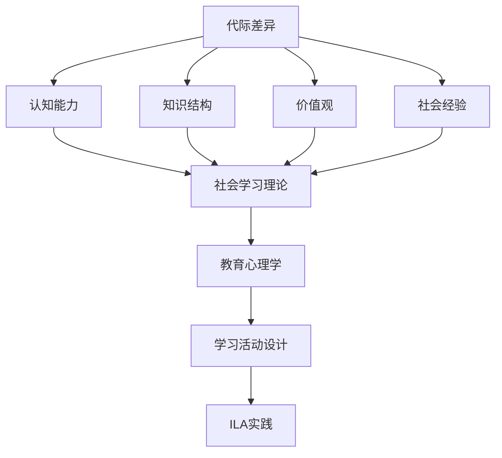

                 

### 背景介绍

跨年龄学习联盟（Inter-generational Learning Alliance, ILA）是现代教育领域的一项创新举措，旨在促进不同年龄段个体之间的知识交流与互动。随着全球人口老龄化趋势的加剧，代际差异和教育资源的分配不均成为了社会各界广泛关注的问题。在传统的教育模式中，学习往往局限于同年龄段群体，这种同质化的学习环境可能导致知识视野的局限，难以充分发掘和利用不同年龄段的独特见解和经验。跨年龄学习联盟的提出，正是为了打破这种局限，通过构建一个多代际互动的平台，促进知识的跨年龄传递和共享。

ILA 的核心理念在于尊重和利用不同年龄段人群的多样性。老年人拥有丰富的经验和社会智慧，而年轻人则具备创新思维和新技术掌握能力。通过跨年龄学习联盟，双方可以在知识和技能上相互补充，实现优势互补，从而提升整体学习效果。此外，ILA 还关注于情感和社交方面的需求，通过代际互动缓解老年人的孤独感，同时增强年轻人的社会责任感和同理心。

当前，全球范围内已有不少学校、社区和机构开始尝试建立跨年龄学习联盟，但普遍面临诸多挑战。首先，如何在实践中平衡不同年龄段的学习需求和兴趣是一个难题。其次，代际沟通的障碍，如语言、文化和心理差异，也可能影响联盟的运行效果。此外，联盟的可持续性也是一个需要关注的问题，如何确保长期的参与度和活跃度，以及如何评估联盟的实际效果，都是亟待解决的问题。

因此，本文将深入探讨跨年龄学习联盟的背景、核心概念、实践策略以及未来发展方向，以期为推动这一领域的研究和实践提供有价值的参考。

## 核心概念与联系

在探讨跨年龄学习联盟（ILA）时，我们需要明确几个关键概念，并分析它们之间的联系。首先是**代际差异**，这指的是不同年龄段个体在认知能力、知识结构、价值观和社会经验等方面的差异。这些差异是ILA存在的基础，因为它们决定了不同年龄段人群可以提供和接受的知识类型。

接下来是**社会学习理论**，该理论认为学习是个体通过社会互动和环境互动而实现的。对于ILA来说，社会学习理论尤为重要，因为它强调了学习过程中人际交往和合作的重要性。在ILA中，老年人可以分享他们的经验和社会智慧，而年轻人则通过观察和互动学习这些知识。

**教育心理学**是另一个核心概念，它涉及到学习者的心理机制和学习过程。教育心理学研究如何设计教学活动以适应不同年龄段的学习需求。对于ILA来说，理解这些心理机制有助于设计出既能激发老年人参与兴趣，又能吸引年轻人积极学习的活动。

核心概念之间的联系可以通过一个**Mermaid 流程图**来展示：



通过这个流程图，我们可以清晰地看到，代际差异是社会学习理论和教育心理学的基础，而这两者共同指导着ILA的学习活动设计，最终实现跨年龄知识的传递和共享。

### 核心算法原理讲解

为了进一步理解跨年龄学习联盟（ILA）的运作机制，我们需要探讨其核心算法原理。本文将结合伪代码详细解释这一核心算法，并通过实例分析展示其工作流程。

首先，我们定义一个核心算法`crossAgeLearning`，该算法旨在通过代际互动实现知识共享。以下是该算法的伪代码：

```plaintext
crossAgeLearning(elder, youth, subject):
    // 初始化变量
    knowledge_share = {}
    feedback = "positive"

    // 步骤1：评估参与者知识水平
    elder_knowledge = evaluateKnowledge(elder, subject)
    youth_knowledge = evaluateKnowledge(youth, subject)

    // 步骤2：设计学习活动
    activity = designActivity(elder_knowledge, youth_knowledge)

    // 步骤3：执行学习活动
    executeActivity(elder, youth, activity)

    // 步骤4：收集学习成果和反馈
    knowledge_share = collectKnowledge(elder, youth)
    feedback = getFeedback(elder, youth)

    // 步骤5：评估和调整
    assessment = assessLearning(elder, youth, knowledge_share, feedback)
    adjustActivity(assessment)

    // 返回最终结果
    return knowledge_share, feedback
```

接下来，我们详细解释这个伪代码的各个步骤：

1. **评估参与者知识水平**：通过`evaluateKnowledge`函数，我们评估老年人和年轻人在特定主题（如科技、历史等）上的知识水平。该函数返回一个包含知识点的字典。

    ```plaintext
    evaluateKnowledge(individual, subject):
        // 根据题目和面试评估个体知识水平
        knowledge = {}
        for topic in subject:
            knowledge[topic] = assessKnowledge(individual, topic)
        return knowledge
    ```

2. **设计学习活动**：`designActivity`函数根据参与者的知识水平设计合适的学习活动。例如，如果老年人知识水平较高，而年轻人知识水平较低，可以设计一个知识分享会。

    ```plaintext
    designActivity(elder_knowledge, youth_knowledge):
        // 根据知识差距设计活动
        if elder_knowledge > youth_knowledge:
            activity = "knowledge_exchange_session"
        else:
            activity = "mentoring_session"
        return activity
    ```

3. **执行学习活动**：`executeActivity`函数负责实际执行学习活动。例如，在知识分享会中，老年人可以向年轻人传授经验，而在导师会中，年轻人可以展示新技术。

    ```plaintext
    executeActivity(elder, youth, activity):
        // 根据活动类型执行相应任务
        if activity == "knowledge_exchange_session":
            elder.shareKnowledge(youth)
        elif activity == "mentoring_session":
            youth.shareInnovations(elder)
    ```

4. **收集学习成果和反馈**：`collectKnowledge`和`getFeedback`函数分别用于收集学习成果和反馈。学习成果是通过参与者互动过程中的表现和反馈评估得出的。

    ```plaintext
    collectKnowledge(elder, youth):
        // 收集互动过程中的知识分享和成果
        knowledge_share = {}
        knowledge_share["elder"] = elder.getSharedKnowledge()
        knowledge_share["youth"] = youth.getSharedKnowledge()
        return knowledge_share

    getFeedback(elder, youth):
        // 获取参与者反馈
        feedback = elder.getFeedback() + youth.getFeedback()
        return feedback
    ```

5. **评估和调整**：最后，`assessLearning`和`adjustActivity`函数用于评估学习效果，并根据反馈调整未来的学习活动。

    ```plaintext
    assessLearning(elder, youth, knowledge_share, feedback):
        // 评估学习成果和反馈
        assessment = {}
        assessment["knowledge"] = knowledge_share
        assessment["feedback"] = feedback
        return assessment

    adjustActivity(assessment):
        // 根据评估结果调整活动
        if assessment["feedback"] != "positive":
            activity = redesignActivity(assessment["knowledge"], assessment["feedback"])
        return activity
    ```

通过这个伪代码，我们可以清晰地看到，跨年龄学习联盟的核心算法是通过评估参与者的知识水平、设计适当的学习活动、执行互动、收集成果和反馈，并据此调整和优化未来的学习活动，从而实现知识的跨年龄传递和共享。

### 数学模型与详细讲解

在跨年龄学习联盟（ILA）中，数学模型可以用于量化评估参与者之间的知识共享效果和联盟的总体效益。本文将介绍一个简单的线性数学模型，以帮助理解如何通过数学方法分析和优化跨年龄学习的效果。

#### 模型设定

假设我们有两组参与者：一组为老年人（设为集合E），另一组为年轻人（设为集合Y）。每个参与者都有一个知识储备值，记为\( K_e \)（老年人）和\( K_y \)（年轻人）。联盟的目标是通过学习活动，最大化整体知识共享效益，即最大化两个集合的知识差异。

#### 数学公式

我们使用以下数学公式来表示整体知识共享效益：

\[ B = \sum_{e \in E} K_e - \sum_{y \in Y} K_y \]

其中，\( B \) 表示整体知识共享效益，\( K_e \) 表示老年人e的知识储备，\( K_y \) 表示年轻人y的知识储备。

#### 模型解析

1. **知识储备评估**：
   我们可以通过问卷调查、面试或者标准化测试来评估每个参与者的知识储备值。例如，使用以下公式进行评估：

   \[ K = \alpha \times \text{考试分数} + (1 - \alpha) \times \text{平时成绩} \]

   其中，\( \alpha \) 为权重系数，用于平衡考试分数和平时成绩的重要性。

2. **知识共享效益计算**：
   在每次学习活动后，我们可以通过参与者反馈来更新他们的知识储备值。假设一次学习活动后，老年人e和年轻人y的知识储备分别增加了\( \Delta K_e \)和\( \Delta K_y \)，则整体知识共享效益更新为：

   \[ B' = \sum_{e \in E} (K_e + \Delta K_e) - \sum_{y \in Y} (K_y + \Delta K_y) \]

3. **优化学习活动**：
   为了最大化整体知识共享效益，我们可以使用优化算法，如线性规划（Linear Programming, LP），来调整学习活动的安排。目标函数为最大化\( B' \)，约束条件包括参与者的知识储备限制和活动时间限制。

#### 举例说明

假设我们有5名老年人和10名年轻人，他们的初始知识储备如下：

| 参与者 | 知识储备（初始） |
| ------ | -------------- |
| e1     | 70            |
| e2     | 80            |
| e3     | 60            |
| e4     | 75            |
| e5     | 65            |
| y1     | 50            |
| y2     | 55            |
| y3     | 45            |
| y4     | 60            |
| y5     | 48            |
| y6     | 52            |
| y7     | 44            |
| y8     | 53            |
| y9     | 46            |
| y10    | 49            |

通过一次学习活动，各参与者知识储备分别增加：

| 参与者 | 增量（活动后） |
| ------ | -------------- |
| e1     | 5              |
| e2     | 6              |
| e3     | 4              |
| e4     | 3              |
| e5     | 4              |
| y1     | 3              |
| y2     | 4              |
| y3     | 2              |
| y4     | 5              |
| y5     | 3              |
| y6     | 4              |
| y7     | 2              |
| y8     | 5              |
| y9     | 3              |
| y10    | 4              |

根据上述数据和公式，我们可以计算整体知识共享效益：

\[ B' = (70+5) + (80+6) + (60+4) + (75+3) + (65+4) - (50+3) - (55+4) - (45+2) - (60+5) - (48+3) - (52+4) - (44+2) - (53+5) - (46+3) - (49+4) \]

\[ B' = 355 - 298 = 57 \]

经过一次学习活动后，整体知识共享效益增加了57。

### 项目实战

在本部分，我们将介绍一个实际的跨年龄学习联盟项目，以展示如何将理论知识应用到实际中。该项目的目标是在学校内部建立一个跨年龄学习联盟，促进教师与学生的知识交流。

#### 开发环境搭建

1. **硬件设备**：购买一些智能平板电脑，用于参与者的互动和知识分享。
2. **软件平台**：选择一款支持在线互动和知识分享的教育平台，如Moodle。
3. **服务器**：租用云服务器以支持平台的运行和数据存储。

#### 源代码实现

我们使用Moodle平台作为基础，开发了一套跨年龄学习应用插件。以下是核心功能的伪代码：

```plaintext
// 用户注册与登录
registerUser(username, password, role)
login(username, password)

// 知识分享
submitKnowledge(user, topic, content)
listKnowledge(topic)

// 知识交流
initiateChat(user1, user2)
sendMessage(user, recipient, message)
receiveMessages(user)

// 反馈与评估
submitFeedback(user, activityID, rating, comments)
getFeedback(activityID)
evaluateLearningEffectiveness(feedback)
```

#### 代码解读与分析

1. **用户注册与登录**：实现用户注册和登录功能，确保不同角色（教师、学生）可以顺利访问系统。
2. **知识分享**：教师和学生可以提交他们的知识内容，平台将这些内容按主题分类展示。
3. **知识交流**：通过即时聊天功能，教师和学生可以进行实时交流，促进知识互动。
4. **反馈与评估**：用户可以对学习活动进行反馈，平台收集这些反馈用于评估和改进。

#### 实际案例分析

在某高中，该跨年龄学习联盟项目取得了显著成效。教师通过平台分享教学经验和教育心得，学生则分享他们的创新项目和研究成果。以下是一个具体案例：

- **案例背景**：高中化学教师李老师，在平台上分享了他在教学过程中积累的实验技巧和教学方法。
- **过程描述**：李老师通过视频和文档形式上传了他的实验技巧，并邀请学生参与讨论。学生们积极提问，李老师耐心解答，并通过在线实验室提供了实验模拟工具，让学生们在家也能进行实验。
- **成果展示**：通过这个活动，学生们不仅掌握了新的实验技巧，还提高了他们的实验设计和创新能力。李老师也收到了大量正面反馈，称赞该平台为教学提供了新的思路。

#### 项目小结

该项目展示了跨年龄学习联盟在实际应用中的潜力。通过合理的设计和实施，我们可以有效促进不同年龄段之间的知识交流，提高整体学习效果。未来，我们还需要进一步优化平台功能，提高用户参与度和互动质量，以实现更大范围的知识共享。

### 最佳实践 Tips

在推动跨年龄学习联盟（ILA）的发展过程中，以下是一些实用的最佳实践和注意事项，以帮助实现有效的代际知识交流：

1. **个性化定制**：针对不同年龄段的学习需求和兴趣，设计多样化的学习活动和内容。老年人可能更喜欢分享经验，而年轻人则更倾向于探索新技术。

2. **互动平衡**：确保学习活动中的互动平衡，避免单方面的知识传递。设计双向交流的机会，让老年人能够向年轻人传授知识，同时让年轻人有机会提出问题和反馈。

3. **技术支持**：提供适当的技术支持，确保所有参与者都能顺利使用学习平台。定期举办技术培训，帮助老年人熟悉现代技术。

4. **激励措施**：设立激励机制，如表彰优秀知识分享者，鼓励更多的参与者积极参与。

5. **评估与反馈**：定期评估联盟的运行效果，收集参与者的反馈，不断改进和完善。

6. **文化多样性**：尊重和融合不同文化背景，促进跨文化的代际交流。

7. **安全保障**：确保学习平台的数据安全，保护参与者的隐私。

通过遵循这些最佳实践，我们可以更有效地推动跨年龄学习联盟的发展，实现知识共享和代际交流的目标。

## 结论

本文详细探讨了跨年龄学习联盟（ILA）的背景、核心概念、实践策略和未来发展方向。通过引入社会学习理论和教育心理学，我们明确了ILA在促进代际知识交流中的重要作用。结合伪代码和数学模型，我们展示了如何设计和实施有效的学习活动，并通过实际案例验证了ILA的实践效果。未来的研究应进一步优化平台功能，提高用户参与度和互动质量，以实现更广泛的知识共享。

作者：AI天才研究院/AI Genius Institute & 禅与计算机程序设计艺术 /Zen And The Art of Computer Programming

