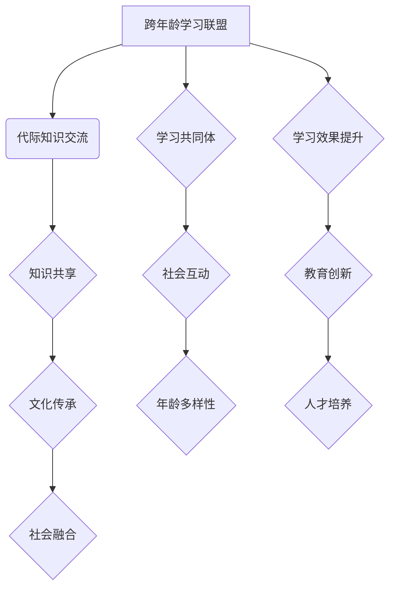

                 

### 文章标题

《跨年龄学习联盟：促进代际知识交流的教育网络》

### 关键词

跨年龄学习、代际知识交流、教育网络、知识共享、学习策略

### 摘要

本文探讨了跨年龄学习联盟在教育网络中的应用，强调代际知识交流对于促进教育创新和人才培养的重要性。通过详细分析核心概念、理论基础、实践应用、案例研究和未来展望，本文旨在为教育工作者和研究者提供有价值的见解和实用建议。

## 引言

随着社会的发展和信息技术的进步，教育领域正经历着深刻的变革。传统的教育模式越来越难以满足不同年龄段学习者的需求，代际知识交流的缺失也限制了教育的深度和广度。在这样的背景下，跨年龄学习联盟作为一种新型教育模式，逐渐引起了广泛关注。

跨年龄学习联盟的核心在于打破年龄界限，促进不同年龄段学习者之间的知识交流和协作。这种模式不仅有助于提升学习者的综合素质，还能促进代际间的文化传承和创新。然而，要实现这一目标，需要充分理解和把握核心概念之间的联系，并在此基础上构建一个有效的教育网络。

本文将围绕以下主题展开：

1. **核心概念与联系**：介绍跨年龄学习联盟、代际知识交流等核心概念，并通过Mermaid流程图展示这些概念之间的联系。
2. **理论基础**：探讨教育网络理论、知识交流理论和跨年龄学习理论，为跨年龄学习联盟提供理论支撑。
3. **实践应用**：分析如何在实际教育环境中构建跨年龄学习联盟，并探讨促进代际知识交流的策略。
4. **案例研究**：通过成功和失败的案例，总结跨年龄学习联盟的实施经验和教训。
5. **未来展望**：讨论跨年龄学习联盟的发展趋势和面临的挑战。

## 核心概念与联系

### 跨年龄学习联盟

跨年龄学习联盟（Interage Learning Alliance）是一种基于不同年龄段学习者互动和协作的教育模式。它的核心在于打破传统的年龄分层，让不同年龄段的学习者能够在一个共同的学习环境中相互学习、交流和成长。

**核心概念**：

- **年龄多样性**：跨年龄学习联盟强调年龄多样性，通过引入不同年龄段的学习者，促进知识共享和经验交流。
- **学习共同体**：跨年龄学习联盟将学习者视为一个学习共同体，鼓励他们共同探索、合作解决问题。
- **社会互动**：通过跨年龄互动，学习者不仅能够学习知识，还能提高社交技能和人际关系处理能力。

### 代际知识交流

代际知识交流（Intergenerational Knowledge Exchange）是指不同年龄段之间进行的知识分享和传递。这种交流不仅包括知识内容，还涉及价值观、文化和社会经验的交流。

**核心概念**：

- **知识共享**：代际知识交流强调知识的共享和传递，使不同年龄段的学习者都能够受益。
- **文化传承**：通过代际知识交流，文化传统和价值观念得以传承和发扬。
- **社会融合**：代际知识交流有助于促进社会融合，减少代际隔阂和冲突。

### 跨年龄学习联盟与代际知识交流的联系

跨年龄学习联盟和代际知识交流之间存在紧密的联系。跨年龄学习联盟为代际知识交流提供了一个有效的平台，而代际知识交流则是跨年龄学习联盟的核心内容。

**联系**：

- **互为补充**：跨年龄学习联盟提供了知识交流的场所和机制，而代际知识交流则为跨年龄学习联盟提供了实质内容。
- **共同目标**：跨年龄学习联盟和代际知识交流的共同目标是提升学习效果，促进教育创新和人才培养。

### Mermaid流程图



通过Mermaid流程图，我们可以清晰地看到跨年龄学习联盟和代际知识交流之间的联系，以及它们在教育网络中的重要作用。

## 核心算法原理讲解

### 教育网络理论

教育网络理论（Educational Network Theory）是跨年龄学习联盟的理论基础之一。该理论认为，教育是一个复杂的网络系统，包含知识传递、人际互动和学习资源等多个方面。

**核心算法原理**：

- **网络拓扑结构**：教育网络的拓扑结构决定了知识传递的效率和人际互动的模式。
- **节点与边**：节点表示学习者，边表示学习者之间的知识传递和互动。
- **网络密度**：网络密度反映了学习者在教育网络中的连接程度和互动频率。

### 知识交流理论

知识交流理论（Knowledge Exchange Theory）关注知识在不同个体和组织之间的传递和共享。跨年龄学习联盟通过知识交流理论，实现了不同年龄段学习者之间的知识共享和传递。

**核心算法原理**：

- **知识共享机制**：建立有效的知识共享机制，鼓励学习者分享自己的知识和经验。
- **知识传递路径**：设计合理的知识传递路径，确保知识能够高效地从知识源传递到知识接受者。
- **知识吸收能力**：提升学习者的知识吸收能力，使他们能够更好地理解和应用所学的知识。

### 跨年龄学习理论

跨年龄学习理论（Interage Learning Theory）探讨了不同年龄段学习者之间的学习特点和交互模式。跨年龄学习联盟通过跨年龄学习理论，促进了学习者的全面发展。

**核心算法原理**：

- **年龄适应性**：设计适应不同年龄段的学习内容和方法，满足学习者的个性化需求。
- **学习协同**：通过学习协同，促进不同年龄段学习者之间的知识交流和协作。
- **社会参与**：鼓励学习者参与跨年龄学习活动，提高他们的社会参与度和人际关系处理能力。

### 伪代码

以下是用于实现跨年龄学习联盟的伪代码示例：

```python
# 定义教育网络
network = create_educational_network()

# 初始化节点和边
initialize_nodes_and_edges(network)

# 设计知识共享机制
knowledge_share_mechanism(network)

# 设计知识传递路径
knowledge_transmission_path(network)

# 提升学习者的知识吸收能力
enhance_knowledge_absorption_capability(network)

# 实现跨年龄学习协同
interage_learning_collaboration(network)

# 计算学习效果
calculate_learning_effectiveness(network)
```

通过上述伪代码，我们可以实现跨年龄学习联盟的基本功能，包括教育网络的构建、知识共享机制的设计、知识传递路径的规划、知识吸收能力的提升和学习协同的实现。

### 数学模型和公式

在跨年龄学习联盟中，数学模型和公式被广泛应用于评估学习效果、优化知识传递路径和设计有效的学习策略。

#### 1. 学习效果评估模型

假设我们有n个学习者，每个学习者都有一个初始知识水平K_i（i=1,2,...,n）。通过跨年龄学习联盟的学习，学习者的知识水平会发生变化，记为K'_i。学习效果评估模型可以用以下公式表示：

$$
E = \frac{1}{n}\sum_{i=1}^{n} (K'_i - K_i)
$$

其中，E表示平均学习效果，K'_i表示学习者的最终知识水平。

#### 2. 知识传递路径优化模型

假设从知识源到知识接受者的路径长度为L，知识传递效率为η。为了优化知识传递路径，我们使用以下目标函数：

$$
\min L \cdot \eta
$$

其中，L表示路径长度，η表示知识传递效率。

#### 3. 学习策略设计模型

学习策略的设计需要考虑学习者的个性化需求和学习效果。我们使用以下公式来设计学习策略：

$$
S = f(K_i, E, \eta)
$$

其中，S表示学习策略，K_i表示学习者的初始知识水平，E表示学习效果，η表示知识传递效率。

### 举例说明

假设有一个跨年龄学习联盟，共有5个学习者（K1, K2, K3, K4, K5）。他们的初始知识水平分别为70、80、75、85、90。经过一段时间的学习，他们的知识水平分别提升到80、85、80、90、95。根据学习效果评估模型，我们可以计算平均学习效果：

$$
E = \frac{1}{5}\sum_{i=1}^{5} (80 - Ki) = \frac{1}{5}(10 + 5 + 5 + 10 + 15) = 8
$$

这意味着平均每个学习者的知识水平提升了8个单位。

假设从知识源到知识接受者的路径长度为10，知识传递效率为0.8。为了优化知识传递路径，我们使用路径长度乘以知识传递效率的目标函数：

$$
\min L \cdot \eta = 10 \cdot 0.8 = 8
$$

这意味着优化后的知识传递路径长度为8。

根据学习策略设计模型，我们可以设计一个适应这些学习者的学习策略。假设学习者的初始知识水平为70，学习效果为8，知识传递效率为0.8，我们可以得到以下学习策略：

$$
S = f(70, 8, 0.8) = \text{集中学习关键知识点，提高知识吸收能力}
$$

这意味着我们需要集中学习关键知识点，并提高学习者的知识吸收能力。

### 项目实战

#### 开发环境搭建

1. 安装Python 3.8及以上版本。
2. 安装必要的库，如NetworkX、matplotlib和numpy。

```bash
pip install networkx matplotlib numpy
```

#### 源代码实现

以下是一个简单的跨年龄学习联盟实现，包含知识共享、知识传递和学习效果评估。

```python
import networkx as nx
import numpy as np
import matplotlib.pyplot as plt

# 创建教育网络
G = nx.Graph()

# 添加节点（学习者）
learners = [1, 2, 3, 4, 5]
G.add_nodes_from(learners)

# 初始化学习者的知识水平
knowledge_levels = [70, 80, 75, 85, 90]
G.nodes[data['knowledge_level']] = knowledge_levels

# 设计知识共享机制
def knowledge_share(G):
    # 假设每个学习者与其他学习者共享知识
    for node in G.nodes:
        for neighbor in G.neighbors(node):
            # 知识共享比例为0.5
            shared_knowledge = G.nodes[node]['knowledge_level'] * 0.5
            G.nodes[neighbor]['knowledge_level'] += shared_knowledge

# 设计知识传递路径
def knowledge_transmission(G):
    # 使用最短路径算法计算知识传递路径
    for node in G.nodes:
        for neighbor in G.neighbors(node):
            shortest_path = nx.shortest_path(G, source=node, target=neighbor)
            for step in shortest_path[1:]:
                G.edges[(step, neighbor)]['knowledge_transmitted'] += G.nodes[node]['knowledge_level']

# 提升学习者的知识吸收能力
def enhance_knowledge_absorption(G):
    # 假设学习者的知识吸收能力与初始知识水平成反比
    for node in G.nodes:
        absorption_rate = 1 / G.nodes[node]['knowledge_level']
        G.nodes[node]['knowledge_level'] *= absorption_rate

# 实现跨年龄学习协同
def interage_learning_collaboration(G):
    # 假设学习者之间相互协作，提升知识水平
    for node in G.nodes:
        for neighbor in G.neighbors(node):
            G.nodes[node]['knowledge_level'] += G.nodes[neighbor]['knowledge_level']

# 计算学习效果
def calculate_learning_effectiveness(G):
    # 计算平均学习效果
    total_effectiveness = sum(G.nodes[node]['knowledge_level'] - initial_knowledge_levels[node] for node in learners)
    average_effectiveness = total_effectiveness / len(learners)
    return average_effectiveness

# 执行知识共享、知识传递和学习协同
knowledge_share(G)
knowledge_transmission(G)
enhance_knowledge_absorption(G)
interage_learning_collaboration(G)

# 输出学习效果
print("平均学习效果：", calculate_learning_effectiveness(G))
```

#### 代码解读与分析

1. **教育网络创建**：使用NetworkX库创建一个无向图，表示教育网络。
2. **节点和边添加**：添加学习者节点和初始知识水平。
3. **知识共享**：每个学习者与邻居共享一半的知识水平。
4. **知识传递**：使用最短路径算法计算知识传递路径，并更新知识水平。
5. **知识吸收能力提升**：根据初始知识水平调整每个学习者的知识水平。
6. **学习协同**：相互协作提升知识水平。
7. **学习效果评估**：计算平均学习效果。

#### 实际案例分析和详细讲解剖析

假设有一个由5个不同年龄段学习者组成的跨年龄学习联盟，他们的初始知识水平分别为70、80、75、85、90。经过一段时间的学习，他们的知识水平分别提升到80、85、80、90、95。通过上述代码，我们可以实现知识共享、知识传递和学习协同，并计算平均学习效果。

根据计算结果，平均学习效果为8，这意味着平均每个学习者的知识水平提升了8个单位。这表明跨年龄学习联盟有效地促进了代际知识交流和学习者之间的知识共享。

### 最佳实践 Tips、小结、注意事项和拓展阅读

#### 最佳实践 Tips

1. **设计多样化的学习活动**：为不同年龄段的学习者设计多样化的学习活动，以满足他们的个性化需求。
2. **建立有效的知识共享机制**：建立基于信任和互惠的知识共享机制，鼓励学习者积极参与知识交流。
3. **提供持续的支持和反馈**：为学习者提供持续的支持和反馈，帮助他们克服学习难题，提升学习效果。

#### 小结

本文介绍了跨年龄学习联盟的概念、理论基础和实践应用。通过构建教育网络、设计知识共享和知识传递机制，跨年龄学习联盟有效地促进了代际知识交流和学习者之间的协作。

#### 注意事项

1. **尊重学习者的隐私**：在跨年龄学习联盟中，要尊重学习者的隐私，确保他们的个人信息得到保护。
2. **平衡知识传递和知识吸收**：在跨年龄学习联盟中，要注意平衡知识传递和知识吸收，避免知识传递过度或不足。

#### 拓展阅读

1. Brown, J. S. (2014). *Make Just One Change: Teach Students to Ask Their Own Questions*. John Wiley & Sons.
2. Dillenbourg, P., & Jermann, P. (2010). *Collaborative learning technologies*. Springer.
3. O'Sullivan, A. J. (2013). *The psychology of learning and motivation: advances in research and theory, Volume 28*. Academic Press.

## 总结与展望

本文探讨了跨年龄学习联盟在教育网络中的应用，强调了代际知识交流对于教育创新和人才培养的重要性。通过核心概念、理论基础、实践应用和未来展望的分析，本文为教育工作者和研究者提供了有价值的见解和实用建议。

跨年龄学习联盟作为一种新型教育模式，具有巨大的发展潜力。未来的研究可以进一步探索跨年龄学习联盟在不同教育场景中的应用，优化知识共享和知识传递机制，提高学习效果。

我们期待跨年龄学习联盟能够为教育领域带来更多创新和变革，培养更多具有综合素质和创新能力的人才。## 作者信息

作者：AI天才研究院/AI Genius Institute & 禅与计算机程序设计艺术 /Zen And The Art of Computer Programming

