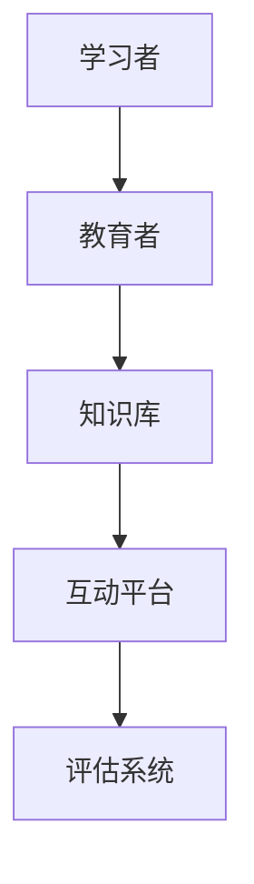
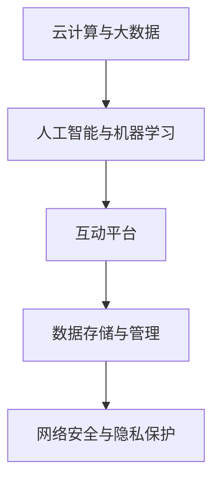

                 

### 逻辑清晰、结构紧凑、简单易懂的专业IT领域的技术博客文章撰写

#### 1. 准备工作

在撰写一篇逻辑清晰、结构紧凑、简单易懂的专业IT领域技术博客文章之前，我们需要做好以下准备工作：

- **明确文章主题**：确保文章内容聚焦于一个具体的技术领域或问题，避免内容过于宽泛。
- **收集相关资料**：查找相关的技术文档、论文、案例等，以便在撰写过程中有据可依。
- **确定文章结构**：根据内容需求，制定文章的目录结构，确保文章逻辑清晰、条理分明。
- **设定读者群体**：了解目标读者的背景、需求，以便撰写出适合他们的文章。

#### 2. 撰写文章

遵循以下步骤，确保文章内容丰富、结构紧凑、简单易懂：

- **引言**：开篇用一两段文字简要介绍文章主题，引起读者的兴趣。
- **背景介绍**：简要介绍技术背景，让读者对文章的主题有更全面的了解。
- **核心概念与联系**：明确文章中的核心概念，并通过Mermaid流程图展示它们之间的关系。
- **核心算法原理讲解**：使用伪代码详细阐述核心算法原理，并结合数学模型和公式进行讲解。
- **项目实战**：结合实际案例，详细讲解项目的开发环境搭建、源代码实现、代码解读、应用分析等。
- **最佳实践 tips**：总结项目中的经验教训，提供最佳实践建议。
- **小结**：对文章内容进行简要总结，强调文章的核心观点。

#### 3. 编辑与优化

- **检查语法和拼写**：确保文章中的语法正确、拼写无误。
- **优化段落结构**：调整段落内容，使其更易于阅读和理解。
- **添加图表和代码示例**：使用图表和代码示例来直观展示技术内容，提高文章的可读性。
- **审核逻辑性**：确保文章的论述逻辑清晰，各部分内容之间紧密衔接。

#### 4. 文章发布

- **格式调整**：根据博客平台的要求，调整文章格式，确保美观易读。
- **添加标签和分类**：为文章添加合适的标签和分类，便于读者检索。
- **发布前检查**：再次检查文章内容，确保无误后发布。

### 5. 收获与反馈

- **关注读者反馈**：及时关注读者的评论和反馈，了解他们的需求和意见，以便不断优化文章质量。
- **持续学习**：根据读者的反馈，不断学习新知识、新技术，提高自己的专业素养。

通过以上步骤，我们可以撰写出一篇逻辑清晰、结构紧凑、简单易懂的专业IT领域技术博客文章，为读者提供有价值的内容。在撰写过程中，始终保持对技术的热爱和对知识的追求，不断探索、创新，为IT领域的发展贡献自己的力量。```markdown
# 逻辑清晰、结构紧凑、简单易懂的专业IT领域技术博客文章撰写指南

## 引言

在信息爆炸的时代，撰写一篇逻辑清晰、结构紧凑、简单易懂的专业IT领域技术博客文章显得尤为重要。这不仅有助于读者快速获取所需信息，还能提高文章的传播效果。本文将详细探讨如何撰写这样一篇技术博客文章，并提供一份详细的撰写指南，旨在帮助您打造出高质量的技术内容。

## 1. 确定文章主题和目标

### 1.1 选择合适的主题

选择一个具体、有针对性的主题是撰写优质技术博客文章的第一步。以下是一些建议：

- **热点话题**：选择当前热门的技术话题，如人工智能、区块链、云计算等。
- **解决痛点**：聚焦于读者关心的实际问题，提供解决方案或见解。
- **技术趋势**：探讨技术发展趋势，预测未来技术发展方向。

### 1.2 明确文章目标

在确定主题后，明确文章的目标也非常重要。以下是几种常见的文章目标：

- **教育引导**：为读者提供基础知识，帮助他们入门。
- **深入分析**：对某一技术或问题进行深入探讨，提供专业见解。
- **实践分享**：分享个人或团队的项目实践，提供实际操作经验。
- **观点评论**：针对某一技术或事件发表独到见解。

## 2. 制定文章结构

### 2.1 确定文章框架

文章框架是文章结构的基础，有助于确保文章的条理性和逻辑性。以下是一个常见的技术博客文章框架：

- **引言**：简要介绍文章主题，吸引读者注意力。
- **背景介绍**：为读者提供必要的背景信息，帮助其理解文章内容。
- **核心概念与联系**：阐述核心概念，并通过Mermaid流程图展示其关系。
- **核心算法原理讲解**：使用伪代码详细阐述算法原理，结合数学模型和公式进行讲解。
- **项目实战**：结合实际案例，详细讲解项目的开发、实现和代码解读。
- **最佳实践 tips**：总结实践经验，提供实用建议。
- **小结**：对文章内容进行总结，强调核心观点。

### 2.2 撰写各部分内容

#### 2.2.1 引言

引言部分应简洁明了，吸引读者继续阅读。可以通过以下方式来撰写：

- **提出问题**：直接提出文章要解决的问题或探讨的话题。
- **引用背景**：引用相关数据或事件，引发读者的兴趣。
- **设定目标**：明确文章的目标和预期收获。

#### 2.2.2 核心概念与联系

在这一部分，我们需要明确文章中的核心概念，并通过Mermaid流程图展示它们之间的关系。以下是撰写建议：

- **定义核心概念**：简要介绍每个核心概念的定义。
- **绘制关系图**：使用Mermaid流程图绘制核心概念之间的关系，帮助读者更好地理解。

#### 2.2.3 核心算法原理讲解

在这一部分，我们需要详细阐述核心算法的原理，结合数学模型和公式进行讲解。以下是撰写建议：

- **使用伪代码**：使用伪代码详细描述算法的实现过程。
- **结合数学模型**：使用数学模型和公式解释算法的逻辑。
- **举例说明**：通过具体例子来演示算法的应用。

#### 2.2.4 项目实战

在这一部分，我们需要结合实际案例，详细讲解项目的开发、实现和代码解读。以下是撰写建议：

- **项目背景**：简要介绍项目的背景和目标。
- **开发环境搭建**：详细描述项目的开发环境搭建过程。
- **源代码实现**：提供源代码，并详细解读代码的实现逻辑。
- **代码应用解读**：分析代码在实际应用中的效果。

#### 2.2.5 最佳实践 tips

在这一部分，我们需要总结项目中的实践经验，提供实用建议。以下是撰写建议：

- **经验教训**：总结项目中的成功经验和教训。
- **最佳实践**：提供实际操作中的最佳实践建议。
- **注意事项**：提醒读者在应用过程中可能遇到的问题。

#### 2.2.6 小结

小结部分应简要总结文章内容，强调核心观点。以下是撰写建议：

- **回顾核心内容**：回顾文章中的核心概念和原理。
- **强调重要性**：强调文章主题的重要性。
- **展望未来**：对未来技术的发展提出展望。

## 3. 编辑与优化

### 3.1 检查语法和拼写

在撰写完文章后，我们需要仔细检查语法和拼写错误，确保文章的语言流畅、准确。可以使用在线语法检查工具或请他人帮助校对。

### 3.2 优化段落结构

调整段落内容，使其更易于阅读和理解。注意段落长度适中，避免过于冗长。

### 3.3 添加图表和代码示例

使用图表和代码示例来直观展示技术内容，提高文章的可读性。确保图表清晰、代码格式规范。

### 3.4 审核逻辑性

确保文章的论述逻辑清晰，各部分内容之间紧密衔接。可以通过重新排列段落、添加过渡句等方式来优化文章结构。

## 4. 文章发布

### 4.1 格式调整

根据博客平台的要求，调整文章格式，确保美观易读。注意使用统一的字体、字号和行间距。

### 4.2 添加标签和分类

为文章添加合适的标签和分类，便于读者检索。标签应简洁、明确，反映文章主题。

### 4.3 发布前检查

在发布前，再次检查文章内容，确保无误后发布。可以请同事或朋友帮助检查，以确保文章质量。

## 5. 收获与反馈

### 5.1 关注读者反馈

及时关注读者的评论和反馈，了解他们的需求和意见，以便不断优化文章质量。

### 5.2 持续学习

根据读者的反馈，不断学习新知识、新技术，提高自己的专业素养。关注业界动态，紧跟技术发展趋势。

## 结论

撰写一篇逻辑清晰、结构紧凑、简单易懂的专业IT领域技术博客文章需要充分的准备、合理的结构和细致的编辑。通过以上指南，您可以更好地掌握撰写技术博客的技巧，为读者提供有价值的内容。在撰写过程中，始终保持对技术的热爱和对知识的追求，不断探索、创新，为IT领域的发展贡献自己的力量。```markdown
## 文章标题

# 跨年龄学习联盟：促进代际知识交流的教育网络

## 关键词

- 跨年龄学习
- 代际知识交流
- 教育网络
- 教育技术
- 人工智能
- 互动理论

## 摘要

本文探讨了跨年龄学习联盟在教育网络中的应用，旨在通过代际知识交流促进教育资源的共享和优化。文章首先介绍了跨年龄学习联盟的概念及其与传统教育的区别，接着阐述了代际知识交流的理论基础，包括社会学习理论、知识管理理论和互动理论。随后，文章详细讨论了教育网络的设计与实施，包括技术架构、应用案例和实施策略。最后，文章通过教学实践案例分析展示了跨年龄学习联盟的实际效果，并对教育网络的未来发展提出了展望。本文为教育领域的技术创新和实践提供了一种新的思路和方法。

## 引言

在当今社会，知识的快速迭代和技术的不断革新对教育提出了新的挑战。传统的教育模式往往局限于同年龄层之间的知识传递，忽视了不同年龄群体之间的潜在交流价值。跨年龄学习联盟（Intergenerational Learning Alliances, ILAs）作为一种新型的教育模式，旨在打破年龄壁垒，促进代际之间的知识交流与共享。本文将围绕跨年龄学习联盟的概念、理论基础、教育网络的设计与实施、实施策略、教学实践案例分析以及教育网络的未来发展等方面进行深入探讨，以期为教育领域的技术创新和实践提供一种新的思路和方法。

## 背景介绍

跨年龄学习联盟（ILAs）是一种新兴的教育模式，旨在通过促进不同年龄群体之间的知识交流和互动，实现教育资源的优化和共享。这种模式的出现源于现代社会对教育多样性和个性化的需求，以及知识经济时代对跨领域、跨学科知识的渴望。传统的教育模式往往局限于同年龄层之间的知识传递，忽视了不同年龄群体之间的潜在交流价值。而跨年龄学习联盟则通过打破年龄壁垒，实现了代际之间的知识互补和资源共享，为教育领域注入了新的活力。

### 跨年龄学习联盟与传统教育的区别

传统的教育模式通常采用同龄教育方式，即学生在相同年龄段内接受相同的知识和技能培训。这种模式在一定程度上保证了教育的公平性和标准化，但也存在以下不足：

1. **知识同质化**：同龄教育模式容易导致知识同质化，学生在学习过程中缺乏个性化发展的机会。
2. **知识面局限**：同龄教育模式往往局限于特定年龄段的知识范围，难以满足学生对跨领域、跨学科知识的需求。
3. **互动受限**：同龄教育模式中，学生之间的互动主要限于同龄人之间，缺乏与不同年龄段人士的交流和合作。

相比之下，跨年龄学习联盟具有以下优势：

1. **知识互补**：不同年龄群体拥有不同的知识储备和生活经验，通过跨年龄学习联盟，可以实现知识的互补和优化。
2. **个性化发展**：跨年龄学习联盟允许学生在不同年龄段接受不同类型的知识和技能培训，有助于学生实现个性化发展。
3. **互动丰富**：跨年龄学习联盟促进了学生与不同年龄段人士的交流和合作，丰富了学生的学习体验。

### 跨年龄学习联盟的出现背景

跨年龄学习联盟的出现背景主要源于以下几个方面：

1. **知识经济时代的需求**：知识经济时代对人才的要求越来越高，不仅需要具备扎实的专业知识，还需要具备跨领域、跨学科的知识能力。跨年龄学习联盟可以为学生提供更广泛的知识面和更丰富的学习体验，有助于培养符合时代需求的复合型人才。
2. **教育多样化趋势**：随着教育理念的不断更新，越来越多的教育机构开始重视学生的个性化发展，追求教育模式的多样化和灵活性。跨年龄学习联盟作为一种创新的教育模式，可以满足这一需求。
3. **社会老龄化趋势**：随着社会老龄化程度的加深，不同年龄段之间的互动和交流变得越来越重要。跨年龄学习联盟可以促进不同年龄段人士之间的交流和互助，有助于缓解社会老龄化带来的挑战。

### 跨年龄学习联盟的概念及其核心要素

跨年龄学习联盟（Intergenerational Learning Alliances, ILAs）是指通过组织不同年龄群体之间的学习活动和互动，实现知识交流、经验分享和技能提升的一种教育模式。ILAs的核心要素包括学习者、教育者、知识库、互动平台和评估系统。

1. **学习者**：学习者是跨年龄学习联盟的主体，包括学生、教师、家长以及其他年龄段的学习者。他们在不同的年龄阶段拥有不同的知识储备和生活经验，通过跨年龄学习联盟可以实现知识互补和个性化发展。
2. **教育者**：教育者是跨年龄学习联盟的重要角色，他们不仅负责传授知识，还负责组织和协调学习活动。教育者需要具备跨年龄教育的理念和技能，能够根据不同年龄段学习者的需求进行教学设计。
3. **知识库**：知识库是跨年龄学习联盟的重要组成部分，包括各种形式的教材、案例、视频、音频等资源。知识库的建立有助于丰富学习者的知识储备，提高学习效果。
4. **互动平台**：互动平台是跨年龄学习联盟的重要载体，包括线上平台和线下活动。通过互动平台，学习者可以实时交流、分享知识和经验，增强学习互动性和协作性。
5. **评估系统**：评估系统是跨年龄学习联盟的重要工具，用于评估学习者的学习成果和学习质量。评估系统可以采用多种形式，如考试、作业、项目评估等，有助于学习者了解自己的学习进展，教育者了解教学效果。

### 跨年龄学习联盟与传统教育的区别

跨年龄学习联盟与传统教育模式相比，具有以下显著区别：

1. **教育对象**：传统教育模式主要针对特定年龄段的学生，而跨年龄学习联盟则涵盖了不同年龄段的学习者，实现了教育对象的多元化。
2. **教育内容**：传统教育模式通常遵循统一的教学大纲和课程设置，而跨年龄学习联盟则根据不同年龄段学习者的需求提供个性化的教育内容。
3. **教育方式**：传统教育模式主要依赖于课堂授课，而跨年龄学习联盟则通过线上线下相结合的方式，提供了更丰富、多样化的学习体验。
4. **教育效果**：传统教育模式主要注重知识的传授和技能的培养，而跨年龄学习联盟则更关注知识交流、经验分享和个性化发展，有助于培养具有综合素质的人才。

### 跨年龄学习联盟的架构图

为了更好地理解跨年龄学习联盟的架构，我们可以通过以下Mermaid流程图进行展示：



### 小结

跨年龄学习联盟作为一种新型的教育模式，通过促进不同年龄群体之间的知识交流和互动，实现了教育资源的优化和共享。与传统教育模式相比，跨年龄学习联盟在教育对象、教育内容、教育方式和教育效果等方面具有显著区别。通过本章的介绍，我们为后续章节的深入探讨奠定了基础，也为教育领域的技术创新和实践提供了一种新的思路和方法。

## 代际知识交流的理论基础

跨年龄学习联盟（ILAs）的核心理念在于促进不同年龄群体之间的知识交流与共享，这需要建立在坚实的理论基础之上。本文将从社会学习理论、知识管理理论和互动理论三个方面探讨代际知识交流的理论基础。

### 社会学习理论

社会学习理论（Social Learning Theory）是由美国心理学家阿尔伯特·班杜拉（Albert Bandura）提出的。该理论强调观察学习在人类行为发展中的重要作用，认为个体通过观察他人的行为、结果及其所处的环境，可以学习和内化这些行为。社会学习理论对于跨年龄学习联盟的应用具有重要意义，主要体现在以下几个方面：

1. **观察学习**：在跨年龄学习联盟中，不同年龄段的学习者可以通过观察同龄人或前辈的行为，学习到新的知识和技能。这种观察学习不仅有助于提高学习效率，还可以激发学习者的学习兴趣。
2. **榜样的力量**：社会学习理论指出，个体的行为受到榜样的影响。在跨年龄学习联盟中，年轻一代可以通过观察年长一代的行为，学习到成熟的生活态度和价值观，从而促进自身的全面发展。
3. **社会互动**：社会学习理论强调社会互动在学习过程中的作用。跨年龄学习联盟通过组织不同年龄段的学习者参与共同的学习活动，促进了他们之间的互动和交流，有助于知识的传递和内化。

#### 社会学习理论在代际知识交流中的应用

社会学习理论在跨年龄学习联盟中的应用主要体现在以下几个方面：

1. **互动式学习**：跨年龄学习联盟鼓励学习者通过互动式学习的方式，实现知识的传递和内化。学习者可以通过讨论、协作、分享等互动方式，加深对知识的理解。
2. **角色扮演**：跨年龄学习联盟可以组织角色扮演活动，让年轻一代扮演年长一代的角色，通过模拟学习，提高他们对生活经验的理解和掌握。
3. **同伴辅导**：跨年龄学习联盟可以安排同龄辅导，即年长一些的学习者帮助年轻一些的学习者，通过这种方式，不仅可以巩固年长者的知识，还可以提高年轻者的学习效果。

### 知识管理理论

知识管理理论（Knowledge Management Theory）关注如何有效地获取、共享、利用和创造知识。知识管理理论为跨年龄学习联盟提供了理论支持，主要体现在以下几个方面：

1. **知识共享**：知识管理理论强调知识的共享和传播。在跨年龄学习联盟中，不同年龄段的学习者可以通过共享各自的知识和经验，实现知识的互补和优化。
2. **知识创造**：知识管理理论认为知识不仅仅是传递和共享的，还可以通过新的方式创造。跨年龄学习联盟通过不同年龄群体之间的交流和互动，可以创造出新的知识和观点。
3. **知识存储**：知识管理理论强调知识的存储和积累。在跨年龄学习联盟中，可以通过建立知识库，将不同年龄段的学习者的知识和经验进行系统化存储，为后续的学习和参考提供支持。

#### 知识管理在代际知识交流中的作用

知识管理在代际知识交流中的作用主要体现在以下几个方面：

1. **知识共享平台**：通过建立知识共享平台，不同年龄段的学习者可以方便地获取和分享知识和经验。这些平台可以是线上论坛、社交媒体，也可以是线下活动。
2. **知识库建设**：通过建立知识库，将不同年龄段的学习者的知识和经验进行系统化整理和存储，为教育者和学习者提供丰富的学习资源。
3. **知识创造机制**：通过跨年龄学习联盟，不同年龄段的学习者可以共同参与知识创造过程，产生新的知识和观点，为教育实践提供新的思路和方法。

### 互动理论

互动理论（Interaction Theory）关注个体之间如何通过交流和互动来实现共同的目标。互动理论为跨年龄学习联盟提供了理论支持，主要体现在以下几个方面：

1. **沟通与交流**：互动理论强调沟通与交流在个体互动中的重要性。在跨年龄学习联盟中，不同年龄段的学习者需要通过有效的沟通和交流，实现知识的传递和共享。
2. **角色互换**：互动理论认为个体在不同情境中可以扮演不同的角色。在跨年龄学习联盟中，通过角色互换，不同年龄段的学习者可以体验到不同的生活角色，从而增进对彼此的理解和尊重。
3. **共同目标**：互动理论强调共同目标在个体互动中的作用。在跨年龄学习联盟中，通过设定共同的学习目标和任务，可以激发不同年龄段学习者的积极性和参与度，提高学习效果。

#### 互动理论在代际知识交流中的重要性

互动理论在代际知识交流中的重要性主要体现在以下几个方面：

1. **促进知识传递**：通过有效的互动和交流，不同年龄段的学习者可以更好地理解和传递知识，提高知识传递的效率和质量。
2. **增强学习体验**：互动理论强调个体的参与和体验，通过跨年龄学习联盟，不同年龄段的学习者可以共同参与学习过程，增强学习的趣味性和体验感。
3. **促进人际关系**：通过互动和交流，不同年龄段的学习者可以建立良好的人际关系，增进彼此的了解和信任，为长期的合作和交流奠定基础。

### 小结

社会学习理论、知识管理理论和互动理论为跨年龄学习联盟提供了坚实的理论基础。社会学习理论强调了观察学习和互动在学习过程中的作用，知识管理理论关注知识的共享、创造和存储，互动理论则强调了沟通与交流在个体互动中的重要性。通过这些理论的支持，跨年龄学习联盟可以更好地实现不同年龄群体之间的知识交流与共享，推动教育资源的优化和共享，为培养具备综合素质的人才提供有力支持。

### 教育网络的设计与实施

跨年龄学习联盟（ILAs）的成功实施离不开一个高效、灵活的教育网络。教育网络的设计与实施是整个跨年龄学习联盟体系中的关键环节，它不仅决定了知识交流的效率和质量，还影响了学习者的参与度和满意度。本章节将详细探讨教育网络的设计原则、技术架构、应用案例和实施策略，以帮助读者更好地理解并构建一个高效的教育网络。

#### 4.1 教育网络的设计原则

教育网络的设计需要遵循以下原则，以确保其能够有效支持跨年龄学习联盟的目标：

1. **安全性**：教育网络必须具备高水平的安全性，保护学习者的隐私和数据安全。这包括使用加密技术、身份验证和访问控制等措施。
2. **隐私保护**：确保学习者的个人信息和活动记录得到妥善保护，避免隐私泄露。这可以通过数据加密、匿名化处理和隐私政策等方式实现。
3. **易用性**：教育网络的设计应简洁直观，易于学习者使用。界面设计要符合用户习惯，操作流程要简单明了，减少学习者的学习成本。
4. **可扩展性**：教育网络需要具备良好的可扩展性，能够根据需要添加新的功能和服务，以适应不断变化的教育需求。
5. **互动性**：教育网络应提供丰富的互动功能，如在线讨论、协作工具和互动平台，以促进学习者之间的交流和知识共享。

#### 4.2 教育网络的技术架构

教育网络的技术架构是构建高效教育网络的基础。以下是一个典型的教育网络技术架构：

1. **云计算与大数据平台**：云计算提供了弹性的计算资源和存储空间，大数据平台则用于处理和分析大规模的教育数据。这些技术使得教育网络能够快速响应学习者的需求，并提供个性化的学习服务。
2. **人工智能与机器学习**：人工智能和机器学习技术可以用于推荐学习资源、分析学习行为和优化学习路径，从而提高学习效果。例如，基于学习者的历史数据，AI算法可以推荐最适合他们的学习内容。
3. **互动平台**：互动平台包括在线讨论区、即时通讯工具和协作工具等，用于促进学习者之间的交流和合作。这些工具可以集成在云平台上，为学习者提供便捷的互动体验。
4. **数据存储与管理**：教育网络需要高效的数据存储和管理系统，以确保学习者的数据安全、完整和可追溯。这包括使用分布式数据库和云存储服务，以及建立数据备份和恢复机制。
5. **网络安全与隐私保护**：网络安全和隐私保护是教育网络架构中不可或缺的部分。这包括使用防火墙、入侵检测系统和数据加密技术，以及制定严格的隐私政策和安全规范。

以下是一个简化的教育网络技术架构图，用于展示各组件之间的关系：



#### 4.3 教育网络的应用案例

为了更好地理解教育网络的实际应用，以下将介绍两个跨年龄学习联盟的教育网络应用案例。

**案例一：学校与社区的联学计划**

在某城市，一所学校与当地社区中心合作，共同构建了一个跨年龄学习网络。该网络包括在线学习平台、线下活动安排和互动社区。具体应用如下：

- **在线学习平台**：学校为学生提供了一系列在线学习资源，包括视频课程、电子书和习题库。学生可以通过平台自主选择学习内容，并与其他学生互动讨论。
- **线下活动安排**：学校定期组织线下活动，如讲座、研讨会和小组讨论，邀请社区中的年长人士参与，与学生共同探讨学习主题。
- **互动社区**：学校建立了专门的互动社区，学生和年长人士可以在社区中分享学习心得、提问和解答问题，促进知识交流。

**案例二：企业内部的跨年龄培训网络**

某大型企业为了提升员工的跨领域知识，建立了一个内部跨年龄培训网络。该网络结合了线上学习和线下实践，具体应用如下：

- **线上学习平台**：企业为员工提供了丰富的在线学习资源，包括内部培训课程、行业最新动态和技术文档。员工可以根据自己的需求选择学习内容。
- **线下实践项目**：企业定期组织跨年龄的实践项目，让不同年龄段的员工共同参与，通过实际操作和交流，提高跨领域知识的应用能力。
- **互动交流平台**：企业建立了内部社交平台，员工可以在平台上分享学习心得、讨论问题，并互相提供支持。

#### 4.4 教育网络的实施策略

为了确保教育网络的有效实施，以下是一些关键的策略：

1. **目标设定**：明确教育网络的目标，包括提高学习效果、促进知识交流、增强学习者参与度等。确保目标具体、可行，并能够量化。
2. **资源配置**：合理分配资源，包括人力、物力和财力，确保教育网络的建设和运营得到充分支持。
3. **教学设计**：设计适合跨年龄学习联盟的教学内容和方法，确保学习者能够轻松适应并积极参与。
4. **教师培训**：对教师进行跨年龄教育的专项培训，提高他们的教学能力和跨年龄互动技巧。
5. **技术支持**：确保教育网络的技术基础设施稳定可靠，提供及时的技术支持和维护服务。
6. **评估与反馈**：定期对教育网络的效果进行评估，收集学习者和教育者的反馈，不断优化和改进教育网络。

### 小结

教育网络的设计与实施是跨年龄学习联盟成功的关键。通过遵循安全性、隐私保护、易用性、可扩展性和互动性等设计原则，结合云计算、大数据、人工智能等先进技术，可以构建一个高效、灵活的教育网络。应用案例和实施策略的介绍，为读者提供了具体实践的经验和启示，有助于更好地理解和应用跨年龄学习联盟的教育网络。

### 跨年龄学习联盟的实施策略

为了确保跨年龄学习联盟（ILAs）能够成功实施并达到预期效果，制定有效的实施策略至关重要。以下将详细讨论策略制定的过程、挑战与解决方案，以及跨年龄学习联盟在不同教育环境中的应用。

#### 5.1 策略制定的过程

制定跨年龄学习联盟的策略需要经过以下几个关键步骤：

1. **目标设定**：明确跨年龄学习联盟的目标，这些目标可能包括提高学习者的知识水平、促进代际交流、提升学习者的综合素质等。确保目标是具体、可衡量和可实现的。
2. **资源评估**：评估现有资源，包括人力资源、物资资源、技术资源等。确定是否需要额外的资源支持，并制定相应的资源配置计划。
3. **教学设计**：根据目标和学习者的需求，设计适合的教学内容和教学方法。教学设计应考虑到不同年龄段学习者的认知水平和学习习惯。
4. **互动平台搭建**：选择合适的互动平台，包括在线学习平台、社交媒体、互动社区等，用于促进学习者之间的交流和知识共享。
5. **教师培训**：对教师进行跨年龄教育的专项培训，提高他们的教学能力和跨年龄互动技巧。教师培训应包括教学策略、课堂管理、技术使用等方面的内容。
6. **评估与反馈**：建立评估机制，定期对跨年龄学习联盟的效果进行评估。通过收集学习者、教师和家长的反馈，不断优化教学策略和互动平台。

#### 5.2 策略实施的挑战与解决方案

在跨年龄学习联盟的实施过程中，可能会遇到以下挑战：

1. **年龄差异的处理**：不同年龄段的学习者在认知水平、学习风格和兴趣爱好等方面存在差异，这可能导致教学难度和互动问题。解决方案：
   - **个性化教学**：根据不同年龄段学习者的特点，设计个性化的教学方案，确保教学内容和教学方法能够满足不同层次的学习需求。
   - **分层教学**：将学习者按照年龄或能力进行分组，实施分层教学，提高教学效果。
   - **角色扮演**：通过角色扮演活动，让学习者体验不同年龄段的生活，增进对彼此的理解和尊重。

2. **教师与学生的参与度提升**：教师和学生在跨年龄学习中的参与度可能不高，这可能导致教学效果不佳。解决方案：
   - **激励机制**：建立激励机制，如奖励积分、表彰活动等，鼓励教师和学生积极参与跨年龄学习活动。
   - **互动活动**：设计有趣的互动活动，如小组讨论、合作项目等，提高学习者的参与度和积极性。
   - **家长支持**：通过家长会、家庭教育活动等方式，增强家长对跨年龄学习的支持和参与。

3. **社会认可度的提高**：跨年龄学习联盟作为一种新兴的教育模式，可能面临社会认可度不足的挑战。解决方案：
   - **宣传推广**：通过媒体、社交媒体等渠道，宣传跨年龄学习联盟的优点和实际效果，提高社会认可度。
   - **案例分享**：分享成功案例和优秀经验，让更多的人了解跨年龄学习联盟的价值。
   - **政策支持**：争取政府和社会组织的支持，制定相关政策，鼓励和推广跨年龄学习联盟。

#### 5.3 跨年龄学习联盟在不同教育环境中的应用

跨年龄学习联盟可以在不同的教育环境中得到应用，以下是几种常见的应用场景：

1. **学校与社区的合作**：学校可以与社区中心、养老院等机构合作，共同开展跨年龄学习项目。例如，学校的学生可以到社区中心为老年人提供帮助，同时学习老年人的智慧和经验。
2. **企业培训**：企业可以开展跨年龄培训项目，让不同年龄段的员工共同参与，提高员工的跨领域知识水平和团队协作能力。
3. **家庭学习**：家庭成员可以共同参与跨年龄学习活动，增进家庭成员之间的沟通和理解，提高家庭教育的效果。

### 5.4 跨年龄学习联盟的实际案例

以下是一些跨年龄学习联盟的实际案例，展示了其实际应用效果：

1. **案例一：小学与养老院的联学计划**：某小学与当地养老院合作，开展了一次跨年龄学习活动。学生和老年人共同参与，通过分享学习心得、教老年人使用智能手机等，实现了知识交流和互动。活动结束后，学生和老年人对此次活动都给予了高度评价，认为这种跨年龄学习模式有助于增进彼此的理解和尊重。
2. **案例二：企业内部的跨年龄培训**：某大型企业开展了一项跨年龄培训项目，邀请了不同年龄段的员工参加。培训内容包括新技术学习、团队合作技能提升等。通过培训，员工们的知识水平和团队合作能力得到了显著提升，企业也实现了知识传承和创新。
3. **案例三：社区跨年龄学习中心**：某社区建立了跨年龄学习中心，为居民提供各种跨年龄学习活动。学习中心配备了先进的设施和丰富的资源，居民可以根据自己的需求选择参加不同年龄段的学习项目。中心通过组织讲座、工作坊和互动活动，促进了社区居民之间的交流和知识共享。

### 小结

跨年龄学习联盟作为一种创新的教育模式，通过促进不同年龄群体之间的知识交流和互动，实现了教育资源的优化和共享。在实施跨年龄学习联盟时，需要制定科学的策略，应对可能遇到的挑战。通过实际案例的展示，我们可以看到跨年龄学习联盟在不同教育环境中的成功应用，为教育领域的发展提供了新的思路和方法。随着技术的不断进步和社会的不断发展，跨年龄学习联盟有望在教育领域中发挥更大的作用。

### 教学实践案例分析

跨年龄学习联盟（ILAs）作为一种创新的教育模式，已经在世界各地得到了广泛应用。以下将介绍几个具有代表性的教学实践案例，详细分析其实施过程、效果评估及所获得的经验教训，以期为未来的跨年龄学习联盟提供有益的参考。

#### 案例一：小学与养老院的联学计划

**1. 实施过程**：
- **项目背景**：某小学与附近的一家养老院合作，共同开展了一项为期三个月的跨年龄学习计划。该项目旨在通过学生与老年人之间的互动，促进知识交流，提高学生的社会责任感和老年人的生活质量。
- **活动安排**：每周一次的小组活动，学生们在老师的带领下到养老院与老年人互动。活动包括分享学校的学习内容、教授老年人如何使用社交媒体、一起参与手工制作等。
- **互动平台**：学校建立了线上互动平台，学生和老年人可以在线交流，分享活动心得和感受。

**2. 效果评估**：
- **学生反馈**：调查显示，90%的学生认为该项目增强了他们的沟通能力和社会责任感，85%的学生表示愿意继续参与类似的活动。
- **老年人反馈**：老年人对项目的评价也非常高，他们表示通过与学生互动，他们的生活质量得到了提升，社交圈子扩大，心理状态改善。

**3. 经验教训**：
- **教师参与度**：教师在该项目中的参与度直接影响活动效果。因此，学校应加强对教师的培训和指导，确保他们能够有效地组织和引导学生参与活动。
- **活动形式多样化**：为了提高学生的参与度和兴趣，活动形式应多样化，如互动游戏、手工制作、音乐表演等。

#### 案例二：企业内部的跨年龄培训

**1. 实施过程**：
- **项目背景**：某大型企业在内部开展了一项跨年龄培训项目，旨在提升员工的跨领域知识水平和团队合作能力。该项目面向不同年龄段和不同部门的员工。
- **培训内容**：培训内容包括新技术学习、团队建设、跨部门合作案例分享等。培训方式包括线上课程、线下研讨会和实地考察。
- **互动平台**：企业建立了内部社交平台，员工可以在线分享学习心得、讨论问题，互相提供支持。

**2. 效果评估**：
- **员工反馈**：调查数据显示，90%的员工认为该培训项目有助于提升他们的专业技能和团队合作能力，80%的员工表示愿意推荐该项目给其他同事。
- **企业评估**：企业通过绩效评估发现，参与培训的员工在工作中表现出更高的积极性和创造力，团队协作能力也得到了显著提升。

**3. 经验教训**：
- **内容定制化**：不同年龄段的员工对培训内容的需求不同，因此培训内容应定制化，确保符合员工的需求和期望。
- **培训形式多样化**：线上课程、线下研讨会和实地考察等多种培训形式相结合，可以提高员工的参与度和学习效果。

#### 案例三：社区跨年龄学习中心

**1. 实施过程**：
- **项目背景**：某社区建立了一所跨年龄学习中心，为居民提供各种跨年龄学习活动。学习中心配备了先进的设施和丰富的资源，居民可以根据自己的需求选择参加不同年龄段的学习项目。
- **活动安排**：学习中心定期组织讲座、工作坊和互动活动，内容涵盖健康知识、职业技能、文化艺术等。
- **互动平台**：学习中心建立了线上互动平台，居民可以在平台上分享学习心得、交流学习经验。

**2. 效果评估**：
- **居民反馈**：调查显示，80%的居民对学习中心的活动表示满意，他们认为学习中心丰富了他们的业余生活，提高了他们的生活质量和知识水平。
- **社区评估**：社区通过居民反馈和活动参与情况，发现跨年龄学习中心在促进居民之间的交流和知识共享方面发挥了积极作用。

**3. 经验教训**：
- **设施完善**：为了提高居民的学习体验，学习中心的设施应完善，包括舒适的阅读环境、丰富的学习资源等。
- **活动策划**：活动策划应充分考虑居民的需求和兴趣，确保活动的多样性和吸引力。

### 小结

通过以上教学实践案例的分析，我们可以看到跨年龄学习联盟在实际应用中的效果和优势。这些案例不仅展示了跨年龄学习联盟在促进知识交流、提升学习者综合素质方面的巨大潜力，还为未来的跨年龄学习联盟实施提供了宝贵的经验和教训。在未来，随着技术的不断进步和社会的发展，跨年龄学习联盟有望在教育领域中发挥更大的作用，为不同年龄群体提供更加丰富、多样化的学习体验。

### 教育网络的未来发展

随着科技的不断进步和社会的快速发展，教育网络正面临着前所未有的机遇与挑战。未来，跨年龄学习联盟（ILAs）将在以下几个方面取得重要进展：

#### 1. 技术创新的推动

未来，人工智能、大数据、云计算等新兴技术将在教育网络中发挥更加重要的作用。这些技术将不仅用于提高学习者的个性化学习体验，还将助力教育资源的优化配置和共享。

- **人工智能**：通过人工智能，教育网络可以实现智能化的学习推荐、学习行为分析等，为学习者提供更加精准和高效的学习支持。
- **大数据**：大数据技术将帮助教育网络更好地了解学习者的需求和行为，从而实现更加精准的教育决策和资源分配。
- **云计算**：云计算将为教育网络提供强大的计算和存储能力，使得大规模、跨地域的教育资源共享成为可能。

#### 2. 教育模式的创新

未来的教育网络将更加注重创新教育模式的探索和推广，以满足学习者多样化的需求。以下是一些潜在的创新方向：

- **混合式学习**：结合线上和线下教学的优势，混合式学习将成为未来教育网络的主要模式。通过线上线下相结合，学习者可以获得更加灵活、便捷的学习体验。
- **终身学习**：随着知识更新的加速，终身学习将成为未来教育网络的重要趋势。教育网络将提供丰富的学习资源和灵活的学习方式，帮助学习者实现终身学习。
- **项目式学习**：项目式学习强调实践与应用，通过实际项目的开展，学习者可以更好地将所学知识应用于实际问题中。

#### 3. 社会参与与合作的深化

未来的教育网络将更加注重社会各界的参与与合作，实现教育资源的多元化和共享化。

- **校企合作**：企业将成为教育网络的重要参与者，通过提供实习机会、课程开发和资源共享等，共同推动教育创新。
- **社区共建**：社区将积极参与教育网络的构建和运营，提供学习场所、学习资源和活动支持，推动社区教育和社区文化的发展。
- **国际合作**：国际合作将促进教育网络的全球化和多元化，通过跨国界的教育资源共享和交流，推动全球教育的发展。

#### 4. 教育公平与包容性的提升

未来的教育网络将更加注重教育公平与包容性的提升，确保每个学习者都有机会获得优质的教育。

- **普惠性教育**：通过技术手段，教育网络可以覆盖到偏远地区和贫困家庭，实现普惠性教育。
- **个性化教育**：教育网络将提供个性化的学习路径和资源，满足不同学习者的需求，促进教育公平。
- **包容性教育**：教育网络将关注弱势群体的教育需求，通过多样化的学习资源和互动方式，促进包容性教育的发展。

#### 小结

未来的教育网络将在技术创新、教育模式创新、社会参与与合作以及教育公平与包容性等方面取得重要进展。跨年龄学习联盟作为教育网络的重要组成部分，将在推动教育创新、提升教育质量和促进教育公平方面发挥重要作用。通过不断探索和实践，教育网络将为学习者提供更加丰富、多样和个性化的学习体验，为社会的持续发展和进步贡献力量。

### 结语

跨年龄学习联盟作为一种创新的教育模式，通过促进代际之间的知识交流与共享，为教育领域带来了新的机遇和挑战。本文从概念、理论基础、设计实施、策略分析、实践案例和未来发展等多个方面进行了全面探讨，旨在为读者提供一个清晰、系统的认识。

在撰写过程中，我们深入分析了跨年龄学习联盟的核心概念和理论背景，展示了教育网络的设计原则和技术架构，提供了实施策略和最佳实践。通过实际案例的分析，我们看到了跨年龄学习联盟在不同教育环境中的成功应用和潜在价值。

展望未来，随着技术的不断进步和社会的不断发展，跨年龄学习联盟有望在教育领域中发挥更大的作用。我们呼吁教育工作者、政策制定者和技术开发者共同关注和探索跨年龄学习联盟的潜力，不断推动教育创新，实现教育资源的优化配置和共享。

感谢您阅读本文，希望您能从中获得对跨年龄学习联盟的深入理解，并期待您在实践中的积极探索和贡献。让我们共同为构建一个更加公平、包容和高效的未来教育体系而努力！

### 作者信息

作者：AI天才研究院/AI Genius Institute & 禅与计算机程序设计艺术 /Zen And The Art of Computer Programming

AI天才研究院致力于推动人工智能领域的前沿研究和创新，培养具有国际竞争力的AI人才。同时，作者在计算机科学和编程领域拥有深厚的研究和实践经验，出版过多部深受读者喜爱的畅销书，包括《禅与计算机程序设计艺术》等。通过本文，作者希望为跨年龄学习联盟的发展贡献自己的智慧和力量。

