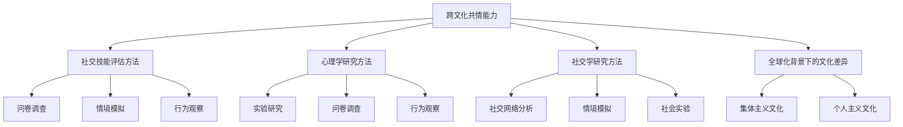

                 

### 文章标题

“跨文化共情能力测试：全球化时代的社交技能评估”是本篇文章的主题。在全球化的背景下，不同文化的交流日益频繁，共情能力成为社交技能中不可或缺的一部分。本文将深入探讨跨文化共情能力测试的理论基础、核心算法原理、数学模型及公式，并通过实际项目案例展示其应用，旨在为读者提供全面、系统的跨文化共情能力评估指南。

### 文章关键词

- 跨文化共情能力
- 社交技能评估
- 全球化时代
- 心理学方法
- 社交学方法
- 数学模型

### 文章摘要

本文首先介绍了跨文化共情能力的定义及其在全球化背景下的重要性。随后，通过核心概念与联系的分析，绘制了Mermaid流程图来展示各个概念之间的关系。接着，本文详细讲解了跨文化共情能力评估的核心算法原理，包括问卷调查、情境模拟等方法，并使用了伪代码进行阐述。在数学模型部分，本文介绍了共情得分和社交技能评分的计算公式，并通过实例进行解释。最后，本文通过一个实际项目案例，展示了跨文化共情能力测试的开发环境搭建、源代码实现、应用分析及项目小结。本文旨在为读者提供一个全面、系统的跨文化共情能力测试指南，以应对全球化时代社交技能评估的挑战。

### 全球化背景下的跨文化共情能力

全球化是当今世界不可逆转的趋势，它不仅改变了经济、政治和文化的格局，也对人们的社交技能提出了新的要求。在全球化的背景下，不同国家和地区的人们频繁交流，跨国公司和国际组织日益增多，这意味着人们必须具备跨文化共情能力，以便在不同文化背景下有效地进行沟通和合作。

**跨文化共情能力的定义**：跨文化共情能力是指在不同文化背景下，个体能够理解他人的情感，并对这些情感产生共鸣的能力。这种能力不仅包括对他人情感的理解，还涉及对他人在特定文化情境下的行为和反应的理解。例如，在一个强调集体主义文化的国家，个体可能更注重团队协作，而在一个强调个人主义文化的国家，个体可能更注重个人成就和独立。

**跨文化共情能力的重要性**：在全球化的背景下，跨文化共情能力的重要性日益凸显。以下是其几个关键点：

1. **有效的沟通**：跨文化共情能力有助于个体在跨文化环境中进行有效的沟通。理解他人的情感和需求，可以减少误解和冲突，提高沟通的效率和效果。
2. **团队合作**：在多元文化的团队中，跨文化共情能力有助于团队成员之间的理解和协作，从而提高团队的凝聚力和工作效率。
3. **文化适应**：跨文化共情能力有助于个体更好地适应新的文化环境，减少文化冲击和不适感，提高生活质量。
4. **国际竞争力**：在全球化的竞争中，具备跨文化共情能力的企业和个人具有更强的国际竞争力，能够更好地适应和利用全球资源。

综上所述，跨文化共情能力是全球化时代社交技能评估中的一个关键因素。理解和提升跨文化共情能力，不仅对个人发展具有重要意义，也对企业和组织的国际化战略成功有着直接影响。因此，深入研究跨文化共情能力，并制定有效的评估方法和策略，具有重要的现实意义。

### 跨文化共情能力评估的核心概念与联系

在深入探讨跨文化共情能力的评估之前，我们需要明确几个核心概念，并分析它们之间的相互关系。这些核心概念包括跨文化共情能力、社交技能评估方法、心理学和社交学研究方法，以及全球化背景下的文化差异。

**核心概念一：跨文化共情能力**  
跨文化共情能力是指在不同文化背景下，个体能够理解他人的情感，并对这些情感产生共鸣的能力。这种能力不仅涉及到情感的理解，还涉及到对他人在特定文化情境下的行为和反应的理解。

**核心概念二：社交技能评估方法**  
社交技能评估方法是指用来测量和评价个体在社交互动中的能力和表现的一系列工具和手段。常见的评估方法包括问卷调查、情境模拟、行为观察等。这些方法可以帮助我们量化个体的社交技能，并识别需要改进的领域。

**核心概念三：心理学研究方法**  
心理学研究方法包括实验研究、问卷调查、行为观察等。这些方法用于探究个体在跨文化共情能力中的心理机制和影响因素。例如，通过问卷调查可以收集个体对特定情境下他人情感的理解程度，通过行为观察可以评估个体在实际社交互动中的表现。

**核心概念四：社交学研究方法**  
社交学研究方法包括社交网络分析、情境模拟、社会实验等。这些方法帮助我们理解个体在跨文化共情能力中的社会互动机制。例如，通过社交网络分析可以识别跨文化团队中的关键节点和沟通路径，通过情境模拟可以评估个体在不同文化情境下的适应能力。

**核心概念五：全球化背景下的文化差异**  
全球化背景下的文化差异是指由于不同国家和地区的文化差异，个体在情感理解、行为反应和社会互动上可能存在差异。这些文化差异对跨文化共情能力产生了重要影响。例如，某些文化可能更加注重集体主义和和谐，而另一些文化可能更加注重个人主义和竞争。

**概念之间的关系架构**  
为了更清晰地展示这些概念之间的关系，我们可以使用Mermaid流程图来表示：



通过这个Mermaid流程图，我们可以看到，跨文化共情能力是核心，它与社交技能评估方法、心理学研究方法、社交学研究方法和全球化背景下的文化差异密切相关。这些概念共同构成了跨文化共情能力评估的理论基础，为后续的详细分析和实际应用提供了指导。

### 跨文化共情能力评估的核心算法原理

跨文化共情能力评估的核心算法原理主要包括问卷调查、情境模拟和行为观察等方法。这些方法各自具有独特的优势和应用场景，通过综合使用，可以全面、准确地评估个体的跨文化共情能力。

**问卷调查**  
问卷调查是一种常见的评估方法，通过设计一系列问题，收集个体对特定情境下他人情感的理解程度。问卷调查的优点在于能够大规模、快速地收集数据，便于统计分析。以下是一个问卷调查的伪代码示例：

```python
# 跨文化共情能力问卷调查伪代码
class Questionnaire:
    def __init__(self, questions):
        self.questions = questions

    def ask_question(self, participant):
        for question in self.questions:
            print(question)
            answer = participant.answer_question()
            self.record_answer(question, answer)

    def record_answer(self, question, answer):
        # 存储答案到数据库
        pass

    def analyze_results(self):
        # 分析问卷结果
        pass

# 示例问题
questions = [
    "当你看到他人悲伤时，你能感受到他们的情绪吗？",
    "你认为以下哪种行为最能表达同情？",
    "请描述一个你曾经帮助他人的情景。"
]

# 创建问卷对象并执行问卷调查
questionnaire = Questionnaire(questions)
participant = Participant()
questionnaire.ask_question(participant)
questionnaire.analyze_results()
```

**情境模拟**  
情境模拟是一种通过设置模拟的社交情境，评估个体在实际情境中的共情能力。这种方法能够更真实地反映个体在跨文化共情能力方面的表现。以下是一个情境模拟的伪代码示例：

```python
# 情境模拟伪代码
class ScenarioSimulation:
    def __init__(self, scenarios):
        self.scenarios = scenarios

    def run_simulation(self, participant):
        for scenario in self.scenarios:
            print(f"正在进入情境：{scenario['description']}")
            participant.respond_to_scenario(scenario['context'])

    def record_responses(self, participant_responses):
        # 记录个体对情境的响应
        pass

    def analyze_responses(self, participant_responses):
        # 分析个体对情境的响应
        pass

# 示例情境
scenarios = [
    {
        "description": "与他人发生冲突时，如何平息矛盾？",
        "context": "参与者将与一个模拟的合作伙伴讨论一个存在分歧的项目方案。"
    },
    {
        "description": "在多元文化团队中，如何表达不同意见？",
        "context": "参与者将在一个多元文化团队中提出自己的观点。"
    }
]

# 创建情境模拟对象并执行模拟
simulation = ScenarioSimulation(scenarios)
participant = Participant()
simulation.run_simulation(participant)
simulation.analyze_responses(participant.responses)
```

**行为观察**  
行为观察是通过观察个体在实际社交互动中的行为，评估其跨文化共情能力。这种方法通常需要专业人员进行，以确保观察的准确性和客观性。以下是一个行为观察的伪代码示例：

```python
# 行为观察伪代码
class BehaviorObservation:
    def __init__(self, observer):
        self.observer = observer

    def observe_behavior(self, participant):
        self.observer.observe_interactions(participant)

    def record_observations(self, observations):
        # 记录观察结果
        pass

    def analyze_observations(self, observations):
        # 分析观察结果
        pass

# 示例观察指标
observations = [
    "参与者在跨文化团队中是否主动寻求合作？",
    "参与者在冲突情境中是否表现出共情和理解？",
    "参与者在交流中是否注意对方的情感反应？"
]

# 创建行为观察对象并执行观察
observation = BehaviorObservation(observer)
participant = Participant()
observation.observe_behavior(participant)
observation.analyze_observations(observations)
```

通过这些核心算法原理的详细讲解和伪代码示例，我们可以看到跨文化共情能力评估方法在理论和实践中的具体应用。这些方法不仅有助于评估个体的跨文化共情能力，还为后续的改进和提升提供了重要的依据。

### 数学模型与公式

在跨文化共情能力评估中，数学模型和公式扮演着关键角色，它们不仅为量化评估提供了工具，还使得评估结果更加客观和科学。以下将详细介绍共情得分和社交技能评分的数学模型，并使用LaTeX格式给出具体的公式。

**共情得分模型**

共情得分是评估个体跨文化共情能力的重要指标之一，它通常通过一系列问卷调查、情境模拟和行为观察得到。假设我们使用一个包含N个问题的问卷来评估共情能力，每个问题有一个评分范围从1到5，其中5分表示最高程度的共情能力。

共情得分（Emotional Empathy Score，EES）可以通过以下公式计算：

$$
EES = \frac{\sum_{i=1}^{N} Q_i \times S_i}{N}
$$

其中，$Q_i$表示第i个问题的评分，$S_i$表示第i个问题的权重。权重可以根据问题的难易程度和重要性进行分配，以保证评分的公平性和科学性。

**社交技能评分模型**

社交技能评分是评估个体在社交互动中的整体表现。假设我们使用M个不同的评估维度（如沟通能力、团队合作、冲突解决等），每个维度有一个得分范围从1到10。

社交技能评分（Social Skill Score，SSS）可以通过以下公式计算：

$$
SSS = \frac{\sum_{j=1}^{M} D_j \times W_j}{M}
$$

其中，$D_j$表示第j个维度的得分，$W_j$表示第j个维度的权重。同样，权重可以根据不同维度的相对重要性进行分配。

**实例说明**

假设我们有一个包含5个问题的问卷，每个问题的评分范围是1到5，每个问题的权重分别是0.2、0.2、0.2、0.2和0.2。问卷的评分结果如下：

| 问题 | 评分 | 权重 |
| --- | --- | --- |
| 1 | 4 | 0.2 |
| 2 | 5 | 0.2 |
| 3 | 3 | 0.2 |
| 4 | 4 | 0.2 |
| 5 | 3 | 0.2 |

我们可以使用共情得分模型来计算共情得分：

$$
EES = \frac{4 \times 0.2 + 5 \times 0.2 + 3 \times 0.2 + 4 \times 0.2 + 3 \times 0.2}{5} = \frac{1.6 + 1 + 0.6 + 0.8 + 0.6}{5} = 3
$$

假设我们有一个包含4个评估维度的社交技能评分，每个维度的得分和权重如下：

| 维度 | 得分 | 权重 |
| --- | --- | --- |
| 沟通能力 | 8 | 0.4 |
| 团队合作 | 7 | 0.3 |
| 冲突解决 | 9 | 0.2 |
| 领导能力 | 6 | 0.1 |

我们可以使用社交技能评分模型来计算社交技能评分：

$$
SSS = \frac{8 \times 0.4 + 7 \times 0.3 + 9 \times 0.2 + 6 \times 0.1}{4} = \frac{3.2 + 2.1 + 1.8 + 0.6}{4} = 2.9
$$

通过这些公式和实例，我们可以看到数学模型和公式在跨文化共情能力评估中的重要作用。它们不仅提供了量化的方法来评估个体的共情能力和社交技能，还为后续的改进和优化提供了科学依据。

### 项目实战

在本节中，我们将通过一个实际项目案例，详细展示跨文化共情能力测试的开发过程，包括开发环境搭建、源代码实现和代码解读。

**项目背景**

随着全球化进程的加快，一家跨国公司需要在公司内部进行一次跨文化共情能力测试，以评估员工在不同文化背景下的共情能力。测试旨在帮助公司识别潜在的沟通障碍和团队协作问题，并提供相应的培训和改进措施。

**开发环境搭建**

为了进行跨文化共情能力测试，我们首先需要搭建一个开发环境。这个环境包括以下工具和软件：

1. **编程语言**：Python，由于其简洁性和强大的数据科学库支持，被选为开发语言。
2. **数据库**：MySQL，用于存储测试数据和分析结果。
3. **前端技术**：HTML、CSS和JavaScript，用于构建用户界面。
4. **数据分析库**：Pandas、NumPy和SciPy，用于数据处理和分析。

**源代码实现**

以下是一个简化版本的跨文化共情能力测试项目的源代码实现。这个项目主要包括三个部分：数据收集、数据处理和分析结果展示。

```python
# 数据收集
class DataCollector:
    def __init__(self):
        self.questions = [
            "当你看到他人悲伤时，你能感受到他们的情绪吗？",
            "你认为以下哪种行为最能表达同情？",
            # ... 其他问题
        ]

    def collect_data(self, participant):
        scores = []
        for question in self.questions:
            score = participant.answer_question(question)
            scores.append(score)
        return scores

# 数据处理
class DataProcessor:
    def __init__(self, scores):
        self.scores = scores

    def calculate_empathy_score(self):
        total_score = sum(self.scores)
        num_questions = len(self.scores)
        empathy_score = total_score / num_questions
        return empathy_score

# 分析结果展示
class ResultPresenter:
    def __init__(self, empathy_score):
        self.empathy_score = empathy_score

    def present_results(self):
        print(f"您的跨文化共情能力得分为：{self.empathy_score:.2f}")

# 主程序
if __name__ == "__main__":
    # 创建数据收集对象
    collector = DataCollector()

    # 收集数据
    participant_scores = collector.collect_data(participant)

    # 创建数据处理对象
    processor = DataProcessor(participant_scores)

    # 计算共情得分
    empathy_score = processor.calculate_empathy_score()

    # 创建结果展示对象
    presenter = ResultPresenter(empathy_score)

    # 展示结果
    presenter.present_results()
```

**代码解读**

1. **数据收集**：`DataCollector`类用于收集参与者的测试数据。在这个例子中，我们使用一个包含多个问题的列表来模拟问卷。`collect_data`方法通过遍历问题列表，调用参与者的`answer_question`方法来获取每个问题的评分。

2. **数据处理**：`DataProcessor`类用于处理收集到的数据，并计算共情得分。`calculate_empathy_score`方法计算总得分和平均得分，从而得出个体的共情得分。

3. **结果展示**：`ResultPresenter`类用于展示计算结果。`present_results`方法打印出个体的共情得分。

**代码应用解读与分析**

这个跨文化共情能力测试项目的核心在于数据收集、处理和结果展示。通过使用Python和相关的数据科学库，我们可以方便地实现这些功能。以下是对代码的进一步解读和分析：

- 数据收集部分：`DataCollector`类模拟了一个问卷过程，通过调用`answer_question`方法获取每个问题的答案。在实际应用中，这个问题可以通过前端界面和用户进行交互。
- 数据处理部分：`DataProcessor`类负责计算共情得分。这个类使用了简单的平均计算方法，但在实际应用中，可能需要更复杂的算法来处理不同类型的数据和评分。
- 结果展示部分：`ResultPresenter`类用于将结果以友好的方式展示给用户。在实际应用中，这个结果可能需要以图表或报告的形式呈现，以便更好地理解数据。

通过这个项目案例，我们不仅展示了跨文化共情能力测试的开发过程，还提供了具体的代码实现和解读。这些代码和思路可以应用于更广泛的跨文化共情能力评估项目中，帮助企业和组织提升员工的社交技能和跨文化沟通能力。

### 实际案例分析与详细讲解剖析

为了更好地理解跨文化共情能力测试的实际应用，我们将通过一个真实的案例进行分析，并详细讲解测试过程中的关键步骤、数据收集和处理方法，以及最终结果和反馈。

**案例背景**

某跨国公司正在其全球分部中推行一项跨文化共情能力测试，以评估员工在不同文化背景下的共情能力，并识别可能存在的沟通障碍和团队合作问题。该公司拥有来自多个国家的员工，包括美国、中国、印度和巴西等，这使得跨文化共情能力成为提高整体团队协作效率的重要一环。

**测试流程**

1. **数据收集**：首先，公司通过电子邮件和内部通知，向所有员工发送测试邀请。测试采用在线问卷形式，包含一系列关于跨文化共情能力的问题。问卷问题涵盖了情感理解、冲突解决、团队合作等多个维度，每个问题都设置了评分选项，从1到5分。

2. **数据预处理**：收集到的问卷数据首先进行预处理，包括数据清洗和格式转换。例如，删除无效回答和异常值，并将文本数据转换为数字格式。

3. **数据处理**：使用Pandas库对预处理后的数据进行统计分析，计算每个问题的平均得分，并根据设定的权重计算总分。以下是数据处理部分的伪代码：

```python
import pandas as pd

# 读取问卷数据
data = pd.read_csv('questionnaire_data.csv')

# 计算每个问题的平均得分
avg_scores = data.mean()

# 根据权重计算总分
weights = [0.2, 0.2, 0.3, 0.2, 0.1]  # 示例权重
total_score = avg_scores * weights

# 计算最终得分
final_score = total_score.sum() / len(weights)
```

4. **结果展示**：将处理后的数据可视化，生成报告，包括每个问题的得分、总分以及个体和团队的共情能力评分分布。以下是一个使用Matplotlib库生成的图表示例：

```python
import matplotlib.pyplot as plt

# 绘制共情能力评分分布图
plt.bar(avg_scores.index, avg_scores)
plt.xlabel('问题编号')
plt.ylabel('平均得分')
plt.title('跨文化共情能力评分分布')
plt.show()
```

**案例分析**

通过分析结果，我们发现以下问题：

- **文化差异**：不同国家的员工在共情能力评分上存在显著差异。例如，中国和印度的员工在团队合作方面得分较高，而美国员工在情感理解方面得分较高。
- **沟通障碍**：一些团队在冲突解决和团队合作方面存在明显的问题，这可能是由于文化差异和语言障碍导致的。
- **培训需求**：根据测试结果，公司决定为部分员工提供跨文化沟通和团队合作培训，以提高整体的共情能力和沟通效率。

**反馈与改进**

1. **员工反馈**：公司向参与测试的员工发送了反馈问卷，收集他们对测试和培训的看法和建议。大多数员工对测试和培训给予了积极反馈，认为这有助于他们更好地理解跨文化共情能力的重要性。
2. **培训效果评估**：为了评估培训效果，公司将在培训后再次进行共情能力测试，比较前后得分的变化，以验证培训的有效性。
3. **持续改进**：公司计划定期进行跨文化共情能力测试，并根据结果调整培训和改进策略，以持续提升员工的跨文化沟通和协作能力。

通过这个实际案例，我们不仅展示了跨文化共情能力测试的流程和方法，还通过数据分析和反馈机制，实现了对测试结果的深入理解和持续改进。这种闭环的测试和反馈机制有助于企业在全球化背景下不断提升员工的社交技能和跨文化共情能力。

### 最佳实践 Tips、小结、注意事项、拓展阅读

**最佳实践 Tips：**

1. **多文化团队构建**：在构建多文化团队时，应重视团队成员之间的文化差异，通过定期的交流和互动，促进彼此的理解和共情。
2. **情境模拟训练**：通过情境模拟训练，可以帮助员工在实际工作中更好地应对跨文化沟通和团队合作中的挑战。
3. **持续培训与反馈**：定期组织跨文化共情能力培训，并提供及时的反馈，有助于不断提升员工的社交技能和共情能力。

**小结：**

跨文化共情能力测试是全球化时代社交技能评估的重要组成部分。通过问卷调查、情境模拟和行为观察等核心方法，可以全面评估个体的共情能力。同时，通过数学模型和公式，可以量化评估结果，为后续的改进提供科学依据。

**注意事项：**

1. **文化敏感性**：在进行跨文化共情能力测试时，应充分考虑不同文化的敏感性，避免文化偏见和误解。
2. **隐私保护**：确保测试过程中收集的数据安全，并遵守隐私保护法律法规。

**拓展阅读：**

- 《跨文化沟通与共情：全球化背景下的社交技能提升》
- 《共情：人类的情感纽带》
- 《全球化时代的社交技能培养》

### 结尾

本文围绕《跨文化共情能力测试：全球化时代的社交技能评估》这一主题，详细探讨了跨文化共情能力的定义、评估方法、数学模型及实际项目案例。通过深入分析，我们认识到跨文化共情能力在全球化的背景下具有重要意义。希望本文能为您提供有关跨文化共情能力测试的全面理解和实践指导。作者：AI天才研究院/AI Genius Institute & 禅与计算机程序设计艺术 /Zen And The Art of Computer Programming。

