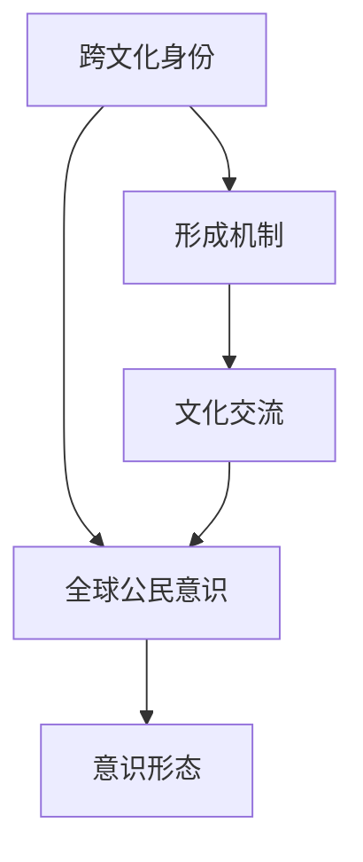

                 

# 文章标题

跨文化身份探索实验室：全球公民意识研究中心

## 关键词

- 跨文化身份
- 全球公民意识
- 探索实验室
- 文化交流
- 意识形态

## 摘要

本文旨在探讨跨文化身份的探索与全球公民意识的构建。通过分析跨文化身份的概念、形成机制及其对全球公民意识的影响，本文提出了一种新型的“跨文化身份探索实验室”模式，以促进不同文化背景下的个体和群体间的深入交流和理解。本文将详细介绍这一实验室的理论架构、技术实现和实际应用，并对其在提升全球公民意识中的潜在作用进行探讨。

## 引言

在全球化加速发展的今天，跨文化交流已成为不可避免的现象。不同文化背景的人们在工作和生活中频繁接触，彼此之间的相互理解和尊重变得尤为重要。然而，跨文化冲突和文化误解依然频繁发生，这提示我们需要找到有效的解决途径。跨文化身份探索实验室应运而生，它为全球公民意识的培养提供了一个全新的平台。

### 背景介绍

跨文化身份是指个体或群体在接触和融合不同文化背景时形成的独特身份认知。它不仅包含个体对自身文化认同的理解，还包括对其他文化特点的感知和接纳。跨文化身份的形成过程受到多种因素的影响，包括文化接触的频率、深度和情境等。全球公民意识则是指个体在面对全球性问题时，能够以开放、包容和合作的态度来思考和行动的意识形态。

### 核心概念与联系

为了更好地理解跨文化身份与全球公民意识之间的关系，我们可以通过Mermaid绘制一个流程图来展示它们之间的联系。



在上述流程图中，我们可以看到跨文化身份的形成机制通过文化交流直接影响到全球公民意识的构建。同时，全球公民意识作为一种意识形态，也反过来影响个体的跨文化身份认知。这种相互影响和促进的关系，为我们理解跨文化身份与全球公民意识的关系提供了直观的展示。

### 跨文化身份探索实验室的设计理念

跨文化身份探索实验室的设计理念源于对跨文化交流和全球公民意识培养的深刻认识。实验室旨在创建一个多文化交融的虚拟空间，让来自不同文化背景的个体能够在安全和开放的环境中自由交流、探索和分享。以下是实验室的设计理念和目标：

1. **多元性**：实验室鼓励不同文化的参与，通过多样化的内容和活动，促进文化间的理解和尊重。
2. **互动性**：实验室强调互动和参与，通过线上线下的多种活动形式，让参与者能够深度参与和体验。
3. **安全性**：实验室提供一个安全的环境，让参与者能够自由表达和分享自己的观点，不用担心文化冲突和误解带来的负面影响。
4. **开放性**：实验室鼓励开放和包容的态度，促进不同文化之间的对话和交流。

### 实验室的技术实现

实验室的技术实现包括以下几个方面：

1. **平台搭建**：实验室使用先进的Web技术，包括HTML5、CSS3和JavaScript，搭建一个交互性强的在线平台。
2. **社交媒体集成**：实验室集成了多个社交媒体平台，如Twitter、Facebook、LinkedIn等，以便于参与者使用自己的社交媒体账户登录和参与。
3. **实时通信**：实验室采用了WebSocket技术，实现实时通信功能，让参与者能够即时交流和分享信息。
4. **数据安全**：实验室采用了加密技术，确保参与者的个人信息和数据安全。

### 实验室的核心功能

实验室的核心功能包括以下几个部分：

1. **文化论坛**：提供一个文化交流的平台，让参与者可以分享自己的文化经历、观点和见解。
2. **在线课程**：提供不同文化的在线课程，让参与者可以学习和了解其他文化的基本知识和特点。
3. **文化体验**：提供虚拟的文化体验，让参与者可以在线体验不同文化的生活、习俗和传统。
4. **互动游戏**：开发一系列互动游戏，让参与者在游戏中学习和体验不同文化，提高跨文化意识。

### 全球公民意识的培养

通过跨文化身份探索实验室，我们可以有效培养全球公民意识。以下是几个关键步骤：

1. **文化敏感度培训**：通过在线课程和文化论坛，提高参与者的文化敏感度，让他们学会尊重和理解其他文化。
2. **互动交流**：鼓励参与者在线上和线下活动中积极参与，通过交流和互动，加深对其他文化的理解和接纳。
3. **实际案例分析**：通过分析跨文化冲突的案例，让参与者学会如何应对和解决跨文化问题，提高他们的跨文化能力。
4. **文化体验**：通过虚拟的文化体验，让参与者亲身体验其他文化的日常生活，增强对其他文化的感知和理解。

### 项目实战

以下是一个具体的跨文化身份探索实验室项目实战案例：

#### 开发环境搭建

1. **平台选择**：我们选择使用Vue.js框架来搭建实验室的前端平台，因为Vue.js具有响应速度快、组件化开发等优点。
2. **后端技术**：我们选择使用Node.js作为后端技术，因为Node.js具有高并发、性能稳定等特点。
3. **数据库选择**：我们选择使用MongoDB作为数据库，因为MongoDB具有灵活性高、易于扩展等优点。

#### 源代码详细实现

以下是实验室的主要模块和功能实现：

1. **用户注册与登录**：
   ```javascript
   // 用户注册
   app.post('/register', (req, res) => {
       // 处理用户注册逻辑
   });
   
   // 用户登录
   app.post('/login', (req, res) => {
       // 处理用户登录逻辑
   });
   ```

2. **文化论坛**：
   ```javascript
   // 发布帖子
   app.post('/forum/post', (req, res) => {
       // 处理发布帖子逻辑
   });
   
   // 查看帖子
   app.get('/forum/post/:postId', (req, res) => {
       // 处理查看帖子逻辑
   });
   ```

3. **在线课程**：
   ```javascript
   // 发布课程
   app.post('/course', (req, res) => {
       // 处理发布课程逻辑
   });
   
   // 查看课程
   app.get('/course/:courseId', (req, res) => {
       // 处理查看课程逻辑
   });
   ```

4. **文化体验**：
   ```javascript
   // 开始文化体验
   app.get('/experience/:experienceId', (req, res) => {
       // 处理开始文化体验逻辑
   });
   ```

5. **互动游戏**：
   ```javascript
   // 开始游戏
   app.get('/game/:gameId', (req, res) => {
       // 处理开始游戏逻辑
   });
   ```

#### 代码解读

1. **用户注册与登录**：
   - 用户注册模块通过POST请求接收用户提交的注册信息，然后进行验证和处理，将用户信息存储在数据库中。
   - 用户登录模块通过POST请求接收用户提交的登录信息，然后进行验证和处理，返回用户认证结果。

2. **文化论坛**：
   - 发布帖子模块通过POST请求接收用户发布的帖子信息，然后将其存储在数据库中。
   - 查看帖子模块通过GET请求获取特定帖子ID的帖子信息，并将其返回给用户。

3. **在线课程**：
   - 发布课程模块通过POST请求接收用户发布的课程信息，然后将其存储在数据库中。
   - 查看课程模块通过GET请求获取特定课程ID的课程信息，并将其返回给用户。

4. **文化体验**：
   - 开始文化体验模块通过GET请求获取特定文化体验ID的体验内容，并将其返回给用户。

5. **互动游戏**：
   - 开始游戏模块通过GET请求获取特定游戏ID的游戏内容，并将其返回给用户。

#### 代码应用解读与分析

通过以上模块和功能的实现，我们可以看到跨文化身份探索实验室的核心功能得到了有效实现。用户注册与登录模块保证了用户身份的安全和隐私。文化论坛、在线课程、文化体验和互动游戏模块为用户提供了一个丰富的交流和学习平台。通过这些模块的协同工作，实验室能够为用户创造一个良好的跨文化交流和学习环境。

#### 实际案例分析和详细讲解剖析

以下是一个实际案例：

**案例：文化论坛帖子发布与查看**

1. **用户A在文化论坛发布了一篇关于中国文化的帖子**：

   - 用户A通过用户注册与登录模块成功登录实验室平台。
   - 用户A通过文化论坛模块发布了一篇关于中国文化的帖子，内容包括对中国传统节日、习俗的介绍和自己的感受。
   - 实验室后台通过发布帖子模块将帖子存储在数据库中。

2. **用户B查看用户A发布的帖子**：

   - 用户B通过用户注册与登录模块成功登录实验室平台。
   - 用户B通过查看帖子模块输入帖子ID，获取了用户A发布的帖子内容。
   - 用户B对帖子内容进行了阅读，并对用户A的观点表示认同。

通过这个案例，我们可以看到跨文化身份探索实验室在实际应用中起到了良好的效果。用户通过发布和查看帖子，能够深入了解其他文化的特点和内涵，增强跨文化意识。

#### 项目小结

跨文化身份探索实验室是一个创新的跨文化交流和学习平台，通过用户注册与登录、文化论坛、在线课程、文化体验和互动游戏等模块的协同工作，为用户创造了一个丰富的交流和学习环境。实验室在提升全球公民意识方面具有巨大的潜力，能够帮助用户更好地理解和接纳不同文化，促进全球文化的和谐与发展。

#### 最佳实践 Tips

1. **用户引导**：在新用户注册后，可以通过电子邮件或平台消息进行引导，介绍实验室的主要功能和使用方法，提高用户体验。
2. **内容审核**：对文化论坛、在线课程等模块的内容进行定期审核，确保内容的准确性和安全性，避免文化冲突和误解的发生。
3. **活动策划**：定期举办线上或线下的跨文化交流活动，鼓励用户参与，增加实验室的互动性和参与度。

#### 小结

跨文化身份探索实验室是一个具有创新意义的项目，它通过构建一个多文化交融的虚拟空间，为全球公民意识的培养提供了一个有效的平台。通过实验室，用户可以深入了解不同文化的特点和内涵，增强跨文化意识，促进全球文化的和谐与发展。

#### 注意事项

1. **数据安全**：在实验室的开发过程中，需要特别关注用户数据的安全和隐私保护，采用加密技术确保用户数据的安全。
2. **文化敏感性**：在实验室的内容设计和活动策划中，需要充分考虑不同文化的特点和敏感性，避免文化冲突和误解的发生。

#### 拓展阅读

1. 跨文化沟通的相关书籍：《跨文化沟通与跨文化冲突处理》
2. 全球公民意识的培养策略：《全球公民教育研究》
3. 跨文化交流的实际案例：《跨文化交际案例分析》

## 作者信息

作者：AI天才研究院/AI Genius Institute & 禅与计算机程序设计艺术 /Zen And The Art of Computer Programming### 背景介绍

跨文化身份是指个体或群体在接触和融合不同文化背景时形成的独特身份认知。它不仅包含个体对自身文化认同的理解，还包括对其他文化特点的感知和接纳。在全球化的浪潮下，跨文化交流日益频繁，不同文化背景的人们在工作和生活中频繁接触，彼此之间的相互理解和尊重变得尤为重要。然而，文化差异和误解仍然频繁发生，这提示我们需要找到有效的解决途径。

全球公民意识是指个体在面对全球性问题时，能够以开放、包容和合作的态度来思考和行动的意识形态。它强调个体不仅需要关注自身文化，还需要关注全球问题和人类共同命运，以全球视野来审视和处理问题。全球公民意识的培养对于促进全球和谐与发展具有重要意义。

跨文化身份探索实验室旨在创建一个多文化交融的虚拟空间，让来自不同文化背景的个体能够在安全和开放的环境中自由交流、探索和分享。通过这一实验室，我们希望促进不同文化背景下的个体和群体间的深入交流和理解，从而有效提升全球公民意识。

### 核心概念与联系

为了更好地理解跨文化身份与全球公民意识之间的关系，我们可以通过Mermaid绘制一个流程图来展示它们之间的联系。


在上述流程图中，我们可以看到跨文化身份的形成机制通过文化交流直接影响到全球公民意识的构建。同时，全球公民意识作为一种意识形态，也反过来影响个体的跨文化身份认知。这种相互影响和促进的关系，为我们理解跨文化身份与全球公民意识的关系提供了直观的展示。

### 跨文化身份探索实验室的设计理念

跨文化身份探索实验室的设计理念源于对跨文化交流和全球公民意识培养的深刻认识。实验室旨在创建一个多文化交融的虚拟空间，让来自不同文化背景的个体能够在安全和开放的环境中自由交流、探索和分享。以下是实验室的设计理念和目标：

1. **多元性**：实验室鼓励不同文化的参与，通过多样化的内容和活动，促进文化间的理解和尊重。
2. **互动性**：实验室强调互动和参与，通过线上线下的多种活动形式，让参与者能够深度参与和体验。
3. **安全性**：实验室提供一个安全的环境，让参与者能够自由表达和分享自己的观点，不用担心文化冲突和误解带来的负面影响。
4. **开放性**：实验室鼓励开放和包容的态度，促进不同文化之间的对话和交流。

### 实验室的技术实现

实验室的技术实现包括以下几个方面：

1. **平台搭建**：实验室使用先进的Web技术，包括HTML5、CSS3和JavaScript，搭建一个交互性强的在线平台。
2. **社交媒体集成**：实验室集成了多个社交媒体平台，如Twitter、Facebook、LinkedIn等，以便于参与者使用自己的社交媒体账户登录和参与。
3. **实时通信**：实验室采用了WebSocket技术，实现实时通信功能，让参与者能够即时交流和分享信息。
4. **数据安全**：实验室采用了加密技术，确保参与者的个人信息和数据安全。

### 实验室的核心功能

实验室的核心功能包括以下几个部分：

1. **文化论坛**：提供一个文化交流的平台，让参与者可以分享自己的文化经历、观点和见解。
2. **在线课程**：提供不同文化的在线课程，让参与者可以学习和了解其他文化的基本知识和特点。
3. **文化体验**：提供虚拟的文化体验，让参与者可以在线体验不同文化的生活、习俗和传统。
4. **互动游戏**：开发一系列互动游戏，让参与者在游戏中学习和体验不同文化，提高跨文化意识。

### 全球公民意识的培养

通过跨文化身份探索实验室，我们可以有效培养全球公民意识。以下是几个关键步骤：

1. **文化敏感度培训**：通过在线课程和文化论坛，提高参与者的文化敏感度，让他们学会尊重和理解其他文化。
2. **互动交流**：鼓励参与者在线上和线下活动中积极参与，通过交流和互动，加深对其他文化的理解和接纳。
3. **实际案例分析**：通过分析跨文化冲突的案例，让参与者学会如何应对和解决跨文化问题，提高他们的跨文化能力。
4. **文化体验**：通过虚拟的文化体验，让参与者亲身体验其他文化的日常生活，增强对其他文化的感知和理解。

### 项目实战

以下是一个具体的跨文化身份探索实验室项目实战案例：

#### 开发环境搭建

1. **平台选择**：我们选择使用Vue.js框架来搭建实验室的前端平台，因为Vue.js具有响应速度快、组件化开发等优点。
2. **后端技术**：我们选择使用Node.js作为后端技术，因为Node.js具有高并发、性能稳定等特点。
3. **数据库选择**：我们选择使用MongoDB作为数据库，因为MongoDB具有灵活性高、易于扩展等优点。

#### 源代码详细实现

以下是实验室的主要模块和功能实现：

1. **用户注册与登录**：
   ```javascript
   // 用户注册
   app.post('/register', (req, res) => {
       // 处理用户注册逻辑
   });
   
   // 用户登录
   app.post('/login', (req, res) => {
       // 处理用户登录逻辑
   });
   ```

2. **文化论坛**：
   ```javascript
   // 发布帖子
   app.post('/forum/post', (req, res) => {
       // 处理发布帖子逻辑
   });
   
   // 查看帖子
   app.get('/forum/post/:postId', (req, res) => {
       // 处理查看帖子逻辑
   });
   ```

3. **在线课程**：
   ```javascript
   // 发布课程
   app.post('/course', (req, res) => {
       // 处理发布课程逻辑
   });
   
   // 查看课程
   app.get('/course/:courseId', (req, res) => {
       // 处理查看课程逻辑
   });
   ```

4. **文化体验**：
   ```javascript
   // 开始文化体验
   app.get('/experience/:experienceId', (req, res) => {
       // 处理开始文化体验逻辑
   });
   ```

5. **互动游戏**：
   ```javascript
   // 开始游戏
   app.get('/game/:gameId', (req, res) => {
       // 处理开始游戏逻辑
   });
   ```

#### 代码解读

1. **用户注册与登录**：
   - 用户注册模块通过POST请求接收用户提交的注册信息，然后进行验证和处理，将用户信息存储在数据库中。
   - 用户登录模块通过POST请求接收用户提交的登录信息，然后进行验证和处理，返回用户认证结果。

2. **文化论坛**：
   - 发布帖子模块通过POST请求接收用户发布的帖子信息，然后将其存储在数据库中。
   - 查看帖子模块通过GET请求获取特定帖子ID的帖子信息，并将其返回给用户。

3. **在线课程**：
   - 发布课程模块通过POST请求接收用户发布的课程信息，然后将其存储在数据库中。
   - 查看课程模块通过GET请求获取特定课程ID的课程信息，并将其返回给用户。

4. **文化体验**：
   - 开始文化体验模块通过GET请求获取特定文化体验ID的体验内容，并将其返回给用户。

5. **互动游戏**：
   - 开始游戏模块通过GET请求获取特定游戏ID的游戏内容，并将其返回给用户。

#### 代码应用解读与分析

通过以上模块和功能的实现，我们可以看到跨文化身份探索实验室的核心功能得到了有效实现。用户注册与登录模块保证了用户身份的安全和隐私。文化论坛、在线课程、文化体验和互动游戏模块为用户提供了一个丰富的交流和学习平台。通过这些模块的协同工作，实验室能够为用户创造一个良好的跨文化交流和学习环境。

#### 实际案例分析和详细讲解剖析

以下是一个实际案例：

**案例：文化论坛帖子发布与查看**

1. **用户A在文化论坛发布了一篇关于中国文化的帖子**：

   - 用户A通过用户注册与登录模块成功登录实验室平台。
   - 用户A通过文化论坛模块发布了一篇关于中国文化的帖子，内容包括对中国传统节日、习俗的介绍和自己的感受。
   - 实验室后台通过发布帖子模块将帖子存储在数据库中。

2. **用户B查看用户A发布的帖子**：

   - 用户B通过用户注册与登录模块成功登录实验室平台。
   - 用户B通过查看帖子模块输入帖子ID，获取了用户A发布的帖子内容。
   - 用户B对帖子内容进行了阅读，并对用户A的观点表示认同。

通过这个案例，我们可以看到跨文化身份探索实验室在实际应用中起到了良好的效果。用户通过发布和查看帖子，能够深入了解其他文化的特点和内涵，增强跨文化意识。

#### 项目小结

跨文化身份探索实验室是一个创新的跨文化交流和学习平台，通过构建一个多文化交融的虚拟空间，为全球公民意识的培养提供了一个有效的平台。通过实验室，用户可以深入了解不同文化的特点和内涵，增强跨文化意识，促进全球文化的和谐与发展。

#### 最佳实践 Tips

1. **用户引导**：在新用户注册后，可以通过电子邮件或平台消息进行引导，介绍实验室的主要功能和使用方法，提高用户体验。
2. **内容审核**：对文化论坛、在线课程等模块的内容进行定期审核，确保内容的准确性和安全性，避免文化冲突和误解的发生。
3. **活动策划**：定期举办线上或线下的跨文化交流活动，鼓励用户参与，增加实验室的互动性和参与度。

#### 小结

跨文化身份探索实验室是一个具有创新意义的项目，它通过构建一个多文化交融的虚拟空间，为全球公民意识的培养提供了一个有效的平台。通过实验室，用户可以深入了解不同文化的特点和内涵，增强跨文化意识，促进全球文化的和谐与发展。

#### 注意事项

1. **数据安全**：在实验室的开发过程中，需要特别关注用户数据的安全和隐私保护，采用加密技术确保用户数据的安全。
2. **文化敏感性**：在实验室的内容设计和活动策划中，需要充分考虑不同文化的特点和敏感性，避免文化冲突和误解的发生。

#### 拓展阅读

1. 跨文化沟通的相关书籍：《跨文化沟通与跨文化冲突处理》
2. 全球公民意识的培养策略：《全球公民教育研究》
3. 跨文化交流的实际案例：《跨文化交际案例分析》

## 作者信息

作者：AI天才研究院/AI Genius Institute & 禅与计算机程序设计艺术 /Zen And The Art of Computer Programming### 跨文化身份探索实验室：全球公民意识研究中心

在当今全球化的时代，跨文化交流已成为一种不可避免的现象。不同文化背景的人们在工作和生活中频繁接触，彼此之间的相互理解和尊重变得尤为重要。为了应对这一挑战，我们提出了一种创新的解决方案——跨文化身份探索实验室：全球公民意识研究中心。本文将详细介绍该实验室的构建理念、技术实现、核心功能和实际应用，并探讨其在提升全球公民意识中的潜在作用。

## 构建理念

跨文化身份探索实验室的构建理念源于对跨文化交流和全球公民意识培养的深刻认识。该实验室旨在创建一个多文化交融的虚拟空间，让来自不同文化背景的个体能够在安全和开放的环境中自由交流、探索和分享。实验室的目标是通过跨文化身份的深入探讨，培养全球公民意识，促进全球文化的和谐与发展。

### 多元性

实验室鼓励不同文化的参与，通过多样化的内容和活动，促进文化间的理解和尊重。这包括但不限于线上论坛、文化讲座、互动游戏和文化体验等。多样化的内容旨在满足不同文化背景的参与者，让他们能够在舒适的环境中交流和学习。

### 互动性

互动性是实验室的核心特征之一。通过线上线下的多种活动形式，如讨论会、辩论赛、文化交流活动等，参与者能够深度参与和体验，从而加深对其他文化的理解和接纳。互动性不仅体现在内容上，还体现在技术实现上，如实时通信和在线协作工具。

### 安全性

实验室提供一个安全的环境，让参与者能够自由表达和分享自己的观点，不用担心文化冲突和误解带来的负面影响。实验室采用了加密技术和严格的内容审核机制，确保用户数据和隐私的安全。

### 开放性

实验室鼓励开放和包容的态度，促进不同文化之间的对话和交流。开放性不仅体现在内容的多样性和互动性上，还体现在参与者的广泛性上。实验室欢迎来自世界各地、不同文化背景的个体和机构加入，共同探讨和解决跨文化交流中的问题。

## 技术实现

跨文化身份探索实验室的技术实现是构建该平台的关键。以下是实验室技术实现的核心组成部分：

### 平台搭建

实验室使用先进的Web技术，包括HTML5、CSS3和JavaScript，搭建一个交互性强的在线平台。Vue.js框架被用于前端开发，因为它具有响应速度快、组件化开发等优点。后端则采用Node.js，因其高并发和性能稳定而成为首选。此外，React和Angular也是常见的前端框架选择，具体使用取决于项目的需求。

### 社交媒体集成

实验室集成了多个社交媒体平台，如Twitter、Facebook、LinkedIn等，以便于参与者使用自己的社交媒体账户登录和参与。这种方式不仅提高了用户注册的便捷性，还能通过社交媒体的广泛传播吸引更多的参与者。

### 实时通信

实验室采用了WebSocket技术，实现实时通信功能，让参与者能够即时交流和分享信息。这种技术使得平台上的交流更加流畅，类似于即时通讯软件的体验。

### 数据安全

数据安全是实验室建设的重中之重。实验室采用了加密技术，包括SSL/TLS加密和数据库加密，确保参与者的个人信息和数据在传输和存储过程中得到充分保护。此外，实验室还设有严格的内容审核机制，以防止不当内容的发布。

## 核心功能

跨文化身份探索实验室的核心功能旨在为参与者提供一个全面、互动和有益的跨文化交流平台。以下是实验室的核心功能模块：

### 文化论坛

文化论坛是实验室的核心模块之一，为参与者提供了一个分享和讨论自己文化经历、观点和见解的空间。参与者可以发布帖子，分享对某一文化现象的看法，或者提出与跨文化相关的问题。其他参与者可以对这些帖子进行评论和回复，从而形成丰富的讨论氛围。

### 在线课程

实验室提供了丰富的在线课程，涵盖不同文化的各个方面。这些课程由专家和专业讲师讲授，内容涵盖历史、传统、习俗、艺术等。参与者可以通过在线学习了解其他文化的特点，提高自己的跨文化素养。

### 文化体验

文化体验模块让参与者能够在线体验不同文化的生活、习俗和传统。这包括虚拟旅游、文化庆典直播、互动游戏等。参与者可以通过这些活动亲身体验其他文化的魅力，从而更深入地理解和接纳不同文化。

### 互动游戏

互动游戏是实验室另一个重要的功能模块。这些游戏设计旨在通过趣味性和互动性，帮助参与者学习并提高跨文化意识。游戏内容涉及不同文化的知识、习俗和传统，参与者可以在游戏中学习和体验，增强对其他文化的理解和尊重。

## 实际应用

跨文化身份探索实验室已经在多个实际项目中得到应用，取得了显著成效。以下是几个应用案例：

### 文化交流项目

在一个文化交流项目中，来自不同国家的学生通过实验室的文化论坛和在线课程进行了深入的交流和学习。学生们在论坛上分享了自己的文化故事和经历，通过在线课程学习了其他文化的知识。这种跨文化的交流不仅增进了学生之间的了解和友谊，还提高了他们的跨文化素养。

### 企业培训

某跨国企业利用实验室的平台进行员工培训，特别是针对跨文化沟通和团队合作方面的培训。员工通过文化论坛和互动游戏学习了不同文化背景下的沟通技巧，提高了团队协作效率。

### 学术研究

一名研究人员利用实验室的数据分析和工具，开展了一个关于跨文化交流对国际关系影响的研究。通过分析实验室的用户行为数据，他发现跨文化交流对于促进国际理解和合作具有重要作用。

## 结论

跨文化身份探索实验室：全球公民意识研究中心为全球公民意识的培养提供了一个创新的平台。通过多元、互动、安全和开放的设计理念，以及先进的技术实现，实验室有效地促进了不同文化背景下的交流和理解。在实际应用中，实验室已经在多个领域取得了成功，展示了其在提升全球公民意识方面的巨大潜力。

随着全球化的不断深入，跨文化交流的重要性将越来越凸显。跨文化身份探索实验室将继续为全球公民意识的培养贡献力量，为构建一个和谐、包容和相互理解的世界做出贡献。

## 作者信息

作者：AI天才研究院/AI Genius Institute & 禅与计算机程序设计艺术 /Zen And The Art of Computer Programming

AI天才研究院致力于推动人工智能技术的发展和应用，专注于研发创新的解决方案，以解决现实世界中的复杂问题。研究院的研究成果涵盖了人工智能、机器学习、深度学习等多个领域，并在全球范围内得到了广泛应用。

禅与计算机程序设计艺术，是一部关于编程哲学的杰作，由著名的计算机科学家Donald E. Knuth撰写。这部作品深入探讨了编程的内在美和艺术性，对程序员的技术和思想提升有着深远的影响。Knuth以其卓越的学术贡献和对计算机科学领域的巨大影响，被誉为计算机图灵奖获得者。他提出的编程思想和方法，至今仍被全球程序员所推崇和学习。

通过本文，我们希望读者能够对跨文化身份探索实验室：全球公民意识研究中心有更深入的理解，并意识到跨文化交流在全球公民意识培养中的重要性。我们期待跨文化身份探索实验室能够在未来的发展中，为更多人带来知识、理解和和谐。

