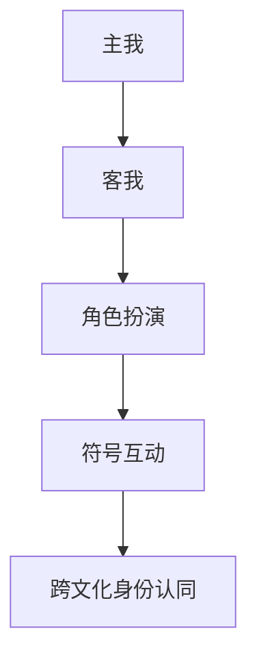
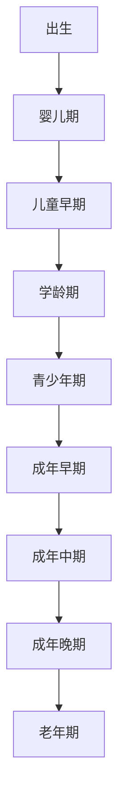
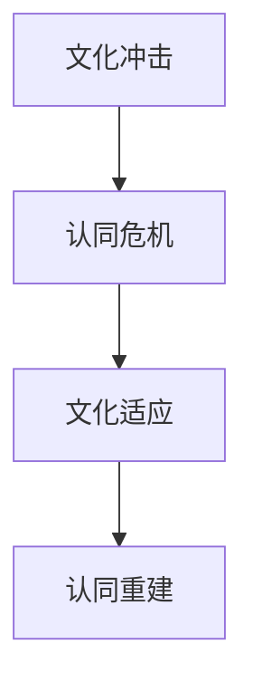

                 

### 文章标题：跨文化身份认同：全球化背景下的自我定位

#### 关键词：跨文化身份认同、全球化、身份认同问题、自我定位、心理理论、文化多样性

#### 摘要：
在全球化日益加深的今天，跨文化身份认同问题显得尤为重要。本文旨在探讨全球化背景下跨文化身份认同的内涵、挑战及应对策略。首先，我们将回顾身份认同理论的发展，特别是泰勒、霍布斯鲍姆和阿隆等学者的观点。接着，本文将分析全球化对个体和群体身份认同的影响，以及由此引发的跨文化冲突和认同危机。在核心部分，我们将探讨自我认知与身份认同的关系，并阐述跨文化适应与自我定位的策略。最后，本文将探讨跨文化身份认同在教育和政策方面的实践，并总结全文，展望未来研究方向。

---

# 引言

在全球化背景下，人们的生活和工作环境变得越来越多元化。这种文化交融不仅促进了国际间的交流与合作，也带来了身份认同的困惑。跨文化身份认同，作为一个新兴且复杂的概念，日益受到学术界和实业界的高度关注。

### 1.1 跨文化身份认同的概念

跨文化身份认同，是指个体或群体在多元文化环境中，通过自我认知和文化认同的互动，形成的独特的身份感。这种身份认同既包含对自身文化的认同，也包含对其他文化的包容和理解。它不仅关乎个体的内在感受，也影响着个体与外部环境的关系。

### 1.2 全球化背景下的身份认同问题

全球化背景下，身份认同问题愈发凸显。一方面，全球化带来了文化多样性的增加，个体面临着更多的文化选择和认同挑战。另一方面，全球化也加剧了不同文化之间的冲突，导致身份认同危机。如何在全球化的背景下保持自我认同，同时又能够适应和尊重其他文化，成为亟待解决的问题。

### 1.3 本书的目的和结构安排

本书旨在探讨跨文化身份认同的内涵、挑战及应对策略。全文分为五个部分：

1. **第一部分：跨文化身份认同的理论基础**，回顾身份认同理论的演变。
2. **第二部分：全球化背景下的身份认同挑战**，分析全球化对身份认同的影响。
3. **第三部分：跨文化身份认同的自我定位策略**，探讨自我认知与身份认同的关系。
4. **第四部分：跨文化身份认同的教育实践**，探讨身份认同在教育和政策方面的应用。
5. **第五部分：跨文化身份认同的社会责任与政策建议**，总结全文并提出未来研究方向。

---

### 1.1 跨文化身份认同的概念

跨文化身份认同是一个复杂而多维的概念，它不仅关乎个体如何理解和认同自己的文化背景，还涉及到如何处理与其他文化的互动和融合。在全球化背景下，个体的身份认同不再局限于单一的文化范畴，而是受到多种文化元素的影响和塑造。以下是跨文化身份认同的主要特征：

1. **文化多元性**：跨文化身份认同意味着个体可能拥有来自不同文化的背景和经历，这使得他们的身份认同具有多元性。例如，一个在多文化环境中成长的人可能同时认同自己的母文化和所接触的其他文化。

2. **文化间的互动**：个体在跨文化环境中，不仅需要理解自己的文化，还要积极与其他文化进行互动。这种互动促进了个体对不同文化的理解和接纳，也影响了他们的身份认同。

3. **动态性**：跨文化身份认同是一个动态变化的过程，它受到个体经历、社会环境和文化交流等多种因素的影响。随着个体成长和经验的积累，他们的身份认同可能发生改变。

4. **自我认知**：跨文化身份认同不仅涉及外部文化的接纳和理解，也涉及个体对自己身份的认知。个体需要通过反思和自我探索来明确自己的文化认同，并找到自我与外部文化之间的平衡。

5. **心理影响**：跨文化身份认同对个体的心理发展具有重要影响。它可能带来认同的困惑、焦虑或自豪感，也可能会增强个体的适应能力和创造力。

### 跨文化身份认同的重要性

跨文化身份认同的重要性体现在多个方面：

1. **个体自我认同**：在全球化背景下，个体的身份认同不再单一，而是多元和复杂的。跨文化身份认同帮助个体理解和接纳自己的多元文化背景，建立稳定的自我认同。

2. **社会和谐**：跨文化身份认同有助于促进社会和谐。当个体能够理解和尊重不同文化的差异时，他们更可能与其他文化背景的人建立友好关系，减少文化冲突。

3. **全球化适应**：随着全球化的发展，个体需要在全球化的环境中生存和发展。跨文化身份认同帮助个体适应多元文化环境，提高他们的全球竞争力。

4. **文化交流**：跨文化身份认同促进了不同文化之间的交流和互动。通过理解和接纳其他文化，个体能够更好地传播和传承自己的文化，同时也丰富了自己的文化视野。

综上所述，跨文化身份认同是全球化背景下一个重要且复杂的现象，它不仅关乎个体的自我认同，也对社会和谐和全球化发展具有重要意义。

### 1.2 全球化背景下的身份认同问题

全球化对身份认同的影响是深远而复杂的。全球化带来了文化多样性的增加，但同时也引发了身份认同的困惑和冲突。以下是全球化背景下身份认同问题的几个方面：

1. **文化冲击与融合**：全球化使得不同文化之间的接触和交流变得更加频繁和紧密。这种文化交融一方面促进了文化多样性的发展，但另一方面也可能导致文化冲击和融合的困境。个体在面对多种文化时，可能会感到困惑和不安，难以确定自己的文化身份。

2. **文化同化**：全球化过程中，一些强势文化（如西方文化）对弱势文化产生了一定程度的同化效应。这种文化同化可能导致弱势文化的身份认同受到削弱，甚至消失。例如，许多发展中国家在全球化过程中，传统民族文化逐渐被边缘化。

3. **文化排斥**：全球化也带来了文化排斥现象。某些群体可能因为其文化背景而遭受歧视和排斥，导致他们的身份认同受到负面影响。例如，移民群体可能面临文化适应问题，他们既要保留自己的文化特征，又要融入主流社会。

4. **身份认同危机**：全球化背景下的身份认同危机表现为个体或群体在多元文化环境中感到身份迷茫和焦虑。这种危机可能源于文化冲击、文化同化或文化排斥等因素，导致个体或群体的文化认同感减弱。

5. **文化多样性保护**：全球化对文化多样性的挑战也引发了对文化多样性保护的讨论。如何在全球化背景下保护各种文化的独特性和多样性，成为了一个重要议题。一些国家和地区采取了文化保护政策，以维护其文化传统和身份认同。

### 身份认同问题的复杂性

身份认同问题之所以复杂，原因在于其受到多种因素的影响：

1. **个人经历**：个体的成长经历、教育背景和文化环境都会影响他们的身份认同。例如，在一个多元文化社区中长大的个体可能更容易形成跨文化身份认同。

2. **社会环境**：社会环境，包括政治、经济、文化和教育等方面，对个体的身份认同有重要影响。例如，一个开放包容的社会可能更容易促进多元文化身份认同的发展。

3. **文化认同**：个体的文化认同对其身份认同有着决定性影响。文化认同不仅包括对自身文化的认同，还包括对其他文化的理解和接纳。

4. **心理因素**：个体的心理素质，如自我认知、自尊和自信心等，也会影响其身份认同。一个心理健康、自我认知清晰的个体可能更容易应对全球化带来的身份认同挑战。

### 案例分析

为了更好地理解全球化背景下的身份认同问题，我们可以通过以下案例进行分析：

1. **案例一：移民群体的身份认同**  
   一个移民到新国家的个体，如印度移民到美国，可能会面临身份认同的困惑。他们既想保留自己的印度文化，又希望融入美国社会。这种文化冲突可能导致他们产生身份认同危机。

2. **案例二：多元文化社区**  
   在一个多元文化社区中，如新加坡，居民可能拥有不同的文化背景，如中华、马来、印度等。这种多元文化社区中的居民需要通过交流和互动，建立共同的身份认同，以促进社会和谐。

3. **案例三：文化多样性保护**  
   在一些文化多样性丰富的国家和地区，如法国，政府采取了多种措施来保护当地的文化多样性，如推广法语、保护少数民族文化等。这些措施有助于维护当地居民的身份认同。

通过这些案例分析，我们可以看到全球化背景下的身份认同问题具有复杂性和多样性。个体需要通过自我认知、文化认同和社会互动来应对这些挑战，以建立稳定的身份认同。

### 1.3 本书的目的和结构安排

本书旨在深入探讨全球化背景下的跨文化身份认同问题，分析其理论基础、挑战和应对策略。通过系统地梳理相关理论和实际案例，本书旨在为学术界和实业界提供有价值的见解和建议。

#### 目的

1. **理解跨文化身份认同的概念和重要性**：通过回顾身份认同理论和全球化对身份认同的影响，帮助读者深入理解跨文化身份认同的内涵。
2. **探讨全球化背景下的身份认同挑战**：分析全球化对个体和群体身份认同的影响，以及由此引发的跨文化冲突和认同危机。
3. **提出跨文化身份认同的自我定位策略**：探讨自我认知与身份认同的关系，以及如何在全球化背景下进行自我定位。
4. **探讨跨文化身份认同的教育实践和政策建议**：分析跨文化身份认同在教育和政策方面的应用，提出相关政策建议。

#### 结构安排

全书分为五个部分：

1. **第一部分：跨文化身份认同的理论基础**：回顾身份认同理论的发展，特别是泰勒、霍布斯鲍姆和阿隆等学者的观点。
2. **第二部分：全球化背景下的身份认同挑战**：分析全球化对身份认同的影响，以及跨文化冲突和认同危机的表现。
3. **第三部分：跨文化身份认同的自我定位策略**：探讨自我认知与身份认同的关系，以及跨文化适应与自我定位的策略。
4. **第四部分：跨文化身份认同的教育实践**：探讨跨文化身份认同在教育和政策方面的应用。
5. **第五部分：跨文化身份认同的社会责任与政策建议**：总结全文，提出跨文化身份认同的社会责任和政策建议。

通过这五个部分的系统探讨，本书旨在为跨文化身份认同的研究和实践提供全面的理论指导和实践参考。

## 第二部分：跨文化身份认同的理论基础

### 2.1 身份认同理论的回顾

身份认同理论是理解跨文化身份认同问题的重要理论基础。本文将回顾泰勒、霍布斯鲍姆和阿隆等学者的身份认同理论，分析其核心观点及其对跨文化身份认同的影响。

#### 2.1.1 爱德华·泰勒的身份认同理论

爱德华·泰勒是社会学领域的重要学者，他提出了“文化身份”的概念，并将其定义为“个体或群体在特定文化背景下形成的独特身份感”。泰勒认为，文化身份是人们通过文化符号、价值观和行为规范来定义自己的过程。他的观点强调了文化在身份认同中的核心地位。

**核心观点：**
1. **文化符号与价值观**：泰勒认为，文化符号和价值观是身份认同的重要基础。个体通过这些符号和价值观来定义自己，并与他人区分开来。
2. **文化背景的重要性**：泰勒指出，个体的文化背景对其身份认同具有决定性影响。不同文化背景的人可能会有不同的身份认同。

**对跨文化身份认同的影响：**
泰勒的理论为理解跨文化身份认同提供了重要视角。在全球化背景下，个体面临着多元文化的冲击和融合，泰勒的观点可以帮助我们理解个体如何通过文化符号和价值观来构建和调整自己的身份认同。

#### 2.1.2 艾瑞克·霍布斯鲍姆的文化认同理论

艾瑞克·霍布斯鲍姆是20世纪最具影响力的历史学家之一，他提出了“文化认同”的概念，并将其视为社会变革的重要力量。霍布斯鲍姆认为，文化认同不仅仅是一种内在的心理感受，更是一种具有实践意义的社会力量。

**核心观点：**
1. **文化认同的实践意义**：霍布斯鲍姆强调，文化认同不仅仅是个人层面的心理感受，更是一种能够推动社会变革的实践力量。通过文化认同，个体和群体可以共同维护和传承自己的文化传统。
2. **文化认同的历史演变**：霍布斯鲍姆认为，文化认同是随着历史发展而演变的。在不同历史时期，文化认同的内容和形式会有所不同。

**对跨文化身份认同的影响：**
霍布斯鲍姆的理论强调了文化认同在社会变革中的重要性，为理解全球化背景下文化认同的演变提供了理论支持。在全球化背景下，个体的文化认同可能面临新的挑战和机遇，霍布斯鲍姆的观点有助于我们分析这些挑战和机遇。

#### 2.1.3 斯坦利·阿隆的身份认同理论

斯坦利·阿隆是社会学领域的另一位重要学者，他提出了“身份认同危机”的概念，并分析了身份认同危机在社会冲突中的作用。阿隆认为，身份认同危机是现代社会中普遍存在的现象，它可能导致社会不稳定和冲突。

**核心观点：**
1. **身份认同危机的定义**：阿隆认为，身份认同危机是指个体或群体在面对外部挑战时，感到自己的身份认同受到威胁或动摇。这种危机可能源于文化冲击、社会变革或政治动荡。
2. **身份认同危机的影响**：阿隆指出，身份认同危机可能导致社会冲突，甚至引发社会动荡。在全球化背景下，身份认同危机可能加剧文化冲突和社会不稳定。

**对跨文化身份认同的影响：**
阿隆的理论为理解全球化背景下身份认同危机提供了重要视角。在全球化进程中，个体和群体可能会面临新的文化挑战，导致身份认同危机。阿隆的观点有助于我们分析这些危机如何影响跨文化身份认同。

### 综述

泰勒、霍布斯鲍姆和阿隆的身份认同理论从不同角度探讨了身份认同的内涵和影响。泰勒强调文化符号和价值观在身份认同中的作用，霍布斯鲍姆关注文化认同的实践意义和历史演变，阿隆则分析了身份认同危机在社会冲突中的作用。这些理论为理解跨文化身份认同提供了丰富的理论资源和启示。

### 2.2 跨文化身份认同的心理学理论

跨文化身份认同不仅是一个社会学问题，也是一个心理学问题。在个体层面，跨文化身份认同涉及到自我认知、文化认同和身份认同的互动。以下将介绍乔治·赫伯特·米德、埃里克·埃里克森和斯蒂文·海勒等心理学家的理论，探讨他们在理解跨文化身份认同方面的贡献。

#### 2.2.1 乔治·赫伯特·米德的社会学理论

乔治·赫伯特·米德是20世纪早期社会学家，他在《心灵、自我与社会》一书中提出了“符号互动论”，这是理解跨文化身份认同的重要理论框架。米德认为，身份认同是通过个体与他人的互动过程中形成的，而符号互动是这一过程的核心。

**核心观点：**
1. **自我与他人的互动**：米德强调，个体的自我认知是通过与他人的互动中形成的。个体通过观察、模仿和内化他人的观点和价值观，逐步构建自己的身份认同。
2. **符号互动的重要性**：米德认为，符号互动是身份认同形成的关键。个体通过语言、行为和其他符号系统与他人互动，从而构建和调整自己的身份认同。

**对跨文化身份认同的影响：**
米德的理论强调了个体在跨文化环境中通过符号互动来构建身份认同的重要性。在全球化背景下，个体需要与不同文化背景的人进行互动，通过理解和接纳其他文化，来调整和丰富自己的身份认同。

#### 2.2.2 埃里克·埃里克森的心理社会发展理论

埃里克·埃里克森是一位著名的发展心理学家，他提出了“心理社会发展理论”，该理论涵盖了从婴儿期到老年期各个阶段的身份认同发展。埃里克森认为，身份认同是心理发展的核心问题，它贯穿于人的一生。

**核心观点：**
1. **身份认同危机**：埃里克森认为，每个发展阶段都存在身份认同危机，个体需要通过解决这些危机来发展自己的身份认同。
2. **自我认同的阶段性发展**：埃里克森将人的心理社会发展划分为八个阶段，每个阶段都有特定的身份认同任务。例如，青少年期是一个关键阶段，个体需要通过探索和确立自己的身份认同来应对“同一性危机”。

**对跨文化身份认同的影响：**
埃里克森的理论强调了身份认同发展的阶段性特征。在全球化背景下，个体可能在不同文化环境中经历多个发展阶段，他们需要在不同文化背景下解决身份认同危机，以建立稳定的跨文化身份认同。

#### 2.2.3 斯蒂文·海勒的认同危机理论

斯蒂文·海勒是一位心理学家，他在《认同危机》一书中提出了认同危机理论，分析了个体在文化冲击和变革中的心理反应。海勒认为，认同危机是全球化背景下普遍存在的现象，它对个体的心理发展具有重要影响。

**核心观点：**
1. **认同危机的成因**：海勒认为，认同危机源于文化冲击和价值观的冲突。在全球化背景下，个体可能面临多元文化的冲击，导致他们对自己的文化认同和身份认同产生困惑。
2. **认同危机的影响**：海勒指出，认同危机可能导致个体出现焦虑、孤独和失落等心理问题。解决认同危机需要个体通过自我探索和文化适应来重建身份认同。

**对跨文化身份认同的影响：**
海勒的理论强调了认同危机在跨文化身份认同中的重要性。在全球化背景下，个体需要应对文化冲击和价值观冲突，通过自我探索和文化适应来解决认同危机，以建立稳定的跨文化身份认同。

### 综述

乔治·赫伯特·米德、埃里克·埃里克森和斯蒂文·海勒等心理学家的理论从不同角度探讨了跨文化身份认同的心理学机制。米德强调了符号互动在身份认同形成中的作用，埃里克森提出了身份认同发展的阶段性特征，海勒则分析了认同危机对个体心理发展的影响。这些理论为我们理解跨文化身份认同提供了重要的心理学视角，有助于我们深入分析个体在全球化背景下的身份认同挑战。

### 2.2 跨文化身份认同的心理学理论

跨文化身份认同的心理学理论为我们理解个体在全球化背景下如何处理文化多样性提供了重要的框架。以下将详细介绍乔治·赫伯特·米德的社会学理论、埃里克·埃里克森的心理社会发展理论和斯蒂文·海勒的认同危机理论，分析这些理论对跨文化身份认同的影响。

#### 2.2.1 乔治·赫伯特·米德的社会学理论

乔治·赫伯特·米德是社会互动理论的奠基人之一，他的理论为理解跨文化身份认同提供了关键视角。米德强调，身份认同是通过个体与他人的互动过程中形成的，这一过程涉及语言、行为和其他符号系统。

**核心观点：**
1. **符号互动**：米德认为，个体通过互动中的符号来构建和传达意义，这些符号包括语言、表情、姿势等。通过符号互动，个体能够理解他人的观点和价值观，并内化这些元素，从而形成自己的身份认同。
2. **自我与角色的区分**：米德区分了“主我”（I）和“客我”（Me）。主我是个体的内在自我，而客我是个体通过互动过程中形成的角色和身份。客我的形成依赖于其他人的反馈和评价。

**对跨文化身份认同的影响：**
米德的理论强调了符号互动在身份认同形成中的核心作用。在跨文化环境中，个体需要与来自不同文化背景的人进行互动，通过这些互动，个体能够理解并适应不同的文化规范，从而形成跨文化身份认同。例如，一个在多文化社区中成长的个体可能会同时认同自己的母文化和所接触的其他文化。

#### 2.2.2 埃里克·埃里克森的心理社会发展理论

埃里克·埃里克森是一位著名的发展心理学家，他的心理社会发展理论涵盖了从婴儿期到老年期各个阶段的身份认同发展。埃里克森认为，每个发展阶段都存在特定的身份认同任务，这些任务对于个体的长期心理发展至关重要。

**核心观点：**
1. **身份认同发展阶段**：埃里克森提出了八个阶段的心理社会发展模型，每个阶段都有特定的身份认同任务。例如，青少年期是一个关键阶段，个体需要通过探索和确立自己的身份认同来应对“同一性危机”。
2. **同一性危机**：埃里克森认为，同一性危机是青少年期的重要现象。个体在这个阶段面临多种文化和社会期望，需要通过自我探索和确认自己的价值观和身份认同来解决这一危机。

**对跨文化身份认同的影响：**
埃里克森的理论强调了身份认同发展的阶段性特征。在全球化背景下，个体可能在不同文化环境中经历多个发展阶段，他们需要在不同文化背景下解决身份认同危机，以建立稳定的跨文化身份认同。例如，一个在国际学校接受教育的青少年可能会面临多种文化认同的选择，通过这个过程，他们能够更好地理解和接纳不同的文化。

#### 2.2.3 斯蒂文·海勒的认同危机理论

斯蒂文·海勒是一位心理学家，他在《认同危机》一书中提出了认同危机理论，分析了个体在文化冲击和价值观冲突中的心理反应。海勒认为，认同危机是全球化背景下普遍存在的现象，它对个体的心理发展具有重要影响。

**核心观点：**
1. **认同危机的成因**：海勒认为，认同危机源于文化冲击和价值观的冲突。在全球化背景下，个体可能面临多元文化的冲击，导致他们对自己的文化认同和身份认同产生困惑。
2. **认同危机的影响**：海勒指出，认同危机可能导致个体出现焦虑、孤独和失落等心理问题。解决认同危机需要个体通过自我探索和文化适应来重建身份认同。

**对跨文化身份认同的影响：**
海勒的理论强调了认同危机在跨文化身份认同中的重要性。在全球化背景下，个体需要应对文化冲击和价值观冲突，通过自我探索和文化适应来解决认同危机，以建立稳定的跨文化身份认同。例如，一个在海外工作的中国人可能会面临对母文化和新文化认同的困惑，通过适应和探索，他们能够更好地理解并接纳不同的文化。

### 综述

乔治·赫伯特·米德、埃里克·埃里克森和斯蒂文·海勒等心理学家的理论从不同角度探讨了跨文化身份认同的心理学机制。米德强调了符号互动在身份认同形成中的作用，埃里克森提出了身份认同发展的阶段性特征，海勒则分析了认同危机对个体心理发展的影响。这些理论为我们理解跨文化身份认同提供了重要的心理学视角，有助于我们深入分析个体在全球化背景下的身份认同挑战。

### 2.2.1 乔治·赫伯特·米德的社会学理论

乔治·赫伯特·米德（George Herbert Mead）是20世纪早期重要的社会学家，他的符号互动论（Symbolic Interactionism）对理解身份认同，特别是跨文化身份认同，提供了深刻的洞见。米德的理论核心在于他认为个体的自我（Self）是通过与社会其他成员的互动中建构起来的。

**核心概念与联系**

1. **主我与客我**：米德将自我分为两个部分：“主我”（I）和“客我”（Me）。“主我”指的是个体的内在自我，即一个行动中的自我，它是自发性和创造性的来源。而“客我”是指个体通过模仿他人的行为和语言，以及内化他人的期望和评价所形成的自我形象。

2. **角色扮演**：个体在互动中扮演不同的角色，这些角色代表了他人对个体的期望。例如，一个在多文化环境中成长的个体，可能会同时扮演不同文化中的角色，这些角色的互动和冲突会影响其跨文化身份认同。

3. **符号互动**：符号互动是米德理论中的关键概念，指的是个体通过语言、行为和其他符号系统与他人进行互动，并通过这些互动来理解自己和他人。符号互动不仅发生在面对面交流中，还包括通过媒体和其他社会技术实现的交流。

**Mermaid 流程图**



**核心算法原理讲解**

在米德的理论中，身份认同的构建是一个动态的过程，可以通过以下伪代码来模拟：

```
function constructIdentity(mainSelf, otherSelves):
    guestSelf = initializeGuestSelf()
    roles = []
    for self in otherSelves:
        role = self.expectationOf(mainSelf)
        roles.append(role)
        mainSelf.updateGuestSelf(role)
    return mainSelf
```

**数学模型和公式**

米德的理论中虽然没有直接的数学模型，但可以通过集合论来模拟符号互动的过程：

$$
\text{Identity} = \bigcup_{i=1}^{n} (R_i \times S_i)
$$

其中，$R_i$代表个体在特定文化背景下的角色，$S_i$代表个体对这些角色的自我认知。

**详细讲解与举例说明**

假设一个在美国长大的华裔青年李明，他需要构建自己的跨文化身份认同：

1. **主我与客我**：李明的主我是一个活跃的、有创造性的个体，而他的客我则包含了他在与父母、同学、老师等互动中形成的角色形象。
2. **角色扮演**：在不同的文化背景下，李明需要扮演不同的角色。例如，在学校，他需要扮演一个遵守校规、努力学习的学生角色；在家中，他需要扮演一个尊重长辈、帮助家务的子女角色。
3. **符号互动**：李明通过与不同文化背景的人互动，如参与学校的文化交流项目，他在这些互动中内化了不同文化的价值观和行为规范。

通过这些符号互动，李明逐步形成了自己的跨文化身份认同，既保持了华裔的传统文化特征，又适应了美国的社会文化。

### 2.2.2 埃里克·埃里克森的心理社会发展理论

埃里克·埃里克森（Erik Erikson）是一位著名的发展心理学家，他的心理社会发展理论（Psychosocial Development Theory）详细阐述了从出生到老年的八个发展阶段，每个阶段都有特定的心理社会任务和危机。埃里克森认为，身份认同的形成和发展是贯穿整个生命过程的核心问题。

**核心概念与联系**

1. **心理社会发展阶段**：埃里克森将人的发展划分为八个阶段，每个阶段都有其特定的心理社会任务和危机。例如，婴儿期（信任对不信任）、儿童早期（自主对羞愧）、学龄期（主动对内疚）等。
2. **同一性危机**：同一性危机是青少年期（12-18岁）的主要危机。在这个阶段，青少年需要通过探索不同的价值观、角色和生活方式来建立自己的身份认同。如果他们能够成功应对这一危机，就会形成积极的同一性；否则，可能会出现角色混乱或身份认同危机。
3. **跨文化身份认同**：埃里克森的理论强调了个体在不同文化背景下形成跨文化身份认同的重要性。在全球化的今天，个体可能会面临多种文化的影响和挑战，他们需要在不同文化中找到自己的定位，建立稳定的跨文化身份认同。

**Mermaid 流程图**



**核心算法原理讲解**

埃里克森的理论中，同一性危机的解决可以通过以下伪代码来模拟：

```
function solveIdentityCrisis(age, cultureExposure):
    if age in [12, 18]:
        identityExploration = exploreIdentities(cultureExposure)
        if identityExploration.result == "positive":
            return "established identity"
        else:
            return "identity confusion"
    else:
        return "identity development ongoing"
```

**数学模型和公式**

埃里克森的理论没有直接的数学模型，但可以通过心理发展阶段模型来模拟：

$$
\text{Identity} = \sum_{i=1}^{8} (\text{Stage}_i \times \text{Task}_i)
$$

其中，$\text{Stage}_i$代表个体发展的阶段，$\text{Task}_i$代表该阶段的心理社会任务。

**详细讲解与举例说明**

假设一个在多文化国家成长的青少年张华，他需要应对同一性危机：

1. **心理社会发展阶段**：张华目前处于青少年期，需要探索和建立自己的身份认同。
2. **文化影响**：张华生活在多文化环境中，他需要在不同文化中找到自己的定位。
3. **身份认同探索**：张华通过参与不同的文化活动、与不同文化背景的人交流，探索自己的身份认同。

如果张华能够成功应对这一危机，他可能会形成积极的同一性，如“我是中西方文化的融合者”。否则，他可能会出现身份认同混乱。

### 2.2.3 斯蒂文·海勒的认同危机理论

斯蒂文·海勒（Steven Hales）是一位心理学家，他在《认同危机》一书中提出了认同危机理论，详细分析了个体在文化冲击和价值观冲突中的心理反应。海勒认为，认同危机是全球化背景下普遍存在的现象，它对个体的心理发展具有深远的影响。

**核心概念与联系**

1. **认同危机**：海勒将认同危机定义为个体在面临文化冲击和价值观冲突时，对自己身份认同产生困惑和焦虑的心理状态。这种危机可能源于全球化带来的多元文化环境，或者个体在移民、留学等跨文化经历中遇到的文化适应问题。
2. **文化适应**：文化适应是指个体在新的文化环境中，通过学习和实践，逐渐适应新文化的过程。文化适应的成功与否直接影响到个体的认同危机程度。
3. **认同重建**：认同重建是指个体在面对认同危机时，通过自我探索和文化适应，重新定义自己的身份认同的过程。成功的认同重建可以帮助个体缓解危机，建立稳定的跨文化身份认同。

**Mermaid 流程图**



**核心算法原理讲解**

海勒的认同危机解决可以通过以下伪代码来模拟：

```
function solveIdentityCrisis(culturalShock, culturalAdaptation):
    if culturalShock > threshold:
        crisisLevel = assessCrisisLevel()
        if crisisLevel > warningLevel:
            initiateCulturalAdaptation()
            if culturalAdaptation.success == "true":
                return "identity reconstruction successful"
            else:
                return "identity reconstruction failed"
        else:
            return "identity crisis managed"
    else:
        return "no crisis"
```

**数学模型和公式**

海勒的理论没有直接的数学模型，但可以通过心理状态模型来模拟：

$$
\text{CrisisLevel} = f(\text{CulturalShock}, \text{CulturalAdaptation})
$$

其中，$\text{CulturalShock}$代表文化冲击程度，$\text{CulturalAdaptation}$代表文化适应程度，$f$函数代表危机水平的评估。

**详细讲解与举例说明**

假设一个中国留学生李华在海外留学，他需要应对认同危机：

1. **文化冲击**：李华初到海外，面临全新的文化环境，感到困惑和焦虑。
2. **认同危机**：李华对自己的身份认同产生困惑，不知道如何在新的文化中定位自己。
3. **文化适应**：李华通过积极参与校园活动、与当地学生交流，逐渐适应新的文化环境。
4. **认同重建**：李华通过自我探索和文化适应，重新定义自己的身份认同，如“我是中华文化的传承者，同时也是新时代的国际公民”。

通过这个过程，李华成功应对了认同危机，建立了稳定的跨文化身份认同。

### 第三部分：全球化背景下的身份认同挑战

全球化对身份认同产生了深远的影响，带来了诸多挑战。以下将详细分析全球化对个体身份认同、群体身份认同的影响，以及全球化对文化多样性的挑战。

#### 3.1.1 全球化对个体身份认同的影响

全球化使个体生活在一个多元化的环境中，这种环境对个体身份认同带来了双重影响。

1. **文化冲击与融合**：全球化带来了不同文化的交流与融合，个体有机会接触和理解其他文化。然而，这种文化冲击也可能导致个体的文化认同困惑，不知道如何界定自己的身份。

   **案例**：一个在多文化社区中长大的儿童，可能会同时认同自己的母文化和所在社区的其他文化，这种多元认同可能导致他们对自己的身份产生困惑。

2. **文化多样性的压力**：全球化增加了个体面临的多样化文化选择，个体需要在这些文化中选择自己的认同，这可能导致文化选择焦虑。

   **案例**：一个在跨国企业工作的专业人士，需要同时适应公司的本土文化和公司的国际文化，这可能导致他们在身份认同上感到压力。

3. **自我认知的挑战**：全球化环境要求个体具备跨文化能力和适应能力，这对个体的自我认知提出了新的挑战。

   **案例**：一个留学海外的学生，需要在自我认知和文化认同之间找到平衡，既要保持对母文化的认同，又要适应和融入新的文化环境。

#### 3.1.2 全球化对群体身份认同的影响

全球化不仅影响个体身份认同，也深刻地改变了群体身份认同。

1. **文化同化与多样性**：全球化过程中，强势文化可能会对弱势文化产生同化效应，导致弱势文化的群体身份认同受到削弱。

   **案例**：一些发展中国家在全球化进程中，本土文化逐渐被边缘化，年轻人更多地认同西方文化，导致本土文化认同减弱。

2. **文化冲突与群体认同**：全球化带来了不同文化之间的冲突，这种冲突可能加剧群体身份认同的危机。

   **案例**：移民群体在新的国家可能面临文化排斥，这可能导致他们的群体身份认同减弱，甚至产生认同危机。

3. **跨国群体认同**：全球化也促进了跨国群体的形成，这些群体在全球化背景下拥有共同的文化认同。

   **案例**：国际学生群体、跨国工作者的群体，他们在全球化背景下形成了独特的跨国群体身份认同。

#### 3.1.3 全球化对文化多样性的挑战

全球化对文化多样性产生了深远的影响，既带来了机遇，也带来了挑战。

1. **文化多样性的压力**：全球化使文化多样性的压力增加，一些文化可能在全球化过程中受到边缘化和忽视。

   **案例**：一些小语种的文化可能在全球化进程中逐渐失去活力，年轻一代可能更倾向于使用主流语言和文化。

2. **文化同质化**：全球化可能导致文化同质化，强势文化的价值观和生活方式在全球范围内传播，可能削弱其他文化的独特性。

   **案例**：一些国家的饮食、服饰、娱乐等文化元素可能逐渐趋同，失去了本土文化的特色。

3. **文化保护的挑战**：全球化要求在尊重文化多样性的同时，保护各种文化的独特性和传统。

   **案例**：一些国家和地区通过立法和政策来保护本土文化，防止文化同质化，以维护文化多样性。

#### 3.2 跨文化冲突与身份认同危机

跨文化冲突是全球化背景下不可避免的现象，这种冲突可能导致身份认同危机。

1. **跨文化冲突的类型**：

   - **文化价值观冲突**：不同文化之间可能在价值观、信仰和生活方式上存在根本差异，导致冲突。

   - **文化符号冲突**：文化符号和符号系统可能在不同文化中具有不同的含义，导致误解和冲突。

   - **文化实践冲突**：不同文化的实践方式可能存在差异，导致冲突。

2. **身份认同危机的表现**：

   - **文化认同困惑**：个体或群体在多元文化环境中可能感到自己的文化认同受到威胁，导致困惑。

   - **文化排斥**：个体或群体可能因为其文化特征而遭受排斥，导致身份认同危机。

   - **文化焦虑**：面对多元文化的冲击，个体或群体可能感到焦虑和不安。

3. **跨文化冲突的解决策略**：

   - **文化教育和交流**：通过教育和文化交流，增强不同文化之间的理解和接纳。

   - **文化融合**：在尊重文化差异的基础上，尝试将不同文化元素融合，形成新的文化认同。

   - **文化保护**：在全球化过程中，保护各种文化的独特性和传统，以维护文化多样性。

### 3.2 跨文化冲突与身份认同危机

跨文化冲突和身份认同危机是全球化背景下普遍存在的问题，它们不仅影响个体的心理健康，还可能对社会和谐产生负面影响。以下将详细探讨跨文化冲突的类型、身份认同危机的表现以及解决这些冲突的策略。

#### 3.2.1 跨文化冲突的类型

跨文化冲突可以分为多种类型，每种类型都反映了不同文化之间的矛盾和冲突。

1. **文化价值观冲突**

   文化价值观是不同文化之间的核心差异之一，它们决定了人们的行为方式和生活方式。例如，西方文化强调个人主义，而东方文化则更强调集体主义。这种价值观的差异可能导致跨文化冲突，例如在工作环境中，一个强调集体协作的员工可能会与一个强调个人表现的同事产生冲突。

   **案例分析**：在一个跨国团队中，来自不同文化背景的成员可能在工作方式和决策过程中产生分歧。一个来自西方文化的团队成员可能会倾向于自由表达意见，而一个来自亚洲文化的团队成员可能会更倾向于遵循等级制度，这种差异可能导致团队内部的冲突。

2. **文化符号冲突**

   文化符号是不同文化中具有特定意义的事物，如语言、宗教符号、节日等。这些符号在不同的文化中可能有不同的含义，可能导致误解和冲突。例如，一些在一种文化中被视为尊重和祝福的符号，在另一种文化中可能被视为不敬或冒犯。

   **案例分析**：在国际商务交流中，一个商务礼仪上的小失误，如不当的问候方式或礼仪行为，可能会引起误解和冲突。例如，在某些文化中，握手是一种常见的问候方式，而在其他文化中，如阿拉伯文化，握手可能会被视为不尊重，因为穆斯林认为握手会使手变得不洁净。

3. **文化实践冲突**

   文化实践是文化价值观的具体体现，包括日常生活习惯、饮食偏好、穿着风格等。不同文化之间的实践差异可能导致冲突。例如，饮食习惯的差异可能导致食物过敏或文化不适。

   **案例分析**：在国际食品市场中，一些特定食物或食品添加剂可能在某些文化中被禁止或不受欢迎。例如，伊斯兰教禁止食用猪肉，这可能导致穆斯林消费者对含有猪肉成分的产品产生排斥。这种文化实践差异可能导致市场分割和文化冲突。

#### 3.2.2 身份认同危机的表现

跨文化冲突可能导致个体或群体出现身份认同危机，这种危机表现为以下几种形式：

1. **文化认同困惑**

   在多元文化环境中，个体可能感到自己的文化认同受到威胁或不确定，导致困惑。例如，一个在多文化社区中成长的个体可能会同时认同自己的母文化和社区的其他文化，但这种多元认同可能导致他们在自我认知上感到困惑。

   **案例分析**：一个在多元文化国家长大的亚裔青年可能在身份认同上感到困惑，他们可能不确定自己是完全属于母文化还是新文化的一部分，这种身份认同困惑可能导致他们在社交和职业选择上产生焦虑。

2. **文化排斥**

   个体或群体可能因为其文化特征而遭受排斥，导致他们的身份认同受到打击。这种排斥可能来自社会、工作环境或教育系统。

   **案例分析**：一个移民到新国家的个体可能会因为其文化习惯或语言障碍而遭受歧视，这种文化排斥可能导致他们在建立社会联系和融入新社会时感到困难和挫败，进而影响他们的身份认同。

3. **文化焦虑**

   面对多元文化的冲击，个体可能感到焦虑和不安，担心自己的文化不被接受或失去自己的文化特征。这种焦虑可能源于对未知文化的恐惧或对自身文化认同的不确定。

   **案例分析**：一个在国际学校就读的学生可能会因为学习新文化知识而感到焦虑，他们可能担心自己无法适应新环境，担心自己的文化不被同学接受，这种文化焦虑可能导致他们在学习上产生压力。

#### 3.2.3 跨文化冲突的解决策略

为了解决跨文化冲突和身份认同危机，可以采取以下几种策略：

1. **文化教育和交流**

   通过文化教育和交流，增强不同文化之间的理解和接纳。这包括文化知识教育、跨文化交流活动和多元文化培训等。例如，学校可以开设多元文化课程，企业可以组织跨文化培训，帮助员工了解和尊重不同的文化。

   **案例分析**：在一个多元文化企业中，定期组织文化交流活动，如节日庆典、文化讲座和交流讨论，可以增进员工之间的理解和尊重，减少文化冲突。

2. **文化融合**

   在尊重文化差异的基础上，尝试将不同文化元素融合，形成新的文化认同。这可以通过文化创新、跨文化合作和多元文化社区建设等方式实现。

   **案例分析**：在一个国际城市中，建立多元文化社区，鼓励不同文化背景的居民共同参与社区建设，可以促进文化融合，增强社区成员的身份认同。

3. **文化保护**

   在全球化过程中，保护各种文化的独特性和传统，以维护文化多样性。这可以通过制定文化保护政策、推广本土文化和支持文化传承项目等方式实现。

   **案例分析**：一些国家和地区通过立法和政策来保护本土文化，例如保护传统手工艺、支持本土语言教育和推广本土艺术，以维护文化多样性。

通过这些策略，可以有效地减少跨文化冲突，缓解身份认同危机，促进社会和谐和文化多样性。

### 3.3 跨文化冲突的解决策略

在全球化背景下，跨文化冲突是不可避免的，但通过有效的解决策略，可以缓解这些冲突，促进社会和谐。以下是几种常见的解决策略：

#### 1. 增进文化交流和理解

文化交流是减少跨文化冲突的基础。通过举办文化交流活动、文化展览、讲座和研讨会，不同文化背景的个体可以相互了解和尊重，从而减少误解和偏见。例如，学校可以组织国际文化节，企业可以开展跨文化培训，以增进员工之间的了解。

**案例分析**：某跨国公司定期举办跨文化培训，邀请不同文化背景的员工分享他们的文化习俗和工作经验，这有助于减少文化冲突，提高团队的协作效率。

#### 2. 建立共同价值观和目标

在多元文化环境中，建立共同的价值观和目标是缓解冲突的关键。通过强调共同目标，如企业发展、社会进步等，可以超越文化差异，促进合作和团结。例如，在跨国团队中，可以设定共同的项目目标和评估标准，以确保团队成员共同努力。

**案例分析**：在一个国际团队中，通过明确共同的项目目标，团队成员能够集中精力完成任务，而不是陷入文化差异的争论，从而提高了团队的工作效率。

#### 3. 制定公正的文化政策

制定公正的文化政策是减少跨文化冲突的重要措施。这些政策应确保所有文化背景的个体在工作和生活中得到平等的待遇。例如，企业可以制定多元文化政策，保障员工的宗教信仰、语言和文化习惯。

**案例分析**：某公司在全球范围内实行多元文化政策，为员工提供灵活的工作时间和宗教假期，确保所有员工都能在尊重自己文化传统的同时，有效完成工作任务。

#### 4. 提高文化适应能力

提高个体的文化适应能力是解决跨文化冲突的有效途径。通过提供文化适应培训和心理辅导，个体可以更好地应对文化冲击，减少文化焦虑。例如，政府和企业可以提供跨文化培训课程，帮助员工提高文化适应能力。

**案例分析**：某政府部门为新移民提供文化适应课程，内容包括语言学习、文化习俗和社会规范，这有助于新移民更快地融入当地社会，减少文化冲突。

#### 5. 建立多元文化社区

建立多元文化社区是促进文化融合和减少冲突的重要手段。通过建立多元文化社区，不同文化背景的个体可以在一个包容的环境中相互交流和学习，从而建立共同的社区身份。

**案例分析**：某城市建立了一个多元文化社区中心，提供各种文化活动和服务，如文化展览、烹饪课和社区聚会，这有助于不同文化背景的居民建立友谊，减少文化冲突。

通过这些解决策略，可以有效地缓解全球化背景下的跨文化冲突，促进社会和谐和文化多样性。

### 3.3 跨文化身份认同的自我定位策略

在全球化背景下，个体需要通过自我认知与身份认同的互动，找到自己在多元文化环境中的定位。以下是几种自我定位的策略：

#### 1. **自我认知的深化**

自我认知是身份认同的基础。个体需要通过自我反思和探索，了解自己的价值观、信仰、兴趣和优势，从而明确自己的文化身份。以下是一种自我认知的深化策略：

**策略**：定期进行自我反思，记录自己的经历和感受，分析自己在不同文化环境中的行为和反应。例如，可以采用日记、博客或心理辅导等方式，帮助个体深入理解自己。

**案例分析**：一位在多文化社区中成长的青年，通过写日记记录自己的文化体验和思考，逐渐认识到自己在文化融合中的优势和挑战，从而更好地定位自己的身份。

#### 2. **文化适应能力的培养**

文化适应能力是应对多元文化环境的重要能力。个体需要通过学习和实践，提高适应不同文化的能力。以下是一种文化适应能力的培养策略：

**策略**：参加跨文化培训课程，学习不同文化的习俗、礼仪和沟通技巧。此外，可以通过与不同文化背景的人交往，积累跨文化经验。

**案例分析**：一位在国际公司工作的专业人士，通过参加公司的跨文化培训课程，学习了不同文化的商务礼仪和沟通技巧，从而提高了自己的文化适应能力，更好地定位自己在国际团队中的角色。

#### 3. **跨文化身份的多维度探索**

个体在多元文化环境中，可能同时拥有多个文化身份。通过探索这些身份，个体可以找到自己的独特定位。以下是一种跨文化身份的多维度探索策略：

**策略**：尝试从不同角度理解自己的文化身份，如家庭文化、国家文化、职业文化等。可以通过参加不同文化的活动和组织，丰富自己的文化体验。

**案例分析**：一位华裔美国学者，通过参与中国文化和美国文化的多个活动，如中国文化节和职业协会，找到了自己在两种文化中的定位，成为一个连接两种文化的桥梁。

#### 4. **身份认同的动态调整**

身份认同是一个动态的过程，个体需要根据不同的环境和情境，灵活调整自己的身份认同。以下是一种身份认同的动态调整策略：

**策略**：在面对新的文化挑战时，个体需要保持开放的心态，愿意接受新的文化元素，并调整自己的身份认同。例如，通过参与新文化社区的活动，了解和接纳新文化。

**案例分析**：一位移民到新国家的个体，通过积极参与当地的文化活动，逐渐接纳新文化，并调整自己的身份认同，成为一个融合新文化和旧文化的新身份。

通过这些自我定位策略，个体可以在全球化背景下找到自己的文化身份，更好地适应多元文化环境。

### 4.1 自我认知与身份认同的关系

自我认知与身份认同是密切相关的概念。自我认知是指个体对自己的理解，包括个性特点、价值观、兴趣和优势等；而身份认同则是个体在社会和文化背景下对自己的定位和认同。以下是自我认知与身份认同之间的动态关系及相互影响：

#### 4.1.1 自我认知的内涵

自我认知是身份认同的基础。它不仅涉及个体的内在特质，还包括个体对外部环境的感知和适应。自我认知的内容包括：

1. **个性特点**：如外向、内向、乐观、悲观等。
2. **价值观**：个体对善恶、正义、公平等价值观念的认同。
3. **兴趣与爱好**：个体对特定领域或活动的热情。
4. **优势与劣势**：个体对自己能力和弱点的认识。

**动态性**：自我认知是一个不断变化和发展的过程。个体在不同的生活阶段和环境中的认知可能有所不同。例如，一个青少年在求学过程中可能会对自己的职业兴趣和价值观有新的认识。

#### 4.1.2 自我认知与身份认同的互动

自我认知与身份认同之间存在互动关系。个体通过自我认知来构建和调整自己的身份认同，而身份认同又反过来影响个体的自我认知。

**正向互动**：当个体的自我认知与其身份认同相一致时，会增强个体的自信心和归属感。例如，一个在多元文化环境中成长的人，如果能够认同自己的多种文化背景，他们可能会感到更加自信和满足。

**反向互动**：当个体的自我认知与其身份认同不一致时，可能导致身份困惑和焦虑。例如，一个在跨文化环境中感到自己无法完全融入任何文化的人可能会感到迷茫和不安。

#### 4.1.3 自我认知的误区

在自我认知过程中，个体可能会陷入一些误区，影响身份认同的形成。

1. **过度自我关注**：个体过分关注自己的内在特质，而忽视外部环境和他人观点，可能导致自我认知的狭隘和偏执。

2. **自我否定**：个体可能对自己的能力或价值产生怀疑，导致自我认知的负面偏差。

3. **理想自我与真实自我的冲突**：个体可能会有一个理想的自我形象，而现实中的自我与之存在差距，这可能导致内心的矛盾和焦虑。

**案例分析**：一个在国际化企业工作的专业人士，可能因为对自己职业成就的期望过高，而忽视了对家庭和朋友的关注，导致工作与生活失衡，这种自我认知的误区可能导致他们在职业成功的同时，感到孤独和失落。

#### 4.1.4 跨文化背景下的自我认知调整

在全球化背景下，个体面临的文化多样性挑战需要他们不断调整自我认知，以建立稳定的身份认同。

1. **开放心态**：个体需要保持开放的心态，愿意接受和尊重不同的文化观点和行为方式。

2. **自我反思**：通过定期自我反思，个体可以更好地理解自己的文化背景和价值观，从而调整自己的自我认知。

3. **跨文化经验**：通过参与不同文化的活动和实践，个体可以积累跨文化经验，提高文化适应能力。

**案例分析**：一位在多文化社区中成长的青年，通过参加不同文化的社区活动，逐渐认识到自己的多元文化背景，并学会了在不同文化情境中灵活调整自己的行为和态度，从而建立了一个稳定的跨文化身份认同。

通过自我认知与身份认同的互动，个体可以在全球化背景下找到自己的文化定位，实现自我认同的稳定与发展。

### 4.2 跨文化适应与身份认同发展

在全球化背景下，跨文化适应与身份认同发展是相互关联的过程。个体需要通过跨文化适应来建立稳定的身份认同，而身份认同的发展又影响着个体的跨文化适应能力。以下是跨文化适应的概念、策略及其对身份认同发展的作用。

#### 4.2.1 跨文化适应的概念

跨文化适应是指个体在面临不同文化环境时，通过学习、实践和调整，逐步适应新文化的过程。它不仅涉及行为和技能的调整，还涉及心理和情感的转变。跨文化适应的难度和复杂性取决于多种因素，包括个体的文化背景、文化差异的显著程度、个体的心理素质和适应能力等。

**跨文化适应的主要方面：**

1. **语言适应**：掌握新语言是跨文化适应的关键。语言不仅是沟通的工具，也是文化表达和理解的媒介。例如，一个在中国工作的外国员工需要学会普通话，以更好地融入当地工作环境。

2. **行为适应**：个体需要遵循新文化中的行为规范和礼仪。例如，在不同文化中，饮食、穿着和社交礼仪可能存在显著差异，个体需要根据这些规范调整自己的行为。

3. **心理适应**：跨文化适应还涉及到个体的心理状态。个体可能面临文化冲击、身份认同困惑和焦虑等问题。例如，一个在海外留学的学生可能需要适应新的学习环境和生活方式，这可能引发文化焦虑和身份认同危机。

**跨文化适应的重要性：**

跨文化适应不仅有助于个体在新的文化环境中生存和发展，还有助于促进不同文化之间的交流和融合。通过跨文化适应，个体能够更好地理解其他文化，增强跨文化沟通能力，促进文化多样性的发展。

#### 4.2.2 跨文化适应的策略

为了有效进行跨文化适应，个体可以采取以下策略：

1. **文化学习**：通过学习新文化，个体可以更好地理解其价值观、行为规范和习俗。这包括阅读相关文化书籍、参加文化课程和与文化背景丰富的人交流。

   **案例分析**：一个在多文化社区中工作的专业人士，可以通过参加社区的文化讲座和活动，了解不同文化的习俗和礼仪，从而提高跨文化适应能力。

2. **文化沉浸**：通过沉浸在新文化中，个体可以更直接地体验和适应新文化。这包括参与新文化的活动、加入当地社区和组织等。

   **案例分析**：一个在中国留学的学生，可以通过参加中国学生会和参与当地的文化活动，如节日庆典和社团活动，更深入地了解中国文化，增强跨文化适应能力。

3. **心理调适**：个体需要学会心理调适，以应对文化冲击和身份认同危机。这包括寻求心理咨询、培养乐观心态和建立支持网络。

   **案例分析**：一个在海外工作的专业人士，可以通过定期与家人和朋友保持联系，参加心理辅导和参加文化适应培训，缓解文化冲击和身份认同危机。

#### 4.2.3 身份认同发展的阶段

跨文化适应与身份认同发展之间存在密切关系。个体在不同文化背景下可能会经历不同的身份认同发展阶段：

1. **初始阶段**：个体刚刚进入新文化环境，可能感到困惑和不安。他们需要学习新文化的基本知识和行为规范，以适应新环境。

2. **调整阶段**：个体逐渐适应新文化，开始理解新文化的价值观和行为方式。他们可能开始探索自己的身份认同，并尝试在新文化中找到自己的位置。

3. **融合阶段**：个体在新文化中建立稳定的身份认同，能够自由地在新文化环境中生活和工作。他们不仅理解新文化，还能够在不同文化之间灵活转换。

**案例分析**：一个在国外工作的华人，最初可能因为文化差异感到不适应，但随着时间的推移，通过不断学习和适应，他们逐渐融入当地社会，建立了一个稳定的跨文化身份认同。

通过跨文化适应和身份认同发展的相互作用，个体可以更好地应对全球化背景下的文化挑战，实现自我与社会的和谐发展。

### 4.3 跨文化身份认同的自我定位

在全球化背景下，个体需要通过自我定位找到自己在多元文化环境中的位置。自我定位不仅关乎个体对自身文化身份的理解和认同，也涉及个体如何在不同的文化环境中找到自己的角色和价值观。以下是关于跨文化身份认同自我定位的多维度探讨。

#### 4.3.1 跨文化身份认同的多维度

跨文化身份认同是一个多维度的概念，它不仅仅涉及文化层面，还包括个人、社会、职业等多个层面。以下是几个关键维度：

1. **文化维度**：个体在文化维度上的自我定位涉及对自身文化身份的理解和认同。这包括对母文化的归属感和对其他文化的接纳程度。例如，一个在海外长大的华人可能同时认同中华文化和所在国的文化，这种双重认同构成了他们的文化身份。

2. **个人维度**：个人维度上的自我定位涉及个体对自己的价值观、信念和生活方式的认同。这种认同不仅受文化影响，还受到个体自身成长经历和个人特质的影响。例如，一个在多元文化环境中成长的个体可能形成独特的个人价值观，这些价值观既融合了多种文化的特点，又保持了其个性。

3. **社会维度**：社会维度上的自我定位涉及个体在社会中的角色和地位。这包括个体在社会中的身份、职业和社会角色等。例如，一个在跨国公司工作的专业人士可能需要在不同文化背景下适应和调整自己的工作方式和职业角色。

4. **职业维度**：职业维度上的自我定位涉及个体在职业生涯中的角色和目标。这包括个体在不同文化背景下的职业发展策略和职业规划。例如，一个在国际组织中工作的专业人士需要了解不同文化背景下的工作规范和职业晋升机制，以实现自己的职业目标。

#### 4.3.2 自我定位的挑战与机遇

自我定位在跨文化背景下既面临挑战，也蕴含机遇。

**挑战：**

1. **文化冲突**：个体在不同文化背景下可能会面临价值观和行为规范的冲突，导致自我定位的困惑。例如，一个在跨文化团队中工作的专业人士可能因为文化差异而感到困惑，不知道如何在不同的文化中找到自己的定位。

2. **身份认同危机**：在多元文化环境中，个体可能会面临身份认同危机，不知道如何界定自己的身份。例如，一个在多文化社区中成长的青少年可能会同时认同多种文化，但无法确定自己的主要身份认同。

3. **适应压力**：个体需要适应不同的文化环境，这可能会带来心理和情感上的压力。例如，一个在国际学校就读的学生可能需要适应新的教育体系和教学方式，这可能会带来适应压力。

**机遇：**

1. **文化多样性**：自我定位在多元文化背景下可以带来文化多样性的机遇。通过接触和接纳不同的文化，个体可以拓宽自己的视野，增加文化知识，形成更全面的世界观。

2. **跨文化技能**：在多元文化环境中定位自己，可以帮助个体发展跨文化技能，如跨文化沟通能力、文化适应能力和跨文化团队合作能力。这些技能对于职业发展和全球化背景下的工作具有重要意义。

3. **创新能力**：在多元文化背景下，个体可以通过文化融合和创新，形成新的观点和解决方案。例如，一个在多文化团队中工作的专业人士可以通过将不同文化的元素结合起来，提出创新的业务策略和解决方案。

#### 4.3.3 跨文化身份认同的自我定位策略

为了在全球化背景下有效进行自我定位，个体可以采取以下策略：

1. **自我反思**：通过定期自我反思，个体可以了解自己的价值观、兴趣和优势，从而在多元文化环境中找到自己的定位。例如，个体可以通过写日记、参加心理辅导或进行职业规划等方式，深入了解自己的内心世界。

2. **文化学习**：通过学习不同文化的知识，个体可以更好地理解文化差异，提高跨文化沟通和适应能力。例如，个体可以通过阅读文化书籍、参加文化课程或与不同文化背景的人交流，来丰富自己的文化知识。

3. **社会参与**：通过参与不同文化的社区和活动，个体可以实际体验和融入新的文化环境。例如，个体可以加入当地的文化组织、参加社区活动或参与文化交流项目，从而提高自己的文化适应能力。

4. **灵活调整**：在自我定位的过程中，个体需要保持开放和灵活的心态，愿意接受新的文化元素，并调整自己的身份认同。例如，个体在面对新的文化挑战时，可以通过调整自己的行为和态度，来适应新的环境。

通过这些策略，个体可以在全球化背景下找到自己的跨文化身份认同，实现个人与社会的和谐发展。

### 4.3.4 跨文化身份认同的自我定位策略

在全球化背景下，个体的跨文化身份认同需要通过一系列策略来实现。以下是几种有效的自我定位策略，这些策略将帮助个体在多元文化环境中找到自己的位置。

#### 1. 自我探索

自我探索是跨文化身份认同的基础。个体需要花时间深入了解自己的价值观、信念和兴趣，从而明确自己的文化认同。以下是一些自我探索的方法：

- **反思日记**：每天花时间写下自己的感受和经历，反思自己在不同文化环境中的行为和反应。这有助于个体发现自己的文化特点和偏好。
- **心理咨询**：寻求专业的心理咨询，帮助个体理解自己的内心世界和情感状态，从而更好地定位自己的身份认同。
- **文化交流**：参加各种文化交流活动，如文化节、艺术展览和跨文化交流项目，这有助于个体了解和接纳不同的文化。

#### 2. 文化学习

文化学习是提升跨文化适应能力的关键。通过学习不同文化的知识，个体可以更好地理解文化差异，提高跨文化沟通和适应能力。以下是一些文化学习的方法：

- **课程与培训**：参加跨文化培训课程，学习不同文化的习俗、礼仪和价值观。这包括文化意识培训、跨文化沟通技巧和工作坊。
- **阅读与研究**：阅读有关跨文化研究的书籍、论文和报告，了解不同文化的历史、社会结构和价值观。
- **实践交流**：与不同文化背景的人进行实际交流，如参加国际交流项目、参与跨文化工作团队或加入多元文化社区。

#### 3. 社会参与

通过积极参与不同文化的社区和活动，个体可以实际体验和融入新的文化环境。以下是一些社会参与的方法：

- **加入组织**：加入与自身文化背景相关的社区组织或协会，如国际学生联合会、文化交流协会等。这些组织可以提供社交平台和文化交流的机会。
- **参与社区服务**：参与社区服务项目，如志愿服务、文化庆典和社区活动。这有助于个体建立社会联系，提高文化适应能力。
- **文化体验**：参加不同文化的体验活动，如节日庆典、艺术表演和传统节庆。这些活动可以让个体更深入地了解和感受其他文化。

#### 4. 灵活调整

在自我定位的过程中，个体需要保持开放和灵活的心态，愿意接受新的文化元素，并调整自己的身份认同。以下是一些灵活调整的方法：

- **适应新环境**：在面对新的文化环境时，个体需要保持适应和灵活的态度。例如，学会接受新的饮食习惯、遵循新的社交礼仪等。
- **反思与调整**：定期反思自己的文化适应过程，识别和调整不适的行为和态度。例如，通过自我反思或寻求他人的反馈，了解自己的文化适应状况。
- **跨文化心态**：培养一种跨文化的包容心态，愿意理解和尊重其他文化的差异。例如，学会从不同的文化视角看待问题和解决问题。

通过自我探索、文化学习、社会参与和灵活调整，个体可以在全球化背景下找到自己的跨文化身份认同，实现个人与社会的和谐发展。

### 4.4 跨文化身份认同的教育实践

跨文化身份认同的教育实践在全球化背景下具有重要意义。通过教育，个体可以更好地理解多元文化，发展跨文化技能，提高文化适应能力，从而实现自我认同的稳定与发展。以下将探讨跨文化教育的重要性、目标、策略以及实际案例。

#### 4.4.1 跨文化教育的重要性

1. **培养全球公民**：跨文化教育有助于培养具有全球视野和跨文化技能的个体，这些个体能够适应全球化的挑战和机遇，成为全球公民。

2. **促进文化多样性**：跨文化教育有助于保护和促进文化多样性。通过了解和尊重不同的文化，个体能够更好地保护和传承自己的文化遗产，同时接纳和理解其他文化。

3. **提升跨文化沟通能力**：跨文化教育有助于提升个体的跨文化沟通能力，减少文化冲突，增强团队合作和协作效率。

4. **培养创新思维**：跨文化教育可以激发个体的创新思维，通过融合不同文化的元素，提出新的观点和解决方案。

#### 4.4.2 跨文化教育的目标

跨文化教育的目标包括：

1. **文化认知**：培养学生对不同文化的认知和理解，包括历史、价值观、习俗和行为。

2. **文化适应**：帮助学生适应不同文化环境，提高跨文化沟通和适应能力。

3. **文化尊重**：培养学生的文化尊重和包容心态，减少文化偏见和歧视。

4. **文化参与**：鼓励学生积极参与跨文化交流活动，提高文化实践能力。

#### 4.4.3 跨文化教育的策略

1. **课程设计**：设计涵盖不同文化的课程，如世界历史、多元文化社会学、跨文化心理学等。

2. **跨文化体验**：组织学生参与跨文化交流项目，如国际交流、文化交流活动和社区服务。

3. **师资培训**：为教师提供跨文化教育培训和资源，提高教师的文化素养和教学能力。

4. **多元文化校园**：创建多元文化校园环境，鼓励学生接触和了解不同的文化，建立跨文化友谊。

#### 4.4.4 跨文化教育的案例研究

1. **案例一：国际学校的跨文化教育**

   - **背景**：某国际学校位于多文化城市，学生来自世界各地。
   - **策略**：学校开设了多元文化课程，如世界文化、国际礼仪等。同时，学校组织了国际文化节、跨文化研讨会等活动，鼓励学生参与。
   - **效果**：通过这些活动，学生不仅增进了对不同文化的了解，还培养了跨文化沟通能力和文化适应能力。

2. **案例二：跨文化工作坊**

   - **背景**：某跨国企业为员工提供跨文化工作坊，帮助员工适应不同的文化环境。
   - **策略**：工作坊内容包括文化差异分析、跨文化沟通技巧和文化适应策略。员工可以通过角色扮演和案例分析，提高跨文化沟通能力。
   - **效果**：通过工作坊，员工对跨文化沟通有了更深刻的理解，工作效率和团队合作能力显著提升。

3. **案例三：社区跨文化项目**

   - **背景**：某城市社区发起了跨文化项目，旨在促进不同文化背景的居民之间的交流和融合。
   - **策略**：社区组织了文化讲座、烹饪课、艺术展览和文化体验活动，鼓励居民参与。
   - **效果**：通过这些活动，居民对彼此的文化有了更深入的了解和尊重，社区和谐度显著提升。

通过这些案例，我们可以看到跨文化教育在提升个体跨文化技能、促进文化多样性和社会和谐方面具有重要意义。跨文化教育不仅是一种教育理念，更是一种实践行动，通过系统的课程设计、丰富的跨文化体验和有效的教学策略，可以为个体提供全面的文化认知和跨文化适应能力。

### 4.5 跨文化身份认同在高等教育中的应用

在高等教育中，跨文化身份认同的培养具有特殊的重要性。这不仅有助于学生的个人成长，也对于培养具备全球视野和跨文化沟通能力的未来人才至关重要。以下将探讨跨文化身份认同在高等教育中的培养、跨文化课程的设计与实施，以及面临的挑战与展望。

#### 4.5.1 跨文化身份认同在高等教育中的培养

跨文化身份认同的培养在高等教育中是一个复杂而多层次的过程，涉及到课程设置、教学方法、校园文化等多个方面。

1. **课程设置**：高等教育机构应设计涵盖跨文化知识的课程，这些课程不仅包括文化理论，还涵盖具体的文化实践。例如，开设跨文化心理学、国际关系、跨文化沟通等课程，帮助学生系统地了解不同文化的特点。

2. **跨文化实践活动**：高等教育机构可以通过组织跨文化实践活动，如国际交流项目、文化体验营、实习和志愿服务等，让学生亲身体验不同文化环境，提高他们的跨文化适应能力和文化敏感度。

3. **跨文化团队建设**：通过跨文化团队项目，如小组讨论、团队报告和合作研究，学生可以在实际操作中锻炼跨文化沟通和协作能力。

4. **校园文化**：营造一个包容多元文化的校园环境，鼓励学生参与多元文化组织和活动，如国际学生联合会、文化交流协会等，增强他们的文化认同和归属感。

#### 4.5.2 跨文化课程的设计与实施

设计有效的跨文化课程是培养跨文化身份认同的关键。以下是一些关键要素：

1. **课程目标**：明确课程目标，包括提高学生对不同文化的认知、理解文化差异、培养跨文化沟通能力和促进文化尊重。

2. **课程内容**：课程内容应涵盖不同文化的多样性，包括历史、价值观、社会结构、宗教信仰、艺术和文学等。同时，课程内容应具备实践性，鼓励学生通过案例分析和实地考察来加深理解。

3. **教学方法**：采用多样化的教学方法，如案例教学、角色扮演、小组讨论、文化体验活动等，以激发学生的参与和兴趣。

4. **评估与反馈**：建立有效的评估机制，包括定量和定性评估，以了解学生的学习效果。同时，通过学生的反馈，不断优化课程设计和教学方法。

#### 4.5.3 跨文化教育的挑战与展望

尽管跨文化教育在高等教育中具有重要意义，但实施过程中仍面临一系列挑战。

1. **文化偏见与歧视**：学生和教师可能存在文化偏见和歧视，这会影响跨文化教育的效果。高等教育机构需要采取有效的措施，如开展文化敏感度培训，来减少偏见和歧视。

2. **资源限制**：跨文化教育需要丰富的资源和投入，包括教师培训、课程材料和文化体验活动。一些高等教育机构可能因资源限制而难以全面开展跨文化教育。

3. **课程设计单一**：一些跨文化课程的设置可能过于理论化，缺乏实践性和互动性，难以激发学生的兴趣和参与。

4. **师资不足**：具备跨文化教学能力和经验的专业教师数量有限，这限制了跨文化教育的质量和范围。

展望未来，高等教育中的跨文化身份认同培养需要：

1. **加强师资培训**：通过系统的培训和认证，提高教师的跨文化教学能力。

2. **多元化课程设置**：设计更多元化的课程，涵盖不同文化背景和实际案例，以增强课程的实际应用性。

3. **加强国际合作**：通过国际交流与合作，引进先进的教育理念和资源，提高跨文化教育的质量和影响力。

4. **持续评估与改进**：建立持续评估机制，定期反馈和改进跨文化教育课程和活动，确保其有效性和持续性。

通过克服这些挑战和展望未来的发展，高等教育可以更好地培养具备跨文化身份认同的国际化人才，为全球化和多元文化社会做出积极贡献。

### 4.5.4 跨文化身份认同在高等教育中的应用：案例研究

为了更好地理解跨文化身份认同在高等教育中的应用，我们可以通过以下案例来详细分析和解释跨文化课程的设计与实施、跨文化团队建设以及实际案例分析和详细讲解。

#### 案例一：跨文化课程的设计与实施

**背景**：某国际知名大学为了提升学生的跨文化沟通能力和文化适应能力，特别设计了一门名为“跨文化沟通技巧”的课程。

**课程内容**：

1. **课程目标**：通过该课程，学生将学习不同文化的沟通方式、价值观和行为规范，并掌握有效的跨文化沟通技巧。

2. **教学方法**：课程采用多种教学方法，包括讲座、小组讨论、案例分析和文化体验活动。例如，在文化体验活动中，学生将参与一个模拟的国际会议，每个小组代表不同的文化背景，通过角色扮演和实际沟通练习，提高跨文化沟通能力。

3. **课程评估**：课程评估包括定期的书面作业、课堂参与度和期末项目报告。期末项目报告要求学生以小组形式，针对一个具体的文化冲突案例，提出解决方案。

**效果**：通过这门课程，学生不仅提高了跨文化沟通技巧，还增强了文化适应能力。许多学生表示，这门课程对他们未来的国际交流和职业发展具有重要影响。

#### 案例二：跨文化团队建设

**背景**：某跨国企业为了提升员工在多元文化团队中的协作能力，特别组织了一期跨文化团队建设活动。

**活动内容**：

1. **团队组成**：活动邀请了来自不同国家和文化背景的员工，组成多文化团队。

2. **活动流程**：活动包括团队建设游戏、文化分享会和团队任务挑战。在文化分享会中，每位员工都有机会介绍自己的文化和工作习惯，增进相互了解。

3. **团队任务挑战**：通过一系列团队任务挑战，如团队合作完成项目、解决跨文化冲突等，员工在实战中提升跨文化协作能力。

**效果**：通过这次活动，员工不仅建立了深厚的跨文化友谊，还学会了如何在多元文化团队中有效沟通和协作，提高了整体团队的凝聚力和工作效率。

#### 案例三：实际案例分析和详细讲解

**背景**：某国际学校在一项文化适应项目中进行了一个实际案例研究，探讨不同文化背景的学生如何在校园中适应和融合。

**案例内容**：

1. **案例背景**：学校有两个班级，一个由中国学生组成，另一个由韩国学生组成。在学期初，两个班级之间的文化冲突较为明显，尤其是在课堂讨论和团队项目中。

2. **分析过程**：

   - **文化差异分析**：通过访谈和观察，教师发现了两个班级在沟通方式、时间观念和课堂参与度等方面的文化差异。

   - **解决方案**：教师设计了一个跨文化融合项目，包括文化分享会、团队角色扮演和文化冲突模拟。在文化分享会中，学生有机会介绍自己的文化背景和习惯。通过角色扮演和模拟，学生学会了如何在文化冲突中有效沟通和解决冲突。

3. **结果**：通过这一项目，两个班级之间的文化冲突明显减少，学生在课堂中的参与度和合作精神显著提升。教师和家长都表示，这一项目对学生的文化适应和融合具有积极影响。

通过这些案例，我们可以看到跨文化身份认同在高等教育中的应用不仅是理论性的，更是实践性的。通过系统的课程设计、有效的团队建设和文化适应项目，学生和员工可以在实际的跨文化环境中提升自己的能力和素质，实现跨文化身份认同的稳定与发展。

### 6.1 跨文化身份认同与社会和谐

跨文化身份认同在维护社会和谐方面起着关键作用。通过理解、接纳和尊重不同文化，个体和群体可以减少文化冲突，促进社会融合。以下是跨文化身份认同与社会和谐之间的具体联系和机制。

#### 跨文化身份认同与社会和谐的机制

1. **文化理解与尊重**：跨文化身份认同鼓励个体理解和尊重不同文化，这有助于减少文化偏见和歧视。当个体能够理解和接纳其他文化时，他们更可能与其他文化背景的人建立友好关系，减少冲突。

2. **社会参与与融合**：通过参与跨文化活动，个体可以更深入地了解和融入不同文化。这种参与不仅有助于个人成长，还可以促进社会的多元化和包容性。

3. **跨文化沟通与协作**：跨文化身份认同培养个体的跨文化沟通能力，这有助于解决文化冲突，提高团队合作效率。在多元文化社会，良好的跨文化沟通是维护社会和谐的基础。

#### 跨文化身份认同与社会和谐的具体联系

1. **社区和谐**：在社区层面，跨文化身份认同有助于减少文化冲突，促进社区成员之间的和谐共处。例如，通过组织文化活动和社区服务项目，不同文化背景的居民可以相互了解和尊重，增强社区的凝聚力。

2. **国家认同**：在国家和民族层面，跨文化身份认同有助于加强国家的文化多样性和国家认同。当一个国家能够尊重和包容不同的文化时，它能够更好地维护国家团结和社会稳定。

3. **社会和谐**：跨文化身份认同在社会层面有助于构建一个包容和谐的社会环境。通过促进不同文化之间的对话和合作，社会可以减少文化偏见和歧视，增强社会成员之间的相互理解和尊重。

#### 跨文化身份认同在维护社会和谐中的作用

1. **减少文化冲突**：跨文化身份认同通过减少文化偏见和歧视，降低文化冲突的发生率。当个体能够理解和接纳不同文化时，他们更可能避免因文化差异而引发的冲突。

2. **促进社会融合**：跨文化身份认同鼓励个体在多元文化社会中找到自己的文化定位，从而促进社会的多元化和包容性。通过跨文化合作和交流，不同文化群体可以共同创造一个和谐的社会环境。

3. **增强社会凝聚力**：跨文化身份认同有助于增强社会的凝聚力，促进社会成员之间的团结和合作。在一个多元文化社会中，跨文化身份认同可以帮助个体找到共同的价值观和目标，从而增强社会的整体稳定性。

总之，跨文化身份认同在维护社会和谐方面具有重要作用。通过理解、接纳和尊重不同文化，个体和群体可以减少文化冲突，促进社会融合，从而构建一个和谐的社会环境。

### 6.2 跨文化身份认同政策建议

为了有效应对全球化背景下的跨文化身份认同问题，制定和实施相应的政策是必要的。以下将从政策制定的原则、实施策略以及政策评估与调整三个方面，提出具体的跨文化身份认同政策建议。

#### 6.2.1 政策制定的原则

1. **尊重多样性**：政策制定应尊重不同文化背景的多样性，确保各种文化在政策中都有代表性和发言权。

2. **包容性**：政策应体现包容性，鼓励个体和群体在不同文化环境中找到自己的位置，减少文化排斥和歧视。

3. **平等性**：政策应确保所有个体，无论其文化背景如何，都能在公平的环境中生活和发展。

4. **参与性**：政策制定过程应具有高度的参与性，鼓励不同文化背景的个体和团体参与政策讨论和决策，确保政策的合理性和可行性。

5. **可持续性**：政策应具备可持续性，能够在长期内有效地解决跨文化身份认同问题，促进社会和谐和文化多样性。

#### 6.2.2 政策实施的策略

1. **教育政策**：加强跨文化教育，将跨文化知识和技能纳入学校课程，提高学生的文化适应能力和跨文化沟通能力。

2. **文化交流政策**：鼓励和支持跨文化交流活动，如国际文化节、文化交流项目和跨文化讲座等，促进不同文化之间的理解和尊重。

3. **就业与人才政策**：制定公平的就业政策，确保不同文化背景的个体在就业机会上享有平等权利，鼓励企业在招聘和晋升过程中考虑跨文化能力。

4. **社区支持政策**：提供社区支持服务，如文化适应培训、心理辅导和文化资源中心，帮助新移民和多元文化社区成员更好地融入社会。

5. **立法与监管**：制定相关法律法规，保护文化多样性，防止文化同质化和歧视行为，确保政策的有效实施。

#### 6.2.3 政策评估与调整

1. **评估指标**：建立科学的政策评估指标体系，包括文化多样性指数、文化适应能力、跨文化沟通能力和社会融合度等。

2. **定期评估**：定期对政策进行评估，收集和分析政策实施的效果和问题，为政策调整提供依据。

3. **反馈机制**：建立政策反馈机制，鼓励公众和政策受益者参与政策评估和改进，确保政策的科学性和有效性。

4. **动态调整**：根据评估结果，及时调整政策内容和实施策略，以适应不断变化的社会文化环境。

通过遵循这些原则和策略，跨文化身份认同政策可以更好地应对全球化背景下的挑战，促进社会和谐和文化多样性。

### 6.2 跨文化身份认同政策建议

为了有效应对全球化背景下的跨文化身份认同问题，提出一系列可行的政策建议是至关重要的。以下是关于政策制定的原则、实施策略和政策评估的具体建议。

#### 6.2.1 政策制定的原则

**1. 尊重多样性**：政策制定应尊重并保护文化多样性，确保不同文化背景的个体和群体在政策中都有平等的参与和发言权。这包括在政策制定过程中广泛征求多元文化群体的意见，并考虑他们的需求和利益。

**2. 包容性**：政策应体现包容性，鼓励个体和群体在不同文化环境中找到自己的位置，减少文化排斥和歧视。通过制定和实施包容性政策，可以促进不同文化之间的和谐共处和交流。

**3. 平等性**：政策应确保所有个体，无论其文化背景如何，都能在公平的环境中生活和发展。这包括在教育、就业、医疗、住房等关键领域提供平等的机会和资源，减少文化差异带来的不平等现象。

**4. 参与性**：政策制定应具有高度的参与性，鼓励不同文化背景的个体和团体参与政策讨论和决策，确保政策的合理性和可行性。通过建立多元化的政策咨询机制，可以确保政策能够全面反映社会各界的意见和需求。

**5. 可持续性**：政策应具备可持续性，能够在长期内有效地解决跨文化身份认同问题，促进社会和谐和文化多样性。这包括制定长远的发展规划，确保政策的连续性和稳定性。

#### 6.2.2 政策实施策略

**1. 教育政策**：加强跨文化教育，将跨文化知识和技能纳入学校课程，提高学生的文化适应能力和跨文化沟通能力。通过开展跨文化交流活动，如国际文化节、文化交流项目和跨文化讲座，促进学生对不同文化的理解和尊重。

**2. 文化保护政策**：制定和实施文化保护政策，保护各种文化的独特性和传统。这包括立法保护非物质文化遗产、支持本土文化传承项目和建立文化保护基金，以确保文化多样性得到有效维护。

**3. 就业与人才政策**：制定公平的就业政策，确保不同文化背景的个体在就业机会上享有平等权利。鼓励企业在招聘和晋升过程中考虑跨文化能力，并提供跨文化培训，帮助员工提高跨文化沟通和协作能力。

**4. 社区支持政策**：提供社区支持服务，如文化适应培训、心理辅导和文化资源中心，帮助新移民和多元文化社区成员更好地融入社会。通过建立多元文化社区中心，提供文化活动和社交平台，促进社区成员之间的交流和融合。

**5. 立法与监管**：制定相关法律法规，保护文化多样性，防止文化同质化和歧视行为。通过立法明确不同文化的权利和义务，建立有效的监管机制，确保政策的执行和效果。

#### 6.2.3 政策评估与调整

**1. 评估指标**：建立科学的政策评估指标体系，包括文化多样性指数、文化适应能力、跨文化沟通能力和社会融合度等。通过定期监测和评估，可以了解政策实施的效果，识别问题和不足。

**2. 定期评估**：定期对政策进行评估，收集和分析政策实施的效果和问题，为政策调整提供依据。评估应包括定量和定性分析，以全面反映政策的影响和效果。

**3. 反馈机制**：建立政策反馈机制，鼓励公众和政策受益者参与政策评估和改进，确保政策的科学性和有效性。通过收集公众意见和反馈，可以及时调整政策内容和实施策略。

**4. 动态调整**：根据评估结果，及时调整政策内容和实施策略，以适应不断变化的社会文化环境。通过持续监测和调整，确保政策能够有效地应对跨文化身份认同问题，促进社会和谐和文化多样性。

通过遵循这些原则和策略，政策制定和实施可以更好地应对全球化背景下的跨文化身份认同挑战，推动社会和谐和文化多样性的发展。

### 结论

跨文化身份认同在全球化背景下具有重要的意义。本文从理论基础、全球化挑战、自我定位策略、教育实践和政策建议等方面，系统地探讨了跨文化身份认同的内涵、问题及应对策略。我们首先回顾了身份认同理论的发展，特别是泰勒、霍布斯鲍姆和阿隆等学者的观点，接着分析了全球化对个体和群体身份认同的影响，以及由此引发的跨文化冲突和认同危机。在核心部分，我们探讨了自我认知与身份认同的关系，提出了跨文化适应与自我定位的策略。最后，我们探讨了跨文化身份认同在教育实践和社会和谐方面的应用，并提出了政策建议。

### 7.1 跨文化身份认同的总结与展望

跨文化身份认同是全球化背景下个体和社会面临的重要议题。本文通过对身份认同理论的回顾、全球化挑战的分析、自我定位策略的探讨，以及教育实践和政策建议的提出，全面总结了跨文化身份认同的内涵、问题及应对策略。跨文化身份认同不仅关乎个体的自我认知和文化认同，还影响社会和谐和文化多样性。

在全球化日益加深的今天，个体需要适应多元文化环境，找到自己的文化定位。跨文化身份认同不仅有助于个体在全球化背景下保持自我认同，还促进了社会和谐和文化多样性的发展。未来，跨文化身份认同的研究和实践需要进一步关注以下方面：

1. **个性化跨文化身份认同**：在全球化背景下，个体的跨文化身份认同呈现出个性化特征。未来研究应关注如何通过个性化教育和服务，帮助个体建立稳定的跨文化身份认同。

2. **跨文化技能培养**：随着全球化的发展，跨文化技能的培养变得尤为重要。未来教育应更加注重跨文化沟通能力、文化适应能力和跨文化团队合作能力的培养。

3. **文化多样性的保护与传承**：在全球化进程中，保护文化多样性和传承传统文化是关键。政策制定和实施应注重文化多样性的保护和传承，确保不同文化的独特性和传统得到尊重和传承。

4. **跨学科研究**：跨文化身份认同是一个跨学科的研究领域，未来研究应加强多学科合作，从社会学、心理学、教育学等多个角度深入探讨跨文化身份认同的机制和影响。

5. **全球化背景下的政策调整**：全球化背景下的跨文化身份认同问题需要动态调整政策，以适应不断变化的社会文化环境。政策制定应更加灵活和有效，确保能够及时应对跨文化身份认同的挑战。

总之，跨文化身份认同是全球化背景下不可忽视的重要议题。通过深入研究和有效实践，我们可以更好地应对跨文化身份认同的挑战，促进社会和谐和文化多样性的发展。

### 7.2 研究局限与未来研究方向

尽管本文对跨文化身份认同问题进行了全面探讨，但仍存在一些研究局限。首先，由于跨文化身份认同是一个复杂且动态的议题，本文的分析可能未能涵盖所有可能的文化背景和个体差异。其次，本文主要基于现有的理论和文献进行探讨，缺乏实证研究的支持。未来研究可以从以下几个方面进行深入探讨：

1. **实证研究**：通过开展大规模的实证研究，收集不同文化背景下的个体数据，深入分析跨文化身份认同的机制和影响因素。

2. **跨学科研究**：加强多学科合作，结合社会学、心理学、教育学等领域的理论和研究方法，构建更加全面和深入的理论框架。

3. **文化多样性保护**：关注全球化背景下文化多样性的保护与传承问题，研究如何在全球化进程中有效保护各种文化的独特性和传统。

4. **跨文化技能培养**：探索跨文化技能的培养策略，特别是在教育和职场中如何培养个体的跨文化沟通能力和文化适应能力。

5. **动态政策分析**：研究全球化背景下跨文化身份认同政策的动态调整，分析不同政策对跨文化身份认同的影响，提出更加灵活和有效的政策建议。

通过这些研究方向的拓展，我们可以更全面和深入地理解跨文化身份认同问题，为实践提供更有价值的指导。

### 7.3 对全球化背景下的身份认同问题的思考

全球化带来了文化多样性的增加，同时也引发了身份认同的困惑和挑战。在全球化背景下，个体和群体如何处理身份认同问题，不仅关乎个人成长，也影响社会的和谐与稳定。以下是关于全球化背景下的身份认同问题的一些思考：

1. **文化认同的多样性**：全球化使得个体可能面临多种文化认同的挑战，这需要个体具备开放的心态，愿意接纳和理解不同文化。个体可以通过自我认知和文化学习，找到自己的文化定位，同时尊重其他文化的独特性。

2. **身份认同的动态性**：身份认同是一个动态变化的过程，它随着个体的成长和经历而不断调整。在全球化背景下，个体可能在不同文化环境中经历身份认同的变化，需要灵活应对这些变化，找到稳定的自我认同。

3. **跨文化沟通的重要性**：有效的跨文化沟通是解决身份认同问题的关键。个体需要通过学习和实践，提高跨文化沟通能力，减少文化冲突，促进不同文化之间的理解和融合。

4. **文化保护与多样性**：在全球化进程中，文化保护和文化多样性是一个重要议题。政策制定者和教育机构需要采取措施，保护各种文化的独特性和传统，同时促进文化的交流与融合。

5. **身份认同危机的应对**：全球化背景下的身份认同危机是一个普遍存在的问题。个体可以通过心理咨询和文化适应培训，提高应对身份认同危机的能力，建立稳定的跨文化身份认同。

6. **社会责任与政策**：政府和社会组织在应对全球化背景下的身份认同问题中扮演着重要角色。通过制定和实施包容性政策，提供文化适应服务，促进社会和谐和文化多样性的发展。

总之，全球化背景下的身份认同问题是一个复杂而多样化的议题，需要个体、教育机构、政策制定者和社会各界共同努力，通过理解、接纳和尊重不同文化，实现自我认同的稳定与发展。

