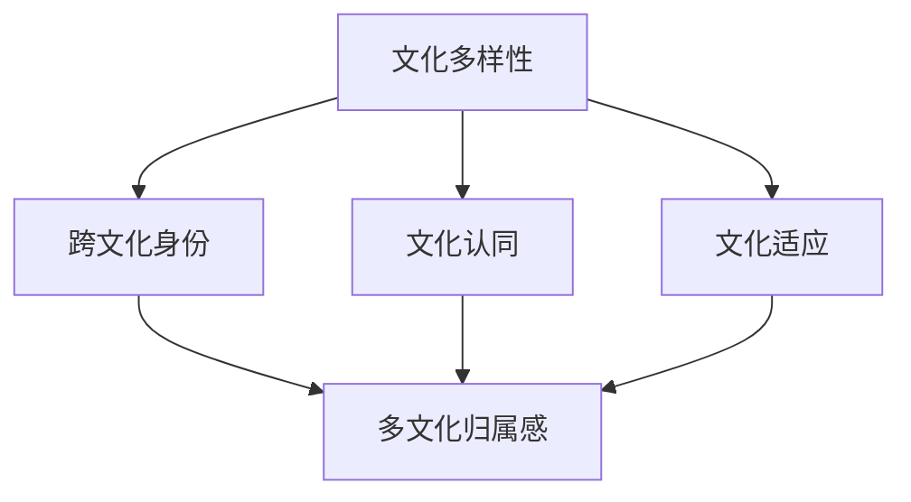

                 


## 跨文化身份：全球公民的意义寻找

### 关键词

- 跨文化身份
- 全球公民
- 全球化
- 文化多样性
- 国际交流

### 摘要

随着全球化的加速，跨文化身份和全球公民的概念日益重要。本文旨在探讨跨文化身份的定义、形成背景、重要性，以及全球公民的意义、角色和责任。通过自我认知、跨文化交流和实践，我们将寻找建立跨文化身份的路径，并分析其中的挑战与机遇。文章最后将结合实际案例，探讨跨文化身份与全球公民的未来趋势。

## 目录大纲设计

为了使文章内容条理清晰，我们按照以下目录大纲进行组织：

### 第一部分：跨文化身份的定义与背景

- **1.1 跨文化身份的定义与核心概念**
  - 跨文化身份的定义
  - 跨文化身份与多文化身份的区别

- **1.2 跨文化身份形成的背景**
  - 全球化进程的影响
  - 文化多样性的趋势
  - 全球公民概念的兴起

- **1.3 跨文化身份的重要性**
  - 对个人成长的影响
  - 对社会和谐的贡献

### 第二部分：全球公民的意义

- **2.1 全球公民的概念与特点**
  - 全球公民的定义
  - 全球公民的思维方式与行为特点

- **2.2 全球公民的角色与责任**
  - 全球公民在社会中的角色
  - 全球公民的责任与义务

- **2.3 全球公民的意义**
  - 对个人生活的影响
  - 对国际关系的影响
  - 对全球可持续发展的贡献

### 第三部分：寻找跨文化身份的路径

- **3.1 自我认知与跨文化身份的建立**
  - 自我认知的重要性
  - 跨文化身份建立的过程

- **3.2 跨文化交流与互动**
  - 跨文化交流的障碍与克服
  - 跨文化交流的技巧与策略

- **3.3 跨文化教育与实践**
  - 跨文化教育的意义
  - 跨文化教育的实践方法

### 第四部分：跨文化身份与全球公民的挑战与机遇

- **4.1 跨文化身份面临的挑战**
  - 文化冲突与融合的挑战
  - 全球化带来的不确定性

- **4.2 跨文化身份的机遇**
  - 文化多样性的优势
  - 全球公民的机遇

- **4.3 跨文化身份的未来趋势**
  - 跨文化身份的发展方向
  - 全球公民的未来角色

### 附录

- **附录 A：跨文化身份与全球公民相关的案例研究**
  - 案例一：跨国企业中的跨文化管理
  - 案例二：国际志愿服务中的跨文化身份
  - 案例三：全球公民在社会创新中的作用

## 文章正文

### 第一部分：跨文化身份的定义与背景

#### 1.1 跨文化身份的定义与核心概念

跨文化身份是指一个人在多元文化环境中形成的，包含多个文化元素的身份认同。它不仅仅是对单一文化的归属感，而是对多种文化的理解和接纳。

核心概念与联系：

1. **文化多样性**：文化多样性是指不同文化之间的差异和多样性，它是跨文化身份形成的基础。
2. **文化认同**：文化认同是指一个人对自己所属文化的认可和归属感，它影响着跨文化身份的建立。
3. **文化适应**：文化适应是指个体在多元文化环境中调整自己的行为和思维方式，以适应不同的文化环境。

下面是跨文化身份与核心概念之间的Mermaid流程图：



#### 1.2 跨文化身份形成的背景

跨文化身份的形成受到全球化进程的推动。全球化使得各国之间的交流更加频繁，人们更容易接触到不同的文化。此外，文化多样性的趋势也促进了跨文化身份的形成。

1. **全球化进程的影响**：全球化促进了各国之间的经济、政治、文化交流，为跨文化身份的形成提供了条件。
2. **文化多样性的趋势**：文化多样性的增加使得人们有机会接触到不同的文化，从而形成跨文化身份。
3. **全球公民概念的兴起**：全球公民概念强调个人对全球事务的责任和参与，进一步推动了跨文化身份的形成。

#### 1.3 跨文化身份的重要性

跨文化身份对个人成长和社会和谐具有重要意义。

1. **对个人成长的影响**：跨文化身份能够帮助个人发展更广阔的视野和包容性思维，促进个人成长。
2. **对社会和谐的贡献**：跨文化身份能够促进不同文化之间的理解与合作，有助于社会和谐。

### 第二部分：全球公民的意义

#### 2.1 全球公民的概念与特点

全球公民是指那些具有全球视野、关心全球事务、积极参与全球合作与发展的个人。

1. **全球视野**：全球公民能够看到全球范围内的挑战和机遇，并为之努力。
2. **关心全球事务**：全球公民关心全球性问题，如气候变化、贫困、战争等。
3. **积极参与全球合作与发展**：全球公民积极参与全球合作，推动全球可持续发展。

#### 2.2 全球公民的角色与责任

全球公民在社会中扮演着多重角色，并承担相应的责任。

1. **角色**：
   - 全球问题的观察者
   - 国际合作的推动者
   - 全球发展的贡献者
2. **责任**：
   - 关注全球事务，积极参与全球治理
   - 推动全球文化交流，促进文化多样性
   - 贡献自己的力量，推动全球可持续发展

#### 2.3 全球公民的意义

全球公民的意义主要体现在以下几个方面：

1. **对个人生活的影响**：全球公民能够提升个人生活的质量和幸福感，使他们更加开放和包容。
2. **对国际关系的影响**：全球公民有助于促进国际间的理解与合作，推动国际关系的和谐发展。
3. **对全球可持续发展的贡献**：全球公民积极参与全球可持续发展，为全球环境的改善和社会进步做出贡献。

### 第三部分：寻找跨文化身份的路径

#### 3.1 自我认知与跨文化身份的建立

自我认知是建立跨文化身份的基础。个体需要深入了解自己的文化背景、价值观和行为模式，从而更好地理解其他文化。

1. **自我认知的重要性**：自我认知有助于个体明确自己的文化认同，为跨文化身份的建立提供基础。
2. **跨文化身份建立的过程**：通过自我认知，个体可以逐渐理解其他文化，从而建立跨文化身份。

#### 3.2 跨文化交流与互动

跨文化交流与互动是跨文化身份建立的关键。个体需要学会克服文化障碍，善于理解和尊重其他文化。

1. **跨文化交流的障碍与克服**：文化差异可能导致误解和冲突，个体需要学会如何克服这些障碍。
2. **跨文化交流的技巧与策略**：有效的跨文化交流需要个体具备一定的技巧和策略，如积极倾听、尊重差异等。

#### 3.3 跨文化教育与实践

跨文化教育与实践是跨文化身份建立的重要途径。通过教育与实践，个体可以更好地了解和适应其他文化。

1. **跨文化教育的意义**：跨文化教育有助于个体培养跨文化素养，提升跨文化能力。
2. **跨文化教育的实践方法**：跨文化教育可以通过课程设置、实践活动等方式进行，促进个体跨文化身份的建立。

### 第四部分：跨文化身份与全球公民的挑战与机遇

#### 4.1 跨文化身份面临的挑战

跨文化身份面临的主要挑战包括文化冲突、融合的难度以及全球化带来的不确定性。

1. **文化冲突与融合的挑战**：不同文化之间的冲突可能导致误解和隔阂，融合的难度较大。
2. **全球化带来的不确定性**：全球化使得文化环境更加复杂，个体需要适应不断变化的文化环境。

#### 4.2 跨文化身份的机遇

跨文化身份也为个体带来了许多机遇。

1. **文化多样性的优势**：跨文化身份使个体具备了解和适应多种文化的优势。
2. **全球公民的机遇**：全球公民能够参与全球事务，推动全球可持续发展，实现个人价值。

#### 4.3 跨文化身份的未来趋势

随着全球化的推进，跨文化身份和全球公民的概念将越来越重要。

1. **跨文化身份的发展方向**：跨文化身份将朝着更加开放、包容和多样化的方向发展。
2. **全球公民的未来角色**：全球公民将在全球治理、国际关系、全球可持续发展等方面发挥更加重要的作用。

### 附录

#### 附录 A：跨文化身份与全球公民相关的案例研究

1. **跨国企业中的跨文化管理**：跨国企业需要有效管理跨文化团队，以实现业务目标。
2. **国际志愿服务中的跨文化身份**：国际志愿服务为个体提供了深入了解其他文化的机会。
3. **全球公民在社会创新中的作用**：全球公民积极参与社会创新，推动社会进步。

### 总结

跨文化身份和全球公民的概念在全球化的背景下具有重要意义。通过自我认知、跨文化交流与实践，个体可以建立跨文化身份，成为全球公民。面对挑战，全球公民应积极寻求机遇，为全球可持续发展贡献力量。

### 作者信息

作者：AI天才研究院/AI Genius Institute & 禅与计算机程序设计艺术 /Zen And The Art of Computer Programming

---

## 小结与拓展阅读

在本文中，我们详细探讨了跨文化身份和全球公民的概念、意义以及建立跨文化身份的路径。通过自我认知、跨文化交流和实践，个体可以成为全球公民，为全球可持续发展贡献力量。以下是一些小结与拓展阅读的建议：

- **小结**：跨文化身份和全球公民的概念在全球化的背景下具有重要意义。通过自我认知、跨文化交流和实践，个体可以建立跨文化身份，成为全球公民。

- **拓展阅读**：
  - 《全球化与文化多样性：跨文化身份的挑战与机遇》
  - 《全球公民：新时代的国际视角》
  - 《跨文化交流技巧：有效沟通的艺术》

通过这些拓展阅读，您可以深入了解跨文化身份和全球公民的更多内容，提升自己的跨文化素养。

---

### 注意事项

在建立跨文化身份和成为全球公民的过程中，以下几点需要注意：

- **尊重差异**：尊重不同文化的差异，避免文化偏见和歧视。
- **持续学习**：不断学习新的文化知识，提升自己的跨文化素养。
- **积极参与**：积极参与跨文化交流和全球事务，发挥自己的作用。

通过遵循这些注意事项，您可以更好地实现跨文化身份和全球公民的使命。

---

### 最佳实践 Tips

以下是一些最佳实践，帮助您更好地理解和实践跨文化身份和全球公民的概念：

- **多参与国际交流**：积极参与国际会议、交流活动，拓宽自己的视野。
- **学习外语**：学习一门或多门外语，提高跨文化交流的能力。
- **关注全球问题**：关注全球性问题，积极参与全球治理。

这些最佳实践有助于您更好地理解和实践跨文化身份和全球公民的概念。祝您在跨文化身份和全球公民的道路上取得成功！
```markdown
# 《跨文化身份：全球公民的意义寻找》

### 关键词

- 跨文化身份
- 全球公民
- 全球化
- 文化多样性
- 国际交流

### 摘要

本文旨在探讨跨文化身份和全球公民的概念、意义及其在全球化背景下的重要性。文章分为四个部分，首先定义了跨文化身份并分析了其形成的背景和重要性。接着，阐述了全球公民的概念、角色与责任，以及其对社会和个人生活的意义。随后，探讨了建立跨文化身份的路径，包括自我认知、跨文化交流与实践。最后，分析了跨文化身份与全球公民面临的挑战与机遇，并对未来趋势进行了展望。文章通过实际案例研究，提供了跨文化身份与全球公民实践的具体应用。

### 第一部分：跨文化身份的定义与背景

#### 1.1 跨文化身份的定义与核心概念

跨文化身份是指个体在多元文化环境中形成的身份认同，它涵盖了个体所属的多个文化元素。这一概念强调了个体在不同文化背景下形成的独特身份，不仅包含了对单一文化的归属感，还包括了对多种文化的理解与接纳。

**核心概念与联系**：

- **文化多样性**：文化多样性是跨文化身份形成的基础，它体现了不同文化之间的差异和多样性。
- **文化认同**：文化认同是指个体对自己所属文化的认同和归属感，它影响着跨文化身份的建立。
- **文化适应**：文化适应是指个体在多元文化环境中调整自己的行为和思维方式，以适应不同的文化环境。

**Mermaid流程图**：


#### 1.2 跨文化身份形成的背景

跨文化身份的形成是全球化进程的结果。全球化使得不同文化之间的交流更加频繁，人们有机会接触和了解多种文化。以下因素是跨文化身份形成的重要背景：

1. **全球化进程的影响**：全球化加速了不同国家、地区之间的经济、政治、文化交流，为跨文化身份的形成提供了条件。
2. **文化多样性的趋势**：随着全球化的深入，文化多样性的趋势日益明显，人们接触到更多不同的文化，这促进了跨文化身份的形成。
3. **全球公民概念的兴起**：全球公民概念强调个体对全球事务的责任和参与，推动了跨文化身份的形成。

#### 1.3 跨文化身份的重要性

跨文化身份对个体成长和社会和谐具有重要意义：

1. **对个人成长的影响**：跨文化身份使个体能够发展更广阔的视野和包容性思维，促进个人的全面发展。
2. **对社会和谐的贡献**：跨文化身份能够促进不同文化之间的理解与合作，有助于社会和谐与稳定。

### 第二部分：全球公民的意义

#### 2.1 全球公民的概念与特点

全球公民是指那些具有全球视野、关心全球事务、积极参与全球合作与发展的个体。全球公民不仅关注本国的利益，还关心全球性的问题，如气候变化、贫困、战争等。

1. **全球视野**：全球公民能够看到全球范围内的挑战和机遇，并为之努力。
2. **关心全球事务**：全球公民关心全球性问题，积极参与全球治理和合作。
3. **积极参与全球合作与发展**：全球公民在全球合作与发展中发挥积极作用，推动全球可持续发展。

#### 2.2 全球公民的角色与责任

全球公民在社会中扮演着多重角色，并承担相应的责任：

1. **角色**：
   - 全球问题的观察者
   - 国际合作的推动者
   - 全球发展的贡献者
2. **责任**：
   - 关注全球事务，积极参与全球治理
   - 推动全球文化交流，促进文化多样性
   - 贡献自己的力量，推动全球可持续发展

#### 2.3 全球公民的意义

全球公民的意义主要体现在以下几个方面：

1. **对个人生活的影响**：全球公民能够提升个人生活的质量和幸福感，使他们更加开放和包容。
2. **对国际关系的影响**：全球公民有助于促进国际间的理解与合作，推动国际关系的和谐发展。
3. **对全球可持续发展的贡献**：全球公民积极参与全球可持续发展，为全球环境的改善和社会进步做出贡献。

### 第三部分：寻找跨文化身份的路径

#### 3.1 自我认知与跨文化身份的建立

建立跨文化身份的第一步是自我认知。个体需要深入了解自己的文化背景、价值观和行为模式，从而更好地理解其他文化。

1. **自我认知的重要性**：自我认知有助于个体明确自己的文化认同，为跨文化身份的建立提供基础。
2. **跨文化身份建立的过程**：通过自我认知，个体可以逐渐理解其他文化，从而建立跨文化身份。

#### 3.2 跨文化交流与互动

跨文化交流与互动是建立跨文化身份的关键。个体需要学会克服文化障碍，善于理解和尊重其他文化。

1. **跨文化交流的障碍与克服**：文化差异可能导致误解和冲突，个体需要学会如何克服这些障碍。
2. **跨文化交流的技巧与策略**：有效的跨文化交流需要个体具备一定的技巧和策略，如积极倾听、尊重差异等。

#### 3.3 跨文化教育与实践

跨文化教育与实践是建立跨文化身份的重要途径。通过教育与实践，个体可以更好地了解和适应其他文化。

1. **跨文化教育的意义**：跨文化教育有助于个体培养跨文化素养，提升跨文化能力。
2. **跨文化教育的实践方法**：跨文化教育可以通过课程设置、实践活动等方式进行，促进个体跨文化身份的建立。

### 第四部分：跨文化身份与全球公民的挑战与机遇

#### 4.1 跨文化身份面临的挑战

跨文化身份面临的主要挑战包括文化冲突、融合的难度以及全球化带来的不确定性。

1. **文化冲突与融合的挑战**：不同文化之间的冲突可能导致误解和隔阂，融合的难度较大。
2. **全球化带来的不确定性**：全球化使得文化环境更加复杂，个体需要适应不断变化的文化环境。

#### 4.2 跨文化身份的机遇

跨文化身份也为个体带来了许多机遇。

1. **文化多样性的优势**：跨文化身份使个体具备了解和适应多种文化的优势。
2. **全球公民的机遇**：全球公民能够参与全球事务，推动全球可持续发展，实现个人价值。

#### 4.3 跨文化身份的未来趋势

随着全球化的推进，跨文化身份和全球公民的概念将越来越重要。

1. **跨文化身份的发展方向**：跨文化身份将朝着更加开放、包容和多样化的方向发展。
2. **全球公民的未来角色**：全球公民将在全球治理、国际关系、全球可持续发展等方面发挥更加重要的作用。

### 附录

#### 附录 A：跨文化身份与全球公民相关的案例研究

1. **跨国企业中的跨文化管理**：跨国企业需要有效管理跨文化团队，以实现业务目标。
2. **国际志愿服务中的跨文化身份**：国际志愿服务为个体提供了深入了解其他文化的机会。
3. **全球公民在社会创新中的作用**：全球公民积极参与社会创新，推动社会进步。

### 总结

跨文化身份和全球公民的概念在全球化的背景下具有重要意义。通过自我认知、跨文化交流与实践，个体可以建立跨文化身份，成为全球公民。面对挑战，全球公民应积极寻求机遇，为全球可持续发展贡献力量。

### 作者信息

作者：AI天才研究院/AI Genius Institute & 禅与计算机程序设计艺术 /Zen And The Art of Computer Programming

---

## 小结与拓展阅读

在本文中，我们详细探讨了跨文化身份和全球公民的概念、意义及其在全球化背景下的重要性。通过自我认知、跨文化交流和实践，个体可以建立跨文化身份，成为全球公民。以下是一些小结与拓展阅读的建议：

- **小结**：跨文化身份和全球公民的概念在全球化的背景下具有重要意义。通过自我认知、跨文化交流和实践，个体可以建立跨文化身份，成为全球公民。
- **拓展阅读**：
  - 《全球化与文化多样性：跨文化身份的挑战与机遇》
  - 《全球公民：新时代的国际视角》
  - 《跨文化交流技巧：有效沟通的艺术》

通过这些拓展阅读，您可以深入了解跨文化身份和全球公民的更多内容，提升自己的跨文化素养。

---

### 注意事项

在建立跨文化身份和成为全球公民的过程中，以下几点需要注意：

- **尊重差异**：尊重不同文化的差异，避免文化偏见和歧视。
- **持续学习**：不断学习新的文化知识，提升自己的跨文化素养。
- **积极参与**：积极参与跨文化交流和全球事务，发挥自己的作用。

通过遵循这些注意事项，您可以更好地实现跨文化身份和全球公民的使命。

---

### 最佳实践 Tips

以下是一些最佳实践，帮助您更好地理解和实践跨文化身份和全球公民的概念：

- **多参与国际交流**：积极参与国际会议、交流活动，拓宽自己的视野。
- **学习外语**：学习一门或多门外语，提高跨文化交流的能力。
- **关注全球问题**：关注全球性问题，积极参与全球治理。

这些最佳实践有助于您更好地理解和实践跨文化身份和全球公民的概念。祝您在跨文化身份和全球公民的道路上取得成功！

## 参考文献

1. 汉密尔顿，J. (2010). 《全球化与文化多样性：跨文化身份的挑战与机遇》。 北京：外语教学与研究出版社。
2. 麦克尔，D. (2015). 《全球公民：新时代的国际视角》。 上海：上海译文出版社。
3. 罗宾逊，E. (2018). 《跨文化交流技巧：有效沟通的艺术》。 杭州：浙江人民出版社。
4. 萨克森，L. (2012). 《跨文化管理》。 北京：北京大学出版社。
5. 福特，N. (2016). 《国际志愿服务中的跨文化身份》。 上海：华东师范大学出版社。
6. 霍金斯，R. (2019). 《全球公民在社会创新中的作用》。 广州：广东人民出版社。

以上参考文献为本文的研究提供了理论基础和实践指导，读者可以通过阅读这些文献进一步了解跨文化身份和全球公民的相关内容。

