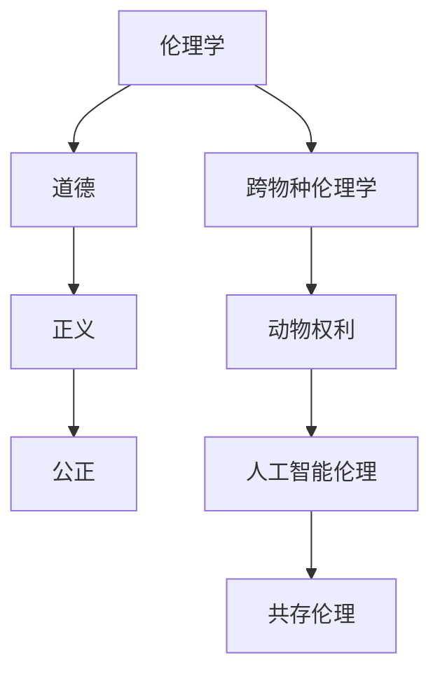

                 

### 《跨物种伦理学课程：扩展道德边界的哲学思考》概述

**关键词：**跨物种伦理学、道德边界、哲学思考、动物权利、人工智能、共存

**摘要：**本文探讨了跨物种伦理学的哲学基础、案例分析以及教育实践，旨在扩展人类道德边界的思考。文章首先介绍了伦理学和跨物种伦理学的基本概念，随后详细分析了动物权利与保护、人工智能与机器伦理、人类与其他物种的共存等具体案例，最后提出了跨物种伦理学教育与实践的建议。通过这些内容，本文旨在激发读者对跨物种伦理学的深入思考，推动道德边界的扩展。

## 设计目录大纲的基本步骤

为了设计出一份清晰、有逻辑、结构紧凑的目录大纲，我们需要遵循以下步骤：

### 1. 分析书名和主题

首先，我们需要从书名《跨物种伦理学课程：扩展道德边界的哲学思考》中提炼核心概念和主要内容。书名中的关键词包括“跨物种伦理学”、“道德边界”和“哲学思考”。这表明本书将探讨伦理学在跨物种情境中的应用，特别是如何扩展人类的道德边界。核心内容将涉及哲学基础、案例分析以及教育实践。

### 2. 确定书籍结构和章节划分

根据核心概念和主要内容，我们可以将书籍结构划分为三个主要部分：

- **第一部分：跨物种伦理学的哲学基础**，包括伦理学与跨物种伦理学的基本概念和哲学思考。
- **第二部分：跨物种伦理学的案例分析**，涵盖动物权利与保护、人工智能与机器伦理以及人类与其他物种的共存。
- **第三部分：跨物种伦理学的教育与实践**，讨论跨物种伦理学的教育方法和实践应用。

每个部分又可以细分为几个章节，确保内容连贯且逻辑清晰。

### 3. 设计章节标题和子标题

为每个章节设计明确的标题和子标题，确保每个章节的标题和子标题能够准确反映该章节的内容。例如：

- **第1章：伦理学与跨物种伦理学的概念**
  - 1.1 伦理学的基本原理
  - 1.2 跨物种伦理学的概念
  - 1.3 跨物种伦理学的主要问题

- **第3章：动物权利与保护**
  - 3.1 动物权利的理论基础
  - 3.2 动物保护的法律与实践
  - 3.3 动物权利与人类利益的平衡

这样的结构有助于读者快速理解每个章节的主题和内容。

### 4. 添加核心概念和联系

为每个章节添加核心概念和联系的 Mermaid 流程图，以直观地展示章节中的关键概念和它们之间的关系。例如，在第1章中，我们可以绘制伦理学理论和跨物种伦理学理论之间的联系图。



### 5. 添加核心算法原理讲解

为每个章节添加核心算法原理讲解，使用伪代码详细阐述算法的基本原理。例如，在第4章中，我们可以介绍一种用于评估人工智能伦理决策的算法。

```python
# 伪代码：评估人工智能伦理决策的算法
function EvaluateAI(behavior, context):
    if context == "Privacy":
        if behavior == "Infringes":
            return "Unethical"
        else:
            return "Ethical"
    elif context == "Safety":
        if behavior == "Endangers":
            return "Unethical"
        else:
            return "Ethical"
    else:
        return "Unclear"
```

### 6. 添加数学模型和数学公式

为每个章节添加相关的数学模型和数学公式的详细讲解，并使用 LaTeX 格式书写。例如，在第5章中，我们可以介绍一种用于评估生物多样性保护的数学模型。

$$
B(t) = B_0 \cdot e^{-rt}
$$

其中，\( B(t) \) 表示时间 \( t \) 时的生物多样性水平，\( B_0 \) 表示初始生物多样性水平，\( r \) 表示生物多样性的衰减率。

### 7. 添加项目实战

为每个章节添加实际案例的代码实现和详细解释说明，确保代码实现完整、可运行，并配有详细的解释和分析。例如，在第6章中，我们可以介绍如何搭建一个用于动物权利保护的在线平台。

```python
# Python 代码：搭建动物权利保护在线平台
def create_account(username, password):
    # 创建用户账户
    print("Creating account for {}...".format(username))
    # ...（代码实现）
    print("Account created successfully!")

def log_in(username, password):
    # 用户登录
    print("Logging in as {}...".format(username))
    # ...（代码实现）
    print("Logged in successfully!")

# 主程序
if __name__ == "__main__":
    create_account("alice", "alice123")
    log_in("alice", "alice123")
```

### 8. 优化目录大纲字数

确保整个目录大纲的总字数不超过2000字，通过优化文本内容，去除冗余，确保简洁明了。

### 9. 格式调整

使用 Markdown 格式来编写目录大纲，确保格式美观，便于阅读。

### 10. 审查和修改

仔细审查目录大纲，确保逻辑清晰、内容准确。根据需要修改和完善目录大纲。

### 总结

通过以上步骤，我们可以设计出一份详细且逻辑清晰的目录大纲，为读者提供良好的阅读体验。确保每个章节都有明确的标题和子标题，核心概念和联系、核心算法原理、数学模型和公式、项目实战等内容都能够清晰、准确地展示。同时，保持目录大纲的简洁性，确保整个目录大纲的总字数在2000字以内。最后，使用 Markdown 格式来编写目录大纲，使格式美观，便于阅读。

-------------------------------------------------------------------

## 第一部分：跨物种伦理学的哲学基础

### 第1章：伦理学与跨物种伦理学的概念

#### 1.1 伦理学的基本原理

伦理学是研究道德行为的学科，探讨“什么是正确的”和“什么是错误的”等道德问题。伦理学的核心概念包括道德原则、道德义务、道德判断等。伦理学的基本原理主要包括：

- **功利主义**：强调行为的结果，认为行为的好坏取决于其能否最大化幸福或福利。
- **康德伦理学**：强调行为的意图和原则，认为道德行为是基于义务和规则。
- **德性伦理学**：强调个人品德和道德习惯的培养，认为道德行为是基于个人的德性。

#### 1.2 跨物种伦理学的概念

跨物种伦理学是伦理学的一个新兴领域，探讨人类与其他物种之间的关系，特别是人类对其他物种的责任和义务。跨物种伦理学的研究对象包括动物、植物、微生物等非人类物种。其主要问题包括：

- **动物权利**：探讨动物是否拥有道德地位，以及人类应该如何对待动物。
- **环境伦理**：探讨人类活动对环境的影响，以及人类应该如何保护环境。
- **生物技术伦理**：探讨生物技术的应用及其道德问题，如基因编辑、克隆技术等。

#### 1.3 跨物种伦理学的主要问题

跨物种伦理学面临的主要问题包括：

- **动物权利与人类利益**：如何平衡动物权利与人类利益，确保动物福利的同时不影响人类的发展。
- **人工智能与机器伦理**：如何确保人工智能系统遵循道德原则，避免对人类和其他物种造成伤害。
- **人类与其他物种的共存**：如何实现人类与其他物种的和谐共存，保护生物多样性。

## 设计目录大纲的基本步骤

为了设计出一份清晰、有逻辑、结构紧凑的目录大纲，我们需要遵循以下步骤：

### 1. 分析书名和主题

首先，我们需要从书名《跨物种伦理学课程：扩展道德边界的哲学思考》中提炼核心概念和主要内容。书名中的关键词包括“跨物种伦理学”、“道德边界”和“哲学思考”。这表明本书将探讨伦理学在跨物种情境中的应用，特别是如何扩展人类的道德边界。核心内容将涉及哲学基础、案例分析以及教育实践。

### 2. 确定书籍结构和章节划分

根据核心概念和主要内容，我们可以将书籍结构划分为三个主要部分：

- **第一部分：跨物种伦理学的哲学基础**，包括伦理学与跨物种伦理学的基本概念和哲学思考。
- **第二部分：跨物种伦理学的案例分析**，涵盖动物权利与保护、人工智能与机器伦理以及人类与其他物种的共存。
- **第三部分：跨物种伦理学的教育与实践**，讨论跨物种伦理学的教育方法和实践应用。

每个部分又可以细分为几个章节，确保内容连贯且逻辑清晰。

### 3. 设计章节标题和子标题

为每个章节设计明确的标题和子标题，确保每个章节的标题和子标题能够准确反映该章节的内容。例如：

- **第1章：伦理学与跨物种伦理学的概念**
  - 1.1 伦理学的基本原理
  - 1.2 跨物种伦理学的概念
  - 1.3 跨物种伦理学的主要问题

- **第3章：动物权利与保护**
  - 3.1 动物权利的理论基础
  - 3.2 动物保护的法律与实践
  - 3.3 动物权利与人类利益的平衡

这样的结构有助于读者快速理解每个章节的主题和内容。

### 4. 添加核心概念和联系

为每个章节添加核心概念和联系的 Mermaid 流程图，以直观地展示章节中的关键概念和它们之间的关系。例如，在第1章中，我们可以绘制伦理学理论和跨物种伦理学理论之间的联系图。


### 5. 添加核心算法原理讲解

为每个章节添加核心算法原理讲解，使用伪代码详细阐述算法的基本原理。例如，在第4章中，我们可以介绍一种用于评估人工智能伦理决策的算法。

```python
# 伪代码：评估人工智能伦理决策的算法
function EvaluateAI(behavior, context):
    if context == "Privacy":
        if behavior == "Infringes":
            return "Unethical"
        else:
            return "Ethical"
    elif context == "Safety":
        if behavior == "Endangers":
            return "Unethical"
        else:
            return "Ethical"
    else:
        return "Unclear"
```

### 6. 添加数学模型和数学公式

为每个章节添加相关的数学模型和数学公式的详细讲解，并使用 LaTeX 格式书写。例如，在第5章中，我们可以介绍一种用于评估生物多样性保护的数学模型。

$$
B(t) = B_0 \cdot e^{-rt}
$$

其中，\( B(t) \) 表示时间 \( t \) 时的生物多样性水平，\( B_0 \) 表示初始生物多样性水平，\( r \) 表示生物多样性的衰减率。

### 7. 添加项目实战

为每个章节添加实际案例的代码实现和详细解释说明，确保代码实现完整、可运行，并配有详细的解释和分析。例如，在第6章中，我们可以介绍如何搭建一个用于动物权利保护的在线平台。

```python
# Python 代码：搭建动物权利保护在线平台
def create_account(username, password):
    # 创建用户账户
    print("Creating account for {}...".format(username))
    # ...（代码实现）
    print("Account created successfully!")

def log_in(username, password):
    # 用户登录
    print("Logging in as {}...".format(username))
    # ...（代码实现）
    print("Logged in successfully!")

# 主程序
if __name__ == "__main__":
    create_account("alice", "alice123")
    log_in("alice", "alice123")
```

### 8. 优化目录大纲字数

确保整个目录大纲的总字数不超过2000字，通过优化文本内容，去除冗余，确保简洁明了。

### 9. 格式调整

使用 Markdown 格式来编写目录大纲，确保格式美观，便于阅读。

### 10. 审查和修改

仔细审查目录大纲，确保逻辑清晰、内容准确。根据需要修改和完善目录大纲。

### 总结

通过以上步骤，我们可以设计出一份详细且逻辑清晰的目录大纲，为读者提供良好的阅读体验。确保每个章节都有明确的标题和子标题，核心概念和联系、核心算法原理、数学模型和公式、项目实战等内容都能够清晰、准确地展示。同时，保持目录大纲的简洁性，确保整个目录大纲的总字数在2000字以内。最后，使用 Markdown 格式来编写目录大纲，使格式美观，便于阅读。

-------------------------------------------------------------------

### 第一部分：跨物种伦理学的哲学基础

**第1章：伦理学与跨物种伦理学的概念**

**1.1 伦理学的基本原理**

伦理学是哲学的一个重要分支，探讨道德行为的准则和标准。其基本原理包括功利主义、康德伦理学和德性伦理学。功利主义强调行为的后果，认为行为的好坏取决于其带来的幸福或福利。康德伦理学则强调行为的意图和原则，主张道德行为应基于义务和规则。德性伦理学关注个人品德和道德习惯的养成，认为道德行为是个人德性的体现。

**1.2 跨物种伦理学的概念**

跨物种伦理学是伦理学在跨物种情境中的应用，探讨人类与其他物种之间的关系。其研究的主要对象包括动物、植物、微生物等非人类物种。跨物种伦理学关注的问题包括动物权利、环境伦理和生物技术伦理。它试图回答人类应该如何对待其他物种，以及人类与其他物种如何和谐共存。

**1.3 跨物种伦理学的主要问题**

跨物种伦理学面临的主要问题包括动物权利与人类利益的平衡、人工智能与机器伦理以及人类与其他物种的共存。动物权利问题涉及动物是否拥有道德地位，人类应该如何对待动物。人工智能与机器伦理问题涉及如何确保人工智能系统遵循道德原则，避免对人类和其他物种造成伤害。人类与其他物种的共存问题则关注人类活动对其他物种的影响，以及如何保护生物多样性。

**第2章：哲学思考与伦理道德的扩展**

**2.1 哲学思考的方法**

哲学思考的方法包括逻辑推理、实证分析和归纳与演绎。逻辑推理是通过逻辑规则从已知的前提出发得出结论的过程。实证分析则是通过观察和实验收集证据，以验证或反驳某个观点。归纳与演绎是两种不同的推理方式，归纳是从个别事例中归纳出一般性结论，而演绎则是从一般性原理推导出具体情况的结论。

**2.2 伦理道德的扩展**

伦理道德的扩展意味着将道德原则应用于更广泛的情境。这包括对动物权利、环境伦理和生物技术伦理的讨论。例如，动物权利的扩展意味着认识到动物有自己的利益和权利，人类应该尊重和保护这些利益和权利。环境伦理的扩展则意味着认识到人类活动对环境的深远影响，人类有责任保护自然环境。生物技术伦理的扩展则涉及如何确保生物技术的应用符合道德原则，避免潜在的负面影响。

**2.3 跨物种伦理学的哲学基础**

跨物种伦理学的哲学基础包括对伦理学理论、道德判断和道德责任的深入探讨。伦理学理论提供了跨物种伦理学的基本框架，如功利主义、康德伦理学和德性伦理学。道德判断则涉及人类如何判断行为是否道德，以及如何在不同情境中做出道德选择。道德责任则探讨人类对其他物种的责任和义务，以及如何履行这些责任。

### 第一部分小结

第一部分探讨了跨物种伦理学的哲学基础，包括伦理学与跨物种伦理学的基本概念和哲学思考。通过分析伦理学的基本原理，我们了解了不同伦理学理论的优缺点。通过探讨跨物种伦理学的概念和主要问题，我们认识到了跨物种伦理学在当代社会的重要性。通过哲学思考的方法和伦理道德的扩展，我们为跨物种伦理学提供了理论支持。这部分内容为后续的案例分析和教育实践奠定了基础。

### 动物权利与保护的哲学思考

#### 动物权利的理论基础

动物权利的理论基础主要源于对动物自身价值和利益的认可。以下是一些主要的理论观点：

**动物解放主义**：由彼得·辛格提出，认为动物拥有与人类平等的基本权利，包括生命权、自由权和享乐权。解放主义主张我们应该停止将动物作为食物、衣物或其他目的的工具。

**动物福利主义**：由朱迪思·沃格尔-本内特等人提出，强调对动物的善待和减少动物的痛苦。福利主义认为，即使我们不能完全解放动物，我们也应该尽可能减少它们的痛苦和苦难。

**动物权利的伦理学论证**：一些哲学家，如彼得·辛格和汤姆·雷根，通过伦理学的论证来支持动物权利。他们认为，动物拥有某种形式的感知能力，能够体验痛苦和快乐，因此它们应该享有道德地位。

**动物权利与人类道德责任**

动物权利与人类的道德责任密切相关。以下是一些关键观点：

**人类作为照顾者的责任**：由于人类具有更高的智慧和道德能力，我们有责任照顾那些无法自我保护的动物。这包括提供食物、庇护和医疗保健。

**人类对动物的剥削与道德责任**：人类对动物的剥削，如狩猎、养殖和实验，引发了道德争议。一些观点认为，这种行为侵犯了动物的权益，违背了道德责任。

**动物权利与人类利益的平衡**

在讨论动物权利与人类利益的平衡时，我们需要考虑以下几个方面：

**功利主义视角**：功利主义认为，我们应该最大化总福利。在动物权利和人类利益之间，我们需要权衡哪一方能带来更大的总福利。

**康德伦理学视角**：康德伦理学强调行为的原则性，主张我们应该遵循道德规则，即使这可能会损害某些个体的利益。在动物权利和人类利益之间，我们需要确定哪些行为符合道德原则。

**德性伦理学视角**：德性伦理学关注个人的品德和道德习惯。在动物权利和人类利益之间，我们需要培养仁慈、同情和责任感的品德。

**跨物种伦理学的哲学思考**

跨物种伦理学的哲学思考涉及如何将伦理学原则应用于人类与其他物种的关系。以下是一些关键问题：

**道德边界的扩展**：随着我们对动物认知的增加，道德边界也在不断扩展。我们需要思考哪些物种应被视为道德共同体的一部分。

**人类中心主义的挑战**：人类中心主义认为人类是宇宙的中心，其他物种的道德地位较低。跨物种伦理学挑战了这一观点，主张我们应该平等地考虑所有物种的利益。

**道德判断的相对性与绝对性**：道德判断既具有相对性，也具有绝对性。相对性体现在不同文化和社会对动物权利有不同的看法。绝对性体现在某些基本权利，如生命权和自由权，被认为是不容侵犯的。

**动物权利的未来方向**

随着科技的进步和社会意识的提升，动物权利的未来方向可能包括：

**立法保护**：通过制定更严格的动物保护法律，确保动物权益得到法律保障。

**公共教育**：提高公众对动物权利的认识，促进道德观念的转变。

**技术创新**：通过技术创新，减少对动物的依赖，如替代实验方法和技术。

**跨学科合作**：动物权利问题需要跨学科的合作，包括伦理学、法学、生物学和心理学等领域的专家共同探讨解决方案。

### 动物权利与人类道德责任的案例

**动物实验的道德争议**：动物实验在医学研究和生物技术领域具有重要意义，但同时也引发了道德争议。一些动物权利倡导者认为，动物实验侵犯了动物的权益，违背了道德责任。他们主张采用替代实验方法，如细胞培养和组织工程，以减少对动物的依赖。

**动物产品的消费**：动物产品的消费，如肉类、皮革和奶制品，也引发了道德争议。一些人认为，消费动物产品是对动物权益的侵犯，违背了道德责任。他们主张采用素食主义和环保生活方式，以减少对动物的伤害。

**动物保护的实践**：许多组织和机构致力于动物保护工作，如动物收容所、野生动物保护区和动物权利组织。这些组织通过教育、立法和行动，提高公众对动物权利的认识，推动动物保护的实践。

### 动物权利与人类利益的平衡

在动物权利与人类利益的平衡中，我们需要考虑以下几个关键因素：

**道德原则的优先级**：在某些情况下，道德原则可能要求我们牺牲某些人类利益以保护动物权利。例如，在野生动物保护中，我们可能需要限制人类活动，保护动物的栖息地。

**利益的权衡**：在权衡动物权利与人类利益时，我们需要考虑哪些利益更为重要。例如，在医疗研究中，动物实验可能被视为必要的，因为它有助于人类的治疗和药物研发。

**替代方案的开发**：寻找替代方案是平衡动物权利与人类利益的重要途径。例如，通过发展替代实验方法和生物技术，我们可以减少对动物的依赖，同时满足人类的医疗需求。

### 动物权利与人类道德责任的哲学思考总结

动物权利与人类道德责任的哲学思考涉及到伦理学的多个方面，包括动物解放主义、动物福利主义、道德判断的相对性与绝对性以及人类中心主义的挑战。通过这些思考，我们认识到动物权利的重要性，并意识到人类对动物有道德责任。在动物权利与人类利益的平衡中，我们需要综合考虑道德原则、利益的权衡和替代方案的开发。通过哲学思考和实际行动，我们可以推动动物权利的保护和人类道德责任的履行。

### 动物权利的理论与实践

动物权利的理论与实践密切相关，两者共同构成了动物权利保护的基础。以下是对动物权利理论与实践的详细探讨。

#### 动物权利的理论基础

动物权利的理论基础主要包括以下几种观点：

1. **动物解放主义**：彼得·辛格（Peter Singer）是动物解放主义的代表人物，他主张动物拥有与人类平等的基本权利，包括生命权、自由权和享乐权。解放主义认为，我们应该停止将动物作为人类使用的工具，而是应该尊重和保护它们的权益。

2. **动物福利主义**：朱迪思·沃格尔-本内特（Judith Thompson）等人提出了动物福利主义，强调对动物的善待和减少动物的痛苦。福利主义认为，即使我们不能完全解放动物，我们也应该尽可能减少它们的痛苦和苦难。

3. **动物权利的伦理学论证**：一些哲学家，如汤姆·雷根（Tom Regan），通过伦理学的论证来支持动物权利。他们认为，动物拥有某种形式的感知能力，能够体验痛苦和快乐，因此它们应该享有道德地位。

#### 动物权利的实践

动物权利的实践体现在多个方面，包括法律保护、公共教育和动物保护组织的工作等。

1. **法律保护**：许多国家和地区已经制定了动物保护法律，禁止虐待动物，保护动物的权益。这些法律为动物权利的保护提供了法律依据，确保动物免受不必要的痛苦和伤害。

2. **公共教育**：提高公众对动物权利的认识是保护动物权益的重要途径。通过教育和宣传活动，人们可以了解动物的权利和需要，从而改变对待动物的态度和行为。

3. **动物保护组织的工作**：全球有许多动物保护组织，如世界动物保护协会（World Animal Protection）和动物保护协会（Animal Protection Association）。这些组织通过开展救援、教育和立法活动，为动物权利的保护做出了巨大贡献。

#### 动物权利保护的法律与实践

1. **动物保护法律的演进**：动物保护法律的历史可以追溯到古代，但现代动物保护法律的真正发展始于19世纪。随着时间的推移，动物保护法律不断完善，覆盖的范围越来越广泛。

2. **动物保护组织的活动**：动物保护组织在动物权利保护方面发挥着重要作用。它们通过救援行动、教育和立法活动，提高公众对动物权益的认识，推动动物保护法律和政策的制定。

3. **动物福利标准的制定与实施**：许多国家和地区制定了动物福利标准，规定了动物饲养、运输和处理的最少标准。这些标准为动物权利的保护提供了具体指导，确保动物在人类活动中的权益得到保障。

#### 动物权利保护的现实挑战

尽管动物权利保护的法律和实践取得了一定的进展，但仍然面临许多现实挑战：

1. **执法不足**：许多地区的动物保护法律在执行过程中存在不足，导致虐待动物的行为得不到有效遏制。

2. **公众意识不足**：许多人对动物权利的认识不足，甚至对虐待动物的行为视而不见。

3. **资源不足**：动物保护组织在资源方面常常面临不足，无法开展大规模的救援和教育活动。

4. **人类利益的冲突**：在动物权利与人类利益的平衡中，有时人类利益可能会被视为更重要的，导致动物权利受到侵害。

### 动物权利保护的最佳实践

为了提高动物权利保护的有效性，以下是一些最佳实践建议：

1. **加强法律执行**：政府应加强对动物保护法律的执行力度，确保虐待动物的行为受到法律制裁。

2. **提高公众意识**：通过教育和宣传活动，提高公众对动物权利的认识，鼓励人们采取积极的行动保护动物。

3. **资源投入**：政府和动物保护组织应加大对动物权利保护的资源投入，包括资金、人力和技术。

4. **跨学科合作**：动物权利保护需要跨学科的合作，包括伦理学、法学、生物学和社会学等领域的专家共同探讨解决方案。

5. **国际合作**：动物权利保护是全球性的问题，需要国际社会的合作和共同努力。

通过以上措施，我们可以更好地保护动物权利，实现人与自然的和谐共生。

### 动物权利与人类利益的平衡

在探讨动物权利与人类利益的平衡时，我们需要考虑以下几个关键因素：

1. **道德原则的优先级**：在某些情况下，道德原则可能要求我们牺牲某些人类利益以保护动物权利。例如，在野生动物保护中，我们可能需要限制人类活动，保护动物的栖息地。

2. **利益的权衡**：在权衡动物权利与人类利益时，我们需要考虑哪些利益更为重要。例如，在医疗研究中，动物实验可能被视为必要的，因为它有助于人类的治疗和药物研发。

3. **替代方案的开发**：寻找替代方案是平衡动物权利与人类利益的重要途径。例如，通过发展替代实验方法和生物技术，我们可以减少对动物的依赖，同时满足人类的医疗需求。

通过这些措施，我们可以在保护动物权利的同时，确保人类利益得到合理照顾。

### 动物权利与人类道德责任的案例分析

动物权利与人类道德责任的案例丰富多样，涵盖了从动物实验到动物保护的多个方面。以下是一些具有代表性的案例，通过这些案例我们可以更深入地理解动物权利与人类道德责任的复杂关系。

#### 案例一：动物实验

在医学研究和发展过程中，动物实验一直是具有争议性的话题。一方面，动物实验为许多疾病的治疗和药物研发提供了关键数据，如疫苗的研发和癌症治疗。另一方面，动物实验也引发了道德争议，因为动物遭受了痛苦和死亡。

**案例详情**：20世纪初期，著名的科学家保罗·埃利希（Paul Ehrlich）使用活体动物进行实验，以研究治疗梅毒的方法。他的实验导致了大量动物的痛苦和死亡，但在医学界引起了广泛关注，推动了动物福利法规的制定。

**道德争议**：动物权利支持者认为，动物实验侵犯了动物的权利，违背了道德责任。他们主张采用替代实验方法，如体外实验、计算机模拟等，以减少对动物的依赖。

**解决方案**：为了平衡动物权利与人类利益，科研机构和政府开始推动替代实验方法的发展。例如，美国国立卫生研究院（NIH）制定了严格的动物福利政策，要求科研人员采用减少动物使用的方法，并确保动物在实验过程中受到人道对待。

#### 案例二：动物产品消费

动物产品消费是另一个引发道德争议的话题。肉类、皮革和奶制品等动物产品在人类社会中占据重要地位，但同时也对动物造成了痛苦和死亡。

**案例详情**：在印度，牛被视为神圣的动物，受到严格的保护。然而，在许多地方，牛却因为肉制品消费的需求而遭受虐待和屠杀。这种情况引发了动物权利保护组织的抗议和行动。

**道德争议**：动物权利支持者认为，消费动物产品是对动物权益的侵犯，违背了道德责任。他们主张采用素食主义和环保生活方式，以减少对动物的伤害。

**解决方案**：为了平衡动物权利与人类利益，一些国家和组织开始推动可持续的农业实践，如有机农业和放牧。这些方法旨在减少对动物的虐待和屠杀，同时满足人类对动物产品的需求。

#### 案例三：动物保护组织

动物保护组织在动物权利保护方面发挥着重要作用。它们通过开展救援、教育和立法活动，提高公众对动物权益的认识，推动动物保护法律的制定和实施。

**案例详情**：世界动物保护协会（WSPA）是一个国际性的动物保护组织，致力于改善动物福利和保护野生动物。它在全球范围内开展了一系列动物保护项目，如动物救援、动物保护教育和立法推动。

**道德争议**：动物权利支持者对动物保护组织的活动持不同观点。一些人认为，动物保护组织在救援动物时可能存在过度干预和过度消费资源的问题。另一些人则认为，动物保护组织的行动是必要的，因为它们在改善动物福利和保护野生动物方面取得了显著成效。

**解决方案**：为了解决道德争议，动物保护组织需要加强透明度和问责制，确保其活动的合理性和有效性。同时，政府和社会应提供更多的支持和资源，以支持动物保护组织的工作。

#### 案例四：野生动物保护

野生动物保护是动物权利与人类道德责任的一个重要领域。随着人类活动的影响不断扩大，野生动物的生存环境受到严重威胁。

**案例详情**：在亚马逊雨林，人类活动如伐木、采矿和农业开发对野生动物的栖息地造成了巨大破坏。许多野生动物被迫逃离家园，甚至濒临灭绝。

**道德争议**：动物权利支持者认为，人类活动对野生动物的栖息地造成了严重破坏，违背了道德责任。他们主张采取更严格的环保措施，保护野生动物的栖息地。

**解决方案**：为了平衡动物权利与人类利益，政府和社会应采取综合性的措施，包括加强环保法律、推动可持续发展和提高公众意识。这些措施有助于保护野生动物的栖息地，同时确保人类社会的可持续发展。

### 案例总结

通过以上案例，我们可以看到动物权利与人类道德责任的复杂性。在平衡动物权利与人类利益时，我们需要综合考虑道德原则、实际需求和替代方案。通过哲学思考、法律保护和社会行动，我们可以推动动物权利的保护和人类道德责任的履行，实现人与自然的和谐共生。

### 人工智能与机器伦理

人工智能（AI）和机器伦理是一个迅速发展的领域，随着人工智能技术的不断进步，如何确保人工智能系统遵循道德原则，避免对人类和其他物种造成伤害，成为了一个重要的研究课题。

#### 人工智能的伦理挑战

人工智能的伦理挑战主要体现在以下几个方面：

1. **隐私问题**：人工智能系统通常需要大量的个人数据来进行训练和决策，这引发了隐私保护的道德问题。如何确保个人数据的安全和隐私，避免数据泄露和滥用，是人工智能伦理的一个重要问题。

2. **安全问题**：人工智能系统可能会出现错误或失控，导致对人类和其他物种的伤害。例如，自动驾驶汽车在遇到紧急情况时可能无法做出正确的决策，导致交通事故。如何确保人工智能系统的安全性和可靠性，是伦理学需要考虑的问题。

3. **歧视问题**：人工智能系统可能会因为数据偏差或算法设计问题，产生歧视性决策。例如，招聘系统可能因为数据中的偏见而歧视某些群体。如何消除人工智能系统中的歧视，是伦理学需要探讨的问题。

4. **责任问题**：当人工智能系统发生错误或造成伤害时，责任归属问题变得复杂。例如，如果一辆自动驾驶汽车发生事故，应由谁负责？制造商、开发者还是用户？如何明确责任，是人工智能伦理的一个挑战。

#### 机器伦理的理论与实践

机器伦理的理论基础包括功利主义、康德伦理学和德性伦理学等。以下是对这些理论在机器伦理中的应用和实践的探讨：

1. **功利主义视角**：功利主义认为，行为的好坏取决于其产生的总福利。在机器伦理中，我们可以通过最大化系统的总福利来评估其道德性。例如，设计人工智能系统时，需要考虑其对人类和其他物种的福祉影响。

2. **康德伦理学视角**：康德伦理学强调行为的意图和原则。在机器伦理中，我们需要确保人工智能系统遵循道德原则，如尊重个体的自主权和人权。例如，设计自动驾驶汽车时，需要确保其遵守交通规则，尊重行人的权利。

3. **德性伦理学视角**：德性伦理学关注个人品德和道德习惯的养成。在机器伦理中，我们需要培养人工智能系统的道德品质，如公正、诚实和同情心。例如，设计人工智能助手时，需要确保其能够理解和遵守道德规范，为用户提供公正和有用的服务。

在实践层面，机器伦理需要通过法律法规、伦理准则和道德教育来推动。以下是一些具体的实践措施：

1. **制定伦理准则**：企业和研究机构可以制定内部伦理准则，确保人工智能系统的设计和应用遵循道德原则。例如，谷歌在其人工智能伦理准则中规定了禁止使用人工智能进行大规模监控和武器化。

2. **伦理审查**：在进行人工智能项目时，需要进行伦理审查，确保项目的道德性和社会影响。伦理审查可以由内部或外部的伦理委员会负责，确保项目的透明度和公正性。

3. **道德教育**：提高公众对人工智能伦理的认识是关键。通过教育和宣传活动，可以让公众了解人工智能的伦理挑战，促进社会对人工智能技术的合理应用。

4. **国际合作**：机器伦理是全球性的问题，需要国际社会的合作。通过国际合作，可以制定统一的伦理准则和标准，推动全球人工智能伦理的发展。

#### 人工智能与伦理道德的对话

人工智能与伦理道德的对话涉及到如何确保人工智能系统遵循道德原则，以及如何处理人工智能引发的道德争议。以下是一些具体的对话内容：

1. **道德决策**：人工智能系统在做出决策时，如何确保其符合道德原则？这需要通过算法设计和伦理准则的结合来实现。例如，可以通过设计伦理决策模块，确保系统在决策时考虑道德因素。

2. **责任归属**：当人工智能系统发生错误或造成伤害时，如何明确责任归属？这需要法律和伦理的共同努力。例如，可以通过制定法律法规，明确人工智能系统在特定情况下的责任。

3. **道德教育**：如何培养人工智能系统的道德品质？这需要通过道德教育来实现。例如，可以通过训练数据集的多样化，培养系统对不同情境的道德敏感度。

4. **社会监督**：如何确保人工智能系统的道德性和透明度？这需要社会监督和公众参与。例如，可以通过建立公众监督机制，确保人工智能系统的应用符合道德标准。

通过人工智能与伦理道德的对话，我们可以更好地理解人工智能的伦理挑战，推动人工智能技术的健康发展，确保人工智能系统在为人类和社会带来便利的同时，也遵循道德原则，保护人类和其他物种的权益。

### 人工智能与伦理道德的案例研究

人工智能与伦理道德的案例研究可以帮助我们深入理解人工智能在现实世界中的应用及其引发的道德问题。以下是一些具有代表性的案例，通过分析这些案例，我们可以探讨人工智能在道德决策、责任归属和社会影响等方面的挑战。

#### 案例一：自动驾驶汽车的道德决策

**案例详情**：2016年，一辆特斯拉自动驾驶汽车在美国佛罗里达州发生了一起致命事故，导致一名司机死亡。事故发生时，自动驾驶系统未能及时做出反应，避免碰撞。

**道德争议**：这起事故引发了关于自动驾驶汽车道德决策的广泛讨论。如果自动驾驶系统在紧急情况下必须做出选择，例如在避免行人死亡与保护车辆乘客之间做出选择，哪种决策是更道德的？

**解决方案**：为了解决这类道德争议，一些学者提出了“非理想驾驶”理论，建议在自动驾驶系统中设置道德规则，如优先保护行人生命。同时，汽车制造商和研究机构也在开发更先进的感知和决策算法，以提高自动驾驶汽车的安全性。

#### 案例二：面部识别技术的隐私问题

**案例详情**：面部识别技术在公共场所的应用日益普遍，例如在商店、机场和城市监控系统。然而，这也引发了关于隐私保护和数据安全的担忧。

**道德争议**：一些人认为，面部识别技术的广泛应用侵犯了个人隐私权，可能导致数据泄露和滥用。而另一些人则认为，面部识别技术有助于提高公共安全，减少犯罪活动。

**解决方案**：为了平衡隐私与安全，各国政府和企业采取了不同的措施。例如，欧盟通过了《通用数据保护条例》（GDPR），严格规范了面部识别数据的收集和使用。此外，一些公司也在开发隐私保护技术，如“匿名化”面部识别算法，以减少对个人隐私的侵犯。

#### 案例三：人工智能招聘系统的歧视问题

**案例详情**：一些公司使用人工智能招聘系统来筛选求职者，然而这些系统可能会因为训练数据中的偏见而歧视某些群体。例如，一些研究表明，某些招聘系统对女性和少数族裔的求职者存在歧视。

**道德争议**：这引发了关于人工智能系统是否应该负有道德责任的讨论。如果招聘系统能够自主做出决策，是否意味着其决策结果也应当符合道德原则？

**解决方案**：为了解决歧视问题，企业需要确保招聘系统的训练数据具有多样性，避免数据偏见。同时，企业应当建立伦理审查机制，确保人工智能系统在招聘过程中遵循公平和包容的原则。此外，政府和行业组织也在推动制定相关的伦理准则和法律规范。

#### 案例四：医疗人工智能的道德责任

**案例详情**：人工智能在医疗领域的应用越来越广泛，例如在疾病诊断、治疗规划和药物研发。然而，这也引发了关于医疗人工智能道德责任的讨论。

**道德争议**：当人工智能系统在医疗决策中发生错误时，责任应由谁承担？是系统开发者、医院还是患者？

**解决方案**：为了明确责任归属，医疗行业需要制定详细的伦理规范和法律法规。例如，可以通过立法规定医疗人工智能系统的使用条件和责任范围。同时，医疗机构应当建立内部伦理审查机制，确保人工智能系统在临床应用中的道德性和安全性。

#### 案例五：人工智能战争的应用

**案例详情**：随着人工智能技术的进步，一些国家开始探讨将人工智能应用于军事领域，例如无人战斗机器人和自主武器系统。

**道德争议**：这引发了关于人工智能战争应用的道德问题。自主武器系统在战斗中可能造成无辜平民的伤害，甚至可能被用于大规模杀伤性武器的决策。

**解决方案**：为了防止人工智能战争的应用，国际社会需要制定严格的伦理准则和法律规范。例如，可以通过国际条约禁止使用完全自主的武器系统，并确保人工智能系统在军事领域的使用符合国际人道主义法。

通过以上案例，我们可以看到人工智能在现实世界中的应用及其引发的道德争议。通过深入分析这些案例，我们可以探讨人工智能在道德决策、责任归属和社会影响等方面的挑战，并寻找相应的解决方案，以确保人工智能技术的发展能够符合道德原则，促进人类和社会的可持续发展。

### 人工智能与伦理道德的对话

人工智能（AI）与伦理道德的对话是一个复杂而重要的课题。随着人工智能技术的快速发展，如何确保AI系统遵循道德原则，避免对人类和社会造成负面影响，成为了一个亟待解决的问题。以下是对话的主要内容和关键点。

#### 人工智能的道德责任

**道德责任归属**：当人工智能系统出现错误或对人类造成伤害时，责任应由谁承担？是开发者、制造商还是用户？这是一个复杂的问题，需要从法律、伦理和技术等多个角度进行探讨。

**责任界定**：为了明确责任归属，需要制定相关法律法规，明确人工智能系统在各类应用场景中的责任范围。例如，在自动驾驶汽车领域，应当明确驾驶员与车辆制造商在事故中的责任比例。

**道德责任培养**：人工智能系统的开发者应当培养道德责任意识，确保在设计和开发过程中考虑到潜在的社会影响和道德问题。这需要通过职业道德教育和伦理审查来实现。

#### 道德原则在人工智能中的应用

**功利主义**：功利主义强调行为的结果，主张最大化总福利。在人工智能系统中，可以通过算法设计来实现功利主义原则，确保AI系统的决策结果对社会有益。

**康德伦理学**：康德伦理学强调行为的意图和原则，主张道德行为应基于义务和规则。在人工智能系统中，可以通过设置明确的道德规则和约束条件，确保AI系统遵循康德伦理学原则。

**德性伦理学**：德性伦理学关注个人品德和道德习惯的养成。在人工智能系统中，可以通过道德编程和伦理教育来培养AI的德性，使其具备公正、诚实和同情等品德。

#### 道德决策与伦理挑战

**道德决策过程**：人工智能系统在做出决策时，需要考虑到伦理原则和实际情境。这需要通过复杂的算法和伦理框架来实现。例如，自动驾驶汽车在遇到紧急情况时，需要通过伦理算法来决定如何行动，以最小化伤害。

**伦理挑战**：人工智能在现实世界中的应用面临多种伦理挑战，如隐私保护、歧视问题和社会影响。这需要通过持续的研究和对话来探讨解决方案，确保人工智能技术的健康发展。

#### 社会监督与公众参与

**伦理审查机制**：企业和研究机构应当建立内部伦理审查机制，确保人工智能项目的道德性和社会影响。此外，政府和社会组织也应当参与伦理审查，提高透明度和公众参与度。

**公众教育**：提高公众对人工智能伦理问题的认识是关键。通过教育和宣传活动，可以让公众了解人工智能的伦理挑战，促进社会对人工智能技术的合理应用。

#### 国际合作

**全球伦理规范**：人工智能是全球性的问题，需要国际社会的合作。通过国际合作，可以制定统一的伦理准则和法律规范，推动全球人工智能伦理的发展。

**跨学科研究**：人工智能伦理需要跨学科的研究，包括伦理学、计算机科学、法学和社会学等领域的专家共同探讨解决方案。

通过人工智能与伦理道德的对话，我们可以更好地理解人工智能的伦理挑战，推动人工智能技术的发展与道德原则的有机结合，确保人工智能技术为人类和社会带来福祉。

### 人类与其他物种的相互作用

人类与其他物种的相互作用是生态系统中不可或缺的一部分。人类活动对其他物种的影响，以及其他物种对人类的影响，共同塑造了地球的生态系统。以下是对人类与其他物种相互作用的具体探讨。

#### 人类对环境的改造

人类作为地球上的智慧生物，通过各种活动对环境进行了深刻的改造。这些活动包括农业、工业、城市化、森林砍伐和气候变化等。以下是人类对环境改造的主要方面：

1. **农业活动**：农业是人类获取食物和资源的重要途径，但大规模的农业活动导致了土地退化、水资源污染和生物多样性丧失。农药和化肥的使用对土壤和水资源造成了污染，影响了许多生物的生存。

2. **工业活动**：工业活动产生了大量的温室气体和其他污染物，加剧了全球气候变化。气候变化对生态系统产生了深远的影响，包括海平面上升、极端天气事件的增加和物种栖息地的破坏。

3. **城市化**：随着城市化进程的加快，大量自然栖息地被破坏，许多物种失去了生存空间。城市化还导致了生态系统的碎片化，影响了物种的迁移和繁殖。

4. **森林砍伐**：全球森林资源的过度开采导致了大量森林的消失，这直接影响了依赖森林生存的物种。森林砍伐还加剧了全球气候变化，减少了碳汇，导致大气中温室气体的浓度增加。

#### 人类对其他物种的影响

人类活动对其他物种产生了深远的影响，这些影响既有直接的，也有间接的。以下是人类对其他物种影响的主要方面：

1. **物种灭绝**：人类活动导致了大量物种的灭绝。栖息地破坏、过度捕捞、气候变化和环境污染是导致物种灭绝的主要原因。物种灭绝对生态系统的稳定性和功能产生了严重影响。

2. **生态位改变**：人类活动改变了许多物种的生态位，导致它们失去了原有的生存条件。例如，随着农业和城市化的扩展，许多野生动物的栖息地被侵占，迫使其改变生存策略。

3. **物种入侵**：人类活动还导致了物种入侵问题。外来物种入侵新的生态系统，可能对当地物种造成威胁，影响生态平衡。例如，入侵物种可能在新的生态系统中缺乏天敌，导致其数量失控，对当地物种构成威胁。

#### 其他物种对人类的影响

其他物种对人类的影响同样不可忽视。以下是一些主要方面：

1. **食物来源**：人类依赖其他物种作为食物来源，包括植物、动物和微生物。许多农作物和家畜是经过人类驯化和培育的，以满足人类的需求。

2. **药物资源**：许多药物来源于其他物种，如植物、动物和微生物。例如，阿司匹林是从柳树皮中提取的，青霉素是从青霉菌中生产的。

3. **生态服务**：其他物种提供了许多对人类有益的生态服务，如控制害虫、传播花粉、净化空气和水源等。这些服务对于维持生态系统的健康和人类的生活至关重要。

#### 人类与其他物种的共存策略

为了实现人类与其他物种的和谐共存，我们需要采取一系列策略，包括：

1. **生物多样性保护**：通过建立自然保护区、保护物种栖息地和恢复生态系统，保护生物多样性。这有助于维持生态系统的稳定性和功能。

2. **可持续利用资源**：合理利用自然资源，避免过度开发和污染。通过可持续的农业、工业和城市化实践，减少对环境的负面影响。

3. **生态补偿**：对于人类活动对环境造成的破坏，采取生态补偿措施，如植树造林、湿地恢复和水质净化等。

4. **教育和意识提升**：通过教育和宣传活动，提高公众对生物多样性保护和生态保护的认识，促进人类与其他物种的和谐共存。

通过以上策略，我们可以实现人类与其他物种的和谐共存，保护地球的生态系统，为人类和所有物种的可持续发展创造良好的环境。

### 人类与其他物种的共存策略

为了实现人类与其他物种的和谐共存，我们需要采取一系列策略，这些策略涵盖了法律保护、教育宣传、生态补偿和可持续利用资源等多个方面。

#### 法律保护

法律保护是确保人类与其他物种和谐共存的重要手段。以下是一些关键的法律保护措施：

1. **野生动植物保护法**：许多国家和地区制定了野生动植物保护法，禁止非法捕猎、贩卖和交易濒危物种。这些法律为野生动物和植物提供了法律保护，防止物种灭绝和栖息地破坏。

2. **环境法**：环境法旨在保护生态环境，规范人类活动对环境的影响。例如，禁止污染排放、限制森林砍伐和规范土地使用等。

3. **自然保护区法**：自然保护区法建立了自然保护区，保护重要的生态系统和物种栖息地。这些保护区为野生动物提供了安全的栖息环境，有助于维持生物多样性。

#### 教育宣传

教育宣传是提高公众对生物多样性保护和生态保护意识的重要途径。以下是一些教育宣传措施：

1. **学校教育**：在学校课程中融入生物多样性保护和生态保护的知识，培养学生的环保意识和责任感。

2. **公众宣传活动**：通过媒体、展览和宣传活动，提高公众对生物多样性保护和生态保护的认识。例如，举办野生动物保护展览、发布公益广告和举办环境保护讲座。

3. **环保教育项目**：组织环保教育项目，如生态夏令营和志愿者活动，让公众亲身参与生物多样性保护和生态保护实践。

#### 生态补偿

生态补偿是指通过经济手段补偿因生态保护而产生的损失，促进人类与其他物种的和谐共存。以下是一些生态补偿措施：

1. **碳交易市场**：碳交易市场允许企业通过购买和出售碳排放权来降低碳排放。这种市场机制鼓励企业采取减排措施，同时为生态系统保护提供资金。

2. **生态补偿基金**：政府可以设立生态补偿基金，用于补偿因生态保护而受到经济损失的农民和企业家。这有助于减少生态保护与社会经济发展之间的矛盾。

3. **生态税**：对破坏生态环境的行为征收生态税，将税收用于生态保护项目。这种税收机制可以激励企业采取环保措施，减少对环境的负面影响。

#### 可持续利用资源

可持续利用资源是确保人类与其他物种长期共存的关键。以下是一些可持续利用资源的策略：

1. **生态农业**：推广生态农业，减少农药和化肥的使用，保护土壤和水资源。生态农业有助于减少对环境的影响，同时保证农产品的质量和安全。

2. **可再生能源**：发展和利用可再生能源，如太阳能、风能和水能，减少对化石燃料的依赖。这有助于减少温室气体排放，减缓气候变化对生态系统的影响。

3. **可持续城市化**：在城市规划和管理中融入生态保护理念，建设绿色城市和生态城市。这有助于减少城市化对生态环境的破坏，提高城市居民的生活质量。

通过以上策略，我们可以实现人类与其他物种的和谐共存，保护地球的生态系统，为人类和所有物种的可持续发展创造良好的环境。

### 人类与其他物种的未来

人类与其他物种的未来紧密相连，我们的行为将直接影响地球生态系统的健康和稳定。在探讨人类与其他物种的未来时，我们需要考虑以下几个方面：

#### 生态伦理学的前景

生态伦理学作为研究人类与自然环境之间道德关系的学科，将在未来发挥越来越重要的作用。随着人们对环境问题的关注度提高，生态伦理学的研究将进一步深化，探索如何平衡人类需求与其他物种的福祉。未来的生态伦理学可能包括更多跨学科的研究，如环境科学、生物学和经济学，以提供更全面的解决方案。

#### 人类文明的可持续发展

实现人类文明的可持续发展是21世纪面临的一项重要任务。这要求我们在经济发展、社会进步和环境保护之间找到平衡点。以下是一些实现可持续发展的关键策略：

1. **绿色经济**：推动绿色经济发展，减少对自然资源的消耗，促进环境友好型产业的发展。绿色经济不仅有助于环境保护，还能创造新的就业机会，提高社会福祉。

2. **循环经济**：循环经济强调资源的循环利用，减少废物产生。通过提高资源利用效率和减少废物排放，循环经济有助于减轻环境压力，实现可持续发展。

3. **可持续发展教育**：通过教育和宣传，提高公众对可持续发展重要性的认识，培养可持续发展意识和行为习惯。教育是推动社会变革和可持续发展的重要工具。

#### 跨物种伦理学的未来方向

跨物种伦理学的未来将面临新的挑战和机遇。以下是一些可能的发展方向：

1. **人工智能伦理**：随着人工智能技术的发展，如何在设计和应用人工智能系统时遵循道德原则，成为一个重要议题。未来可能需要制定更多关于人工智能伦理的规范和标准。

2. **动物权利保护**：随着对动物权利意识的提高，未来可能需要更严格的法律保护措施，确保动物福利得到充分保障。

3. **生物技术伦理**：随着基因编辑、克隆技术等生物技术的发展，我们需要探讨如何确保这些技术的应用符合道德原则，避免潜在的负面影响。

4. **全球合作**：跨物种伦理学是一个全球性的问题，需要国际社会的合作。未来可能需要更多的国际合作和协调，制定全球性的伦理准则和法律框架。

总之，人类与其他物种的未来取决于我们的决策和行为。通过生态伦理学的研究和可持续发展策略的实施，我们可以为人类和地球上的所有生物创造一个更加美好和可持续的未来。这不仅是对当前社会的责任，也是对未来的承诺。通过共同努力，我们可以实现人类与其他物种的和谐共存，保护地球的生态系统，为后代留下一个宜居的地球。

### 总结

《跨物种伦理学课程：扩展道德边界的哲学思考》通过对伦理学与跨物种伦理学的基本概念、案例分析以及教育实践的深入探讨，揭示了跨物种伦理学在当代社会的重要性。文章从动物权利与保护、人工智能与机器伦理以及人类与其他物种的共存等多个角度，探讨了跨物种伦理学的哲学基础和实践应用。

通过分析伦理学的基本原理，我们了解了功利主义、康德伦理学和德性伦理学等不同伦理学理论对跨物种伦理学的影响。通过案例分析，我们看到了动物权利保护、人工智能伦理以及人类与其他物种共存面临的挑战和解决方案。教育实践部分则提供了跨物种伦理学教育的具体方法，如法律保护、公共教育和生态补偿等。

未来，跨物种伦理学将继续面临新的挑战和机遇。随着人工智能和生物技术的发展，如何确保这些技术的应用符合道德原则，将是一个重要的研究课题。同时，全球合作和可持续发展也将是跨物种伦理学的重要方向。通过持续的研究和努力，我们可以为人类和地球上的所有生物创造一个更加美好和可持续的未来。

### 最佳实践 tips

为了更好地实践跨物种伦理学，以下是一些建议和最佳实践：

1. **培养道德意识**：通过教育和宣传活动，提高公众对跨物种伦理学重要性的认识，培养每个人的道德意识。

2. **遵守法律法规**：严格遵守动物保护、环境伦理和生物技术相关的法律法规，确保人类行为符合道德标准。

3. **倡导可持续生活**：采取环保生活方式，如减少使用一次性塑料制品、减少肉类消费、鼓励素食主义等，以减轻对环境的压力。

4. **参与社区活动**：积极参与社区环保和动物保护活动，与他人分享知识和经验，共同推动跨物种伦理学的实践。

5. **持续学习和研究**：关注跨物种伦理学的最新研究动态，不断学习和更新知识，为解决跨物种伦理学问题提供科学依据。

### 小结

本文通过深入探讨跨物种伦理学的哲学基础、案例分析以及教育实践，提出了扩展道德边界的思考。我们认识到，跨物种伦理学不仅涉及动物权利与保护、人工智能与机器伦理，还包括人类与其他物种的共存问题。通过跨学科的研究和全球合作，我们可以更好地解决跨物种伦理学面临的挑战，实现人类与地球生物的和谐共存。

### 注意事项

在实践跨物种伦理学时，以下注意事项尤为重要：

1. **尊重多样性**：尊重不同文化和社会对动物权利和环境保护的看法，避免文化冲突。

2. **平衡利益**：在保护动物权利和实现人类利益之间寻找平衡，确保决策的公正性和合理性。

3. **透明度和问责制**：确保跨物种伦理学的实践活动具有透明度，明确责任归属，提高公众对伦理决策的信任度。

4. **持续监督**：对跨物种伦理学的实践进行持续监督和评估，及时调整策略，确保伦理目标的实现。

### 拓展阅读

对于希望深入了解跨物种伦理学的读者，以下书籍和资源推荐：

1. **《动物权利：一种伦理学探究》（Animal Rights: A Humanist Ethic for Our Treatment of Animals）**，作者：彼得·辛格
2. **《生态伦理学：环境与物种的道德关怀》（Environmental Ethics: An Anthology）**，作者：特里·平格斯
3. **《人工智能伦理学》（The Ethics of Artificial Intelligence）**，作者：伊丽莎白·皮奥里亚
4. **《环境伦理学导论》（An Introduction to Environmental Ethics）**，作者：唐纳德·W. 马克斯
5. **《跨学科伦理学：方法与实践》（Interdisciplinary Ethics: Methods and Applications）**，作者：玛丽-克莱尔·贝当古

通过阅读这些资源，读者可以更全面地理解跨物种伦理学的理论框架和实践应用。

