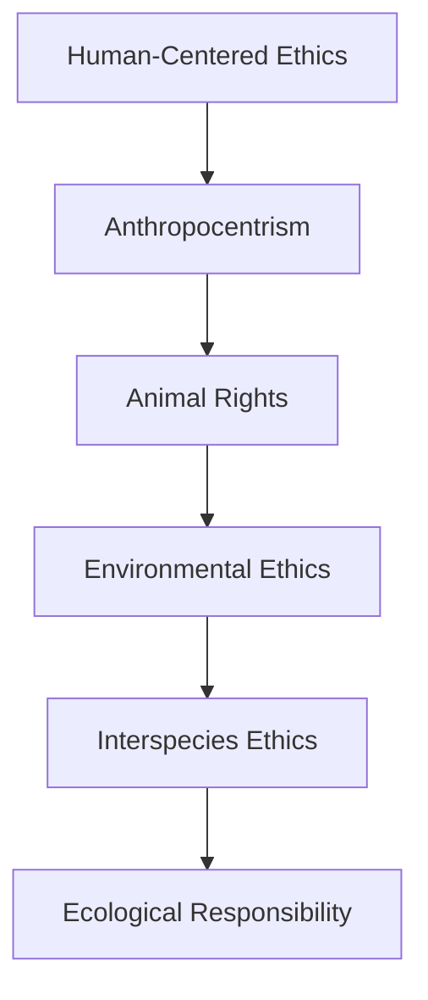

                 

### 引言：探索跨物种伦理的必要性与紧迫性

在人类文明的发展历程中，伦理学一直扮演着重要的角色，指导人类行为，构建社会秩序。然而，随着科技的进步和人类活动对地球生态系统的深刻影响，伦理学的视野逐渐从人类自身扩展到了更广泛的生物圈。跨物种伦理，作为一种新的伦理学领域，应运而生，它关注人类与其他生物，甚至是生态系统之间的关系和责任。

#### 背景介绍

近年来，生态危机成为全球关注的焦点。气候变化、生物多样性丧失、环境污染等问题不仅威胁着人类生存，也对地球上的其他生物造成了严重的影响。传统的伦理学理论往往局限于人类自身，忽略了人类与自然界之间的紧密联系。跨物种伦理的出现，正是为了填补这一空缺，强调人类应如何平衡自身需求与对自然界其他生物的责任。

#### 核心概念与联系

跨物种伦理的核心概念包括人类中心主义、动物权利、环境伦理等。这些概念相互交织，构成了一个复杂的伦理框架。人类中心主义认为人类是宇宙的中心，其他生物仅为人类服务。然而，随着生态学的发展，人们逐渐认识到所有生物都有其存在的价值，应受到尊重和保护。

**Mermaid 流程图：**



#### 伪代码示例：

```python
# 跨物种伦理框架的伪代码

initialize_ethics_framework()
add_concept("Human-Centered Ethics", "Focus on human needs")
add_concept("Anthropocentrism", "Prioritizing human well-being over others")
add_concept("Animal Rights", "Rights of non-human animals")
add_concept("Environmental Ethics", "Ethical considerations for the environment")
expand_ethics_scope("Interspecies Ethics", "Inclusiveness of all life forms")
add Principle("Ecological Responsibility", "Balancing human needs with ecological well-being")
```

#### 数学模型和公式

为了更好地理解跨物种伦理，我们可以借助数学模型来量化人类活动对生态系统的影响。以下是一个简化的模型：

$$
\text{Impact} = \frac{\text{Human Activity} \times \text{Ecological Sensitivity}}{\text{Natural Resilience}}
$$

其中，人类活动代表了人类对环境的干预程度，生态敏感性反映了环境对人类活动的反应速度，而自然韧性则代表了环境的自我恢复能力。

#### 详细讲解与举例说明

假设在一个地区，人类活动（如森林砍伐、农药使用等）导致生态敏感性增加，而该地区的自然韧性较低，那么根据上述模型，我们可以预测该地区的生态环境将会受到较大的负面影响。

**项目实战：**

在开发一个跨物种伦理分析工具时，我们可以搭建一个基于Python的生态伦理评估平台。该平台将集成上述数学模型，并提供用户界面，以便用户输入相关参数，得到生态影响的评估结果。

**伪代码示例：**

```python
# 生态伦理评估平台的伪代码

initialize_platform()
define_model("Impact", "Human Activity", "Ecological Sensitivity", "Natural Resilience")
set_parameters("Human Activity", 80)
set_parameters("Ecological Sensitivity", 100)
set_parameters("Natural Resilience", 50)
calculate_impact()
display_result()
```

通过这个项目实战，我们可以更好地理解跨物种伦理在实际应用中的具体操作方式，以及如何通过技术手段提升伦理决策的科学性和准确性。

### 小结

跨物种伦理的提出，是人类对自身与自然界关系认知的深化。它不仅挑战了传统的伦理学理论，也为解决生态危机提供了新的思路。在未来的发展中，跨物种伦理将逐渐成为伦理学领域的重要组成部分，引导人类走向更加和谐共生的未来。

---

**注意事项：**

1. 跨物种伦理的提出并不是否定人类在生态系统中的中心地位，而是强调人类应承担起更大的责任，确保生态系统的可持续性。
2. 在实际应用中，跨物种伦理需要结合具体情境进行具体分析，不能一刀切。
3. 需要加强跨学科合作，包括伦理学、生态学、环境科学等，共同推动跨物种伦理的理论与实践发展。

**拓展阅读：**

1. Naess, A. (1989). "Ethics, Environmental Philosophy, and Practical Reasoning."
2. Rolston, H. III. (1988). "Natures' Commoditization."
3. Wunner, W. (2015). "Animal Rights: A Reader in Philosophy."

