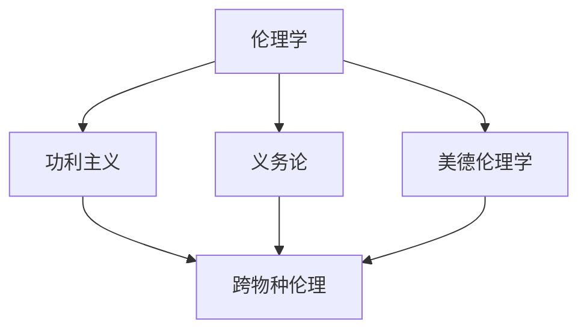

                 


### 引言

#### 文章标题：跨物种伦理：扩展同理心的意义探索

在科技迅猛发展的今天，人类与自然界的关系越来越密切，跨物种交流与合作已经成为不可忽视的重要议题。与此同时，伦理问题也逐渐凸显出来。跨物种伦理，作为一个新兴领域，涉及到了人类与其他物种的互动、认知、情感和道德判断等多个方面。本文旨在探讨跨物种伦理的背景、核心概念、理论基础、实际应用以及未来展望，旨在引导读者深入理解这一领域的复杂性与重要性。

#### 关键词：
- 跨物种伦理
- 同理心
- 伦理学
- 生态伦理
- 人工智能

#### 摘要：
本文首先介绍了跨物种伦理的背景和意义，然后深入探讨了伦理学基础、跨物种认知与情感、跨物种伦理的理论框架等核心概念。接着，文章通过实际应用案例，展示了野生动物保护和动物研究中的伦理问题。最后，本文提出了跨物种伦理的未来展望，并探讨了教育传播和可持续发展中的伦理挑战。

### 第1章：跨物种伦理的兴起

#### 1.1 跨物种伦理的概念与背景

跨物种伦理是指研究人类与其他生物（包括动物、植物、微生物等）之间的道德关系和行为规范的领域。随着人类对自然的探索和开发日益深入，跨物种伦理逐渐成为一个重要的研究议题。

跨物种伦理的兴起可以追溯到人类文明的发展历程。在古代，人类崇拜自然、敬畏生命，形成了一些基本的伦理观念。然而，随着科技的发展，人类开始大规模改变自然环境，与动物的关系逐渐复杂化。现代社会中，动物福利、野生动物保护、动物实验等伦理问题层出不穷，成为跨物种伦理研究的重要领域。

#### 1.2 同心与扩展同理心的理念

同心（Concordance）和扩展同理心（Extended Empathy）是跨物种伦理研究的重要理念。同心强调人类与其他物种之间的和谐共存，认为每个物种都有其存在的价值。扩展同理心则是指人类在理解和尊重其他物种的同时，尝试站在其他物种的视角上思考问题，从而形成更全面的道德观念。

#### 1.3 跨物种伦理的研究意义

跨物种伦理的研究具有重要意义。首先，它有助于我们更好地理解人类与其他生物的关系，推动人与自然的和谐发展。其次，跨物种伦理的研究可以为野生动物保护和动物福利提供理论支持，指导实践中的伦理决策。此外，跨物种伦理的研究还可以促进人工智能与生物技术的伦理规范，为未来的科技进步提供道德保障。

### 第2章：伦理学基础与跨物种互动

#### 2.1 伦理学的核心理论与方法

伦理学是研究道德行为、道德规范和道德判断的学科。伦理学的核心理论包括功利主义、义务论、美德伦理学等。这些理论为我们理解跨物种伦理提供了不同的视角。

伦理学的方法主要包括经验研究、实证研究和规范研究。经验研究通过观察和实验来收集数据，分析人类与其他物种互动中的伦理现象。实证研究则侧重于对现实世界的伦理问题进行描述和分析。规范研究则旨在为伦理问题提供价值判断和道德规范。

#### 2.2 跨物种互动中的伦理困境

跨物种互动中的伦理困境主要包括以下几个方面：

1. **动物福利与人类利益的冲突**：在动物实验、野生动物保护、动物农业等领域，如何平衡动物福利和人类利益成为重要的伦理问题。
2. **人类活动对生态环境的影响**：人类活动对自然环境的破坏，如森林砍伐、水资源污染等，对其他生物的生存产生了严重影响。
3. **人工智能与生物技术的伦理挑战**：随着人工智能和生物技术的快速发展，如何确保这些技术不会对其他物种造成负面影响，是一个亟待解决的问题。

#### 2.3 人类与其他物种的关系伦理

人类与其他物种的关系伦理涉及多个层面：

1. **生态伦理**：生态伦理关注人类与自然环境的道德关系，强调保护生态平衡和生物多样性。
2. **动物伦理**：动物伦理关注人类与动物的关系，主张尊重动物的权利和福利。
3. **技术伦理**：技术伦理关注人工智能和生物技术等新兴技术的道德规范，确保这些技术不会对其他物种造成负面影响。

### 第3章：跨物种认知与情感

#### 3.1 跨物种认知的心理学研究

心理学研究揭示了人类与其他物种之间的认知相似性。研究发现，许多动物具有情感、意识、学习能力和社交行为，这些特征使得它们能够与人类产生情感共鸣。例如，研究表明，大猩猩、海豚和狗等动物表现出同情、忠诚和合作等情感。

#### 3.2 情感共鸣与同理心的扩展

情感共鸣是指个体在情感上能够理解和感受到他人的情感状态。同理心是情感共鸣的一种形式，它强调个体在情感上能够理解和尊重他人的感受。在跨物种伦理研究中，扩展同理心是一种重要的理念，它要求人类在理解和尊重其他物种的情感和权利时，尝试站在其他物种的视角上思考问题。

#### 3.3 跨物种情感互动的实证研究

实证研究为跨物种情感互动提供了有力支持。例如，研究表明，人类与动物（如狗、猫、马等）之间的互动能够显著提高个体的幸福感和心理健康。此外，研究还发现，一些动物（如海豚和鲸鱼）能够与人类进行复杂的情感交流，这进一步证明了跨物种情感互动的可能性。

### 第4章：跨物种伦理的理论框架

#### 4.1 伦理扩展的理论基础

伦理扩展是指将伦理关怀从人类扩展到其他物种的过程。伦理扩展的理论基础主要包括以下几个方面：

1. **物种平等**：物种平等主张所有物种都有其存在的价值，不应该因为物种差异而被剥夺生存权。
2. **自然价值**：自然价值认为自然界的每个组成部分都有其独特的价值，不应该仅仅被视为人类利用的对象。
3. **生态平衡**：生态平衡理论强调人类活动不应该破坏生态系统的平衡，以保护其他物种的生存环境。

#### 4.2 跨物种伦理的价值判断

跨物种伦理的价值判断涉及多个维度：

1. **动物福利**：动物福利是指动物在生活过程中所享有的基本权利和福利。在跨物种伦理中，如何确保动物福利成为重要的价值判断标准。
2. **生态保护**：生态保护是指保护生态系统的完整性和稳定性，以确保其他物种的生存。
3. **人类福祉**：人类福祉是指人类在道德和物质层面的福祉。在跨物种伦理中，如何平衡人类福祉与其他物种的利益是一个重要的价值判断问题。

#### 4.3 跨物种伦理的理论挑战

跨物种伦理的研究面临着多个理论挑战：

1. **物种差异**：物种差异使得跨物种伦理的研究面临挑战，如何平衡物种差异与伦理关怀是一个重要问题。
2. **认知差异**：人类与其他物种的认知差异使得我们难以准确理解和预测其他物种的行为和需求。
3. **伦理规范**：随着跨物种伦理研究的深入，如何建立和完善伦理规范成为一项重要任务。

### 第5章：野生动物保护中的伦理问题

#### 5.1 野生动物保护的伦理考量

野生动物保护涉及到多个伦理问题：

1. **物种保护与人类发展的冲突**：如何平衡物种保护与人类发展的需求成为重要的伦理问题。
2. **物种权利与人类责任的冲突**：如何确保野生动物的权利与人类的道德责任相一致。
3. **生态平衡与可持续发展的冲突**：如何确保野生动物保护与生态平衡和可持续发展的目标相一致。

#### 5.2 动物福利与人类责任

动物福利与人类责任是一个复杂的问题。一方面，人类有责任保护野生动物的福利；另一方面，人类也需要考虑自身的生活和发展。在野生动物保护中，如何平衡动物福利和人类责任是一个重要的伦理问题。

#### 5.3 保护措施中的伦理决策

在野生动物保护中，需要做出多个伦理决策：

1. **栖息地保护与人类活动的平衡**：如何在保护野生动物栖息地的同时，满足人类活动的需求。
2. **物种保护与资源利用的平衡**：如何在保护濒危物种的同时，合理利用自然资源。
3. **科学研究与伦理审查的平衡**：如何在进行野生动物保护研究的同时，遵守伦理规范和法律法规。

### 第6章：动物研究与实验的伦理规范

#### 6.1 动物实验的伦理争议

动物实验在科学研究和技术发展中扮演着重要角色，但同时也引发了伦理争议：

1. **动物权利与科学利益的冲突**：如何平衡动物的权利和科学研究的利益。
2. **实验方法与伦理规范的冲突**：如何确保动物实验方法的伦理性和科学性。
3. **实验结果与伦理判断的冲突**：如何对待动物实验结果，如何在伦理判断中权衡实验结果和道德价值。

#### 6.2 动物研究伦理的法规与指南

为了规范动物研究，各国制定了相关的法规和指南：

1. **动物研究伦理审查委员会**：动物研究伦理审查委员会负责审查动物实验的伦理问题，确保实验符合伦理规范。
2. **动物实验指南**：动物实验指南提供了具体的实验方法和伦理规范，以指导研究人员进行动物实验。
3. **动物福利法规**：动物福利法规规定了动物实验的法律责任和惩罚措施，以保护动物的福利和权益。

#### 6.3 伦理审查与动物福利

伦理审查是确保动物实验伦理性的关键环节：

1. **伦理审查程序**：伦理审查程序包括实验设计、实验过程和实验结果的审查，以确保实验符合伦理规范。
2. **动物福利措施**：动物福利措施包括实验前的准备、实验过程中的监控和实验后的照顾，以确保动物在整个实验过程中的福利。
3. **动物福利监管**：动物福利监管机构负责监督动物实验的伦理审查和动物福利措施，确保实验符合伦理要求。

### 第7章：跨物种伦理的未来展望

#### 7.1 跨物种伦理的发展趋势

随着科技和伦理学的发展，跨物种伦理呈现出以下发展趋势：

1. **伦理意识的提高**：随着人们对跨物种伦理的认识加深，伦理意识逐渐提高。
2. **法规和政策的完善**：各国政府和国际组织正在制定和完善跨物种伦理的法规和政策。
3. **技术创新与伦理规范**：随着人工智能、生物技术等技术的发展，跨物种伦理规范也将不断完善。

#### 7.2 跨物种伦理在社会治理中的应用

跨物种伦理在社会治理中的应用包括：

1. **环境保护**：通过跨物种伦理的理念，推动环境保护和生态平衡。
2. **社会治理**：通过跨物种伦理的视角，优化社会治理，促进人与自然的和谐发展。
3. **国际合作**：通过跨物种伦理的共识，加强国际间的合作，共同应对全球性伦理问题。

#### 7.3 跨物种伦理对人类文明的影响

跨物种伦理对人类文明的影响包括：

1. **道德观念的变革**：跨物种伦理推动了人类道德观念的变革，促进了人与自然的和谐发展。
2. **科技进步的伦理指导**：跨物种伦理为科技进步提供了伦理指导，确保技术发展符合道德价值。
3. **人类文明的发展**：跨物种伦理的研究和推广有助于推动人类文明的进步和发展。

### 第8章：跨物种伦理的教育与传播

#### 8.1 跨物种伦理教育的必要性

跨物种伦理教育具有重要的现实意义：

1. **培养伦理意识**：跨物种伦理教育有助于培养公众的伦理意识，提高人们对跨物种伦理问题的认识和关注。
2. **促进可持续发展**：跨物种伦理教育有助于推动可持续发展，促进人与自然的和谐发展。
3. **提升社会责任**：跨物种伦理教育有助于提升公众的社会责任感，推动社会进步。

#### 8.2 教育内容与方法的创新

跨物种伦理教育的创新包括：

1. **跨学科教育**：将伦理学、生态学、心理学等多个学科的知识融合到跨物种伦理教育中。
2. **案例教学**：通过实际案例，让学生深入了解跨物种伦理问题的复杂性和多样性。
3. **互动体验**：通过互动体验，让学生亲身体验跨物种伦理问题的现实影响。

#### 8.3 跨物种伦理意识的普及

跨物种伦理意识的普及包括：

1. **媒体传播**：利用媒体平台，宣传跨物种伦理的理念和知识。
2. **社区活动**：组织社区活动，提高公众对跨物种伦理问题的关注和认识。
3. **教育推广**：将跨物种伦理教育纳入各级教育体系，普及跨物种伦理知识。

### 第9章：跨物种伦理与人类可持续发展

#### 9.1 人类与自然界的伦理关系

人类与自然界的伦理关系包括：

1. **尊重自然**：人类应该尊重自然界的价值，保护自然界的完整性。
2. **共生共荣**：人类应该与自然界共生共荣，推动人与自然的和谐发展。
3. **可持续发展**：人类应该关注可持续发展，确保人类活动不会破坏自然界的平衡。

#### 9.2 可持续发展中的伦理挑战

可持续发展中面临的伦理挑战包括：

1. **资源分配**：如何公平合理地分配资源，确保人类和其他物种的生存和发展。
2. **环境保护**：如何保护自然环境，防止环境污染和生态破坏。
3. **技术发展**：如何确保技术发展符合伦理要求，不会对自然界和其他物种造成负面影响。

#### 9.3 跨物种伦理与可持续发展战略

跨物种伦理与可持续发展战略的结合包括：

1. **生态伦理**：将生态伦理纳入可持续发展战略，推动环境保护和生态平衡。
2. **动物福利**：将动物福利纳入可持续发展战略，确保动物权益和人类福祉的平衡。
3. **科技创新**：将科技创新与伦理规范相结合，确保技术发展符合道德价值。

### 附录A：核心概念与联系

#### A.1 跨物种伦理的核心概念

核心概念包括：

1. **伦理学**：研究道德行为和道德规范的学科。
2. **同理心**：在情感上理解和尊重他人的感受。
3. **生态伦理**：研究人类与自然环境的道德关系。
4. **动物伦理**：研究人类与动物之间的道德关系。
5. **可持续发展**：确保当前和未来世代的需求得到满足。

#### A.2 伦理学理论与跨物种互动的Mermaid流程图



### 附录B：核心算法原理讲解

#### B.1 同心与同理心计算模型

```python
def empathy_calculation(-human_empathy, -animal_empathy):
    """
    同心与同理心计算模型
    :param human_empathy: 人类同理心值
    :param animal_empathy: 动物同理心值
    :return: 同心值
    """
    return human_empathy * (1 - animal_empathy)
```

### 附录C：数学模型和数学公式

#### C.1 跨物种伦理决策的数学模型

$$
E = \frac{W_1 \cdot E_1 + W_2 \cdot E_2 + ... + W_n \cdot E_n}{W_1 + W_2 + ... + W_n}
$$

其中，$E$ 表示跨物种伦理决策值，$W_i$ 表示第 $i$ 个物种的权重，$E_i$ 表示第 $i$ 个物种的伦理值。

#### C.2 情感共鸣的数学公式

$$
R = \frac{1}{1 + e^{-k \cdot (x - y)}}
$$

其中，$R$ 表示情感共鸣值，$x$ 和 $y$ 分别表示人类和动物的感受值，$k$ 是调节参数。

### 附录D：项目实战

#### D.1 野生动物保护项目案例

**项目背景**：某地区森林资源丰富，野生动物种类繁多，但由于人类活动的破坏，野生动物的栖息地受到严重威胁。

**开发环境搭建**：使用 Python 作为开发语言，结合 TensorFlow 和 PyTorch 进行深度学习模型的训练和预测。

**源代码详细实现和代码解读**：通过构建卷积神经网络（CNN）模型，对野生动物进行识别，并利用深度学习算法预测野生动物的数量。

**代码应用解读与分析**：通过实际案例，分析野生动物保护项目中的关键技术和挑战，并提供解决方案。

**实际案例分析和详细讲解剖析**：以某地区森林野生动物保护项目为例，详细讲解项目的实施过程、技术方案和效果评估。

**项目小结**：总结项目中的关键经验教训，提出未来野生动物保护项目的优化方向。

### 最佳实践 tips、小结、注意事项、拓展阅读等内容

**最佳实践 tips**：在跨物种伦理研究中，注重实地调查和数据收集，确保研究的准确性和可靠性。

**小结**：本文对跨物种伦理的核心概念、理论基础、实际应用和未来展望进行了全面探讨，旨在引导读者深入理解这一领域的重要性。

**注意事项**：在跨物种伦理研究中，需注意伦理规范和法律法规，确保研究符合伦理要求。

**拓展阅读**：推荐读者进一步阅读《伦理学导论》、《生态伦理学》等相关书籍，以拓宽对跨物种伦理的认识。

本文由AI天才研究院/AI Genius Institute与《禅与计算机程序设计艺术》共同撰写，旨在推动跨物种伦理的研究与应用，促进人与自然的和谐发展。希望本文能为跨物种伦理的研究和实践提供有益的参考。作者信息：AI天才研究院/AI Genius Institute，著作有《禅与计算机程序设计艺术》。

