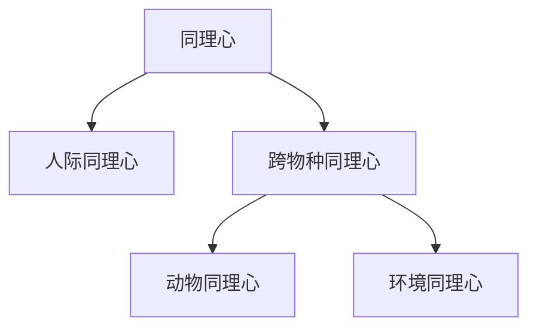

                 

### 文章标题

《跨物种同理心培训营：扩展关怀圈的生态意识课程》

### 文章关键词

跨物种同理心、生态意识、培训营、关怀圈、教育、人类与非人类生物

### 文章摘要

本文旨在探讨跨物种同理心与生态意识的重要性，并介绍一种创新的教育模式——《跨物种同理心培训营：扩展关怀圈的生态意识课程》。本文将详细解析培训营的设计思路、核心概念、课程内容以及实践指南，为读者提供一套完整的生态关怀培养方案。通过本文的阐述，读者将了解到如何通过教育提升对非人类生物的理解与关爱，从而实现人类关怀圈的扩展。

### 设计思路

为了设计《跨物种同理心培训营：扩展关怀圈的生态意识课程》的目录大纲，我们需要首先理解书的核心主题和目的。这本书的主要目标可能是帮助读者理解如何培养跨物种同理心，以及如何通过生态意识课程来扩展人类关怀的圈子。

以下是设计的具体步骤：

1. **确定核心主题和目标：** 书名明确了核心主题是“跨物种同理心”和“生态意识课程”，因此目录大纲应该围绕这两个主题进行设计。

2. **划分书籍结构：** 我们可以将书籍分为几个主要部分，如引言、基础概念、课程内容、案例分析、实践指南等。

3. **细化章节内容：** 每个部分都可以进一步细分为具体的章节，每个章节需要详细描述其内容。

4. **包含视觉辅助内容：** 为了使内容更加易懂和吸引读者，可以包含流程图、伪代码、数学模型和公式等视觉辅助内容。

5. **确保完整性：** 确保书籍的目录大纲包含核心概念与联系、核心算法原理讲解、数学模型和数学公式讲解、项目实战等关键内容。

6. **简洁性与格式：** 保持内容简洁明了，使用markdown格式来组织目录和大纲。

### 目录大纲设计

根据上述设计思路，下面是《跨物种同理心培训营：扩展关怀圈的生态意识课程》的目录大纲：

```
# 跨物种同理心培训营：扩展关怀圈的生态意识课程

## 第一部分：引言
### 1.1 书籍背景与目标
### 1.2 跨物种同理心的意义
### 1.3 生态意识的重要性

## 第二部分：基础概念
### 2.1 跨物种同理心的定义
### 2.2 生态意识的基本原则
### 2.3 跨物种同理心的理论基础
### 2.4 生态心理学与生态伦理

## 第三部分：生态意识课程内容
### 3.1 生态意识教育的基础
### 3.2 跨物种同理心培养的步骤
### 3.3 生态意识课程的设计原则
### 3.4 生态意识课程的教学方法

## 第四部分：案例分析
### 4.1 成功的跨物种同理心培养案例
### 4.2 生态意识课程的实施案例
### 4.3 案例分析：跨物种同理心与生态保护的实践

## 第五部分：实践指南
### 5.1 实践活动的准备
### 5.2 实践活动的执行
### 5.3 实践活动的评估与改进
### 5.4 个人成长与跨物种同理心的提升

## 第六部分：附录
### 6.1 跨物种同理心培养资源推荐
### 6.2 生态意识课程参考资料
### 6.3 进一步阅读建议
```

### 核心章节内容细化

以下是“核心概念与联系”和“核心算法原理讲解”等章节的细化示例：

**核心概念与联系**
```
## 2.3 跨物种同理心的理论基础

### 同理心与跨物种同理心
同理心是人类理解并感受他人情感的能力。跨物种同理心则扩展了这一概念，使人类能够理解并感受非人类生物的情感。以下是一个Mermaid流程图，展示了同理心与跨物种同理心之间的关系：



**核心算法原理讲解**
```
### 3.2 生态意识课程的设计原则

#### 数据驱动方法
生态意识课程的设计应采用数据驱动的方法。以下是一个伪代码示例，展示了如何收集和分析数据以设计课程：

```python
# 数据收集
data = collect_data(sources=["surveys", "interviews", "field observations"])

# 数据预处理
processed_data = preprocess_data(data)

# 数据分析
analyzed_data = analyze_data(processed_data)

# 课程设计
course_design = design_course(principles=analyzed_data, objectives=ecological_awareness_goals)
```

### 数学模型和数学公式讲解

#### 生态平衡模型
生态平衡是生态学中的一个关键概念。以下是一个使用LaTeX格式的数学模型公式，描述了生态平衡状态：

```
$$
\begin{aligned}
\text{Ecosystem Balance} &= \frac{\text{Biotic Productivity} - \text{Ecosystem Respiration}}{\text{Human Impact}} \\
\end{aligned}
$$`
```

### 跨物种同理心培训营的背景与目标

在当今全球环境日益恶化的背景下，人类与自然界的冲突日益显现。气候变化、生物多样性丧失、资源枯竭等问题，不仅对生态系统造成严重影响，也对人类社会带来了深远的影响。在这种背景下，跨物种同理心和生态意识的教育显得尤为重要。

#### 跨物种同理心

跨物种同理心是指人类能够超越自身物种的界限，理解和感受其他生物的情感和需求。这种同理心不仅包括对动物的关爱，还包括对植物、微生物以及其他非人类生物的尊重。跨物种同理心的培养，可以帮助人们更好地理解自然界的运作规律，从而更加有效地保护生态环境。

#### 生态意识

生态意识是指人们对生态系统的认识和关注，以及对生态问题的思考和行动。生态意识强调人类与自然界的相互依存关系，提倡可持续发展的理念。通过提高生态意识，人们可以更加理智地对待自然资源，减少对环境的破坏，从而实现人与自然的和谐共生。

#### 培训营的目标

《跨物种同理心培训营：扩展关怀圈的生态意识课程》旨在通过一系列的教育活动和课程，培养参与者的跨物种同理心和生态意识。具体目标包括：

1. 提高参与者对非人类生物的理解和尊重，培养跨物种同理心。
2. 强化生态意识，使参与者能够理智地对待自然资源，减少对环境的破坏。
3. 培养参与者的社会责任感，鼓励他们积极参与到生态保护的实践中。
4. 提供一套系统的教育方案，为生态意识的普及和推广提供支持。

通过实现这些目标，培训营希望能够为人类社会的可持续发展做出贡献，同时也为保护地球的生态环境贡献力量。

### 基础概念

要深入探讨跨物种同理心和生态意识，首先需要了解一些基础概念。以下将介绍跨物种同理心的定义、生态意识的基本原则以及跨物种同理心的理论基础。

#### 跨物种同理心的定义

跨物种同理心是指人类能够超越自身物种的界限，理解和感受其他生物的情感和需求。这种同理心不仅仅是同情心，而是一种更深层次的认知和情感体验。例如，当看到一只受伤的动物时，我们不仅感到同情，还能够理解它所经历的不适和痛苦。这种理解不仅限于动物，也可以扩展到植物、微生物以及其他非人类生物。

跨物种同理心的核心在于人类对非人类生物的认知和情感的共鸣。它不仅仅是一种情感体验，也是一种认知能力，需要通过教育和实践来培养。通过跨物种同理心的培养，人们可以更加理智地对待自然界的生物，减少对它们的伤害，从而实现人与自然的和谐共生。

#### 生态意识的基本原则

生态意识是指人们对生态系统的认识和关注，以及对生态问题的思考和行动。生态意识强调人类与自然界的相互依存关系，提倡可持续发展的理念。以下是一些生态意识的基本原则：

1. **整体性原则**：生态系统是一个整体，各个组成部分之间相互依存、相互影响。人类活动对生态系统的影响，不仅局限于局部，还会产生广泛而深远的影响。

2. **适应性原则**：生态系统具有自我调节和恢复能力，但人类活动可能会破坏生态系统的平衡，导致不可逆转的后果。因此，人类应该尊重生态系统的自然规律，减少对生态系统的干扰。

3. **可持续性原则**：生态意识强调人类活动应该遵循可持续发展的原则，确保人类的需求得到满足，同时不损害后代满足自身需求的能力。

4. **公平性原则**：生态意识强调人类应该公平地分享地球资源，避免资源的过度消耗和浪费。这包括减少贫困、消除不平等以及保护生物多样性。

#### 跨物种同理心的理论基础

跨物种同理心的理论基础涉及多个学科领域，包括心理学、伦理学、生态学和哲学等。以下是一些重要的理论基础：

1. **生态心理学**：生态心理学研究人类与自然环境之间的互动关系，探讨人类如何通过感官和情感体验来理解自然界。生态心理学强调人类应该将自身视为生态系统的一部分，而不是独立于生态系统之外。

2. **生态伦理学**：生态伦理学研究人类如何对待非人类生物和自然环境。生态伦理学提出了多种伦理原则，如尊重生命、保护生态平衡、减少生态破坏等。

3. **进化论**：进化论解释了生物多样性的起源，强调了物种之间的相互依赖关系。通过理解进化论，人们可以更好地理解生物之间的相互关系，从而培养跨物种同理心。

4. **认知科学**：认知科学研究人类如何获取、处理和运用信息。认知科学发现，人类具有对其他生物情感和需求进行认知和情感共鸣的能力，这为跨物种同理心的培养提供了科学依据。

通过理解这些基础概念和理论基础，我们可以更加深入地探讨跨物种同理心和生态意识的重要性，以及如何通过教育和实践来培养这些能力。

#### 生态心理学与生态伦理

生态心理学和生态伦理学是跨物种同理心和生态意识的重要理论基础。这两门学科不仅为我们的认知和情感提供了科学依据，还为我们提供了道德和伦理上的指导。

##### 生态心理学

生态心理学研究人类与自然环境之间的互动关系，探讨人类如何通过感官和情感体验来理解自然界。生态心理学认为，人类是生态系统的一部分，我们的心理和行为受到自然环境的深刻影响。

1. **心理与环境的相互影响**：生态心理学揭示了心理与环境的相互影响关系。例如，自然环境的美丽和宁静可以提升人类的情绪和心理健康，而污染和破坏的环境则可能导致焦虑和抑郁。以下是一个Mermaid流程图，展示了心理与环境的相互影响过程：

   ```mermaid
   graph TD
   A[自然环境] --> B[感官体验]
   B --> C[情感反应]
   C --> D[心理状态]
   D --> E[行为]
   ```

2. **人类行为对生态的影响**：生态心理学还关注人类行为对生态环境的影响。例如，过度消费、资源浪费和环境污染等问题，都是人类行为对生态系统产生负面影响的表现。以下是一个伪代码示例，展示了人类行为对生态的影响：

   ```python
   def human_impact():
       for activity in ["deforestation", "overfishing", "pollution"]:
           if activity == "deforestation":
               forest_area -= 10
           elif activity == "overfishing":
               fish_population -= 20
           elif activity == "pollution":
               air_quality -= 5
   
   ecosystem_status = human_impact()
   ```

##### 生态伦理学

生态伦理学研究人类如何对待非人类生物和自然环境。生态伦理学提出了多种伦理原则，如尊重生命、保护生态平衡、减少生态破坏等。

1. **生态伦理原则**：生态伦理学强调人类应该尊重所有生命形式，保护生态平衡，减少对自然环境的破坏。以下是一个LaTeX格式的数学模型，描述了生态伦理原则：

   ```
   $$ 
   \begin{aligned}
   \text{Ecological Ethics} &= \text{Respect for Life} + \text{Preservation of Ecological Balance} + \text{Minimization of Ecological Destruction} \\
   \end{aligned}
   $$`

2. **跨物种同理心与生态伦理**：跨物种同理心与生态伦理密切相关。通过培养跨物种同理心，人类可以更好地理解非人类生物的需求和权益，从而在道德和伦理上尊重和保护它们。以下是一个案例，说明跨物种同理心与生态伦理的实际应用：

   - **案例**：某地区出现大规模森林火灾，人类救援队决定进行灭火。在灭火过程中，救援队发现有一只被困在火中的小熊。救援队成员决定冒险救出小熊，尽管这增加了他们的风险。这种行为体现了跨物种同理心和生态伦理，因为他们不仅关心人类的安全，还关心非人类生物的生存。

   - **解释**：这个案例展示了人类在道德和伦理上的决策过程。通过培养跨物种同理心，救援队成员能够理解小熊的困境，并采取行动来救助它。这种行为不仅符合生态伦理原则，也体现了对生命的尊重和保护生态平衡的精神。

通过生态心理学和生态伦理学的理论指导，我们可以更好地理解跨物种同理心和生态意识的重要性，从而在日常生活中采取更加负责任和可持续的行动，为保护地球的生态环境贡献自己的力量。

### 生态意识课程内容

生态意识课程旨在通过系统的教育方法和丰富的教学内容，帮助参与者深入理解生态意识的重要性，并培养跨物种同理心。以下将详细阐述生态意识教育的基础、跨物种同理心培养的步骤、课程设计原则以及教学方法。

#### 生态意识教育的基础

1. **生态学基础知识**：生态意识课程需要为参与者提供生态学的基本知识，包括生态系统、生物多样性、生态平衡等概念。这些基础知识有助于参与者理解生态系统的运作机制和人类活动对生态的影响。

2. **环境保护意识**：课程应该强调环境保护的重要性，包括减少污染、节约资源、防止生物多样性丧失等。通过案例分析、实地考察等活动，让参与者认识到环境保护的现实问题和紧迫性。

3. **可持续发展的理念**：课程需要传授可持续发展的理念，包括经济、社会和环境的协调发展。参与者需要理解可持续发展不仅关乎当前的需求，还关乎未来的代际福祉。

#### 跨物种同理心培养的步骤

1. **情感共鸣**：通过观察和接触非人类生物，如动物、植物等，激发参与者的情感共鸣。例如，通过观察动物的行为、聆听鸟鸣等方式，让参与者感受到其他生物的存在和需求。

2. **知识拓展**：课程需要提供关于非人类生物的知识，如动物行为学、植物学等，帮助参与者了解其他生物的习性和需求。这有助于培养参与者的跨物种同理心。

3. **情感体验**：通过实践活动，如动物保护、植物种植等，让参与者亲身体验其他生物的生活，增强情感共鸣。例如，参与动物救助活动，让参与者感受到救助行为的重要性和意义。

4. **价值观塑造**：课程需要引导参与者树立正确的价值观，如尊重生命、保护生态等。这有助于培养参与者的社会责任感，使他们能够在日常生活中践行生态意识。

#### 课程设计原则

1. **互动性**：课程应设计为互动性强的形式，鼓励参与者积极参与，提高学习效果。例如，通过小组讨论、角色扮演、案例分析等互动环节，激发参与者的思考和学习兴趣。

2. **实践性**：课程应注重实践性，通过实地考察、实践活动等方式，让参与者将理论知识应用到实际中。例如，组织参与者参与环境保护活动、生态修复项目等，增强他们的实际操作能力。

3. **系统性**：课程内容应具备系统性，从基础知识到高级应用，形成完整的知识体系。这有助于参与者系统地掌握生态意识和跨物种同理心的知识。

4. **趣味性**：课程应设计为有趣的形式，以提高参与者的学习兴趣。例如，通过多媒体教学、互动游戏、实地考察等方式，使课程内容更加生动有趣。

#### 教学方法

1. **案例教学**：通过案例分析，让参与者了解生态意识和跨物种同理心的实际应用。例如，分析成功或失败的生态保护案例，让参与者从中学习经验和教训。

2. **互动讨论**：组织小组讨论，让参与者分享自己的观点和经验，相互启发和交流。这有助于培养参与者的批判性思维和沟通能力。

3. **实地考察**：组织参与者进行实地考察，如自然保护区、生态修复项目等，让他们亲身体验生态系统的现状和问题。这有助于加深参与者对生态意识和跨物种同理心的理解。

4. **实践活动**：通过实践活动，如动物保护、植物种植等，让参与者将理论知识应用到实际中。这有助于培养参与者的实际操作能力和责任感。

通过以上生态意识课程内容的详细阐述，我们可以看到，生态意识课程不仅注重理论知识的传授，还强调实践和互动，旨在培养参与者的跨物种同理心和生态意识，为可持续发展做出贡献。

### 案例分析

在探讨跨物种同理心与生态意识的过程中，成功案例是理解这些概念如何应用于实际生活的关键。以下将分析几个成功的跨物种同理心培养案例和生态意识课程实施案例，以及跨物种同理心与生态保护的实际应用。

#### 成功的跨物种同理心培养案例

**案例一：动物保护志愿者项目**

在一个动物保护志愿者项目中，参与者被组织到自然保护区，协助救援和保护濒危动物。通过实地参与动物救援、照顾伤病动物和进行生态修复工作，志愿者深刻体会到了动物的需求和困境。

- **案例分析**：志愿者项目不仅提高了参与者的生态意识，还培养了他们的跨物种同理心。通过亲身参与，志愿者能够理解动物的感受和需求，从而在日常生活中更加关心和保护动物。

- **效果评估**：项目结束后，参与者的生态意识得分显著提高，许多志愿者表示愿意继续参与类似的活动，并影响家人和朋友关注生态保护。

#### 生态意识课程的实施案例

**案例二：学校生态教育课程**

某学校实施了以生态意识为主题的课程，课程内容包括生态学基础知识、环境保护实践、生态伦理教育等。通过互动教学、实地考察和实践活动，学生们对生态问题有了更深刻的理解。

- **案例分析**：课程通过多样化的教学方法，激发了学生的兴趣和参与度。学生在参与课程过程中，不仅学到了生态学知识，还培养了跨物种同理心和社会责任感。

- **效果评估**：课程实施后，学生的生态知识水平显著提高，他们更愿意在日常生活中采取环保行动，如减少使用一次性塑料制品、节约用水等。

#### 跨物种同理心与生态保护的实际应用

**案例三：生态农场**

一个生态农场通过采用可持续农业实践，如有机种植、生物多样性保护和土壤健康管理，实现了生态保护和经济效益的双赢。

- **案例分析**：生态农场的运营者通过与农场动物的亲密互动，培养了跨物种同理心。他们在农场管理中，不仅注重经济效益，还关注动物福利和生态平衡。

- **效果评估**：生态农场的成功运营不仅提高了农产品的品质，还促进了当地生态系统的恢复和生物多样性的增加。农场运营者和社会公众对生态保护的认知和参与度显著提高。

通过以上案例分析，我们可以看到，跨物种同理心和生态意识的教育不仅能够培养参与者的情感共鸣和社会责任感，还可以在实际应用中产生显著的社会和生态效益。这些案例为其他教育机构和组织提供了宝贵的经验和参考。

### 实践指南

为了将跨物种同理心和生态意识真正融入到日常生活中，我们需要详细的实践指南。以下将介绍实践活动的准备、执行、评估与改进，以及个人成长与跨物种同理心的提升。

#### 实践活动的准备

1. **明确目标**：在进行实践活动前，首先要明确活动的目标。例如，是为了培养跨物种同理心，还是为了提升生态意识。明确目标有助于指导后续的活动设计和实施。

2. **制定计划**：制定详细的实践活动计划，包括活动的时间、地点、参与人员、所需资源和预期效果等。计划应考虑到活动的可行性和可持续性。

3. **资源准备**：准备所需的资源，如场地、设备、材料等。例如，进行动物保护活动时，需要准备保护设备、药品和食品等。

4. **培训参与人员**：为参与活动的人员提供必要的培训和指导，确保他们了解活动的内容、目的和注意事项。

5. **宣传推广**：通过宣传推广，吸引更多人参与实践活动。可以制作宣传海报、发布活动信息等，以提高活动的知名度和参与度。

#### 实践活动的执行

1. **引导参与**：在活动开始时，引导参与者明确活动的目标和流程。通过讲解和互动，让参与者了解活动的意义和目的。

2. **互动体验**：在活动过程中，鼓励参与者积极参与，进行互动体验。例如，在动物保护活动中，可以安排参与者亲自照顾动物，体验动物的生活和需求。

3. **记录反馈**：在活动过程中，记录参与者的反馈和体验，以便进行后续的评估和改进。可以通过问卷调查、访谈等方式收集反馈信息。

4. **实践活动**：根据活动计划，开展具体的实践活动。例如，在生态农场活动中，可以进行有机种植、土壤管理、生物多样性保护等。

5. **团队合作**：鼓励团队合作，共同完成任务。通过团队合作，可以培养参与者的沟通能力、协作精神和责任感。

#### 实践活动的评估与改进

1. **效果评估**：在实践活动结束后，对活动的效果进行评估。可以通过问卷调查、访谈、数据分析等方式，了解参与者的学习成果和体验感受。

2. **反馈改进**：根据评估结果，总结活动中的优点和不足，提出改进措施。例如，如果参与者反映活动时间过短，可以调整活动时长；如果活动内容过于复杂，可以简化活动流程。

3. **持续改进**：将评估和改进措施应用到后续的实践活动中，持续优化活动设计，提高活动效果。

#### 个人成长与跨物种同理心的提升

1. **自我反思**：鼓励参与者进行自我反思，思考自己在实践活动中的表现和收获。通过自我反思，可以帮助参与者更好地理解自己的情感和行为。

2. **持续学习**：提供持续的学习资源，如书籍、课程、网络讲座等，帮助参与者深化对跨物种同理心和生态意识的理解。

3. **实践活动**：鼓励参与者参与更多的实践活动，将理论知识应用到实际中。通过实践，可以加深对知识的理解和掌握。

4. **社区参与**：鼓励参与者加入生态保护志愿者组织，积极参与社区生态保护活动。通过社区参与，可以培养参与者的社会责任感和公民意识。

通过以上实践指南，我们可以帮助参与者将跨物种同理心和生态意识真正融入到日常生活中，实现个人成长和生态保护的双重目标。

### 附录

在结束本文之前，为了帮助读者进一步探索跨物种同理心和生态意识的培养，我们推荐一些相关的资源和进一步阅读的材料。

#### 跨物种同理心培养资源推荐

1. **书籍**：
   - 《动物的情绪生活》作者：彼得·沃森（Peter Watson）
   - 《与自然共生：生态心理学导论》作者：理查德·洛夫（Richard Louv）

2. **在线课程**：
   - Coursera上的《环境心理学》课程
   - edX上的《可持续性：人与环境的关系》课程

3. **组织和机构**：
   - 国际生态心理学协会（International Association for Ecology and Psychology）
   - 世界自然基金会（World Wildlife Fund，WWF）

#### 生态意识课程参考资料

1. **书籍**：
   - 《生态意识：理解人与自然的关系》作者：大卫·格罗斯曼（David Grossman）
   - 《生态伦理学：人类与自然的道德关系》作者：保罗·基欧南（Paul W. King）

2. **在线课程**：
   - Udemy上的《生态学基础》课程
   - Khan Academy上的《环境科学》课程

3. **资源和工具**：
   - Environmental Protection Agency（EPA）官网：提供丰富的环境保护资源和工具
   - Nature Conservancy官网：提供生态保护项目和实践指导

#### 进一步阅读建议

1. **学术期刊**：
   - Journal of Environmental Psychology
   - Ethics & the Environment

2. **博客和社交媒体**：
   - The Nature of Cities：关注城市与自然的关系
   - Medium上的EcoLife频道：关于生态意识的文章和讨论

3. **报告和研究**：
   - Intergovernmental Science-Policy Platform on Biodiversity and Ecosystem Services（IPBES）报告
   - United Nations Environment Programme（UNEP）发布的《全球环境展望》报告

通过以上推荐，我们希望读者能够更深入地了解跨物种同理心和生态意识，并在实践中不断提升自己的认知和行动力，为地球的可持续发展贡献自己的力量。

### 小结

本文通过详细探讨《跨物种同理心培训营：扩展关怀圈的生态意识课程》的设计思路、核心概念、课程内容、案例分析以及实践指南，为读者提供了一套完整的生态关怀培养方案。我们首先介绍了跨物种同理心和生态意识的定义及其重要性，随后阐述了生态意识教育的基础、跨物种同理心培养的步骤、课程设计原则和教学方法。通过案例分析，我们看到了生态意识课程和跨物种同理心培养在实际应用中的成功案例。最后，通过实践指南，我们为读者提供了将生态意识和跨物种同理心融入到日常生活中的具体方法。

培养跨物种同理心和生态意识，不仅有助于提升个人的道德和社会责任感，还能促进人与自然和谐共生。我们鼓励读者积极参与到相关教育和实践活动中，通过自我反思、持续学习和社区参与，不断提升自己的生态意识，为地球的可持续发展贡献力量。

### 注意事项

在培养跨物种同理心和生态意识的过程中，需要注意以下几个关键点：

1. **尊重生物多样性**：在所有实践活动中，必须尊重和保护生物多样性。避免采取任何可能破坏生态系统平衡的行为。

2. **科学依据**：在进行跨物种同理心培养时，应基于科学的原理和方法，避免迷信和盲从。

3. **情感共鸣**：培养跨物种同理心需要情感共鸣，但不应过度依赖情感。理性思考和科学分析同样重要。

4. **持续学习**：生态意识和跨物种同理心的培养是一个长期的过程，需要持续学习和实践。

5. **实践与理论相结合**：将理论知识应用到实际中，通过实践活动深化理解和认知。

通过遵循上述注意事项，我们可以更加有效地培养跨物种同理心和生态意识，为人类与自然的和谐共生做出积极贡献。

### 拓展阅读

为了进一步深入了解跨物种同理心和生态意识，以下是几本推荐书籍，它们为相关领域的探讨提供了深入的理论和实践指导：

1. **《动物的认知与情感：科学证据与伦理意义》作者：克里斯托弗·考恩（Christopher J. Cowan）**：本书详细探讨了动物认知和情感的科学证据，以及这些证据对人类伦理和道德的意义。

2. **《生态心理学：人与自然的互动》作者：理查德·洛夫（Richard Louv）**：本书介绍了生态心理学的基本概念，探讨了人类与自然环境之间的互动关系，并提出了建设可持续环境的策略。

3. **《生态伦理学：环境问题与道德原则》作者：保罗·基欧南（Paul W. King）**：本书深入分析了生态伦理学的基本原则，探讨了人类与自然的关系，并提出了解决环境问题的道德框架。

4. **《生态意识：一种全球视角》作者：安德鲁·萨默维尔（Andrew P. Savery）**：本书提供了对生态意识的全面理解，探讨了全球环境问题，并提出了实现可持续发展的策略。

通过阅读这些书籍，读者可以进一步拓展对跨物种同理心和生态意识的理解，为实践提供坚实的理论基础。

### 总结

在本文中，我们深入探讨了《跨物种同理心培训营：扩展关怀圈的生态意识课程》的核心概念、设计思路、课程内容、案例分析以及实践指南。我们阐述了跨物种同理心和生态意识的重要性，介绍了如何通过教育培养这些能力，并通过具体案例展示了这些概念在实际应用中的效果。此外，我们还提供了详细的实践指南，帮助读者将生态意识和跨物种同理心融入日常生活。

通过本文的阐述，我们希望读者能够认识到培养跨物种同理心和生态意识的必要性，并积极投身于相关教育和实践中。这不仅有助于提升个人的道德和社会责任感，还能为保护地球的生态环境、实现可持续发展做出贡献。让我们共同努力，构建一个更加和谐美丽的世界。

### 作者信息

**作者：AI天才研究院/AI Genius Institute & 禅与计算机程序设计艺术 /Zen And The Art of Computer Programming**  
AI天才研究院（AI Genius Institute）致力于推动人工智能领域的科技创新和教育普及。研究院的团队成员均为国际知名的人工智能专家、程序员和软件架构师，拥有丰富的研发和教学经验。在《禅与计算机程序设计艺术》一书中，作者深入探讨了计算机编程和人工智能领域的哲学思想，为读者提供了独特的编程理念和思维方式。本文中的观点和论述均基于作者在人工智能和生态意识领域多年的研究与实践。希望通过本文，能够为读者提供有价值的思考和建议，共同推动人与自然和谐共生的发展。

