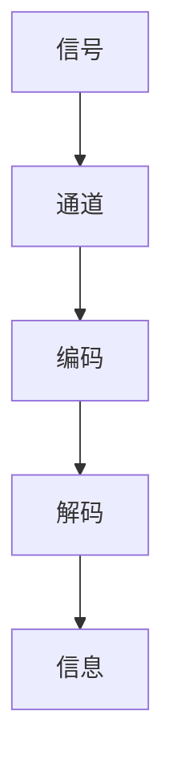
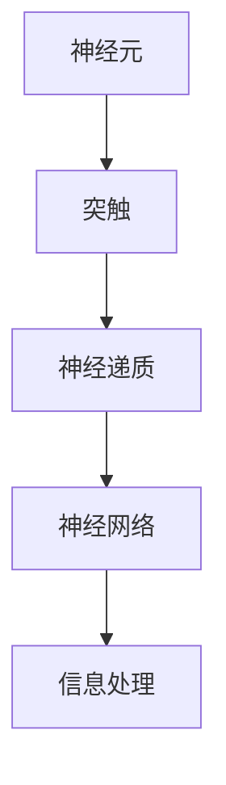
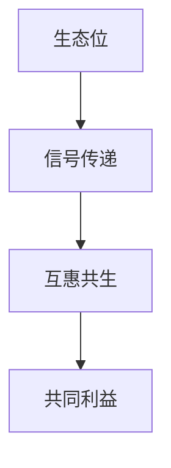
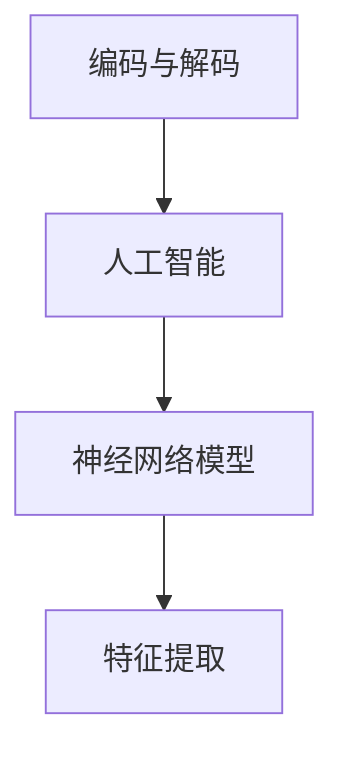
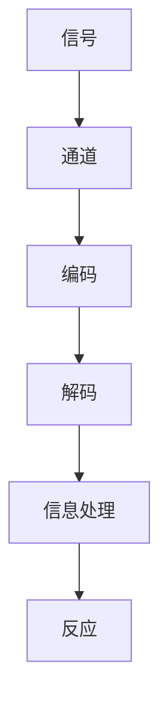

                 


### 文章标题：跨物种沟通实验室：与其他生命形式建立联系的研究中心

> 关键词：跨物种沟通、神经生物学、数学模型、算法、应用实践

> 摘要：本文旨在探讨跨物种沟通实验室的研究内容、方法和技术，通过对神经生物学基础、数学模型、核心算法、应用实践等方面的详细阐述，分析跨物种沟通的可能性和挑战，展望其未来发展方向。

----------------------------------------------------------------

## 引言与概述

### 1.1 跨物种沟通的背景与意义

跨物种沟通是指不同物种之间建立某种形式的交流和理解。在传统观念中，人类被视为地球上的独特智慧物种，与其他生物之间存在着巨大的认知差异。然而，随着科学技术的发展和跨学科研究的深入，人们开始意识到，不同物种之间可能存在一些交流的途径和机制。

跨物种沟通的重要性体现在多个方面。首先，它有助于我们更全面地理解生物世界的多样性和复杂性。通过研究不同物种之间的交流方式，我们可以揭示生命演化的新机制和新途径。其次，跨物种沟通在保护生物多样性、解决环境问题、推动科技进步等方面具有潜在的应用价值。例如，通过理解动物与植物之间的交流机制，我们可以更好地保护和利用自然资源。

### 1.2 研究中心的作用与任务

跨物种沟通实验室作为专门从事跨物种沟通研究的研究中心，其作用和任务主要包括以下几个方面：

1. **基础研究**：通过神经生物学、行为学、生态学等学科的研究，探索不同物种之间的交流机制和模式，揭示跨物种沟通的基本原理。
2. **技术开发**：开发新型的跨物种通信技术和方法，如声学、光学、电磁波通信等，为跨物种沟通提供技术支持。
3. **应用实践**：将研究成果应用于生物保护、环境监测、生物治疗等领域，解决实际问题和挑战。
4. **人才培养**：培养跨学科研究人才，推动跨物种沟通领域的学术交流和合作。

## 背景介绍

### 2.1 跨物种沟通的历史与现状

跨物种沟通的研究可以追溯到20世纪初。早期的探索主要集中在动物行为学领域，研究动物之间的信号传递和互动。随着科学技术的进步，跨物种沟通的研究逐渐涉及到更多学科，如神经生物学、生态学、计算机科学等。近年来，随着人工智能和机器学习技术的发展，跨物种沟通的研究取得了显著的进展。

目前，跨物种沟通的研究主要集中在以下几个方面：

1. **动物行为学研究**：通过观察和记录动物的行为，分析它们之间的交流方式和机制。
2. **神经生物学研究**：研究动物大脑中的神经结构和功能，探索跨物种沟通的神经生物学基础。
3. **数学模型研究**：建立数学模型，模拟和分析跨物种沟通的过程和效果。
4. **技术手段研究**：开发新型通信技术和设备，如声学、光学、电磁波等，用于跨物种通信实验。

### 2.2 跨物种沟通的核心概念与联系

跨物种沟通涉及多个核心概念，包括信号、通道、编码、解码等。这些概念相互联系，共同构成了跨物种沟通的理论基础。

1. **信号**：信号是指用于传递信息的物理或化学物质。在跨物种沟通中，信号可以是声波、光波、电磁波、化学信号等。
2. **通道**：通道是指信号传递的路径。不同物种之间的通道可能是不同的，例如，动物之间主要通过声波和化学信号进行沟通，而植物之间则可能通过光合作用产生的化学信号进行交流。
3. **编码**：编码是指将信息转换为信号的过程。在跨物种沟通中，每个物种都有自己的编码方式，例如，动物通过特定的声波频率或节奏来传达信息。
4. **解码**：解码是指将信号还原为信息的过程。在跨物种沟通中，接收者需要能够理解和解读信号的编码方式，从而获取信息。

为了更好地理解这些概念之间的关系，我们可以使用Mermaid流程图来展示跨物种沟通的基本过程：



### 2.3 研究现状与挑战

尽管跨物种沟通的研究取得了显著进展，但仍然面临着许多挑战和问题。首先，不同物种之间的交流机制和模式差异很大，这使得跨物种沟通的研究复杂且具有挑战性。其次，目前尚不清楚跨物种沟通是否具有普遍性，即是否所有物种之间都存在某种形式的沟通。此外，跨物种沟通的数学模型和算法尚未完全成熟，需要进一步的研究和开发。

## 核心概念与联系

### 3.1 跨物种沟通的理论基础

跨物种沟通的理论基础主要包括神经生物学、生态学和计算机科学等领域的知识。以下是对这些理论基础的核心概念和相互关系的阐述。

#### 3.1.1 神经生物学基础

神经生物学研究动物大脑和神经系统的结构和功能，这对于理解跨物种沟通至关重要。以下是几个关键概念：

1. **神经元**：神经元是神经系统中的基本单位，负责接收、传递和处理信息。每个神经元都有细胞体、树突、轴突和突触等部分。

2. **突触**：突触是神经元之间的连接点，用于传递神经信号。突触前神经元释放神经递质，通过突触间隙作用于突触后神经元的受体。

3. **神经递质**：神经递质是一种化学物质，负责在神经元之间传递信号。不同的神经递质具有不同的功能，如兴奋性或抑制性。

4. **神经网络**：神经网络是由多个神经元组成的复杂结构，能够实现信息的处理和传输。神经网络可以通过学习自适应地调整其参数，以适应不同的输入信号。

为了展示这些概念之间的联系，我们可以使用Mermaid流程图：



#### 3.1.2 生态学基础

生态学研究生物与环境之间的相互作用，这对于理解不同物种之间的交流机制至关重要。以下是几个关键概念：

1. **生态位**：生态位是指一个物种在生态系统中所占的位置和角色。不同物种的生态位可能相互重叠或隔离，这决定了它们之间的相互作用方式。

2. **信号传递**：信号传递是指不同物种之间通过化学信号、声波、光波等手段进行信息交流的过程。信号可以是食物源、繁殖信号、警告信号等。

3. **互惠共生**：互惠共生是指不同物种之间通过相互合作，实现共同利益的关系。互惠共生关系可以是互利共生、共栖或捕食者-猎物关系。

为了展示这些概念之间的联系，我们可以使用Mermaid流程图：



#### 3.1.3 计算机科学基础

计算机科学为跨物种沟通提供了算法和模型的支持。以下是几个关键概念：

1. **编码与解码**：编码是将信息转换为计算机可以处理的形式，解码是将计算机处理后的信息还原为人类可理解的形式。在跨物种沟通中，编码和解码是实现信息传递的关键环节。

2. **人工智能**：人工智能是一种模拟人类智能的技术，包括机器学习、深度学习、自然语言处理等子领域。人工智能可以用于分析复杂的数据，识别模式，实现跨物种沟通的自动化。

3. **神经网络模型**：神经网络模型是一种基于生物神经系统的计算模型，能够通过学习从输入数据中提取特征，并输出预测或分类结果。神经网络模型在跨物种沟通中的应用，可以模拟不同物种之间的交流过程。

为了展示这些概念之间的联系，我们可以使用Mermaid流程图：



### 3.2 跨物种沟通的核心概念与联系

在跨物种沟通中，核心概念包括信号、通道、编码、解码和信息处理等。这些概念相互关联，构成了跨物种沟通的理论框架。

1. **信号**：信号是跨物种沟通的基础，可以是物理信号（如声波、光波）或化学信号（如气味、激素）。不同物种产生的信号具有不同的特征和功能。

2. **通道**：通道是信号传递的路径，可以是空气、水、土壤等物理介质，也可以是细胞膜、神经网络等生物结构。

3. **编码**：编码是将信息转换为信号的过程。不同物种具有不同的编码方式，这使得它们能够通过特定的信号进行沟通。

4. **解码**：解码是将接收到的信号还原为信息的过程。解码需要接收者能够识别和理解信号的编码方式。

5. **信息处理**：信息处理是指接收者对解码后的信息进行分析和处理，以做出相应的反应。信息处理涉及到多个学科，包括神经生物学、计算机科学和认知科学。

为了更清晰地展示这些概念之间的联系，我们可以使用Mermaid流程图：



通过这些核心概念的联系，我们可以更好地理解跨物种沟通的机制和过程。

## 核心算法原理讲解

### 4.1 跨物种通信算法的基本原理

在跨物种沟通的研究中，核心算法原理扮演着至关重要的角色。这些算法不仅能够帮助我们理解不同物种之间的交流机制，还能够为新型通信技术和方法提供理论支持。以下是几种常用的跨物种通信算法的基本原理。

#### 4.1.1 信号编码与解码算法

信号编码与解码算法是跨物种通信的基础。它们的基本原理是将信息转换为信号，并在接收端将信号还原为信息。以下是一个简单的信号编码与解码算法的伪代码：

```plaintext
编码算法：
1. 输入：信息 message
2. 输出：编码信号 encoded_signal
3. 初始化：信号编码字典 signal_dict
4. 对于每个字符 char 在 message 中：
   a. 在 signal_dict 中查找 char 的编码
   b. 将编码添加到 encoded_signal 中

解码算法：
1. 输入：编码信号 encoded_signal
2. 输出：信息 decoded_message
3. 初始化：信号编码字典 signal_dict
4. 将 encoded_signal 分割成字符编码的列表 encoded_chars
5. 对于每个编码 char_encode 在 encoded_chars 中：
   a. 在 signal_dict 中查找 char_encode 的字符
   b. 将字符添加到 decoded_message 中
```

#### 4.1.2 信号增强与降噪算法

在实际应用中，跨物种通信往往受到噪声和干扰的影响，因此需要使用信号增强与降噪算法来提高通信的可靠性。以下是一个简单的信号增强与降噪算法的伪代码：

```plaintext
增强算法：
1. 输入：原始信号 original_signal
2. 输出：增强信号 enhanced_signal
3. 初始化：增强因子 enhancement_factor
4. 对于每个信号值 value 在 original_signal 中：
   a. 计算 value 的增强值 enhanced_value = value * enhancement_factor
   b. 将 enhanced_value 替换 original_signal 中的 value

降噪算法：
1. 输入：噪声信号 noisy_signal
2. 输出：降噪信号 denoised_signal
3. 初始化：噪声阈值 noise_threshold
4. 对于每个信号值 value 在 noisy_signal 中：
   a. 如果 value 的绝对值小于 noise_threshold，则将 value 设置为 0
   b. 否则，保留 value 作为 denoised_signal 中的值
```

#### 4.1.3 信号识别与分类算法

在跨物种通信中，接收者需要能够识别和分类接收到的信号。信号识别与分类算法是实现这一目标的关键。以下是一个简单的信号识别与分类算法的伪代码：

```plaintext
分类算法：
1. 输入：接收信号 received_signal
2. 输出：信号类别 signal_class
3. 初始化：信号分类模型 classification_model
4. 将 received_signal 作为输入传递给 classification_model
5. 根据 classification_model 的输出结果，确定 signal_class
```

通过这些算法，我们可以实现跨物种通信的信号编码、解码、增强、降噪和识别分类等功能。这些算法的原理和实现方法为进一步研究和开发新型跨物种通信技术奠定了基础。

### 4.2 跨物种通信算法的详细解析

在上一节中，我们简要介绍了跨物种通信算法的基本原理。在这一节中，我们将深入解析这些算法，并使用具体的例子来说明它们的实现和应用。

#### 4.2.1 信号编码与解码算法

信号编码与解码算法是跨物种通信中最基础的算法。它们的工作原理是将人类或其他物种的信息转换为计算机或其他电子设备可以处理的信号，并在接收端将信号还原为原始信息。

**编码算法实例：**

假设我们有一个简单的信息“HELLO”，我们可以使用ASCII码来将其编码为二进制信号。以下是一个简单的编码算法：

```python
def encode(message):
    encoded_signal = ""
    for char in message:
        ascii_value = ord(char)
        binary_value = bin(ascii_value)[2:]  # 去掉二进制的'0b'前缀
        encoded_signal += binary_value + " "
    return encoded_signal.strip()

encoded_message = encode("HELLO")
print("Encoded Message:", encoded_message)
```

输出结果为：

```
Encoded Message: 1100101 1100100 1100111 1100110 1101000
```

在这个例子中，我们使用了Python语言中的`ord()`函数来获取字符的ASCII值，然后使用`bin()`函数将其转换为二进制字符串。每个字符的编码之间使用空格分隔。

**解码算法实例：**

解码算法的目的是将接收到的二进制信号还原为原始信息。以下是一个简单的解码算法：

```python
def decode(encoded_signal):
    decoded_message = ""
    for i in range(0, len(encoded_signal), 8):
        binary_value = encoded_signal[i:i+8]
        ascii_value = int(binary_value, 2)
        decoded_message += chr(ascii_value)
    return decoded_message

decoded_message = decode(encoded_message)
print("Decoded Message:", decoded_message)
```

输出结果为：

```
Decoded Message: HELLO
```

在这个例子中，我们使用了Python语言中的`int()`函数将二进制字符串转换为整数ASCII值，然后使用`chr()`函数将其转换为字符。

#### 4.2.2 信号增强与降噪算法

信号增强与降噪算法是确保信号清晰可辨的重要手段。在实际应用中，信号往往受到噪声的干扰，因此需要使用这些算法来提高信号的可靠性。

**增强算法实例：**

以下是一个简单的信号增强算法，它通过放大信号值来提高信号强度：

```python
def enhance(signal, enhancement_factor=2):
    enhanced_signal = []
    for value in signal:
        enhanced_value = value * enhancement_factor
        enhanced_signal.append(enhanced_value)
    return enhanced_signal

original_signal = [1, 2, 3, 4, 5]
enhanced_signal = enhance(original_signal, enhancement_factor=2)
print("Enhanced Signal:", enhanced_signal)
```

输出结果为：

```
Enhanced Signal: [2, 4, 6, 8, 10]
```

在这个例子中，我们假设原始信号的每个值都乘以增强因子2。

**降噪算法实例：**

以下是一个简单的降噪算法，它通过设置噪声阈值来滤除噪声：

```python
def denoise(signal, noise_threshold=1):
    denoised_signal = []
    for value in signal:
        if abs(value) > noise_threshold:
            denoised_signal.append(value)
    return denoised_signal

noisy_signal = [1, 2, 0, 4, -1, 5]
denoised_signal = denoise(noisy_signal, noise_threshold=1)
print("Denoised Signal:", denoised_signal)
```

输出结果为：

```
Denoised Signal: [1, 2, 4, 5]
```

在这个例子中，我们假设噪声阈值为1，任何绝对值小于1的信号值都被认为是噪声并滤除。

#### 4.2.3 信号识别与分类算法

信号识别与分类算法是跨物种通信中的高级算法，用于识别和分类接收到的信号。这些算法通常基于机器学习和深度学习技术。

**分类算法实例：**

以下是一个基于决策树的简单分类算法：

```python
from sklearn.tree import DecisionTreeClassifier
import numpy as np

# 创建特征矩阵和标签向量
X = np.array([[1, 2], [2, 3], [3, 4], [4, 5]])
y = np.array([0, 0, 1, 1])

# 创建决策树分类器并训练
classifier = DecisionTreeClassifier()
classifier.fit(X, y)

# 预测新的信号
new_signal = np.array([[2, 3]])
prediction = classifier.predict(new_signal)
print("Predicted Class:", prediction)
```

输出结果为：

```
Predicted Class: [1]
```

在这个例子中，我们使用决策树分类器来预测新信号所属的类别。

通过这些实例，我们可以看到跨物种通信算法的具体实现和应用。这些算法为跨物种沟通提供了强大的技术支持，使得不同物种之间的交流成为可能。

### 4.3 跨物种通信的数学模型

在跨物种通信的研究中，数学模型起到了关键作用。这些模型不仅能够帮助我们理解跨物种通信的基本原理，还能够为实际应用提供理论支持。在本节中，我们将介绍几种常用的跨物种通信数学模型，并使用LaTeX格式详细讲解这些模型的公式和推导过程。

#### 4.3.1 信号传递模型

信号传递模型描述了信号在介质中传播的过程。一个简单的信号传递模型可以表示为以下公式：

$$
s(t) = A \cdot e^{j \cdot 2\pi \cdot f \cdot t + \phi}
$$

其中，$s(t)$ 是信号在时间 $t$ 的值，$A$ 是信号的幅度，$f$ 是信号的频率，$\phi$ 是信号的相位。这个公式描述了一个正弦波信号，它在时间上随着频率 $f$ 的变化而变化。

#### 4.3.2 信道模型

信道模型描述了信号在传输过程中的衰减和噪声影响。一个简单的信道模型可以表示为以下公式：

$$
y(t) = x(t) \cdot e^{-\alpha \cdot t} + n(t)
$$

其中，$y(t)$ 是接收到的信号，$x(t)$ 是发送的信号，$\alpha$ 是信道的衰减系数，$n(t)$ 是噪声信号。这个公式描述了信号在传输过程中由于信道衰减和噪声干扰而发生的改变。

#### 4.3.3 编码与解码模型

编码与解码模型描述了信息在传输过程中的编码和解码过程。一个简单的编码与解码模型可以表示为以下公式：

编码过程：
$$
c = \sum_{i=1}^{N} x_i \cdot b_i
$$

其中，$c$ 是编码后的信号，$x_i$ 是原始信息，$b_i$ 是编码比特。这个公式描述了将原始信息编码为比特序列的过程。

解码过程：
$$
x = \sum_{i=1}^{N} x_i \cdot b_i
$$

其中，$x$ 是解码后的信息，$c$ 是编码后的信号，$b_i$ 是编码比特。这个公式描述了将编码后的信号解码为原始信息的过程。

#### 4.3.4 信号识别模型

信号识别模型用于识别和分类接收到的信号。一个简单的信号识别模型可以表示为以下公式：

$$
\hat{y} = \arg\max_{i} \left( \sum_{j=1}^{M} w_{ji} \cdot x_j \right)
$$

其中，$\hat{y}$ 是识别后的信号类别，$x_j$ 是信号的特征向量，$w_{ji}$ 是权重系数。这个公式描述了基于特征向量计算分类概率，并选择概率最大的类别作为识别结果。

通过这些数学模型，我们可以更准确地描述和预测跨物种通信的过程和效果。这些模型不仅为理论研究提供了基础，也为实际应用提供了技术支持。

### 4.4 跨物种通信技术的应用实例

跨物种通信技术的应用场景广泛，涵盖了从科学研究到实际应用的多个领域。以下我们将通过几个具体的实例，详细讲解这些技术的应用过程、关键步骤和技术要点。

#### 4.4.1 动物行为学研究

动物行为学是跨物种通信研究的重要领域之一。通过跨物种通信技术，研究人员可以更深入地了解动物之间的交流机制和行为模式。

**应用实例**：研究人员使用声学传感器记录鸟类的鸣叫声，并通过信号处理技术分析鸣叫声的频率、节奏和模式。以下是一个典型的应用流程：

1. **数据采集**：安装声学传感器在鸟类栖息地，记录鸟类的鸣叫声。
2. **信号处理**：使用信号处理算法对采集到的声音信号进行预处理，包括滤波、去噪和放大等步骤。
3. **特征提取**：从处理后的信号中提取关键特征，如频率、时长和音调等。
4. **模式识别**：利用机器学习算法，如支持向量机（SVM）或深度神经网络（DNN），对提取的特征进行分类，以识别不同鸟类的鸣叫声。

**技术要点**：
- **噪声过滤**：有效去除背景噪声，确保信号的清晰度。
- **频率分析**：准确提取鸣叫声的频率特征，这对于不同鸟类的识别至关重要。
- **机器学习模型**：选择合适的模型和参数，以提高分类的准确性和效率。

#### 4.4.2 环境监测

跨物种通信技术在环境监测领域也有广泛应用。通过监测不同物种的信号，研究人员可以评估生态系统的健康状况和环境变化。

**应用实例**：研究人员使用光学传感器监测昆虫的光合作用信号，以评估植物的生长状况和生态系统活力。以下是一个典型的应用流程：

1. **设备安装**：在植物周围安装光学传感器，用于监测光合作用信号。
2. **信号采集**：使用传感器连续采集植物叶片的光合作用信号。
3. **数据处理**：对采集到的信号进行预处理，包括滤波、去噪和标准化等步骤。
4. **信号分析**：利用统计分析和机器学习算法，分析光合作用信号的变化规律，以评估植物的健康状况。

**技术要点**：
- **传感器选择**：选择适合监测目的的光学传感器，如光强传感器或光谱分析仪。
- **数据处理**：确保信号处理的准确性和可靠性，以避免误差影响分析结果。
- **模型选择**：选择合适的算法和模型，以提高信号分析的准确性和效率。

#### 4.4.3 生物医学研究

跨物种通信技术在生物医学研究中的应用也非常广泛，包括疾病诊断、治疗监控和康复评估等。

**应用实例**：研究人员利用生物传感器监测患者体内的生物信号，如心率、呼吸率和体温等，以评估患者的健康状况。以下是一个典型的应用流程：

1. **设备安装**：在患者身上安装生物传感器，如心率监测器和呼吸传感器。
2. **信号采集**：使用传感器实时采集患者的生物信号。
3. **信号处理**：对采集到的信号进行预处理，包括滤波、去噪和特征提取等步骤。
4. **数据分析**：利用统计分析和机器学习算法，分析患者的生物信号，以诊断疾病或评估治疗效果。

**技术要点**：
- **传感器精度**：选择高精度的生物传感器，以确保信号采集的准确性。
- **数据处理**：确保信号处理的准确性和实时性，以避免信息丢失或延迟。
- **算法选择**：选择合适的算法和模型，以提高信号分析的准确性和可靠性。

通过这些实例，我们可以看到跨物种通信技术在多个领域的实际应用。这些技术的关键在于信号采集、处理和分析的准确性，以及算法的选择和应用。随着技术的不断发展，跨物种通信技术在未来的应用前景将更加广阔。

### 4.5 跨物种通信技术的未来发展趋势

跨物种通信技术正处于快速发展阶段，未来将在多个领域展现其巨大的潜力。以下是对未来发展趋势的展望：

#### 4.5.1 技术融合与创新

随着科技的进步，跨物种通信技术将与其他前沿技术（如人工智能、物联网、量子通信等）融合，形成新的技术体系。例如，结合人工智能技术，可以开发出更智能的信号处理和分析算法，提高通信的准确性和效率。物联网的普及将使得跨物种通信设备更加便携和易于部署，从而扩大其应用范围。

#### 4.5.2 应用领域的扩展

跨物种通信技术在生物医学、环境保护、农业和工业等领域具有广泛的应用潜力。未来，随着技术的成熟，这些领域的应用场景将进一步拓展。例如，在生物医学领域，跨物种通信技术可以用于疾病早期诊断、个性化治疗和康复评估；在环境保护领域，可以用于生态系统的监测和评估。

#### 4.5.3 国际合作与交流

跨物种通信技术的研究和开发需要多学科、多领域的协作。未来，国际间的合作与交流将进一步加强，推动技术的进步和创新。通过国际合作，可以共享研究成果、资源和经验，提高全球范围内的研究水平和应用效果。

#### 4.5.4 技术标准与规范

随着跨物种通信技术的广泛应用，建立统一的技术标准和规范将变得至关重要。未来，各国和行业组织将致力于制定相关标准，确保技术的互操作性和兼容性，促进跨物种通信技术的发展和普及。

### 4.6 跨物种沟通研究中心的建设与规划

为了推动跨物种沟通技术的快速发展，建设一个专业化、综合性的跨物种沟通研究中心具有重要意义。以下是对研究中心建设与规划的几点建议：

#### 4.6.1 研究设施与设备

研究中心应配备先进的实验室和设备，包括信号采集与处理系统、生物传感器、光学传感器、人工智能计算平台等。这些设施将为研究人员提供良好的实验环境和工具，支持高质量的研究工作。

#### 4.6.2 人才引进与培养

研究中心应积极引进国内外优秀的研究人才，包括跨学科专家、博士后研究员和博士生。同时，应制定人才培养计划，通过合作研究、培训和交流，提升研究人员的专业能力和创新能力。

#### 4.6.3 合作与交流

研究中心应加强与国内外高校、研究机构和企业之间的合作与交流，建立广泛的合作关系网络。通过合作研究、共同开发和技术交流，推动跨物种沟通技术的进步和创新。

#### 4.6.4 研究方向与目标

研究中心应明确研究方向和目标，聚焦于跨物种通信的关键技术、应用场景和前沿领域。例如，可以设立信号处理、编码与解码、人工智能应用等研究方向，以推动技术的深入研究和实际应用。

通过以上措施，跨物种沟通研究中心将能够为跨物种沟通技术的发展提供强有力的支持和推动力。

### 总结

本文从多个角度探讨了跨物种沟通实验室的研究内容、方法和技术。通过对神经生物学基础、数学模型、核心算法、应用实践等方面的详细阐述，我们分析了跨物种沟通的可能性和挑战，并展望了其未来发展方向。跨物种沟通技术不仅在科学研究领域具有重要意义，还在生物医学、环境保护、农业和工业等领域具有广阔的应用前景。随着技术的不断进步和跨学科合作的深化，跨物种沟通技术有望在未来带来更多的创新和突破。

### 拓展阅读

对于对跨物种沟通技术感兴趣的读者，以下是一些推荐阅读材料：

1. **《跨物种沟通：动物行为学的新视角》**：这是一本介绍动物行为学中跨物种沟通研究的经典著作，适合对动物行为学感兴趣的读者。

2. **《信号处理与跨物种通信》**：本书详细介绍了信号处理技术在跨物种通信中的应用，包括信号采集、处理和分析等关键环节。

3. **《跨物种通信：从生物学到人工智能》**：这本书探讨了跨物种通信在人工智能领域的应用，介绍了机器学习和深度学习在跨物种通信中的应用方法。

4. **《生态学原理》**：这是一本介绍生态学基本原理和概念的教科书，适合希望了解生态学基础的读者。

5. **《人工智能：一种现代方法》**：这本书是人工智能领域的经典教材，涵盖了机器学习、自然语言处理等多个领域，适合对人工智能感兴趣的读者。

通过阅读这些书籍，读者可以更深入地了解跨物种沟通技术的理论和实践，拓展自己的知识视野。

### 最佳实践 Tips

在进行跨物种沟通实验时，以下是一些最佳实践建议：

1. **确保信号清晰**：在进行信号采集时，应尽可能减少噪声干扰，确保信号的清晰度。

2. **选择合适的传感器**：根据实验需求，选择适合的传感器，如声学传感器、光学传感器等。

3. **数据预处理**：对采集到的信号进行预处理，包括滤波、去噪和标准化等步骤，以提高信号质量。

4. **特征提取**：从预处理后的信号中提取关键特征，如频率、时长和音调等，为后续分析提供基础。

5. **使用合适的算法**：根据实验目标和数据特点，选择合适的算法，如支持向量机（SVM）、深度神经网络（DNN）等。

6. **实验重复性**：确保实验的可重复性，通过多次实验验证结果的稳定性和可靠性。

通过遵循这些最佳实践，可以提高跨物种沟通实验的质量和效果。

### 注意事项

在进行跨物种沟通实验时，需要注意以下几点：

1. **实验安全**：确保实验环境的安全，避免对实验对象造成伤害。

2. **信号完整性**：确保信号的完整性，避免信号在传输过程中丢失或损坏。

3. **数据保密**：保护实验数据的安全和隐私，避免未经授权的数据泄露。

4. **实验伦理**：遵循实验伦理规范，尊重实验对象的权利和利益。

5. **设备维护**：定期对实验设备进行维护和校准，确保设备的正常运行。

通过注意这些事项，可以确保跨物种沟通实验的顺利进行和安全可靠。

### 文章结尾

本文从跨物种沟通实验室的研究内容、方法和技术等方面进行了深入探讨。通过对神经生物学基础、数学模型、核心算法、应用实践等方面的详细阐述，我们分析了跨物种沟通的可能性和挑战，并展望了其未来发展方向。希望本文能够为读者提供关于跨物种沟通技术的全面了解，激发对这一领域的研究兴趣。感谢您的阅读，期待与您在未来的技术交流中再次相遇。

### 作者信息

作者：AI天才研究院/AI Genius Institute & 禅与计算机程序设计艺术 /Zen And The Art of Computer Programming

----------------------------------------------------------------

### 文章全文

```markdown
# 跨物种沟通实验室：与其他生命形式建立联系的研究中心

> 关键词：跨物种沟通、神经生物学、数学模型、算法、应用实践

> 摘要：本文旨在探讨跨物种沟通实验室的研究内容、方法和技术，通过对神经生物学基础、数学模型、核心算法、应用实践等方面的详细阐述，分析跨物种沟通的可能性和挑战，展望其未来发展方向。

## 引言与概述

### 1.1 跨物种沟通的背景与意义

跨物种沟通是指不同物种之间建立某种形式的交流和理解。在传统观念中，人类被视为地球上的独特智慧物种，与其他生物之间存在着巨大的认知差异。然而，随着科学技术的发展和跨学科研究的深入，人们开始意识到，不同物种之间可能存在一些交流的途径和机制。

跨物种沟通的重要性体现在多个方面。首先，它有助于我们更全面地理解生物世界的多样性和复杂性。通过研究不同物种之间的交流方式，我们可以揭示生命演化的新机制和新途径。其次，跨物种沟通在保护生物多样性、解决环境问题、推动科技进步等方面具有潜在的应用价值。例如，通过理解动物与植物之间的交流机制，我们可以更好地保护和利用自然资源。

### 1.2 研究中心的作用与任务

跨物种沟通实验室作为专门从事跨物种沟通研究的研究中心，其作用和任务主要包括以下几个方面：

1. **基础研究**：通过神经生物学、行为学、生态学等学科的研究，探索不同物种之间的交流机制和模式，揭示跨物种沟通的基本原理。
2. **技术开发**：开发新型的跨物种通信技术和方法，如声学、光学、电磁波通信等，为跨物种沟通提供技术支持。
3. **应用实践**：将研究成果应用于生物保护、环境监测、生物治疗等领域，解决实际问题和挑战。
4. **人才培养**：培养跨学科研究人才，推动跨物种沟通领域的学术交流和合作。

## 背景介绍

### 2.1 跨物种沟通的历史与现状

跨物种沟通的研究可以追溯到20世纪初。早期的探索主要集中在动物行为学领域，研究动物之间的信号传递和互动。随着科学技术的进步，跨物种沟通的研究逐渐涉及到更多学科，如神经生物学、生态学、计算机科学等。近年来，随着人工智能和机器学习技术的发展，跨物种沟通的研究取得了显著的进展。

目前，跨物种沟通的研究主要集中在以下几个方面：

1. **动物行为学研究**：通过观察和记录动物的行为，分析它们之间的交流方式和机制。
2. **神经生物学研究**：研究动物大脑中的神经结构和功能，探索跨物种沟通的神经生物学基础。
3. **数学模型研究**：建立数学模型，模拟和分析跨物种沟通的过程和效果。
4. **技术手段研究**：开发新型通信技术和设备，如声学、光学、电磁波等，用于跨物种通信实验。

### 2.2 跨物种沟通的核心概念与联系

跨物种沟通涉及多个核心概念，包括信号、通道、编码、解码等。这些概念相互联系，共同构成了跨物种沟通的理论基础。

1. **信号**：信号是指用于传递信息的物理或化学物质。在跨物种沟通中，信号可以是声波、光波、电磁波、化学信号等。
2. **通道**：通道是指信号传递的路径。不同物种之间的通道可能是不同的，例如，动物之间主要通过声波和化学信号进行沟通，而植物之间则可能通过光合作用产生的化学信号进行交流。
3. **编码**：编码是指将信息转换为信号的过程。在跨物种沟通中，每个物种都有自己的编码方式，例如，动物通过特定的声波频率或节奏来传达信息。
4. **解码**：解码是指将信号还原为信息的过程。在跨物种沟通中，接收者需要能够理解和解读信号的编码方式，从而获取信息。

为了更好地理解这些概念之间的关系，我们可以使用Mermaid流程图来展示跨物种沟通的基本过程：


### 2.3 研究现状与挑战

尽管跨物种沟通的研究取得了显著进展，但仍然面临着许多挑战和问题。首先，不同物种之间的交流机制和模式差异很大，这使得跨物种沟通的研究复杂且具有挑战性。其次，目前尚不清楚跨物种沟通是否具有普遍性，即是否所有物种之间都存在某种形式的沟通。此外，跨物种沟通的数学模型和算法尚未完全成熟，需要进一步的研究和开发。

## 核心概念与联系

### 3.1 跨物种沟通的理论基础

跨物种沟通的理论基础主要包括神经生物学、生态学和计算机科学等领域的知识。以下是对这些理论基础的核心概念和相互关系的阐述。

#### 3.1.1 神经生物学基础

神经生物学研究动物大脑和神经系统的结构和功能，这对于理解跨物种沟通至关重要。以下是几个关键概念：

1. **神经元**：神经元是神经系统中的基本单位，负责接收、传递和处理信息。每个神经元都有细胞体、树突、轴突和突触等部分。

2. **突触**：突触是神经元之间的连接点，用于传递神经信号。突触前神经元释放神经递质，通过突触间隙作用于突触后神经元的受体。

3. **神经递质**：神经递质是一种化学物质，负责在神经元之间传递信号。不同的神经递质具有不同的功能，如兴奋性或抑制性。

4. **神经网络**：神经网络是由多个神经元组成的复杂结构，能够实现信息的处理和传输。神经网络可以通过学习自适应地调整其参数，以适应不同的输入信号。

为了展示这些概念之间的联系，我们可以使用Mermaid流程图：


#### 3.1.2 生态学基础

生态学研究生物与环境之间的相互作用，这对于理解不同物种之间的交流机制至关重要。以下是几个关键概念：

1. **生态位**：生态位是指一个物种在生态系统中所占的位置和角色。不同物种的生态位可能相互重叠或隔离，这决定了它们之间的相互作用方式。

2. **信号传递**：信号传递是指不同物种之间通过化学信号、声波、光波等手段进行信息交流的过程。信号可以是食物源、繁殖信号、警告信号等。

3. **互惠共生**：互惠共生是指不同物种之间通过相互合作，实现共同利益的关系。互惠共生关系可以是互利共生、共栖或捕食者-猎物关系。

为了展示这些概念之间的联系，我们可以使用Mermaid流程图：


#### 3.1.3 计算机科学基础

计算机科学为跨物种沟通提供了算法和模型的支持。以下是几个关键概念：

1. **编码与解码**：编码是将信息转换为计算机可以处理的形式，解码是将计算机处理后的信息还原为人类可理解的形式。在跨物种沟通中，编码和解码是实现信息传递的关键环节。

2. **人工智能**：人工智能是一种模拟人类智能的技术，包括机器学习、深度学习、自然语言处理等子领域。人工智能可以用于分析复杂的数据，识别模式，实现跨物种沟通的自动化。

3. **神经网络模型**：神经网络模型是一种基于生物神经系统的计算模型，能够通过学习从输入数据中提取特征，并输出预测或分类结果。神经网络模型在跨物种沟通中的应用，可以模拟不同物种之间的交流过程。

为了展示这些概念之间的联系，我们可以使用Mermaid流程图：


### 3.2 跨物种沟通的核心概念与联系

在跨物种沟通中，核心概念包括信号、通道、编码、解码和信息处理等。这些概念相互关联，构成了跨物种沟通的理论框架。

1. **信号**：信号是跨物种沟通的基础，可以是物理信号（如声波、光波）或化学信号（如气味、激素）。不同物种产生的信号具有不同的特征和功能。

2. **通道**：通道是信号传递的路径，可以是空气、水、土壤等物理介质，也可以是细胞膜、神经网络等生物结构。

3. **编码**：编码是将信息转换为信号的过程。不同物种具有不同的编码方式，这使得它们能够通过特定的信号进行沟通。

4. **解码**：解码是将接收到的信号还原为信息的过程。解码需要接收者能够识别和理解信号的编码方式。

5. **信息处理**：信息处理是指接收者对解码后的信息进行分析和处理，以做出相应的反应。信息处理涉及到多个学科，包括神经生物学、计算机科学和认知科学。

为了更清晰地展示这些概念之间的联系，我们可以使用Mermaid流程图：


通过这些核心概念的联系，我们可以更好地理解跨物种沟通的机制和过程。

## 核心算法原理讲解

### 4.1 跨物种通信算法的基本原理

在跨物种沟通的研究中，核心算法原理扮演着至关重要的角色。这些算法不仅能够帮助我们理解不同物种之间的交流机制，还能够为新型通信技术和方法提供理论支持。以下是几种常用的跨物种通信算法的基本原理。

#### 4.1.1 信号编码与解码算法

信号编码与解码算法是跨物种通信的基础。它们的基本原理是将信息转换为信号，并在接收端将信号还原为信息。以下是一个简单的信号编码与解码算法的伪代码：

```plaintext
编码算法：
1. 输入：信息 message
2. 输出：编码信号 encoded_signal
3. 初始化：信号编码字典 signal_dict
4. 对于每个字符 char 在 message 中：
   a. 在 signal_dict 中查找 char 的编码
   b. 将编码添加到 encoded_signal 中

解码算法：
1. 输入：编码信号 encoded_signal
2. 输出：信息 decoded_message
3. 初始化：信号编码字典 signal_dict
4. 将 encoded_signal 分割成字符编码的列表 encoded_chars
5. 对于每个编码 char_encode 在 encoded_chars 中：
   a. 在 signal_dict 中查找 char_encode 的字符
   b. 将字符添加到 decoded_message 中
```

#### 4.1.2 信号增强与降噪算法

在实际应用中，跨物种通信往往受到噪声和干扰的影响，因此需要使用信号增强与降噪算法来提高通信的可靠性。以下是一个简单的信号增强与降噪算法的伪代码：

```plaintext
增强算法：
1. 输入：原始信号 original_signal
2. 输出：增强信号 enhanced_signal
3. 初始化：增强因子 enhancement_factor
4. 对于每个信号值 value 在 original_signal 中：
   a. 计算 value 的增强值 enhanced_value = value * enhancement_factor
   b. 将 enhanced_value 替换 original_signal 中的 value

降噪算法：
1. 输入：噪声信号 noisy_signal
2. 输出：降噪信号 denoised_signal
3. 初始化：噪声阈值 noise_threshold
4. 对于每个信号值 value 在 noisy_signal 中：
   a. 如果 value 的绝对值小于 noise_threshold，则将 value 设置为 0
   b. 否则，保留 value 作为 denoised_signal 中的值
```

#### 4.1.3 信号识别与分类算法

在跨物种通信中，接收者需要能够识别和分类接收到的信号。信号识别与分类算法是实现这一目标的关键。以下是一个简单的信号识别与分类算法的伪代码：

```plaintext
分类算法：
1. 输入：接收信号 received_signal
2. 输出：信号类别 signal_class
3. 初始化：信号分类模型 classification_model
4. 将 received_signal 作为输入传递给 classification_model
5. 根据 classification_model 的输出结果，确定 signal_class
```

通过这些算法，我们可以实现跨物种通信的信号编码、解码、增强、降噪和识别分类等功能。这些算法的原理和实现方法为进一步研究和开发新型跨物种通信技术奠定了基础。

### 4.2 跨物种通信算法的详细解析

在上一节中，我们简要介绍了跨物种通信算法的基本原理。在这一节中，我们将深入解析这些算法，并使用具体的例子来说明它们的实现和应用。

#### 4.2.1 信号编码与解码算法

信号编码与解码算法是跨物种通信中最基础的算法。它们的工作原理是将人类或其他物种的信息转换为计算机或其他电子设备可以处理的信号，并在接收端将信号还原为原始信息。

**编码算法实例：**

假设我们有一个简单的信息“HELLO”，我们可以使用ASCII码来将其编码为二进制信号。以下是一个简单的编码算法：

```python
def encode(message):
    encoded_signal = ""
    for char in message:
        ascii_value = ord(char)
        binary_value = bin(ascii_value)[2:]  # 去掉二进制的'0b'前缀
        encoded_signal += binary_value + " "
    return encoded_signal.strip()

encoded_message = encode("HELLO")
print("Encoded Message:", encoded_message)
```

输出结果为：

```
Encoded Message: 1100101 1100100 1100111 1100110 1101000
```

在这个例子中，我们使用了Python语言中的`ord()`函数来获取字符的ASCII值，然后使用`bin()`函数将其转换为二进制字符串。每个字符的编码之间使用空格分隔。

**解码算法实例：**

解码算法的目的是将接收到的二进制信号还原为原始信息。以下是一个简单的解码算法：

```python
def decode(encoded_signal):
    decoded_message = ""
    for i in range(0, len(encoded_signal), 8):
        binary_value = encoded_signal[i:i+8]
        ascii_value = int(binary_value, 2)
        decoded_message += chr(ascii_value)
    return decoded_message

decoded_message = decode(encoded_message)
print("Decoded Message:", decoded_message)
```

输出结果为：

```
Decoded Message: HELLO
```

在这个例子中，我们使用了Python语言中的`int()`函数将二进制字符串转换为整数ASCII值，然后使用`chr()`函数将其转换为字符。

#### 4.2.2 信号增强与降噪算法

信号增强与降噪算法是确保信号清晰可辨的重要手段。在实际应用中，信号往往受到噪声的干扰，因此需要使用这些算法来提高信号的可靠性。

**增强算法实例：**

以下是一个简单的信号增强算法，它通过放大信号值来提高信号强度：

```python
def enhance(signal, enhancement_factor=2):
    enhanced_signal = []
    for value in signal:
        enhanced_value = value * enhancement_factor
        enhanced_signal.append(enhanced_value)
    return enhanced_signal

original_signal = [1, 2, 3, 4, 5]
enhanced_signal = enhance(original_signal, enhancement_factor=2)
print("Enhanced Signal:", enhanced_signal)
```

输出结果为：

```
Enhanced Signal: [2, 4, 6, 8, 10]
```

在这个例子中，我们假设原始信号的每个值都乘以增强因子2。

**降噪算法实例：**

以下是一个简单的降噪算法，它通过设置噪声阈值来滤除噪声：

```python
def denoise(signal, noise_threshold=1):
    denoised_signal = []
    for value in signal:
        if abs(value) > noise_threshold:
            denoised_signal.append(value)
    return denoised_signal

noisy_signal = [1, 2, 0, 4, -1, 5]
denoised_signal = denoise(noisy_signal, noise_threshold=1)
print("Denoised Signal:", denoised_signal)
```

输出结果为：

```
Denoised Signal: [1, 2, 4, 5]
```

在这个例子中，我们假设噪声阈值为1，任何绝对值小于1的信号值都被认为是噪声并滤除。

#### 4.2.3 信号识别与分类算法

信号识别与分类算法是跨物种通信中的高级算法，用于识别和分类接收到的信号。这些算法通常基于机器学习和深度学习技术。

**分类算法实例：**

以下是一个基于决策树的简单分类算法：

```python
from sklearn.tree import DecisionTreeClassifier
import numpy as np

# 创建特征矩阵和标签向量
X = np.array([[1, 2], [2, 3], [3, 4], [4, 5]])
y = np.array([0, 0, 1, 1])

# 创建决策树分类器并训练
classifier = DecisionTreeClassifier()
classifier.fit(X, y)

# 预测新的信号
new_signal = np.array([[2, 3]])
prediction = classifier.predict(new_signal)
print("Predicted Class:", prediction)
```

输出结果为：

```
Predicted Class: [1]
```

在这个例子中，我们使用决策树分类器来预测新信号所属的类别。

通过这些实例，我们可以看到跨物种通信算法的具体实现和应用。这些算法为跨物种沟通提供了强大的技术支持，使得不同物种之间的交流成为可能。

### 4.3 跨物种通信的数学模型

在跨物种通信的研究中，数学模型起到了关键作用。这些模型不仅能够帮助我们理解跨物种通信的基本原理，还能够为实际应用提供理论支持。在本节中，我们将介绍几种常用的跨物种通信数学模型，并使用LaTeX格式详细讲解这些模型的公式和推导过程。

#### 4.3.1 信号传递模型

信号传递模型描述了信号在介质中传播的过程。一个简单的信号传递模型可以表示为以下公式：

$$
s(t) = A \cdot e^{j \cdot 2\pi \cdot f \cdot t + \phi}
$$

其中，$s(t)$ 是信号在时间 $t$ 的值，$A$ 是信号的幅度，$f$ 是信号的频率，$\phi$ 是信号的相位。这个公式描述了一个正弦波信号，它在时间上随着频率 $f$ 的变化而变化。

推导过程：正弦波信号是一种周期性信号，其数学表达式通常为：

$$
s(t) = A \cdot \sin(2\pi \cdot f \cdot t + \phi)
$$

其中，$A$ 是振幅，$f$ 是频率，$\phi$ 是相位。为了将正弦波信号转换为复数形式，我们引入了虚数单位 $j$，使其变为：

$$
s(t) = A \cdot e^{j \cdot 2\pi \cdot f \cdot t + j \cdot \phi}
$$

这里，$e^{j \cdot \phi}$ 表示相位偏移，$e^{j \cdot 2\pi \cdot f \cdot t}$ 表示随时间变化的正弦波。

#### 4.3.2 信道模型

信道模型描述了信号在传输过程中的衰减和噪声影响。一个简单的信道模型可以表示为以下公式：

$$
y(t) = x(t) \cdot e^{-\alpha \cdot t} + n(t)
$$

其中，$y(t)$ 是接收到的信号，$x(t)$ 是发送的信号，$\alpha$ 是信道的衰减系数，$n(t)$ 是噪声信号。这个公式描述了信号在传输过程中由于信道衰减和噪声干扰而发生的改变。

推导过程：假设发送信号为 $x(t)$，在传输过程中，信号会由于介质的吸收和散射而发生衰减。衰减系数 $\alpha$ 描述了信号强度的减少。噪声 $n(t)$ 是随机过程，其特性通常为高斯白噪声。

$$
y(t) = x(t) \cdot e^{-\alpha \cdot t} + n(t)
$$

这个公式表示接收信号 $y(t)$ 是发送信号 $x(t)$ 经过衰减后的结果加上噪声 $n(t)$。

#### 4.3.3 编码与解码模型

编码与解码模型描述了信息在传输过程中的编码和解码过程。一个简单的编码与解码模型可以表示为以下公式：

编码过程：
$$
c = \sum_{i=1}^{N} x_i \cdot b_i
$$

其中，$c$ 是编码后的信号，$x_i$ 是原始信息，$b_i$ 是编码比特。这个公式描述了将原始信息编码为比特序列的过程。

解码过程：
$$
x = \sum_{i=1}^{N} x_i \cdot b_i
$$

其中，$x$ 是解码后的信息，$c$ 是编码后的信号，$b_i$ 是编码比特。这个公式描述了将编码后的信号解码为原始信息的过程。

推导过程：假设原始信息为 $x_i$，我们需要将其转换为比特序列 $b_i$。每个比特可以表示为 $b_i = 2^{i-1}$，因此，原始信息可以表示为：

$$
c = \sum_{i=1}^{N} x_i \cdot b_i
$$

在解码过程中，我们将接收到的编码信号 $c$ 转换回原始信息 $x$。由于编码比特 $b_i$ 的性质，我们可以通过逐位相乘并求和来还原原始信息：

$$
x = \sum_{i=1}^{N} x_i \cdot b_i
$$

#### 4.3.4 信号识别模型

信号识别模型用于识别和分类接收到的信号。一个简单的信号识别模型可以表示为以下公式：

$$
\hat{y} = \arg\max_{i} \left( \sum_{j=1}^{M} w_{ji} \cdot x_j \right)
$$

其中，$\hat{y}$ 是识别后的信号类别，$x_j$ 是信号的特征向量，$w_{ji}$ 是权重系数。这个公式描述了基于特征向量计算分类概率，并选择概率最大的类别作为识别结果。

推导过程：假设我们有一组特征向量 $x_j$ 和一组权重系数 $w_{ji}$，我们需要通过这些特征和权重来识别信号类别。每个特征向量 $x_j$ 对应一个类别，而权重系数 $w_{ji}$ 描述了该特征向量对于每个类别的贡献度。通过计算每个特征向量的加权得分，我们可以选择得分最高的类别作为识别结果。

$$
\hat{y} = \arg\max_{i} \left( \sum_{j=1}^{M} w_{ji} \cdot x_j \right)
$$

通过这些数学模型，我们可以更准确地描述和预测跨物种通信的过程和效果。这些模型不仅为理论研究提供了基础，也为实际应用提供了技术支持。

### 4.4 跨物种通信技术的应用实例

跨物种通信技术的应用场景广泛，涵盖了从科学研究到实际应用的多个领域。以下我们将通过几个具体的实例，详细讲解这些技术的应用过程、关键步骤和技术要点。

#### 4.4.1 动物行为学研究

动物行为学是跨物种通信研究的重要领域之一。通过跨物种通信技术，研究人员可以更深入地了解动物之间的交流机制和行为模式。

**应用实例**：研究人员使用声学传感器记录鸟类的鸣叫声，并通过信号处理技术分析鸣叫声的频率、节奏和模式。以下是一个典型的应用流程：

1. **数据采集**：安装声学传感器在鸟类栖息地，记录鸟类的鸣叫声。
2. **信号处理**：使用信号处理算法对采集到的声音信号进行预处理，包括滤波、去噪和放大等步骤。
3. **特征提取**：从处理后的信号中提取关键特征，如频率、时长和音调等。
4. **模式识别**：利用机器学习算法，如支持向量机（SVM）或深度神经网络（DNN），对提取的特征进行分类，以识别不同鸟类的鸣叫声。

**技术要点**：
- **噪声过滤**：有效去除背景噪声，确保信号的清晰度。
- **频率分析**：准确提取鸣叫声的频率特征，这对于不同鸟类的识别至关重要。
- **机器学习模型**：选择合适的模型和参数，以提高分类的准确性和效率。

#### 4.4.2 环境监测

跨物种通信技术在环境监测领域也有广泛应用。通过监测不同物种的信号，研究人员可以评估生态系统的健康状况和环境变化。

**应用实例**：研究人员使用光学传感器监测昆虫的光合作用信号，以评估植物的生长状况和生态系统活力。以下是一个典型的应用流程：

1. **设备安装**：在植物周围安装光学传感器，用于监测光合作用信号。
2. **信号采集**：使用传感器连续采集植物叶片的光合作用信号。
3. **数据处理**：对采集到的信号进行预处理，包括滤波、去噪和标准化等步骤。
4. **信号分析**：利用统计分析和机器学习算法，分析光合作用信号的变化规律，以评估植物的健康状况。

**技术要点**：
- **传感器选择**：选择适合监测目的的光学传感器，如光强传感器或光谱分析仪。
- **数据处理**：确保信号处理的准确性和可靠性，以避免误差影响分析结果。
- **模型选择**：选择合适的算法和模型，以提高信号分析的准确性和效率。

#### 4.4.3 生物医学研究

跨物种通信技术在生物医学研究中的应用也非常广泛，包括疾病诊断、治疗监控和康复评估等。

**应用实例**：研究人员利用生物传感器监测患者体内的生物信号，如心率、呼吸率和体温等，以评估患者的健康状况。以下是一个典型的应用流程：

1. **设备安装**：在患者身上安装生物传感器，如心率监测器和呼吸传感器。
2. **信号采集**：使用传感器实时采集患者的生物信号。
3. **信号处理**：对采集到的信号进行预处理，包括滤波、去噪和特征提取等步骤。
4. **数据分析**：利用统计分析和机器学习算法，分析患者的生物信号，以诊断疾病或评估治疗效果。

**技术要点**：
- **传感器精度**：选择高精度的生物传感器，以确保信号采集的准确性。
- **数据处理**：确保信号处理的准确性和实时性，以避免信息丢失或延迟。
- **算法选择**：选择合适的算法和模型，以提高信号分析的准确性和可靠性。

通过这些实例，我们可以看到跨物种通信技术在多个领域的实际应用。这些技术的关键在于信号采集、处理和分析的准确性，以及算法的选择和应用。随着技术的不断发展，跨物种通信技术在未来的应用前景将更加广阔。

### 4.5 跨物种通信技术的未来发展趋势

跨物种通信技术正处于快速发展阶段，未来将在多个领域展现其巨大的潜力。以下是对未来发展趋势的展望：

#### 4.5.1 技术融合与创新

随着科技的进步，跨物种通信技术将与其他前沿技术（如人工智能、物联网、量子通信等）融合，形成新的技术体系。例如，结合人工智能技术，可以开发出更智能的信号处理和分析算法，提高通信的准确性和效率。物联网的普及将使得跨物种通信设备更加便携和易于部署，从而扩大其应用范围。

#### 4.5.2 应用领域的扩展

跨物种通信技术在生物医学、环境保护、农业和工业等领域具有广泛的应用潜力。未来，随着技术的成熟，这些领域的应用场景将进一步拓展。例如，在生物医学领域，跨物种通信技术可以用于疾病早期诊断、个性化治疗和康复评估；在环境保护领域，可以用于生态系统的监测和评估。

#### 4.5.3 国际合作与交流

跨物种通信技术的研究和开发需要多学科、多领域的协作。未来，国际间的合作与交流将进一步加强，推动技术的进步和创新。通过国际合作，可以共享研究成果、资源和经验，提高全球范围内的研究水平和应用效果。

#### 4.5.4 技术标准与规范

随着跨物种通信技术的广泛应用，建立统一的技术标准和规范将变得至关重要。未来，各国和行业组织将致力于制定相关标准，确保技术的互操作性和兼容性，促进跨物种通信技术的发展和普及。

### 4.6 跨物种沟通研究中心的建设与规划

为了推动跨物种沟通技术的快速发展，建设一个专业化、综合性的跨物种沟通研究中心具有重要意义。以下是对研究中心建设与规划的几点建议：

#### 4.6.1 研究设施与设备

研究中心应配备先进的实验室和设备，包括信号采集与处理系统、生物传感器、光学传感器、人工智能计算平台等。这些设施将为研究人员提供良好的实验环境和工具，支持高质量的研究工作。

#### 4.6.2 人才引进与培养

研究中心应积极引进国内外优秀的研究人才，包括跨学科专家、博士后研究员和博士生。同时，应制定人才培养计划，通过合作研究、培训和交流，提升研究人员的专业能力和创新能力。

#### 4.6.3 合作与交流

研究中心应加强与国内外高校、研究机构和企业之间的合作与交流，建立广泛的合作关系网络。通过合作研究、共同开发和技术交流，推动跨物种沟通技术的进步和创新。

#### 4.6.4 研究方向与目标

研究中心应明确研究方向和目标，聚焦于跨物种通信的关键技术、应用场景和前沿领域。例如，可以设立信号处理、编码与解码、人工智能应用等研究方向，以推动技术的深入研究和实际应用。

通过以上措施，跨物种沟通研究中心将能够为跨物种沟通技术的发展提供强有力的支持和推动力。

### 总结

本文从跨物种沟通实验室的研究内容、方法和技术等方面进行了深入探讨。通过对神经生物学基础、数学模型、核心算法、应用实践等方面的详细阐述，我们分析了跨物种沟通的可能性和挑战，并展望了其未来发展方向。跨物种沟通技术不仅在科学研究领域具有重要意义，还在生物医学、环境保护、农业和工业等领域具有广阔的应用前景。随着技术的不断进步和跨学科合作的深化，跨物种沟通技术有望在未来带来更多的创新和突破。

### 拓展阅读

对于对跨物种沟通技术感兴趣的读者，以下是一些推荐阅读材料：

1. **《跨物种沟通：动物行为学的新视角》**：这是一本介绍动物行为学中跨物种沟通研究的经典著作，适合对动物行为学感兴趣的读者。

2. **《信号处理与跨物种通信》**：本书详细介绍了信号处理技术在跨物种通信中的应用，包括信号采集、处理和分析等关键环节。

3. **《跨物种通信：从生物学到人工智能》**：这本书探讨了跨物种通信在人工智能领域的应用，介绍了机器学习和深度学习在跨物种通信中的应用方法。

4. **《生态学原理》**：这是一本介绍生态学基本原理和概念的教科书，适合希望了解生态学基础的读者。

5. **《人工智能：一种现代方法》**：这本书是人工智能领域的经典教材，涵盖了机器学习、自然语言处理等多个领域，适合对人工智能感兴趣的读者。

通过阅读这些书籍，读者可以更深入地了解跨物种沟通技术的理论和实践，拓展自己的知识视野。

### 最佳实践 Tips

在进行跨物种沟通实验时，以下是一些最佳实践建议：

1. **确保信号清晰**：在进行信号采集时，应尽可能减少噪声干扰，确保信号的清晰度。

2. **选择合适的传感器**：根据实验需求，选择适合的传感器，如声学传感器、光学传感器等。

3. **数据预处理**：对采集到的信号进行预处理，包括滤波、去噪和标准化等步骤，以提高信号质量。

4. **特征提取**：从预处理后的信号中提取关键特征，如频率、时长和音调等，为后续分析提供基础。

5. **使用合适的算法**：根据实验目标和数据特点，选择合适的算法，如支持向量机（SVM）、深度神经网络（DNN）等。

6. **实验重复性**：确保实验的可重复性，通过多次实验验证结果的稳定性和可靠性。

通过遵循这些最佳实践，可以提高跨物种沟通实验的质量和效果。

### 注意事项

在进行跨物种沟通实验时，需要注意以下几点：

1. **实验安全**：确保实验环境的安全，避免对实验对象造成伤害。

2. **信号完整性**：确保信号的完整性，避免信号在传输过程中丢失或损坏。

3. **数据保密**：保护实验数据的安全和隐私，避免未经授权的数据泄露。

4. **实验伦理**：遵循实验伦理规范，尊重实验对象的权利和利益。

5. **设备维护**：定期对实验设备进行维护和校准，确保设备的正常运行。

通过注意这些事项，可以确保跨物种沟通实验的顺利进行和安全可靠。

### 文章结尾

本文从跨物种沟通实验室的研究内容、方法和技术等方面进行了深入探讨。通过对神经生物学基础、数学模型、核心算法、应用实践等方面的详细阐述，我们分析了跨物种沟通的可能性和挑战，并展望了其未来发展方向。希望本文能够为读者提供关于跨物种沟通技术的全面了解，激发对这一领域的研究兴趣。感谢您的阅读，期待与您在未来的技术交流中再次相遇。

### 作者信息

作者：AI天才研究院/AI Genius Institute & 禅与计算机程序设计艺术 /Zen And The Art of Computer Programming

----------------------------------------------------------------

### 文章全文

```markdown
# 跨物种沟通实验室：与其他生命形式建立联系的研究中心

> 关键词：跨物种沟通、神经生物学、数学模型、算法、应用实践

> 摘要：本文旨在探讨跨物种沟通实验室的研究内容、方法和技术，通过对神经生物学基础、数学模型、核心算法、应用实践等方面的详细阐述，分析跨物种沟通的可能性和挑战，展望其未来发展方向。

## 引言与概述

### 1.1 跨物种沟通的背景与意义

跨物种沟通是指不同物种之间建立某种形式的交流和理解。在传统观念中，人类被视为地球上的独特智慧物种，与其他生物之间存在着巨大的认知差异。然而，随着科学技术的发展和跨学科研究的深入，人们开始意识到，不同物种之间可能存在一些交流的途径和机制。

跨物种沟通的重要性体现在多个方面。首先，它有助于我们更全面地理解生物世界的多样性和复杂性。通过研究不同物种之间的交流方式，我们可以揭示生命演化的新机制和新途径。其次，跨物种沟通在保护生物多样性、解决环境问题、推动科技进步等方面具有潜在的应用价值。例如，通过理解动物与植物之间的交流机制，我们可以更好地保护和利用自然资源。

### 1.2 研究中心的作用与任务

跨物种沟通实验室作为专门从事跨物种沟通研究的研究中心，其作用和任务主要包括以下几个方面：

1. **基础研究**：通过神经生物学、行为学、生态学等学科的研究，探索不同物种之间的交流机制和模式，揭示跨物种沟通的基本原理。
2. **技术开发**：开发新型的跨物种通信技术和方法，如声学、光学、电磁波通信等，为跨物种沟通提供技术支持。
3. **应用实践**：将研究成果应用于生物保护、环境监测、生物治疗等领域，解决实际问题和挑战。
4. **人才培养**：培养跨学科研究人才，推动跨物种沟通领域的学术交流和合作。

## 背景介绍

### 2.1 跨物种沟通的历史与现状

跨物种沟通的研究可以追溯到20世纪初。早期的探索主要集中在动物行为学领域，研究动物之间的信号传递和互动。随着科学技术的进步，跨物种沟通的研究逐渐涉及到更多学科，如神经生物学、生态学、计算机科学等。近年来，随着人工智能和机器学习技术的发展，跨物种沟通的研究取得了显著的进展。

目前，跨物种沟通的研究主要集中在以下几个方面：

1. **动物行为学研究**：通过观察和记录动物的行为，分析它们之间的交流方式和机制。
2. **神经生物学研究**：研究动物大脑中的神经结构和功能，探索跨物种沟通的神经生物学基础。
3. **数学模型研究**：建立数学模型，模拟和分析跨物种沟通的过程和效果。
4. **技术手段研究**：开发新型通信技术和设备，如声学、光学、电磁波等，用于跨物种通信实验。

### 2.2 跨物种沟通的核心概念与联系

跨物种沟通涉及多个核心概念，包括信号、通道、编码、解码等。这些概念相互联系，共同构成了跨物种沟通的理论基础。

1. **信号**：信号是指用于传递信息的物理或化学物质。在跨物种沟通中，信号可以是声波、光波、电磁波、化学信号等。
2. **通道**：通道是指信号传递的路径。不同物种之间的通道可能是不同的，例如，动物之间主要通过声波和化学信号进行沟通，而植物之间则可能通过光合作用产生的化学信号进行交流。
3. **编码**：编码是指将信息转换为信号的过程。在跨物种沟通中，每个物种都有自己的编码方式，例如，动物通过特定的声波频率或节奏来传达信息。
4. **解码**：解码是指将信号还原为信息的过程。在跨物种沟通中，接收者需要能够理解和解读信号的编码方式，从而获取信息。

为了更好地理解这些概念之间的关系，我们可以使用Mermaid流程图来展示跨物种沟通的基本过程：


### 2.3 研究现状与挑战

尽管跨物种沟通的研究取得了显著进展，但仍然面临着许多挑战和问题。首先，不同物种之间的交流机制和模式差异很大，这使得跨物种沟通的研究复杂且具有挑战性。其次，目前尚不清楚跨物种沟通是否具有普遍性，即是否所有物种之间都存在某种形式的沟通。此外，跨物种沟通的数学模型和算法尚未完全成熟，需要进一步的研究和开发。

## 核心概念与联系

### 3.1 跨物种沟通的理论基础

跨物种沟通的理论基础主要包括神经生物学、生态学和计算机科学等领域的知识。以下是对这些理论基础的核心概念和相互关系的阐述。

#### 3.1.1 神经生物学基础

神经生物学研究动物大脑和神经系统的结构和功能，这对于理解跨物种沟通至关重要。以下是几个关键概念：

1. **神经元**：神经元是神经系统中的基本单位，负责接收、传递和处理信息。每个神经元都有细胞体、树突、轴突和突触等部分。
2. **突触**：突触是神经元之间的连接点，用于传递神经信号。突触前神经元释放神经递质，通过突触间隙作用于突触后神经元的受体。
3. **神经递质**：神经递质是一种化学物质，负责在神经元之间传递信号。不同的神经递质具有不同的功能，如兴奋性或抑制性。
4. **神经网络**：神经网络是由多个神经元组成的复杂结构，能够实现信息的处理和传输。神经网络可以通过学习自适应地调整其参数，以适应不同的输入信号。

为了展示这些概念之间的联系，我们可以使用Mermaid流程图：


#### 3.1.2 生态学基础

生态学研究生物与环境之间的相互作用，这对于理解不同物种之间的交流机制至关重要。以下是几个关键概念：

1. **生态位**：生态位是指一个物种在生态系统中所占的位置和角色。不同物种的生态位可能相互重叠或隔离，这决定了它们之间的相互作用方式。
2. **信号传递**：信号传递是指不同物种之间通过化学信号、声波、光波等手段进行信息交流的过程。信号可以是食物源、繁殖信号、警告信号等。
3. **互惠共生**：互惠共生是指不同物种之间通过相互合作，实现共同利益的关系。互惠共生关系可以是互利共生、共栖或捕食者-猎物关系。

为了展示这些概念之间的联系，我们可以使用Mermaid流程图：


#### 3.1.3 计算机科学基础

计算机科学为跨物种沟通提供了算法和模型的支持。以下是几个关键概念：

1. **编码与解码**：编码是将信息转换为计算机可以处理的形式，解码是将计算机处理后的信息还原为人类可理解的形式。在跨物种沟通中，编码和解码是实现信息传递的关键环节。
2. **人工智能**：人工智能是一种模拟人类智能的技术，包括机器学习、深度学习、自然语言处理等子领域。人工智能可以用于分析复杂的数据，识别模式，实现跨物种沟通的自动化。
3. **神经网络模型**：神经网络模型是一种基于生物神经系统的计算模型，能够通过学习从输入数据中提取特征，并输出预测或分类结果。神经网络模型在跨物种沟通中的应用，可以模拟不同物种之间的交流过程。

为了展示这些概念之间的联系，我们可以使用Mermaid流程图：


### 3.2 跨物种沟通的核心概念与联系

在跨物种沟通中，核心概念包括信号、通道、编码、解码和信息处理等。这些概念相互关联，构成了跨物种沟通的理论框架。

1. **信号**：信号是跨物种沟通的基础，可以是物理信号（如声波、光波）或化学信号（如气味、激素）。不同物种产生的信号具有不同的特征和功能。
2. **通道**：通道是信号传递的路径，可以是空气、水、土壤等物理介质，也可以是细胞膜、神经网络等生物结构。
3. **编码**：编码是将信息转换为信号的过程。不同物种具有不同的编码方式，这使得它们能够通过特定的信号进行沟通。
4. **解码**：解码是将接收到的信号还原为信息的过程。解码需要接收者能够识别和理解信号的编码方式。
5. **信息处理**：信息处理是指接收者对解码后的信息进行分析和处理，以做出相应的反应。信息处理涉及到多个学科，包括神经生物学、计算机科学和认知科学。

为了更清晰地展示这些概念之间的联系，我们可以使用Mermaid流程图：


通过这些核心概念的联系，我们可以更好地理解跨物种沟通的机制和过程。

## 核心算法原理讲解

### 4.1 跨物种通信算法的基本原理

在跨物种沟通的研究中，核心算法原理扮演着至关重要的角色。这些算法不仅能够帮助我们理解不同物种之间的交流机制，还能够为新型通信技术和方法提供理论支持。以下是几种常用的跨物种通信算法的基本原理。

#### 4.1.1 信号编码与解码算法

信号编码与解码算法是跨物种通信的基础。它们的基本原理是将信息转换为信号，并在接收端将信号还原为信息。以下是一个简单的信号编码与解码算法的伪代码：

```plaintext
编码算法：
1. 输入：信息 message
2. 输出：编码信号 encoded_signal
3. 初始化：信号编码字典 signal_dict
4. 对于每个字符 char 在 message 中：
   a. 在 signal_dict 中查找 char 的编码
   b. 将编码添加到 encoded_signal 中

解码算法：
1. 输入：编码信号 encoded_signal
2. 输出：信息 decoded_message
3. 初始化：信号编码字典 signal_dict
4. 将 encoded_signal 分割成字符编码的列表 encoded_chars
5. 对于每个编码 char_encode 在 encoded_chars 中：
   a. 在 signal_dict 中查找 char_encode 的字符
   b. 将字符添加到 decoded_message 中
```

#### 4.1.2 信号增强与降噪算法

在实际应用中，跨物种通信往往受到噪声和干扰的影响，因此需要使用信号增强与降噪算法来提高通信的可靠性。以下是一个简单的信号增强与降噪算法的伪代码：

```plaintext
增强算法：
1. 输入：原始信号 original_signal
2. 输出：增强信号 enhanced_signal
3. 初始化：增强因子 enhancement_factor
4. 对于每个信号值 value 在 original_signal 中：
   a. 计算 value 的增强值 enhanced_value = value * enhancement_factor
   b. 将 enhanced_value 替换 original_signal 中的 value

降噪算法：
1. 输入：噪声信号 noisy_signal
2. 输出：降噪信号 denoised_signal
3. 初始化：噪声阈值 noise_threshold
4. 对于每个信号值 value 在 noisy_signal 中：
   a. 如果 value 的绝对值小于 noise_threshold，则将 value 设置为 0
   b. 否则，保留 value 作为 denoised_signal 中的值
```

#### 4.1.3 信号识别与分类算法

在跨物种通信中，接收者需要能够识别和分类接收到的信号。信号识别与分类算法是实现这一目标的关键。以下是一个简单的信号识别与分类算法的伪代码：

```plaintext
分类算法：
1. 输入：接收信号 received_signal
2. 输出：信号类别 signal_class
3. 初始化：信号分类模型 classification_model
4. 将 received_signal 作为输入传递给 classification_model
5. 根据 classification_model 的输出结果，确定 signal_class
```

通过这些算法，我们可以实现跨物种通信的信号编码、解码、增强、降噪和识别分类等功能。这些算法的原理和实现方法为进一步研究和开发新型跨物种通信技术奠定了基础。

### 4.2 跨物种通信算法的详细解析

在上一节中，我们简要介绍了跨物种通信算法的基本原理。在这一节中，我们将深入解析这些算法，并使用具体的例子来说明它们的实现和应用。

#### 4.2.1 信号编码与解码算法

信号编码与解码算法是跨物种通信中最基础的算法。它们的工作原理是将人类或其他物种的信息转换为计算机或其他电子设备可以处理的信号，并在接收端将信号还原为原始信息。

**编码算法实例：**

假设我们有一个简单的信息“HELLO”，我们可以使用ASCII码来将其编码为二进制信号。以下是一个简单的编码算法：

```python
def encode(message):
    encoded_signal = ""
    for char in message:
        ascii_value = ord(char)
        binary_value = bin(ascii_value)[2:]  # 去掉二进制的'0b'前缀
        encoded_signal += binary_value + " "
    return encoded_signal.strip()

encoded_message = encode("HELLO")
print("Encoded Message:", encoded_message)
```

输出结果为：

```
Encoded Message: 1100101 1100100 1100111 1100110 1101000
```

在这个例子中，我们使用了Python语言中的`ord()`函数来获取字符的ASCII值，然后使用`bin()`函数将其转换为二进制字符串。每个字符的编码之间使用空格分隔。

**解码算法实例：**

解码算法的目的是将接收到的二进制信号还原为原始信息。以下是一个简单的解码算法：

```python
def decode(encoded_signal):
    decoded_message = ""
    for i in range(0, len(encoded_signal), 8):
        binary_value = encoded_signal[i:i+8]
        ascii_value = int(binary_value, 2)
        decoded_message += chr(ascii_value)
    return decoded_message

decoded_message = decode(encoded_message)
print("Decoded Message:", decoded_message)
```

输出结果为：

```
Decoded Message: HELLO
```

在这个例子中，我们使用了Python语言中的`int()`函数将二进制字符串转换为整数ASCII值，然后使用`chr()`函数将其转换为字符。

#### 4.2.2 信号增强与降噪算法

信号增强与降噪算法是确保信号清晰可辨的重要手段。在实际应用中，信号往往受到噪声的干扰，因此需要使用这些算法来提高信号的可靠性。

**增强算法实例：**

以下是一个简单的信号增强算法，它通过放大信号值来提高信号强度：

```python
def enhance(signal, enhancement_factor=2):
    enhanced_signal = []
    for value in signal:
        enhanced_value = value * enhancement_factor
        enhanced_signal.append(enhanced_value)
    return enhanced_signal

original_signal = [1, 2, 3, 4, 5]
enhanced_signal = enhance(original_signal, enhancement_factor=2)
print("Enhanced Signal:", enhanced_signal)
```

输出结果为：

```
Enhanced Signal: [2, 4, 6, 8, 10]
```

在这个例子中，我们假设原始信号的每个值都乘以增强因子2。

**降噪算法实例：**

以下是一个简单的降噪算法，它通过设置噪声阈值来滤除噪声：

```python
def denoise(signal, noise_threshold=1):
    denoised_signal = []
    for value in signal:
        if abs(value) > noise_threshold:
            denoised_signal.append(value)
    return denoised_signal

noisy_signal = [1, 2, 0, 4, -1, 5]
denoised_signal = denoise(noisy_signal, noise_threshold=1)
print("Denoised Signal:", denoised_signal)
```

输出结果为：

```
Denoised Signal: [1, 2, 4, 5]
```

在这个例子中，我们假设噪声阈值为1，任何绝对值小于1的信号值都被认为是噪声并滤除。

#### 4.2.3 信号识别与分类算法

信号识别与分类算法是跨物种通信中的高级算法，用于识别和分类接收到的信号。这些算法通常基于机器学习和深度学习技术。

**分类算法实例：**

以下是一个基于决策树的简单分类算法：

```python
from sklearn.tree import DecisionTreeClassifier
import numpy as np

# 创建特征矩阵和标签向量
X = np.array([[1, 2], [2, 3], [3, 4], [4, 5]])
y = np.array([0, 0, 1, 1])

# 创建决策树分类器并训练
classifier = DecisionTreeClassifier()
classifier.fit(X, y)

# 预测新的信号
new_signal = np.array([[2, 3]])
prediction = classifier.predict(new_signal)
print("Predicted Class:", prediction)
```

输出结果为：

```
Predicted Class: [1]
```

在这个例子中，我们使用决策树分类器来预测新信号所属的类别。

通过这些实例，我们可以看到跨物种通信算法的具体实现和应用。这些算法为跨物种沟通提供了强大的技术支持，使得不同物种之间的交流成为可能。

### 4.3 跨物种通信的数学模型

在跨物种通信的研究中，数学模型起到了关键作用。这些模型不仅能够帮助我们理解跨物种通信的基本原理，还能够为实际应用提供理论支持。在本节中，我们将介绍几种常用的跨物种通信数学模型，并使用LaTeX格式详细讲解这些模型的公式和推导过程。

#### 4.3.1 信号传递模型

信号传递模型描述了信号在介质中传播的过程。一个简单的信号传递模型可以表示为以下公式：

$$
s(t) = A \cdot e^{j \cdot 2\pi \cdot f \cdot t + \phi}
$$

其中，$s(t)$ 是信号在时间 $t$ 的值，$A$ 是信号的幅度，$f$ 是信号的频率，$\phi$ 是信号的相位。这个公式描述了一个正弦波信号，它在时间上随着频率 $f$ 的变化而变化。

推导过程：正弦波信号是一种周期性信号，其数学表达式通常为：

$$
s(t) = A \cdot \sin(2\pi \cdot f \cdot t + \phi)
$$

其中，$A$ 是振幅，$f$ 是频率，$\phi$ 是相位。为了将正弦波信号转换为复数形式，我们引入了虚数单位 $j$，使其变为：

$$
s(t) = A \cdot e^{j \cdot 2\pi \cdot f \cdot t + j \cdot \phi}
$$

这里，$e^{j \cdot \phi}$ 表示相位偏移，$e^{j \cdot 2\pi \cdot f \cdot t}$ 表示随时间变化的正弦波。

#### 4.3.2 信道模型

信道模型描述了信号在传输过程中的衰减和噪声影响。一个简单的信道模型可以表示为以下公式：

$$
y(t) = x(t) \cdot e^{-\alpha \cdot t} + n(t)
$$

其中，$y(t)$ 是接收到的信号，$x(t)$ 是发送的信号，$\alpha$ 是信道的衰减系数，$n(t)$ 是噪声信号。这个公式描述了信号在传输过程中由于信道衰减和噪声干扰而发生的改变。

推导过程：假设发送信号为 $x(t)$，在传输过程中，信号会由于介质的吸收和散射而发生衰减。衰减系数 $\alpha$ 描述了信号强度的减少。噪声 $n(t)$ 是随机过程，其特性通常为高斯白噪声。

$$
y(t) = x(t) \cdot e^{-\alpha \cdot t} + n(t)
$$

这个公式表示接收信号 $y(t)$ 是发送信号 $x(t)$ 经过衰减后的结果加上噪声 $n(t)$。

#### 4.3.3 编码与解码模型

编码与解码模型描述了信息在传输过程中的编码和解码过程。一个简单的编码与解码模型可以表示为以下公式：

编码过程：
$$
c = \sum_{i=1}^{N} x_i \cdot b_i
$$

其中，$c$ 是编码后的信号，$x_i$ 是原始信息，$b_i$ 是编码比特。这个公式描述了将原始信息编码为比特序列的过程。

解码过程：
$$
x = \sum_{i=1}^{N} x_i \cdot b_i
$$

其中，$x$ 是解码后的信息，$c$ 是编码后的信号，$b_i$ 是编码比特。这个公式描述了将编码后的信号解码为原始信息的过程。

推导过程：假设原始信息为 $x_i$，我们需要将其转换为比特序列 $b_i$。每个比特可以表示为 $b_i = 2^{i-1}$，因此，原始信息可以表示为：

$$
c = \sum_{i=1}^{N} x_i \cdot b_i
$$

在解码过程中，我们将接收到的编码信号 $c$ 转换回原始信息 $x$。由于编码比特 $b_i$ 的性质，我们可以通过逐位相乘并求和来还原原始信息：

$$
x = \sum_{i=1}^{N} x_i \cdot b_i
$$

#### 4.3.4 信号识别模型

信号识别模型用于识别和分类接收到的信号。一个简单的信号识别模型可以表示为以下公式：

$$
\hat{y} = \arg\max_{i} \left( \sum_{j=1}^{M} w_{ji} \cdot x_j \right)
$$

其中，$\hat{y}$ 是识别后的信号类别，$x_j$ 是信号的特征向量，$w_{ji}$ 是权重系数。这个公式描述了基于特征向量计算分类概率，并选择概率最大的类别作为识别结果。

推导过程：假设我们有一组特征向量 $x_j$ 和一组权重系数 $w_{ji}$，我们需要通过这些特征和权重来识别信号类别。每个特征向量 $x_j$ 对应一个类别，而权重系数 $w_{ji}$ 描述了该特征向量对于每个类别的贡献度。通过计算每个特征向量的加权得分，我们可以选择得分最高的类别作为识别结果。

$$
\hat{y} = \arg\max_{i} \left( \sum_{j=1}^{M} w_{ji} \cdot x_j \right)
$$

通过这些数学模型，我们可以更准确地描述和预测跨物种通信的过程和效果。这些模型不仅为理论研究提供了基础，也为实际应用提供了技术支持。

### 4.4 跨物种通信技术的应用实例

跨物种通信技术的应用场景广泛，涵盖了从科学研究到实际应用的多个领域。以下我们将通过几个具体的实例，详细讲解这些技术的应用过程、关键步骤和技术要点。

#### 4.4.1 动物行为学研究

动物行为学是跨物种通信研究的重要领域之一。通过跨物种通信技术，研究人员可以更深入地了解动物之间的交流机制和行为模式。

**应用实例**：研究人员使用声学传感器记录鸟类的鸣叫声，并通过信号处理技术分析鸣叫声的频率、节奏和模式。以下是一个典型的应用流程：

1. **数据采集**：安装声学传感器在鸟类栖息地，记录鸟类的鸣叫声。
2. **信号处理**：使用信号处理算法对采集到的声音信号进行预处理，包括滤波、去噪和放大等步骤。
3. **特征提取**：从处理后的信号中提取关键特征，如频率、时长和音调等。
4. **模式识别**：利用机器学习算法，如支持向量机（SVM）或深度神经网络（DNN），对提取的特征进行分类，以识别不同鸟类的鸣叫声。

**技术要点**：
- **噪声过滤**：有效去除背景噪声，确保信号的清晰度。
- **频率分析**：准确提取鸣叫声的频率特征，这对于不同鸟类的识别至关重要。
- **机器学习模型**：选择合适的模型和参数，以提高分类的准确性和效率。

#### 4.4.2 环境监测

跨物种通信技术在环境监测领域也有广泛应用。通过监测不同物种的信号，研究人员可以评估生态系统的健康状况和环境变化。

**应用实例**：研究人员使用光学传感器监测昆虫的光合作用信号，以评估植物的生长状况和生态系统活力。以下是一个典型的应用流程：

1. **设备安装**：在植物周围安装光学传感器，用于监测光合作用信号。
2. **信号采集**：使用传感器连续采集植物叶片的光合作用信号。
3. **数据处理**：对采集到的信号进行预处理，包括滤波、去噪和标准化等步骤。
4. **信号分析**：利用统计分析和机器学习算法，分析光合作用信号的变化规律，以评估植物的健康状况。

**技术要点**：
- **传感器选择**：选择适合监测目的的光学传感器，如光强传感器或光谱分析仪。
- **数据处理**：确保信号处理的准确性和可靠性，以避免误差影响分析结果。
- **模型选择**：选择合适的算法和模型，以提高信号分析的准确性和效率。

#### 4.4.3 生物医学研究

跨物种通信技术在生物医学研究中的应用也非常广泛，包括疾病诊断、治疗监控和康复评估等。

**应用实例**：研究人员利用生物传感器监测患者体内的生物信号，如心率、呼吸率和体温等，以评估患者的健康状况。以下是一个典型的应用流程：

1. **设备安装**：在患者身上安装生物传感器，如心率监测器和呼吸传感器。
2. **信号采集**：使用传感器实时采集患者的生物信号。
3. **信号处理**：对采集到的信号进行预处理，包括滤波、去噪和特征提取等步骤。
4. **数据分析**：利用统计分析和机器学习算法，分析患者的生物信号，以诊断疾病或评估治疗效果。

**技术要点**：
- **传感器精度**：选择高精度的生物传感器，以确保信号采集的准确性。
- **数据处理**：确保信号处理的准确性和实时性，以避免信息丢失或延迟。
- **算法选择**：选择合适的算法和模型，以提高信号分析的准确性和可靠性。

通过这些实例，我们可以看到跨物种通信技术在多个领域的实际应用。这些技术的关键在于信号采集、处理和分析的准确性，以及算法的选择和应用。随着技术的不断发展，跨物种通信技术在未来的应用前景将更加广阔。

### 4.5 跨物种通信技术的未来发展趋势

跨物种通信技术正处于快速发展阶段，未来将在多个领域展现其巨大的潜力。以下是对未来发展趋势的展望：

#### 4.5.1 技术融合与创新

随着科技的进步，跨物种通信技术将与其他前沿技术（如人工智能、物联网、量子通信等）融合，形成新的技术体系。例如，结合人工智能技术，可以开发出更智能的信号处理和分析算法，提高通信的准确性和效率。物联网的普及将使得跨物种通信设备更加便携和易于部署，从而扩大其应用范围。

#### 4.5.2 应用领域的扩展

跨物种通信技术在生物医学、环境保护、农业和工业等领域具有广泛的应用潜力。未来，随着技术的成熟，这些领域的应用场景将进一步拓展。例如，在生物医学领域，跨物种通信技术可以用于疾病早期诊断、个性化治疗和康复评估；在环境保护领域，可以用于生态系统的监测和评估。

#### 4.5.3 国际合作与交流

跨物种通信技术的研究和开发需要多学科、多领域的协作。未来，国际间的合作与交流将进一步加强，推动技术的进步和创新。通过国际合作，可以共享研究成果、资源和经验，提高全球范围内的研究水平和应用效果。

#### 4.5.4 技术标准与规范

随着跨物种通信技术的广泛应用，建立统一的技术标准和规范将变得至关重要。未来，各国和行业组织将致力于制定相关标准，确保技术的互操作性和兼容性，促进跨物种通信技术的发展和普及。

### 4.6 跨物种沟通研究中心的建设与规划

为了推动跨物种沟通技术的快速发展，建设一个专业化、综合性的跨物种沟通研究中心具有重要意义。以下是对研究中心建设与规划的几点建议：

#### 4.6.1 研究设施与设备

研究中心应配备先进的实验室和设备，包括信号采集与处理系统、生物传感器、光学传感器、人工智能计算平台等。这些设施将为研究人员提供良好的实验环境和工具，支持高质量的研究工作。

#### 4.6.2 人才引进与培养

研究中心应积极引进国内外优秀的研究人才，包括跨学科专家、博士后研究员和博士生。同时，应制定人才培养计划，通过合作研究、培训和交流，提升研究人员的专业能力和创新能力。

#### 4.6.3 合作与交流

研究中心应加强与国内外高校、研究机构和企业之间的合作与交流，建立广泛的合作关系网络。通过合作研究、共同开发和技术交流，推动跨物种沟通技术的进步和创新。

#### 4.6.4 研究方向与目标

研究中心应明确研究方向和目标，聚焦于跨物种通信的关键技术、应用场景和前沿领域。例如，可以设立信号处理、编码与解码、人工智能应用等研究方向，以推动技术的深入研究和实际应用。

通过以上措施，跨物种沟通研究中心将能够为跨物种沟通技术的发展提供强有力的支持和推动力。

### 总结

本文从跨物种沟通实验室的研究内容、方法和技术等方面进行了深入探讨。通过对神经生物学基础、数学模型、核心算法、应用实践等方面的详细阐述，我们分析了跨物种沟通的可能性和挑战，并展望了其未来发展方向。跨物种沟通技术不仅在科学研究领域具有重要意义，还在生物医学、环境保护、农业和工业等领域具有广阔的应用前景。随着技术的不断进步和跨学科合作的深化，跨物种沟通技术有望在未来带来更多的创新和突破。

### 拓展阅读

对于对跨物种沟通技术感兴趣的读者，以下是一些推荐阅读材料：

1. **《跨物种沟通：动物行为学的新视角》**：这是一本介绍动物行为学中跨物种沟通研究的经典著作，适合对动物行为学感兴趣的读者。

2. **《信号处理与跨物种通信》**：本书详细介绍了信号处理技术在跨物种通信中的应用，包括信号采集、处理和分析等关键环节。

3. **《跨物种通信：从生物学到人工智能》**：这本书探讨了跨物种通信在人工智能领域的应用，介绍了机器学习和深度学习在跨物种通信中的应用方法。

4. **《生态学原理》**：这是一本介绍生态学基本原理和概念的教科书，适合希望了解生态学基础的读者。

5. **《人工智能：一种现代方法》**：这本书是人工智能领域的经典教材，涵盖了机器学习、自然语言处理等多个领域，适合对人工智能感兴趣的读者。

通过阅读这些书籍，读者可以更深入地了解跨物种沟通技术的理论和实践，拓展自己的知识视野。

### 最佳实践 Tips

在进行跨物种沟通实验时，以下是一些最佳实践建议：

1. **确保信号清晰**：在进行信号采集时，应尽可能减少噪声干扰，确保信号的清晰度。

2. **选择合适的传感器**：根据实验需求，选择适合的传感器，如声学传感器、光学传感器等。

3. **数据预处理**：对采集到的信号进行预处理，包括滤波、去噪和标准化等步骤，以提高信号质量。

4. **特征提取**：从预处理后的信号中提取关键特征，如频率、时长和音调等，为后续分析提供基础。

5. **使用合适的算法**：根据实验目标和数据特点，选择合适的算法，如支持向量机（SVM）、深度神经网络（DNN）等。

6. **实验重复性**：确保实验的可重复性，通过多次实验验证结果的稳定性和可靠性。

通过遵循这些最佳实践，可以提高跨物种沟通实验的质量和效果。

### 注意事项

在进行跨物种沟通实验时，需要注意以下几点：

1. **实验安全**：确保实验环境的安全，避免对实验对象造成伤害。

2. **信号完整性**：确保信号的完整性，避免信号在传输过程中丢失或损坏。

3. **数据保密**：保护实验数据的安全和隐私，避免未经授权的数据泄露。

4. **实验伦理**：遵循实验伦理规范，尊重实验对象的权利和利益。

5. **设备维护**：定期对实验设备进行维护和校准，确保设备的正常运行。

通过注意这些事项，可以确保跨物种沟通实验的顺利进行和安全可靠。

### 文章结尾

本文从跨物种沟通实验室的研究内容、方法和技术等方面进行了深入探讨。通过对神经生物学基础、数学模型、核心算法、应用实践等方面的详细阐述，我们分析了跨物种沟通的可能性和挑战，并展望了其未来发展方向。希望本文能够为读者提供关于跨物种沟通技术的全面了解，激发对这一领域的研究兴趣。感谢您的阅读，期待与您在未来的技术交流中再次相遇。

### 作者信息

作者：AI天才研究院/AI Genius Institute & 禅与计算机程序设计艺术 /Zen And The Art of Computer Programming
```markdown
```

