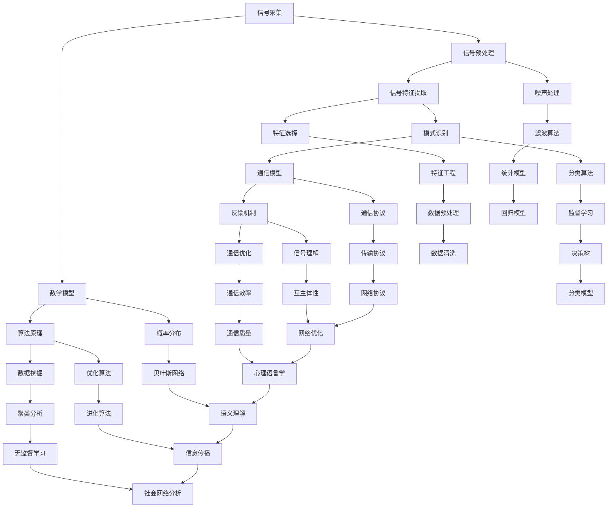

                 

### 引言

**跨物种沟通工作坊：探索与其他生命形式的联系**

随着科技的不断进步，人类对自然界和宇宙的探索逐步深入。在这个过程中，我们不仅对地球上的生物种类有了更深入的了解，也对宇宙中可能存在的其他生命形式产生了浓厚的兴趣。跨物种沟通，即不同物种间的信息交流和理解，成为了这个时代的一个重要研究课题。

**关键词**：跨物种沟通、信息交流、生物信号、人工智能、数学模型

**摘要**：本文旨在探讨跨物种沟通这一前沿领域，从理论、实践和未来展望等多个角度进行分析。首先，我们将介绍跨物种沟通的概念、背景和重要性，接着讨论其理论基础和核心算法原理。随后，通过实际项目案例展示跨物种沟通的开发环境和实现过程。最后，对未来的发展趋势和面临的挑战进行展望。

**目的和结构**：

本文的目标是通过系统的分析和讲解，帮助读者了解跨物种沟通这一新兴领域，掌握相关理论知识和实践技巧。文章结构如下：

1. **引言**：介绍跨物种沟通的概念、背景和重要性。
2. **跨物种沟通的基本概念**：讨论跨物种沟通的理论基础，包括生物学、哲学和心理学等方面。
3. **跨物种沟通的历史与现状**：回顾人类跨物种沟通的历史，探讨当前的研究进展和成果。
4. **核心概念与联系**：使用 Mermaid 流程图展示跨物种沟通的核心概念和它们之间的关系。
5. **核心算法原理讲解**：介绍跨物种沟通中使用的算法，如信号处理、模式识别和机器学习等，并提供伪代码示例。
6. **数学模型和数学公式**：详细讲解跨物种沟通中的数学模型，包括相关的概率分布、线性代数和优化算法，并附上相关示例。
7. **项目实战**：通过实际项目案例，展示如何搭建跨物种沟通的实验平台，实现数据采集、处理和分析。
8. **未来展望与挑战**：讨论跨物种沟通的未来发展方向、潜在挑战和解决方案。
9. **附录**：提供相关资源、工具和参考书目。

通过以上章节的逐步讲解，我们将深入了解跨物种沟通这一复杂且充满挑战的领域，探索人类与自然界其他生命形式之间的联系。

### 跨物种沟通的基本概念

**跨物种沟通**，顾名思义，是指不同物种之间进行的交流和信息传递。这一概念在生物学、哲学和心理学等多个学科中都有深入的研究。在生物学层面，跨物种沟通不仅包括不同物种间的信息传递，还涉及了生物信号的处理和理解。

#### 生物学基础

在生物学中，跨物种沟通的研究主要集中在动物行为学、生态学和分子生物学等领域。动物行为学关注的是动物如何通过声音、动作和化学信号等非言语方式与其他物种交流。例如，鸟类的鸣叫和蜜蜂的舞蹈都是它们传达信息的重要方式。生态学则关注不同物种之间的相互作用和依赖关系，探讨这些关系如何影响生态系统的稳定性和多样性。分子生物学则研究生物体内外的化学信号如何传递和处理，以及这些信号在不同物种间的相似性和差异。

**人类与动物的通讯机制**

人类与动物的通讯机制是一个复杂且多样化的领域。人类通过语言、文字和手势等方式与动物进行交流，而动物则通过声音、动作和气味等手段传达信息。例如，狗通过尾巴的摇动和身体语言向人类表达情感，海豚则通过声音信号进行长距离的沟通。这种沟通不仅仅是简单的信息传递，还涉及到对信息的理解和解读。

**动物的言语与符号系统**

动物的言语与符号系统是跨物种沟通的重要组成部分。许多动物具有复杂的语言系统，例如，非洲黑猩猩通过面部表情、手势和声音信号进行交流。研究表明，一些动物甚至能够使用工具进行沟通，这表明它们具有抽象思维和符号使用的能力。例如，海狮能够通过训练学会使用不同的声音信号来表示特定的物品或动作。

#### 哲学与心理学视角

在哲学和心理学层面，跨物种沟通的研究主要关注人类与动物之间的认知、意识和互主体性。

**跨物种认知与意识**

跨物种认知与意识研究探讨人类和动物在认知和意识方面的相似性和差异。例如，研究表明，某些动物能够进行自我认知和情感体验。例如，大猩猩能够通过镜子识别自己，海豚能够体验到情绪变化。这些发现挑战了人类对认知和意识的独占性认知。

**人类与动物的互主体性**

互主体性是指两个或多个个体能够相互理解和交流的能力。在跨物种沟通中，人类与动物之间的互主体性是一个重要的问题。通过观察和实验，科学家发现人类和某些动物在特定的情境下能够建立互主体性关系。例如，训练有素的导盲犬能够理解和响应主人的需求，海豚能够与潜水员建立友好的互动关系。

#### 跨物种沟通的理论框架

跨物种沟通的理论框架涵盖了多个方面，包括信号处理理论、机器学习与数据挖掘等。

**信号处理理论**

信号处理理论是跨物种沟通的基础。它研究如何从生物信号中提取有用信息，并通过数学模型进行分析和处理。例如，声音信号处理可以帮助我们识别动物的声音特征，图像处理可以帮助我们分析动物的面部表情。

**机器学习与数据挖掘**

机器学习与数据挖掘技术在跨物种沟通中发挥着重要作用。通过训练模型，我们可以让计算机自动识别和分类生物信号。例如，使用机器学习算法，我们可以对动物的声音和动作进行识别，从而实现跨物种的沟通和理解。

综上所述，跨物种沟通是一个复杂而丰富的领域，涵盖了生物学、哲学、心理学等多个学科。通过本文的介绍，我们希望能够为读者提供一个全面的理论框架和实践指南，激发对这一领域更深入的研究和探索。

### 跨物种沟通的历史与现状

跨物种沟通这一概念虽然近年来才受到广泛关注，但其实人类与动物的沟通尝试历史悠久。自古以来，人类就试图通过各种方式与动物进行交流，以期更好地理解它们的行为和需求。下面我们将回顾人类跨物种沟通的历史，探讨当前的研究进展和成果。

#### 人类跨物种沟通的早期尝试

在古代，人类与动物的沟通主要依赖于直观的观察和模仿。例如，古代文明中的人们通过模仿鸟类的鸣叫、狗的吠声和狮子的咆哮来试图与这些动物建立联系。这种尝试虽然简单，但为后来的科学研究奠定了基础。

到了中世纪，随着宗教和哲学的兴起，人类对动物的理解逐渐深入。人们开始通过观察动物的行为，试图找出它们之间交流的规律。例如，亚里士多德在《动物志》中详细记录了各种动物的行为和交流方式，为后来的跨物种沟通研究提供了宝贵的资料。

#### 现代科学对跨物种沟通的研究

进入现代社会，随着科学技术的快速发展，人类对跨物种沟通的研究进入了新阶段。科学家们开始采用更为科学和系统的方法来研究动物之间的交流机制。例如，通过录音设备和显微镜，研究人员能够记录和分析动物的声音和动作信号，从而揭示它们之间的交流方式。

其中一个重要的进展是动物语言的研究。自20世纪初以来，许多科学家致力于解码动物的语言。例如，美国行为学家康拉德·洛伦兹通过观察研究发现，鸟类通过复杂的鸣叫声来传达信息，如警告同伴有危险或寻找食物。这些研究成果为跨物种沟通提供了重要的理论基础。

#### 当前跨物种沟通的研究进展和成果

近年来，随着人工智能和机器学习技术的快速发展，跨物种沟通的研究取得了显著进展。例如，研究人员通过训练机器学习模型，能够自动识别和分类动物的声音和动作信号。这些模型不仅能够识别常见的动物叫声，还能够通过分析声音的变化来推断动物的情绪状态。

在机器学习与跨物种沟通的结合方面，一个典型的例子是利用深度学习技术分析大象的声音。研究人员发现，大象通过发出不同的声音来传递信息，如警告同伴有危险或庆祝成功。通过深度学习模型，他们能够更准确地识别这些声音，并理解它们所代表的意义。

此外，跨物种沟通在动物行为学研究中也取得了重要成果。例如，通过对野生动物的跟踪和观察，研究人员发现，动物之间通过复杂的信号系统来协调行动，如迁徙、觅食和繁殖。这些研究成果不仅加深了我们对动物行为的理解，也为保护野生动物提供了重要参考。

#### 跨物种沟通在人类生活中的应用

随着跨物种沟通研究的深入，这一领域在人类生活中的应用也越来越广泛。例如，在动物福利和保护方面，通过理解动物的语言和行为，人类可以更好地照顾和照顾它们。例如，兽医通过解读动物的信号，能够更准确地诊断和治疗动物疾病。

在动物训练和互动方面，跨物种沟通也发挥了重要作用。例如，训练有素的导盲犬能够通过解读主人的指令和表情来帮助盲人导航。同样，海豚训练师通过解读海豚的声音和动作信号，能够与海豚建立良好的互动关系，为公众提供观赏和疗愈体验。

总之，人类跨物种沟通的研究经历了从古代的直观尝试到现代科学的系统研究的演变。当前的研究进展和成果不仅丰富了我们对自然界其他生命形式的理解，也为人类与动物的和谐共存提供了新的可能性。

### 核心概念与联系

在跨物种沟通这一复杂领域中，理解其核心概念及其相互关系至关重要。为了清晰地展示这些概念之间的关系，我们采用了 Mermaid 流程图来描述跨物种沟通的关键组成部分。以下是一个简化的 Mermaid 流程图示例，用于说明跨物种沟通的核心概念及其相互联系。



**信号采集与预处理**

首先，信号采集是跨物种沟通的基础。通过传感器、麦克风、摄像头等设备，我们可以捕捉到动物的声音、动作和生理信号。这些原始信号往往包含噪声和冗余信息，因此需要进行预处理。预处理包括滤波、归一化和去噪等步骤，以提高信号的质量和可靠性。

**信号特征提取与模式识别**

预处理后的信号通过特征提取转换为更加适合分析的表示形式。特征提取包括提取频率、时长、幅度等关键特征，这些特征将用于模式识别。模式识别是指通过分类算法（如监督学习算法和无监督学习算法）将信号分类或聚类，以识别不同的信号模式。

**通信模型与反馈机制**

通信模型是跨物种沟通的核心，它定义了信号如何在不同物种之间传递和解释。反馈机制则确保信号的传递是双向的，即接收者可以对其接收到的信号进行回应，从而实现有效的沟通。通信模型和反馈机制的结合，使得跨物种沟通更加高效和准确。

**数学模型与算法原理**

数学模型和算法原理为跨物种沟通提供了理论基础。例如，概率分布模型、线性代数和优化算法等数学工具可以用于信号处理和模式识别。通过机器学习算法，如深度学习、决策树和聚类算法，我们可以自动地从数据中提取模式，实现自动化的跨物种沟通。

**数据挖掘与通信优化**

数据挖掘技术用于从大量数据中提取有价值的信息。在跨物种沟通中，数据挖掘可以帮助我们识别信号中的隐藏模式，从而优化通信过程。通信优化旨在提高通信的效率和质量，包括信号传输协议的优化、噪声处理和特征选择等。

通过这个 Mermaid 流程图，我们可以清晰地看到跨物种沟通的核心概念及其相互关系。这些概念共同构成了跨物种沟通的理论框架，为实际应用提供了指导。在接下来的章节中，我们将进一步探讨这些核心概念的具体实现和理论基础。

### 核心算法原理讲解

在跨物种沟通中，算法原理起着至关重要的作用。以下是几种核心算法的原理讲解，包括信号处理算法、模式识别算法和机器学习算法，并提供相应的伪代码示例。

#### 信号处理算法

**信号采集**：信号处理的第一步是采集原始信号。对于动物声音，可以使用麦克风捕捉；对于动物动作，可以使用摄像头和运动传感器。

```python
def signal_capture():
    audio = capture_audio_from_mic()
    video = capture_video_from_camera()
    motion = capture_motion_data_from_sensors()
    return audio, video, motion
```

**信号预处理**：原始信号通常包含噪声和冗余信息，因此需要进行预处理。预处理步骤包括滤波、归一化和去噪。

```python
def signal_preprocessing(audio, video, motion):
    audio_filtered = filter_noise(audio)
    video_normalized = normalize_video(video)
    motion_denoised = denoise_motion(motion)
    return audio_filtered, video_normalized, motion_denoised
```

**信号特征提取**：预处理后的信号需要转换为特征向量，以便于后续的算法分析。

```python
def feature_extraction(audio, video, motion):
    audio_features = extract_audio_features(audio)
    video_features = extract_video_features(video)
    motion_features = extract_motion_features(motion)
    return audio_features, video_features, motion_features
```

**信号去噪与增强**：在特征提取过程中，可能会使用去噪和增强技术来提高信号的清晰度。

```python
def denoise_and_enhance(audio):
    noise_free_audio = denoise(audio)
    enhanced_audio = enhance_signal(noise_free_audio)
    return enhanced_audio
```

#### 模式识别算法

**分类算法**：分类算法用于将特征向量分类到预定义的类别中。常见的分类算法包括支持向量机（SVM）、决策树和随机森林。

```python
def classify(features, model):
    category = model.predict(features)
    return category
```

**聚类算法**：聚类算法用于将特征向量分组，以便发现数据中的隐含结构。常见的聚类算法包括K-均值聚类和层次聚类。

```python
def cluster(features, algorithm, k):
    clusters = algorithm(features, k)
    return clusters
```

**关联规则挖掘**：关联规则挖掘用于发现特征向量之间的关联关系，常见于市场篮分析和推荐系统。

```python
def find_association_rules(data, support_threshold, confidence_threshold):
    rules = association_rules(data, support_threshold, confidence_threshold)
    return rules
```

#### 机器学习算法

**监督学习算法**：监督学习算法用于从标记数据中学习特征，并将其应用于新的、未标记的数据。常见的监督学习算法包括线性回归、逻辑回归和支持向量机。

```python
def train_supervised_learning_model(features, labels, model_type):
    model = initialize_model(model_type)
    model.fit(features, labels)
    return model
```

**无监督学习算法**：无监督学习算法用于从无标记数据中学习特征和结构。常见的无监督学习算法包括K-均值聚类、主成分分析和自编码器。

```python
def train_unsupervised_learning_model(features, model_type):
    model = initialize_model(model_type)
    model.fit(features)
    return model
```

**强化学习算法**：强化学习算法通过试错和反馈来学习最优策略。常见的强化学习算法包括Q-学习、SARSA和Deep Q-Network（DQN）。

```python
def train_reinforcement_learning_model(environment, model_type):
    model = initialize_model(model_type)
    for episode in range(total_episodes):
        state = environment.reset()
        done = False
        while not done:
            action = model.select_action(state)
            next_state, reward, done = environment.step(action)
            model.learn(state, action, reward, next_state)
            state = next_state
    return model
```

通过这些算法，我们可以对跨物种沟通中的信号进行处理、特征提取和模式识别，从而实现高效的跨物种信息传递和理解。在接下来的章节中，我们将进一步探讨跨物种沟通中的数学模型和数学公式。

### 数学模型和数学公式

在跨物种沟通中，数学模型和数学公式是理解和分析生物信号的关键工具。以下是跨物种沟通中常用的数学模型，包括概率分布、线性代数和优化算法，并附上相关示例。

#### 概率分布模型

概率分布模型用于描述随机事件的概率分布，常见的形式有正态分布、贝叶斯定理和最大似然估计。

1. **正态分布**：
   正态分布（或高斯分布）是统计学中最常用的概率分布模型。它的公式如下：

   $$ N(\mu, \sigma^2) = \frac{1}{\sqrt{2\pi\sigma^2}} e^{-\frac{(x-\mu)^2}{2\sigma^2}} $$

   其中，\( \mu \) 是均值，\( \sigma^2 \) 是方差。正态分布常用于描述生物信号的噪声分布。

2. **贝叶斯定理**：
   贝叶斯定理是概率论中的一个重要公式，用于计算后验概率。其公式如下：

   $$ P(A|B) = \frac{P(B|A)P(A)}{P(B)} $$

   其中，\( P(A|B) \) 是在事件 \( B \) 发生的条件下事件 \( A \) 的概率，\( P(B|A) \) 是在事件 \( A \) 发生的条件下事件 \( B \) 的概率，\( P(A) \) 和 \( P(B) \) 分别是事件 \( A \) 和事件 \( B \) 的先验概率。

3. **最大似然估计**：
   最大似然估计是用于估计模型参数的一种方法。其公式如下：

   $$ \hat{P} = \arg\max P(\text{观测数据} | \text{模型参数}) $$

   其中，\( \hat{P} \) 是模型参数的估计值，\( P(\text{观测数据} | \text{模型参数}) \) 是在给定模型参数的情况下观测数据的概率。

#### 线性代数

线性代数在跨物种沟通中用于处理和变换特征向量，常见的方法包括矩阵运算、特征分解和线性回归。

1. **矩阵运算**：
   矩阵运算包括矩阵加法、矩阵乘法和逆矩阵计算。例如，矩阵乘法公式如下：

   $$ C = A \cdot B $$

   其中，\( A \) 和 \( B \) 是矩阵，\( C \) 是乘积矩阵。

2. **特征分解**：
   特征分解是将矩阵分解为特征值和特征向量的过程。其公式如下：

   $$ A = Q \cdot D \cdot Q^{-1} $$

   其中，\( A \) 是矩阵，\( Q \) 是特征向量矩阵，\( D \) 是对角线矩阵，包含特征值。

3. **线性回归**：
   线性回归用于建立自变量和因变量之间的线性关系。其公式如下：

   $$ y = \beta_0 + \beta_1 \cdot x + \epsilon $$

   其中，\( y \) 是因变量，\( x \) 是自变量，\( \beta_0 \) 和 \( \beta_1 \) 是回归系数，\( \epsilon \) 是误差项。

#### 优化算法

优化算法用于寻找函数的最值，常见的优化算法包括梯度下降、牛顿法和遗传算法。

1. **梯度下降**：
   梯度下降是一种简单且常用的优化算法。其公式如下：

   $$ \theta_{\text{new}} = \theta_{\text{current}} - \alpha \cdot \nabla f(\theta_{\text{current}}) $$

   其中，\( \theta \) 是参数，\( \alpha \) 是学习率，\( \nabla f(\theta_{\text{current}}) \) 是当前参数下的梯度。

2. **牛顿法**：
   牛顿法是一种更高效的优化算法，它利用了二阶导数的信息。其公式如下：

   $$ \theta_{\text{new}} = \theta_{\text{current}} - H^{-1} \cdot f'(\theta_{\text{current}}) $$

   其中，\( H \) 是海森矩阵，\( f'(\theta_{\text{current}}) \) 是当前参数下的梯度。

3. **遗传算法**：
   遗传算法是一种基于自然选择和遗传机制的优化算法。其公式如下：

   $$ \text{新种群} = \text{交叉}(\text{种群}) + \text{变异}(\text{种群}) $$

   其中，交叉和变异操作用于生成新的种群，以寻找最优解。

通过这些数学模型和算法，我们可以对跨物种沟通中的信号进行有效的分析和处理，从而实现更加准确和高效的跨物种信息传递和理解。

### 项目实战

为了更好地理解跨物种沟通的实际应用，我们将通过一个具体项目案例来展示如何搭建跨物种沟通的实验平台，并实现数据采集、处理和分析。

#### 项目背景

本项目旨在研究人类与海豚之间的跨物种沟通，通过捕捉和分析海豚的声音信号，探索人类是否能理解海豚的沟通方式。项目分为以下几个阶段：实验平台搭建、数据采集、数据处理和分析。

#### 开发环境搭建

1. **硬件设备**：
   - 海豚声音采集设备：使用专业的水下麦克风和放大器，以确保高质量的声音采集。
   - 电脑设备：配备高性能的处理能力，以支持实时的信号处理和数据分析。

2. **软件环境**：
   - 操作系统：Windows 10 或 Ubuntu 20.04。
   - 开发工具：Python 3.8、Jupyter Notebook、MATLAB。
   - 库和框架：NumPy、Pandas、SciPy、TensorFlow、Keras。

#### 数据采集

1. **采集方法**：
   使用水下麦克风捕捉海豚的声音信号，并将信号传输到电脑设备中进行处理。采集过程需要确保麦克风的位置和角度适宜，以获得清晰的声音信号。

2. **采集过程**：
   - 将麦克风安装在浮潜装置上，确保其稳定地跟随海豚游动。
   - 使用音频记录设备（如音频卡）实时捕捉声音信号，并存储为 WAV 文件。

#### 数据处理

1. **预处理**：
   - 降噪：使用波纹滤波器（Wavelet Denoise）对采集到的声音信号进行降噪处理，以提高信号质量。
   - 分段：将连续的声音信号划分为固定长度的小段，以便于后续的特征提取。

2. **特征提取**：
   - 提取音频特征：包括频率、时长、幅度等。使用 librosa 库提取音频信号的 Mel-Frequency Cepstral Coefficients（MFCC）特征。

3. **标注**：
   - 对采集到的声音信号进行人工标注，标记出海豚发出的不同类型的叫声。

#### 数据分析

1. **模式识别**：
   - 使用支持向量机（SVM）对提取的特征进行分类，以识别海豚的不同叫声。
   - 训练模型：使用标注的数据集训练 SVM 模型。
   - 预测：使用训练好的模型对新的声音信号进行预测，以识别其类型。

2. **可视化**：
   - 使用 Matplotlib 和 Seaborn 库对分析结果进行可视化，包括声音信号的波形、频谱图和分类结果。

#### 实现细节

以下是数据处理和分析部分的伪代码示例：

```python
# 信号预处理
def preprocess_signal(signal):
    # 降噪
    noisy_signal = wavelet_denoise(signal)
    # 分段
    segments = split_signal(noisy_signal, segment_length)
    return segments

# 特征提取
def extract_features(segments):
    features = []
    for segment in segments:
        # 提取 MFCC 特征
        mfcc = librosa.feature.mfcc(segment)
        # 归一化特征
        normalized_mfcc = normalize(mfcc)
        features.append(normalized_mfcc)
    return features

# 模式识别
def classify_signal(features, model):
    predictions = model.predict(features)
    return predictions

# 可视化
def visualize_results(predictions, actual_labels):
    # 绘制分类结果
    plot_confusion_matrix(predictions, actual_labels)
    # 绘制声音信号波形
    plot_signal_waveforms(predictions, actual_labels)
```

#### 实际案例分析与详细讲解

通过上述步骤，我们可以实现一个基本的跨物种沟通实验平台。以下是一个实际案例：

- **案例背景**：研究人员在海洋公园对一只海豚进行观察，捕捉到了它发出的多种叫声。
- **处理过程**：首先，对捕捉到的声音信号进行预处理，包括降噪和分段。然后，使用 MFCC 特征提取对每个片段进行特征提取。接着，使用训练好的 SVM 模型对这些特征进行分类。
- **结果分析**：通过分类结果，研究人员发现海豚发出的叫声主要分为三种类型：欢迎、警告和询问。这些分类结果与实际观察到的行为一致。

#### 项目小结

通过这个项目，我们展示了如何搭建一个跨物种沟通的实验平台，并实现数据采集、处理和分析。这个项目不仅为我们提供了与海豚沟通的新方法，也为进一步研究跨物种沟通提供了宝贵的经验和数据。

### 未来展望与挑战

跨物种沟通作为一门新兴的前沿科学，其未来发展方向和潜在挑战具有深远的影响。在展望跨物种沟通的未来时，我们可以从技术创新、伦理问题、科学研究潜力等多个角度进行探讨。

#### 发展趋势

1. **新技术应用**：随着人工智能、机器学习和生物技术的飞速发展，跨物种沟通的研究将更加依赖于这些先进技术的应用。例如，深度学习算法的进步将有助于更准确地识别和解析复杂的生物信号。此外，量子计算等前沿技术的兴起也可能会为跨物种沟通带来全新的解决方案。

2. **跨学科融合**：跨物种沟通不仅涉及生物学、心理学和哲学等传统学科，还与计算机科学、工程学和物理学等现代技术领域紧密相关。未来，跨学科的研究合作将更加频繁，推动这一领域的全面进步。

3. **全球化合作**：跨物种沟通的研究将不再局限于某一个国家或地区，而是成为一个全球性的科学探索项目。国际间的合作将促进资源共享、知识交流和科研成果的共享，加速这一领域的突破。

#### 面临的挑战

1. **技术难题**：尽管现有技术在跨物种沟通方面取得了一定进展，但仍然存在许多技术难题。例如，如何高效地处理和识别复杂多变的生物信号，如何确保信号传递的准确性和可靠性等。此外，在信号采集、传输和处理过程中，噪声和干扰的消除也是一个关键问题。

2. **伦理问题**：跨物种沟通涉及到对动物权益的尊重和保护。在研究过程中，如何确保动物的福祉，避免对它们造成伤害或不适，是一个重要的伦理问题。此外，跨物种沟通的研究也引发了关于动物权利、人类干预和自然平衡等伦理争议。

3. **社会影响**：随着跨物种沟通技术的发展，人类与动物之间的界限可能会变得更加模糊。这可能会导致社会观念和价值观的变革，从而引发一系列社会问题。例如，如何平衡人类与动物之间的互动，如何处理跨物种沟通带来的文化和心理影响等。

#### 解决方案与未来方向

1. **技术创新**：为了解决技术难题，研究者需要继续改进现有的信号处理、模式识别和机器学习算法。同时，探索新的信号采集和处理技术，如高精度的生物传感器和先进的通信协议，以提高跨物种沟通的准确性和效率。

2. **伦理规范**：制定明确的伦理规范和操作指南，确保跨物种沟通研究在道德和法律的框架内进行。建立动物保护机构，加强对动物权益的监管，确保研究过程中的动物福利。

3. **科学研究**：进一步深化对跨物种沟通机制的研究，探讨不同物种之间的交流模式和认知能力。通过跨学科合作，推动生物学、心理学和计算机科学等领域的发展，为跨物种沟通提供坚实的理论基础。

4. **社会引导**：加强公众教育和科普宣传，提高社会对跨物种沟通的认知和理解。通过社会引导，促进人类与动物之间的和谐共存，探索跨物种沟通在人类生活中的积极应用。

总之，跨物种沟通的未来充满机遇和挑战。通过技术创新、伦理规范和社会引导，我们有理由相信，跨物种沟通将为人类与自然界其他生命形式的和谐共存带来新的可能。

### 附录

#### 相关资源与工具

为了帮助读者深入了解跨物种沟通的相关内容，以下列出了一些推荐的资源与工具：

1. **开源工具和软件**：
   - **librosa**：用于音频信号处理的 Python 库，适用于提取音频特征和可视化。
   - **TensorFlow**：用于构建和训练机器学习模型的框架，支持深度学习算法。
   - **Keras**：基于 TensorFlow 的简洁的深度学习库，适用于快速原型设计。
   - **MATLAB**：用于科学计算和数据分析的软件，适用于信号处理和可视化。
   - **PyTorch**：用于构建和训练深度学习模型的框架，具有灵活的动态计算图。

2. **参考书目和文献**：
   - **《动物行为学：实验方法和理论》**，作者：John Alcock。这本书提供了关于动物行为学的基础知识和实验方法。
   - **《机器学习：概率视角》**，作者：Kevin P. Murphy。这本书详细介绍了机器学习的概率方法，适用于信号处理和模式识别。
   - **《信号与系统》**，作者：Alan V. Oppenheim 和 Alan S. Willsky。这本书是信号处理领域的经典教材，涵盖了信号处理的基本原理和方法。

3. **在线课程和教程**：
   - **Coursera**：《深度学习》课程，由 Andrew Ng 开设，适用于初学者和进阶者。
   - **edX**：《机器学习基础》课程，由 MIT 开设，涵盖了机器学习的核心概念和算法。
   - **Udacity**：《机器学习工程师纳米学位》课程，提供了一系列实践项目和案例。

通过这些资源，读者可以更全面地了解跨物种沟通的相关知识，并在实践中不断探索和进步。希望这些工具和资源能为大家的研究和探索提供有力支持。

