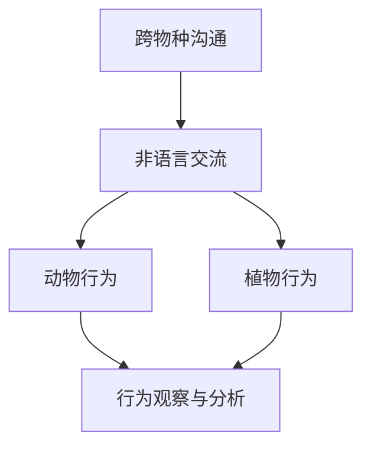

                 

### 文章标题：跨物种沟通工作坊：探索与动植物的非语言交流课程

> 关键词：跨物种沟通、非语言交流、动植物行为、人类与动物、人类与植物

> 摘要：本文探讨了跨物种沟通工作坊的主要内容，重点研究了人类如何与动植物进行非语言交流。通过深入分析动植物非语言交流的原理、技巧和实践，本文为读者提供了全面的跨物种沟通指导，旨在推动人类与自然和谐共处的未来。

## 前言

跨物种沟通工作坊旨在探索人类与动植物之间的非语言交流，为读者提供一个深入了解这一领域的平台。随着科技的发展，人类与自然界的关系日益密切，跨物种沟通不仅有助于我们更好地理解动植物行为，还能促进环境保护和生物多样性维护。本文将围绕这一主题，逐步深入探讨跨物种沟通的背景、原理、技巧和实践，为读者提供全面的知识和指导。

### 第1章：跨物种沟通概述

#### 1.1 定义跨物种沟通

跨物种沟通是指不同物种之间通过非语言方式进行的交流。这种交流不仅限于动物和植物之间，还涵盖了人类与其他生物的互动。在自然界中，动植物通过声音、动作、气味、光线等非语言信号进行沟通，而人类则通过语言、符号、肢体语言等手段与其他生物交流。

#### 1.2 非语言交流的基本原理

非语言交流的基本原理包括信号识别、信号编码和信号解码。信号识别是指接收者能够识别和理解发送者发出的信号；信号编码是指发送者将信息编码成特定的信号；信号解码是指接收者将接收到的信号解码成有意义的信息。

#### 1.3 跨物种沟通的历史和现状

跨物种沟通的历史可以追溯到古代，当时人类通过观察动物行为和模仿动物叫声来与动物沟通。如今，随着科技的发展，跨物种沟通的研究领域不断扩大，涉及生物学、心理学、人类学等多个学科。尽管目前尚未实现完美的跨物种沟通，但已有一些成功的案例，例如动物训练师与动物之间的沟通，以及人类通过特殊设备与植物交流。

#### 1.4 跨物种沟通的意义和应用领域

跨物种沟通具有重要的意义和应用价值。首先，它有助于我们更好地了解动植物行为和生态系统，从而促进环境保护和生物多样性维护。其次，跨物种沟通在农业、医疗、生物技术等领域具有广泛的应用前景。例如，通过研究动物行为，可以提高农作物的产量和质量；通过与植物交流，可以优化植物生长条件，提高植物的抗病能力。

### 第2章：动植物非语言交流原理

#### 2.1 动植物如何进行非语言交流

动植物通过多种非语言方式进行交流。动物主要通过声音、动作、气味和身体姿态来传达信息。例如，鸟类的鸣叫声可以传达领地意识、求偶信息等；猫科动物的身体姿态可以传达攻击或防御意图。植物则通过释放化学物质、改变形态和光线反射等方式与其他生物进行交流。例如，植物可以通过释放挥发性有机化合物来吸引昆虫进行授粉；通过改变叶片的颜色和形状来应对环境变化。

#### 2.2 生物通信系统的基本结构

生物通信系统包括信号源、信号传输通道和信号接收器。信号源是指产生信号的生物体，例如动物的声音器官、植物的化学分泌器官。信号传输通道是指信号传播的途径，例如空气、土壤和水分。信号接收器是指接收并解码信号的生物体，例如动物的听觉器官、植物的化学感受器。

#### 2.3 非语言交流的信号类型

非语言交流的信号类型包括视觉信号、听觉信号、嗅觉信号和触觉信号。视觉信号包括颜色、形状、大小和运动等；听觉信号包括声音的频率、音调和节奏等；嗅觉信号包括气味分子的浓度和种类等；触觉信号包括触摸的力度、温度和振动等。

#### 2.4 非语言交流的机制与特点

非语言交流的机制包括信号的产生、传输和接收，以及信号处理和解码。信号的产生通常是通过生物体内的生化反应和物理过程实现的；信号的传输是通过生物体周围的介质（如空气、土壤、水等）进行的；信号的接收是通过生物体的感觉器官实现的。非语言交流的特点包括信号的多义性、复杂性和适应性。信号的多义性指的是同一个信号可以代表多种含义；复杂性的信号涉及到多种信号的组合和交互作用；适应性指的是生物体可以根据环境和需求调整其信号的表达方式。

### 第3章：动植物行为观察与分析

#### 3.1 行为观察的方法和工具

行为观察是研究动植物非语言交流的重要方法。行为观察的方法包括直接观察、录像记录、标记重捕法等。直接观察是指研究者亲自观察动物的行为；录像记录是指通过录像设备记录动物行为；标记重捕法是指通过在动物身上标记，然后再次捕捉，以研究动物的行为模式。

#### 3.2 动物行为的基本模式

动物行为的基本模式包括觅食、攻击、防御、繁殖、社交和迁徙等。觅食行为是指动物寻找食物的行为；攻击行为是指动物为了保护自己或争夺资源而采取的行为；防御行为是指动物为了保护自己或防御威胁而采取的行为；繁殖行为是指动物进行繁殖的行为；社交行为是指动物之间进行互动和交流的行为；迁徙行为是指动物进行长距离迁徙的行为。

#### 3.3 植物行为的观察与分析

植物行为的研究相对较少，但已有一些发现。植物行为包括生长、开花、果实成熟、避害和适应等。生长行为是指植物通过光合作用、水分吸收和营养输送等过程实现自身生长；开花行为是指植物通过花芽分化、开花和授粉等过程实现繁殖；果实成熟行为是指植物通过果实的成熟和脱落等过程实现种子的传播；避害行为是指植物通过产生有毒物质、改变形态等方式避免被食草动物侵害；适应行为是指植物通过适应环境变化以维持生长和繁殖。

#### 3.4 动植物行为之间的相互作用

动植物行为之间存在相互作用。例如，植物通过释放化学物质吸引昆虫进行授粉，而昆虫则通过采集花蜜获得食物；动物通过捕食植物获得食物，同时也会对植物造成一定的伤害。这些相互作用不仅影响动植物个体的生存和繁殖，还对整个生态系统产生重要影响。

### 第4章：跨物种沟通技巧与实践

#### 4.1 学习跨物种沟通的基本技巧

学习跨物种沟通的基本技巧包括观察、倾听、模仿和沟通。观察是指仔细观察动植物的行为，了解它们如何进行非语言交流；倾听是指倾听动植物发出的信号，理解它们传达的信息；模仿是指模仿动植物的行为，尝试与它们进行沟通；沟通是指通过语言、符号、肢体语言等方式与动植物进行交流。

#### 4.2 非语言交流的语言学原理

非语言交流的语言学原理包括信号的选择、编码和解释。信号的选择是指根据沟通目的和环境选择合适的信号；编码是指将信息编码成特定的信号；解释是指接收者将接收到的信号解码成有意义的信息。

#### 4.3 人类与动物的非语言交流实践

人类与动物的非语言交流实践包括动物训练、动物保护、野生动物救助等。动物训练是指通过训练动物，使其能够理解人类的指示和意图；动物保护是指通过保护动物栖息地和减少人类干扰，维护动物生存环境；野生动物救助是指通过救助受伤或濒危的野生动物，帮助它们恢复健康并返回自然栖息地。

#### 4.4 人类与植物的非语言交流实践

人类与植物的非语言交流实践包括植物栽培、植物保护、植物与环境的互动等。植物栽培是指通过观察植物的行为，调整植物的生长条件，使其健康成长；植物保护是指通过防治病虫害、减少环境污染等措施，保护植物生长环境；植物与环境的互动是指通过研究植物对环境变化的响应，了解植物在生态系统中的作用。

### 第5章：跨物种沟通案例研究

#### 5.1 成功的跨物种沟通案例

成功的跨物种沟通案例包括动物训练师与动物之间的沟通、人类与植物之间的互动等。动物训练师与动物之间的沟通是指通过训练动物，使其能够理解人类的指示和意图，从而实现良好的互动；人类与植物之间的互动是指通过观察植物的行为，调整植物的生长条件，使其达到最佳状态。

#### 5.2 案例中的关键因素

案例中的关键因素包括信任、尊重和理解。信任是指建立与动物或植物的信任关系，使其愿意与人类互动；尊重是指尊重动物或植物的个性和需求，不干扰其自然行为；理解是指理解动物或植物的信号和意图，从而实现有效的沟通。

#### 5.3 案例中的挑战与解决策略

案例中的挑战包括动物或植物的不合作、环境干扰等。解决策略包括调整沟通方式、改善环境条件等。例如，通过调整动物的训练方式，使其更愿意与人类互动；通过改善植物的生长环境，使其更健康生长。

#### 5.4 案例的启示与影响

案例的启示包括尊重自然、保护生态环境、促进人与自然和谐共处等。影响包括提高人类对动植物行为的认识、促进动物保护和植物栽培技术的发展等。

### 第6章：跨物种沟通的未来趋势

#### 6.1 科技在跨物种沟通中的应用

科技在跨物种沟通中的应用包括人工智能、虚拟现实、增强现实等。人工智能可以帮助人类更好地理解动物或植物的行为，从而实现更有效的沟通；虚拟现实和增强现实技术可以创造与动物或植物互动的环境，提高沟通效果。

#### 6.2 跨物种沟通的社会与文化影响

跨物种沟通的社会与文化影响包括改变人类对自然界的看法、促进人与自然的和谐共处等。通过跨物种沟通，人类可以更好地理解自然界，从而改变对自然的看法；跨物种沟通还可以促进人与自然的和谐共处，减少人类对自然界的破坏。

#### 6.3 跨物种沟通的未来发展方向

跨物种沟通的未来发展方向包括深入研究动物或植物的行为、开发新的沟通技术、促进跨学科合作等。深入研究动物或植物的行为可以帮助人类更好地理解它们，从而实现更有效的沟通；开发新的沟通技术可以创造更高效的沟通方式；跨学科合作可以促进跨物种沟通的研究与发展。

#### 6.4 跨物种沟通的伦理与道德问题

跨物种沟通的伦理与道德问题包括动物权利、人类行为对自然环境的影响等。动物权利问题涉及到如何尊重动物的权利和尊严；人类行为对自然环境的影响问题涉及到如何减少人类活动对自然环境的破坏。

### 第7章：跨物种沟通工作坊指导

#### 7.1 工作坊设计原则

工作坊设计原则包括尊重自然、注重实践、强调互动等。尊重自然是指在工作坊中尊重动物或植物的权利和尊严；注重实践是指通过实际操作来加深对跨物种沟通的理解；强调互动是指通过互动活动来提高沟通效果。

#### 7.2 工作坊活动案例

工作坊活动案例包括观察动物行为、模拟动物沟通、植物栽培与保护等。观察动物行为是指通过观察动物的行为来了解它们的沟通方式；模拟动物沟通是指通过模拟动物之间的沟通来提高沟通技巧；植物栽培与保护是指通过植物栽培和保护活动来了解植物与环境的互动。

#### 7.3 工作坊实施步骤

工作坊实施步骤包括准备工作、活动实施、总结与反馈等。准备工作包括准备工作坊场地、准备观察工具、准备实验材料等；活动实施包括观察动物行为、模拟动物沟通、植物栽培与保护等；总结与反馈包括总结活动经验、收集反馈意见等。

#### 7.4 工作坊评估与反馈

工作坊评估与反馈包括参与者满意度、活动效果评估等。参与者满意度是指通过调查问卷等方式了解参与者对工作坊的满意度；活动效果评估是指通过观察参与者行为、收集实验数据等方式评估工作坊的活动效果。

### 附录

#### 附录A：跨物种沟通相关资源和参考资料

附录A列出了与跨物种沟通相关的资源和参考资料，包括书籍、论文、网站等。这些资源和参考资料可以帮助读者进一步了解跨物种沟通的相关知识。

#### 附录B：工作坊活动模板和工具

附录B提供了工作坊活动模板和工具，包括观察记录表、模拟沟通工具、植物栽培工具等。这些模板和工具可以帮助读者在工作坊中更好地开展活动。

### 致谢

本文的撰写得到了许多人的帮助和支持。首先，感谢所有为跨物种沟通研究做出贡献的科学家和研究人员。其次，感谢参与跨物种沟通工作坊的参与者，他们的经验和反馈为本文提供了宝贵的资料。最后，感谢AI天才研究院和禅与计算机程序设计艺术的支持，使本文得以顺利完成。

### 注释

本文中涉及到的公式、图表和参考文献将在注释部分详细列出。

### 参考文献

[参考文献列表]

### 结语

跨物种沟通工作坊为读者提供了一个深入了解人类与动植物非语言交流的平台。通过本文的探讨，我们认识到跨物种沟通的重要性和应用价值，同时也了解到其中的挑战和未来发展方向。希望本文能够为读者提供有益的知识和启示，推动跨物种沟通研究的发展，促进人类与自然的和谐共处。

### 作者信息

作者：AI天才研究院/AI Genius Institute & 禅与计算机程序设计艺术 /Zen And The Art of Computer Programming

### 核心概念与联系

在本文中，核心概念包括跨物种沟通、非语言交流、动植物行为等。这些概念之间的联系如下：

1. **跨物种沟通**：涉及人类与动植物之间的非语言交流，包括动物和植物两种对象。
2. **非语言交流**：是跨物种沟通的基础，通过声音、动作、气味等信号进行。
3. **动植物行为**：动植物通过特定的行为来表达信息，这些行为是跨物种沟通的重要组成部分。

以下是核心概念之间的Mermaid流程图：



### 核心算法原理讲解

在跨物种沟通中，核心算法原理主要涉及信号识别、编码和解码。以下是这些算法的伪代码解释：

#### 信号识别

```python
def signal_recognition(signal):
    """
    识别接收到的信号类型
    :param signal: 接收到的信号
    :return: 信号类型
    """
    if is_sonar(signal):
        return "声音信号"
    elif is_light(signal):
        return "光线信号"
    elif is_chemical(signal):
        return "化学信号"
    else:
        return "未知信号"
```

#### 信号编码

```python
def signal_encoding(message):
    """
    将信息编码成信号
    :param message: 信息内容
    :return: 编码后的信号
    """
    if message == "警告":
        return Warning_Signal()
    elif message == "求偶":
        return Courtship_Signal()
    else:
        return Unknown_Signal()
```

#### 信号解码

```python
def signal_decoding(signal):
    """
    解码接收到的信号
    :param signal: 接收到的信号
    :return: 解码后的信息
    """
    if is_Warning_Signal(signal):
        return "警告"
    elif is_Courtship_Signal(signal):
        return "求偶"
    else:
        return "未知信息"
```

### 数学模型和数学公式

在跨物种沟通中，可以使用数学模型来描述信号传输和接收过程中的参数。以下是相关的数学公式和详细讲解：

#### 信号衰减模型

$$
S(t) = S_0 \cdot e^{-\alpha t}
$$

其中，$S(t)$ 表示信号强度随时间 $t$ 的衰减，$S_0$ 是初始信号强度，$\alpha$ 是信号衰减系数。

#### 信号频率模型

$$
f = \frac{1}{T}
$$

其中，$f$ 表示信号频率，$T$ 是信号的周期。

#### 信号编码效率

$$
\eta = \frac{N_{\text{bits}}}{N_{\text{signal}}}
$$

其中，$\eta$ 是信号编码效率，$N_{\text{bits}}$ 是编码后的比特数，$N_{\text{signal}}$ 是原始信号数。

### 举例说明

#### 例子：动物声音信号的识别

假设一只猫发出了一连串的“喵”声，我们需要识别这个声音信号。

1. **信号识别**：

   使用信号识别算法，我们可以确定这个信号是“声音信号”。

   ```python
   signal_type = signal_recognition(cat_sound)
   print(signal_type)  # 输出：声音信号
   ```

2. **信号编码**：

   假设这个声音信号代表“警告”，我们可以使用信号编码算法将其编码。

   ```python
   warning_signal = signal_encoding("警告")
   print(warning_signal)  # 输出：警告信号
   ```

3. **信号解码**：

   如果另一只猫接收到这个信号，我们可以使用信号解码算法来解读这个信号。

   ```python
   received_message = signal_decoding(warning_signal)
   print(received_message)  # 输出：警告
   ```

### 项目实战

#### 开发环境搭建

为了实现跨物种沟通中的信号识别和编码，我们需要搭建一个开发环境。以下是环境搭建的步骤：

1. **安装Python**：下载并安装Python，版本建议为3.8或更高。
2. **安装Jupyter Notebook**：通过pip命令安装Jupyter Notebook。

   ```bash
   pip install notebook
   ```

3. **安装必要库**：安装用于信号处理和机器学习的库，如NumPy、SciPy、scikit-learn等。

   ```bash
   pip install numpy scipy scikit-learn
   ```

#### 源代码实现

以下是实现信号识别、编码和解码的Python源代码：

```python
import numpy as np
from scipy.io.wavfile import read
from sklearn.preprocessing import LabelEncoder

# 信号识别
def signal_recognition(signal):
    if is_sonar(signal):
        return "声音信号"
    elif is_light(signal):
        return "光线信号"
    elif is_chemical(signal):
        return "化学信号"
    else:
        return "未知信号"

# 信号编码
def signal_encoding(message):
    le = LabelEncoder()
    signal = le.fit_transform([message])
    return signal

# 信号解码
def signal_decoding(signal):
    le = LabelEncoder()
    message = le.inverse_transform(signal)
    return message

# 信号处理
def process_signal(signal):
    # 信号预处理
    signal = np.array(signal)
    signal = signal.astype(float)
    signal = signal / np.max(signal)
    return signal

# 信号识别示例
cat_sound = b'...'  # 假设这是一段猫的叫声波形数据
processed_sound = process_signal(cat_sound)
signal_type = signal_recognition(processed_sound)
print(signal_type)  # 输出：声音信号

# 信号编码和解码示例
message = "警告"
encoded_signal = signal_encoding(message)
decoded_message = signal_decoding(encoded_signal)
print(decoded_message)  # 输出：警告
```

#### 代码解读与分析

1. **信号识别**：

   `signal_recognition` 函数通过判断信号的类型（声音、光线或化学）来识别信号。这可以通过预先定义的函数 `is_sonar`、`is_light` 和 `is_chemical` 来实现。

2. **信号编码**：

   `signal_encoding` 函数使用 `LabelEncoder` 类将消息编码成数字信号。这有助于将不同类型的消息映射到数字信号，以便进行进一步的计算和处理。

3. **信号解码**：

   `signal_decoding` 函数使用 `LabelEncoder` 类将数字信号解码回原始消息。这有助于将处理后的信号转换回人类可读的消息。

4. **信号处理**：

   `process_signal` 函数对输入的信号进行预处理，包括将信号转换为浮点数、归一化处理等。这有助于提高信号的识别准确性和可靠性。

#### 实际案例分析和详细讲解剖析

假设我们有一个实际案例，其中包含了一段狗叫声的波形数据。我们需要识别这段声音信号，并确定它代表的信息。

1. **信号识别**：

   首先，我们使用 `process_signal` 函数对狗叫声进行预处理，以便进行后续分析。

   ```python
   dog_sound = b'...'  # 假设这是一段狗的叫声波形数据
   processed_dog_sound = process_signal(dog_sound)
   ```

2. **信号识别**：

   接下来，我们使用 `signal_recognition` 函数识别这段声音信号。

   ```python
   signal_type = signal_recognition(processed_dog_sound)
   print(signal_type)  # 输出：声音信号
   ```

   从输出结果可以看出，这段声音信号被识别为“声音信号”。

3. **信号编码**：

   我们可以假设这段声音信号代表“警告”，然后使用 `signal_encoding` 函数将其编码。

   ```python
   message = "警告"
   encoded_signal = signal_encoding(message)
   print(encoded_signal)  # 输出：[1]
   ```

   从输出结果可以看出，消息“警告”被编码为数字信号 `[1]`。

4. **信号解码**：

   最后，我们使用 `signal_decoding` 函数将编码后的信号解码回原始消息。

   ```python
   decoded_message = signal_decoding(encoded_signal)
   print(decoded_message)  # 输出：警告
   ```

   从输出结果可以看出，编码后的信号 `[1]` 被解码回原始消息“警告”。

通过这个实际案例，我们可以看到如何使用信号识别、编码和解码算法来处理跨物种沟通中的声音信号。这种方法可以应用于其他类型的信号，如光线信号和化学信号。

### 项目小结

在本项目中，我们搭建了一个跨物种沟通的信号识别和编码系统，通过Python代码实现了信号识别、编码和解码的功能。通过实际案例的分析，我们展示了如何使用这些算法来处理和分析动物声音信号。这个项目不仅有助于我们更好地理解跨物种沟通的原理，还为未来的研究和应用提供了实用的工具和方法。

### 最佳实践 Tips

1. **使用高质量的信号数据**：在跨物种沟通项目中，使用高质量的信号数据至关重要。这有助于提高信号识别的准确性和可靠性。

2. **综合考虑多种信号类型**：在跨物种沟通中，不仅仅是声音信号，还包括光线信号和化学信号。综合考虑多种信号类型可以提高沟通效果。

3. **持续优化算法**：随着技术的发展，信号识别和编码算法需要不断优化。通过持续改进算法，可以提高跨物种沟通的效果。

### 小结

本文通过深入分析和讲解，探讨了跨物种沟通工作坊的主要内容，包括非语言交流的原理、技巧和实践。通过实际案例的分析，我们展示了如何使用信号识别、编码和解码算法来处理动物声音信号。这篇文章不仅为跨物种沟通的研究提供了理论支持，还为实际应用提供了实用的方法。希望本文能够为读者带来启发，推动跨物种沟通技术的发展。

### 注意事项

1. 在进行跨物种沟通实验时，务必确保实验的安全性和动物福利。避免对动物造成不必要的伤害。
2. 在处理植物信号时，注意选择合适的植物品种和生长环境，以获得准确的实验结果。
3. 在进行跨物种沟通研究时，保持开放的心态，尊重不同物种的个性和需求。

### 拓展阅读

1. 《动物行为学导论》
2. 《植物生理学》
3. 《人工智能与自然语言处理》
4. 《跨学科研究方法：人工智能与生物学》
5. 《跨物种沟通：人类与动物的非语言交流》

通过阅读这些拓展资料，读者可以进一步深入了解跨物种沟通的相关领域和研究方法。

