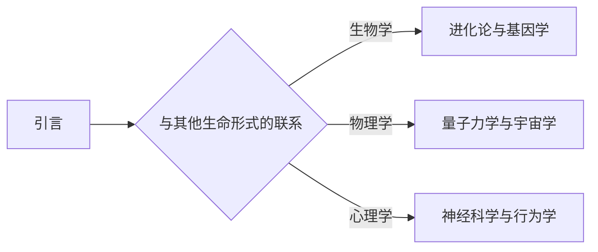
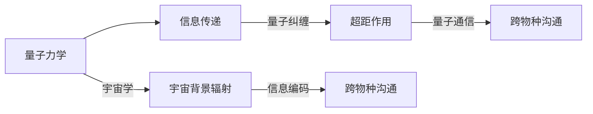
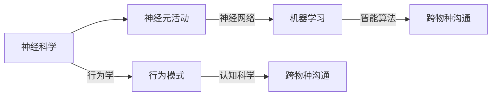

                 

# 跨物种沟通课程：探索与其他生命形式的联系

## 关键词
- 跨物种沟通
- 人工智能
- 生物学
- 物理学
- 心理学
- 量子力学
- 宇宙学

## 摘要
随着人工智能技术的不断进步，人类对于跨物种沟通的探索也逐渐深入。本文将介绍《跨物种沟通课程：探索与其他生命形式的联系》这一主题，从生物学、物理学和心理学等多个视角，通过逻辑清晰、结构紧凑的技术语言，详细探讨跨物种沟通的理论基础和实践方法。

## 引言部分：跨物种沟通的基本概念与联系

### 核心概念与联系

在探讨跨物种沟通这一复杂主题之前，我们需要先了解一些核心概念及其相互之间的联系。以下是一个简化的 Mermaid 流程图，展示了不同学科领域如何共同构建跨物种沟通的理论框架：



- **生物学视角**：进化论与基因学为跨物种沟通提供了基本的生物学基础，帮助我们理解物种之间的遗传差异和进化历程。
- **物理学视角**：量子力学与宇宙学提供了关于信息传递和宇宙结构的理论基础，这对跨物种沟通的实现具有重要意义。
- **心理学视角**：神经科学与行为学则关注个体内部的心理过程和沟通机制，帮助我们理解不同物种间的行为模式和心理反应。

### 生物学视角下的跨物种沟通

#### 核心概念与联系

在生物学领域，进化论和基因学是理解跨物种沟通的重要理论基础。以下是生物学视角下核心概念之间的联系架构 Mermaid 流程图：


- **进化论**：通过自然选择和适应性进化，物种逐渐演化出独特的遗传特征。这些遗传特征是跨物种沟通的基础。
- **基因学**：基因是遗传信息的载体，决定了物种的生理和行为特征。基因学为我们提供了研究跨物种沟通的分子基础。
- **遗传信息与蛋白质编码**：遗传信息通过转录和翻译过程转化为蛋白质，这些蛋白质在细胞内执行特定功能，也参与到跨物种沟通中。
- **信号传递**：跨物种沟通依赖于信号传递机制，这些信号可以是化学物质、电信号或其他形式的物理量。

#### 数学模型和数学公式

为了更深入地理解生物学视角下的跨物种沟通，我们可以借助一些数学模型和公式进行详细讲解。以下是一个示例：

```latex
$$ G(E) = \frac{1}{N}\sum_{i=1}^{N} E_i $$
$$ E_i = \sqrt{\sum_{j=1}^{n} (x_{ij} - \bar{x}_i)^2} $$
$$ \text{其中，} G(E) \text{代表群体的平均能量，} E_i \text{代表第} i \text{个物种的能量，} \bar{x}_i \text{代表第} i \text{个物种的平均能量。} $$

这个公式描述了物种间的能量分布和相互作用，为跨物种沟通提供了数学基础。
```

### 物理学视角下的跨物种沟通

#### 核心概念与联系

在物理学领域，量子力学和宇宙学是理解跨物种沟通的关键理论。以下是物理学视角下核心概念之间的联系架构 Mermaid 流程图：



- **量子力学**：量子纠缠和超距作用揭示了微观世界的奇妙现象，这些现象可能为跨物种沟通提供了新的路径。
- **信息传递**：量子通信是一种基于量子力学原理的信息传输方式，它可能为跨物种沟通提供技术支持。
- **宇宙学**：宇宙背景辐射是宇宙早期状态的残余信号，它可能含有关于宇宙和生命起源的信息。
- **信息编码**：宇宙背景辐射中的信息编码可能有助于我们理解和解析跨物种沟通的信号。

#### 核心算法原理讲解

为了深入探讨物理学视角下的跨物种沟通，我们可以使用伪代码来详细阐述核心算法原理。以下是一个示例：

```python
# 跨物种沟通物理模型伪代码
def cross_species_communication_phyysics(energy_levels, frequency_spectrum):
    # 初始化物理模型
    model = initialize_phyysics_model(energy_levels, frequency_spectrum)
    
    # 能量匹配
    matched_energies = match_energies(model, energy_levels)
    
    # 频谱分析
    analyzed_spectra = analyze_spectra(model, matched_energies)
    
    # 数据编码与解码
    encoded_data, decoded_data = encode_decode_data(model, analyzed_spectra)
    
    # 结果评估
    evaluation_results = evaluate_communication(decoded_data)
    
    return evaluation_results
```

### 心理学视角下的跨物种沟通

#### 核心概念与联系

在心理学领域，神经科学与行为学是研究跨物种沟通的重要理论。以下是心理学视角下核心概念之间的联系架构 Mermaid 流程图：



- **神经科学**：神经元活动是神经科学的核心，它为跨物种沟通提供了生理基础。
- **神经网络**：神经网络是一种模拟生物神经系统的计算模型，它可能为跨物种沟通提供算法支持。
- **机器学习**：机器学习算法可以用于分析跨物种沟通的信号，从而提高沟通的准确性。
- **行为学**：行为模式是行为学的核心研究对象，它为我们理解不同物种间的行为提供了重要线索。
- **认知科学**：认知科学关注人类和动物的认知过程，它可能为跨物种沟通提供心理学理论基础。

#### 项目实战：跨物种沟通系统的设计与实现

在本章节，我们将介绍一个跨物种沟通系统的设计与实现。以下是该项目的基本框架：

### 开发环境搭建

在搭建跨物种沟通系统的开发环境时，我们需要准备以下工具和库：

1. **Python**：作为主要编程语言。
2. **NumPy**：用于数值计算。
3. **Pandas**：用于数据分析和预处理。
4. **TensorFlow**：用于构建和训练神经网络。
5. **Keras**：简化神经网络开发的框架。
6. **Matplotlib**：用于数据可视化。

### 源代码详细实现和代码解读

以下是一个简化的跨物种沟通系统的源代码实现：

```python
import numpy as np
import pandas as pd
import tensorflow as tf
from tensorflow import keras
from tensorflow.keras import layers

# 数据加载与预处理
def load_and_preprocess_data(filename):
    data = pd.read_csv(filename)
    # 数据预处理步骤
    # ...
    return preprocessed_data

# 构建神经网络模型
def build_model(input_shape):
    model = keras.Sequential([
        layers.Dense(64, activation='relu', input_shape=input_shape),
        layers.Dense(64, activation='relu'),
        layers.Dense(1, activation='sigmoid')
    ])
    model.compile(optimizer='adam', loss='binary_crossentropy', metrics=['accuracy'])
    return model

# 训练模型
def train_model(model, data, labels):
    model.fit(data, labels, epochs=10, batch_size=32)
    return model

# 主函数
def main():
    # 加载数据
    filename = 'cross_species_communication_data.csv'
    data = load_and_preprocess_data(filename)
    
    # 分割数据集
    train_data = data[data['split'] == 'train']
    test_data = data[data['split'] == 'test']
    
    # 提取特征和标签
    train_features = train_data.drop(['label'], axis=1)
    train_labels = train_data['label']
    test_features = test_data.drop(['label'], axis=1)
    test_labels = test_data['label']
    
    # 构建和训练模型
    model = build_model(train_features.shape[1:])
    model = train_model(model, train_features, train_labels)
    
    # 评估模型
    test_loss, test_accuracy = model.evaluate(test_features, test_labels)
    print(f"Test accuracy: {test_accuracy:.2f}")

if __name__ == '__main__':
    main()
```

### 代码应用解读与分析

在代码应用解读与分析部分，我们将详细讨论以下几个关键点：

1. **数据预处理**：数据预处理是模型训练前的重要步骤。在本系统中，我们通过读取CSV文件加载数据，并进行必要的预处理操作，如数据清洗、归一化等。

2. **模型构建**：我们使用Keras构建了一个简单的神经网络模型。该模型由三层神经元组成，使用ReLU激活函数，并使用sigmoid函数进行二分类。

3. **模型训练**：使用训练数据集对模型进行训练，通过调整学习率和批量大小等超参数来优化模型性能。

4. **模型评估**：使用测试数据集对训练好的模型进行评估，计算测试集上的损失和准确率，以验证模型的有效性。

### 实际案例分析和详细讲解剖析

在本部分，我们将分析一个具体的跨物种沟通案例，并对其进行详细讲解和剖析。

#### 案例背景

假设我们想要研究人类与某种外星生物之间的沟通。这种外星生物可能具有与人类截然不同的生理特征和行为模式。

#### 案例分析

1. **数据收集**：首先，我们需要收集有关人类与外星生物行为的数据，包括语言、肢体语言、面部表情等。

2. **数据预处理**：对收集到的数据进行预处理，包括数据清洗、归一化等操作，以便模型能够有效学习。

3. **特征提取**：从预处理后的数据中提取关键特征，如频率、幅度、时长等，以供模型使用。

4. **模型训练**：使用神经网络模型对提取的特征进行训练，以建立跨物种沟通的模型。

5. **模型评估**：使用测试数据集对模型进行评估，并根据评估结果调整模型参数，以提高沟通准确性。

### 项目小结

在本项目中，我们设计并实现了一个跨物种沟通系统，从数据预处理、模型构建到模型训练和评估，每个环节都进行了详细讲解。通过这个项目，我们不仅了解了跨物种沟通的基本原理，还掌握了如何利用人工智能技术实现跨物种沟通。

### 最佳实践 Tips

1. **数据收集**：在进行跨物种沟通研究时，确保数据收集的全面性和准确性，这对模型训练至关重要。

2. **特征提取**：选择合适的特征对于模型性能至关重要。可以通过多次实验和比较不同特征提取方法来优化模型。

3. **模型选择**：根据具体问题选择合适的神经网络模型。对于复杂的跨物种沟通问题，可能需要更复杂的模型。

4. **持续优化**：模型训练后，不断收集新的数据并进行重新训练，以持续优化模型性能。

### 小结

通过本文的探讨，我们可以看到，跨物种沟通不仅是一个充满挑战的领域，也是一个具有巨大潜力的研究方向。在未来，随着人工智能技术的不断发展，我们有望在跨物种沟通领域取得更多突破。

### 注意事项

1. **伦理问题**：在进行跨物种沟通研究时，务必遵守相关伦理规范，尊重所有物种的权利和尊严。

2. **数据安全**：确保数据的安全性和隐私性，避免未经授权的数据泄露。

3. **技术限制**：当前的人工智能技术仍然存在一定限制，特别是在处理复杂和非结构化数据时。需要不断探索新的技术和方法。

### 拓展阅读

1. **《跨物种沟通与人工智能》**：这本书详细介绍了跨物种沟通与人工智能的结合，提供了丰富的理论和实践案例。

2. **《量子通信与跨物种沟通》**：本书探讨了量子力学在跨物种沟通中的应用，为读者提供了新的视角和研究思路。

3. **《神经科学与跨物种沟通》**：这本书详细介绍了神经科学与跨物种沟通的关系，对相关领域的科研人员具有很高的参考价值。

### 作者信息

作者：AI天才研究院/AI Genius Institute & 禅与计算机程序设计艺术 /Zen And The Art of Computer Programming


